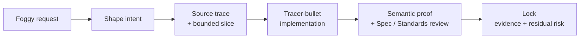

<h1 align="center">Programming Agent Skills</h1>

<p align="center"><strong>Give Codex the habits of a senior engineer: shape intent, work in bounded slices, prove behavior, and lock with evidence.</strong></p>

<p align="center">
  <a href="LICENSE"></a>
  
</p>

Programming Agent Skills is a Codex-first pack of small, composable engineering workflows. It keeps product commitments with the human, gives implementation technique to the agent, and puts evidence gates between "looks done" and done.

## How It Works



The diagram shows the common path, not a mandatory sequence. Each skill owns one engineering job, and `$skill-router` returns exactly one next skill or `none` when route choice is requested or an owner delegates terminal unowned residual work.

## Purpose

Fast agents fail in predictable ways. The pack turns those failure modes into explicit engineering controls:

| Common agent failure | Pack response |
| --- | --- |
| Vague or shifting scope | Source trace and bounded slice |
| Coding before intent is settled | Shape before build |
| Broad horizontal implementation | Tracer-bullet vertical slices |
| Output exists but its meaning is wrong | Semantic proof through a useful seam |
| Review trusts the agent's summary | Fixed-point Spec / Standards review |
| Work ends without durable state | Lock with evidence and residual risk |

The payoff is visible uncertainty, inspectable proof, and named residual risk before work is accepted.

## Setup

Choose one adoption path per repository:

| Full Skill Pack | Portable Contract |
| --- | --- |
| Composable workflows, routing, setup, trackers, and templates | Core engineering behavior in one `AGENTS.md` |
| Managed installation and upgrades | Manual copy and maintenance |
| Best for recurring, multi-session engineering work | Best for lightweight adoption |
| [Install the full pack](#full-skill-pack) | [Use the portable contract](AGENTS_PORTABLE_FALLBACK.md) |

Choose one engineering-contract owner per repository: either the full pack's installed `AGENTS.md` plus `docs/agents/*` surface, or the portable contract.

### Full Skill Pack

Requirements: Codex, Git, and Python 3.10 or newer. GitHub or GitLab authentication is optional; the pack can use a local Markdown tracker.

Codex reads global skills from `$HOME/.agents/skills` and global instructions from `$HOME/.codex/AGENTS.md`.

Bash:

```bash
git clone https://github.com/stevennitesh/programming-agent-skills.git
cd programming-agent-skills

python -m scripts.install_skills
python -m scripts.validate_skills --installed-root "$HOME/.agents/skills" --require-installed
```

PowerShell:

```powershell
git clone https://github.com/stevennitesh/programming-agent-skills.git
Set-Location programming-agent-skills

python -m scripts.install_skills
python -m scripts.validate_skills --installed-root "$HOME\.agents\skills" --require-installed
```

<details>
<summary><strong>What the installer manages</strong></summary>

The installer creates or updates only the global template's `## Skill Pack Bootstrap` section, migrates the legacy `## Skill Pack Guide` block, and preserves personal global instructions. It records pack-managed skills in `$HOME/.agents/skills/.programming-agent-skills-manifest.json`, so updates can retire old pack skills without touching unrelated personal skills.

Skill swaps, retirements, the manifest, and the global bootstrap commit as one transaction. One process lock excludes competing installs and recovery. The installer validates the complete managed manifest and refuses unsafe names, modified managed trees, or conflicting unmanaged paths before mutation. A failure restores the previous pack and removes the transaction snapshot. If rollback itself cannot finish, the installer preserves a named `.programming-agent-skills-transaction-*` recovery snapshot and refuses another install.

Run `python -m scripts.install_skills --recover-transaction <snapshot-path>` with the reported path. For nondefault targets, repeat the original `--skills-dir` and `--global-agents` values, or `--skip-global-agents`. Recovery binds the snapshot to those targets and refuses live content that matches neither the prior nor planned identity.

| Recovery status | Meaning | Next action |
| --- | --- | --- |
| `cleared-preparation` | No managed mutation began; preparation residue was removed. | Rerun the installer. |
| `restored` | An interrupted mutation was restored and verified. | Rerun the installer. |
| `cleared-commit` | The committed install was verified; only recovery residue remained. | No reinstall is needed. |

Claims are cleared while the snapshot still exists, and the snapshot is removed last.

Use `python -m scripts.install_skills --dry-run` to preview skill deltas and the global-bootstrap action. `skills/custom/` is the supported install set, `skills/extra/` is optional, and `skills/.archive/` is inactive.

</details>

### Portable Contract Only

No installer or Python runtime is required. Copy [`AGENTS_PORTABLE_FALLBACK.md`](AGENTS_PORTABLE_FALLBACK.md) into the target repository as `AGENTS.md`, then add verified repo commands, local invariants, and source-of-truth pointers.

The portable contract carries the convergence loop, commitment boundaries, shaping, semantic proof, TDD, parallel-safety, fixed-point review, and Lock. It intentionally omits skill routing, specialized workflow procedures, tracker and domain setup, templates, and managed updates.

## What's Included

- **Shape before building:** `$grilling`, `$grill-with-docs`, `$wayfinder`, `$to-questionnaire`, `$research`, `$prototype`, `$handoff`
- **Turn intent into delivery:** `$to-spec`, `$to-tickets`, `$triage`, `$implement`, `$parallel-implement`
- **Prove and protect behavior:** `$tdd`, `$diagnosing-bugs`, `$resolving-merge-conflicts`, `$review`, `$convergent-pr-review`, `$audit-codebase`
- **Improve code and design:** `$improve-codebase`, `$simplify-code`, `$codebase-design`, `$domain-modeling`
- **Route and maintain the pack:** `$repo-bootstrap`, `$skill-router`, `$writing-great-skills`

The small [`GLOBAL_AGENTS_TEMPLATE_SKILL_PACK.md`](GLOBAL_AGENTS_TEMPLATE_SKILL_PACK.md) bootstrap teaches Codex when to invoke the residual `$skill-router` or recommend `$repo-bootstrap`. Workflows stay with their skills, and personal global instructions stay local.

## Using The Full Pack

Start in each target repository with `$repo-bootstrap`. It inventories the repository, resolves tracker, label, and domain-layout choices, shows the exact proposed changes, waits for approval, then provisions and verifies the local setup surface. Run it again after pack upgrades to reconcile the required delta while preserving confirmed choices and repository-specific additions.

After setup, invoke a skill directly or let `$skill-router` carry the route map.

Representative routes:

- Fuzzy product idea needing durable decisions -> `$grill-with-docs` -> `$to-spec` -> `$to-tickets`
- External stakeholder knowledge gap -> `$to-questionnaire` -> human delivery and answer collection
- One bounded ready item -> `$implement`; one parent-backed ready ticket graph to finish -> `$parallel-implement`, serializing or parallelizing each frontier as needed
- Incoming issue or configured external PR -> `$triage`; ready-for-agent item -> `$implement`
- Multi-session fog of war -> `$wayfinder` until the map closes -> `$to-spec`, `$to-tickets`, or `$implement`
- Settled red-testable behavior -> `$tdd`; uncertain bug -> `$diagnosing-bugs`; the router owns the exact diagnosis/TDD boundary.
- Bloated or hard-to-change code with an uncertain best move -> `$improve-codebase` -> selected candidate -> `$simplify-code`, `$codebase-design`, or a delivery route
- Existing behavior in one bounded region -> `$simplify-code` for one proved reduction, a finite `until-clean` campaign, or a no-safe-cut verdict
- Ordinary diff -> `$review`; local PR or high-risk diff -> `$convergent-pr-review`
- Bounded correctness, domain-robustness, or performance audit of an immutable repository baseline -> `$audit-codebase`; structural deepening, consolidation, or simplification discovery -> `$improve-codebase`

These are examples. `$skill-router` owns the complete route map and tie-breakers.

## Philosophy

Build faster without making the repository harder to trust. Move quickly through reversible exploration; slow down at the gates that protect commitments, correctness, and trust.

- **Shape before build:** settle consequential intent before implementation.
- **Tracer bullets:** deliver observable vertical slices that keep proof close to each change.
- **Semantic proof:** prove that the result means the right thing; output existence alone is not correctness.
- **Fixed-point review:** judge the actual diff against Spec and Standards instead of trusting the agent's story.
- **Ubiquitous language:** preserve domain terms and decisions across code, tests, docs, tickets, and handoffs.
- **One owner:** skills own workflows, repository docs own local contracts, and supporting files own detailed mechanics.

## Engineering Contract

[`$repo-bootstrap`](skills/custom/repo-bootstrap/SKILL.md) installs a small `docs/agents/engineering-contract.md` in each target repository. The contract owns engineering taste, shared vocabulary, and cross-skill discipline while leaving implementation technique flexible.

The shared spine is `Explore -> Choose -> Prove -> Expand -> Simplify -> Lock`. Explore opens the solution space. Proof establishes one real tracer bullet. Expand covers requirements and improves the design with what the proof revealed. Simplify removes accidental complexity. **Lock** closes only with separate Spec / Standards review, evidence, and named residual risk.

For the same core behavior without installing skills, use [`AGENTS_PORTABLE_FALLBACK.md`](AGENTS_PORTABLE_FALLBACK.md) as a standalone repository-level `AGENTS.md`.

## Inspiration

This pack started with [Matt Pocock's engineering skills](https://github.com/mattpocock/skills), which showed how powerful small, named, composable workflows can be. This repository is a Codex-first adaptation shaped by practical multi-session work on real codebases.

It keeps the upstream emphasis on strong leading words, then extends it with repository-local contracts, tracker-backed delivery, long-running wayfinding, isolated parallel implementation, source-traced review, TDD, domain modeling, deep module design, architecture review, and careful conflict resolution.

## Repository Layout

- `skills/custom/`: active skills to install
- `skills/extra/`: optional extra skills
- `skills/.archive/`: inactive historical or experimental skills
- `GLOBAL_AGENTS_TEMPLATE_SKILL_PACK.md`: minimal global Codex bootstrap
- `AGENTS_PORTABLE_FALLBACK.md`: standalone repository-level engineering contract for use without installed skills
- `skills/custom/repo-bootstrap/`: target-repository setup workflow and contract templates
- `CONTEXT.md`: stable vocabulary and maintenance invariants for this repository
- `docs/synthesis/skill-context-relationships.md`: maintainer map for skill boundaries and context ownership
- `scripts/install_skills.py`: transactional managed installation and update that preserves unrelated skills
- `scripts/validate_skills.py`: integrity checks for the pack

## License

MIT licensed. See [LICENSE](LICENSE).
