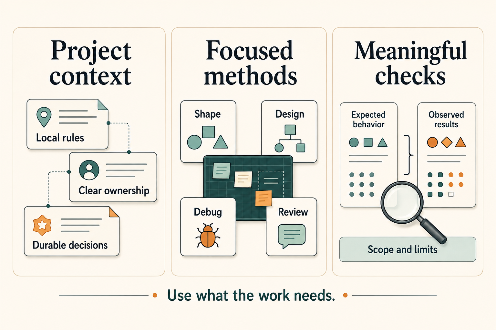
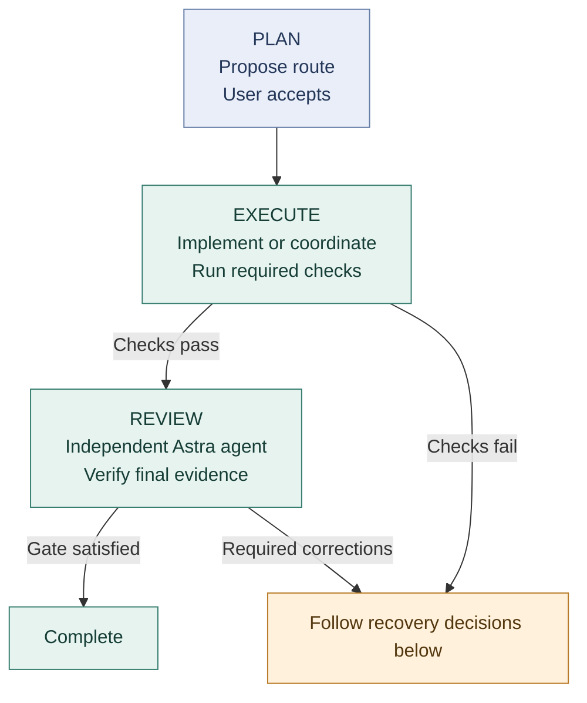
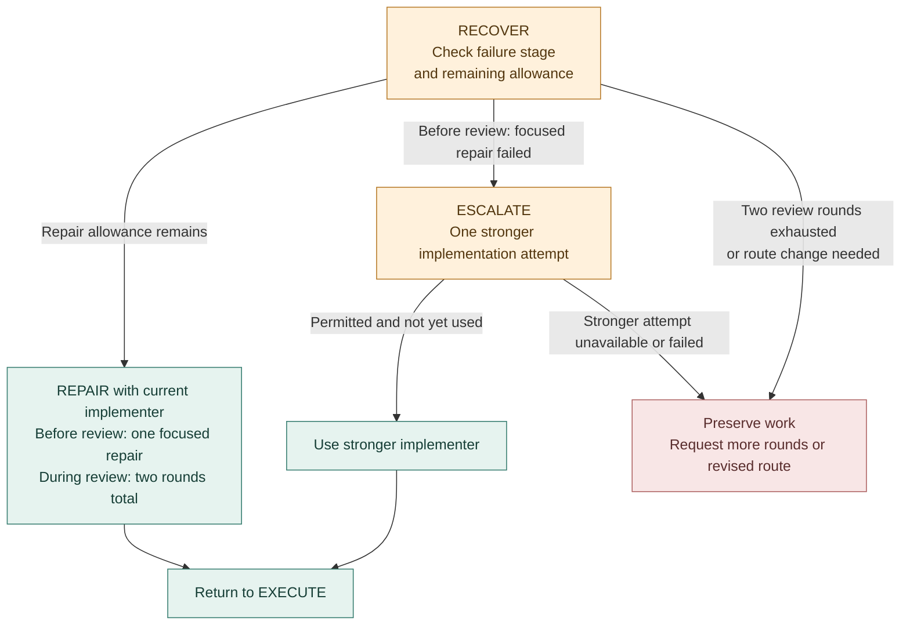

<h1 align="center">Programming Agent Skills</h1>

<p align="center"><strong>Give your coding agent the context and methods the work needs.</strong></p>

<p align="center">
  16 focused skills, built primarily for GPT 6 Astra in Codex.<br>
  Compatible with GPT 5.6 Sol. Ordinary coding stays direct.
</p>

<p align="center">
  
</p>

<p align="center">
  <a href="LICENSE"></a>
  
</p>

<p align="center">
  <a href="#find-the-right-skill">Find a skill</a> ·
  <a href="#in-practice-clearer-project-guidance">Real example</a> ·
  <a href="#cost-aware-coding">Cost-aware coding</a> ·
  <a href="#getting-started">Get started</a> ·
  <a href="docs/astra/design-brief.md">Read the design brief</a>
</p>

---

A capable coding agent still needs to know what matters in your project: which
behavior must stay intact, where a decision belongs, and what would prove a change
works. The **Astra skills pack** combines shared engineering guidance with focused
methods for planning, design, debugging, review, and delivery. Each skill is a
small package of instructions and, where useful, executable tools.

I built it around a practical question: **what guidance earns its place beyond
the model's baseline?** That means keeping useful context and methods, testing
assumptions, and removing instructions that add work without improving decisions.

<details>
<summary><strong>Which models is it for?</strong></summary>

The pack is tuned primarily for **GPT 6 Astra**, with **GPT 5.6 Sol compatibility**.
Sol can handle the everyday conversation in the optional cost-aware workflow, which assigns
substantive shaping and independent feature review to Astra.

Smaller models may benefit from the [custom skill pack](skills/custom/), which
contains more detailed instructions. The managed installer deploys only the Astra
skills pack. Model-specific comparisons remain limited.

</details>

## What using it looks like

Suppose an import job sometimes fails halfway through, and you want a safe retry.
After [installation](#getting-started), give Codex a concrete question:

```text
$shape-work Help me design retries for failed imports in this repo.
Some records may already have been saved. Clarify what can be retried safely,
what users should see, and how we will know the feature works.
```

A useful result settles what counts as the same import, how partial progress is
handled, and which outcomes acceptance checks must distinguish. Those decisions
give implementation something concrete to follow. The exact decisions depend on
your repository.

Once the behavior is settled, ask Codex to implement it directly. For other
starting points, [find the right skill](#find-the-right-skill) below.

## Find the right skill

Each `$name` is a skill you can invoke in Codex. **Request explicitly** means
Codex waits for a user request; **Automatic when relevant** means it can select
the skill when the task matches. You can also invoke those skills explicitly.
These are alternative starting points, not a required pipeline.

| Your task | Skill | Use |
| --- | --- | --- |
| Implement a clear, bounded change | **No skill needed**—ask Codex to implement and verify using repository guidance | Direct |
| Clarify a feature’s behavior and acceptance criteria | [$shape-work](skills/astra/shape-work/SKILL.md) | Request explicitly |
| Decide how a feature fits the existing system | [$codebase-design](skills/astra/codebase-design/SKILL.md) | Automatic when relevant |
| Test an uncertain approach with a runnable experiment | [$prototype](skills/astra/prototype/SKILL.md) | Automatic when relevant |
| Research a question or compare options using sources | [$research](skills/astra/research/SKILL.md) | Automatic when relevant |
| Find the root cause of a difficult bug | [$diagnosing-bugs](skills/astra/diagnosing-bugs/SKILL.md) | Automatic when relevant |
| Assess architecture and select worthwhile improvements | [$audit-codebase](skills/astra/audit-codebase/SKILL.md) | Request explicitly |
| Optimize a measurable outcome through experiments | [$hillclimb](skills/astra/hillclimb/SKILL.md) | Request explicitly |
| Review a code change for correctness and maintainability | [$change-review](skills/astra/change-review/SKILL.md) | Automatic when relevant |
| Turn an accepted plan or spec into tracked work units | [$to-tickets](skills/astra/to-tickets/SKILL.md) | Request explicitly |
| Implement concurrently with separate ownership and clear dependencies | [$parallel-implement](skills/astra/parallel-implement/SKILL.md) | Request explicitly |
| Agree on model allocation, then execute the accepted route | [$cost-aware-coding](skills/astra/cost-aware-coding/SKILL.md) | Request explicitly |
| Resolve an active Git merge or rebase conflict | [$resolving-merge-conflicts](skills/astra/resolving-merge-conflicts/SKILL.md) | Automatic when relevant |
| Set up or reconcile repository agent guidance | [$repo-bootstrap](skills/astra/repo-bootstrap/SKILL.md) | Request explicitly |
| Write agent instructions, guides, or continuation handoffs | [$writing-for-agents](skills/astra/writing-for-agents/SKILL.md) | Automatic when relevant |
| Audit persistent context and reconcile requested cleanup | [$context-hygiene](skills/astra/context-hygiene/SKILL.md) | Request explicitly |
| Create an interactive guide for a human-operated procedure | [$wizard](skills/astra/wizard/SKILL.md) | Request explicitly |

A review or audit alone does not authorize its proposed fixes. Repository setup
can inspect without changing files; request reconciliation when you want edits.

## In practice: clearer project guidance

We used context-hygiene while maintaining this repository. Older architecture
decision records (ADRs) still described retired skill routes, and an index notice
was not enough for someone opening those records directly.

| Before | What changed |
| --- | --- |
| Old ADRs retained historical status and route descriptions without explaining at the top which instructions still apply. | Added scope notices to 17 records and a new decision record explaining what still applies. |
| Domain guidance pointed readers toward ADR history broadly. | Narrowed the route to relevant decisions when rationale or applicability is needed. |
| A completed legacy plan remained under active plans. | Moved it to the archive and updated its links. |

See the [actual cleanup diff](https://github.com/stevennitesh/programming-agent-skills/commit/3f3df36a6befe6d9c221dbd3f2b9252ae34c3f14)
and the [follow-up scope notices](https://github.com/stevennitesh/programming-agent-skills/commit/daf9fd95755e653b632043cfbf9a4605bd7f5995).
The historical ADR bodies were preserved. This demonstrates the resulting
reconciliation, not a measured reduction in tokens or a controlled comparison
against an agent without the skill.

## Cost-aware coding

Different parts of a project can benefit from different models. The optional
[$cost-aware-coding](skills/astra/cost-aware-coding/SKILL.md) workflow helps make
that choice explicit while keeping useful work in the same context.

1. **Agree on the coordination plan.** Review the proposed responsibilities,
   models, dependencies, checks, and recovery options.
2. **Execute within the agreed boundaries.** The main conversation's agent
   (the root) implements or coordinates the work, reusing suitable specialists. Changes beyond the
   accepted boundaries return to you for acceptance.

```text
$cost-aware-coding propose a coordination plan for the accepted import-retry feature

I accept the coordination plan. Execute it using $cost-aware-coding.
```

Feature delivery includes an independent Astra review, even when the root is
Astra. The workflow aims to use models efficiently while preserving that review
requirement.

### Cost-aware feature delivery: who does what?

This flow shows feature delivery through `$cost-aware-coding`; shaping, design,
and review retain their own methods. Bounded fixes and edits do not automatically
acquire this independent-review gate.


```mermaid
flowchart TB
    Plan["PLAN<br/>Propose route<br/>User accepts"] --> Work["EXECUTE<br/>Implement or coordinate<br/>Run required checks"]
    Work -->|Checks pass|Review["REVIEW<br/>Independent Astra agent<br/>Verify final evidence"]
    Work -->|Checks fail|Recover["Follow recovery decisions below"]
    Review -->|Gate satisfied|Done["Complete"]
    Review -->|Required corrections|Recover
    classDef plan fill:#e9eef9,stroke:#657ca6,color:#243758
    classDef work fill:#e6f3ef,stroke:#377d70,color:#163e36
    classDef recovery fill:#fff1dc,stroke:#b77a28,color:#53370f
    class Plan plan
    class Work,Review,Done work
    class Recover recovery
```

**Recovery decisions.** Choose the applicable path within the accepted route.
The return endpoint resumes **EXECUTE** above, including checks and the same
reviewer's recheck when applicable.


```mermaid
flowchart TB
    Recovery["RECOVER<br/>Check failure stage<br/>and remaining allowance"]
    Recovery -->|Repair allowance remains|Repair["REPAIR with current implementer<br/>Before review: one focused repair<br/>During review: two rounds total"]
    Recovery -->|Before review: focused repair failed|Escalate["ESCALATE<br/>One stronger implementation attempt"]
    Escalate -->|Permitted and not yet used|Retry["Use stronger implementer"]
    Escalate -->|Stronger attempt unavailable or failed|Pause["Preserve work<br/>Request more rounds or revised route"]
    Recovery -->|Two review rounds exhausted<br/>or route change needed|Pause
    classDef work fill:#e6f3ef,stroke:#377d70,color:#163e36
    classDef recovery fill:#fff1dc,stroke:#b77a28,color:#53370f
    Repair --> Resume["Return to EXECUTE"]
    Retry --> Resume
    class Repair,Retry,Resume work
    classDef pause fill:#f8e6e6,stroke:#ad6262,color:#592d2d
    class Recovery,Escalate recovery
    class Pause pause
```

Use `shape-work` for substantial unresolved feature decisions before accepting
coordination. Apply any agreed root-model change before execution; a previously
accepted route can enter execution directly when requested. The root may reuse
suitable agents and adapt scheduling within that route. Concurrent writing uses
`parallel-implement` when requested.

Implementation recovery is counted per work unit. The integrated candidate has
two review-repair rounds total. Each round includes a correction batch, acceptance
checks, and—if checks pass—the same reviewer's recheck. Failed acceptance still
uses that round; individual test runs do not count as separate rounds.
The independent reviewer uses `change-review` for the initial review and any
follow-up review of repairs. Implementers run acceptance checks before returning
the candidate to that reviewer. See the
[cost-aware skill](skills/astra/cost-aware-coding/SKILL.md) for exact rules.
Completion does not itself authorize committing, pushing, or deployment.

<details>
<summary><strong>Model policy and evidence limits</strong></summary>

The current [model policy](skills/astra/cost-aware-coding/references/model-policy.md)
uses Sol Medium for everyday implementation, Astra Medium for substantive planning,
difficult work and review, and Luna Max for suitable mechanical tasks. Astra XHigh
requires an explicit choice. These are experimental starting points, not proven
task-by-task winners; actual routing depends on the host's available controls.

A bounded, read-only helper can capture logged model settings and usage counters.
It reuses available evidence and reports missing coverage; it does not establish
billing totals or prove savings. The aim is lower execution cost **within the
chosen review and quality requirements**, with comparative savings still to be measured.

</details>

<a id="install"></a>

## Getting started

You'll need [Codex](https://github.com/openai/codex), Git, and Python 3.11 or newer.
The installer uses only Python's standard library.

Clone the repository, preview the changes, then install:

```sh
git clone https://github.com/stevennitesh/programming-agent-skills.git
cd programming-agent-skills

python -m scripts.install_skills --dry-run
python -m scripts.install_skills
```

On macOS/Linux, use `python3` if needed.

The installer deploys the Astra skills pack to `$HOME/.agents/skills` and manages a small
bootstrap section in `$HOME/.codex/AGENTS.md`. It preserves unrelated skills
and personal instructions, and stops if managed skills contain local edits or
an unmanaged folder has the same name. Add `--skip-global-agents` to leave
global instructions untouched.

To update, pull this repository and repeat the preview and install commands.
See [installation and recovery](INSTALLATION.md) for migration from the older
pack, custom locations, and verification.

**Prefer to start with just the principles?** Adapt the
[portable engineering guidance](AGENTS_PORTABLE_FALLBACK.md) into your global
`AGENTS.md`, preserving your existing preferences. It needs no installer and
leaves out the specialized skills and managed updates.

## The engineering philosophy

> Explore imaginatively. Converge under proof. Simplify ruthlessly.

- **Understand before changing.** Read the existing code, follow its callers,
  and identify the behavior people rely on.
- **Build what the problem needs.** Prefer a clear, small design. Reuse what
  fits, and add abstractions when they earn their place.
- **Check the result that matters.** Use tests and experiments that can expose
  a real failure. More tests do not automatically mean stronger evidence.
- **Leave useful context.** Preserve decisions, reasons, and local conventions
  so future contributors can continue the work confidently.

These principles live in the
[engineering contract](skills/astra/repo-bootstrap/templates/engineering-contract.md).
Repository setup adapts that guidance to a project's own conventions. The skills
add specialized methods where the task benefits from them.

## How the pack is developed

The Astra skills pack is being refined through source comparisons, critical reviews, and
focused workflow tests. The repository includes executable helpers and tests
for installation, architecture reports, parallel worktree management, and bounded
session-metadata capture.

Those checks establish specific behavior. Whether the pack improves coding
quality over an agent's default capabilities needs broader comparative
validation; the comparisons so far are limited. The
[design brief](docs/astra/design-brief.md), shaped by
[issue #94](https://github.com/stevennitesh/programming-agent-skills/issues/94),
records the decisions, evidence, and open questions behind the current pack.

## Influences and contributions

This project began with
[Matt Pocock's skills](https://github.com/mattpocock/skills) and draws on ideas
from [pstack](https://github.com/cursor/plugins/tree/main/pstack),
[Ponytail](https://github.com/DietrichGebert/ponytail), and
[Superpowers](https://github.com/obra/superpowers). Their approaches to focused
workflows, simple design, and disciplined engineering helped shape this pack.
See [Acknowledgments](ACKNOWLEDGMENTS.md) for more.

If you're exploring the implementation or contributing a change, start with
[the Astra skills pack source](skills/astra/), [repository context](CONTEXT.md), and
[contributor instructions](AGENTS.md). Earlier research remains available as historical evidence.

---

[MIT License](LICENSE)
