# Skill Context Relationships

Purpose: map context owners, pointers, and cross-skill pressure so skill edits do not duplicate setup docs or creep across workflow boundaries.

Scope: `skills/custom/**` markdown files, their direct supporting files, `README.md`, and `GLOBAL_AGENTS_TEMPLATE_SKILL_PACK.md`.

This is a design-analysis map, not the runtime invocation graph. Edges show ownership pressure, vocabulary influence, setup dependencies, and possible boundary creep. A graph edge does not mean a skill should invoke another skill.

Use this map to prune direct skill-handle references. Upstream means an earlier skill or doc already provides a context pointer to the owning material. A pointer is not loaded context unless its wording tells the agent to read, load, or follow it for the current branch. Keep a skill handle when no upstream read/load pointer covers the target behavior and the current skill needs a real skill boundary: recommend an explicit-only workflow, invoke or load an implicit skill, or cross a commitment boundary. When the behavior or vocabulary is already loaded through upstream wording, replace the handle with leading words.

Edge labels are descriptive, not executable. Solid edges usually mark ownership or direct workflow pressure; dotted edges usually mark conditional pressure, vocabulary influence, or escalation risk.

## Design-Pressure Map

```mermaid
flowchart TD
  GlobalTemplate["GLOBAL_AGENTS_TEMPLATE_SKILL_PACK<br/>global bootstrap template"] --> Router["skill-router<br/>router skill"]
  GlobalTemplate --> Setup["repo-bootstrap"]

  Router --> Setup["repo-bootstrap"]
  Setup --> AgentDocs["repo-local setup surface<br/>AGENTS.md + docs/agents/*"]
  AgentDocs --> Tracker["issue-tracker.md"]
  AgentDocs --> Labels["triage-labels.md"]
  AgentDocs --> DomainRouter["domain.md"]
  AgentDocs --> Contract["engineering-contract.md"]

  DomainRouter --> Context["CONTEXT.md / CONTEXT-MAP.md"]
  DomainRouter --> ADRs["docs/adr/"]
  DomainModel["domain-modeling"] --> Context
  DomainModel --> ADRs

  Router --> Shape["grilling / grill-with-docs / wayfinder / prototype"]
  Router --> Handoff["handoff"]
  GrillDocs["grill-with-docs"] --> Grilling["grilling"]
  GrillDocs --> DomainModel
  Wayfinder["wayfinder"] --> Tracker
  Wayfinder --> Labels
  Wayfinder --> GrillDocs
  Wayfinder --> Prototype["prototype"]
  Wayfinder --> Research["research"]
  Prototype -. "verdict crosses sessions" .-> Handoff["handoff"]
  Prototype -. "resolved domain delta" .-> DomainModel
  Prototype -. "promotion or production proof" .-> Contract

  Shape --> ToSpec["to-spec"]
  ToSpec --> DomainRouter
  ToSpec --> CodeDesign
  ToSpec --> TmpSpec[".tmp/to-spec/*.md<br/>draft until publication is verified"]
  ToSpec --> Tracker
  ToSpec --> Labels
  ToSpec --> ToTickets["to-tickets"]
  ToTickets --> Tracker
  ToTickets --> Labels
  ToTickets --> Ready["ready-for-agent items"]

  Triage["triage"] --> Tracker
  Triage --> Labels
  Triage --> DomainRouter
  Triage --> TriageFlows["ATTENTION-SCAN / SPECIFIC-ITEM / QUICK-OVERRIDE<br/>branch procedures"]
  Triage --> AgentBrief["AGENT-BRIEF.md"]
  Triage --> OutOfScope["OUT-OF-SCOPE.md / .out-of-scope/"]
  Triage --> Ready
  Triage -. "needs fleshing out" .-> GrillDocs
  Tracker -. "ready contract" .-> Triage

  Ready --> Implement["implement"]
  Ready --> Parallel["parallel-implement"]
  Implement --> Contract
  Implement --> Review["review"]
  Implement -. "local PR / high risk" .-> CPR
  Implement --> Tracker
  Implement -. "unsettled work" .-> Shape
  Parallel --> Contract
  Parallel --> Tracker
  Parallel --> DomainRouter
  Parallel --> WorkerBrief["WORKER-BRIEF.md<br/>lane worker contract"]
  Parallel --> IntegratorBrief["INTEGRATOR-BRIEF.md"]
  Parallel --> Ledger["RUN-LEDGER.md / .tmp/parallel-implement/"]
  Parallel --> Review
  Parallel -. "approved high risk only" .-> CPR["convergent-pr-review"]
  WorkerBrief --> TDD
  IntegratorBrief --> Review
  IntegratorBrief -. "ledger-approved only" .-> CPR
  Review --> Tracker
  Review --> Contract
  Review --> SpecSources["spec / acceptance / source material"]
  Review --> StandardsSources["repo standards / configs / test docs"]
  Review -. "local PR / high risk" .-> CPR
  CPR --> Contract
  CPR --> SpecSources
  CPR --> StandardsSources

  Research --> ResearchDocs["docs/research/*"]
  Conflict["resolving-merge-conflicts"] --> Contract
  Conflict --> SpecSources
  Conflict --> StandardsSources

  TDD["tdd"] --> Contract
  TDD --> DomainRouter
  Debug["diagnosing-bugs"] --> Contract
  Debug --> DomainRouter
  Debug -. "architecture cause" .-> Arch["improve-codebase-architecture"]
  Arch --> Contract
  Arch --> DomainRouter
  Arch --> GrillDocs
  Arch --> CodeDesign["codebase-design"]
  Arch -. "external evidence gap" .-> Research
  Arch --> HtmlReport["HTML-REPORT.md / .tmp/architecture-reviews/"]
  Arch --> Implement
  Arch --> ToTickets
  Arch --> ToSpec

  TDD --> TddRefs["tests.md / mocking.md / refactoring.md"]
  TddRefs -. "uncertain repro" .-> Debug
  TddRefs -. "larger design follow-up" .-> CodeDesign
  TddRefs -. "larger design follow-up" .-> Arch
  CodeDesign --> DirectDesign["DIRECT-DESIGN.md"]
  DirectDesign --> DesignRefs["DEEPENING.md / DESIGN-IT-TWICE.md"]
  CodeDesign -. "wide scan" .-> Arch
  Writing["writing-great-skills"] --> Glossary["GLOSSARY.md"]
```

## Invocation Map

Source: `skills/custom/*/agents/openai.yaml`.

| Skill | Invocation |
| --- | --- |
| `codebase-design` | implicitly invocable |
| `convergent-pr-review` | implicitly invocable |
| `diagnosing-bugs` | implicitly invocable |
| `domain-modeling` | implicitly invocable |
| `grilling` | implicitly invocable |
| `grill-with-docs` | implicitly invocable |
| `handoff` | explicit-only |
| `implement` | explicit-only |
| `improve-codebase-architecture` | explicit-only |
| `parallel-implement` | explicit-only |
| `prototype` | implicitly invocable |
| `repo-bootstrap` | explicit-only |
| `research` | implicitly invocable |
| `resolving-merge-conflicts` | implicitly invocable |
| `review` | implicitly invocable |
| `skill-router` | explicit-only |
| `tdd` | implicitly invocable |
| `to-tickets` | explicit-only |
| `to-spec` | explicit-only |
| `triage` | explicit-only |
| `wayfinder` | explicit-only |
| `writing-great-skills` | implicitly invocable |

## Context Owners

| Owner | Owns | Read by / pointed to |
| --- | --- | --- |
| `README.md` | Human-facing overview and installation | Humans installing or learning the pack |
| `GLOBAL_AGENTS_TEMPLATE_SKILL_PACK.md` | Minimal pack-owned global Codex bootstrap template: explicit-only router/setup discovery | `~/.codex/AGENTS.md` |
| `skill-router` | Current executable route map and tie-breakers | Humans or agents choosing one next route |
| `repo-bootstrap` | Provisions and verifies the repo setup surface | `skill-router`, setup gates in planning/tracker skills |
| `docs/agents/issue-tracker.md` | Tracker interface, work-item lifecycle, PR-as-request rules, and wayfinding operations | `to-spec`, `to-tickets`, `triage`, `implement`, `parallel-implement`, `review`, `wayfinder` |
| `docs/agents/triage-labels.md` | Category/state role to label mapping and fixed wayfinding labels | `to-spec`, `to-tickets`, `triage`, `implement`, `parallel-implement`, `wayfinder` |
| `docs/agents/domain.md` | Routing to `CONTEXT.md`, `CONTEXT-MAP.md`, ADRs | `to-spec`, `triage`, `tdd`, `diagnosing-bugs`, `improve-codebase-architecture`, `parallel-implement` |
| `docs/agents/engineering-contract.md` | Shared runtime engineering language, repo-owned commands, commitment boundary, semantic proof, work-state policy, fixed-point Spec/Standards review, and Lock | `implement`, `tdd`, `diagnosing-bugs`, `prototype`, `improve-codebase-architecture`, `parallel-implement`, `review`, `convergent-pr-review` |
| `domain-modeling` | Mutates `CONTEXT.md`, `CONTEXT-MAP.md`, and ADR truth | `skill-router`, `grill-with-docs`, `wayfinder`, `prototype`, `repo-bootstrap` |
| `codebase-design` | Interface, seam, adapter, depth, leverage, and locality vocabulary | `to-spec`, `improve-codebase-architecture`, `tdd`, architecture/design follow-ups |
| `research` | Primary-source legwork and authorized cited repo-local research notes | `wayfinder`, `to-spec`, `to-tickets`, `improve-codebase-architecture` |
| `resolving-merge-conflicts` | Source-traced Git conflict resolution | Git operations, `review`, `parallel-implement`, integration work |
| `review` | Ordinary fixed-point Standards/Spec review | `implement`, `parallel-implement`; escalates to `convergent-pr-review` for high risk |

## Supporting Files

| Skill | Supporting files own |
| --- | --- |
| `writing-great-skills` | `GLOSSARY.md`: skill-authoring vocabulary |
| `codebase-design` | `DIRECT-DESIGN.md`: direct pass and packet; `DEEPENING.md`: dependency/seam discipline; `DESIGN-IT-TWICE.md`: alternative interface exploration |
| `domain-modeling` | `CONTEXT-FORMAT.md`: glossary and context-map format; `ADR-FORMAT.md`: ADR gate and format |
| `tdd` | `tests.md`, `mocking.md`, `refactoring.md`: examples and branch mechanics |
| `diagnosing-bugs` | `scripts/hitl-loop.template.sh`: structured HITL fallback |
| `prototype` | `LOGIC.md`, `UI.md`: branch mechanics; `SKILL.md` owns lifecycle and boundary |
| `triage` | `ATTENTION-SCAN.md`, `SPECIFIC-ITEM.md`, `QUICK-OVERRIDE.md`: branch procedures; `AGENT-BRIEF.md`: ready-contract rendering; `AGENT-BRIEF-EXAMPLES.md`: examples; `OUT-OF-SCOPE.md`: rejected-work knowledge base |
| `repo-bootstrap` | Tracker, label, domain, and engineering-contract seeds; `setup-schema.json`: compatibility fingerprint; `scripts/validate_setup.py`: target-repo setup-surface validation |
| `wayfinder` | `MAP-FORMAT.md`: map and ticket body shape; `SKILL.md`: foggy map lifecycle and semantics |
| `research` | One cited repo-local Markdown note per source question |
| `resolving-merge-conflicts` | Merge/rebase/cherry-pick conflict process and finish boundary |
| `review`, `convergent-pr-review` | `review/SMELL-BASELINE.md`: fallback Standards reference when repo standards are thin |
| `improve-codebase-architecture` | `HTML-REPORT.md`: report format and visual style |
| `parallel-implement` | `WORKER-BRIEF.md`, `INTEGRATOR-BRIEF.md`, `RUN-LEDGER.md`: lane contracts and run ledger |

## Boundary Notes

- The global template exposes bootstrap handles; `skill-router` routes; neither teaches downstream workflow procedures.
- Setup docs own tracker, labels, domain routing, and engineering-contract details. Skills should point there instead of restating those mechanics.
- `$grill-with-docs` is the sole composer of `$grilling` and `$domain-modeling`; the owned skills do not route or invoke each other.
- `domain-modeling` is the only skill that writes `CONTEXT.md`, `CONTEXT-MAP.md`, or ADR truth; `repo-bootstrap` configures the layout, and vocabulary consumers follow `docs/agents/domain.md`.
- `to-spec` owns parent spec synthesis and tracker publication; `to-tickets` owns implementation issue slicing.
- `wayfinder` owns foggy multi-session maps; tracker docs own the transport mechanics for maps, child tickets, blocking, claiming, and resolution.
- `research` owns primary-source legwork and one cited repo-local note. A user request or caller packet must authorize one note path before that tracked mutation; otherwise research returns cited inline evidence or a blocker.
- `resolving-merge-conflicts` owns Git conflict resolution; it may resolve files but should not abort, discard sides, commit, or continue a rebase unless explicitly approved or requested.
- Tracker docs own transport, tracker commands, the shared Ready-for-agent contract, and Mutation read-back. `triage` owns incoming classification, verification, brief rendering, state transitions, and the AI disclaimer; `$to-tickets` owns slicing and dependency order. Do not re-triage valid `$to-tickets` output.
- `implement` owns one selected item; `parallel-implement` owns batch orchestration and serialized integration.
- `review` is the ordinary closeout gate; `convergent-pr-review` is an approved high-risk/local-PR route, not default review.
- `convergent-pr-review` may run its own read-only reviewer passes only when selected as the review route; it is not a second implementation orchestrator.
- `handoff` carries pointers across sessions; it should reference durable artifacts, not duplicate specs, issues, ADRs, commits, or diffs.
- `.tmp/` artifacts are disposable unless a skill explicitly preserves them for the user or next session.
- `.scratch/` artifacts are durable, version-controlled local state; include in-scope changes in review and staging.
