# Skill Context Relationships

Purpose: map context owners, pointers, and cross-skill pressure so skill edits do not duplicate setup docs or creep across workflow boundaries.

Scope: `skills/custom/**` markdown files, their direct supporting files, `README.md`, and `GLOBAL_AGENTS_TEMPLATE_SKILL_PACK.md`.

This is a design-analysis map, not the runtime invocation graph. Edges show ownership pressure, vocabulary influence, setup dependencies, and possible boundary creep. A graph edge does not mean a skill should invoke another skill.

Use this map to prune direct skill-handle references. Upstream means an earlier skill or doc already provides a context pointer to the owning material. A pointer is not loaded context unless its wording tells the agent to read, load, or follow it for the current branch. Keep a skill handle when no upstream read/load pointer covers the target behavior and the current skill needs a real skill boundary: recommend an explicit-only workflow, invoke or load an implicit skill, or cross a commitment boundary. When the behavior or vocabulary is already loaded through upstream wording, replace the handle with leading words.

Edge labels are descriptive, not executable. Solid edges usually mark ownership or direct workflow pressure; dotted edges usually mark conditional pressure, vocabulary influence, or escalation risk.

## Design-Pressure Map

```mermaid
flowchart TD
  GlobalTemplate["GLOBAL_AGENTS_TEMPLATE_SKILL_PACK<br/>global bootstrap template"] --> Router["skill-router<br/>router skill"]
  GlobalTemplate --> Setup["repo-bootstrap"]

  Router --> Setup["repo-bootstrap"]
  Setup --> AgentDocs["repo-local setup surface<br/>AGENTS.md + docs/agents/*"]
  AgentDocs --> Tracker["issue-tracker.md"]
  AgentDocs --> Labels["triage-labels.md"]
  AgentDocs --> DomainRouter["domain.md"]
  AgentDocs --> Contract["engineering-contract.md"]

  DomainRouter --> Context["CONTEXT.md / CONTEXT-MAP.md"]
  DomainRouter --> ADRs["docs/adr/"]
  DomainModel["domain-modeling"] --> Context
  DomainModel --> ADRs

  Router --> Shape["grilling / grill-with-docs / wayfinder / prototype"]
  Router --> Handoff["handoff"]
  GrillDocs["grill-with-docs"] --> Grilling["grilling"]
  GrillDocs --> DomainModel
  Wayfinder["wayfinder"] --> Tracker
  Wayfinder --> Labels
  Wayfinder -. "setup gate" .-> Setup
  Wayfinder --> GrillDocs
  Wayfinder --> Prototype["prototype"]
  Wayfinder --> Research["research"]
  Prototype -. "verdict crosses sessions" .-> Handoff["handoff"]
  Prototype -. "resolved domain delta" .-> DomainModel
  Prototype -. "promotion or production proof" .-> Contract

  Shape --> ToSpec["to-spec"]
  ToSpec --> DomainRouter
  ToSpec --> CodeDesign
  ToSpec --> TmpSpec[".tmp/to-spec/*.md<br/>draft until publication is verified"]
  ToSpec --> Tracker
  ToSpec --> Labels
  ToSpec --> ToTickets["to-tickets"]
  ToSpec -. "setup gate" .-> Setup
  ToTickets --> Tracker
  ToTickets --> Labels
  ToTickets --> Ready["ready-for-agent items"]
  ToTickets -. "setup gate" .-> Setup

  Triage["triage"] --> Tracker
  Triage --> Labels
  Triage --> DomainRouter
  Triage -. "setup gate" .-> Setup
  Triage --> TriageFlows["ATTENTION-SCAN / SPECIFIC-ITEM / QUICK-OVERRIDE<br/>branch procedures"]
  Triage --> AgentBrief["AGENT-BRIEF.md"]
  Triage --> OutOfScope["OUT-OF-SCOPE.md / .out-of-scope/"]
  Triage --> Ready
  Triage -. "needs fleshing out" .-> GrillDocs
  Tracker -. "ready contract" .-> Triage

  Ready --> Implement["implement"]
  Ready --> Parallel["parallel-implement"]
  Implement --> Contract
  Implement --> Review["review"]
  Implement -. "local PR / high risk" .-> CPR
  Implement --> Tracker
  Implement -. "unsettled work" .-> Shape
  Implement -. "unsliced source" .-> ToTickets
  Parallel --> Contract
  Parallel --> Tracker
  Parallel --> DomainRouter
  Parallel --> WorkerBrief["WORKER-BRIEF.md<br/>lane worker contract"]
  Parallel --> IntegratorBrief["INTEGRATOR-BRIEF.md"]
  Parallel --> Ledger["RUN-LEDGER.md / .tmp/parallel-implement/"]
  Parallel --> Review
  Parallel -. "approved high risk only" .-> CPR["convergent-pr-review"]
  Parallel -. "conflicted landing" .-> Conflict
  WorkerBrief --> TDD
  WorkerBrief --> Debug
  Review --> Tracker
  Review --> Contract
  Review --> SpecSources["spec / acceptance / source material"]
  Review --> StandardsSources["repo standards / configs / test docs"]
  Review -. "local PR / high risk" .-> CPR
  CPR --> Contract
  CPR --> SpecSources
  CPR --> StandardsSources

  Research --> ResearchDocs["docs/research/*"]
  Conflict["resolving-merge-conflicts"] --> Contract
  Conflict --> SpecSources
  Conflict --> StandardsSources

  TDD["tdd"] --> Contract
  TDD --> DomainRouter
  Debug["diagnosing-bugs"] --> Contract
  Debug --> DomainRouter
  Conflict -. "uncertain post-resolution failure" .-> Debug
  Arch["improve-codebase-architecture"] --> Contract
  Arch --> DomainRouter
  Arch --> GrillDocs
  Arch --> CodeDesign["codebase-design"]
  Arch -. "external evidence gap" .-> Research
  Arch --> HtmlReport["HTML-REPORT.md / .tmp/architecture-reviews/"]
  Arch --> Implement
  Arch --> ToTickets
  Arch --> ToSpec
  Arch -. "setup gate" .-> Setup

  Handoff -. "setup gate" .-> Setup

  TDD --> TddRefs["tests.md / mocking.md / refactoring.md"]
  TddRefs -. "uncertain repro" .-> Debug
  TddRefs -. "larger design follow-up" .-> CodeDesign
  TddRefs -. "larger design follow-up" .-> Arch
  CodeDesign --> DirectDesign["DIRECT-DESIGN.md"]
  DirectDesign --> DesignRefs["DEEPENING.md / DESIGN-IT-TWICE.md"]
  CodeDesign -. "wide scan" .-> Arch
  Writing["writing-great-skills"] --> Glossary["GLOSSARY.md"]
```

## Invocation Map

Source: `skills/custom/*/agents/openai.yaml`.

| Skill | Invocation |
| --- | --- |
| `codebase-design` | implicitly invocable |
| `convergent-pr-review` | implicitly invocable |
| `diagnosing-bugs` | implicitly invocable |
| `domain-modeling` | implicitly invocable |
| `grilling` | implicitly invocable |
| `grill-with-docs` | implicitly invocable |
| `handoff` | explicit-only |
| `implement` | explicit-only |
| `improve-codebase-architecture` | explicit-only |
| `parallel-implement` | explicit-only |
| `prototype` | implicitly invocable |
| `repo-bootstrap` | explicit-only |
| `research` | implicitly invocable |
| `resolving-merge-conflicts` | implicitly invocable |
| `review` | implicitly invocable |
| `skill-router` | explicit-only |
| `tdd` | implicitly invocable |
| `to-tickets` | explicit-only |
| `to-spec` | explicit-only |
| `triage` | explicit-only |
| `wayfinder` | explicit-only |
| `writing-great-skills` | implicitly invocable |

## Runtime Composition

Use one verb for each executable relationship:

- **Load `<skill>`:** apply its shared reference or discipline inside the caller. The caller keeps output, mutation, and completion ownership.
- **Invoke `<skill>`:** run the callee through its own gates, return its packet, then resume the caller.
- **Compose `<skill>`:** keep the callee active under one named composer. Each skill retains its owned gates and mutations; the composer owns the combined exit.
- **Hand off to `<skill>`:** stop the current skill and transfer ownership with the available Source Trace or packet.
- **Recommend `<skill>` and stop:** return one next route without executing it. The user or receiving caller starts it.

`Load`, `Invoke`, `Compose`, and `Hand off` target implicitly invocable skills. An explicit-only target is reached through `Recommend and stop` so human selection remains authoritative.

| Caller | Verb | Callee | Condition and return |
| --- | --- | --- | --- |
| `grill-with-docs` | Compose | `$grilling` | Run the one-decision-at-a-time interview; return its exit packet through the composer. |
| `grill-with-docs` | Compose | `$domain-modeling` | Keep durable domain capture active under its own write and ADR gates. |
| `grilling` | Recommend and stop | `$research` | A source evidence gap needs one cited note. |
| `grilling` | Recommend and stop | `$prototype` | A design evidence gap needs a runnable verdict. |
| `grilling` | Recommend and stop | `$handoff` | Evidence work must cross into a fresh session. |
| `wayfinder` | Invoke | `$research` | Resolve one AFK research ticket, then record its pointer. |
| `wayfinder` | Invoke | `$prototype` | Resolve one runnable prototype ticket, then capture its verdict. |
| `wayfinder` | Invoke | `$grill-with-docs` | Resolve one HITL decision ticket or the bounded Chart interview. |
| `wayfinder` | Recommend and stop | `$domain-modeling` | A closing decision changes durable language or warrants an ADR offer. |
| `wayfinder` | Recommend and stop | `$to-spec` | The closed map produced settled parent-spec source. |
| `wayfinder` | Recommend and stop | `$to-tickets` | The closed map produced several settled implementation slices. |
| `wayfinder` | Recommend and stop | `$implement` | The closed map produced exactly one ready slice. |
| `wayfinder` | Recommend and stop | `$repo-bootstrap` | A required setup surface is missing or incompatible. |
| `to-spec` | Load | `$codebase-design` | Apply deep-module vocabulary while the spec remains authoritative. |
| `to-spec` | Recommend and stop | `$to-tickets` | The verified parent spec is ready for implementation slicing. |
| `to-spec` | Recommend and stop | `$repo-bootstrap` | A required setup surface is missing or incompatible. |
| `to-tickets` | Recommend and stop | `$implement` | The ready frontier is singular or write-overlapping. |
| `to-tickets` | Recommend and stop | `$parallel-implement` | At least two ready items have independent write scopes and proof lanes. |
| `to-tickets` | Recommend and stop | `$repo-bootstrap` | A required setup surface is missing or incompatible. |
| `triage` | Invoke | `$grill-with-docs` | Maintainer-owned shaping is required before the triage recommendation. |
| `triage` | Recommend and stop | `$repo-bootstrap` | A required setup surface is missing or incompatible. |
| `implement` | Invoke | `$tdd` | New behavior is settled and red-testable, or expected behavior, the exact symptom, the cause, and a trusted red-capable reproduction are known. |
| `implement` | Invoke | `$diagnosing-bugs` | A bug's exact symptom, cause, or trusted red-capable reproduction is uncertain; return after regression proof. |
| `implement` | Invoke | `$review` | The selected diff needs ordinary fixed-point review. |
| `implement` | Invoke | `$convergent-pr-review` | The selected diff is a local PR or matches a high-risk trigger. |
| `implement` | Recommend and stop | `$to-tickets` | The supplied source contains multiple or unsliced implementation items. |
| `implement` | Recommend and stop | `$repo-bootstrap` | A required setup surface is missing or incompatible. |
| `parallel-implement` | Invoke | `$tdd` | A lane worker has red-testable new behavior, or a bug whose expected behavior, exact symptom, cause, and trusted red-capable reproduction are known. |
| `parallel-implement` | Invoke | `$diagnosing-bugs` | A lane worker's bug has uncertain expected behavior, exact symptom, cause, or trusted red-capable reproduction; return to the same lane worker. |
| `parallel-implement` | Invoke | `$review` | The integrated closeout target needs ordinary review. |
| `parallel-implement` | Invoke | `$convergent-pr-review` | The integrated closeout target matches a high-risk trigger. |
| `parallel-implement` | Invoke | `$resolving-merge-conflicts` | A routed landing enters conflicted or partially applied Git state; resume only from the resolver's verified and authorized return state. |
| `parallel-implement` | Recommend and stop | `$implement` | The ready set downshifts to one serial item. |
| `parallel-implement` | Recommend and stop | `$repo-bootstrap` | A required setup surface is missing or incompatible. |
| `tdd` | Hand off | `$diagnosing-bugs` | A bug's expected behavior, exact symptom, cause, or trusted red-capable reproduction is uncertain. |
| `tdd` | Hand off | `$prototype` | The question is design evidence rather than production proof. |
| `tdd` | Recommend and stop | `$codebase-design` | A GREEN refactor exposes one bounded interface or seam question outside the slice. |
| `tdd` | Recommend and stop | `$improve-codebase-architecture` | A GREEN refactor exposes a wide candidate-finding survey outside the slice. |
| `diagnosing-bugs` | Hand off | `$tdd` | Only when expected behavior, the exact symptom, the cause, and a trusted red-capable reproduction are known before Trace; retain the original caller. |
| `diagnosing-bugs` | Recommend and stop | `$implement` | Standalone diagnosis proved the cause and needs an implementation owner. |
| `resolving-merge-conflicts` | Invoke | `$diagnosing-bugs` | Diagnose an uncertain proof failure, return the causal packet, then resume Prove. |
| `review` | Hand off | `$convergent-pr-review` | The target is a local PR or needs independent high-risk review. |
| `convergent-pr-review` | Hand off | `$review` | The target is an ordinary fixed-point review. |
| `improve-codebase-architecture` | Load | `$codebase-design` | Apply shared architecture vocabulary during the wide survey. |
| `improve-codebase-architecture` | Invoke | `$research` | An approved tracked note must close an external evidence gap. |
| `improve-codebase-architecture` | Invoke | `$grill-with-docs` | Pressure-test the selected candidate and capture domain changes. |
| `improve-codebase-architecture` | Invoke | `$codebase-design` | The chosen candidate needs dependency, seam, or interface design. |
| `improve-codebase-architecture` | Recommend and stop | `$implement` | The confirmed candidate is one ready slice. |
| `improve-codebase-architecture` | Recommend and stop | `$to-tickets` | The confirmed candidate needs dependency-ordered slices. |
| `improve-codebase-architecture` | Recommend and stop | `$to-spec` | The confirmed candidate still needs a durable parent spec. |
| `improve-codebase-architecture` | Recommend and stop | `$repo-bootstrap` | A required setup surface is missing or incompatible. |
| `prototype` | Recommend and stop | `$handoff` | An awaiting verdict must cross sessions. |
| `prototype` | Recommend and stop | `$domain-modeling` | The verdict exposes a durable term or ADR candidate. |
| `codebase-design` | Recommend and stop | `$improve-codebase-architecture` | The request is a wide candidate-finding survey. |
| `handoff` | Recommend and stop | `$repo-bootstrap` | A required setup surface is missing or incompatible. |

## Context Owners

| Owner | Owns | Read by / pointed to |
| --- | --- | --- |
| `README.md` | Human-facing overview and installation | Humans installing or learning the pack |
| `GLOBAL_AGENTS_TEMPLATE_SKILL_PACK.md` | Minimal pack-owned global Codex bootstrap template: explicit-only router/setup discovery | `~/.codex/AGENTS.md` |
| `skill-router` | Current executable route map and tie-breakers | Humans or agents choosing one next route |
| `repo-bootstrap` | Provisions and verifies the repo setup surface | `skill-router`, setup gates in planning/tracker skills |
| `docs/agents/issue-tracker.md` | Tracker interface, work-item lifecycle, PR-as-request rules, and wayfinding operations | `to-spec`, `to-tickets`, `triage`, `implement`, `parallel-implement`, `review`, `convergent-pr-review`, `wayfinder` |
| `docs/agents/triage-labels.md` | Category/state role to label mapping and fixed wayfinding labels | `to-spec`, `to-tickets`, `triage`, `implement`, `parallel-implement`, `wayfinder` |
| `docs/agents/domain.md` | Routing to `CONTEXT.md`, `CONTEXT-MAP.md`, ADRs | `to-spec`, `triage`, `tdd`, `diagnosing-bugs`, `improve-codebase-architecture`, `parallel-implement` |
| `docs/agents/engineering-contract.md` | Engineering taste, shared runtime language, commitment boundary, semantic proof, work-state policy, fixed-point Spec/Standards review, and Lock | `implement`, `tdd`, `diagnosing-bugs`, `prototype`, `improve-codebase-architecture`, `parallel-implement`, `resolving-merge-conflicts`, `review`, `convergent-pr-review` |
| `domain-modeling` | Mutates `CONTEXT.md`, `CONTEXT-MAP.md`, and ADR truth | `skill-router`, `grill-with-docs`, `wayfinder`, `prototype`, `repo-bootstrap` |
| `codebase-design` | Interface, seam, adapter, depth, leverage, and locality vocabulary | `to-spec`, `improve-codebase-architecture`, `tdd`, architecture/design follow-ups |
| `research` | Primary-source legwork and authorized cited repo-local research notes | `skill-router`, `grilling`, `wayfinder`, `improve-codebase-architecture` |
| `resolving-merge-conflicts` | Read-only three-way inspection, authorized reconciliation, and the separate finish boundary | Git operations and implementation or integration work that enters a conflicted state |
| `review` | Ordinary fixed-point Standards/Spec review | `implement`, `parallel-implement`; escalates to `convergent-pr-review` for high risk |

## Supporting Files

| Skill | Supporting files own |
| --- | --- |
| `writing-great-skills` | `GLOSSARY.md`: skill-authoring vocabulary |
| `codebase-design` | `DIRECT-DESIGN.md`: direct pass and packet; `DEEPENING.md`: dependency/seam discipline; `DESIGN-IT-TWICE.md`: alternative interface exploration |
| `domain-modeling` | `CONTEXT-FORMAT.md`: glossary and context-map format; `ADR-FORMAT.md`: ADR gate and format |
| `tdd` | `tests.md`, `mocking.md`, `refactoring.md`: examples and branch mechanics |
| `prototype` | `LOGIC.md`, `UI.md`: branch mechanics; `SKILL.md` owns lifecycle and boundary |
| `triage` | `ATTENTION-SCAN.md`, `SPECIFIC-ITEM.md`, `QUICK-OVERRIDE.md`: branch procedures; `AGENT-BRIEF.md`: ready-contract rendering; `AGENT-BRIEF-EXAMPLES.md`: branch evidence emphasis; `OUT-OF-SCOPE.md`: rejected-work knowledge base |
| `repo-bootstrap` | Tracker, label, domain, and engineering-contract seeds; `setup-schema.json`: compatibility fingerprint; `scripts/validate_setup.py`: target-repo setup-surface validation |
| `wayfinder` | `MAP-FORMAT.md`: map and ticket body shape; `SKILL.md`: foggy map lifecycle and semantics |
| `research` | One cited repo-local Markdown note per source question |
| `resolving-merge-conflicts` | Three-way merge/rebase/cherry-pick/revert and marker-only conflict process, proof, handoff, and finish boundary |
| `review`, `convergent-pr-review` | `review/SMELL-BASELINE.md`: fallback Standards reference when repo standards are thin |
| `improve-codebase-architecture` | `HTML-REPORT.md`: report format and visual style |
| `parallel-implement` | `WORKER-BRIEF.md`, `INTEGRATOR-BRIEF.md`, `CODEX-WORKTREE-LAUNCH.md`, `RUN-LEDGER.md`: lane contracts, checkout isolation, and run ledger |

## Boundary Notes

- The global template exposes bootstrap handles; `skill-router` routes; neither teaches downstream workflow procedures.
- Setup docs own tracker, labels, domain routing, and engineering-contract details. Skills should point there instead of restating those mechanics.
- `$grill-with-docs` is the sole composer of `$grilling` and `$domain-modeling`; the owned skills do not route or invoke each other.
- `domain-modeling` is the only skill that writes `CONTEXT.md`, `CONTEXT-MAP.md`, or ADR truth; `repo-bootstrap` configures the layout, and vocabulary consumers follow `docs/agents/domain.md`.
- `to-spec` owns parent spec synthesis and tracker publication; `to-tickets` owns implementation issue slicing.
- `wayfinder` owns foggy multi-session maps; tracker docs own the transport mechanics for maps, child tickets, blocking, claiming, and resolution.
- `research` owns primary-source legwork and one cited repo-local note. A user request or caller packet must authorize one note path before that tracked mutation; otherwise research returns cited inline evidence or a blocker.
- `resolving-merge-conflicts` inspects State and Trace read-only by default. Reconciliation authority permits edits only to in-scope conflicts; finish authority separately permits staging and continuation. Abort, hard reset, or discarding a side requires explicit approval.
- Tracker docs own transport, tracker commands, the shared Ready-for-agent contract, and Mutation read-back. `triage` owns incoming classification, verification, brief rendering, state transitions, and the AI disclaimer; `$to-tickets` owns slicing and dependency order. Do not re-triage valid `$to-tickets` output.
- `implement` owns one selected item; `parallel-implement` owns batch orchestration and serialized integration.
- The `parallel-implement` orchestrator is the sole dispatcher and formal-review owner. Lane workers and child integrators never fan out; an integration lane lands, validates, and returns a review-ready packet.
- `review` is the ordinary closeout gate; `convergent-pr-review` is an approved high-risk/local-PR route, not default review.
- `convergent-pr-review` may run its own read-only reviewer passes only when selected as the review route; it is not a second implementation orchestrator.
- `handoff` carries pointers across sessions; it should reference durable artifacts, not duplicate specs, issues, ADRs, commits, or diffs.
- `.tmp/` artifacts are disposable unless a skill explicitly preserves them for the user or next session.
- `.scratch/` artifacts are durable, version-controlled local state; include in-scope changes in review and staging.
