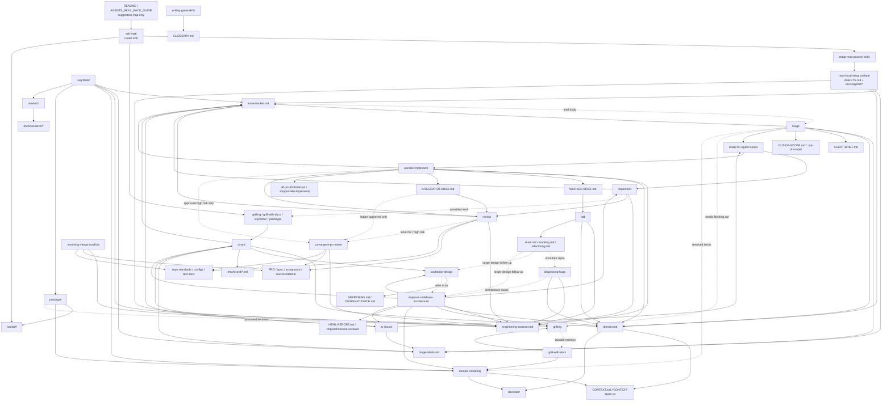

# Skill Context Relationships

Purpose: map context owners, pointers, and cross-skill pressure so skill edits do not duplicate setup docs or creep across workflow boundaries.

Scope: `skills/current/**` markdown files, their direct supporting files, `README.md`, and `AGENTS_SKILL_PACK_GUIDE.md`.

This is a design-analysis map, not the runtime invocation graph. Edges show ownership pressure, vocabulary influence, setup dependencies, and possible boundary creep. A graph edge does not mean a skill should invoke another skill.

Use this map to prune direct `$skill` references. Upstream means an earlier skill or doc already provides a context pointer to the owning material. A pointer is not loaded context unless its wording tells the agent to read, load, or follow it for the current branch. Keep a `$skill` reference when no upstream read/load pointer covers the target behavior and the current skill needs a real skill boundary: recommend an explicit-only workflow, invoke or load an implicit skill, or cross a commitment boundary. When the behavior or vocabulary is already loaded through upstream wording, replace the `$skill` reference with leading words.

Edge labels are descriptive, not executable. Solid edges usually mark ownership or direct workflow pressure; dotted edges usually mark conditional pressure, vocabulary influence, or escalation risk.

## Design-Pressure Map

## Invocation Map

Source: `skills/current/*/agents/openai.yaml`.

| Skill | Invocation |
| --- | --- |
| `ask-matt` | explicit-only |
| `codebase-design` | implicitly invocable |
| `convergent-pr-review` | implicitly invocable |
| `diagnosing-bugs` | implicitly invocable |
| `domain-modeling` | implicitly invocable |
| `grilling` | implicitly invocable |
| `grill-with-docs` | explicit-only |
| `handoff` | explicit-only |
| `implement` | explicit-only |
| `improve-codebase-architecture` | explicit-only |
| `parallel-implement` | explicit-only |
| `prototype` | implicitly invocable |
| `research` | implicitly invocable |
| `resolving-merge-conflicts` | implicitly invocable |
| `review` | implicitly invocable |
| `setup-matt-pocock-skills` | explicit-only |
| `tdd` | implicitly invocable |
| `to-issues` | explicit-only |
| `to-prd` | explicit-only |
| `triage` | explicit-only |
| `wayfinder` | explicit-only |
| `writing-great-skills` | implicitly invocable |

## Context Owners

| Owner | Owns | Read by / pointed to |
| --- | --- | --- |
| `README.md`, `AGENTS_SKILL_PACK_GUIDE.md` | Public and installed suggestion maps only | Humans, agents choosing a route |
| `setup-matt-pocock-skills` | Creates repo setup surface and seed docs | `ask-matt`, setup gates in planning/tracker skills |
| `docs/agents/issue-tracker.md` | Tracker operations, PR-as-request rules, and wayfinding operations | `to-prd`, `to-issues`, `triage`, `implement`, `parallel-implement`, `review`, `wayfinder` |
| `docs/agents/triage-labels.md` | Category/state role to label mapping and fixed wayfinding labels | `to-prd`, `to-issues`, `triage`, `implement`, `parallel-implement`, `wayfinder` |
| `docs/agents/domain.md` | Routing to `CONTEXT.md`, `CONTEXT-MAP.md`, ADRs | `to-prd`, `triage`, `tdd`, `diagnosing-bugs`, `improve-codebase-architecture`, `parallel-implement` |
| `docs/agents/engineering-contract.md` | Coding discipline, proof, `.tmp` cleanup, review/lock | `implement`, `tdd`, `diagnosing-bugs`, `improve-codebase-architecture`, `parallel-implement`, `review`, `convergent-pr-review` |
| `domain-modeling` | Mutates domain glossary and ADRs | `grill-with-docs`, `wayfinder`, `prototype`, `triage`, `improve-codebase-architecture` |
| `codebase-design` | Interface, seam, adapter, depth, leverage, and locality vocabulary | `to-prd`, `improve-codebase-architecture`, `tdd`, architecture/design follow-ups |
| `research` | Primary-source research notes and source trace | `wayfinder`, `to-prd`, `to-issues`, `diagnosing-bugs`, `improve-codebase-architecture` |
| `resolving-merge-conflicts` | Source-traced Git conflict resolution | Git operations, `review`, `parallel-implement`, integration work |
| `review` | Ordinary fixed-point Standards/Spec review | `implement`, `parallel-implement`; escalates to `convergent-pr-review` for high risk |

## Supporting Files

| Skill | Supporting files own |
| --- | --- |
| `writing-great-skills` | `GLOSSARY.md`: skill-authoring vocabulary |
| `codebase-design` | `DEEPENING.md`: dependency/seam discipline; `DESIGN-IT-TWICE.md`: alternative interface exploration |
| `domain-modeling` | `CONTEXT-FORMAT.md`, `ADR-FORMAT.md`: durable language and ADR formats |
| `tdd` | `tests.md`, `mocking.md`, `refactoring.md`: examples and branch mechanics |
| `prototype` | `LOGIC.md`, `UI.md`: branch mechanics; `SKILL.md` owns lifecycle and boundary |
| `triage` | `AGENT-BRIEF.md`: ready-for-agent brief format; `OUT-OF-SCOPE.md`: rejected-work knowledge base |
| `setup-matt-pocock-skills` | Tracker, label, domain, and engineering-contract seed docs |
| `wayfinder` | Tracker-backed map and ticket process for foggy multi-session efforts |
| `research` | One cited repo-local Markdown note per source question |
| `resolving-merge-conflicts` | Merge/rebase/cherry-pick conflict process and finish boundary |
| `improve-codebase-architecture` | `HTML-REPORT.md`: report format and visual style |
| `parallel-implement` | `WORKER-BRIEF.md`, `INTEGRATOR-BRIEF.md`, `RUN-LEDGER.md`: lane contracts and run ledger |

## Boundary Notes

- Suggestion maps suggest; `ask-matt` routes; neither teaches workflow procedures.
- Setup docs own tracker, labels, domain routing, and engineering-contract details. Skills should point there instead of restating those mechanics.
- `domain-modeling` is the only skill that should write domain glossary/ADR truth; readers follow `docs/agents/domain.md`.
- `to-prd` owns parent PRD synthesis and tracker publication; `to-issues` owns implementation issue slicing.
- `wayfinder` owns foggy multi-session maps; tracker docs own the transport mechanics for maps, child tickets, blocking, claiming, and resolution.
- `research` owns primary-source legwork and cited repo-local notes; downstream skills should link the note instead of duplicating findings.
- `resolving-merge-conflicts` owns Git conflict resolution; it may resolve files but should not abort, discard sides, commit, or continue a rebase unless explicitly approved or requested.
- `triage` owns incoming issue/PR state transitions and ready-for-agent briefs; do not re-triage `$to-issues` output.
- Tracker docs own transport and tracker commands; `triage` owns ready-for-agent brief text and AI-triage disclaimer content.
- `implement` owns one selected item; `parallel-implement` owns batch orchestration and serialized integration.
- `review` is the ordinary closeout gate; `convergent-pr-review` is an approved high-risk/local-PR route, not default review.
- `convergent-pr-review` may run its own read-only reviewer passes only when selected as the review route; it is not a second implementation orchestrator.
- `handoff` carries pointers across sessions; it should reference durable artifacts, not duplicate PRDs, issues, ADRs, commits, or diffs.
- `.tmp/` artifacts are disposable unless a skill explicitly preserves them as source, report, or ledger evidence.
