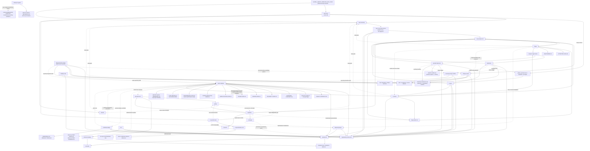

# Skill Context Relationships

Purpose: map context owners, pointers, and cross-skill pressure so skill edits do not duplicate setup docs or creep across workflow boundaries.

Scope: `skills/custom/**` markdown files, their direct supporting files, `README.md`, and `GLOBAL_AGENTS_TEMPLATE_SKILL_PACK.md`.

This is a design-analysis map, not the runtime invocation graph. Edges show ownership pressure, vocabulary influence, setup dependencies, and possible boundary creep. A graph edge does not mean a skill should invoke another skill.

Use this map to prune direct skill-handle references. Upstream means an earlier skill or doc already provides a context pointer to the owning material. A pointer is not loaded context unless its wording tells the agent to read, load, or follow it for the current branch. Keep a skill handle when no upstream read/load pointer covers the target behavior and the current skill needs a real skill boundary: recommend an explicit-only workflow, invoke or load an implicit skill, or cross a commitment boundary. When the behavior or vocabulary is already loaded through upstream wording, replace the handle with leading words.

Edge labels are descriptive, not executable. Solid edges usually mark ownership or direct workflow pressure; dotted edges usually mark conditional pressure, vocabulary influence, or escalation risk.

## Design-Pressure Map

```mermaid
flowchart TD
  GlobalTemplate["GLOBAL_AGENTS_TEMPLATE_SKILL_PACK<br/>global bootstrap template"] --> Router["skill-router<br/>router skill"]
  GlobalTemplate --> Setup["repo-bootstrap"]

  Router --> Setup["repo-bootstrap"]
  Setup --> AgentDocs["repo-local setup surface<br/>AGENTS.md + docs/agents/*"]
  AgentDocs --> Tracker["issue-tracker.md"]
  AgentDocs --> Labels["triage-labels.md"]
  AgentDocs --> DomainRouter["domain.md"]
  AgentDocs --> Contract["engineering-contract.md"]

  DomainRouter --> Context["CONTEXT.md / CONTEXT-MAP.md"]
  DomainRouter --> ADRs["docs/adr/"]
  DomainModel["domain-modeling"] --> Context
  DomainModel --> ADRs

  Router --> Shape["grilling / grill-with-docs / wayfinder / prototype"]
  Router --> Questionnaire["to-questionnaire"]
  Router --> Handoff["handoff"]
  GrillDocs["grill-with-docs"] --> Grilling["grilling"]
  GrillDocs --> DomainModel
  Grilling -. "async stakeholder gap" .-> Questionnaire
  Grilling -. "multi-decision route gap" .-> Wayfinder
  Grilling -. "fresh-context transport" .-> Handoff
  Questionnaire --> QuestionnaireFile["to-questionnaire-<slug>.md"]
  Questionnaire -. "source-answerable" .-> Research
  Questionnaire -. "user-owned decision" .-> Grilling
  Wayfinder["wayfinder"] --> Tracker
  Wayfinder -. "hosted label representation" .-> Labels
  Wayfinder -. "setup gate" .-> Setup
  Wayfinder --> Grilling
  Wayfinder --> GrillDocs
  Wayfinder -. "explicit user re-entry" .-> Questionnaire
  Wayfinder --> Prototype["prototype"]
  Wayfinder --> Research["research"]
  Prototype -. "promotion or production proof" .-> Contract

  Shape --> ToSpec["to-spec"]
  ToSpec --> DomainRouter
  ToSpec --> Contract
  ToSpec --> Tracker
  ToSpec --> Implement
  ToSpec --> ToTickets["to-tickets"]
  ToSpec -. "setup gate" .-> Setup
  ToTickets --> Tracker
  ToTickets --> Labels
  ToTickets --> Contract
  ToTickets --> Ready["ready-for-agent items"]
  ToTickets -. "setup gate" .-> Setup

  Triage["triage"] --> Tracker
  Triage --> Labels
  Triage -. "setup gate" .-> Setup
  Triage --> Attention["ATTENTION-SCAN.md"]
  Triage --> AgentBrief["AGENT-BRIEF.md"]
  Triage --> Ready
  Triage -. "deep causal investigation" .-> Debug
  Triage -. "fixed-candidate code judgment" .-> Review
  Triage -. "settled multi-slice intake" .-> ToTickets
  Tracker -. "ready contract" .-> Triage

  Ready --> Implement["implement"]
  Ready --> Parallel["parallel-implement"]
  Implement --> Contract
  Implement -. "review trigger" .-> Review["change-review"]
  Implement --> FindingContract["FINDING-CONTRACT.md<br/>admission + remediation interface"]
  Implement --> Tracker
  Implement -. "unsettled work" .-> Shape
  Implement -. "conflict-only admission" .-> Conflict
  Parallel --> Contract
  Parallel --> Tracker
  Parallel --> DomainRouter
  Parallel --> AgentLanes["AGENT-LANES.md<br/>worktree prepare + cleanup"]
  Parallel -. "review trigger" .-> Review
  Parallel --> FindingContract
  Parallel -. "conflicted landing" .-> Conflict
  Review --> Tracker
  Review --> Contract
  Review --> SpecSources["spec / acceptance / source material"]
  Review --> StandardsSources["repo standards / configs / test docs"]
  Review --> FindingContract
  Review -. "repository-baseline audit" .-> Audit
  CPR["high-assurance-review<br/>explicit user invocation"] --> Contract
  CPR -. "two fresh whole-candidate passes" .-> Review
  CPR --> SpecSources
  CPR --> StandardsSources
  CPR --> FindingContract
  CPR -. "repository-baseline audit" .-> Audit["audit-codebase"]
  Audit --> Contract
  Audit --> DomainRouter
  Audit --> AuditDefects["DEFECT-CONTRACT.md"]
  Audit --> AuditQuality["QUALITY-LENS.md<br/>concept triage"]
  Audit --> AuditCandidates["CANDIDATE-CONTRACT.md"]
  Audit --> AuditReliability["RELIABILITY-LENS.md"]
  Audit --> AuditDomain["DOMAIN-LENS.md"]
  Audit --> AuditDesign["DESIGN-LENS.md"]
  Audit --> AuditSimplify["SIMPLIFICATION-LENS.md"]
  Audit --> AuditPractices["CODING-PRACTICES-LENS.md"]
  Audit --> AuditPerformance["PERFORMANCE-LENS.md<br/>only for performance scope"]
  Audit --> AuditReport["HTML-REPORT.md<br/>sole durable artifact"]
  Audit --> AuditReportCli["REPORT-QUICK-REFERENCE.md<br/>only report interface"]
  Audit -->|"generated Analyze prompt + implementation-ready candidate"| ToTickets
  Audit -. "current-user decision" .-> GrillDocs
  Audit -. "settled domain capture" .-> DomainModel

  Research --> ResearchRefs["seven conditional evidence references"]
  Research -. "authorized note" .-> ResearchNote["one repo-local Markdown note"]
  Conflict["resolving-merge-conflicts"] --> Contract
  Conflict --> SpecSources
  Conflict --> StandardsSources

  TDD["tdd"] --> Contract
  TDD --> DomainRouter
  Debug["diagnosing-bugs"] --> Contract
  Debug --> DomainRouter
  Debug -. "post-fix architecture prevention" .-> Audit
  CodeDesign["codebase-design"] --> Contract
  CodeDesign --> DomainRouter
  Prototype -. "built behavior misbehaves" .-> Debug
  Simplify["simplify-code"] --> Contract
  Simplify -. "wide repository audit" .-> Audit

  Handoff -. "setup gate" .-> Setup

  TDD --> TddRefs["references/TEST-SHAPE.md<br/>references/TEST-DOUBLES.md"]
  Audit -. "selected design candidate" .-> CodeDesign
  CodeDesign --> DesignRefs["DEEPENING.md / DESIGN-IT-TWICE.md"]
  CodeDesign -. "wide scan" .-> Audit
  Writing["writing-for-agents"] --> SkillMechanics["references/SKILL-MECHANICS.md<br/>skill-only mechanics"]
  Writing -. "user requests behavioral testing" .-> BehaviorEvals["references/BEHAVIOR-EVALS.md<br/>counterfactual wording evaluation"]
```

## Invocation Map

Source: `skills/custom/*/agents/openai.yaml`.

| Skill | Invocation |
| --- | --- |
| `codebase-design` | implicitly invocable |
| `high-assurance-review` | explicit-only |
| `diagnosing-bugs` | explicit-only |
| `domain-modeling` | implicitly invocable |
| `grilling` | implicitly invocable |
| `grill-with-docs` | implicitly invocable |
| `handoff` | explicit-only |
| `implement` | explicit-only |
| `audit-codebase` | explicit-only |
| `parallel-implement` | explicit-only |
| `prototype` | implicitly invocable |
| `repo-bootstrap` | explicit-only |
| `research` | implicitly invocable |
| `resolving-merge-conflicts` | implicitly invocable |
| `change-review` | implicitly invocable |
| `simplify-code` | explicit-only |
| `skill-router` | explicit-only |
| `tdd` | implicitly invocable |
| `to-questionnaire` | explicit-only |
| `to-tickets` | explicit-only |
| `to-spec` | explicit-only |
| `triage` | explicit-only |
| `wayfinder` | explicit-only |
| `writing-for-agents` | implicitly invocable |

## Runtime Composition

Use one verb for each accepted relationship:

- **Load `<skill>`:** apply its shared reference or discipline inside the caller. The caller keeps output, mutation, and completion ownership.
- **Invoke `<skill>`:** run the callee through its own gates, return its packet, then resume the caller.
- **Compose `<skill>`:** keep the callee active under one named composer. Each skill retains its owned gates and mutations; the composer owns the combined exit.
- **Hand off to `<skill>`:** stop the current skill and transfer ownership with the available Source Trace or packet.
- **Suggest only `<skill>`:** name a possible owner inside a read-only finding; the current caller chooses any later route and the suggesting skill neither invokes nor resumes.
- **Recommend `<skill>` and stop:** return one next route without executing it. The user or receiving caller starts it.

`Load`, `Invoke`, `Compose`, and `Hand off` target implicitly invocable skills.
An explicit-only target normally uses `Recommend and stop`. A declared caller
exception may invoke it only after exact user approval of its invocation
packet; without approval, execute no edge and use the caller-specific safe
Return.

| Caller | Verb | Callee | Condition and return |
| --- | --- | --- | --- |
| `grill-with-docs` | Compose | `$grilling` | Run the one-decision-at-a-time interview and preserve its confirmed decision or exact gap. |
| `grill-with-docs` | Compose | `$domain-modeling` | Reconcile each settled domain-affecting answer before dependent questioning; preserve Domain Modeling's current result and its context-write and ADR approval gates. |
| `grilling` | Recommend and stop | `$research` | Claim-owning sources can answer the evidence gap. |
| `grilling` | Recommend and stop | `$prototype` | A design evidence gap needs a runnable verdict. |
| `grilling` | Recommend and stop | `$to-questionnaire` | An identifiable external stakeholder owns evidence that must be collected asynchronously. |
| `grilling` | Recommend and stop | `$handoff` | The intact gap must cross into a fresh context; preserve its evidence or decision owner and use Handoff only as transport. |
| `grilling` | Recommend and stop | `$wayfinder` | A bounded destination has several coupled unresolved questions or prerequisites, including at least one non-conversational resolver, and needs tracker-backed multi-session sequencing; active Wayfinder is not the return owner. An active Wayfinder receives the intact Route gap directly for graph reconciliation. |
| `to-questionnaire` | Recommend and stop | `$research` | Claim-owning sources can answer the gap. |
| `to-questionnaire` | Recommend and stop | `$grilling` | The current user owns the unresolved conversation-only decision. |
| `skill-router` | Recommend and stop | `$repo-bootstrap` | The chosen engineering route needs missing, incompatible, or outdated setup. Return Repo Bootstrap as the one route and leave it unstarted. |
| `wayfinder` | Invoke | `$research` | One selected ticket needs claim-owning source evidence. Pass its question, map use, scope, applicable state, approved note path or no-write mode, and Wayfinder return owner. |
| `wayfinder` | Invoke | `$prototype` | One selected ticket needs runnable evidence. Pass its question, decision owner, named human judge or objective rule, representative evidence, bounded run, mutation authority, and cleanup or custody. |
| `wayfinder` | Invoke | `$grilling` | One selected ticket needs a conversation-only user decision with no durable domain consequence; receive the intact decision or gap. |
| `wayfinder` | Invoke | `$grill-with-docs` | One selected user decision also requires live domain reconciliation; receive the decision or exact gap with the current domain result. |
| `wayfinder` | Recommend and stop | `$to-questionnaire` | One external Questionnaire prerequisite needs asynchronous attributable answers. Return the recipient, downstream decision, needed-back items, authorized durable path, answer-return destination, and exact `$to-questionnaire` and Wayfinder re-entry instruction. A verified path returns as Waiting, never as an answer. |
| `to-spec` | Recommend and stop | `$implement` | The settled source is one bounded complete implementation and a durable parent adds no useful coordination, or the verified parent needs no ticket graph. Return the exact source or parent identity and leave implementation unstarted. |
| `to-spec` | Recommend and stop | `$to-tickets` | The verified parent leaves several valuable implementation slices or needs durable tracker coordination. To Tickets owns repository grounding, child slicing, and graph publication. |
| `to-spec` | Recommend and stop | `$repo-bootstrap` | A required setup surface is missing or incompatible. |
| `to-tickets` | Recommend and stop | `$implement` | The settled source is one bounded direct item, or a verified graph lacks an explicit whole-parent delivery request; return that item or the first actionable ticket. |
| `to-tickets` | Recommend and stop | `$parallel-implement` | The user explicitly requested delivery of the whole verified parent graph and it has a non-empty Ready-for-agent frontier; Parallel Implement owns live serial or concurrent dispatch and one root integration outcome. |
| `to-tickets` | Recommend and stop | `$repo-bootstrap` | A required setup surface is missing or incompatible. |
| `triage` | Recommend and stop | `$diagnosing-bugs` | Readiness requires deep causal investigation rather than intake-level evidence; preserve the report, observations, hypotheses, and skipped proof. |
| `triage` | Recommend and stop | `$change-review` | An attached diff needs fixed-candidate code judgment rather than intake disposition; preserve the candidate identity and observed intake evidence. |
| `triage` | Recommend and stop | `$to-tickets` | Settled intake needs several independently completable implementation slices; preserve the source and leave readiness unchanged. |
| `triage` | Recommend and stop | `$repo-bootstrap` | A required setup surface is missing or incompatible. |
| `wayfinder` | Recommend and stop | `$repo-bootstrap` | The installed tracker or label contract is missing or incompatible; return the exact gap with Wayfinder unstarted. |
| `implement` | Recommend and stop | `$repo-bootstrap` | Tracker-backed work needs a missing or incompatible installed issue-tracker contract; return the exact gap with implementation unstarted. |
| `implement` | Invoke | `$tdd` | The selected work explicitly requires TDD, test-first work, or RED-GREEN-REFACTOR, or applicable repository policy requires TDD, and one accepted observable behavior and independent oracle are settled. TDD owns the RED-GREEN-REFACTOR inner loop. |
| `implement` | Invoke | `$change-review` | The user or repository requires review, or a concrete unresolved shared-contract or migration judgment remains after proof. Implement pins the clean candidate; Change Review owns the procedure and returns its decision. Multiple authors alone do not trigger review. |
| `implement` | Hand off | `$resolving-merge-conflicts` | Admission finds an active conflict rather than an implementable ready item. Stop implementation, preserve Git state, and supply the requested scope plus whether resolution and finish were requested. The resolver inspects live state. |
| `parallel-implement` | Invoke | `$change-review` | The user or repository requires review, or a concrete unresolved shared-contract or migration judgment remains after integrated proof. Parallel Implement pins the clean candidate; Change Review owns the procedure and returns its decision. Multiple workers alone do not trigger review. |
| `parallel-implement` | Invoke | `$resolving-merge-conflicts` | Serial landing enters an active conflict. Preserve Git state and supply the requested scope plus whether resolution and finish were requested. Resume only after the resolver reports current state. |
| `parallel-implement` | Recommend and stop | `$to-tickets` | Admission finds vague work, unsettled meaning, missing dependencies, or an invalidated delivery set. Return the exact defect and leave shaping or graph repair to To Tickets. |
| `parallel-implement` | Recommend and stop | `$repo-bootstrap` | Tracker-backed delivery needs a missing or incompatible installed issue-tracker contract; return the exact gap with delivery unstarted. |
| `prototype` | Recommend and stop | `$diagnosing-bugs` | Fit finds that an existing built system has a hard failure needing dedicated causal investigation rather than one disposable design question; return the intact symptom evidence and leave Diagnosis unstarted. |
| `change-review` | Recommend and stop | `$audit-codebase` | The request targets an immutable repository baseline rather than a pending implementation candidate. |
| `high-assurance-review` | Recommend and stop | `$audit-codebase` | The request targets a bounded repository correctness, domain-robustness, methodology, or performance baseline rather than a pending candidate diff. |
| `high-assurance-review` | Load | `$change-review` | After one fixed heavy-review candidate and factual brief are ready, run exactly two fresh whole-candidate reviews with behavior/integration and engineering-quality emphasis. High Assurance verifies the returned finding candidates and retains the terminal decision. |
| `audit-codebase` | Recommend and stop | `$domain-modeling` | One analyzed candidate has settled domain meaning or an ADR candidate needing durable capture. Audit records the need and leaves mutation unstarted. |
| `audit-codebase` | Recommend and stop | `$grill-with-docs` | One candidate decision belongs to the user and also requires current domain records. Audit records the exact question and leaves composition unstarted. |
| `audit-codebase` | Recommend and stop | `$grilling` | One material candidate decision belongs to the current user and needs no domain-record maintenance. |
| `audit-codebase` | Recommend and stop | `$research` | One candidate has a bounded, non-diagnostic question that claim-owning sources can answer. |
| `audit-codebase` | Recommend and stop | `$prototype` | One selected candidate needs a disposable runnable probe or comparative measurement before judgment. |
| `audit-codebase` | Recommend and stop | `$to-questionnaire` | One identifiable external stakeholder owns required evidence unavailable from current sources. |
| `audit-codebase` | Load | `$codebase-design` | During Analyze of one selected design or mixed candidate after user decisions settle, resolve its one bounded architecture question and fold the result into the HTML. Audit retains artifact and completion and creates no second design step. |
| `audit-codebase` | Recommend and stop | `$wayfinder` | One candidate has several coupled unresolved questions or prerequisites and needs durable multi-session sequencing. |
| `audit-codebase` | Recommend and stop | `$to-spec` | One analyzed candidate has settled direction and commitments that need a durable parent specification. |
| `audit-codebase` | Recommend and stop | `$simplify-code` | One analyzed candidate is a bounded behavior-preserving reduction with current evidence and a Proof Seam. |
| `audit-codebase` | Recommend and stop | `$implement` | One analyzed candidate is a bounded implementation-ready change. Audit leaves implementation unstarted. |
| `domain-modeling` | Recommend and stop | `$repo-bootstrap` | Required domain routing is missing or incompatible. Return the exact routing gap before any domain write. |
| `codebase-design` | Recommend and stop | `$audit-codebase` | The request needs codebase-wide mapping and improvement discovery. |
| `handoff` | Recommend and stop | `$repo-bootstrap` | The exact Handoff target cannot be proved ignored because the disposable-artifact setup is missing or incompatible; return the mismatch without a pickup and leave Repo Bootstrap unstarted. |

Wayfinder returns its settled source or terminal record without choosing a
downstream workflow. Audit Codebase recommends Domain Modeling and stops for
user-selected settled capture. Domain Modeling remains a leaf: direct use may ask focused
domain-expert questions, composed use receives settled answers from Grilling,
and every residual returns to the user or caller without invoking Skill
Router, its composer, or downstream execution. Prototype likewise returns
every terminal result directly to its current caller or the user.

## Context Owners

| Owner | Owns | Read by / pointed to |
| --- | --- | --- |
| `README.md` | Human-facing overview and installation | Humans installing or learning the pack |
| `GLOBAL_AGENTS_TEMPLATE_SKILL_PACK.md` | Minimal pack-owned global Codex bootstrap template: explicit-only router/setup discovery | `~/.codex/AGENTS.md` |
| `skill-router` | Current executable route map, tie-breakers, and truthful no-match abstention | Humans or agents choosing one next route or confirming that none fits |
| `repo-bootstrap` | Inspects and reconciles applicable repo setup, applies one exact approved delta, and verifies changed local and external state | Explicit user invocation only; other skills read installed `docs/agents/*` contracts and may recommend setup without loading this package |
| `docs/agents/issue-tracker.md` | Selected provider operations, configured relationship representation, and mutation read-back | `to-spec`, `to-tickets`, `triage`, `implement`, `parallel-implement`, `wayfinder` |
| `docs/agents/triage-labels.md` | Repository values for active category, state, and Wayfinder roles; consuming skills own when each role applies | `to-tickets`, `triage`, `implement`, `parallel-implement`, `wayfinder` |
| `docs/agents/domain.md` | Single-context or multi-context routing to current domain records | `domain-modeling` and domain-language consumers |
| `docs/agents/engineering-contract.md` | Shared engineering judgment: bounded slices, causal ownership, explicit data shapes, small interfaces, local state, subtractive design, native capabilities, root-cause correction, trust-boundary validation, displaced-path removal, proportional proof, and concrete protection triggers. Skills retain procedures, checks, stopping conditions, and outputs. | `to-spec`, `to-tickets`, `implement`, `tdd`, `diagnosing-bugs`, `codebase-design`, `prototype`, `simplify-code`, `audit-codebase`, `parallel-implement`, `resolving-merge-conflicts`, `change-review`, `high-assurance-review` |
| `domain-modeling` | Resolves project-specific domain semantics; reconciles proposed wording with routed current truth; returns the current domain result when composed; persists routed context records only with write authority; and records an already-settled ADR candidate only with separate approval | `skill-router`, `grill-with-docs`, `audit-codebase`, `repo-bootstrap` |
| `codebase-design` | One bounded module or interface architecture decision using deep-module, caller-first, data-shape, ownership, seam, migration, and proof judgment | `audit-codebase`, direct architecture/design work |
| `research` | Claim-owning source legwork and one authorized cited note or verified inline evidence | `skill-router`, `grilling`, `wayfinder` |
| `to-questionnaire` | One recipient-ready async discovery artifact for one external stakeholder and downstream decision | `skill-router`, `grilling`, `wayfinder`, humans collecting stakeholder evidence |
| `resolving-merge-conflicts` | Read-only inspection, requested conflict resolution, and separately requested exact-path continuation of one active Git operation | Git operations and implementation or integration work that enters a conflicted state |
| `change-review` | Read-only review of one identified code change through accepted-behavior and engineering-quality judgment; formal delivery conditionally adds fixed-candidate gating, independence, remediation, and a terminal decision | `implement`, `parallel-implement`, `high-assurance-review`, direct callers |
| `audit-codebase` | Organized HTML repository atlas plus current-source, user-selected subsystem Audit and candidate Analyze; six-class coverage loads detailed owners on observable triggers, records cross-subsystem patterns, and stops before tickets or implementation | `skill-router`, `change-review`, `high-assurance-review`, returned evidence, and humans explicitly invoking repository audits |
| `simplify-code` | Proved behavior-preserving simplification of one user-selected target or a truthful no-change result | `skill-router`, `audit-codebase`, humans invoking bounded cleanup |

## Supporting Files

| Skill | Supporting files own |
| --- | --- |
| `writing-for-agents` | `references/SKILL-MECHANICS.md`: skill-only invocation, packaging, routing, and structural checks; `references/BEHAVIOR-EVALS.md`: fresh-context wording evaluation loaded only when the user explicitly requests behavioral testing |
| `codebase-design` | `DEEPENING.md`: dependency-driven seam, proof, and migration judgment; `DESIGN-IT-TWICE.md`: consequential alternative-shape exploration |
| `domain-modeling` | `CONTEXT-FORMAT.md`: glossary and context-map format; `ADR-FORMAT.md`: ADR gate and format |
| `tdd` | `references/TEST-SHAPE.md` for an unclear test boundary or oracle; `references/TEST-DOUBLES.md` before adding a substitute |
| `prototype` | `LOGIC.md`, `UI.md`, and `MEASURE.md`: decision-bearing branch mechanics. One decision branch loads; `SKILL.md` owns the universal lifecycle, reconciliation, and Return. |
| `triage` | `ATTENTION-SCAN.md`: read-only queue overview; `AGENT-BRIEF.md`: concise agent or human ready handoff |
| `repo-bootstrap` | Conditional tracker, label, and domain-routing seeds; engineering-contract projection; optional approved parallel permission setup; `setup-schema.json`: internal seed-bundle identity; `scripts/validate_setup.py`: applicable target configuration validation |
| `wayfinder` | `MAP-FORMAT.md`: lean map, ticket, resolution, closing, and termination shapes; `references/MUTATION.md`: claim and durable-write protection; `references/RESOLVERS.md`: selected-ticket routing and return interpretation |
| `research` | Seven conditional evidence references; one authorized cited Markdown note or cited inline result |
| `resolving-merge-conflicts` | `OPERATIONS.md`: branch-only operation roles, special conflict types, automatic-resolution traps, and exceptional operation choices; `SKILL.md`: five direct actions, mutation boundaries, and completion |
| `change-review`, `high-assurance-review` | `change-review/FINDING-CONTRACT.md`: evidence-backed finding admission, concise severity, and no-authority boundary |
| `change-review` | `change-review/references/FORMAL-REVIEW.md`: formal-only required-Spec, independence, remediation, decision, and Return rules |
| `implement` | `implement/references/WORKER-HANDOFF.md`: plain bounded handoff and provisional evidence return for user-requested delegation |
| `audit-codebase` | `DEFECT-CONTRACT.md`: defects and gaps; `QUALITY-LENS.md`: six-class coverage, routing, opportunity admission, retained complexity, and systemic widening; detailed lens owners: condition-triggered issue discovery; `CANDIDATE-CONTRACT.md`: current-source candidate comparison; `REPORT-QUICK-REFERENCE.md`: sole CLI procedure; `HTML-REPORT.md` plus `scripts/update_report.py`: deterministic atlas state and rendering |
| `parallel-implement` | `AGENT-LANES.md`: checkout custody, shared-ref limits, replacement, and cleanup; `lane_worktree.py`: exact-base lane preparation, isolated temp/cache paths, and conservative cleanup |

## Boundary Notes

- The global template exposes bootstrap handles; `skill-router` routes or returns a truthful no-match abstention; neither teaches downstream workflow procedures.
- The bundled system `skill-creator` owns new-package scaffolding and metadata mechanics. `$writing-for-agents` owns the instructions agents consume and their directly affected pointers, including semantic invocation wording for existing skills. It stops before metadata mechanics, installation, or delivery.
- Setup docs own tracker, labels, domain routing, and engineering-contract details. Skills should point there instead of restating those mechanics.
- `$grill-with-docs` owns live composition. It reconciles domain-affecting
  answers before dependent questioning and returns Grilling's decision or gap
  with Domain Modeling's current result. Wayfinder uses it only when both are
  needed for one selected decision.
- `$to-questionnaire` owns one verified artifact, not delivery or continuation.
  Wayfinder prepares its packet and stops for explicit user invocation, then
  owns Waiting and answer reconciliation after the artifact path returns.
- `domain-modeling` is the only skill that writes `CONTEXT.md`, `CONTEXT-MAP.md`, or approved ADR truth; `repo-bootstrap` configures and verifies routing before persistence across a required topology transition, and vocabulary consumers follow `docs/agents/domain.md`.
- `to-spec` owns final source admission, parent spec synthesis, and tracker publication. Grilling confirms shared understanding but neither certifies source readiness nor drafts or publishes. `to-tickets` owns implementation issue slicing.
- `wayfinder` owns finite foggy multi-session decision maps, frontier selection,
  per-session claims, resolver selection, direct consequence reconciliation,
  and evidence-backed finish or termination. Tracker docs own provider
  representation and transport. Each resolver owns its local gates and Return;
  none chooses the map outcome or a later delivery route.
- `research` owns one bounded source question, claim-owning evidence judgment,
  and one authorized cited note or cited inline result. It reports a mismatch
  without choosing the next route. A user request or caller packet must
  authorize one note path before that tracked mutation.
- `resolving-merge-conflicts` keeps status, explanation, and review read-only.
  Requested resolution permits only in-scope working-tree changes; staging and
  native continuation require a separate explicit request. Recovery actions
  that alter operation policy require their own request.
- Tracker docs own transport, tracker commands, Ready-for-agent state and
  navigation, and Mutation read-back. `triage` owns incoming classification,
  proportional disposition evidence, its concise ready brief, and authorized
  state transitions; `$to-tickets` owns proportional slicing, true dependency
  order, graph approval, safe publication, and graph read-back. Do not re-triage
  valid `$to-tickets` output.
- `implement` owns one standalone selected item and its in-scope correction path, with Git delivery only when the selected branch requires it; `parallel-implement` owns one explicit fixed set of at least two accepted items through isolated concurrent lanes, serial integration, bounded correction, integrated proof, and conditional tracker closeout.
- The `parallel-implement` root is the sole dispatcher, serial landing,
  integration-judgment, and conditional-review owner. Workers never fan out. There
  is no warm general integrator or machine-validated worker capsule.
- `implement` and `parallel-implement` complete through direct final read-back
  and focused proof unless a Change Review trigger applies. Supported risk
  modifies coverage only after review admission. `$high-assurance-review` and
  security or production/SRE specialist work are explicit-only.
- Ordinary `change-review` returns evidence-backed findings or no findings; its formal branch and `high-assurance-review` return terminal read-only decisions. No review grants mutation or successor-snapshot authority; the implementation caller's accepted commitments and scope govern continuation.
- `high-assurance-review` may run exactly two fresh whole-candidate Change Review passes only when explicitly invoked. It verifies their finding candidates and returns one decision without becoming an implementation or merge orchestrator.
- `audit-codebase` owns the exhaustive system/subsystem map and exactly one user-selected Map, Audit, or Analyze mode per invocation over current-source identity. It accumulates coverage, verified findings, retained complexity, cross-subsystem patterns, candidates, decisions, and history in one offline HTML report. It may suggest audit order and rank candidates across audited evidence, but it never selects the next item, publishes tickets, starts implementation, or makes a release decision.
- `simplify-code` owns proved behavior-preserving simplification of one selected target or a truthful no-change result. An explicitly requested repeated pass proves each reduction before choosing the next. It does not own feature work, bug diagnosis, public-contract decisions, wide improvement surveys, staging, commits, or tracker closeout.
- `handoff` is an explicit transport leaf: it carries exact pointers across a shared work root, preserves the active owner, and never duplicates durable truth, routes new work, or resumes from stale state.
- `.tmp/` artifacts are disposable unless a skill explicitly preserves them for the user or next session.
- `.scratch/` artifacts are durable, version-controlled local state; include in-scope changes in review and staging.
