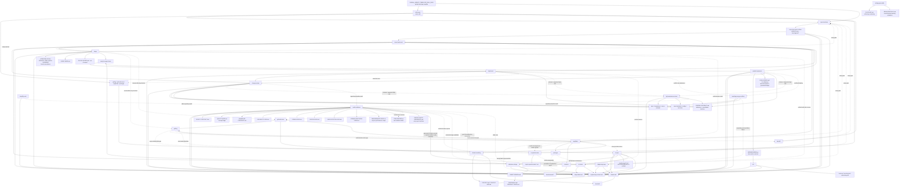

# Skill Context Relationships

Purpose: map context owners, pointers, and cross-skill pressure so skill edits do not duplicate setup docs or creep across workflow boundaries.

Scope: `skills/custom/**` markdown files, their direct supporting files, `README.md`, and `GLOBAL_AGENTS_TEMPLATE_SKILL_PACK.md`.

This is a design-analysis map, not the runtime invocation graph. Edges show ownership pressure, vocabulary influence, setup dependencies, and possible boundary creep. A graph edge does not mean a skill should invoke another skill.

Use this map to prune direct skill-handle references. Upstream means an earlier skill or doc already provides a context pointer to the owning material. A pointer is not loaded context unless its wording tells the agent to read, load, or follow it for the current branch. Keep a skill handle when no upstream read/load pointer covers the target behavior and the current skill needs a real skill boundary: recommend an explicit-only workflow, invoke or load an implicit skill, or cross a commitment boundary. When the behavior or vocabulary is already loaded through upstream wording, replace the handle with leading words.

Edge labels are descriptive, not executable. Solid edges usually mark ownership or direct workflow pressure; dotted edges usually mark conditional pressure, vocabulary influence, or escalation risk.

## Design-Pressure Map

```mermaid
flowchart TD
  GlobalTemplate["GLOBAL_AGENTS_TEMPLATE_SKILL_PACK<br/>global bootstrap template"] --> Router["skill-router<br/>router skill"]
  GlobalTemplate --> Setup["repo-bootstrap"]

  Router --> Setup["repo-bootstrap"]
  Setup --> AgentDocs["repo-local setup surface<br/>AGENTS.md + docs/agents/*"]
  AgentDocs --> Tracker["issue-tracker.md"]
  AgentDocs --> Labels["triage-labels.md"]
  AgentDocs --> DomainRouter["domain.md"]
  AgentDocs --> Contract["engineering-contract.md"]

  DomainRouter --> Context["CONTEXT.md / CONTEXT-MAP.md"]
  DomainRouter --> ADRs["docs/adr/"]
  DomainModel["domain-modeling"] --> Context
  DomainModel --> ADRs

  Router --> Shape["grilling / grill-with-docs / wayfinder / prototype"]
  Router --> Questionnaire["to-questionnaire"]
  Router --> Handoff["handoff"]
  GrillDocs["grill-with-docs"] --> Grilling["grilling"]
  GrillDocs --> DomainModel
  Grilling -. "async stakeholder gap" .-> Questionnaire
  Grilling -. "multi-decision route gap" .-> Wayfinder
  Grilling -. "fresh-context transport" .-> Handoff
  Questionnaire --> TmpQuestionnaire[".tmp/to-questionnaire/*.md"]
  Questionnaire -. "source-answerable" .-> Research
  Questionnaire -. "user-owned decision" .-> Grilling
  Wayfinder["wayfinder"] --> Tracker
  Wayfinder -. "hosted label representation" .-> Labels
  Wayfinder -. "setup gate" .-> Setup
  Wayfinder --> Grilling
  Wayfinder --> GrillDocs
  Wayfinder -. "exact user-approved artifact packet" .-> Questionnaire
  Wayfinder --> Prototype["prototype"]
  Wayfinder --> Research["research"]
  Wayfinder -. "closed settled source" .-> ToSpec
  Wayfinder --> DomainModel
  Prototype -. "promotion or production proof" .-> Contract

  Shape --> ToSpec["to-spec"]
  ToSpec --> DomainRouter
  ToSpec --> Contract
  ToSpec --> CodeDesign
  ToSpec --> TmpSpec[".tmp/to-spec/*.md<br/>draft until publication is verified"]
  ToSpec --> Tracker
  ToSpec --> Labels
  ToSpec --> ToTickets["to-tickets"]
  ToSpec -. "setup gate" .-> Setup
  ToTickets --> Tracker
  ToTickets --> Labels
  ToTickets --> Contract
  ToTickets --> Ready["ready-for-agent items"]
  ToTickets -. "setup gate" .-> Setup

  Triage["triage"] --> Tracker
  Triage --> Labels
  Triage --> DomainRouter
  Triage -. "setup gate" .-> Setup
  Triage --> TriageFlows["ATTENTION-SCAN / SPECIFIC-ITEM / QUICK-OVERRIDE<br/>branch procedures"]
  Triage --> AgentBrief["AGENT-BRIEF.md"]
  Triage --> OutOfScope["OUT-OF-SCOPE.md / .out-of-scope/"]
  Triage --> Ready
  Triage -. "conversation-only decision" .-> Grilling
  Triage -. "domain-affecting decision" .-> GrillDocs
  Triage -. "multi-decision route" .-> Wayfinder
  Triage -. "settled multi-slice source" .-> ToTickets
  Tracker -. "ready contract" .-> Triage

  Ready --> Implement["implement"]
  Ready --> Parallel["parallel-implement"]
  Implement --> Contract
  Implement --> Review["change-review"]
  Implement --> FindingContract["FINDING-CONTRACT.md<br/>admission + remediation interface"]
  Implement -. "release / supported high risk" .-> CPR
  Implement --> Tracker
  Implement -. "unsettled work" .-> Shape
  Implement -. "unsliced source" .-> ToTickets
  Implement -. "conflict-only admission" .-> Conflict
  Parallel --> Contract
  Parallel --> Tracker
  Parallel --> DomainRouter
  Parallel --> WorkerBrief["WORKER-BRIEF.md<br/>lane worker contract"]
  Parallel --> Ledger["RUN-LEDGER.md / run_ledger.py<br/>canonical events + generated ledger"]
  Parallel --> Review
  Parallel --> FindingContract
  Parallel -. "release / supported high risk" .-> CPR["high-assurance-review"]
  Parallel -. "conflicted landing" .-> Conflict
  WorkerBrief --> TDD
  Review --> Tracker
  Review --> Contract
  Review --> SpecSources["spec / acceptance / source material"]
  Review --> StandardsSources["repo standards / configs / test docs"]
  Review --> FindingContract
  Review -. "release / supported high risk" .-> CPR
  Review -. "repository-baseline audit" .-> Audit
  CPR --> Contract
  CPR --> SpecSources
  CPR --> StandardsSources
  CPR --> FindingContract
  CPR -. "repository-baseline audit" .-> Audit["audit-codebase"]
  Audit --> Contract
  Audit --> DomainRouter
  Audit --> AuditDefects["DEFECT-CONTRACT.md"]
  Audit --> AuditQuality["QUALITY-LENS.md<br/>concept triage"]
  Audit --> AuditCandidates["CANDIDATE-CONTRACT.md"]
  Audit --> AuditReliability["RELIABILITY-LENS.md"]
  Audit --> AuditDomain["DOMAIN-LENS.md"]
  Audit --> AuditDesign["DESIGN-LENS.md"]
  Audit --> AuditSimplify["SIMPLIFICATION-LENS.md"]
  Audit --> AuditPractices["CODING-PRACTICES-LENS.md"]
  Audit --> AuditPerformance["PERFORMANCE-LENS.md<br/>only for performance scope"]
  Audit --> AuditReport["HTML-REPORT.md<br/>sole durable artifact"]
  Audit --> AuditReportCli["REPORT-QUICK-REFERENCE.md<br/>only report interface"]
  Audit -->|"generated Analyze prompt + implementation-ready candidate"| ToTickets
  Audit -. "current-user decision" .-> GrillDocs
  Audit -. "settled domain capture" .-> DomainModel

  Research --> ResearchDocs["docs/research/*"]
  Conflict["resolving-merge-conflicts"] --> Contract
  Conflict --> SpecSources
  Conflict --> StandardsSources

  TDD["tdd"] --> Contract
  TDD --> DomainRouter
  Debug["diagnosing-bugs"] --> Contract
  Debug --> DomainRouter
  Debug -. "post-fix architecture prevention" .-> Audit
  CodeDesign["codebase-design"] --> Contract
  CodeDesign --> DomainRouter
  Conflict -. "uncertain post-resolution failure" .-> Debug
  Prototype -. "built behavior misbehaves" .-> Debug
  Simplify["simplify-code"] --> Contract
  Simplify -. "wide repository audit" .-> Audit

  Handoff -. "setup gate" .-> Setup

  TDD --> TddRefs["tests.md / mocking.md / refactoring.md"]
  Audit -. "selected design candidate" .-> CodeDesign
  CodeDesign --> DirectDesign["DIRECT-DESIGN.md"]
  DirectDesign --> DesignRefs["DEEPENING.md / DESIGN-IT-TWICE.md"]
  CodeDesign -. "wide scan" .-> Audit
  Writing["writing-great-skills"] --> Glossary["GLOSSARY.md<br/>authoring vocabulary"]
  Writing --> BehaviorEvals["BEHAVIOR-EVALS.md<br/>counterfactual wording evaluation"]
```

## Invocation Map

Source: `skills/custom/*/agents/openai.yaml`.

| Skill | Invocation |
| --- | --- |
| `codebase-design` | implicitly invocable |
| `high-assurance-review` | implicitly invocable |
| `diagnosing-bugs` | explicit-only |
| `domain-modeling` | implicitly invocable |
| `grilling` | implicitly invocable |
| `grill-with-docs` | implicitly invocable |
| `handoff` | explicit-only |
| `implement` | explicit-only |
| `audit-codebase` | explicit-only |
| `parallel-implement` | explicit-only |
| `prototype` | implicitly invocable |
| `repo-bootstrap` | explicit-only |
| `research` | implicitly invocable |
| `resolving-merge-conflicts` | implicitly invocable |
| `change-review` | implicitly invocable |
| `simplify-code` | explicit-only |
| `skill-router` | explicit-only |
| `tdd` | implicitly invocable |
| `to-questionnaire` | explicit-only |
| `to-tickets` | explicit-only |
| `to-spec` | explicit-only |
| `triage` | explicit-only |
| `wayfinder` | explicit-only |
| `writing-great-skills` | implicitly invocable |

## Runtime Composition

Use one verb for each accepted relationship:

- **Load `<skill>`:** apply its shared reference or discipline inside the caller. The caller keeps output, mutation, and completion ownership.
- **Invoke `<skill>`:** run the callee through its own gates, return its packet, then resume the caller.
- **Compose `<skill>`:** keep the callee active under one named composer. Each skill retains its owned gates and mutations; the composer owns the combined exit.
- **Hand off to `<skill>`:** stop the current skill and transfer ownership with the available Source Trace or packet.
- **Suggest only `<skill>`:** name a possible owner inside a read-only finding; the current caller chooses any later route and the suggesting skill neither invokes nor resumes.
- **Recommend `<skill>` and stop:** return one next route without executing it. The user or receiving caller starts it.

`Load`, `Invoke`, `Compose`, and `Hand off` target implicitly invocable skills.
An explicit-only target normally uses `Recommend and stop`. A declared caller
exception may invoke it only after exact user approval of its invocation
packet; without approval, execute no edge and use the caller-specific safe
Return.

| Caller | Verb | Callee | Condition and return |
| --- | --- | --- | --- |
| `grill-with-docs` | Compose | `$grilling` | Run the one-decision-at-a-time frontier interview; preserve its readiness and terminal packet through the composer. |
| `grill-with-docs` | Compose | `$domain-modeling` | Relay every settled material answer, return each collision or blocker to Grilling before dependent progress, and preserve Domain Modeling's authoritative cumulative Domain Delta under the explicit context action and separate ADR gate. |
| `grilling` | Recommend and stop | `$research` | A source evidence gap needs one cited note. |
| `grilling` | Recommend and stop | `$prototype` | A design evidence gap needs a runnable verdict. |
| `grilling` | Recommend and stop | `$to-questionnaire` | An identifiable external stakeholder owns evidence that must be collected asynchronously. |
| `grilling` | Recommend and stop | `$handoff` | The intact gap must cross into a fresh context; preserve its evidence or decision owner and use Handoff only as transport. |
| `grilling` | Recommend and stop | `$wayfinder` | The bounded interview cannot close in one conversation because several interdependent unresolved decisions or non-conversational prerequisites need a tracker-backed multi-session route, and active Wayfinder is not the return owner. An active Wayfinder receives the intact Route gap directly for graph reconciliation. |
| `to-questionnaire` | Recommend and stop | `$research` | Inspectable primary sources can answer the gap. |
| `to-questionnaire` | Recommend and stop | `$grilling` | The current user owns the unresolved conversation-only decision. |
| `to-questionnaire` | Recommend and stop | `$repo-bootstrap` | The default artifact path cannot be proved ignored; return the exact setup precondition with Repo Bootstrap unstarted. |
| `research` | Recommend and stop | `$prototype` | Admission shows the question needs one runnable design or behavior verdict. |
| `research` | Recommend and stop | `$grilling` | The current user owns the unresolved conversation-only decision. |
| `research` | Recommend and stop | `$grill-with-docs` | The current user owns the unresolved repo-backed decision and durable domain capture must remain active. |
| `research` | Recommend and stop | `$wayfinder` | Admission directly identifies several interdependent decisions and non-conversational prerequisites needing a durable route; Research returns only the deterministic match and leaves route choice to the caller. |
| `wayfinder` | Invoke | `$research` | Pass the question, supported map use, scope, exact state, approved note path and write mode, and Wayfinder return owner; normalize the intact answer or blocker. |
| `wayfinder` | Invoke | `$prototype` | Pass decision owner, result recipient, claim level, judgment mode, evidence surface, verdict basis, representative cases, authorized paths and effects, entry point or recipe, finite bound, limits, disposition, and the human judge or objective criteria; normalize the intact verdict or residual. |
| `wayfinder` | Invoke | `$grilling` | One HITL ticket or Chart bound needs a conversation-only user decision; receive the intact decision or gap packet and retain map ownership. |
| `wayfinder` | Invoke | `$grill-with-docs` | One HITL ticket or Chart bound needs a user decision while durable domain capture remains active; receive the intact Grilling packet and Domain Delta. |
| `wayfinder` | Invoke | `$to-questionnaire` | One external Questionnaire prerequisite needs asynchronous attributable answers and the user approved the exact recipient, needed-back, sensitivity, effort, durable path, retention owner, answer-return destination, overwrite, no-send, origin, and return packet. The questionnaire path returns as Waiting. Without approval, no edge fires: Wayfinder returns `incomplete` with the packet and exact re-entry. |
| `wayfinder` | Invoke | `$domain-modeling` | A settled closing decision changes durable language or warrants ADR assessment, and no current Domain Delta accounts for it; return the complete Domain Delta before Closure continues. |
| `wayfinder` | Recommend and stop | `$to-spec` | The closed map produced settled parent-spec source. |
| `wayfinder` | Recommend and stop | `$repo-bootstrap` | A required setup surface is missing or incompatible. |
| `to-spec` | Load | `$codebase-design` | Apply shared vocabulary; when source authority delegates one consequential internal design, apply Direct Design before drafting and fold the supported result into the specification. To Spec retains artifact and completion; gaps return `source-gap`. |
| `to-spec` | Recommend and stop | `$to-tickets` | `ready-spec` verifies purpose, boundaries, limitations, settled decisions and owners, required outcomes, acceptance, and Source Trace; To Tickets owns bounded repository grounding, child slicing, and graph publication. |
| `to-spec` | Recommend and stop | `$repo-bootstrap` | A required setup surface is missing or incompatible. |
| `to-tickets` | Recommend and stop | `$implement` | One ticket is ready, or overlap, a serial tripwire, uncertain independence, or uneconomic parallel dispatch requires the first ready ticket in tracker order. |
| `to-tickets` | Recommend and stop | `$parallel-implement` | An explicitly requested top-level parent-delivery run has a non-empty exhaustive Ready-for-agent graph; Parallel Implement owns qualified serial or concurrent delivery. |
| `to-tickets` | Recommend and stop | `$repo-bootstrap` | A required setup surface is missing or incompatible. |
| `triage` | Recommend and stop | `$grilling` | One maintainer-owned conversation-only decision needs direct resolution; stop before mutation and resume the same item with the intact result. |
| `triage` | Recommend and stop | `$grill-with-docs` | One maintainer-owned decision may change durable domain terms, Invariants, Context Relationships, or an ADR; stop before mutation and resume the same item with the intact result. |
| `triage` | Recommend and stop | `$wayfinder` | A bounded destination still has several interdependent decisions or non-conversational prerequisites; leave the item unchanged and start Wayfinder only if the user chooses it. |
| `triage` | Recommend and stop | `$to-tickets` | Settled source requires several independently completable implementation slices; leave readiness unchanged and pass the intact source for user-selected graph creation. |
| `triage` | Recommend and stop | `$repo-bootstrap` | A required setup surface is missing or incompatible. |
| `implement` | Invoke | `$tdd` | New behavior is settled and red-testable, or expected behavior, the exact symptom, the cause, and a trusted red-capable reproduction are known. |
| `implement` | Invoke | `$change-review` | The selected ordinary diff or PR, or bounded Repair generation, needs one fresh independent fixed-snapshot review; the decision returns to Implement. |
| `implement` | Invoke | `$high-assurance-review` | The selected candidate is a release candidate or matches a supported high-risk trigger and needs one fresh independent assurance run; the decision returns to Implement. |
| `implement` | Hand off | `$resolving-merge-conflicts` | Admission finds an existing conflict-only state rather than the selected ready item; supply the exact operation, goal, state, scope, authorities, proof expectation, and Return owner, then stop. |
| `implement` | Recommend and stop | `$to-tickets` | A verified landed predecessor or post-publication implementation change invalidated the selected ticket's commitments or graph facts; return the implementation identity, before-and-after evidence, invalidated fields, and affected ticket. Ordinary malformed or unsettled source returns to its caller, source, or triage owner. |
| `implement` | Recommend and stop | `$repo-bootstrap` | A required setup surface is missing or incompatible. |
| `parallel-implement` | Invoke | `$tdd` | A lane worker has red-testable new behavior, or a bug whose expected behavior, exact symptom, cause, and trusted red-capable reproduction are known. |
| `parallel-implement` | Invoke | `$change-review` | The drained proved ordinary candidate or PR, or repaired successor, needs one fresh independent fixed-snapshot review; the decision returns to the root. |
| `parallel-implement` | Invoke | `$high-assurance-review` | The drained proved candidate is a release candidate or matches a supported high-risk trigger and needs one fresh independent assurance run; the decision returns to the root. |
| `parallel-implement` | Invoke | `$resolving-merge-conflicts` | Serial landing enters preserved conflict or partial Git state; supply operation identity and goal, exact state, scope, both authorities, unrelated state, proof expectation, and root Return owner. Resume only from the resolver's fresh exact-state Return. |
| `parallel-implement` | Recommend and stop | `$to-tickets` | Admission finds an actually incomplete or contradictory graph, or verified implementation invalidates remaining graph semantics; return one exhaustive evidence-backed repair packet. Ordinary blockers, regressions, conflicts, and review findings remain in Parallel Implement. |
| `parallel-implement` | Recommend and stop | `$repo-bootstrap` | A required setup surface is missing or incompatible. |
| `prototype` | Recommend and stop | `$diagnosing-bugs` | Fit finds that an existing built system is broken, throwing, failing, or slow for an uncertain reason rather than posing one disposable design question; return the intact symptom evidence and leave Diagnosis unstarted. |
| `diagnosing-bugs` | Recommend and stop | `$audit-codebase` | After an authorized fix is proved, post-mortem evidence shows that prevention needs repository mapping or unclassified architecture work, including a missing correct regression seam; return the exact concern and proof and leave Audit unstarted. |
| `resolving-merge-conflicts` | Recommend and stop | `$diagnosing-bugs` | State finds no active conflict or unmerged entry and only post-operation behavior is broken for an uncertain reason; return exact Git state and symptom evidence and leave Diagnosis unstarted. |
| `change-review` | Recommend and stop | `$audit-codebase` | The request targets an immutable repository baseline rather than an ordinary branch, WIP, staged, or since-X diff. |
| `high-assurance-review` | Recommend and stop | `$audit-codebase` | The request targets a bounded repository correctness, domain-robustness, methodology, or performance baseline rather than a pending release diff. |
| `audit-codebase` | Recommend and stop | `$domain-modeling` | One analyzed candidate has settled domain language, Invariants, Bounded Contexts, Context Relationships, or an ADR candidate requiring durable capture or assessment; Audit publishes an exact report-backed pickup and leaves Domain Modeling unstarted. |
| `audit-codebase` | Recommend and stop | `$grill-with-docs` | One candidate decision belongs to the current user and also requires current domain language, Invariants, relationships, or ADR handling; Audit publishes the decision brief and exact Analyze re-entry, then leaves composition unstarted. |
| `audit-codebase` | Recommend and stop | `$grilling` | One candidate decision belongs to the current user but needs no domain-record maintenance; Audit publishes the decision brief and exact Analyze re-entry, then leaves Grilling unstarted. |
| `audit-codebase` | Recommend and stop | `$research` | One analyzed candidate needs one non-diagnostic source-answerable authoritative fact; Audit publishes an exact report-backed pickup and leaves Research unstarted. |
| `audit-codebase` | Recommend and stop | `$prototype` | One settled candidate design question needs one disposable runnable probe or performance experiment; Audit publishes an exact report-backed pickup and leaves Prototype unstarted. |
| `audit-codebase` | Recommend and stop | `$to-questionnaire` | One identifiable external stakeholder holds candidate knowledge unavailable from sources or the current user; Audit publishes an exact report-backed pickup and leaves questionnaire creation unstarted. |
| `audit-codebase` | Load | `$codebase-design` | During Analyze of one selected design or mixed candidate after user decisions settle, apply Direct Design and fold its result into the HTML. Audit retains artifact and completion and creates no second design step. |
| `audit-codebase` | Recommend and stop | `$wayfinder` | Multiple interdependent unresolved candidate decisions or prerequisites need a configured tracker-backed route; Audit publishes an exact pickup and leaves Wayfinder unstarted. |
| `audit-codebase` | Recommend and stop | `$to-spec` | One analyzed candidate has settled direction and commitments but needs a durable parent specification; Audit publishes an exact report-backed pickup and leaves specification work unstarted. |
| `audit-codebase` | Invoke | `$to-tickets` | The generated candidate Analyze prompt includes To Tickets and the candidate is implementation-ready. Without that exact authority Audit publishes `authority-required`, returns its linked Analyze re-entry, and invokes nothing. With authority, To Tickets returns a ready/reused graph or recovery state. |
| `audit-codebase` | Recommend and stop | `$simplify-code` | One analyzed candidate has a bounded behavior-preserving reduction, current report identity, supported behavior, Source Trace, and proof seam; Audit publishes an exact report-backed pickup and leaves simplification unstarted. |
| `audit-codebase` | Recommend and stop | `$implement` | To Tickets returned a candidate-digest-bound ready/reused graph, verified mutation/read-back identity, exact issue URLs, and a non-empty Ready-for-agent frontier. To Tickets owns the first recommendation; Audit preserves it and appends candidate/report identity plus the exact Close-return schema without starting implementation. Close remains a separate user-selected Audit invocation. |
| `simplify-code` | Recommend and stop | `$audit-codebase` | The request needs repository mapping, wide discovery, or multi-subsystem audit coverage. |
| `codebase-design` | Recommend and stop | `$audit-codebase` | The request needs codebase-wide mapping and improvement discovery. |
| `handoff` | Recommend and stop | `$repo-bootstrap` | The exact Handoff target cannot be proved ignored because the disposable-artifact setup is missing or incompatible; return `not-created` and leave Repo Bootstrap unstarted. |

Wayfinder invokes Domain Modeling once for an uncovered settled closing
consequence; Audit Codebase recommends it and stops for user-selected settled
capture. Domain Modeling remains a leaf: direct use may ask focused
domain-expert questions, composed use receives settled answers from Grilling,
and every residual returns to the user or caller without invoking Skill
Router, its composer, or downstream execution. Prototype likewise returns
every terminal result directly to its current caller or the user.

## Context Owners

| Owner | Owns | Read by / pointed to |
| --- | --- | --- |
| `README.md` | Human-facing overview and installation | Humans installing or learning the pack |
| `GLOBAL_AGENTS_TEMPLATE_SKILL_PACK.md` | Minimal pack-owned global Codex bootstrap template: explicit-only router/setup discovery | `~/.codex/AGENTS.md` |
| `skill-router` | Current executable route map and tie-breakers | Humans or agents choosing one next route |
| `repo-bootstrap` | Inventories and reconciles the repo setup surface; provisions an approved delta and verifies the result | `skill-router`, setup gates in planning/tracker skills |
| `docs/agents/issue-tracker.md` | Provider transport, configured tracker policy, durable work-item and Wayfinder representation, and mutation read-back | `to-spec`, `to-tickets`, `triage`, `implement`, `parallel-implement`, `wayfinder` |
| `docs/agents/triage-labels.md` | Category/state role mappings and fixed Wayfinder labels | `to-tickets`, `triage`, `implement`, `parallel-implement`, `wayfinder` |
| `docs/agents/domain.md` | Context-sensitive routing plus the preserve-or-return posture for domain language, invariants, relationships, and ADR conflicts | `to-spec`, `triage`, `tdd`, `diagnosing-bugs`, `codebase-design`, `audit-codebase`, `parallel-implement` |
| `docs/agents/engineering-contract.md` | Shared engineering philosophy, binding correctness, trust, data, evidence, and stewardship floors; code-shape and testing preferences; bounded-slice, proof-seam, proof-lane, Change Closure, and residual-risk vocabulary; and condition-triggered state, enforcement, closure, and measurement methods. Skills retain procedure, gates, completion, and Return. | `to-spec`, `to-tickets`, `implement`, `tdd`, `diagnosing-bugs`, `codebase-design`, `prototype`, `simplify-code`, `audit-codebase`, `parallel-implement`, `resolving-merge-conflicts`, `change-review`, `high-assurance-review` |
| `domain-modeling` | Resolves domain semantics; exclusively accumulates and returns the authoritative current cumulative Domain Delta; renders or persists routed `CONTEXT.md` and `CONTEXT-MAP.md` changes under `render only` or `persist authorized`; assesses plausible ADR candidates; and records approved ADR truth | `skill-router`, `grill-with-docs`, `wayfinder`, `repo-bootstrap` |
| `codebase-design` | Bounded module-design procedure and detailed Responsibility, Interface, Seam, Adapter, Proof Seam, correctness, robustness, migration, and replacement vocabulary | `to-spec`, `audit-codebase`, direct architecture/design work |
| `research` | Claim-owning source legwork and one authorized cited note or verified inline evidence | `skill-router`, `grilling`, `wayfinder` |
| `to-questionnaire` | One recipient-ready async discovery artifact for one external stakeholder and downstream decision | `skill-router`, `grilling`, `wayfinder`, humans collecting stakeholder evidence |
| `resolving-merge-conflicts` | Read-only three-way inspection, authorized reconciliation, and the separate finish boundary | Git operations and implementation or integration work that enters a conflicted state |
| `change-review` | Ordinary fixed-snapshot Standards/Spec review | `implement`, `parallel-implement`; returns release or supported-high-risk route mismatches to its caller |
| `audit-codebase` | Deterministic JSON-state HTML repository atlas plus current-source, user-selected subsystem Audit, candidate Analyze, and explicit one-candidate Close through a tracker frontier or authorized already-landed direct recovery; mandatory six-class coverage loads detailed owners on observable triggers, and implementation-ready Analyze prompts invoke `to-tickets` without starting implementation or making a release decision | `skill-router`, `change-review`, `high-assurance-review`, `diagnosing-bugs`, `simplify-code`, `$grill-with-docs` decision returns, and humans explicitly invoking repository audits |
| `simplify-code` | One unstaged, behavior-preserving simplification patch, an explicit finite and bounded `until-clean` campaign, or a proved no-safe-cut verdict | `skill-router`, `audit-codebase`, humans invoking bounded cleanup |

## Supporting Files

| Skill | Supporting files own |
| --- | --- |
| `writing-great-skills` | `GLOSSARY.md`: leading-word, invocation, reference-loading, skill-splitting, transfer, and derived-state vocabulary; `BEHAVIOR-EVALS.md`: fresh-context counterfactual wording evaluation |
| `codebase-design` | `DIRECT-DESIGN.md`: direct pass, material Interface, safe Return, and packet; `DEEPENING.md`: dependency/Seam, test-portfolio, Change Closure, and migration discipline; `DESIGN-IT-TWICE.md`: alternative Interface exploration |
| `domain-modeling` | `CONTEXT-FORMAT.md`: glossary and context-map format; `ADR-FORMAT.md`: ADR gate and format |
| `tdd` | `tests.md`, `mocking.md`, `refactoring.md`: examples and branch mechanics |
| `prototype` | `LOGIC.md`, `UI.md`, and `MEASURE.md`: decision-bearing branch mechanics. One decision branch loads; `SKILL.md` owns the universal lifecycle, reconciliation, and Return. |
| `triage` | `ATTENTION-SCAN.md`, `SPECIFIC-ITEM.md`, `QUICK-OVERRIDE.md`: branch procedures; `AGENT-BRIEF.md`: agent/human ready brief, branch emphasis, and Ready Gate; `OUT-OF-SCOPE.md`: rejected-work knowledge base |
| `repo-bootstrap` | Tracker, label, domain, and engineering-contract seeds; optional repo-local parallel-lane permission and agent setup; `setup-schema.json`: aggregate compatibility fingerprint; `scripts/validate_setup.py`: target-repo structural compatibility validation |
| `wayfinder` | `MAP-FORMAT.md`: canonical map and ticket shape, empty-fog sentinel, and exclusion pointers; `SKILL.md`: Chart, Advance, Maintain, Closure, and foggy map lifecycle semantics |
| `research` | One cited repo-local Markdown note per source question |
| `resolving-merge-conflicts` | `OPERATIONS.md`: branch-only operation roles, conflict classes, finish checks, and recovery decisions; `SKILL.md`: universal State/Trace/Reconcile/Prove/Finish contract, authority, typed Return, and completion |
| `change-review`, `high-assurance-review`, `implement`, `parallel-implement` | `change-review/FINDING-CONTRACT.md`: shared axes, review classes, supported-risk and finding admission, remediation classes, and remediation-review bound; `parallel-implement/references/RUNTIME-PROFILES.md`: semantic profiles and runtime bindings; `change-review/SMELL-BASELINE.md`: fallback Standards reference when repo standards are thin |
| `audit-codebase` | `DEFECT-CONTRACT.md`: defects and gaps; `QUALITY-LENS.md`: six-class coverage, routing, opportunity admission, and retained complexity; detailed lens owners: condition-triggered issue discovery; `CANDIDATE-CONTRACT.md`: current-source comparison and Close; `CANDIDATE-FOLLOWUP.md`: conditional decisions, evidence, tracker publication, and one next-owner suggestion; `REPORT-QUICK-REFERENCE.md`: sole CLI procedure; `HTML-REPORT.md` plus `scripts/update_report.py`: deterministic JSON-state atlas and atomic full rendering |
| `parallel-implement` | `WORKER-BRIEF.md`: final pre-spawn assignment and Return contract; `AGENT-LANES.md`: one-spawn subagent dispatch and checkout isolation; `assets/luna_max.toml`: canonical named-agent template; `lane_worktree.py`: isolated worktree lifecycle; `run_ledger.py` and `RUN-LEDGER.md`: frozen tracker binding, dispatch receipts, campaign events, validation, generated ledger, and closeout plan |

## Boundary Notes

- The global template exposes bootstrap handles; `skill-router` routes; neither teaches downstream workflow procedures.
- The bundled system `skill-creator` owns new-package scaffolding and metadata mechanics. `$writing-great-skills` owns semantic quality for new and existing canonical skill instructions, stops after canonical proof, and does not absorb installation or delivery.
- Setup docs own tracker, labels, domain routing, and engineering-contract details. Skills should point there instead of restating those mechanics.
- `$grill-with-docs` owns composition and preserves the intact Grilling packet
  and cumulative Domain Delta. Wayfinder invokes Domain Modeling separately
  only for an uncovered settled consequence during Closure.
- `$to-questionnaire` owns one verified artifact, not delivery or continuation.
  Wayfinder may invoke it only from an exact user-approved durable-custody
  packet and then owns Waiting and answer reconciliation.
- `domain-modeling` is the only skill that writes `CONTEXT.md`, `CONTEXT-MAP.md`, or approved ADR truth; `repo-bootstrap` configures and verifies routing before persistence across a required topology transition, and vocabulary consumers follow `docs/agents/domain.md`.
- `to-spec` owns final source admission, parent spec synthesis, and tracker publication; Grilling may report conditional spec-source readiness but neither drafts nor publishes. `to-tickets` owns implementation issue slicing.
- `wayfinder` owns finite foggy multi-session maps, ticket classification,
  frontier selection, claim lifecycle and takeover, resolver selection, Waiting
  and outcome reconciliation, consequence-only Maintain repairs, fog
  disposition, completion, and the compact closing packet. Tracker docs own
  provider representation, transport primitives, and mutation read-back. Each
  resolver owns its local gates and Return; none chooses the map outcome or
  downstream route.
- `research` owns one bounded source question, claim-owning evidence judgment, and one authorized cited note or verified inline result. A user request or caller packet must authorize one note path before that tracked mutation; otherwise Research returns cited inline evidence, a blocker, or typed `not-admitted` classification without choosing the caller's next route.
- `resolving-merge-conflicts` inspects State and Trace read-only by default.
  Reconciliation authority permits only in-scope working-tree changes; finish
  authority separately permits exact-path staging and native continuation.
  Prepared and finished outcomes remain distinct. Recovery actions and
  whole-side selection require action-specific authority.
- Tracker docs own transport, tracker commands, Ready-for-agent state and
  navigation, and Mutation read-back. `triage` owns incoming classification,
  verification, its Codex-ready brief and Ready Gate, state transitions, and
  the AI disclaimer; `$to-tickets` owns execution packets, slicing, dependency
  order, proof-responsibility mapping, and graph readiness. Do not re-triage
  valid `$to-tickets` output.
- `implement` owns one standalone selected item and its bounded Repair campaign; `parallel-implement` owns one explicitly requested parent-backed exhaustive Ready-for-agent graph through qualified serial or concurrent frontiers, bounded Repair generations, serial integration, and verified child-first then parent-last closeout.
- The `parallel-implement` root is the sole dispatcher, mechanical landing
  owner, and formal-review owner. Workers never fan out; `serial-integrator`
  changes code only for routed cross-worker correction or Repair and returns a
  Worker Brief packet.
- `implement` and `parallel-implement` select exactly one formal-review route from candidate facts. `change-review` and `high-assurance-review` return route mismatches to their caller and never route to each other.
- `change-review` and `high-assurance-review` return terminal read-only evidence. Their reports grant no mutation or successor-snapshot authority; the implementation caller's pre-recorded Charter and Repair Budget govern continuation.
- `high-assurance-review` may run its own bounded read-only reviewer passes only when selected as the review route; it is not a second implementation orchestrator.
- `audit-codebase` owns the exhaustive system/subsystem map and exactly one user-selected Audit, Analyze, or one-candidate Close objective per invocation over current-source identity. Close admits a tracker frontier or an explicitly authorized already-landed direct recovery and never fabricates a retrospective ticket. Audit accumulates verified items, retained complexity, candidate strength, decisions, implementation evidence, and history in one deterministic offline HTML report backed by canonical JSON state. It ranks candidates only inside an audited subsystem, ranks no subsystem, starts no implementation, and returns selection authority to the user.
- `simplify-code` owns one standalone cleanup patch or an explicitly bounded serial `until-clean` campaign with a finite cut budget, strict net-reduction ledger, and terminal stop condition under before-and-after proof gates. It does not own feature work, bug diagnosis, public-contract decisions, wide improvement surveys, staging, commits, or tracker closeout.
- `handoff` is an explicit transport leaf: it carries exact pointers across a shared work root, preserves the active owner, and never duplicates durable truth, routes new work, or resumes from stale state.
- `.tmp/` artifacts are disposable unless a skill explicitly preserves them for the user or next session.
- `.scratch/` artifacts are durable, version-controlled local state; include in-scope changes in review and staging.
