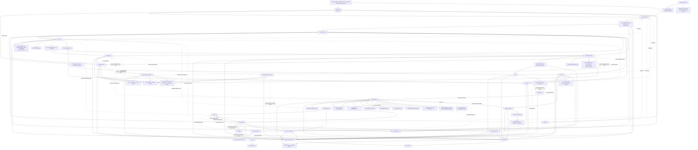

# Skill Context Relationships

Purpose: map context owners, pointers, and cross-skill pressure so skill edits do not duplicate setup docs or creep across workflow boundaries.

Scope: `skills/custom/**` markdown files, their direct supporting files, `README.md`, and `GLOBAL_AGENTS_TEMPLATE_SKILL_PACK.md`.

This is a design-analysis map, not the runtime invocation graph. Edges show ownership pressure, vocabulary influence, setup dependencies, and possible boundary creep. A graph edge does not mean a skill should invoke another skill.

Use this map to prune direct skill-handle references. Upstream means an earlier skill or doc already provides a context pointer to the owning material. A pointer is not loaded context unless its wording tells the agent to read, load, or follow it for the current branch. Keep a skill handle when no upstream read/load pointer covers the target behavior and the current skill needs a real skill boundary: recommend an explicit-only workflow, invoke or load an implicit skill, or cross a commitment boundary. When the behavior or vocabulary is already loaded through upstream wording, replace the handle with leading words.

Edge labels are descriptive, not executable. Solid edges usually mark ownership or direct workflow pressure; dotted edges usually mark conditional pressure, vocabulary influence, or escalation risk.

## Design-Pressure Map

```mermaid
flowchart TD
  GlobalTemplate["GLOBAL_AGENTS_TEMPLATE_SKILL_PACK<br/>global bootstrap template"] --> Router["skill-router<br/>router skill"]
  GlobalTemplate --> Setup["repo-bootstrap"]

  Router --> Setup["repo-bootstrap"]
  Setup --> AgentDocs["repo-local setup surface<br/>AGENTS.md + docs/agents/*"]
  AgentDocs --> Tracker["issue-tracker.md"]
  AgentDocs --> Labels["triage-labels.md"]
  AgentDocs --> DomainRouter["domain.md"]
  AgentDocs --> Contract["engineering-contract.md"]

  DomainRouter --> Context["CONTEXT.md / CONTEXT-MAP.md"]
  DomainRouter --> ADRs["docs/adr/"]
  DomainModel["domain-modeling"] --> Context
  DomainModel --> ADRs

  Router --> Shape["grilling / grill-with-docs / wayfinder / prototype"]
  Router --> Questionnaire["to-questionnaire"]
  Router --> Handoff["handoff"]
  GrillDocs["grill-with-docs"] --> Grilling["grilling"]
  GrillDocs --> DomainModel
  Grilling -. "async stakeholder gap" .-> Questionnaire
  Grilling -. "multi-decision route gap" .-> Wayfinder
  Grilling -. "fresh-context transport" .-> Handoff
  Questionnaire --> TmpQuestionnaire[".tmp/to-questionnaire/*.md"]
  Questionnaire -. "source-answerable" .-> Research
  Questionnaire -. "user-owned decision" .-> Grilling
  Wayfinder["wayfinder"] --> Tracker
  Wayfinder --> Labels
  Wayfinder -. "setup gate" .-> Setup
  Wayfinder --> Grilling
  Wayfinder --> GrillDocs
  Wayfinder -. "exact user-approved artifact packet" .-> Questionnaire
  Wayfinder --> Prototype["prototype"]
  Wayfinder --> Research["research"]
  Wayfinder --> Debug
  Wayfinder --> DomainModel
  Prototype -. "promotion or production proof" .-> Contract

  Shape --> ToSpec["to-spec"]
  ToSpec --> DomainRouter
  ToSpec --> Contract
  ToSpec --> CodeDesign
  ToSpec --> TmpSpec[".tmp/to-spec/*.md<br/>draft until publication is verified"]
  ToSpec --> Tracker
  ToSpec --> Labels
  ToSpec --> ToTickets["to-tickets"]
  ToSpec -. "setup gate" .-> Setup
  ToTickets --> Tracker
  ToTickets --> Labels
  ToTickets --> Contract
  ToTickets --> Ready["ready-for-agent items"]
  ToTickets -. "setup gate" .-> Setup

  Triage["triage"] --> Tracker
  Triage --> Labels
  Triage --> DomainRouter
  Triage -. "setup gate" .-> Setup
  Triage --> TriageFlows["ATTENTION-SCAN / SPECIFIC-ITEM / QUICK-OVERRIDE<br/>branch procedures"]
  Triage --> AgentBrief["AGENT-BRIEF.md"]
  Triage --> OutOfScope["OUT-OF-SCOPE.md / .out-of-scope/"]
  Triage --> Ready
  Triage -. "conversation-only decision" .-> Grilling
  Triage -. "domain-affecting decision" .-> GrillDocs
  Triage -. "multi-decision route" .-> Wayfinder
  Triage -. "settled multi-slice source" .-> ToTickets
  Tracker -. "ready contract" .-> Triage

  Ready --> Implement["implement"]
  Ready --> Parallel["parallel-implement"]
  Implement --> Contract
  Implement --> Review["change-review"]
  Implement --> FindingContract["FINDING-CONTRACT.md<br/>admission + remediation interface"]
  Implement -. "release / supported high risk" .-> CPR
  Implement --> Tracker
  Implement -. "unsettled work" .-> Shape
  Implement -. "unsliced source" .-> ToTickets
  Implement -. "conflict-only admission" .-> Conflict
  Parallel --> Contract
  Parallel --> Tracker
  Parallel --> DomainRouter
  Parallel --> WorkerBrief["WORKER-BRIEF.md<br/>lane worker contract"]
  Parallel --> IntegratorBrief["INTEGRATOR-BRIEF.md"]
  Parallel --> Ledger["RUN-LEDGER.md / run_ledger.py<br/>canonical events + generated ledger"]
  Parallel --> Review
  Parallel --> FindingContract
  Parallel -. "release / supported high risk" .-> CPR["high-assurance-review"]
  Parallel -. "conflicted landing" .-> Conflict
  WorkerBrief --> TDD
  WorkerBrief --> Debug
  Review --> Tracker
  Review --> Contract
  Review --> SpecSources["spec / acceptance / source material"]
  Review --> StandardsSources["repo standards / configs / test docs"]
  Review --> FindingContract
  Review -. "release / supported high risk" .-> CPR
  Review -. "repository-baseline audit" .-> Audit
  CPR --> Contract
  CPR --> SpecSources
  CPR --> StandardsSources
  CPR --> FindingContract
  CPR -. "repository-baseline audit" .-> Audit["audit-codebase"]
  Audit --> Contract
  Audit --> DomainRouter
  Audit --> AuditDefects["DEFECT-CONTRACT.md"]
  Audit --> AuditQuality["QUALITY-LENS.md<br/>concept triage"]
  Audit --> AuditCandidates["CANDIDATE-CONTRACT.md"]
  Audit --> AuditReliability["RELIABILITY-LENS.md"]
  Audit --> AuditDomain["DOMAIN-LENS.md"]
  Audit --> AuditDesign["DESIGN-LENS.md"]
  Audit --> AuditSimplify["SIMPLIFICATION-LENS.md"]
  Audit --> AuditPractices["CODING-PRACTICES-LENS.md"]
  Audit --> AuditPerformance["PERFORMANCE-LENS.md<br/>only for performance scope"]
  Audit --> AuditReport["HTML-REPORT.md<br/>sole durable artifact"]
  Audit -. "current-user decision" .-> GrillDocs
  Audit -. "settled domain capture" .-> DomainModel

  Research --> ResearchDocs["docs/research/*"]
  Conflict["resolving-merge-conflicts"] --> Contract
  Conflict --> SpecSources
  Conflict --> StandardsSources

  TDD["tdd"] --> Contract
  TDD --> DomainRouter
  Debug["diagnosing-bugs"] --> Contract
  Debug --> DomainRouter
  CodeDesign["codebase-design"] --> Contract
  CodeDesign --> DomainRouter
  Conflict -. "uncertain post-resolution failure" .-> Debug
  Simplify["simplify-code"] --> Contract
  Simplify -. "wide repository audit" .-> Audit

  Handoff -. "setup gate" .-> Setup

  TDD --> TddRefs["tests.md / mocking.md / refactoring.md"]
  TddRefs -. "uncertain repro" .-> Debug
  TddRefs -. "standalone bounded cleanup" .-> Simplify
  TddRefs -. "wide audit follow-up" .-> Audit
  Audit -. "selected design candidate" .-> CodeDesign
  CodeDesign --> DirectDesign["DIRECT-DESIGN.md"]
  DirectDesign --> DesignRefs["DEEPENING.md / DESIGN-IT-TWICE.md"]
  CodeDesign -. "wide scan" .-> Audit
  Writing["writing-great-skills"] --> Glossary["GLOSSARY.md<br/>authoring vocabulary"]
  Writing --> BehaviorEvals["BEHAVIOR-EVALS.md<br/>counterfactual wording evaluation"]
```

## Invocation Map

Source: `skills/custom/*/agents/openai.yaml`.

| Skill | Invocation |
| --- | --- |
| `codebase-design` | implicitly invocable |
| `high-assurance-review` | implicitly invocable |
| `diagnosing-bugs` | implicitly invocable |
| `domain-modeling` | implicitly invocable |
| `grilling` | implicitly invocable |
| `grill-with-docs` | implicitly invocable |
| `handoff` | explicit-only |
| `implement` | explicit-only |
| `audit-codebase` | explicit-only |
| `parallel-implement` | explicit-only |
| `prototype` | implicitly invocable |
| `repo-bootstrap` | explicit-only |
| `research` | implicitly invocable |
| `resolving-merge-conflicts` | implicitly invocable |
| `change-review` | implicitly invocable |
| `simplify-code` | explicit-only |
| `skill-router` | explicit-only |
| `tdd` | implicitly invocable |
| `to-questionnaire` | explicit-only |
| `to-tickets` | explicit-only |
| `to-spec` | explicit-only |
| `triage` | explicit-only |
| `wayfinder` | explicit-only |
| `writing-great-skills` | implicitly invocable |

## Runtime Composition

Use one verb for each accepted relationship:

- **Load `<skill>`:** apply its shared reference or discipline inside the caller. The caller keeps output, mutation, and completion ownership.
- **Invoke `<skill>`:** run the callee through its own gates, return its packet, then resume the caller.
- **Compose `<skill>`:** keep the callee active under one named composer. Each skill retains its owned gates and mutations; the composer owns the combined exit.
- **Hand off to `<skill>`:** stop the current skill and transfer ownership with the available Source Trace or packet.
- **Suggest only `<skill>`:** name a possible owner inside a read-only finding; the current caller chooses any later route and the suggesting skill neither invokes nor resumes.
- **Recommend `<skill>` and stop:** return one next route without executing it. The user or receiving caller starts it.

`Load`, `Invoke`, `Compose`, and `Hand off` target implicitly invocable skills.
An explicit-only target is normally reached through `Recommend and stop` so
human selection remains authoritative. A caller may `Invoke` an explicit-only
artifact skill only after the user approves its exact invocation packet inside
that caller; without that approval, recommend and stop.

| Caller | Verb | Callee | Condition and return |
| --- | --- | --- | --- |
| `grill-with-docs` | Compose | `$grilling` | Run the one-decision-at-a-time frontier interview; preserve its readiness and terminal packet through the composer. |
| `grill-with-docs` | Compose | `$domain-modeling` | Relay every settled material answer, return each collision or blocker to Grilling before dependent progress, and preserve Domain Modeling's authoritative cumulative Domain Delta under the explicit context action and separate ADR gate. |
| `grilling` | Recommend and stop | `$research` | A source evidence gap needs one cited note. |
| `grilling` | Recommend and stop | `$prototype` | A design evidence gap needs a runnable verdict. |
| `grilling` | Recommend and stop | `$diagnosing-bugs` | Expected behavior, the exact symptom, cause, or a trusted reproduction remains uncertain and blocks every available interview branch; Diagnosis remains uninvoked and no fix is authorized. |
| `grilling` | Recommend and stop | `$to-questionnaire` | An identifiable external stakeholder owns evidence that must be collected asynchronously. |
| `grilling` | Recommend and stop | `$handoff` | The intact gap must cross into a fresh context; preserve its evidence or decision owner and use Handoff only as transport. |
| `grilling` | Recommend and stop | `$wayfinder` | The bounded interview cannot close in one conversation because several interdependent unresolved decisions or non-conversational prerequisites need a tracker-backed multi-session route. |
| `to-questionnaire` | Recommend and stop | `$research` | Inspectable primary sources can answer the gap. |
| `to-questionnaire` | Recommend and stop | `$grilling` | The current user owns the unresolved conversation-only decision. |
| `research` | Recommend and stop | `$diagnosing-bugs` | Admission shows the missing authority is causal reproduction or diagnosis rather than source evidence. |
| `research` | Recommend and stop | `$prototype` | Admission shows the question needs one runnable design or behavior verdict. |
| `research` | Recommend and stop | `$grilling` | The current user owns the unresolved conversation-only decision. |
| `research` | Recommend and stop | `$grill-with-docs` | The current user owns the unresolved repo-backed decision and durable domain capture must remain active. |
| `research` | Recommend and stop | `$wayfinder` | Admission directly identifies several interdependent decisions and non-conversational prerequisites needing a durable route; Research returns only the deterministic match and leaves route choice to the caller. |
| `wayfinder` | Invoke | `$research` | Resolve one AFK research ticket, then record its pointer. |
| `wayfinder` | Invoke | `$prototype` | Pass decision authority, claim level, judgment mode, and the human judge when human; receive the supported answer or truthful residual, supported decision implications, evidence, limits, and cleanup state. |
| `wayfinder` | Invoke | `$diagnosing-bugs` | One AFK diagnosis ticket needs causal proof without implementation; return the diagnosis packet for Wayfinder classification. |
| `wayfinder` | Invoke | `$grilling` | One HITL ticket or Chart bound needs a conversation-only user decision; receive the intact decision or gap packet and retain map ownership. |
| `wayfinder` | Invoke | `$grill-with-docs` | One HITL ticket or Chart bound needs a user decision while durable domain capture remains active; receive the intact Grilling packet and Domain Delta. |
| `wayfinder` | Invoke | `$to-questionnaire` | One Task/HITL prerequisite needs asynchronous attributable answers and the user approved the exact recipient, needed-back, sensitivity, effort, path, durability, overwrite, no-send, origin, and return packet. The questionnaire path returns as Waiting; without exact approval, Wayfinder recommends and stops before artifact mutation. |
| `wayfinder` | Invoke | `$domain-modeling` | A settled closing decision changes durable language or warrants ADR assessment, and no current Domain Delta accounts for it; return the complete Domain Delta before Closure continues. |
| `wayfinder` | Recommend and stop | `$to-spec` | The closed map produced settled parent-spec source. |
| `wayfinder` | Recommend and stop | `$repo-bootstrap` | A required setup surface is missing or incompatible. |
| `to-spec` | Load | `$codebase-design` | Apply shared vocabulary; when source authority delegates one consequential internal design, apply Direct Design before drafting and fold the supported result into the specification. To Spec retains artifact and completion; gaps return `source-gap`. |
| `to-spec` | Recommend and stop | `$to-tickets` | `ready-spec` verifies purpose, boundaries, limitations, settled decisions and owners, required outcomes, acceptance, and Source Trace; To Tickets owns bounded repository grounding, child slicing, and graph publication. |
| `to-spec` | Recommend and stop | `$repo-bootstrap` | A required setup surface is missing or incompatible. |
| `to-tickets` | Recommend and stop | `$implement` | One ticket is ready, or overlap, a serial tripwire, uncertain independence, or uneconomic parallel dispatch requires the first ready ticket in tracker order. |
| `to-tickets` | Recommend and stop | `$parallel-implement` | An explicitly requested top-level parent-delivery run has a non-empty exhaustive Ready-for-agent graph; Parallel Implement owns qualified serial or concurrent delivery. |
| `to-tickets` | Recommend and stop | `$repo-bootstrap` | A required setup surface is missing or incompatible. |
| `triage` | Recommend and stop | `$grilling` | One maintainer-owned conversation-only decision needs direct resolution; stop before mutation and resume the same item with the intact result. |
| `triage` | Recommend and stop | `$grill-with-docs` | One maintainer-owned decision may change durable domain terms, Invariants, Context Relationships, or an ADR; stop before mutation and resume the same item with the intact result. |
| `triage` | Recommend and stop | `$wayfinder` | A bounded destination still has several interdependent decisions or non-conversational prerequisites; leave the item unchanged and start Wayfinder only if the user chooses it. |
| `triage` | Recommend and stop | `$to-tickets` | Settled source requires several independently completable implementation slices; leave readiness unchanged and pass the intact source for user-selected graph creation. |
| `triage` | Recommend and stop | `$repo-bootstrap` | A required setup surface is missing or incompatible. |
| `implement` | Invoke | `$tdd` | New behavior is settled and red-testable, or expected behavior, the exact symptom, the cause, and a trusted red-capable reproduction are known. |
| `implement` | Invoke | `$diagnosing-bugs` | A bug's exact symptom, cause, or trusted red-capable reproduction is uncertain; return the bounded diagnosis packet, including regression proof or an explicit seam gap when fix mode succeeds. |
| `implement` | Invoke | `$change-review` | The selected ordinary diff or PR, or bounded Repair generation, needs fixed-snapshot review. |
| `implement` | Invoke | `$high-assurance-review` | The selected target is a release candidate or matches a supported high-risk trigger. |
| `implement` | Hand off | `$resolving-merge-conflicts` | Admission finds an existing conflict-only state rather than the selected ready item; supply the exact operation, goal, state, scope, authorities, proof expectation, and Return owner, then stop. |
| `implement` | Recommend and stop | `$to-tickets` | A verified landed predecessor or post-publication implementation change invalidated the selected ticket's commitments or graph facts; return the implementation identity, before-and-after evidence, invalidated fields, and affected ticket. Ordinary malformed or unsettled source returns to its caller, source, or triage owner. |
| `implement` | Recommend and stop | `$repo-bootstrap` | A required setup surface is missing or incompatible. |
| `parallel-implement` | Invoke | `$tdd` | A lane worker has red-testable new behavior, or a bug whose expected behavior, exact symptom, cause, and trusted red-capable reproduction are known. |
| `parallel-implement` | Invoke | `$diagnosing-bugs` | A lane worker's bug has uncertain expected behavior, exact symptom, cause, or trusted red-capable reproduction; return to the same lane worker. |
| `parallel-implement` | Invoke | `$change-review` | The drained proved ordinary candidate or PR, or repaired successor, needs fixed-snapshot Spec and Standards review; judgment returns to the root. |
| `parallel-implement` | Invoke | `$high-assurance-review` | The drained proved target is a release candidate or matches a supported high-risk trigger; the terminal decision returns to the root. |
| `parallel-implement` | Invoke | `$resolving-merge-conflicts` | Serial landing enters preserved conflict or partial Git state; supply operation identity and goal, exact state, scope, both authorities, unrelated state, proof expectation, and root Return owner. Resume only from the resolver's fresh exact-state Return. |
| `parallel-implement` | Recommend and stop | `$to-tickets` | Admission finds an actually incomplete or contradictory graph, or verified implementation invalidates remaining graph semantics; return one exhaustive evidence-backed repair packet. Ordinary blockers, regressions, conflicts, and review findings remain in Parallel Implement. |
| `parallel-implement` | Recommend and stop | `$repo-bootstrap` | A required setup surface is missing or incompatible. |
| `tdd` | Hand off | `$diagnosing-bugs` | A bug's expected behavior, exact symptom, cause, or trusted red-capable reproduction is uncertain. |
| `tdd` | Hand off | `$prototype` | The question is design evidence rather than production proof. |
| `tdd` | Recommend and stop | `$simplify-code` | A GREEN refactor exposes settled, bounded, behavior-preserving cleanup outside the tracer bullet. |
| `tdd` | Recommend and stop | `$audit-codebase` | A GREEN refactor exposes repository-wide or unclassified audit work outside the slice. |
| `diagnosing-bugs` | Hand off | `$tdd` | Only when expected behavior, the exact symptom, the cause, and a trusted red-capable reproduction are known before Trace; retain the original caller. |
| `diagnosing-bugs` | Recommend and stop | `$implement` | Standalone diagnosis proved the cause and needs an implementation owner. |
| `resolving-merge-conflicts` | Invoke | `$diagnosing-bugs` | Diagnose an uncertain proof failure, return the causal packet, then resume Prove. |
| `change-review` | Hand off | `$high-assurance-review` | The target is a release candidate or matches a supported high-risk trigger. |
| `change-review` | Recommend and stop | `$audit-codebase` | The request targets an immutable repository baseline rather than an ordinary branch, WIP, staged, or since-X diff. |
| `high-assurance-review` | Recommend and stop | `$audit-codebase` | The request targets a bounded repository correctness, domain-robustness, methodology, or performance baseline rather than a pending release diff. |
| `audit-codebase` | Recommend and stop | `$domain-modeling` | One analyzed candidate has settled domain language, Invariants, Bounded Contexts, Context Relationships, or an ADR candidate requiring durable capture or assessment; Audit publishes an exact report-backed pickup and leaves Domain Modeling unstarted. |
| `audit-codebase` | Recommend and stop | `$grill-with-docs` | One candidate decision belongs to the current user and also requires current domain language, Invariants, relationships, or ADR handling; Audit publishes the decision brief and exact Analyze re-entry, then leaves composition unstarted. |
| `audit-codebase` | Recommend and stop | `$grilling` | One candidate decision belongs to the current user but needs no domain-record maintenance; Audit publishes the decision brief and exact Analyze re-entry, then leaves Grilling unstarted. |
| `audit-codebase` | Recommend and stop | `$research` | One analyzed candidate needs one non-diagnostic source-answerable authoritative fact; Audit publishes an exact report-backed pickup and leaves Research unstarted. |
| `audit-codebase` | Recommend and stop | `$prototype` | One settled candidate design question needs one disposable runnable probe or performance experiment; Audit publishes an exact report-backed pickup and leaves Prototype unstarted. |
| `audit-codebase` | Recommend and stop | `$diagnosing-bugs` | One candidate has broken or slow behavior with uncertain expected behavior, symptom, cause, or trusted reproduction; Audit publishes an exact report-backed pickup and leaves Diagnosis unstarted. |
| `audit-codebase` | Recommend and stop | `$to-questionnaire` | One identifiable external stakeholder holds candidate knowledge unavailable from sources or the current user; Audit publishes an exact report-backed pickup and leaves questionnaire creation unstarted. |
| `audit-codebase` | Load | `$codebase-design` | During Analyze of one selected design or mixed candidate after user decisions settle, apply Direct Design and fold its result into the HTML. Audit retains artifact and completion and creates no second design step. |
| `audit-codebase` | Recommend and stop | `$wayfinder` | Multiple interdependent unresolved candidate decisions or prerequisites need a configured tracker-backed route; Audit publishes an exact pickup and leaves Wayfinder unstarted. |
| `audit-codebase` | Recommend and stop | `$to-spec` | One analyzed candidate has settled direction and commitments but needs a durable parent specification; Audit publishes an exact report-backed pickup and leaves specification work unstarted. |
| `audit-codebase` | Recommend and stop | `$to-tickets` | One analyzed candidate has settled direction, authority, commitments, acceptance, dependency meaning, and supported states; requires multiple implementation slices; and either needs no new parent specification or already has one. Audit publishes an exact report-backed pickup and leaves ticket creation unstarted. |
| `audit-codebase` | Recommend and stop | `$simplify-code` | One analyzed candidate has a bounded behavior-preserving reduction, current report identity, supported behavior, Source Trace, and proof seam; Audit publishes an exact report-backed pickup and leaves simplification unstarted. |
| `audit-codebase` | Recommend and stop | `$implement` | One analyzed non-reduction item has settled outcome, acceptance, commitment boundary, scope and write authority, Source Trace, proof, and finite Repair budget; Audit publishes an exact report-backed pickup and leaves implementation unstarted. |
| `simplify-code` | Recommend and stop | `$audit-codebase` | The request needs repository mapping, wide discovery, or multi-subsystem audit coverage. |
| `codebase-design` | Recommend and stop | `$audit-codebase` | The request needs codebase-wide mapping and improvement discovery. |
| `handoff` | Recommend and stop | `$repo-bootstrap` | The exact Handoff target cannot be proved ignored because the disposable-artifact setup is missing or incompatible; return `not-created` and leave Repo Bootstrap unstarted. |

Wayfinder invokes Domain Modeling once for an uncovered settled closing
consequence; Audit Codebase recommends it and stops for user-selected settled
capture. Domain Modeling remains a leaf: direct use may ask focused
domain-expert questions, composed use receives settled answers from Grilling,
and every residual returns to the user or caller without invoking Skill
Router, its composer, or downstream execution. Prototype likewise returns
every terminal result directly to its current caller or the user.

To Questionnaire is an explicit-only Direct leaf. Skill Router and Grilling
recommend it and stop. Wayfinder invokes it only after the user approves the
exact artifact packet; otherwise Wayfinder also recommends and stops. A
user-supplied origin owner and identity preserve where attributable answers
return but grant no invocation or continuation authority by themselves. On a
proven terminal mismatch, To Questionnaire may recommend Research or Grilling,
then stop. Wayfinder, not To Questionnaire, owns waiting, answer reconciliation,
and continuation. Current evidence:
[`2026-07-23-to-questionnaire-behavior-eval.md`](../validation/skills/to-questionnaire/evals/EV-to-questionnaire-behavior-eval-20260723-01/evidence/2026-07-23-to-questionnaire-behavior-eval.md)
and
[`2026-07-21-to-questionnaire-pruning-equivalence-eval.md`](../validation/skills/to-questionnaire/evals/EV-to-questionnaire-pruning-equivalence-eval-20260721-01/evidence/2026-07-21-to-questionnaire-pruning-equivalence-eval.md).

## Context Owners

| Owner | Owns | Read by / pointed to |
| --- | --- | --- |
| `README.md` | Human-facing overview and installation | Humans installing or learning the pack |
| `GLOBAL_AGENTS_TEMPLATE_SKILL_PACK.md` | Minimal pack-owned global Codex bootstrap template: explicit-only router/setup discovery | `~/.codex/AGENTS.md` |
| `skill-router` | Current executable route map and tie-breakers | Humans or agents choosing one next route |
| `repo-bootstrap` | Provisions and verifies the repo setup surface | `skill-router`, setup gates in planning/tracker skills |
| `docs/agents/issue-tracker.md` | Tracker interface, work-item lifecycle, PR-as-request rules, wayfinding operations, and the campaign-scoped `landed-awaiting-lock` dependency overlay | `to-spec`, `to-tickets`, `triage`, `implement`, `parallel-implement`, `change-review`, `high-assurance-review`, `wayfinder` |
| `docs/agents/triage-labels.md` | Category/state role to label mapping and fixed wayfinding labels | `to-spec`, `to-tickets`, `triage`, `implement`, `parallel-implement`, `wayfinder` |
| `docs/agents/domain.md` | Routing to `CONTEXT.md`, `CONTEXT-MAP.md`, ADRs | `to-spec`, `triage`, `tdd`, `diagnosing-bugs`, `codebase-design`, `simplify-code`, `audit-codebase`, `parallel-implement` |
| `docs/agents/engineering-contract.md` | Engineering taste, preventive code-quality defaults, shared runtime language, commitment boundary, grounded implementation, correctness and robustness floors, Behavior-Owned Test Portfolio, Change Closure, brief code-shape and simplification guidance, implementation clarity, measured-performance discipline, fresh, negative-control, and state-boundary proof, work-state policy, fixed-snapshot Spec/Standards review, and Lock | `to-spec`, `to-tickets`, `implement`, `tdd`, `diagnosing-bugs`, `codebase-design`, `prototype`, `simplify-code`, `audit-codebase`, `parallel-implement`, `resolving-merge-conflicts`, `change-review`, `high-assurance-review` |
| `domain-modeling` | Resolves domain semantics; exclusively accumulates and returns the authoritative current cumulative Domain Delta; renders or persists routed `CONTEXT.md` and `CONTEXT-MAP.md` changes under `render only` or `persist authorized`; assesses plausible ADR candidates; and records approved ADR truth | `skill-router`, `grill-with-docs`, `wayfinder`, `repo-bootstrap` |
| `codebase-design` | Bounded module-design procedure and detailed Responsibility, Interface, Seam, Adapter, Proof Seam, correctness, robustness, migration, and replacement vocabulary | `to-spec`, `audit-codebase`, direct architecture/design work |
| `research` | Claim-owning source legwork and one authorized cited note or verified inline evidence | `skill-router`, `grilling`, `wayfinder` |
| `to-questionnaire` | One recipient-ready async discovery artifact for one external stakeholder and downstream decision | `skill-router`, `grilling`, `wayfinder`, humans collecting stakeholder evidence |
| `resolving-merge-conflicts` | Read-only three-way inspection, authorized reconciliation, and the separate finish boundary | Git operations and implementation or integration work that enters a conflicted state |
| `change-review` | Ordinary fixed-snapshot Standards/Spec review | `implement`, `parallel-implement`; hands off once to `high-assurance-review` for release or supported high risk |
| `audit-codebase` | Durable repository atlas plus current-source, user-selected subsystem audits and candidate analyses with mandatory correctness, robustness, domain, design, simplification, coding-practice, and applicable performance coverage; detailed owners load when implicated, and one HTML report updates incrementally without a release decision | `skill-router`, `change-review`, `high-assurance-review`, `tdd`, `simplify-code`, `$grill-with-docs` decision returns, and humans explicitly invoking repository audits |
| `simplify-code` | One unstaged, behavior-preserving simplification patch, an explicit finite and bounded `until-clean` campaign, or a proved no-safe-cut verdict | `skill-router`, `tdd`, `audit-codebase`, humans invoking bounded cleanup |

## Supporting Files

| Skill | Supporting files own |
| --- | --- |
| `writing-great-skills` | `GLOSSARY.md`: leading-word, invocation, reference-loading, skill-splitting, transfer, and derived-state vocabulary; `BEHAVIOR-EVALS.md`: fresh-context counterfactual wording evaluation |
| `codebase-design` | `DIRECT-DESIGN.md`: direct pass, material Interface, safe Return, and packet; `DEEPENING.md`: dependency/Seam, test-portfolio, Change Closure, and migration discipline; `DESIGN-IT-TWICE.md`: alternative Interface exploration |
| `domain-modeling` | `CONTEXT-FORMAT.md`: glossary and context-map format; `ADR-FORMAT.md`: ADR gate and format |
| `tdd` | `tests.md`, `mocking.md`, `refactoring.md`: examples and branch mechanics |
| `prototype` | `LOGIC.md`, `UI.md`, and `MEASURE.md`: decision-bearing branch mechanics. One decision branch loads; `SKILL.md` owns the universal lifecycle, reconciliation, and Return. |
| `triage` | `ATTENTION-SCAN.md`, `SPECIFIC-ITEM.md`, `QUICK-OVERRIDE.md`: branch procedures; `AGENT-BRIEF.md`: agent/human ready brief, branch emphasis, and Ready Gate; `OUT-OF-SCOPE.md`: rejected-work knowledge base |
| `repo-bootstrap` | Tracker, label, domain, and engineering-contract seeds; `setup-schema.json`: aggregate compatibility fingerprint; per-file source markers and `scripts/validate_setup.py`: complete target-repo setup-surface reconciliation and validation |
| `wayfinder` | `MAP-FORMAT.md`: canonical map and ticket shape, empty-fog sentinel, and exclusion pointers; `SKILL.md`: Chart, Advance, Maintain, Closure, and foggy map lifecycle semantics |
| `research` | One cited repo-local Markdown note per source question |
| `resolving-merge-conflicts` | `OPERATIONS.md`: branch-only operation roles, conflict classes, finish checks, and recovery decisions; `SKILL.md`: universal State/Trace/Reconcile/Prove/Finish contract, authority, typed Return, and completion |
| `change-review`, `high-assurance-review`, `implement`, `parallel-implement` | `change-review/FINDING-CONTRACT.md`: shared axes, review classes, supported-risk and finding admission, remediation classes, and remediation-review bound; `change-review/SMELL-BASELINE.md`: fallback Standards reference when repo standards are thin |
| `audit-codebase` | `DEFECT-CONTRACT.md`: defects and gaps; `QUALITY-LENS.md`: mandatory six-class coverage, triage, opportunity admission, and retained complexity; detailed lens owners: conditional depth; `CANDIDATE-CONTRACT.md`: current-source candidate admission and thorough comparison; `CANDIDATE-FOLLOWUP.md`: conditional decisions, returned evidence, and one next-owner suggestion; `HTML-REPORT.md` plus `scripts/update_report.py`: durable linked atlas and atomic marked-region updates |
| `parallel-implement` | `WORKER-BRIEF.md`, `INTEGRATOR-BRIEF.md`, `CODEX-WORKTREE-LAUNCH.md`: compact lane contracts and one-step checkout opening; `run_ledger.py` and `RUN-LEDGER.md`: intuitive campaign facade over canonical event state, strict authority validation, generated ledger, and closeout plan |

## Boundary Notes

- The global template exposes bootstrap handles; `skill-router` routes; neither teaches downstream workflow procedures.
- The bundled system `skill-creator` owns new-package scaffolding and metadata mechanics. `$writing-great-skills` owns semantic quality for new and existing canonical skill instructions, stops after canonical proof, and does not absorb installation or delivery.
- Setup docs own tracker, labels, domain routing, and engineering-contract details. Skills should point there instead of restating those mechanics.
- `$grill-with-docs` is the narrowly implicitly invocable composer of
  `$grilling` and `$domain-modeling`; it accepts a direct-user request or an
  exact caller packet that preserves the current user as decision owner and
  supplies the return owner. The owned skills do not invoke each other. Missing
  context authority defaults to `render only`, and ADR approval remains
  separate. Every settled material answer crosses Relay;
  collisions or blockers return before dependent questioning; Domain Modeling
  alone accumulates the current Domain Delta. A material Domain Delta blocker
  makes the combined status `Blocked`; otherwise the composer preserves
  Grilling's terminal packet and starts no downstream route. Wayfinder invokes
  Grilling or Grill With Docs for its selected conversational decision; Triage,
  Skill Router, Research, and Audit Codebase only recommend and stop under their
  predicates. Wayfinder invokes Domain Modeling separately only for an
  unaccounted settled closing consequence.
- `to-questionnaire` owns async stakeholder elicitation into one verified
  artifact after admission. Source-answerable gaps recommend `$research`; a
  current-user-owned decision recommends `$grilling`. Supplied origin context
  grants no invocation authority by itself. Wayfinder may invoke it only after
  exact user approval of the artifact packet, then Wayfinder owns Waiting and
  answer reconciliation. To Questionnaire does not contact the recipient, wait,
  ingest or analyze answers, continue the origin workflow, mutate trackers or
  domain truth, or synthesize a specification.
- `domain-modeling` is the only skill that writes `CONTEXT.md`, `CONTEXT-MAP.md`, or approved ADR truth; `repo-bootstrap` configures and verifies routing before persistence across a required topology transition, and vocabulary consumers follow `docs/agents/domain.md`.
- `to-spec` owns final source admission, parent spec synthesis, and tracker publication; Grilling may report conditional spec-source readiness but neither drafts nor publishes. `to-tickets` owns implementation issue slicing.
- `wayfinder` owns finite foggy multi-session maps, ticket classification,
  resolver selection, result reconciliation, consequence-only Maintain repairs,
  fog disposition, and the compact closing source or decision packet. Tracker
  docs own transport, publication order, child and shared-map claim identity,
  waiting state, stale-claim recovery, and outcome mechanics. Each resolver owns
  its local gates and Return; none chooses the map outcome or downstream route.
- `research` owns one bounded source question, claim-owning evidence judgment, and one authorized cited note or verified inline result. A user request or caller packet must authorize one note path before that tracked mutation; otherwise Research returns cited inline evidence, a blocker, or typed `not-admitted` classification without choosing the caller's next route.
- `resolving-merge-conflicts` inspects State and Trace read-only by default.
  Reconciliation authority permits only in-scope working-tree changes; finish
  authority separately permits exact-path staging and native continuation.
  Prepared and finished outcomes remain distinct. Recovery actions and
  whole-side selection require action-specific authority.
- Tracker docs own transport, tracker commands, Ready-for-agent state and
  navigation, and Mutation read-back. `triage` owns incoming classification,
  verification, its Codex-ready brief and Ready Gate, state transitions, and
  the AI disclaimer; `$to-tickets` owns execution packets, slicing, dependency
  order, proof-responsibility mapping, and graph readiness. Do not re-triage
  valid `$to-tickets` output.
- `implement` owns one standalone selected item and its bounded Repair campaign; `parallel-implement` owns one explicitly requested parent-backed exhaustive Ready-for-agent graph through qualified serial or concurrent frontiers, bounded Repair generations, serial integration, and verified child-first then parent-last closeout.
- The `parallel-implement` orchestrator is the sole dispatcher and formal-review owner. Lane workers and child integrators never fan out; an integration lane lands, validates, and returns a review-ready packet.
- `change-review` is the ordinary fixed-snapshot diff and PR gate and may hand off once to `high-assurance-review` for a release candidate or supported high-risk trigger; the high-assurance route never hands back.
- `change-review` and `high-assurance-review` return terminal read-only evidence. Their reports grant no mutation or successor-snapshot authority; the implementation caller's pre-recorded Charter and Repair Budget govern continuation.
- `high-assurance-review` may run its own bounded read-only reviewer passes only when selected as the review route; it is not a second implementation orchestrator.
- `audit-codebase` owns the exhaustive system/subsystem map, one user-selected subsystem audit, and one user-selected improvement-candidate analysis per invocation over one immutable repository baseline. It accumulates verified items, retained complexity, candidate strength, decision briefs, returned decision packets, and coverage state in one durable offline HTML report. It ranks candidates only inside an audited subsystem, ranks no subsystem, suggests exactly zero or one candidate next step, starts no downstream work, and returns selection authority to the user.
- `simplify-code` owns one standalone cleanup patch or an explicitly bounded serial `until-clean` campaign with a finite cut budget, strict net-reduction ledger, and terminal stop condition under before-and-after proof gates. It does not own feature work, bug diagnosis, public-contract decisions, wide improvement surveys, staging, commits, or tracker closeout.
- `handoff` is an explicit transport leaf: it carries exact pointers across a shared work root, preserves the active owner, and never duplicates durable truth, routes new work, or resumes from stale state.
- `.tmp/` artifacts are disposable unless a skill explicitly preserves them for the user or next session.
- `.scratch/` artifacts are durable, version-controlled local state; include in-scope changes in review and staging.
