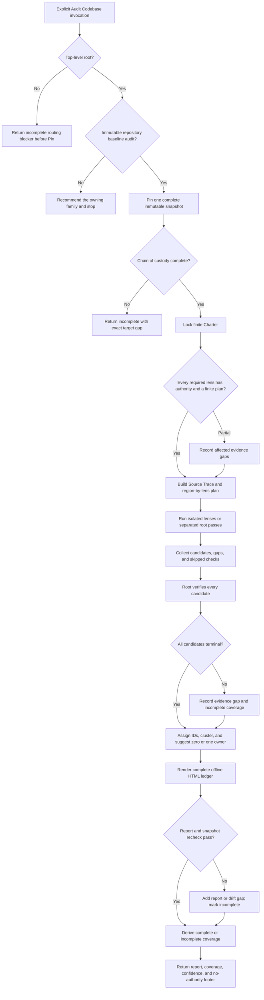

# Audit Codebase Coverage And Evidence Design Synthesis

Status: exhaustive design reference and extraction map, not an executable contract.

Runtime authority remains in:

- `skills/custom/audit-codebase/SKILL.md`;
- `skills/custom/audit-codebase/DEFECT-CONTRACT.md`, `PERFORMANCE-LENS.md`, and `HTML-REPORT.md`;
- `skills/custom/audit-codebase/agents/openai.yaml`;
- `skills/custom/review/ADVISORY-CONTRACT.md` when the Charter enables advisories;
- `docs/agents/engineering-contract.md`, the caller's Charter, and the target repository's domain, methodology, data, validation, and operational contracts;
- the relationship map, router, review-family owners, pack tests, behavior evaluations, and installed mirror.

The current canonical Audit Codebase package matches its installed mirror. Historical evaluations support its terminal coverage status, root-only guard, defect/advisory/gap separation, performance classification, complete item retention, zero-or-one immediate-owner suggestion, ready-remediation route to `$implement`, and offline HTML-report shape at their recorded hashes. This synthesis does not claim that the future rewrite described below has been extracted or behaviorally promoted. Canonical runtime source remains executable authority until a coordinated candidate passes every applicable gate and is separately synchronized.

## How To Read This Document

This synthesis is exhaustive for accepted Audit Codebase behavior, material alternatives, owned file changes, foreign-owner requirements, and proof needed for a future rewrite. It is not a second audit procedure.

The document has four layers:

1. **Orientation** states the outcome, family boundary, vocabulary, and explanatory flow.
2. **Normative Design** is the sole authority for proposed runtime behavior and relationships.
3. **Evidence And Rationale** preserves current evidence, deliberate non-changes, residual gaps, and deferred hypotheses without creating runtime rules.
4. **Extraction And Verification** places and proves the design without redefining it.

Change proposed runtime behavior in Layer Two; explain it in Layer Three; place and prove it in Layer Four. The Design Verdict summarizes selection status without creating rules. The Normative Home Index assigns each behavior one authority. The Runtime Ownership And Change Map alone owns file placement and source bundles. The Staged Extraction Plan owns implementation order. The Staged Behavior-Evaluation Protocol owns proof mechanics. The Migration And Acceptance Matrix owns case coverage only. [Synthesis Ownership](../README.md#synthesis-ownership) governs cross-document placement: this note owns Audit Codebase's process and required capability outcomes, while each foreign file owner's synthesis owns its concrete rewrite.

Use this index for direct navigation:

| Question | Owning section |
| --- | --- |
| What outcome and boundary govern the rewrite? | [North Star](#north-star), [Design Verdict](#design-verdict), and [Audit Family Boundary](#audit-family-boundary) |
| How may an audit begin? | [Invocation, Admission, And Root Guard](#invocation-admission-and-root-guard) |
| Where does each proposed rule live? | [Normative Home Index](#normative-home-index) |
| What exactly is the immutable target? | [Snapshot And Chain-Of-Custody Contract](#snapshot-and-chain-of-custody-contract) |
| What makes a Charter executable? | [Charter Contract](#charter-contract) |
| How is full audit scope made finite and visible? | [Lens Plan And Coverage Contract](#lens-plan-and-coverage-contract) |
| Which artifact proves which claim? | [Audit Artifact Authority Contract](#audit-artifact-authority-contract) |
| How do independent lenses and degraded capacity work? | [Lens Isolation, Capacity, And Root Fallback](#lens-isolation-capacity-and-root-fallback) |
| What evidence may the audit collect read-only? | [Read-Only Evidence And Command Contract](#read-only-evidence-and-command-contract) |
| When does an observation become a defect, advisory, gap, duplicate, or disproved item? | [Candidate And Evidence-Ledger State Contract](#candidate-and-evidence-ledger-state-contract), [Defect Admission And Severity](#defect-admission-and-severity), [Evidence Gaps](#evidence-gaps), and [Advisories](#advisories) |
| What makes a performance claim valid? | [Performance Lens](#performance-lens) |
| How are suggested owners chosen without starting work? | [Finding Clusters And Suggested Owners](#finding-clusters-and-suggested-owners) |
| What do complete, incomplete, full, and reduced mean? | [Coverage Status And Confidence](#coverage-status-and-confidence) |
| What must the HTML artifact contain? | [Report Contract](#report-contract) |
| When is each operation complete? | [Operation And Completion Contracts](#operation-and-completion-contracts) |
| What does every invocation return? | [Return Contract](#return-contract) |
| Which skill owns each family and handoff edge? | [Relationship Ownership](#relationship-ownership) |
| How should the eventual main skill read and load references? | [Proposed Runtime Semantic Surface](#proposed-runtime-semantic-surface) and [Runtime Context Loading Contract](#runtime-context-loading-contract) |
| What belongs in each runtime surface? | [Runtime Ownership And Change Map](#runtime-ownership-and-change-map) |
| What must pass before promotion? | [Staged Behavior-Evaluation Protocol](#staged-behavior-evaluation-protocol), [Migration And Acceptance Matrix](#migration-and-acceptance-matrix), [Promotion Gate And Residual Gaps](#promotion-gate-and-residual-gaps), and [Completion Criterion For The Future Rewrite](#completion-criterion-for-the-future-rewrite) |

When another layer disagrees with Layer Two, correct that layer. Diagrams explain; ownership rows place; acceptance cases test. None may create a second runtime rule.

# Layer One: Orientation

## North Star

Audit Codebase owns one outcome: a complete, source-traced, read-only coverage judgment over one immutable repository baseline, expressed as one verified offline HTML ledger and returned without a release decision, ranking, repair, or downstream execution.

The caller owns what must be audited. Audit Codebase owns making that boundary finite, preserving chain of custody, covering every required region-and-lens cell, verifying every surviving item, reporting every terminal item, and distinguishing coverage from acceptance.

Five invariants govern the design:

1. One invocation audits one immutable snapshot under one bounded Charter.
2. Every required cell has an authoritative expectation, supported scenario, observable evidence seam, and terminal coverage state.
3. No candidate or unverified assertion survives as a finding.
4. Severity orders admitted defects; it never changes coverage status or grants release or mutation authority.
5. The audit may suggest at most one immediate owner per item or cohesive cluster, but it starts nothing and names no workflow chain.

## Design Verdict

This table summarizes selection status and points to Layer Two for authority. It creates no runtime rule.

| Stratum | Selected shape | Runtime status |
| --- | --- | --- |
| Audit core | Explicit top-level-root invocation; one immutable snapshot; one finite caller-defined Charter; region-by-lens coverage; direct fresh-context read-only lenses when useful; root verification; terminal defect, advisory, gap, disproved, and duplicate states; one verified HTML ledger; `complete` or `incomplete` coverage | Preserve and sharpen through coordinated extraction |
| Finding system | Audit-owned five-gate defect admission, required-evidence gaps, shared opt-in advisories, performance-specific like-for-like measurement, stable IDs, complete retention, and zero-or-one suggested owner by evidence state and work shape | Preserve current ownership; remove ambiguity without merging diff-review findings into audit defects |
| Runtime surfaces | One compact `SKILL.md` plus the existing defect, performance, and HTML references; shared advisory contract remains Review-owned | Keep the current progressive-disclosure topology initially |
| Required capability deltas | Exact route-before-Pin behavior, explicit coverage-cell semantics, artifact authority, command-write containment, operation completion, context loading, report verification, relationship reconciliation, structural tests, fresh behavior evaluations, and mirror parity | Required before promotion; concrete foreign-owner changes remain with their owners |
| Deferred hypotheses | A snapshot helper or manifest, a deterministic report renderer, a machine-readable sidecar, a dedicated methodology/data lens reference, audit assurance, and a direct Codebase Design suggestion | Excluded from the first rewrite unless observed variance and evidence justify them |
| Rejected machinery | Release decisions, automatic repair, ranked recommendations, a Top recommendation, an event ledger, tracker state, finding consensus, severity-driven routing, an audit-owned universal methodology, and automatic downstream invocation | Preserve the simpler terminal read-only owner |

## Audit Family Boundary

One target and requested outcome have one primary owner:

| Target and requested outcome | Owner | Terminal result |
| --- | --- | --- |
| Ordinary branch, WIP, staged-only, or since-X diff needing Standards and Spec judgment | `$review` | One complete or incomplete ordinary review report |
| Local PR, release candidate, or caller-selected bounded high-risk diff needing independent release judgment | `$convergent-pr-review` | One terminal review decision |
| Immutable repository baseline needing bounded correctness, domain, robustness, methodology, model-risk, data, analytics, validation, calibration, metric, performance, or other contract-backed coverage | `$audit-codebase` | One complete or incomplete coverage ledger without a release decision |
| Broad discovery of structural improvement opportunities, trade-offs, and ranking | `$improve-codebase` | One disposable survey report and no automatic implementation |
| One uncertain failing symptom, cause, expected behavior, or reproduction | `$diagnosing-bugs` | One causal packet without an implied broad baseline audit |
| One bounded module, interface, seam, adapter, ownership, migration, or compatibility question | `$codebase-design` | One bounded design packet |

Audit Codebase is not a slower review, a wide improvement survey, or a repair campaign. A severe baseline defect does not convert the audit into a release gate. A large settled remediation does not convert it into Wayfinder. A performance smell without measurement is not a performance defect. An explicit audit may be broad, but its Charter must still make every region and lens finite.

## Operating Model

```text
one top-level root audit owner
    + one immutable captured target
    + one finite Charter and coverage matrix
    + zero or more direct fresh-context read-only lenses when scope partitions cleanly
    + root-owned verification and terminal evidence ledger
    + one self-contained verified HTML report
    + one terminal coverage return to the caller
```

The root retains route admission, chain of custody, Charter interpretation, lens planning, capacity decisions, ledger authority, verification, clustering, suggested-owner classification, report verification, coverage status, confidence, and Return. Lens agents own only their assigned read-only evidence pass and never spawn, mutate, rank, route, or decide completion.

## Audit Vocabulary

| Term | Meaning |
| --- | --- |
| **Snapshot** | The complete immutable target identity and captured non-Git-addressed content for one audit run |
| **Charter** | The caller-bounded outcome, snapshot, regions, lenses, expectations, scenarios, workloads, environments, proof, non-goals, and advisory choice |
| **Region** | One finite code, data, configuration, documentation, operational, or cross-cutting boundary named by the Charter |
| **Lens** | One contract-backed question applied across one or more regions |
| **Coverage cell** | One named region-and-required-lens intersection with an expectation, scenario, evidence seam, and terminal state |
| **Source Trace** | The indexed governing request, repo instructions, domain decisions, authoritative sources, implementation, callers, tests, data lineage, validation, workloads, and constraints used by the audit |
| **Candidate** | A lens-produced observation awaiting root verification; it is never yet a finding |
| **Evidence ledger** | The root-owned inventory of every candidate and its terminal verified, disproved, duplicate, advisory, or evidence-gap disposition |
| **Defect** | A verified in-scope violation that passes the Audit Finding Contract's five gates |
| **Advisory** | An enabled, verified, nonblocking opportunity with no violated governing contract |
| **Evidence gap** | Required evidence or authority the read-only audit cannot obtain |
| **Finding cluster** | Several preserved member items sharing one remediation boundary or one unresolved decision structure |
| **Coverage status** | `complete` or `incomplete`; it measures whether the audit closed its Charter, not whether the snapshot is acceptable |
| **Confidence** | `full` or `reduced`; it records evidence and independence quality without changing coverage truth |

## Leading-Word Runtime Model

The eventual skill should make its existing spine operational:

| Leading word | Runtime meaning |
| --- | --- |
| **Pin** | Establish chain of custody for one complete immutable target before repository judgment |
| **Charter** | Convert caller intent into finite regions, lenses, expectations, scenarios, evidence, and non-goals |
| **Trace** | Build the Source Trace and coverage plan from authoritative sources and observable seams |
| **Examine** | Run isolated read-only lens passes over assigned coverage cells |
| **Verify** | Root-check every candidate against the snapshot and governing expectation until it reaches a terminal evidence state |
| **Synthesize** | Preserve all terminal items, assign stable IDs, cluster only by shared work, and suggest at most one immediate owner |
| **Report** | Render and verify the complete offline ledger and coverage matrix |
| **Return** | Emit one coverage status, confidence, report path, and authority footer, then stop |

The existing anchors remain load-bearing inside those operations: **Chain of custody**, **Burden Of Proof**, **Like-for-like**, and **Ledger, not leaderboard**.

## End-To-End Explanatory Flow



The diagram is explanatory. Layer Two owns admission, artifact authority, item states, completion, and Return.

# Layer Two: Normative Design

## Normative Home Index

Each proposed concern has one normative home. Other sections may explain, place, or test it but never create a competing rule.

| Concern | Sole normative home |
| --- | --- |
| Invocation reach, family admission, and delegated refusal | [Invocation, Admission, And Root Guard](#invocation-admission-and-root-guard) |
| Human, root, lens, and mutation authority | [Authority And Mutation Boundary](#authority-and-mutation-boundary) |
| Target identity, live-content capture, and drift | [Snapshot And Chain-Of-Custody Contract](#snapshot-and-chain-of-custody-contract) |
| Audit outcome, scope, expectations, and advisory choice | [Charter Contract](#charter-contract) |
| Lens requirements, region partition, and coverage-cell states | [Lens Plan And Coverage Contract](#lens-plan-and-coverage-contract) |
| Reference-loading triggers | [Runtime Context Loading Contract](#runtime-context-loading-contract) |
| What each audit artifact proves | [Audit Artifact Authority Contract](#audit-artifact-authority-contract) |
| Fresh-lens isolation and degraded capacity | [Lens Isolation, Capacity, And Root Fallback](#lens-isolation-capacity-and-root-fallback) |
| Read-only command and evidence admissibility | [Read-Only Evidence And Command Contract](#read-only-evidence-and-command-contract) |
| Candidate and terminal ledger transitions | [Candidate And Evidence-Ledger State Contract](#candidate-and-evidence-ledger-state-contract) |
| Defect gates, fields, and severity | [Defect Admission And Severity](#defect-admission-and-severity) |
| Required unavailable evidence | [Evidence Gaps](#evidence-gaps) |
| Optional nonblocking opportunities | [Advisories](#advisories) |
| Performance classification and measurement | [Performance Lens](#performance-lens) |
| Clustering and suggested-owner choice | [Finding Clusters And Suggested Owners](#finding-clusters-and-suggested-owners) |
| Coverage status and confidence | [Coverage Status And Confidence](#coverage-status-and-confidence) |
| HTML artifact semantics and verification | [Report Contract](#report-contract) |
| Per-operation completion and legal nonterminal return | [Operation And Completion Contracts](#operation-and-completion-contracts) |
| Invocation output | [Return Contract](#return-contract) |
| Cross-skill family and context edges | [Relationship Ownership](#relationship-ownership) |

## Invocation, Admission, And Root Guard

Audit Codebase is explicit-only. Preserve `policy.allow_implicit_invocation: false`. A user deliberately starts it by naming `$audit-codebase`, or reaches it after another owner recommends it and stops. Recommendation never invokes the audit automatically.

Route before Pin:

| Observed request and target | Required result | Illegal shortcut |
| --- | --- | --- |
| Top-level root receives one bounded immutable repository-baseline audit | Continue to Pin | Turning the audit into a release gate or improvement ranking |
| Caller explicitly requests whole-codebase coverage | Continue only after Charter partitions finite regions and required lenses | Treating `everything` as an executable unbounded instruction |
| A delegated task invokes Audit Codebase | Return `incomplete` to the top-level root before Pin, repository inspection, run-ID creation, evidence writes, or lens dispatch | Letting a delegated lens become the audit owner or fan out |
| Target is an ordinary pending diff | Recommend `$review` and stop | Auditing the repository baseline and pretending it judges the change |
| Target is a PR, release candidate, or bounded high-risk pending diff | Recommend `$convergent-pr-review` and stop | Issuing a release decision through Audit Codebase |
| Request is broad structural discovery or ranking without a violated expectation | Recommend `$improve-codebase` and stop | Converting opportunities into defects to keep the audit route |
| Request is one uncertain symptom or cause | Recommend `$diagnosing-bugs` and stop | Opening a whole-baseline audit for one causal question |
| Request is one bounded interface or ownership design | Recommend `$codebase-design` and stop | Treating a design choice as a baseline defect without an expectation |
| Target, family, or caller outcome remains materially ambiguous after read-only discovery | Return the exact routing blocker | Guessing, auditing multiple baselines, or asking for discoverable facts |

Family admission allows Pin when the request is plausibly one bounded repository-baseline audit. Executable audit admission closes only after Pin and Charter prove one resolvable target, at least one finite region, at least one required lens, and at least one authoritative expected contract, invariant, methodology, budget, comparison basis, or required-evidence rule for each executable lens. Missing or conflicting authority does not license invented expectations. It becomes an affected-cell evidence gap and may make the admitted audit incomplete; a wholly authority-free request routes to the more appropriate discovery owner.

## Authority And Mutation Boundary

| Authority | Owner | Consequence |
| --- | --- | --- |
| Audit outcome, commitment boundary, regions, required lenses, non-goals, and advisory choice | Caller through the Charter | Audit Codebase may make the boundary finite but may not change its meaning |
| Expected domain, methodology, behavior, data, validation, metric, performance, and operational contracts | Target repository and caller-supplied authoritative sources | Missing or conflicting authority is reported, never invented |
| Snapshot identity, lens plan, capacity, evidence ledger, verification, clustering, status, confidence, report, and Return | Top-level audit root | Lens agents and helpers cannot decide these |
| One assigned evidence pass | Direct lens agent | Read-only evidence only; no peer dispatch, mutation, clustering, routing, or completion authority |
| Suggested next owner selection | Audit root under the finding contract | Suggestion is non-authoritative and requires later caller selection |
| Release, residual-risk acceptance, repair, successor snapshot, tracker change, commit, push, deployment, message, or external mutation | Caller or a later owning workflow | Audit Codebase grants none of these |

The mutation boundary permits only disposable captured evidence and the one report under `.tmp/audit-codebase/<run-id>/`. Product files, tracked docs, the Git index and refs, commits, worktrees, trackers, PR reviews, deployments, external messages, production systems, and external data remain unchanged. A command whose ordinary behavior writes outside the run directory is ineligible unless its writes can be redirected or the command runs against a disposable materialization inside the run directory.

## Snapshot And Chain-Of-Custody Contract

Pin creates one snapshot record before substantive repository judgment:

```text
Run ID:
Repository identity and absolute path:
Target kind: commit-or-tree | branch-baseline | live-worktree-baseline
Resolved commit and tree when applicable:
HEAD identity:
Index identity and entries when applicable:
Staged diff identity:
Unstaged diff identity:
In-scope non-Git-addressed paths and content hashes:
Status and submodule or nested-repository state when applicable:
Capture time and evidence paths:
Excluded or unavailable content:
Recheck method:
```

Target kinds have distinct custody requirements:

| Target kind | Complete Pin | Audit access |
| --- | --- | --- |
| Supplied commit or tree | Resolve the exact Git object and prove it is readable and nonempty | Read Git-addressed content directly or materialize a disposable copy under the run directory without registering a worktree |
| Branch baseline | Resolve the branch once to its commit and tree; later branch movement does not change the snapshot | Audit the resolved object, never the moving branch name |
| Live worktree baseline | Capture `HEAD`, index entries, staged and unstaged changes, status, and every in-scope non-Git-addressed path needed by supported scenarios | Read the captured content or continuously preserve its identity; never silently substitute later live state |

Hash only content not already addressed by the captured Git identity. Do not read secrets, protected data, ignored artifacts, submodules, or external stores merely because they exist; include them only when the Charter and access authority make them in scope. An in-scope component that cannot be captured becomes an exact evidence gap.

Pin is incomplete when the target does not resolve, is empty, contains unresolved identity ambiguity, or cannot be captured completely enough for the Charter. Recheck custody before Report verification and Return. Any semantic target drift makes the run stale and `incomplete`; preserve the captured identity and observed drift, and let the caller authorize a new run rather than rebasing findings onto a successor snapshot.

## Charter Contract

Lock this packet before lens work:

```text
Audit outcome:
Snapshot:
Regions:
Required lenses:
Expected contracts, invariants, methodologies, budgets, or comparison bases:
Supported scenarios:
Workloads and environments:
Required evidence and proof:
Severity rubric or source:
Non-goals:
Advisories: yes | no
```

Every required lens must name its authority. Repository contracts win within their owned scope; caller-supplied sources may add requirements but do not silently overwrite durable repository decisions. Preserve conflicts as conflicts with their owners and coverage impact.

An explicitly whole-codebase request remains valid only after the root partitions it into named finite regions and lenses. Cross-cutting lenses may span several regions, but every cell must still identify its paths, scenarios, and evidence seam. Non-goals are outside the ledger even when interesting. Mid-run changes to snapshot, outcome, required lenses, expectations, or non-goals require caller authorization and a new Charter generation; a snapshot change requires a new run.

If the repository and caller provide no severity meanings, record one common P0-P3 impact interpretation in the Charter before Examine. Lens agents never invent local severity scales.

## Lens Plan And Coverage Contract

Build the initial coverage matrix before dispatch. Each cell records:

```text
Region:
Lens:
Expected contract or required-evidence rule:
Supported scenario or explicit non-applicability predicate:
Code, data, configuration, documentation, and caller paths:
Observable evidence seam:
Required proof:
Known unavailable evidence:
Assigned owner:
Terminal state: covered | gap | blocked | not applicable
Evidence or gap IDs:
```

The matrix crosses every named region with every required lens. A lens may be globally not applicable only when authoritative evidence establishes that predicate; silence is not non-applicability.

| Terminal state | Meaning |
| --- | --- |
| `covered` | Required evidence was obtained; every candidate is terminal; the cell links to its evidence, defects, advisories, disproved items, or clean result |
| `gap` | A bounded required claim cannot be decided because named evidence is missing or unobtainable read-only |
| `blocked` | The audit cannot safely execute or verify the cell because target, authority, access, tool, environment, or preservation preconditions are unavailable |
| `not applicable` | A named authoritative predicate proves the lens does not apply to the region |

Plan lens evidence by question, not by generic checklist:

| Lens family | Minimum planning pressure |
| --- | --- |
| Correctness and robustness | Expected behavior, supported initial and lifecycle states, failure branches, caller-facing seam, and proportionate proof |
| Domain | Canonical terms, invariants, context ownership, boundaries, and observable business consequence |
| Methodology and model risk | Authoritative method, assumptions, population and temporal boundary, required validation, and decision consequence |
| Data and leakage | Lineage, identity and time boundaries, split and transformation order, contamination paths, and supported dataset conditions |
| Metrics, analytics, calibration, and validation | Definition, unit, denominator, aggregation, weighting, partition, comparison, uncertainty, and decision use |
| Performance and resources | The complete [Performance Lens](#performance-lens) measurement contract |
| Other caller-defined behavior | One authoritative expectation, supported scenario, observable seam, and proportionate proof before admission |

These are planning requirements, not universal methodologies. Audit Codebase never substitutes a built-in best practice for missing governing authority.

Coverage is exhaustive over the Charter, not over every imaginable repository concern. Newly observed out-of-Charter material is ignored unless it proves the snapshot or Charter incoherent; the root records that exact boundary issue without silently widening the run.

## Runtime Context Loading Contract

Load only the smallest complete context for the active phase:

| Trigger | Load now | Keep out |
| --- | --- | --- |
| Every admitted audit | `SKILL.md`, repo instructions, engineering contract, Charter, and snapshot record | Diff-review procedure, improvement ranking, implementation steps, all conditional references |
| Charter and Trace | Target repository's routed domain, methodology, data, validation, and operational sources that govern named cells | Unrelated docs, speculative external methodology, provider mutation procedure |
| Before lens briefing and root verification | `DEFECT-CONTRACT.md` | Diff `FINDING-CONTRACT.md` and remediation instructions |
| `Advisories: yes` | `review/ADVISORY-CONTRACT.md` | Advisory fields and opportunity hunting when disabled |
| Performance or resource lens selected | `PERFORMANCE-LENS.md` | Performance procedure for unrelated lenses |
| One lens dispatch | Snapshot pointer, Charter, Source Trace pointers, assigned cells, mutation boundary, and output contract | Parent hypotheses, peer results, whole report schema, unrelated cells, suggested-owner table |
| Synthesize | Verified evidence ledger and `DEFECT-CONTRACT.md` suggestion section | Lens speculation and downstream skill procedures |
| Report | `HTML-REPORT.md`, terminal ledger, coverage matrix, and snapshot record | Runtime implementation of suggested skills |
| Family misroute or delegated invocation | The exact route or root-guard packet only | Audit references, repository inspection, or run artifacts |

A context pointer is complete only when it names its trigger, target, expected result, and return boundary. Do not preload every lens or report rule at invocation merely because the audit may later need it.

## Audit Artifact Authority Contract

| Artifact | Owns or proves | Must not substitute for |
| --- | --- | --- |
| Snapshot record and captured evidence | Exact target identity, completeness, custody, and recheck method | Charter authority, semantic correctness, or absence of drift after the last recheck |
| Charter | Caller-bounded audit outcome and proof demand | Snapshot identity, evidence, or root verification |
| Source Trace and coverage plan | Governing source index, cell partition, expected seams, assignments, and known gaps | A clean audit conclusion or an admitted defect |
| Lens brief | One leaf's exact read-only assignment | Parent authority, peer dispatch, finding admission, clustering, status, or report completion |
| Lens return | Candidate observations, local coverage, evidence pointers, gaps, skipped checks, and blockers | Root verification or terminal finding state |
| Root evidence ledger | Terminal disposition and evidence for every candidate and required cell | HTML portability, release acceptance, or downstream authority |
| HTML report | Verified self-contained presentation of the coverage matrix and terminal evidence ledger | The captured snapshot, unreported source evidence, repair plan, or release decision |
| Return summary | Compact projection of status, confidence, counts, report path, and authority boundary | The complete ledger or caller selection of a suggestion |

When artifacts disagree, the root reconciles against the immutable snapshot, Charter, and direct evidence. Correct the ledger and regenerate the report; never edit presentation alone to hide a state conflict.

## Lens Isolation, Capacity, And Root Fallback

Dispatch direct fresh-context lenses with `fork_turns="none"` when regions or domains partition cleanly. Each lens receives only its complete brief. Lenses never spawn. Round-one peers do not see parent hypotheses or peer conclusions.

Each lens returns exactly this bounded shape:

```text
status: complete | blocked
domain or lens:
coverage cells:
candidate defects:
candidate advisories: <only when enabled>
evidence gaps:
skipped checks:
blockers:
```

`complete` here means only that the assigned leaf pass finished; it grants no audit coverage, finding, status, confidence, or report authority.

One lens may cover several tightly coupled cells when splitting would duplicate the same evidence or lose a cross-boundary invariant. Several lenses may inspect the same path when their expected contracts differ. The root preserves those distinct claims rather than forcing file ownership to define semantic independence.

Before dispatch, reconcile active capacity. If a requested fresh lens is temporarily unavailable, refresh agent state and retry once. Then use one of two exact fallbacks:

- run a separated root pass with a deliberate lens reset, record missing independence, and reduce confidence; or
- leave the required cells uncovered, record the capacity blocker, and return `incomplete`.

Capacity changes confidence and execution shape, never the burden of proof. A root pass may provide full confidence when no independent perspective was part of the planned proof; a degraded substitute for planned independence cannot. Every requested cell must still close or be reported as a gap or blocker.

## Read-Only Evidence And Command Contract

Evidence must be direct, reproducible where practical, proportionate to the claim, and tied to the immutable snapshot. Prefer repository-owned proof lanes, fixtures, benchmarks, profiles, validation configuration, data-lineage artifacts, and caller-facing seams.

Before running a command, classify its writes and external effects:

| Command class | Audit action |
| --- | --- |
| Pure read or Git-object inspection | Run against the captured target |
| Test, benchmark, profiler, renderer, or analyzer with redirectable caches and outputs | Redirect every disposable write beneath the run directory and record the environment |
| Command that requires source-tree, index, Git-metadata, service, tracker, production, or external mutation | Do not run; use a disposable materialization when semantically faithful, otherwise record an evidence gap |
| Load, stress, or integration action that may affect shared or external systems | Run only when the Charter explicitly supplies safe read-only authority and isolation; otherwise record the missing environment or authority |
| Protected, private, secret, or unavailable data access | Use only already-authorized inputs; otherwise record the exact affected claim as a gap |

Static evidence may locate a plausible failure path or bottleneck but proves only what it directly establishes. Dynamic impact, performance benefit, state behavior, data contamination, and production semantics require their matching evidence or remain gaps. A broad green suite does not replace a missing state branch, workload, dataset, or contract-specific proof.

When execution is unsafe or impossible, use the strongest safe structural proxy, label it as a proxy, name every unrun behavior, and constrain confidence and coverage accordingly. Never report proxy evidence as runtime proof.

## Candidate And Evidence-Ledger State Contract

Lens outputs enter the root ledger as candidates. Only the root moves them to a terminal state:

```text
candidate
  -> verified defect
  -> verified advisory, only when enabled and no contract is violated
  -> disproved
  -> duplicate of <stable ID>
  -> evidence gap
```

`not checked` is not a surviving finding state. Preserve it only by converting the blocked claim into an evidence gap with the missing evidence, affected cells, and confidence impact.

Verification replays the candidate's expectation, reach, evidence, impact, and proportion against the immutable snapshot. A disputed candidate may receive one bounded challenge containing only the claim, direct evidence, contrary evidence, and exact decision needed. Agreement is signal; evidence decides. The root records the final disposition and keeps disproved and duplicate candidates in the compact ledger so omission cannot masquerade as verification.

Recheck cross-domain candidates under every distinct governing contract they claim to violate. Merge exact duplicates, but never collapse separate domain, data, methodology, performance, or supported-scenario failures merely because they share a file or likely fix.

## Defect Admission And Severity

Admit a repository-baseline defect only when all five gates close:

1. **Expectation:** one authoritative Charter contract, methodology, invariant, budget, comparison basis, or required-evidence rule.
2. **Reach:** one supported scenario inside the named snapshot and coverage cell.
3. **Evidence:** direct evidence from the immutable snapshot.
4. **Impact:** one concrete correctness, domain, robustness, methodology, model-risk, data, validation, metric, analytics, performance, or other Charter-backed failure.
5. **Proportion:** proof proportionate to the claim.

Every admitted defect records the complete `DEFECT-CONTRACT.md` schema. Assign severity only after admission under the one Charter severity rubric. Severity orders defects in the report. It does not affect coverage, choose a suggested owner, issue a release decision, accept residual risk, or grant mutation.

```text
Defect ID:
Domain or lens:
Severity: P0 | P1 | P2 | P3
Location:
Expected contract, invariant, or methodology:
Supported scenario:
Verified evidence:
Impact:
Confidence:
Required proof:
```

Omit unsupported possibilities. A plausible beneficial change with no violated expectation is not a low-severity defect; it is an advisory only when enabled and verified.

## Evidence Gaps

An evidence gap preserves one required claim the audit cannot decide read-only:

```text
Gap ID:
Domain or lens:
Coverage cells:
Blocked claim or decision:
Missing evidence or authority:
Why the audit cannot obtain it:
Strongest safe proxy, when any:
Coverage and confidence impact:
```

Missing methodology, unavailable workload, protected dataset, unsafe instrumentation, absent environment, inaccessible source, ambiguous snapshot content, failed proof, and unverified report behavior become gaps when the Charter requires them. A gap is never upgraded to a defect from suspicion or downgraded to an advisory from inconvenience.

Required gaps make the affected cells non-covered and the audit `incomplete`. An optional proof not required by the Charter may be omitted; if the audit reports it, state why it does not affect coverage.

## Advisories

Advisories are opt-in. Load and apply `review/ADVISORY-CONTRACT.md` only when the Charter says `Advisories: yes`.

An advisory requires one supported scenario, direct snapshot evidence, and a plausible benefit without any violated governing contract. Expected benefits remain labeled inference unless measured. Advisories have no severity, stay outside the defect ledger, never affect coverage status or confidence, and grant no mutation or repair authority.

**No demotion:** a violated acceptance criterion, documented standard, required proof, or supported behavior remains a defect even when nonblocking. When advisories are disabled, omit opportunity hunting and advisory output rather than relabeling opportunities.

## Performance Lens

Load `PERFORMANCE-LENS.md` when the Charter includes speed, latency, throughput, scalability, memory, storage, network, CPU, GPU, or other resource behavior.

Classify exactly:

| Evidence | Result |
| --- | --- |
| Measured behavior violates a Charter budget, requirement, invariant, comparison basis, or supported operational expectation | Performance defect |
| Measured evidence supports a likely beneficial change but no expectation is violated and advisories are enabled | Performance advisory |
| Required workload, environment, benchmark, profile, instrumentation, budget, or comparison is unavailable or unsafe read-only | Performance evidence gap |
| Static smell, intuition, incomparable run, or unsupported speedup claim | No performance finding; preserve only the exact evidence gap when required |

**Like-for-like:** every claim binds workload, environment, build, method, sample count, variance, input scale, concurrency, resource constraints, cache state, baseline, observed value, units, and comparison basis. Prefer a repository-owned benchmark, profiler, production trace, or representative end-to-end proof lane. Materially different conditions become gaps rather than hidden caveats.

```text
Workload:
Environment:
Baseline:
Observed:
Budget or comparison:
Units:
Warmup and method:
Sample count and variance:
Input scale and concurrency:
Resource constraints and cache state:
Bottleneck evidence:
Supported impact:
Confidence:
Required proof:
```

The audit may run only performance work that satisfies the read-only command contract. New instrumentation, benchmark infrastructure, tuning patches, or external load generation remains outside the audit.

## Finding Clusters And Suggested Owners

Assign stable IDs before clustering. Cluster only items sharing one remediation boundary or one unresolved decision structure. Every member remains visible with its own evidence and impact; a cluster never suppresses lower-severity items or converts several distinct contracts into one defect.

Each unclustered item or cohesive cluster receives exactly zero or one non-authoritative immediate suggestion:

| Evidence state or work shape | Suggested owner |
| --- | --- |
| One external authoritative fact is missing | `$research` |
| One disposable runnable probe or performance experiment is needed | `$prototype` |
| A domain rule, term, preference, or material trade-off belongs to the user | `$grill-with-docs` |
| Expected behavior, symptom, cause, or trusted reproduction remains uncertain | `$diagnosing-bugs` |
| Remediation intent, acceptance, or migration remains unsettled | `$to-spec` |
| The solution is settled and only dependency-ordered slicing remains across multiple items | `$to-tickets` |
| Exactly one bounded remediation item is ready | `$implement` |
| Broad structural deepening, consolidation, or simplification needs its own survey | `$improve-codebase` |
| Multiple unresolved decisions or prerequisites need a tracker-backed multi-session route | `$wayfinder` |
| No immediate owner is justified | `none` |

Choose from evidence state and work shape, never severity. `$implement` owns any internal TDD or diagnosis choice for one ready item; the audit does not expose `$tdd` as a peer suggestion. `$wayfinder` is for coupled unresolved fog, not for a large settled fix. `$to-tickets` is for settled multi-slice delivery, not for unresolved design. A suggestion states its reason and pickup prerequisite, says `Caller selection required`, names no successor chain, and starts nothing.

```text
Suggested next owner: <skill> | none
Suggestion reason:
Pickup prerequisite:
```

## Coverage Status And Confidence

Coverage status and confidence are orthogonal:

| Output | Predicate |
| --- | --- |
| `complete` | Chain of custody holds; every required coverage cell is `covered` or justified `not applicable`; every candidate is terminal; every required proof closed; and the report verified |
| `incomplete` | Target, Charter authority, required cell, required evidence, verification, drift, or report verification did not close |
| `full` confidence | Evidence quality and planned independence satisfy the Charter without a material limitation |
| `reduced` confidence | A named evidence, environment, proxy, or independence limitation remains; coverage may be complete only when that limitation was not a required Charter gate |

A complete audit may contain P0 defects. An incomplete audit may still contain verified defects. Status never becomes `pass`, `fail`, `blocked release`, `not ready`, or another acceptance verdict. Advisories never affect status or confidence. Severity never affects status. Report the exact cells and claims behind reduced confidence or incomplete coverage.

## Report Contract

Render one self-contained report at `.tmp/audit-codebase/<run-id>/report.html`.

The report:

- opens offline with no network requests or runtime JavaScript;
- embeds CSS and static SVG only;
- uses semantic HTML, stable anchors, visible keyboard focus, high-contrast text, text labels for every color, and a narrow-screen layout;
- escapes source-controlled and external text as data rather than executable markup;
- shows repository, snapshot, run ID, status, confidence, Charter, workloads, environments, generation time, and only visual encodings actually used;
- states that status measures coverage, not release acceptance;
- renders the complete region-by-lens Coverage Matrix with labeled `covered`, `gap`, `blocked`, and `not applicable` cells linked to evidence;
- renders counts and every verified defect, advisory, gap, disproved item, duplicate, and cluster under its owning contract, with separate domain-and-robustness, performance, evidence-gap, enabled-advisory, and cluster sections;
- renders every verified defect as a stable `<article id="finding-id">` target and keeps disproved and duplicate items in a compact ledger;
- orders defects by severity while preserving every lower-severity item;
- uses charts or tables only for measured values, distributions, scaling, or comparisons and labels inferred benefit as inference;
- groups suggestions by immediate owner, links every row to its item or cluster, says `caller selection required`, and keeps `none` items in the ledger;
- contains no Top recommendation, leaderboard, release decision, repair plan, or automatic pickup chain; and
- ends with coverage, preserved disposable paths, failed or skipped proof, and the authority footer.

Reread the generated HTML and compare every count, ID, cell, link, status, and footer with the root ledger. When rendering or opening is supported, inspect the rendered result for readability, overflow, missing content, inaccessible state encoding, external requests, and script execution. A failed content or portability check becomes a report evidence gap and makes the audit `incomplete`.

Keep the returned report for the caller at the absolute path. Other disposable artifacts are deleted unless the report needs them or Return names each intentionally preserved path. The audit does not promote the report into tracked documentation; a caller needing cross-session durability must authorize a later owning workflow.

## Operation And Completion Contracts

This table alone decides when an operation is complete and which nonterminal result may end the invocation.

| Operation | Enter when | Complete when | Legal nonterminal return |
| --- | --- | --- | --- |
| **Pin** | Family admission and root guard pass | One complete readable snapshot record and recheck method exist | `incomplete` target or custody packet |
| **Charter** | Snapshot is pinned | Outcome, regions, lenses, expectations, scenarios, workloads, evidence, severity rubric, non-goals, and advisory choice are finite; affected authority gaps are explicit | `incomplete` authority or scope packet; family-route packet when the request is not an audit |
| **Trace** | Charter is fixed | Every required cell maps to governing sources, paths, scenarios, evidence seam, proof, known gaps, and an assigned root or lens owner | `incomplete` coverage-plan blocker |
| **Examine** | At least one executable cell remains | Every assigned lens returns terminal local coverage, candidates, gaps, skipped checks, and blockers; every undispatched required cell has an exact fallback or blocker | `incomplete` capacity or execution packet only when no safe continued work remains |
| **Verify** | Lens candidates or direct root observations exist | Every candidate is verified, disproved, duplicated, or converted to an evidence gap; custody recheck is current | `incomplete` verification or drift packet |
| **Synthesize** | Evidence ledger is terminal | Stable IDs, severity, complete retention, clusters, zero-or-one suggestions, coverage status, and confidence derive without ranking or execution | `incomplete` ledger-conflict packet |
| **Report** | Terminal ledger and coverage matrix exist | One self-contained HTML artifact passes content and supported render verification; every preserved path is accounted for | `incomplete` report-verification packet with the best safe artifact when available |
| **Return** | Report completes or the root guard/family route stopped before Pin | Exactly one permitted Return form states status or route, evidence, confidence, report when applicable, and no-authority boundary | None; Return is terminal |

No clean lens report, severe defect, candidate list, partial coverage matrix, HTML file existence, or suggested owner completes the audit by itself.

## Return Contract

An admitted audit begins its terminal return with:

```text
Audit status: complete | incomplete
Snapshot:
Run ID:
Report: <absolute-path>
Charter:
Source Trace:
Lens coverage:
Confidence: full | reduced
```

Then report counts by severity and item type, required gaps and blocked cells, skipped checks, preserved paths, and suggested owners with `Caller selection required`. End exactly with:

```text
Release decision: none
Return boundary: caller
Mutation authority: none
Downstream execution: none
Successor snapshot authority: none
```

Three early terminal forms are permitted before an admitted run produces a report:

| Return | Required content |
| --- | --- |
| Delegated root-guard blocker | `Audit status: incomplete`, supplied target and Charter pointers when available, top-level-root continuation, no run ID, no repository inspection, no report, and the authority footer |
| Family-route recommendation | Observed target and outcome, recommended owner, reason, available source pointers, `Downstream execution: none`, and the authority footer |
| Unresolvable Pin or Charter blocker | `Audit status: incomplete`, exact target or authority gap, evidence already available, safe continuation, no false coverage claim, and report only when one was safely produced |

Every admitted audit otherwise returns one HTML report even when incomplete. Return names no ordered workflow chain and never invokes a suggested owner.

## Relationship Ownership

This section owns Audit Codebase's composition edges and exclusions. Suggested-owner labels are report data, not runtime invocation edges.

| Caller | Verb | Callee | Trigger and required return |
| --- | --- | --- | --- |
| Direct user at top-level root | Invoke | `$audit-codebase` | One immutable repository baseline needs bounded contract-backed coverage and one terminal ledger |
| `$skill-router` | Recommend and stop | `$audit-codebase` | The request is an immutable repository-baseline audit; the user starts it later |
| `$review` | Recommend and stop | `$audit-codebase` | The target is a bounded repository baseline rather than an ordinary pending diff |
| `$convergent-pr-review` | Recommend and stop | `$audit-codebase` | The target is a bounded repository baseline rather than a PR, release candidate, or high-risk pending diff |
| `$audit-codebase` | Load | Audit Finding Contract | Every admitted audit uses `DEFECT-CONTRACT.md` for defects, gaps, clusters, and suggestions |
| `$audit-codebase` | Load conditionally | Performance Lens | A Charter names performance or resource behavior |
| `$audit-codebase` | Load conditionally | Review-owned Advisory Contract | The Charter enables advisories; Audit retains its own ledger and status |
| `$audit-codebase` | Load | HTML Report Contract | Synthesis is terminal and the report must be rendered and verified |
| `$audit-codebase` | Read | Domain and engineering contracts | Named coverage cells require their owned terms, invariants, and proof discipline |

Audit Codebase invokes no suggestion owner. After Return, the caller may separately choose `$research`, `$prototype`, `$grill-with-docs`, `$diagnosing-bugs`, `$to-spec`, `$to-tickets`, `$implement`, `$improve-codebase`, `$wayfinder`, or none using the report pickup prerequisite. Audit Codebase has no direct repair, TDD, tracker, review-decision, Lock, Release, push, deployment, or external-message edge.

The relationship map indexes accepted edges without copying audit procedure. Review and Convergent own their outbound baseline recommendation. Review owns the shared advisory interface. Each suggested skill owns its later admission and procedure.

# Layer Three: Evidence And Rationale

Everything in this layer derives from Layer Two. It explains choices and evidence without creating a predicate, permission, state, field, or completion rule.

## Why Audit Remains Separate From Review And Improvement

Diff review attributes findings to a fixed change and may issue a release decision. Audit Codebase judges supported repository-baseline behavior regardless of which change created it and never decides release acceptance. Improve Codebase discovers and ranks beneficial structural changes even when no contract is violated. Audit Codebase admits a defect only under a violated expectation and lists verified opportunities only when advisories are enabled.

Combining the three would blur target identity, admission, severity, coverage, and terminal authority. The family boundary keeps one request under one owner and prevents an audit from becoming a second review gate or a defect-shaped improvement wishlist.

## Why Complete Does Not Mean Acceptable

Coverage and acceptance answer different questions. `complete` means the auditor covered the promised Charter with terminal evidence. P0 defects may prove the audit succeeded at discovering severe baseline failures. Turning severity into a failed coverage status would hide whether the audit itself finished and would manufacture a release authority the skill does not own.

## Why The Charter Is A Matrix

An open-ended phrase such as `audit everything` creates no stopping condition and encourages familiar-lens bias. Finite regions make repository scope visible; required lenses make judgment scope visible; their intersections expose omissions. Explicit non-applicability keeps the matrix exhaustive without forcing meaningless checks.

The matrix also separates missing authority from missing implementation proof. One methodology gap should not erase completed correctness coverage, but it must keep its own cell and the overall required audit incomplete.

## Why Chain Of Custody Precedes Judgment

Repository baselines may be commits, moving branches, or dirty live worktrees. Without an exact captured identity, different lenses can inspect different code while returning one apparently coherent ledger. Pinning branch names to objects, capturing non-Git-addressed live content, and rechecking drift makes every claim traceable to one target.

The selected design does not require a Git worktree or repository mutation. Git-addressed reads and disposable materialization under the run directory preserve the read-only boundary. A helper remains deferred until repeated manual capture variance justifies one.

## Why Root Verification Is Mandatory

Fresh lenses improve independence and breadth, but their outputs are candidates. The root alone sees the complete Charter, cross-domain evidence, duplicates, conflicts, and report. Root verification prevents consensus from substituting for proof, preserves lower-severity items, and makes one owner accountable for every terminal ledger state.

A bounded challenge exists only for disputed evidence. Exposing all peer results or rerunning the whole audit would add anchoring and cost without strengthening the precise decision.

## Why Advisories Are Opt-In And Separate

Opportunity discovery can expand indefinitely and compete with required coverage. Opt-in advisories preserve the caller's choice and the audit's finite bound. The shared contract prevents a nonblocking contract violation from being laundered into an opportunity and prevents an advisory from influencing status, confidence, severity, or repair authority.

## Why Performance Has A Dedicated Lens

Performance language is unusually easy to overclaim from static smells, incomparable runs, and noisy samples. The dedicated reference recruits like-for-like measurement only when the Charter needs it, keeping the universal skill compact while preserving workload, environment, method, variance, scale, constraints, and cache state. Other lenses remain governed by their Charter sources until evidence shows a distinct reusable branch needs its own reference.

## Why Suggestions Are Bounded And Non-Authoritative

A useful audit should leave each item pick-up-ready without becoming a project manager. Zero-or-one immediate owner converts evidence state and work shape into a bounded hint. It avoids severity-driven routing, workflow chains, duplicate owners, and automatic mutation.

`$implement` rather than `$tdd` owns one ready remediation because Implement is the complete delivery owner and can choose TDD internally. `$to-tickets` handles settled multi-slice work; `$wayfinder` handles coupled unresolved decisions. Keeping both predicates visible prevents size alone from turning a large known fix into a foggy campaign.

## Why The Report Is HTML And Still Disposable

The audit needs one navigable artifact capable of showing a coverage matrix, stable anchors, measured comparisons, full ledgers, and grouped suggestions without truncating the terminal response. Offline, script-free HTML is portable and inspectable while avoiding network and runtime dependencies.

The report remains under `.tmp/` because audit output does not automatically become durable repository truth. The caller can inspect it immediately and later authorize a tracked artifact or cross-session handoff under another owner. This keeps report creation inside the audit's narrow mutation boundary.

## Deliberate Non-Changes

These choices define the first rewrite boundary; Layer Two remains authoritative.

- Keep Audit Codebase explicit-only and top-level-root-owned.
- Keep one snapshot, one Charter, and one terminal report per run.
- Keep `complete` and `incomplete` as coverage states only.
- Keep defects separate from diff findings and advisories.
- Keep advisories opt-in and Review-owned as a shared contract.
- Keep performance as the only dedicated conditional lens reference initially.
- Keep the current five-gate defect burden and complete item retention.
- Keep zero-or-one immediate suggestions and `none`; start no suggested skill.
- Keep `$implement` as the ready single-remediation suggestion and keep `$tdd` internal to delivery.
- Keep severity ordering without a Top recommendation or improvement ranking.
- Keep disposable evidence and report writes under `.tmp/audit-codebase/<run-id>/`.
- Keep product, tracked docs, Git, tracker, review, deployment, and external systems unchanged.
- Do not add an event ledger, tracker campaign, repair budget, assurance loop, provider schema, or release gate.
- Do not generalize a universal methodology from the audit package; every substantive lens remains source-traced to its governing authority.

## Current Evidence

The current canonical and installed packages matched file-for-file on 2026-07-20:

| Surface | Current SHA-256 |
| --- | --- |
| `SKILL.md` | `637a1462c6aa54b2e6f83b1cfce7b0e75809f402eb5a51b1b4f5b5558d052e64` |
| `DEFECT-CONTRACT.md` | `a74e8f15e40259946169dd94fd8440dbea7ec7f5835c749e5ffab2b1cfd7f5b5` |
| `PERFORMANCE-LENS.md` | `820133c2788ff1979a533b1b0ac1411a8a0e9333cd6416f8737bcd800b7759d6` |
| `HTML-REPORT.md` | `4144131d6abc622892f2feb0bb33cbbce4002aba15f87fd09ceee46772edf185` |
| `agents/openai.yaml` | `a25c3c330fc01fa326fa90f163afd605fc24f6ebcef0052c6180738013d17cc4` |

Historical behavior evidence supplies three useful locks:

| Evaluation | Supported behavior | Observed result |
| --- | --- | --- |
| `2026-07-18-audit-codebase-v2-behavior-eval.md` | Coverage rather than release status; performance defect/opportunity/gap classification; complete retention; zero-or-one immediate owner; settled slicing versus Wayfinder fog; terminal HTML shape; no downstream work | Candidate `35/35` across five fresh samples versus control `11/35` |
| `2026-07-18-audit-pruning-equivalence-eval.md` | Current pruned package preserves terminal behavior while reducing runtime prose and strengthening leading words | Candidate `25/25` across five samples versus control `24/25` |
| `2026-07-18-audit-implement-handoff-eval.md` | One settled bounded remediation points to `$implement`, not `$tdd` | Candidate `15/15` versus control `5/15` with no within-arm variance |
| `2026-07-18-coordinated-v2-behavior-eval.md` | Root-only guard and separation of high-risk diff, repository audit, structural discovery, and uncertain symptom owners | Candidate full-rubric failure rate `0/5` versus control `5/5` |

These evaluations are historical evidence at recorded hashes, not proof of this future design. They primarily exercise terminal classification and routing behavior rather than real repository capture, lens execution, or rendered-report integrity.

## Current Gaps The Rewrite Must Close

- Pin and live-worktree capture are protected by prose and structural checks, but no recorded behavior evaluation exercises commit, moving branch, dirty index, untracked content, nested state, and drift together.
- The HTML evaluations judge described report shape; they do not prove an actually generated artifact is complete, accessible, script-free, offline, and visually usable.
- The performance evaluation uses supplied terminal evidence; it does not run like-for-like repository benchmarks under controlled write containment.
- Methodology, model-risk, leakage, calibration, metric, and analytics coverage is named but lacks representative real-repository behavior samples across distinct evidence failures.
- Current runtime wording does not give coverage-cell states, non-applicability, artifact authority, or command-write containment one explicit normative home.
- The fallback from unavailable fresh lenses is described, but no fault-injected evaluation proves exact retry, separated root reset, confidence reduction, and incomplete uncovered-lens behavior together.
- The current package does not behaviorally prove that report regeneration follows ledger correction rather than presentation-only edits.
- The central relationship map and review-family syntheses must be reconciled so Review and Convergent baseline recommendations appear once without creating an automatic Audit invocation.
- No exact current-hash evaluation covers route-before-Pin across every family exclusion.

## Deferred Hypotheses

Deferred ideas remain outside the first rewrite until their evidence threshold is met:

| Hypothesis | Evidence required before admission |
| --- | --- |
| Snapshot manifest or helper | Repeated real audits show inconsistent live-content capture, drift detection, or Git-object materialization; one mechanical helper can improve custody without writing Git state or acquiring semantic authority |
| Deterministic HTML renderer | Repeated reports omit contract fields, break portability, or cost substantial root effort; a renderer can consume a validated ledger without owning finding or status decisions |
| Machine-readable sidecar | At least one authorized consumer needs lossless structured ingestion that HTML cannot provide; the sidecar has one schema owner and cannot become a second ledger |
| Dedicated methodology/data lens reference | Several audits reveal the same non-obvious branch contract across domains; one reference improves behavior beyond caller-supplied source tracing without pretending to own universal methodology |
| Audit assurance over the same snapshot | Callers repeatedly need a fresh independent coverage rerun; the mode preserves one immutable Charter, starts as a new top-level run, and cannot become repair or release review |
| Direct `$codebase-design` suggestion | Repeated findings expose one bounded design question that is neither unsettled remediation intent nor broad structural discovery; behavior evidence shows the extra route reduces ambiguity without creating a workflow chain |
| Tracked audit artifact | A durable compliance or governance requirement cannot use the disposable report; a separate owner, approval boundary, retention policy, and sensitive-data contract exist |

## Rejected Machinery And Reconsideration Rules

| Rejected design | Why rejected | Reconsider only when |
| --- | --- | --- |
| Release verdict or risk acceptance | Baseline coverage cannot attribute or authorize a pending release | A different explicit skill owns that outcome; do not add it here |
| Automatic remediation or downstream invocation | Violates the terminal read-only and caller-selection boundary | Never inside Audit Codebase; use a later owner |
| Top recommendation or severity-driven route | Hides complete retention and confuses impact with work shape | Never while this remains an audit ledger rather than an improvement survey |
| Audit-owned event ledger or tracker graph | One bounded read-only run needs custody and evidence, not a mutable campaign state machine | A proved multi-session audit mode with recovery requirements is separately designed |
| Finding by reviewer consensus | Agreement cannot replace direct evidence or root verification | Never as an admission rule |
| One file per lens | Pays context and maintenance cost before distinct reusable behavior is proven | Measured sprawl or repeated branch variance survives sharp conditional pointers |
| Universal built-in methodology | Would overwrite caller and domain authority and age badly | Never as substantive authority; reusable evidence mechanics may be added under a narrow contract |

# Layer Four: Extraction And Verification

## Proposed Runtime Semantic Surface

The eventual main skill should read approximately as:

```text
Outcome and terminal boundary
Explicit invocation and top-level-root guard
Family route before Pin
Mutation boundary
Pin and snapshot custody
Charter and finite coverage matrix
Trace and conditional context pointers
Examine with lens isolation and exact fallback
Verify and terminal evidence states
Synthesize with zero-or-one suggestions
Report through the HTML contract
Return status, confidence, report, and authority footer
Completion
```

This is a semantic target, not approved final wording. `SKILL.md` keeps universal sequence, authority, custody, coverage, evidence-state transitions, context pointers, Return, and completion. It does not copy complete finding schemas, performance measurement fields, HTML presentation rules, downstream skill procedures, evaluation rationale, or deferred machinery.

## Runtime Ownership And Change Map

The `Must not absorb` column is part of the design. Bundle IDs define coordinated extraction scope; the acceptance matrix points here rather than copying file lists.

| Bundle | Surface | Owns | Proposed delta | Must not absorb |
| --- | --- | --- | --- | --- |
| `A1` | `skills/custom/audit-codebase/SKILL.md` | Human-facing description; terminal and root boundaries; family admission; mutation boundary; Pin, Charter, Trace, Examine, Verify, Synthesize, Report, Return; operation completion; context pointers; coverage status and confidence | Realize the Proposed Runtime Semantic Surface; add route-before-Pin, explicit cell states, artifact distinctions, command-write containment, exact degraded fallback, and completion without duplicating references | Full finding schemas, performance fields, HTML layout, foreign skill procedure, source-specific methodology, helper schemas, ranking, repair, or release logic |
| `A1` | `skills/custom/audit-codebase/DEFECT-CONTRACT.md` | Defect burden, evidence gaps, clustering, stable finding fields, severity boundary, and zero-or-one suggested-owner classification | Preserve the five gates and current owner table; sharpen terminal states, cluster suggestion semantics, severity-source requirement, and caller-selection boundary | Diff-finding remediation classes, audit orchestration, report layout, downstream procedure, or automatic routing |
| `A1` | `skills/custom/audit-codebase/PERFORMANCE-LENS.md` | Conditional performance classification, like-for-like measurement, evidence fields, and read-only bounds | Preserve current shape; reconcile with the universal command-write contract and distinguish measured advisory from defect and gap | General audit sequence, benchmark implementation, tuning, external load authority, or other lens methodologies |
| `A1` | `skills/custom/audit-codebase/HTML-REPORT.md` | Offline report portability, header, coverage matrix, terminal ledgers, suggestions, accessibility, footer, and verification checks | Add explicit escaping, ledger-to-report reconciliation, supported render inspection, coverage-cell semantics, and report failure behavior | Finding admission, coverage judgment, route selection, downstream procedure, external assets, runtime JavaScript, or a second evidence ledger |
| `A1` | `skills/custom/audit-codebase/agents/openai.yaml` | Explicit invocation policy and compact human-facing prompt | Preserve `allow_implicit_invocation: false`; keep description aligned with immutable baseline, bounded Charter, HTML ledger, and no release decision | Runtime procedure, lens catalog, or suggestion table |
| `A2` | Review-owned `ADVISORY-CONTRACT.md` and Review synthesis | Shared opt-in nonblocking opportunity interface | Preserve current no-demotion and no-authority semantics; [Review Runtime And Relationship Design Synthesis](review.md#runtime-ownership-and-change-map) owns exact shared-file changes | Audit defect fields, audit status, coverage, suggested owners, or Audit procedure |
| `A2` | Skill Router, Review, Convergent PR Review, their syntheses, and `docs/synthesis/skill-context-relationships.md` | Family selection and one authoritative recommendation-and-stop edge per caller | Reconcile baseline-audit triggers and return boundaries once; preserve later explicit invocation and no duplicate review/audit gate | Audit procedure, automatic Audit invocation, suggested-owner routing, or downstream execution |
| `A2` | Target repository domain, methodology, data, validation, performance, and engineering sources | Expected contracts and evidence authority | No generic rewrite; audit reads only routed, in-scope authority | Audit state, report layout, or provider-agnostic invented methodology |
| `A3` | `tests/test_skill_pack_contracts.py` | Structural protection for invocation, references, boundaries, fields, relationships, and completion surfaces | Replace brittle incidental wording checks with semantic contract assertions covering the matrix | Claims that static checks prove runtime behavior or HTML visual quality |
| `A3` | `docs/validation/evals/core-workflows.md` and audit validation transcripts | Counterfactual behavior definitions, controls, samples, rubrics, variance, and residual gaps | Add E0 through E4 scenarios for custody, Charter cells, lenses, evidence states, performance, reporting, routing, and authority | Runtime rules, implementation authority, or claims beyond recorded evidence |
| `A4` | Installed mirror `C:\Users\steve\.agents\skills\audit-codebase` | Validated runtime copy | Synchronize only after canonical implementation, relationships, tests, and evaluations pass | Independent edits, partial synchronization, or authority over canonical source |

Do not add a helper, renderer, manifest, sidecar, or new lens reference in the first extraction. The existing package is small, and current evidence supports sharper semantic contracts before additional machinery. Reconsider only under the Deferred Hypotheses thresholds.

## Staged Extraction Plan

Implementation stages order one coordinated candidate. They are not independent installation or promotion units.

| Stage | Bundles | Extraction outcome | Stage boundary |
| --- | --- | --- | --- |
| `I1` | `A1` | Extract Audit Codebase's semantic core, finding system, performance branch, report contract, invocation policy, context pointers, Return, and completion | Every Layer Two concern has one Audit-owned runtime destination and all references resolve in canonical source |
| `I2` | `A2` | Reconcile shared advisories, review-family routing, Router selection, relationship indexing, and target-source ownership | Each foreign owner supplies the required boundary without absorbing Audit procedure or duplicating another edge |
| `I3` | `A3` | Add structural protection, behavior controls, fresh samples, real artifact verification, and residual-gap records | Every acceptance row has proportionate evidence and no critical regression remains |
| `I4` | `A4` | Preview and perform separately authorized scoped installation, then prove source/mirror parity | Canonical and installed hashes match for the complete validated package |

No partial stage reaches the installed mirror. An implementation stage closing does not imply its behavior-evaluation phase passed.

## Staged Behavior-Evaluation Protocol

Evaluation phases gate claims, not file presence:

| Phase | Claims proved | Representative cases |
| --- | --- | --- |
| `E0`: Control lock | Current guidance or no-candidate guidance exhibits the specific failure the rewrite intends to reduce | One red-capable control fixture per promoted behavior |
| `E1`: Attention and entry | Explicit invocation, root guard, family route, snapshot choice, Charter admission, coverage-plan discovery, and conditional context loading are selected correctly | Delegated, diff, PR, structural, symptom, commit, branch, dirty-live, whole-codebase, missing-authority, advisory-off, and performance-on cases |
| `E2`: Evidence and verification | Lens isolation, capacity fallback, command containment, coverage states, candidate transitions, defect burden, gaps, advisories, and performance measurement preserve authority and proof | Independent and coupled regions, missing capacity, unsafe command, proxy, cross-domain duplicate, disputed candidate, leakage, calibration, and like-for-like scenarios |
| `E3`: Synthesis and terminal artifact | Complete retention, severity, clusters, suggested owners, status, confidence, drift, HTML content, accessibility, portability, and Return remain coherent | Severe-complete, gap-incomplete, `none`, settled-multi-slice, Wayfinder fog, ready single item, report corruption, external-request, and drift cases |
| `E4`: Integrated promotion | Router and review-family edges, canonical package, tests, target source routing, installation, and mirror parity hold together | Focused and full validation, changed-file read-back, install dry-run, scoped sync, and hash parity |

For each promoted behavior, fix the repository snapshot, dirty-state fixture, Charter, source packet, tools, runtime, model, reasoning tier, skill hashes, advisory choice, expected output, and rubric across arms. Run at least five independent fresh-context samples per arm. Use the current skill as control where behavior overlaps and a no-candidate-guidance control for genuinely new behavior. Stop when the control does not exhibit the claimed failure.

Judge behavior, not template echoes. Record correct route; target identity; context loaded; coverage cells; commands and writes; lens isolation; candidate dispositions; defects, advisories, gaps, and duplicates; status and confidence; item retention; owner suggestions; report hashes and validation; authority violations; sample variance; worst outcome; protocol deviations; unavailable telemetry; and residual gaps.

An evaluation phase passes only when the control demonstrates the failure, the candidate materially reduces it, variance narrows or remains bounded, and no new critical failure appears. Static tests protect structure only. A described report does not prove a rendered report. A synthetic benchmark packet does not prove real command containment or performance measurement.

## Migration And Acceptance Matrix

Implement through `I1` to `I4` and evaluate with the listed phases. This matrix supplies cases, not runtime rules or file placement.

| Implementation / evaluation | Bundles | Claim and normative owner | Positive case | Negative control | Verification |
| --- | --- | --- | --- | --- | --- |
| `I1,I2 / E1` | `A1,A2` | [Invocation and family admission](#invocation-admission-and-root-guard) | A top-level explicit immutable-baseline request continues; Review, Convergent, Improve, Diagnosis, and Design targets recommend their owner and stop | A delegated task audits; a diff receives baseline findings; structural opportunities become defects; or an audit starts automatically from a recommendation | Invocation policy, relationship tests, and fresh family-route samples |
| `I1 / E1` | `A1` | [Snapshot custody](#snapshot-and-chain-of-custody-contract) | Commit, moving branch, and dirty live targets resolve to complete immutable identities including in-scope non-Git content | Branch movement changes the target; dirty or untracked content is omitted; a Git worktree is registered; or unresolved identity proceeds | Git fixtures, content hashes, before/after state checks, and drift injection |
| `I1 / E1` | `A1` | [Charter](#charter-contract) | One finite region/lens/authority packet or a partitioned whole-codebase request produces executable cells and explicit non-goals | `Everything` stays unbounded; a lens invents methodology; local severity scales diverge; or mid-run scope changes silently | Charter fixtures and fresh-context planning evaluation |
| `I1 / E1` | `A1` | [Context loading](#runtime-context-loading-contract) | Universal context loads first; defect, advisory, performance, report, and target-source references load only when triggered; lens briefs exclude parent hypotheses and peers | Every reference preloads; performance or advisories are omitted when required; lens agents receive the whole conversation or suggestion table | Reference-resolution tests and recorded context inventories |
| `I1 / E1,E2` | `A1` | [Coverage matrix](#lens-plan-and-coverage-contract) | Every region-required-lens cell has authority, scenario, paths, seam, proof, and one justified terminal state | Missing cells disappear; silence becomes not applicable; broad green proof substitutes for a distinct branch; or out-of-scope observations widen the run | Table fixtures, coverage reconciliation, and omitted-cell negative controls |
| `I1 / E2` | `A1` | [Lens isolation and fallback](#lens-isolation-capacity-and-root-fallback) | Clean partitions use direct fresh leaves; capacity retries once; separated root fallback records missing independence and reduces confidence; uncovered required cells make status incomplete | A lens spawns; peers anchor each other; unavailable capacity lowers the proof burden; or missing independence is reported as full confidence | Collaboration simulations and five-sample fault-injected behavior evaluation |
| `I1 / E2` | `A1` | [Read-only commands](#read-only-evidence-and-command-contract) | Caches and outputs stay under the run directory or a faithful disposable materialization; unsafe or external mutation becomes a gap | Tests write into source, Git metadata changes, external load runs without authority, protected data is accessed, or a proxy is labeled runtime proof | Filesystem/Git before-after checks, command fixtures, and structural-proxy scenarios |
| `I1 / E2` | `A1` | [Artifact authority](#audit-artifact-authority-contract) | Snapshot, Charter, plan, lens return, ledger, report, and Return are used only for their owned claims | A lens report becomes a finding; report presentation repairs ledger conflict; HTML existence proves complete coverage; or Return substitutes for the ledger | Artifact-substitution negative controls and reconciliation tests |
| `I1 / E2` | `A1` | [Candidate lifecycle](#candidate-and-evidence-ledger-state-contract) | Every candidate reaches verified defect, verified advisory, disproved, duplicate, or evidence gap after root checking | `not checked`, reviewer consensus, unsupported suspicion, or shared-file location survives as a finding | Ledger state fixtures, dispute challenges, and duplicate/cross-domain cases |
| `I1 / E2` | `A1` | [Defect burden and severity](#defect-admission-and-severity) | Expectation, reach, evidence, impact, and proportion all close before one common-rubric severity is assigned | Severity admits the item, chooses its owner, changes coverage, or unsupported possibility receives P3 | Five-gate positive/negative fixtures and behavior samples |
| `I1,I2 / E2` | `A1,A2` | [Advisories](#advisories) | Enabled verified opportunity remains severity-free and separate; disabled opportunity is omitted; a violated contract remains a defect | Advisory affects confidence or status, grants repair, appears when disabled, or demotes a real defect | Shared-contract tests and enabled/disabled counterfactual samples |
| `I1 / E2` | `A1` | [Evidence gaps](#evidence-gaps) | Missing methodology, data, environment, authority, or proof records the exact blocked claim, proxy, cells, and impact | Suspicion becomes a defect, missing proof disappears, or a required gap still yields complete coverage | Gap fixtures across lens families and Return assertions |
| `I1 / E2` | `A1` | [Performance](#performance-lens) | Like-for-like measured budget violation is a defect; measured nonviolation opportunity is an enabled advisory; unavailable comparison is a gap | Static smell proves a speedup; incomparable environments are combined; noisy samples overclaim; or benchmark writes escape the run directory | Controlled benchmark fixtures, measurement-field checks, and behavior evaluation |
| `I1 / E3` | `A1` | [Clusters and suggested owners](#finding-clusters-and-suggested-owners) | Every member stays visible; one shared boundary receives zero or one owner; one ready item maps to Implement, settled slices to To Tickets, coupled fog to Wayfinder, and unsupported ownership to none | Severity chooses a route; TDD appears as peer; large known work routes to Wayfinder; each member gets a workflow chain; or a suggestion starts | Owner-table tests and historical-scenario counterfactual evaluation |
| `I1 / E3` | `A1` | [Status and confidence](#coverage-status-and-confidence) | A severe fully covered audit is complete; a required gap is incomplete; degraded independence is reduced; advisories change neither | `blocked release`, `pass`, or `fail` replaces coverage; P0 forces incomplete; or a missing required cell remains complete | Status matrix and fresh terminal samples |
| `I1 / E3` | `A1` | [HTML report](#report-contract) | One escaped, offline, script-free, accessible report contains the exact matrix, ledgers, IDs, counts, suggestions, and footer and passes rendered inspection | Network requests, JavaScript, broken anchors, missing items, color-only states, Top recommendation, or presentation-only ledger changes pass | HTML parser checks, offline request check, render screenshots, accessibility inspection, and ledger parity |
| `I1 / E3` | `A1` | [Drift and Return](#return-contract) | Final recheck preserves identity; drift makes the run stale and incomplete; admitted audits return the report and exact authority footer | Findings silently rebase; no report returns after an admitted incomplete run; a suggested owner executes; or successor authority is implied | Drift injection, output-shape tests, and behavior evaluation |
| `I2 / E4` | `A2` | [Relationships](#relationship-ownership) | Router, Review, and Convergent recommend Audit once and stop; Audit only loads shared contracts and records suggestions | Automatic Audit invocation, duplicate review and audit gates, Audit-invoked suggestions, or copied Audit procedure appears in foreign owners | Relationship parser tests and route evaluation |
| `I1-I3 / E4` | `A1-A3` | [Canonical promotion](#runtime-ownership-and-change-map) | All references resolve; focused and full tests, skill validation, behavior evaluations, report checks, diff checks, and changed-file read-back pass | A helper or lens file appears without evidence; structural checks stand in for behavior; or a partially validated family is declared complete | Focused pytest, full pytest, `scripts.validate_skills`, report verification, and diff checks |
| `I4 / E4` | `A4` | [Installed promotion](#runtime-ownership-and-change-map) | Separately authorized scoped installation copies the complete validated package and hashes match | Installed files are edited directly, partial sync occurs, or canonical and mirror hashes differ | Install dry-run, scoped sync, hash parity, and final read-back |

## Promotion Gate And Residual Gaps

The promotion record names each claim, implementation stage, evaluation phase, source bundle, control and candidate hashes, repository and snapshot fixtures, Charter, tools, runtime, model and reasoning tier, context loaded, sample counts, rubric, median, range or variance, worst result, critical failures, protocol deviations, unavailable telemetry, report artifacts, and residual gaps.

Critical failures block promotion regardless of averages:

- delegated orchestration, lens fan-out, unauthorized file, Git, tracker, review, deployment, external, or protected-data mutation;
- mixed or drifting snapshots represented as one immutable target;
- invented methodology, hidden Charter cells, unsupported non-applicability, or false complete coverage;
- unverified candidate admitted as a defect or advisory, a violated contract demoted, or a required gap omitted;
- static evidence represented as measured performance or proxy evidence represented as runtime proof;
- omitted lower-severity item, severity-driven owner, automatic downstream execution, workflow chain, or Top recommendation;
- release, residual-risk, repair, or successor-snapshot authority implied by status, report, severity, or suggestion;
- report content missing from the ledger, network or script dependency, unsafe markup, inaccessible state encoding, or failed report verification presented as complete; or
- partial canonical or installed promotion.

Promote a claim only when E0 demonstrates the failure, the candidate materially reduces it, variance does not expose an unstable tail, and no new critical failure appears. A residual gap blocks promotion when it affects family admission, root authority, snapshot custody, Charter completeness, coverage-cell accounting, mutation containment, finding admission, required evidence, status truth, complete item retention, report integrity, Return authority, or canonical/mirror parity.

Noncritical uncertainty may remain only when the promotion record names its evidence limit, operational consequence, and later validation owner. Historical transcript success, static tests, prose inspection, and synthetic evidence do not substitute for fresh behavior at the candidate hashes.

## Completion Criterion For The Future Rewrite

The rewrite is complete only when every normative concern has one indexed home; the main skill follows the Proposed Runtime Semantic Surface; family admission and the top-level guard select the correct owner before Pin; every target kind preserves one immutable chain of custody; every Charter becomes a finite region-by-lens matrix; every conditional reference loads only under its trigger; every lens preserves isolation and the read-only boundary; every candidate reaches one root-verified terminal state; defects, advisories, gaps, duplicates, severity, clusters, and suggestions obey their sole contracts; every required cell determines status and confidence truthfully; the HTML artifact preserves the complete ledger and passes content, portability, accessibility, and supported render verification; every invocation returns one terminal no-authority form; every `I1` through `I4` bundle and applicable `E0` through `E4` phase passes; no critical worst-case regression or promotion-blocking residual gap remains; canonical validation and diff checks pass; and the installed mirror matches the validated source exactly.
