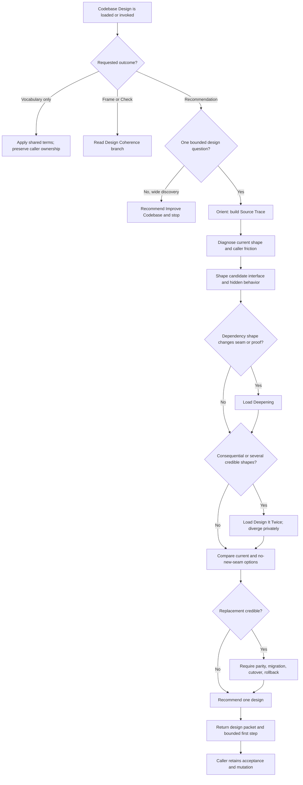

# Codebase Design Whole-Skill Synthesis

Status: generous whole-skill design reference for a future rewrite. This document does not change executable behavior, authorize implementation, or claim installed-mirror parity.

Runtime authority remains in:

- `skills/custom/codebase-design/SKILL.md`;
- `skills/custom/codebase-design/DIRECT-DESIGN.md`;
- `skills/custom/codebase-design/DEEPENING.md`;
- `skills/custom/codebase-design/DESIGN-IT-TWICE.md`;
- `skills/custom/codebase-design/DESIGN-COHERENCE.md` when present in the coordinated canonical candidate;
- `skills/custom/codebase-design/agents/openai.yaml`;
- the caller's artifact, mutation boundary, acceptance, and completion criterion;
- `docs/synthesis/skill-context-relationships.md`, pack tests, behavior evaluations, and validation transcripts; and
- the installed mirror under `C:\Users\steve\.agents\skills\codebase-design` only after validated synchronization.

The current canonical working tree contains a coordinated Design Coherence candidate that the installed mirror does not yet contain. Treat that difference as migration state, not as proof that the candidate behavior has been promoted.

## How To Read This Document

This synthesis covers the complete future Codebase Design contract, not only the Design Coherence capability. It has four layers:

1. **Orientation** states the outcome, selected design, vocabulary, and explanatory flow.
2. **Normative Design** is the sole authority for proposed runtime behavior and relationships.
3. **Evidence And Rationale** preserves source pressure, current evidence, deliberate non-changes, and rejected machinery without adding rules.
4. **Extraction And Verification** maps the design into owned runtime surfaces and defines staged proof and promotion.

| Question | Owning section |
| --- | --- |
| What outcome governs the rewrite? | [North Star](#north-star) and [Design Verdict](#design-verdict) |
| Which use of Codebase Design is intended? | [Three Supported Uses](#three-supported-uses) and [Invocation And Admission](#invocation-and-admission) |
| What do the architecture terms mean? | [Design Vocabulary](#design-vocabulary) |
| What is the full direct-design path? | [Direct Design State And Completion Contract](#direct-design-state-and-completion-contract) |
| Which shapes are legitimate outcomes? | [Candidate Shape Contract](#candidate-shape-contract) |
| How are interfaces, seams, dependencies, tests, and migration judged? | [Interface Contract](#interface-contract), [Seam And Adapter Gate](#seam-and-adapter-gate), [Dependency And Deepening Contract](#dependency-and-deepening-contract), [Proof And Test-Surface Contract](#proof-and-test-surface-contract), and [Migration Contract](#migration-contract) |
| When must alternatives or replacement receive deeper treatment? | [Design It Twice Contract](#design-it-twice-contract) and [Replacement Gate](#replacement-gate) |
| How may another skill use design criteria without requesting a recommendation? | [Design Coherence Reference](#design-coherence-reference) |
| Who owns each cross-skill edge? | [Relationship Ownership](#relationship-ownership) |
| What does each use return and when is it complete? | [Return Contracts](#return-contracts) and [Completion](#completion) |
| Where should the future rewrite place each rule? | [Runtime Ownership And Change Map](#runtime-ownership-and-change-map) |
| What evidence must exist before promotion? | [Staged Behavior-Evaluation Protocol](#staged-behavior-evaluation-protocol), [Migration And Acceptance Matrix](#migration-and-acceptance-matrix), and [Promotion Gate And Residual Gaps](#promotion-gate-and-residual-gaps) |

When another layer disagrees with Normative Design, correct that layer. The ownership map places rules, the evaluation protocol owns the proof standard, and the acceptance matrix supplies cases; none may redefine runtime behavior.

# Layer One: Orientation

## North Star

Codebase Design owns one outcome: recommend the strongest local shape for one bounded module, interface, seam, adapter, dependency-boundary, or caller-facing proof question.

The recommendation should make callers learn and coordinate less, concentrate behavior and decisions with their proper owner, expose a smaller useful interface, and prove meaning through the surface callers actually use. A new abstraction is optional. Deepen, merge, inline, retain, or introduce an earned seam according to evidence; admit replacement only through its stricter gate.

The skill is design-only by default. It does not implement the recommendation, accept a public-contract change, mutate domain truth, publish work, or convert residual design work into tracker state.

## Design Verdict

The future rewrite should preserve one implicitly invocable skill with three supported uses and four progressively disclosed references:

| Stratum | Selected shape | Rewrite status |
| --- | --- | --- |
| Shared vocabulary and taste | Compact universal `SKILL.md` surface for module, interface, implementation, depth, seam, adapter, leverage, locality, and `Compress / Delete / Earn / Prove` | Preserve and sharpen |
| Vocabulary-only consumption | A caller may load the vocabulary without requesting a design packet or transferring its artifact authority | Preserve explicitly |
| Caller-owned coherence | One read-only `DESIGN-COHERENCE.md` reference with `Frame` and `Check` over shared criteria | Preserve the coordinated candidate and validate it |
| Direct recommendation | One `DIRECT-DESIGN.md` pass: `Orient -> Diagnose -> Shape -> Compare -> Recommend` | Preserve, make completion and branch loading more exact |
| Dependency deepening | One conditional `DEEPENING.md` branch for dependency classification, seam placement, substitutes, coverage parity, and bounded migration | Preserve behind a sharp trigger |
| Consequential alternatives | One conditional `DESIGN-IT-TWICE.md` branch for genuinely different candidate shapes and root-owned comparison | Preserve behind a sharp trigger |
| Callers and promotion | Caller-owned acceptance and mutation, explicit relationship verbs, structural tests, behavioral controls, and mirror synchronization after proof | Make exhaustive in the extraction plan |
| Rejected machinery | Codebase-wide surveying, implementation steps, architecture scores, mandatory diagrams, framework catalogs, one-file-per-operation sprawl, or an executable design helper | Exclude |

## Three Supported Uses

| Use | Trigger | Codebase Design owns | Caller retains |
| --- | --- | --- | --- |
| **Load** | Another skill needs shared deep-module vocabulary while producing its own artifact | Terms and taste only | Artifact, procedure, mutation boundary, output, and completion |
| **Frame / Check** | A bounded caller needs early design questions or final coherence evidence without a recommendation | Read-only criteria and returned frame or typed gaps | Decisions, state, gap disposition, mutation, and completion |
| **Direct Design** | The request asks one bounded module, interface, seam, adapter, dependency, migration, replacement, or proof-surface question | Source Trace, diagnosis, alternatives when triggered, recommendation, design packet, and local completion | Public-contract commitments, acceptance, implementation, and downstream mutation |

These are modes of one capability, not three invocable skills. The mode must follow the caller's requested outcome and authority, not the mere presence of architecture vocabulary.

## Leading-Word Design Model

| Leading word | Runtime meaning |
| --- | --- |
| **Orient** | Establish the bounded question and Source Trace before proposing a shape |
| **Diagnose** | Expose caller friction, leaked decisions, shallow layers, and real dependency pressure |
| **Compress** | Reduce what callers and tests must learn or coordinate |
| **Delete** | Apply the deletion test; shallow pass-through layers disappear cleanly, useful modules redistribute complexity when removed |
| **Earn** | Keep or introduce a seam only for locality, dependency isolation, domain ownership, demonstrated variation, or testability |
| **Prove** | Make observable meaning testable through the caller-facing interface |
| **Diverge** | Generate structurally different shapes before comparison when the decision is consequential |
| **Compare** | Judge current, no-new-seam, incremental, and credible alternative shapes under the same evidence |
| **Recommend** | Choose one design and one bounded first migration step without implementing it |

## End-To-End Explanatory Flow



# Layer Two: Normative Design

## Normative Home Index

| Concern | Sole normative home |
| --- | --- |
| Supported use, boundedness, invocation, and admission | [Invocation And Admission](#invocation-and-admission) |
| Design, acceptance, public-contract, mutation, and completion authority | [Authority And Mutation Boundary](#authority-and-mutation-boundary) |
| Required evidence before design judgment | [Source Trace Contract](#source-trace-contract) |
| Shared architecture terms and measures | [Design Vocabulary](#design-vocabulary) |
| Direct pass ordering and per-step completion | [Direct Design State And Completion Contract](#direct-design-state-and-completion-contract) |
| Current-shape diagnosis | [Diagnosis Contract](#diagnosis-contract) |
| Legitimate recommendation outcomes | [Candidate Shape Contract](#candidate-shape-contract) |
| Caller-facing interface completeness | [Interface Contract](#interface-contract) |
| Seam and adapter admission | [Seam And Adapter Gate](#seam-and-adapter-gate) |
| Dependency classification, substitutes, and deepening | [Dependency And Deepening Contract](#dependency-and-deepening-contract) |
| Caller-facing, boundary, adapter, and coverage-parity proof | [Proof And Test-Surface Contract](#proof-and-test-surface-contract) |
| Alternative generation and independent scouts | [Design It Twice Contract](#design-it-twice-contract) |
| Replacement versus incremental evolution | [Replacement Gate](#replacement-gate) |
| First safe migration and stop boundary | [Migration Contract](#migration-contract) |
| Read-only Frame and Check | [Design Coherence Reference](#design-coherence-reference) |
| Reference-loading triggers | [Runtime Context Loading Contract](#runtime-context-loading-contract) |
| Cross-skill verbs and retained authority | [Relationship Ownership](#relationship-ownership) |
| External output forms | [Return Contracts](#return-contracts) |
| Terminal criteria | [Completion](#completion) |

## Invocation And Admission

Codebase Design remains implicitly invocable because a user can naturally ask for a module, interface, seam, adapter, dependency boundary, or caller-facing test design without knowing the skill name. `agents/openai.yaml` records `allow_implicit_invocation: true` explicitly.

Select exactly one supported use:

| Observed request | Admitted use | Failure or return branch |
| --- | --- | --- |
| A caller explicitly asks only to apply deep-module vocabulary to its own artifact | **Load** | Preserve the caller's output and completion; return no independent design packet |
| A caller explicitly asks to frame unresolved design concerns or check settled design coherence without a recommendation | **Frame / Check** | Require the bounded artifact, accepted constraints, evidence, and caller-owned disposition |
| One module, shallow cluster, interface, seam, adapter, dependency shape, migration, replacement, or proof-surface question needs a recommendation | **Direct Design** | Bound the question through Source Trace, then run one direct pass |
| The request needs repository-wide discovery, classification, ranking, or multi-region sequencing | Not admitted | Recommend `$improve-codebase` and stop |
| The requested answer would settle product intent, public behavior, irreversible migration, or a named owner-reserved trade-off without authority | Not yet decidable | Return the exact decision and evidence needed; do not infer acceptance |

Bounded means one caller-facing design decision whose current shape, affected callers, dependencies, proof surface, and first migration edge can be traced together. A package or tier-spanning slice may still be one module when it hides one cohesive responsibility behind one useful interface. File count alone neither admits nor rejects the request.

## Authority And Mutation Boundary

Codebase Design owns design analysis, recommendation, design vocabulary, and its returned packets. It is read-only unless a separate caller explicitly authorizes another workflow to implement an accepted design.

The user or caller owns:

- product intent and public-contract commitments;
- accepted trade-offs and final design acceptance;
- domain truth and ADR persistence;
- code, test, document, tracker, Git, deployment, and external mutations;
- the use or disposition of returned gaps and follow-ups; and
- downstream completion.

Codebase Design never treats invocation as acceptance, a recommendation as implementation authority, a prototype as production proof, or a caller's evidence as permission to mutate its artifact. Scouts and disclosed references inherit the same read-only boundary.

## Source Trace Contract

Reuse a caller-supplied Source Trace only when it is current, bounded, and sufficient for the design claim. Otherwise inspect:

- the governing request, accepted constraints, commitment boundary, and relevant domain terms or ADRs;
- the current interface and implementation, including state, errors, configuration, operational constraints, and compatibility behavior;
- representative callers, painful callers, entry points, and caller-visible workflows;
- representative tests and proof lanes, especially tests coupled to implementation detail;
- every dependency whose shape could change ownership, seam placement, substitutes, migration, or proof;
- relevant commit history when repeated change, churn, or compatibility pressure is part of the claim; and
- the bounded migration edge and adjacent behavior that must remain unchanged.

The Source Trace is complete when every material recommendation claim has current inspectable evidence or is labeled as an unresolved assumption. Source existence is not evidence of behavior; prove runtime meaning at the appropriate seam when the recommendation relies on it.

## Design Vocabulary

Use repository and domain terms for business concepts and existing code. Use the following shared terms only for architecture claims:

| Term | Meaning |
| --- | --- |
| **Module** | An interface plus hidden implementation; it may be a function, class, package, workflow, service, or tier-spanning cohesive slice |
| **Interface** | Everything callers must know: operations, inputs, outputs, invariants, state, ordering, errors, configuration, performance, compatibility, and behavior |
| **Implementation** | Behavior and decisions hidden behind the interface |
| **Depth** | Caller and test leverage per unit of interface learned; implementation size alone does not determine it |
| **Seam** | A point where behavior can vary without editing callers; an interface lives there |
| **Adapter** | A concrete implementation satisfying an interface at an earned seam |
| **Leverage** | Useful capability gained per unit of interface learned |
| **Locality** | Change, bugs, decisions, knowledge, and verification concentrated with one owner |
| **Shallow** | Interface burden approaches or exceeds the useful behavior hidden behind it |
| **Deletion test** | Remove the candidate abstraction conceptually: useful modules force their hidden complexity back into callers; pass-through layers mostly disappear |
| **No-new-seam** | A comparison pressure that seeks retain, merge, inline, or simplify before adding an abstraction; it is not a presumption that seams are always wrong |
| **Boundary proof** | One representative allowed caller, one forbidden caller, and a red-capable check that accepts the first and rejects the second |
| **Coverage parity** | Evidence that behavior formerly proved through shallow surfaces remains proved through the deeper caller-facing surface before obsolete tests are removed |

Do not substitute generic architecture labels for accepted domain language. Use the shared vocabulary to explain the design consequence of the repository's real terms.

## Direct Design State And Completion Contract

Run the direct pass in order. A later operation may not silently fill an unmet earlier gate.

| Operation | Required work | Complete when | Legal nonterminal branch |
| --- | --- | --- | --- |
| **Orient** | Establish the bounded question and Source Trace | Current shape, callers, tests, dependencies, constraints, commitments, and bounded migration edge are known or exact evidence gaps are named | Return the missing evidence or owner-reserved decision |
| **Diagnose** | Explain the present interface burden, hidden and leaked behavior, ownership, deletion-test result, seam reality, and caller/test friction | The problem is stated in caller-facing terms and tied to evidence rather than taste alone | Retain the current shape when no material problem is proved |
| **Shape** | Produce the strongest candidate contract, hidden behavior, ownership, seam, dependencies, proof surface, and first migration step | Every material design criterion has an explicit proposed disposition | Load Deepening when dependency shape changes the answer |
| **Compare** | Compare the candidate with current and simplest no-new-seam shapes; add incremental evolution, replacement, or multiple alternatives when triggered | Credible alternatives are judged under the same criteria and fake variety is removed | Load Design It Twice when several shapes remain plausible or consequences are material |
| **Recommend** | Select one design, explain why it wins, name the first safe migration step, proof, risks, and follow-ups | One internally consistent design packet is returned and downstream authority remains with the caller | Return `retain` or an evidence gap when change is not justified |

## Diagnosis Contract

Diagnose the existing shape before naming a new one. Account for:

- the candidate module, current interface, and actual implementation;
- each material responsibility, invariant, decision, and failure policy and its current owner;
- behavior or knowledge repeated across callers;
- caller and test friction, including orchestration, sequencing, configuration, error translation, mock pressure, and implementation-detail assertions;
- interface pressure such as test-only hooks or callers reaching through the public surface;
- the deletion-test result;
- real versus hypothetical variation;
- dependency direction and domain or transport leakage;
- change locality, repeated-change hotspots when relevant, and proof locality; and
- whether the evidence instead supports the current shape.

A diagnosis that only names code size, naming, file count, or pattern absence is insufficient. Explain the caller-facing or maintainer consequence.

## Candidate Shape Contract

Every recommendation chooses one primary shape:

| Shape | Admission evidence | Typical result |
| --- | --- | --- |
| **Deepen** | Several shallow operations or leaked decisions can move behind one smaller useful interface | Callers coordinate less while behavior and proof concentrate |
| **Merge** | Separate layers or modules repeat ownership or merely pass through | One owner and interface replace duplicative coordination |
| **Inline** | The abstraction adds no locality, variation, domain ownership, or proof leverage | Callers use the underlying behavior directly or the trivial layer disappears |
| **Retain** | The current shape already has adequate depth, locality, ownership, and proof, or change lacks evidence | No structural change; return only material follow-up evidence |
| **Introduce an earned seam** | A real dependency, substitute, domain boundary, or variation point must change independently from callers | One narrow interface with justified adapters or substitutes |
| **Replace** | The stricter Replacement Gate passes and incremental evolution is demonstrably riskier or more complicated | Bounded staged replacement with parity, compatibility, cutover, and rollback |

`No-new-seam` must always be explored when credible, but it usually resolves to deepen, merge, inline, retain, or simplify. Do not manufacture a new module merely so the output looks architectural.

## Interface Contract

Make the recommended caller-facing interface explicit to the degree material for the bounded question:

| Concern | Required design statement |
| --- | --- |
| Responsibility | What cohesive behavior and decisions the module owns and deliberately does not own |
| Operations | What callers can ask the module to do |
| Inputs and outputs | Accepted values, returned values or effects, and meaningful types or shapes |
| Invariants and state | Conditions the module preserves, lifecycle, persistence, idempotency, or state transitions |
| Ordering and concurrency | Material sequence, atomicity, retry, reentrancy, or concurrency expectations |
| Errors | Caller-visible failure classes, translation, recovery, and partial-success behavior |
| Configuration | Which choices callers supply and which policy the module hides |
| Performance and operations | Material latency, throughput, memory, durability, observability, or availability commitments |
| Compatibility | Existing caller behavior, versioning, transition, and deprecation obligations |
| Proof | Observable outcomes and representative callers that establish meaning |

Mark a concern not applicable only with evidence that it cannot change caller behavior or migration in the bounded design. A function signature alone is not the complete interface when callers depend on ordering, failure, configuration, or operational behavior.

## Seam And Adapter Gate

Keep or introduce a seam only when at least one of these benefits is demonstrated:

- locality of behavior or change;
- isolation of a dependency whose implementation varies;
- ownership of a domain decision;
- real variation, such as production plus a fake, local substitute, emulator, or second integration; or
- caller-facing testability that cannot be achieved more directly.

Place the narrowest seam that provides the benefit. Keep internal seams private. One production implementation without a substitute or credible second variation is weak evidence, not an automatic rejection; the Source Trace must show another earned benefit.

An adapter contains transport, vendor, or representation translation at the seam. It does not become a second home for domain policy. A pass-through adapter that buys no isolation or locality should merge or inline.

## Dependency And Deepening Contract

Load `DEEPENING.md` only when dependency shape changes the seam, substitute, test migration, validation, or first safe step. Classify every dependency material to those decisions:

| Category | Design consequence | Proof consequence |
| --- | --- | --- |
| **In-process** | Keep computation and memory inside the module; add no adapter solely for injection | Prove behavior through the deeper interface; test an internal rule directly only when independently meaningful |
| **Local-substitutable** | Use a realistic local form such as memory, isolated filesystem, emulator, SQLite, or deterministic queue at a real I/O edge | Exercise the local substitute through the caller-facing interface; add fidelity proof only when the substitute itself carries risk |
| **Remote-owned** | Put transport variation behind a seam while keeping domain decisions in the module | Use production transport plus a fake or local implementation; add contract proof when remote semantics carry risk |
| **True external** | Place an adapter at the third-party seam and contain vendor translation | Use the smallest fake, stub, or mock that proves the actual external risk; add adapter contract proof as needed |

Choose substitutes by behavior risk, fidelity need, speed, determinism, and operational realism, not by mocking convenience. A test-only patch point is evidence of interface pressure, not proof that a public seam belongs there.

## Proof And Test-Surface Contract

The caller-facing interface is the default proof seam. Prove observable behavior, not only construction, delegation, call order, or implementation shape.

Use four proof forms as applicable:

1. **Behavior proof:** representative caller inputs, outcomes, invariants, errors, and edge cases through the public interface.
2. **Boundary proof:** for an enforced dependency or ownership boundary, one allowed caller passes and one forbidden caller fails the intended red-capable rule.
3. **Adapter or substitute contract proof:** only when translation or fidelity carries independent risk.
4. **Coverage parity:** before shallow tests are removed, classify every affected test as:
   - **Add** missing caller-facing behavior proof;
   - **Rewrite** behavior whose former surface becomes obsolete;
   - **Keep** dense rules, adapter contracts, regressions, or behavior not yet covered through the deeper surface; or
   - **Delete** pass-through, call-order, or implementation-detail assertions superseded by stronger proof.

Tests that change only because implementation moved are testing past the interface. Prototype evidence may select a design, but it never substitutes for production parity or migration proof.

## Design It Twice Contract

Load `DESIGN-IT-TWICE.md` when the interface is consequential, several shapes are plausible, or migration and compatibility risk are meaningful.

Frame all alternatives with the same objective, Source Trace, constraints, scope, commitment boundary, and mutation boundary. Generate at least three genuinely different shapes. Include current or simplest no-new-seam when credible. Useful structural pressures include Minimal, Caller-first, Domain-owned, Seam-first, Migration-first, and No-new-seam.

When independent judgment matters and direct subagents are available:

- use fresh-context scouts with `fork_turns="none"`;
- give each the same self-contained factual brief and one distinct design pressure;
- exclude parent hypotheses, preferred solutions, peer candidates, and preliminary comparison;
- keep every scout read-only and prohibit further delegation;
- keep candidates private until all requested scouts return; and
- retain comparison, recommendation, and completion at the root.

When delegation is unavailable, produce alternatives sequentially under distinct pressures and do not call them independent.

Each alternative states its interface, caller experience, hidden and caller-retained behavior, ownership, seam and dependencies, proof surface, first migration step, trade-offs, and risks. Merge alternatives that differ only in names, parameters, or cosmetic layers and replace them with real structural variety.

## Replacement Gate

Replacement is a high-cost candidate, not a reaction to code size or dislike. Admit it only when:

- current commitments and caller-visible behavior are traceable;
- incremental evolution is explicitly compared and demonstrably riskier or more complicated;
- a production-relevant parity proof seam exists;
- compatibility and preservation obligations are explicit;
- migration stages and one bounded first slice are explicit;
- cutover criteria and ownership are explicit; and
- rollback conditions and mechanism are credible.

If any item is missing, reject replacement for now and return the exact evidence gap. A prototype can reduce design uncertainty but cannot establish production parity.

## Migration Contract

Recommend one smallest behavior-preserving migration step that moves toward the selected design while remaining independently provable and reversible where practical.

Name:

- prerequisites that directly enable the step;
- existing callers and behavior preserved;
- compatibility mechanism when needed;
- code and test surfaces expected to change;
- focused proof and the caller-facing seam it exercises;
- stop boundary after the step;
- cutover and rollback only when the selected shape requires them; and
- follow-ups kept outside the bounded slice.

Support work earns inclusion only when it directly de-risks or enables the first step. Do not disguise a large rewrite as a first slice by naming only its first file.

## Design Coherence Reference

Use `DESIGN-COHERENCE.md` read-only when a caller needs design framing or coherence checking without a recommendation. The caller supplies the bounded artifact, accepted constraints, evidence, mutation boundary, and use of the result.

Frame and Check share six criteria:

| Criterion | Coherent evidence | Typed gap |
| --- | --- | --- |
| **Responsibility** | Each material behavior, invariant, decision, and failure policy has one appropriate owner | Ownership is absent, duplicated, circular, or forces callers to coordinate hidden policy |
| **Interface** | Material operations, inputs, outputs, invariants, ordering, errors, configuration, performance, and behavior are explicit | Dependent decisions assume incompatible or underspecified caller contracts |
| **Dependency** | Direction preserves domain ownership and locality; transport and vendor concerns remain outside domain decisions | Dependencies invert ownership, leak transport, or create cycles and cross-layer coordination |
| **Seam** | Every seam is earned by locality, isolation, domain ownership, real variation, or testability | A seam is hypothetical, misplaced, duplicative, or shallow |
| **Migration** | First step, compatibility, cutover, rollback, and preservation are explicit when commitments change | Settled decisions cannot evolve safely or conflict about transition |
| **Proof** | Observable behavior is provable through the caller-facing interface; enforced boundaries have their boundary proof | Proof depends on implementation detail, omits a material caller, or cannot demonstrate the claimed boundary |

Mark a criterion Not applicable only when evidence shows the bounded artifact creates or changes none of that concern.

**Frame** gives every criterion exactly one disposition: sourced Constraint, bounded Question, named Evidence gap, or evidenced Not applicable. It never answers the Question or fills the gap.

**Check** compares settled decisions and evidence. It records a supported pass or returns a typed gap; it returns `coherent` only when every applicable criterion passes and no material incompatibility or missing proof remains.

Each typed gap uses:

```text
Criterion:
Affected decisions, interfaces, dependencies, callers, or proofs:
Conflicting or missing source:
Caller-facing consequence:
Why material to the bounded artifact:
Required owner or evidence:
Proof needed to close:
```

The reference never recommends architecture, invokes another skill, mutates caller state, allocates caller state, or converts gaps into tickets, blockers, fog, or routes.

## Runtime Context Loading Contract

Start with `SKILL.md` only, then load exactly the reference selected by observed need:

| Observed need | Load | Do not preload |
| --- | --- | --- |
| Shared vocabulary only | Nothing beyond `SKILL.md` | Direct procedure, coherence criteria, dependencies, or alternatives |
| Early framing or final coherence without recommendation | `DESIGN-COHERENCE.md` and only Frame or Check | Direct Design, Deepening, or Design It Twice |
| One bounded recommendation | `DIRECT-DESIGN.md` completely | Deepening or Design It Twice until their triggers fire |
| Dependency shape changes seam, substitute, test migration, or validation | `DEEPENING.md` completely | Design It Twice unless its separate trigger fires |
| Consequential interface, several credible shapes, or material migration/compatibility risk | `DESIGN-IT-TWICE.md` completely | No unrelated family or survey reference |

References call back to the universal vocabulary and authority boundary rather than duplicating them. `SKILL.md` keeps only universal outcome, boundary, modes, vocabulary, taste, sharp branch pointers, and mode-aware completion.

## Relationship Ownership

| Caller | Verb | Capability | Trigger and return boundary |
| --- | --- | --- | --- |
| `$wayfinder` | Load | Design Coherence | Qualification uses Frame and Closeout uses Check; Codebase Design returns criteria results while Wayfinder retains map, mutation, disposition, and completion |
| `$wayfinder` | Invoke | Direct Design | Resolve one bounded Design ticket and return one design packet plus acceptance evidence to the same ticket |
| `$to-spec` | Load | Vocabulary | Apply deep-module terms while To Spec retains Source Trace, parent-spec output, publication, and completion |
| `$improve-codebase` | Load | Vocabulary | Use module, depth, interface, seam, leverage, and locality during Survey without producing a design packet |
| `$improve-codebase` | Invoke | Direct Design | A selected supported `Concentrate` candidate needs interface, dependency, seam, ownership, migration, or replacement design; return the packet for reclassification |
| `$simplify-code` | Recommend and stop | Direct Design | The best next move requires one new interface or ownership decision outside simplification |
| `$tdd` | Recommend and stop | Direct Design | A GREEN refactor exposes one already-framed interface or seam question outside the tracer bullet |
| `$codebase-design` | Recommend and stop | `$improve-codebase` | The request needs codebase-wide discovery, classification, ranking, or multi-region sequencing |
| Any bounded caller | Load | Vocabulary or Design Coherence | The caller explicitly retains its artifact, mutation, output, and completion authority |
| Direct user | Invoke | Direct Design | One bounded design question returns a recommendation for user acceptance; no implementation follows automatically |

Each edge appears once in `docs/synthesis/skill-context-relationships.md`. Consumers name the required outcome and return boundary; Codebase Design owns its internal procedure and file wording. No caller copies Direct Design or lets a loaded vocabulary reference become a second output owner.

## Return Contracts

### Vocabulary-Only Return

Return no independent packet. Apply the shared terms inside the caller's artifact and preserve the caller's declared output and completion.

### Frame / Check Return

```text
Mode: Frame | Check
Artifact and scope:
Criteria results:
Constraints and source pointers:
Questions or typed gaps:
Evidence gaps and sharpening sources, when framing:
Verdict: framed | coherent | gaps
Caller retains: artifact, disposition, mutation, and completion authority
```

### Direct Design Packet

Return:

- bounded question and Source Trace;
- current module, interface, implementation, ownership, and shallow-shape diagnosis;
- deletion-test result and caller or test friction;
- recommended primary shape and complete material interface contract;
- hidden behavior and decisions, caller-retained concerns, and design criteria results;
- every earned seam, dependency classification, adapter, and substitute;
- caller leverage, maintainer locality, caller-facing proof, and boundary proof when applicable;
- test disposition and coverage-parity plan when surfaces change;
- current, no-new-seam, incremental, replacement, and other credible alternatives as triggered;
- one recommendation and why credible alternatives lose;
- first bounded migration step, compatibility, validation, stop boundary, and rollback when applicable;
- risks, residual evidence gaps, follow-ups, and any domain or ADR candidate; and
- explicit statement that acceptance, implementation, and downstream mutations remain caller-owned.

## Completion

| Use | Complete only when |
| --- | --- |
| **Load** | The caller's artifact uses the vocabulary without transferring its output, mutation, or completion authority |
| **Frame** | Every applicable criterion has one sourced disposition; every Question fits one Direct Design pass; every Evidence gap names what would sharpen it |
| **Check** | Every applicable criterion has supported pass evidence or an exact typed gap; `coherent` is returned only with no material gap |
| **Direct Design** | Source Trace is sufficient; current and proposed interfaces are explicit; any seam and adapter is earned; dependencies and proof are accounted for; current and no-new-seam shapes were compared; consequential alternatives were explored; replacement passes its gate when chosen; one design, first migration step, and design packet were returned; caller authority remained intact |

Codebase Design is incomplete when it merely names a pattern, produces cosmetic alternatives, recommends an unproved boundary, leaves material callers or dependencies untraced, proposes unbounded replacement, or begins implementation.

# Layer Three: Evidence And Rationale

## Source Pressure

The detailed source map remains in [Codebase Improvement And Design Family Synthesis](../families/codebase-architecture.md). This table records only the design pressure that affects the future rewrite:

| Source tradition | Pressure retained in the design |
| --- | --- |
| Ousterhout | Deep modules, small useful interfaces, shallow-module diagnosis, and Design It Twice |
| Parnas | Hide decisions likely to change; decompose around ownership rather than processing steps |
| Evans | Use ubiquitous language and place behavior with the domain owner |
| Fowler, Refactoring | Prefer behavior-preserving bounded change over speculative rewrites |
| Feathers | Treat seams as real variation points, not decorative test hooks |
| Freeman and Pryce | Let caller-facing tests reveal responsibility boundaries; keep fakes at real seams |
| Fowler, Enterprise Application Architecture | Isolate infrastructure and vendor translation without laundering domain policy into adapters |
| Kleppmann | Include data, durability, consistency, latency, and failure semantics in interface design when material |
| Ford and Richards | Compare explicit trade-offs and architecture characteristics rather than pattern fashion |
| Evolutionary Architecture | Use bounded migration and observable fitness or proof surfaces |
| Team Topologies | Improve cognitive load and navigability through clear ownership and locality |

## Why One Skill With Disclosed Branches

Vocabulary-only use, coherence checking, direct recommendation, dependency deepening, and alternative generation share one architecture language and one read-only authority boundary. Splitting them into independently invocable skills would duplicate terms, increase context or human routing load, and make callers choose implementation detail before the design question is understood.

They still need progressive disclosure. Vocabulary-only callers should not load a design procedure. Ordinary direct questions should not carry the dependency taxonomy or scout mechanics. Coherence callers must not accidentally receive a recommendation. Sharp pointers preserve one owner without flattening every branch into `SKILL.md`.

## Why Boundedness Is Semantic

Module scale ranges from one function to a tier-spanning slice. File counts and directory borders are poor admission tests. The meaningful bound is one cohesive caller-facing decision with traceable ownership, dependencies, proof, and migration. Wide discovery is a different job because it must find and rank candidates before choosing a design question.

## Why No-New-Seam Is Mandatory

Earlier wording can bias design toward inventing an interface merely because the skill discusses interfaces and seams. Requiring current and simplest no-new-seam comparisons counters that anchor. It does not create an anti-abstraction rule: a seam wins when evidence shows locality, dependency isolation, domain ownership, variation, or testability that the simpler shape cannot provide.

## Why Proof Uses The Caller Surface

An interface is valuable only if callers can rely on it without understanding hidden implementation. Proof through implementation detail recreates the knowledge burden the design claims to remove. Boundary proof adds a necessary negative control when architecture enforcement is part of the recommendation: the allowed caller must pass and the forbidden caller must fail for the intended reason.

## Why Dependency Deepening Is Conditional

Most modules do not need an adapter taxonomy. The dependency branch earns its context only when dependency shape changes seam placement, substitutes, test migration, or validation. Classification then prevents two opposite errors: wrapping in-process code in needless interfaces and letting remote or vendor details leak into domain callers.

## Why Replacement Has A Separate Gate

Replacement can erase untraced behavior and turn design preference into a big-bang commitment. Incremental evolution is the default comparison, not an automatic winner. Replacement becomes credible only when existing behavior is traceable, parity is observable, migration and compatibility are bounded, and cutover and rollback are explicit.

## Why Design Coherence Is A Reference

Wayfinder and other bounded callers need to expose design questions early and detect contradictions late without asking Codebase Design to choose architecture or take over their state. Frame and Check reuse the same criteria with different outputs. That keeps early questions and final validation aligned while preserving caller authority.

## Current Surface And Evidence Inventory

| Surface | Current evidence | Residual gap for the future rewrite |
| --- | --- | --- |
| `SKILL.md` | Implicit invocation, vocabulary, taste, direct pointer, coherence pointer, wide-discovery boundary, and mode-aware completion exist in the canonical candidate | Description and mode selection need behavior evaluation against realistic ambiguous prompts |
| `DIRECT-DESIGN.md` | Five-step pass, current/no-new-seam comparison, replacement gate, design packet, and completion exist | Full packet completeness and premature-recommendation behavior have not been sampled in the current coordinated candidate |
| `DEEPENING.md` | Four dependency categories, seam placement, substitutes, coverage parity, test dispositions, and migration exist | Category choice, seam avoidance, and affected-test accounting need behavior controls |
| `DESIGN-IT-TWICE.md` | Three alternatives, structural pressures, fresh-context scout isolation, comparison, and completion exist | Independence and genuinely different alternatives need repeated fresh-context sampling |
| `DESIGN-COHERENCE.md` | Canonical candidate contains shared criteria, Frame, Check, typed gap, Return, and completion | Installed mirror lacks the file; Frame and Check behavior still require candidate-versus-control evidence |
| Structural tests | Protect reference disclosure, branch shapes, dependency categories, test dispositions, no-new-seam, replacement gates, coherence criteria, caller-retained authority, and selected relationship edges | Static assertions do not prove design judgment, evidence use, or authority preservation under pressure |
| Core workflow evaluations | Define Design Alternatives Without Seam Bias and Incremental Change Versus Replacement, plus composition and Wayfinder coherence expectations | The definitions are not themselves fresh behavior runs |
| Validation transcripts | Earlier composition evidence showed To Spec loading vocabulary without losing ownership; older pack validation proved then-current source/mirror parity | Evidence predates the coordinated coherence candidate and cannot prove the future rewrite |
| Installed mirror | Contains the older main skill, Direct Design, Deepening, Design It Twice, and policy file | It lacks Design Coherence and must remain the control until the coordinated candidate is validated and synchronization is authorized |

## Deliberate Non-Changes

- Keep Codebase Design implicitly invocable.
- Keep the outcome to one bounded recommendation, not repository-wide architecture discovery.
- Keep design read-only and caller acceptance explicit.
- Keep vocabulary use from becoming a second output or completion owner.
- Keep Design Coherence read-only and recommendation-free.
- Keep domain language and ADR mutation with their existing owners.
- Keep Deepening conditional rather than turning every dependency into an adapter exercise.
- Keep Design It Twice conditional rather than forcing scouts on trivial choices.
- Keep implementation, tracker mutation, Git mutation, publication, and deployment outside the skill.
- Add no architecture score, universal pattern catalog, mandatory diagram, executable helper, persisted schema, or design ledger.
- Do not copy the family source catalog into runtime files.

## Rejected Failure-Prone Shapes

| Rejected shape | Why it fails |
| --- | --- |
| One giant `SKILL.md` | Vocabulary-only and ordinary direct uses load branch-specific procedure and invite premature branch completion |
| One invocable skill per branch | Duplicates vocabulary and authority while increasing invocation ambiguity and human routing load |
| New-seam-first procedure | Anchors the recommendation before current and no-new-seam evidence is compared |
| Pattern or score driven design | Replaces caller-facing evidence and trade-offs with ceremonial architecture output |
| Test-mock-first seam placement | Exposes implementation pressure as public design and encourages shallow adapters |
| Replacement by code size | Ignores commitments, parity, migration, cutover, rollback, and bounded proof |
| Caller copies of design criteria | Creates competing authorities and lets vocabulary loads become hidden design passes |
| Static-only validation | Protects headings and tokens but cannot prove judgment, evidence use, or authority boundaries |

# Layer Four: Extraction And Verification

## Proposed Runtime Semantic Surface

The eventual main skill should read approximately as:

```text
Outcome: one bounded design recommendation
Read-only caller-retained authority
Load | Frame / Check | Direct Design
Shared architecture vocabulary
Compress / Delete / Earn / Prove
Wide discovery boundary
Sharp pointer to Design Coherence
Sharp pointer to Direct Design
Mode-aware completion
```

The disclosed references should read approximately as:

```text
DIRECT-DESIGN.md
  Orient -> Diagnose -> Shape -> Compare -> Recommend
  candidate shapes and triggered references
  direct design packet
  completion

DEEPENING.md
  dependency trigger
  Classify -> Place -> Substitute -> Replace tests -> Migrate
  contribution to the design packet
  completion

DESIGN-IT-TWICE.md
  consequential-choice trigger
  Frame -> Diverge -> Compare -> Recommend
  scout isolation and structural pressures
  completion

DESIGN-COHERENCE.md
  read-only caller-retained boundary
  shared criteria
  Frame | Check
  typed gap and return
  completion
```

These are semantic targets, not approved final wording.

## Runtime Ownership And Change Map

| Bundle | Surface | Owns | Proposed delta | Must not absorb |
| --- | --- | --- | --- | --- |
| `C1` | `skills/custom/codebase-design/SKILL.md` | Description, implicit reach, outcome, universal authority, three uses, vocabulary, taste, branch pointers, wide-discovery boundary, and mode-aware completion | Compress to the Proposed Runtime Semantic Surface; sharpen mode selection and reference triggers; preserve `Compress / Delete / Earn / Prove` | Direct procedure, full coherence criteria, dependency taxonomy, scout mechanics, caller procedure, or rationale |
| `C1` | `skills/custom/codebase-design/agents/openai.yaml` | Invocation policy | Preserve explicit `allow_implicit_invocation: true` | Description or runtime procedure |
| `C2` | `skills/custom/codebase-design/DIRECT-DESIGN.md` | Source Trace, direct state/completion, diagnosis, candidate contract, interface completeness, seam gate, replacement trigger, design packet, and direct completion | Extract the chosen Layer Two direct contract without copying conditional branch mechanics | Full dependency taxonomy, full scout procedure, caller mutation, implementation, or coherence-only process |
| `C3` | `skills/custom/codebase-design/DEEPENING.md` | Material dependency classification, seam placement, substitutes, coverage parity, test dispositions, bounded migration, and packet contribution | Align categories, proof consequences, test accounting, and completion with Layer Two | Universal vocabulary, ordinary direct steps, alternative comparison ownership, or framework catalogs |
| `C4` | `skills/custom/codebase-design/DESIGN-IT-TWICE.md` | Consequential-choice trigger, factual frame, distinct pressures, scout isolation, alternative completeness, comparison, and branch completion | Preserve at least three genuinely different shapes, no-new-seam pressure, private independent scouts, and root judgment | Direct packet ownership, dependency mechanics, automatic delegation, mutation, or peer-result sharing |
| `C5` | `skills/custom/codebase-design/DESIGN-COHERENCE.md` | Shared criteria, Frame, Check, typed gaps, caller-retained Return, and reference completion | Preserve the coordinated candidate; reconcile terms with the future direct contract | Architecture recommendation, caller state, ticket or fog mapping, invocation of another skill, or Direct Design procedure |
| `C6` | Consumer skills | Their own trigger, artifact, state, disposition, mutation, and completion | Reconcile only observed pointer or return-boundary mismatches in Wayfinder, To Spec, Improve Codebase, Simplify Code, and TDD | Codebase Design procedure or duplicated criteria |
| `C6` | `docs/synthesis/skill-context-relationships.md` | One indexed composition edge per accepted relationship | Keep Load, Invoke, and Recommend-and-stop edges aligned with Layer Two | Branch procedure or repeated runtime wording |
| `C7` | `tests/test_skill_pack_contracts.py` | Structural and relationship protection | Cover reference resolution, invocation policy, semantic branches, required fields, progressive disclosure, and exclusions | Incidental prose snapshots or claims that static tests prove behavior |
| `C7` | `docs/validation/evals/core-workflows.md` and transcripts | Behavior definitions and recorded runs | Add or refine controls for mode selection, no-seam bias, design completeness, dependency choices, coherence, replacement, and authority | Runtime authority or uninspected template scoring |
| `C8` | Installed mirror | Validated runtime copy | Synchronize the complete coordinated skill only after canonical proof and explicit install authority | Independent edits, partial copy, or promotion authority |

## Staged Extraction Plan

Stages order one coordinated rewrite; they are not independently promotable.

| Stage | Bundles | Outcome | Stage boundary |
| --- | --- | --- | --- |
| `I0` | Existing sources | Lock the fixed control, inventory canonical and installed files, record hashes, scenarios, known failures, and unrelated dirty work | Control identity and every owned/disclosed surface are known before edits |
| `I1` | `C1-C5` | Extract one coherent canonical runtime candidate with universal core and four disclosed references | Every Layer Two concern has one runtime owner; every pointer resolves; no branch duplicates another owner |
| `I2` | `C6-C7` | Reconcile callers, relationship index, structural tests, and behavior evaluation definitions | Every edge preserves one output, mutation, and completion owner; every acceptance row has a proof path |
| `I3` | `C8` | Run canonical validation, read back changed files, synchronize the installed mirror, and prove parity | All behavior gates pass, source and installed hashes agree, and no unrelated work changed |

## Staged Behavior-Evaluation Protocol

For every wording change meant to alter behavior:

1. Diagnose the observed failure as discipline, output shape, omission, or wrong-condition firing.
2. Lock a realistic full-context control. Use the current skill as control for changed behavior and a no-candidate-guidance arm for genuinely new behavior.
3. Keep repository snapshot, prompt, evidence, authority, tools, runtime, model settings, reasoning tier, and rubric fixed across arms.
4. Run at least five independent fresh-context samples per arm. Use direct read-only subagents with `fork_turns="none"` when available and prohibit descendants.
5. Inspect outputs against behavior, not token echoes. Record result, critical failure, variance, protocol deviation, and residual gap.
6. Accept the candidate only when the control exhibits the claimed failure, the candidate materially reduces it, variance narrows, and no new critical failure appears.

Evaluation phases:

| Phase | Claims proved |
| --- | --- |
| `E0`: Control lock | The old or no-guidance behavior exhibits the specific failure the rewrite claims to fix |
| `E1`: Invocation and attention | Load, Frame/Check, Direct Design, and wide-discovery routing select correctly and load only needed references |
| `E2`: Ordinary direct design | Source Trace, diagnosis, candidate shapes, interface completeness, seam gate, proof, migration, Return, and caller authority hold |
| `E3`: High-consequence branches | Alternatives are genuinely different and independent; dependency choices fit risk; replacement admits and rejects correctly; coherence preserves caller authority |
| `E4`: Integrated promotion | Callers, relationship map, structural validation, canonical source, installed mirror, and representative end-to-end workflows agree |

Any implementation, public-contract acceptance, domain mutation, tracker mutation, invented evidence, ceremonial `coherent`, unearned seam, or unbounded replacement is a critical failure regardless of averages.

## Migration And Acceptance Matrix

This matrix supplies cases and proof; it does not create runtime rules or file placement.

| Implementation / evaluation | Bundles | Behavior | Positive case | Negative control | Verification |
| --- | --- | --- | --- | --- | --- |
| `I1 / E1` | `C1,C2` | Direct invocation | One bounded interface question enters Direct Design and returns a packet | Generic cleanup or repository-wide architecture survey runs a direct pass | Invocation structural test and fresh ambiguous-prompt samples |
| `I1,I2 / E1` | `C1,C6` | Vocabulary load | To Spec or Improve Codebase applies terms while retaining its own artifact and completion | A vocabulary load emits a design packet or changes caller state | Relationship test and caller behavior samples |
| `I1,I2 / E1,E3` | `C1,C5,C6` | Coherence mode | Wayfinder Qualification uses Frame and Closeout uses Check with caller-retained authority | Coherence recommends architecture, invokes Direct Design, mutates the map, or creates fog/tickets | Reference-resolution test and fresh composition samples |
| `I1 / E1` | `C1-C5` | Context loading | The observed use loads only its required reference; Deepening and Design It Twice load only on their predicates | All references preload or branch mechanics move into `SKILL.md` | Pointer/heading tests and context-inventory comparison |
| `I1 / E2` | `C2` | Source Trace | Current interface, implementation, callers, tests, material dependencies, constraints, and migration edge support every claim | Recommendation starts from the requested abstraction name or one implementation file | Packet rubric over bounded repository fixtures |
| `I1 / E2` | `C2` | Diagnosis | Caller friction, leaked decisions, deletion test, ownership, and seam reality explain the problem | Code size, naming, file count, or pattern absence alone justifies change | Fresh cases with one real and one cosmetic concern |
| `I1 / E2` | `C2` | No-seam discipline | Current and simplest no-new-seam options compete with an earned new seam | A new module is assumed because the request says interface or adapter | Design Alternatives Without Seam Bias samples |
| `I1 / E2` | `C2` | Candidate outcome | Evidence may select deepen, merge, inline, retain, introduce an earned seam, or gated replacement | Every run returns a new abstraction or refuses every new seam | Balanced fixture set across outcome classes |
| `I1 / E2` | `C2` | Interface completeness | Material operations, data, invariants, state, ordering, errors, configuration, operations, compatibility, and proof are explicit | Only a function signature or class sketch is returned | Packet-field rubric with distributed/data boundary fixture |
| `I1 / E2` | `C2,C3` | Earned seam | Real locality, isolation, ownership, variation, or testability supports the narrow seam | One implementation or a test patch point automatically creates a public adapter | Positive and negative seam fixtures |
| `I1 / E3` | `C3` | Dependency classification | Material in-process, local-substitutable, remote-owned, and true-external dependencies receive matching design and proof | Every dependency gets an adapter or a remote dependency leaks vendor policy | Category scenarios with inspected rationale |
| `I1 / E3` | `C3` | Substitute selection | Substitute fidelity matches behavior risk and remains at a real boundary | Mock convenience dictates the production interface | Local, remote, and external dependency scenarios |
| `I1 / E2,E3` | `C2,C3` | Caller-facing proof | Behavior is proved through the interface; enforced boundaries include allowed and forbidden callers with a red-capable check | Proof asserts delegation, importability, call order, or only the allowed case | Behavior and negative-control fixtures |
| `I1 / E3` | `C3` | Coverage parity | Every affected test is Add, Rewrite, Keep, or Delete before shallow tests disappear | Tests are deleted wholesale or retained solely to preserve old implementation shape | Test-inventory fixture and structural disposition test |
| `I1 / E3` | `C4` | Genuine alternatives | At least three structurally different shapes use the same facts and distinct pressures; root compares them | Renamed interfaces, parameter reshuffles, or cosmetic layers count as diversity | Five-per-arm alternative evaluations and output inspection |
| `I1 / E3` | `C4` | Scout isolation | Fresh scouts receive the same factual frame, no parent hypothesis or peers, remain read-only, and return to root judgment | Scouts see a preferred answer, share candidates, mutate, or decide for root | Dispatch-packet audit and fresh-context run record |
| `I1 / E3` | `C2` | Replacement rejection | Missing commitments, parity, migration, cutover, or rollback rejects replacement and returns gaps | Size, age, or dislike authorizes a rewrite | Incremental-versus-replacement negative fixture |
| `I1 / E3` | `C2` | Replacement admission | Traceable behavior, parity seam, compatibility, staged migration, cutover, rollback, and a bounded first slice allow replacement when incremental is worse | Prototype output is called production parity or the first slice is a disguised big bang | Positive replacement fixture and rubric |
| `I1 / E2` | `C2,C3` | Migration | One behavior-preserving, independently provable first step has compatibility, proof, stop boundary, and explicit follow-ups | Recommendation contains only an end-state diagram or unbounded rewrite sequence | Migration packet inspection |
| `I1 / E3` | `C5` | Frame | Every criterion returns sourced Constraint, bounded Question, named Evidence gap, or evidenced Not applicable | Frame answers its own Question or invents missing evidence | Fresh Frame cases across all criteria |
| `I1 / E3` | `C5` | Check | Compatible settled decisions pass; one real mismatch returns a typed gap | Formatting differences fail, missing evidence passes, or Check redesigns | Positive and negative Check comparisons |
| `I1,I2 / E2,E4` | `C2,C6` | Caller authority | Recommendation returns read-only; acceptance and implementation stay with caller | Skill edits, commits, publishes, updates domain truth, or treats invocation as acceptance | Mutation-state before/after check and behavior rubric |
| `I2 / E4` | `C6,C7` | Relationship ownership | Every Load, Invoke, and Recommend-and-stop edge has one output and completion owner | Caller copies procedure, runs a recommended skill automatically, or both claim completion | Relationship parser test and representative workflow traces |
| `I1-I3 / E4` | `C1-C8` | Promotion | Canonical files, tests, evaluations, validation, installed files, and hashes agree | A partial branch or mirror update is promoted | Focused/full pytest, skill validation, install dry-run and sync, diff checks, read-back, hash parity |

## Promotion Gate And Residual Gaps

The promotion record names:

- fixed control and candidate commits or complete tree hashes;
- every changed runtime, caller, relationship, test, evaluation, and installed surface;
- evaluation scenario, prompt, authority packet, runtime, model settings, sample count, rubric, result distribution, worst result, and critical failures;
- focused and full validation commands and outputs;
- skipped proof and exact residual risk;
- canonical and installed file inventories and hash parity; and
- unrelated dirty work preserved outside the rewrite.

Promote only the coordinated skill. Stage completion does not authorize partial installation. A residual gap blocks promotion when it affects invocation, boundedness, public-contract authority, mutation scope, evidence use, interface completeness, seam admission, dependency direction, caller-facing proof, replacement safety, coherence truth, Return completeness, relationship ownership, or mirror parity.

Noncritical uncertainty may remain only when named with its evidence limit, consequence, and future owner. Static structural success never substitutes for the required behavior samples.

## Completion Criterion For The Future Rewrite

The rewrite is complete only when the selected Design Verdict is extracted without rejected machinery; every Layer Two concern has one indexed runtime owner; the main skill exposes the three supported uses and only universal context; each disclosed branch owns its unique procedure and completion; direct design compares current and no-new-seam shapes; every seam, dependency, proof, alternative, replacement, and migration gate behaves as specified; vocabulary and coherence callers retain their artifacts and authority; every acceptance row passes its positive and negative case under the listed evaluation phase; canonical tests and skill validation pass; changed files are read back; unrelated work remains preserved; and the installed mirror matches the validated canonical source exactly.
