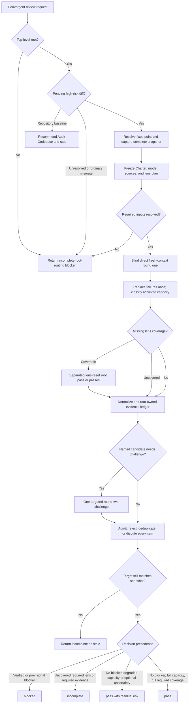

# Convergent PR Review Runtime And Relationship Design Synthesis

Status: exhaustive design reference and extraction map, not an executable contract.

Runtime authority remains in:

- `skills/custom/convergent-pr-review/SKILL.md`;
- `skills/custom/convergent-pr-review/agents/openai.yaml`;
- `skills/custom/review/FINDING-CONTRACT.md`, `ADVISORY-CONTRACT.md`, and `SMELL-BASELINE.md` at their shared-contract boundaries;
- `docs/agents/engineering-contract.md`, the caller's Charter, and the target repository's Spec, Standards, tracker, and validation contracts;
- `$review` for ordinary fixed-snapshot review and `$audit-codebase` for bounded repository-baseline audit;
- the invoking implementation owner, which retains Repair, successor-snapshot, residual-risk-acceptance, Lock, and Release authority; and
- the relationship map, pack tests, behavior evaluations, and installed mirror.

The current canonical Convergent PR Review package matches its installed mirror. Structural tests protect its main spine, capacity rows, ledger states, decisions, drift surfaces, and shared-contract relationships. Historical behavior evaluations support the root-only guard, exact degraded-capacity decisions, advisory separation, audit routing, and one-way high-risk handoff at their recorded hashes. This synthesis does not claim that the proposed coordinated rewrite has been extracted or behaviorally promoted. Canonical runtime source remains executable authority until a future rewrite passes every applicable gate below and is separately synchronized.

## How To Read This Document

This synthesis is exhaustive for accepted Convergent PR Review behavior, material alternatives, owned file changes, foreign-owner requirements, and proof needed for a future rewrite. It is not a second runtime procedure.

The document has four layers:

1. **Orientation** states the outcome, selected design, vocabulary, leading words, and explanatory flow.
2. **Normative Design** is the sole authority for proposed Convergent PR Review behavior and relationships.
3. **Evidence And Rationale** preserves reasons, deliberate non-changes, current evidence, gaps, and deferred hypotheses without creating runtime rules.
4. **Extraction And Verification** places and proves the design without redefining it.

Change proposed behavior in Layer Two; explain it in Layer Three; place and prove it in Layer Four. The Design Verdict reports selection status but creates no rule. The Normative Home Index assigns every behavior one authority. The Runtime Ownership And Change Map owns file placement and bundle identity. The Staged Extraction Plan owns implementation order. The Staged Behavior-Evaluation Protocol owns proof mechanics. The Migration And Acceptance Matrix owns case coverage only.

[Synthesis Ownership](../README.md#synthesis-ownership) governs foreign surfaces. This note owns Convergent PR Review's admission, immutable high-risk review protocol, independent reviewer orchestration, evidence ledger, decision, Return, and completion. Review synthesis owns the shared finding, advisory, smell, and ordinary-review contracts. Audit Codebase owns repository-baseline audit. Implementation callers own Repair and Lock. Correct any diagram, rationale, ownership row, or acceptance case that disagrees with its Layer Two owner.

Use this index for direct navigation:

| Question | Owning section |
| --- | --- |
| What outcome and family boundary govern the rewrite? | [North Star](#north-star), [Design Verdict](#design-verdict), and [Review Family Boundary](#review-family-boundary) |
| Which Convergent terms have precise meanings? | [Convergence Vocabulary](#convergence-vocabulary) |
| What should the runtime leading words mean? | [Leading-Word Runtime Model](#leading-word-runtime-model) |
| When may Convergent run, recommend another owner, or refuse delegation? | [Invocation, Admission, And Root Guard](#invocation-admission-and-root-guard) |
| What may the review inspect or mutate? | [Authority And Terminal Boundary](#authority-and-terminal-boundary) |
| How are Charter and review modes controlled? | [Charter And Review-Mode Contract](#charter-and-review-mode-contract) |
| How is one immutable review snapshot established? | [Fixed Point And Snapshot Custody](#fixed-point-and-snapshot-custody) |
| Which artifact proves what? | [Review Artifact Authority Contract](#review-artifact-authority-contract) |
| Which sources and lenses govern the review? | [Source Trace And Lens-Plan Contract](#source-trace-and-lens-plan-contract) |
| How are reviewers kept independent? | [Round-One Isolation And Reviewer Contract](#round-one-isolation-and-reviewer-contract) |
| What happens when fresh reviewer capacity is reduced? | [Capacity, Replacement, And Root-Fallback Contract](#capacity-replacement-and-root-fallback-contract) |
| How are candidates challenged and normalized? | [Challenge And Round-Two Contract](#challenge-and-round-two-contract) and [Evidence-Ledger State Contract](#evidence-ledger-state-contract) |
| Which observations become findings or advisories? | [Finding Admission And Root Verification](#finding-admission-and-root-verification), [Required And Optional Evidence](#required-and-optional-evidence), and [Advisory Contract](#advisory-contract) |
| How are decisions selected? | [Decision Contract And Precedence](#decision-contract-and-precedence) |
| When is each operation complete? | [Operation And Completion Contracts](#operation-and-completion-contracts) |
| Which context loads for each phase? | [Runtime Context Loading Contract](#runtime-context-loading-contract) |
| What does Convergent return? | [Return Contract](#return-contract) |
| Which caller or callee owns each edge? | [Relationship Ownership](#relationship-ownership) |
| How should the eventual main skill read? | [Proposed Runtime Semantic Surface](#proposed-runtime-semantic-surface) |
| What changes where? | [Runtime Ownership And Change Map](#runtime-ownership-and-change-map) and [Staged Extraction Plan](#staged-extraction-plan) |
| What must pass before promotion? | [Staged Behavior-Evaluation Protocol](#staged-behavior-evaluation-protocol), [Migration And Acceptance Matrix](#migration-and-acceptance-matrix), [Promotion Gate And Residual Gaps](#promotion-gate-and-residual-gaps), and [Completion Criterion For The Future Rewrite](#completion-criterion-for-the-future-rewrite) |

# Layer One: Orientation

## North Star

Convergent PR Review owns one outcome: judge one complete immutable local PR, release candidate, or bounded high-risk local diff through independent lens coverage and root-verified evidence; return one trustworthy read-only release-gate decision; and return control without granting Repair, successor-snapshot, residual-risk-acceptance, Lock, Release, or mutation authority.

The review is convergent because independent candidate generation ends in one root-owned evidence ledger and one terminal decision. It is not convergent because reviewers vote, repeat until they agree, or repair the target.

Immutable snapshot identity, governing Source Trace, finite required lenses, reviewer independence, root verification, terminal ledger states, drift, Return truth, and caller authority are gates. Reviewer count, speed, brevity, or apparent consensus never substitutes for them.

## Design Verdict

This table summarizes selection status and points to Layer Two, which owns every rule.

| Stratum | Selected shape | Runtime status |
| --- | --- | --- |
| Convergent core | One implicitly invocable, root-only, terminal, read-only release gate over one immutable high-risk snapshot | Preserve and sharpen through coordinated extraction |
| Review family | Review owns ordinary diffs; Convergent owns local PRs, release candidates, and bounded high-risk diffs; Audit Codebase owns bounded immutable repository baselines | Preserve the three-owner boundary and one-way handoffs |
| Reviewer model | Blind direct fresh-context round one; one optional named challenge round; root owns the ledger, verification, drift, and decision | Preserve; make lens planning, replacement, and completion explicit |
| Normal capacity | At least two fresh completed reviewers covering all required lenses may support `pass`; three to five reviewers exist only for distinct high-risk Charter lenses | Preserve two as the minimum, not a target detached from lens need |
| Degraded capacity | One fresh reviewer plus separated root coverage, or zero fresh reviewers plus two separated lens-reset root passes, may support at most `pass with residual risk` | Preserve exact fallback rows and disclose lost independence |
| Findings | Shared Review-owned admission and severity interface, with Convergent-owned candidate, challenge, verification, and blocking-decision state | Reconcile shared `Title`, maintainability, and evidence-gap semantics |
| Advisories | Default-off, verified, separate, nonblocking, and authority-free | Preserve and make phase loading explicit |
| Modes | Initial, remediation, and assurance are separate top-level invocations; internal challenge is never another invocation | Preserve; add carried-finding dispositions and exact scope |
| Return | One of `pass`, `pass with residual risk`, `blocked`, or `incomplete`, with an honest lens-coverage record and authority footer | Preserve decisions; make early incomplete and decision precedence coherent |
| Runtime packaging | Compact `SKILL.md`, current shared Review references, invocation metadata, tests, evaluations, and mirror | Add no new helper or persistent ledger in the first rewrite |
| Deferred hypotheses | Reviewer-brief reference, ledger renderer or schema, snapshot helper, dynamic reviewer allocator, or machine-readable report | Excluded until repeated evidence justifies their cost |
| Rejected machinery | Majority vote, consensus thresholds, reviewer-owned admission, automatic repair, unbounded rounds, same-invocation snapshot recapture, ordinary-plus-convergent duplicate gates, or baseline audit through diff findings | Keep outside the future rewrite |

## Review Family Boundary

One target and requested outcome have one review owner:

| Target and requested outcome | Owner | Terminal result |
| --- | --- | --- |
| Ordinary branch, WIP, staged-only, or since-X diff without a high-risk route | `$review` | One complete or incomplete ordinary report |
| Local PR, release candidate, or caller-selected bounded high-risk local diff needing independent lenses | `$convergent-pr-review` | One `pass`, `pass with residual risk`, `blocked`, or `incomplete` decision |
| Immutable repository baseline across bounded correctness, domain, methodology, data, analytics, validation, or performance lenses | `$audit-codebase` | One complete or incomplete coverage ledger without a release decision |
| Repair and successor snapshot after either diff-review owner returns | Invoking implementation owner | One new top-level review invocation under the original Charter |
| Acceptance of residual risk for Lock | Caller or delivery owner | One explicit acceptance decision under its own contract |
| Lock, commit, tracker closeout, push, deployment, PR comment, review submission, or external mutation | Caller or delivery owner | Verified mutation and read-back under its own authority |

Convergent never runs after an ordinary pass as a second opinion in the same review invocation. Review hands off the entire high-risk target before ordinary Pin and stops. Convergent recommends Audit Codebase for a repository baseline and stops. A direct explicit Convergent invocation remains valid, but it does not convert an ordinary low-risk diff or broad baseline into the wrong procedure.

## Convergence Vocabulary

Terms defined in `docs/agents/engineering-contract.md` retain those meanings, especially Source Trace, commitment boundary, fixed point, review snapshot, Charter, Repair generation, Spec / Standards, residual risk, and Lock. Shared finding and advisory terms retain their Review-owned meanings. Convergent adds only these terms:

| Term | Meaning |
| --- | --- |
| **Review invocation** | One top-level Convergent run with one run ID, mode, immutable snapshot, brief, lens plan, evidence ledger, drift result, and terminal decision |
| **Review brief** | The root-assembled, snapshot-addressed context supplied to reviewers: Charter, mode, Source Trace, acceptance, lens assignment, proof, constraints, and output contract |
| **Required lens** | One finite Standards, applicable Spec, or Charter-derived risk question whose coverage is required for a no-blocker decision |
| **Fresh reviewer** | A direct `fork_turns="none"` child created for this invocation, given no parent hypotheses or peer results, not resumed or reused, and not involved in implementation or integration of the candidate |
| **Separated root pass** | One root-owned fallback inspection over one assigned missing lens, restarted from the immutable brief with an explicit lens reset and without treating earlier root conclusions as independent evidence |
| **Round** | Round one generates blind candidate reports across the fixed lens plan; optional round two challenges named unresolved ledger items only |
| **Candidate** | A reviewer- or root-raised observation not yet admitted, rejected, deduplicated, or disputed by the root |
| **Evidence ledger** | The root-owned transient record of every candidate's axis, lens, shared finding fields, confidence, disposition, verification, and blocking effect |
| **Disputed item** | An item whose evidence or classification cannot be resolved after the allowed challenge and whose exact unresolved question and provisional blocking effect remain visible |
| **Capacity class** | The achieved independence level after requested reviewers complete, fail, or are replaced: full, one-fresh, zero-fresh, or uncovered |
| **Decision currentness** | The terminal fact that the reported target still matches the immutable review snapshot at the drift gate |

These terms orient the design. Their indexed Layer Two contracts remain the sole authority for admission, modes, reviewer identity, ledger state, decisions, and Return.

## Leading-Word Runtime Model

The eventual skill should expose this compact operating spine:

```text
Route -> Pin -> Trace -> Isolate -> Challenge -> Verify -> Return
```

- **Route** enforces the root guard and selects Convergent, Audit recommendation, or an incomplete return before review work.
- **Pin** resolves the fixed point and captures one complete immutable target plus identity and drift surfaces.
- **Trace** freezes the Charter, mode, governing sources, required lens plan, brief, and capacity request before dispatch.
- **Isolate** obtains blind direct fresh-context reports or the exact degraded fallback without leaking parent or peer conclusions.
- **Challenge** normalizes candidates and spends at most one targeted second round on named unresolved questions.
- **Verify** applies shared admission, resolves terminal ledger states, classifies capacity and evidence, and checks target drift.
- **Return** selects one decision by precedence, renders the complete ledger and coverage, and grants no new authority.

**Root-owned** and **read-only** are universal. They constrain every operation, artifact, reviewer, proof attempt, decision, and handoff rather than acting as extra steps.

## End-To-End Explanatory Flow



The diagram is explanatory. It omits exact snapshot modes, source precedence, state combinations, remediation and assurance bounds, advisory handling, and Return fields that are authoritative below.

# Layer Two: Normative Design

## Normative Home Index

Each proposed behavior has one normative home. Other sections may point, explain, place, or test it but never create a competing rule.

| Concern | Sole normative home | Other appearances |
| --- | --- | --- |
| Invocation reach, family admission, audit recommendation, and delegated refusal | [Invocation, Admission, And Root Guard](#invocation-admission-and-root-guard) | Description, family table, flowchart, relationships, evaluations |
| Human, mutation, terminal, Repair, Lock, and successor authority | [Authority And Terminal Boundary](#authority-and-terminal-boundary) | Return, relationships, and critical failures |
| Initial, remediation, assurance, retry, and Charter identity | [Charter And Review-Mode Contract](#charter-and-review-mode-contract) | Brief, Return, caller adapters |
| Fixed point, target precedence, complete capture, identity, and drift surfaces | [Fixed Point And Snapshot Custody](#fixed-point-and-snapshot-custody) | Artifact contract, operation table, evaluations |
| Charter, snapshot, source, reviewer report, ledger, proof, advisory, and decision roles | [Review Artifact Authority Contract](#review-artifact-authority-contract) | Return, ownership, substitution tests |
| Source precedence, required lenses, reviewer count, and brief completion | [Source Trace And Lens-Plan Contract](#source-trace-and-lens-plan-contract) | Isolate, capacity, evaluations |
| Fresh reviewer identity, blind round one, output, and reviewer authority | [Round-One Isolation And Reviewer Contract](#round-one-isolation-and-reviewer-contract) | Capacity rows and isolation evaluations |
| Replacement, retry, degraded capacity, root passes, and maximum decisions | [Capacity, Replacement, And Root-Fallback Contract](#capacity-replacement-and-root-fallback-contract) | Decision and Return |
| Candidate normalization and optional round two | [Challenge And Round-Two Contract](#challenge-and-round-two-contract) | Ledger states and evaluation |
| Valid status and verification combinations | [Evidence-Ledger State Contract](#evidence-ledger-state-contract) | Finding verification and decision |
| Shared finding admission, root verification, duplicate handling, and carried IDs | [Finding Admission And Root Verification](#finding-admission-and-root-verification) | Shared contract and Return |
| Target proof omissions, reviewer evidence gaps, optional uncertainty, and confidence | [Required And Optional Evidence](#required-and-optional-evidence) | Ledger, decisions, residual risk |
| Advisory admission, loading, and effect | [Advisory Contract](#advisory-contract) | Optional reviewer field and annex |
| Drift timing and currentness | [Drift Gate](#drift-gate) | Snapshot table, operation table, decisions |
| Decision precedence and exact meanings | [Decision Contract And Precedence](#decision-contract-and-precedence) | Return and caller acceptance |
| Operation entry, completion, and legal nonterminal return | [Operation And Completion Contracts](#operation-and-completion-contracts) | Leading words and evaluations |
| Progressive disclosure and disposable evidence | [Runtime Context Loading Contract](#runtime-context-loading-contract) | Runtime ownership and context evaluation |
| Early and post-review terminal forms | [Return Contract](#return-contract) | Decision, ownership, caller adapters |
| Cross-skill trigger, verb, packet, and return boundary | [Relationship Ownership](#relationship-ownership) | Relationship map and structural tests |

## Invocation, Admission, And Root Guard

Convergent remains implicitly invocable. Its description front-loads the observable trigger and boundary: one local PR, release candidate, or bounded high-risk local diff needs independent review and one terminal release-gate decision; a repository baseline belongs to Audit Codebase; orchestration is root-only.

Route before Pin:

| Observed request and target | Required route | Return boundary | Illegal shortcut |
| --- | --- | --- | --- |
| Top-level root receives one local PR or release candidate | Continue in Convergent | Convergent Return | Running ordinary Review first or treating PR size as a downgrade |
| Top-level root receives one caller-selected bounded high-risk local diff needing independent lenses | Continue in Convergent | Convergent Return | Reclassifying it as ordinary only because capacity is low |
| Direct explicit invocation supplies a plausible bounded high-risk diff | Continue unless evidence proves a family misroute | Convergent Return | Relitigating a safe caller choice from file count or language alone |
| A delegated task invokes Convergent | Return `incomplete` before Pin, repository inspection, or reviewer dispatch | Top-level root | Treating nested-spawn authority or user insistence as satisfaction of the root guard |
| A bounded immutable repository baseline, not a pending release diff, needs correctness, domain, methodology, data, analytics, validation, calibration, leakage, or performance coverage | Recommend `$audit-codebase` and stop | Caller | Starting Audit automatically or recasting baseline defects as diff findings |
| An ordinary low-risk diff clearly belongs to Review | Return `incomplete` with `$review` as the family route | Caller | Running a reduced Convergent procedure or invoking Review automatically |
| Target, outcome, or family cannot be resolved without a material caller choice | Return `incomplete` with the exact routing blocker | Caller | Guessing, reviewing multiple targets, or asking for facts discoverable read-only |

Convergent does not duplicate the detailed high-risk classification owned by the ordinary Review route and its implementation callers. It admits a caller-selected high-risk target unless the available evidence clearly shows a baseline audit, ordinary-review, or multi-target misroute. Capacity affects confidence, never family ownership.

The root guard is semantic, not merely a tool check. A delegated task may collect bounded read-only evidence for another owner, but it cannot own Convergent's reviewer dispatch, evidence ledger, drift gate, or decision. Its incomplete packet carries the supplied Charter, mode, fixed-point input, target input, Source Trace pointers, Spec requirement, required proof, carried IDs, and the exact top-level continuation when available.

## Authority And Terminal Boundary

Convergent owns only route validation, immutable capture, Source Trace, lens planning, direct reviewer dispatch, separated root fallback passes, read-only reproduction, candidate challenge, finding and advisory classification, evidence-ledger closure, drift, and one terminal decision.

It grants no permission to edit, stage, commit, create or switch branches, fetch after target capture, recapture a changed target, install dependencies, mutate services, access protected data, create worktrees, mutate tracker or PR state, submit a PR review, post a comment, send an external message, start remediation, dispatch a fix, perform Lock, release, or start another review invocation.

The caller owns the Charter, target selection, any pre-capture authority needed to resolve a remote ref, finding-classification validation before mutation, Repair admission and budget, successor snapshots, assurance requests, incomplete retries, acceptance of `pass with residual risk`, Lock, Release, and every mutation.

Read-only verification may execute only when the command and environment preserve tracked files, Git state, dependency state, external systems, protected data, and user data. Disposable evidence may live under `.tmp/convergent-pr-review/<run-id>/`; it grants no durability or authority. If verification needs authority Convergent lacks, apply [Required And Optional Evidence](#required-and-optional-evidence).

Every Convergent invocation is terminal. It returns one decision or route packet and stops. Even `blocked` supplies evidence only.

## Charter And Review-Mode Contract

Every admitted invocation records one Charter identity and one mode before reviewer dispatch. The Charter contains the outcome, acceptance, supported paths and environments, required proof, commitment boundary, non-goals, fixed point, Spec requirement, advisory setting, and any caller-set lens or capacity bounds. Missing optional fields use explicit defaults; missing required fields produce `incomplete`.

Convergent supports three modes:

| Mode | Target relationship | Required inputs | Review scope | Completion requirement |
| --- | --- | --- | --- | --- |
| `initial` | First Convergent invocation for this Charter and candidate | Charter, fixed-point input, target input, `Spec required`, and required proof | Full Charter across every required lens | One complete ledger and decision for the candidate |
| `remediation` | New successor snapshot after caller-owned Repair | Original Charter and identity, prior snapshot identity, every carried finding ID, Repair delta, remaining original acceptance, fixed point, and successor target | Carried outcomes and proof; regressions through the Repair delta and directly affected seams; remaining original acceptance exercised by those surfaces | Every carried ID disposed; newly admitted failures stay inside the remediation bound; one decision for the successor |
| `assurance` | Same accepted immutable snapshot reviewed again because the caller requests more confidence | Original Charter and identity, accepted snapshot identity, prior decision pointer, same fixed point and target, and explicit assurance authority | Full original Charter with a new lens plan at least as demanding as the original required coverage | New run ID, brief, ledger, fresh reviewers, drift result, and decision over the same snapshot |

Standalone direct review defaults to `initial`, `Spec required: no`, and `Advisories: no`. Implementation callers supply `Spec required: yes`. Caller-supplied values win when they do not conflict with the mode.

Every mode is a new top-level review invocation. It receives a new run ID, brief, lens plan, ledger, and reviewer set. A prior-invocation reviewer, resumed child, or implementation participant is not independent. Assurance is not remediation, round two, reviewer replacement, or a retry. Remediation is not a full new hardening audit. Round two never consumes a campaign review invocation because it remains inside the same snapshot, brief, and run ID.

An `incomplete` retry is caller-started. It retains the same target and mode only when the caller supplies or confirms the same immutable identity and closes the recorded blocker. Convergent never retries itself or silently changes mode. A target change creates a successor snapshot and, when caused by Repair, remediation mode.

## Fixed Point And Snapshot Custody

The fixed point is the comparison baseline. The review snapshot is the complete target judged against it. They are distinct and both appear in Return.

A caller-supplied fixed point wins. Otherwise discover the repository default branch and merge base, record the resolved commit SHA, and ask only when discovery is ambiguous. Failure to resolve the fixed point is `incomplete`.

Select one target using this precedence:

1. a caller-supplied review tree;
2. a resolved local PR or release-candidate head;
3. a caller-supplied committed branch, commit, or head;
4. a live working tree only when the bounded high-risk request clearly includes staged, unstaged, and untracked work.

Resolve PR identity and any caller-authorized pre-capture fetch before capturing the target. After capture, no fetch, checkout, reset, staging action, or ref update may alter the evidence boundary.

| Target mode | Complete capture | Snapshot identity | Drift surface |
| --- | --- | --- | --- |
| Supplied review tree | Resolve `<tree>^{tree}`; capture fixed-point-to-tree commit range, stat, full diff, and inspect content with `git show` | Resolved tree SHA | Immutable; verify the supplied identity was used |
| Local PR or release candidate | Record local provider/PR identity when available, base and head refs, resolved base/head/merge-base commit and tree SHAs, commit range, status, stat, and full fixed-point-to-head diff | Resolved head commit and tree SHAs plus captured PR identity | Current target head compared with captured head; a changed head is stale |
| Committed branch or commit | Resolve target ref to commit and tree SHAs; capture commit range, stat, and full fixed-point-to-target diff | Resolved commit and tree SHAs | If a live branch name was supplied, compare current head with captured head |
| Live working tree | Capture `HEAD`, index tree and entries, staged and unstaged diff bytes including binary identity, status, and every in-scope untracked path and content identity | Digest of the complete manifest and captured non-Git-addressed bytes | Recompute every captured Git and live-content surface before Return |

Git-addressed content needs no second hash. Hash non-Git-addressed content or the complete captured byte stream. Ignored files are outside scope unless the caller explicitly names them. A status entry without untracked content is incomplete capture.

Reviewers receive the captured snapshot or exact immutable artifact paths, never commands that read a moving live diff. A target that is empty, unresolved, multi-target, too broad for complete capture, or missing in-scope bytes produces `incomplete` before dispatch.

Decision-bearing non-Git source material read during Trace records its available revision, URL or provider identity, and capture time. Known material change to a required governing source before Return is a Source Trace conflict and produces `incomplete`; Convergent does not continuously poll sources whose provider exposes no stable revision.

## Review Artifact Authority Contract

Use each artifact only for its owned claim:

| Artifact or surface | Owns or proves | Must not substitute for |
| --- | --- | --- |
| Charter and identity | Outcome, acceptance, supported scope, required proof, commitment boundary, mode constraints, and caller-set bounds | Snapshot bytes, source resolution, finding evidence, or Repair authority |
| Fixed-point commit SHA | Exact comparison baseline | Review snapshot, currentness, Spec, Standards, or acceptance |
| Supplied tree or complete snapshot manifest | Exact target bytes captured for this invocation | Drift result, Source Trace, finding verification, or caller approval |
| Snapshot identity | Stable target handle for lineage, remediation, assurance, and Return | Evidence that a live target remained unchanged after capture |
| Source Trace | Governing Standards and Spec sources, precedence, availability, conflict, and identity | Proof that target behavior satisfies those sources |
| Lens plan | Finite required questions, assignment need, and coverage burden for this invocation | Completed reviewer coverage or a clean decision |
| Reviewer report | One blind reviewer's assigned-lens observations, coverage, skipped checks, and blocker evidence | Finding admission, independence of another report, ledger truth, or decision |
| Separated root pass | Root coverage for one missing lens under degraded capacity | Independent review or full-confidence `pass` |
| Safe reproduction or proof output | The named observation under its captured scenario and environment | Broader supported behavior, another lens, unavailable environment, or release acceptance |
| Evidence ledger | Root dispositions and verification for every candidate under one invocation | Snapshot currentness, caller Repair admission, or another invocation |
| Admitted finding | One verified target-caused contract failure | Automatic mutation, successor-snapshot authority, or Lock |
| Disputed item | One exact unresolved question and provisional blocking effect | Verified defect, clean axis, or consensus |
| Advisory | One verified nonblocking opportunity without a violated contract | Finding, severity, confidence, completeness, Repair, or decision |
| Terminal decision and report | Current release-gate judgment, coverage, findings, uncertainty, and authority boundary for one snapshot | Caller acceptance of residual risk, Repair, Lock, currentness after later drift, or Release |

When artifacts disagree, captured bytes, fresh read-only observations, and their owning contracts control. Correct the ledger or return `incomplete`; never edit an identity, source record, reviewer report, or finding field merely to make the evidence agree.

## Source Trace And Lens-Plan Contract

Build one Source Trace and one finite lens plan before reviewer dispatch. Finish decision-bearing source reading before root ledger verification; reviewer output may identify a missed source, but it cannot silently redefine the Charter or governing precedence.

Trace Spec in this order:

1. caller-supplied Charter, item, slice, criteria, path, issue, URL, spec, or legacy PRD;
2. PR body and decision-bearing comments plus directly linked sources, following `docs/agents/issue-tracker.md` when present;
3. references in captured commit messages; and
4. one matching authoritative source under repository conventions.

Trace Standards from repo instructions and routed pointers, contributor guidance, validation configuration, and meaningful nearby conventions in the captured snapshot. Load `SMELL-BASELINE.md` only when those sources are thin and label resulting candidates `baseline judgement call`.

When `Spec required: yes`, a missing, unreadable, conflicting, or unresolved source produces `incomplete` before dispatch. Never skip or replace the axis. When Spec is optional and absent, record `Spec: skipped - no source available` and use the released assignment for the highest-risk uncovered Charter lens.

Build the required lens plan in this order:

1. one Standards lens;
2. one Spec lens when applicable;
3. one distinct risk lens for each high-risk commitment boundary whose failure question is not already fully covered by Standards or Spec.

Examples of risk lenses include security or privacy, permissions, public or data contracts, persistence or migration, generated artifacts, release or CI, concurrency or state transitions, and shared cross-component integration. These are prompts, not an automatic catalog. Derive lenses from the Charter, touched seams, failure consequences, and required proof. Combine only questions that can be judged coherently from one evidence set; split lenses when combination would hide coverage.

Two fresh reviewers are the minimum for full independence, not a fixed assignment count. Use two only when the finite plan can be covered completely by two distinct assignments. Add reviewers one at a time for distinct required lenses, normally up to five. More than five requires explicit user authority. When the lens plan exceeds authorized capacity, consolidate only semantically compatible lenses; otherwise return `incomplete` with the uncovered lens before dispatch.

The root assembles one review brief containing:

```text
run ID and review mode
Charter identity and full applicable Charter
fixed point and immutable snapshot identity
exact captured target or artifact paths
Source Trace with Standards and Spec precedence
required lens plan and assigned axis/lens
acceptance and required proof
touched seams and supported scenarios
migration, permission, generated-artifact, network, service, protected-data, and environment constraints
shared finding and optional advisory contracts
reviewer output contract
```

In remediation, the brief includes the original Charter but directs judgment only to carried findings, the Repair delta, directly affected regressions, and remaining original acceptance through those surfaces. In assurance, it supplies the full original Charter and same accepted snapshot.

Keep a compact brief inline. Store only large captured artifacts under `.tmp/convergent-pr-review/<run-id>/` and pass exact absolute paths and identities. The brief is complete only when every reviewer can inspect its assignment without live target discovery or parent-conversation context.

## Round-One Isolation And Reviewer Contract

Spawn every round-one reviewer as a direct root child with `fork_turns="none"`. Reviewers never spawn, edit, mutate external state, own ledger admission, choose the aggregate decision, authorize Repair, or start another review.

A reviewer counts as fresh only when all conditions hold:

- created for this invocation as a direct fresh-context child;
- receives only the shared brief, one assigned axis and lens, and the output contract;
- receives no parent hypotheses, preliminary candidates, peer output, partial ledger, implementation discussion, or preferred fix;
- did not implement, integrate, repair, or previously review this candidate or Charter; and
- is not a resumed task, inherited-context child, campaign participant, or prior-invocation reviewer.

Round one is blind. Dispatch the planned assignments without sharing peer results. Wait for every requested lens or a terminal reviewer failure. Reviewers may inspect shared immutable artifacts concurrently because they are read-only; they may not query a moving target.

Each reviewer returns exactly:

```text
status: complete | blocked
axis: Standards | Spec | Risk
lens:
coverage:
findings:
advisories: <only when enabled>
skipped checks:
blockers:
```

`complete` means the assigned lens was inspected to the brief's boundary and every candidate includes the shared finding fields the reviewer can support. `blocked` identifies the missing evidence or authority and preserves any verified observations without implying clean coverage.

Reviewer reports are candidate sources, not votes. Reviewer agreement does not admit a finding; reviewer disagreement does not reject one; one reviewer's evidence may survive when root verification closes it.

## Capacity, Replacement, And Root-Fallback Contract

Before dispatch, reconcile the active direct-agent lifecycle and requested lens count. Wait for results still needed, interrupt only superseded work under normal authority, and retry capacity discovery once after a capacity error. Do not infer capacity from completed or interrupted tasks.

When a requested reviewer fails to start or return, replace it with a new direct fresh-context reviewer for the same assignment when capacity permits. A blind same-lens replacement remains round one. Retry dispatch once after lifecycle reconciliation, then classify achieved capacity; do not loop for ideal staffing.

After round-one completion and any one allowed replacement attempt, apply exactly this table:

| Achieved independent review | Required coverage | Required root work | Maximum no-blocker decision |
| --- | --- | --- | --- |
| At least two fresh completed reviewers | Every required lens is covered across fresh direct reviewers | Root admission and verification only | `pass` |
| Exactly one fresh completed reviewer | Fresh coverage is preserved; every missing required lens is coverable by the root | One or more separated root passes, each restarted from the immutable brief with an explicit lens reset | `pass with residual risk` |
| Zero fresh completed reviewers | Every required lens is coverable by the root | At least two separated root passes with explicit lens resets, collectively covering every required lens | `pass with residual risk` |
| Any required lens or required evidence axis remains uncovered after allowed fresh and root work | Coverage does not close | Record the exact uncovered lens and stop no-blocker evaluation | `incomplete` |

At least two fresh completed reviewers is necessary but not sufficient for plain `pass`: every required lens, evidence axis, admission gate, and drift gate must also close. Three fresh reviewers do not cure an uncovered fourth required lens.

A separated root pass is not independent. Each pass names one lens, begins from the immutable brief and captured evidence, excludes conclusions and severity pressure from other passes, and records coverage using the reviewer output contract. Root fallback never produces plain `pass`, never inflates the reviewer count, and is disclosed in Confidence and Residual risk.

A verified or provisional blocker may produce `blocked` under [Decision Contract And Precedence](#decision-contract-and-precedence) even when other lens coverage remains incomplete. The report must preserve those uncovered lenses; `blocked` establishes that the snapshot cannot pass, not that review coverage was exhaustive.

## Challenge And Round-Two Contract

Normalize every round-one reviewer and root-pass observation into one evidence ledger before deciding whether challenge is needed. Merge same-axis duplicates under one canonical ID. Link cross-axis overlap without collapsing axes, anchors, severities, or counts. Preserve a one-reviewer candidate when its evidence survives.

Round two is optional and targeted. Use it only for a named candidate that remains disputed, ambiguous, under-evidenced, internally inconsistent, or contradicted by captured evidence. It is not an automatic second audit, a whole-ledger replay, a search for more findings, or a capacity substitute.

Prefer a new direct `fork_turns="none"` challenger. Send only:

```text
ledger ID
claim and axis/lens
supporting evidence
contrary evidence or exact ambiguity
captured artifact pointers
exact decision needed
```

Withhold peer identities, unrelated findings, provisional severity pressure, and the rest of the ledger. A fresh challenger adds independent evidence only for the named question.

Use `followup_task` on the originating reviewer only to obtain an omitted required field, locate evidence it already claimed, or answer one narrow question about its own report. The continuation adds no independence, receives no peer output or shared provisional ledger, and cannot broaden its lens.

Round two keeps the original snapshot, Charter, mode, lens plan, and run ID. It cannot recapture the target, add a new general lens, or become remediation or assurance. If targeted challenge exposes a new candidate through the same captured evidence and assigned seam, assign a new ID with `origin: round-two challenge` and close it under the same ledger rules. Otherwise record the out-of-scope observation as residual follow-up, not a finding.

Stop when no named candidate needs challenge or after one round-two challenge wave. Unresolved items become disputed; no third round runs.

## Evidence-Ledger State Contract

The root owns one transient evidence ledger. Each item contains the shared finding fields plus:

```text
Title:
Lens:
Origin:
Confidence:
Status: candidate | accepted | rejected | duplicate | disputed
Verification: unverified | verified | disproved | not checked
Verification evidence or reason:
Blocking decision: blocking | nonblocking | provisional-blocking | none
Canonical item: <duplicate only>
Unresolved question: <disputed only>
```

Only these terminal combinations are valid:

| Status | Allowed verification | Required meaning |
| --- | --- | --- |
| `accepted` | `verified` | Every shared admission gate closes and root evidence supports the claim |
| `rejected` | `disproved` | Root evidence disproves the claimed failure |
| `rejected` | `not checked` | A non-evidentiary admission gate such as Anchor, Reach, or Proportion fails; record why truth checking is unnecessary |
| `duplicate` | `verified` or `not checked` | Points to one accepted or disputed canonical item and adds no independent count; record whether evidence was independently checked |
| `disputed` | `verified` or `not checked` | The underlying evidence may be real, but impact, scope, classification, or a necessary check remains unresolved; record the exact question and provisional blocking effect |

`candidate` and `unverified` are transient only. No terminal report contains either. A duplicate never hides cross-axis overlap. A disputed item never appears as an accepted finding, but it remains visible under its axis and influences the decision only through its provisional blocking effect and required-evidence status.

Confidence is evidence-specific prose, not a synthetic numeric score. It records the strongest direct support and material limit. Consensus count is not confidence.

## Finding Admission And Root Verification

Read the Review-owned `FINDING-CONTRACT.md` before judgment. Reviewer observations become findings only after the root closes the shared Anchor, Reach, Evidence, Impact, and Proportion gates and applies the shared verification bound.

The root must:

1. inspect the captured location and governing anchor;
2. verify the supported scenario and direct evidence read-only;
3. reject disproved, speculative, unsupported, disproportionate, or adjacent claims;
4. admit only target-caused contract failures;
5. assign severity after admission;
6. record Charter-based blocking separately from severity where the shared contract requires it; and
7. preserve the caller's sole Repair authority.

Every accepted item uses the shared finding interface, including stable ID and `Title`. Risk findings use `Axis: Risk` and name their lens. Standards and Spec remain independent axes. Same-axis duplicates collapse; cross-axis overlap links but remains distinct.

In remediation, return one disposition for every carried finding ID:

- `resolved`: required outcome and proof close on the successor snapshot;
- `still admitted`: the original failure remains verified;
- `disproved`: current evidence establishes the prior claim does not hold under the original Charter; or
- `incomplete`: required evidence cannot close the disposition.

A carried finding keeps its original ID and axis. Newly admitted remediation failures receive new IDs and must arise through the Repair delta, directly affected seams, or remaining original acceptance exercised there. Untouched surfaces do not reopen.

The root may preserve already verified accepted findings in a blocked or incomplete report. It never calls an uncovered axis clean and never presents a candidate or unverified item as a finding.

## Required And Optional Evidence

Keep four cases distinct:

| Evidence condition | Classification | Decision effect |
| --- | --- | --- |
| The target omits proof or an artifact the governing Charter requires it to supply | Candidate target defect under the shared finding gates | Accepted and blocking when the governing boundary makes the omission release-blocking |
| Convergent cannot obtain evidence required to cover a lens or decide a required claim | Reviewer evidence gap | `incomplete` unless an already verified blocker takes precedence; never an admitted finding |
| An optional check is unavailable but direct evidence is sufficient to reject a blocker and complete required coverage | Named residual risk; ledger item may be disputed `not checked` or the check may remain outside an item | At most `pass with residual risk` |
| The Charter makes the unresolved uncertainty itself release-blocking | Provisional blocking evidence gap with exact missing check | `blocked` on a current snapshot |

`not checked` is a Convergent ledger verification state, never a substitute for shared finding admission. An accepted item is always verified. Missing required evidence cannot be laundered into nonblocking residual risk. Optional uncertainty cannot be hidden to obtain plain `pass`.

Record every skipped check with required or optional status, reason, supported environment, confidence impact, affected lens, and blocking effect. A safe structural proxy is evidence only for the exact inputs, transitions, outputs, and failure branches inspected; it is never reported as runtime proof.

## Advisory Contract

The Charter supplies `Advisories: yes | no`; default to `no`. Load `ADVISORY-CONTRACT.md` only when enabled.

Reviewer advisory candidates use the optional reviewer field, but the root verifies them separately from the evidence ledger. Admit an advisory only when one supported scenario, direct snapshot evidence, plausible benefit, and absence of a violated governing contract survive verification.

Advisories have no severity, do not enter finding IDs, carried IDs, ledger counts, capacity, Confidence, or decision selection, never block, and grant no Repair or mutation authority. When disabled, omit verified opportunities that are not findings. Never demote a violated contract, required proof, or supported behavior into an advisory.

## Drift Gate

Run drift after ledger closure and before decision rendering:

- supplied review tree: confirm the immutable supplied identity was used;
- local PR or release candidate: compare current target head with captured head;
- committed live branch: compare current resolved head with captured head;
- live worktree: compare current `HEAD`, index tree and entries, staged diff, unstaged diff, status, every in-scope untracked path, and every captured live-content identity with the snapshot.

Known change to a required governing non-Git source is handled as a Source Trace conflict. Unknown provider change without stable revision is recorded as an evidence limit, not silently called current source proof.

Any target difference makes the decision stale. Return `incomplete` and name the changed surface. Do not recapture, refresh findings onto new bytes, reuse reviewer reports for a new target, or start another invocation. Only the caller may authorize a new snapshot.

Delete disposable evidence before Return or name each intentionally preserved `.tmp/` path, why it remains, and who owns cleanup. Failure to reconcile evidence cleanup makes Return `incomplete` when preserved data or authority would otherwise be misrepresented.

## Decision Contract And Precedence

Select exactly one decision after ledger closure and drift. Apply this precedence:

1. `incomplete` when route, fixed point, target capture, required Source Trace, or drift prevents a trustworthy decision over one current snapshot.
2. `blocked` when the current snapshot has an accepted blocking finding or a disputed or `not checked` item with `provisional-blocking`, even if other lenses remain uncovered.
3. `incomplete` when no blocker is established but any required lens, required verification, carried disposition, or terminal ledger state remains uncovered.
4. `pass with residual risk` when no blocker remains and required coverage closes, but capacity was degraded or nonblocking optional uncertainty remains.
5. `pass` only when the snapshot is current, every required lens and check closes, no blocking or disputed uncertainty remains, every item is terminal, and at least two fresh completed reviewers supplied full required coverage.

The decisions mean:

| Decision | Exact meaning | Caller consequence |
| --- | --- | --- |
| `pass` | Full required coverage, full minimum independence, current snapshot, no blocker, and no nonblocking unchecked uncertainty | Caller may continue its own Lock gate; Convergent grants no Lock |
| `pass with residual risk` | Current snapshot and complete required coverage with no blocker, but independence was degraded or optional uncertainty remains | Caller alone decides whether named residual risk is acceptable for Lock |
| `blocked` | Current snapshot has enough verified or provisional blocking evidence to deny a pass | Caller validates findings and decides whether to Repair; uncovered lenses remain explicit and require a successor full decision |
| `incomplete` | No trustworthy current release-gate decision can be closed because an earlier gate, required no-blocker coverage, or report state failed | Caller closes the blocker and starts a new invocation if desired |

A `blocked` result does not claim exhaustive coverage when lenses remain uncovered. A verified blocker is sufficient to deny release, but any Repair successor must receive the original Charter, all accepted carried IDs, the Repair delta, remaining acceptance, and fresh full required coverage.

## Operation And Completion Contracts

This table is the sole proposed authority for operation completion and legal nonterminal return.

| Operation | Enter when | Complete when | Legal nonterminal return |
| --- | --- | --- | --- |
| **Route** | A Convergent invocation supplies a target or outcome | Top-level root ownership holds and exactly one family owner and return boundary are selected | `incomplete` root-routing or family-routing packet; Audit recommendation and stop |
| **Pin** | Convergent owns one target | Fixed point resolves; one target mode wins; every in-scope byte is captured; snapshot identity and drift surfaces are recorded; target is nonempty | `incomplete` with unresolved ref, empty target, multi-target scope, or missing capture surface |
| **Trace** | Pin is complete | Charter identity, mode, Source Trace, required lens plan, requested capacity, complete brief, and artifact pointers are frozen | `incomplete` for missing mode input, required source, unassignable lens, or incomplete brief |
| **Isolate** | Trace is complete | Every requested round-one assignment returns, is replaced once, or has a terminal failure; achieved capacity is classified; required root fallback passes complete where possible | `incomplete` for uncovered required lens; `blocked` only when preserved evidence already establishes a blocker under decision precedence |
| **Challenge** | Round-one candidates are normalized | Same-axis duplicates collapse, cross-axis overlap links, and every named ambiguity receives at most one targeted challenge or becomes disputed | Continue directly to Verify when no challenge is needed; no third round |
| **Verify** | Candidate generation and challenge close | Every item has a valid terminal status/verification combination; accepted and disputed items receive root verification; advisories are separate; carried IDs are disposed; skipped checks and capacity are classified; drift passes | `blocked` or `incomplete` under decision precedence |
| **Return** | Verification and currentness close or an earlier gate stops | Exactly one decision or route result renders the available truth, coverage, ledger, gaps, preserved evidence, and authority footer | None; Return is terminal |

No invocation completes on a resolved ref, captured diff, Source Trace, requested reviewer count, one clean reviewer, majority agreement, candidate list, challenge response, accepted finding, or test pass alone.

## Runtime Context Loading Contract

Keep universal orchestration and decision behavior in `SKILL.md`. Load conditional context only when its trigger fires:

| Observed state or phase | Load now | Keep out |
| --- | --- | --- |
| Every admitted Convergent review | `SKILL.md`, repo instructions, engineering contract, caller packet, and captured target | Ordinary Review procedure, Audit procedure, caller Repair, full smell list, disabled advisory fields |
| Before reviewer briefing and root admission | `review/FINDING-CONTRACT.md` | Audit defect interface, implementation repair steps, duplicated shared fields |
| Standards and nearby conventions are thin | `review/SMELL-BASELINE.md` | Baseline smells when repository Standards already govern |
| `Advisories: yes` | `review/ADVISORY-CONTRACT.md` | Advisory contract when disabled |
| Tracker, issue, PR, or linked source must be read | Target repository's routed tracker instructions and only the named decision-bearing source | Provider mutation procedure or unrelated tracker history |
| A repository baseline is detected | Recommend `$audit-codebase` and stop | Audit lenses, defect contract, performance lens, or report schema |
| A round-two item is selected | Only the named challenge packet and referenced captured evidence | Whole ledger, peer reports, unrelated findings, or parent hypotheses |

Keep the root brief inline when compact. Use `.tmp/convergent-pr-review/<run-id>/` only for large captured artifacts or proof output. Reviewers receive exact paths, not a directory to explore speculatively.

Do not add a reviewer-brief reference, ledger helper, snapshot helper, or report renderer in the first rewrite. The current package is compact enough, and no behavior evidence shows irreducible sprawl, premature completion, or mechanical variance that sharper contracts and tests cannot cure. Reconsider only under Layer Three's evidence triggers.

## Return Contract

Return exactly one Convergent family result. Render fields whose values do not yet exist as `not created`, `not resolved`, or `not run`; never omit them in a way that implies success.

### Post-review decision

Begin with:

```text
Review snapshot: <identity>
Fixed point: <resolved commit SHA>
Review target: <mode and captured input>
Charter: <identity>
Source Trace: Standards: <sources>. Spec: <source or skipped>.
Review mode: initial | remediation | assurance
Run ID: <id>
Reviewers: <fresh IDs/count; root fallback passes>
Rounds: <1 | 2>
Capacity: full | one-fresh | zero-fresh | uncovered
Confidence: <full or reduced with reason>
Review decision: pass | pass with residual risk | blocked | incomplete
```

Then render a lens-coverage table containing axis, lens, reviewer or root-pass identity, status, covered scenarios, skipped checks, and blocker. The table distinguishes complete lens coverage from an aggregate decision.

Return the complete terminal evidence ledger under:

```markdown
## Standards
## Spec
## Risk
## Rejected Or Duplicate
```

Sort accepted and disputed items within each axis by blocking effect and severity. Render shared finding fields plus Convergent ledger fields. Use `No accepted findings.` for a clean covered axis and `No accepted findings; disputed: <IDs>.` when disputes remain. Use `Not covered: <reason>.` when the axis or lens did not close. Never render uncovered as clean.

End each accepted finding with a repair-ready evidence handoff naming its stable ID, likely files or seam, required outcome, and expected validation. This is evidence for the caller, not mutation authority.

In remediation, add:

```markdown
## Carried Findings

<every carried ID and resolved | still admitted | disproved | incomplete>
```

When advisories are enabled, append a separate `## Advisories` annex using the shared fields. Omit the annex when disabled. Advisories never affect the ledger, Confidence, or decision.

End with:

```text
Skipped checks: <required and optional checks or none>
Residual risk: <capacity and evidence limits or none>
Preserved evidence: <paths and cleanup owner or none>
Return boundary: caller
Mutation authority: none
Successor snapshot authority: none
```

### Early or pre-decision incomplete

Use one coherent form even when Route, Pin, or Trace stops before some identities exist:

```text
Review snapshot: <identity or not resolved>
Fixed point: <SHA or not resolved>
Review target: <input or unresolved>
Charter: <identity or not resolved>
Source Trace: <resolved summary, not built, or unresolved>
Review mode: <mode or unresolved>
Run ID: <id or not created>
Reviewers: none | <completed identities>
Rounds: 0 | 1 | 2
Capacity: not assessed | <class>
Confidence: unavailable | reduced
Review decision: incomplete
Covered: <completed route, capture, source, lens, or verification work>
Verified findings: <IDs or none; no clean inference>
Carried findings: <dispositions or not applicable>
Blocker: <root route | family route | fixed point | capture | Charter | source | lens | evidence | drift | report>
Skipped: <work not run because of the blocker>
Residual risk: <effect of unavailable evidence>
Preserved evidence: <paths and cleanup owner or none>
Return boundary: caller
Mutation authority: none
Successor snapshot authority: none
```

A delegated root-guard refusal normally has `Review snapshot: not resolved`, `Source Trace: not built`, `Run ID: not created`, `Reviewers: none`, and `Rounds: 0`. An incomplete result after reviewer work preserves verified accepted findings and lens coverage, but never unverified candidates or clean claims for uncovered lenses.

### Audit recommendation or ordinary-review route

A repository-baseline misroute returns one compact recommendation naming `$audit-codebase`, the requested baseline outcome, available target and Source Trace pointers, `Downstream execution: none`, and the authority footer. It starts no audit.

A clear ordinary-review misroute returns the early incomplete form with `$review` as the family route. Convergent does not invoke Review or wrap a Review result.

**Complete:** Route selects Convergent under the top-level root; Pin captures one complete immutable target; Trace freezes the Charter, mode, sources, lenses, and brief; Isolate finishes every requested assignment or exact degraded fallback; Challenge closes or records every named ambiguity within two rounds; Verify leaves no candidate or unverified item, applies shared admission, disposes carried IDs, separates advisories, classifies capacity and evidence, and passes drift; Return emits one decision and complete available ledger with no mutation or successor authority.

## Relationship Ownership

| Caller | Verb | Callee | Trigger and required return |
| --- | --- | --- | --- |
| Direct user at top-level root | Invoke | `$convergent-pr-review` | One local PR, release candidate, or bounded high-risk local diff needs independent review and one terminal decision |
| `$review` at top-level root | Hand off | `$convergent-pr-review` | A local PR or high-risk local diff is detected before ordinary Pin; transfer the complete caller packet and stop |
| Delegated `$review` | Return packet | Top-level root | A high-risk target is detected but the root-only callee cannot be invoked from the delegated task |
| `$implement` | Invoke | `$convergent-pr-review` | One selected local PR or high-risk immutable candidate needs initial, remediation, or caller-authorized assurance review with `Spec required: yes`; Implement retains Repair and Lock |
| `$parallel-implement` | Invoke | `$convergent-pr-review` | One drained proved local PR or high-risk candidate needs review after implementation actors are idle; the root campaign owner retains Repair, Lock, and Release |
| `$convergent-pr-review` | Load | Review shared contracts | Findings use `FINDING-CONTRACT.md`; optional advisories use `ADVISORY-CONTRACT.md`; thin Standards may use `SMELL-BASELINE.md`; Convergent retains orchestration, ledger, and decision |
| `$convergent-pr-review` | Recommend and stop | `$audit-codebase` | The request is a bounded immutable repository baseline rather than a pending release diff |
| `$skill-router` | Recommend and stop | `$convergent-pr-review` | One local PR, release candidate, or bounded high-risk local diff needs independent review |

There is no Convergent handoff back to Review, no automatic Audit invocation, no reviewer-to-reviewer composition, no implementation-actor reviewer credit, no Convergent-owned Repair edge, and no caller running ordinary and Convergent review as duplicate gates over one invocation.

# Layer Three: Evidence And Rationale

Layer Three explains the selected design. It creates no predicate, permission, prohibition, state, field, transition, or completion condition. When it differs from Layer Two, Layer Two wins and this layer must be corrected.

## Why Convergent Remains A Separate Owner

Ordinary Review and Convergent PR Review share finding semantics but promise different outcomes. Ordinary Review gives one complete or incomplete judgment report. Convergent adds independent reviewer custody, a finite lens plan, degraded-capacity truth, candidate challenge, a root evidence ledger, disputes, confidence effects, and one aggregate release-gate decision.

Audit Codebase has a third meaning: complete bounded baseline coverage without a release decision. Folding all three together would make ordinary diffs carry orchestration and ledger machinery and would let `complete`, `pass`, `blocked`, and audit coverage compete for one meaning.

## Why Root-Only Is A Semantic Guard

The root sees the active-agent lifecycle, owns direct-child dispatch, receives all reports, controls what information crosses between reviewers, and can verify the final ledger against the captured snapshot. A delegated task cannot guarantee that its inherited context is blind, that it is not itself an implementation participant, or that nested reviewer work remains visible to the actual caller.

The July 18 behavior evaluation reproduced the no-guidance failure in five of five fresh controls and removed it in five of five candidate samples. The guard therefore earns its place even when general delegation authority exists.

## Why Route Precedes Pin

The family choice changes snapshot owner, result meaning, and context cost. Pinning inside Convergent before discovering a repository-baseline audit or ordinary diff creates the wrong artifact and invites duplicate review. A delegated invocation must stop before repository inspection so it cannot accidentally become an untracked review root.

## Why Charter And Modes Are Explicit

Initial, remediation, and assurance may inspect the same files but answer different questions. Remediation is bounded to carried failures and Repair-created reach. Assurance preserves the accepted snapshot and full Charter but buys new independent evidence. Round two answers one ambiguity inside the current invocation.

Without exact mode identity, an agent can reopen untouched scope during remediation, reuse reviewers during assurance, count an internal challenge as a new campaign review, or silently review a changed target under the old result.

## Why Lens Planning Precedes Reviewer Count

Two fresh reviewers is a useful independence floor but not a proof that the risk surface is covered. A security migration can require Standards, Spec, security, persistence, and compatibility questions; a tightly bounded PR may need only Standards and Spec. Starting from a finite lens plan prevents reviewer count from becoming a proxy for coverage.

The selected design retains the current two-reviewer default as the normal minimum and permits three to five only when distinct Charter lenses justify them. It rejects maximum-width fanout and post-hoc claims that an unassigned lens was somehow covered.

## Why Round One Is Blind

Parent hypotheses and peer findings create anchoring, correlated omissions, and false agreement. Fresh context matters only when the brief carries the necessary sources and the reviewer is isolated from preferred diagnoses and fixes. Direct children make custody legible; prohibiting reviewer fanout keeps one root accountable for the full lens plan.

Blindness does not mean reviewers lack context. They receive the complete immutable brief. It means they lack conclusions that would contaminate independent candidate generation.

## Why Degraded Capacity Is Exact

Review capacity is an execution constraint, not a reason to invent confidence. One fresh reviewer still adds independent evidence, while root coverage can prevent a required lens from disappearing. Zero fresh reviewers can still produce useful separated inspection, but it cannot honestly be called independent.

The capacity matrix converts those facts into exact maximum decisions. It avoids two bad extremes: falsely returning plain `pass` after manual self-review, or refusing all useful judgment when no fresh reviewer can start. The July 18 coordinated evaluation showed control variance on the zero-fresh and one-fresh cases and candidate convergence on the selected rows.

## Why Evidence Beats Consensus

Multiple reviewers can repeat the same unsupported suspicion. One reviewer can identify a real defect that everyone else misses. Majority vote would reward correlated attention and suppress minority evidence.

The root therefore verifies claims against the snapshot and governing anchor. Same-axis duplicates reduce noise; cross-axis overlap remains visible because Standards and Spec mean different things. Consensus can inform where to look, but never admits or rejects an item.

## Why Challenge Is Named And Finite

An unconditional second review wave doubles cost, leaks the emerging ledger, and encourages endless search. A targeted challenger has one falsifiable question and no unrelated context. Two rounds are enough to generate independent candidates and resolve material ambiguity while keeping the invocation finite.

Unresolved questions remain disputed rather than being averaged away. A third round would create another opportunity to defer root judgment without a new authority or snapshot.

## Why `blocked` Can Precede Complete Coverage

A verified P1 on a current snapshot is sufficient to deny a pass even if another lens could not run. Returning only `incomplete` would hide useful blocking evidence and weaken the caller's Repair packet. Calling the review exhaustive would be equally wrong.

The decision precedence therefore permits `blocked` while requiring uncovered lenses to remain explicit. The successor review must restore complete required coverage; the blocker does not waive it.

## Why Advisories Remain Outside Convergence

Convergence is about release-relevant contract failures and evidence uncertainty. Optional opportunities add value only when requested, but they must not increase finding counts, consume challenge attention, lower confidence, change a decision, or authorize repair.

The shared advisory contract already establishes that boundary. Convergent only controls whether it loads and where it renders.

## Why Return Is Terminal

Reviewer reports and findings are evidence, not mutation authority. If Convergent repaired its own findings, the same owner would generate, select, implement, and rejudge the change. Automatic snapshot recapture would similarly erase the caller's control over review invocation and campaign budgets.

Returning one decision lets Implement or Parallel Implement validate classification, admit one bounded Repair batch, capture a successor, and spend another review invocation under their own Charter.

## Deliberate Non-Changes

- Keep the `$convergent-pr-review` handle and human-facing display name.
- Keep implicit invocation so local PR and high-risk release-review requests can be discovered, while preserving direct explicit invocation.
- Keep top-level-root orchestration and direct fresh-context children.
- Keep the terminal read-only boundary and `.tmp/` as disposable evidence only.
- Keep one immutable snapshot per invocation and caller-owned successor capture.
- Keep three modes: initial, remediation, and assurance.
- Keep two rounds maximum and round two conditional.
- Keep two fresh completed reviewers as the minimum independence floor for plain `pass`.
- Keep three to five reviewers only for distinct required risk lenses and require explicit user authority above five.
- Keep the exact one-fresh and zero-fresh degraded-capacity fallbacks and their maximum decision.
- Keep P0 through P3 severity and shared Review-owned finding admission.
- Keep default-off advisories and the separate shared advisory annex.
- Keep `pass`, `pass with residual risk`, `blocked`, and `incomplete`; do not add `approved`, `changes requested`, `inconclusive`, or a numeric score.
- Keep the one-way Review handoff, Audit recommendation, and caller-owned Repair and Lock.
- Keep current source and installed mirror separate until coordinated validation and explicit synchronization.

## Current Evidence

Current canonical source and installed mirrors were read back on 2026-07-20. `skills/custom/convergent-pr-review/SKILL.md` and `agents/openai.yaml` were byte-identical to their installed counterparts. This proves current mirror parity only; it does not prove this proposed rewrite.

`tests/test_skill_pack_contracts.py` currently protects:

- the `Pin -> Trace -> Isolate -> Challenge -> Verify -> Return` spine;
- fresh `fork_turns="none"` reviewers and the reviewer output contract;
- the root-only guard and stop-before-Pin behavior;
- initial, remediation, and assurance mode names;
- the four capacity rows and reduced-capacity no-plain-pass rule;
- the shared finding and advisory references and authority footer;
- terminal ledger states and the four decision names;
- snapshot drift across `HEAD`, index, staged, unstaged, status, and untracked content;
- risk-scaled Implement and Parallel Implement caller ownership; and
- relationship-map invocation policy and one-way review boundaries.

Those are structural and literal contracts. They do not prove complete capture, source precedence, blind reviewer behavior, lens sufficiency, root fallback separation, finding admission, state-transition validity, decision precedence, or semantically honest Return.

Historical behavior evidence is useful but hash-bound:

- `docs/validation/transcripts/2026-07-18-root-only-orchestration-eval.md` recorded control failure `5/5` and candidate failure `0/5` for delegated root-only refusal at Convergent hash `e28eec5a...`.
- `docs/validation/transcripts/2026-07-18-coordinated-v2-behavior-eval.md` recorded control full-rubric failure `5/5` and candidate full-rubric failure `0/5` across exact capacity decisions, advisory separation, family routing, root guards, friction, and four-slot scheduling at the same Convergent hash.
- `docs/validation/transcripts/2026-07-12-cohesion-followup-evals.md` recorded a `5/5` composition-boundary result for Review's one-way high-risk handoff, but the passes were separated rather than independent and used older hashes.
- `docs/validation/transcripts/2026-07-13-cohesion-boundary-evals.md` preserved contract-simulation evidence for fresh-context review and decision selection, not live reviewer orchestration.

The current Convergent `SKILL.md` hash differs from the July 18 candidate hash. Historical evaluations support the design choices they directly tested, but they are not fresh proof of current or future wording.

The unimplemented July 18 coordinated rewrite analysis also identified separate Repair/review campaign budgets, reviewer-capacity degradation, advisories, root-only orchestration, and audit routing. Parallel Implement now owns the campaign counters and review-invocation accounting; Convergent must preserve the observable invocation identity and decision fields without absorbing ledger mechanics.

## Current Gaps The Rewrite Must Close

1. Early `incomplete` paths stop before fields such as snapshot, Source Trace, run ID, reviewers, and rounds exist, but the current Return has no coherent early form.
2. The shared finding synthesis adds `Title`, concrete maintainability impact, and sharper required-versus-optional evidence semantics that Convergent must consume without duplicating.
3. Current `not checked` wording does not define valid status combinations or cleanly distinguish accepted, rejected, duplicate, and disputed items.
4. `blocked` versus `incomplete` precedence is ambiguous when one verified blocker exists but another required lens remains uncovered.
5. The two-reviewer default and “assign Standards and Spec first, then risk lenses” do not explicitly prove that every distinct high-risk lens receives coverage.
6. Reviewer replacement, dispatch retry, and root fallback are named but do not have one checkable operation-completion boundary.
7. A `blocked` reviewer report, failed child, uncovered lens, missing required proof, and Charter-blocking uncertainty can currently collapse into the same word despite different decision effects.
8. Current remediation briefing is bounded, but Return does not explicitly dispose every carried finding ID or define newly admitted Repair-delta regressions.
9. Assurance preserves the same accepted snapshot, but the current contract does not explicitly require a full original Charter lens plan at least as demanding as the prior required coverage.
10. Round-two wording does not clearly distinguish same-lens replacement, fresh challenge, originating-reviewer continuation, and a newly exposed candidate.
11. The evidence ledger lists fields but not terminal state invariants; `candidate`, `unverified`, duplicate, and disputed combinations can be rendered inconsistently.
12. Current Return reports reviewer count and rounds but no per-lens coverage table, so capacity can be mistaken for coverage.
13. Current source custody records decision-bearing reading but not how known governing-source changes affect currentness.
14. The current skill promises a complete ledger while early incomplete and blocked-with-partial-coverage branches lack exact clean-axis wording.
15. Current behavior evidence is historical and hash-bound; no fresh candidate/control evaluation covers real snapshot capture, reviewer privacy, challenge, state closure, drift, and all four decisions together.

## Deferred Hypotheses

| Hypothesis | Why deferred | Evidence required to reconsider | Likely owner |
| --- | --- | --- | --- |
| Add `REVIEWER-BRIEF.md` | The current brief and reviewer contract are compact and universally needed after Trace | Repeated fresh samples omit material brief fields or main-file sprawl persists after pruning | Convergent synthesis |
| Add `EVIDENCE-LEDGER.md` or a renderer | The ledger is transient and the terminal Markdown interface is sufficient for current callers | Real callers lose IDs, state invariants, or coverage across reports despite stable wording and tests | Convergent synthesis and consuming callers |
| Add a snapshot-capture helper | Capture is mechanical but no repeated Convergent capture error has yet survived stronger fixtures | Fault-injected samples repeatedly miss live bytes or misidentify snapshots | Shared Review family design with one mechanical owner |
| Add a machine-readable JSON report | No current caller requires automated ingestion beyond stable Markdown fields | Two or more real callers require parsing that cannot safely use the current interface | Convergent plus caller syntheses |
| Add dynamic reviewer allocation | A small lens plan and maximum five keep choice legible | Measured campaigns show stable cost or coverage gains that fixed lens planning cannot reach | Convergent synthesis |
| Add more than two rounds | Named challenge should close evidence without open-ended review | Repeated verified blockers remain unresolved solely because one targeted challenge is insufficient | Convergent synthesis with a finite new bound |
| Poll governing external sources for drift | Providers may not expose stable revisions and the target drift gate owns current code | A required provider reliably exposes revisions and real source drift invalidates decisions | Convergent plus tracker/provider owner |
| Persist `.scratch/` review ledgers | The terminal report already provides durable caller evidence when needed | Cross-session remediation repeatedly loses accepted IDs despite caller packet discipline | Convergent and implementation-campaign owners |

## Rejected Machinery And Reconsideration Rules

- **Majority vote or consensus threshold:** do not reconsider while findings require direct evidence and root admission.
- **Reviewer-owned final admission or decision:** do not reconsider without transferring snapshot, Charter, ledger, verification, and caller-accountability authority.
- **Automatic round two:** reconsider only if named ambiguity routinely escapes round one and targeted selection costs more than a bounded universal pass.
- **Unbounded reviewer or round fanout:** do not reconsider; every invocation needs finite capacity and completion.
- **Implementation actors as reviewers:** do not reconsider while independence is part of the promised outcome.
- **Automatic remediation or fix dispatch:** do not reconsider without a deliberate transfer of Charter, mutation, proof, budget, successor-snapshot, and Lock authority from callers.
- **Automatic snapshot recapture:** do not reconsider; a changed target is a new caller-owned invocation.
- **Ordinary Review plus Convergent as duplicate gates:** reconsider only if the two owners' outcomes cease to differ and the family is deliberately redesigned.
- **Repository-baseline audit through diff findings:** do not reconsider while Audit Codebase owns baseline defect and coverage semantics.
- **Synthetic confidence score:** reconsider only with a validated caller decision that cannot be expressed by capacity, lens coverage, evidence state, and residual risk.
- **Persistent canonical ledger by default:** reconsider only when terminal report and caller packets repeatedly fail real remediation lineage.
- **Reviewer access to the whole provisional ledger:** do not reconsider; targeted challenge is the contamination boundary.

# Layer Four: Extraction And Verification

## Proposed Runtime Semantic Surface

The eventual `SKILL.md` should read approximately as:

```text
Outcome and terminal root-owned read-only boundary
Implicit invocation and family route
Convergence vocabulary
Route -> Convergent | Audit recommendation | ordinary/root incomplete
Pin fixed point and complete snapshot identity
Trace Charter, mode, sources, required lenses, and brief
Isolate blind fresh reviewers or exact degraded fallback
Challenge named candidates within two rounds
Verify shared admission, ledger states, carried IDs, evidence, advisories, and drift
Decision precedence
Return forms and completion
```

This is a semantic target, not approved final wording. `SKILL.md` keeps universal route, authority, modes, snapshot, sources, lens planning, isolation, capacity, challenge, evidence-state, decision, drift, Return, and completion behavior. It points sharply to shared finding, advisory, and smell contracts without copying their fields or catalogs. It does not copy ordinary Review procedure, Audit procedure, caller Repair, campaign budget mechanics, Git mutation, provider transport, rationale, or evaluation protocol.

## Runtime Ownership And Change Map

This map alone owns file placement, concrete Convergent-owned deltas, exclusions, and source-bundle identity. The acceptance matrix points here rather than repeating file lists.

| Bundle | Surface | Owns | Proposed delta | Must not absorb |
| --- | --- | --- | --- | --- |
| `C1` | `skills/custom/convergent-pr-review/SKILL.md` | Convergent outcome, family admission, root/read-only/terminal authority, modes, snapshot custody, Source Trace, lens plan, brief, reviewer isolation, capacity fallback, challenge, evidence ledger, verification, drift, decisions, Return, and completion | Realize the Proposed Runtime Semantic Surface; add exact mode custody, lens sufficiency, replacement and root-pass completion, valid ledger states, evidence-gap matrix, decision precedence, carried dispositions, lens coverage, early incomplete, and ordinary/Audit routes | Ordinary Review steps, Audit defect procedure, caller Repair or budgets, provider mutation, persistent helper internals, rationale, or duplicated shared contracts |
| `C1` | `skills/custom/convergent-pr-review/agents/openai.yaml` | Implicit invocation policy and concise root-owned high-risk prompt | Retain `allow_implicit_invocation: true`; name one immutable high-risk target, independent required-lens coverage, and one terminal decision without procedural detail | Full capacity table, report schema, or runtime steps |
| `C2` | Review-owned `FINDING-CONTRACT.md`, `ADVISORY-CONTRACT.md`, and `SMELL-BASELINE.md` | Shared diff-finding admission/interface/severity/remediation; advisory admission/effect; fallback maintainability prompts | Consume Review synthesis's accepted `Title`, maintainability, required/optional evidence, and no-demotion changes; preserve conditional loading and shared ownership | Convergent reviewer states, capacity, decisions, round procedure, or file changes prescribed here beyond observable requirements |
| `C3` | Review-owned runtime and synthesis | Ordinary route, high-risk handoff, shared family predicates, and complete root-escalation packet | Preserve one-way pre-Pin handoff; align packet fields and early incomplete semantics; do not resume after Convergent | Convergent orchestration, ledger, decision, or caller Repair |
| `C3` | Audit Codebase-owned runtime and synthesis | Immutable repository-baseline coverage, defects, performance lenses, report, and no-release-decision outcome | Preserve explicit recommendation-and-stop from Convergent and shared advisory use | Diff findings, release decisions, or automatic audit invocation |
| `C3` | `skills/custom/implement/SKILL.md`, `skills/custom/parallel-implement/SKILL.md`, and parallel references/helpers | Route selection, complete caller packet, review-invocation accounting, report acceptance, Repair, successor review, residual-risk acceptance, Lock, and Release | Consume exact decision, lens coverage, carried dispositions, shared `Title`, incomplete blocker, and assurance identity; keep `Spec required: yes`; count top-level invocations, never internal reviewers or challenge | Reviewer dispatch, ledger admission, Convergent retry, review-owned Repair, or duplicated decision rules |
| `C3` | `skills/custom/skill-router/SKILL.md`, `README.md`, and `docs/synthesis/skill-context-relationships.md` | Human routing and one authoritative composition edge per relationship | Index local PR/high-risk, ordinary, baseline, delegated-root, one-way return, and no-mutation boundaries; recommend explicit-only Audit rather than invoke it | Convergent procedure, snapshot rules, report fields, Audit workflow, or duplicate relationships |
| `C4` | `tests/test_skill_pack_contracts.py`, applicable helper tests, and `docs/validation/evals/core-workflows.md` | Structural protection, relationship parity, caller accounting, and behavior-evaluation definitions | Replace incidental prose-order checks only when needed; cover every promoted matrix row, positive case, negative control, incomplete branch, state invariant, context trigger, authority footer, caller adapter, and installed handle | Claims that string assertions prove reviewer independence or semantic behavior; duplicated Layer Two rules |
| `C5` | Installed mirror under `C:\Users\steve\.agents\skills\convergent-pr-review` | Validated Convergent runtime copy | Synchronize the complete validated canonical directory only after all applicable stages and evaluations pass and installation is separately authorized | Independent edits, partial synchronization, Review-owned reference copies, or authority over canonical source |

Foreign-owner deltas in `C2` and `C3` are required observable outcomes, not permission for this synthesis to prescribe their concrete rewrite. The file owner's synthesis supplies exact owned-file changes and proof.

## Staged Extraction Plan

Implementation stages build one coordinated canonical candidate. They are not independently installable or promotable.

| Stage | Bundles | Extraction outcome | Stage boundary |
| --- | --- | --- | --- |
| `I1` | `C1` | Extract Convergent's semantic core, exact modes, snapshot and source custody, lens plan, isolation, capacity, challenge, ledger states, decision precedence, Return, and invocation metadata | Every Convergent-owned Layer Two concern has one runtime destination; local references resolve; no foreign owner is redefined |
| `I2` | `C2`, `C3` | Reconcile shared Review contracts, ordinary handoff, Audit recommendation, implementation callers, review accounting, Router, README, and relationship edges through their owners | Each relationship has one verb and return; callers consume all fields; shared contracts have one owner; no reverse, duplicate, or automatic explicit-only edge appears |
| `I3` | `C4`, `C5` | Add structural protection, fresh behavior evaluations, promotion evidence, canonical validation, and authorized mirror parity | Every matrix row passes; residual gaps satisfy the promotion gate; canonical and installed hashes agree after one scoped synchronization |

Re-read every dirty in-scope caller, relationship, evaluation, and test file before extraction. Preserve unrelated working-tree changes and reconcile concurrent edits rather than applying this synthesis from memory.

## Staged Behavior-Evaluation Protocol

Evaluation phases prove behavior, not partial installation. Build the coordinated canonical candidate, evaluate it progressively, and synchronize no installed surface until every applicable phase passes.

| Evaluation phase | Claims proved | Minimum evidence |
| --- | --- | --- |
| `E0`: Control lock | Current or no-guidance behavior exhibits the claimed Convergent failure on one fixed realistic scenario | One red-capable control fixture per promoted claim, including early incomplete, lens sufficiency, capacity, state validity, decision precedence, or carried disposition as applicable |
| `E1`: Route, custody, and entry | Implicit invocation, family admission, root guard, modes, Charter, target precedence, complete snapshot, Source Trace, lens plan, and context loading choose one correct boundary | Local PR, explicit high-risk, ordinary misroute, baseline, delegated, ambiguous, supplied-tree, committed, live-worktree, initial, remediation, and assurance scenarios |
| `E2`: Isolation and coverage | Blind direct reviewers, no inherited context, no fanout, complete briefs, failure replacement, exact capacity classes, separated root passes, and per-lens coverage behave correctly | Two-fresh, three-plus lens, one-fresh, zero-fresh, uncovered, failed-child replacement, contaminated-context, and implementation-participant scenarios |
| `E3`: Convergence and terminal decision | Candidate normalization, same- versus cross-axis duplicates, targeted challenge, state invariants, shared admission, required/optional evidence, advisories, carried IDs, drift, precedence, and Return are semantically honest | Seeded true/false/duplicate/disputed items, blocking plus uncovered lens, optional uncertainty, required gap, stale target, remediation, assurance, and all four decision cases |
| `E4`: Integrated promotion | Review handoff, Audit recommendation, implementation callers, review-invocation accounting, Router, relationship map, canonical validation, installation, and mirror parity agree | Focused and full tests, skill validation, diff checks, changed-file read-back, install dry-run, authorized synchronization, and installed hash parity |

For each promoted behavioral claim, fix repository snapshot, target bytes, prompt, Charter, mode, sources, lens plan, authority, tools, runtime, model, reasoning tier, skill and shared-contract hashes, and rubric across control and candidate arms. Run at least five independent fresh-context samples per arm. Use the current skill as control where behavior overlaps and a no-candidate-guidance control for genuinely new behavior. Stop when the control does not exhibit the claimed failure.

Judge promised behavior, not template echoes. Record route; root status; snapshot completeness and identity; source identities; mode and Charter; requested and achieved lens coverage; reviewer freshness and context; replacement; round use; candidate and terminal state counts; root verification; advisory separation; capacity; decision; drift; Return completeness; unauthorized mutation; runtime/settings; protocol deviations; and residual gaps. Report median, variance or range, and worst observed outcome.

An evaluation phase passes only when the control demonstrates the failure, the candidate materially reduces it, variance narrows or exposes no worse tail, and no new critical failure appears. Static tests protect structure only. Historical transcripts remain evidence at their recorded hashes and are not silently relabeled as candidate evaluation.

## Migration And Acceptance Matrix

Implement through `I1` to `I3` and evaluate with the assigned `E` phases. This matrix supplies cases, not runtime rules or file placement. Claim links point to Layer Two owners; bundle IDs point to the Runtime Ownership And Change Map.

| Implementation / evaluation | Bundles | Claim and normative owner | Positive case | Negative control | Verification |
| --- | --- | --- | --- | --- | --- |
| `I1,I2 / E1` | `C1,C3` | [Invocation and family route](#invocation-admission-and-root-guard) | A top-level local PR or selected high-risk diff continues; a baseline recommends Audit; an ordinary diff routes incomplete to Review | Convergent runs after ordinary Review, audits a baseline, automatically invokes an explicit-only owner, or guesses among targets | Invocation-policy and relationship tests plus five fresh samples per branch |
| `I1 / E1` | `C1` | [Root guard](#invocation-admission-and-root-guard) | Delegated invocation returns incomplete before Pin, inspection, run ID, or reviewer dispatch with a complete root packet | Explicit user authority or available nested spawning lets the child orchestrate | Structural guard test and fresh-context control/candidate evaluation |
| `I1 / E1` | `C1` | [Authority and terminal boundary](#authority-and-terminal-boundary) | Convergent inspects, verifies, returns, and leaves files, Git, dependencies, trackers, PR state, services, messages, and successor authority unchanged | A finding triggers a fix, a PR comment posts, a ref fetch occurs after capture, or review retries itself | Before/after state fixtures and mutation-pressure samples |
| `I1,I2 / E1,E3` | `C1,C3` | [Charter and modes](#charter-and-review-mode-contract) | Initial covers full Charter; remediation disposes carried IDs through Repair reach; assurance uses same accepted snapshot with new run and fresh reviewers | Mode changes silently, assurance reuses reviewers, remediation reopens untouched scope, or challenge consumes a campaign invocation | Mode parser tests, caller accounting fixtures, and fresh samples |
| `I1 / E1,E3` | `C1` | [Fixed point and target precedence](#fixed-point-and-snapshot-custody) | Caller fixed point and supplied tree win; PR resolves before capture; committed and live modes capture exactly their promised surfaces | Default branch overrides caller input, live bytes leak or disappear, untracked content is only listed, or multi-target scope proceeds | Git fixtures for every target mode and semantic output inspection |
| `I1 / E1,E3` | `C1` | [Snapshot identity and drift](#drift-gate) | Git-addressed and live bytes produce one identity; unchanged target is current; head, index, diff, status, path, or same-status content drift returns incomplete | Status equality substitutes for content equality, findings are refreshed onto new bytes, or a new snapshot is captured automatically | Fault-injected fixtures and fresh behavior samples |
| `I1 / E1,E3` | `C1` | [Artifact authority](#review-artifact-authority-contract) | Charter, fixed point, snapshot, sources, lens plan, reports, proof, ledger, findings, advisories, and decision each support only their owned claim | Reviewer count proves coverage, consensus admits a finding, report grants Lock, or snapshot identity proves drift | Artifact-substitution fixtures and semantic evaluation |
| `I1 / E1` | `C1` | [Source Trace and Spec gate](#source-trace-and-lens-plan-contract) | Standards and Spec follow precedence; required sources resolve before dispatch; optional absent Spec becomes a risk lens assignment | Tests invent intent, missing required Spec is skipped, or changing required source remains unnoticed after known revision change | Source fixtures, required/optional matrix, and exact early incomplete inspection |
| `I1 / E1,E2` | `C1` | [Required lens plan](#source-trace-and-lens-plan-contract) | Standards, applicable Spec, and every distinct Charter risk receive coherent assignments; two reviewers are used only when sufficient | Two reviewers are called full coverage despite an unassigned security lens, or compatible labels hide distinct failure questions | Table-driven lens fixtures and fresh classification samples |
| `I1 / E1,E2` | `C1,C2` | [Context and brief loading](#runtime-context-loading-contract) | Universal context loads once; finding, smell, advisory, tracker, and challenge context load only on trigger; reviewer brief is complete | Every reference preloads, a required conditional contract is skipped, or a reviewer must inspect live parent context | Reference-resolution tests and context inventories |
| `I1 / E2` | `C1` | [Fresh round-one isolation](#round-one-isolation-and-reviewer-contract) | Direct `fork_turns="none"` reviewers receive only brief, axis, lens, and output contract; all requested reports return blind | Parent hypotheses, peer output, preferred fixes, inherited context, or reviewer fanout enter round one | Instrumented dispatch samples and output-contract tests |
| `I1 / E2` | `C1` | [Reviewer independence](#round-one-isolation-and-reviewer-contract) | Fresh non-participants count; resumed, prior-invocation, inherited, implementation, and integration actors do not | A familiar warm implementer or follow-up task is counted as independent | Identity fixtures and fresh-context behavior evaluation |
| `I1 / E2` | `C1` | [Replacement and retry](#capacity-replacement-and-root-fallback-contract) | One failed lens is replaced blind after lifecycle reconciliation and one retry; then achieved capacity is classified | Dispatch loops indefinitely, replacement receives peer results, or failed task is silently counted | Fault-injected capacity fixtures and lifecycle traces |
| `I1 / E2,E3` | `C1` | [Capacity degradation](#capacity-replacement-and-root-fallback-contract) | Two fresh/full coverage may pass; one fresh plus root and zero fresh plus two root passes reach at most residual; uncovered reaches incomplete | One or zero fresh produces plain pass, two fresh hide an uncovered lens, or no fresh is called independent | Exact table tests and five fresh samples per capacity row |
| `I1 / E2` | `C1` | [Separated root passes](#capacity-replacement-and-root-fallback-contract) | Each missing lens restarts from immutable brief with reset and records non-independent coverage | Root rereads its conclusions as a second reviewer or performs one blended zero-fresh pass | Instrumented root-pass samples and coverage inspection |
| `I1 / E3` | `C1` | [Challenge and round two](#challenge-and-round-two-contract) | Only named ambiguity receives a minimal fresh challenge; narrow origin follow-up adds no independence; no third round runs | Whole ledger is replayed, peer findings leak, challenge broadens scope, or reviewer replacement is mislabeled round two | Challenge packet parser and seeded ambiguity scenarios |
| `I1,I2 / E3` | `C1,C2` | [Ledger state invariants](#evidence-ledger-state-contract) | Accepted is verified; rejected is disproved or gate-failed; duplicate points canonical; disputed records question and effect; no candidate/unverified survives | Accepted remains not checked, duplicate hides cross-axis overlap, disputed disappears, or invalid combinations render | State-table unit tests and semantic report inspection |
| `I1,I2 / E3` | `C1,C2` | [Finding admission and root verification](#finding-admission-and-root-verification) | Every accepted item has stable ID/title, shared gates, direct evidence, tight location, severity after admission, and required proof | Consensus or severity admits speculation, disproved claim survives, or reviewer owns final admission | Shared-contract tests plus seeded true, false, duplicate, and out-of-scope candidates |
| `I1,I2 / E3` | `C1,C2,C3` | [Required versus optional evidence](#required-and-optional-evidence) | Target-required omission can be a finding; reviewer-required gap is incomplete; optional uncertainty is residual; Charter-blocking uncertainty blocks | Every gap becomes a finding, every gap becomes incomplete, or not checked becomes accepted | Required/optional/target/reviewer matrix across Convergent and caller fixtures |
| `I1,I2 / E3` | `C1,C2` | [Advisories](#advisory-contract) | Disabled opportunities are omitted; enabled opportunities use a separate severity-free annex with no confidence, decision, or authority effect | A violation is demoted, advisory consumes challenge or changes decision, or disabled advisory contract preloads | Shared advisory tests and control/candidate samples |
| `I1,I2 / E3` | `C1,C3` | [Remediation carried findings](#finding-admission-and-root-verification) | Every carried ID is resolved, still admitted, disproved, or incomplete; new failures arise only through Repair reach | IDs change, one is omitted, untouched surfaces reopen, or Convergent starts Repair | Initial/successor fixtures and caller adapter tests |
| `I1 / E3` | `C1` | [Decision precedence](#decision-contract-and-precedence) | Invalid/stale is incomplete; verified blocker plus uncovered lens is blocked with partial coverage; uncovered no-blocker is incomplete; degraded clean is residual; full clean is pass | Any blocker yields pass, uncovered is shown clean, incomplete hides verified findings, or blocked claims exhaustive coverage | Table-driven decision tests and fresh semantic samples |
| `I1 / E3` | `C1` | [Operation completion](#operation-and-completion-contracts) | Each leading-word operation holds until its checkable criterion closes and uses the exact legal nonterminal return | Captured diff, one report, majority agreement, accepted finding, or test pass becomes completion | Step-boundary samples and premature-completion controls |
| `I1,I2 / E3` | `C1,C3` | [Return contract](#return-contract) | Post-review and early incomplete forms preserve available identity, lens coverage, terminal ledger truth, carried dispositions, gaps, evidence, and authority | Missing fields imply success, clean labels hide disputes, ordinary wrapper duplicates Convergent, or report grants Lock | Report parser tests, caller acceptance fixtures, and semantic evaluation |
| `I2 / E4` | `C3` | [Relationship ownership](#relationship-ownership) | Each edge appears once with the right verb; callers retain Repair/Lock; Audit is recommended; no reverse edge exists | Review and Convergent both run, Audit starts, integrator reviews, or Convergent returns authority to Review | Relationship-map parser, caller tests, and composition evaluation |
| `I1-I3 / E4` | `C1-C5` | [Runtime ownership and installation](#runtime-ownership-and-change-map) | Canonical references resolve, focused and full validation pass, behavior claims pass, and authorized mirror matches exact canonical package | Old literal tests force stale behavior, shared contracts duplicate, partial family installs, or mirror is edited independently | Focused pytest, full pytest, `scripts.validate_skills`, install dry-run, diff checks, read-back, and hash parity |

## Promotion Gate And Residual Gaps

The promotion record names each claim, implementation stage, evaluation phase, source bundle, control and candidate hashes, shared-contract hashes, fixed scenarios and target bytes, Charter and lens plan, sample counts, tools, runtime, model and reasoning tier, rubric, median, variance or range, worst result, critical failures, unavailable telemetry, protocol deviations, and residual gaps.

A critical failure blocks promotion regardless of averages:

- delegated orchestration, reviewer fanout, inherited-context reviewer credit, implementation-participant reviewer credit, or parent/peer conclusion leakage;
- unauthorized file, Git, dependency, tracker, PR, service, message, protected-data, successor-snapshot, Repair, Lock, or Release mutation;
- judging a moving, empty, multi-target, or incompletely captured target as current, missing in-scope untracked bytes, or recapturing after drift;
- routing an ordinary, high-risk, delegated high-risk, or baseline request to the wrong owner, running duplicate review owners, or automatically invoking explicit-only Audit;
- changing Charter or mode silently, reopening untouched remediation scope, losing carried IDs, reusing reviewers for assurance, or counting internal challenge as a campaign invocation;
- omitting a required Standards, Spec, or risk lens; treating reviewer count as coverage; or reporting an uncovered axis as clean;
- admitting speculation, consensus, an unverified or disproved claim, or a finding without every shared gate;
- leaving a candidate or unverified item terminal, hiding a disputed item, accepting `not checked`, or collapsing cross-axis overlap;
- demoting a violated contract to an advisory or letting an advisory affect severity, capacity, confidence, completeness, decision, or authority;
- selecting `pass` under degraded capacity or optional unchecked evidence; selecting a no-blocker decision with uncovered required coverage; hiding verified blocking evidence behind incomplete; or claiming blocked coverage is exhaustive;
- returning a report without current snapshot identity, available coverage truth, blocker, residual risk, preserved evidence, or the no-authority footer; or
- partially synchronizing canonical and installed family surfaces.

Promote a claim only when E0 demonstrates its failure, the candidate materially reduces it, variance narrows or exposes no worse tail, and no critical failure appears. A residual gap blocks promotion when it affects family route, root authority, Charter/mode identity, snapshot completeness/currentness, Source Trace, lens sufficiency, reviewer isolation, capacity truth, challenge scope, ledger validity, finding admission, required evidence, carried dispositions, decision precedence, Return truth, relationship ownership, or mirror parity.

A noncritical residual gap may remain only when the promotion record names its evidence limit, operational consequence, affected branch, and later validation owner. Static checks, design documentation, simulation, or historical success at another hash never substitutes for applicable fresh behavior evidence.

## Completion Criterion For The Future Rewrite

The rewrite is complete only when the selected Design Verdict is extracted without deferred or rejected machinery; every normative concern has one indexed home; Convergent exposes the Proposed Runtime Semantic Surface; Route alone admits one root-owned family path; Pin establishes one complete immutable snapshot and drift surface; Trace freezes one Charter, mode, Source Trace, finite required lens plan, and complete brief; Isolate preserves blind direct reviewer independence or the exact degraded fallback; Challenge touches only named candidates and ends within two rounds; Verify leaves no candidate or unverified item, applies shared admission, separates advisories, disposes carried IDs, classifies required and optional evidence, and passes drift; decision precedence returns one semantically honest `pass`, `pass with residual risk`, `blocked`, or `incomplete`; early and post-review forms preserve every available identity, coverage fact, blocker, residual risk, and authority boundary; every `C1` through `C5` bundle is reconciled through its owner; every acceptance row passes its positive and negative cases under the assigned evaluation phases; no critical regression or promotion-blocking residual gap remains; focused and full canonical validation pass; and the separately authorized installed mirror matches the validated canonical package exactly.
