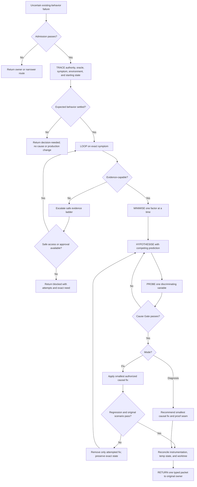

# Diagnosing Bugs Runtime Design Synthesis

Status: exhaustive design reference for a future rewrite, not an executable contract.

Current runtime authority remains in:

- `skills/custom/diagnosing-bugs/SKILL.md`;
- `skills/custom/diagnosing-bugs/agents/openai.yaml`;
- `docs/agents/engineering-contract.md` and the target repository's domain, safety, privacy, and validation contracts;
- the invoking caller's scope, mode, and mutation authority;
- `$tdd` at the settled red-testable behavior boundary;
- `docs/synthesis/skill-context-relationships.md`;
- pack contract tests and behavior-evaluation definitions; and
- the installed mirror under `C:/Users/steve/.agents/skills/diagnosing-bugs`.

This synthesis specifies the selected behavior, difficult evidence branches, relationships, extraction surfaces, and proof needed to rewrite `$diagnosing-bugs` later. It changes no runtime behavior, grants no instrumentation or fix authority, and does not authorize installation.

## How To Read This Document

This document is exhaustive for accepted diagnosis behavior, material alternatives, owned relationships, file placement, and proof required for promotion. The eventual runtime should be substantially smaller.

It has four layers:

1. **Orientation** states the outcome, boundaries, vocabulary, evidence branches, and explanatory flow.
2. **Normative Design** is the sole authority for proposed runtime behavior and relationships.
3. **Evidence And Rationale** preserves source pressure, current evidence, deliberate non-changes, and deferred hypotheses without creating rules.
4. **Extraction And Verification** places and proves the design without redefining it.

Change behavior in Layer Two; explain it in Layer Three; place and prove it in Layer Four. The Normative Home Index assigns every concern one authority. The Runtime Ownership And Change Map owns file placement and anti-duplication boundaries. The Staged Behavior-Evaluation Protocol owns proof mechanics. The Migration And Acceptance Matrix owns case coverage only. Correct any rationale, ownership row, or acceptance case that disagrees with its Layer Two owner.

Use this index for direct navigation:

| Question | Owning section |
| --- | --- |
| What outcome governs the rewrite? | [North Star](#north-star) and [Design Verdict](#design-verdict) |
| When should diagnosis start or refuse the work? | [Invocation And Admission](#invocation-and-admission) |
| What may diagnosis inspect or mutate? | [Authority And Mutation Boundary](#authority-and-mutation-boundary) |
| Which operation is legal from current evidence? | [Investigation State And Transition Contract](#investigation-state-and-transition-contract) |
| When is each operation complete? | [Operation And Completion Contracts](#operation-and-completion-contracts) |
| How are expected and actual behavior established? | [Source Trace, Oracle, And Symptom Identity](#source-trace-oracle-and-symptom-identity) |
| What makes a diagnostic Loop valid? | [Evidence-Capable Loop Contract](#evidence-capable-loop-contract) |
| How do flakes, performance, and environment-only failures differ? | [Failure-Class Evidence Contracts](#failure-class-evidence-contracts) |
| When is the reproducer small enough? | [Minimisation Contract](#minimisation-contract) |
| What makes a hypothesis testable? | [Hypothesis And Probe Contract](#hypothesis-and-probe-contract) |
| What proves a cause? | [Cause Gate](#cause-gate) |
| How are instrumentation and dirty work kept safe? | [Diagnostic Mutation Envelope](#diagnostic-mutation-envelope) |
| When may a fix be applied and called proved? | [Fix And Regression-Proof Contract](#fix-and-regression-proof-contract) |
| What happens when an attempted fix fails? | [Failed-Fix Recovery](#failed-fix-recovery) |
| What does every invocation return? | [Return Contract](#return-contract) |
| Which capability owns each handoff? | [Relationship Ownership](#relationship-ownership) |
| Which context loads for each branch? | [Runtime Context Loading Contract](#runtime-context-loading-contract) |
| Where does each future rewrite change belong? | [Runtime Ownership And Change Map](#runtime-ownership-and-change-map) |
| What must pass before promotion? | [Staged Behavior-Evaluation Protocol](#staged-behavior-evaluation-protocol), [Migration And Acceptance Matrix](#migration-and-acceptance-matrix), and [Promotion Gate And Residual Gaps](#promotion-gate-and-residual-gaps) |

# Layer One: Orientation

## North Star

Diagnosing Bugs owns one outcome: turn one uncertain existing-behavior failure into an evidence-backed causal explanation and the smallest safe next action, without guessing, laundering correlation into cause, or crossing the caller's mutation boundary.

The diagnostic path should:

- establish expected behavior from an independent source rather than the broken output;
- identify the exact reported symptom before explaining it;
- build the tightest repeatable evidence loop the environment permits;
- preserve load-bearing conditions while minimising accidental complexity;
- compare plausible causal explanations through discriminating probes;
- apply a fix only under explicit implementation authority and only after the cause gate;
- prove an authorized fix through a correct regression seam and the original scenario when possible;
- preserve pre-existing work, sensitive data, external state, and production safety; and
- return enough evidence for the original caller to resume without reconstructing the investigation.

The invariant is blunt:

```text
No evidence-capable Loop, no causal hypothesis.
No proven cause, no fix.
```

## Design Verdict

This table summarizes the selected design. It does not create runtime rules.

| Stratum | Selected shape | Rewrite status |
| --- | --- | --- |
| Core investigation | `TRACE -> LOOP -> MINIMISE -> HYPOTHESISE -> PROBE -> PROVE -> RETURN`, with current evidence selecting the legal operation | Ready for later extraction from Layer Two |
| Invocation | Implicitly invocable for uncertain existing behavior: broken, failing, flaky, slow, environment-only, or production-only | Preserve `allow_implicit_invocation: true` |
| Bug/TDD boundary | Diagnosis owns uncertainty in expected behavior, exact symptom, cause, or trusted red-capable reproduction; TDD starts only when all four were already known before TRACE | Keep the boundary disjoint and prevent unchanged-fact bounce |
| Modes | Diagnosis mode proves cause and recommends; fix mode additionally permits the smallest causal production change | Caller must supply mode and fix authority; diagnosis alone grants neither |
| Evidence branches | Ordinary deterministic, flaky/concurrent, performance, and environment/production/HITL branches share one causal spine but use distinct measurement contracts | Disclose branch-only detail in one `EVIDENCE-BRANCHES.md` reference |
| Causal standard | Exact symptom identity, mechanistic explanation, predicted observation, discriminating intervention or contrast, original-scenario fit, and competing-explanation disposition | Strengthen as one explicit Cause Gate |
| Mutation safety | One reversible Diagnostic Mutation Envelope covers local instrumentation and probes; live, persisted, external, or sensitive capture remains approval-gated | Extract into the main skill because every mutating branch depends on it |
| Return | Exactly one typed `decision-needed`, `blocked`, `diagnosis-proved`, or `fix-proved` packet returns to the original owner | Strengthen without a state file, helper, or generated schema |
| Verification | Structural contracts plus control-based fresh-context behavior evaluation and installed-mirror parity | Required before promotion |

The first rewrite should not add a diagnostic ledger, helper script, mandatory hypothesis count, universal statistical threshold, automatic production instrumentation, architecture redesign, review loop, tracker mutation, or provider-specific observability procedure. Precision comes from evidence gates and typed exits rather than machinery.

## Delivery And Mode Boundary

Diagnosis sits inside a caller-owned delivery flow:

```text
caller fixes scope, expected-behavior authority, mode, and mutation boundary
  -> Diagnosing Bugs proves or blocks causal understanding
  -> diagnosis mode returns a causal packet and recommended fix
  -> fix mode returns an authorized causal change and regression evidence
  -> original caller resumes review, Git, tracker, release, or map reconciliation
```

The two modes share Trace through Cause Gate:

| Mode | May retain production behavior change? | Required successful result |
| --- | --- | --- |
| `diagnosis` | No | Proven cause, recommended smallest fix, regression seam or seam gap, clean reconciliation, and original return owner |
| `fix` | Yes, only inside explicit implementation authority | Proven cause, smallest causal fix, regression proof when a correct seam exists, original-scenario proof, clean reconciliation, and return to the caller |

The caller owns work selection, commitment scope, expected-behavior authority, formal review, staging, commit, tracker or external mutation, push, deployment, release, and Lock. Diagnosing Bugs owns only the bounded causal investigation and an authorized causal fix.

Wayfinder always invokes diagnosis mode. Resolving Merge Conflicts invokes diagnosis mode and retains repair authority decisions. Implement and a Parallel Implement lane may invoke fix mode inside their already bounded implementation authority. A direct user request uses diagnosis mode unless it explicitly authorizes implementation.

## Leading-Word Runtime Model

The eventual skill should use a small stable vocabulary:

| Leading word | Runtime meaning |
| --- | --- |
| **TRACE** | Reconcile authority, expected and actual behavior, symptom evidence, environment, fixed point, and starting state |
| **LOOP** | Build and run one evidence-capable harness that detects the exact reported symptom under recorded conditions |
| **MINIMISE** | Remove one factor at a time while preserving both the symptom and the path back to the original scenario |
| **HYPOTHESISE** | Rank plausible falsifiable explanations and state their distinct observable predictions before probing |
| **PROBE** | Change or inspect one discriminating variable under the Diagnostic Mutation Envelope and update the hypothesis ledger |
| **PROVE** | Pass the Cause Gate, then recommend or apply the smallest causal fix and test the original scenario |
| **RETURN** | Reconcile temporary state and emit one typed evidence packet to the original owner |
| **Loop** | The repeatable harness, command, or structured HITL procedure that returns a trustworthy symptom verdict |
| **Load-bearing** | A condition whose removal makes the Loop stop representing the reported failure |
| **Prediction** | The observation that should differ if one named hypothesis is true rather than its competitor |
| **Cause Gate** | The complete evidence threshold for making a causal claim or applying a fix |
| **Diagnostic Mutation Envelope** | The reversible, authorized boundary around instrumentation and causal probes |

These words orient execution. Layer Two alone decides admission, transitions, completion, mutation, causal proof, and Return.

## Investigation Vocabulary

| Term | Meaning |
| --- | --- |
| **Expected-behavior oracle** | The accepted contract, known-good result, requirement, invariant, or human authority that defines correct behavior independently of the failure |
| **Exact symptom** | The specific observable mismatch, failure, rate, latency, resource use, or environment-dependent behavior the investigation must detect |
| **Symptom signature** | The assertion and recorded conditions that distinguish the reported failure from setup errors, adjacent failures, and lookalikes |
| **Evidence-capable** | Able to return a trustworthy observation about the exact symptom; automated RED is preferred but structured production/HITL evidence may qualify when automation is impossible |
| **Trusted reproduction** | A Loop whose failing verdict represents the real bug pattern at the relevant seam under recorded conditions |
| **Minimised repro** | The smallest practical failing case whose remaining elements are load-bearing or explicitly unremovable |
| **Hypothesis ledger** | Ranked cause, prediction, probe, result, and ruled-out or remaining alternatives |
| **Discriminating probe** | An observation or controlled change expected to differ between at least two plausible explanations |
| **Causal mechanism** | The traced path by which the proven condition produces the exact symptom |
| **Contributing condition** | A required amplifier or context that participates in the failure without being overstated as the sole cause |
| **Correct regression seam** | A durable automated seam that reproduces the real bug pattern as it occurred through a supported caller-facing path |
| **Original scenario** | The unminimised reported path, workload, or approved faithful replay used to confirm that a fix addresses the real failure |

## Evidence-Branch Model

Every branch uses the same causal spine. Only measurement, access, and completion evidence differ:

| Branch | Loop verdict | Cause-proof addition | Fix-proof addition |
| --- | --- | --- | --- |
| Ordinary deterministic | Exact pass/fail assertion | Repeated predicted observation and discriminating contrast | RED/GREEN at the correct seam plus original Loop |
| Flaky, timing, or concurrency | Attempts, failures, exposure, seed or schedule, and reproduction rate | Matched-condition comparison that separates the winning hypothesis from alternatives | Comparable pre/post exposure; one passing run is insufficient |
| Performance or resource | Fixed workload, environment, baseline distribution, and constraint | Profile, bisection, or controlled contrast tied to the measured bottleneck | Comparable post-fix distribution and requested constraint |
| Environment- or production-only | Approved observation, replay, shadow, or structured HITL verdict under preserved conditions | Smallest safe intervention or differential evidence that distinguishes causes | Faithful replay or approved live comparison, with every unrun path named |

## End-To-End Explanatory Flow



The diagram is explanatory. The transition table, completion table, evidence contracts, mutation envelope, and Return Contract are authoritative.

# Layer Two: Normative Design

## Normative Home Index

| Concern | Sole normative home |
| --- | --- |
| Invocation and eligibility | [Invocation And Admission](#invocation-and-admission) |
| Caller, mode, and mutation authority | [Authority And Mutation Boundary](#authority-and-mutation-boundary) |
| Legal next operation | [Investigation State And Transition Contract](#investigation-state-and-transition-contract) |
| Operation completion | [Operation And Completion Contracts](#operation-and-completion-contracts) |
| Expected behavior, symptom, and starting evidence | [Source Trace, Oracle, And Symptom Identity](#source-trace-oracle-and-symptom-identity) |
| Loop validity and evidence escalation | [Evidence-Capable Loop Contract](#evidence-capable-loop-contract) |
| Failure-class measurement | [Failure-Class Evidence Contracts](#failure-class-evidence-contracts) |
| Load-bearing reproduction | [Minimisation Contract](#minimisation-contract) |
| Hypothesis shape and probe discipline | [Hypothesis And Probe Contract](#hypothesis-and-probe-contract) |
| Causal claim threshold | [Cause Gate](#cause-gate) |
| Instrumentation, probes, sensitive evidence, and repo state | [Diagnostic Mutation Envelope](#diagnostic-mutation-envelope) |
| Causal fix and proof | [Fix And Regression-Proof Contract](#fix-and-regression-proof-contract) |
| Failed attempted fix | [Failed-Fix Recovery](#failed-fix-recovery) |
| Cleanup and state reconciliation | [Cleanup And Reconciliation](#cleanup-and-reconciliation) |
| Runtime disclosure | [Runtime Context Loading Contract](#runtime-context-loading-contract) |
| Invocation result | [Return Contract](#return-contract) |
| Cross-skill boundaries | [Relationship Ownership](#relationship-ownership) |

## Invocation And Admission

Keep Diagnosing Bugs implicitly invocable. Its description must front-load the observable entry predicate: existing behavior is broken, failing, flaky, slow, environment-only, or production-only, and at least one of expected behavior, exact symptom, cause, or trusted red-capable reproduction remains uncertain.

Admission classifies the request before diagnostic mutation:

| Observed need | Result |
| --- | --- |
| Existing behavior has at least one uncertain bug fact | Admit Diagnosing Bugs under the supplied mode and authority |
| All four bug facts were already known before TRACE and the work is authorized and red-testable | Hand off to `$tdd`, retaining the original caller |
| A new behavior or feature is settled and red-testable | Use `$tdd`; Diagnosis is not the owner |
| A repository baseline needs a bounded correctness, methodology, model-risk, or performance audit rather than one symptom explanation | Use `$audit-codebase`; Diagnosis is not the owner |
| One interface or ownership shape is the question | Use `$codebase-design`; causal debugging is not the owner |
| One throwaway runnable design verdict is needed | Use `$prototype`; production causal proof is not the owner |
| The request is only to explain an existing diff | Use the applicable review owner |
| Product intent or expected behavior requires a human decision | Admit TRACE only far enough to return `decision-needed`; do not infer an oracle |

Admission never treats severity, urgency, a stack trace, a failing test, or a proposed patch as proof that cause and trusted reproduction are known. A test that fails for setup or a neighboring symptom is not a trusted reproduction.

The admission check repeats after any caller return or newly supplied evidence. TDD and Diagnosis never hand the same unchanged fact set back and forth. When diagnosis itself discovers the missing facts after TRACE, it retains the investigation through its typed Return rather than bouncing to TDD.

## Authority And Mutation Boundary

Every invocation records:

```text
Mode: diagnosis | fix
Original caller and return owner:
Bounded symptom and scope:
Expected-behavior authority:
Local diagnostic mutation authority:
Production fix authority:
Live or production instrumentation authority:
Persisted telemetry or durable evidence authority:
External-write authority:
Sensitive-data constraints:
```

Invocation grants no authority by itself.

- **Diagnosis mode** may inspect and use reversible local diagnostic mutations inside recorded authority. It retains no production behavior change.
- **Fix mode** adds permission for the smallest causal production change inside the caller's bounded scope after the Cause Gate passes.
- **Local diagnostic mutation authority** permits only reversible instrumentation, harness, fixture, or probe changes required to distinguish named hypotheses.
- **Live or production instrumentation, persisted telemetry, external writes, dependency or service changes, security-sensitive capture, and personal-data capture** require their own explicit authority even in fix mode.
- **The caller** owns commitment changes, scope expansion, architecture, formal review, staging, commit, tracker state, push, deployment, release, and Lock.

When the strongest next probe or fix crosses a recorded boundary, return `decision-needed` or `blocked` with the exact operation, evidence value, risk, and requested authority. Do not silently downgrade the probe and claim equivalent causal proof.

## Investigation State And Transition Contract

This table is the sole proposed authority for which operation may happen next. It derives the operation from recorded evidence and authority; no state file or persisted lifecycle is required.

| Current evidence | Legal operation or return | Illegal shortcut |
| --- | --- | --- |
| Invocation facts, mode, scope, or starting state are unreconciled | **TRACE** | Instrumentation, hypotheses, or fixes before authority and starting evidence |
| Expected behavior or its authority is unresolved | **TRACE**, then `decision-needed` | Treating broken output, a proposed fix, or model judgment as the oracle |
| Exact symptom signature or environment is unresolved | **TRACE**, then **LOOP** | Explaining a lookalike failure |
| No evidence-capable Loop has run | **LOOP** through the safe escalation ladder | Forming a causal hypothesis from static plausibility alone |
| The strongest safe Loop still cannot return a trustworthy verdict | `blocked` with attempts and exact missing access, artifact, or approval | Causal claim or speculative patch |
| Loop proves the exact symptom but removable complexity remains | **MINIMISE** | Ranking causes against an unnecessarily broad scenario when safe reduction is available |
| Load-bearing repro exists but no falsifiable competing explanation is recorded | **HYPOTHESISE** | Testing the first plausible cause or patching as exploration |
| Hypotheses exist but the Cause Gate does not pass | **PROBE**, then rerank or refine | Promoting correlation, logs, or one confirming observation to cause |
| Cause Gate passes in diagnosis mode | **PROVE** the recommended fix and proof plan without retaining production change | Applying the fix or claiming GREEN regression proof |
| Cause Gate passes in fix mode and the fix remains inside authority | **PROVE** through the fix and regression contract | Architecture expansion, adjacent cleanup, or multiple stacked fixes |
| Proposed fix or proof requires new commitment, scope, service, dependency, external write, or live authority | `decision-needed` or `blocked` | Treating fix authority as unlimited implementation authority |
| Attempted fix leaves the original Loop red or creates a critical regression | [Failed-Fix Recovery](#failed-fix-recovery), then **HYPOTHESISE** | Stacking another fix on ambiguous state |
| Causal result exists but temporary state is unreconciled | **RETURN** cleanup and reconciliation | Reporting completion with instrumentation, unknown worktree state, or unaccounted artifacts |
| Cleanup and the applicable mode proof pass | **RETURN** one typed packet | Review, commit, tracker closeout, or downstream execution |

## Operation And Completion Contracts

The transition table alone selects the next operation. This table alone decides when that operation is complete and which typed nonterminal result may end the invocation.

| Operation | Complete when | Legal nonterminal return |
| --- | --- | --- |
| **TRACE** | Mode, return owner, authority, expected and actual behavior, exact symptom evidence, environment, fixed point, starting worktree, known-good baseline, contradictions, and missing evidence are recorded; expected behavior is settled or its exact decision owner is known | `decision-needed` for unresolved oracle or authority; `blocked` for unavailable source evidence |
| **LOOP** | One already-run harness returns a trustworthy verdict for the exact symptom under recorded conditions and satisfies the selected failure-class contract | `blocked` with attempted lanes and exact access, artifact, or approval needed |
| **MINIMISE** | Every remaining factor is load-bearing or explicitly unremovable, the minimised repro still fails, and its mapping back to the original scenario is recorded | `blocked` when further safe reduction would destroy the only observable condition |
| **HYPOTHESISE** | Plausible causes are ranked, each has a falsifiable prediction, and a competing explanation exists unless direct evidence uniquely excludes one | `decision-needed` only when the distinction depends on unsettled product or domain authority |
| **PROBE** | One variable or observation distinguishes named hypotheses, the result and negative evidence enter the hypothesis ledger, temporary mutation reconciles, and the Cause Gate either passes or the remaining ranking is explicit | `blocked` for missing safe probe authority or inaccessible evidence |
| **PROVE** in diagnosis mode | Cause Gate evidence, smallest recommended causal fix, correct regression seam or seam gap, original-scenario expectation, and residual uncertainty are recorded without retained production behavior change | `decision-needed` when the recommendation changes a commitment; `blocked` when cause remains unproved |
| **PROVE** in fix mode | Cause Gate passed before the production change; the smallest authorized causal fix passes the correct regression seam when one exists, the original Loop, relevant failure-class comparison, and affected proof | Failed-fix recovery; `decision-needed` for scope or authority; `blocked` for an unprovable required path |
| **RETURN** | Tagged instrumentation, disposable artifacts, attempted-fix residue, worktree state, durable evidence, validation, skipped checks, and residual risk reconcile against TRACE; exactly one typed packet names the original owner | `blocked` if safe cleanup or exact reconciliation is impossible |

## Source Trace, Oracle, And Symptom Identity

TRACE records one diagnostic charter:

```text
User report or caller packet:
Expected behavior and independent authority:
Actual behavior and exact symptom signature:
Failure evidence and observation time:
Supported caller-facing path:
Environment, configuration, versions, data shape, seed, time, and concurrency:
Known-good baseline or last-known-good state:
Fixed point and relevant changed state:
Worktree, index, untracked, and pre-existing dirty inventory:
Existing reproducer and its trust limits:
Contradictions, lookalikes, and missing evidence:
Mode, mutation authorities, return owner, and stop conditions:
```

Expected behavior must come from accepted requirements, public or data contracts, repository invariants, a known-good baseline, an independent oracle, or the named human authority. The current broken behavior, current implementation, proposed patch, or most convenient test does not define correctness.

The symptom signature distinguishes the target failure from setup, dependency, fixture, import, permission, resource, timeout, and neighboring failures. For errors, record type, relevant message or code, supported call path, and causal location evidence without overfitting unstable text. For wrong output, record the independent expected value and semantic mismatch. For flakes and performance, record the measurement contract rather than one sample.

When multiple symptoms may share a cause, choose one primary symptom for the Loop and record the rest as correlated observations. A shared cause remains a hypothesis until each claimed relationship passes the Cause Gate or is explicitly classified as residual.

## Evidence-Capable Loop Contract

Build the nearest, sharpest, repeatable, tight, and agent-runnable harness that observes the exact symptom. Prefer the highest meaningful supported seam that still permits repeated evidence.

Escalate only as needed:

1. existing focused automated test or repo-owned command;
2. faithful request, CLI, API, UI, or event replay;
3. throwaway harness around the smallest real subsystem;
4. property, fuzz, schedule, or repeated-attempt loop;
5. known-good/known-bad bisection or differential comparison;
6. approved targeted instrumentation in a staging or live environment; and
7. structured HITL when automation cannot reproduce the human-controlled condition.

The order is a cost and fidelity guide, not permission to skip authority. Use the earliest lane that proves the exact symptom. Move downward when the current lane cannot observe the required condition or distinguish the relevant hypotheses.

Every Loop records:

```text
Invocation or procedure:
Supported seam:
Exact assertion or verdict:
Environment and inputs:
Attempts and observation window:
Observed red evidence:
Trust limits and lookalikes excluded:
Artifact and cleanup path:
```

An automated command is preferred but not mandatory for production-only or human-controlled behavior. A structured HITL Loop must make each action, observation, attempt, failure, environment, and expected/actual result inspectable. An anecdote or unstructured request to "try it again" is not a Loop.

If no safe evidence-capable Loop can be built, return `blocked`; static plausibility may remain a hypothesis seed but never a causal claim.

## Failure-Class Evidence Contracts

Read the selected branch in the proposed `EVIDENCE-BRANCHES.md` only after TRACE identifies it. These contracts own the minimum semantic evidence; the disclosed reference should supply concise branch procedure and examples without changing the gates.

### Ordinary Deterministic

Record one exact pass/fail verdict under a fixed input and environment. Repeat enough to rule out accidental setup recovery. A valid probe changes one predicted observation while the competing explanation predicts no change or a different change.

### Flaky, Timing, And Concurrency

Before probing, record the attempt budget or observation window, failures, exposure unit, environment, seed when controllable, time, scheduling or concurrency inputs, and reproduction rate. Preserve matched conditions across compared arms. Increase exposure or sharpen the trigger until the planned probe can distinguish hypotheses; do not demand an arbitrary universal sample count.

Cause proof requires more than temporal coincidence. Show that the discriminating variable changes the failure distribution or exposes the predicted state under comparable exposure, and account for plausible timing, load, retry, ordering, cache, and shared-state alternatives. A fix comparison uses comparable or stronger post-fix exposure and reports counts and rates; one pass is not proof.

### Performance And Resource

Lock the workload, data size and shape, environment, versions, resource limits, warm-up, repeats, statistic, and requested constraint before causal profiling. Record the baseline distribution or range, not only the best sample. Distinguish regression, existing bottleneck, capacity limit, and measurement noise.

Profile, bisect, or compare only against that measurement contract. Cause proof connects the measured bottleneck to the requested observable constraint through a controlled contrast. Fix proof repeats the same contract and reports both improvement and remaining variance. A microbenchmark cannot prove an end-to-end claim unless it is the highest meaningful seam or the missing public path is explicit residual risk.

### Environment And Production-Only With Structured HITL

Preserve the condition that makes the failure observable. Prefer a redacted capture, faithful replay, shadow path, staging reproduction, or read-only live observation before production mutation. Record time, version, configuration, data class, topology, traffic or load conditions, external dependencies, and every fidelity gap.

Use the smallest approved instrumentation that distinguishes named hypotheses. Bound duration, data, destination, operator, rollback, and cleanup before collection. When the safe proxy cannot reproduce the live condition, label it structural or replay evidence and retain the live causal gap. Never report a local approximation as production proof.

Structured HITL specifies exact actions, expected and actual observations, attempt count, timestamps, environment, screenshots or logs when approved, and a terminal verdict. Human participation supplies the inaccessible action or observation; it does not substitute for causal judgment.

## Minimisation Contract

Minimise one factor at a time and rerun the Loop after every cut. Candidate factors include caller, input, data, sequence, state, configuration, version, dependency, environment, timing, concurrency, cache, permission, and external service.

Each factor receives one disposition:

| Disposition | Meaning |
| --- | --- |
| `removed` | The Loop still proves the exact symptom without it |
| `load-bearing` | Removing or changing it makes the exact symptom disappear or changes its identity |
| `unremovable` | Safe reduction would destroy the only environment-, production-, timing-, or authority-bound condition; reason and residual ambiguity are recorded |
| `not tested` | A named risk, cost, or authority boundary prevented the cut |

The minimised repro remains linked to the original scenario through the supported path and symptom signature. A tiny helper failure that no longer explains the original caller is not a successful minimisation.

Stop minimising when every remaining factor has a disposition and further reduction would either destroy the symptom, cross authority, or cost more than the causal distinction it could provide. Minimise evidence, not realism away.

## Hypothesis And Probe Contract

Rank the plausible falsifiable hypotheses before testing them. Include a competing explanation unless direct evidence uniquely determines the mechanism.

Each ledger row contains:

```text
Rank and hypothesis:
Causal mechanism:
Predicted observation:
Competing prediction:
Probe and one changed variable:
Result:
Ruled out, weakened, strengthened, or unchanged:
Temporary mutation and cleanup state:
Next evidence need:
```

A useful prediction states what will be observed at a named seam if the cause is true and how that differs from a competitor. "The code is buggy," "race condition," or "cache issue" without a distinct prediction is not a hypothesis.

Prefer direct state inspection, then controlled contrast, targeted instrumentation, bisection, differential comparison, or reversible perturbation. Test one causal distinction at a time. Negative evidence changes the ranking. A patch may be a reversible probe only when it is explicitly classified as diagnostic mutation, lies inside authority, and is removed before causal judgment; it is not an authorized production fix.

Rerank after each probe. Do not collect logs without a named prediction, add instrumentation that cannot distinguish hypotheses, or continue probing after one branch crosses its evidence or authority boundary.

## Cause Gate

The cause gate passes only when the proposed cause satisfies all applicable claims:

1. **Identity:** it explains the exact symptom signature, not merely a neighboring failure.
2. **Mechanism:** a traced path connects the cause through the supported system to the symptom.
3. **Prediction:** the predicted observation occurred under recorded conditions.
4. **Discrimination:** a probe, intervention, bisection, or controlled contrast distinguishes it from the strongest plausible competitor.
5. **Coverage:** it explains both the minimised repro and the original scenario, including each declared load-bearing or unremovable condition.
6. **Alternatives:** stronger alternatives are falsified, made unnecessary by direct evidence, or retained as explicit causal uncertainty.
7. **Branch evidence:** the selected deterministic, flaky, performance, or environment-only measurement contract passes.
8. **Claim precision:** triggers, mechanisms, and contributing conditions are named without overstating one as the sole root cause.

One confirming log line, code smell, suspicious diff, temporal correlation, successful restart, passing retry, or patch that appears to help does not pass the gate by itself.

When evidence proves a contributing cause but not the complete mechanism, return `blocked` or a precisely limited `diagnosis-proved` packet only if the claimed causal scope itself satisfies every gate above. Never broaden the wording beyond the evidence.

## Diagnostic Mutation Envelope

Every instrumentation or mutating probe uses one envelope:

1. Reconcile the fixed point, worktree, index, untracked files, pre-existing dirty paths, target environment, authority, and sensitive-data limits.
2. State the named hypotheses, predicted distinction, exact mutation, affected surface, artifact path, duration, rollback, and cleanup check.
3. Apply only the reversible diagnostic mutation inside authority. Tag repo-file instrumentation with one run-specific token.
4. Run the selected Loop or probe and record the observation, failures, artifacts, and environment.
5. Remove or preserve the mutation according to its recorded authority, verify tag and artifact disposition, and reconcile starting state before the next probe.

Use `.tmp/diagnosing-bugs/<bug-slug>/` for disposable local scripts, logs, captures, and harnesses. Durable `.scratch/diagnosing-bugs/<bug-slug>/` evidence requires explicit approval, remains in review and staging scope, and records why it must survive.

Redact secrets and personal or sensitive data from stored artifacts and Return. Live or production instrumentation, persisted telemetry, external writes, security-sensitive capture, and retention beyond the diagnostic session require explicit approval with bounded collection and cleanup. Existing observability may be read only when the caller's access and data-use authority permits it.

A failed acquisition, write, collection, rollback, deletion, or read-back returns the applied operations, failed operations, current state, sensitive-data disposition, and safest recovery action. Unknown cleanup state blocks completion.

## Fix And Regression-Proof Contract

Fix mode opens only after the Cause Gate passes and the proposed change remains inside the caller's implementation authority and commitment boundary.

Choose the smallest causal fix: change the proven mechanism or its authorized invariant, not merely the symptom assertion. Adjacent cleanup, architecture improvement, dependency upgrade, public-interface change, migration, operational workaround, and observability work remain outside scope unless separately authorized as part of the causal fix.

When a correct regression seam exists:

1. convert the minimised real bug pattern into one durable regression test at the highest meaningful supported seam;
2. observe RED for the expected bug reason against the relevant baseline without disturbing unrelated work;
3. apply the smallest causal fix;
4. observe GREEN at that seam;
5. run the nearest affected proof; and
6. rerun the original unminimised Loop under the selected failure-class contract.

If safe pre-fix RED cannot be observed because the authorized implementation already exists or the baseline cannot be restored without touching unrelated state, classify the result as after-the-fact regression evidence and do not claim TDD. The causal gate and original Loop remain required.

When no correct durable seam exists, record the test-surface gap, why narrower tests would misrepresent the real pattern, and the strongest authorized original-Loop proof. Do not claim durable regression coverage. Do not introduce a public test hook, dependency, service, or architecture solely to manufacture a seam without caller authority.

Diagnosis mode does not simulate GREEN. It returns the recommended fix, correct regression seam or seam gap, predicted post-fix observation, and original-scenario proof plan while leaving production behavior unchanged.

## Failed-Fix Recovery

If an attempted fix leaves the original Loop red, fails its regression seam, worsens the selected failure-class measurement, or creates a critical affected regression:

1. stop before stacking another fix;
2. classify the result as evidence against the hypothesis, fix shape, or claimed completeness;
3. revert only changes authored for that attempted fix and its unneeded instrumentation;
4. preserve pre-existing, unrelated, user-authored, and separately approved durable evidence;
5. verify the exact resulting worktree and artifact state; and
6. update the hypothesis ledger and return to HYPOTHESISE.

When authored changes cannot be isolated safely, stop with the exact diff, index, artifacts, processes, external state, and required recovery authority. Never use destructive repository commands to force a clean baseline or claim that ambiguous mixed state was restored.

## Cleanup And Reconciliation

Before Return:

- remove every temporary instrumentation token and verify its absence;
- remove disposable `.tmp/diagnosing-bugs/<bug-slug>/` artifacts or list the exact cleanup blocker;
- stop or restore diagnostic processes, ports, environment variables, services, feature flags, and external observations inside authority;
- reconcile tracked, staged, unstaged, untracked, and ignored state against TRACE;
- retain only the authorized causal fix and explicitly approved durable evidence;
- verify sensitive-data deletion or approved retention;
- record the final original-Loop result, relevant comparison, validation, and skipped checks; and
- name every residual causal, environmental, statistical, coverage, or cleanup uncertainty.

Cleanup is semantic reconciliation, not a claim that the whole worktree must be clean. Pre-existing and unrelated dirty work stays preserved and visible.

## Runtime Context Loading Contract

Load the smallest complete context for the selected evidence state. `SKILL.md` is universal; the proposed branch reference is conditional.

| Observed state or phase | Load now | Keep out |
| --- | --- | --- |
| Invocation and TRACE | `SKILL.md`, caller packet, engineering and domain contracts, expected-behavior source, exact evidence, and starting worktree state | Every failure branch, generic debugging catalogs, architecture follow-up, and formal review procedure |
| Deterministic Loop | Selected code and test path plus the deterministic anchor in `EVIDENCE-BRANCHES.md` only when the universal Loop contract is insufficient | Flake, performance, production, and HITL procedure |
| Flaky, timing, or concurrency | Flake anchor, attempt ledger, scheduling or exposure inputs, and affected state-boundary branches | Unrelated performance or production observability detail |
| Performance or resource | Performance anchor, workload contract, baseline, environment, constraint, and relevant profiler or benchmark docs | Generic optimization advice and unrelated functional branches |
| Environment- or production-only | Production/HITL anchor, approved observability, redaction, retention, replay, and rollback contracts | Unapproved provider procedure, broad telemetry, and unrelated repository history |
| MINIMISE | Current Loop, original-scenario mapping, and candidate factors | Full hypothesis catalog and future fix procedure |
| HYPOTHESISE and PROBE | Minimized repro, relevant code path, current ranked hypothesis ledger, and only evidence needed for the selected probe | Unselected instrumentation and broad logs without a named prediction |
| PROVE | Cause Gate packet, mode and authority, correct regression seam or gap, original Loop, and affected proof | Formal review, Git closeout, tracker procedure, and architecture redesign |
| RETURN | Starting inventory, diagnostic-mutation inventory, artifacts, final evidence, and Return Contract | New hypotheses, new fixes, or downstream execution |

A context pointer is complete only when it names the triggering branch, target anchor, expected evidence, mutation boundary, and completion return. Do not preload every evidence branch because the failure might eventually need it.

## Return Contract

Every invocation returns exactly one typed packet:

| Outcome | Use when | Required distinguishing content |
| --- | --- | --- |
| `decision-needed` | Expected behavior, product/domain authority, scope, instrumentation, sensitive-data handling, or fix authority needs a caller decision | Exact unresolved decision, evidence already gathered, options and consequences, current state, and safe continuation |
| `blocked` | No safe progress is possible without named access, artifact, environment, authority, evidence, cleanup, or causal distinction | Attempts, missing condition, blocker owner, observable release condition, preserved state, and no causal or fix claim |
| `diagnosis-proved` | Cause Gate passes in diagnosis mode and no production behavior change remains | Proven causal scope, mechanism, evidence, recommended fix, regression seam or gap, original-scenario proof plan, and original owner |
| `fix-proved` | Cause Gate and every applicable fix-mode proof pass | Applied causal fix, RED/GREEN or honestly classified alternative, original Loop result, branch comparison, affected validation, and original owner |

Every packet contains:

```text
Outcome and mode:
Original caller and return owner:
Scope, expected-behavior authority, and mutation authorities:
Source Trace and exact symptom signature:
Loop, failure class, environment, and trust limits:
Minimised repro and original-scenario mapping:
Hypothesis ledger and Cause Gate result:
Applied or recommended fix:
Regression seam, proof, or seam gap:
Original-scenario and affected validation result:
Instrumentation, artifacts, sensitive data, and cleanup reconciliation:
Skipped checks, residual risk, and exact next need:
```

The packet never calls static plausibility a cause, a replay production proof, one passing flaky run a fix, a microbenchmark end-to-end proof, or diagnosis-mode recommendations applied behavior.

Standalone `diagnosis-proved` recommends `$implement` as the one next owner and stops. Caller-invoked runs return to that caller. Diagnosing Bugs never performs formal review, commit, tracker closeout, push, release, Wayfinder transition, or downstream execution.

## Relationship Ownership

This section is the sole proposed authority for cross-skill triggers and return boundaries.

| Caller | Verb | Callee | Trigger and return |
| --- | --- | --- | --- |
| Direct user | Invoke | `$diagnosing-bugs` | Diagnose one uncertain existing-behavior failure; use diagnosis mode unless implementation is explicit |
| `$skill-router` | Recommend and stop | `$diagnosing-bugs` | One existing-behavior symptom has at least one uncertain bug fact; the user or caller starts diagnosis later |
| `$grilling` | Recommend and stop | `$diagnosing-bugs` | Expected behavior, the exact symptom, cause, or a trusted reproduction remains uncertain and blocks every available interview branch; Grilling returns the typed gap without invoking Diagnosis or authorizing a fix |
| `$implement` | Invoke | `$diagnosing-bugs` | A selected authorized bug has uncertain expected behavior, symptom, cause, or trusted reproduction; use fix mode and return proof or a decision packet to Implement |
| Parallel Implement lane worker | Invoke | `$diagnosing-bugs` | The assigned bug has an uncertain fact; use fix mode only inside the lane's scope and return to the same worker |
| `$wayfinder` | Invoke | `$diagnosing-bugs` | One Diagnosis ticket needs causal evidence; use diagnosis mode and return reproduction, cause status, evidence, regression seam, and blocker without fixing or choosing the next map action |
| `$resolving-merge-conflicts` | Invoke | `$diagnosing-bugs` | Focused conflict proof fails for an uncertain cause; use diagnosis mode and return the causal packet so the resolver can decide whether repair fits reconciliation authority |
| `$tdd` | Hand off | `$diagnosing-bugs` | Any of expected behavior, exact symptom, cause, or trusted red-capable reproduction is uncertain; retain the original caller |
| `$diagnosing-bugs` | Hand off | `$tdd` | All four bug facts were already known before TRACE and a red-testable authorized slice exists; retain the original caller and stop diagnosis |
| `$diagnosing-bugs` | Recommend and stop | `$implement` | A standalone diagnosis proved cause and implementation is the one next owner |

Diagnosis does not route architecture follow-up. It records structural prevention evidence for the caller. The caller may later select Codebase Design, Improve Codebase, Simplify Code, or another owner from the resulting bounded work shape.

Diagnosis has no direct relationship to formal review, tracker owners, deployment, release, or Lock. It does not invoke Research for ordinary code inspection, Prototype for causal proof, or Audit Codebase to widen one symptom into a repository survey.

# Layer Three: Evidence And Rationale

Everything in this layer derives from Layer Two. It records why the selected design exists and what current evidence can and cannot establish.

## Source Pressure And Current Evidence Baseline

The current runtime already preserves a strong compact core:

- one seven-word spine: Trace, Loop, Minimise, Hypothesise, Probe, Prove, Return;
- an implicitly invocable description covering broken, failing, flaky, slow, environment-only, and production-only behavior;
- the four-fact Diagnosis/TDD boundary;
- diagnosis and fix modes with caller-owned review and closeout;
- an evidence-capable Loop and structured HITL fallback;
- load-bearing minimisation;
- falsifiable competing hypotheses and discriminating probes;
- a Cause Gate before any fix;
- RED/GREEN and original-scenario proof when a correct regression seam exists;
- failed-fix isolation that preserves dirty hunks;
- `.tmp` and approval-gated `.scratch` artifact boundaries; and
- one complete diagnosis packet returned to the original owner.

The historical source trace shows deliberate compression rather than missing discovery. The original skill carried a long harness catalog, explicit gate prose, privacy language, performance notes, and a field-by-field packet. The later simplification selected the current leading-word spine and removed repeated detail. A subsequent hardening pass added unresolved expected behavior, the evidence-capable Loop, competing explanations rather than a mandatory hypothesis count, and exact failed-fix isolation. The rewrite should preserve those decisions while restoring difficult branch precision through progressive disclosure rather than returning all historical procedure to `SKILL.md`.

Current structural tests prove only limited surfaces:

- the seven ordered headings;
- shared expected-behavior wording with TDD;
- a sufficiently complete packet shape;
- standalone diagnosis returning to Implement rather than Improve Codebase; and
- required relationship edges and invocation policy.

Behavior-evaluation definitions currently cover two important fixtures:

- **Diagnosis Return Ownership:** fix-mode return to Implement, standalone diagnosis-only behavior, and unresolved expected behavior; and
- **Disjoint Bug Routing:** the four-fact boundary, non-bounce, dirty-hunk preservation, failed-fix recovery, and missing regression seam.

Historical evaluation transcripts record contract simulations and static regressions, not a live representative intermittent, performance, environment-only, or production-instrumentation campaign. No current evidence proves that the wording reliably selects the exact symptom, uses matched flake exposure, distinguishes performance measurement from optimization, avoids indiscriminate live logging, or applies the Cause Gate consistently under pressure.

The canonical and installed Diagnosing Bugs files are byte-identical at the time of this synthesis. That parity is a baseline only; it is not evidence for the future candidate.

## Why The Loop Precedes Hypotheses

Without an evidence-capable Loop, plausible code reading rewards familiar stories rather than the reported behavior. The Loop forces the investigation to define what would count as seeing the bug before it explains the bug. It also makes later negative evidence, minimisation, bisection, and fix proof comparable.

Production-only and HITL failures need the word **evidence-capable** rather than an absolute automated-RED requirement. The relaxation applies to the transport of observation, not the causal standard. Structured observation remains sharp, repeatable enough for its branch, and inspectable.

## Why Symptom Identity Is Separate From Expected Behavior

Expected behavior answers what should happen. Symptom identity answers which actual mismatch is under investigation. A valid oracle with the wrong failing path still diagnoses the wrong bug; an exact crash with no accepted oracle cannot establish that behavior is wrong. TRACE keeps both gates explicit.

## Why Minimise Preserves The Original Scenario

Minimisation removes accidental variables and makes probes cheaper, but over-minimisation can turn an integration bug into an unrelated helper failure. Requiring a mapping back to the original supported path prevents smallness from replacing fidelity. `unremovable` makes production, timing, and environment constraints visible rather than pretending they were eliminated.

## Why Competing Predictions Matter

A hypothesis that only predicts its own confirming log will usually find one. A competing prediction forces the probe to create information: at least two plausible explanations expect different observations. Negative evidence then has a defined place in the ranking, and instrumentation earns its cost by changing a causal decision.

## Why The Cause Gate Names Claim Precision

Software failures often have a trigger, mechanism, and enabling conditions. Calling the nearest suspicious line the root cause hides configuration, state, ordering, and contract conditions that may remain after a patch. The gate requires a precise causal scope so the fix and residual risk match what was actually proved.

## Why Diagnosis Retains Ownership After TRACE

The four facts may become known during diagnosis. Handing to TDD at that point would split one evidence loop, risk repeating RED work, and create a bounce on progress that Diagnosis itself produced. TDD is the correct entry only when the facts were already known before TRACE. Once admitted, Diagnosis returns its causal or fix packet to the original caller.

## Why One Disclosed Evidence Reference

The universal sequence, authority, Cause Gate, mutation envelope, Return, and completion belong in `SKILL.md`. Flake exposure, performance measurement, production fidelity, and structured HITL are branch-only detail. One `EVIDENCE-BRANCHES.md` protects the main spine without creating operation-per-file sprawl or making each failure type a separate skill.

## Deliberate Non-Changes

These choices explain the rewrite boundary; Layer Two and the ownership map remain authoritative.

- Keep Diagnosing Bugs implicitly invocable.
- Keep the seven leading words and causal ordering.
- Keep diagnosis and fix modes in one skill because both share the expensive causal investigation.
- Keep the four-fact boundary aligned with TDD, Implement, Parallel Implement, Skill Router, Wayfinder, and the relationship map.
- Keep the original caller as return owner.
- Keep Wayfinder diagnosis-only and lane/Implement fix-mode behavior bounded by their callers.
- Keep `.tmp/diagnosing-bugs/<bug-slug>/` disposable and `.scratch` approval-gated.
- Keep live instrumentation, persisted telemetry, external writes, and sensitive-data capture separately approval-gated.
- Keep formal review, Git closeout, tracker mutation, push, deployment, release, and Lock outside diagnosis.
- Keep architecture prevention as evidence for the caller rather than a direct route or automatic redesign.
- Keep broad canonical validation proportional to the caller and risk; diagnosis owns focused causal proof, not full delivery proof.
- Keep current source and installed mirror unchanged until the coordinated candidate passes promotion.

## Rejected Machinery

The first rewrite should reject:

- a mandatory three-to-five hypothesis count regardless of evidence;
- one universal sample size, confidence threshold, or performance statistic across repositories;
- a persisted diagnostic state machine, JSONL event ledger, generated packet schema, or helper CLI;
- one file per failure class or per operation;
- automatic debugger, profiler, fuzz, bisection, browser, or production-observability selection;
- unconditional full-log capture or long-lived telemetry;
- automatic live instrumentation, feature-flag changes, traffic changes, restart, deploy, or rollback;
- patch-first debugging disguised as a probe;
- forced root-cause language when only a contributing condition is proved;
- a requirement to create a public test hook or new abstraction solely for regression coverage;
- architecture redesign, dependency modernization, or adjacent cleanup inside the causal fix;
- formal review or commit as part of diagnostic completion; and
- automatic downstream skill execution after Return.

## Deferred Hypotheses

Deferred ideas are not prerequisites and gain no authority from appearing here.

| Hypothesis | Evidence required before admission |
| --- | --- |
| Repo-provided HITL harness templates | Repeated investigations show field loss or non-repeatability that a small portable template fixes without shell or platform brittleness |
| Statistical branch helper | Repeated flake or performance work shows calculation mistakes that one repo-neutral helper can prevent without inventing universal thresholds |
| Automated delta-debugging support | Repeated large-input failures show manual minimisation dominates time and a bounded helper preserves semantic fidelity and authority |
| Durable diagnosis ledger | Investigations repeatedly cross sessions and lose causal state despite complete Return packets; a ledger has clear recovery, privacy, cleanup, and ownership contracts |
| Separate production-diagnosis skill | Production authority and observability branches become sufficiently distinct that one description and one disclosed reference no longer invoke or load predictably |
| Independent hypothesis scouts | Evidence shows fresh independent hypotheses materially improve difficult diagnoses without leaking sensitive context, duplicating probes, or diluting one causal owner |

# Layer Four: Extraction And Verification

## Proposed Runtime Semantic Surface

The eventual main skill should read approximately as:

```text
Outcome and four-fact invocation boundary
Diagnosis | fix mode and original caller authority
TRACE diagnostic charter
Current evidence -> legal operation
Operation completion gates
LOOP and selected evidence-branch pointer
MINIMISE
HYPOTHESISE and PROBE
Cause Gate
Diagnostic Mutation Envelope
PROVE diagnosis | fix
Failed-fix recovery
RETURN typed packet
Completion
```

This is a semantic target, not approved final wording. `SKILL.md` keeps universal behavior, operation selection and completion, authority, the Cause Gate, mutation envelope, sharp branch pointers, Return, and completion. It does not copy branch examples, framework catalogs, provider observability instructions, evaluation rationale, or file-change maps.

## Runtime Ownership And Change Map

This map alone owns file placement, concrete migration delta, anti-duplication boundaries, and bundle identity. Acceptance rows point here rather than copying file lists.

| Bundle | Surface | Owns | Proposed delta | Must not absorb |
| --- | --- | --- | --- | --- |
| `D1` | `skills/custom/diagnosing-bugs/SKILL.md` | Human-facing description; outcome; invocation and TDD boundary; modes and caller authority; leading-word spine; evidence-state selection; operation completion; universal Loop, Minimise, Hypothesis, Probe, Cause Gate, mutation envelope, fix proof, failed-fix recovery, Return, and completion | Realize the Proposed Runtime Semantic Surface; replace narrative phase progression with evidence-state and completion tables; add typed returns and sharp anchors into `EVIDENCE-BRANCHES.md`; preserve compactness | Branch catalogs, framework-specific commands, provider observability, statistical formulas, formal review, tracker procedure, rationale, or evaluation matrix |
| `D1` | New `skills/custom/diagnosing-bugs/EVIDENCE-BRANCHES.md` | Deterministic, flaky/timing/concurrency, performance/resource, environment/production-only, and structured HITL procedure; branch-specific measurement fields, escalation, fidelity gaps, and examples | Extract current compressed branch detail and accepted historical safety detail behind trigger-complete anchors; invoke the universal Cause Gate, mutation envelope, cleanup, and Return rather than repeating them | Invocation, mode, universal sequence, causal authority, production permissions, Return ownership, generic debugging encyclopedia, or provider-specific runbooks |
| `D1` | `skills/custom/diagnosing-bugs/agents/openai.yaml` | Invocation policy | Preserve `policy.allow_implicit_invocation: true` | Runtime procedure or trigger prose duplicated from frontmatter |
| `D2` | `skills/custom/tdd/SKILL.md`, `docs/synthesis/skills/tdd.md`, and TDD references | TDD's own admission, RED/GREEN, and return behavior | Reconcile only the shared four-fact boundary, pre-TRACE handoff, and non-bounce wording if the accepted Diagnosis contract changes it | Diagnostic Loop, Cause Gate, instrumentation, modes, or diagnosis packet |
| `D2` | `skills/custom/implement/SKILL.md` and `skills/custom/parallel-implement/references/WORKER-BRIEF.md` | Caller-owned scope, fix authority, delivery, and return continuation | Supply mode, bounded authority, expected-behavior source, return owner, and proof expectation; resume review and closeout only from an acceptable Diagnosis return | Causal procedure, diagnostic instrumentation rules, or duplicate packet schema |
| `D2` | `skills/custom/wayfinder/OPERATIONS.md` and `docs/synthesis/skills/wayfinder.md` | Diagnosis ticket authority and map reconciliation | Preserve diagnosis-only invocation and require the bounded causal return without fix or next-map authority | Diagnostic procedure, map transition authority transferred to Diagnosis, or fix mode |
| `D2` | `skills/custom/resolving-merge-conflicts/SKILL.md` | Conflict reconciliation scope and proof continuation | Preserve diagnosis-mode invocation on uncertain proof failure and decide any repair from reconciliation authority after Return | Cause procedure or diagnostic authority copied into conflict resolution |
| `D2` | `README.md`, `skills/custom/skill-router/SKILL.md`, `skills/custom/audit-codebase/DEFECT-CONTRACT.md`, `docs/synthesis/skills/grilling.md`, and `docs/synthesis/skill-context-relationships.md` | Human discovery, route predicate, audit handoff classification, Grilling's typed causal Evidence gap, and one authoritative edge per relationship | Keep one shared four-fact predicate; add or sharpen only accepted triggers, verbs, modes, and return boundaries | Runtime diagnosis steps, failure-class procedure, automatic invocation, fix authority, or duplicated Cause Gate |
| `D3` | `tests/test_skill_pack_contracts.py` | Structural and relationship protection | Cover semantic-surface order, invocation policy, transition and completion discovery, reference anchors, Cause Gate, mutation envelope, typed Return, mode boundaries, and exact relationships | Incidental prose snapshots, minimum bullet counts, or claims that static tests prove behavior |
| `D3` | `docs/validation/evals/core-workflows.md` and new validation transcripts | Behavior-evaluation definitions and promotion evidence | Expand Diagnosis Return Ownership and Disjoint Bug Routing; add exact-symptom, cause-discrimination, failure-class, mutation-safety, failed-fix, cleanup, and context-loading controls | Runtime rules or simulation reported as live causal proof |
| `D4` | Installed mirror `C:/Users/steve/.agents/skills/diagnosing-bugs` | Validated runtime copy | Synchronize only after the coordinated canonical candidate and evaluations pass | Independent edits, partial synchronization, or authority over canonical source |

## Staged Extraction Plan

Implementation stages order the coordinated rewrite. They are not independently promotable runtime variants.

| Stage | Bundles | Extraction outcome | Stage boundary |
| --- | --- | --- | --- |
| `I1` | `D1` | Extract the universal semantic core, evidence-state and completion contracts, Cause Gate, mutation envelope, typed Return, and one disclosed evidence-branch reference | Every Layer Two concern has one Diagnosis-owned runtime destination and all anchors resolve |
| `I2` | `D2` | Reconcile TDD, Implement, Parallel Implement, Wayfinder, Conflict Resolution, Router, and relationship surfaces against the accepted contract | Each foreign owner supplies mode, authority, trigger, and return without absorbing diagnostic procedure |
| `I3` | `D3` | Replace brittle structural proxies, add control-based behavior evaluations, and record promotion evidence | Every acceptance row has positive and negative cases; no claimed behavior relies on prose presence alone |
| `I4` | `D4` | Validate canonical source, synchronize the complete skill, and prove mirror parity | Canonical and installed trees match after all earlier gates pass |

## Staged Behavior-Evaluation Protocol

Evaluation phases gate proof, not partial installation. Build the coordinated canonical candidate, evaluate it progressively, and synchronize no installed surface until every applicable phase passes.

| Evaluation phase | Claims proved | Representative cases |
| --- | --- | --- |
| `E0`: Control lock | The current skill or no-guidance arm exhibits the precise claimed failure on a fixed realistic scenario | One control fixture per promoted behavioral claim |
| `E1`: Invocation and attention | Correct route, mode, owner, evidence-state operation, completion gate, context pointer, and typed Return are discoverable without branch overloading | Four-fact routing, unresolved oracle, deterministic start, wrong-branch loading, return ownership |
| `E2`: Causal investigation | Exact-symptom Loop, minimisation, competing predictions, discriminating probes, Cause Gate, and branch measurement behave under ordinary and uncertain evidence | Lookalike failure, first-plausible cause, negative evidence, flake, performance, environment-only, HITL |
| `E3`: Mutation and fix safety | Diagnostic Mutation Envelope, sensitive-data boundary, causal fix, regression seam, original scenario, failed-fix recovery, and cleanup preserve authority and state | Dirty worktree, unapproved live logging, no correct seam, failed attempted fix, mixed-state cleanup |
| `E4`: Integrated promotion | Caller relationships, canonical validation, reference resolution, evaluations, installation, and mirror parity hold together | Implement, lane, Wayfinder, Conflict Resolution, TDD, Router, standalone diagnosis |

For every promoted behavioral claim, fix the repository snapshot, prompt, symptom evidence, expected-behavior source, environment, authority packet, tools, model, reasoning tier, current and candidate skill hashes, and rubric across arms. Run at least five independent fresh-context samples per arm. Use the current skill as control where behavior overlaps and a no-candidate-guidance control for genuinely new behavior. Stop when the control does not exhibit the claimed failure.

Judge causal behavior, not template echoes. Record route and mode; operation selected; references loaded; Loop fidelity; hypothesis and probe discrimination; causal overclaim; unauthorized mutation; failed-fix state; Return completeness; cleanup; runtime settings; protocol deviations; and residual gaps. Report median, range or variance, and worst observed result. Static tests protect structure only.

An evaluation phase passes only when the control demonstrates the failure, the candidate materially reduces it, variance narrows, and no new critical failure appears. Any guessed patch, false cause, unauthorized live or external mutation, sensitive-data leak, destroyed unrelated work, false regression claim, or ambiguous cleanup state fails the phase regardless of averages.

## Migration And Acceptance Matrix

Implement through `I1` to `I4` and evaluate with the listed phases. This matrix supplies cases, not runtime rules or file placement. Linked claims point to their Layer Two owners; bundle ids point to the ownership map.

| Implementation / evaluation | Bundles | Claim and normative owner | Positive case | Negative control | Verification |
| --- | --- | --- | --- | --- | --- |
| `I1,I2 / E1` | `D1,D2` | [Invocation](#invocation-and-admission) and [relationships](#relationship-ownership) | Each missing bug fact routes to Diagnosis; Grilling names Diagnosis only for a terminal causal Evidence gap and does not invoke it or authorize a fix; all four known before TRACE route to TDD; direct, caller, lane, Wayfinder, and conflict modes return to the correct owner | Severity, a failing test, a proposed patch, or known behavior plus unknown cause routes to TDD; Grilling invokes Diagnosis or restarts Grill With Docs; unchanged facts bounce | Invocation-policy and relationship tests plus fresh-context routing samples |
| `I1 / E1` | `D1` | [Authority](#authority-and-mutation-boundary) | Diagnosis mode, fix mode, local diagnostic mutation, live instrumentation, durable evidence, external write, and sensitive-data authorities remain distinct | Fix mode implies live logging, dependency changes, external writes, review, or commit authority | Packet-structure tests and authority-pressure behavior evaluation |
| `I1 / E1` | `D1` | [Transition](#investigation-state-and-transition-contract) and [completion](#operation-and-completion-contracts) | Current evidence selects exactly one legal operation or typed return and holds until its completion row passes | A plausible hypothesis, failing test, clean probe, or cause-like log skips Loop, Minimise, or Cause Gate | Table-driven structural assertions plus premature-completion samples |
| `I1 / E1,E2` | `D1` | [Oracle and symptom identity](#source-trace-oracle-and-symptom-identity) | TRACE separates independent expected behavior from an exact supported-path symptom and excludes a lookalike setup failure | Broken output defines correctness or a neighboring failure becomes the Loop | Fixed oracle, lookalike, and conflicting-source scenarios |
| `I1 / E2` | `D1` | [Evidence-capable Loop](#evidence-capable-loop-contract) | The nearest safe harness has an exact verdict, recorded environment, trust limit, and real red evidence | Code reading, an anecdote, passing retry, or command that fails for setup admits hypotheses | Deterministic, replay, harness, and blocked-access samples |
| `I1 / E2` | `D1` | [Minimisation](#minimisation-contract) | Each factor is removed, load-bearing, unremovable, or not tested; the minimised repro still maps to the original path | Smallness destroys the production condition or a private helper failure replaces the caller symptom | Factor-cut trace and original-path reconciliation rubric |
| `I1 / E2` | `D1` | [Hypotheses and probes](#hypothesis-and-probe-contract) | Ranked causes include distinct predictions and a competing explanation; one probe changes one discriminating variable and negative evidence reranks | The first plausible cause receives confirming logs or a patch without a competing prediction | Control-versus-candidate causal-reasoning samples |
| `I1 / E2` | `D1` | [Cause Gate](#cause-gate) | Identity, mechanism, prediction, discrimination, coverage, alternatives, branch evidence, and precise causal scope all pass | Temporal correlation, suspicious code, restart recovery, one log, or a helpful patch becomes root cause | Cause-admission rubric with true cause, contributor-only, and correlation fixtures |
| `I1 / E2,E3` | `D1` | [Flake branch](#flaky-timing-and-concurrency) | Matched pre/post exposure records attempts, failures, rate, timing, environment, and concurrency; the probe changes the predicted distribution | One passing run, mismatched exposure, or retry noise proves cause or fix | Repeated-attempt fixture and statistical-report rubric |
| `I1 / E2,E3` | `D1` | [Performance branch](#performance-and-resource) | Fixed workload and environment establish a baseline distribution and constraint; causal contrast and comparable post-fix proof use the meaningful seam | A microbenchmark, best sample, profiler hotspot, or changed workload proves end-to-end improvement | Repeated benchmark fixture with environment and variance checks |
| `I1 / E2,E3` | `D1` | [Production/HITL branch](#environment-and-production-only-with-structured-hitl) | Approved minimal observation or structured HITL preserves the live condition, bounds collection, redacts data, and labels fidelity gaps | Unapproved broad logging, sensitive capture, unstructured retry request, or local replay is called production proof | Authority, redaction, replay-fidelity, and structured-observation scenarios |
| `I1 / E3` | `D1` | [Diagnostic Mutation Envelope](#diagnostic-mutation-envelope) | Every instrumentation or mutating probe names its prediction, scope, token, artifacts, rollback, and verified cleanup against dirty starting state | Untagged logs accumulate, existing dirty hunks disappear, external state is inferred clean, or failed cleanup reports success | Dirty-worktree and failure-injection fixtures plus tag/artifact read-back |
| `I1 / E3` | `D1` | [Fix and regression proof](#fix-and-regression-proof-contract) | Cause passes first; the smallest authorized fix crosses correct-seam RED/GREEN, affected proof, and original Loop; no-seam case is labeled honestly | Patch precedes cause, private helper substitutes for a public seam, diagnosis mode simulates GREEN, or missing seam claims durable coverage | Regression-seam, after-the-fact, no-seam, and diagnosis-mode samples |
| `I1 / E3` | `D1` | [Failed-fix recovery](#failed-fix-recovery) | A red original Loop removes only attempted-fix changes, preserves unrelated hunks, reconciles exact state, and reranks | Fixes stack, destructive reset is used, or mixed state is declared restored | Failure-injection worktree fixture and behavior evaluation |
| `I1 / E3` | `D1` | [Cleanup and Return](#cleanup-and-reconciliation) and [Return](#return-contract) | Exactly one typed packet reconciles instrumentation, temp and durable artifacts, sensitive data, worktree, proof, residual risk, and original owner | Packet omits cleanup, overstates cause, chooses a new owner, or performs downstream closeout | Packet-schema semantics, cleanup injection, and return-ownership samples |
| `I1-I3 / E4` | `D1-D3` | [Context loading](#runtime-context-loading-contract) and owned relationships | Universal context loads once; only the selected evidence branch loads; every caller uses one shared predicate and return boundary | Every branch preloads, foreign owners copy diagnosis procedure, or relationship map and runtime disagree | Reference-resolution tests, context inventories, focused and full pack validation |
| `I1-I4 / E4` | `D1-D4` | [Runtime ownership and installation](#runtime-ownership-and-change-map) | Canonical source, tests, evaluations, and relationships pass; complete skill syncs once and source/mirror hashes agree | Partial candidate, missing reference, unproved branch, or independent mirror edit is promoted | Focused pytest, full pytest, `scripts.validate_skills`, install dry-run, scoped sync, hash parity, and diff checks |

## Promotion Gate And Residual Gaps

The promotion record names each claim, implementation stage, evaluation phase, source bundle, E0 control and candidate hashes, fixed scenarios, sample counts, tools, model and reasoning tier, rubric, median, variance or range, worst result, critical failures, unavailable telemetry, protocol deviations, and residual gaps.

A critical failure blocks promotion regardless of averages:

- a patch or causal recommendation before an evidence-capable Loop and Cause Gate;
- a false or broader-than-proved causal claim;
- TDD/Diagnosis bounce on unchanged facts or return to the wrong owner;
- unauthorized production, persisted, external, dependency, service, or sensitive-data mutation;
- loss or overwrite of pre-existing, unrelated, staged, untracked, or approved durable work;
- a flaky or performance fix claimed from incomparable evidence;
- replay, proxy, private-helper, or after-the-fact evidence mislabeled as stronger proof;
- diagnosis mode retaining production behavior change;
- failed-fix stacking or ambiguous cleanup state;
- incomplete typed Return, false durable regression coverage, or downstream review/closeout execution; or
- partial or unverified installed synchronization.

Promote only when E0 demonstrates the targeted failure, the candidate materially reduces it, variance does not expose a new unstable tail, and every applicable E1 through E4 phase passes. Static structure, historical contract simulations, and this synthesis do not substitute for behavior samples.

A residual gap blocks promotion when it affects invocation, mode, expected-behavior authority, symptom identity, Loop trust, causal discrimination, branch measurement, mutation authority, sensitive-data safety, failed-fix recovery, cleanup truth, Return ownership, or mirror parity. Noncritical uncertainty may remain only when the record names its evidence limit, operational consequence, and later validation owner.

## Completion Criterion For The Future Rewrite

The rewrite is complete only when every normative concern has one indexed home; the main skill exposes the selected semantic surface and seven stable leading words; current evidence selects one legal operation; every operation holds to its completion contract; expected behavior and exact symptom remain distinct; the selected evidence branch loads only when triggered; the Cause Gate prevents guessed fixes and overbroad causal claims; the Diagnostic Mutation Envelope preserves authority, sensitive data, and starting state; diagnosis and fix modes prove only what they own; failed fixes restore exact authored state without harming unrelated work; every invocation returns one complete typed packet to the original owner; each relationship appears once with the shared four-fact boundary; every acceptance row passes its positive and negative cases under the listed evaluation phases; no critical worst-case regression or promotion-blocking residual gap remains; canonical validation and diff checks pass; and the installed mirror matches the validated source exactly.
