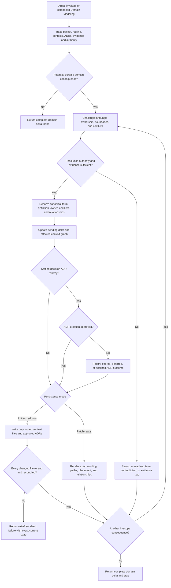

# Domain Modeling Durable-Truth Synthesis

Status: exhaustive design reference and future extraction map. No proposed behavior in this document is current runtime authority until the coordinated rewrite, evaluation, validation, and installed-mirror synchronization complete.

Runtime authority remains in:

- `skills/custom/domain-modeling/SKILL.md`;
- `skills/custom/domain-modeling/CONTEXT-FORMAT.md` for glossary, context-map, and relationship representation;
- `skills/custom/domain-modeling/ADR-FORMAT.md` for ADR worthiness, approval, location, numbering, and representation;
- `skills/custom/domain-modeling/agents/openai.yaml` for invocation policy;
- the target repository's `docs/agents/domain.md`, `CONTEXT.md`, `CONTEXT-MAP.md`, and ADRs for routed domain truth;
- `$grill-with-docs` for composition with `$grilling` and the combined exit;
- each invoking caller for its persistence mode, decision authority, continuation authority, and return contract;
- `$repo-bootstrap` for provisioning and reconciling the repository's domain-routing setup surface;
- `docs/synthesis/skill-context-relationships.md` for pack-wide composition edges;
- `tests/test_skill_pack_contracts.py` and `docs/validation/evals/core-workflows.md` for current structural and behavioral protection; and
- `C:\Users\steve\.agents\skills\domain-modeling` as the installed mirror of validated canonical source.

The current runtime remains unchanged by this note. Layer Two specifies the selected future design; the remaining layers explain, place, and test it without creating competing rules.

## How To Read This Document

This synthesis follows the four-layer authority model used by the Parallel Implement and Wayfinder syntheses:

1. **Orientation** states the outcome, selected design, vocabulary, and explanatory flow.
2. **Normative Design** is the sole authority for proposed future Domain Modeling behavior and relationships.
3. **Evidence And Rationale** preserves history, observed failure pressure, deliberate non-changes, and deferred hypotheses without creating rules.
4. **Extraction And Verification** maps each accepted behavior into one owned runtime surface and one staged proof path.

| Question | Owning section |
| --- | --- |
| What outcome and authority govern Domain Modeling? | [North Star](#north-star), [Design Verdict](#design-verdict), and [Durable-Truth Boundary](#durable-truth-boundary) |
| Which terms have precise meanings? | [Domain Vocabulary](#domain-vocabulary) |
| How should the eventual runtime read? | [Leading-Word Runtime Model](#leading-word-runtime-model) |
| Where does each proposed rule live? | [Normative Home Index](#normative-home-index) |
| When should Domain Modeling begin? | [Invocation And Admission](#invocation-and-admission) |
| What must a caller provide? | [Domain Packet](#domain-packet) |
| How are sources and existing truth selected? | [Trace](#trace) and [Routing And Context Selection](#routing-and-context-selection) |
| Who settles facts, terms, boundaries, and decisions? | [Authority And Settlement](#authority-and-settlement) |
| How are collisions and edges handled? | [Challenge](#challenge) and [Resolve](#resolve) |
| When may context files be written? | [Persistence Modes And Mutation Authority](#persistence-modes-and-mutation-authority) |
| How are terms and context relationships represented? | [Context Persistence](#context-persistence) |
| When may an ADR be offered or created? | [ADR Contract](#adr-contract) |
| What must happen after a write? | [Reconcile And Read-Back](#reconcile-and-read-back) |
| What exactly returns? | [Domain Delta And Return](#domain-delta-and-return) |
| Which other skills may invoke or recommend Domain Modeling? | [Relationship Ownership](#relationship-ownership) |
| What belongs in the future runtime rewrite? | [Proposed Runtime Semantic Surface](#proposed-runtime-semantic-surface) and [Runtime Ownership And Change Map](#runtime-ownership-and-change-map) |
| What must pass before promotion? | [Staged Behavior-Evaluation Protocol](#staged-behavior-evaluation-protocol), [Migration And Acceptance Matrix](#migration-and-acceptance-matrix), and [Promotion Gate And Residual Gaps](#promotion-gate-and-residual-gaps) |

When another layer disagrees with Normative Design, correct that layer. The ownership map places rules, the evaluation protocol owns proof quality, the acceptance matrix owns case coverage, and the promotion gate owns admission; none may redefine runtime behavior.

# Layer One: Orientation

## North Star

Domain Modeling owns one outcome: make every in-scope change to durable domain truth explicit, source-traced, authority-settled, correctly routed, safely persisted or exactly patch-ready, and recoverable through one complete domain delta.

Durable truth includes:

- canonical domain terms and rejected synonyms;
- precise domain definitions and concept boundaries;
- bounded-context ownership and responsibility;
- cross-context relationship type, contract, and owner;
- durable invariants and constraints that belong in domain documentation; and
- settled ADR-worthy trade-offs and their approval outcomes.

The skill is conservative about truth and exacting about persistence:

- consume existing vocabulary through repository routing without invoking Domain Modeling merely to read it;
- start Domain Modeling only when truth is changing, a contradiction must be accounted for, or durable capture is delegated;
- let evidence settle facts and the named authority settle contested language, boundaries, and decisions;
- keep unresolved contradictions visible rather than inventing agreement;
- write only authorized domain files;
- keep context persistence and ADR creation under separate gates;
- reconcile every affected context relationship;
- reread every changed domain file before claiming persistence; and
- return unresolved terms, contradictions, evidence gaps, and partial failures alongside successful changes.

Shorter wording and fewer files are costs, not the objective. A simpler domain model is better only when it preserves meaning, ownership, boundary clarity, and durable decision history.

## Design Verdict

Keep Domain Modeling as one implicitly invocable skill with two disclosed representation references and one linear resolution spine. Strengthen the future runtime around six currently compressed contracts:

1. explicit domain, persistence, ADR, and return authority in one caller packet;
2. routing precedence and single- versus multi-context selection;
3. distinct factual, language, boundary, decision, and representation authority;
4. a complete collision-to-resolution model with concrete edge testing;
5. independent context-persistence and ADR-creation gates; and
6. a typed domain delta that separates persistence state from blocking state.

Retain `CONTEXT-FORMAT.md` and `ADR-FORMAT.md` as disclosed runtime references. The main skill should own universal authority, sequencing, mutation limits, Return, and completion. The references should own exact representation and branch-specific mechanics. Do not create a third runtime file unless behavior evaluation demonstrates that the domain-delta schema is repeatedly omitted despite a sharp inline contract.

Do not add an ontology engine, event-storming process, generic architecture method, code-renaming workflow, specification writer, tracker mutation, or automatic ADR generation. Those would broaden Domain Modeling beyond durable domain truth.

## Durable-Truth Boundary

Domain Modeling starts when domain truth is changing. It does not own ordinary vocabulary consumption.

Repository workers read accepted vocabulary and ADRs through `docs/agents/domain.md`. They use canonical terms in code, tests, issues, plans, specs, and reports, and surface contradictions. Domain Modeling is invoked only when a term, definition, context owner, context boundary, cross-context contract, durable invariant, or ADR outcome needs resolution or persistence.

Domain Modeling may inspect code, tests, specs, plans, issues, research, runtime evidence, and caller packets as evidence. It mutates only:

- routed `CONTEXT.md` files;
- root `CONTEXT-MAP.md` when multi-context routing or relationships are resolved; and
- approved ADR files in the routed ADR location.

It returns code, test, plan, spec, issue, tracker, setup, migration, and implementation changes to their owners. A domain decision may imply those changes, but the domain delta records consequences rather than executing them.

## Domain Vocabulary

| Term | Meaning |
| --- | --- |
| **Domain truth** | Accepted project meaning that should remain stable across conversations and be reused by domain consumers |
| **Canonical term** | The selected project name for one concept, with ambiguous or rejected synonyms recorded as `_Avoid_` when useful |
| **Concept boundary** | What a term includes, excludes, and means at important edge cases independent of implementation |
| **Owning context** | The bounded context responsible for a term's meaning, invariants, and changes |
| **Context relationship** | A resolved cross-context relationship with type, contract, and owner as represented by `CONTEXT-FORMAT.md` |
| **Domain contradiction** | An unresolved collision among requested language, accepted docs, ADRs, code-facing usage, evidence, or context ownership |
| **Resolution** | A source-traced settlement of canonical name, definition, owning context, material conflicts, and affected relationships |
| **Persistence mode** | `authorized now` or `return patch-ready`, locked independently from ADR authority |
| **Patch-ready** | Exact domain wording, target path, placement, and relationship changes returned without mutating a file |
| **ADR candidate** | A settled decision that passes every ADR-worthy predicate but still requires separate creation approval |
| **Domain delta** | The complete return packet describing inspected consequences, resolutions, persistence state, ADR outcomes, blockers, and downstream effects |
| **No domain change** | A complete result proving the in-scope source was considered and changes no durable term, boundary, relationship, invariant, or ADR outcome |

## Leading-Word Runtime Model

The eventual skill should use this compact spine:

```text
Trace -> Challenge -> Resolve -> Reconcile -> Persist | Patch-ready -> Return
```

| Leading word | Runtime meaning |
| --- | --- |
| **Trace** | Establish the request or caller packet, routing, relevant contexts, accepted terms, ADRs, evidence, persistence mode, ADR authority, and return owner |
| **Challenge** | Surface collisions, overload, ambiguity, hidden implementation coupling, unclear ownership, and boundary failures through concrete edge cases |
| **Resolve** | Settle or explicitly leave open each canonical name, definition, owner, conflict, relationship, invariant, and ADR-worthy decision under named authority |
| **Reconcile** | Update the pending domain delta and every affected context relationship after each resolution; stop dependent work on new contradictions |
| **Persist** | Apply only authorized context or approved ADR changes through their disclosed formats, then reread all changed domain files |
| **Patch-ready** | Produce exact wording, targets, placement, and relationship updates when persistence is not authorized |
| **Return** | Deliver one complete domain delta to the caller or user without continuing another workflow |

**Ubiquitous language** is the steering phrase: one accepted term should mean the same thing wherever the owning context intends that meaning. It does not mean forcing one global vocabulary across legitimately distinct contexts.

## End-To-End Explanatory Flow



The diagram is explanatory. Layer Two alone owns authority, resolution, mutation, ADR, Return, and completion behavior.

# Layer Two: Normative Design

## Normative Home Index

This index gives each proposed concern one normative home. Other sections may explain, place, or test the rule but may not restate a different version.

| Concern | Sole normative home |
| --- | --- |
| Direct, invoked, and composed entry predicates | [Invocation And Admission](#invocation-and-admission) |
| Required caller fields and authority lock | [Domain Packet](#domain-packet) |
| Source selection and relevance | [Trace](#trace) |
| Routing precedence, file discovery, and context selection | [Routing And Context Selection](#routing-and-context-selection) |
| Fact, term, boundary, decision, caller, and representation authority | [Authority And Settlement](#authority-and-settlement) |
| Collision discovery and concrete boundary testing | [Challenge](#challenge) |
| Resolution completeness and unresolved handling | [Resolve](#resolve) |
| Legal state, next operation, and terminal selection | [State And Transition Contract](#state-and-transition-contract) |
| Immediate delta and relationship coherence | [Continuous Reconciliation](#continuous-reconciliation) |
| Write modes and mutation scope | [Persistence Modes And Mutation Authority](#persistence-modes-and-mutation-authority) |
| Glossary, map, and relationship persistence | [Context Persistence](#context-persistence) |
| ADR worthiness, approval, location, creation, and outcomes | [ADR Contract](#adr-contract) |
| Post-write verification and partial failure | [Reconcile And Read-Back](#reconcile-and-read-back) |
| External packet, blocking state, caller return, and stop boundary | [Domain Delta And Return](#domain-delta-and-return) |
| Complete-pass criterion | [Completion Criterion](#completion-criterion) |
| Cross-skill trigger and return | [Relationship Ownership](#relationship-ownership) |

## Decision Contracts

Each decision is owned once. Domain Modeling evaluates the predicates but does not perform another owner's work to make a failing predicate true.

| Decision | Owner | Passing evidence | Other branch |
| --- | --- | --- | --- |
| Domain Modeling fits? | Domain Modeling | Durable terms, context boundaries, relationships, invariants, contradictions, or ADR outcomes need resolution or persistence | Consume existing vocabulary through repo routing or return to the active owner |
| Source fact settled? | Evidence | A load-bearing factual claim has inspectable support and material conflicts are known | Keep the fact and dependent resolution open with an evidence gap |
| Contested language settled? | User or caller's named authority | Canonical name, definition, owner, and conflicts are explicitly accepted or arrive settled in the caller packet | Return alternatives and exact unresolved choice without inventing agreement |
| Context boundary settled? | User or caller's named domain authority | Responsibility, owned language, relationship, contract, and controlling owner are accepted | Preserve the boundary contradiction in the domain delta |
| Context write authorized? | Direct request or caller packet | The request changes domain truth or the packet locks `authorized now` for exact in-scope domain files | Return patch-ready wording and mutate nothing |
| ADR-worthy? | Domain Modeling using `ADR-FORMAT.md` | The settled decision is hard to reverse, surprising without context, and has a real trade-off | Record `not ADR-worthy`; create no ADR |
| ADR creation authorized? | User or named architectural authority | One identified candidate receives explicit creation approval | Offer, defer, or record decline; create none |
| Persistence verified? | Domain Modeling | Every changed domain file exists, was reread, matches the resolution and format, and affected relationships agree | Return exact write/read-back failure and never claim verified persistence |

## Invocation And Admission

Domain Modeling remains implicitly invocable. Admit three forms:

- **Direct:** the user asks to resolve or persist canonical terminology, context ownership or boundaries, a durable invariant, or an ADR-worthy decision.
- **Invoked:** a caller such as Wayfinder passes a complete domain packet and expects the exact domain delta back.
- **Composed:** `$grill-with-docs` keeps Domain Modeling active while Grilling resolves decisions; Domain Modeling incrementally reconciles domain-relevant answers and returns its complete delta to the composer.

Admission requires at least one potential durable domain consequence or an explicit caller requirement to prove `Domain delta: none`. Ordinary use of already-settled vocabulary does not invoke Domain Modeling. A missing term noticed during unrelated work may be noted for Domain Modeling without transferring the active owner's current work.

When the only unresolved matter is a participant-owned plan or design decision, use Grilling or Grill With Docs. When interface shape is the work, use Codebase Design. When repository domain routing is missing or incompatible, Repo Bootstrap owns setup reconciliation. Domain Modeling neither manufactures those authorities nor reconfigures setup as a substitute.

Admission performs no mutation. The persistence and ADR gates close separately after Trace.

## Domain Packet

Every invocation begins with this information or a direct-user equivalent:

```text
Domain question or caller item:
Source Trace and governing decisions:
Candidate terms, boundaries, relationships, invariants, or ADR decisions:
Named language and boundary authority:
Persistence mode: authorized now | return patch-ready
Authorized context paths or routing boundary:
ADR authority: offer only | approved candidate identifiers
Existing pending domain delta:
Caller and return owner:
Caller continuation authority:
```

A caller preserves its own identifiers and equivalent fields rather than translating them into a lossy schema. `deferred to Closeout` and similar caller modes map to `return patch-ready` for the current invocation while preserving the named later persistence owner.

Without a caller packet, infer only what visible sources make safe. A direct request to change domain truth authorizes in-scope context persistence unless the user says read-only, patch-ready, draft, inspect, or equivalent. ADR creation never inherits that authorization.

If persistence mode, domain authority, target routing, or return ownership is materially ambiguous, keep mutation closed and return the exact missing field. Do not guess a wider write boundary.

## Trace

Build one proportional Source Trace from:

- the governing request or caller packet;
- repository instructions and the target repository's `docs/agents/domain.md` when present;
- the routed `CONTEXT-MAP.md` and relevant `CONTEXT.md` files;
- relevant root or context-local ADRs;
- accepted specs, plans, issues, research, or prior domain deltas named by the caller;
- code, tests, data contracts, and runtime evidence needed for factual claims; and
- existing naming and relationship usage that may reveal a collision.

Load only sources that can change an in-scope resolution. Do not scan every domain document merely because it exists. Treat historical research, prior deltas, and code usage as evidence, not automatically current domain authority.

Trace distinguishes:

- accepted domain truth;
- source facts;
- current usage;
- proposed language;
- caller-settled decisions;
- unresolved contradictions; and
- unknown or unavailable evidence.

Trace completes when the relevant contexts, accepted language, authority, persistence mode, ADR mode, target paths, and material evidence gaps are known.

## Routing And Context Selection

Select domain files in this order:

1. Follow the target repository's configured `docs/agents/domain.md` when present.
2. Under multi-context routing, read root `CONTEXT-MAP.md`, then only the context glossaries and ADR directories relevant to the domain question.
3. Under single-context routing, use root `CONTEXT.md` and root `docs/adr/`.
4. Without configured routing, an existing root `CONTEXT-MAP.md` selects multi-context; otherwise use the single-context fallback at root `CONTEXT.md`.

Missing domain truth files do not block inspection and do not justify ceremonial creation. Create them lazily only when an authorized first resolution needs persistence.

Repo Bootstrap owns provisioning and reconciling the routing setup surface. Domain Modeling owns the truth inside routed `CONTEXT.md`, `CONTEXT-MAP.md`, and ADR files. When an unconfigured repository needs a new multi-context layout rather than the safe fallback, return the evidenced layout requirement to Repo Bootstrap unless the caller already supplies an accepted routing decision and exact authorized domain paths.

A workspace manifest, directory structure, service count, or package boundary does not by itself prove a bounded context. Contexts follow independently owned language, responsibility, invariants, and decisions.

## Authority And Settlement

Evidence settles facts; named domain authority settles contested language, boundaries, relationships, invariants, and durable decisions.

- Existing routed domain docs and accepted ADRs are current truth until an authorized resolution changes them.
- Code and widespread usage can prove current behavior or inconsistency; they do not silently override accepted domain meaning.
- A caller packet may transport an already-settled resolution and persistence authority; invocation alone transports neither.
- Domain Modeling may recommend one canonical term or boundary and explain its decisive evidence, but the recommendation is not settlement when authority is contested.
- A direct user may settle a contested choice when they are the named authority. Otherwise return the exact choice and its impact to the owner.
- `CONTEXT-FORMAT.md` and `ADR-FORMAT.md` own representation mechanics, not semantic decisions.

Never launder a product preference, architectural trade-off, or unclear ownership claim into domain truth because one wording seems cleaner. Keep it open in the domain delta or return it through the composer or caller that owns the decision.

## Challenge

Challenge every candidate resolution against:

- existing canonical and avoided terms;
- definitions in every affected context;
- context ownership and relationship contracts;
- accepted ADRs and their status;
- code-facing names and observable behavior;
- caller-settled decisions and constraints;
- concrete normal, edge, and failure cases; and
- downstream consumers whose meaning would change.

Surface these failure shapes explicitly:

- one term naming several materially different concepts;
- several terms accidentally naming one concept;
- an implementation detail disguised as domain meaning;
- a generic industry term imported with the wrong project meaning;
- a context-local term presented as universal;
- one concept claimed by multiple contexts;
- a cross-context contract with no controlling owner;
- a boundary drawn from directory layout rather than responsibility;
- an ADR proposal for an unsettled or reversible choice; and
- accepted domain docs contradicted by code or another ADR.

Use concrete examples and counterexamples to force boundaries. Challenge completes only when each material collision is resolved or named with its authority and evidence gap.

## Resolve

For each in-scope domain consequence, settle or explicitly leave open:

```text
Canonical term or decision:
Precise definition or decision statement:
Owning context:
Included and excluded edge cases:
Rejected or ambiguous synonyms:
Material conflicts and disposition:
Affected contexts and relationships:
Sources and decision authority:
Downstream consequences:
ADR candidacy:
```

A term resolution requires canonical name, definition, owning context, and material conflicts. A boundary resolution additionally requires each context's responsibility and owned language. A relationship resolution requires relationship type, contract, and controlling owner under `CONTEXT-FORMAT.md`.

Record only domain-specific concepts. Do not add ordinary technical vocabulary, generic business words with no project-specific meaning, or implementation mechanics that would make the glossary a code index.

When evidence or authority is insufficient, preserve alternatives, the exact unresolved question, affected files or callers, and decision impact. Unresolved material never enters a glossary or ADR as though settled.

## State And Transition Contract

The current domain packet and pending delta select exactly one legal next operation:

| Current condition | Legal operation | Completion | Next condition |
| --- | --- | --- | --- |
| Packet, routing, or Source Trace absent or stale | Trace | Relevant truth, evidence, authority, modes, paths, and return owner are current | Challenge-ready, no-change, or blocked |
| Potential domain consequence exists | Challenge | Every material collision and edge case is surfaced or explicitly absent | Resolution-ready or unresolved |
| Evidence and authority settle one consequence | Resolve | Canonical meaning, owner, conflicts, relationships, sources, and ADR candidacy are recorded | Reconcile |
| Consequence lacks evidence or authority | Record unresolved | Exact contradiction, owner, evidence gap, and impact enter the pending delta | Continue elsewhere or Return |
| Resolution changes domain truth | Continuous Reconciliation | Pending delta and every affected relationship reflect the resolution | Persist or Patch-ready |
| Context persistence is authorized | Context Persistence | Exact routed context changes are applied | Read-back |
| Context persistence is not authorized | Patch-ready | Exact wording, target, placement, and relationship updates are rendered | Continue or Return |
| ADR candidate lacks creation approval | ADR offer | Candidate and `offered`, `deferred`, or `declined` outcome are recorded | Continue or Return |
| ADR candidate has creation approval | ADR creation | Exact approved ADR is written at the routed location | Read-back |
| Any domain file changed | Reconcile And Read-Back | Every changed file is reread and agrees with pending delta and relationships | Continue or Return |
| No durable consequence exists | Return no-change delta | Considered scope and no-change result are explicit | Terminal return |

Domain Modeling never persists unresolved meaning, creates an ADR before its separate approval, or returns verified persistence from stale or unread files.

## Continuous Reconciliation

Update the pending domain delta immediately after every resolution, contradiction, evidence finding, authority outcome, write, or read-back. Do not wait until the end to reconstruct what happened.

For a composed session:

1. receive the latest confirmed domain-relevant answer and current pending delta;
2. challenge it against routed truth and prior resolutions;
3. update or persist the resolution under the locked modes;
4. return any collision that changes the interview frontier before the next dependent question; and
5. preserve the complete cumulative delta for the composer's final packet.

Answers unrelated to domain truth require no invented term or ceremonial write. `Domain delta: none` is complete only after the potential consequence was considered and found absent.

When a new resolution changes an earlier one, mark the superseded resolution, reconcile every affected glossary, relationship, and ADR status, and surface downstream consequences. Never leave two active canonical meanings without an explicit context distinction.

## Persistence Modes And Mutation Authority

Lock exactly one context persistence mode:

- **Authorized now:** Domain Modeling may create or update only routed, in-scope `CONTEXT.md` and `CONTEXT-MAP.md` files needed by settled resolutions. A direct request to change domain truth supplies this authority unless the user limits it.
- **Return patch-ready:** perform the same Trace, Challenge, Resolve, and Reconcile work, but write no domain file. Return exact wording, target paths, placement, relationship changes, and blockers.

Caller-specific `deferred to Closeout`, `advisory`, `read-only`, or equivalent modes map to `return patch-ready` for the current invocation and preserve the named later owner.

Context persistence authority never authorizes ADR creation. ADR approval never authorizes unrelated context, code, spec, plan, issue, tracker, setup, or implementation mutation.

Before writing after user interaction or caller return, refresh each target file and relevant routing source. Reconcile intervening edits and preserve unrelated work. When the authorized target is ambiguous, write nothing and return the exact routing or authority gap.

## Context Persistence

Read `CONTEXT-FORMAT.md` whenever creating or changing a glossary, context map, or context relationship.

For a canonical term:

- write it only in the owning context;
- use one precise definition independent of implementation;
- record rejected or ambiguous synonyms under `_Avoid_` when they protect meaning;
- include only domain-specific concepts; and
- preserve the local file's coherent grouping and unrelated content.

For multi-context truth:

- ensure root `CONTEXT-MAP.md` routes every affected context;
- record each resolved relationship's type, contract, and owner;
- update every affected glossary when one term legitimately crosses contexts;
- distinguish shared language from translation rather than forcing false uniformity; and
- keep unclear ownership and partial relationships out of persisted truth and in the domain delta.

Create `CONTEXT.md` or `CONTEXT-MAP.md` lazily only for the first authorized resolution that needs it. Never create empty glossaries, empty maps, placeholder contexts, or speculative relationship sections.

Patch-ready output must be directly applicable: exact target path, insertion location or replacement scope, complete wording, affected relationships, and any ordering dependency. A vague recommendation such as "update the glossary" is incomplete.

## ADR Contract

Read `ADR-FORMAT.md` for every potential ADR.

Offer an ADR only when the settled decision is all three:

1. hard to reverse at meaningful cost;
2. surprising without durable context; and
3. a real trade-off among genuine alternatives.

An unresolved decision cannot become an ADR candidate. A frequently made choice, large code change, framework default, or important topic is not sufficient by itself.

Lock ADR authority independently:

- **Offer only:** identify the candidate, target location, concise decision statement, rationale, and worthiness evidence; record `offered`, `deferred`, `declined`, or `not ADR-worthy`; create nothing.
- **Approved candidate identifiers:** create only the explicitly approved candidates and preserve every unapproved candidate's outcome.

Use the routed location and existing conventions defined by `ADR-FORMAT.md`: root `docs/adr/` for system-wide decisions or the owning context's adjacent `docs/adr/` for context-local decisions. Create the directory lazily. Scan the target directory immediately before creation, choose the next sequential number, and stop for reconciliation if the number or target changed concurrently.

Keep the ADR concise. Add optional status, considered options, or consequences only when they preserve material information. Never create a ceremonial ADR, duplicate the glossary, or hide unresolved alternatives in an accepted record.

After creation, reread the ADR and reconcile its title, decision, rationale, location, number, optional status, and downstream context relationships with the pending delta.

## Reconcile And Read-Back

After any authorized write:

1. reread every changed domain file from disk;
2. verify each persisted term or decision matches its accepted resolution;
3. verify the target path and owning context follow current routing;
4. verify context-map entries and affected glossaries agree;
5. verify ADR location, numbering, approval, and content;
6. confirm no unrelated domain content was lost or silently changed; and
7. update the pending domain delta with exact changed paths and read-back evidence.

A successful write with failed, stale, or contradictory read-back is not verified persistence. Return the exact current state, affected paths, attempted resolution, observed mismatch, recovery owner, and blocking impact. Do not retry by broad overwrite or claim completion from the intended patch.

If some authorized changes verify and another fails, preserve the verified changes and return a mixed persistence state with the exact partial failure. Never summarize partial mutation as all-or-nothing success.

## Domain Delta And Return

Every invocation returns:

```text
Domain result: none | patch-ready | persisted | mixed
Blocking state: clear | pending authority | contradiction | evidence gap | write/read-back failure
Domain question or caller item:
Source Trace:
Persistence mode and authorized paths:
Resolved terms, definitions, and owning contexts:
Resolved context boundaries and relationships:
Durable invariants or constraints:
Material conflicts and dispositions:
Changed paths with read-back evidence:
Patch-ready wording, targets, and placement:
ADR candidates, worthiness evidence, paths, and outcomes:
Unresolved terms, contradictions, and evidence gaps:
Downstream consequences returned to their owners:
Caller and return owner:
Caller continuation authority: preserved
```

`Domain result` describes persistence, not semantic success. `Blocking state` tells the caller whether unresolved authority, contradiction, evidence, or write failure remains. A complete domain-modeling pass may return a blocker when every unresolved item is exactly accounted for; the caller decides whether its own workflow may continue.

Return the complete delta intact. Do not compress away unresolved material, affected relationships, declined or deferred ADR candidates, patch-ready targets, partial writes, or caller identifiers.

For a caller invocation, return the delta to the caller and stop. The caller may continue only under authority it already held. For a composed invocation, return the cumulative delta to Grill With Docs; the composer attaches it intact to Grilling's packet. For a standalone invocation, report it to the user and stop.

## Completion Criterion

Domain Modeling completes only when:

- Trace accounts for routing, relevant accepted truth, evidence, authority, modes, targets, and return ownership;
- every potential durable consequence is resolved, explicitly no-change, or recorded as an unresolved term, contradiction, or evidence gap;
- every resolution includes canonical meaning or decision, owning context, sources, material conflicts, and affected relationships;
- the pending domain delta was updated continuously and agrees with current truth;
- every authorized context write follows `CONTEXT-FORMAT.md` and every unapproved context change remains patch-ready;
- every ADR candidate was classified and offered, approved and recorded, deferred, declined, or rejected as not worthy under `ADR-FORMAT.md`;
- every changed domain file passed read-back or returned an exact partial-failure state;
- no mutation crossed domain scope;
- the complete domain delta names persistence state, blocking state, paths, unresolved material, downstream consequences, and return owner; and
- Domain Modeling stops without continuing the caller's workflow.

Completion describes the integrity of the domain pass and delta. It does not imply that every domain contradiction was settled or that the caller's broader outcome is complete.

## Relationship Ownership

| Caller | Verb | Callee | Trigger and return |
| --- | --- | --- | --- |
| Direct user | Invoke | `$domain-modeling` | Durable terms, boundaries, relationships, invariants, or ADR outcomes need resolution or persistence; report the domain delta and stop |
| `$skill-router` | Recommend and stop | `$domain-modeling` | Domain truth is the work, especially when the decision is settled and persistence remains; the user starts Domain Modeling later |
| `$grill-with-docs` | Compose | `$domain-modeling` | Pass locked persistence and ADR modes, reconcile confirmed domain-relevant answers continuously, receive the complete cumulative delta, and own only the combined exit |
| `$wayfinder` | Invoke | `$domain-modeling` | During Durability, pass the charter's mode and already-accounted delta; receive `none`, verified paths, or a pending-authority/material-contradiction result and return to Wayfinder |
| `$prototype` | Recommend and stop | `$domain-modeling` | A reconciled prototype verdict exposes a durable term, boundary consequence, or ADR candidate; the caller starts Domain Modeling later |

Repo Bootstrap owns domain-routing setup and template reconciliation; it does not resolve domain truth. Domain consumers read through `docs/agents/domain.md`; consumption is not an executable Domain Modeling edge.

Domain Modeling owns its resolution process and exact domain delta even when composed or invoked. Callers own why the pass is needed, their persistence mode, supplied decisions, continuation, and whether a returned blocker prevents their completion.

### Relationship Exclusions

Domain Modeling does not invoke Grilling, Grill With Docs, Research, Prototype, Codebase Design, Repo Bootstrap, Skill Router, To Spec, To Tickets, Implement, or another downstream workflow.

When source evidence, user judgment, design work, or setup reconciliation is missing, return the exact gap and owner to the caller. Do not route around the caller or continue its workflow.

Domain Modeling does not write code, tests, plans, specs, tickets, reports, tracker state, repo instructions, setup templates, or external systems. It does not automatically rename code to match a new term. It records downstream consequences for those owners.

# Layer Three: Evidence And Rationale

## Current Runtime Baseline

The current five-step spine is compact and behaviorally meaningful:

```text
Trace -> Challenge -> Resolve -> Persist -> Return
```

It already protects the highest-value behavior:

- repo-routed source tracing with a safe fallback;
- collision discovery and concrete edge testing;
- facts-versus-contested-language authority;
- lazy domain-file creation;
- authorized persistence or patch-ready return;
- separate ADR approval;
- mutation limited to contexts, maps, and ADRs;
- post-write reread and reconciliation; and
- a complete domain delta containing unresolved material.

The future rewrite should deepen and connect these contracts, not discard the current leading words or inflate `SKILL.md` with exact Markdown templates and caller catalogs.

## Historical Evolution

The canonical history shows a deliberate progression:

| Commit | Design contribution retained here |
| --- | --- |
| `4d1b816` | Ubiquitous-language framing, Source Trace, challenge/sharpen/stress-test model, write gate, glossary/map/ADR separation, domain-only mutation, complete handoff |
| `d0979b9` | Concise five-step process, stronger ownership statement, exact patch-ready boundary, simplified representation references |
| `8fb5289` | Mandatory post-write reread, complete unresolved-material accounting, affected-relationship reconciliation, and no-cross-scope completion |

Upstream research describes Domain Modeling and Codebase Design as vocabulary layers underneath other skills. This pack sharpens that idea: accepted vocabulary is consumed through repo routing, while the Domain Modeling skill starts only when durable truth changes. That separation avoids invoking a mutation-capable skill merely to read shared language.

## Composer Material Reassigned Here

The existing Grill With Docs synthesis contains component behavior that belongs to Domain Modeling's future design. This synthesis takes ownership of:

- context persistence authorization and patch-ready mode;
- the independent ADR authority gate;
- continuous reconciliation after domain-relevant answers;
- glossary, map, relationship, and ADR read-back;
- `Domain delta: none` when no durable consequence exists;
- the domain half of the composer's joint completion gate; and
- the complete domain delta that the composer must attach intact.

Grill With Docs retains only its composition seam: lock and disclose modes, decide when a confirmed answer should be offered to Domain Modeling, feed returned collisions into Grilling, attach the intact delta, join both completion gates, and stop.

Grilling retains participation, decision-frontier, bound, Evidence gap, confirmation, and decision-tree ownership. Domain Modeling cannot settle a participant's contested plan or design choice merely because it affects domain language.

## Why Reconciliation Is Continuous

An exit-only domain pass can discover that an early answer conflicts with accepted vocabulary, crosses context ownership, or invalidates later decisions after the caller has already continued. Continuous reconciliation makes each resolution update the pending delta immediately and returns material collisions before dependent work advances.

Continuous does not mean ceremonial. Answers and evidence with no durable domain consequence produce no synthetic term, map entry, or file write.

## Why Persistence And ADR Authority Are Separate

A caller may safely authorize updating an accepted glossary term while still needing explicit architectural approval for an ADR. Conversely, approval to record one ADR should not authorize unrelated glossary or context-map changes.

Two gates prevent one broad "documentation authorized" signal from crossing different decision and mutation boundaries.

## Why Formats Stay Disclosed

Every context write needs the same semantic gate but only the persistence branch needs exact Markdown shape. Every potential ADR needs the same approval boundary but only candidates need the worthiness, location, numbering, and template details.

Keeping those mechanics in `CONTEXT-FORMAT.md` and `ADR-FORMAT.md` protects the main skill's information hierarchy while retaining one runtime source of truth per representation.

## Why Unresolved Material Returns

A clean glossary is not proof that the domain is coherent. The most important result may be a contradiction that cannot yet be settled, an unavailable owner, unclear context responsibility, or a write that only partially verified.

The domain delta therefore measures accounting, not optimism. Completion requires every unresolved item to remain visible with impact and owner; it never requires inventing settlement.

## Failure-Pressure Inventory

The rewrite and evaluations should target observed or plausible discipline failures:

| Pressure | Failure if unguarded | Owning contract |
| --- | --- | --- |
| Familiar term appears in code | Treat current usage as accepted domain truth | Authority And Settlement |
| User asks for cleanup | Add generic technical vocabulary to the glossary | Resolve; Context Persistence |
| Directory structure looks modular | Infer contexts from source roots | Routing And Context Selection |
| One word has several meanings | Pick a definition without edge testing | Challenge |
| Cross-context term exists | Update one glossary but not the map or peers | Context Persistence; Reconcile And Read-Back |
| Caller authorizes domain writes | Create an ADR under the same authority | ADR Contract |
| Decision is important | Offer a ceremonial ADR without all three predicates | ADR Contract |
| No context file exists | Create empty setup or placeholder docs | Routing And Context Selection |
| Write command succeeds | Report persistence without reread | Reconcile And Read-Back |
| One write fails | Hide partial success or overwrite broadly | Reconcile And Read-Back; Domain Delta And Return |
| Caller wants a short response | Omit unresolved terms or relationships | Domain Delta And Return |
| Resolution implies code changes | Rename or implement outside domain scope | Durable-Truth Boundary |
| Composer expects no domain change | Skip Domain Modeling rather than return `none` | Continuous Reconciliation |

## Deliberate Non-Changes

- Keep implicit invocation; durable language changes should remain discoverable.
- Keep accepted-vocabulary consumption in `docs/agents/domain.md`, not in the skill.
- Keep Domain Modeling as the only writer of context and ADR truth.
- Keep Repo Bootstrap as the owner of domain-routing setup and templates.
- Keep Grill With Docs as the sole composer with Grilling.
- Keep context persistence and ADR creation independently authorized.
- Keep files created lazily on the first real persisted resolution.
- Keep unresolved choices out of glossaries and ADRs.
- Keep format references concise and disclosed.
- Keep ADRs small by default; optional sections remain conditional.
- Keep code, spec, plan, issue, tracker, setup, and external mutation out of scope.
- Keep downstream execution and caller continuation outside Domain Modeling.
- Keep exact source and installed mirrors equal before promotion.

## Deferred Hypotheses

These ideas are not selected runtime behavior:

- a mandatory event-storming or domain-storytelling phase;
- an ontology, schema, or graph database for domain truth;
- automatic extraction of terms from code or documents;
- automatic code, test, or API renaming after a resolution;
- automatic creation of a context map from directories or workspace manifests;
- a broad repository-wide vocabulary consistency scan on every invocation;
- a separate domain-delta runtime file;
- richer mandatory ADR templates or status workflows;
- automatic ADR creation after worthiness classification;
- context relationship inference without named authority; and
- cross-session persisted working state outside the routed domain files.

Promote one only after a fixed realistic control demonstrates a failure that the added mechanism improves without weakening authority, routing, mutation scope, or read-back.

# Layer Four: Extraction And Verification

## Proposed Runtime Semantic Surface

The future `skills/custom/domain-modeling/SKILL.md` should read approximately as:

```text
Outcome and durable-truth boundary
Direct, invoked, and composed admission
Compact domain packet and authority modes
Trace + routing pointer
Facts settle facts; authority settles language
Challenge -> Resolve -> Reconcile
Persist | Patch-ready -> context-format pointer
ADR gate -> ADR-format pointer
Read-back
Canonical domain delta
Completion
```

This is a semantic target, not final approved wording. Keep universal authority, sequencing, mutation scope, pointer triggers, Return, and completion in the main file. Keep exact glossary/map representation in `CONTEXT-FORMAT.md`, exact ADR mechanics in `ADR-FORMAT.md`, and exhaustive rationale, caller catalogs, evaluation protocol, and migration detail in this synthesis.

No new supporting runtime file is selected. If the complete candidate cannot remain legible, first prune duplicated explanation and sharpen the two existing context pointers.

## Runtime Ownership And Change Map

The `Must not absorb` column is part of the design. It prevents Domain Modeling from becoming a composer, setup workflow, design process, evidence workflow, or implementation owner.

| Bundle | Surface | Owns | Proposed delta | Must not absorb |
| --- | --- | --- | --- | --- |
| `D1` | `skills/custom/domain-modeling/SKILL.md` | Outcome; admission; domain packet; source and authority split; challenge; resolution; continuous reconciliation; modes; mutation boundary; read-back; domain delta; completion | Extract Layer Two's universal semantic contract with sharp pointers to both formats | Exact Markdown templates, caller-specific procedure, setup mechanics, generic DDD methods, code changes, or rationale |
| `D1` | `skills/custom/domain-modeling/CONTEXT-FORMAT.md` | Exact glossary, context-map, cross-context relationship, and patch-ready representation | Preserve the current compact format; add only mechanics required by accepted Layer Two behavior, such as exact relationship ownership or placement guidance | Invocation, semantic settlement, persistence authority, caller procedure, or ADR mechanics |
| `D1` | `skills/custom/domain-modeling/ADR-FORMAT.md` | ADR-worthy predicates, separate approval, location, numbering, concise template, and optional sections | Preserve the current gate; add only concurrency or outcome details behavior evaluation proves necessary | Domain-term resolution, broad architecture process, caller authority, or automatic creation |
| `D1` | `skills/custom/domain-modeling/agents/openai.yaml` | Invocation policy | Preserve explicit `policy.allow_implicit_invocation: true` | Description or runtime procedure |
| `D2` | `skills/custom/grill-with-docs/SKILL.md` and its synthesis | Composition, mutation disclosure, bound pass-through, when to reconcile, intact combined packet, and joint completion | Remove or reference Domain Modeling-owned persistence, ADR, read-back, and delta-completeness rules; preserve only composer deltas | A second Domain Modeling contract or Grilling procedure |
| `D2` | `skills/custom/wayfinder/OPERATIONS.md` and `MAP-FORMAT.md` | Wayfinder's locked domain modes, Durability operation, caller state, closure packet, and continuation | Pass one complete domain packet; preserve `none`, verified persistence, and blocker returns; avoid restating Domain Modeling procedure | Glossary format, ADR mechanics, domain resolution, or direct domain mutation |
| `D2` | `skills/custom/prototype/SKILL.md` | Prototype verdict, reconciliation, cleanup, and recommendation boundary | Preserve recommend-and-stop when a verdict exposes durable language or an ADR candidate | Domain persistence or automatic Domain Modeling invocation |
| `D2` | `skills/custom/skill-router/SKILL.md` | Direct route distinction among domain persistence, Grill With Docs, Codebase Design, evidence leaves, and Wayfinder | Preserve the Domain Modeling trigger; align only if admission predicates change | Domain procedure or automatic invocation |
| `D2` | `skills/custom/repo-bootstrap/domain.md`, `docs/agents/domain.md`, setup schema, and validator | Domain-routing setup, configured layout, templates, source markers, and target reconciliation | Preserve vocabulary-consumption routing and lazy creation; expose only capabilities the accepted Domain Modeling contract requires | Domain truth, actual glossary terms, ADR decisions, or Domain Modeling procedure |
| `D2` | `docs/synthesis/skill-context-relationships.md` | Invocation policy, executable edges, context ownership, supporting-file ownership, and boundary notes | Align triggers and returns with the accepted domain packet and delta; preserve Domain Modeling as sole domain writer | Runtime resolution procedure or duplicated format rules |
| `D2` | README and active human-facing route guidance | Human orientation | Update only wording materially changed by the accepted rewrite | Normative procedure or exhaustive edge cases |
| `D3` | `tests/test_skill_pack_contracts.py` | Structural contract, format pointers, invocation policy, required edges, ownership exclusions, and mirror-safe invariants | Protect the accepted semantic spine and single ownership without snapshotting incidental prose | Claims that static strings prove semantic settlement or mutation safety |
| `D3` | `docs/validation/evals/core-workflows.md` | Behavioral prompts, required outcomes, critical failures, and integrated composer/Wayfinder cases | Expand Domain Truth Mutation with routing, modes, edge cases, partial failure, no-change, and typed-delta controls | Runtime rules not owned in Layer Two |
| `D3` | Behavior-evaluation transcripts | Fixed protocol, control and candidate hashes, samples, rubric, outcomes, variance, and residual gaps | Record fresh evidence for each promoted behavior claim | Normative authority or unrepeatable anecdotes |
| `D4` | Installed mirror `C:\Users\steve\.agents\skills\domain-modeling` | Validated copy of canonical runtime and both references | Synchronize only after the complete canonical candidate and relationships pass | Independent edits, partial sync, or authority over canonical source |

## Staged Extraction Plan

Implementation stages order the future coordinated rewrite; they are not separately promotable runtime variants.

| Stage | Bundles | Extraction outcome | Stage boundary |
| --- | --- | --- | --- |
| `I1` | `D1` | Extract the Domain Modeling semantic core and reconcile both disclosed representation references | Every Layer Two concern has one runtime destination; both pointers resolve; invocation remains explicit in policy |
| `I2` | `D2` | Reconcile composer, Wayfinder, Prototype, Router, Repo Bootstrap, domain-routing, relationship, and human-facing boundaries | Each foreign owner supplies one compatible packet or recommendation without absorbing Domain Modeling procedure |
| `I3` | `D3` | Add structural and behavior proof for every accepted claim and negative control | Focused tests, fresh-context evaluations, full validation, and residual-gap record pass |
| `I4` | `D4` | Synchronize the validated canonical skill family and verify hash parity | Installed skill and both references exactly match validated canonical source; no partial family drift remains |

## Staged Behavior-Evaluation Protocol

Evaluation phases gate promotion, not partial installation:

| Evaluation phase | Claims proved | Representative coverage |
| --- | --- | --- |
| `E0`: Control lock | Current or no-candidate guidance exhibits the claimed omission or discipline failure | One fixed realistic control per promoted claim |
| `E1`: Invocation, routing, and authority | Consumption versus mutation, direct versus caller entry, Source Trace, routing, context selection, persistence mode, and ADR authority select correctly | Admission through authority |
| `E2`: Resolution discipline | Challenge, edge testing, canonicalization, context ownership, relationships, unresolved handling, and continuous delta updates behave under realistic collisions | Challenge through Continuous Reconciliation |
| `E3`: Persistence discipline | Patch-ready, authorized writes, ADR gate, lazy creation, partial failure, read-back, typed delta, and no-cross-scope behavior hold | Both persistence branches and Return |
| `E4`: Integrated promotion | Composer, Wayfinder, Prototype, Router, Repo Bootstrap, relationships, static protection, canonical validation, installation, and parity agree | Runtime ownership and coordinated migration |

For each promoted behavioral claim, fix the prompt, domain packet, repository routing and file fixture, source evidence, decision authority, persistence mode, ADR authority, tools, runtime, model, reasoning tier, skill hash, and rubric across arms. Run at least five independent fresh-context samples per arm. Use the current skill as control for modified behavior and a no-candidate-guidance arm for genuinely new behavior. Stop when the control does not exhibit the claimed failure.

Judge behavior, not copied phrases. Record correct invocation; routing and file loading; fact-versus-authority classification; collision coverage; edge cases; resolution completeness; context and relationship ownership; write mode; ADR worthiness and approval; changed paths; read-back; partial failure; unresolved accounting; downstream mutation; domain-delta completeness; caller return; runtime settings; variance; worst outcome; protocol deviations; and residual gaps.

An evaluation phase passes only when the control demonstrates the failure, the candidate materially reduces it, variance narrows, and no new critical failure appears. Invented settlement, wrong-context persistence, unauthorized context or ADR creation, omitted contradiction, missing relationship update, cross-scope mutation, false read-back success, hidden partial failure, or incomplete domain delta fails the phase regardless of averages.

## Migration And Acceptance Matrix

Implement through `I1` to `I4` and evaluate through the listed `E` phases. This matrix supplies cases, not runtime rules or file placement. Claims point to their Layer Two owners; bundle IDs point to the Runtime Ownership And Change Map.

| Implementation / evaluation | Bundles | Claim and normative owner | Positive case | Negative control | Verification |
| --- | --- | --- | --- | --- | --- |
| `I1,I2 / E1` | `D1,D2` | [Invocation And Admission](#invocation-and-admission) | Reading an accepted term stays with repo routing; changing a canonical term invokes Domain Modeling; a user-decision interview uses Grill With Docs; missing setup returns to Repo Bootstrap | Domain Modeling fires for ordinary vocabulary consumption, steals an active caller's clarification, or rewrites setup | Invocation-policy test, relationship assertions, and fresh-context routing samples |
| `I1 / E1` | `D1` | [Domain Packet](#domain-packet) | Direct, invoked, and composed cases lock source, authority, modes, paths, delta, caller, and return ownership | Invocation alone implies write, ADR, or continuation authority | Packet rubric across direct, Wayfinder, and composer samples |
| `I1,I2 / E1` | `D1,D2` | [Routing And Context Selection](#routing-and-context-selection) | Configured single and multi layouts route correctly; an existing unconfigured map selects multi; missing files remain absent until a real authorized resolution | Workspace layout invents contexts, every domain doc preloads, or empty placeholder files appear | Routing fixtures, setup validator, and context-load inventory |
| `I1 / E1,E2` | `D1` | [Authority And Settlement](#authority-and-settlement) | Evidence settles current facts; named authority settles disputed language and boundaries; formats only render | Code popularity, an agent recommendation, or a caller invocation invents semantic agreement | Fact/language/boundary authority scenarios and output inspection |
| `I1 / E2` | `D1` | [Challenge](#challenge) | An overloaded term, conflicting ADR, and cross-context ownership collision are surfaced with concrete edge cases | The first plausible definition is accepted, conflicts are silently normalized, or directories define contexts | Fixed collision fixture and edge-case rubric |
| `I1 / E2` | `D1` | [Resolve](#resolve) | Canonical name, precise definition, owning context, conflicts, relationships, sources, consequences, and ADR candidacy are accounted for | Generic technical vocabulary is added, unresolved meaning is persisted, or relationship ownership is omitted | Resolution schema rubric and negative examples |
| `I1,I2 / E2` | `D1,D2` | [Continuous Reconciliation](#continuous-reconciliation) | A domain-relevant Grilling answer updates the cumulative delta immediately; a collision returns before the next dependent question; an unrelated answer yields no synthetic work | First reconciliation waits until exit, the composer summarizes away the delta, or Domain Modeling is skipped rather than returning `none` | Multi-turn Grill With Docs evaluation and packet comparison |
| `I1 / E3` | `D1` | [Persistence Modes And Mutation Authority](#persistence-modes-and-mutation-authority) | `authorized now` changes only exact context targets; `return patch-ready` supplies directly applicable wording and writes nothing | Missing authority writes, patch-ready is vague, or context authority creates an ADR | Before/after filesystem fixture and mutation-boundary rubric |
| `I1 / E3` | `D1` | [Context Persistence](#context-persistence) | Single-context term, new first glossary, multi-context relationship, and legitimate cross-context term follow the format and update every affected truth surface | Empty docs, code-index glossary entries, one-sided cross-context updates, or speculative maps are written | Format assertions, relationship fixture, and read-back inspection |
| `I1 / E3` | `D1` | [ADR Contract](#adr-contract) | One settled hard-to-reverse surprising trade-off is offered; context writes proceed without ADR creation; explicit candidate approval creates one correctly routed sequential ADR | Importance alone passes, an unresolved decision gets an ADR, domain-write authority implies ADR approval, or numbering races overwrite | Worthiness matrix, approval negative control, location and numbering fixture |
| `I1 / E3` | `D1` | [Reconcile And Read-Back](#reconcile-and-read-back) | Every successful write is reread; one injected failure returns mixed state with exact verified and failed paths | Command success substitutes for read-back, partial mutation is reported as complete, or recovery overwrites broadly | Failure injection, changed-file read-back, and packet inspection |
| `I1,I2 / E3,E4` | `D1,D2` | [Domain Delta And Return](#domain-delta-and-return) | `none`, patch-ready, persisted, mixed, pending-authority, contradiction, evidence-gap, and write-failure cases preserve complete fields and caller identifiers | Unresolved material, ADR outcomes, paths, relationships, or blockers disappear in a short summary; the caller workflow continues automatically | Typed-delta rubric across standalone, composer, Wayfinder, and Prototype-return cases |
| `I1-I4 / E4` | `D1-D4` | [Runtime Ownership And Change Map](#runtime-ownership-and-change-map) | Canonical runtime, both references, routing setup, relationships, tests, evaluations, validation, and installed hashes agree | Composer rules duplicate Domain Modeling, setup templates absorb truth, runtime absorbs formats, or mirror sync is partial | Focused pytest, full pytest, `scripts.validate_skills`, setup validation, diff checks, changed-file read-back, and hash parity |

## Promotion Gate And Residual Gaps

The promotion record names every promoted behavior claim, normative owner, implementation stage, evaluation phase, control and candidate hashes, fixed repository and domain packets, sample count, rubric, result distribution, worst outcome, critical failures, protocol deviations, unavailable telemetry, and residual gaps.

Promote only the coordinated canonical family. A stage passing does not authorize partial caller migration, target-repo setup changes, or mirror synchronization. A residual gap blocks promotion when it affects invocation, routing, semantic authority, collision coverage, context ownership, relationship completeness, persistence authority, ADR approval, mutation scope, read-back truth, partial-failure recovery, unresolved accounting, Return completeness, caller continuation, or composer compatibility.

Noncritical uncertainty may remain only when recorded with its evidence limit, behavioral consequence, and later validation owner. Static string tests never substitute for behavioral or filesystem proof.

## Completion Criterion For The Future Rewrite

The future rewrite is complete only when the selected Design Verdict is extracted without deferred machinery; every Layer Two concern has one indexed normative home; `SKILL.md` follows the Proposed Runtime Semantic Surface and remains legible; both disclosed formats own only their representation branches and resolve through sharp pointers; direct, invoked, and composed entry preserve authority; routing, facts, settlement, challenge, resolution, reconciliation, persistence modes, context writes, ADRs, read-back, typed delta, and no-cross-scope behavior pass their positive and negative cases; Grill With Docs contains only its composer delta; Wayfinder, Prototype, Router, Repo Bootstrap, and domain consumers preserve their own authority; every relationship has one compatible trigger and return; every `I1` through `I4` stage and applicable `E0` through `E4` phase passes; canonical and setup validation plus diff checks pass; changed files are reread; residual gaps satisfy the promotion gate; and the installed skill, context format, and ADR format match validated canonical source exactly.
