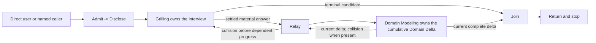

# Grill With Docs Composition Synthesis

Status: decision-complete composer design reference and future extraction map. The inactive Steps 1-3 candidate is preserved under `skills/experimental/grill-with-docs/`. This document and candidate are not runtime authority; the active canonical skill and installed mirror remain authoritative until the complete coordinated family is behaviorally proved, validated, promoted, and synchronized.

Runtime authority remains in:

- `skills/custom/grill-with-docs/SKILL.md` and `skills/custom/grill-with-docs/agents/openai.yaml`;
- `skills/custom/grilling/SKILL.md` for interview admission, factual legwork, the decision frontier, one-focus questioning, bound control, Evidence gap, confirmation, and the Grilling exit packet;
- `skills/custom/domain-modeling/SKILL.md`, `CONTEXT-FORMAT.md`, and `ADR-FORMAT.md` for domain resolution, persistence, ADR mutation, read-back, and the Domain Delta;
- each invoking caller for its item identity, supplied authority, continuation, and return contract;
- `docs/synthesis/skill-context-relationships.md` for pack-wide executable composition edges;
- `tests/test_skill_pack_contracts.py` and `docs/validation/evals/core-workflows.md` for current structural and behavioral protection; and
- `C:\Users\steve\.agents\skills\grill-with-docs` as the installed mirror of validated canonical source.

The sibling [Grilling Decision-Frontier Synthesis](grilling.md) and [Domain Modeling Durable-Truth Synthesis](domain-modeling.md) own proposed future component behavior. This note owns only their composition. The current runtime remains unchanged by this rewrite.

## How To Read This Document

This synthesis retains a four-layer authority model consistent with [ADR-0007](../../adr/0007-synthesis-preserves-exhaustive-research-runtime-skills-compress.md):

1. **Orientation** states the selected composer design and vocabulary.
2. **Normative Design** is the sole authority for proposed future behavior.
3. **Evidence And Rationale** preserves pressure, corrections, deliberate non-changes, and rejected machinery without creating rules.
4. **Extraction And Verification** places and proves the accepted behavior.

When another layer disagrees with Normative Design, correct that layer. The Contract Map is the single navigation surface for normative ownership; the extraction map places rules, and the acceptance matrix proves them without redefining them.

# Layer One: Orientation

## North Star

Grill With Docs returns one bounded Grilling packet and one current, complete Domain Delta as a coherent result while both components retain their own authority, mutation boundary, completion criterion, and return semantics.

The composer owns only the seam:

- admit work that needs both capabilities only after establishing the shared subject, source, authority, modes, identity, and return owner;
- disclose the effective domain, ADR, collision, and no-execution boundaries before questioning;
- keep Grilling and Domain Modeling active under their own contracts;
- relay every settled material answer to Domain Modeling;
- return domain collisions to Grilling before dependent questioning continues;
- join only current, complete component results; and
- return to the direct user or caller without starting downstream work.

It does not own participant authority, question selection, frontier progress, branch materiality, evidence routing, domain-consequence classification, semantic settlement, persistence, ADR worthiness, Domain Delta accumulation, caller continuation, or downstream execution.

## Design Verdict

Keep Grill With Docs as a thin, implicitly invocable, one-file composer with one nested interaction spine:

```text
Admit -> Disclose -> Compose [Grill <-> Relay <-> Model] -> Join -> Return
```

The future runtime defines only:

1. the dual-capability admission predicate, closed caller set, and minimal shared seam;
2. mutation disclosure before the first question;
3. component-preserving composition with a repeated Relay callback;
4. joint-result eligibility; and
5. a lean combined Return.

Do not add a universal entry schema, normative state machine, bridge ledger, full forensic wrapper, caller-specific runtime branch, operations file, packet reference, route catalog, or failure manual. If the runtime becomes long, remove component restatement before considering progressive disclosure.

## Composer Vocabulary

| Term | Meaning |
| --- | --- |
| **Composition fit** | One bounded invocation needs both a participant-facing Grilling session and active Domain Modeling |
| **Admission seam** | The minimal composer-owned compatibility check over shared subject and source, each component's admission-ready bound and authority lock, domain and ADR modes, caller identity, and return owner |
| **Mutation disclosure** | The pre-question explanation of effective context persistence, separate ADR authority, collision-driven reopening, and the no-execution boundary |
| **Settled material answer** | An answer Grilling has integrated as decision-bearing under its own frontier and authority rules |
| **Relay** | Opaque transport of each settled material answer to Domain Modeling and of any returned collision to Grilling before dependent progress |
| **Component payload** | The complete Grilling exit packet or authoritative cumulative Domain Delta, preserved under its owner's schema |
| **Joint status** | The composer-derived result `Confirmed`, `Evidence gap`, or `Blocked`; it never replaces a component status or blocker |
| **Return owner** | The direct user or invoking caller that receives the combined packet and retains continuation authority |

These are local composer terms, not additions to the repository domain glossary.

## Leading-Word Runtime Model

| Leading word | Runtime meaning |
| --- | --- |
| **Admit** | Verify the direct dual-capability trigger or one named caller edge and establish the shared subject, Source Trace, each component's admission-ready authority lock, domain and ADR modes, caller identity, and return owner; otherwise return the exact mismatch or blocker without starting a component |
| **Disclose** | State the effective context, ADR, collision, and no-execution boundaries before Grilling asks its first question |
| **Compose** | Run one Grilling session while Domain Modeling remains active under its own contract |
| **Relay** | Carry every settled material answer to Domain Modeling and any returned collision back to Grilling |
| **Join** | Derive one joint status from current complete component results without re-performing either completion criterion |
| **Return** | Deliver the lean combined packet to the named owner and stop |

**Compose** is the steering word. **Relay** repeats inside it; it is not a post-interview peer step.

## Interaction Model



The diagram explains interaction only. Layer Two owns admission, disclosure, composition, Relay, Join, and Return.

# Layer Two: Normative Design

## Contract Map

| Concern | Owner | Normative section | Failure return |
| --- | --- | --- | --- |
| Dual-capability fit, closed caller admission, and shared-seam compatibility | Grill With Docs | [Admission](#admission) | Exact mismatch or `Blocked` with the missing or contradictory field |
| Pre-question mutation and execution notice | Grill With Docs | [Disclose](#disclose) | Disclose before questioning or return `Blocked` |
| Interview, domain, and composer authority | Respective component or composer | [Compose And Component Authority](#compose-and-component-authority) | Return the exact ownership violation or component blocker |
| Settled-answer and collision transport | Grill With Docs | [Relay](#relay) | Pause dependent progress; return collision or `Blocked` |
| Domain meaning and cumulative Domain Delta | Domain Modeling | [Relay](#relay) | Preserve its blocker; the composer never repairs or accumulates it |
| Joint terminal eligibility and status | Grill With Docs | [Join](#join) | `Blocked` with owner and safe resumption requirement |
| Combined packet and stop boundary | Grill With Docs | [Return](#return) | Return exact packet gap; start nothing |
| Complete composer criterion | Grill With Docs | [Completion](#completion) | Remain unconfirmed or `Blocked` |
| Executable and suggestion-only edges | Relationship owner | [Relationships](#relationships) | Return to the direct user or invoking caller |

## Admission

Grill With Docs remains implicitly invocable. Its description must front-load both required conditions: one repo-backed decision interview needs user-owned ambiguity resolution and durable domain-record capture active together.

Admit only:

- **Direct user:** one named plan, design, proposal, decision, or idea needs both Grilling and Domain Modeling.
- **Wayfinder:** qualification or one bounded Grilling ticket requires a user decision under the map's locked domain mode.
- **Triage:** one bounded item needs maintainer-owned shaping plus domain capture before Triage can recommend.
- **Improve Codebase:** one selected candidate needs a user-owned decision before the caller can reclassify it.

This caller set is closed. A new caller requires an explicit trigger, supplied authority, return contract, relationship-map edge, and proof before promotion. Audit Codebase remains explicit-only and may suggest Grill With Docs, but it never invokes the composer.

Composition does not fit when:

- a conversation-only pressure test needs Grilling without durable capture;
- settled domain truth needs Domain Modeling without an interview;
- one source, runnable, causal, external-stakeholder, or interface question belongs to its evidence or design owner;
- a tracker-backed multi-session campaign belongs to Wayfinder; or
- an active caller owns ordinary clarification and has no accepted Grill With Docs edge.

On a direct mismatch, name the narrower owner and stop without starting it. On a caller mismatch, return the exact mismatch to that caller. A mismatch is not a combined packet and receives no joint status. The composer is not a general router.

Admission establishes only the shared seam:

```text
Subject and Source Trace:
Component-required bounds and authorities:
Domain context action: persist authorized | render only
ADR action: offer only | approved candidate identifiers
Caller identity and opaque identifiers, when present:
Return owner:
Downstream execution: none
```

For a direct invocation, missing persistence intent becomes `render only`; invoking Grill With Docs does not itself authorize a context write. A caller must pass `persist authorized` or `render only`. ADR creation always requires separate explicit approval.

Preserve caller vocabulary and identifiers opaquely. Each component validates its own admission-ready bound, authorities, and inputs and produces its own packet; the composer does not create a universal component schema, weaken a component requirement, invent an authority, or merge caller fields into generic replacements.

Admission completes only when both components identify the same bounded subject and source, each accepts its required bound and authority lock, domain and ADR modes are explicit, and the return owner is known. Missing or contradictory fields return `Blocked` with their owner and safe resumption requirement.

## Disclose

Before Grilling asks its first question, state:

1. whether Domain Modeling is `persist authorized` or `render only`;
2. that ADR creation has a separate explicit approval gate;
3. that a domain collision may reopen or block an interview branch; and
4. that confirmation starts no research, design, planning, ticket, implementation, tracker, or other downstream workflow.

Disclosure reports authority; it grants none. Point detailed persistence and confirmation mechanics to Domain Modeling and Grilling rather than copying them. Disclosure completes when the participant can distinguish possible in-session domain persistence from the unstarted next route.

## Compose And Component Authority

Run one Grilling session with Domain Modeling active throughout.

Grilling exclusively owns:

- participant admission and decision authority;
- factual legwork, source citations, materiality, frontier selection, and one-focus questioning;
- interview bounds, deferral, rebinding, and Evidence-gap classification;
- shared-understanding confirmation; and
- its complete exit packet and completion criterion.

Domain Modeling exclusively owns:

- domain-consequence classification, routing, Source Trace, and semantic authority;
- challenge, resolution, context ownership, and relationship coherence;
- context and ADR modes, mutation, formatting, and read-back;
- the authoritative cumulative Domain Delta, including no-change, rendered, persisted, blocked, and partial-failure states; and
- its completion criterion.

Grill With Docs owns admission, disclosure, scheduling, Relay timing, joint eligibility, and Return. Composition transfers no component authority. The composer never asks or answers a Grilling decision, settles domain truth, approves a write, classifies an ADR, merges Domain Delta entries, weakens a blocker, or re-performs a component completion criterion.

## Relay

After Grilling integrates each settled material answer:

1. relay the answer, shared subject and source, and relevant opaque branch or caller identifiers to Domain Modeling;
2. receive Domain Modeling's authoritative current cumulative Domain Delta;
3. carry that delta opaquely without merging entries, assigning versions, or recording a separate bridge ledger;
4. relay any material domain collision or blocker to Grilling intact; and
5. allow dependent questioning to continue only after Grilling has integrated the returned result.

The composer does not decide whether an answer has a domain consequence. Grilling owns whether the answer is settled and material; Domain Modeling owns whether the consequence is material, no-change, contradictory, rendered, persisted, or blocked.

Domain Modeling may return a minimal cumulative no-change delta. This is the legitimate result of active durable capture, not ceremonial composer work. A collision may reopen the decision tree; Grilling alone decides how. If Domain Modeling cannot return a current delta, return `Blocked` rather than silently continuing or relabeling the failure as Grilling's Evidence gap.

## Join

Join runs only when Grilling reaches a terminal candidate. It checks component-declared terminal state and mutual compatibility; it does not reproduce either component's completion logic or ask for a second confirmation.

| Joint status | Eligibility |
| --- | --- |
| **Confirmed** | Grilling returns its complete confirmed packet; Domain Modeling returns a current complete delta; no material nondeferred collision or blocker remains |
| **Evidence gap** | Grilling returns its legitimate complete Evidence-gap packet; Domain Modeling returns a current complete delta through the last settled answer |
| **Blocked** | Admission, disclosure, component integrity, collision processing, domain persistence or verification, payload currency, or compatibility cannot close |

Only Grilling originates `Evidence gap`. Every `Blocked` result names the exact blocker, owner, and safe resumption requirement. Joint status never grants caller continuation authority.

## Return

Return one lean combined packet:

```text
Status: Confirmed | Evidence gap | Blocked
Caller identity and opaque identifiers: <when supplied>
Grilling exit packet: <attached intact when available>
Domain Delta: <attached intact when available>
Composition blocker, owner, and resumption requirement: <Blocked only>
Return owner:
```

Do not copy input packets, disclosure text, callback history, a bridge ledger, component semantics, continuation authority, or `Downstream execution: none` into the output. Those are input, runtime, component, or stop-boundary rules rather than useful return data.

For a caller invocation, return to that caller and stop. For a direct invocation, report to the user and stop. An Evidence-gap packet preserves Grilling's exact uninvoked evidence owner. A Confirmed packet selects no next route. A Blocked packet reports recovery but does not perform it.

## Completion

Grill With Docs completes only when:

- admission either establishes the dual-capability fit or returns an exact mismatch;
- admission establishes the shared seam without losing or widening authority;
- disclosure precedes the first question;
- both components retain their own contracts;
- every settled material answer and returned collision traverses Relay before dependent progress;
- Domain Modeling alone returns a current cumulative Domain Delta;
- Join derives `Confirmed`, `Evidence gap`, or `Blocked` without replacing component states;
- Return preserves available component payloads and caller identity in the lean packet; and
- downstream execution remains unstarted.

Composer completion never substitutes for component completion or the caller's broader workflow completion.

## Relationships

| Source | Relationship | Target | Trigger and return |
| --- | --- | --- | --- |
| Direct user | Invoke | `$grill-with-docs` | One repo-backed decision needs both interview and durable capture; report the combined packet and stop |
| `$skill-router` | Recommend and stop | `$grill-with-docs` | Both capabilities are needed; the user starts the composer later |
| `$wayfinder` | Invoke | `$grill-with-docs` | Qualification or one Grilling ticket needs a user decision under the locked domain mode; return to the same map item |
| `$triage` | Invoke | `$grill-with-docs` | One item needs maintainer shaping and domain capture; return to that item without tracker authority |
| `$improve-codebase` | Invoke | `$grill-with-docs` | One selected candidate needs a user-owned decision; return to the same candidate and report |
| `$audit-codebase` finding contract | Suggest only | `$grill-with-docs` | A read-only finding exposes a user-owned term, rule, preference, or tradeoff; caller selection is required |
| `$grill-with-docs` | Compose | `$grilling` | Preserve its full interview contract and receive its exit packet |
| `$grill-with-docs` | Compose | `$domain-modeling` | Relay settled material answers and receive its authoritative cumulative Domain Delta |

The closed invoking set is the direct user, Wayfinder, Triage, and Improve Codebase. The components never invoke each other, and callers do not bypass the composer when their accepted edge requires both components.

Grill With Docs invokes no Router, Research, Prototype, Diagnosing Bugs, To Questionnaire, Codebase Design, Wayfinder, Domain Modeling outside the composition, To Spec, To Tickets, Implement, or other downstream route. It mutates no plan, spec, ticket, implementation file, report, tracker, Git state, or external system. Only Domain Modeling may mutate routed context or approved ADR files under the admitted mode.

# Layer Three: Evidence And Rationale

## Current Runtime Baseline

The current runtime uses:

```text
Compose -> Disclose -> Bound -> Reconcile -> Return
```

It already protects the two component gates, pre-interview disclosure, caller-bound pass-through, an intact Domain Delta at exit, joint eligibility for Confirmed, preservation of Grilling's Evidence gap, and no downstream execution.

The selected future design changes behavior in four material ways:

- direct composition defaults to render-only instead of treating durable capture as implicit write authority;
- every settled material answer is relayed during the interview instead of performing the first reconciliation only at exit;
- Domain Modeling, not the composer, owns the cumulative Domain Delta; and
- the combined Return is lean and uses `Blocked` for composition failure.

It also sharpens existing behavior by closing the caller set, absorbing the shared compatibility check into Admit instead of retaining Bound or a separate Align stage, and removing duplicated state and packet machinery.

## Decision Trace

| Decision | Selected behavior and rejected alternative | Decisive reason | Normative and proof owner |
| --- | --- | --- | --- |
| Keep a composer | One thin composer orders the two components; reject independent caller-built sequences | Independent calls make every caller reproduce alignment, collision ordering, and joint return | [Compose](#compose-and-component-authority); integrated caller cases |
| Keep component authority singular | Grilling owns interview behavior; Domain Modeling owns domain meaning; reject composer interpretation | Composition should transport authority, not redistribute it | [Compose](#compose-and-component-authority); ownership samples |
| Admit through a minimal seam | Preserve shared subject, source, modes, identity, and return owner inside admission; reject a separate Align stage and universal component packet | Compatibility is an admission gate rather than a distinct activity, while a generic schema duplicates component admission and risks lossy caller translation | [Admission](#admission); caller fixtures |
| Default direct use to render-only | Require explicit persistence intent; reject composer invocation as write authority | Locally settled answers may reopen, and composition is not mutation consent | [Admission](#admission); authority samples |
| Relay every settled material answer | Let Domain Modeling classify the consequence; reject composer-side filtering and exit-only reconciliation | Filtering duplicates semantic judgment and can discover collisions too late | [Relay](#relay); ordered multi-turn samples |
| Give Domain Modeling the cumulative delta | Carry its current delta opaquely; reject composer-side accumulation, versions, and bridge ledgers | A second reducer would need semantic merge, conflict, and partial-write rules | [Relay](#relay); callback inventory |
| Return a lean packet | Preserve both component outputs, caller identity, and exact blocker only; reject the forensic wrapper | Repeated inputs and callback history add stale state without semantic evidence | [Return](#return); packet rubric |
| Use `Blocked` | Require blocker, owner, and resumption condition; reject vague `Incomplete` | Composition failure must stay distinct from an open interview and Grilling Evidence gap | [Join](#join); terminal-state matrix |
| Use the nested interaction spine | Absorb Align into Admit, keep Relay inside Compose, and reject a normative state machine or flat peer sequence | Compatibility is checked at entry, the composer has no persistent transaction or recovery state, and Relay repeats during the interview | [Leading-Word Runtime Model](#leading-word-runtime-model); ordered transcripts |
| Keep implicit invocation | Use a sharp dual-condition trigger; reject explicit-only reach | Natural dual-capability requests would otherwise fall into Grilling unless the user already knew the composer or Router | [Admission](#admission); routing samples |
| Close the caller set | Admit the direct user, Wayfinder, Triage, and Improve Codebase; keep Audit suggestion-only; reject an open extension point | Every executable edge needs explicit supplied authority, return ownership, and proof | [Relationships](#relationships); relationship assertions |
| Keep one confirmation and no continuation | Grilling confirms once and the composer returns; reject second confirmation and automatic next routes | Neither composition nor joint status grants downstream authority | [Join](#join) and [Return](#return); terminal caller samples |

## Preserved Boundaries And Deferred Work

| Disposition | Item | Reason or revisit gate |
| --- | --- | --- |
| Unchanged | One concise runtime file with no supporting reference | Universal composer behavior fits one semantic surface |
| Unchanged | Independent implicitly invocable Grilling and Domain Modeling owners | The composer is their sole seam, not their replacement |
| Unchanged | Pre-question disclosure, intact component payloads, Grilling-owned Evidence gap, and no downstream execution | These are safety and recovery boundaries |
| Unchanged | Audit Codebase remains explicit-only and suggestion-only | Audit is terminal, read-only, and caller-selected |
| Unchanged | Canonical proof precedes installed synchronization | Partial family promotion would create authority drift |
| Deferred | Automatic semantic diffing, callback budgets, or speculative Domain Modeling before Grilling settles materiality | Promote only after a fixed control proves an observed failure |
| Deferred | Caller-specific runtime branches or new callers | Add only with an owned edge, supplied authority, return contract, and proof |
| Deferred | Automatic evidence-owner invocation or caller continuation | Requires new downstream authority; never inferred from component results |

Deferred machinery may promote only when a realistic control demonstrates that it improves a decision or proof obligation without weakening component ownership, payload integrity, mutation authority, or the no-execution boundary.

# Layer Four: Extraction And Verification

## Proposed Runtime Semantic Surface

Extract the [Leading-Word Runtime Model](#leading-word-runtime-model) and its Layer Two contracts into `skills/custom/grill-with-docs/SKILL.md` in semantic order: outcome and boundary, Admit with the shared seam, Disclose, Compose with nested Relay, Join, Return, and Completion. This is a semantic target, not final wording. Leave component procedure, caller-specific mechanics, rationale, evaluation protocol, and migration detail with their owners or in this synthesis.

## Runtime Ownership And Change Map

The minimum coordinated experimental cohort is `grilling`, `domain-modeling`, `grill-with-docs`, `skill-router`, `wayfinder`, `triage`, and `improve-codebase`. Before promotion, generate or refresh one current candidate for every cohort member: the first three own the composed behavior, Skill Router owns Domain Modeling's eligible standalone terminal residual, and the final three are the closed invoking caller set. Repo Bootstrap and recommendation-only or suggestion-only owners require compatibility verification, not experimental candidate generation, unless an observed packet or route mismatch requires an owned change.

| Stage / bundle | Surface | Owns | Proposed delta | Must not absorb |
| --- | --- | --- | --- | --- |
| `I1 / C1` | `skills/custom/grill-with-docs/SKILL.md` | Dual-condition description; thin boundary; Admit with the shared seam, Disclose, Compose and Relay, Join, lean Return, Completion | Extract Layer Two into one concise nested composer contract | Component procedure, caller-specific branches, route catalog, state machine, universal packet, bridge ledger, or rationale |
| `I1 / C1` | `skills/custom/grill-with-docs/agents/openai.yaml` | Invocation policy | Preserve explicitly declared `policy.allow_implicit_invocation: true` | Description or runtime procedure |
| `I2 / C2` | Grilling runtime and synthesis | Complete interview, Evidence gap, confirmation, and exit-packet contracts | Accept opaque caller identity and returned domain collisions; change only an observed mismatch | Domain mutation, composition status, or combined Return |
| `I2 / C2` | Domain Modeling runtime, references, and synthesis | Domain admission, semantic resolution, modes, persistence, ADRs, cumulative Domain Delta, and blockers | Accept every settled material answer and return the authoritative cumulative delta; preserve render-only default absent explicit persistence | Interview procedure, composer status, or caller continuation |
| `I2 / C2` | Wayfinder-owned surfaces | Locked domain mode, map identity, bounded decision, and continuation | Supply admission-seam fields and consume the lean packet | Composer internals or automatic next operation |
| `I2 / C2` | Triage-owned surfaces | Item identity, shaping trigger, Source Trace refresh, and continuation | Supply an explicit domain mode and consume the lean packet | Interview, domain procedure, or tracker authority transfer |
| `I2 / C2` | Improve Codebase selected-candidate surface | Candidate identity, one-blocker resolution, report reconciliation, and reclassification | Supply an explicit domain mode and consume the lean packet | Component procedure or loss of caller ownership |
| `I2 / C2` | Audit Codebase finding contract | Read-only suggested-owner classification | Preserve explicit-only, suggestion-only behavior | Composer invocation or audit continuation |
| `I2 / C2` | Skill Router | Direct distinction among Grilling, Grill With Docs, Domain Modeling, evidence leaves, and Wayfinder | Preserve recommend-and-stop; align only if admission wording changes | Composer procedure or automatic invocation |
| `I2 / C2` | `docs/synthesis/skill-context-relationships.md` | Invocation policy and executable edges | Preserve the closed caller set and two Compose edges; sharpen trigger and return wording | Component procedure or unlisted caller edge |
| `I2 / C2` | README and active human route guidance | Human orientation | Update only materially changed invocation wording | Normative procedure or caller catalog |
| `I3 / C3` | `tests/test_skill_pack_contracts.py` | Structural composition, invocation policy, closed edges, ownership exclusions, and mirror-safe invariants | Protect the accepted nested spine and single ownership without snapshotting incidental prose | Claims that strings prove multi-turn behavior |
| `I3 / C3` | `docs/validation/evals/core-workflows.md` | Behavioral prompts, required outcomes, critical failures, and integrated caller cases | Cover render-only default, Relay timing, cumulative-delta ownership, Blocked, lean Return, and closed callers | Runtime rules not owned in Layer Two |
| `I3 / C3` | Behavior-evaluation records | Fixed controls and candidate evidence | Use shared coverage-optimized scenarios with per-claim scoring | Normative authority or anecdotal proof |
| `I4 / C4` | Installed mirror | Validated copy of canonical runtime | Synchronize only after coordinated proof | Independent edits, partial synchronization, or canonical authority |

Stages order one coordinated rewrite: `I1` extracts the composer, `I2` reconciles owned relationships, `I3` proves behavior and structure, and `I4` synchronizes the validated mirror. No stage is separately promotable.

## Staged Behavior-Evaluation Protocol

| Phase | Claims proved | Shared scenario family |
| --- | --- | --- |
| `E0`: Control lock | Current or no-candidate guidance exhibits each claimed failure | Fixed realistic controls for changed behavior |
| `E1`: Admit and Disclose | Dual trigger, closed callers, shared seam, opaque identity, render-only default, explicit modes, and notice timing | Direct, mismatch, Wayfinder, Triage, and Improve entry variants |
| `E2`: Compose and Relay | Component authority, every settled material answer relayed, current cumulative delta, collision return, and no composer reduction | Multi-turn no-change, domain-change, and collision variants |
| `E3`: Join and Return | Confirmed, Evidence gap, Blocked, intact component payloads, lean packet, caller return, and no execution | Terminal direct and caller variants |
| `E4`: Integrated promotion | Components, callers, Audit suggestion, Router, relationships, static protection, validation, installation, and parity agree | Coordinated family validation |

Use a coverage-optimized sample matrix. Shared scenarios may exercise several claims, but every changed behavioral claim must appear in at least five independent fresh-context samples per control and candidate arm and receive its own rubric score. Hold prompts, sources, authorities, modes, tools, runtime, model, reasoning tier, and relevant hashes fixed across arms. Run a focused diagnostic scenario only when a bundled result fails or remains ambiguous.

Use the current composer as control for modified behavior and a no-candidate-guidance arm for genuinely new behavior. Stop testing a proposed instruction when its control does not exhibit the claimed failure. Judge behavior rather than copied phrases. Record each claim, sample coverage, result distribution, variance, worst outcome, protocol deviation, and residual gap.

Every negative case in the acceptance matrix is promotion-blocking regardless of averages.

## Migration And Acceptance Matrix

This matrix supplies coverage, not runtime rules or file placement.

| Implementation / evaluation | Claim and normative owner | Positive case | Negative case | Verification |
| --- | --- | --- | --- | --- |
| `I1,I2 / E1` | [Admission](#admission) | Direct dual-capability work and each closed caller admit only with shared subject, source, authority modes, opaque IDs, and return owner; direct omission becomes render-only; conversation-only, domain-only, evidence-leaf, campaign, and unlisted-caller work stay outside | Composer steals ordinary clarification, becomes a router, admits Audit, drops IDs, invents authority, or treats composer invocation as persistence permission | Policy and relationship tests, caller fixtures, shared routing samples, and authority rubric |
| `I1 / E1` | [Disclose](#disclose) | Effective context mode, separate ADR gate, collision effect, and no-execution boundary precede the first question | Disclosure is late, generic, incomplete, or grants authority | Turn-order rubric |
| `I1,I2 / E2` | [Compose And Component Authority](#compose-and-component-authority) | Grilling alone owns interview behavior; Domain Modeling alone owns semantics and cumulative delta; composer owns the seam | Composer asks a decision, classifies domain relevance, approves mutation, merges a delta, or weakens a blocker | Ownership samples and mutation-boundary inspection |
| `I1,I2 / E2` | [Relay](#relay) | Every settled material answer reaches Domain Modeling; no-change remains legitimate; collisions return before dependent progress | Composer filters answers, reconciles first at exit, fabricates ceremony, or continues through a collision | Ordered multi-turn samples with callback inventory |
| `I1,I2 / E3` | [Join](#join) | Current compatible component results yield Confirmed or Evidence gap; integrity failures yield Blocked with recovery | Second confirmation, stale delta, false Confirmed, Domain failure labeled Evidence gap, or vague Blocked | Component-state matrix and paired terminal samples |
| `I1,I2 / E3,E4` | [Return](#return) and [Relationships](#relationships) | Lean packet preserves both outputs and caller identity; named callers alone resume; Audit only suggests | Full forensic duplication, flattened payload, unlisted caller, audit continuation, or downstream execution | Packet rubric, caller samples, and relationship assertions |
| `I1-I4 / E4` | [Runtime Ownership And Change Map](#runtime-ownership-and-change-map) | Canonical behavior, components, callers, tests, evaluations, validation, and installed hashes agree | Partial family migration, copied component rules, rejected machinery, or partial mirror sync | Focused pytest, full pytest, validation, diff checks, read-back, and hash parity |

## Promotion Gate And Residual Gaps

The promotion record names each changed claim, normative owner, implementation stage, evaluation phase, shared-scenario coverage, control and candidate hashes, fixed inputs, sample count, rubric, result distribution, worst outcome, critical failures, protocol deviations, unavailable telemetry, and residual gaps.

Promote only the coordinated canonical family. A passing stage does not authorize partial caller migration or mirror synchronization. A residual gap blocks promotion when it affects dual-capability admission, closed caller identity, shared-seam compatibility, authority preservation, disclosure timing, Relay sequencing, collision return, Domain Delta ownership or currency, component completion, joint status, payload integrity, caller identity, no-execution behavior, or installed parity.

Static tests protect structure and relationships only. Noncritical uncertainty may remain only with its evidence limit, behavioral consequence, and later validation owner.

## Completion Criterion For The Future Rewrite

The future rewrite is complete only when `I1` through `I4`, applicable `E0` through `E4`, and every acceptance-matrix row pass; no promotion-blocking residual remains; canonical validation, changed-file read-back, and both diff checks pass; and the installed mirror matches validated canonical source exactly. The [Contract Map](#contract-map) owns behavior and the [Runtime Ownership And Change Map](#runtime-ownership-and-change-map) owns placement.
