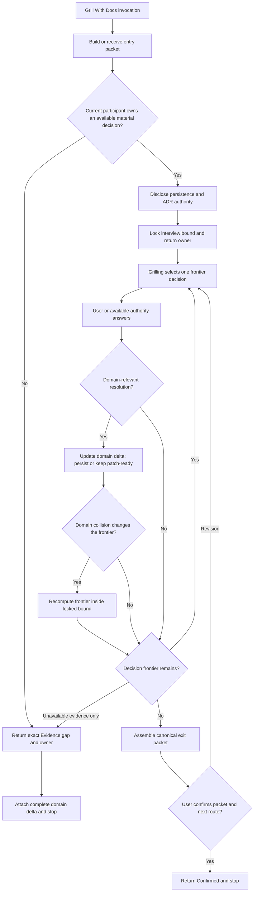

# Grill With Docs Composer Synthesis

Status: exhaustive design reference, not an executable contract.

Runtime authority remains in:

- `skills/custom/grill-with-docs/SKILL.md`;
- `skills/custom/grill-with-docs/agents/openai.yaml`;
- `$grilling` for the interview frontier, one-decision pressure loop, confirmation gate, Evidence gap, and decision-tree return;
- `$domain-modeling` for domain truth, routed context files, ADR handling, read-back, and the complete domain delta;
- each caller's interview bound, continuation authority, and return contract; and
- `docs/synthesis/skill-context-relationships.md` for pack-wide composition edges.

The proposed runtime wording in this note is not authoritative until the canonical skill, callers, tests, behavior evaluations, relationship surfaces, and installed mirror are updated and validated together.

## How To Read This Document

This synthesis preserves the complete composer design and rationale so the runtime skill can remain concise. Normative Contracts own proposed behavior. Explanatory Design records why the boundaries exist. Extraction And Verification maps the design into the eventual runtime and its callers.

| Question | Owning section |
| --- | --- |
| What must a caller provide? | [Entry Packet](#entry-packet) |
| Should this interview begin? | [Participation Admission](#participation-admission) |
| May the interview expand? | [Locked Interview Bound](#locked-interview-bound) |
| May Domain Modeling write? | [Domain Persistence And ADR Authority](#domain-persistence-and-adr-authority) |
| When is domain truth reconciled? | [Continuous Domain Reconciliation](#continuous-domain-reconciliation) |
| What happens when evidence is missing? | [Evidence Gap](#evidence-gap) |
| Does confirming the packet start the next route? | [Confirmation Boundary](#confirmation-boundary) |
| What exactly returns? | [Canonical Exit Packet](#canonical-exit-packet) |
| What belongs in the eventual runtime skill? | [Runtime Extraction Target](#runtime-extraction-target) |

# Layer One: Orientation

## North Star

Grill With Docs owns one outcome: a bounded `$grilling` exit packet reconciled continuously with `$domain-modeling`'s complete domain delta.

It composes two active owners without absorbing their authority:

- Grilling owns which user-owned material decision is asked next, one decision at a time.
- Domain Modeling owns canonical language, context boundaries, domain contradictions, routed domain files, ADR candidates, and domain read-back.
- Grill With Docs owns entry admission, the locked interview bound, mutation disclosure, continuous reconciliation between the two owners, the canonical combined packet, and the confirmation-versus-execution boundary.

The composer never becomes a router, research workflow, prototype workflow, questionnaire collector, design procedure, implementation owner, or generic planning orchestrator.

## Leading-Word Spine

The eventual runtime skill should use this compact spine:

```text
Admit
Lock
Compose
Reconcile
Confirm
Return
```

- **Admit** verifies packet completeness and available decision authority.
- **Lock** fixes the interview outcome, source, persistence mode, ADR authority, and return owner.
- **Compose** runs Grilling with Domain Modeling active under their separate authorities.
- **Reconcile** keeps the domain delta current after every domain-relevant confirmed answer.
- **Confirm** closes shared understanding without authorizing downstream execution.
- **Return** emits one caller-recoverable packet and stops.

## End-To-End Explanatory Flow



The diagram is explanatory. Grilling's decision-frontier rules and Domain Modeling's file and ADR gates remain authoritative in their own skills.

# Layer Two: Normative Contracts

## Decision Contracts

Each gate classifies evidence under one owner and never performs the work needed to make its own predicate true.

| Decision | Owner | Passing predicate | Other branch | Mutation authority |
| --- | --- | --- | --- | --- |
| Participation admitted? | Grill With Docs | The current participant or available caller authority owns at least one unresolved material decision inside the bound | Return the exact Evidence gap and appropriate evidence or stakeholder owner | None |
| Branch remains in bound? | Grill With Docs, with user or caller authority for revision | The branch is necessary to settle the locked outcome without changing purpose, owner, or material scope | Defer it or present a revised-bound packet | None until revision approval |
| Domain persistence authorized? | Caller contract or explicit user approval | Entry packet says `authorized now` | Maintain patch-ready wording and paths | Domain Modeling alone performs authorized writes |
| ADR creation approved? | User or named architectural authority | One identified ADR candidate has explicit approval | Offer or record decline/deferral | Domain Modeling alone creates the ADR |
| Evidence gap reached? | Grilling | No material user-owned frontier decision remains and the next dependent decision requires unavailable fact, runnable proof, causal evidence, repository evidence, or external stakeholder authority | Continue the one-decision loop | None |
| Packet confirmed? | User or caller's named confirmation authority | Every material branch is resolved or explicitly deferred and shared understanding plus next route are accepted | Resume the relevant decision frontier | Confirmation only; downstream execution remains none |

## Entry Packet

Every invocation begins with this information or a caller-owned equivalent:

```text
Interview bound:
Source Trace:
Decision owner:
Domain persistence: authorized now | return patch-ready
ADR authority: offer only | approved paths or decisions
Return owner: caller | standalone user
Downstream execution: none
```

The entry packet may also name known decisions, explicit deferrals, evidence gaps, required terminology, and a caller-specific return schema. Preserve equivalent caller fields rather than translating them mechanically and losing meaning.

Without a caller packet, bind the session to the user-named plan, design, proposal, or decision. Build the Source Trace from the governing request, repository instructions, relevant domain docs and ADRs, accepted plan or design source, and evidence needed for load-bearing factual claims.

Entry completes when the interview outcome, source, decision owner, persistence mode, ADR authority, and return owner are explicit.

## Participation Admission

Admit the interview only when at least one unresolved material decision belongs to the current user or another authority available inside the session.

Repository evidence and Domain Modeling may settle facts, accepted terminology, and existing boundaries, but they never manufacture authority for a material choice.

When no available participant owns a frontier decision:

- authoritative source facts recommend `$research`;
- runnable design or behavior evidence recommends `$prototype`;
- uncertain expected behavior, symptom, reproduction, or cause recommends `$diagnosing-bugs`;
- objective repository or operational evidence returns to the caller's repository work owner;
- unavailable stakeholder knowledge or judgment recommends `$to-questionnaire`; and
- no justified owner returns an exact Evidence gap without forcing a route.

When the current participant owns only part of the frontier, grill that available part and record unavailable-owner branches as explicit deferrals or Evidence gaps. Never ask the current user to impersonate an external decision owner.

Participation Admission performs no domain, ADR, plan, design, tracker, or downstream mutation.

## Disclosure

Before the first interview question, state the active mutation boundary in terms of the locked entry packet:

- Under `authorized now`, confirmed domain terms or boundaries may update routed domain docs through Domain Modeling and read-back.
- Under `return patch-ready`, no domain file is written; exact wording and target paths return in the domain delta.
- ADRs are offered or created only under their separately locked authority.
- Confirming the final packet does not start the recommended next route.

Disclosure is informational, not a substitute for authority. It completes when the participant can tell what may change during the interview and what remains advisory.

## Locked Interview Bound

The entry packet fixes the outcome, decision owner, material scope, and return owner for one grilling session.

After every answer, classify a newly exposed branch:

- **In-bound prerequisite:** necessary to settle the locked outcome and owned by an available authority; add it to Grilling's decision frontier.
- **Explicit deferral:** material but unnecessary to settle the locked outcome, outside scope, or owned by an unavailable authority; preserve it in the exit packet.
- **Bound change:** changes the intended outcome, decision owner, or material scope; pause and present a revised-bound packet for user or caller approval.

No branch expands the session implicitly. A rejected revised bound leaves the original session intact when it can still complete; otherwise return the exact blocker and current packet.

The bound is finite because Grilling asks one material decision at a time, new in-bound branches must be prerequisites of the locked outcome, and every other branch is deferred or requires approved rebinding.

## Compose

Run one Grilling session with Domain Modeling active throughout:

1. Grilling recomputes every unresolved material decision whose prerequisites are settled.
2. Available sources settle answerable factual uncertainty before asking the user.
3. Grilling selects the highest-leverage user-owned frontier decision and asks exactly one decision with an advisory recommendation and decisive tradeoff.
4. The user owns every material choice; the recommendation never substitutes for confirmation.
5. Grill With Docs classifies newly exposed branches against the locked bound.
6. Domain Modeling challenges and reconciles every domain-relevant confirmed resolution under the locked persistence and ADR modes.
7. Repeat until Confirm or Evidence gap.

Grill With Docs never asks several material decisions in one turn merely to shorten the interview. A Grilling ticket may require several conversational questions only when they settle one ticket-owned material decision.

## Domain Persistence And ADR Authority

Lock exactly one persistence mode at entry:

- **Authorized now:** Domain Modeling may persist confirmed canonical terms, context ownership, context boundaries, and durable invariants within its file scope; every write must read back before dependent questioning continues.
- **Return patch-ready:** Domain Modeling performs the same challenge and resolution work but returns exact wording, target paths, contradictions, and relationships without writing.

ADR authority is independent:

- **Offer only:** identify every ADR-worthy decision, offer the target and concise content, and record approval, decline, or deferral; create none implicitly.
- **Approved paths or decisions:** create only the explicitly approved ADR candidates through Domain Modeling's location, numbering, format, and read-back contract.

A caller-specific mode such as Wayfinder's `deferred to Closeout` maps to `return patch-ready` for the Grill With Docs invocation and preserves the caller's later persistence owner in the returned delta.

## Continuous Domain Reconciliation

After each confirmed answer that changes a canonical term, definition, context owner, context boundary, durable invariant, or ADR-worthy decision:

1. challenge it against current routed context docs, ADRs, code-facing vocabulary, and prior confirmed answers;
2. update the pending domain delta immediately;
3. persist and read back when authorized, or maintain exact patch-ready wording and targets otherwise;
4. record ADR candidates and outcomes under the locked authority; and
5. surface any collision that invalidates the remaining decision frontier before asking the next question.

Answers unrelated to domain truth require no synthetic domain work. `Domain delta: none` is a complete result when every potential domain consequence has been considered and none exists.

Exit runs one final completeness pass over the already-current domain delta. It never performs the first reconciliation after the interview has otherwise concluded.

## Evidence Gap

Preserve Grilling's Evidence gap exit. Use it only when no available material frontier decision remains and the next dependent decision requires unavailable evidence or authority.

Record:

```text
Exact missing question or evidence:
Blocked decisions:
Why current sources or participant cannot settle it:
Recommended evidence owner:
Approved artifact path, when applicable:
Return owner:
```

Recommend one appropriate evidence owner without invoking it. Attach the complete current domain delta, confirmed decisions, and deferrals so the evidence work can return without restarting the interview.

An expected difficult question, ordinary uncertainty, or a later step is not an Evidence gap while another available frontier decision remains.

## Confirmation Boundary

Confirmed is a two-owner completion gate:

1. Grilling proves that every material branch inside the locked bound is resolved or explicitly deferred and presents the complete decision tree plus recommended next route.
2. Domain Modeling proves that every domain resolution, contradiction, evidence gap, affected context relationship, changed file or patch-ready target, and ADR candidate has one accounted-for outcome.
3. Grill With Docs assembles the canonical exit packet with `Downstream execution: none`.
4. The user or named confirmation authority accepts shared understanding and the advisory next route.
5. Grill With Docs returns `Confirmed` and stops.

Confirmation never authorizes the named next route. Execution begins only from a later explicit instruction such as `continue`, `make the changes`, or a named skill invocation.

A caller may continue its own already-authorized workflow after receiving the confirmed packet only when its original caller contract explicitly owns that continuation. That continuation belongs to the caller, not Grill With Docs.

## Canonical Exit Packet

Every exit returns:

```text
Status: Confirmed | Evidence gap
Interview bound:
Decision owner:
Confirmed decisions:
Rejected options:
Explicit deferrals:
Source pointers:
Domain delta:
Changed domain paths | patch-ready targets:
ADR candidates and outcomes:
Evidence gap:
Recommended next route:
Return owner:
Downstream execution: none
```

Attach Domain Modeling's complete delta intact rather than compressing it into the decision summary. Preserve caller-specific identifiers and return fields alongside the canonical packet.

A caller receives the packet and decides how its owned workflow resumes. A standalone invocation reports it to the user and stops. The next route is advisory and unstarted.

## Completion Criterion

Grill With Docs completes only when:

- the entry packet and participation admission closed;
- disclosure preceded questioning;
- the interview stayed inside the locked bound or an approved revision;
- Grilling reached Confirm or a legitimate Evidence gap;
- continuous domain reconciliation accounted for every domain-relevant resolution and collision;
- every authorized domain write read back and every unapproved change remained patch-ready;
- every ADR candidate was offered, approved and recorded, declined, or deferred;
- the canonical packet contains the intact domain delta, decisions, deferrals, sources, route, and return owner;
- Confirmed has explicit shared-understanding confirmation; and
- downstream execution remains none at Return.

# Layer Three: Explanatory Design

## Why The Entry Packet Is Required

The composer coordinates an interview owner and a domain-mutation owner. Without a locked packet, “Domain Modeling active throughout” leaves write authority implicit, callers may lose their return boundary, and the interview may inherit an accidental scope from surrounding conversation.

The packet is semantic rather than format-rigid. Wayfinder, Triage, Improve Codebase, and a standalone user may already provide equivalent fields. Preserve their vocabulary and add only genuinely missing authority or boundary information.

## Why Reconciliation Is Continuous

An exit-only domain pass can discover that an early answer conflicts with canonical language or invalidates several later choices after the user has already traversed the decision tree. Continuous reconciliation turns those collisions into immediate frontier updates.

The composer does not run Domain Modeling ceremonially after every answer. It reacts only when a confirmed resolution touches domain truth or an existing domain contradiction bears on the next decision.

## Why Confirmation And Execution Are Separate

The user must be able to confirm that the decision tree and recommended route are understood without accidentally authorizing file edits, tracker changes, research, prototypes, implementation, or another skill. Separating the two acts preserves the composer boundary and makes later authority explicit.

The extra turn is intentional when no caller already owns continuation. It is cheaper than inferring mutation authority from an answer such as “yes.”

## Why The Bound Is Locked

Grilling is intentionally relentless, which can become open-ended when each answer exposes adjacent decisions. A locked outcome lets the interview absorb necessary prerequisites while deferring adjacent plans, destinations, and unavailable-owner work. Revised purpose requires revised consent.

This is a semantic convergence rule rather than a numeric question budget. Grilling continues until its finite in-bound decision frontier closes or evidence blocks every remaining branch.

## Why Participation Is Admitted

Source evidence can settle facts and Domain Modeling can enforce accepted language, but neither can decide a preference, commitment, public contract, scope tradeoff, or contested boundary for an unavailable owner. The admission check prevents confident but unauthorized answers and routes evidence-shaped work to its actual owner.

## Relationship Ownership

| Caller | Verb | Callee | Trigger and return |
| --- | --- | --- | --- |
| Direct user | Invoke | `$grill-with-docs` | A named repo-backed plan or design needs user decisions plus domain reconciliation; return the canonical packet and stop |
| `$wayfinder` | Invoke | `$grill-with-docs` | Qualify one proposed campaign or resolve one Grilling ticket under the map's bound and persistence mode; return to Wayfinder |
| `$triage` | Invoke | `$grill-with-docs` | Maintainer-owned scope, acceptance, language, or design decisions block one item; return changed paths, ADR outcomes, decisions, and evidence gaps to Triage |
| `$improve-codebase` | Invoke | `$grill-with-docs` | One selected candidate has one user-owned preference, commitment, domain, boundary, ADR, or tradeoff blocker; return the complete packet to the same candidate |
| `$audit-codebase` | Recommend | `$grill-with-docs` | A finding exposes one user-owned domain rule, term, preference, or tradeoff; the audit remains read-only and does not start the interview automatically |
| `$skill-router` | Recommend and stop | `$grill-with-docs` | A repo-backed plan or design needs an interview and durable domain capture; the user starts it later |
| `$grill-with-docs` | Compose | `$grilling` | Run the one-decision interview frontier and receive Confirmed or Evidence gap |
| `$grill-with-docs` | Compose | `$domain-modeling` | Challenge and reconcile domain truth under the locked persistence and ADR authority; receive the complete domain delta |

Grill With Docs is the sole composer of Grilling and Domain Modeling. Neither component invokes the other or selects the caller's next route.

## Deliberate Non-Relationships

Grill With Docs does not invoke Skill Router merely because the interview exposes residual work. Standalone residual work may recommend one next route in the exit packet; caller-invoked work returns to its caller.

It does not invoke Research, Prototype, Diagnosis, Questionnaire, Codebase Design, To Spec, To Tickets, Implement, or Wayfinder from an Evidence gap. It names the correct owner and stops.

It does not mutate plans, specs, tickets, implementation files, tracker state, or artifacts outside Domain Modeling's authorized context and ADR paths.

It does not absorb Grilling's confirmation criteria or Domain Modeling's domain completion criteria into a weaker composer-specific approximation.

## Edge-Case Matrix

| Situation | Required result |
| --- | --- |
| Caller omits persistence authority | Use `return patch-ready`; write no domain file |
| Caller says domain writes are authorized but ADR authority is absent | Persist eligible context changes; offer ADRs only |
| Answer changes no domain truth | Keep `Domain delta: none` or the existing delta; perform no ceremonial write |
| Confirmed term conflicts with current glossary | Surface the collision before the next dependent question |
| Answer exposes an in-bound prerequisite | Add it to Grilling's frontier and continue one decision at a time |
| Answer exposes a different plan or destination | Record a deferral or request revised-bound approval |
| Current user lacks authority for every remaining choice | Return Evidence gap and the correct evidence or stakeholder owner |
| External stakeholder owns one remaining decision | Recommend To Questionnaire; preserve all settled source and needed-back information |
| A factual gap blocks one branch while another user-owned decision is ready | Keep the blocked branch pending and continue from the ready frontier |
| User confirms the packet with “yes” | Return Confirmed and stop; do not execute the next route |
| Caller contract already authorizes continuation after return | Return the packet; the caller resumes under its own authority |
| User changes the bound during confirmation | Reopen the affected decision frontier under an approved revised packet |
| Domain write succeeds but read-back fails | Return incomplete domain delta and blocker; never report Confirmed |
| No ADR candidate exists | Record none; do not create an empty or ceremonial ADR |

# Layer Four: Extraction And Verification

## Runtime Extraction Target

The eventual `skills/custom/grill-with-docs/SKILL.md` should remain one concise file. No separate operations reference is currently warranted because every invocation uses the same linear composer spine.

Keep only:

- outcome and ownership boundary;
- the required entry-packet fields or caller-equivalence rule;
- participation admission;
- one-line disclosure requirement;
- locked-bound rule;
- `Admit -> Lock -> Compose -> Reconcile -> Confirm -> Return`;
- continuous domain reconciliation and persistence modes;
- the canonical exit packet or a sharp compact representation;
- confirmation-versus-execution boundary; and
- completion criterion.

Leave detailed Grilling logic in `$grilling`, Domain Modeling process and file authority in `$domain-modeling`, caller-specific routes in callers, and exhaustive rationale and edge cases in this synthesis.

The current implicit invocation policy may remain. Its description should continue to require both a repo-backed interview and durable domain reconciliation so ordinary conversation-only grilling routes to `$grilling` instead.

## Proposed Runtime Wording Shape

```text
Outcome and owner split
Entry packet and admission
Disclose
Admit -> Lock -> Compose -> Reconcile -> Confirm -> Return
Canonical return and completion
```

This is a semantic target, not final approved wording. Concision must come from strong leading words and owned references, not from dropping mutation or confirmation boundaries.

## Coordinated File Change Map

A future implementation must inspect and classify:

- `skills/custom/grill-with-docs/SKILL.md`;
- `skills/custom/grill-with-docs/agents/openai.yaml`;
- `$grilling` and `$domain-modeling` only for compatible composition boundaries, not automatic rewrites;
- Wayfinder Qualification and Grilling-ticket caller packets;
- Triage's specific-item shaping return;
- Improve Codebase's selected-candidate resolver packet;
- Audit Codebase and Skill Router recommendation wording;
- `docs/synthesis/skill-context-relationships.md`;
- structural contract tests and behavior evaluations; and
- the installed mirror after canonical validation.

No new supporting runtime file is required unless behavior evaluation later proves that the canonical exit schema or a caller-specific branch is repeatedly omitted despite a sharp inline contract.

## Behavior Evaluation Matrix

Positive cases should prove:

- standalone use with authorized domain persistence and an offered or declined ADR;
- standalone use with patch-ready-only authority;
- Wayfinder Qualification with deferred persistence and a locked charting bound;
- one Wayfinder Grilling ticket returning to the map;
- Triage and Improve Codebase callers preserving their identifiers and return ownership;
- a domain collision reopening the next dependent decision before exit;
- an in-bound prerequisite joining the frontier while an adjacent plan is deferred;
- a legitimate factual, runnable, causal, repository, or external-owner Evidence gap; and
- packet confirmation stopping before downstream execution.

Negative controls should prove:

- no domain write without explicit persistence authority;
- no ADR creation from domain-write authority alone;
- no exit-only first reconciliation;
- no user questioning for decisions owned solely by an unavailable stakeholder;
- no silent interview-bound expansion;
- no multi-decision batching that bypasses Grilling;
- no partial or summarized-away domain delta;
- no Confirmed result before both component completion gates and user confirmation;
- no automatic evidence resolver, router, design, synthesis, or implementation invocation; and
- no interpretation of “yes” to the confirmation question as downstream mutation authority.

## Migration Order

1. Update the canonical Grill With Docs skill with the concise composer contract.
2. Update only caller packets that lack equivalent bound, authority, or return fields.
3. Update relationship documentation and structural tests.
4. Expand the existing Grilling With Domain Capture behavior evaluation with persistence-mode, participation, continuous-reconciliation, revised-bound, and confirmation-boundary cases.
5. Run focused tests, full pytest, skill validation, behavior evaluation, and diff checks.
6. Synchronize the installed mirror only after canonical validation and verify parity.

Do not rewrite Grilling or Domain Modeling merely to duplicate composer rules. Do not synchronize an incomplete caller migration.

## Future Analysis Checklist

### Entry And Authority

1. Does every invocation identify the interview bound, Source Trace, decision owner, persistence mode, ADR authority, return owner, and no-execution state?
2. Does Participation Admission verify that an available participant owns at least one material decision?
3. Does missing persistence authority reliably select patch-ready return rather than writing?
4. Are ADR creation and domain persistence still independently authorized?

### Bound And Interview

5. Is the interview outcome locked before the first question?
6. Does every newly exposed branch become an in-bound prerequisite, explicit deferral, or approved bound revision?
7. Does Grilling retain one-decision-at-a-time ownership and factual legwork?
8. Can the session reach Evidence gap only after every available frontier decision is exhausted?

### Domain Reconciliation

9. Is the domain delta updated after every domain-relevant confirmed answer rather than first assembled at exit?
10. Do authorized writes read back before dependent questioning continues?
11. Do patch-ready returns name exact wording, target paths, contradictions, and context relationships?
12. Does a domain collision reopen affected decisions before the interview continues?

### Confirmation And Return

13. Does the canonical packet attach the complete domain delta intact?
14. Does Confirmed require both component completion gates and explicit shared-understanding confirmation?
15. Does confirmation leave downstream execution none?
16. Does a caller resume only under its own pre-existing continuation authority?

### Composition And Extraction

17. Does Grill With Docs remain the sole composer without absorbing Grilling or Domain Modeling authority?
18. Are evidence owners recommended rather than invoked from Evidence gap?
19. Does the runtime skill remain one concise linear composer rather than accumulating caller-specific catalogs?
20. Do callers, tests, behavior evaluations, relationship maps, and installed mirrors agree with the canonical source after migration?
