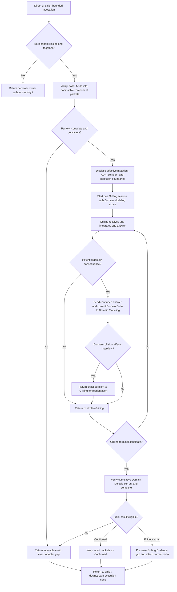

# Grill With Docs Composition Synthesis

Status: exhaustive composer design reference and future extraction map. No proposed behavior in this document is current runtime authority until the coordinated rewrite, evaluation, validation, and installed-mirror synchronization complete.

Runtime authority remains in:

- `skills/custom/grill-with-docs/SKILL.md`;
- `skills/custom/grill-with-docs/agents/openai.yaml`;
- `skills/custom/grilling/SKILL.md` for interview admission, facts and decisions, the decision frontier, one-focus questioning, bound control, Evidence gap, confirmation, and the Grilling exit packet;
- `skills/custom/domain-modeling/SKILL.md`, `CONTEXT-FORMAT.md`, and `ADR-FORMAT.md` for domain resolution, persistence intent and actions, context and ADR mutation, read-back, and the Domain Delta;
- each invoking caller for its item identity, bounds, supplied authority, continuation authority, and return contract;
- `docs/synthesis/skill-context-relationships.md` for pack-wide executable composition edges;
- `tests/test_skill_pack_contracts.py` and `docs/validation/evals/core-workflows.md` for current structural and behavioral protection; and
- `C:\Users\steve\.agents\skills\grill-with-docs` as the installed mirror of validated canonical source.

The sibling [Grilling Decision-Frontier Synthesis](grilling.md) and [Domain Modeling Durable-Truth Synthesis](domain-modeling.md) own proposed future component behavior. This note owns only their composition. The current runtime remains unchanged by this rewrite.

## How To Read This Document

This synthesis follows the four-layer authority model used by the Parallel Implement and Wayfinder syntheses:

1. **Orientation** states the outcome, selected composer design, vocabulary, and explanatory flow.
2. **Normative Design** is the sole authority for proposed future Grill With Docs behavior and relationships.
3. **Evidence And Rationale** preserves ownership corrections, failure pressure, deliberate non-changes, and deferred hypotheses without creating rules.
4. **Extraction And Verification** maps each accepted behavior into one owned runtime surface and one staged proof path.

| Question | Owning section |
| --- | --- |
| What outcome and boundary govern the composer? | [North Star](#north-star) and [Design Verdict](#design-verdict) |
| Which terms have precise meanings? | [Composer Vocabulary](#composer-vocabulary) |
| How should the eventual runtime read? | [Leading-Word Runtime Model](#leading-word-runtime-model) |
| Where does each proposed rule live? | [Normative Home Index](#normative-home-index) |
| When should the composer begin? | [Invocation And Composition Admission](#invocation-and-composition-admission) |
| What must be passed to each component? | [Entry Adapter](#entry-adapter) |
| What must the participant know before questioning? | [Mutation Disclosure](#mutation-disclosure) |
| How are component contracts preserved? | [Component Contract Preservation](#component-contract-preservation) |
| When does Domain Modeling run during the interview? | [Reconciliation Bridge](#reconciliation-bridge) |
| How are the two results joined? | [Joint Result Eligibility](#joint-result-eligibility) |
| What exactly returns? | [Combined Exit Packet And Return](#combined-exit-packet-and-return) |
| Which callers and components participate? | [Relationship Ownership](#relationship-ownership) |
| What belongs in the future runtime rewrite? | [Proposed Runtime Semantic Surface](#proposed-runtime-semantic-surface) and [Runtime Ownership And Change Map](#runtime-ownership-and-change-map) |
| What must pass before promotion? | [Staged Behavior-Evaluation Protocol](#staged-behavior-evaluation-protocol), [Migration And Acceptance Matrix](#migration-and-acceptance-matrix), and [Promotion Gate And Residual Gaps](#promotion-gate-and-residual-gaps) |

When another layer disagrees with Normative Design, correct that layer. The ownership map places rules, the evaluation protocol owns proof quality, the acceptance matrix owns case coverage, and the promotion gate owns admission; none may redefine runtime behavior.

# Layer One: Orientation

## North Star

Grill With Docs owns one outcome: return one bounded Grilling packet and one complete Domain Modeling delta as a coherent combined result, while both components retain their own authority, mutation boundary, completion criterion, and return semantics.

The composer owns only the seam between them:

- admit work that genuinely needs the two capabilities together;
- adapt one direct request or caller packet into compatible component packets;
- disclose the domain-mutation and no-execution boundaries before questioning;
- keep both components active under their own contracts;
- pass domain-relevant confirmed answers to Domain Modeling before dependent questioning continues;
- return Domain Modeling collisions to Grilling before the interview advances;
- join only current, complete component results;
- attach both payloads intact rather than summarizing either away;
- preserve caller identity and continuation authority; and
- stop without starting any recommended next route.

Grill With Docs does not own participant authority, question selection, frontier progress, branch admission, evidence routing, domain settlement, persistence semantics, ADR worthiness, file mutation, read-back, or caller continuation.

## Design Verdict

Keep Grill With Docs as a thin, implicitly invocable, one-file composer. Replace the prior broad design with one seven-word spine:

```text
Admit -> Adapt -> Disclose -> Compose -> Bridge -> Join -> Return
```

The future runtime should define only:

1. the composition-fit predicate;
2. the adapter between a caller and the two component packets;
3. mutation disclosure before the first Grilling question;
4. component-preserving composition;
5. the reconciliation callback between confirmed answers and domain truth;
6. joint-status eligibility and intact-payload assembly; and
7. caller return with downstream execution unstarted.

Do not create a separate operations file, packet reference, route catalog, or failure manual. Every invocation uses the same composer path. If the main skill becomes long, remove component restatement before adding progressive disclosure.

## Composer Vocabulary

| Term | Meaning |
| --- | --- |
| **Composition fit** | One bounded invocation needs Grilling and Domain Modeling active together, or an authorized caller explicitly requires both even when Domain Modeling may return the minimal no-change delta |
| **Entry adapter** | The composer-owned mapping that preserves caller fields while providing compatible Grilling and Domain Modeling packets |
| **Shared source** | The governing request, caller item, and source pointers both component packets must identify consistently |
| **Mutation disclosure** | The pre-question explanation of current domain persistence, separate ADR authority, possible collision-driven reopening, and no downstream execution |
| **Domain-relevant answer** | A confirmed answer that may change or contradict a canonical term, definition, context owner or boundary, durable invariant, cross-context relationship, or ADR-worthy decision |
| **Reconciliation bridge** | The composer-owned sequence that sends a domain-relevant answer to Domain Modeling and returns its collision or delta update to Grilling before dependent progress |
| **Component payload** | The complete Grilling exit packet or complete Domain Modeling delta, preserved under its owner's schema |
| **Joint status** | The composer-derived wrapper state `Confirmed`, `Evidence gap`, or `Incomplete`; it never replaces either component's status or blocker fields |
| **Return owner** | The direct user or invoking caller that receives the combined packet and retains continuation authority |

## Leading-Word Runtime Model

| Leading word | Runtime meaning |
| --- | --- |
| **Admit** | Verify that both component capabilities belong in one bounded invocation without running either component's internal admission logic |
| **Adapt** | Preserve caller identifiers and authority while constructing compatible component packets from one shared source |
| **Disclose** | State the effective domain-mutation, ADR, collision, and no-execution boundaries before Grilling asks its first question |
| **Compose** | Keep Grilling and Domain Modeling active under their separate current contracts; transfer no authority between them |
| **Bridge** | Reconcile potential domain consequences before dependent interview progress and return collisions to Grilling |
| **Join** | Verify that both payloads are current and complete, derive one wrapper status, and preserve each payload intact |
| **Return** | Deliver the combined packet to the named owner and stop without downstream execution |

**Compose** is the steering word: the caller should observe one coherent session, while every decision, mutation, blocker, and completion gate still has exactly one component owner.

## End-To-End Explanatory Flow



The diagram is explanatory. Layer Two alone owns composer admission, adaptation, disclosure, bridging, joining, and Return.

# Layer Two: Normative Design

## Normative Home Index

This index gives each proposed composer concern one normative home. Other sections may explain, place, or test the rule but may not restate a different version.

| Concern | Sole normative home |
| --- | --- |
| Direct and caller-bounded composition fit | [Invocation And Composition Admission](#invocation-and-composition-admission) |
| Caller preservation and component-packet compatibility | [Entry Adapter](#entry-adapter) |
| Pre-question mutation and execution notice | [Mutation Disclosure](#mutation-disclosure) |
| Non-transfer of component authority | [Component Contract Preservation](#component-contract-preservation) |
| Legal composer state and next operation | [State And Transition Contract](#state-and-transition-contract) |
| Domain callback trigger and sequencing | [Reconciliation Bridge](#reconciliation-bridge) |
| Wrapper status and terminal eligibility | [Joint Result Eligibility](#joint-result-eligibility) |
| Combined payload, caller return, and stop boundary | [Combined Exit Packet And Return](#combined-exit-packet-and-return) |
| Complete composer criterion | [Completion Criterion](#completion-criterion) |
| Caller and component edges | [Relationship Ownership](#relationship-ownership) |

## Decision Contracts

Each decision is owned once. Grill With Docs evaluates only composer predicates and performs no component work needed to make a failing predicate true.

| Decision | Owner | Passing evidence | Other branch |
| --- | --- | --- | --- |
| Composition fits? | Grill With Docs | One bound needs a participant-facing Grilling session plus active Domain Modeling, or a caller explicitly requires both | Return the narrower component or caller without starting it |
| Caller packet adaptable? | Grill With Docs | Shared source, bounds, authority, domain context action, component return expectations, caller identity, and continuation are compatible | Return the exact missing or contradictory adapter field |
| Mutation disclosure complete? | Grill With Docs | The participant can tell whether domain context may change now, how ADR approval differs, how collisions affect the interview, and that confirmation starts nothing | Disclose before the first Grilling question |
| Domain callback required? | Grill With Docs using Domain Modeling's admission vocabulary | A confirmed answer may change or contradict durable domain truth | Continue Grilling without ceremonial domain work |
| Interview may advance after callback? | Grill With Docs | Domain Modeling returned a current material update or complete no-change delta, and no returned collision requires Grilling reorientation | Return the exact collision or blocker to Grilling first |
| Joint result eligible? | Grill With Docs | Both component payloads are current, complete under their owners, mutually compatible, and preserve caller fields | Return `Incomplete` with exact component or adapter gap |
| Caller may continue? | Caller | The caller already held continuation authority before invocation | Return and stop; the composer never continues the caller itself |

## Invocation And Composition Admission

Grill With Docs remains implicitly invocable. Admit two forms:

- **Direct:** the user asks for one repo-backed plan, design, proposal, decision, or idea to be grilled while durable domain consequences are captured.
- **Caller-bounded:** Wayfinder, Triage, Improve Codebase, or another authorized caller supplies one bounded item and requires Grilling with Domain Modeling active throughout.

Composition remains valid when Domain Modeling eventually returns the minimal no-change delta: subject and source, `Resolution: no-change`, `Persistence: not-applicable`, no blockers, and the return owner. A caller may intentionally use one stable user-decision edge so it does not predict domain consequences before the interview.

Composition does not fit when:

- a conversation-only pressure test needs Grilling but no durable domain capture;
- domain truth is settled and only persistence or approved ADR recording remains, so Domain Modeling alone owns the work;
- one source, runnable, causal, external-stakeholder, or interface question belongs to its evidence or design owner;
- a tracker-backed multi-session campaign belongs to Wayfinder; or
- another active caller owns ordinary in-scope clarification and has not invoked this composer.

On a direct mismatch, identify the narrower owner and stop without starting it. On a caller mismatch, return the exact mismatch to that caller. Grill With Docs is a composer, not a general router.

## Entry Adapter

Every invocation begins with this composer packet or caller-owned equivalents:

```text
Caller item and identifiers:
Shared governing request and Source Trace:
Grilling interview packet or equivalent:
Domain Modeling packet or equivalent:
Return owner:
Caller continuation authority:
Downstream execution: none
```

The adapter preserves caller vocabulary and identifiers. It does not mechanically translate complete caller fields into a weaker generic schema.

Compatibility requires:

| Shared concern | Grilling destination | Domain Modeling destination | Composer responsibility |
| --- | --- | --- | --- |
| Governing subject and sources | Interview packet | Domain packet | Prove both identify the same bounded item and source lineage |
| Decision and confirmation authority | Grilling packet | Transport only when it settles domain truth | Preserve the caller's named authority without upgrading it |
| Interview bound | Grilling packet | Relevant domain question or consequence | Preserve scope alignment; do not classify interview branches |
| Domain persistence and authorized paths | No semantic ownership | Domain packet | Pass the caller or direct request intact; do not redefine the mode |
| ADR authority | No semantic ownership | Domain packet | Preserve it separately from context persistence |
| Existing cumulative Domain Delta | Source input when a collision affects the tree | Domain packet | Preserve cumulative identity, source lineage, per-target entries, and blockers without inventing a version |
| Caller identifiers and return fields | Grilling return when required | Domain return when required | Preserve them in the combined wrapper |
| Continuation authority | No execution authority | No execution authority | Record the caller owner and stop after Return |

A caller-specific phrase may remain caller vocabulary at Entry, but the adapter passes an explicit Domain Modeling action. Wayfinder passes its locked `persist authorized` or `render only` context action intact. A direct request's persistence authority is resolved by Domain Modeling's direct-authority contract; when ambiguity remains, the adapter keeps mutation closed and returns the missing field.

The adapter never invents a decision owner, confirmation authority, authorized path, ADR approval, or caller continuation. Entry completes only when both component packets are independently admissible or return their exact gaps.

## Mutation Disclosure

Before Grilling asks its first question, state four facts using the effective component packets:

1. whether Domain Modeling may persist confirmed domain truth now or will render directly applicable changes without writing;
2. that ADR creation has a separate explicit approval gate;
3. that a domain collision may reopen or block an interview branch; and
4. that confirming the combined result does not start research, design, planning, tickets, implementation, tracker mutation, or another workflow.

Disclosure reports authority; it does not grant it. Do not paraphrase detailed persistence, ADR, or confirmation rules into a second contract. Name the effective mode and point ownership to Domain Modeling and Grilling.

Disclosure completes when the participant can distinguish possible in-session domain mutation from the unstarted downstream route.

## Component Contract Preservation

Run one Grilling session with Domain Modeling active throughout.

Grilling retains exclusive ownership of:

- its invocation and participant admission;
- factual legwork and source citations;
- materiality, decision-tree, frontier, selection, and one-focus question rules;
- interview bound, branch classification, deferral, and rebinding;
- Evidence gap predicates and evidence-owner recommendation;
- shared-understanding confirmation; and
- its complete exit packet and completion criterion.

Domain Modeling retains exclusive ownership of:

- its invocation and domain-consequence admission;
- routing, Source Trace, factual and semantic authority;
- challenge, resolution, context ownership, and relationship coherence;
- persistence intent, context action, and authorized paths;
- context and ADR mutation, formatting, and read-back;
- resolution status, aggregate persistence, per-target entries, typed blockers, no-change result, and complete Domain Delta; and
- its completion criterion.

Composition transfers neither component's authority to the other or to the composer. Grill With Docs may schedule, adapt, bridge, join, and return. It may not answer a Grilling decision, settle domain truth, approve a write, classify an ADR, weaken a blocker, or declare a component complete.

## State And Transition Contract

The current composer state selects exactly one legal next operation:

| Current condition | Legal operation | Completion | Next condition |
| --- | --- | --- | --- |
| Composition fit unknown | Admit | Direct or caller-bounded fit is established or exact mismatch returned | Adapt or terminal mismatch |
| Component packets absent, stale, or inconsistent | Adapt | Both packets share one bounded source and preserve all authorities and caller fields | Disclose or Incomplete |
| Participant has not received current mutation notice | Disclose | Effective domain, ADR, collision, and execution boundaries are stated | Compose |
| Both components admitted and nonterminal | Compose | Grilling owns the next interview operation; Domain Modeling remains active | Await answer or component return |
| Grilling confirms an answer with potential domain consequence | Bridge | Domain Modeling returns a current material update, complete no-change delta, or blocker; material collision is returned to Grilling | Continue, reorient, or Incomplete |
| Grilling reaches a terminal candidate | Join | Current complete component payloads support one wrapper status | Return or Incomplete |
| Caller fields or component payload is missing, stale, incompatible, or operationally failed | Join as Incomplete | Exact gap, current payloads, and return owner are recorded | Return |
| Wrapper assembled | Return | Combined packet reaches the named owner with downstream execution `none` | Terminal |

The composer never advances the interview while a material bridge result is unprocessed and never manufactures a terminal component result.

## Reconciliation Bridge

After Grilling integrates a confirmed answer, test only the observable callback predicate: the answer may change or contradict a canonical term, definition, context owner or boundary, cross-context relationship, durable invariant, or ADR-worthy decision.

When the predicate is false, continue Grilling without invoking ceremonial domain work.

When it is true or materially uncertain:

1. pass the confirmed answer, shared source, current Grilling branch identifiers, effective Domain Modeling packet, and cumulative Domain Delta to Domain Modeling;
2. receive Domain Modeling's complete incremental result under its own schema;
3. preserve resolution and persistence status, per-target verified or rendered results, changed paths, rendered targets, ADR outcomes, typed blockers, and read-back evidence inside the cumulative Domain Delta;
4. when Domain Modeling returns a collision or blocker that affects the interview, return it intact to Grilling for its own reorientation, deferral, or Evidence-gap handling; and
5. continue only after both components reflect the same current source and resolution state.

The composer owns callback timing and payload transport. Domain Modeling owns whether a domain consequence exists and what it means. Grilling owns how a returned collision changes the interview.

The cumulative delta stays current throughout. Before Join, run a completeness check over already-bridged answers; do not perform the first reconciliation only after Grilling otherwise finishes.

## Joint Result Eligibility

Join derives one wrapper status without replacing either component's status or blocker fields.

| Wrapper status | Required component evidence |
| --- | --- |
| **Confirmed** | Grilling returned its complete `Confirmed` packet; Domain Modeling returned a complete current delta; every material domain collision was already fed back to Grilling; no material nondeferred Domain Modeling blocker remains; disclosure and adapter state are current |
| **Evidence gap** | Grilling returned its legitimate complete `Evidence gap` packet; Domain Modeling returned a complete current delta through the last settled answer; both payloads and caller fields remain compatible |
| **Incomplete** | Composition fit or packet adaptation failed; a component payload is missing or stale; Domain Modeling has an unprocessed material collision, `persistence/verification` failure, or incompatible blocker; a required disclosure was skipped; or component completion cannot be verified |

`Evidence gap` is preserved from Grilling; the composer does not create it for Domain Modeling failures. `Incomplete` reports composition or component-integrity failure without relabeling it as an interview evidence state.

Join does not ask for a second user confirmation. Grilling owns shared-understanding confirmation. The composer verifies only that the confirmed Grilling packet and current Domain Delta can coexist.

A caller may resume after Return only under continuation authority recorded before invocation. Joint status never grants it.

## Combined Exit Packet And Return

Every terminal result returns this wrapper:

```text
Status: Confirmed | Evidence gap | Incomplete
Caller item and preserved identifiers:
Shared governing request and Source Trace:
Effective component packets and mutation disclosure:
Grilling exit packet: <attached intact>
Domain Modeling delta: <attached intact>
Bridge record: domain callbacks, collisions returned, and cumulative-delta identity
Composition gaps or incompatibilities:
Return owner:
Caller continuation authority: preserved
Downstream execution: none
```

Attach each component payload intact under its own schema. Do not flatten decisions, rejected options, deferrals, sources, evidence gaps, resolution or persistence status, per-target entries, changed paths, rendered targets, ADR outcomes, contradictions, partial writes, or typed blockers into a shorter composer summary.

The bridge record proves sequencing; it does not duplicate the semantic content of either payload. Keep it compact: answer or branch identifier, Domain Modeling result identity or source pointer, returned collision if any, and whether Grilling reoriented.

For a caller-bounded invocation, return the wrapper to that caller and stop. For a standalone invocation, report it to the user and stop. The named next route remains inside Grilling's packet as advisory and unstarted.

## Completion Criterion

Grill With Docs completes only when:

- composition fit was established or an exact mismatch was returned;
- the entry adapter preserved one shared source, both component packets, every authority boundary, caller identifiers, and return ownership;
- mutation disclosure preceded the first Grilling question;
- both components remained active under their own unweakened contracts;
- every potential domain consequence was bridged before dependent interview progress or represented by Domain Modeling's complete minimal no-change delta;
- every material domain collision was returned to Grilling before Join;
- the cumulative Domain Delta is current through the last settled answer;
- Join derived `Confirmed`, `Evidence gap`, or `Incomplete` from complete component evidence without replacing component states;
- the combined wrapper attaches both payloads intact and records exact composition gaps;
- caller continuation authority remained with the caller; and
- downstream execution remained none at Return.

Composer completion never substitutes for either component's completion criterion or the caller's broader workflow completion.

## Relationship Ownership

| Source | Relationship | Target | Trigger and return |
| --- | --- | --- | --- |
| Direct user | Invoke | `$grill-with-docs` | One repo-backed plan or design needs a Grilling session with durable domain capture; report the combined packet and stop |
| `$skill-router` | Recommend and stop | `$grill-with-docs` | A repo-backed plan or design needs both interview and durable domain capture; the user starts the composer later |
| `$wayfinder` | Invoke | `$grill-with-docs` | Qualification or one Grilling ticket needs HITL decisions with the map's locked domain mode; return to the same map item |
| `$triage` | Invoke | `$grill-with-docs` | Maintainer-owned shaping needs decisions plus domain capture; return the complete combined packet to the same triage item |
| `$improve-codebase` | Invoke | `$grill-with-docs` | One selected candidate needs a user-owned decision; preserve the candidate and report identity on return |
| `$audit-codebase` finding contract | Suggest only | `$grill-with-docs` | A read-only finding exposes one user-owned domain rule, term, preference, or trade-off; no executable edge starts automatically |
| `$grill-with-docs` | Compose | `$grilling` | Pass the adapted interview packet, preserve the complete Grilling contract, and receive its exact exit packet |
| `$grill-with-docs` | Compose | `$domain-modeling` | Pass the adapted domain packet and confirmed-answer callbacks, preserve the complete Domain Modeling contract, and receive its cumulative delta |

Grill With Docs is the sole composer of Grilling and Domain Modeling. The components do not invoke each other. Callers do not bypass the composer when their established contract requires both components active.

### Relationship Exclusions

Grill With Docs does not invoke Skill Router, Research, Prototype, Diagnosing Bugs, To Questionnaire, Codebase Design, Wayfinder, Domain Modeling outside the composition, To Spec, To Tickets, Implement, or any downstream route in response to a component result.

It does not own a generic route map. Grilling may recommend an evidence owner or next route under its own contract; the composer preserves that recommendation and stops.

It does not mutate plans, specs, tickets, implementation files, reports, tracker state, Git state, or external systems. The only possible file mutation belongs to Domain Modeling under its own exact context and ADR authority.

# Layer Three: Evidence And Rationale

## Current Runtime Baseline

The current runtime already expresses the correct high-level shape:

```text
Compose -> Disclose -> Bound -> Reconcile -> Return
```

It protects:

- one Grilling packet plus one Domain Delta;
- separate component gates and mutation boundaries;
- pre-interview domain and ADR disclosure;
- caller-bound pass-through;
- an intact Domain Delta at either exit;
- joint eligibility for Confirmed; and
- no downstream execution.

The future rewrite should preserve those outcomes while replacing the composer-owned `Bound` implication with packet adaptation and component preservation. Grilling owns bound semantics; the composer only passes the bound through.

## Ownership Correction From The Prior Synthesis

The prior synthesis was useful as an exhaustive inventory but assigned component behavior to the composer. The corrected design relocates:

| Prior composer section | Correct owner |
| --- | --- |
| Participation Admission | Grilling Invocation And Admission |
| Locked Interview Bound | Grilling Bound, Deferral, And Rebinding |
| Grilling steps inside Compose | Grilling state and leading-word contracts |
| Domain Persistence And ADR Authority | Domain Modeling persistence-intent, context-action, and ADR contracts |
| Domain challenge, writes, read-back, and delta completeness | Domain Modeling resolution and persistence contracts |
| Evidence Gap predicate and evidence-owner routes | Grilling Evidence Gap |
| Shared-understanding confirmation | Grilling Confirmation Boundary |
| Component-specific completion criteria | Each component's Completion Criterion |

The composer keeps only the observable relationship: adapt inputs, disclose mutation, schedule both owners, bridge results, join complete payloads, return.

## Why A Composer Exists

Calling Grilling and Domain Modeling independently would leave the caller responsible for noticing domain-relevant answers, ordering reconciliation before the next dependent question, returning collisions to the interview, keeping one cumulative Domain Delta, and proving both results describe the same source state.

Those are stable relationship mechanics. Grill With Docs owns them once so callers do not duplicate or inconsistently implement the seam.

## Why The Entry Adapter Is Composer-Owned

Grilling and Domain Modeling need overlapping but different packets. Copying one schema into the other would either hide domain authority or burden Grilling with persistence details. The adapter preserves shared source and caller identity while delivering each component only its owned inputs.

This also lets Wayfinder, Triage, Improve Codebase, and direct users retain their own vocabulary rather than translating through several generic packet shapes.

## Why Disclosure Precedes Questioning

The participant may answer differently when confirmed terminology can immediately change durable repository truth. They must also know that context-write authority does not imply ADR approval and that confirming the session does not start the next route.

Disclosure is the one user-facing behavior created by the composition itself. Neither component alone can explain the combined in-session mutation boundary.

## Why The Bridge Is Continuous

An exit-only domain pass can discover that an early answer conflicts with canonical language or invalidates several later choices after Grilling has already traversed them. The bridge makes the collision visible at the first dependent boundary.

The composer does not perform Domain Modeling after every answer. It uses the domain-consequence trigger and accepts Domain Modeling's minimal no-change delta when uncertainty warrants a check but no durable effect exists.

## Why Payloads Stay Intact

The Grilling packet and Domain Delta serve different recovery needs. Flattening them loses decision-tree history, caller fields, rejected options, persistence evidence, ADR outcomes, contradictions, or partial failures. An intact wrapper keeps each owner independently inspectable and makes later continuation safe.

The bridge record adds sequencing proof only; it does not become a third semantic summary.

## Why Join Adds No Confirmation Turn

Grilling already owns shared-understanding confirmation. A second composer confirmation would duplicate authority and increase interaction without changing the result. Join is a mechanical-semantic compatibility gate over current component outputs, not another user decision.

## Failure-Pressure Inventory

The rewrite and evaluations should target observed or plausible composer failures:

| Pressure | Failure if unguarded | Owning contract |
| --- | --- | --- |
| Direct request sounds conversational | Admit Grilling alone and lose durable capture | Invocation And Composition Admission |
| Caller uses custom identifiers | Translate them away in generic packets | Entry Adapter |
| Domain write mode is present | Omit participant disclosure | Mutation Disclosure |
| Grilling answer sounds domain-relevant | Composer settles meaning itself | Component Contract Preservation |
| No domain change is expected | Skip Domain Modeling rather than obtain `none` | Reconciliation Bridge |
| Early answer conflicts with glossary | Wait until exit to reconcile | Reconciliation Bridge |
| Domain collision returns | Continue questioning without Grilling reorientation | State And Transition Contract |
| Grilling reaches Confirmed | Ignore stale or blocked domain result | Joint Result Eligibility |
| Domain write/read-back fails | Relabel failure as Grilling Evidence gap or Confirmed | Joint Result Eligibility |
| Caller wants compact output | Flatten or summarize away a component payload | Combined Exit Packet And Return |
| Caller already owns continuation | Composer resumes the caller itself | Combined Exit Packet And Return |
| Next route is obvious | Start it automatically | Relationship Exclusions |

## Deliberate Non-Changes

- Keep implicit invocation; repo-backed interview-plus-domain requests should remain discoverable.
- Keep one concise runtime file and no supporting reference.
- Keep Grilling and Domain Modeling as independent implicitly invocable owners.
- Keep Grill With Docs as their sole composer.
- Keep caller bounds, item identity, continuation, and return authority with callers.
- Keep Domain Modeling active for caller-bounded user decisions even when the final delta may be `none`.
- Keep mutation disclosure before the first question.
- Keep domain reconciliation before dependent interview progress.
- Keep both component payloads intact.
- Keep Grilling Evidence gap distinguishable from composition failure.
- Keep joint confirmation separate from downstream execution.
- Keep installed synchronization after coordinated canonical proof only.

## Deferred Hypotheses

These ideas are not selected runtime behavior:

- one merged component packet schema;
- a persisted bridge ledger or session artifact;
- automatic semantic diffing between answers and domain docs;
- a numeric callback or interview budget;
- speculative Domain Modeling on every answer;
- a second composer confirmation turn;
- automatic invocation of evidence owners or next routes;
- caller-specific branches inside the runtime skill;
- a disclosed operations or packet reference; and
- automatic continuation of Wayfinder, Triage, or Improve Codebase after Return.

Promote one only after a fixed realistic control demonstrates a composer failure that the added mechanism improves without weakening component ownership, payload integrity, or the no-execution boundary.

# Layer Four: Extraction And Verification

## Proposed Runtime Semantic Surface

The future `skills/custom/grill-with-docs/SKILL.md` should read approximately as:

```text
Outcome and thin-composer boundary
Direct and caller-bounded composition admission
Compact entry-adapter contract
Mutation disclosure
Admit -> Adapt -> Disclose -> Compose -> Bridge -> Join -> Return
Component preservation
Combined packet and joint status
Completion
```

This is a semantic target, not final approved wording. Keep only universal composer behavior, sharp component references, wrapper Return, and completion in the main file. Leave component procedure in the component skills and syntheses; leave caller catalogs, rationale, evaluation protocol, and migration detail in this synthesis.

No supporting runtime file is selected. If the complete candidate becomes long, prune copied component behavior and caller detail before considering progressive disclosure.

## Runtime Ownership And Change Map

The `Must not absorb` column is part of the design. It prevents the composer from becoming an interview workflow, domain workflow, router, or caller orchestrator.

| Bundle | Surface | Owns | Proposed delta | Must not absorb |
| --- | --- | --- | --- | --- |
| `C1` | `skills/custom/grill-with-docs/SKILL.md` | Outcome; composition fit; entry adapter; disclosure; component preservation; callback timing; joint status; intact wrapper; Return; completion | Extract Layer Two into one concise seven-word composer contract | Grilling frontier or bound rules, Domain Modeling persistence or ADR rules, caller-specific procedures, evidence routes, or rationale |
| `C1` | `skills/custom/grill-with-docs/agents/openai.yaml` | Invocation policy | Preserve explicit `policy.allow_implicit_invocation: true` | Description or runtime procedure |
| `C2` | `skills/custom/grilling/SKILL.md` and `docs/synthesis/skills/grilling.md` | Complete interview, Evidence gap, confirmation, and Grilling packet contracts | Verify the adapted caller packet and collision return are accepted; change only an observed component mismatch | Domain mutation, composition state, combined wrapper, or caller continuation |
| `C2` | `skills/custom/domain-modeling/SKILL.md`, both format references, and `docs/synthesis/skills/domain-modeling.md` | Complete domain resolution, persistence, ADR, read-back, blocker, and delta contracts | Verify the adapted domain packet, incremental callback, cumulative delta, and `none` result are accepted; change only an observed mismatch | Interview procedure, composition state, combined wrapper, or caller continuation |
| `C2` | `skills/custom/wayfinder/OPERATIONS.md` and `MAP-FORMAT.md` | Wayfinder Qualification and Grilling-ticket packets, locked domain mode, map identity, persistence, and continuation | Supply compatible component fields and consume the intact combined packet without duplicating component procedure | Composer internals, direct domain mutation, or automatic next operation |
| `C2` | `skills/custom/triage/SPECIFIC-ITEM.md` | Triage shaping trigger, item identity, refreshed Source Trace, mutation packet, and continuation | Preserve the complete combined packet and consume domain paths or ADR outcomes from the attached delta | Interview, domain, or composer procedure |
| `C2` | `skills/custom/improve-codebase/SELECTED-CANDIDATE.md` | Candidate identity, one-blocker resolution, reclassification, report reconciliation, and terminal route | Preserve the candidate/report identity and consume the complete combined packet | Component procedure or loss of caller ownership |
| `C2` | `skills/custom/audit-codebase/DEFECT-CONTRACT.md` | Read-only suggested-owner classification | Preserve suggestion-only behavior; add an executable edge nowhere | Composer invocation or audit continuation |
| `C2` | `skills/custom/skill-router/SKILL.md` | Direct distinction among Grilling, Grill With Docs, Domain Modeling, evidence leaves, and Wayfinder | Preserve recommend-and-stop; align only if composition admission changes | Composer procedure or automatic invocation |
| `C2` | `docs/synthesis/skill-context-relationships.md` | Invocation policy and authoritative executable edges | Preserve the two Compose edges and caller Invoke edges; sharpen trigger and return wording if accepted | Component procedure or caller catalogs inside runtime |
| `C2` | README and active human-facing route guidance | Human orientation | Update only wording materially changed by the accepted rewrite | Normative procedure or exhaustive edge cases |
| `C3` | `tests/test_skill_pack_contracts.py` | Structural composition, invocation policy, required edges, ownership exclusions, and mirror-safe invariants | Protect the accepted composer spine and single ownership without snapshotting incidental prose | Claims that static strings prove lifecycle behavior |
| `C3` | `docs/validation/evals/core-workflows.md` | Behavioral prompt, required outcomes, critical failures, and integrated caller cases | Expand Grilling With Domain Capture with adapter, disclosure, bridge, intact payload, Incomplete, and caller-return controls | Runtime rules not owned in Layer Two |
| `C3` | Behavior-evaluation transcripts | Fixed protocol, control and candidate hashes, samples, rubric, outcomes, variance, and residual gaps | Record fresh evidence for each promoted composer claim | Normative authority or unrepeatable anecdotes |
| `C4` | Installed mirror `C:\Users\steve\.agents\skills\grill-with-docs` | Validated copy of canonical runtime | Synchronize only after the complete canonical candidate and relationships pass | Independent edits, partial sync, or authority over canonical source |

## Staged Extraction Plan

Implementation stages order the future coordinated rewrite; they are not separately promotable runtime variants.

| Stage | Bundles | Extraction outcome | Stage boundary |
| --- | --- | --- | --- |
| `I1` | `C1` | Extract one concise composer contract with no new supporting file | Every Layer Two concern has one runtime destination; invocation remains explicit in policy |
| `I2` | `C2` | Reconcile both component contracts, callers, recommendation surfaces, relationships, and human-facing guidance | Every component and caller supplies or consumes one compatible packet without absorbing composer behavior |
| `I3` | `C3` | Add structural and behavior proof for every accepted composer claim and negative control | Focused tests, fresh-context evaluations, full validation, and residual-gap record pass |
| `I4` | `C4` | Synchronize the validated canonical composer and verify hash parity | Installed files exactly match validated canonical source; no partial family drift remains |

## Staged Behavior-Evaluation Protocol

Evaluation phases gate promotion, not partial installation:

| Evaluation phase | Claims proved | Representative coverage |
| --- | --- | --- |
| `E0`: Control lock | Current or no-candidate guidance exhibits the claimed composer omission or ownership failure | One fixed realistic control per promoted claim |
| `E1`: Admission and adaptation | Direct versus caller entry, composition fit, shared source, authority, custom identifiers, and component packets select correctly | Admit and Adapt |
| `E2`: Disclosure and bridging | Mutation notice precedes questioning; relevant answers reconcile; irrelevant answers avoid ceremony; collisions return before dependent progress | Disclose through Bridge |
| `E3`: Joint terminal behavior | Confirmed, Evidence gap, Incomplete, intact payloads, caller return, and no-execution hold | Join and Return |
| `E4`: Integrated promotion | Components, Wayfinder, Triage, Improve Codebase, Audit suggestion, Router, relationships, static protection, validation, installation, and parity agree | Runtime ownership and coordinated migration |

For each promoted behavioral claim, fix the prompt, caller and component packets, source fixtures, authority, persistence and ADR modes, tools, runtime, model, reasoning tier, skill hashes, and rubric across arms. Run at least five independent fresh-context samples per arm. Use the current composer as control for modified behavior and a no-candidate-guidance arm for genuinely new behavior. Stop when the control does not exhibit the claimed failure.

Judge behavior, not copied phrases. Record correct invocation; adapter completeness; caller-field preservation; disclosure timing; component contracts loaded; callback selection; cumulative Domain Delta state; collision return; interview reorientation; component completion; joint status; intact payloads; unauthorized mutation or downstream execution; return owner; runtime settings; variance; worst outcome; protocol deviations; and residual gaps.

An evaluation phase passes only when the control demonstrates the failure, the candidate materially reduces it, variance narrows, and no new critical failure appears. Component authority theft, skipped disclosure, first reconciliation only at exit, unprocessed material collision, false Confirmed, relabeled component failure, partial payload, lost caller identity, or automatic continuation fails the phase regardless of averages.

## Migration And Acceptance Matrix

Implement through `I1` to `I4` and evaluate through the listed `E` phases. This matrix supplies cases, not runtime rules or file placement. Claims point to their Layer Two owners; bundle IDs point to the Runtime Ownership And Change Map.

| Implementation / evaluation | Bundles | Claim and normative owner | Positive case | Negative control | Verification |
| --- | --- | --- | --- | --- | --- |
| `I1,I2 / E1` | `C1,C2` | [Invocation And Composition Admission](#invocation-and-composition-admission) | Direct repo-backed interview plus capture and caller-required dual-owner work admit; conversation-only, domain-only, one evidence leaf, and Wayfinder campaign work stay with narrower owners | The composer steals ordinary clarification, replaces Skill Router, or requires a known domain change before caller-bounded use | Invocation-policy test, relationship assertions, and fresh-context routing samples |
| `I1,I2 / E1` | `C1,C2` | [Entry Adapter](#entry-adapter) | Direct, Wayfinder, Triage, and Improve Codebase packets preserve shared source, component authority, custom item IDs, context actions, return owner, and continuation | Generic translation drops caller fields, upgrades authority, or gives persistence details to Grilling | Packet rubric across all caller fixtures |
| `I1 / E2` | `C1` | [Mutation Disclosure](#mutation-disclosure) | The effective context action, separate ADR gate, collision effect, and no-execution state are disclosed before the first question | Disclosure follows the first answer, invents authority, or omits the distinction between confirmation and execution | Turn-order and authority rubric |
| `I1,I2 / E2` | `C1,C2` | [Component Contract Preservation](#component-contract-preservation) | Grilling alone selects questions and status; Domain Modeling alone settles and persists truth; the composer only sequences | The composer classifies a branch, routes an Evidence gap, approves an ADR, writes a context file, or weakens a blocker | Ownership-attribution samples and mutation boundary inspection |
| `I1,I2 / E2` | `C1,C2` | [Reconciliation Bridge](#reconciliation-bridge) | One domain-relevant answer updates the cumulative Domain Delta before the next dependent question; an unrelated answer produces no ceremony; uncertain consequence may return the minimal no-change delta | Domain Modeling is skipped because no change is expected, every answer creates synthetic work, or first reconciliation occurs only at exit | Multi-turn transcript evaluation with callback inventory |
| `I1,I2 / E2` | `C1,C2` | [Reconciliation Bridge](#reconciliation-bridge) | A glossary or context collision returns intact to Grilling and Grilling reorients before continuing | The composer resolves the collision, summarizes it away, or continues dependent questioning | Collision fixture and ordered transcript inspection |
| `I1,I2 / E3` | `C1,C2` | [Joint Result Eligibility](#joint-result-eligibility) | Grilling Confirmed plus a current compatible Domain Delta with no material nondeferred blocker yields Confirmed without a second confirmation turn | Stale delta, unprocessed collision, missing disclosure, or a `persistence/verification` failure still yields Confirmed | Component-state matrix and negative controls |
| `I1,I2 / E3` | `C1,C2` | [Joint Result Eligibility](#joint-result-eligibility) | A legitimate Grilling Evidence gap remains Evidence gap with the complete current Domain Delta attached | A Domain Modeling operational failure is mislabeled Evidence gap, or an available Grilling frontier is terminated by the composer | Evidence-gap and component-failure paired fixtures |
| `I1,I2 / E3` | `C1,C2` | [Combined Exit Packet And Return](#combined-exit-packet-and-return) | Confirmed, Evidence gap, and Incomplete wrappers preserve both full payloads, bridge evidence, caller identity, return owner, and downstream `none` | Compact output flattens decisions or domain blockers, loses item identity, or starts the next route | Packet rubric across standalone and caller-bounded cases |
| `I1,I2 / E3,E4` | `C1,C2` | [Combined Exit Packet And Return](#combined-exit-packet-and-return) | Wayfinder, Triage, and Improve Codebase receive the wrapper and alone resume under pre-existing authority; Audit remains suggestion-only | The composer advances a map, mutates triage, edits an improvement report, or turns the audit suggestion into invocation | Integrated caller evaluations and relationship assertions |
| `I1-I4 / E4` | `C1-C4` | [Runtime Ownership And Change Map](#runtime-ownership-and-change-map) | Canonical composer, component boundaries, callers, relationships, tests, evaluations, validation, and installed hashes agree | Runtime copies component rules, a supporting file is added without proof, callers implement their own bridge, or mirror sync is partial | Focused pytest, full pytest, `scripts.validate_skills`, diff checks, changed-file read-back, and hash parity |

## Promotion Gate And Residual Gaps

The promotion record names every promoted composer claim, normative owner, implementation stage, evaluation phase, control and candidate hashes, fixed caller and component packets, sample count, rubric, result distribution, worst outcome, critical failures, protocol deviations, unavailable telemetry, and residual gaps.

Promote only the coordinated canonical family. A stage passing does not authorize partial caller migration or mirror synchronization. A residual gap blocks promotion when it affects composition fit, adapter completeness, authority preservation, disclosure timing, bridge sequencing, collision return, component completion, joint-status truth, payload integrity, caller identity, continuation authority, no-execution behavior, or installed parity.

Noncritical uncertainty may remain only when recorded with its evidence limit, behavioral consequence, and later validation owner. Static string tests never substitute for multi-turn composition behavior.

## Completion Criterion For The Future Rewrite

The future rewrite is complete only when the selected Design Verdict is extracted without component procedure or deferred machinery; every Layer Two composer concern has one indexed normative home; `SKILL.md` follows the Proposed Runtime Semantic Surface and remains legible; direct and caller-bounded admission preserve the dual-owner trigger; the entry adapter preserves component and caller authority; disclosure, composition, bridge, Join, intact Return, and no-execution behavior pass their positive and negative cases; Grilling and Domain Modeling retain all component rules and accept the adapted packets; Wayfinder, Triage, Improve Codebase, Audit, Router, and relationship surfaces preserve their own boundaries; every `I1` through `I4` stage and applicable `E0` through `E4` phase passes; canonical validation and diff checks pass; changed files are reread; residual gaps satisfy the promotion gate; and the installed mirror matches validated canonical source exactly.
