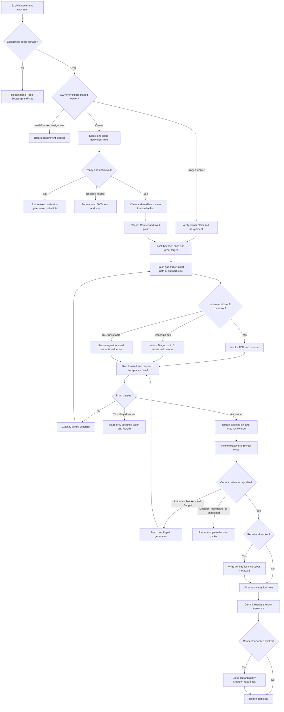

# Implement Runtime And Lock Design Synthesis

Status: exhaustive design reference for a future rewrite, not an executable
contract. No behavior in this document is runtime authority until it is
extracted, behaviorally validated, and promoted through the gates below.

Runtime authority remains in:

- `skills/custom/implement/SKILL.md` and
  `skills/custom/implement/agents/openai.yaml`;
- `docs/agents/engineering-contract.md`, the target repository's domain and
  tracker contracts, and the selected work item's authoritative source;
- `$tdd` and `$diagnosing-bugs` for their owned inner loops;
- `$review`, `$convergent-pr-review`, and
  `skills/custom/review/FINDING-CONTRACT.md` for fixed-snapshot judgment and
  finding admission;
- `$to-tickets` and `$repo-bootstrap` at their shaping and setup boundaries;
- `docs/synthesis/skill-context-relationships.md`, pack tests, behavior
  evaluations, and the installed mirror.

This note consolidates the historical Implement facet synthesis, the current
owner and staged-worker runtime, the bounded Repair and immutable-tree Lock
contracts, tracker closeout ordering, composition edges, validation evidence,
and the complete extraction plan for a later rewrite. It proposes one compact
singleton-delivery skill. It does not turn Implement into a ticket shaper, a
parallel campaign orchestrator, a reviewer, or a release/deployment tool.

## How To Read This Document

This synthesis has four authority layers:

1. **Orientation** states the outcome, selected shape, vocabulary, and
   explanatory end-to-end flow.
2. **Normative Design** is the sole authority for proposed runtime behavior and
   relationships.
3. **Evidence And Rationale** preserves source pressure, historical synthesis,
   deliberate non-changes, rejected options, and deferred questions without
   creating more runtime rules.
4. **Extraction And Verification** places and proves the design without
   redefining it.

This is the same authority pattern used by
`docs/synthesis/skills/parallel-implement.md` and
`docs/synthesis/skills/wayfinder.md`. The documents share a synthesis form,
not runtime behavior or ownership.

Change proposed behavior in Layer Two. Explain it in Layer Three. Place and
prove it in Layer Four. The Normative Home Index assigns every behavior one
home; diagrams, ownership rows, source bundles, and acceptance cases may point
to that home but never compete with it.

| Question | Owning section |
| --- | --- |
| What outcome and rewrite shape are selected? | [North Star](#north-star) and [Design Verdict](#design-verdict) |
| What does Implement deliver and explicitly not deliver? | [Delivery Boundary](#delivery-boundary) |
| What do the runtime leading words mean? | [Leading-Word Operation Model](#leading-word-operation-model) |
| Where does each proposed rule live? | [Normative Home Index](#normative-home-index) |
| How is one target selected and admitted? | [Invocation And Admission](#invocation-and-admission) and [Selection And Readiness](#selection-and-readiness) |
| What authority does owner or staged-worker mode carry? | [Authority And Mutation Boundary](#authority-and-mutation-boundary) |
| What must be fixed before implementation technique changes? | [Charter Contract](#charter-contract) and [Bounded Slice Contract](#bounded-slice-contract) |
| Which operation is legal now, and when is it complete? | [Normative State And Transition Contract](#normative-state-and-transition-contract) and [Operation And Completion Contracts](#operation-and-completion-contracts) |
| What does each snapshot or packet prove? | [Artifact Authority Contract](#artifact-authority-contract) |
| How do TDD, diagnosis, proof, and staged handoff compose? | [Patch And Proof Routing](#patch-and-proof-routing) and [Staged-Worker Contract](#staged-worker-contract) |
| Which review route applies and what may be repaired? | [Review Route And Acceptance](#review-route-and-acceptance) and [Finding Admission And Repair](#finding-admission-and-repair) |
| How do local and connector trackers enter Lock? | [Tracker Closeout, Lock, And Close](#tracker-closeout-lock-and-close) |
| What must every invocation return? | [Return Contract](#return-contract) |
| How does Implement relate to other skills? | [Relationship Ownership](#relationship-ownership) |
| What prior synthesis is incorporated? | [Facet Consolidation Register](#facet-consolidation-register) |
| Where should the future rewrite land? | [Runtime Ownership And Change Map](#runtime-ownership-and-change-map) |
| How will extraction and promotion be proved? | [Staged Extraction Plan](#staged-extraction-plan), [Behavior-Evaluation Protocol](#behavior-evaluation-protocol), and [Migration And Acceptance Matrix](#migration-and-acceptance-matrix) |

When another layer disagrees with Normative Design, correct that layer. Layer
Four owns placement, order, proof mechanics, and promotion; it never creates a
behavior absent from Layer Two.

# Layer One: Orientation

## North Star

Implement owns one outcome: deliver exactly one selected ready work item as one
proved, independently reviewed, immutable committed tree, with tracker
closeout reconciled at the repository-policy boundary.

The unit of delivery is a **singleton slice**, not a source document, queue,
parent graph, batch, opportunistic cleanup campaign, or release train. The
owner may choose implementation technique freely inside the accepted Charter
and bounded slice. Selection authority, user-owned commitments, proof,
independent review, Repair budgets, unrelated-work preservation, Lock identity,
and mutation read-back are gates. They are not exchanged for speed or apparent
completeness.

The desired normal path is short:

```text
Select -> Charter -> Bound -> Patch -> Prove -> Review
       -> Repair only when admitted and budgeted
       -> Lock -> Close
```

Tiny work may compress Bound, Patch, and Prove in narration. It may not skip
their gates. Staged-worker mode is deliberately shorter:

```text
Accept assignment -> Bound -> Patch -> Prove -> Stage -> Return
```

The staged worker never enters formal Review, Repair, Lock, commit, tracker
closeout, push, or release.

## Design Verdict

This table summarizes the selected rewrite. It points to Layer Two and creates
no independent rules.

| Stratum | Selected shape | Rewrite status |
| --- | --- | --- |
| Invocation | Explicit-only singleton delivery | Preserve |
| Roles | Owner is default; staged worker exists only through an explicit assignment with an accepting owner | Preserve and sharpen |
| Selection | One explicit target wins; otherwise use repository readiness and order; source collections remain context | Preserve the integrated Ready Issue Selection design |
| Charter | One immutable campaign Charter records commitments, proof, fixed point, review route, non-goals, and a finite Repair Budget | Preserve and make the single scope authority |
| Bounded slice | Lock one behavior path or honest support purpose, proof target, non-goals, expected edit surface, and focused evidence before production implementation | Selected for the future whole-skill design |
| Patch and proof | Use one tracer bullet, route settled red-testable behavior to TDD, uncertain bugs to Diagnosis, and classify proof feedback before widening | Preserve current composition and add bounded-slice pressure |
| Review | Capture one isolated immutable selected-work tree and invoke exactly one review owner | Preserve and sharpen dirty-index isolation |
| Repair | Validate the whole report, batch every eligible blocker into one generation, preserve the Charter, and stop on mixed authority or exhausted budget | Preserve |
| Lock and closeout | Allow only verified repo-local closeout metadata between accepted review tree and lock tree; commit exactly that tree once; apply connector closeout afterward with read-back | Preserve |
| Runtime surfaces | Keep the normal path in `SKILL.md` and use existing owner references; add no Implement-specific helper, ledger, or operations file initially | Selected, subject to behavior evaluation |
| Promotion | Structural proof plus repeated fresh-context control/candidate evaluation, then scoped mirror synchronization | Required before runtime promotion |

## Delivery Boundary

Implement begins after shaping has produced one ready singleton and ends at the
repository's implementation closeout boundary.

```text
settled source
  -> To Tickets or Triage
  -> one ready-for-agent item
  -> Implement
  -> one reviewed committed tree and tracker closeout
```

Implement owns:

- selection or verification of one ready item;
- tracker claim and release in owner mode;
- Source Trace, Charter, bounded slice, implementation, and proof assembly;
- selected-diff isolation, formal-review routing, finding validation, bounded
  Repair, immutable Lock, one commit, and closeout read-back; and
- the final implementation packet and exact next action when incomplete.

Implement does not own:

- turning a parent spec, PRD, list, queue, or broad source path into tickets;
- changing product intent, acceptance, public or data contracts, supported
  environments, security or privacy posture, dependency authority, or scope;
- multi-ticket orchestration, isolated lane campaigns, serial landing, or
  parent graph Release;
- review judgment, finding admission rules, causal diagnosis mechanics, or the
  TDD inner loop;
- push, deployment, PR creation, destructive Git, or unrelated external
  mutation without separate authority; or
- closing a parent spec or releasing downstream work outside the selected
  item's repository policy.

## Leading-Word Operation Model

The future runtime should use a compact vocabulary whose meanings stay stable:

| Leading word | Runtime meaning |
| --- | --- |
| **Select** | Resolve exactly one issue-equivalent ready item and its selection authority before later implementation work |
| **Charter** | Freeze outcome, acceptance, supported paths, commitment boundary, fixed point, proof, review route, non-goals, and Repair Budget |
| **Bound** | Lock one behavior path or support purpose, one proof target, one proof story, and the expected implementation surface |
| **Patch** | Implement inside the lock, using TDD or Diagnosis only at their owned triggers |
| **Prove** | Establish focused semantic evidence and the canonical acceptance required before review |
| **Review** | Judge one isolated immutable selected-work tree through exactly one review owner |
| **Repair** | Apply one complete batch of admitted automatic blockers under the unchanged Charter and remaining Budget |
| **Lock** | Prove the accepted review tree changed only by verified closeout metadata, then commit exactly the approved lock tree |
| **Close** | Apply connector closeout when applicable, read back every mutation, and return one terminal implementation packet |
| **Return** | Stop at the current authority boundary with complete evidence and one exact continuation |

**Reconcile** is universal. Refresh Git, index, worktree, selected source,
tracker, and every in-scope file after user interaction, worker return, or
external wait and before resumed mutation. Never continue from remembered
state.

## Delivery Vocabulary

Shared terms such as Source Trace, bounded slice, commitment boundary, proof
seam, semantic proof, fixed point, Charter, Repair generation, residual risk,
and Lock retain their meanings from the engineering contract. Implement adds
only these singleton-specific distinctions:

| Term | Meaning |
| --- | --- |
| **Issue-equivalent item** | One issue, URL, tracker item, path-backed ready slice, or explicit work item that already names one implementable outcome |
| **Owner** | The actor accountable for claim, scope, accepted worker output, proof, review route, Repair admission, Lock, commit, and closeout |
| **Staged worker** | An explicitly assigned actor that owns one bounded patch, focused proof, staging, and handoff to a named accepting owner |
| **Slice lock** | The Charter-compatible behavior path or support purpose, proof target, non-goals, expected edit surface, and focused evidence target that bound implementation |
| **Selected-work view** | An isolated index or worktree representation containing the fixed-point repository plus only the selected item's intended tracked changes |
| **Review tree** | The immutable Git tree written from the complete selected-work view before formal review |
| **Lock tree** | The immutable Git tree after acceptable review and verified repo-local closeout metadata, before the one commit |
| **Closeout metadata** | Repository-policy tracker state, final implementation note, claim release, and read-back evidence that do not alter reviewed implementation behavior |

## End-To-End Explanatory Flow



The diagram is explanatory. Selection, transition, completion, artifact,
Repair, and Lock tables below are authoritative.

# Layer Two: Normative Design

## Normative Home Index

| Concern | Sole normative home |
| --- | --- |
| Invocation, setup admission, and mode admission | [Invocation And Admission](#invocation-and-admission) |
| Target identity, selection authority, readiness, and no-substitution behavior | [Selection And Readiness](#selection-and-readiness) |
| Owner, staged-worker, Git, tracker, and external mutation authority | [Authority And Mutation Boundary](#authority-and-mutation-boundary) |
| Campaign commitments, fixed point, route, and Repair Budget | [Charter Contract](#charter-contract) |
| Dirty-state preservation, selected-work isolation, and refresh | [Work-State And Isolation Contract](#work-state-and-isolation-contract) |
| Slice lock, support work, scope pressure, coupled edits, and proof-feedback widening | [Bounded Slice Contract](#bounded-slice-contract) |
| Legal next operation from current facts | [Normative State And Transition Contract](#normative-state-and-transition-contract) |
| Operation entry, completion, and legal nonterminal result | [Operation And Completion Contracts](#operation-and-completion-contracts) |
| Context selection and progressive disclosure | [Runtime Context Loading Contract](#runtime-context-loading-contract) |
| Evidentiary role of every snapshot, packet, and read-back | [Artifact Authority Contract](#artifact-authority-contract) |
| TDD, Diagnosis, ordinary evidence, proof levels, and failure routing | [Patch And Proof Routing](#patch-and-proof-routing) |
| Staged-worker assignment, staging, and return | [Staged-Worker Contract](#staged-worker-contract) |
| Formal-review route and acceptable terminal judgment | [Review Route And Acceptance](#review-route-and-acceptance) |
| Finding validation, batching, Repair generations, and budget exhaustion | [Finding Admission And Repair](#finding-admission-and-repair) |
| Tracker ordering, tree comparison, commit identity, and final closeout | [Tracker Closeout, Lock, And Close](#tracker-closeout-lock-and-close) |
| Invocation output and required evidence | [Return Contract](#return-contract) |
| Cross-skill triggers and handoff boundaries | [Relationship Ownership](#relationship-ownership) |

## Invocation And Admission

Implement is explicit-only. Preserve
`policy.allow_implicit_invocation: false`. A direct user invocation, or a later
user-selected recommendation from To Tickets, Diagnosis, or Improve Codebase,
starts the skill. Another explicit-only skill may recommend Implement and stop;
it never invokes or continues Implement automatically.

Before mutation, admission requires:

1. `docs/agents/engineering-contract.md` and every required setup surface exist
   and are compatible; otherwise recommend `$repo-bootstrap` and stop;
2. exactly one issue-equivalent item is selected or the current invocation can
   select exactly one through repository policy;
3. the item passes readiness and blocker checks;
4. the mode is owner, or an explicit staged-worker assignment names the
   accepting owner, selected item, assignment boundary, and existing owner
   claim when tracker-backed; and
5. the selected work can be isolated without overwriting unrelated work.

Admission performs no source shaping, tracker repair, production edit, formal
review, commit, or external closeout. Tracker-backed selection may read the
tracker. Owner mutation begins only after the selected item is claimed and the
claim reads back. Staged-worker mutation begins only after it verifies the
owner's claim and accepted assignment.

## Selection And Readiness

Select exactly one issue-equivalent item before Charter or implementation
discovery.

### Candidate surface

- An explicit issue, URL, tracker item, path-backed ready slice, or explicit
  user-selected work item may be the target.
- A parent spec, PRD, queue, batch, list, project, or bare source path is
  selection context, not implementation scope by itself.
- A broad source may identify one already-ready item. If it identifies several
  ready items and repository policy does not select one, ask for the target.
- A candidate containing multiple independent outcomes, work items, or
  unrelated surfaces is unsliced. Detect the defect; do not split it inside
  Implement.

### Selection authority

- An explicit target is binding. Report a live dependency blocker or
  target-identity ambiguity locally and never silently substitute another
  ready item. Return unsliced or shaping-unready work to `$to-tickets` with the
  exact readiness defects; do not repair ticket shape inside Implement.
- Without a target, follow the repository's tracker, readiness, dependency,
  and ordering policy. When exactly one next item is determined, select it.
- When several items are eligible but repository order does not choose among
  them, ask for the target. Do not invent priority.
- When no ready item exists on the checked surface, stop and name that surface.

### Ready gate

Ready means all of these are true:

1. the prompt and Source Trace let a fresh implementation owner begin without
   repairing the item;
2. expected behavior and observable acceptance or done evidence are settled;
3. supported workflows, environments, and commitment boundaries are known
   enough to make a Charter;
4. blockers and dependency order permit work now;
5. at least one meaningful proof seam exists; and
6. when tracker-backed, the item satisfies the target repository's exact
   ready-for-agent and claim-eligibility rules.

Ask only when the missing fact would change the expected result, commitment
boundary, proof, or selected item. Name the fact and consequence. Selection
reads state; it never promotes, relabels, rewrites, reprioritizes, splits, or
otherwise makes work ready.

Record item identity, checked surface, selection authority, tracker
eligibility, readiness facts, and selection result before Charter, file
discovery, proof planning, or edits.

## Authority And Mutation Boundary

### Owner mode

Owner mode is the default. The invocation authorizes only:

- claiming the selected tracker-backed item and releasing that claim under
  repository policy;
- in-scope source, test, configuration, documentation, generated-artifact, and
  repo-local tracker changes required by the Charter;
- staging through an isolated selected-work view;
- admitted automatic Repair within the recorded Budget;
- exactly one commit of the approved lock tree; and
- connector-backed selected-item closeout under repository policy with
  Mutation read-back.

The owner alone accepts staged-worker output, chooses the formal-review route,
validates findings, authorizes Repair, decides residual-risk acceptability under
the Charter, owns Lock, commits, and applies closeout.

Push, deployment, PR creation, destructive Git, dependency installation,
secrets, protected-test access, permission changes outside the selected
Charter, and unrelated external mutation require separate authority.

### Staged-worker mode

Staged-worker mode exists only through an explicit assignment with a named
accepting owner. Its authority is limited to its assigned files or semantic
surface, focused proof, staging of that patch, and one handoff. It never claims
or mutates tracker state, changes the Charter, accepts adjacent work, invokes
formal review, repairs review findings, commits, pushes, closes, or releases.

### Commitment boundary

Technique, local structure, tools, and edit sequence are agent-owned inside the
Charter and slice lock. A change to product intent, acceptance, user-visible
behavior, a public or data contract, security or privacy posture, dependency
authority, supported environment, migration or rollback commitment, or agreed
scope requires caller judgment before mutation. Neither a test failure, review
finding, cleaner design, nor worker suggestion grants that authority.

## Charter Contract

The owner records one Charter from the selected item and fresh Source Trace:

```text
Selected item and source identity:
Outcome:
Acceptance criteria and observable done evidence:
Supported workflows and environments:
Commitment boundary and reserved decisions:
Required proof seams and canonical validation:
Bounded-slice constraints and expected scope fence:
Non-goals:
Fixed point and starting work state:
Review route and trigger evidence:
Repair Budget:
Tracker policy and closeout mode:
External authorities and exclusions:
```

Default the Repair Budget to two generations unless the caller explicitly sets
a smaller nonnegative bound. Two is the maximum for this design; a larger
campaign requires a separately designed and evaluated contract. Implement
never extends its own Budget.

The Charter is immutable for the campaign. Technique and the exact local edit
surface may refine within it. Before the initial review, the owner may escalate
the resolved review route when the actual diff satisfies a Charter-recorded
high-risk trigger; record that resolution and keep the same route for every
successor review. This is application of the locked review rule, not a Charter
change. A changed commitment or scope produces a decision-required Return; it
does not silently revise the Charter. Every initial review and remediation
review receives the same Charter.

A staged worker consumes the owner's relevant Charter fields as assignment
authority. It may return a contradiction or missing field; it cannot complete,
replace, or widen the Charter itself.

## Work-State And Isolation Contract

Before edits or dispatch, capture:

- fixed-point commit or caller-supplied baseline;
- current branch and worktree identity;
- `git status --short`;
- user index tree and staged diff identity;
- unstaged and in-scope untracked paths;
- selected-item source and tracker claim state; and
- pre-existing unrelated work that must remain untouched.

Preserve unrelated dirty and staged work. Never unstage, rewrite, discard,
commit, or absorb it to make the selected diff convenient.

Before formal review, construct one **selected-work view** whose base is the
fixed-point repository state plus the complete selected-item diff and no
unrelated hunks. Use an isolated worktree, temporary index, or another
repo-safe mechanism justified by current state. Preserve the user's original
index and worktree. If the selected work cannot be isolated without ambiguous
or destructive state changes, Return blocked with the exact collision.

After user feedback, a staged-worker return, or an external wait, refresh Git
and tracker state and reread every in-scope file before further mutation.
Reconcile intervening edits against the Charter and slice lock. Earlier status,
diff, test, or memory is not current evidence.

## Bounded Slice Contract

Before edits intended to implement the selected result, lock:

```text
Behavior path or support purpose:
Acceptance and Charter link:
Highest meaningful proof target:
One proof story:
Non-goals:
Expected edit surface:
Focused check or evidence target:
Required coupled surfaces:
```

Read-only discovery, disposable `.tmp/` work, throwaway repros, and the
engineering contract's tiny reversible Explore probe may resolve slice-lock or
proof uncertainty. When the edit surface is unknown, name the exact discovery
question or evidence action, find the real seam, and update the lock before
production implementation. Discovery does not itself complete the lock.

For support work, name the exact unblocker or risk and the validation signal
that proves it. No support purpose and validation, no support slice.

For behavior work, implement one production-shaped tracer-bullet path before
breadth unless acceptance or proof requires breadth. For support work, change
only what proves the named unblocker or risk.

The active implementation diff remains one slice only while it is one concept
tied to one proof story. Apply scope pressure whenever file spread, a second
concept, optional variants, a broad refactor, or proof failure appears:

- every remaining changed file, module, or artifact needs an in-scope reason
  tied to acceptance, the proof target, the proof story, or a named required
  coupled edit;
- a required coupled edit must preserve the named proof, satisfy named
  acceptance, or keep a named affected check, command, generated artifact, or
  build path valid;
- refactor only when behavior-preserving, protected, in-scope, and needed to
  preserve or prove this slice; and
- optional cleanup, general maintainability work, independent outcomes, and
  nonblocking adjacent failures become follow-up evidence rather than diff
  growth.

Disposable scratch is not implementation spread while it remains throwaway.
Before Return or Lock, delete it or promote it only with a named in-scope proof
reason and the required review/staging treatment.

When focused proof fails, classify it before widening:

| Class | Required branch |
| --- | --- |
| `in-slice` | Fix inside the lock, rerun focused proof, and retain the same proof story |
| `changed-commitment` | Stop at the commitment boundary with one decision packet |
| `adjacent` | Fix only when the locked slice cannot be proved without the smallest local fix and no commitment changes; otherwise follow up or block |
| `environment/tooling` | Apply the same proof-blocking and commitment tests as adjacent work; do not launder environment repair into the slice |

Fixed-snapshot review findings do not use this table; Finding Admission And
Repair owns them.

The slice lock is complete when its proof target is checkable, its expected
edit surface is known, and any discovery result has been folded back into the
lock. Scope pressure is complete when every remaining artifact has one named
in-scope reason and the active diff still tells one proof story.

## Normative State And Transition Contract

This table is the sole proposed authority for the next legal operation. It
derives the operation from fresh facts and introduces no persisted lifecycle,
ledger, or helper schema.

| Current evidence | Legal operation or Return | Illegal shortcut |
| --- | --- | --- |
| Required setup missing or incompatible | Recommend `$repo-bootstrap` and stop | Editing setup opportunistically or starting implementation |
| Staged-worker assignment or accepting owner is absent | Return assignment blocker | Treating delegation or user mention as worker authority |
| No issue-equivalent target selected | **Select** one through explicit or repo-visible authority; ask when eligible items remain unselected; recommend `$to-tickets` only when the work is unsliced or shaping-unready | Treating a parent source as the slice, selecting by taste, or exporting ordinary selection ambiguity |
| Explicit target is unready, blocked, ambiguous, or ineligible | Return the exact gate on that target | Substituting another item or mutating readiness state |
| Owner target is tracker-backed and claim is absent | Acquire and read back the claim | Editing or dispatching first |
| Selection is admitted but Charter is incomplete | **Charter** | Using issue text or a review prompt as an implicit Charter |
| Charter exists but slice lock is incomplete | **Bound** through discovery or a tiny reversible Explore probe | Production implementation without a checkable proof target |
| Slice lock exists and selected acceptance remains unproved | **Patch** and **Prove** | Broadening because work or failures are nearby |
| Staged worker's assigned patch is proved and isolated | Stage assigned patch and **Return** | Entering formal Review, committing, or mutating tracker state |
| Owner proof passes but immutable selected-work identity is absent | Isolate the selected diff and write the **review tree** | Reviewing a moving worktree or mixed index |
| Review is absent, stale, incomplete, or unacceptable | **Review**, then Return or one eligible **Repair** generation | Locking, partial repair, or changing the snapshot under review |
| Current review reports only admitted automatic blockers and Budget remains | **Repair** one complete batch, prove it, write one successor review tree, and use the same review route | Fixing an easy subset, reopening untouched surfaces, or self-extending Budget |
| Current review contains a decision-required blocker, incomplete evidence, unacceptable residual, or exhausted Budget | Return one complete decision packet | Partial automatic repair before surfacing the decision |
| Current review is acceptable and repo-local tracker closeout applies | Apply verified local closeout metadata, stage it in the selected-work view, then enter **Lock** | Committing code before required tracked closeout or changing behavior after review |
| Current review is acceptable and no repo-local closeout remains | **Lock** | Connector mutation, commit, or Close before tree identity passes |
| Lock tree is committed and connector-backed closeout applies | **Close** through repository policy and Mutation read-back | Reporting done from an attempted mutation or stale observation |
| Committed tree and all applicable closeout read-backs pass | Return `complete` | Continuing into push, deployment, PR creation, or another item |

## Operation And Completion Contracts

This table alone decides when an operation may end. A later visible operation
never weakens the current completion gate.

| Operation | Enter when | Complete when | Legal nonterminal Return |
| --- | --- | --- | --- |
| **Select** | Admission has compatible setup and needs one target | Exactly one item, checked surface, authority, readiness facts, tracker eligibility, and selection result are recorded; or one exact selection gate is returned | Ask for one target when selection remains local, return a blocked/unready target, or recommend To Tickets only for unsliced or shaping-unready work |
| **Charter** | Owner has one admitted item and claim when required | Every Charter field is resolved or one named commitment decision blocks it | Decision-required or blocked packet with no production implementation |
| **Bound** | Charter is fixed but implementation seam or proof boundary is not | Behavior path or support purpose, proof target/story, non-goals, expected edit surface, focused evidence, and required coupling are checkable | Exact discovery, proof-seam, or commitment blocker |
| **Patch / Prove** | Slice lock permits implementation | Selected acceptance passes through the highest meaningful supported seam; required nearby and canonical checks run or skips become residual risk; scope pressure and scratch cleanup pass | Decision-required, proof blocker, or bounded residual-risk packet |
| **Stage / Return** | Explicit staged worker has a proved assigned patch | Only assigned changes are staged; cached diff check passes; original index obligations and unrelated work are preserved; handoff packet is complete | Worker blocker or needs-feedback packet; no owner completion claim |
| **Review** | Owner has one immutable review tree and complete Charter packet | Exactly one review route returns a complete current-snapshot decision and every finding classification is available to the owner | Incomplete, blocked, or decision packet; never mutation authority by itself |
| **Repair** | Whole report contains a nonempty complete eligible automatic blocker set and Budget remains | Every carried ID is patched in one batch, required and regression proof pass, selected work is restaged, and one successor review tree is captured | Decision-required, exhausted, proof-blocked, or isolation-blocked packet |
| **Lock** | Current review is acceptable and required repo-local closeout is staged | Review-to-lock delta contains only verified closeout metadata; selected index tree equals lock tree; cached diff check passes; one commit succeeds; `HEAD^{tree}` equals lock tree | Exact mismatch, missing metadata, or commit blocker; behavior delta returns to Review |
| **Close** | Approved lock tree is committed | Connector policy mutation, claim release, comment/state/closure, affected dependency observation, and Mutation read-back pass; final work state is reconciled | Partial-mutation blocker with applied, failed, and safest recovery actions |

## Runtime Context Loading Contract

Keep the universal control plane in `SKILL.md`. Load branch context only when
its trigger fires.

| Trigger | Required context | Do not preload or absorb |
| --- | --- | --- |
| Every invocation | Implement outcome, role boundary, leading-word spine, transition selection, Return, completion, and `docs/agents/engineering-contract.md` | All tracker providers, review internals, TDD references, diagnosis procedure, or unrelated synthesis context |
| Tracker-backed selection, claim, or closeout | Target repository's `docs/agents/issue-tracker.md` and exact current item | Tracker template for another provider or generic provider mechanics in `SKILL.md` |
| Domain language or durable decision is touched | Target repository's `docs/agents/domain.md` and routed domain source | Unrelated contexts or Domain Modeling procedure unless its trigger fires |
| Red-testable behavior | Invoke `$tdd`; supply Charter, slice, seam, oracle, and command | Copy TDD's RED/GREEN/REFACTOR procedure into Implement |
| Uncertain bug | Invoke `$diagnosing-bugs` in fix mode; supply caller, authority, Source Trace, and symptom evidence | Guess a cause or copy diagnosis procedure into Implement |
| Formal review | Invoke exactly one review owner with the immutable tree, Charter, mode, fixed point, and Source Trace | Reviewer internals, peer findings, or both review skills |
| Review report returned | Read `skills/custom/review/FINDING-CONTRACT.md` before owner classification and Repair | Finding procedure before review or advisory mechanics without an enabled contract |
| Setup incompatibility | Recommend `$repo-bootstrap` and stop | Bootstrap procedure or setup mutation inside Implement |

Add no Implement-specific `OPERATIONS.md`, helper, schema, or ledger initially.
The singleton flow and two role branches fit the main semantic surface. Create a
disclosed support surface only after a sharp completion criterion still shows
measured sprawl, unreliable branch loading, or premature completion in fresh
behavior evaluation.

## Artifact Authority Contract

| Artifact or evidence | Owns or proves | Must not substitute for |
| --- | --- | --- |
| Selected item and Source Trace | Originating commitments, acceptance, and source precedence | Readiness, Charter completion, or proof |
| Selection record | One target, checked surface, authority, eligibility, readiness facts, and no-substitution result | Tracker claim, Charter, or implementation authority |
| Tracker claim read-back | Owner concurrency guard for one tracker-backed item | Product authority, worker acceptance, proof, or completion |
| Charter | Immutable campaign commitments, fixed point, review route, non-goals, and Budget | Slice lock detail, reviewer judgment, or external success |
| Slice lock | One implementation concept, proof story, expected edit surface, and local scope pressure | A changed Charter, acceptance waiver, or broad cleanup authority |
| Focused proof packet | Semantic evidence for the selected behavior or support purpose | Canonical acceptance, independent review, Lock, or skipped-check evidence |
| Staged-worker handoff | Assigned patch, focused proof, staged scope, skips, and risks returned to the owner | Owner acceptance, tracker mutation, formal review, commit, or completion |
| Selected-work view | Complete selected-item changes isolated from unrelated work | The user's live index, immutable review identity, or approval |
| Review tree | Exact immutable tree judged by the review owner | Current worktree equality, finding admission, Repair authority, or lock identity |
| Review report | Terminal reviewer evidence and classification candidates for one immutable tree | Mutation authority, owner admission, successor review, or acceptable residual-risk decision |
| Repair record | Carried IDs, generation, delta, proof, and successor tree under the original Charter | New scope, new hardening lenses, or Budget extension |
| Repo-local closeout read-back | Verified tracked closeout metadata applied before Lock | Reviewed implementation behavior or connector success |
| Lock tree | Accepted implementation tree plus only verified closeout metadata | Commit success or external closeout |
| Commit SHA and `HEAD^{tree}` | The approved lock tree became one commit on the current branch | Push, deployment, PR creation, or connector mutation |
| Connector mutation read-back | Observed selected-item closeout, claim release, and affected frontier under repository policy | Code-tree identity, semantic proof, or another unobserved external action |

When artifacts disagree, refresh the underlying Git, file, tracker, or remote
state. Never edit a projection or narrative packet to manufacture agreement.

## Patch And Proof Routing

Inside the Charter and slice lock, the owner or staged worker chooses technique
without asking.

### TDD and diagnosis

- Invoke `$tdd` for red-testable new behavior.
- For a bug, invoke `$tdd` only when expected behavior, exact symptom, cause,
  and a trusted red-capable reproduction are already known.
- When any of those bug facts is uncertain, invoke `$diagnosing-bugs` in fix
  mode. Resume Implement only after the causal packet supplies regression proof
  or an explicit seam gap.
- When RED is unsuitable, name the reason and use the strongest focused
  semantic evidence through the highest meaningful supported seam.

Implement supplies caller authority and receives the callee packet. The callee
never inherits review, staging, commit, tracker, Close, or Charter-change
authority.

### Proof levels

1. **Slice proof:** the smallest meaningful caller-facing evidence for the
   tracer bullet or support purpose.
2. **Affected proof:** the nearest relevant checks covering coupled behavior,
   state branches, generated artifacts, or integration touched by the slice.
3. **Canonical acceptance:** repository-required validation proportionate to
   the selected item before formal review.

Use the state-boundary matrix whenever correctness depends on cached,
persisted, resumed, grouped, projected, or session-scoped state. Prove new
validators or enforcement through clean pass, controlled violation failure,
restoration, and final pass. A focused pass proves only its slice; record every
broader skip and residual risk.

Run fresh proof after any source, test, generated-artifact, local closeout, or
Repair change that can affect the claim. Earlier green output is not current
evidence. When meaningful execution is unsafe or blocked, use the strongest
safe structural proxy, name every unrun behavior, and never call it semantic or
runtime proof.

## Staged-Worker Contract

The assignment packet must name:

```text
Accepting owner:
Selected item and Charter pointer:
Fixed point and worktree:
Assigned semantic and file scope:
Exclusions and unrelated state:
Acceptance and highest meaningful proof seam:
Focused proof command:
Staging boundary:
Return path:
```

The staged worker verifies the owner claim when tracker-backed, refreshes the
assignment state, locks its bounded slice, patches and proves only the
assignment, and stages only its patch. It runs `git diff --cached --check`
against its assigned view and returns:

```text
Mode: staged worker
Status: done | needs-feedback | blocker
Selected item and accepting owner:
Staged diff summary and paths:
Focused proof and logs:
Skipped checks and residual risk:
Unrelated dirty or staged files:
Current worktree and index state:
Exact owner action:
```

`done` means the staged handoff is complete, not that the selected item is
implemented. Only owner inspection and acceptance transfers the patch into the
owner's selected-work view.

## Review Route And Acceptance

The owner runs canonical acceptance, reconciles scope pressure, removes or
promotes scratch, and captures one immutable review tree before invocation.

Choose exactly one route for the campaign:

- `$review` for an ordinary singleton diff;
- `$convergent-pr-review` for a local PR or a high-risk diff involving a public
  interface, security or permission behavior, migration or rollback,
  cross-cutting shared plumbing, CI or release configuration, a data contract,
  or another repository-defined high-risk trigger.

Do not invoke both as duplicate gates. If `$review` hands the target to
`$convergent-pr-review`, that one handoff becomes the campaign route and Review
does not resume independently.

Every initial invocation receives:

```text
Spec required: yes
Review mode: initial
Charter and selected item
Source Trace and acceptance
Fixed-point SHA
Review-tree SHA and exact diff
Validation, skips, and residual risk
```

Review is acceptable only when it is complete, current for the supplied tree,
and has no admitted blocker. `pass with residual risk` is acceptable
automatically only when every residual is nonblocking under the Charter and
repository policy requires no separate user acceptance. A missing or
conflicting required Spec, uncovered required lens, drift, unavailable selected
route, incomplete verification, or admitted blocker keeps Lock closed.

Reviewers remain read-only and terminal. A report grants no mutation or
successor-snapshot authority.

## Finding Admission And Repair

After every review report, read the shared Finding Contract and independently
validate the complete report against Anchor, Reach, Evidence, Impact, and
Proportion before editing.

Repair may continue automatically only when:

1. every blocking finding is admitted;
2. every blocker is `automatic-in-scope`;
3. the complete batch preserves the original Charter;
4. each finding has bounded required proof;
5. no decision-required, incomplete, disputed-blocking, or unacceptable
   not-checked evidence remains; and
6. at least one Repair generation remains.

If any blocker fails that set, return the whole decision packet before fixing
any subset.

One Repair generation batches every eligible blocker ID. Patch only those
findings and regressions reachable through their delta or remaining original
acceptance. Run each required proof plus regression and canonical acceptance,
reapply scope pressure, restage the selected work, and capture one successor
review tree.

Invoke the same review route with:

```text
Spec required: yes
Review mode: remediation
Original Charter
Generation number and remaining Budget
Prior review tree and carried finding IDs
Repair delta and proof
Successor review tree
Remaining original acceptance
```

The successor review may judge carried IDs, regressions introduced by the
Repair delta, and remaining original acceptance. It may not reopen untouched
surfaces for new optional hardening.

Stop when the current review is acceptable, caller judgment is required, proof
or isolation is blocked, or the Budget is exhausted. An admitted blocker after
the last generation returns the complete decision packet; it never reaches
Lock.

## Tracker Closeout, Lock, And Close

After acceptable review, prepare the final closeout packet:

```text
Selected item and outcome:
Approved review tree and review result:
Implemented behavior and deliberate non-changes:
Validation and proof:
Skipped checks and residual risk:
Repair generations:
Tracker mutations required by policy:
```

### Repo-local tracker

When the tracker is a tracked repo-local file, append the final implementation
note, move the item to `implemented`, release its claim, apply Mutation
read-back, and stage that file in the selected-work view before Lock. The
review-tree-to-lock-tree delta may contain only this verified closeout metadata.
Any implementation, acceptance, dependency, tracker-semantics, behavior, or
contract delta returns to Review.

### Lock

1. Write the lock tree from the complete selected-work view.
2. Inspect `git diff <review-tree> <lock-tree>` and classify every line as
   verified closeout metadata or an illegal post-review delta.
3. Require the selected-work index tree to equal the lock tree.
4. Run `git diff --cached --check` in that view.
5. Reconcile the live target and preserve unrelated work.
6. Commit the approved lock tree exactly once on the current branch.
7. Require `HEAD^{tree}` to equal the lock tree.

A mismatch blocks Close. Never amend or create a second implementation commit
inside the same invocation merely to repair Lock identity; return the exact
state unless the safe correction is still inside the uncommitted Lock step.

### Connector-backed tracker

After the approved tree is committed, add the commit SHA to the closeout
packet. Apply only repository-policy mutations to the selected item: final
comment or note, implemented state or label, claim release, closure when policy
requires it, and affected dependency/frontier observation. Refetch and verify
every intended field. A partial mutation is blocked and reports applied
operations, failed operations, current observed state, and the safest recovery
action.

Close does not imply push, deployment, PR creation, parent closure, or another
ticket. Those require their own authority and owner.

## Return Contract

Every invocation returns exactly one form:

| Return | Use when | Required content |
| --- | --- | --- |
| Setup precondition | Required setup is absent or incompatible | Missing surface, evidence, `$repo-bootstrap` recommendation, and no mutation |
| Selection gate | No item is ready, the explicit item has a live dependency blocker, target or order identity is ambiguous, or work is unsliced or shaping-unready | Checked surface, target or candidates, failed readiness fact, and no-substitution evidence; use a local question or blocker for target/order ambiguity and an exact `$to-tickets` repair return only for unsliced or shaping-unready work |
| Assignment blocker | Staged-worker authority or accepting owner is incomplete | Missing assignment field, current state, and required owner action |
| Staged handoff | The explicit staged worker completed or cannot complete its bounded assignment | The complete staged-worker packet; never implementation completion |
| Decision required | Charter, commitment, review, Repair, residual risk, or Budget needs caller judgment | Immutable target, complete decision set, options, consequences, and exact continuation |
| Blocked | Safe progress requires a named state, evidence, access, isolation, proof, commit, or mutation change | Current mode, selected item, preserved work state, blocker owner, observable release condition, and exact resume operation |
| Complete | Owner Lock and applicable Close both pass | Mode, selected item, commit SHA, approved trees, review result, Repair count, validation, skips, residual risk, tracker read-back or `not applicable`, current Git state, and deliberate next boundary |

Narrative progress, a passing focused test, staged-worker `done`, a review
report, a prepared closeout packet, a commit attempt, or an external mutation
attempt alone is never complete.

## Relationship Ownership

| Caller | Verb | Callee | Trigger and return boundary |
| --- | --- | --- | --- |
| Direct user | Invoke | `$implement` | The user selects singleton delivery; Implement still applies Admission |
| `$to-tickets` | Recommend and stop | `$implement` | The verified To Tickets next-action decision selects one serial ticket; the user starts Implement later |
| `$diagnosing-bugs` | Recommend and stop | `$implement` | Standalone diagnosis proved a cause and production work now needs one implementation owner |
| `$improve-codebase` | Recommend and stop | `$implement` | One selected Concentrate candidate is a ready singleton slice |
| `$implement` | Invoke | `$tdd` | New behavior is red-testable, or every required bug fact and trusted red-capable reproduction is already known |
| `$implement` | Invoke | `$diagnosing-bugs` | A bug's expected behavior, exact symptom, cause, or trusted red-capable reproduction is uncertain; return to the same Implement owner |
| `$implement` | Invoke | `$review` | One ordinary immutable review or remediation tree needs fixed-snapshot judgment |
| `$implement` | Invoke | `$convergent-pr-review` | One local PR or high-risk immutable review or remediation tree needs independent convergence |
| `$implement` | Recommend and stop | `$to-tickets` | The supplied work is unsliced or shaping-unready; return the exact readiness defects |
| `$implement` | Recommend and stop | `$repo-bootstrap` | A required setup surface is missing or incompatible |

Implement has no execution relationship to Wayfinder, To Spec, Parallel
Implement, Audit Codebase, Improve Codebase, Simplify Code, Domain Modeling, or
deployment during singleton delivery. It does not upgrade itself into Parallel
Implement when more work appears. A staged worker never invokes formal review
or another explicit-only delivery owner.

# Layer Three: Evidence And Rationale

## Current Runtime Evidence

The current runtime already establishes several strong contracts that the
rewrite must preserve:

- explicit-only invocation and exactly one selected item;
- owner versus explicit staged-worker authority;
- setup and tracker-aware selection gates;
- immutable Charter and default two-generation Repair Budget;
- TDD versus Diagnosis routing;
- isolated staged proof and fixed-snapshot review;
- exactly one ordinary or high-risk review route;
- shared finding admission, complete-batch automatic Repair, and successor
  remediation review;
- repo-local closeout inside the lock tree;
- review-tree-to-lock-tree inspection, one commit, and tree-identity proof; and
- connector closeout only after commit with Mutation read-back.

Structural tests currently protect the role spines, explicit invocation,
review/Lock vocabulary, local closeout ordering, relationship edges, diagnosis
return ownership, and tree-delta gate. Core behavior fixtures cover Implement
Lock, high-risk review routing, selection authority, local-tracker visibility,
automatic bounded Repair, interaction refresh, fresh proof, and stewardship.

The canonical and installed Implement skill files currently match. That parity
is evidence about the present runtime only; a future rewrite must repeat scoped
validation and synchronization rather than inheriting the observation.

## Why Selection Remains Read-Only

Selection must answer one question: which already-ready singleton is
authorized now? Allowing selection to repair an issue, promote a label, split a
source, or reprioritize a queue would let Implement create its own authority.
The explicit-target no-substitution rule is equally important: a blocked named
item is a gate report, not permission to choose a more convenient item.

The prior selection synthesis correctly separated local readiness from full
implementation planning. The rewrite retains that separation. Selection needs
enough evidence to know a fresh owner can begin and that observable completion
exists; Charter and Bound own the deeper implementation contract.

## Why Charter And Slice Lock Are Separate

The Charter freezes caller-owned commitments and campaign-wide review/Repair
authority. The slice lock bounds agent-owned implementation technique within
those commitments. Combining them would either make the Charter too detailed
and brittle or let implementation drift while claiming the broad item still
fits.

The bounded-slice facet exposed the missing middle in the current concise
runtime: "keep changes inside the selected item" is necessary but does not
force one proof story, honest support work, named coupling, or classification
before proof failure widens the diff. The proposed Bound operation adds those
gates without importing TDD, diagnosis, review, or refactor procedure.

## Why Owner And Staged Worker Stay Distinct

The staged-worker branch is a bounded patch-return interface, not a smaller
owner. That distinction protects tracker concurrency, review independence,
commit identity, and closeout. An accepting owner must exist before work begins
because staged output has no authority to accept itself.

The branch remains inside Implement because it shares singleton selection,
Charter, slice, and proof semantics. It should not absorb Parallel Implement's
lane commits, graph frontier, ledger, integration checkout, or Release model.

## Why Trees Form The Lock Chain

The fixed point proves where the selected campaign began. The review tree
proves what independent review judged. The lock tree permits one narrow class
of post-review change: verified tracked closeout metadata required to make a
repo-local tracker truthful in the same commit. `HEAD^{tree}` then proves the
commit contains exactly that approved lock tree.

This chain prevents three common false completions:

- reviewing a moving or mixed worktree;
- changing implementation after acceptance without successor review; and
- committing a tree different from the one whose closeout evidence was
  approved.

Dirty-index isolation is a rewrite requirement because "preserve unrelated
staged work" and "review only the selected diff" must both hold. The synthesis
selects the semantic outcome but deliberately leaves temporary-index versus
isolated-worktree mechanics to extraction and repository evidence.

## Why Local And Connector Closeout Split

A repo-local tracker file is part of the repository tree. Its final status,
implementation note, and claim release must therefore enter the lock tree and
the one commit. A hosted connector mutation cannot enter a Git tree and often
needs the final commit SHA; it follows the commit and is complete only after
read-back.

The split is provider-neutral but not order-neutral. Treating all closeout as
post-commit would leave Local Markdown stale. Treating all closeout as
pre-commit would let a hosted issue claim completion before the approved tree
exists.

## Why Repair Is Caller-Owned And Finite

Reviewers supply read-only evidence. The owner validates the complete report
against the shared Finding Contract because severity alone does not grant
mutation. Complete-batch admission prevents the owner from fixing easy
automatic findings before revealing a decision-required blocker. The immutable
Charter prevents remediation from becoming a redesign. The finite Budget
prevents unbounded review-fix cycling and forces an exact caller decision when
the current approach cannot converge within its agreed cost.

## Deliberate Non-Changes

- Keep Implement explicit-only and singleton-only.
- Keep the current one-commit boundary; no automatic push, PR, deploy, or
  release.
- Keep owner mode as default and staged-worker mode explicit.
- Keep tracker shaping, readiness repair, and parent decomposition with their
  existing owners.
- Keep Git and tracker state fresh and preserve unrelated dirty work.
- Keep TDD, Diagnosis, Review, Convergent PR Review, and Finding Contract as
  separate owners.
- Keep formal reviewers read-only and terminal.
- Keep exactly one formal-review route per campaign.
- Keep the Repair default at two generations unless the caller changes it.
- Keep repo-local closeout before Lock and connector closeout after commit.
- Keep `pass with residual risk` subject to Charter and repository policy.
- Keep `.tmp/` disposable and `.scratch/` durable under the engineering
  contract.
- Keep proof fresh, caller-facing, proportionate, and explicit about skips.
- Keep no direct Implement-to-Parallel Implement transition.
- Keep no Implement-specific ledger, state file, helper, or schema.
- Keep installed-mirror synchronization outside the design-writing turn and
  behind canonical validation.

## Rejected Or Deferred Options

| Option | Status | Reason or revisit trigger |
| --- | --- | --- |
| Implement a whole PRD, parent spec, queue, or batch | Rejected | Violates singleton selection and shaping ownership |
| Substitute another ready item when the explicit target is blocked | Rejected | Invents selection authority |
| Numeric LOC or file-count slice limit | Rejected | Semantic ownership and proof story are the meaningful bound |
| Automatic conversion to Parallel Implement | Rejected | Changes the user-selected explicit owner and campaign model |
| Worker-owned tracker claim, review, commit, or closeout | Rejected | Collapses the owner boundary |
| Reviewer-started or reviewer-authorized Repair | Rejected | Review evidence is terminal and read-only |
| Repair only the easy automatic subset of a mixed report | Rejected | Hides the actual decision boundary |
| Unbounded review-repair loop | Rejected | Violates the recorded Budget and finite completion |
| One scalar completion or confidence score | Rejected | Hides gate failures and residual risk |
| Implement-specific event ledger or lifecycle helper | Deferred | Revisit only after repeated singleton recovery failures show narrative state is insufficient |
| Implement-specific `OPERATIONS.md` | Deferred | Revisit only after fresh-context evaluation proves SKILL.md sprawl or premature completion after sharper local gates |
| Automatic worktree or temporary-index helper | Deferred | First prove the semantic isolation requirement with repo-native mechanisms and measure repeated operator friction |
| Passive time/token telemetry | Deferred | Useful only if measurement cost is negligible and changes a delivery decision |
| Larger default Repair Budget | Deferred | Requires evidence that two generations regularly block safe convergence without encouraging churn |
| Staged-worker commit instead of staged patch | Rejected for this skill | A bounded commit is Parallel Implement's lane-worker contract |

## Residual Design Questions

These are extraction choices, not missing runtime behavior:

1. Which repo-safe selected-work isolation mechanism should the future wording
   recommend by default on a dirty index: isolated worktree, temporary index,
   or evidence-driven choice?
2. Can the complete bounded-slice contract remain legible in `SKILL.md` after
   pruning, or does behavior evaluation show a justified disclosed reference?
3. Do repository-defined high-risk triggers need one shared external reference
   beyond the current evaluation vocabulary?
4. Which exact control scenario best demonstrates the current runtime's weak
   one-proof-story pressure without manufacturing a failure?
5. Does the future installed environment expose enough stable telemetry to
   evaluate context or time efficiency without adding agent narration?

None blocks this synthesis. Questions 1 through 4 must be settled or recorded
as evidence-backed non-changes before promotion of the corresponding source
bundle.

# Layer Four: Extraction And Verification

Extract every selected behavior once. Keep universal authority, operation
selection, completion, and Return in the main skill. Use existing callee and
tracker references through sharp triggers. Do not copy provider mechanics,
review procedures, or historical rationale into runtime.

## Proposed Runtime Semantic Surface

The eventual `SKILL.md` should read approximately as:

```text
Outcome and explicit-only singleton boundary
Owner versus explicit staged-worker authority
Owner and worker leading-word spines
Invocation and setup admission
Select
Charter
Bound
Current facts -> legal next operation
Patch and Prove -> TDD / Diagnosis triggers
Staged-worker Return branch
Selected-work isolation and review-tree capture
Review route
Finding admission and Repair loop
Local closeout -> Lock -> one commit -> connector Close
Universal Reconcile
Return forms
Completion
```

This is a semantic target, not final wording. The runtime should favor compact
tables or blunt gates only where they change behavior. Exact provider
procedures, review internals, TDD mechanics, diagnosis mechanics, research
history, and evaluation protocol stay outside `SKILL.md`.

## Runtime Ownership And Change Map

The `Must not absorb` column is part of the design.

| Surface | Owns | Proposed delta | Must not absorb |
| --- | --- | --- | --- |
| `skills/custom/implement/SKILL.md` | Universal singleton delivery, roles, selection, Charter, Bound, operation choice, routing, Review/Repair/Lock/Close, Return, completion | Reorder around the semantic surface; integrate the accepted bounded-slice behavior; sharpen selected-work isolation and operation completion; prune duplicate prose | Provider mechanics, callee procedure, evaluation protocol, source history, parallel campaign state, or helper schemas |
| `skills/custom/implement/agents/openai.yaml` | Explicit invocation policy and human-facing prompt | Preserve `allow_implicit_invocation: false`; align description and prompt with one ready item, owner/staged branch, bounded Repair, one commit, and closeout | Runtime procedure, high-risk taxonomy detail, or validation claims |
| `docs/agents/engineering-contract.md` | Shared engineering language, proof discipline, refresh, stewardship, state matrix, and Lock | No Implement-specific rewrite unless extraction finds a genuinely shared missing contract | Singleton selection, Repair loop, tracker closeout, or role procedure |
| Target `docs/agents/issue-tracker.md` and Repo Bootstrap tracker templates | Ready query, claim/release, closeout, provider mutation, and read-back mappings | Verify Implement assumptions and provider equivalence; change only through Repo Bootstrap synthesis if a reusable mapping gap exists | Implement selection semantics, Charter, Repair, tree identity, or completion |
| `skills/custom/review/FINDING-CONTRACT.md` | Finding admissibility, classification, severity, and remediation bound | Preserve as the sole finding interface; change only through Review-owner synthesis if a real gap appears | Implement Budget, mutation authority, commit, or closeout |
| `skills/custom/review/SKILL.md` | Ordinary immutable review | No expected process change; verify packet compatibility | Repair, successor capture, or Implement completion |
| `skills/custom/convergent-pr-review/SKILL.md` | High-risk immutable convergence | No expected process change; verify initial/remediation packet compatibility and root-only route | Implement admission, Repair authority, or closeout |
| `skills/custom/tdd/SKILL.md` | Red-green-refactor tracer-bullet inner loop | No expected process change; verify caller/return boundary | Charter, staging, formal review, tracker, or commit |
| `skills/custom/diagnosing-bugs/SKILL.md` | Causal diagnosis and authorized causal fix | No expected process change; verify fix-mode return to the same owner | Review, Charter change, staging, tracker, or closeout |
| `skills/custom/to-tickets/SKILL.md` | Ready singleton production and implementation-route recommendation | Verify ready contract and singular/write-overlap recommendation remain compatible | Implement procedure or automatic invocation |
| `docs/synthesis/skill-context-relationships.md` | Composition verb and edge index | Reconcile only changed trigger or return wording; keep each edge once | Skill-local mechanics |
| `tests/test_skill_pack_contracts.py` | Structural and relationship contracts | Add semantic-surface, selection, role, bounded-slice, transition, artifact, Repair, Lock, and provider-order assertions that protect behavior without snapshotting incidental prose | Claims of behavioral improvement or full source-text snapshots |
| `docs/validation/evals/core-workflows.md` | Canonical behavior fixtures | Add or refine controls for Bound, proof-feedback classification, selected-work isolation, staged-worker handoff, and terminal Return | Runtime rules or one-sample promotion claims |
| Installed mirror `C:\Users\steve\.agents\skills\implement` | Validated runtime copy | Synchronize only after canonical extraction and promotion are authorized | Independent edits or partial family synchronization |

## Source Bundles

Bundle the rewrite by semantic ownership so partial extraction cannot advertise
behavior whose support is absent:

| Bundle | Owned behavior | Primary surfaces |
| --- | --- | --- |
| `I1`: Entry and scope | Invocation, roles, setup, selection, readiness, Charter, Bound, Return skeleton | Implement skill, policy file, selection and bounded-slice structural tests |
| `I2`: Patch and proof | Work-state refresh, TDD/Diagnosis routing, proof levels, scope pressure, staged-worker handoff | Implement skill, relationship map, callee compatibility tests, behavior fixtures |
| `I3`: Review and Repair | Selected-work view, immutable review tree, route selection, finding admission, Budget, successor review | Implement skill, Finding Contract compatibility, review relationships, Repair tests/evals |
| `I4`: Lock and Close | Local closeout, review-to-lock delta, commit identity, connector read-back, terminal packet | Implement skill, tracker provider contracts, Lock tests/evals |
| `I5`: Promotion | Integrated validation, documentation status, installation, mirror parity | Full tests, validation definitions, install surface, installed mirror |

## Staged Extraction Plan

1. **Lock the control.** Record canonical and installed skill hashes, repository
   snapshot, current structural tests, fixed behavior scenarios, tools, model,
   reasoning tier, and rubrics. Demonstrate each claimed current failure before
   candidate evaluation.
2. **Extract `I1`.** Rewrite the semantic entry surface and bounded-slice
   contract without changing Review, Repair, Lock, or tracker behavior. Run
   entry, selection, role, and Bound controls.
3. **Extract `I2`.** Reconcile routing, proof, scope pressure, refresh, and
   staged-worker Return. Verify every existing callee boundary once.
4. **Extract `I3`.** Sharpen selected-work isolation, artifact authority,
   review packets, finding admission, and finite Repair. Run ordinary and
   high-risk initial/remediation scenarios.
5. **Extract `I4`.** Reconcile Local, GitHub, and GitLab ordering, Lock tree
   identity, one commit, connector read-back, and terminal Return.
6. **Prune.** Apply the no-op test, collapse repeated meaning into leading
   words, and add no disclosed file without measured branch-loading need.
7. **Integrate `I5`.** Run focused and full canonical proof, changed-file
   read-back, dry-run installation, and relationship verification.
8. **Promote.** Only after behavior gates pass, synchronize the complete
   canonical Implement surface in one separately authorized install and prove
   hash parity.

Do not update installed metadata ahead of runtime semantics, promote a role
without its Return, or migrate tracker assumptions before provider equivalence
passes.

## Behavior-Evaluation Protocol

| Phase | Gate | Minimum evidence |
| --- | --- | --- |
| `E0`: Control lock | Current runtime or no-guidance arm exhibits the claimed failure on a fixed realistic scenario | Snapshot and skill hash, prompt, tools, model, reasoning tier, rubric, expected failure, and one red-capable scenario per promoted claim |
| `E1`: Entry and attention | Candidate selects the correct mode and operation, loads only triggered context, and respects selection/Charter/Bound completion | Explicit target, no target, source collection, blocked target, setup gap, owner, and invalid/valid staged-worker scenarios |
| `E2`: Patch and proof | Candidate holds one proof story, routes TDD/Diagnosis correctly, classifies failures before widening, refreshes state, and returns a bounded staged handoff | Behavior, support, unknown seam, dirty worktree, interaction drift, four proof-feedback classes, and staged-worker scenarios |
| `E3`: Review, Repair, and Lock | Candidate isolates one immutable tree, selects one review route, repairs only complete eligible batches within Budget, and commits exactly the approved lock tree | Ordinary/high-risk, mixed finding, incomplete review, two generations, exhausted Budget, local tracker, dirty index, wrong-tree, and partial connector scenarios |
| `E4`: Integrated promotion | Canonical sources, relationships, provider mappings, tests, evaluations, installation, and mirror parity agree | Focused and full pytest, skill validator, provider fixtures, changed-file read-back, install dry-run, scoped sync, and hash parity |

For each promoted behavioral claim, use equivalent full context across control
and candidate arms. Run at least five independent fresh-context samples per
arm. Record runtime, settings, skill hash, rubric, compliance, tokens and
latency when available, variance or range, worst result, critical failures,
protocol deviations, and residual gaps. Stop without new guidance when the
control does not exhibit the claimed failure. Static tests protect structure
only.

## Migration And Acceptance Matrix

The first column names implementation bundles and governing evaluation phases.
Linked sections are the sole behavior authority; cases do not create rules.

| Bundle / phase | Claim and normative owner | Positive case | Negative control | Verification |
| --- | --- | --- | --- | --- |
| `I1 / E1` | [Invocation and mode](#invocation-and-admission) | Explicit user invocation with one owner item or one complete staged assignment selects the correct branch | Ordinary mention, recommendation without later user selection, delegated worker without owner, or missing setup starts mutation | Policy test and fresh-context invocation samples |
| `I1 / E1` | [Selection candidate surface](#selection-and-readiness) | One explicit issue/path/URL ready slice is accepted; a parent source that names one ready child selects only that child | Parent spec, PRD, queue, batch, list, or bare path becomes implementation scope | Selection structural tests and source-surface behavior samples |
| `I1 / E1` | [Selection authority](#selection-and-readiness) | No-input selection follows one repo-determined next unblocked item; explicit blocked target stops on itself | Agent selects by taste, substitutes another item, or edits tracker readiness | Tracker fixtures and `V4`, `V10`, `V11`-equivalent samples |
| `I1 / E1` | [Ready gate](#selection-and-readiness) | Item has settled expected behavior, done evidence, dependencies, proof seam, and tracker eligibility | Ready label alone, vague done state, unresolved result-defining ambiguity, or blocker permits pickup | `V1` through `V12` selection scenarios |
| `I1 / E1` | [Charter](#charter-contract) | One complete immutable Charter governs initial and remediation review with a default two-generation Budget | Issue prose silently substitutes for Charter, commitment changes in place, or Budget self-extends | Charter field, immutability, and Budget tests plus behavior samples |
| `I1 / E1,E2` | [Bounded slice](#bounded-slice-contract) | Discovery resolves an unknown seam, updates one checkable slice lock, and one tracer-bullet proof story bounds the diff | Discovery counts as completion, production edits start without proof target, support work lacks purpose, or numeric file limits replace semantics | Control/candidate behavior samples and semantic-surface tests |
| `I2 / E2` | [Scope pressure](#bounded-slice-contract) | Every remaining artifact has named acceptance/proof coupling; optional cleanup becomes follow-up | File spread, general refactor, second concept, or vague "required coupling" widens the slice | Behavior samples across behavior, support, refactor, generated artifact, and scratch cases |
| `I2 / E2` | [Proof-feedback classification](#bounded-slice-contract) | In-slice fixes stay local; changed commitment stops; proof-blocking adjacent/tooling gets the smallest authorized fix; nonblocking failure follows up | Any failure triggers broad cleanup, commitment change, silent skip, or final-review classification | Four-class scenarios and explicit outcome assertions |
| `I2 / E2` | [TDD and diagnosis routing](#patch-and-proof-routing) | Settled red-testable behavior invokes TDD; uncertain bug invokes Diagnosis and returns to the same owner | TDD guesses cause, Diagnosis loses caller, or Implement copies either procedure | Relationship tests and caller-return behavior samples |
| `I2 / E2` | [Fresh proof and refresh](#work-state-and-isolation-contract) | User/worker/external interaction triggers state refresh and reread; current proof covers semantic seams and state branches | Mutation resumes from memory or a focused pass claims stale broad success | Interaction-drift, state-matrix, negative-control, and proxy-evidence fixtures |
| `I2 / E2` | [Staged-worker handoff](#staged-worker-contract) | Explicit worker verifies claim, stages only its patch, proves it, and returns to a named owner | Worker mutates tracker, invokes review, commits, absorbs unrelated staged work, or reports item complete | Role-spine tests, dirty-index fixture, and fresh-context worker samples |
| `I3 / E3` | [Selected-work isolation and artifacts](#artifact-authority-contract) | Dirty worktree and user index remain intact while one complete selected-work tree is captured | Unrelated staged work is unstaged, reviewed, committed, or lost; live worktree substitutes for immutable tree | Temporary-index/worktree scenarios, tree hashes, and before/after state assertions |
| `I3 / E3` | [Review route](#review-route-and-acceptance) | Ordinary diff invokes Review; public/security/migration/shared-plumbing/CI/data-contract diff invokes Convergent exactly once | Both routes run, high-risk always uses ordinary review, unavailable route is skipped, or Lock opens on incomplete result | Route tests and ordinary/high-risk samples |
| `I3 / E3` | [Finding admission and Repair](#finding-admission-and-repair) | Two automatic blockers batch in generation one; a Repair regression is handled in generation two and re-reviewed | Report grants mutation, mixed authority partially repairs, untouched surfaces reopen, Budget exceeds two, or blocker reaches Lock | Finding-contract fixtures and Automatic Bounded Repair evaluation |
| `I4 / E3` | [Repo-local closeout](#tracker-closeout-lock-and-close) | Final Local Markdown note, implemented state, and claim release read back and enter lock tree | Local tracker remains outside commit, provisional result is written, or tracker semantics change without successor review | Local tracker fixture, tree diff, and Mutation read-back assertions |
| `I4 / E3` | [Lock tree identity](#tracker-closeout-lock-and-close) | Review-to-lock diff is closeout-only; selected index equals lock; one commit succeeds; `HEAD^{tree}` equals lock | Behavior changes after review, mixed index commits, second implementation commit hides mismatch, or commit tree differs | Git tree fixture and exact identity assertions |
| `I4 / E3` | [Connector Close](#tracker-closeout-lock-and-close) | Commit SHA enters the packet; selected item mutation and affected frontier read back | Tracker closes before commit, attempted mutation is called done, parent closes, or push/deploy begins without authority | GitHub/GitLab complete and partial mutation fixtures |
| `I1-I4 / E3` | [Return](#return-contract) | Every branch returns one complete typed packet with exact continuation or terminal evidence | Narrative progress, staged `done`, review report, commit attempt, or mutation attempt is completion | Return-shape tests and premature-completion controls |
| `I1-I5 / E4` | [Ownership map](#runtime-ownership-and-change-map) | Canonical runtime, relationships, provider mappings, tests, evals, and installed mirror agree after promotion | Duplicated design prose, foreign-owner procedure, partial runtime, or unproved metadata reaches the mirror | Focused/full validation, read-back, install dry-run, scoped sync, and hash parity |

## Promotion Gate And Residual Gaps

The promotion record names each claim, bundle, phase, control and candidate
hash, fixed scenario, sample count, tools, model and reasoning tier, rubric,
median, range or variance, worst outcome, critical failures, unavailable
telemetry, protocol deviations, and residual gaps.

A critical failure blocks promotion regardless of averages:

- implementation without one admitted item, required claim, Charter, or slice
  lock;
- substitution for an explicit blocked target or unauthorized tracker repair;
- staged-worker tracker mutation, review, commit, or completion claim;
- commitment change without caller authority;
- unrelated dirty or staged work changed, lost, reviewed, or committed;
- TDD/Diagnosis ownership loss or semantic proof replaced by plausible output;
- review of a moving or mixed target, duplicate review routes, or reviewer
  mutation;
- partial mixed-authority Repair, Budget extension, or Lock with an admitted
  blocker;
- post-review behavior delta, review/lock/commit tree mismatch, or more than one
  implementation commit;
- false repo-local or connector closeout, missing Mutation read-back, or
  unauthorized push/deploy/PR work; or
- incomplete Return that cannot safely resume.

Promote only when the control demonstrates the targeted failure, the candidate
materially reduces it, variance does not expose a new unstable tail, and no new
critical failure appears. A residual gap blocks promotion when it affects
invocation, selection authority, readiness, claim ownership, Charter, slice
boundedness, commitment authority, proof meaning, worker role, unrelated-work
preservation, immutable review identity, Repair admission, Budget, Lock truth,
commit identity, tracker read-back, Return completeness, or provider
equivalence.

Noncritical uncertainty may remain only when the record names its evidence
limit, operational consequence, and later validation owner. Static checks,
prose inspection, and one successful run never authorize promotion.

## Completion Criterion For The Future Rewrite

The rewrite is complete only when every proposed concern has one indexed
normative home; the main skill follows the Proposed Runtime Semantic Surface;
selection, Charter, Bound, Patch/Prove, staged Return, Review, Repair, Lock, and
Close each satisfy their completion row; every artifact is used only for its
owned claim; exactly one review route and one commit occur; unrelated work and
explicit-only authority remain intact; Local, GitHub, and GitLab closeout order
passes positive and partial-failure cases; all source bundles reconcile; every
promoted claim passes its E0 control and applicable E1 through E4 phases; no
critical worst-case regression or promotion-blocking residual remains;
canonical validation passes; and the separately authorized installed mirror
matches the validated source exactly.
