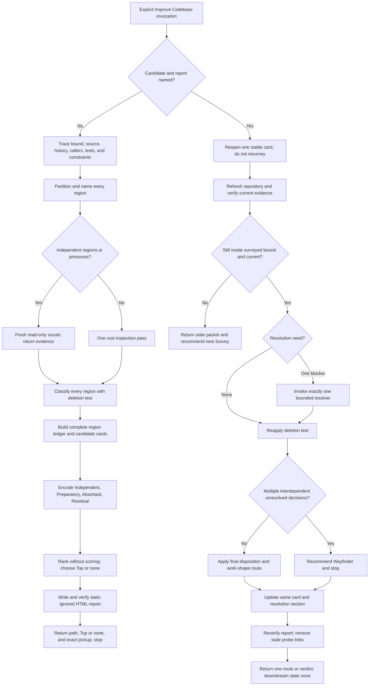

# Improve Codebase Whole-Skill Synthesis

Status: exhaustive design reference for a future rewrite. This document does not change executable behavior, authorize production edits, or replace the current runtime contract.

Runtime authority remains in:

- `skills/custom/improve-codebase/SKILL.md`;
- `skills/custom/improve-codebase/SELECTED-CANDIDATE.md`;
- `skills/custom/improve-codebase/HTML-REPORT.md`;
- `skills/custom/improve-codebase/agents/openai.yaml`;
- `$codebase-design` for shared design vocabulary and one selected direct-design pass;
- the selected resolver skills and their own mutation and completion gates;
- `docs/agents/engineering-contract.md`, routed domain source, and target-repository constraints;
- `docs/synthesis/skill-context-relationships.md`, pack tests, behavior evaluations, and validation transcripts; and
- the installed mirror under `C:\Users\steve\.agents\skills\improve-codebase`.

At the time of this synthesis, all four canonical Improve Codebase package files match the installed mirror by SHA-256 read-back. The current runtime already implements the accepted Survey and selected-candidate split described here. This note preserves that behavior, makes its ownership and proof model exhaustive, and supplies a controlled extraction plan for a later rewrite. It is not permission to rewrite or resynchronize the skill.

## How To Read This Document

This synthesis follows the same four-layer authority model as the Parallel Implement and Wayfinder syntheses:

1. **Orientation** states the outcome, selected shape, vocabulary, boundaries, and explanatory flow.
2. **Normative Design** is the sole authority for proposed runtime behavior and relationships.
3. **Evidence And Rationale** preserves source pressure, evaluation findings, deliberate non-changes, rejected machinery, and residual gaps without adding rules.
4. **Extraction And Verification** places the design into owned runtime surfaces and defines the proof required before promotion.

Change proposed runtime behavior in Layer Two. Explain it in Layer Three. Place and prove it in Layer Four. The Design Verdict summarizes the selected shape but creates no rules. The Runtime Ownership And Change Map owns file placement, the Staged Extraction Plan owns implementation order, the behavior-evaluation protocol owns proof mechanics, and the Migration And Acceptance Matrix owns cases only. Correct any diagram, rationale, ownership row, or acceptance case that disagrees with its Layer Two owner.

Use this index for direct navigation:

| Question | Owning section |
| --- | --- |
| What outcome governs the future rewrite? | [North Star](#north-star) and [Design Verdict](#design-verdict) |
| Which invocation branch applies? | [Invocation And Branch Selection](#invocation-and-branch-selection) |
| What may Improve Codebase or a resolver mutate? | [Authority And Mutation Boundary](#authority-and-mutation-boundary) |
| How is the survey bound selected and evidenced? | [Source Trace And Survey Bound](#source-trace-and-survey-bound) |
| When is each Survey operation complete? | [Survey State And Completion Contract](#survey-state-and-completion-contract) |
| How are regions and candidates classified? | [Disposition And Ledger Contract](#disposition-and-ledger-contract) and [Candidate Card Contract](#candidate-card-contract) |
| How are overlap and priority represented? | [Sequence And Overlap Contract](#sequence-and-overlap-contract) and [Ranking Contract](#ranking-contract) |
| What must the report contain and prove? | [Report Artifact Contract](#report-artifact-contract) and [Report Verification Contract](#report-verification-contract) |
| How does one selected candidate resume? | [Selected-Candidate State And Completion Contract](#selected-candidate-state-and-completion-contract) |
| Which resolver may run and what returns? | [Resolution-Need Contract](#resolution-need-contract) |
| How is a candidate reclassified and routed? | [Reclassification Contract](#reclassification-contract) and [Terminal Routing Contract](#terminal-routing-contract) |
| Which artifact proves which claim? | [Artifact Authority Contract](#artifact-authority-contract) |
| Which context loads for each branch? | [Runtime Context Loading Contract](#runtime-context-loading-contract) |
| Which skill owns each relationship? | [Relationship Ownership](#relationship-ownership) |
| What does each invocation return? | [Return Contracts](#return-contracts) |
| Where should future runtime wording live? | [Proposed Runtime Semantic Surface](#proposed-runtime-semantic-surface) and [Runtime Ownership And Change Map](#runtime-ownership-and-change-map) |
| What must pass before promotion? | [Staged Behavior-Evaluation Protocol](#staged-behavior-evaluation-protocol), [Migration And Acceptance Matrix](#migration-and-acceptance-matrix), and [Promotion Gate And Residual Gaps](#promotion-gate-and-residual-gaps) |

# Layer One: Orientation

## North Star

Improve Codebase owns one outcome: turn a bounded codebase whose strongest structural improvement is uncertain into one exhaustive, evidence-backed, disposable decision report, then preserve that evidence while one explicitly selected candidate is resolved, reclassified, and routed without starting delivery.

The skill is successful when it makes uncertainty smaller without pretending that discovery is implementation:

- every surveyed region has an explicit disposition;
- actionable candidates carry enough evidence to be resumed without repeating the Survey;
- overlap and order prevent duplicated or premature work;
- ranking identifies one strongest next move without fabricated precision;
- `Retain` and `No candidate recommended` remain valid outcomes;
- a selected candidate resolves at most one blocker and returns to the same report;
- exactly one terminal route or verdict follows reclassification; and
- production, tracker, Git, and external mutation remain with their owners.

The practical aim is not prettier architecture. It is less complexity, less caller coordination, clearer responsibility, better proofability, and more navigable code through elimination or concentration only when the evidence earns it.

## Design Verdict

The future rewrite should preserve one explicit-only skill with two sharply separated branches and three runtime Markdown surfaces:

| Stratum | Selected shape | Rewrite status |
| --- | --- | --- |
| Survey core | `Trace -> Scout -> Classify -> Sequence -> Rank -> Report -> Return` over one bounded region ledger | Preserve and make operation completion more explicit |
| Selected-candidate core | `Reopen -> Verify -> Resolve -> Reclassify -> Route -> Reconcile -> Return` for one stable report card | Preserve behind one exact invocation predicate |
| Shared design language | Load `$codebase-design` vocabulary during Survey without requesting a design recommendation | Preserve the caller-retained vocabulary relationship |
| Report | One ignored, static, self-contained HTML decision surface with stable candidate anchors and complete region ledger | Preserve; make artifact identity and verification authority explicit |
| Resolution | Zero or one resolver selected by one recorded need; every resolver returns evidence to Improve Codebase | Preserve exact cardinality and caller ownership |
| Routing | One recommendation or verdict after reclassification; explicit-only delivery skills remain unstarted | Preserve exact stop boundary |
| Invocation | Explicit-only because the user deliberately chooses broad improvement discovery or an exact report-backed resume | Preserve `allow_implicit_invocation: false` |
| Runtime surfaces | `SKILL.md`, `SELECTED-CANDIDATE.md`, `HTML-REPORT.md`, and `agents/openai.yaml` | Preserve the existing split; no additional helper is justified |
| Rejected machinery | Persistent campaign ledger, numeric architecture score, report generator, direct tracker publication, automatic implementation, mandatory whole-repo scan, or one file per Survey operation | Exclude unless later evidence proves a missing safety or attention boundary |

## Two Supported Branches

| Branch | Entry | Owned result | Stop boundary |
| --- | --- | --- | --- |
| **Survey** | The invocation does not name `Candidate N` and an absolute report path | One verified report, one Top recommendation or `No candidate recommended`, and an exact report-backed pickup when candidates exist | No resolver, candidate selection, design, or delivery starts |
| **Selected candidate** | The invocation explicitly names one stable `Candidate N` and one report | Current evidence, zero or one resolver return, final disposition, overlap decision, reconciled card, and one terminal route or verdict | Recommended explicit-only work remains unstarted |

The branches are sequential across invocations, not one long run. The Survey creates a decision surface and stops. A later explicit invocation chooses one candidate. This context boundary prevents the Top recommendation from becoming implicit permission to investigate, design, simplify, or implement.

## Boundary Model

Improve Codebase is read-only with one narrow artifact exception: it may create or update one report under ignored `.tmp/improvement-reviews/`.

Selected resolvers retain their own narrower mutation rules. Research may write one explicitly authorized note; Prototype may create one authorized disposable probe or separately authorized durable artifact; Grill With Docs may compose domain persistence only through Domain Modeling's gates; Codebase Design remains read-only. Those are resolver-owned mutations, not an expansion of Improve Codebase's authority.

Improve Codebase never edits product code, tests, tracked design documents, tracker state, index state, commits, deployment state, or external systems. It never treats a recommendation as authority to invoke an explicit-only delivery skill.

## Leading-Word Runtime Model

| Leading word | Runtime meaning |
| --- | --- |
| **Trace** | Establish the survey bound, Source Trace, region inventory, current work state, and evidence gaps before judging structure |
| **Scout** | Inspect one partition or pressure independently without inherited hypotheses or mutation |
| **Classify** | Apply the deletion test and assign every region one evidence-backed disposition |
| **Ledger** | Account for the complete surveyed bound, including retained and rejected possibilities |
| **Sequence** | Encode overlap before ranking so preparation, absorption, and residual work remain visible |
| **Rank** | Compare value, evidence, proofability, risk, reversibility, and overlap without a synthetic score |
| **Report** | Materialize one stable, verified, offline decision surface |
| **Reopen** | Resume exactly one stable card without repeating discovery |
| **Verify** | Refresh source and prove the candidate still means what the report says |
| **Resolve** | Close at most one recorded evidence or design blocker through its owner |
| **Reclassify** | Reapply the deletion test after current or returned evidence |
| **Route** | Select one terminal owner or verdict while starting no downstream work |
| **Reconcile** | Update the same card, remove stale artifact pointers, and reread the report |
| **Return** | Expose the report, evidence, disposition, route or verdict, and downstream state, then stop |

## Improvement Vocabulary

Shared engineering terms such as Source Trace, commitment boundary, proof seam, evidence, residual risk, and Lock retain their meanings from the engineering contract. Shared architecture terms such as module, interface, implementation, depth, seam, adapter, leverage, and locality retain their meanings from `$codebase-design`.

Improve Codebase adds only this vocabulary:

| Term | Meaning |
| --- | --- |
| **Survey bound** | The complete caller-named or evidence-selected codebase region for one report |
| **Region** | One named, ledger-accountable part of the bound that can receive one disposition |
| **Deletion test** | Ask where the region's complexity goes if the boundary or code disappears |
| **Eliminate** | Complexity disappears without violating the commitment boundary |
| **Concentrate** | Complexity currently leaks or duplicates across callers and should move behind one earning owner |
| **Retain** | The boundary earns its cost through locality, isolation, domain ownership, real variation, or testability |
| **Investigate** | One precise, decision-relevant evidence question blocks safe disposition |
| **Candidate** | A stable numbered non-Retain card whose report evidence can be explicitly resumed |
| **Immediate pickup** | The exact `$improve-codebase Candidate N from <absolute-report-path>` invocation that reopens a card |
| **Provisional destination** | The likely resolver or later delivery owner; never the immediate pickup and never execution authority |
| **Top recommendation** | The strongest supported next candidate under current evidence and overlap |

## End-To-End Explanatory Flow



The diagram is explanatory. Layer Two alone owns entry predicates, completion, mutation, resolver cardinality, route selection, and Return.

# Layer Two: Normative Design

## Normative Home Index

Each behavior has one normative home. Other sections may explain, place, or test it but never create a competing rule.

| Concern | Sole normative home |
| --- | --- |
| Explicit invocation and Survey-versus-selected branch choice | [Invocation And Branch Selection](#invocation-and-branch-selection) |
| Improve Codebase and resolver mutation authority | [Authority And Mutation Boundary](#authority-and-mutation-boundary) |
| Survey target selection and required source evidence | [Source Trace And Survey Bound](#source-trace-and-survey-bound) |
| Legal Survey order and operation completion | [Survey State And Completion Contract](#survey-state-and-completion-contract) |
| Scout admission, packet, and root ownership | [Scout Contract](#scout-contract) |
| Region coverage, disposition, and speculation rejection | [Disposition And Ledger Contract](#disposition-and-ledger-contract) |
| Candidate identity and required fields | [Candidate Card Contract](#candidate-card-contract) |
| Overlap vocabulary and route consequences | [Sequence And Overlap Contract](#sequence-and-overlap-contract) |
| Comparative priority and Top recommendation | [Ranking Contract](#ranking-contract) |
| Report location, structure, visuals, and accessibility | [Report Artifact Contract](#report-artifact-contract) |
| Artifact evidentiary roles | [Artifact Authority Contract](#artifact-authority-contract) |
| Report read-back, rendering, and semantic checks | [Report Verification Contract](#report-verification-contract) |
| Selected-candidate order and operation completion | [Selected-Candidate State And Completion Contract](#selected-candidate-state-and-completion-contract) |
| Candidate freshness and stale handling | [Current-Evidence And Drift Contract](#current-evidence-and-drift-contract) |
| Zero-or-one resolver selection and return | [Resolution-Need Contract](#resolution-need-contract) |
| Final disposition after evidence | [Reclassification Contract](#reclassification-contract) |
| Stop-loss, final route, and no-execution boundary | [Terminal Routing Contract](#terminal-routing-contract) |
| Same-card update and stale-artifact removal | [Report Reconciliation Contract](#report-reconciliation-contract) |
| Progressive disclosure and reference loading | [Runtime Context Loading Contract](#runtime-context-loading-contract) |
| Cross-skill trigger and retained authority | [Relationship Ownership](#relationship-ownership) |
| External output shape | [Return Contracts](#return-contracts) |
| Branch terminal criteria | [Completion](#completion) |

## Invocation And Branch Selection

Improve Codebase remains explicit-only. Preserve `policy.allow_implicit_invocation: false`. The user deliberately selects broad structural discovery or resumes an exact report card; callers may recommend it and stop, but do not invoke it automatically.

Choose exactly one branch from the literal invocation:

| Invocation evidence | Selected branch | Other branch kept out |
| --- | --- | --- |
| Explicit `Candidate N` and an absolute report path are both present | Selected candidate | Do not repeat Trace, Scout, repository-wide classification, or ranking |
| Either element is absent | Survey | Do not read `SELECTED-CANDIDATE.md`, choose a candidate, or invoke a resolver |
| Candidate or report identity is malformed or ambiguous | Selected-candidate identity return | Do not guess a card, silently fall back to Survey, or mutate the report |

An invocation containing a report path but no stable candidate is not selection. A named candidate without its report is not enough Source Trace to resume. The exact pickup is part of the Survey's output contract.

## Authority And Mutation Boundary

| Actor or surface | Authorized mutation | Prohibited substitution |
| --- | --- | --- |
| Improve Codebase Survey | Create one report under ignored `.tmp/improvement-reviews/` | Product code, tests, tracked docs, tracker, index, commit, deployment, or external mutation |
| Improve Codebase selected branch | Update the same report card and Resolution section | A second report, production edit, delivery action, tracker change, or automatic candidate selection |
| Scout | None; read-only and non-spawning | Parent report write, classification authority, ranking, resolver invocation, or downstream route |
| Research | At most one explicitly authorized cited note path under Research's contract; otherwise inline evidence or blocker | General tracked-write authority or route selection |
| Prototype | Only its caller-authorized disposable or durable artifact boundary | Production implementation or proof of production correctness |
| Grill With Docs | Only mutations admitted through its Grilling and Domain Modeling gates | Improve Codebase-owned reclassification or route selection |
| Codebase Design | Read-only design packet | Design acceptance, implementation, or caller-state mutation |

Before any report write, prove `.tmp/improvement-reviews/` is ignored. If it is missing or incompatible, return the exact `$repo-bootstrap` precondition and stop. Do not create or edit setup files inside Improve Codebase.

Preserve unrelated work. Read-only inspection may include Git history and current work state; it never converts pre-existing changes into candidate-owned or disposable work.

## Source Trace And Survey Bound

Select the survey bound in this order:

1. **Caller bound wins.** Use the named repository region, workflow, package, module family, or other coherent boundary.
2. Otherwise inspect bounded commit history for repeated-change hotspots. A hotspot needs repeated evidence across commits or paths; one recent edit is not enough.
3. When history is thin or churn is scattered, widen deliberately through entry points, manifests, ownership boundaries, and representative workflows.
4. Partition a whole-codebase request into named regions before classification. Whole-codebase wording is not permission for an undifferentiated scan.

Build the Source Trace for the chosen bound from:

- the request and repository instructions;
- the engineering contract and relevant domain glossaries or ADRs;
- current implementation, public entry points, representative callers, and tests;
- bounded history and ownership evidence;
- operational, data, security, compatibility, and migration constraints that affect the region; and
- exact evidence gaps and uninspected exclusions.

History selects a promising starting point; it never substitutes for architecture evidence. Churn without caller burden, leaked policy, shallow structure, duplicate decisions, proof friction, or unclear ownership does not justify a candidate.

The bound is complete when every in-scope region is named, the evidence used to select it is recorded, representative seams and workflows are traced, and every exclusion or evidence gap is explicit.

## Survey State And Completion Contract

The Survey is one ordered pass. A later operation cannot begin until the current row's completion criterion holds.

| Operation | Enter when | Complete when | Legal nonterminal return |
| --- | --- | --- | --- |
| **Trace** | Survey branch selected | Survey bound, Source Trace, region inventory, history basis or fallback basis, constraints, and evidence gaps are explicit | Exact missing source or authority needed to define a coherent bound |
| **Scout** | Bound contains cleanly partitioned regions or pressures whose independent inspection is economical | Every dispatched region returns its required read-only packet and the root performs its own pass; otherwise the root records why one root pass was used | Missing scout evidence recorded as an evidence gap; no partial classification claim |
| **Classify** | Every named region has enough evidence for judgment or one exact question | Every region receives `Eliminate`, `Concentrate`, `Retain`, `Investigate`, or rejected-speculation status under the deletion test | Exact unresolvable evidence gap without a fabricated disposition |
| **Sequence** | Numbered cards and retained ledger entries exist | Every material overlap is `Independent`, `Preparatory`, `Absorbed`, or `Residual`, with referenced candidate identities where applicable | Ambiguous overlap returned as one exact classification gap |
| **Rank** | Classification and sequence are complete | Numbered candidates are ordered by the Ranking Contract and exactly one Top recommendation or `No candidate recommended` is chosen | No ranking when the ledger is incomplete |
| **Report** | Ranking or no-candidate verdict exists and ignored report authority passes | One report satisfies the artifact and verification contracts | Repo Bootstrap precondition, write blocker, render limitation, or verification failure with the unverified artifact clearly identified |
| **Return** | Report verification passes | Absolute report path, Top recommendation or no-candidate verdict, exact pickup when applicable, and downstream execution state are returned | None; Survey ends |

The existence of a report file, a scout return, a candidate list, or a Top recommendation is not Survey completion.

## Scout Contract

Use scouts only when the survey bound can be partitioned into clean, non-overlapping regions or pressures. A small or conceptually entangled bound uses one root pass.

Each direct scout is fresh-context, read-only, non-spawning, and receives:

```text
Survey identity and bound:
Assigned region or pressure:
Shared architecture vocabulary:
Source pointers and constraints:
Mutation boundary: read-only
Required evidence packet:
Explicit exclusions:
```

Exclude parent hypotheses, preferred candidates, provisional rankings, and peer results. A scout returns observed structure, callers, decisions, seams, proof surfaces, friction, evidence pointers, gaps, and possible deletion-test consequences. It does not assign final dispositions or candidate numbers unless the root explicitly asks for provisional local labels that remain non-authoritative.

The root alone owns complete-bound coverage, cross-region comparison, disposition, sequence, rank, report, selected-candidate work, and Return.

## Disposition And Ledger Contract

Apply the deletion test to every region:

| Disposition | Passing evidence | Failure to admit |
| --- | --- | --- |
| **Eliminate** | Removing the code, boundary, pass-through, compatibility layer, duplication, or indirection makes its complexity disappear while preserving commitments through a named proof seam | Complexity moves into callers, hides a commitment, or needs a new interface or decision |
| **Concentrate** | Current complexity leaks, duplicates, or forces caller coordination; one evidenced owner can hide the responsibility behind an earning boundary | Proposed owner is hypothetical, merely moves files, or creates equal or greater caller burden |
| **Retain** | The boundary earns its cost through locality, dependency isolation, domain ownership, demonstrated variation, or testability | Cost is defended only by familiarity, pattern preference, or speculative future reuse |
| **Investigate** | One precise evidence question is material to disposition and has one feasible evidence route | The uncertainty is shapeless, not decision-relevant, unbounded, or has no attainable evidence path |

The Survey ledger accounts for every named region. Number only `Eliminate`, `Concentrate`, and `Investigate`; keep `Retain` as a ledger entry without an action card. Record unsupported ideas as rejected speculation with the missing evidence. Do not promote them to Investigate merely to avoid a Retain or no-candidate outcome.

`Retain` is a positive conclusion, not failed discovery. When every region is retained, disproved, or rejected as speculation, the report returns `No candidate recommended` and no selection prompt.

## Candidate Card Contract

Every numbered card records:

```text
Stable Candidate N and concise title:
Region and provisional disposition:
Recommendation strength: Strong | Worth exploring
Source Trace with file and line pointers:
Observed friction:
Deletion-test result:
Behavior and commitment boundary:
Elimination target | responsibility to concentrate | investigation question:
Proof seam:
Resolution need: none | repository | source | runnable | user-decision | design
One evidence route, when a need exists:
Sequence relationship:
Risk and blast radius:
Rank rationale:
Provisional destination:
Exact immediate pickup invocation:
```

Candidate identity is the report path plus stable `Candidate N`. A title may improve, but the number remains stable through selected-candidate reconciliation. Candidate cards are survey hypotheses, not accepted design, specification, interface, implementation, or delivery contracts.

Destination is disposition-constrained:

| Provisional disposition | Permitted provisional destination |
| --- | --- |
| `Eliminate` | `$simplify-code` only |
| `Concentrate` | One selected evidence/design resolution or later delivery route |
| `Investigate` | Its one recorded evidence route |
| `Retain` | None; no numbered card |

Every numbered card still uses `$improve-codebase Candidate N from <absolute-report-path>` as its immediate pickup. A provisional destination never replaces that invocation.

## Sequence And Overlap Contract

Classify every material relationship before ranking:

| Relationship | Meaning | Consequence |
| --- | --- | --- |
| **Independent** | Neither candidate changes the other's evidence, scope, or value | Rank and select independently |
| **Preparatory for Candidate N** | This candidate must finish or return evidence before N can be evaluated, designed, or delivered safely | Rank may elevate the preparation; N's route remains gated |
| **Absorbed by Candidate N** | N replaces this work or makes it unnecessary | Never route the absorbed candidate independently while N remains selected and viable |
| **Residual after Candidate N** | Only the part left after N remains eligible | Defer and resurvey or reverify the residual after N; do not duplicate the overlapping scope now |

Name the referenced candidate and affected scope. Do not infer independence from different filenames. Sequence is evidence about semantic overlap, responsibility, callers, proof, migration, and resulting work.

Selected-candidate routing reapplies the recorded relationship to current evidence. Drift may change the relationship, but the same card must record that change before a terminal route is returned.

## Ranking Contract

Rank only after classification and sequence are complete. Compare:

- strength and freshness of evidence;
- proofability through a meaningful seam;
- concepts, dependencies, decisions, caller burden, or coordination removed;
- recurring change or defect friction;
- risk, blast radius, reversibility, migration cost, and residual uncertainty; and
- preparation, absorption, or residual overlap.

Use no numeric architecture, ROI, confidence, or priority score. A number implies precision the Survey does not possess and hides the evidence trade-off.

Prefer `Eliminate` on a true tie because disappearance is stronger than redistribution. Rank `Investigate` first only when its precise question unlocks more supported value than the currently actionable alternatives. Choose exactly one Top recommendation, or `No candidate recommended` when no numbered candidate survives.

## Report Artifact Contract

Create one self-contained semantic HTML report under repo-local `.tmp/improvement-reviews/` only after ignore authority passes.

The report begins with repository identity, date, survey bound, inspected history or fallback scope, visual legend, and one prominent Top recommendation or `No candidate recommended`. It then contains ranked candidate cards and the complete survey ledger.

Use stable anchors:

- every candidate card is `<article id="candidate-n">`;
- ledger entries point to the card when one exists;
- the Top recommendation points to the same stable anchor; and
- selected-candidate reconciliation preserves the number and anchor.

The report is offline and script-free: no network requests and no runtime JavaScript. Embed CSS and static SVG. Pre-render Mermaid only with an existing local renderer under strict security; otherwise use inline SVG or positioned HTML.

Declare `color-scheme: dark`. Use semantic headings and lists, high-contrast text, visible keyboard focus, responsive narrow-screen layout, and color-plus-label encoding. Reserve red for removal pressure, amber for uncertainty, green for retained or verified state, and one cool accent.

Visuals serve disposition-specific reasoning:

| Disposition | Useful visual question |
| --- | --- |
| `Eliminate` | What dependency, branch, boundary, or control flow disappears? |
| `Concentrate` | Which responsibilities or decisions move behind one smaller caller-facing surface? |
| `Investigate` | Which exact question maps to which evidence surface without fabricating an after-state? |

Choose the smallest visual that changes understanding. Omit a diagram when the ledger or compact code-flow sketch is clearer. Use repo and domain language; diagrams carry structure, not decoration.

After a selected-candidate pass, the same card gains a Resolution section naming the resolver or direct evidence, returned result, final disposition, overlap decision, final route or verdict, time, limits, and report verification. Keep only surviving prototype paths.

## Artifact Authority Contract

| Artifact or surface | Owns or proves | Must not substitute for |
| --- | --- | --- |
| Repository source and current observations | Current implementation, callers, tests, history, constraints, and work state | Disposition or ranking without root judgment |
| Source Trace | Evidence basis and surveyed bound for one report or card | Current truth after drift without refresh |
| Survey ledger | Complete region accounting and disposition coverage | Candidate detail, ranking, or implementation authorization |
| Candidate card | Stable resumable hypothesis and required evidence packet | Accepted design, delivery spec, or mutation authority |
| HTML report | Human-readable decision surface and reconciled candidate record | Repository truth, production proof, or completed downstream work |
| Scout packet | Read-only evidence from one assigned partition | Root classification, sequence, rank, or final route |
| Research return | Cited source evidence, limits, and authorized note pointer if any | Improve Codebase reclassification or downstream route |
| Prototype return | One reconciled runnable design verdict and artifact cleanup state | Production correctness or implementation authority |
| Grill With Docs return | One user-owned decision, deferrals, Domain Delta, ADR outcome, and evidence gap | Candidate reclassification or report reconciliation |
| Codebase Design packet | One bounded recommended shape, alternatives, migration, proof seam, and gaps | User acceptance, implementation, or report-owned final disposition |
| Final route or verdict | Improve Codebase's terminal recommendation after current evidence and overlap | Automatic invocation, delivery completion, or acceptance of commitments |

When report content and current repository evidence disagree, current evidence wins. Reconcile the same card or return stale; do not edit source or invent report truth to preserve the prior recommendation.

## Report Verification Contract

After every report creation or reconciliation:

1. Reread the file from disk.
2. Render or open it when supported; otherwise record the strongest available structural inspection and the unrendered visual risk.
3. Prove there are no network requests or runtime scripts.
4. Prove every candidate, Top recommendation, and ledger link resolves to the intended stable anchor.
5. Prove the ledger covers every named region and that candidate cards exist only for numbered dispositions.
6. Compare visuals and labels to the card's disposition and evidence.
7. Prove the Top recommendation or `No candidate recommended` matches the ranked classified set.
8. After selected resolution, prove the same card contains the current final disposition, route or verdict, limits, and no stale prototype link.

A syntactically valid file or successful write is not verification. Return the report as verified only after every applicable check passes. Name skipped rendering and its residual risk.

## Selected-Candidate State And Completion Contract

The selected branch is one ordered pass over one stable card. It creates no separate lifecycle enum or durable ledger.

| Operation | Enter when | Complete when | Legal nonterminal return |
| --- | --- | --- | --- |
| **Reopen** | Exact candidate and report identity are supplied | One stable card, Source Trace, survey bound, provisional disposition, proof seam, resolution need, and sequence relationship are loaded | Exact missing or ambiguous pointer; no resurvey |
| **Verify** | Card identity is stable | Current repository and work state confirm or materially update every load-bearing fact and drift is classified | Stale-candidate packet when the candidate leaves the surveyed bound |
| **Resolve** | One recorded need other than `none` remains and its route is authorized | At most one resolver returns its complete packet or blocker; `none` skips Resolve | Resolver blocker, evidence gap, authority wait, or unavailable capability |
| **Reclassify** | Current direct evidence and any resolver packet are available | Deletion test yields `Eliminate`, `Concentrate`, `Retain`, or `Investigate`, with conflicts preserved as Investigate | Exact unresolved conflict or missing evidence |
| **Route** | Final disposition is known | Stop-loss and overlap apply; exactly one route or no-change/evidence-gap verdict is selected | No forced route for unresolved evidence |
| **Reconcile** | Route or verdict exists | Same card and Resolution section contain current evidence, disposition, overlap, route or verdict, time, limits, and surviving artifacts; report verification passes | Report write or verification blocker with source state unchanged |
| **Return** | Reconciled report is verified | One complete selected-candidate packet is returned and downstream execution is explicitly `none` | None; selected invocation ends |

A resolver packet, design verdict, recommendation, or report write alone is not selected-candidate completion.

## Current-Evidence And Drift Contract

Refresh Git and work state before selected-candidate judgment. Recheck the card's load-bearing evidence against current source, representative callers and tests, relevant history, domain context, constraints, proof seam, and sequence relationships.

Classify drift:

| Drift result | Consequence |
| --- | --- |
| None or immaterial | Continue with current evidence recorded |
| Material but inside the surveyed bound | Update the card's evidence and continue only when identity and commitment boundary remain coherent |
| Candidate no longer exists or leaves the surveyed bound | Return a stale-candidate packet and recommend a new `$improve-codebase` Survey |
| Report identity, candidate number, or source pointers are ambiguous | Return the exact identity gap; do not guess or resurvey |

Stale handling protects report identity. It does not silently reframe a different region as the selected candidate.

## Resolution-Need Contract

Resolve at most one blocker per invocation. `resolution need: none` invokes no resolver.

| Recorded need | Owner and invocation | Required return | Improve Codebase retains |
| --- | --- | --- | --- |
| `none` | No resolver | Current direct evidence | Reclassification, overlap, route, report, Return |
| `repository` | Improve Codebase inspects the missing repository source, caller, test, history, configuration, or operational evidence directly | Supported answer, pointers, limits, or exact blocker | All candidate authority |
| `source` | Invoke `$research` with one question, supported decision, scope, freshness, and `authorized note path: none` unless one path is approved | Cited evidence, limits, conflicts, one authorized note pointer or `none`, or blocker | Supported decision, reclassification, report, route |
| `runnable` | Invoke `$prototype` with one terminal question, judgment authority, objective criteria where applicable, and an authorized `.tmp/improvement-prototypes/` path | Reconciled verdict, evidence, limits, cleanup or preservation state | Production-proof judgment, reclassification, report, route |
| `user-decision` | Invoke `$grill-with-docs` for one user-owned preference, commitment, trade-off, term, boundary, or ADR question | Complete grilling packet, Domain Delta, ADR outcome, deferrals, or Evidence gap | Candidate identity, reclassification, report, route |
| `design` | Invoke `$codebase-design` Direct Design only for a supported `Concentrate` candidate needing dependency, seam, ownership, interface, migration, compatibility, replacement, or proof-surface design | One bounded design packet with acceptance evidence or gaps | Final disposition, overlap, report, route |

Do not send repository inspection to Research, broad implementation to Prototype, every candidate to Grilling, or an unsupported Eliminate/Investigate candidate to Direct Design. A Prototype verdict is design evidence, never production proof. Grill With Docs remains the sole user-decision caller edge so Grilling and Domain Modeling stay active under their own gates, even when Domain Modeling returns the minimal no-change delta.

If one resolver exposes another blocker, preserve it as the candidate's next exact evidence need and stop. Do not chain a second resolver in the same invocation.

## Reclassification Contract

Reapply the deletion test after current evidence and any resolver return:

| Final disposition | Required conclusion |
| --- | --- |
| `Eliminate` | The target's complexity disappears without moving prohibited burden or changing commitments |
| `Concentrate` | The responsibility should move behind one earning owner and a safe work shape can be described |
| `Retain` | Current evidence proves the boundary earns its cost |
| `Investigate` | One exact unresolved evidence conflict or question still prevents a safe disposition |

The final disposition may differ from the provisional disposition. A design packet may prove that apparent elimination needs concentration, that a proposed concentration should be retained, or that evidence remains insufficient. Resolver ownership never freezes classification.

Record the deletion-test result and evidence for the final disposition. Do not force an unresolved candidate into delivery merely because a resolver ran.

## Terminal Routing Contract

Apply the multi-decision stop-loss first, then route by final disposition and settled work shape:

| Predicate | Terminal route or verdict | Required stop |
| --- | --- | --- |
| Multiple interdependent unresolved decisions or prerequisites require durable tracker-backed sequencing | Recommend `$wayfinder` | Return exact fog and report identity; do not start Wayfinder |
| Final `Eliminate` | Recommend `$simplify-code Candidate N from <absolute-report-path>` | Do not edit, simplify, or invoke delivery |
| Final `Concentrate`; direction is settled but a durable parent specification is required before slicing | Recommend `$to-spec` | Preserve report evidence and stop before publication |
| Final `Concentrate`; direction and commitments are settled and require dependency-ordered slices | Recommend `$to-tickets` | Preserve report evidence and stop before tracker mutation |
| Final `Concentrate`; exactly one bounded ready slice has commitments and proof | Recommend `$implement` | Preserve report evidence and stop before implementation |
| Final `Retain` | Return no-change verdict with evidence that the boundary earns its cost | No downstream route |
| Final `Investigate` | Return exact gap, attempted resolver, result, and next evidence action | No forced downstream route |

The Concentrate predicates are ordered by missing artifact: specification before slicing, slicing before singleton delivery. `$codebase-design` is a resolver, not a final delivery route from this table; it returns to reclassification.

Apply the Sequence And Overlap Contract before returning any route. Preparatory work gates its target; absorbed work receives no duplicate route; residual work is deferred to what remains after the governing candidate.

Exactly one terminal route or verdict may be returned. Every named downstream skill remains unstarted.

## Report Reconciliation Contract

Update the same stable card and one Resolution section with:

```text
Resolution time:
Current evidence and drift:
Resolver or direct evidence:
Returned decision, evidence, limits, and authority state:
Original disposition:
Final disposition and deletion-test result:
Sequence relationship and overlap decision:
Final route or no-change/evidence-gap verdict:
Exact pickup when the route contract defines one:
Downstream execution: none
Report verification:
```

Preserve candidate numbers, anchors, original survey evidence, and the distinction between provisional and final state. Remove stale prototype paths after cleanup while retaining their verdict and limits. Keep valid durable note, report, or preserved-artifact pointers.

Reconciliation never rewrites the whole Survey from current intuition. If drift invalidates the survey bound, use the stale branch instead.

## Runtime Context Loading Contract

Load the smallest complete context selected by observed branch and operation:

| Observed branch or need | Load now | Keep out |
| --- | --- | --- |
| Every invocation | `SKILL.md`, explicit invocation evidence, repository instructions, engineering contract, and relevant domain routing | Both disclosed references by default |
| Survey architecture judgment | `$codebase-design` vocabulary and taste only | Direct Design and its conditional references |
| Survey report creation or verification | `HTML-REPORT.md` completely after classification and ranking are ready | Selected-candidate procedure and resolver skills |
| Explicit selected candidate | `SELECTED-CANDIDATE.md` completely plus the named report and current card evidence | Survey procedure, other candidate detail beyond overlap context, unrelated resolver skills |
| Selected `repository` need | Exact missing repository surfaces | Research, Prototype, Grill With Docs, or Direct Design |
| Selected `source` need | `$research` and its complete caller packet | Other resolvers |
| Selected `runnable` need | `$prototype` and its complete caller packet | Other resolvers and production workflow |
| Selected `user-decision` need | `$grill-with-docs` and its complete caller packet | Direct `$grilling` edge or conditional Domain Modeling omission |
| Supported selected `design` need | `$codebase-design` Direct Design branch and its triggered references only | Survey vocabulary-only mode or unrelated resolver branches |
| Report reconciliation | `HTML-REPORT.md` plus the same card's original and current evidence | Whole-repository resurvey |
| Missing ignored report boundary | Exact ignore and setup evidence needed for the Repo Bootstrap precondition | Repo Bootstrap's mutation procedure |

A context pointer is complete only when it states the predicate, target, expected return, retained owner, and completion boundary. `SKILL.md` should not copy resolver procedures, report markup, or selected-branch steps merely because one later branch may need them.

## Relationship Ownership

This section is the sole authority for Improve Codebase's composition and terminal edges. Foreign skills own their internal procedure and concrete rewrite.

| Caller | Verb | Callee or capability | Trigger and return boundary |
| --- | --- | --- | --- |
| Direct user | Invoke | `$improve-codebase` | Explicitly start Survey or name one exact candidate and report; Improve Codebase's gates still apply |
| `$simplify-code` | Recommend and stop | `$improve-codebase` | The request needs wide discovery, ranking, or multi-region sequencing |
| `$codebase-design` | Recommend and stop | `$improve-codebase` | The request needs codebase-wide discovery, classification, ranking, or multi-region sequencing |
| `$tdd` | Recommend and stop | `$improve-codebase` | A GREEN refactor exposes wide or unclassified improvement outside the tracer bullet |
| `$improve-codebase` | Load | `$codebase-design` vocabulary | Apply module, interface, seam, depth, leverage, and locality during Survey; caller retains report and completion |
| `$improve-codebase` | Invoke | `$research` | One selected source need returns cited evidence or blocker to the same card |
| `$improve-codebase` | Invoke | `$prototype` | One selected runnable need returns reconciled design evidence and cleanup state |
| `$improve-codebase` | Invoke | `$grill-with-docs` | One selected user-owned decision returns the complete composed packet and Domain Delta |
| `$improve-codebase` | Invoke | `$codebase-design` Direct Design | One supported selected `Concentrate` candidate returns a bounded design packet for reclassification |
| `$improve-codebase` | Recommend and stop | `$wayfinder` | Multiple interdependent unresolved decisions or prerequisites need a tracker-backed route |
| `$improve-codebase` | Recommend and stop | `$simplify-code` | Final selected disposition is `Eliminate` |
| `$improve-codebase` | Recommend and stop | `$to-spec` | Settled concentration needs a durable parent spec before slicing |
| `$improve-codebase` | Recommend and stop | `$to-tickets` | Settled concentration needs dependency-ordered slices |
| `$improve-codebase` | Recommend and stop | `$implement` | Settled concentration is exactly one ready bounded slice |
| `$improve-codebase` | Recommend and stop | `$repo-bootstrap` | The ignored disposable report boundary is missing or incompatible |

Skill Router owns human-facing route selection and the existing-code tie-breaker. Improve Codebase owns its own Survey admission and selected-candidate behavior. No skill automatically invokes Improve Codebase because it is explicit-only.

Improve Codebase has no direct edge to `$grilling`, `$domain-modeling`, `$tdd`, `$parallel-implement`, `$review`, or `$audit-codebase`. Grill With Docs owns Grilling plus Domain Modeling composition. TDD and delivery happen only after a later explicit implementation route. Audit Codebase owns bounded correctness, domain-robustness, methodology, and performance baselines over immutable source rather than structural improvement ranking.

## Return Contracts

### Survey Return

```text
Mode: Survey
Survey bound and Source Trace:
Region coverage and evidence gaps:
Absolute verified report path:
Top recommendation: Candidate N | No candidate recommended
Exact immediate pickup: $improve-codebase Candidate N from <absolute-report-path> | none
Report verification and rendering limits:
Downstream execution: none
```

### Stale Or Identity Return

```text
Mode: Selected candidate
Report and requested candidate:
Identity or drift result:
Current evidence:
Missing or invalid pointer:
Survey-bound consequence:
Recommendation: new $improve-codebase Survey | correct exact pointer
Report mutation: none
Downstream execution: none
```

### Selected-Candidate Return

```text
Mode: Selected candidate
Absolute report path and Candidate N:
Survey bound and Source Trace:
Current evidence and material drift:
Original and final disposition with deletion-test result:
Resolution need and resolver or direct evidence:
Resolver return, limits, authority, and artifact state:
Sequence relationship and overlap decision:
Recommended route and exact pickup | no-change verdict | evidence-gap verdict:
Report reconciliation and verification:
Downstream execution: none
```

## Completion

Survey completes only when the Authority Boundary holds; the Source Trace and region inventory cover the bound; every region has a supported disposition or rejected-speculation record; candidate cards, sequence, ranking, and Top-or-none verdict agree; one report passes verification; and the Survey Return supplies the absolute path plus exact pickup when applicable.

Selected-candidate work completes only when one stable card reopens without resurveying; current evidence and drift are verified; zero or one resolver returns under its own gates; reclassification and overlap are explicit; exactly one terminal route or verdict is chosen; the same card is reconciled and reverified; and the complete selected return records downstream execution as none.

A verified `No candidate recommended`, no-change `Retain`, unresolved `Investigate`, stale-candidate return, or exact blocker can be complete. A report file, candidate selection, resolver packet, design recommendation, or downstream skill name alone cannot.

# Layer Three: Evidence And Rationale

Everything in this layer derives from Layer Two. It records why the selected design exists and what has already been observed; it adds no runtime predicate, permission, or completion rule.

## Source Pressure

The [Codebase Improvement And Design Family Synthesis](../families/codebase-architecture.md) supplies the durable architecture pressure:

- Ousterhout: deep modules, information hiding, and design leverage;
- Parnas: hide decisions likely to change rather than mirroring processing steps;
- Evans: preserve domain ownership and ubiquitous language;
- Fowler: separate behavior-preserving refactoring from discovery and architecture judgment;
- Feathers and GOOS: seams and tests are useful when they expose real variation and caller-facing behavior;
- Fowler's enterprise patterns and Kleppmann: adapters and boundaries must carry real infrastructure, consistency, failure, and operational contracts;
- Ford, Richards, Parsons, and Kua: architecture is trade-offs and incremental fitness, not generic cleanup;
- Team Topologies: locality and navigability reduce cognitive load; and
- Brown and Tufte: visuals should make the structural argument at the smallest useful level.

This pressure supports four distinct dispositions instead of a universal refactoring recommendation. It also supports a visual decision report without making the report an architecture contract.

## Existing Behavioral Evidence

Three fresh-context evaluation records currently support the accepted behavior:

| Evaluation | Control | Candidate result | Design consequence |
| --- | --- | --- | --- |
| Improve-Codebase Rewrite, 2026-07-18 | Prior `improve-codebase-architecture` instructions | Five of five candidate samples covered all four regions, correctly assigned dispositions and Eliminate ownership, preserved Retain, held Investigate, respected mutation boundaries, and returned the exact pickup; one selected resume also passed | Preserve exhaustive ledger coverage, four-way classification, exact pickup, and Survey/selected split |
| Improve Codebase Routing, 2026-07-18 | Installed package with two user-decision edges | Five of five candidate samples used one Grill With Docs edge, preserved its composed Grilling and Domain Modeling behavior, retained To Spec, Wayfinder, and Codebase Design routes, and started no downstream skill | Preserve one `user-decision` resolver relationship and caller-owned reclassification |
| Improve Codebase Pruning Equivalence, 2026-07-18 | Unsynchronized pre-prune package | Five of five samples preserved all 35 judged behaviors after an 18 percent runtime-prose reduction | Preserve strong leading words and current progressive disclosure rather than re-expanding prose |

The rewrite evaluation exposed one concrete failure: `Eliminate` cards sometimes named `$tdd` instead of `$simplify-code`. Binding disposition to provisional destination removed that variance. The pruning evaluation exposed two more: `Resolve one blocker` incorrectly forced a resolver for `none`, and a generalized dark-theme instruction lost the exact `color-scheme: dark` browser contract. The accepted design therefore keeps `Resolve at most one blocker` and the literal CSS requirement.

The evaluations did not prove live network Research, a real disposable Prototype, interactive Grilling, a rendered production-repository report, or downstream delivery. They prove instruction behavior on fixed scenarios, not broad runtime correctness.

## Why The Branch Split Is Essential

Survey ranking is decision support. Selected resolution is action on one user-chosen hypothesis. Combining them would expose post-Survey steps before ledger, sequence, rank, report verification, and user selection are complete. The separate invocation creates a real context and authority boundary: the Survey can recommend strongly while remaining unable to resolve or deliver implicitly.

The report is the handoff seam. It carries enough Source Trace and candidate identity to avoid a second broad scan, while selected Verify prevents stale evidence from becoming false authority.

## Why The Ledger Includes Retain

An improvement survey that emits only problems rewards speculative criticism and hides the boundaries already paying for themselves. Complete region accounting makes absence of action meaningful. `Retain` records earned locality or isolation, and rejected speculation records why an attractive idea did not meet the evidence bar. Together they make `No candidate recommended` a proved result rather than an empty report.

## Why Classification Precedes Ranking

Ranking before deletion and ownership judgment lets recurring pain dominate even when the proposed change merely moves complexity. Classification asks what kind of work exists. Sequence asks whether work overlaps. Ranking then compares only coherent candidates. This order prevents a high-churn but earned boundary, absorbed cleanup, or shapeless uncertainty from becoming the Top recommendation.

## Why Resolver Cardinality Is Zero Or One

One candidate may expose several unknowns, but resolving several in one invocation makes report identity, evidence ownership, user authority, and route selection hard to audit. One blocker produces one return to one card. If another blocker remains, the final disposition stays Investigate with an exact next evidence action. `none` remains a complete branch rather than ceremonial resolver work.

## Why The Report Is Disposable But Stable

The report is a local decision surface, not durable product truth. Keeping it under ignored `.tmp/` avoids polluting the source tree and allows diagrams and resolution notes to evolve. Stable absolute path plus candidate anchor provides enough identity for deliberate resume. Repository source and fresh observations remain truth; the report remains a verified pointer-rich map.

## Deliberate Non-Changes

| Choice retained | Why | Reconsider only when |
| --- | --- | --- |
| Explicit-only invocation | Broad improvement selection is a deliberate human choice and selected resume requires exact identity | Repeated evidence shows safe implicit discovery without collisions with Audit, Simplify, Design, TDD, or Review |
| One Survey and one selected reference | They are two genuinely different invocation branches with different completion criteria | Measured premature completion remains after the branch boundary or a third distinct invocation emerges |
| Static HTML report | It supports rich offline inspection without a runtime dependency or server | Real report generation repeatedly fails and a mechanical helper can improve safety without taking judgment authority |
| No persistent event ledger | One report and repository source already preserve the required state for a single-candidate resume | Multi-actor or multi-candidate concurrency becomes authorized and cannot be reconciled safely through report identity |
| No numeric score | Evidence, proofability, risk, and overlap are heterogeneous judgments | A domain-specific validated metric predicts better selection without hiding uncertainty |
| No automatic selection or delivery | User selection and explicit-only downstream invocation are core authority boundaries | Never; changing this requires a new capability and authority design, not pruning |
| Codebase Design vocabulary during Survey | It gives stable architecture language without transferring output ownership | The vocabulary-only mode becomes unreliable or changes its owner |
| Direct Design only after selected Concentrate evidence | It prevents premature architecture and preserves four-way classification | A new bounded caller-owned framing capability is explicitly admitted and behaviorally proved |
| One user-decision edge through Grill With Docs | It keeps Grilling and Domain Modeling coherent under one composer | The composer contract changes and a replacement proves lower variance without losing domain reconciliation |

## Rejected And Deferred Machinery

The first rewrite should not add:

- a report schema plus renderer helper;
- a JSONL candidate lifecycle;
- automatic Git hotspot scoring;
- LLM-generated confidence or ROI numbers;
- a mandatory full-repository scan;
- multiple concurrent selected-candidate resolvers;
- automatic report promotion into tracked specifications or issues;
- direct invocation of Simplify Code, To Spec, To Tickets, Implement, or Wayfinder;
- a general architecture-audit mode that overlaps Audit Codebase; or
- one operation file per Survey step.

Possible later experiments remain non-normative:

- whether a small static report linter catches broken anchors and script/network regressions more reliably than structural tests;
- whether bounded history heuristics improve hotspot selection versus the current judgment rule;
- whether a machine-readable sidecar materially improves repeated candidate resolution without becoming a second authority; and
- whether report rendering needs a reusable shared visual harness.

Admit one only after a fixed control demonstrates a real failure, the candidate reduces it, and its state, maintenance, validation, and recovery cost are lower than the problem.

## Residual Evidence Gaps

- No current transcript renders and visually inspects a full real-repository Improve Codebase report after the latest pruning.
- Live Research, Prototype, and interactive Grill With Docs branches are structurally and behavior-fixture covered but not exercised end to end in the cited Improve Codebase evaluations.
- The selected `repository`, `none`, `Retain`, stale, and multi-decision stop-loss branches are represented in tests or fixtures but do not each have five-sample standalone promotion records.
- No evaluation compares bounded-history hotspot selection with entrypoint-based fallback on the same real repository.
- Existing tests protect required literals and relationships but do not prove the runtime respects every context-loading exclusion.

These gaps do not invalidate the current runtime. They define the proof work for a future rewrite and block claims broader than the evidence.

# Layer Four: Extraction And Verification

Extract each accepted behavior once. Keep universal branch selection, Survey spine, authority, sharp pointers, Return, and completion in `SKILL.md`; keep selected-candidate procedure and report semantics in their current disclosed owners; keep relationship edges with the consumer and shared map; and keep evidence mechanics out of runtime prose.

## Proposed Runtime Semantic Surface

The eventual main skill should read approximately as:

```text
Outcome and explicit-only boundary
Survey versus exact selected-candidate branch selector
Shared mutation boundary
Survey: Trace -> Scout -> Classify -> Sequence -> Rank -> Report -> Return
Per-operation completion or compact state table
Codebase Design vocabulary pointer
Selected Candidate pointer with exact predicate
HTML Report pointer with exact write-and-verify predicate
Return forms
Completion
```

`SELECTED-CANDIDATE.md` should read approximately as:

```text
Exact entry predicate and caller boundary
Reopen -> Verify -> Resolve -> Reclassify -> Route -> Reconcile -> Return
Per-operation completion
Current-evidence and stale contract
Resolution-need table
Terminal route table and overlap application
Same-card reconciliation
Selected Return and completion
```

`HTML-REPORT.md` should remain a flat reference organized by report concern rather than procedural steps. It owns portability, semantics, accessibility, card and ledger fields, visuals, ranking presentation, resolution presentation, and voice.

These are semantic targets, not approved final wording. Do not copy the exhaustive rationale, acceptance matrix, foreign resolver procedure, or test protocol into runtime files.

## Runtime Ownership And Change Map

The `Must not absorb` column is part of the design. It prevents a concise runtime owner from becoming a second copy of this synthesis or a foreign skill.

| Bundle | Surface | Owns | Proposed delta for a future rewrite | Must not absorb |
| --- | --- | --- | --- | --- |
| `I1` | `skills/custom/improve-codebase/SKILL.md` | Human-facing description; explicit invocation; branch selector; Survey outcome and boundary; Source Trace and bound selection; Survey spine and completion; scout ownership; four dispositions; candidate field summary; sequence; rank; report pointer; Survey Return and completion | Preserve current leading words and exact pickup; make branch selection and Survey operation completion discoverable; point rather than copy | Selected resolver procedure, report markup, foreign skill procedure, broad source rationale, or implementation steps |
| `I1` | `skills/custom/improve-codebase/agents/openai.yaml` | Display metadata, default prompt, and explicit-only policy | Preserve `allow_implicit_invocation: false`; keep description human-facing and outcome-oriented | Runtime procedure, route catalog, or report schema |
| `I2` | `skills/custom/improve-codebase/SELECTED-CANDIDATE.md` | Exact entry; stable-card reopen; current evidence; stale handling; resolution need; reclassification; stop-loss and routes; overlap; report reconciliation; selected Return and completion | Preserve zero-or-one resolver and one user-decision edge; make route predicates mutually legible; keep exact Simplify pickup and downstream-none boundary | Survey procedure, resolver internals, design acceptance, or delivery execution |
| `I2` | `skills/custom/improve-codebase/HTML-REPORT.md` | Offline report artifact, layout, accessibility, ledger, candidate cards, visuals, ranking, Top-or-none, resolution presentation, and voice | Preserve stable anchors, literal `color-scheme: dark`, no-script/network contract, disposition-specific visuals, and same-card resolution | Survey selection logic, resolver procedure, repository truth, or implementation contract |
| `I3` | `skills/custom/codebase-design` and its synthesis | Vocabulary-only Load and one selected Direct Design return | Change only if the future Improve Codebase contract exposes an observed mismatch; Codebase Design owns exact wording and proof | Improve Codebase ledger, disposition, route, report, or completion |
| `I3` | Research, Prototype, Grill With Docs, and their syntheses | Bounded resolver procedure, mutation gates, and complete return | Verify each permits the required caller packet and retains its own authority; change only observed mismatches in the foreign owner's synthesis | Candidate selection, reclassification, report reconciliation, or final route |
| `I3` | Simplify Code, To Spec, To Tickets, Implement, Wayfinder, Skill Router, TDD, README, and `docs/synthesis/skill-context-relationships.md` | Upstream trigger or downstream recommendation boundary | Reconcile exact triggers, pickup, and stop semantics only where the accepted contract changes them | Improve Codebase procedure or duplicated route logic |
| `I4` | `tests/test_skill_pack_contracts.py` | Structural protection for invocation, references, fields, literals, report headings, relationships, and forbidden edges | Protect semantic structure and authority-critical literals rather than incidental prose | Claims that static checks prove runtime behavior |
| `I4` | `docs/validation/evals/core-workflows.md` and new validation transcripts | Repeatable behavior scenarios and promotion evidence | Cover every promoted matrix row, control lock, context-loading branch, critical failure, variance, and residual gap | Runtime authority or historical claims without fixed evidence |
| `I4` | Installed mirror `C:\Users\steve\.agents\skills\improve-codebase` | Validated runtime copy | Synchronize the complete canonical package only after the coordinated candidate passes promotion | Independent edits, partial sync, or authority over canonical source |

## Staged Extraction Plan

Implementation stages order a future rewrite; they do not authorize partial promotion or installation.

| Stage | Bundles | Extraction outcome | Stage boundary |
| --- | --- | --- | --- |
| `S1` | `I1` | Rewrite the universal Survey control plane and explicit invocation surface without changing accepted behavior | Branch choice, authority, Survey operations, dispositions, pickup, Return, and completion are structurally complete and references resolve |
| `S2` | `I2` | Rewrite selected resolution and report contracts against the same stable candidate identity | Zero-or-one resolver, current-evidence, stale, route, overlap, reconciliation, report semantics, and selected completion are internally consistent |
| `S3` | `I3` | Reconcile every caller, resolver, composer, and terminal owner | Each edge appears once with correct invocation policy and retained authority; no foreign procedure is copied |
| `S4` | `I4` | Lock structure, behavior, negative controls, canonical validation, and installed parity | Every applicable acceptance row passes; residual gaps satisfy the promotion gate; complete package hashes match after authorized synchronization |

Build the coordinated canonical candidate through `S3` before behavior promotion. Do not install `S1` or `S2` independently.

## Staged Behavior-Evaluation Protocol

| Evaluation phase | Claims proved | Minimum evidence |
| --- | --- | --- |
| **E0: Control lock** | The current runtime or a no-guidance arm exhibits the exact failure the rewrite claims to fix | Fixed repository, report fixture, prompt, tools, model, reasoning tier, source hash, rubric, and one red-capable scenario per claim |
| **E1: Invocation and attention** | Explicit reach, branch selection, context pointers, operation discovery, and completion resist wrong-branch loading and premature continuation | Fresh Survey, selected, malformed-identity, no-candidate, and wrong-reference scenarios |
| **E2: Survey behavior** | Bound selection, hotspot fallback, scout isolation, exhaustive ledger, dispositions, sequence, ranking, report generation, verification, and Survey Return hold | Multi-region, all-retain, thin-history, scattered-history, overlap, report-failure, and Top-recommendation scenarios |
| **E3: Selected behavior** | Stable reopen, current evidence, stale handling, every resolution need, zero-or-one cardinality, reclassification, stop-loss, every terminal route or verdict, reconciliation, and selected Return hold | One fixed report matrix spanning all needs, dispositions, work shapes, overlap classes, drift, and resolver blockers |
| **E4: Integrated promotion** | Relationships, invocation policies, canonical validation, report rendering, installed synchronization, and mirror parity hold together | Focused and full validation, changed-file read-back, install dry-run, authorized sync, hash parity, and real report inspection |

For each promoted behavioral claim, hold repository and report fixtures, prompt, authority packet, tools, runtime, model, reasoning tier, and rubric constant across control and candidate arms. Use at least five independent fresh-context samples per arm. Use current runtime as control for behavior it already owns; use a no-candidate-guidance control only for genuinely new behavior. Stop when the control does not demonstrate the claimed failure.

Judge outcomes, not phrase echo. Record correct branch, operation, references loaded, ledger coverage, disposition, route, unauthorized mutation, false completion, report integrity, Return completeness, time and token evidence when available, protocol deviations, variance, worst result, and residual gaps. Static tests protect structure. Simulations remain design evidence.

Any production mutation, automatic downstream invocation, hidden surveyed region, forced candidate, false verified report, lost stable identity, more than one resolver, stale evidence represented as current, or route without final disposition is a critical failure regardless of averages.

## Migration And Acceptance Matrix

Implement through `S1` to `S4` and evaluate under the listed phases. This matrix supplies cases, not runtime rules or file placement.

| Implementation / evaluation | Bundles | Claim and normative owner | Positive case | Negative control | Verification |
| --- | --- | --- | --- | --- | --- |
| `S1 / E1` | `I1` | [Invocation and branch selection](#invocation-and-branch-selection) | Explicit Survey stays in Survey; exact candidate plus report loads only selected branch | Implicit request fires the skill; report without candidate selects; Survey reads resolver branch; selected resume rescouts | Policy and reference tests plus fresh-context branch inventory |
| `S1 / E1,E2` | `I1` | [Authority boundary](#authority-and-mutation-boundary) | Only one ignored report changes; scouts and Survey remain read-only otherwise | Product, test, tracked doc, tracker, index, commit, or external state changes; unignored report is written | Pre/post status, ignore, mutation, and negative-control fixtures |
| `S1 / E2` | `I1` | [Source Trace and survey bound](#source-trace-and-survey-bound) | Caller bound wins; otherwise repeated history selects a hotspot; thin history widens through named structural surfaces | Intuition selects a region; one commit counts as repetition; whole tree is scanned before history or partition | Fixed-history repositories and trace rubric |
| `S1 / E2` | `I1` | [Scout contract](#scout-contract) | Clean partitions receive fresh read-only packets without hypotheses; root performs synthesis | Scouts inherit preferred candidates, spawn peers, mutate, omit regions, or own ranking | Context packet inspection, agent topology, worktree read-back, and behavior samples |
| `S1 / E2` | `I1` | [Disposition and ledger](#disposition-and-ledger-contract) | Eliminate, Concentrate, Retain, and Investigate are correctly evidenced; every region appears; speculation is rejected | Every region becomes a candidate; Retain disappears; shapeless uncertainty becomes Investigate; complexity moves to callers under Eliminate | Four-region and all-retain fixtures with ledger assertions |
| `S1 / E2` | `I1` | [Candidate card](#candidate-card-contract) | Every numbered card contains all fields, one allowed resolution need, disposition-constrained destination, and exact immediate pickup | Eliminate points to TDD or Implement; provisional destination replaces pickup; Retain gets a card; identity changes | Structural field tests and generated-report read-back |
| `S1 / E2` | `I1` | [Sequence and ranking](#sequence-and-overlap-contract) | Independent, Preparatory, Absorbed, and Residual relations affect order; one Top or none follows evidence | Filenames imply independence; absorbed work routes separately; score fabricates precision; incomplete ledger ranks | Overlap graph fixtures and ranking rubric |
| `S1,S2 / E2` | `I1,I2` | [Report artifact and verification](#report-verification-contract) | Static accessible report renders, anchors resolve, ledger and cards agree, and Top-or-none matches | Network, script, broken anchor, missing region, wrong visual, stale card, or existence-only verification passes | HTML parsing, negative control, render inspection, and behavior samples |
| `S1 / E2` | `I1` | [Survey completion and Return](#return-contracts) | Verified report path, Top-or-none, exact pickup when applicable, and downstream none return | Resolver starts, candidate is selected, report is unverified, or no-candidate invents an anchor | Return-shape and premature-completion evaluation |
| `S2 / E1,E3` | `I2` | [Selected state and current evidence](#selected-candidate-state-and-completion-contract) | One stable card reopens, source refreshes, material in-bound drift updates, and out-of-bound drift returns stale | Survey repeats; candidate is guessed; stale evidence routes; report identity is silently changed | Fixed-report drift matrix and behavior samples |
| `S2,S3 / E3` | `I2,I3` | [Resolution need](#resolution-need-contract) | `none` invokes zero; each other need uses exactly its owner and returns to the same card | Resolver is forced for none; repository goes to Research; two resolvers chain; user decision bypasses Grill With Docs; Prototype claims production proof | Resolver matrix, relationship assertions, and fresh-context samples |
| `S2 / E3` | `I2` | [Reclassification](#reclassification-contract) | Returned evidence can change disposition and unresolved conflict stays Investigate | Provisional disposition is frozen; resolver success forces delivery; deletion test is skipped | Cross-disposition fixtures and evidence rubric |
| `S2,S3 / E3` | `I2,I3` | [Terminal routing](#terminal-routing-contract) | Fog routes Wayfinder first; Eliminate routes exact Simplify pickup; Concentrate chooses spec, slices, or singleton; Retain and Investigate return verdicts | Direct execution begins; unsettled work reaches To Spec; unsliced work reaches Implement; absorbed work duplicates; two routes return | Route matrix, relationship tests, and downstream-state read-back |
| `S2 / E3` | `I2` | [Report reconciliation](#report-reconciliation-contract) | Same stable card records current evidence, final state, overlap, route or verdict, limits, time, and no stale probe links | New report replaces identity; stale artifact remains; original and final disposition blur; verification is skipped | Before/after report comparison and render inspection |
| `S1-S3 / E1-E3` | `I1-I3` | [Runtime context loading](#runtime-context-loading-contract) | Each observed branch loads only universal context plus its selected reference and one resolver | Every reference or resolver preloads; required branch is skipped; foreign procedure is copied into main skill | Reference-resolution tests and context inventories |
| `S3 / E4` | `I3` | [Relationship ownership](#relationship-ownership) | Every edge appears once, verb matches invocation policy, and caller ownership returns intact | Explicit-only skill is invoked; direct Grilling or Domain Modeling edge appears; resolver chooses final route | Relationship parser tests and cross-skill behavior evaluation |
| `S4 / E4` | `I4` | [Runtime ownership and promotion](#runtime-ownership-and-change-map) | Focused and full tests, validator, diff checks, read-back, report rendering, install dry-run, authorized sync, and parity pass | Incidental wording is overfit; only structural proof claims behavior; partial package syncs; dirty unrelated work is overwritten | Canonical commands, behavior transcript, hash parity, and worktree reconciliation |

## Promotion Gate And Residual Gaps

The promotion record names each claim, implementation stage, evaluation phase, source bundle, control and candidate hashes, fixed repository and report snapshots, prompts, sample counts, tools, model and reasoning tier, rubric, median, variance or range, worst result, critical failures, unavailable telemetry, protocol deviations, and residual gaps.

Promote only the coordinated canonical family. A phase passes when its control demonstrates the claimed failure, the candidate materially reduces it, variance does not expose a worse tail, and no new critical failure appears. Existing-behavior preservation may use the current runtime as a positive equivalence control; a rewrite still needs a red-capable claim for every asserted improvement.

A residual gap blocks promotion when it affects invocation, branch selection, mutation authority, survey coverage, disposition correctness, candidate identity, exact pickup, overlap, route ownership, resolver cardinality, current-evidence truth, report integrity, Return completeness, or the no-execution boundary. Noncritical uncertainty may remain only when its evidence limit, operational consequence, and later validation owner are named.

Do not synchronize the installed mirror until the complete canonical package, relationship surfaces, tests, and evaluations pass. Use the managed installer and verify every installed file hash. Preserve unrelated installed skills and unrelated dirty work.

## Completion Criterion For The Future Rewrite

The rewrite is complete only when every normative concern has one indexed home; the main skill exposes the explicit branch selector, Survey operation and completion model, stable vocabulary, sharp context pointers, Return, and completion; the selected reference preserves stable-card identity, current-evidence truth, zero-or-one resolution, reclassification, overlap, one terminal route or verdict, same-report reconciliation, and downstream-none authority; the report reference preserves offline accessibility, complete ledger and card semantics, stable anchors, visual truth, and read-back verification; every relationship retains one owner and legal invocation verb; every staged bundle is reconciled; every acceptance row passes its positive and negative cases under the listed evaluation phases; no critical worst-case regression or promotion-blocking residual gap remains; canonical validation and visual report inspection pass; unrelated work is preserved; and the installed mirror matches the validated complete package exactly.
