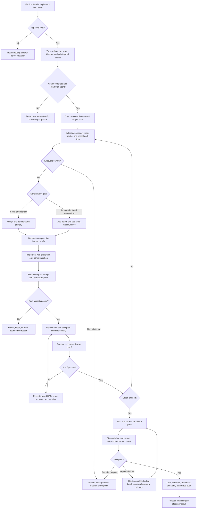

# Parallel Implement Efficiency Synthesis

Status: lean design reference and implementation map incorporating the answered width-rule prototype; not an executable contract.

Runtime authority remains in:

- `skills/custom/parallel-implement/SKILL.md`;
- its disclosed worker, integrator, worktree, and ledger references;
- `skills/custom/parallel-implement/scripts/run_ledger.py` and `lane_worktree.py`;
- `skills/custom/parallel-implement/agents/openai.yaml`;
- `docs/agents/engineering-contract.md` and the target repository's tracker, domain, and validation contracts;
- `$review`, `$convergent-pr-review`, and `$resolving-merge-conflicts` at their owned boundaries; and
- the relationship map, pack tests, behavior evaluations, and installed mirror.

This note proposes a small efficiency change: retain one warm primary implementer, add independent actors only when their likely implementation savings exceed visible coordination cost, and measure results passively from the existing ledger. Five concurrent subagents remain the session ceiling, not a target. The runtime skill remains unchanged until an authorized implementation updates and validates every affected surface.

## How To Read This Document

This synthesis is a proposed runtime extraction, not an additional operating contract. Read the design sections to understand the intended behavior, the ownership map to place each change once, and the evidence sections to decide whether a stage earns promotion.

| Question | Owning section |
| --- | --- |
| What outcome and trade-off govern the rewrite? | [North Star](#north-star) and [Design Verdict](#design-verdict) |
| What is the proposed normal path? | [Lean Operating Model](#lean-operating-model) and [End-To-End Delivery Map](#end-to-end-delivery-map) |
| When should width remain serial or grow through five? | [Actor And Width Policy](#actor-and-width-policy) |
| How are context, proof, and telemetry kept economical? | [Compact Context And Results](#compact-context-and-results), [Proof Model](#proof-model), and [Passive Telemetry And Release Result](#passive-telemetry-and-release-result) |
| How does the normal terminal path avoid manual ledger plumbing? | [Terminal Operator Facade](#terminal-operator-facade) |
| Which runtime surface owns each change? | [Runtime Ownership And Change Map](#runtime-ownership-and-change-map) |
| What must pass before implementation or promotion? | [Behavior Evaluation](#behavior-evaluation), [Implementation Order](#implementation-order), and [Completion Criterion For The Future Rewrite](#completion-criterion-for-the-future-rewrite) |
| Which ideas remain evidence or hypotheses? | [Prototype Evidence](#prototype-evidence) and [Deferred Optimization Laboratory](#deferred-optimization-laboratory) |

When explanatory prose disagrees with a decision contract, ownership row, or promotion gate, correct the prose; do not create a second rule.

## North Star

Parallel Implement owns one outcome: deliver exactly one parent-backed ticket graph through verified Lock with minimum practical agent-controlled time and token use, subject to invariant correctness.

Correctness, graph coverage, authority, public-seam proof, recovery, independent review, tracker read-back, and Release are gates. They are never exchanged for speed or token savings.

Use a result vector rather than a synthetic efficiency score:

```text
verified outcome
agent-controlled elapsed time
total campaign tokens when platform telemetry exposes them
fresh implementation contexts
peak implementation width
proof cost
root backpressure
rework
root-authored normal-path packets
low-level compatibility fallbacks
```

A strategy is better only when it preserves the gates and improves at least one measured cost without materially worsening another. The initial runtime uses one `balanced` policy; `favor-speed` and `favor-tokens` remain deferred until evidence shows stable frontier endpoints.

## Design Verdict

The previous proposal correctly identified useful optimization questions but promoted too many of them into mandatory procedure. Calibration profiles, predicted return schedules, automatic reasoning tiers, context-rollover knees, proof caches, provider batching, source fingerprint graphs, per-class token budgets, and live frontier estimation each add state, prompts, validation, and recovery paths. Operating all of them could cost more than the parallelism saves.

Use two layers:

| Layer | Purpose | Runtime status |
| --- | --- | --- |
| Lean delivery core | Preserve correctness while removing known context and proof waste | Ready for staged direct implementation |
| Optimization laboratory | Test whether advanced controls improve the measured result vector | Width-rule shape answered; remaining controls stay deferred unless separately justified |

The synthesis keeps deferred ideas visible without making workers, roots, helpers, or ledgers operate them.

## Lean Operating Model

```text
one root campaign owner
    + one warm primary implementer
    + zero to four additional implementation actors when a simple gate passes
    + focused worker proof that may overlap only when resource-isolated
    + serial wave and candidate proof
    + fresh reviewers only at the immutable review gate
```

The root retains scope, graph reconciliation, semantic independence, dispatch, result acceptance, landing, correction routing, formal review, tracker mutation, push, and Release. Helpers generate and validate packets; they never make semantic decisions.

The lean change has six parts:

1. Reuse one primary implementation context across successive bounded assignments.
2. Generate complete compact briefs and receipts instead of repeating campaign context.
3. Require acceptance proof at the highest meaningful caller-facing seam.
4. Adjust implementation width with a small observable rule, up to five.
5. Derive a compact efficiency result from ledger events without asking agents for narrative telemetry.
6. Keep Review through Release on one typed terminal-packet generator plus `apply`, without hand-authored event IDs.

## End-To-End Delivery Map



## Decision Contracts

| Decision | Owner | Passing evidence | Failure branch |
| --- | --- | --- | --- |
| Top-level root? | Parallel Implement | Invocation is at the root | Return routing blocker before mutation |
| Graph ready? | Root | One exhaustive parent graph has settled acceptance, dependencies, scopes, state branches, and proof seams | Return one exhaustive `$to-tickets` repair packet |
| Canonical stream identified? | Normal-path helper | `--events` is absolute; `start` alone may create it; every later command finds the same existing stream | Fail with the resolved path and no mutation |
| Frontier executable? | Root | Tracker and ledger agree and all blockers are satisfied | Checkpoint exact blockers |
| Additional actor justified? | Root | The item is substantial, semantically independent, proof-isolated, and root capacity is available | Keep it serial |
| Primary reusable? | Root | Actor is idle, available, useful, and has no unresolved lane or process state | Spawn a replacement from a checkpoint |
| Integration checkout owned? | Root | Campaign state classifies it as `existing-checkout` or `managed-integration-worktree` with its exact path and cleanup authority | Stop before opening lanes |
| Worker result acceptable? | Root | Clean commit, expected scope, caller-facing proof, current base, and known lane disposition | Reject, block, or request bounded correction |
| Wave proof passes? | Root or bounded integrator | Recombined affected behavior passes on current integration HEAD | Record a trusted RED and serialize correction |
| Width may increase? | Root | No serial latch is active, the previous parallel wave was clean, no result queue exists, and another independent substantial item is ready | Hold width |
| Width must collapse? | Root | Correctness failure, overlap, invalidation, contention, or inspection queue occurred | Return to one and latch serial execution |
| Serial latch releasable? | Root | An explicit reconciled capacity or workload change removes the condition that caused Downshift | Keep the latch closed; a clean serial wave is not release evidence |
| Terminal packet applicable? | Root, with mechanical prefill | Current reducer state admits exactly the requested `review`, `repair`, `closeout`, or `release` packet and the root supplies its judgment or external evidence | Return the missing fields or valid next terminal step |
| Lock ready? | Root and reducer | Accepted reviewed HEAD equals current integration HEAD and all proof, closeout, and lane gates pass | Checkpoint the exact missing gate |

Helpers may validate structure, state, ancestry, budgets, and receipts. They do not decide semantic independence, public-seam adequacy, result acceptance, finding admission, or residual risk.

Every `status.next_action` is a conservative projection of current reducer state. It must be presently valid, must not regress behind recorded Review, Lock, tracker, push, or Release evidence, and may be `null` with exact missing evidence when no mechanical suggestion is safe.

## Actor And Width Policy

### Warm Primary

The first executable assignment creates one direct fresh-context child with role `primary`. Later assignments reuse that actor through a new generated brief only when it is idle and safe.

Actor reuse never means checkout reuse:

- each assignment receives a reconciled base, isolated lane, claim, proof environment, and report path;
- the actor works on one assignment at a time;
- each assignment returns one clean commit and receipt; and
- the root inspects and lands every commit serially.

Replace the primary at a clean boundary when it is unavailable, unsafe to resume, or retains materially misleading context. Record a compact checkpoint and replacement reason. Do not instrument or predict a context-rollover knee in the lean runtime.

### Additional Actors

Each additional actor is one fresh direct child for one substantial, proved-independent item. It receives the common campaign pointer and one assignment brief, never the parent conversation.

Five is the maximum number of concurrent subagents, not the expected implementation width. Implementation may occupy all five slots only when no diagnosis, correction, integration, or review role needs capacity. All implementation actors quiesce before formal review. Supporting roles use released capacity without a permanent reserved-slot policy or role scheduler.

Reasoning tier remains fixed or caller-selected at fresh spawn time. The lean runtime does not automatically choose a tier and never tries to change a warm actor's tier in place.

### Integration Checkout Ownership

Campaign start records exactly one integration checkout:

```text
mode: existing-checkout | managed-integration-worktree
absolute path:
Git common directory:
starting HEAD:
campaign cleanup authority: none | managed
```

An `existing-checkout` is user- or session-owned. The campaign proves its state but never removes it. A `managed-integration-worktree` is campaign-owned: create, register, inspect, and clean it through the worktree helper with role `integration`, including long-path residual recovery. Do not use raw `git worktree remove` on either normal path. Checkpoint and Release preserve the mode, registration, path, HEAD, cleanliness, and final disposition.

### Simple Width Rule

Use this rule instead of a predictive controller:

| State | Width action |
| --- | --- |
| Default or uncertain | Start or remain at one |
| Cold start with two obviously substantial, semantically independent, proof-isolated items and immediate root capacity | Root may start at two |
| No serial latch, clean prior parallel wave, no uninspected result, free session capacity, and another independent substantial item | Increase by one, up to the caller cap of five |
| Work is ready but small, shared, contending, or integration-heavy | Keep serial |
| Any correctness failure, overlap, stale or invalidated work, proof contention, or result queue | Return to one and latch serial execution |
| Serial latch active | Stay at one until an explicit reconciled capacity or workload change removes its cause |
| No executable work or missing authority | Use zero writers and checkpoint |

Do not calculate a numeric marginal-savings inequality during delivery. Record one compact reason code for each serial or parallel frontier:

```text
serial-default
serial-tripwire
serial-backpressure
parallel-independent
widen-after-clean-wave
downshift-correctness
downshift-overlap
downshift-stale
downshift-contention
downshift-backpressure
serial-after-downshift
reset-after-external-change
```

A Downshift governs new dispatch and invalid work; it never discards safe active work. Stop widening, checkpoint affected lanes, and let the root drain or quiesce unaffected lanes before the next serial frontier.

Downshift sets one serial latch for the campaign. A later clean serial wave proves only serial viability and cannot reopen parallelism. Release the latch only after the root reconciles an explicit external change, such as newly available inspection capacity, a removed proof-resource conflict, or a materially different noncontending frontier. Record the original cause and release evidence. This one-bit memory prevents repeated `2 -> 1 -> 2 -> 1` exploration without reintroducing a predictive controller.

The serial tripwires remain:

- shared caller-facing seam or production file;
- shared mutable fixture or generated artifact;
- public entrypoint, CLI, API, orchestration, or terminal integration;
- cross-cutting performance work or timing-sensitive benchmark;
- migration, cutover, rollback, permission, protected-data, or trust-boundary work before its production tracer passes;
- integration correction or formal-review Repair;
- fewer than two independently provable ready items; or
- insufficient immediate root review capacity.

Among equally eligible items, give the warm primary the work most likely to shorten or protect the remaining critical path. Do not add return-time prediction or lookahead mutation to the lean runtime.

## Compact Context And Results

Store common campaign context once and assignment-specific context separately. The root reads the exhaustive graph once. Workers receive paths to complete generated briefs rather than repeated issue graphs or conversation history.

Each ticket should expose a minimum economic slice:

```text
Work item and source pointer:
Acceptance and dependencies:
Semantic owner:
Expected write scope:
Highest meaningful proof seam:
Focused proof command file:
Shared fixtures or contention:
Serial tripwire:
Exclusions:
```

Merge tiny adjacent work sharing one semantic owner and proof seam unless it carries an independent commitment, dependency unlock, rollback boundary, authority, or proof result. Parallel Implement may return inefficient slicing as a graph defect instead of opening several uneconomic lanes.

`run_ledger.py brief` should render the complete assignment:

- campaign and work-item pointers;
- immutable base SHA;
- actor, role, worktree, claim, and preflight identity;
- acceptance, expected scope, exclusions, and public proof seam;
- proof-command file and report path; and
- structured result schema.

The dispatch prompt becomes:

```text
Read <absolute generated brief>. Perform that assignment in its recorded
worktree. Write the structured result to <report path> and return its status.
```

Workers send one dispatch acknowledgement, immediate exception or decision-needed notification, and one final receipt. Use collaboration status or wait mechanisms for liveness. Do not require periodic narrative heartbeats.

The final receipt contains only:

```text
status: done | needs-feedback | blocker
commit SHA
changed-scope summary
proof outcome and log path
risks or skipped checks
structured report path
```

Criterion-level evidence stays in the report; complete stdout and stderr stay in proof logs. Successful proof returns command identity, exit code, duration, counts, environment identity, and log digest. Failure adds one capped diagnostic excerpt. The root loads full logs only to diagnose or resolve a disputed claim.

## Proof Model

Every ticket names the highest meaningful caller-facing proof seam before dispatch. Private-helper proof is sufficient only when the helper is the highest supported seam or the public seam is explicitly unavailable with recorded residual risk.

Use three proof levels:

1. **Slice proof.** Each actor runs the smallest caller-facing acceptance proof for its assignment.
2. **Wave proof.** After the selected wave lands serially, run one recombined affected-area proof.
3. **Candidate proof.** After the graph drains, run one current canonical broad or full proof before formal review.

Order commands fail-fast: scope and diff checks, syntax or static checks, focused caller-facing proof, then broader affected-area proof. Stop at the first trustworthy failure and preserve its diagnostics.

Focused worker proofs may overlap only when they are resource-isolated. Wave proof, candidate proof, shared-resource proof, and performance benchmarks run serially. Do not add a proof-width scheduler or exact-state proof cache initially. Avoid redundant broad suites by running them once per changed candidate.

## Passive Telemetry And Release Result

Telemetry must be event-derived and nearly free. Do not ask agents to estimate tokens, context size, difficulty, productivity, or saved time.

The canonical `events.jsonl` already carries timestamps and campaign transitions. Derive the initial result from those events and platform telemetry:

| Result | Source |
| --- | --- |
| Outcome | Checkpoint or Release state |
| Raw wall-clock time | Start-to-Lock event timestamps |
| Explicit excluded wait | Checkpoint-to-resume intervals caused by user or unavailable external authority |
| Agent-controlled elapsed time | Raw time minus explicit excluded waits |
| Total campaign tokens | Platform telemetry only; otherwise `unavailable` |
| Fresh implementation contexts | Actor creation count |
| Peak implementation width | Dispatch and handoff intervals |
| Proof cost | Focused, wave, and candidate invocation counts and durations |
| Root backpressure | Maximum returned-but-uninspected packet count |
| Rework | Reject, stale-base, conflict, regression, correction, and Repair counts |
| Operator packet load | Root-authored normal-path packet count |
| Compatibility fallback load | Low-level `append`, `append-receipt`, or hand-authored event packet count |
| Canonical event volume | Generated event count, reported as authority evidence rather than operator effort |
| Correctness result | Final proof, review, Lock, tracker read-back, push proof when authorized, and Release |

Do not collect per-role or per-file token categories in the initial runtime. Do not infer missing token telemetry from prompt length. Prompt bytes, fresh-context count, and tool-output volume may be reported only as explicitly labeled structural proxies in controlled evaluation.

Release renders one compact result:

```text
Outcome:
Elapsed to verified Lock:
Excluded wait and raw wall-clock:
Total tokens: measured | unavailable
Actors opened / peak implementation width:
Proof invocations and duration:
Maximum uninspected result queue:
Rework events:
Root-authored packets / generated events:
Low-level compatibility fallbacks:
Downshift latch cause and release:
Review and Repair generations:
Measurement gaps and residual risk:
```

No scalar score, simulated savings, or unmeasured frontier claim appears in Release.

## Terminal Operator Facade

The normal path must remain normal through Review, Repair, Lock, and Release. The root should never need to inspect `run_ledger.py`, calculate event IDs, or fall back to `append-receipt` merely because implementation has drained.

Use one typed packet generator and the existing ingestion command:

```text
python <skill-dir>/scripts/run_ledger.py prepare --events <absolute-events.jsonl> --repo <repo> --step <review|repair|closeout|release> --output <absolute-packet.json>
python <skill-dir>/scripts/run_ledger.py apply --events <absolute-events.jsonl> --repo <repo> --packet-file <absolute-packet.json>
```

`prepare` reads current canonical state and emits one readable typed packet with stable identity, current immutable heads, budgets, applicable prior evidence, required root-owned fields, and exact missing evidence. The root fills only semantic judgment or external read-back. `apply` expands the packet into canonical events, supplies stable event IDs, validates the complete prospective state, appends durably, and returns the receipt plus the next mechanically valid state.

The four steps own these bounded surfaces:

| Step | Prefilled evidence | Root-supplied material |
| --- | --- | --- |
| `review` | Drained graph, loop-close proof, immutable target, route, budgets, prior invocation | Invocation identity when external, classified findings, decision, residual risk |
| `repair` | Reviewed HEAD, admitted finding candidates, remaining budgets, prior owner and scope evidence | One complete eligible finding set, ownership, bounded scopes, proof and successor evidence |
| `closeout` | Approved HEAD, child order, expected mutations, required comments and read-back fields, push requirement | Per-item external mutation observations, parent observation, push verification when authorized |
| `release` | Complete proof, Review, closeout, lane, push, friction, and efficiency state | Deliberate friction synthesis when needed, terminal disposition, residual risk |

A provider-neutral closeout packet may carry several child read-backs, but every entry retains its work item, intended mutation, posted comment, observed state, and mutation read-back. The helper preserves child-first ordering and reports unresolved items individually. It does not perform tracker mutations, infer provider success, hide partial external completion, or close the parent before every required child passes. This is ledger-ingestion batching, not provider-operation batching.

Normal-path stream identity is strict:

- `start` requires an absolute event path and is the only command that may create the canonical stream;
- `status`, `prepare`, `apply`, `brief`, `finish`, and closeout helpers require that exact existing stream;
- missing-stream errors report the resolved absolute path and never appear as a fresh empty campaign; and
- packet and output paths are absolute so changing worktrees or shell directories cannot redirect campaign state.

`append`, `append-batch`, and `append-receipt` remain compatibility and recovery surfaces. Normal execution neither calls them nor supplies event IDs. `RUN-LEDGER.md` documents the generator-and-apply path completely but does not copy the executable field schema into `SKILL.md`.

Canonical event count remains authority evidence. Efficiency is judged by fewer root-authored packets, source inspections, quoting failures, retries, and compatibility fallbacks while preserving the same or stronger reducer state.

## Drain, Correction, And Recovery

The root accepts only a clean committed `done` whose expected and actual scopes reconcile and whose acceptance maps to caller-facing proof. Land accepted commits serially and run one recombined proof after the wave.

Route correction by locality:

1. Return a lane-specific correction to its original actor when it remains available and safe.
2. Send a cross-lane or caller-facing correction to the warm primary with the trusted RED and bounded scope.
3. Use a fresh correction actor only when the original and primary are unavailable or unsafe.
4. Permit a tiny root fix only through the existing explicit authority boundary.

Any correctness or integration failure collapses implementation width to one. Correction and Repair start from the recorded current HEAD, produce one clean commit, prove the regression, and invalidate stale candidate evidence.

Before landing a returned lane, reconcile current base, expected and actual scope, tracker state, and overlap with work landed since dispatch. Notify an active actor when a known landing or user decision invalidates its assignment. Preserve invalidated work in a checkpoint; do not build a full source-digest dependency graph initially.

Checkpoint remains nonterminal. Quiesce actors and record current HEAD, integration-checkout ownership and registration, actors, lanes, claims, frontier, serial-latch state and cause, blockers, result queue, tracker and remote state, open correction or Repair, and the exact continuation. Resume only after fresh reconciliation. Missing actor or integration-checkout state is never completion.

## Review, Lock, And Release

Pin one immutable candidate only after the graph drains, actors are idle, lane dispositions are known, integration is clean, wave proof is complete, and one current candidate proof passes.

Invoke exactly one formal-review owner:

- `$review` for an ordinary fixed-snapshot diff; or
- `$convergent-pr-review` for a local PR or high-risk candidate.

Implementation actors never count as independent reviewers. The review report grants no mutation. The root admits one complete eligible finding batch under the existing Repair and successor-review budgets. A repaired successor receives required proof and a fresh formal review.

Record terminal decisions through `prepare` and `apply`: generate the current `review` packet after the external report, a `repair` packet only for an admitted batch, `closeout` packets around external read-backs, and one final `release` packet. The generator prefills state; it never admits findings, authorizes mutations, or invents evidence.

Lock opens only when the accepted reviewed HEAD equals current integration HEAD and every required proof, review, child packet, tracker mutation, and lane disposition is complete. Close children before the parent, read back each mutation, release claims, and push only with authority.

Release quiesces actors, cleans or explicitly preserves lanes and the managed integration worktree, adjudicates friction, validates terminal state, renders `LEDGER.md`, and adds the compact passive result. Runtime-contract-3 Release remains terminal and accepts only `complete`.

## Relationship Table

| Caller | Verb | Callee | Trigger And Return |
| --- | --- | --- | --- |
| Direct user | Invoke | `$parallel-implement` | The user explicitly selects one parent-backed ready graph; root-only admission still applies. |
| `$to-tickets` | Recommend and stop | `$parallel-implement` | A verified parent graph has non-empty executable scope and economically shaped tickets. |
| `$parallel-implement` | Invoke | `$tdd` | One assignment has red-testable new behavior or a fully known red-capable bug. |
| `$parallel-implement` | Invoke | `$diagnosing-bugs` | One assigned bug lacks settled expected behavior, symptom, cause, or trusted reproduction. |
| `$parallel-implement` | Invoke | `$review` | The immutable candidate needs ordinary fixed-snapshot review. |
| `$parallel-implement` | Invoke | `$convergent-pr-review` | The immutable candidate is a local PR or high-risk diff. |
| `$parallel-implement` | Invoke | `$resolving-merge-conflicts` | Serial landing enters preserved conflicted or partially applied Git state. |
| `$parallel-implement` | Recommend and stop | `$repo-bootstrap` | A required setup surface is missing or incompatible. |
| `$parallel-implement` | Recommend and stop | `$to-tickets` | The parent graph is incomplete, ambiguous, uneconomically sliced, or not Ready-for-agent. |

Parallel Implement has no direct relationship to Wayfinder, To Spec, Audit Codebase, or Improve Codebase during delivery. It does not hand singleton frontiers to `$implement`; it owns the complete parent campaign and uses the primary for serial work. Workers and child integrators never dispatch peers, invoke formal review, mutate trackers, or push.

## Runtime Ownership And Change Map

Each proposed behavior has one runtime owner. The `Must not absorb` column is part of the design: it prevents a concise skill from becoming a second helper manual and prevents mechanical helpers from acquiring semantic authority.

| Surface | Owns | Proposed delta | Must not absorb | Required proof |
| --- | --- | --- | --- | --- |
| `skills/custom/parallel-implement/SKILL.md` | Outcome, root authority, leading-word spine, universal gates, branch selection, return, and completion | Add warm-primary reuse, the simple width rule, public-seam proof, compact context and receipts, terminal-facade invocation, correction locality, passive results, and the five-agent ceiling | Executable packet schemas, provider transport, helper internals, predictive scheduling, caches, automatic tiers, or per-class budgets | Structural contract tests plus positive and negative behavior evaluation |
| `agents/openai.yaml` | Explicit-only invocation policy and concise human-facing prompt | Retain `allow_implicit_invocation: false`; mention the warm primary, adaptive width up to five, serial landing, and verified reviewed HEAD | Runtime procedure or detailed gating | Invocation-policy validation |
| `references/WORKER-BRIEF.md` and `references/INTEGRATOR-BRIEF.md` | Mode-specific assignment, authority, receipt, and completion contracts | Make briefs complete and file-backed; add the public proof seam, compact receipt, exception-only communication, reuse boundary, and correction continuation | Root dispatch policy, peer dispatch, tracker mutation, formal review, or Release | Reference-resolution tests and representative packet evaluation |
| `references/CODEX-WORKTREE-LAUNCH.md` and `scripts/lane_worktree.py` | Lane preflight, stable paths, registration, and recoverable cleanup | Distinguish `existing-checkout` from `managed-integration-worktree`; create or clean only the managed form, including long-path residual recovery | Wave batching, proof scheduling, actor selection, semantic independence, or result acceptance | Existing-checkout preservation, managed cleanup, missing-registration, and long-path recovery tests |
| `references/RUN-LEDGER.md` | Operator-facing ledger procedure and normal-versus-recovery command selection | Document complete `brief`, `prepare`, `apply`, `status`, and `finish` examples through Review, Repair, closeout, and Release | Reducer implementation details or a duplicate event schema | Command examples exercised against canonical fixtures without helper-source inspection |
| `scripts/run_ledger.py` | Canonical event reduction, packet generation and ingestion, state validation, rendering, and passive result derivation | Add actor reuse and width state, reason codes and serial latch, complete briefs and receipts, absolute stream identity, monotonic `next_action`, typed terminal packets, closeout read-back batches, proof level and duration, result-queue state, and Release results | Semantic independence, public-proof adequacy, finding admission, tracker mutation, automatic width changes, or efficient-frontier calculation | Reducer transition tests, idempotency and missing-stream negatives, terminal-path fixtures, and Release-result fixtures |
| `skills/custom/to-tickets/SKILL.md` | Shaping boundary for executable tickets | Require a minimum economic slice and compact execution profile where Parallel Implement is an authorized route | Parallel dispatch procedure or runtime width selection | Relationship and ticket-shape evaluations |
| `docs/synthesis/skill-context-relationships.md` | One authoritative composition edge per caller and callee | Update changed triggers and return boundaries without copying runtime procedure | Skill-local mechanics | Relationship tests |
| `tests/test_skill_pack_contracts.py` and `docs/validation/evals/core-workflows.md` | Structural contracts and behavior evaluations | Cover primary reuse, scaling through five, Downshift and latch release, result-queue hold, public proof, compact packets, terminal facade, stream identity, checkout ownership, closeout batching, passive telemetry, correction locality, and mirror parity | Incidental prose snapshots or simulated claims of real efficiency | Focused static tests plus repeated control-versus-candidate behavioral samples |
| Installed mirror `C:\Users\steve\.agents\skills\parallel-implement` | Validated runtime copy | Synchronize only after canonical implementation and proof complete | Independent edits or partial synchronization | File-by-file hash parity after installation |

Preserve `events.jsonl`, generated `LEDGER.md`, runtime contract 3, `SCHEMA_VERSION = 1`, receipt authority, and compatibility commands. `append`, `append-batch`, and `append-receipt` remain recovery surfaces; the normal path uses generated packets. Helpers validate structure and authority transitions but never make the root's semantic decisions.

## Behavior Evaluation

Run a current-skill control before claiming improvement. Static contract tests protect structure; they do not prove lower time or token use.

Use fixed repository snapshots, graphs, tools, model and reasoning tier, and rubrics. Run enough fresh samples to expose variance; five per arm is the minimum for a promoted behavioral claim. Report median, range or variance, and worst observed outcome.

Measure only the passive result vector. When platform token telemetry is unavailable, say so and report structural proxies separately.

Positive scenarios must show that the candidate:

- reuses one primary across semantically connected assignments with a new lane each time;
- keeps tiny, shared-seam, integration, performance, correction, and Repair work serial;
- starts at two only for two obvious substantial independent items;
- widens by one after clean waves and can reach five when the graph genuinely supports it;
- refuses to widen while results wait for root inspection;
- returns to one and latches serial execution after correctness, overlap, stale work, contention, or backpressure;
- releases the latch only after a reconciled external capacity or workload change;
- generates compact complete briefs and receipts;
- completes Review through Release through typed `prepare` and `apply` packets without inspecting helper source or supplying event IDs;
- fails clearly on a relative or missing normal-path stream instead of presenting an empty campaign;
- returns only a presently legal monotonic status suggestion, or `null` with missing evidence;
- preserves existing integration checkouts and safely cleans managed integration worktrees;
- ingests multi-child closeout read-backs through one packet while preserving each child's evidence and unresolved state;
- proves the highest meaningful public seam;
- runs one slice proof per assignment, one recombined proof per wave, and one current candidate proof;
- routes correction to the original owner or primary; and
- reaches the same or stronger Lock evidence with a non-dominated measured result.

Negative controls must show that it does not:

- treat disjoint filenames or available slots as sufficient independence;
- launch five actors because five are available;
- reopen parallelism merely because one later serial wave was clean;
- retain one mutable worktree across primary assignments;
- ask workers for token estimates or narrative progress telemetry;
- infer missing token measurements from prompt length;
- use compatibility append commands on the normal terminal path;
- treat fewer canonical events as an efficiency win when operator-authored packets do not fall;
- auto-mutate a tracker, infer a successful read-back, or hide partial external closeout;
- remove an existing integration checkout or bypass managed-worktree cleanup;
- parallelize broad proof or timing-sensitive benchmarks;
- count implementation actors as independent reviewers;
- auto-accept generated packets or worker reports; or
- weaken checkpoint, proof, tracker, Lock, push, cleanup, or Release authority.

## Implementation Order

Use two small promotable stages.

### Stage 1: Context And Measurement Hygiene

1. Add complete file-backed briefs, compact receipts, bounded proof output, public-seam acceptance, and passive Release results.
2. Add strict absolute stream identity, monotonic status projection, and the typed `prepare` plus `apply` terminal path through Release.
3. Add provider-neutral closeout read-back ingestion and explicit integration-checkout ownership with managed cleanup.
4. Reuse the primary across new reconciled lanes.
5. Preserve existing selection width while running control-versus-candidate evaluation.

Promote only if correctness is unchanged and total campaign tokens, fresh contexts, proof load, operator-authored packets, source inspections, compatibility fallbacks, retries, or time-to-Lock improves without material regression elsewhere. Generated canonical event count may stay the same or increase when it carries stronger authority at lower operator cost.

### Stage 2: Simple Adaptive Width

1. Add the serial default, narrow two-item cold-start exception, additive widening through five, result-queue hold, immediate Downshift triggers, and the one-bit serial latch.
2. Keep every width and latch-release decision with the root and record one reason code plus release evidence when applicable.
3. Evaluate representative singleton, shared-seam, two-lane, and three-to-five-lane graphs.

Promote only if the adaptive rule expands or improves the measured result frontier without weakening correctness or tail outcomes.

For each stage, update all owned canonical surfaces, run focused and full tests, validate the skill pack, dry-run installation, run both diff checks, synchronize the scoped installed mirror, and verify hash parity. Never claim efficiency from prose or simulation alone.

## Deliberate Non-Changes

- Keep Parallel Implement root-only and explicit-only.
- Keep one exhaustive parent graph and existing Ready-for-agent boundary.
- Keep Git worktrees, tracker claims, `.tmp` state, Python helpers, and serial landing.
- Keep runtime-contract-3 checkpoints, review and Repair budgets, receipt authority, Lock, and terminal Release.
- Keep canonical event granularity; reduce manual packet plumbing rather than authority evidence.
- Keep external tracker mutation and per-item Mutation read-back root-owned; closeout packet batching changes ledger ingestion only.
- Keep `append`, `append-batch`, and `append-receipt` for compatibility and recovery, outside the normal path.
- Keep broad proof and benchmarks serial.
- Keep formal review independent and leave reviewer count to the review owner.
- Keep protected-test, permission, deployment, push, and other external authority boundaries unchanged.
- Do not persist one mutable primary worktree across assignments.
- Do not auto-accept worker reports, conflicts, repairs, tracker mutations, or residual risk.
- Do not generalize beyond the pack's shared Git, tracker, Python, and setup contract.

## Prototype Evidence

Status: `answered` for scheduler shape; not production performance proof.

One disposable deterministic Python decision surface tested this question:

> Can the lean root-owned width rule use one to five actors without predictive time or token machinery?

The objective criteria covered serial tripwires, tiny-work thrift, clean scaling through five, Downshift after root backpressure, proof contention, or correctness failure, aggregate non-domination against fixed widths, and a prediction-free decision interface. The probe ran twice identically through one repo-native command and was deleted after judgment.

The first version exposed `2 -> 1 -> 2 -> 1` oscillation after backpressure and proof contention. A clean serial wave did not establish restored parallel capacity. Adding the one-bit serial latch removed the oscillation while keeping the rule classification-based rather than predictive.

Final representative width sequences were:

| Scenario | Lean widths | Observed design result |
| --- | --- | --- |
| Tiny independent work | `1,1,1,1,1,1` | Context overhead stayed serial |
| Shared caller-facing seam | `1,1,1,1,1,1` | Tripwire held |
| Long clean independent work | `2,3,4,5,1` | Additive scaling reached five |
| Root-backpressure shock | `2,1,1,1,1,1,1` | Serial latch prevented oscillation |
| Proof-contention shock | `2,1,1,1,1,1,1` | Serial latch prevented repeated contention |
| Failure at width three | `2,3,1,1,1,1,1` | Correctness failure forced persistent serialization |

The synthetic aggregate remained non-dominated:

| Policy | Modeled time units | Modeled token units |
| --- | ---: | ---: |
| Fixed width one | 707.6 | 245,000 |
| Lean adaptive | 481.6 | 259,880 |
| Fixed width two | 439.6 | 263,720 |
| Fixed width five | 285.8 | 278,660 |

Fixed width one used fewer modeled tokens but more time; wider policies used more modeled tokens but less time. The adaptive policy therefore occupied a distinct modeled frontier point. However, fixed width two dominated the adaptive policy in the isolated width-three-failure scenario, proving that exploration has real local cost.

Limits are decisive: task costs, failures, queues, scenario weights, and token values were deterministic fixtures. The probe measured no real model tokens, root attention, worktrees, tests, review, or recovery. It supports the simple rule and serial latch as a Stage 2 candidate only. Stage promotion still requires repeated real-agent behavior evaluation with passive telemetry.

## Deferred Optimization Laboratory

The following ideas remain hypotheses, not initial runtime requirements:

- `favor-speed` and `favor-tokens` policy endpoints;
- calibration profiles and graph-shape classifiers;
- deterministic marginal frontier estimation;
- automatic reasoning-tier selection;
- measured context-rollover knees;
- predicted return staggering and lookahead preparation;
- per-cost-class time or token progress budgets;
- source, interface, and fixture fingerprint graphs;
- exact-state proof caching;
- independent proof-width optimization;
- provider-operation batching, provider-specific tracker importers, and wave-level lane facades; and
- detailed per-role token attribution, confidence models, and tail prediction.

Each idea must first prove that its time or token savings exceed its collection, decision, validation, maintenance, and recovery cost. Promote controls independently; never require Stage 3 as one bundle. Provider-neutral batching of already-observed closeout evidence belongs to the lean terminal facade; batching or automating external provider mutations remains deferred. The completed prototype answered only the simple width-rule shape; tier choices, context rollover, telemetry availability, and other advanced controls remain unproved and are not prerequisites for the lean rewrite.

The next recommended route is direct `$writing-great-skills` implementation. Apply Stage 1 across the canonical skill, disclosed references, helpers, tests, behavior evaluations, relationship map, and installed mirror; validate its measured result before admitting Stage 2. Then apply and evaluate Stage 2 separately. No ticket-shaping or further prototype step is required before Stage 1.

## Completion Criterion For The Future Rewrite

The future rewrite is complete only when all six conditions hold:

1. **Surface coverage.** Every owned source, disclosed reference, helper, relationship, test, evaluation, and installed mirror is classified in the ownership map and changed only at its authority boundary.
2. **Execution behavior.** One warm primary and zero to four additional actors obey the root-owned width rule; every assignment uses a new reconciled lane; serial tripwires hold; Downshift latches serial execution until an explicit reconciled external change releases it.
3. **Economical proof.** Briefs, receipts, and proof output are compact and file-backed; the highest meaningful public seam and all three proof levels are enforced without redundant broad suites or narrative cost collection.
4. **Normal operator path.** The absolute canonical stream fails closed when missing; `status.next_action` remains monotonic and legal; Review through Release uses typed `prepare` and `apply` packets without helper-source inspection, manual event IDs, or compatibility commands; existing and managed integration checkouts retain distinct safe lifecycles.
5. **Authority and recovery.** Multi-child closeout preserves individual read-back authority; correction remains local; checkpoints and Lock remain recovery-complete; formal review remains fresh and independent; the accepted reviewed HEAD equals the released HEAD.
6. **Promotion evidence.** Each stage has repeated real-agent control-versus-candidate evidence, improves the measured result vector without weakening correctness or tail outcomes, passes canonical validation and mirror parity, and reports actual results and measurement gaps without a synthetic score or unproved savings claim.

## Extraction Audit

Before converting this synthesis into runtime changes, ask:

1. Does every proposed behavior have exactly one owner and an explicit anti-duplication boundary?
2. Can `SKILL.md` retain the universal operating spine while branch mechanics and executable schemas stay behind sharp pointers?
3. Does every helper remain mechanical, with semantic independence, proof adequacy, result acceptance, finding admission, and residual risk owned by the root?
4. Does each retained field, event, packet, and metric either change a decision or prove an outcome?
5. Have repeated runtime requirements been consolidated into the decision contracts, ownership map, behavior evaluation, or completion criterion rather than restated elsewhere?
6. Can Stage 1 ship and prove value independently before adaptive width is introduced in Stage 2?
7. Does behavioral evaluation compare real control and candidate runs while labeling simulations and unavailable token telemetry honestly?
8. Have all laboratory ideas remained outside the runtime until their expected savings exceed their collection, decision, validation, maintenance, and recovery cost?
