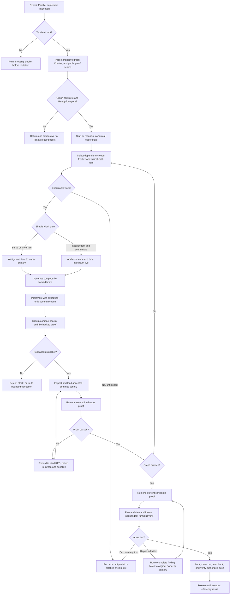

# Parallel Implement Efficiency Synthesis

Status: lean design reference and extraction map. Stage 1 and Stage 2 are implemented in the canonical working tree for validation; the installed global mirror remains the unchanged control until separately authorized synchronization.

Runtime authority remains in:

- `skills/custom/parallel-implement/SKILL.md`;
- its disclosed worker, integrator, worktree, and ledger references;
- `skills/custom/parallel-implement/scripts/run_ledger.py` and `lane_worktree.py`;
- `skills/custom/parallel-implement/agents/openai.yaml`;
- `docs/agents/engineering-contract.md` and the target repository's tracker, domain, and validation contracts;
- `$review`, `$convergent-pr-review`, and `$resolving-merge-conflicts` at their owned boundaries; and
- the relationship map, pack tests, behavior evaluations, and installed mirror.

This note specifies a small efficiency change: retain one warm primary implementer, add independent actors only when their likely implementation savings exceed visible coordination cost, and measure results passively from the existing ledger. Five concurrent subagents remain the session ceiling, not a target. Canonical extraction does not become the installed runtime until validation passes and synchronization is separately authorized.

## How To Read This Document

This synthesis is a proposed runtime extraction, not an additional operating contract. It has four layers:

1. **Orientation** states the outcome, selected design, and explanatory delivery flow.
2. **Normative Design** is the sole authority for proposed runtime behavior and relationships.
3. **Evidence And Rationale** preserves deliberate non-changes, prototype findings, limits, and deferred hypotheses without creating additional rules.
4. **Extraction And Verification** maps the design into owned runtime surfaces, locks the behavioral control, and governs staged promotion and residual gaps.

| Question | Owning section |
| --- | --- |
| What outcome and trade-off govern the rewrite? | [North Star](#north-star) and [Design Verdict](#design-verdict) |
| What is the proposed normal path? | [Lean Operating Model](#lean-operating-model) and [End-To-End Delivery Map](#end-to-end-delivery-map) |
| Which campaign terms have precise meanings? | [Campaign Vocabulary](#campaign-vocabulary) |
| What do the runtime leading words mean? | [Leading-Word Runtime Model](#leading-word-runtime-model) |
| Where does each proposed rule live? | [Normative Home Index](#normative-home-index) |
| Which operation is legal now, when is it complete, and what may it return? | [Campaign State And Transition Contract](#campaign-state-and-transition-contract), [Operation And Completion Contracts](#operation-and-completion-contracts), and [Return Contract](#return-contract) |
| Which campaign artifact proves what? | [Campaign Artifact Authority Contract](#campaign-artifact-authority-contract) |
| When should width remain serial or grow through five? | [Actor And Width Policy](#actor-and-width-policy) |
| How are context, proof, and telemetry kept economical? | [Compact Context And Results](#compact-context-and-results), [Proof Model](#proof-model), and [Passive Telemetry And Release Result](#passive-telemetry-and-release-result) |
| How does the normal terminal path avoid manual ledger plumbing? | [Terminal Operator Facade](#terminal-operator-facade) |
| How should the eventual main skill read and load references? | [Proposed Runtime Semantic Surface](#proposed-runtime-semantic-surface) and [Runtime Context Loading Contract](#runtime-context-loading-contract) |
| Which runtime surface owns each change? | [Runtime Ownership And Change Map](#runtime-ownership-and-change-map) |
| What must pass before implementation or promotion? | [Staged Behavior-Evaluation Protocol](#staged-behavior-evaluation-protocol), [Migration And Acceptance Matrix](#migration-and-acceptance-matrix), [Promotion Gate And Residual Gaps](#promotion-gate-and-residual-gaps), and [Completion Criterion For The Future Rewrite](#completion-criterion-for-the-future-rewrite) |
| Which ideas remain evidence or hypotheses? | [Prototype Evidence](#prototype-evidence) and [Deferred Optimization Laboratory](#deferred-optimization-laboratory) |

When another layer disagrees with Normative Design, correct that layer. The ownership map places rules, the staged protocol owns proof standard, the acceptance matrix owns case coverage, and the promotion gate owns admission; none may redefine runtime behavior.

# Layer One: Orientation

## North Star

Parallel Implement owns one outcome: deliver exactly one parent-backed ticket graph through verified Lock with minimum practical agent-controlled time and token use, subject to invariant correctness.

Correctness, graph coverage, authority, public-seam proof, recovery, independent review, tracker read-back, and Release are gates. They are never exchanged for speed or token savings.

Use a result vector rather than a synthetic efficiency score:

```text
verified outcome
agent-controlled elapsed time
total campaign tokens when platform telemetry exposes them
fresh implementation contexts
peak implementation width
proof cost
root backpressure
rework
root-authored normal-path packets
low-level compatibility fallbacks
```

A strategy is better only when it preserves the gates and improves at least one measured cost without materially worsening another. The initial runtime uses one `balanced` policy; `favor-speed` and `favor-tokens` remain deferred until evidence shows stable frontier endpoints.

## Design Verdict

The previous proposal correctly identified useful optimization questions but promoted too many of them into mandatory procedure. Calibration profiles, predicted return schedules, automatic reasoning tiers, context-rollover knees, proof caches, provider batching, source fingerprint graphs, per-class token budgets, and live frontier estimation each add state, prompts, validation, and recovery paths. Operating all of them could cost more than the parallelism saves.

The proposed implementation has two strata:

| Stratum | Purpose | Runtime status |
| --- | --- | --- |
| Lean delivery core | Preserve correctness while removing known context and proof waste | Ready for staged direct implementation |
| Optimization laboratory | Test whether advanced controls improve the measured result vector | Width-rule shape answered; remaining controls stay deferred unless separately justified |

The synthesis keeps deferred ideas visible without making workers, roots, helpers, or ledgers operate them.

## Lean Operating Model

```text
one root campaign owner
    + one warm primary implementer
    + zero to four additional implementation actors when a simple gate passes
    + focused worker proof that may overlap only when resource-isolated
    + serial wave and candidate proof
    + fresh reviewers only at the immutable review gate
```

The root retains scope, graph reconciliation, semantic independence, dispatch, result acceptance, landing, correction routing, formal review, tracker mutation, push, and Release. Helpers generate and validate packets; they never make semantic decisions.

The lean change has six parts:

1. Reuse one primary implementation context across successive bounded assignments.
2. Generate complete compact briefs and receipts instead of repeating campaign context.
3. Require acceptance proof at the highest meaningful caller-facing seam.
4. Adjust implementation width with a small observable rule, up to five.
5. Derive a compact efficiency result from ledger events without asking agents for narrative telemetry.
6. Keep Review through Release on one typed terminal-packet generator plus `apply`, without hand-authored event IDs.

## Campaign Vocabulary

Shared terms such as Charter, proof seam, fixed point, Repair generation, residual risk, and Lock retain their meanings from the engineering contract. Parallel Implement adds only this campaign-specific vocabulary:

| Term | Meaning |
| --- | --- |
| **Campaign** | One explicit root-owned run for one exhaustive parent-backed ticket graph, ending in a recovery-complete Checkpoint or terminal Release |
| **Frontier** | The reconciled dependency-ready work eligible for the root's next selection; readiness alone does not make every item economical or safe to parallelize |
| **Assignment** | One bounded work item joined to an actor, immutable base, isolated lane, acceptance, public proof seam, proof command, and result path |
| **Actor** | One direct implementation child in the role of warm primary, additional implementer, or bounded integrator |
| **Lane** | One isolated worktree and process boundary for one assignment; it is never the serial landing authority |
| **Integration checkout** | The recorded existing checkout or campaign-managed integration worktree where the root lands accepted commits serially |
| **Candidate** | The current immutable integration HEAD after the graph drains and candidate proof passes; any code-changing Repair creates a successor candidate |
| **Result queue** | Returned actor packets not yet classified and, when accepted, inspected, landed, and recombined under current proof |

These names orient the design. The indexed Layer Two contracts remain the sole authority for decisions, transitions, artifacts, completion, and Return.

## Leading-Word Runtime Model

The eventual skill should make its existing spine operational rather than merely mnemonic:

| Leading word | Runtime meaning |
| --- | --- |
| **Trace / Resume** | Establish or reconcile the exhaustive graph, Charter, canonical stream, actors, claims, worktrees, tracker, and remote state before choosing work |
| **Select** | Choose one dependency-ready frontier, its economical width, and one recorded reason |
| **Open** | Claim, isolate, preflight, brief, and make one actor observable |
| **Drain** | Classify every return, inspect and land accepted commits serially, and recombine proof on current integration HEAD |
| **Downshift** | Collapse new dispatch to one, latch the cause, and account for safe active work without discarding it |
| **Checkpoint** | Quiesce actors and preserve complete recovery state for one exact continuation |
| **Review / Repair** | Judge one immutable candidate independently and route at most one admitted bounded Repair batch under budget |
| **Lock** | Prove that the accepted reviewed current HEAD owns complete closeout and authorized push evidence |
| **Release** | Terminate only from verified `complete`, with actors and lanes safe and the passive result rendered |

**Reconcile** is universal: refresh authoritative Git, worktree, actor, ledger, tracker, claim, and remote state before every new dispatch, landing, resumed mutation, formal review, or terminal transition.

## End-To-End Delivery Map



# Layer Two: Normative Design

## Normative Home Index

This index assigns each proposed concern one authority. The named section owns the rule; this index, diagrams, rationale, ownership rows, evaluation protocol, and acceptance cases may point to or test it but never redefine it.

| Concern | Sole normative home |
| --- | --- |
| Root admission, graph readiness, semantic decisions, and Lock eligibility | [Decision Contracts](#decision-contracts) |
| Legal next operation from current canonical facts | [Campaign State And Transition Contract](#campaign-state-and-transition-contract) |
| Operation entry, completion, and legal nonterminal branch | [Operation And Completion Contracts](#operation-and-completion-contracts) |
| Reference-loading triggers and attention exclusions | [Runtime Context Loading Contract](#runtime-context-loading-contract) |
| Canonical, derived, scoped, review, and external evidence roles | [Campaign Artifact Authority Contract](#campaign-artifact-authority-contract) |
| Actor reuse, integration-checkout ownership, width, Downshift, and serial latch | [Actor And Width Policy](#actor-and-width-policy) |
| Assignment economics, briefs, receipts, and proof-output transport | [Compact Context And Results](#compact-context-and-results) |
| Slice, wave, and candidate proof | [Proof Model](#proof-model) |
| Passive measurement and the Release result | [Passive Telemetry And Release Result](#passive-telemetry-and-release-result) |
| Normal ledger commands, terminal packet generation, and closeout ingestion | [Terminal Operator Facade](#terminal-operator-facade) |
| Landing, correction, checkpoint, resume, and recovery | [Drain, Correction, And Recovery](#drain-correction-and-recovery) |
| Review, Repair, Lock, and Release sequencing | [Review, Lock, And Release](#review-lock-and-release) |
| External return form and required content | [Return Contract](#return-contract) |
| Cross-skill trigger, authority, and handoff | [Relationship Table](#relationship-table) |

## Decision Contracts

| Decision | Owner | Passing evidence | Failure branch |
| --- | --- | --- | --- |
| Top-level root? | Parallel Implement | Invocation is at the root | Return routing blocker before mutation |
| Graph ready? | Root | One exhaustive parent graph has settled acceptance, dependencies, scopes, state branches, and proof seams | Return one exhaustive `$to-tickets` repair packet |
| Canonical stream identified? | Normal-path helper | `--events` is absolute; `start` alone may create it; every later command finds the same existing stream | Fail with the resolved path and no mutation |
| Frontier executable? | Root | Tracker and ledger agree and all blockers are satisfied | Checkpoint exact blockers |
| Additional actor justified? | Root | The item is substantial, semantically independent, proof-isolated, and root capacity is available | Keep it serial |
| Primary reusable? | Root | Actor is idle, available, useful, and has no unresolved lane or process state | Spawn a replacement from a checkpoint |
| Integration checkout owned? | Root | Campaign state classifies it as `existing-checkout` or `managed-integration-worktree` with its exact path and cleanup authority | Stop before opening lanes |
| Worker result acceptable? | Root | Clean commit, expected scope, caller-facing proof, current base, and known lane disposition | Reject, block, or request bounded correction |
| Wave proof passes? | Root or bounded integrator | Recombined affected behavior passes on current integration HEAD | Record a trusted RED and serialize correction |
| Width may increase? | Root | No serial latch is active, the previous parallel wave was clean, no result queue exists, and another independent substantial item is ready | Hold width |
| Width must collapse? | Root | Correctness failure, overlap, invalidation, contention, or inspection queue occurred | Return to one and latch serial execution |
| Serial latch releasable? | Root | An explicit reconciled capacity or workload change removes the condition that caused Downshift | Keep the latch closed; a clean serial wave is not release evidence |
| Terminal packet applicable? | Root, with mechanical prefill | Current reducer state admits exactly the requested `review`, `repair`, `closeout`, or `release` packet and the root supplies its judgment or external evidence | Return the missing fields or valid next terminal step |
| Lock ready? | Root and reducer | Accepted reviewed HEAD equals current integration HEAD and all proof, closeout, and lane gates pass | Checkpoint the exact missing gate |

Helpers may validate structure, state, ancestry, budgets, and receipts. They do not decide semantic independence, public-seam adequacy, result acceptance, finding admission, or residual risk.

Every `status.next_action` is a conservative mechanical projection of the current canonical facts and the transition contract below. It must be presently legal, must not regress behind recorded Review, Lock, tracker, push, or Release evidence, and may be `null` with exact missing evidence when no suggestion is safe. It never chooses root-owned semantics or authorizes mutation by itself.

## Campaign State And Transition Contract

This table is the sole proposed authority for which operation may happen next. It derives legal movement from canonical facts already owned by the reducer; it creates no second lifecycle enum, event schema, or persisted state. The next section alone owns completion evidence.

| Observed canonical condition | Legal operation or branch | Illegal shortcut |
| --- | --- | --- |
| No stream exists after root and graph admission | **Trace** and `start` | Creating state through a later command or dispatching before start reads back |
| Reducer errors exist or resumed state is unreconciled | **Trace / Resume** and universal **Reconcile** | Selecting, dispatching, landing, reviewing, or closing from contradictory state |
| A Checkpoint is active | **Resume**, then **Reconcile** | Continuing from the old continuation or treating Checkpoint as Release |
| Reconciled unfinished scope has no return requiring Drain | **Select**; then **Open** for each authorized assignment | Dispatching merely because an item is ready or a slot is free |
| An actor is active, a result is queued, an accepted commit awaits landing, or integration regressed | **Drain**; **Downshift** or bounded correction when its predicate fires | Opening behind backpressure, skipping inspection, or reviewing an unproved HEAD |
| No executable work remains but the graph is unfinished or authority is unavailable | **Checkpoint** | Nonterminal Release or unaccounted actors, lanes, claims, or results |
| The graph is drained but candidate proof or review-ready identity is missing | Prove and pin the **Candidate**, then enter **Review** | Reviewing a mutable, stale, or unproved target |
| Review is pending or not accepted | **Review**; then one admitted **Repair** batch or a decision-required Checkpoint | Automatic finding admission, piecemeal Repairs, or Lock before the current candidate is accepted |
| Review accepts the current candidate but Lock evidence is incomplete | **Lock** | Mutating the accepted tree, inferring external success, or entering Release early |
| The reducer admits terminal `complete` after Lock | **Release** | Using Release for `partial`, `blocked`, or decision-required work |
| Terminal Release is recorded | No campaign operation remains | Reopening or appending post-terminal work under the same campaign |

## Operation And Completion Contracts

This table is the sole proposed authority for operation completion. The surrounding sections explain mechanics; they do not permit advancing before the applicable row passes.

| Operation | Enter when | Complete when | Nonterminal return |
| --- | --- | --- | --- |
| **Trace / Resume** | A top-level explicit invocation starts or resumes one campaign | The exhaustive graph, Charter, canonical stream, integration checkout, actors, lanes, claims, tracker, remote, budgets, and continuation reconcile without unknown state | Routing blocker before mutation; exhaustive graph-repair packet before dispatch; otherwise recovery-complete `partial` or `blocked` |
| **Select** | Reconciled unfinished scope needs a next frontier | Exactly one executable frontier, critical-path primary assignment, width, reason code, and required serial latch state are selected; or the absence of executable work is checkpointed with exact blockers | `partial` or `blocked` checkpoint |
| **Open** | One selected assignment has authority and capacity | Its claim reads back; exact base, checkout, preflight, import provenance, generated brief, report path, actor identity, and liveness evidence are recorded | Assignment blocker with claim and lane cleanup or preservation disposition |
| **Drain** | At least one actor or returned packet is in scope | Every return is classified; accepted commits reconcile expected and actual scope, land serially, and pass current wave proof; rejected, stale, conflicted, and retained lanes have explicit dispositions | Bounded correction, preserved conflict handoff, or recovery-complete checkpoint |
| **Downshift** | Correctness, overlap, invalidation, contention, or root backpressure makes parallel dispatch unsafe | New dispatch is width one, the serial latch and cause read back, affected work is checkpointed, and every safe active lane is assigned a drain or quiesce disposition | `blocked` when safe serialization cannot be established |
| **Checkpoint** | Execution cannot continue safely or authority is temporarily unavailable | Actors are quiesced and current HEAD, integration ownership, actors, lanes, claims, frontier, latch, blockers, result queue, proof, tracker, remote, open correction or Repair, and exact continuation read back | Campaign outcome `partial` or `blocked`; never Release |
| **Review / Repair** | The graph is drained and one current immutable candidate has passed candidate proof | One independent report and root decision are recorded; any admitted Repair is one complete bounded batch, produces a proved successor, and receives a fresh review | Decision-required packet or recovery-complete `blocked` checkpoint |
| **Lock** | The accepted reviewed HEAD equals current integration HEAD | Required proof and review counts pass; child-first tracker mutations, parent rule, claim release, and any authorized push read back against the approved SHA | `partial` or `blocked` with the exact missing Lock gate |
| **Release** | Reducer state already admits terminal `complete` | Every actor and lane is safe, no correction or Repair remains open, friction is adjudicated, `LEDGER.md` renders, and the passive result records actual evidence and measurement gaps | No nonterminal Release; return through Checkpoint instead |

## Runtime Context Loading Contract

Load branch context only when its trigger fires. The root may read a reference to generate or validate a packet; a worker receives the complete generated brief rather than the reference or parent conversation.

| Trigger | Required context | Do not load or delegate |
| --- | --- | --- |
| Every invocation | `SKILL.md` universal spine and, when a stream exists, the current generated ledger status | All disclosed references at campaign start |
| Start, resume, status dispute, checkpoint, Review, Repair, closeout, or Release | `references/RUN-LEDGER.md` and the exact canonical stream or generated terminal packet | Helper source merely to discover the normal command path; compatibility commands unless recovery requires them |
| Open, inspect, preserve, or clean a worker lane or integration checkout | `references/CODEX-WORKTREE-LAUNCH.md` plus exact helper output | Worker or ledger schemas unrelated to the lifecycle action |
| Generate, validate, or interpret an implementation, integration-correction, or review-Repair assignment | `references/WORKER-BRIEF.md`; the actor itself reads only its generated brief and report path | Parent conversation, exhaustive issue graph, or unrelated branch references |
| Use a bounded child integrator | `references/INTEGRATOR-BRIEF.md` and its generated assignment | Peer dispatch, formal review, tracker mutation, push, or campaign Release authority |
| Serial landing enters preserved conflict or partial Git operation state | `$resolving-merge-conflicts` with the exact preserved state | Ad hoc cleanup or unrelated Parallel Implement references |

The runtime topology has three roles: `SKILL.md` is the universal control plane; the four existing references disclose triggered procedure; and `events.jsonl` plus the reducer form the durable state plane. Generated status and `LEDGER.md` are projections of that state. Do not copy branch procedure or executable schemas into the control plane.

Do not add `OPERATIONS.md` initially. The workflow remains one linear campaign with existing branch-specific references. Introduce another disclosed surface only if the rewritten main skill still exhibits measured sprawl or premature completion after these pointers are evaluated.

## Campaign Artifact Authority Contract

This table is the sole proposed authority for what a campaign artifact proves. It indexes existing artifacts and requires no new file, provider, telemetry stream, or duplicate schema.

| Artifact or surface | Owns or proves | Must not substitute for |
| --- | --- | --- |
| Canonical `events.jsonl` at one absolute path | Sole durable campaign facts, authority transitions, budgets, receipts, and terminal outcome | Unobserved Git or tracker truth; root semantic judgment |
| Reducer status, `next_action`, and generated `LEDGER.md` | Mechanical and human-readable projections of the canonical stream | Canonical state, mutation authority, or unrecorded external work |
| Generated assignment brief | One actor's bounded base, lane, scope, exclusions, proof seam, command, and result authority | Parent authority, peer dispatch, acceptance, formal review, tracker mutation, Lock, or Release |
| Structured report, compact receipt, and proof log | Actor-produced implementation and proof evidence | Root acceptance, current-base reconciliation, serial landing, wave proof, or completion |
| Prepared terminal packet and `apply` receipt | The packet proposes one applicable terminal transition; the receipt proves its validated durable append | Automatic judgment, external mutation, or external success without recorded read-back |
| Immutable candidate SHA and independent review report | Exact review identity and reviewer judgment against one fixed candidate | Root finding admission, current-HEAD equality, Repair authorization, Lock, or Release |
| Tracker, remote, claim, and worktree read-backs | Observed external facts required by reconciliation, Checkpoint, Lock, or Release | Semantic correctness, missing proof, or another unobserved gate |

When two artifacts disagree, reconcile against `events.jsonl` and fresh external observations. Correct or append canonical facts through an authorized packet; never edit a projection to repair state.

## Actor And Width Policy

### Warm Primary

The first executable assignment creates one direct fresh-context child with role `primary`. Later assignments reuse that actor through a new generated brief only when it is idle and safe.

Actor reuse never means checkout reuse:

- each assignment receives a reconciled base, isolated lane, claim, proof environment, and report path;
- the actor works on one assignment at a time;
- each assignment returns one clean commit and receipt; and
- the root inspects and lands every commit serially.

Replace the primary at a clean boundary when it is unavailable, unsafe to resume, or retains materially misleading context. Record a compact checkpoint and replacement reason. Do not instrument or predict a context-rollover knee in the lean runtime.

### Additional Actors

Each additional actor is one fresh direct child for one substantial, proved-independent item. It receives the common campaign pointer and one assignment brief, never the parent conversation.

Five is the maximum number of concurrent subagents, not the expected implementation width. Implementation may occupy all five slots only when no diagnosis, correction, integration, or review role needs capacity. All implementation actors quiesce before formal review. Supporting roles use released capacity without a permanent reserved-slot policy or role scheduler.

Reasoning tier remains fixed or caller-selected at fresh spawn time. The lean runtime does not automatically choose a tier and never tries to change a warm actor's tier in place.

### Integration Checkout Ownership

Campaign start records exactly one integration checkout:

```text
mode: existing-checkout | managed-integration-worktree
absolute path:
Git common directory:
starting HEAD:
campaign cleanup authority: none | managed
```

An `existing-checkout` is user- or session-owned. The campaign proves its state but never removes it. A `managed-integration-worktree` is campaign-owned: create, register, inspect, and clean it through the worktree helper with role `integration`, including long-path residual recovery. Do not use raw `git worktree remove` on either normal path. Checkpoint and Release preserve the mode, registration, path, HEAD, cleanliness, and final disposition.

### Simple Width Rule

Use this rule instead of a predictive controller:

| State | Width action |
| --- | --- |
| Default or uncertain | Start or remain at one |
| Cold start with two obviously substantial, semantically independent, proof-isolated items and immediate root capacity | Root may start at two |
| No serial latch, clean prior parallel wave, no uninspected result, free session capacity, and another independent substantial item | Increase by one, up to the caller cap of five |
| Work is ready but small, shared, contending, or integration-heavy | Keep serial |
| Any correctness failure, overlap, stale or invalidated work, proof contention, or result queue | Return to one and latch serial execution |
| Serial latch active | Stay at one until an explicit reconciled capacity or workload change removes its cause |
| No executable work or missing authority | Use zero writers and checkpoint |

The initial runtime exposes only this `balanced` rule. It has no caller-selectable `favor-speed` or `favor-tokens` branch.

Do not calculate a numeric marginal-savings inequality during delivery. Record one compact reason code for each serial or parallel frontier:

```text
serial-default
serial-tripwire
serial-backpressure
parallel-independent
widen-after-clean-wave
downshift-correctness
downshift-overlap
downshift-stale
downshift-contention
downshift-backpressure
serial-after-downshift
reset-after-external-change
```

A Downshift governs new dispatch and invalid work; it never discards safe active work. Stop widening, checkpoint affected lanes, and let the root drain or quiesce unaffected lanes before the next serial frontier.

Downshift sets one serial latch for the campaign. A later clean serial wave proves only serial viability and cannot reopen parallelism. Release the latch only after the root reconciles an explicit external change, such as newly available inspection capacity, a removed proof-resource conflict, or a materially different noncontending frontier. Record the original cause and release evidence. This one-bit memory prevents repeated `2 -> 1 -> 2 -> 1` exploration without reintroducing a predictive controller.

The serial tripwires remain:

- shared caller-facing seam or production file;
- shared mutable fixture or generated artifact;
- public entrypoint, CLI, API, orchestration, or terminal integration;
- cross-cutting performance work or timing-sensitive benchmark;
- migration, cutover, rollback, permission, protected-data, or trust-boundary work before its production tracer passes;
- integration correction or formal-review Repair;
- fewer than two independently provable ready items; or
- insufficient immediate root review capacity.

Among equally eligible items, give the warm primary the work most likely to shorten or protect the remaining critical path. Do not add return-time prediction or lookahead mutation to the lean runtime.

## Compact Context And Results

Store common campaign context once and assignment-specific context separately. The root reads the exhaustive graph once. Workers receive paths to complete generated briefs rather than repeated issue graphs or conversation history.

Each ticket should expose a minimum economic slice:

```text
Work item and source pointer:
Acceptance and dependencies:
Semantic owner:
Expected write scope:
Highest meaningful proof seam:
Focused proof command file:
Shared fixtures or contention:
Serial tripwire:
Exclusions:
```

Merge tiny adjacent work sharing one semantic owner and proof seam unless it carries an independent commitment, dependency unlock, rollback boundary, authority, or proof result. Parallel Implement may return inefficient slicing as a graph defect instead of opening several uneconomic lanes.

`run_ledger.py brief` should render the complete assignment:

- campaign and work-item pointers;
- immutable base SHA;
- actor, role, worktree, claim, and preflight identity;
- acceptance, expected scope, exclusions, and public proof seam;
- proof-command file and report path; and
- structured result schema.

The dispatch prompt becomes:

```text
Read <absolute generated brief>. Perform that assignment in its recorded
worktree. Write the structured result to <report path> and return its status.
```

Workers send one dispatch acknowledgement, immediate exception or decision-needed notification, and one final receipt. Use collaboration status or wait mechanisms for liveness. Do not require periodic narrative heartbeats.

The final receipt contains only:

```text
status: done | needs-feedback | blocker
commit SHA
changed-scope summary
proof outcome and log path
risks or skipped checks
structured report path
```

Criterion-level evidence stays in the report; complete stdout and stderr stay in proof logs. Successful proof returns command identity, exit code, duration, counts, environment identity, and log digest. Failure adds one capped diagnostic excerpt. The root loads full logs only to diagnose or resolve a disputed claim.

## Proof Model

Every ticket names the highest meaningful caller-facing proof seam before dispatch. Private-helper proof is sufficient only when the helper is the highest supported seam or the public seam is explicitly unavailable with recorded residual risk.

Use three proof levels:

1. **Slice proof.** Each actor runs the smallest caller-facing acceptance proof for its assignment.
2. **Wave proof.** After the selected wave lands serially, run one recombined affected-area proof.
3. **Candidate proof.** After the graph drains, run one current canonical broad or full proof before formal review.

Order commands fail-fast: scope and diff checks, syntax or static checks, focused caller-facing proof, then broader affected-area proof. Stop at the first trustworthy failure and preserve its diagnostics.

Focused worker proofs may overlap only when they are resource-isolated. Wave proof, candidate proof, shared-resource proof, and performance benchmarks run serially. Do not add a proof-width scheduler or exact-state proof cache initially. Avoid redundant broad suites by running them once per changed candidate.

## Passive Telemetry And Release Result

Telemetry must be event-derived and nearly free. Do not ask agents to estimate tokens, context size, difficulty, productivity, or saved time.

The canonical `events.jsonl` already carries timestamps and campaign transitions. Derive the initial result from those events and platform telemetry:

| Result | Source |
| --- | --- |
| Outcome | Checkpoint or Release state |
| Raw wall-clock time | Start-to-Lock event timestamps |
| Explicit excluded wait | Checkpoint-to-resume intervals caused by user or unavailable external authority |
| Agent-controlled elapsed time | Raw time minus explicit excluded waits |
| Total campaign tokens | Platform telemetry only; otherwise `unavailable` |
| Fresh implementation contexts | Actor creation count |
| Peak implementation width | Dispatch and handoff intervals |
| Proof cost | Focused, wave, and candidate invocation counts and durations |
| Root backpressure | Maximum returned-but-uninspected packet count |
| Rework | Reject, stale-base, conflict, regression, correction, and Repair counts |
| Operator packet load | Root-authored normal-path packet count |
| Compatibility fallback load | Low-level `append`, `append-receipt`, or hand-authored event packet count |
| Canonical event volume | Generated event count, reported as authority evidence rather than operator effort |
| Correctness result | Final proof, review, Lock, tracker read-back, push proof when authorized, and Release |

Do not collect per-role or per-file token categories in the initial runtime. Do not infer missing token telemetry from prompt length. Prompt bytes, fresh-context count, and tool-output volume may be reported only as explicitly labeled structural proxies in controlled evaluation.

Release renders one compact result:

```text
Outcome:
Elapsed to verified Lock:
Excluded wait and raw wall-clock:
Total tokens: measured | unavailable
Actors opened / peak implementation width:
Proof invocations and duration:
Maximum uninspected result queue:
Rework events:
Root-authored packets / generated events:
Low-level compatibility fallbacks:
Downshift latch cause and release:
Review and Repair generations:
Measurement gaps and residual risk:
```

No scalar score, simulated savings, or unmeasured frontier claim appears in Release.

## Terminal Operator Facade

The normal path must remain normal through Review, Repair, Lock, and Release. The root should never need to inspect `run_ledger.py`, calculate event IDs, or fall back to `append-receipt` merely because implementation has drained.

Use one typed packet generator and the existing ingestion command:

```text
python <skill-dir>/scripts/run_ledger.py prepare --events <absolute-events.jsonl> --repo <repo> --step <review|repair|closeout|release> --output <absolute-packet.json>
python <skill-dir>/scripts/run_ledger.py apply --events <absolute-events.jsonl> --repo <repo> --packet-file <absolute-packet.json>
```

`prepare` reads current canonical state and emits one readable typed packet with stable identity, current immutable heads, budgets, applicable prior evidence, required root-owned fields, and exact missing evidence. The root fills only semantic judgment or external read-back. `apply` expands the packet into canonical events, supplies stable event IDs, validates the complete prospective state, appends durably, and returns the receipt plus the next mechanically valid state.

The four steps own these bounded surfaces:

| Step | Prefilled evidence | Root-supplied material |
| --- | --- | --- |
| `review` | Drained graph, loop-close proof, immutable target, route, budgets, prior invocation | Invocation identity when external, classified findings, decision, residual risk |
| `repair` | Reviewed HEAD, admitted finding candidates, remaining budgets, prior owner and scope evidence | One complete eligible finding set, ownership, bounded scopes, proof and successor evidence |
| `closeout` | Approved HEAD, child order, expected mutations, required comments and read-back fields, push requirement | Per-item external mutation observations, parent observation, push verification when authorized |
| `release` | Complete proof, Review, closeout, lane, push, friction, and efficiency state | Deliberate friction synthesis when needed, terminal disposition, residual risk |

A provider-neutral closeout packet may carry several child read-backs, but every entry retains its work item, intended mutation, posted comment, observed state, and mutation read-back. The helper preserves child-first ordering and reports unresolved items individually. It does not perform tracker mutations, infer provider success, hide partial external completion, or close the parent before every required child passes. This is ledger-ingestion batching, not provider-operation batching.

Normal-path stream identity is strict:

- `start` requires an absolute event path and is the only command that may create the canonical stream;
- `status`, `prepare`, `apply`, `brief`, `finish`, and closeout helpers require that exact existing stream;
- missing-stream errors report the resolved absolute path and never appear as a fresh empty campaign; and
- packet and output paths are absolute so changing worktrees or shell directories cannot redirect campaign state.

`append`, `append-batch`, and `append-receipt` remain compatibility and recovery surfaces. Normal execution neither calls them nor supplies event IDs. `RUN-LEDGER.md` documents the generator-and-apply path completely but does not copy the executable field schema into `SKILL.md`.

Canonical event count remains authority evidence. Efficiency is judged by fewer root-authored packets, source inspections, quoting failures, retries, and compatibility fallbacks while preserving the same or stronger reducer state.

## Drain, Correction, And Recovery

The root accepts only a clean committed `done` whose expected and actual scopes reconcile and whose acceptance maps to caller-facing proof. Land accepted commits serially and run one recombined proof after the wave.

Route correction by locality:

1. Return a lane-specific correction to its original actor when it remains available and safe.
2. Send a cross-lane or caller-facing correction to the warm primary with the trusted RED and bounded scope.
3. Use a fresh correction actor only when the original and primary are unavailable or unsafe.
4. Permit a tiny root fix only through the existing explicit authority boundary.

Any correctness or integration failure collapses implementation width to one. Correction and Repair start from the recorded current HEAD, produce one clean commit, prove the regression, and invalidate stale candidate evidence.

Before landing a returned lane, reconcile current base, expected and actual scope, tracker state, and overlap with work landed since dispatch. Notify an active actor when a known landing or user decision invalidates its assignment. Preserve invalidated work in a checkpoint; do not build a full source-digest dependency graph initially.

Checkpoint remains nonterminal. Quiesce actors and record current HEAD, integration-checkout ownership and registration, actors, lanes, claims, frontier, serial-latch state and cause, blockers, result queue, tracker and remote state, open correction or Repair, and the exact continuation. Resume only after fresh reconciliation. Missing actor or integration-checkout state is never completion.

## Review, Lock, And Release

Pin one immutable candidate only after the graph drains, actors are idle, lane dispositions are known, integration is clean, wave proof is complete, and one current candidate proof passes.

Invoke exactly one formal-review owner:

- `$review` for an ordinary fixed-snapshot diff; or
- `$convergent-pr-review` for a local PR or high-risk candidate.

Implementation actors never count as independent reviewers. The review report grants no mutation. The root admits one complete eligible finding batch under the Repair and successor-review budgets. The canonical defaults are four Repair generations and five review invocations, preserving the initial review plus one successor review per possible Repair. A repaired successor receives required proof and a fresh formal review.

Record terminal decisions through `prepare` and `apply`: generate the current `review` packet after the external report, a `repair` packet only for an admitted batch, `closeout` packets around external read-backs, and one final `release` packet. The generator prefills state; it never admits findings, authorizes mutations, or invents evidence.

Lock opens only when the accepted reviewed HEAD equals current integration HEAD and every required proof, review, child packet, tracker mutation, and lane disposition is complete. Close children before the parent, read back each mutation, release claims, and push only with authority.

Release quiesces actors, cleans or explicitly preserves lanes and the managed integration worktree, adjudicates friction, validates terminal state, renders `LEDGER.md`, and adds the compact passive result. Runtime-contract-3 Release remains terminal and accepts only `complete`.

## Return Contract

The campaign ledger retains exactly three outcomes: `complete`, `partial`, and `blocked`. Other exits are typed packets, not additional ledger outcomes:

| Return | Use when | Required content |
| --- | --- | --- |
| Routing blocker | A delegated agent invokes this root-only skill | Root-only violation and the required top-level route; no mutation |
| Graph-repair packet | The parent graph is incomplete, ambiguous, uneconomically sliced, or not Ready-for-agent | One exhaustive defect set, affected graph evidence, and `$to-tickets` recommendation; no partial dispatch |
| Decision-required packet | Review, Repair, scope, authority, or residual risk needs caller judgment | The complete decision set, immutable target, options, consequences, and exact continuation |
| `partial` | Safe progress exists and the campaign can resume from current authority | The complete Checkpoint packet and exact next operation |
| `blocked` | No safe progress is currently possible without a named condition change | The complete Checkpoint packet, blocker owner, observable release condition, and exact resume operation |
| `complete` | Lock and terminal Release both pass on the approved current HEAD | Final proof, accepted review, closeout and push read-backs when applicable, lane dispositions, friction synthesis, passive result, and residual risk |

Every invocation returns exactly one of these forms. Narrative progress, a worker receipt, a generated ledger packet, a clean serial wave, or a review report alone is never campaign completion.

## Relationship Table

| Caller | Verb | Callee | Trigger And Return |
| --- | --- | --- | --- |
| Direct user | Invoke | `$parallel-implement` | The user explicitly selects one parent-backed ready graph; root-only admission still applies. |
| `$to-tickets` | Recommend and stop | `$parallel-implement` | A verified parent graph has non-empty executable scope and economically shaped tickets. |
| `$parallel-implement` | Invoke | `$tdd` | One assignment has red-testable new behavior or a fully known red-capable bug. |
| `$parallel-implement` | Invoke | `$diagnosing-bugs` | One assigned bug lacks settled expected behavior, symptom, cause, or trusted reproduction. |
| `$parallel-implement` | Invoke | `$review` | The immutable candidate needs ordinary fixed-snapshot review. |
| `$parallel-implement` | Invoke | `$convergent-pr-review` | The immutable candidate is a local PR or high-risk diff. |
| `$parallel-implement` | Invoke | `$resolving-merge-conflicts` | Serial landing enters preserved conflicted or partially applied Git state. |
| `$parallel-implement` | Recommend and stop | `$repo-bootstrap` | A required setup surface is missing or incompatible. |
| `$parallel-implement` | Recommend and stop | `$to-tickets` | The parent graph is incomplete, ambiguous, uneconomically sliced, or not Ready-for-agent. |

Parallel Implement has no direct relationship to Wayfinder, To Spec, Audit Codebase, or Improve Codebase during delivery. It does not hand singleton frontiers to `$implement`; it owns the complete parent campaign and uses the primary for serial work. Workers and child integrators never dispatch peers, invoke formal review, mutate trackers, or push.

# Layer Three: Evidence And Rationale

## Deliberate Non-Changes

These exclusions record the rewrite boundary; they do not create authority outside Normative Design.

- Keep Parallel Implement root-only and explicit-only.
- Keep one exhaustive parent graph and existing Ready-for-agent boundary.
- Keep Git worktrees, tracker claims, `.tmp` state, Python helpers, and serial landing.
- Keep runtime-contract-3 checkpoints, review and Repair budgets, receipt authority, Lock, and terminal Release.
- Keep canonical event granularity; reduce manual packet plumbing rather than authority evidence.
- Keep external tracker mutation and per-item Mutation read-back root-owned; closeout packet batching changes ledger ingestion only.
- Keep `append`, `append-batch`, and `append-receipt` for compatibility and recovery, outside the normal path.
- Keep broad proof and benchmarks serial.
- Keep formal review independent and leave reviewer count to the review owner.
- Keep protected-test, permission, deployment, push, and other external authority boundaries unchanged.
- Do not persist one mutable primary worktree across assignments.
- Do not auto-accept worker reports, conflicts, repairs, tracker mutations, or residual risk.
- Do not generalize beyond the pack's shared Git, tracker, Python, and setup contract.

## Prototype Evidence

Status: `answered` for scheduler shape; not production performance proof.

One disposable deterministic Python decision surface tested this question:

> Can the lean root-owned width rule use one to five actors without predictive time or token machinery?

The objective criteria covered serial tripwires, tiny-work thrift, clean scaling through five, Downshift after root backpressure, proof contention, or correctness failure, aggregate non-domination against fixed widths, and a prediction-free decision interface. The probe ran twice identically through one repo-native command and was deleted after judgment.

The first version exposed `2 -> 1 -> 2 -> 1` oscillation after backpressure and proof contention. A clean serial wave did not establish restored parallel capacity. Adding the one-bit serial latch removed the oscillation while keeping the rule classification-based rather than predictive.

Final representative width sequences were:

| Scenario | Lean widths | Observed design result |
| --- | --- | --- |
| Tiny independent work | `1,1,1,1,1,1` | Context overhead stayed serial |
| Shared caller-facing seam | `1,1,1,1,1,1` | Tripwire held |
| Long clean independent work | `2,3,4,5,1` | Additive scaling reached five |
| Root-backpressure shock | `2,1,1,1,1,1,1` | Serial latch prevented oscillation |
| Proof-contention shock | `2,1,1,1,1,1,1` | Serial latch prevented repeated contention |
| Failure at width three | `2,3,1,1,1,1,1` | Correctness failure forced persistent serialization |

The synthetic aggregate remained non-dominated:

| Policy | Modeled time units | Modeled token units |
| --- | ---: | ---: |
| Fixed width one | 707.6 | 245,000 |
| Lean adaptive | 481.6 | 259,880 |
| Fixed width two | 439.6 | 263,720 |
| Fixed width five | 285.8 | 278,660 |

Fixed width one used fewer modeled tokens but more time; wider policies used more modeled tokens but less time. The adaptive policy therefore occupied a distinct modeled frontier point. However, fixed width two dominated the adaptive policy in the isolated width-three-failure scenario, proving that exploration has real local cost.

Limits are decisive: task costs, failures, queues, scenario weights, and token values were deterministic fixtures. The probe measured no real model tokens, root attention, worktrees, tests, review, or recovery. It supports the simple rule and serial latch as a Stage 2 candidate only. Stage promotion still requires repeated real-agent behavior evaluation with passive telemetry.

## Deferred Optimization Laboratory

The following ideas remain hypotheses, not initial runtime requirements:

- `favor-speed` and `favor-tokens` policy endpoints;
- calibration profiles and graph-shape classifiers;
- deterministic marginal frontier estimation;
- automatic reasoning-tier selection;
- measured context-rollover knees;
- predicted return staggering and lookahead preparation;
- per-cost-class time or token progress budgets;
- source, interface, and fixture fingerprint graphs;
- exact-state proof caching;
- independent proof-width optimization;
- provider-operation batching, provider-specific tracker importers, and wave-level lane facades; and
- detailed per-role token attribution, confidence models, and tail prediction.

Each idea must first prove that its time or token savings exceed its collection, decision, validation, maintenance, and recovery cost. Promote controls independently; never require Stage 3 as one bundle. Provider-neutral batching of already-observed closeout evidence belongs to the lean terminal facade; batching or automating external provider mutations remains deferred. The completed prototype answered only the simple width-rule shape; tier choices, context rollover, telemetry availability, and other advanced controls remain unproved and are not prerequisites for the lean rewrite.

The migration matrix owns implementation order and case coverage; the staged protocol owns proof standard and the promotion gate owns admission. No ticket-shaping or further prototype step is required before Stage 1.

# Layer Four: Extraction And Verification

Extract each proposed behavior once. Keep the universal operating spine in `SKILL.md`, disclose branch mechanics and executable schemas through sharp pointers, keep helpers mechanical, and retain a field, event, packet, or metric only when it changes a decision or proves an outcome.

## Proposed Runtime Semantic Surface

The eventual main skill should read approximately as:

```text
Outcome and explicit root-only boundary
Actor authority
Compact campaign vocabulary and canonical artifact distinction
Current canonical condition -> legal operation
Trace | Resume -> ledger pointer
Select + Downshift
Open -> worktree lifecycle pointer
Drain -> generated assignment and result pointers
Checkpoint -> ledger pointer
Review | Repair -> terminal ledger pointer
Lock | Release -> terminal ledger pointer
Universal Reconcile
Return
Completion
```

This is a semantic target, not approved final wording. `SKILL.md` keeps only universal vocabulary and authority, canonical-versus-derived artifact distinction, operation selection, sharp context pointers, Return, and completion. It does not copy executable packet schemas, helper commands, or branch-only recovery mechanics.

## Runtime Ownership And Change Map

The `Must not absorb` column is part of the design. It prevents the main skill from becoming a helper manual and prevents mechanical surfaces from acquiring semantic authority.

| Surface | Owns | Proposed delta | Must not absorb |
| --- | --- | --- | --- |
| `skills/custom/parallel-implement/SKILL.md` | Outcome, root authority, compact vocabulary, leading-word spine, legal operation selection and completion, artifact distinctions, sharp context pointers, Return, and campaign completion | Realize the proposed semantic surface; add transition selection, warm-primary reuse, the simple width rule, public-seam proof, compact context and receipts, terminal-facade invocation, correction locality, passive results, and the five-agent ceiling | Executable packet schemas, provider transport, helper internals, branch-only recovery mechanics, predictive scheduling, caches, automatic tiers, or per-class budgets |
| `agents/openai.yaml` | Explicit-only invocation policy and concise human-facing prompt | Stage 1 retains `allow_implicit_invocation: false` and names the warm primary, serial landing, and verified reviewed HEAD; Stage 2 adds adaptive justified width up to five only after its reducer and behavior proof exist | Runtime procedure or detailed gating |
| `references/WORKER-BRIEF.md` | Generated implementation, integration-correction, and review-Repair assignment and receipt contracts | Make each mode complete and file-backed; add the public proof seam, compact receipt, exception-only communication, primary-reuse boundary, and correction continuation | Parent campaign context, root dispatch policy, peer dispatch, tracker mutation, formal review, or Release |
| `references/INTEGRATOR-BRIEF.md` | Bounded child-integrator assignment and review-ready handoff | Keep the integrator optional, non-dispatching, and loadable only for a genuinely independent integration lane | Ordinary root landing, worker procedure, formal review, tracker mutation, push, or Release |
| `references/CODEX-WORKTREE-LAUNCH.md` and `scripts/lane_worktree.py` | Triggered lane preflight, stable paths, registration, and recoverable cleanup | Distinguish `existing-checkout` from `managed-integration-worktree`; create or clean only the managed form, including long-path residual recovery | Wave batching, proof scheduling, actor selection, semantic independence, result acceptance, or non-lifecycle campaign procedure |
| `references/RUN-LEDGER.md` | Triggered operator-facing ledger procedure, artifact roles, and normal-versus-recovery command selection | Document complete `brief`, `prepare`, `apply`, `status`, and `finish` examples through Review, Repair, closeout, and Release; point to canonical, derived, evidence, and external read-back distinctions | Reducer implementation details, semantic judgment, provider mutation, or a duplicate event schema |
| `scripts/run_ledger.py` | Canonical event reduction, legal transition and intent validation, packet generation and ingestion, state validation, rendering, and passive result derivation | Add actor reuse and width state, reason codes and serial latch, complete briefs and receipts, absolute stream identity, monotonic transition-conformant `next_action`, typed terminal packets, closeout read-back batches, proof level and duration, result-queue state, and Release results | Semantic independence, public-proof adequacy, finding admission, tracker mutation, automatic width changes, efficient-frontier calculation, or a second lifecycle model |
| `skills/custom/to-tickets/SKILL.md` | Shaping boundary for executable tickets | Require a minimum economic slice and compact execution profile where Parallel Implement is an authorized route | Parallel dispatch procedure or runtime width selection |
| `docs/synthesis/skill-context-relationships.md` | One authoritative composition edge per caller and callee | Update changed triggers and return boundaries without copying runtime procedure | Skill-local mechanics |
| `tests/test_skill_pack_contracts.py` and `docs/validation/evals/core-workflows.md` | Structural contracts and behavior evaluations | Cover every promoted matrix row, E0 control lock, applicable E1 through E4 phase, semantic-surface discovery, transition legality, artifact authority, context-load trigger, operation completion, Return form, critical failure, residual gap, and negative control | Incidental prose snapshots or simulated claims of real efficiency |
| Installed mirror `C:\Users\steve\.agents\skills\parallel-implement` | Validated runtime copy | Synchronize only after canonical implementation and proof complete | Independent edits or partial synchronization |

Preserve the [Campaign Artifact Authority Contract](#campaign-artifact-authority-contract), runtime contract 3, `SCHEMA_VERSION = 1`, and compatibility commands. `append`, `append-batch`, and `append-receipt` remain recovery surfaces; the normal path uses generated packets. Helpers validate structure and authority transitions but never make the root's semantic decisions.

## Staged Behavior-Evaluation Protocol

Implementation Stage 1 and Stage 2 remain separately evaluated promotion units; Stage 2 still depends on promoted Stage 1. Evaluation phases `E0` through `E4` govern how claims inside either stage are proved:

| Evaluation phase | Gate | Minimum evidence |
| --- | --- | --- |
| **E0: Control lock** | The current skill or a no-guidance arm exhibits the claimed failure on one fixed realistic scenario before candidate evaluation | Control hash, repository snapshot, graph, tools, model and reasoning tier, rubric, and one red-capable fixture per promoted behavioral claim |
| **E1: Attention** | The candidate uses stable campaign terms, selects the legal operation, loads only triggered context, honors Return and completion, and resists premature completion | Fresh-context start, resume, active, review-ready, terminal, and wrong-reference scenarios |
| **E2: Ordinary execution** | Primary reuse, compact packets, proof levels, stream and artifact authority, checkout ownership, passive metrics, and any Stage 2 width behavior work under ordinary and contended execution | Singleton, serial, two-lane, three-to-five-lane, shared-seam, result-queue, and proof-contention scenarios as applicable |
| **E3: Recovery and terminal authority** | Correction, Downshift, checkpoint/resume, Review, Repair, closeout, Lock, and Release preserve authority and recovery | Failure injection, stale-base, conflict, partial closeout, Repair-budget, wrong-HEAD, missing-read-back, and nonterminal-Release scenarios |
| **E4: Integrated promotion** | Relationships, canonical surfaces, helpers, behavior evaluations, installation, and mirror parity hold together | Focused and full validation, changed-file read-back, installation dry-run, and installed hash parity |

Use the same fixed scenarios, tools, model and reasoning tier, and rubrics for control and candidate arms. Five fresh samples per arm is the minimum for a promoted behavioral claim. Record median, range or variance, worst result, protocol deviations, unavailable telemetry, and residual gaps. Static tests protect structure only; simulations remain labeled design evidence.

## Migration And Acceptance Matrix

Implement Stage 1 in row order and evaluate it against its E0 control before admitting Stage 2. In the first column, the number is the implementation stage and `E` is the governing evaluation phase. Measure only the passive result vector and report unavailable token telemetry rather than estimating it.

| Implementation stage / evaluation phase | Behavior | Required source changes | Positive case | Negative control | Verification |
| --- | --- | --- | --- | --- | --- |
| `1 · E1` | Runtime semantic surface, vocabulary, and leading words | `SKILL.md`, `agents/openai.yaml`, structural tests, behavior evaluations | Given current canonical facts, a fresh root uses the main skill alone to identify the outcome, authority, campaign terms, legal operation, selected context pointer, Return forms, and completion gate; the leading words produce consistent operation choices | The rewrite implements file deltas but uses conflicting campaign terms, buries transition selection, requires helper inspection to discover the legal operation, or lets a mnemonic substitute for a completion criterion | Semantic-surface and vocabulary structural tests plus fresh-context branch-selection samples across start, resume, active, review-ready, and terminal states |
| `1 · E1` | Triggered context loading | `SKILL.md`, all four disclosed references, generated briefs, behavior evaluations | The root keeps the universal control plane in `SKILL.md`, loads only the reference whose trigger fires, and treats the ledger plus reducer as the durable state plane; workers receive complete generated briefs and an integrator reference loads only for its bounded lane | All references load at campaign start, a required branch reference is skipped, state schema is copied into `SKILL.md`, workers receive the parent conversation, or unrelated helper context enters a branch | Reference-resolution and trigger tests plus prompt/context traces from representative Open, Drain, Checkpoint, Review, and conflict branches |
| `1 · E1, E3` | Legal transition, operation completion, and Return | `SKILL.md`, `RUN-LEDGER.md`, `run_ledger.py`, worker and integrator briefs, behavior evaluations | Current canonical facts admit only a transition-contract operation; it holds until its completion row passes; each invocation returns exactly one typed packet or `complete`, `partial`, or `blocked` outcome with recovery-complete evidence | The campaign jumps from stale, active, unproved, rejected, or incompletely locked state to a later operation; dispatch, clean worker output, generated packets, a review report, or a clean serial wave is treated as completion | Table-driven transition and operation scenarios, illegal-jump and premature-completion negative controls, reducer intent tests, and Return-shape assertions |
| `1 · E2` | Compact context and warm-primary reuse | `SKILL.md`, worker and integrator briefs, `run_ledger.py` | Common campaign context is stored once; one idle primary receives successive complete assignment deltas through a new reconciled lane and returns a compact receipt | The parent conversation or issue graph is repeated; periodic narrative telemetry is required; one mutable checkout survives across assignments | Packet fixtures plus control-versus-candidate samples measuring prompt transport, fresh implementation contexts, and complete result evidence |
| `1 · E2` | Public-seam and three-level proof | `SKILL.md`, worker brief, `RUN-LEDGER.md`, `run_ledger.py` | Each assignment names the highest meaningful caller-facing seam; slice proof runs per assignment, wave proof after serial landing, and one current candidate proof before Review | Private-helper proof substitutes for an available public seam; broad proof or benchmarks run in parallel; unchanged candidates repeat broad suites | Proof-level fixtures, state-boundary scenarios, command counts and durations, and behavior evaluation |
| `1 · E2` | Artifact authority, canonical stream, and status projection | `SKILL.md`, all four disclosed references, `RUN-LEDGER.md`, `run_ledger.py` | Every normal command uses one absolute existing event stream; each derived projection, scoped brief, evidence receipt, terminal packet, review artifact, and external read-back is used only for its owned claim; `next_action` is presently legal, monotonic, or `null` with missing evidence | A relative path appears as a fresh campaign; `LEDGER.md`, status, a worker receipt, prepared packet, review report, or unverified external assertion substitutes for canonical state or its required authority gate | Changed-working-directory, missing-stream, artifact-substitution, projection-tamper, and reducer-state tests |
| `1 · E3` | Typed Review-to-Release facade | `SKILL.md`, `RUN-LEDGER.md`, `run_ledger.py` | `prepare` and `apply` complete Review, Repair, closeout, and Release with stable generated IDs and only root judgment or external read-back supplied manually | Normal execution inspects helper source, authors event IDs, or falls back to `append`, `append-batch`, or `append-receipt` | End-to-end terminal fixtures, idempotent retry tests, and operator behavior evaluation |
| `1 · E3` | Provider-neutral closeout ingestion | `SKILL.md`, `RUN-LEDGER.md`, `run_ledger.py` | One packet ingests several child read-backs while preserving each intended mutation, comment, observation, unresolved item, and child-first order | The helper mutates the tracker, infers provider success, hides partial completion, or closes the parent before every required child passes | Complete and partial closeout fixtures with per-item read-back assertions |
| `1 · E2, E3` | Integration-checkout ownership | `SKILL.md`, worktree reference, `lane_worktree.py`, `run_ledger.py` | An existing checkout is preserved; a managed integration worktree is registered and safely cleaned, including long-path residual recovery | Raw cleanup removes an existing checkout, loses registration before cleanup, or treats an unknown checkout as campaign-owned | Existing, managed, missing-registration, dirty, and long-path lifecycle tests |
| `1 · E2` | Passive efficiency result | `SKILL.md`, `RUN-LEDGER.md`, `run_ledger.py` | Release derives time, available tokens, contexts, width, proof cost, backpressure, rework, operator packet load, fallbacks, and correctness from events or platform telemetry | Workers estimate cost; prompt length becomes a token estimate; fewer canonical events alone or a synthetic score claims efficiency | Release-result fixtures plus real control-versus-candidate samples with missing-token handling |
| `1 · E3` | Correction, recovery, review, and Lock authority | `SKILL.md`, worker and integrator briefs, `RUN-LEDGER.md`, `run_ledger.py`, relationship map | Correction returns to the original owner or primary when safe; checkpoints preserve recovery state; formal review stays independent; only the accepted reviewed current HEAD reaches Lock and Release | A worker self-reviews, generated packets are auto-accepted, Repair bypasses budgets, or proof, tracker, push, cleanup, and Release gates weaken | Regression, checkpoint/resume, Repair-budget, immutable-review, ancestry, and terminal-state scenarios |
| `2 · E2` | Serial default and two-item cold start | `SKILL.md`, `run_ledger.py`, behavior evaluations | Width starts at one except for two obviously substantial, semantically independent, proof-isolated items with immediate root capacity | Disjoint filenames, available slots, tiny work, a shared seam, integration, performance, correction, or Repair justify parallelism | Singleton, tiny-work, shared-seam, two-lane, performance, and correction scenarios |
| `2 · E2` | Additive widening through five | `SKILL.md`, `run_ledger.py`, behavior evaluations | After an eligible clean parallel wave, width increases by one up to five only while another independent item and immediate inspection capacity exist; an uninspected result holds width | Five actors launch because five slots exist; width jumps by more than one; dispatch continues while results queue for inspection | Three-to-five-lane graphs with clean waves, queue injection, and peak-width assertions |
| `2 · E2, E3` | Downshift and serial latch | `SKILL.md`, `run_ledger.py`, behavior evaluations | Correctness failure, overlap, invalidation, contention, or backpressure returns new dispatch to one and latches serial execution until a reconciled external change removes the cause | A clean serial wave reopens parallelism; the cause is cleared without evidence; safe active work is discarded automatically | Failure, stale-base, overlap, proof-contention, and backpressure sequences with cause and release read-back |
| `1 · E4` | Lean-core relationships and canonical validation | `to-tickets`, relationship map, Stage 1 tests and evaluations | Ticket shaping exposes an economic slice; each relationship appears once; the warm-primary, compact-context, proof, terminal, checkout, and passive-result rows pass canonical focused and full validation | Procedure is copied into relationship surfaces, Stage 2 wording appears before its reducer exists, or an unproved Stage 1 family reaches the installed mirror | Focused tests, full pytest, `scripts.validate_skills`, both diff checks, and changed-file read-back |
| `2 · E4` | Adaptive-width canonical validation | `SKILL.md`, `agents/openai.yaml`, `run_ledger.py`, Stage 2 tests and evaluations | Serial default, cold two-item start, additive widening through five, result backpressure, Downshift, and latch release pass together after Stage 1 | Metadata advertises adaptive width before the reducer and negative controls pass, or slots alone produce parallel dispatch | Focused width tests, full pytest, `scripts.validate_skills`, both diff checks, and changed-file read-back |
| `1 and 2 · E4` | Installed promotion | canonical family and installed mirror | Both stages pass their independent gates before one separately authorized scoped synchronization and hash parity check | A partial canonical family or unproved stage reaches the installed mirror | Installation dry-run, scoped synchronization after authorization, installed hash parity, and final read-back |

## Promotion Gate And Residual Gaps

The promotion record names each claim, implementation stage, E0 control and candidate hashes, fixed scenarios, sample counts, tools, model and reasoning tier, rubric, median, variance or range, worst result, critical failures, unavailable telemetry, protocol deviations, and residual gaps.

A critical failure blocks the stage regardless of averages:

- delegated or otherwise unauthorized mutation;
- false `complete`, nonterminal Release, or Lock on an unreviewed or wrong HEAD;
- lost actor, lane, claim, result-queue, or integration-checkout ownership at Checkpoint or resume;
- helper-owned semantic judgment, a derived artifact substituted for canonical state, inferred external success, or missing required mutation or push read-back;
- incomplete Return or recovery state; or
- weakened graph, protected-data, permission, review, Repair, closeout, cleanup, or Release authority.

Promote a claim only when E0 demonstrates the failure, the candidate materially reduces it, variance does not expose a new unstable tail, and no new critical failure appears. Stage 1 additionally requires unchanged correctness and improvement in at least one measured cost—campaign tokens when available, fresh contexts, proof load, operator-authored packets, source inspections, compatibility fallbacks, retries, or time-to-Lock—without material regression elsewhere. Generated canonical event count may stay the same or increase when it carries stronger authority at lower operator cost. Stage 2 promotes only after Stage 1 and only when adaptive width expands or improves the measured result frontier without weakening correctness or worst-case outcomes.

A residual gap blocks promotion when it affects admission, authority, mutation scope, operation selection, transition legality, artifact identity or role, stream identity, context loading, lane safety, checkpoint recovery, Return completeness, review independence, Lock truth, closeout read-back, or Release truth. Noncritical uncertainty may remain only when the record names its evidence limit, operational consequence, and later validation owner. Prose and simulation never authorize promotion.

## Completion Criterion For The Future Rewrite

The rewrite is complete only when every normative concern has one indexed home; the main skill exposes the proposed semantic surface and stable campaign vocabulary; current canonical facts select one legal operation; every artifact is used only for its owned claim; every operation, context pointer, Return form, and completion gate is discoverable and behaviorally proved; every promoted claim has an E0 control and passes its applicable E1 through E4 gates; no critical worst-case regression or promotion-blocking residual gap remains; every ownership row has one authoritative implementation; Stage 1 and Stage 2 each satisfy their independent promotion gate; authority and recovery remain invariant through verified Lock; canonical validation and installed-mirror parity pass; and Release reports actual results and measurement gaps without a synthetic score or unproved savings claim.
