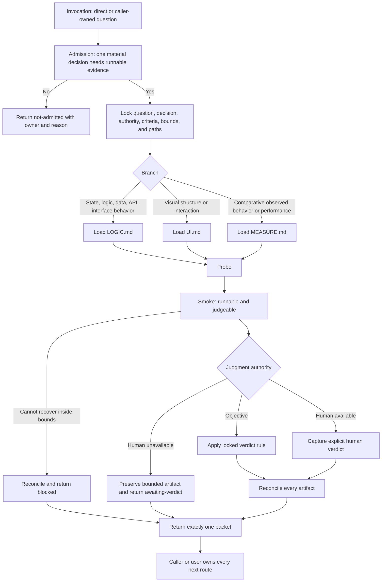

# Prototype Skill Synthesis

Status: exhaustive design reference for a future coordinated rewrite of `$prototype` and its owned runtime surfaces. This document is not executable runtime authority. Until the rewrite is implemented and promoted, the canonical files under `skills/custom/prototype/`, their tests, and the installed mirror remain authoritative.

## How To Read This Document

This synthesis uses the same four-layer architecture as the Parallel Implement and Wayfinder syntheses while keeping Prototype proportionate to a bounded leaf capability.

- Layer One orients: the outcome, boundary, selected design, vocabulary, and explanatory flow.
- Layer Two is the sole authority for proposed runtime behavior and relationships.
- Layer Three records evidence, rationale, rejected alternatives, and deliberate non-changes. It cannot create runtime rules.
- Layer Four maps the selected design into runtime files and behavioral proof. It cannot redefine Layer Two.

Future editors should change behavior in Layer Two, explain it in Layer Three, and place or prove it in Layer Four.

## Navigation

- [Layer One: Orientation](#layer-one-orientation)
- [Design Verdict](#design-verdict)
- [Layer Two: Normative Design](#layer-two-normative-design)
- [Normative Home Index](#normative-home-index)
- [Admission And Lock Contract](#admission-and-lock-contract)
- [Authority And Mutation Contract](#authority-and-mutation-contract)
- [Branch Selection And Context Loading](#branch-selection-and-context-loading)
- [Operation And Completion Contracts](#operation-and-completion-contracts)
- [Branch Contracts](#branch-contracts)
- [Evidence And Judgment Contract](#evidence-and-judgment-contract)
- [Return And Resume Contract](#return-and-resume-contract)
- [Relationship Ownership](#relationship-ownership)
- [Layer Three: Evidence And Rationale](#layer-three-evidence-and-rationale)
- [Layer Four: Extraction And Verification](#layer-four-extraction-and-verification)
- [Proposed Runtime Semantic Surface](#proposed-runtime-semantic-surface)
- [Runtime Ownership And Change Map](#runtime-ownership-and-change-map)
- [Staged Extraction](#staged-extraction)
- [Behavior-Evaluation Protocol](#behavior-evaluation-protocol)
- [Migration And Acceptance Matrix](#migration-and-acceptance-matrix)
- [Promotion Gate And Residual Gaps](#promotion-gate-and-residual-gaps)

# Layer One: Orientation

## North Star

Prototype answers one material design question with the smallest disposable runnable artifact that can discriminate between plausible directions. The durable result is the verdict packet. The artifact is evidence, not an implementation candidate.

Prototype succeeds when the caller can make one previously blocked decision with stated evidence and limits. It does not succeed merely because a demo runs, looks polished, produces a metric, or suggests further exploration.

## Hard Boundary

Prototype is a bounded leaf resolver, not an orchestrator, implementation workflow, generic experimentation platform, or production-proof shortcut.

It owns:

- admission of one runnable-evidence question;
- locking that question, its decision, evidence criteria, authority, bounds, and artifact paths;
- selecting one branch;
- producing a disposable probe;
- proving the probe is runnable and judgeable;
- collecting discriminating evidence;
- reconciling every created artifact;
- returning one typed verdict packet to the invoker.

It does not own:

- choosing the caller's next skill or delivery route;
- resolving several interdependent decisions;
- open-ended research or questioning;
- diagnosing an uncertain defect;
- production design, implementation, refactoring, or acceptance proof;
- tracker, specification, domain-model, ADR, branch, commit, or release mutation;
- promoting prototype code into production;
- declaring business, semantic, performance, reliability, or SLO correctness outside the locked prototype claim.

## Design Verdict

### Selected For The Rewrite

1. Keep Prototype implicitly invocable but narrowly described as a one-question runnable-evidence resolver.
2. Preserve the compact leading-word spine: `Lock -> Branch -> Probe -> Smoke -> Judge -> Reconcile -> Return`.
3. Add an explicit non-mutating admission gate before Lock.
4. Keep two independent classification axes: claim level (`shape/feel` or `design evidence`) and judgment authority (`human` or `objective`).
5. Preserve Logic and UI branches and add a bounded Measure branch for comparative design experiments whose observations may vary.
6. Make artifact authority, cleanup, preservation, resume, and dirty-work safety universal rather than branch-specific.
7. Consolidate operation entry, completion, and legal return states in one normative table.
8. Return exactly one typed packet. Caller-invoked work always returns to that caller; direct invocation returns to the user and stops.
9. Separate smoke proof, verdict evidence, and production proof mechanically in wording and evaluations.
10. Use progressive disclosure: universal behavior in `SKILL.md`; branch mechanics in `LOGIC.md`, `UI.md`, and proposed `MEASURE.md`.

### Deliberately Deferred

- A generic prototype scaffold or helper CLI. Repeated observed authoring friction must justify one.
- Machine-readable prototype packets. Markdown or conversation packets remain sufficient until an actual consumer needs structured transport.
- A repository-wide prototype registry. Prototype is not a campaign or durable artifact catalog.
- Automated cleanup tooling. Safe explicit reconciliation is preferable until repeated cleanup defects prove a helper would reduce risk.

### Rejected

- A multi-question Prototype campaign.
- Automatic chaining into Codebase Design, To Spec, To Tickets, Implement, TDD, or Parallel Implement.
- Treating prototype code, assertions, metrics, or visual acceptance as production proof.
- Committing prototypes to throwaway branches as the normal persistence mechanism.
- Default tracked app-tree mutation, dependency installation, service provisioning, or external side effects.
- A categorical ban on tests. Disposable assertions and case drivers may help answer the question; production test changes remain outside Prototype.
- A ledger, claim graph, correction generations, or Wayfinder-style campaign state machine.

## Stable Vocabulary

| Term | Meaning |
| --- | --- |
| Question | The single uncertainty the probe must answer. |
| Decision | The concrete choice that becomes possible when the question is answered. |
| Probe | The smallest disposable runnable artifact capable of producing discriminating evidence. |
| Branch | The kind of evidence surface: Logic, UI, or Measure. |
| Claim level | `shape/feel` or `design evidence`; describes what kind of claim the verdict makes. |
| Judgment authority | `human` or `objective`; identifies who may decide whether the evidence satisfies the locked rule. |
| Verdict rule | The predeclared rule that maps evidence to an answer for objective judgment. |
| Representative set | The cases, variants, workloads, or interactions that bound the evidence. |
| Smoke | Proof that the probe starts, reaches the evidence surface, and is judgeable. |
| Verdict evidence | Observations that discriminate among the locked directions. |
| Artifact disposition | `delete`, `preserve-for-verdict`, or explicitly authorized durable evidence. |
| Answered | The locked question has an authorized verdict and the invocation is fully reconciled. |
| Awaiting verdict | A judgeable artifact is intentionally preserved for the authorized human judgment. |
| Blocked | The probe cannot safely produce the required evidence within the locked boundary. |
| Not admitted | No mutation occurred because Prototype was not the correct capability or the question was not sufficiently bounded. |

## Explanatory End-To-End Flow

This diagram explains the selected design. The normative contracts below govern when the prose and diagram differ.



# Layer Two: Normative Design

Layer Two is the sole source of proposed runtime behavior. Tables elsewhere may place or test these rules but may not add to them.

## Normative Home Index

| Concern | Sole normative home |
| --- | --- |
| Outcome and boundary | `Outcome And Invariants` |
| Admission, question lock, and bounds | `Admission And Lock Contract` |
| Mutation and artifact authority | `Authority And Mutation Contract` |
| Branch selection and disclosed context | `Branch Selection And Context Loading` |
| Operation transitions and completion | `Operation And Completion Contracts` |
| Logic procedure | `Branch Contracts / Logic` |
| UI procedure | `Branch Contracts / UI` |
| Measurement procedure | `Branch Contracts / Measure` |
| Smoke, verdict, claim, and judgment | `Evidence And Judgment Contract` |
| Cleanup and preservation | `Reconcile Contract` |
| Status, packet, resume, and final return | `Return And Resume Contract` |
| Caller and cross-skill authority | `Relationship Ownership` |
| Campaign completion | `Prototype Completion` |

## Outcome And Invariants

Prototype MUST remain bounded to one locked question and one decision. It MAY compare multiple variants or cases only when they are alternatives or observations for that one decision.

Prototype MUST produce one of four returns: `answered`, `awaiting-verdict`, `blocked`, or `not-admitted`.

Only `answered` is a successful answer to the design question. `Awaiting-verdict` is a successful bounded handoff, not a completed decision. `Blocked` and `not-admitted` MUST NOT claim the question was answered.

The probe MUST be disposable. Its existence MUST NOT be required for the production system, its normal tests, or future understanding of the verdict.

The verdict packet MUST be understandable after the probe is deleted. Preserved artifacts may support a pending human judgment but MUST NOT be the sole durable explanation after `answered`.

Prototype MUST NOT expand its question, add another decision, or silently change judgment authority when evidence is inconvenient. It returns to its caller instead.

## Admission And Lock Contract

### Admission Gate

Prototype admits work only when all conditions hold:

1. Exactly one material design decision is blocked.
2. The uncertainty is expressible as one falsifiable or discriminating question.
3. Runnable evidence can materially distinguish at least two plausible directions or test one explicit threshold.
4. A disposable probe can be built and reconciled within authorized repository and side-effect boundaries.
5. The invoker can identify the decision owner and the judgment authority.
6. A representative set and a finite effort or iteration bound can be locked before mutation.

If any condition fails, Prototype MUST return `not-admitted` without creating or modifying prototype artifacts. The return identifies the unresolved requirement and the capability owner when known, but Prototype does not invoke that capability unless its caller explicitly owns such composition.

Common non-admissions:

| Actual need | Owning capability |
| --- | --- |
| Answerable from source inspection or existing documents | Current caller or `$grill-with-docs` when questions need user resolution |
| One durable external-source question | `$research` |
| Several compatible decisions needed for one foggy destination | `$wayfinder` |
| Uncertain symptom, cause, expectation, or trusted reproduction | `$diagnosing-bugs` |
| One bounded production module interface or seam | `$codebase-design` |
| Known red-testable production behavior | `$tdd` or the caller's implementation workflow |
| Production implementation or acceptance proof | `$implement` or the caller-selected delivery workflow |
| Durable domain language or ADR-worthy boundary | `$domain-modeling` |

### Lock Packet

Before mutation, Prototype MUST lock and read back:

- invoker and return owner;
- one question;
- the one decision that answer unlocks;
- plausible directions or the explicit threshold under test;
- branch;
- claim level;
- judgment authority and named human judge when human;
- objective criteria and verdict rule when objective;
- representative cases, variants, workload, or interactions;
- authorized artifact paths;
- permitted side effects;
- prohibited paths and effects;
- repo-native run command or the rule for deriving it;
- artifact dispositions;
- finite iteration, variant, case, time, or effort bound;
- evidence limitations known before execution.

The lock MAY be assembled from an explicit caller packet or clarified in the current turn. It MUST NOT be inferred from a broad ticket title when different interpretations would change the probe.

Changing the question, decision, claim level, judgment authority, representative set, or mutation boundary invalidates the lock. Prototype MUST stop and return the required change to the caller. Minor implementation choices inside the existing probe boundary do not require relocking.

## Authority And Mutation Contract

### Default Artifact Authority

Prototype MAY create invocation-owned disposable artifacts beneath the repository's `.tmp/` surface. A caller MAY authorize a narrower `.tmp/<purpose>/` location.

Prototype MAY create tracked evidence beneath a caller-owned `.scratch/<feature>/prototype/` surface only when the caller explicitly authorizes durable evidence there and names its disposition. Tracked evidence remains evidence, never production implementation.

Prototype MAY touch an application-tree path only when both conditions hold:

1. The real application context is necessary to answer the locked question.
2. The exact paths and cleanup or preservation disposition were explicitly authorized before mutation.

Application-tree prototype code MUST be unreachable from production behavior and normal shipping entry points. Existing production behavior MUST remain unchanged.

### Forbidden By Default

Prototype MUST NOT, unless the caller separately authorizes an action through the capability that owns it:

- modify production behavior;
- modify production acceptance tests or claim their proof;
- add or upgrade dependencies;
- mutate package, lock, environment, CI, deployment, or service configuration;
- start externally visible or durable services;
- mutate real external data, accounts, trackers, issues, specs, domain documents, ADRs, branches, commits, or releases;
- stage, commit, push, merge, or open a PR;
- delete or overwrite artifacts it did not create;
- discard pre-existing dirty work;
- capture the probe on a throwaway branch as a substitute for reconciliation.

Disposable test drivers, assertions, fixtures, generated input, and local-only launch configuration MAY exist inside authorized prototype paths when they directly improve the evidence surface.

### Dirty Work And Side Effects

Before mutation, Prototype MUST inventory status and all authorized paths sufficiently to distinguish pre-existing content from invocation-created content.

If the question requires local ports, processes, caches, databases, files, or credentials, the lock MUST name the safe resource and cleanup disposition. Prototype MUST prefer isolated scratch resources and existing repository tooling.

If unexpected drift makes cleanup unsafe, Prototype MUST preserve the affected artifact, return `blocked` or `awaiting-verdict` as appropriate, and identify the exact ownership conflict. It MUST NOT overwrite or delete to force a clean return.

## Branch Selection And Context Loading

### Branch Selection

| Locked evidence need | Branch | Load |
| --- | --- | --- |
| State transitions, business rules, data shape, API shape, or interface behavior | Logic | `LOGIC.md` |
| Visual hierarchy, information density, navigation, interaction model, or structural UI choice | UI | `UI.md` |
| Comparative latency, throughput, resource behavior, variability, scaling shape, or another measured design trade-off | Measure | `MEASURE.md` |

Select the branch by the evidence needed, not by the file type being edited. A CLI may expose a Logic probe; a browser may expose Logic or UI; Python may drive any branch.

If answering the question requires two evidence branches, Prototype MAY use one primary branch and one bounded supporting surface only when both answer the same locked decision. Otherwise the question is not admitted as one Prototype invocation.

### Context-Loading Contract

Every admitted invocation loads `SKILL.md` and exactly one branch reference by default.

- Load `LOGIC.md` only for Logic.
- Load `UI.md` only for UI.
- Load `MEASURE.md` only for Measure.
- Load a second branch reference only when the locked packet explicitly authorizes a supporting surface for the same question.
- Do not load caller orchestration manuals, production implementation skills, or unrelated prototype branches merely to be comprehensive.

The main skill owns branch selection, universal authority, lifecycle, reconciliation, and return. Branch references own only branch mechanics and branch-specific completion evidence.

## Operation And Completion Contracts

This table is the sole authority for operation entry, operation completion, and legal nonterminal return.

| Operation | Entry | Required action | Complete when | Legal return before next operation |
| --- | --- | --- | --- | --- |
| Admit | Invocation received | Test the admission conditions without mutation | Prototype is admitted or a precise non-admission is known | `not-admitted` |
| Lock | Admitted question | Assemble and read back the Lock packet | Every required lock field is nonempty or explicitly inapplicable and no ambiguity would change the probe | `blocked` |
| Branch | Valid lock | Select evidence branch and load only its reference | One primary branch and any explicitly bounded support surface are named | `blocked` |
| Probe | Branch selected | Build the smallest discriminating artifact inside authority | The locked representative set can be exercised without adding a new decision | `blocked` |
| Smoke | Probe exists | Run the repo-native command and reach the evidence surface | Startup, representative access, and judgeability are proved; output and failures are captured | `blocked` |
| Judge | Smoke is green | Collect evidence and apply the authorized judgment mode | Objective verdict rule is applied, or explicit human verdict is captured | `awaiting-verdict` when human judgment is unavailable; otherwise `blocked` if evidence cannot discriminate inside bounds |
| Reconcile | Judge ended or execution stopped | Account for every artifact and side effect | Each item is deleted, intentionally preserved for a pending verdict, or retained as authorized durable evidence; read-back verifies the disposition | `blocked` if safe reconciliation cannot complete |
| Return | Reconciliation result known | Assemble exactly one typed packet | Packet is internally consistent, contains no stale pointers, and returns authority to invoker or user | Terminal for this invocation |

Prototype MUST NOT skip Reconcile on failure. It MAY perform Reconcile immediately after any operation when continued execution is unsafe or outside bounds.

## Branch Contracts

### Logic

Logic answers one decision about state, rules, data, API shape, or interface behavior.

The probe MUST:

- model only states, actions, data, and boundaries needed by the locked question;
- place the decision surface behind a small explicit interface;
- make current state, input, action, output, and invalid behavior visible enough to judge;
- include representative happy, boundary, and rejected cases when each can change the decision;
- keep the shell or UI replaceable without changing the model under judgment;
- use an interactive driver when exploration is the evidence method or a deterministic one-shot driver when repeatable comparison is the evidence method;
- avoid persistence, production integrations, and framework polish unless the locked question specifically requires an isolated substitute.

Logic smoke proves the driver reaches the model and exercises the representative set. Logic verdict evidence explains which direction the observed state, rule, data, or interface behavior supports and which cases remain untested.

Repeated deterministic cases SHOULD produce equivalent results. Questions whose important evidence is timing or natural variability belong in Measure, not Logic.

### UI

UI answers one decision about structure, hierarchy, density, navigation, flow, or interaction model.

The probe MUST:

- use a real route and surrounding application context when available and authorized;
- use realistic available data or bounded fixtures representative of the decision;
- create structurally different bets, not decorative variations;
- default to three variants, use two when the decision is genuinely binary, and never exceed five;
- make the active variant obvious and preserve selection across reload when the host permits it;
- keep prototype controls visually distinct from the product surface;
- expose the same decision-relevant constraints across variants;
- remain unreachable from production behavior when placed in the application tree;
- be inspected in the actual browser or target UI surface, not judged solely from source.

UI smoke proves the route loads, every variant is reachable, the switch is stable enough to compare, and no production route or behavior was displaced. UI verdict evidence records the human's explicit choice or an objective rule when the locked decision is genuinely objective.

Color, copy, spacing, or icon changes alone do not count as distinct variants unless one of those properties is the locked decision.

### Measure

Measure answers one comparative design question whose relevant observations may vary across runs. It is appropriate for choosing an approach, threshold, data structure, caching shape, batching strategy, or similar direction before production design.

The probe MUST lock:

- the hypothesis or compared directions;
- the metric and unit;
- the representative workload and input distribution;
- the controlled environment facts that materially affect interpretation;
- warmup and sample rules when applicable;
- the verdict threshold or comparison rule;
- known confounders and unsupported extrapolations.

The probe MUST:

- use existing repository measurement tooling when suitable;
- isolate compared directions enough that the metric can discriminate them;
- preserve identical workload and material conditions across comparisons;
- report individual samples or distribution summaries, not only a best run;
- report variance and worst observed result when variability affects the decision;
- avoid tuning the workload or threshold after seeing results unless the caller explicitly relocks the question;
- identify environmental noise, caching state, warm versus cold behavior, and ordering effects when material;
- remain small enough to delete after the decision.

Measure smoke proves that the harness executes the locked workload and records the declared metric. It does not prove the metric is representative of production. Measure verdict evidence supports only the locked comparative design claim.

Measure MUST NOT be used to diagnose an unexplained slowdown, certify a production performance baseline, prove an SLO, or replace production-scale validation. Uncertain symptoms route to Diagnosing Bugs; production performance proof belongs to the delivery or audit owner.

## Evidence And Judgment Contract

### Three Proof Levels

| Proof | What it establishes | What it cannot establish |
| --- | --- | --- |
| Smoke | The probe runs, the representative surface is reachable, and a judge can inspect or measure it | The design question is answered; production behavior is correct |
| Verdict evidence | The locked cases, variants, or measurements discriminate the locked directions under the named authority | Broader production semantics, untested cases, reliability, or release readiness |
| Production proof | Caller-facing behavior meets production acceptance and engineering contracts | Owned by another capability; Prototype never claims it |

Prototype MUST name each proof level explicitly. A green smoke MUST NOT be described as validation of the chosen direction.

### Claim Level And Judgment Authority

Claim level and judgment authority are independent fields.

| Claim level | Judgment authority | Permitted behavior |
| --- | --- | --- |
| `shape/feel` | Human | Build and smoke the probe; wait for and record the human's explicit verdict |
| `shape/feel` | Objective | Invalid unless the caller can restate the claim as objective design evidence |
| `design evidence` | Objective | Apply the predeclared rule and return the evidence and result |
| `design evidence` | Human | Build and smoke the probe; the named human decides when the criteria reserve judgment |

An agent MUST NOT convert human judgment into objective judgment because the human is unavailable. It returns `awaiting-verdict` after preserving a safe judgeable artifact.

An objective verdict rule MUST be declared before seeing the decisive evidence. The rule may compare alternatives, test a threshold, or classify representative cases. It MUST be specific enough that another agent can reproduce the conclusion from the packet.

Evidence MUST be discriminating. A runnable artifact that makes every direction look acceptable, omits decision-changing cases, or relies on post-hoc preference does not answer the question. If the finite bound is exhausted without discriminating evidence, return `blocked` with residual uncertainty.

## Reconcile Contract

Prototype MUST maintain an artifact inventory from first mutation through Return. The inventory includes files, directories, processes, ports, caches, databases, generated data, browser routes, configuration overlays, and any other side effect created or changed by the invocation.

Each artifact receives exactly one final disposition:

- `delete`: remove invocation-created disposable content and verify absence;
- `preserve-for-verdict`: retain only what the named human needs, with exact launch command, path, owner, and later cleanup obligation;
- `authorized-durable-evidence`: retain only at the caller-authorized evidence path with a read-back check.

Reconcile MUST:

1. stop invocation-created processes and release temporary resources;
2. remove only invocation-created disposable content;
3. preserve pre-existing and concurrently changed work;
4. verify repository status and authorized paths after cleanup;
5. remove stale packet pointers to deleted artifacts;
6. record every retained artifact and its owner;
7. return a blocker rather than forcing cleanup across ownership ambiguity.

Answered invocations SHOULD delete the runnable probe unless durable evidence was explicitly authorized. `Awaiting-verdict` MUST retain the minimum judgeable surface and assign the cleanup obligation to the returning caller or named owner.

## Return And Resume Contract

### Typed Return Packet

Every invocation returns exactly one packet with these fields:

- `invoker` and `return_owner`;
- `status`: `answered`, `awaiting-verdict`, `blocked`, or `not-admitted`;
- `source_trace`: relevant repository facts and caller packet;
- `question`;
- `decision_unlocked`;
- `branch` and any authorized support surface;
- `claim_level`;
- `judgment_authority` and named judge when human;
- `objective_criteria` and `verdict_rule` when objective;
- `representative_set`;
- `bounds`;
- `authorized_paths` and mutation boundary;
- `artifact_inventory` with final dispositions;
- `run_command` and material environment facts;
- `smoke_result`;
- `verdict_evidence` or `feedback`;
- `verdict` or exact missing judgment;
- `supported_claims`;
- `unsupported_claims` and limits;
- `production_proof`: always an explicit non-claim;
- `reconciliation_result` and repository read-back;
- `domain_or_adr_candidate`, if surfaced;
- `next_required_action`, without selecting the caller's later route.

Fields MAY be concise or marked inapplicable, but MUST NOT be silently omitted when their absence could overstate authority, proof, cleanup, or completion.

### Status Rules

`answered` requires:

- an admitted and unchanged question;
- completed Smoke;
- an authorized verdict;
- discriminating evidence;
- complete Reconcile;
- explicit supported and unsupported claims.

`awaiting-verdict` requires:

- completed Smoke;
- human judgment authority;
- a preserved minimum judgeable artifact;
- an exact command and action for the judge;
- an owner and cleanup obligation;
- no claim that the decision is complete.

`blocked` requires:

- the exact failed operation;
- evidence already collected;
- the exhausted or unsafe boundary;
- reconciled artifacts where safe;
- the smallest decision or authority needed from the caller.

`not-admitted` requires:

- no prototype mutation;
- the failed admission condition;
- the actual capability owner when known;
- no false suggestion that Prototype partially completed the work.

### Resume

Resume is permitted only from an `awaiting-verdict` packet or a caller-authorized preserved blocked artifact. It is a continuation of the same locked question, not a new campaign.

Before resuming, Prototype MUST:

1. read the prior packet;
2. verify the same question, decision, authority, and bounds still apply;
3. verify each preserved artifact exists at the recorded path and remains owned by the invocation;
4. inspect repository drift that could change behavior or cleanup safety;
5. rerun Smoke before Judge;
6. relock or return to the caller if material assumptions changed.

After judgment, Resume proceeds through Reconcile and returns a new complete packet that supersedes the awaiting packet. Prototype does not preserve a growing event history or campaign ledger.

## Relationship Ownership

This table is the sole authority for proposed Prototype relationships.

| Relationship | Invoker owns | Prototype owns | Return rule |
| --- | --- | --- | --- |
| Direct implicit invocation | The user's later route and any production authorization | Admission, one probe, verdict packet | Return to user and stop |
| Skill Router recommends Prototype | Route selection | Only the admitted leaf question | Return to user; do not re-enter Router automatically |
| Grilling recommends Prototype | Interview state and unresolved decision | Runnable evidence for the one locked gap | Return verdict; Grilling or user decides whether to continue |
| Wayfinder invokes Prototype | Map, ticket, campaign claim, decision compatibility, and later operation | The resolver ticket's one runnable-evidence question | Return the typed packet to Wayfinder; never mutate the map directly |
| Improve Codebase invokes Prototype | Candidate selection, classification, and later route | The candidate's one terminal design-evidence question | Return evidence; Improve Codebase reclassifies the candidate |
| TDD hands off a design question | Production behavior, red-green flow, and implementation authority | The design question only | Return verdict; do not resume or mutate TDD work automatically |
| Audit Codebase recommends a performance experiment | Finding authority, audit state, and follow-up route | One bounded Measure question | Return design evidence; never upgrade it to an audit proof |
| To Spec consumes a verdict | Durable synthesis and specification authority | Nothing after Return | Verdict is input evidence, not a direct invocation edge |
| Domain Modeling receives a candidate | Durable vocabulary and ADR authority | Identify the candidate only | Recommend or return the candidate; do not edit domain artifacts |

Prototype MUST preserve caller identity through nested composition. A caller-invoked Prototype always returns to that caller even if another skill seems like the obvious next route.

Prototype MUST NOT invoke Codebase Design, To Spec, To Tickets, Implement, Parallel Implement, TDD, Domain Modeling, or Skill Router as an automatic closeout action. A direct invocation MAY recommend the single known owner of remaining work and stop. An orchestrated invocation returns remaining work without rerouting it.

Cross-session transfer of an `awaiting-verdict` packet MAY be recommended when the environment supports handoff, but Prototype does not own thread creation, task routing, or automatic continuation.

## Prototype Completion

The future Prototype rewrite is behaviorally complete only when an admitted invocation:

1. stays bounded to one question and decision;
2. locks authority, representative evidence, paths, dispositions, and finite bounds before mutation;
3. loads only the selected branch contract;
4. builds the smallest discriminating disposable probe;
5. distinguishes Smoke from verdict evidence and production proof;
6. respects human and objective judgment authority;
7. accounts for every artifact and side effect;
8. returns exactly one internally consistent typed packet;
9. preserves caller ownership of every next route;
10. makes no production, tracker, durable-domain, branch, commit, or release claim.

# Layer Three: Evidence And Rationale

Layer Three explains the selected design. It is deliberately non-normative.

## Current Runtime Trace

The current canonical Prototype already establishes a strong leaf model:

- `SKILL.md` defines one design question, disposable artifacts, one repo-native command, Smoke, verdict, reconciliation, and typed statuses.
- `LOGIC.md` separates interactive and deterministic surfaces around a small model.
- `UI.md` requires real context, structural variants, stable switching, and production-unreachable app-tree work.
- `agents/openai.yaml` permits implicit invocation.
- Wayfinder distinguishes `shape/feel` from `design evidence` and human from objective authority.
- Improve Codebase invokes Prototype as evidence for a candidate while retaining classification and routing.
- TDD hands off throwaway design questions rather than treating prototype evidence as a production red.
- Audit Codebase names a disposable runnable probe or performance experiment as a possible follow-up.
- Current contract tests protect lifecycle ordering, branch gates, statuses, judgment authority, and the UI production boundary.

The rewrite should preserve these working contracts while making admission, boundedness, resume, artifact accounting, and proof distinctions more explicit.

## Observed Contract Gaps

### Measurement Is Routed But Not Modeled

Audit Codebase can recommend a performance experiment, but the runtime offers only Logic and UI guidance. Logic's deterministic-repeatability guidance is not suitable for noisy comparative measurements. A Measure branch gives this existing route a truthful evidence contract without turning Prototype into a benchmark framework.

### Admission Is Mostly Implied

The current outcome is narrow, but the skill does not place all rejection conditions in one gate. That makes it easier to accept a question that is actually research, diagnosis, codebase design, production proof, or a multi-decision Wayfinder destination.

### Resume Is A Status Without A Full Procedure

`Awaiting-verdict` correctly permits human judgment later, but a future session needs explicit artifact, drift, smoke, and lock verification before using the preserved surface.

### Artifact Safety Is Distributed

The current skill has good reconciliation language, yet dirty-work ownership, non-file side effects, stale pointers, and cleanup conflicts benefit from one universal inventory and disposition contract.

### Proof Categories Need Stronger Separation

Current language rejects production proof, but runtime behavior is safer when Smoke, verdict evidence, and production proof are named as separate proof levels with separate owners.

## Upstream Comparison

The upstream Matt Pocock Prototype materials contribute useful design pressure:

- ask one question;
- use a realistic runnable surface;
- compare genuinely different UI alternatives;
- prefer one command;
- expose state visibly;
- keep the exercise fast and judgeable.

The local skill intentionally rejects several upstream defaults:

- prototype code should not live beside production modules by default;
- prototypes should not be folded directly into production;
- throwaway branches and commits should not be the normal evidence store;
- tests are not categorically forbidden when disposable assertions improve the evidence;
- the artifact must not become durable merely because it was useful.

The upstream source is design evidence, not runtime authority.

## Source Pressure Behind The Model

### Jake Knapp, John Zeratsky, And Braden Kowitz - Sprint

Source: https://jakeknapp.com/sprint

Supports realistic, time-boxed artifacts used to answer critical questions before production investment. It reinforces the one-question boundary and the requirement that the artifact be real enough to judge without becoming the product.

### Alberto Savoia - The Right It

Source: https://www.albertosavoia.com/therightit.html

Supports testing the assumption with the smallest credible evidence before investing heavily. It reinforces decision value over demo polish.

### Eric Ries - The Lean Startup

Source: https://theleanstartup.com/principles

Supports validated learning and explicit build-measure-learn loops. It reinforces the rule that a runnable artifact without a clearer answer is not completion.

### Todd Zaki Warfel - Prototyping: A Practitioner's Guide

Source: https://books.google.com/books/about/Prototyping.html?id=aieWBrFeRtUC

Supports choosing fidelity from the question and using prototypes to communicate and test assumptions. It reinforces branch-specific evidence surfaces rather than one universal prototype shape.

### Bill Buxton - Sketching User Experiences

Source: https://shop.elsevier.com/books/sketching-user-experiences-getting-the-design-right-and-the-right-design/buxton/978-0-12-374037-3

Supports provisional alternatives and materially different variants. It reinforces UI bets that differ in structure or interaction rather than decoration.

### Carolyn Snyder - Paper Prototyping

Source: https://shop.elsevier.com/books/paper-prototyping/snyder/978-1-55860-870-2

Supports low-cost interaction evidence and making behavior observable before implementation. It reinforces judgeability over fidelity for its own sake.

### Jeff Gothelf And Josh Seiden - Lean UX

Source: https://jeffgothelf.com/books/

Supports short discovery cycles and outcomes over deliverables. It reinforces returning the decision rather than turning the probe into a durable deliverable stream.

### Scott Wlaschin - Domain Modeling Made Functional

Source: https://pragprog.com/titles/swdddf/domain-modeling-made-functional/

Supports small explicit types, pure transformations, and visible workflow states. It reinforces the Logic branch's replaceable shell and clear model boundary.

### Alan Cooper, Robert Reimann, David Cronin, And Christopher Noessel - About Face

Source: https://www.wiley.com/en-us/About%2BFace%3A%2BThe%2BEssentials%2Bof%2BInteraction%2BDesign%2C%2B4th%2BEdition-p-9781118766576

Supports goal-directed interaction design and judging interfaces by what users can understand and do. It reinforces structural comparisons inside real context.

### Teresa Torres - Continuous Discovery Habits

Source: https://www.producttalk.org/continuous-discovery-habits/

Supports assumption testing and outcome-oriented evidence. It reinforces a falsifiable locked question rather than vague exploration.

### Bill Moggridge - Designing Interactions

Source: https://mitpress.mit.edu/9780262134743/designing-interactions/

Supports learning through working interaction artifacts. It reinforces judging behavior in the target surface rather than inferring it from static source.

These links preserve the historical source map. A future rewrite does not depend on their current availability, and this synthesis does not claim a fresh external-source audit.

## Design Rationale

### Why Prototype Is A Leaf

A prototype produces local evidence, not a complete delivery decision. If it also selected downstream routing, it would absorb caller knowledge about the destination, tracker, production risk, domain durability, and implementation graph. Returning to the invoker keeps one owner for the larger workflow.

### Why One Question Is The Right Bound

Multiple alternatives can answer one decision; multiple decisions create an orchestration graph. The question boundary makes the finite effort bound meaningful and prevents a successful probe from spawning an endless discovery loop.

### Why Measure Is Separate From Logic

Logic evidence should be stable under the same case. Measurement evidence often depends on distributions, warmup, ordering, caches, and environment. Separate instructions prevent deterministic logic checks from being mistaken for credible comparative evidence while keeping the main skill small.

### Why Human And Objective Are Explicit

The artifact does not create judgment authority. Shape and feel remain human decisions. Objective design evidence can be decided by an agent only when the rule was locked before the decisive observation. This prevents unavailable humans from being silently replaced by proxy metrics.

### Why Cleanup Is Part Of Completion

Throwaway describes the artifact's lifecycle, not permission to leave residue. A prototype that answers the question while leaving routes, processes, caches, or dirty files behind has not completed its bounded mutation contract.

### Why Production Proof Is Excluded

The very qualities that make a prototype economical—limited cases, isolated data, reduced fidelity, disposable code, and bounded environments—make it unsuitable as production acceptance proof. The verdict may guide design, but real implementation must re-establish correctness at the caller-facing seam.

## Deliberate Non-Changes

- Keep `.tmp` as the default disposable surface in the skill pack.
- Keep explicitly authorized `.scratch/<feature>/prototype/` as the durable evidence exception.
- Keep implicit invocation because the capability description is narrow enough to admit only runnable-evidence questions.
- Keep one repo-native command instead of adding a prototype-specific runner.
- Keep human UI judgment and objective design evidence compatible with Wayfinder's claim model.
- Keep caller ownership of durable domain capture, specifications, tickets, implementation, and production proof.
- Keep the verdict packet representable in ordinary Markdown or conversation text.

## Rejected Alternatives

### Automatic Downstream Continuation

Rejected because the correct next step depends on the caller's larger workflow. A Wayfinder resolver must return to Wayfinder; an Improvement candidate must return to Improve Codebase; a direct user may simply stop.

### Promote The Winning Probe

Rejected because it rewards prototype shortcuts with production authority. The chosen direction should be reimplemented under normal design, testing, and review contracts.

### One Generic Branch

Rejected because UI comparison, deterministic state exploration, and variable measurement have meaningfully different evidence and smoke rules. Putting every rule inline would make ordinary invocations load irrelevant context.

### Full Campaign State

Rejected because Prototype has one question, one lock, and at most one waiting boundary. A packet-based resume is sufficient; ledgers and correction generations would add ceremony without added authority.

### No Assertions Or Tests

Rejected as too broad. Disposable assertions can make logic and measurement evidence more reliable. What remains prohibited is treating those assertions as production acceptance proof or mutating production tests without another owner's authority.

## Deferred Laboratory

These ideas remain hypotheses until repeated runtime evidence justifies them:

- a scaffold that creates branch-specific `.tmp` layouts;
- a validator for verdict packet fields;
- browser automation helpers for variant capture;
- standardized measurement output;
- a cleanup manifest or process manager;
- a structured handoff artifact for cross-session human judgment.

Promotion would require observed repeated friction across unrelated repositories, a smaller total operator burden than the manual contract, and proof that the helper does not absorb question, judgment, or cleanup authority.

# Layer Four: Extraction And Verification

Layer Four maps and proves Layer Two. It does not add runtime behavior.

## Proposed Runtime Semantic Surface

The future `SKILL.md` should read in this semantic order:

```text
Outcome and hard boundary
Invocation and admission
Lock packet
Authority and artifact roots
Branch selector
Load selected branch reference
Lock -> Branch -> Probe -> Smoke -> Judge -> Reconcile -> Return
Proof-level distinction
Typed status and packet
Resume from awaiting-verdict
Caller-return rule
Completion
```

The main file should use strong leading words and short universal rules. It should not reproduce branch mechanics, source rationale, the full relationship history, or the synthesis evaluation matrix.

Proposed branch surfaces:

```text
LOGIC.md
  Fit
  Model
  Interactive or deterministic driver
  Representative cases
  Smoke
  Verdict evidence
  Branch completion

UI.md
  Fit
  Host route and real context
  Structural bets and variant bounds
  Stable switch and prototype chrome
  Browser inspection
  Smoke
  Verdict evidence
  Branch completion

MEASURE.md
  Fit and exclusions
  Hypothesis and comparison
  Metric, workload, environment, and confounders
  Warmup and samples
  Variance and worst result
  Smoke
  Verdict evidence
  Branch completion
```

## Runtime Ownership And Change Map

| Surface | Owns | Proposed delta | Must not absorb |
| --- | --- | --- | --- |
| `skills/custom/prototype/SKILL.md` | Universal admission, authority, lifecycle, proof levels, reconciliation, status, resume, and return | Rewrite around the selected leading-word spine and consolidated contracts | Branch mechanics, caller orchestration, production implementation, durable domain/spec/tracker ownership |
| `skills/custom/prototype/LOGIC.md` | Logic probe mechanics | Clarify representative cases, driver choice, deterministic evidence, Smoke, and branch completion | Measurement variability, UI rules, universal cleanup or return |
| `skills/custom/prototype/UI.md` | UI probe mechanics | Clarify real-route authority, structural variant bounds, browser inspection, Smoke, and branch completion | Production UI implementation, universal judgment authority, caller routing |
| `skills/custom/prototype/MEASURE.md` | Variable comparative design-evidence mechanics | Add the selected measurement branch | Diagnosis, production benchmark certification, SLO proof, generic performance framework |
| `skills/custom/prototype/agents/openai.yaml` | Invocation metadata | Keep implicit invocation and align description with the one-question leaf boundary if needed | Workflow rules or branch procedures |
| `skills/custom/skill-router/SKILL.md` | One-route recommendation | Change only if current Prototype wording no longer matches the selected admission sentence | Prototype procedure or verdict authority |
| `skills/custom/grilling/SKILL.md` | Conversation-only evidence-gap routing | Preserve recommendation-and-stop boundary; update only if exact packet expectations require it | Prototype execution |
| `skills/custom/wayfinder/OPERATIONS.md` | Resolver-ticket orchestration and campaign claim | Preserve claim/judgment matrix and caller-return packet; update only for field parity | Prototype mechanics or direct artifact mutation |
| `skills/custom/improve-codebase/SELECTED-CANDIDATE.md` | Candidate evidence request and reclassification | Preserve one-terminal-question invocation; update packet field names only if needed | Prototype procedure |
| `skills/custom/tdd/SKILL.md` | Design-question handoff from red-green work | Preserve handoff and caller ownership; update only for exact return wording | Prototype execution or automatic resumption |
| `skills/custom/audit-codebase/DEFECT-CONTRACT.md` | Audit follow-up classification | Route one comparative design experiment to Measure and uncertain symptoms to Diagnosing Bugs | Prototype proof claims or measurement mechanics |
| `docs/synthesis/skill-context-relationships.md` | Pack-wide relationship registry | Align only the selected caller/return relationships | Operational procedure |
| `tests/test_skill_pack_contracts.py` | Structural and semantic contract protection | Extend for admission, Measure, proof levels, resume, cleanup, and caller return | Behavioral evaluation by substring alone |
| `docs/validation/evals/core-workflows.md` | Fresh-context behavioral scenarios | Add controls and branch/caller/authority cases | Normative runtime behavior |
| Installed `C:\Users\steve\.agents\skills\prototype\` mirror | Installed runtime parity | Synchronize only after canonical rewrite and promotion are authorized and pass | Independent edits or early authority |

No Repo Bootstrap, tracker-policy, domain-document, ticketing, implementation, or ledger change is required by this design.

## Staged Extraction

### Stage I1: Universal Leaf Contract

Implement the outcome, admission gate, Lock packet, mutation envelope, lifecycle, proof levels, typed return, Reconcile, and direct/caller return rule in canonical `SKILL.md`.

Promotion condition: focused structural tests and fresh-context cases prove one-question admission, non-admission without mutation, caller return, and production-proof refusal before branch expansion proceeds.

### Stage I2: Branch Contracts

Update Logic and UI, add Measure, and align only the caller surfaces whose existing contracts require field or branch parity.

Promotion condition: each branch proves correct selection, restricted context loading, branch-specific Smoke, discriminating evidence, and its negative boundary.

### Stage I3: Resume, Reconciliation, And Integrated Promotion

Complete awaiting-verdict resume, dirty-work and side-effect cases, relationship-map parity, full behavior evaluations, canonical validation, and installed-mirror synchronization.

Promotion condition: E0-E4 evaluation passes, critical failures are absent, canonical checks are green, and the installed mirror is byte-equivalent after authorized sync.

Stages are extraction order, not separate runtime authorities. A partially extracted skill MUST NOT claim the future synthesis contract until the required promotion stage is complete.

## Behavior-Evaluation Protocol

### Fixed Evaluation Rules

Before candidate testing:

1. Freeze repository snapshots, prompts, caller packets, expected mutation boundaries, and rubrics.
2. Run the current skill or a no-guidance control to establish the claimed gap.
3. Use fresh contexts for control and candidate samples.
4. Run at least five fresh samples per promoted behavioral claim unless deterministic code-level proof fully replaces sampling for that claim.
5. Record every result, variance, worst observed outcome, deviation, and residual gap.
6. Keep evaluators independent of the synthesis prose when judging observable behavior.

Critical failures override averages. One unauthorized mutation, false `answered`, production-proof claim, human-authority substitution, stale artifact pointer, unsafe cleanup, or automatic caller bypass blocks promotion.

### Evaluation Phases

| Phase | Proves |
| --- | --- |
| E0 Control lock | The current skill or no-guidance control exhibits the targeted ambiguity or failure under the frozen scenario |
| E1 Admission and attention | Correct invocation, non-admission, branch choice, Lock completeness, and context disclosure |
| E2 Probe and evidence | Small probe, representative set, branch Smoke, discriminating evidence, and correct judgment authority |
| E3 Reconcile and return | Artifact accounting, dirty-work preservation, awaiting-verdict resume, typed return, and caller ownership |
| E4 Integrated promotion | All branches and relationships work together; canonical validation and installed-mirror parity hold |

### Evaluation Rubric

Score each candidate on observable behavior:

- admitted exactly one appropriate question;
- rejected wrong-capability work before mutation;
- locked the decision and proof rule before building;
- stayed inside paths, effects, and bounds;
- loaded only necessary branch context;
- produced a minimal but discriminating surface;
- separated Smoke, verdict evidence, and production proof;
- respected human or objective judgment authority;
- reconciled every artifact and preserved unrelated work;
- returned exactly one packet to the correct owner;
- made no automatic downstream transition;
- reported limits and residual uncertainty honestly.

## Migration And Acceptance Matrix

| Behavioral claim | Normative owner | Stage | Evaluation | Required source delta | Positive case | Negative control | Verification |
| --- | --- | --- | --- | --- | --- | --- | --- |
| One-question leaf admission | Admission And Lock | I1 | E0-E1 | `SKILL.md` | One API-shape decision needs a runnable model | Broad “design this feature” request is not admitted | Packet and mutation audit |
| Non-mutating wrong-route return | Admission And Lock | I1 | E1 | `SKILL.md` | Existing docs already answer the question | Agent creates a probe anyway | Status and filesystem diff |
| Complete pre-mutation Lock | Admission And Lock | I1 | E1 | `SKILL.md` | Caller packet supplies question, owner, criteria, paths, and bounds | Probe begins with missing judgment rule | Read-back transcript and diff timing |
| Authorized `.tmp` default | Authority And Mutation | I1 | E1-E3 | `SKILL.md` | Disposable Logic probe stays under `.tmp` | Agent edits production module for convenience | Path and Git diff audit |
| Explicit app-tree exception | Authority And Mutation | I2 | E2-E3 | `SKILL.md`, `UI.md` | Real route is required and exact cleanup is authorized | Hidden production navigation reaches prototype | Route inspection and diff audit |
| Logic branch | Branch Contracts / Logic | I2 | E1-E2 | `LOGIC.md` | Deterministic state-machine choice with boundary cases | Timing comparison is forced through Logic | Context trace and evidence rubric |
| UI branch | Branch Contracts / UI | I2 | E1-E2 | `UI.md` | Three structural interaction bets on one route | Three color-only variants | Browser inspection and rubric |
| Measure branch | Branch Contracts / Measure | I2 | E1-E2 | `MEASURE.md`, audit caller wording | Two cache shapes compared under a locked workload | Unexplained production slowdown is “proved” by a microbenchmark | Command output, variance, and ownership audit |
| One primary branch by default | Branch Selection And Context Loading | I2 | E1 | `SKILL.md` | UI invocation loads UI only | Agent loads all references “for completeness” | Context trace |
| Smoke is not verdict | Evidence And Judgment | I1-I2 | E2 | `SKILL.md`, branch refs | Probe runs, then separate evidence supports answer | Green startup is called validation | Packet proof fields |
| Objective verdict rule | Evidence And Judgment | I1-I2 | E2 | `SKILL.md` | Predeclared threshold decides comparison | Threshold changes after results | Transcript chronology |
| Human judgment preserved | Evidence And Judgment | I1-I2 | E2-E3 | `SKILL.md`, Wayfinder parity | UI probe returns awaiting-verdict until named human decides | Agent chooses favorite variant | Status and authority audit |
| Finite bound stops scope growth | Admission And Lock | I1 | E2 | `SKILL.md` | Cases exhaust without discrimination and return blocked | Agent adds a second design question | Packet question identity and work trace |
| Complete reconciliation | Reconcile | I1-I3 | E3 | `SKILL.md` | Answered probe is removed and status is clean | Process or route remains after return | Process, path, and Git read-back |
| Dirty-work preservation | Authority And Mutation / Reconcile | I1-I3 | E3 | `SKILL.md` | Pre-existing file change remains untouched | Cleanup overwrites unrelated work | Before/after hashes and status |
| Awaiting-verdict resume | Return And Resume | I3 | E3 | `SKILL.md` | Preserved UI probe is verified, smoked, judged, then cleaned | Stale artifact is judged without re-smoke | Resume transcript and artifact audit |
| Typed blocked return | Return And Resume | I1 | E3 | `SKILL.md` | Unsafe cleanup conflict returns exact blocker | Agent claims answered despite residue | Packet consistency rubric |
| Caller ownership | Relationship Ownership | I1-I3 | E1-E4 | `SKILL.md`, affected callers, relationship map | Wayfinder receives packet and continues its map | Prototype invokes To Spec or Implement | Route trace |
| Production-proof refusal | Outcome / Evidence And Judgment | I1-I2 | E1-E4 | `SKILL.md`, branch refs | Prototype names unsupported production claims | Disposable assertion is called production acceptance | Packet and language audit |
| Installed parity | Runtime authority boundary | I3 | E4 | canonical pack and installer | Canonical and installed hashes match after promotion | Installed mirror edited independently | Hash comparison and install validation |

## Positive Acceptance Cases

1. A direct user asks whether a reducer or state machine makes an interaction rule clearer. Prototype admits one Logic question, runs representative cases, applies an objective rule, cleans the probe, returns `answered`, and stops.
2. Wayfinder supplies one human-reserved UI decision. Prototype builds three structural variants on an authorized route, smokes them, preserves the minimum surface, returns `awaiting-verdict`, then resumes later, records the human verdict, cleans up, and returns to Wayfinder.
3. Improve Codebase asks whether two internal interface shapes produce materially different caller complexity. Prototype returns design evidence only; Improve Codebase retains candidate classification and routing.
4. Audit Codebase recommends comparing two caching shapes. Measure locks cold and warm workloads, sampling, environment, and threshold, reports variance and limits, and returns a design verdict without claiming a production performance baseline.
5. A caller explicitly authorizes durable evidence under `.scratch/<feature>/prototype/`. Prototype preserves only the verdict evidence there, deletes the runnable probe, verifies paths, and returns an inventory with no stale references.

## Negative Acceptance Cases

1. “Prototype the whole new subsystem” is not admitted because several decisions and production design are unresolved.
2. A UI shape/feel decision is not auto-decided when the named human is absent.
3. A microbenchmark does not diagnose an unexplained production slowdown or certify an SLO.
4. A successful Smoke does not produce `answered` without discriminating verdict evidence.
5. Prototype does not edit production tests, dependencies, tracker issues, ADRs, specs, branches, commits, or releases.
6. Prototype does not invoke Codebase Design, To Spec, To Tickets, Implement, TDD, Parallel Implement, Domain Modeling, or Skill Router at Return.
7. Reconcile does not delete a pre-existing `.tmp` directory or a concurrently modified authorized file.
8. Resume does not trust preserved artifacts without checking lock identity, drift, ownership, and Smoke.
9. Logic does not absorb noisy measurement rules, UI does not absorb production implementation, and Measure does not absorb diagnosis.
10. An exhausted finite bound returns `blocked`; it does not widen the question or create a second probe campaign.

## Structural And Repository Verification

The future rewrite should run, at minimum:

1. focused Prototype and relationship contract tests;
2. fresh-context E0-E4 evaluations;
3. `python -m scripts.validate_skills`;
4. `python -m scripts.pytest_focused` when the changed test surface is covered there;
5. `python -m pytest` before final pack promotion when proportionate to the coordinated rewrite;
6. `git diff --check` and `git diff --cached --check` when staged;
7. installer dry-run;
8. authorized canonical-to-installed synchronization;
9. post-install hash parity for every owned Prototype file.

Structural substring tests are useful for stable anchors but MUST NOT substitute for behavioral proof of admission, authority, cleanup, caller return, or false-completion resistance.

## Promotion Gate And Residual Gaps

Promote the rewrite only when:

- all selected Layer Two behavior has one runtime owner;
- each operation has checkable completion;
- Logic, UI, and Measure pass their positive and negative controls;
- control and candidate scenarios use fixed snapshots and fresh contexts;
- sample variance and worst observed outcomes are recorded;
- no critical failure occurred;
- caller contracts and relationship maps agree;
- canonical validation passes;
- installed synchronization is explicitly authorized and hash parity passes;
- remaining limitations are recorded without weakening a completion claim.

Promotion is blocked by any residual gap in:

- admission or question identity;
- mutation authority;
- human judgment authority;
- proof-level separation;
- cleanup or dirty-work preservation;
- status truthfulness;
- caller return ownership;
- production-proof refusal;
- resume safety;
- canonical or installed parity.

Noncritical residual usability gaps MAY remain only when they do not affect authority, mutation, evidence meaning, cleanup, return, or completion. Record the gap, observed impact, and deferred owner.

## Future-Rewrite Completion Criterion

The synthesis-to-runtime rewrite is complete only when:

1. the compact runtime semantic surface is implemented without importing synthesis rationale into `SKILL.md`;
2. every selected rule has exactly one runtime owner;
3. every branch reference is loaded only when selected;
4. all existing caller contracts remain compatible or are changed in the same coordinated rewrite;
5. structural tests and E0-E4 behavioral evaluations pass;
6. the candidate outperforms the locked control without a critical failure;
7. no rejected or deferred mechanism is accidentally implemented;
8. repository validation and diff checks pass;
9. installed-mirror synchronization occurs only after authorization and ends in byte-equivalent parity;
10. the final report names implemented behavior, proof, residual gaps, and any deliberately deferred ideas.

Until all ten conditions hold, this document remains a design reference for a future rewrite rather than a claim that the Prototype runtime already implements the complete model.
