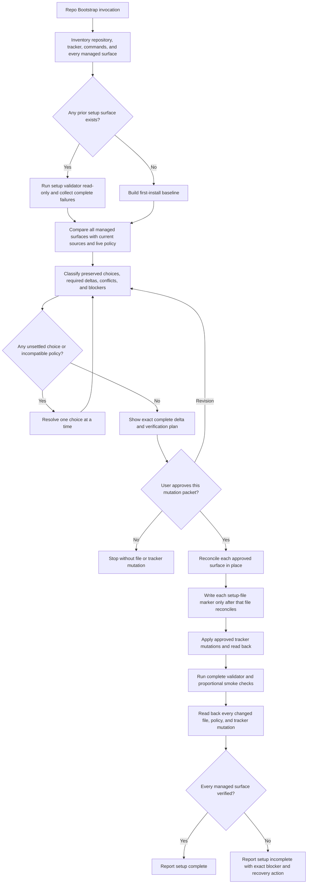

# Repo Bootstrap Reconciliation Synthesis

Status: design reference and implementation map, not an executable contract.

Runtime authority remains in:

- `skills/custom/repo-bootstrap/SKILL.md`;
- `skills/custom/repo-bootstrap/setup-schema.json`;
- `skills/custom/repo-bootstrap/scripts/validate_setup.py`;
- the selected tracker, label, domain, and engineering-contract templates under `skills/custom/repo-bootstrap/`;
- `skills/custom/repo-bootstrap/agents/openai.yaml` for invocation policy;
- `scripts/validate_skills.py` and `tests/test_skill_pack_contracts.py` for pack integrity; and
- the target repository's approved setup choices and preserved additions.

This note follows [Synthesis Ownership](../README.md#synthesis-ownership). It preserves Repo Bootstrap's reconciliation model and the exact changes required in files Repo Bootstrap owns. A consuming skill owns its workflow semantics; Repo Bootstrap owns the provider templates, setup settings, provisioning, reconciliation, validation, and read-back that expose the required capability.

`skills/custom/repo-bootstrap/` matches the installed active baseline. The per-file provenance and Wayfinder-provider candidate described below is preserved under `skills/experimental/repo-bootstrap/` and is not an active setup contract.

## North Star

Repo Bootstrap owns one outcome: a compatible, verified repo-local setup surface that preserves settled repository choices and exposes current pack contracts.

It is explicit-only. It inspects before asking, reconciles instead of resetting, shows one exact bounded delta, waits for approval before mutation, provisions only that delta, and verifies every managed surface before reporting completion.

The aggregate setup marker identifies the pack contract generation. It never proves that every target file still contains its corresponding contract. Complete reconciliation therefore combines aggregate provenance, per-file provenance, semantic validation, live policy checks, and read-back.

## Current Design Status

The experimental candidate contains the essential reconciliation repair prompted by an engineering-contract change that an aggregate marker alone did not expose:

- Inventory runs the setup validator before Draft whenever any prior setup surface exists.
- Reconcile checks every managed surface even when the aggregate setup-schema marker is current.
- Each managed `docs/agents/*.md` contract receives a source-template marker with its own template hash.
- The validator reports every stale or missing per-file marker and still performs semantic validation.
- The pack eval includes a current-aggregate-marker scenario with independently stale engineering, tracker, label, and domain files.

These changes must remain one coordinated contract. A marker-only implementation is insufficient because a marker records provenance, not current semantic completeness.

When an owning skill accepts a managed tracker or label revision, Repo Bootstrap owns the concrete provider-template, label, validation, fingerprint, and reconciliation changes. It does not restate or interpret the consuming workflow. For the coordinated Wayfinder candidate, [Wayfinder's Runtime Ownership And Change Map](wayfinder.md#runtime-ownership-and-change-map) defines the required capability boundary and [its Migration And Acceptance Matrix](wayfinder.md#migration-and-acceptance-matrix) defines behavioral proof; this synthesis records how Repo Bootstrap's owned files provide that capability. The canonical provider templates, labels, validator, fingerprint, and target setup surface are reconciled and structurally validated; installed-mirror synchronization remains intentionally outstanding.

## Managed Surface

Every Inventory and Verify pass accounts for this complete surface, not only files predicted to change:

| Target-repo surface | Pack source or authority | Required evidence | Preservation boundary |
| --- | --- | --- | --- |
| `AGENTS.md` | Repo Bootstrap primer contract plus repo-owned commands and invariants | One current aggregate marker, primer placement, required pointers, verified commands, and read-back | Preserve repo-specific commands, pointers, and invariants; remove only the obsolete portable owner during approved adoption |
| `docs/agents/issue-tracker.md` | Selected hosted or local tracker template, or approved custom tracker mapping | Current setup-file marker, semantic tracker contract, configured policies, live access where applicable, and mutation read-back | Preserve tracker selection, local label mapping, intake policy, close policy, and repo-specific mappings |
| `docs/agents/triage-labels.md` | `triage-labels.md` | Current setup-file marker, every required role and fixed mechanic label, hosted-label verification, and read-back | Preserve mapped local label names and descriptions |
| `docs/agents/domain.md` | `domain.md` with one resolved layout | Current setup-file marker, resolved single- or multi-context layout, routed paths, and read-back | Preserve the confirmed domain layout; do not create domain truth |
| `docs/agents/engineering-contract.md` | `engineering-contract.md` | Current setup-file marker, required language and section semantics, source comparison, and read-back | Preserve compatible repo-specific additions; surface conflicts instead of overwriting them |
| `.gitignore`, `.tmp/`, `.scratch/` | Work-state policy | `git check-ignore` proves `.tmp/` content ignored and `.scratch/` trackable | Preserve unrelated ignore rules and existing work state |
| Hosted tracker configuration | Selected provider plus approved mapping | Read access, policies, mapped labels, fixed labels, and post-mutation refetch | Create only approved missing labels; preserve unrelated tracker configuration |

## End-To-End Reconciliation

## Reconciliation Evidence Model

Use five complementary evidence layers:

| Layer | Question answered | Mechanism |
| --- | --- | --- |
| Aggregate provenance | Does the target claim the current pack contract generation? | One `programming-agent-skills setup-schema` marker derived from `setup-schema.json` |
| Per-file provenance | Which source version was each managed contract reconciled against? | One `programming-agent-skills setup-file` marker containing the source template and template hash |
| Semantic validation | Does the current target still contain its required behavior? | File-specific structural and semantic checks in `validate_setup.py` |
| Operational validation | Do local-state and tracker policies work in the real target? | Git ignore probes, tracker access, label reads, command smoke checks, and mutation refetch |
| Human-readable reconciliation | Were repo-specific additions preserved and conflicts surfaced? | Complete Inventory comparison, exact Draft, approved Provision, and changed-file read-back |

No layer substitutes for another. In particular:

- A current aggregate marker cannot hide one stale managed file.
- A current setup-file marker cannot excuse missing required semantics.
- Semantic tokens cannot prove an uninspected custom addition is safe to replace.
- Byte-for-byte template equality is not required because target files may contain approved configuration and repo-specific additions.
- Validation always scans the complete managed surface and returns the complete failure set; it never stops after the first stale file.

## Reconciliation Rules

### Preserve

Carry forward settled tracker selection, label mapping, domain layout, PR or MR intake policy, implemented-item closure policy, verified commands, repo invariants, and compatible repo-specific contract additions. Re-ask only when evidence is missing, ambiguous, incompatible, explicitly reopened, or contradicted by current state.

### Detect

Run the validator during Inventory when any prior surface exists, then directly inspect every managed file and live configuration. Treat marker failures as an exact source-version delta and semantic failures as an exact behavior delta. Surface conflicting repo policy separately from pack drift.

### Draft

Show the resulting contents or bounded patch for `AGENTS.md`, all four managed contracts, `.gitignore`, and every tracker mutation. Include preserved additions, unresolved conflicts, blockers, and the verification plan. A partial file list is not an approval-ready Draft.

### Provision

Reconcile content first and write that file's current marker second. Never update a marker merely to make validation pass. Apply only approved mutations and preserve unrelated target state.

### Verify

Run the complete validator again, then perform tracker, label, command, local-state, diff, and changed-surface read-back checks. Report every skipped check and its residual risk. `Setup complete` requires all applicable evidence; otherwise return `Setup incomplete` with the exact next action.

## File-By-File Change Map

### `SKILL.md`

Keep the six-step spine `Inventory -> Reconcile -> Choose -> Draft -> Provision -> Verify`. Preserve the early read-only validator run, explicit complete-surface comparison, approval boundary, per-file marker sequencing, and complete verification criterion. When implementing future changes, update the displayed aggregate marker only through the schema fingerprint workflow.

Do not move file-specific tracker mechanics into the skill. The skill selects and reconciles a provider template; each template maps provider-neutral objects and primitives without owning a consuming workflow.

### `setup-schema.json`

Keep one deterministic aggregate hash over every contract-bearing source named in `contract_files`. Any accepted change to tracker templates, labels, domain routing, engineering contract, or the setup validator must regenerate `contract_sha256` and every aggregate marker target together.

The aggregate hash remains generation evidence, not per-file completeness evidence.

The accepted Wayfinder provider revision changes all three tracker templates, `triage-labels.md`, and `scripts/validate_setup.py`. Regenerate the aggregate fingerprint only after those managed sources reach one coordinated final form; synthesis-only edits do not change it.

### `scripts/validate_setup.py`

Validate all required files in one run and accumulate every failure. Keep these responsibilities co-located:

- Git-root and required-file checks;
- aggregate marker and primer checks for `AGENTS.md`;
- expected per-file source-marker derivation for all four managed contracts;
- provider detection or the approved custom-tracker interface marker;
- semantic checks for tracker, labels, domain layout, and engineering contract;
- portable-owner removal checks;
- `.tmp/` ignored and `.scratch/` trackable probes; and
- stable, actionable failure messages naming the exact target and expected source evidence.

When an accepted tracker contract changes, update its section-scoped semantic checks with the provider templates. The validator proves that the selected target implements the current managed contract; it does not become a second source of workflow semantics.

For the accepted Wayfinder provider revision, validate only Repo Bootstrap-owned labels and mappings: map and ticket objects, resolver-type labels or fields, parent and blocking relationships, claim storage, an honestly configured or `unavailable` claim capability, release mapping, revision token, and read-back primitive. A configured exclusive primitive must name its exact invocation and losing-race result; the validator must never infer one from ordinary mutation plus refetch.

Validate section-scoped mapping tokens and fields. Do not encode stable-identity cardinality, map fields, claim generation or lifetime, takeover and recovery, operation selection, state transitions, resolver semantics, budgets, coherence, or closure in `validate_setup.py`; Wayfinder owns all of them.

Prefer section-scoped semantic checks over a growing unstructured global token tuple. Negative-control tests should remove one required behavior from each managed contract and prove the validator reports that exact file while continuing to report other failures.

### `engineering-contract.md`

An owning workflow's tracker or label revision does not require an engineering-contract rewrite unless shared engineering behavior also changes. Any accepted engineering-contract change must update its template hash, aggregate schema hash, target setup-file marker, semantic validator coverage, and reconciliation eval together.

### `domain.md`

No layout-specific source-root assumption is permitted. Resolve only `single-context` or `multi-context`, preserve configured routing, and leave glossary or ADR creation to Domain Modeling. Its template hash and semantic layout check remain part of complete reconciliation.

### `triage-labels.md`

Reconcile the fixed labels declared by the canonical label template while preserving the repository's approved label mapping and unrelated labels. The accepted Wayfinder tracker representation adds these hosted-provider mechanic labels:

- `wayfinder:diagnosis`;
- `wayfinder:questionnaire`; and
- `wayfinder:design`.

Together with the existing map, research, prototype, grilling, and task labels, they provide one label for every resolver type defined by [Wayfinder's Ticket Contract And Resolver Taxonomy](wayfinder.md#ticket-contract-and-resolver-taxonomy). They are mechanic labels, not triage roles, lifecycle, participation, or authority. Local Markdown uses the equivalent `Type:` field and creates no hosted labels. Update the label template, validator, provisioning proof, tests, and aggregate fingerprint in the same slice.

### Tracker Provider Templates

Keep provider-native object, relationship, storage, revision, and read-back mappings in the provider templates. Repo Bootstrap does not define the workflows that consume those mappings.

When an owning skill changes the accepted tracker contract, revise all affected provider templates as one managed-source change. Update the label template when required, refresh section-scoped validator expectations and the schema fingerprint, prove provider-equivalent outcomes in the owning contract's tests, and reconcile target repositories through Repo Bootstrap. Provider templates may use different native representations, but Repo Bootstrap should copy no workflow procedure into its own skill or synthesis.

The accepted Wayfinder revision changes each provider template as follows:

| Tracker-template surface | Repo Bootstrap-owned mapping | Semantic owner |
| --- | --- | --- |
| Objects and types | Map the map object, ticket object, and resolver-type labels or local fields | [Wayfinder Map Artifact and Ticket Contracts](wayfinder.md#map-artifact-contract) |
| Relationships | Map parent and blocking relationships, including the documented fallback representation | [Wayfinder Normative State Model](wayfinder.md#normative-state-model) |
| Claim primitive | Map storage, release, and an exact exclusive primitive against a captured revision, or record `unavailable` | [Wayfinder Campaign Claim](wayfinder.md#campaign-claim) |
| Revision token | Name the observable provider fields used to detect intervening changes | [Wayfinder Revision-Backed Closure Evidence](wayfinder.md#revision-backed-closure-evidence) |
| Read-back primitive | Name the refetch operation and returned errors and observed fields | [Wayfinder Mutation Envelope](wayfinder.md#campaign-claim) |

Provider templates answer only “where and through which primitive?” Wayfinder answers “which fields, when, why, under whose authority, and what proves completion?” GitHub, GitLab, and Local Markdown may differ mechanically while preserving that boundary.

### `agents/openai.yaml`

No change is needed. Repo Bootstrap remains explicit-only because setup mutation is consequential and should begin from a user request or a setup gate's recommendation, not ordinary repository conversation.

### Pack Validation And Tests

`scripts/validate_skills.py` should continue to validate the aggregate manifest, canonical setup surface, installed mirror, and engineering-contract source relationship. Source-to-target comparisons must ignore only the generated setup-file marker line, never substantive content.

`tests/test_skill_pack_contracts.py` should cover:

- current aggregate marker plus one stale or missing per-file marker for each managed contract;
- multiple simultaneous failures returned in one validator run;
- required semantic omission despite a current marker;
- preservation of unrelated repo-specific additions;
- first install, legacy install, current reconciliation, custom tracker, and portable-fallback adoption;
- accepted provider templates remain semantically compatible with the current tracker contract without duplicating that contract in Repo Bootstrap; and
- stale installed-mirror detection after canonical changes.

The accepted Wayfinder provider revision adds provider-neutral fixtures for fixed labels, mapped objects and relationships, claim storage, configured-versus-unavailable claim capability, release mapping, revision token, read-back primitive, and missing-mapping negative controls. Run the same structural cases against GitHub, GitLab, and Local Markdown; identity, state, claim, recovery, and completion behavior remains in Wayfinder's evaluations.

`docs/validation/evals/core-workflows.md` should retain the complete setup reconciliation fixture and add a tracker-template migration fixture only when an owning runtime contract produces an accepted managed-source revision.

## Implementation Order

Use one coordinated sequence for the future runtime change:

1. Accept the owning runtime and tracker-contract change.
2. Update every affected provider and label template together.
3. Update `validate_setup.py`, provider-neutral negative controls, and the schema fingerprint.
4. Update pack tests and behavior evals.
5. Reconcile canonical target fixtures and repositories through Repo Bootstrap rather than changing their markers directly.
6. Run focused tests, full skill validation, target setup validation, and source/read-back checks.
7. Synchronize the installed Repo Bootstrap mirror only after canonical validation and verify hash parity.

Do not land a tracker-template migration before its owning runtime contract. Do not write fresh markers over unreconciled target content. Do not synchronize the installed mirror from an unvalidated canonical source.

## Deliberate Non-Changes

- Do not assume `src/` layout or any specific package root.
- Do not create `CONTEXT.md`, `CONTEXT-MAP.md`, or ADR files during setup.
- Do not install dependencies or broadly mutate the environment without separate approval.
- Do not reset target contracts to byte-for-byte templates.
- Do not duplicate provider mappings in `SKILL.md`.
- Do not duplicate another skill's workflow semantics in Repo Bootstrap or this synthesis.
- Do not treat workspace manifests, multiple source roots, or repository size alone as proof of multiple domain contexts.
- Do not let setup validation choose tracker, label, domain, or close policy for the user.

## Completion Criterion For The Future Rewrite

The Repo Bootstrap rewrite is complete only when every owned source file is classified as changed or deliberately unchanged; every accepted managed-source revision agrees with its provider templates, labels, validator, schema fingerprint, tests, evals, canonical target contracts, and installed mirror; complete reconciliation catches simultaneous stale files even under a current aggregate marker; provider-neutral scenarios produce equivalent tracker outcomes; all approved writes and tracker mutations read back; and no repo-specific addition or unrelated dirty work is overwritten.

## Future Analysis Questions

1. Does Inventory run complete validation before Draft whenever any prior setup surface exists?
2. Does reconciliation inspect every managed surface rather than only files expected to change?
3. Can a current aggregate marker hide any stale, missing, or semantically incomplete managed contract?
4. Is each setup-file marker written only after that file's content and preserved additions reconcile?
5. Does validation accumulate all failures and name the exact target, missing behavior, and expected source evidence?
6. Are settled tracker, label, domain, command, intake, close, and repository-specific choices preserved?
7. Does Draft show every file and tracker mutation before approval?
8. Do all affected tracker providers expose the accepted mappings without Repo Bootstrap restating the consuming workflow?
9. Does the validator prove current managed semantics without becoming a second workflow authority?
10. Did any runtime contract change regenerate the aggregate fingerprint and every affected source marker?
11. Does the installed mirror match the validated canonical source only after synchronization?
12. Are runtime-authoritative changes kept out of this synthesis note until their owning files change and validate?
13. Does every tracker template provide the required objects and primitives without copying the consuming workflow's process?
14. Are fixed mechanic labels, local field equivalents, validator expectations, provisioning checks, tests, and the aggregate fingerprint updated together?
15. Do provider-equivalent fixtures prove objects, relationships, claim capability status, revisions, release, and read-back across GitHub, GitLab, and Local Markdown?
