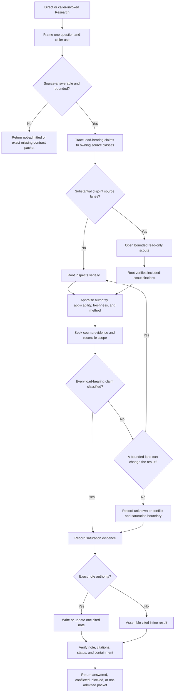

# Research Evidence And Runtime Design Synthesis

Status: Promoted runtime plus accepted post-promotion contract alignment; this
synthesis is not an executable contract.

Runtime authority remains in:

- `skills/custom/research/SKILL.md`;
- `skills/custom/research/agents/openai.yaml`;
- the target repository's source, domain, engineering, and note conventions;
- each caller's question, decision, artifact, and next-transition authority;
- `docs/synthesis/skill-context-relationships.md`;
- tests and behavior evaluations; and
- the installed mirror.

The canonical and installed Research packages are identical at tree hash
`ae255d2b12e88bfa8882c7c5c00116b0267df3fa88345b75819bf95112c477b2`.
The 579-word pre-promotion canonical `SKILL.md` remains B0. Deploy Prompt 1
admitted typed `not-admitted` capability mismatch and proportional note/Return
semantics. Deploy Prompt 3 created C1 from exactly B0 and those deltas. Prompt
4 repaired one protected-status omission and accepted the 661-word candidate
at tree hash
`ad6f263d5674742376bea80b31a90cff6130ba8777cca9685f7c8286cb67c64a`.
Prompt 5 promoted and installed those exact bytes. A bounded post-promotion
repair then aligned source authority with claim ownership and allowed complete
standalone answers to return `Next: none`. The initial fresh hash
`c230f0ccabce2c0c23679eb7ac55a2a572655f62ddaf48b0441ed8daf2f1a35f`
and former 846-word candidate remain historical evidence.

## How To Read This Document

This synthesis uses four layers:

1. **Orientation** states the outcome, selected design, vocabulary, and explanatory flow.
2. **Minimum Normative Design** records the promoted minimum.
3. **Evidence And Rationale** preserves the former detailed design, current
   runtime evidence, rejected machinery, and deferred hypotheses without
   admitting runtime rules.
4. **Extraction And Verification** records how the minimum entered the accepted
   candidate and was proved before promotion.

Change promoted runtime behavior by reopening Layer Two through a new bounded
campaign; explain historical evidence in Layer Three and record extraction and
proof in Layer Four. Historical headings or imperative prose in Layer Three
preserve prior reasoning and create no current runtime authority. The Design
Verdict summarizes what is selected but creates no runtime authority.

Use this index for direct navigation:

| Question | Owning section |
| --- | --- |
| What outcome should Research own? | [North Star](#north-star) |
| What is selected, preserved, deferred, or rejected? | [Design Verdict](#design-verdict) |
| What is the simplest credible baseline? | [Simplest Credible Baseline](#simplest-credible-baseline) |
| Which mechanisms are admitted? | [Mechanism Admission Ledger](#mechanism-admission-ledger) |
| What is the minimum runtime? | [Minimum Viable Runtime](#minimum-viable-runtime) |
| What stays caller-owned or non-runtime? | [Caller-Owned, Preserved, And Non-Runtime Behavior](#caller-owned-preserved-and-non-runtime-behavior) |
| What remains useful only as evidence? | [Historical Detailed Design Reference](#historical-detailed-design-reference) |
| How should the fresh candidate read? | [Proposed Runtime Semantic Surface](#proposed-runtime-semantic-surface) |
| Where does each rewrite change belong? | [Runtime Ownership And Change Map](#runtime-ownership-and-change-map) |
| What must pass before promotion? | [Staged Extraction And Proof](#staged-extraction-and-proof), [Migration And Acceptance Matrix](#migration-and-acceptance-matrix), and [Promotion Gate And Residual Gaps](#promotion-gate-and-residual-gaps) |
| What is the accepted current package? | [Current Acceptance Decision](#current-acceptance-decision) |

When any diagram, rationale, ownership row, or acceptance case disagrees with Layer Two, correct that other surface.

# Layer One: Orientation

## North Star

Research owns one outcome: answer one bounded source question with claim-level, freshness-aware, citation-verified evidence, then return that evidence to its owner through either one authorized durable note or a no-write result.

Research is a bounded evidence leaf. It may judge what the inspected evidence supports, conflicts with, or leaves unknown. It never owns the product, design, domain, implementation, tracker, policy, or personal decision that the evidence informs.

The quality target is not maximum source count or maximum apparent certainty. It is the smallest sufficient evidence set that preserves:

- exact question and scope;
- claim-specific authority;
- applicable version, date, jurisdiction, and fixed point;
- material counterevidence and conflict;
- citation entailment;
- explicit limits and unknowns;
- caller and mutation boundaries; and
- a checkable stopping reason.

A faster or cheaper research route is better only when these gates remain unchanged. Search volume, scout count, note length, and citation count are not quality metrics by themselves.

## Design Verdict

| Stratum | Selected shape | Runtime status |
| --- | --- | --- |
| Research core | Preserve the canonical one-question, primary-source, claim-classification, gate, citation, and caller-return behavior | Baseline; do not rewrite without a separate admitted delta |
| Admission delta | Distinguish capability mismatch from admitted evidence failure through typed `not-admitted` | Admit; canonical failed 5/5 controls |
| Output delta | Replace the rigid note shape with proportional note/Return semantics | Admit; canonical failed 5/5 controls |
| Delegated leaf | Preserve current caller decision, mutation, and next-transition ownership | Baseline and required caller contract |
| Scout model | Preserve the canonical compact scout contract byte-for-behavior | Baseline; reject expansion |
| Progressive disclosure | Keep the two deltas inline with the already-inline branches | No branch-specific support file is justified |
| Rejected machinery | Mandatory source counts, numeric confidence scores, complete query logs, citation databases, knowledge graphs, automatic note indexing, always-parallel background research, automated source ranking, or a persistent research ledger | Excluded |
| Deferred hypotheses | Automatic note refresh, reusable source caches, formal systematic-review mode, machine-verifiable citation extraction, and automatic adaptive scout width | Require observed need and independent proof |

The fresh extraction remains one canonical-shaped, single-file skill. It adds
no helper, reference file, provider, state machine, search database, or
campaign ledger unless a later behavior control independently earns that
surface.

## Baseline Invocation Description

> Research one source question against primary sources into a cited repo-local
> Markdown note. Use for durable source evidence when the user requests a note
> or a caller authorizes one note path.

This is the current canonical description and remains the next extraction
baseline. The former 34-word experimental description is deferred: its 45/45
evaluation proved equivalence only against the earlier 60-word candidate, not a
host-level failure of the canonical trigger. Explicit invocation and current
caller edges remain available while that evidence is absent.

## Capability Boundary

Research answers source questions. Route by the authority needed to resolve the gap:

| Gap | Owner |
| --- | --- |
| Inspectable primary or claim-owning sources can answer one bounded question | Research |
| Existing behavior, symptom, or cause is uncertain and must be reproduced or instrumented | `$diagnosing-bugs` |
| A runnable design or behavior verdict is required | `$prototype` |
| The current user owns a preference, trade-off, term, commitment, or judgment and the exchange is conversation-only | `$grilling` |
| The current user owns that decision and repo-backed durable domain capture must remain active | `$grill-with-docs` |
| One identifiable external stakeholder owns unavailable information | `$to-questionnaire` |
| A bounded interface, seam, adapter, ownership, or migration design must be chosen | `$codebase-design` |
| Several interdependent decisions and prerequisites need a durable route | `$wayfinder` after explicit human selection |

Research may expose that the question belongs elsewhere. It returns the classification without invoking another resolver or laundering that resolver's work into source research.

## Research Vocabulary

| Term | Meaning |
| --- | --- |
| **Research question** | One bounded question whose answer can be materially changed by inspecting sources; it may contain dependent subclaims but not unrelated decisions |
| **Supported decision or artifact** | The caller-owned use for the answer; it fixes relevance but grants Research no decision authority |
| **Load-bearing claim** | A proposition whose removal or reversal would materially change the answer, status, or caller use |
| **Owning source** | The source with authority for that claim kind in the applicable version, jurisdiction, time, or repository state |
| **Discovery source** | A secondary index, summary, snippet, citation trail, or lead used to find evidence; it does not support a load-bearing claim unless it owns a distinct synthesis claim |
| **Counterevidence** | Applicable evidence that weakens, narrows, or contradicts a proposed claim |
| **Claim trace** | The working mapping from every load-bearing claim to status, owning evidence, applicability, material counterevidence, and answer impact; inference, method, corroboration, and limits appear when relevant |
| **Saturation** | The assurance-proportional point where ordinary owning-source verification and contradiction checking are complete, heightened work yields no material change from active disconfirmation and one final bounded pass, or an exact access or evidence boundary prevents closure |
| **Research note** | One time-bounded cited Markdown artifact; it records evidence as of a fixed point and is never self-updating truth |

## Explanatory Research Model

This vocabulary explains the design; it is not a pre-approved runtime spine:

```text
Frame -> Trace -> Inspect -> Appraise -> Triangulate -> Saturate -> Write -> Verify -> Return
```

- **Frame** locks one question, caller use, scope, freshness, assurance, and mutation authority.
- **Trace** decomposes the likely answer into load-bearing claims and maps each claim to its likely owning source class.
- **Inspect** finds and reads evidence. Optional scouts are delegated readers for disjoint read-only source lanes, never the universal operation.
- **Appraise** judges authority, applicability, directness, freshness, methodological fit, and source limitations.
- **Triangulate** reconciles scope differences, seeks counterevidence, and classifies every load-bearing claim.
- **Saturate** proves why further bounded search is redundant or unable to close an exact gap.
- **Write** creates or updates exactly one authorized note; no-write branches skip it.
- **Verify** checks citation entailment, status, freshness, source identity, output completeness, and work containment.
- **Return** gives the evidence owner one terminal packet and stops.

This model remains explanatory evidence. The fresh Prompt 3 extraction does not
copy its extra leading words or transitions because Layer Two admits none of
them. **Inspect** names root-owned source work in this explanation; a scout is
an optional delegated reader, not a synonym for ordinary inspection.

## End-To-End Explanatory Flow



The diagram is explanatory and deliberately richer than the minimum runtime.
Only Layer Two decides which of its concepts enter the fresh candidate.

# Layer Two: Minimum Normative Design

This layer records the promoted minimum. The minimum is B0 plus two admitted
campaign deltas and two later contract corrections; confirmation of a larger
historical design did not admit its mechanisms.

## Simplest Credible Baseline

The pre-promotion canonical package is the frozen B0 extraction base:

- `SKILL.md`: 61 lines and 579 words;
- `agents/openai.yaml`: implicit-invocation policy only; and
- tree hash
  `7cb171f1459d3f7efa1e26dccbd04264340eb9304a315391f9341b924c949f5f`.

It owned one source question, source legwork, claim classification,
fresh-context read-only scouts, one authorized note or no-write return,
citation and work-state verification, and caller return. Current upstream is
smaller and note-oriented, but it omits this pack's no-write, caller, conflict,
containment, and verification contracts; B0 was therefore the simplest
credible control.

## Mechanism Admission Ledger

| Mechanism beyond baseline | Baseline failure or required contract | Evidence | Owner and cheaper alternative | Added load | Admission |
| --- | --- | --- | --- | --- | --- |
| Typed capability non-admission | Canonical treated a user-owned preference as admitted evidence blockage | Canonical 0/5; candidate 5/5 | Research owns Admission; add one compact `Admit` branch before `Lock` | Small runtime and proof delta; no caller or maintenance surface | **Admit** |
| Proportional note and Return semantics | Canonical forced empty sections and omitted evidence depth, stopping basis, mutation, and caller-use ownership | Canonical 0/5; candidate 5/5 | Research owns Write and Return; revise those existing steps rather than replace the skill | Small runtime and proof delta; no support file | **Admit** |
| Claim-owned source authority | The absolute secondary-source clause contradicted the selected aggregate-synthesis rule | Control and aligned candidate both 5/5; no behavioral-improvement credit | Research owns Trace; replace the absolute with one claim-ownership correction | Equal procedure and package surface; one clarifying example | **Source-correcting** |
| Terminal standalone answer | One complete control answer forced an unnecessary route | Control 4/5; aligned candidate 5/5 | Research owns standalone Return; allow `Next: none`, otherwise at most one route | Smaller continuation demand; no router or caller change | **Admit** |
| Broader implicit invocation and ordinary-lookup exclusion | No host-level canonical discovery failure was demonstrated | Candidate-description pruning was 45/45 against another candidate, not canonical | Keep the canonical description; explicit `$research` and caller invocation remain available | Permanent context and E1 proof load | **Defer** |
| Display name, short description, and default-prompt metadata | No canonical interface failure was demonstrated | Structural presence only | Keep canonical policy-only YAML | Interface and mirror maintenance | **Defer** |
| Formal caller-packet schema and missing-field machinery | Callers must retain supported-use, scope, freshness, note authority, and return ownership | Current callers already supply their owned fields | Keep caller fields with callers and let baseline `Lock` infer direct-user facts; `Admit` returns material omissions | Caller coupling and migration proof | **Caller-owned / collapse** |
| `ordinary | heightened` assurance tiers and final-pass procedure | Canonical already selected applicable evidence and limits in 5/5 source cases | No failing canonical control | Keep the baseline authority/version/conflict Gate; retain detailed assurance ideas as evidence | Runtime judgment, output, and evaluation load | **Non-runtime / defer** |
| Expanded source taxonomy, applicability matrix, claim trace, and appraisal procedure | Canonical passed governing-version and aggregate-evidence cases 5/5 | No failing canonical control | Preserve the detailed synthesis as research-design evidence; keep baseline Trace/Classify | Large runtime attention and maintenance load | **Non-runtime** |
| Expanded scout economics, packets, or custody prose | Canonical compact scout contract passed | No failing canonical control | Preserve baseline Scout; use separate future controls for any new mechanism | Dispatch, verification, token, and proof load | **Reject expansion** |
| New full-file spine, separate Completion section, and route prose | No distinct behavioral failure requires a wholesale rewrite | Structural coherence only | Add `Admit`; revise Write/Return in place | Rewrite and regression surface | **Reject** |
| Note/scout support files, schemas, helpers, or route catalogs | No inline-attention, automation, or recovery failure exists | No control failure | Keep the single-file baseline and relationship registry | Pointer, parser, context, and maintenance load | **Reject** |

## Minimum Viable Runtime

The promoted runtime is the smallest coherent patch to B0:

1. **Preserve the baseline.** Keep its description, policy, two branch spines,
   Boundary, Lock, Scout, Classify, Gate, verification, one-note/no-write
   containment, and caller Return behavior unless an admitted delta or accepted
   contract correction requires a local edit.
2. **Add typed Admission.** Before `Lock`, require one source-answerable bounded
   question and the material baseline fields needed to research or return. A
   mismatch returns `Status: not-admitted`, every failed or missing predicate,
   settled information, actual need shape, available evidence, `Tracked
   mutation: none`, and return owner. Direct use may recommend one deterministic
   existing owner without invocation; caller use returns classification without
   choosing its next route.
3. **Align source authority.** Trace each load-bearing claim to its owning
   authoritative source. A methodologically relevant systematic review may own
   an aggregate claim; secondary sources that do not own the claim remain
   discovery-only.
4. **Make Write proportional.** Keep the one-note authority but replace the
   fixed Markdown template with semantic minimum fields: question, research
   status `answered`, `conflicted`, or `blocked`, supported caller use, scope
   and freshness, concise cited answer, applicable evidence-depth and stopping
   basis, material conflict/unknown/limit detail, and caller-use boundary. Omit
   empty conditional sections. A conflicted or blocked note is durable
   evidence, not a settled answer.
5. **Complete Return proportionally.** Return the status, concise answer or
   blocker, direct citations or absolute note path, material limits and stopping
   basis, mutation result, caller-use boundary, and return owner. Preserve the
   caller's decision and next transition. A complete standalone answer returns
   `Next: none`; otherwise it recommends at most one next route.

No formal assurance tier, expanded source taxonomy, new metadata, support file,
helper, caller schema, or replacement spine enters this candidate.

## Caller-Owned, Preserved, And Non-Runtime Behavior

- Direct users or callers own the supported use, scope, freshness constraint,
  note authority, and return owner. Research infers obvious direct-user facts
  and owns evidence judgment.
- Wayfinder retains approved-note ticket state; Improve Codebase retains its
  selected candidate and may explicitly invoke the no-write branch; other
  skills only recommend Research and stop. No caller migration is required by
  the two admitted deltas.
- The canonical scout, source, classification, Gate, citation, containment, and
  caller boundaries are preserved baseline behavior, not newly admitted
  machinery.
- Detailed assurance, applicability, taxonomy, triangulation, saturation,
  routing, and future-support-file designs remain Layer Three evidence. They
  may inform a later failure hypothesis but do not enter runtime from this
  synthesis.
- No behavior is disclosed to a new file. Both admitted deltas are short and
  touch universal Admission or existing Write/Return branches.

## Residual Unavoidable Complexity

The one-note/no-write split and Scout step remain because they are already
compact canonical contracts protecting mutation authority, independent source
reading, and root evidence judgment. Prompt 2 does not require those baseline
mechanisms to re-earn existence. The only unavoidable added complexity is one
typed pre-research return and enough semantic output fields to prevent the two
observed failures.

## Minimum Normative Home Index

| Concern | Sole proposed home |
| --- | --- |
| Capability mismatch and missing material input | New compact `Admit` step |
| Existing research contract and evidence procedure | Existing canonical Boundary and Process steps |
| Proportional durable note | Existing `Write` step |
| Proportional terminal packet and caller boundary | Existing `Return` step |
| Overall completion | Existing ordered branch spines plus Verify and Return; no new section |
| Caller edges and ownership | Existing caller files and `skill-context-relationships.md`; unchanged |
| Detailed rejected or deferred mechanisms | Layer Three only |

# Layer Three: Evidence And Rationale

Everything from here to Layer Four is evidence, not current normative design.
The detailed sections preserve the previously confirmed and evaluated design so
future work can trace hypotheses, alternatives, and tests. Their imperative
language and historical labels do not admit runtime behavior.

## Historical Detailed Design Reference

The following former normative index and sections describe the superseded broad
design. Use them to formulate bounded controls, never as the extraction source.

### Historical Normative Home Index

| Concern | Sole normative home |
| --- | --- |
| Invocation reach and question admission | [Invocation And Admission](#invocation-and-admission) |
| Required caller and direct-user input | [Research Contract](#research-contract) |
| Evidence judgment, decision ownership, and mutation scope | [Authority And Mutation Boundary](#authority-and-mutation-boundary) |
| Legal route from current working evidence | [Derived Route Contract](#derived-route-contract) |
| Claim-specific source authority and source roles | [Source Ownership And Evidence Roles](#source-ownership-and-evidence-roles) |
| Required evidence depth | [Assurance And Proportionality](#assurance-and-proportionality) |
| Claim statuses and result status derivation | [Claim Trace And Result Status](#claim-trace-and-result-status) |
| Freshness and fixed-point applicability | [Freshness And Applicability](#freshness-and-applicability) |
| Counterevidence, conflict, and inference | [Triangulation And Conflict](#triangulation-and-conflict) |
| Scout admission, context, and return | [Scout Contract And Economics](#scout-contract-and-economics) |
| Search stopping evidence | [Saturation Gate](#saturation-gate) |
| What each research artifact proves | [Artifact Authority Contract](#artifact-authority-contract) |
| Durable note shape and one-file rule | [Research Note Contract](#research-note-contract) |
| Citation, answer, and filesystem proof | [Verification Contract](#verification-contract) |
| Context-loading triggers | [Runtime Context Loading Contract](#runtime-context-loading-contract) |
| External result forms | [Return Contract](#return-contract) |
| Overall terminal completion | [Completion Contract](#completion-contract) |
| Composition edges and exclusions | [Relationship Ownership](#relationship-ownership) |

## Invocation And Admission

Research remains narrowly implicitly invocable. Preserve
`policy.allow_implicit_invocation: true` so an explicit request to research or
investigate one bounded question using primary or governing sources, an
authorized repo-local research note, explicit `$research`, or a complete caller
packet can reach it. Ordinary lookup does not qualify merely because citations
would be useful. The description must require one source question and must not
compete with generic lookup, open-ended literature review, debugging,
prototyping, interviewing, design, or decision-making.

Admit only when all predicates hold:

1. exactly one bounded research question exists;
2. inspectable sources can materially answer it;
3. one caller-owned decision, artifact, ticket, or requested understanding fixes relevance;
4. scope and exclusions distinguish a sufficient answer from a general topic survey;
5. applicable time, version, repository fixed point, and jurisdiction are known or explicitly irrelevant;
6. required assurance is proportionate and feasible with available source access;
7. one return owner is known; and
8. note authority is either one exact path, a direct user's general authorization to choose the repo convention, or `none`.

A comparative question remains one question only when all compared claims support one terminal answer under one scope and assurance standard. Split unrelated questions or caller uses before research.

For a direct user, infer obvious contract fields from the request and
repository. Ask only when a missing field would materially change the evidence
search, answer, or write authority. For a caller invocation, require only the
caller-owned fields below and return any missing fields together; do not make
the caller construct Research's assurance or source strategy.

A `not-admitted` request returns the failed predicate and actual need shape. It
may recommend one existing owner only when the match is deterministic; it does
not invoke that owner or copy the relationship registry into runtime.

## Research Contract

Every caller packet supplies:

```text
Caller and return owner:
Research question:
Supported decision, artifact, ticket, or requested understanding:
Scope and explicit exclusions:
Freshness: as-of date, version, jurisdiction, repository fixed point, or not time-sensitive:
Authorized note path: <absolute repo-local path> | choose repo convention | none:
Write authority: create | update | none:
```

Research infers and locks:

```text
Assurance: ordinary | heightened, with reason:
Source strategy and access constraints:
Time or source budget, when supplied:
```

A caller may impose stricter assurance, access, source, or budget constraints.
Research may not weaken them silently.

The contract controls relevance and sufficiency. It does not predetermine the answer, require a preferred conclusion, or permit Research to make the supported decision.

When the caller supplies a fixed source list, treat it as a required starting set, not a prohibition on necessary counterevidence, unless the caller explicitly bounds the work to summarizing only those sources. A summary-only request must be labeled as such and cannot claim a broader research conclusion.

## Authority And Mutation Boundary

Research owns:

- question framing inside the locked contract;
- read-only source discovery and inspection;
- claim decomposition;
- source-role, authority, applicability, freshness, and methodological judgment;
- counterevidence search and conflict classification;
- the claim trace;
- one cited answer;
- exactly one authorized research note when permitted; and
- the terminal research packet.

The caller owns:

- the supported decision or artifact;
- acceptance of consequences outside the evidence question;
- tracker, specification, domain, ADR, implementation, configuration, and external mutation;
- whether to continue, widen, or commission another question; and
- the next workflow transition.

Scouts own only read-only evidence collection for their assigned lane. They do not classify the final answer, write the note, mutate any repository or external system, dispatch peers, or choose the caller's route.

External source use is read-only. Disposable captures may live under the target's authorized temporary convention and must be removed or explicitly returned as residual disposable state. A tracked run creates or updates exactly one authorized note. It never updates an index, README, bibliography database, source file, domain file, ADR, tracker item, or generated registry. When the repo convention requires a second tracked mutation, return the exact publication blocker or use the no-write branch.

Pre-existing dirty work remains user-owned. Verification compares the starting and ending state and proves the run added changes only to the authorized note, without claiming the whole worktree was otherwise clean.

## Derived Route Contract

This table maps current evidence to the dedicated section that owns the next
action or return. It adds no completion rule, persisted lifecycle, or helper
state; each linked normative section owns its gate.

| Current evidence | Legal action or return | Illegal shortcut |
| --- | --- | --- |
| Required caller field is missing | [Research Contract](#research-contract) | Searching under an ambiguous question, freshness bound, or write authority |
| The question belongs to another authority | [Invocation And Admission](#invocation-and-admission) | Simulating another skill inside Research |
| Load-bearing claims or likely owning sources are unmapped | [Source Ownership And Evidence Roles](#source-ownership-and-evidence-roles) | Searching a topic without a claim or authority map |
| Mapped claims lack inspected evidence | [Source Ownership And Evidence Roles](#source-ownership-and-evidence-roles) | Writing from snippets, summaries, memory, or unverified scout prose |
| Evidence lacks authority, applicability, freshness, method, or counterevidence judgment | [Freshness And Applicability](#freshness-and-applicability) and [Triangulation And Conflict](#triangulation-and-conflict) | Counting citations as support |
| Claims are classified but closure is unproved | [Saturation Gate](#saturation-gate) | Stopping because one plausible answer or arbitrary source count was reached |
| Saturation passes and exact note authority exists | [Research Note Contract](#research-note-contract), then [Verification Contract](#verification-contract) | Mutating another tracked file or publishing before evidence is explicit |
| Saturation passes and note authority is `none` | [Verification Contract](#verification-contract) | Creating a tracked note or returning uncited prose |
| Verified output exists | [Return Contract](#return-contract) | Continuing into the caller's decision or next workflow |

## Source Ownership And Evidence Roles

Source selection is claim-specific. “Primary” describes proximity, not universal authority or quality. Use the source that owns the exact claim in the applicable state.

| Claim kind | Likely owning evidence | Common false substitute |
| --- | --- | --- |
| Actual behavior in the target repository | Source, configuration, tests, runtime evidence, and governing docs at the pinned fixed point, each for the fact it exposes | README summary, stale issue, memory, or a test interpreted as all supported behavior |
| Supported product, API, or library contract | Versioned official documentation, specification, release notes, and tagged source for the requested version | Current unversioned docs for an older version, blog tutorial, search snippet, or source implementation presented as a supported public contract |
| Standard, policy, regulation, or legal text | Issuing body's official text for the applicable edition, jurisdiction, and effective date | News summary, commentary, draft text, or another jurisdiction |
| Organization, product, schedule, or current-state fact | Current first-party record or authoritative API as of the locked date; independent corroboration when the claim is contested or self-interested | Cached snippet, undated page, or third-party aggregator |
| Empirical effect or performance claim | Original study, data, and method for what that study establishes; relevant replications or evidence syntheses for generality | Abstract-only reading, vendor benchmark generalized beyond its setup, or a single study treated as field consensus |
| Historical event or decision | Contemporaneous record, official archive, repository history, or direct artifact for the event | Later recollection presented as the original record |
| Aggregate synthesis | A methodologically relevant systematic review, standard, or official synthesis for the aggregate claim, with primary evidence inspected when a load-bearing limitation or dispute requires it | Treating every secondary source as discovery-only even when the synthesis itself owns the claim |

Assign each inspected source one or more roles:

- **owning:** directly governs or establishes the claim in the applicable scope;
- **corroborating:** independently supports an already owned claim;
- **counterevidence:** narrows or contradicts the proposed claim;
- **discovery:** points to evidence but does not support the claim used in the answer; or
- **inaccessible:** identified but not inspected, and therefore never cited as support.

Search-result pages, snippets, unsourced generated summaries, and scout narration are discovery evidence only. A citation points to the inspected source itself.

## Assurance And Proportionality

Assurance changes evidence depth, not the caller's decision authority:

| Assurance | Passing evidence |
| --- | --- |
| **Ordinary** | One exact owning source may support a stable normative or repository fact after applicability and a bounded contradiction check; no second search pass is mandatory when that check exposes no material reason to widen |
| **Heightened** | Every load-bearing claim has the best applicable owner plus independent corroboration or an explicit reason one uniquely authoritative source is sufficient; active disconfirmation and one final bounded pass produce no material change, or an exact evidence or access boundary remains |

Use heightened assurance when the question is volatile, contested, empirical,
safety-critical, financially or legally consequential, or likely to be
generalized beyond the evidence. Applicable official, jurisdictional,
versioned, and current authorities remain source-selection requirements, not a
third reporting tier. Do not lower caller-required assurance silently. When the
available evidence cannot satisfy the level, return `blocked` or `conflicted`
rather than filling the gap with source count or confident prose.

No fixed minimum citation count applies. One authoritative standard may conclusively own a narrow normative claim. Ten derivative articles may add no evidence. Empirical generalization, disputed history, self-interested first-party claims, and current-state claims often require independent evidence.

## Claim Trace And Result Status

Every load-bearing claim has a minimal working trace:

```text
Claim ID and proposition:
Status: supported | conflicted | unknown
Owning evidence and citation:
Applicable version, date, jurisdiction, or fixed point:
Material counterevidence:
Answer impact:
```

Add fact-versus-inference, method, corroboration, authority limits, and other
fields only when they can change evidence judgment, status, or caller use.

Claim status means:

- **supported:** the applicable owning evidence directly supports the fact, or the labeled inference follows from cited supported premises without material unreconciled counterevidence;
- **conflicted:** applicable evidence materially disagrees after version, time, jurisdiction, population, definition, and source-purpose differences are reconciled; and
- **unknown:** a load-bearing claim lacks inspectable sufficient evidence under the locked assurance and access boundary.

The terminal research status derives mechanically from load-bearing claims:

| Research status | Predicate |
| --- | --- |
| `answered` | Every load-bearing claim is supported; remaining limits do not change the answer |
| `conflicted` | At least one load-bearing claim remains materially conflicted and no load-bearing claim is unknown for a more fundamental reason |
| `blocked` | At least one load-bearing claim is unknown because evidence, access, freshness, applicability, or authority is insufficient |

`not-admitted` is a typed pre-research return, not a research status.
Non-load-bearing uncertainty remains in limits and never upgrades a result to
false certainty.

Rendering is proportional. A simple ordinary answer with one supported claim
may express the trace as one cited statement with applicability and any material
limit. Multiple, heightened, conflicted, or blocked claims expose the fields
needed to make status, evidence, and uncertainty inspectable. Compact rendering
never relaxes classification or citation verification.

## Freshness And Applicability

Every load-bearing citation records the dimensions that can change its meaning:

- as-of or access date for current facts;
- product, API, library, specification, or policy version;
- jurisdiction and effective date;
- repository path and fixed point for local code claims;
- population, environment, dataset, method, and evaluation window for empirical claims; and
- document edition or archived identity for historical sources.

Applicability precedes recency. A newer source for the wrong version or jurisdiction does not supersede the correct governing source. When two sources describe different scopes, record a scoped divergence rather than a false conflict.

A note is evidence as of its recorded bounds. Research never claims it will remain current. Updating an existing note requires a new authorized run against the exact path, a new freshness basis, and full verification; Git history, not an invented note-level revision ledger, preserves prior text.

## Triangulation And Conflict

Triangulation has four duties:

1. search for evidence that could falsify or materially narrow each proposed load-bearing claim;
2. distinguish normative intent, actual implementation, observed behavior, and empirical generalization;
3. reconcile differences in version, date, jurisdiction, definition, population, environment, and source purpose; and
4. label synthesis as inference and expose its cited premises.

Do not resolve conflict by majority vote, source prestige alone, or newest-date wins. Prefer the source applicable to the exact claim and state. When two applicable authorities genuinely disagree, preserve the disagreement, explain its answer impact, and return `conflicted` unless a higher governing authority or caller-locked rule resolves it.

An official vendor source owns its supported contract and statements, not independent proof of comparative superiority. Source code owns implementation at a revision, not necessarily the promised public contract. A paper owns what its data and method support, not universal generality. A test owns its exercised behavior, not every intended path.

## Scout Contract And Economics

The root is the sole evidence judge and note author. Research runs serially by
default. Preserve the current compact scout contract: use direct fresh-context
read-only scouts only when substantial disjoint lanes materially improve
breadth or speed; use `fork_turns="none"` for independent judgment; give each
scout one complete lane contract; prohibit scout writes, peer dispatch, and
final classification; and have the root inspect the return and verify every
citation used.

No fixed width, economic formula, or scout packet schema is pre-approved for
promotion. Each needs its own Prompt 4 current-canonical control and candidate
evidence. Scout count, summaries, and consensus never substitute for source
appraisal or saturation.

## Saturation Gate

Saturation is claim-driven and assurance-proportional, not query-count-driven. It passes only when:

1. every load-bearing claim is classified;
2. the best known applicable owning source was inspected or its exact access failure is recorded;
3. the assurance-specific corroboration or unique-authority reason is complete;
4. ordinary work received an owning-source contradiction check, while
   heightened work received active disconfirmation;
5. conflicts were reconciled by scope or preserved as material conflict; and
6. for heightened work, the final bounded pass produced no better authority,
   new load-bearing claim, or material counterevidence, or an exact
   source/access boundary makes further closure impossible.

Record the saturation basis, not every query. A blocked result records attempted source lanes, inaccessible owning evidence, and what observable change would permit another run. A caller time or source budget may end search, but it cannot convert unknown evidence into an answered result.

## Artifact Authority Contract

| Artifact or surface | Owns or proves | Must not substitute for |
| --- | --- | --- |
| Research Contract | Question, relevance, bounds, assurance, output authority, and return owner | Predetermined answer or caller decision |
| Search result, index, summary, or discovery source | A lead to inspect | Support for a load-bearing claim |
| Inspected source | The exact claims supported within its authority and applicability | Broader scope, another version, freshness not observed, or the final synthesis |
| Scout packet | Read-only lane evidence and gaps | Root appraisal, citation verification, status, note authority, or caller return |
| Claim trace | Current mapping from claims to evidence, conflict, unknowns, and limits | The underlying sources or a separate durable state file |
| Research note | One cited time-bounded synthesis at the authorized path | Live truth, automatic freshness, caller decision, domain truth, specification, or implementation authority |
| Inline result | One verified no-write answer, conflict, or blocker | Durable repo state or permission to write a note |
| Return packet | Verified output identity, status, answer, citations, limits, saturation, and boundary | Downstream execution or acceptance by the caller |

When a note, claim trace, scout packet, or source disagree, reconcile the claim
against the inspected owning evidence and current applicability. Never edit a
citation label or status merely to make the artifacts agree.

## Research Note Contract

Write only when the Research Contract authorizes `create` or `update` and one repo-local path is exact or may be chosen from an existing convention. Prefer the repo's established research-note location. When none exists and the direct user authorized a note without an exact path, use `docs/research/<slug>.md`. A caller must supply an exact path or explicitly delegate convention choice.

The durable note has this semantic minimum:

```text
Title: the research question
Status: answered | conflicted | blocked
Supports: caller-owned decision, artifact, ticket, or requested understanding
Scope and exclusions
Freshness: as-of, version, jurisdiction, and repository fixed point
Assurance and saturation basis

Answer
  concise answer with claim-level citations

Conflicts, Unknowns, And Limits
  material disagreement, inaccessible evidence, applicability limits, and what is not proved

Source Trace
  direct source identity, role, authority, applicable version or date, and supported claim IDs

Caller Use Boundary
  what the evidence may inform, what Research did not decide, and return owner
```

Render the minimum proportionally. Omit empty conditional sections; expand the
claim trace only when multiple claims, heightened assurance, conflict, or
blockage makes the result otherwise uninspectable. Exact Markdown headings are
not normative. A later `NOTE-FORMAT.md` may own rendering only after a fixed
control demonstrates a specific inline-attention failure and a pointer
candidate corrects it. Citations stay next to the claims they support; a
bibliography alone is insufficient. Discovery-only and inaccessible sources
may appear in limits but never as supporting citations.

A `conflicted` or `blocked` note is valid when the authorized caller requested durable research evidence and Saturation passes on the conflict or access boundary. It must not present an unsupported one-paragraph answer as settled.

## Verification Contract

Verification proves all applicable gates:

### Evidence

- every load-bearing claim appears in the working claim trace and in the
  answer's proportionate claim representation;
- every supporting citation resolves to an inspected direct source rather than a search result or scout summary;
- the cited source entails the adjacent claim within its authority and applicability;
- inference is labeled and its premises are cited;
- material counterevidence, conflicts, unknowns, freshness risks, and assurance limits remain visible; and
- result status matches the claim-status predicates.

### Output

- the answer stays inside the Research Contract and caller-use boundary;
- the Return Contract is complete;
- a note was reread from disk, exists at the authorized path, and matches the verified answer; and
- inline evidence contains direct citations and makes no durability claim.

### Containment

- starting and ending work state were compared;
- pre-existing work remains preserved;
- this run added tracked changes only to the authorized note, or no tracked
  changes for the inline, blocked-without-note, or `not-admitted` branch; and
- disposable captures were removed or returned as explicit residual state.

Citation existence without entailment is a failed verification. A syntactically complete note without a supported status is not complete.

## Runtime Context Loading Contract

Load the smallest complete context for the selected branch:

| Trigger | Load now | Keep out |
| --- | --- | --- |
| Every invocation | `SKILL.md`, direct request or minimal caller packet, target repo instructions, and already named source pointers | Full caller conversation, unrelated tickets, every possible source, or rationale |
| Exact authorized note branch | The note branch in the first single-file `SKILL.md`, existing note when updating, repo note convention, and starting work-state evidence | Scout procedure when no scouts are admitted; unrelated publication indexes |
| Scout gate passes | The scout branch in the first single-file `SKILL.md` and only the assigned lane's contract | Parent conclusion, peer returns, note-writing procedure, caller decision, or unrelated claim lanes |
| Repository claim | Exact governing source, tests, config, docs, ADRs, and fixed point needed for that claim | Whole repository by default |
| External source claim | Direct applicable source plus only necessary discovery and counterevidence paths | Broad web context unrelated to the claim trace |
| Return-only or `not-admitted` branch | Contract, evidence pointer, exact missing gate, and Return Contract | Note and scout references |

The main skill must retain source appraisal, claim status, saturation, verification, Return, and completion because every research path needs them. The first candidate also retains note and scout mechanics. A later support-file split must pass its own control and pointer evaluation; universal evidence judgment never moves behind it.

## Return Contract

Every terminal Research invocation returns one of four forms:

| Return | Use when | Required content |
| --- | --- | --- |
| `answered` | Every load-bearing claim is supported | Question, concise answer, proportionate claim representation, direct citations or note path, freshness and assurance, limits, saturation basis, mutation result, and return owner |
| `conflicted` | Applicable evidence remains materially conflicted | Question, competing claims and sources, reconciled scope differences, unresolved conflict, answer impact, saturation basis, note path or inline citations, and return owner |
| `blocked` | A load-bearing claim remains unknown | Question, exact missing evidence or access, attempted lanes, available supported evidence, observable unblock condition, note path when authorized, mutation result, and return owner |
| `not-admitted` | The request fails Admission or belongs to another evidence owner | Failed predicate, settled contract fields, actual need shape, deterministic owner when one exists, available evidence, mutation `none`, and return owner |

For a caller-invoked run, return to that caller and stop. Do not recommend or
invoke another skill, decide the caller's ticket, or mutate its state. For a
direct user invocation, the answer may be terminal with `Next: none`; a
`not-admitted` result recommends at most one existing owner only when the match
is deterministic, then stops.

Every written return includes the absolute note path and confirms `create` or `update`. Every no-write return states `Tracked mutation: none`.

## Completion Contract

Research completes exactly one admitted run only when:

- the Research Contract is locked and every load-bearing claim is classified;
- the applicable assurance, triangulation, and Saturation gates pass;
- the answer, conflict, or blocker matches the claim-trace-derived status;
- every supporting citation passes direct-source identity and entailment verification;
- freshness, applicability, inference, counterevidence, limits, and what is not proved remain explicit;
- exactly one authorized note changed or tracked mutation is `none`;
- pre-existing work and disposable-state obligations reconcile;
- one complete Return reaches the direct user or delegating caller; and
- no caller-owned decision, mutation, or downstream route has started.

A `not-admitted` run completes only when every failed or missing Admission
predicate is returned together, the actual need shape and return owner are
named, a deterministic owner is recommended only when one exists, available
evidence is preserved, and mutation is `none`.

A written `conflicted` or `blocked` note is completion only for durable evidence capture. It is never equivalent to an answered question or caller acceptance.

## Relationship Ownership

This table is the exhaustive proposed relationship registry, not a runtime route
catalog. Caller syntheses own their local trigger and minimal packet
construction; Research owns Admission, evidence procedure, note authority, and
return. Runtime names another owner only for a deterministic match.

| Caller | Verb | Callee | Trigger and return |
| --- | --- | --- | --- |
| Direct user | Invoke | `$research` | The user explicitly asks to research or investigate one bounded question using primary or governing sources, authorizes a repo-local research note, or names `$research`; return the verified note, inline answer, conflict, blocker, or `not-admitted` packet. Ordinary lookup stays outside this edge. |
| `$skill-router` | Recommend and stop | `$research` | One source question needs a cited repo-local note; the later Research invocation runs its own Admission |
| `$grilling` | Recommend and stop | `$research` | A source evidence gap blocks the current user-owned decision; Research later returns evidence without making that decision |
| `$to-questionnaire` | Recommend and stop | `$research` | The apparent stakeholder gap is answerable from inspectable sources; Research later runs independently |
| `$wayfinder` | Invoke | `$research` | One selected Research ticket supplies the question, supported use, scope, freshness or fixed point, return owner, and note authority; return answer, citations, limits, status, and approved note pointer without selecting another operation |
| `$improve-codebase` | Invoke | `$research` | One selected candidate supplies the minimal caller packet for one source-resolution need; return evidence, one authorized note pointer or `none`, and limits so Improve Codebase can reclassify |
| `$research` | Recommend and stop | `$diagnosing-bugs` | Admission shows the missing authority is causal reproduction or diagnosis rather than source evidence |
| `$research` | Recommend and stop | `$prototype` | Admission shows the question needs one runnable design or behavior verdict |
| `$research` | Recommend and stop | `$grilling` | Admission shows the current user owns the unresolved preference, trade-off, term, or commitment and the exchange is conversation-only |
| `$research` | Recommend and stop | `$grill-with-docs` | Admission shows the current user owns the unresolved repo-backed decision and durable domain capture must remain active |
| `$research` | Recommend and stop | `$to-questionnaire` | Admission shows one identifiable external stakeholder owns unavailable material knowledge |
| `$research` | Recommend and stop | `$codebase-design` | Admission shows one bounded interface, seam, adapter, ownership, or migration design must be chosen |
| `$research` | Recommend and stop | `$wayfinder` | Admission shows several interdependent decisions and non-conversational prerequisites need a durable route; the user must start Wayfinder later |

Research has no direct delivery relationship to To Spec, To Tickets, Implement, Parallel Implement, Domain Modeling, or tracker providers. It may name evidence implications but never creates their artifacts or starts their procedures.

The Research-owned recommend-and-stop rows document deterministic Admission
matches for relationship proof. Prompt 3 must not copy this table into runtime:
`not-admitted` returns the failed predicate and actual need shape, names one
owner only when the match is deterministic, and never invokes it. Skill Router
does not confirm a known handoff.

## Current Source And Evaluation Evidence

Everything in this continuation informs the selected minimum but creates no
runtime rule.

## Current Source Trace

| Source | Evidence retained for synthesis |
| --- | --- |
| Promoted canonical `skills/custom/research/SKILL.md` | B0 behavior plus typed non-admission, proportional note/Return semantics, and preserved `answered | conflicted | blocked` research status |
| `skills/custom/research/agents/openai.yaml` | Research is currently narrowly implicitly invocable |
| Git history for Research | The skill was deliberately simplified from explicit ownership and completion sections into one linear leading-word spine, then hardened around source authority, fresh scout context, one-file publication, verification, and caller return |
| Current upstream `mattpocock/skills` Research | Retains the seed idea: background reading against primary sources and one cited Markdown file in the repo; it does not supply this pack's authority, no-write, conflict, caller-return, or verification contracts |
| `docs/synthesis/skill-context-relationships.md` | Research is a bounded evidence owner used by Skill Router, Grilling, Wayfinder, Improve Codebase, and source-answerable Questionnaire gaps |
| Wayfinder runtime and synthesis | Research is AFK, answers one authoritative source ticket, and returns answer, citations, limits, and an approved note pointer without owning map state |
| Improve Codebase selected-candidate contract | Research receives one question, supported decision, scope, freshness, and `authorized note path: none` unless approved, then returns to caller reclassification |
| Structural tests | Protect fresh-context scouts, the two output branches, one-note order, status vocabulary, note shape, verification, and return ordering |
| Behavior-evaluation fixtures 11 and 35 | Protect no-write versus approved-note authority, pre-dirty containment, primary-source claims, conflicts, blocked lanes, second-file prohibition, citation verification, and caller decision ownership |

The upstream source inspected for this synthesis is the [current primary repository file](https://raw.githubusercontent.com/mattpocock/skills/main/skills/engineering/research/SKILL.md). Future extraction must refresh that comparison rather than treating this snapshot as permanently current.

### Prompt 1 Mandatory Upstream Registry

All identities below are local checkout observations from 2026-07-23. No
network refresh ran, so equality with each local `origin/main` does not prove
the remote state after the recorded fetch evidence.

| Upstream | Inspected identity and access | Freshness limit | Research disposition |
| --- | --- | --- | --- |
| Matt Pocock | `.tmp/mattpocock-skills` at `ed37663cc5fbef691ddfecd080dff42f7e7e350d`; clean `main`; full clone; complete current two-file Research package plus directly related docs and change records | Local fetch evidence ended 2026-07-22T02:34:37Z | Simplest external note-oriented baseline candidate, but reject as B0 because it omits required no-write, caller, conflict, containment, safe-failure, and verification contracts; primary-source and claim-owner language is supporting rationale |
| Superpowers | `.tmp/superpowers` at `d884ae04edebef577e82ff7c4e143debd0bbec99` (`v6.1.1`); clean `main`; no current Research package; complete historical `tracing-knowledge-lineages` package and removal/restore records inspected | Local fetch evidence ended 2026-07-17T22:33:40Z; separately named `obra/superpowers-skills` was not checked out | Historical lineage archaeology is a specialized evidence technique, not a general baseline; retain as `historical-admission-only` and defer any lineage mechanism |
| Ponytail | `.tmp/ponytail` at `16f29800fd2681bdf24f3eb4ccffe38be3baec6b`; clean `main`; full clone; all six current skills inspected with no Research equivalent | Local fetch evidence ended 2026-07-17T22:33:39Z | No credible Research baseline; comprehension-first tracing is supporting rationale only and its coding-only minimality ladder is owned elsewhere |

Two applicable Upper-Bound Language rows were also inspected with their
evidence pointers. `Qualified parallel investigation` is synthesis pressure
from Superpowers' direct parallel-dispatch contract with Matt's blocker and
frontier language as corroboration; it supports the protected compact Scout
gate but admits no expansion. `Human judgment and agent legwork should be
separated` is corroborated cross-pack pressure for the protected caller/root
authority boundary, not a new mechanism. No unresolved source question could
change an admission decision, so no Conditional Research Interlude was
admitted.

## Current Strengths To Preserve

- The current skill is already small enough to read cover to cover.
- Its one-question and one-note boundary makes mutation and caller return legible.
- `supported`, `conflicted`, and `unknown` are better than an unsupported confidence score.
- Fresh-context scouts are explicitly read-only and subordinate to root judgment.
- The evidence gate recognizes search repetition and uncloseable gaps.
- Verification distinguishes written-note proof from the no-write branch and preserves dirty work.
- Caller-invoked research returns instead of choosing the supported decision.

These strengths argue for a controlled rewrite, not an exhaustive runtime manual.

## Design Gaps Requiring Counterfactual Proof

The current text leaves several important decisions implicit. These are candidate failure hypotheses, not established behavioral failures:

- Admission does not sharply distinguish one source question from literature survey, diagnosis, prototype, stakeholder evidence, user judgment, or multi-question work.
- “Primary source” is too coarse to explain when a standard, source code, versioned docs, original study, or systematic review owns a particular claim.
- The current trace may not reliably expose owning evidence, applicability,
  material counterevidence, and answer impact for every load-bearing claim.
- Freshness is named but applicability across version, jurisdiction, repository fixed point, population, and evaluation window is not fully specified.
- The current gate may not scale contradiction checks and additional search
  strongly enough between ordinary and heightened assurance, leaving both
  premature-stopping and unnecessary-search hypotheses to test.
- Any proposed scout economics, width rule, or packet schema remains unadmitted
  until the current compact scout contract fails a precise control.
- The durable note template may omit assurance, saturation basis, or the
  caller-use boundary, and may force empty headings in simple work.
- Status derivation from claim status remains implicit.
- Citation presence is verified, but claim-to-source entailment and direct-source identity are not explicit.
- Caller packets may omit a necessary caller-owned field, but a larger packet
  may instead leak Research-owned assurance and source strategy into callers.
- Capability mismatch may blur with evidence blockage unless `not-admitted`
  remains distinct from `blocked`.

Prompt 3 may express these hypotheses in one coherent experimental candidate.
Prompt 4 tests each observable claim against the current canonical skill and
prunes `reject-no-control-failure` guidance before acceptance. A no-guidance arm
is diagnostic only.

Deploy Prompt 4 resolved these hypotheses. The canonical control failed typed
capability non-admission and proportional note/Return shape in 5/5 contexts;
the final candidate corrected both in 5/5. The first fresh candidate generation
used claim status `supported` as its terminal research status in 5/5 note
samples. Prompt 4 restored the protected `answered | conflicted | blocked`
status vocabulary in the existing Write field and the affected candidate arm
then passed 5/5. Controls already passed governing source selection, version
applicability, direct citations, one-note containment, caller return, and the
compact scout contract, so expanded guidance for those behaviors remains
pruned. Live network, inaccessible-source, dirty-update, and actual scout
execution remain residual validation gaps, not newly accepted runtime
machinery.

## Confirmed Deployment Decisions

Deploy Prompt 1 settled all six audit categories before extraction:

1. Keep the deployment sequence `2 -> 3 -> 4 -> 5`; Prompt 3 creates the
   experimental candidate before behavior evaluation.
2. In Prompt 4, test one observable behavior claim at a time and prune guidance
   whose current-canonical control does not fail.
3. Use the current canonical skill as the evaluation control and the
   experimental skill as the candidate; no-guidance is diagnostic only.
4. Keep the nine-word model as synthesis vocabulary; runtime leading words must
   be earned by failed controls.
5. Give each gate one dedicated normative owner; the route table only points.
6. Use `ordinary | heightened` assurance with a reason.
7. Require a minimal proportional claim trace, adding fields only when relevant.
8. Preserve the compact scout contract; added economics or schemas require
   Prompt 4 control and candidate evidence.
9. Use observable research or investigation language for invocation and exclude
   ordinary lookup.
10. Make the note contract semantic and proportional rather than a fixed empty
    heading template.
11. Keep caller packets minimal; Research owns assurance and source strategy.
12. Use `not-admitted` for capability mismatch and reserve `blocked` for admitted
    evidence failure.
13. Return actual need shape and recommend one owner only for deterministic
    matches; keep the exhaustive relationship registry outside runtime.
14. Keep **owning source** as the internal evidence rule while invocation uses
    the familiar phrase **primary or governing sources**.
15. Close ordinary work after owning-source verification and contradiction
    checking; heightened work adds active disconfirmation and one final bounded
    no-material-change pass or exact boundary.
16. Preserve exhaustive rationale, alternatives, gaps, and test cases while
    replacing repeated normative prose outside Layer Two with pointers and
    consequence-specific summaries.

## Why Claim-Owned Evidence Beats Primary-Source Absolutism

Directness matters, but authority is contextual. A specification owns a normative interface; source code owns implementation at a revision; an issuing body owns the effective standard; an original paper owns its data and method; and a systematic review may own an aggregate synthesis claim. Calling all secondary material invalid would discard legitimate synthesis authority, while treating every official or original source as sufficient would overstate self-interested, stale, narrow, or methodologically weak evidence.

The selected design therefore keeps familiar primary-source pressure at
invocation while Layer Two makes evidence authority claim-specific. See
[Source Ownership And Evidence Roles](#source-ownership-and-evidence-roles).

## Why Saturation Is A Gate

Research can stop at the first plausible source or continue after the answer has
stabilized. Arbitrary counts solve neither failure. The accepted distinction is
ordinary versus heightened closure; the complete rule lives only in
[Saturation Gate](#saturation-gate).

This does not make research mechanically complete. It makes the judgment inspectable: what claims matter, which authority owns them, what could falsify them, what remains unknown, and why another bounded pass is unlikely to change the result.

## Why Scouts Stay Optional

Independent source lanes can reduce elapsed reading time and confirmation bias,
but also repeat context and root verification. The current compact serial
default remains the baseline. Added economic or packet machinery must earn its
runtime cost through Prompt 4 evaluation; see
[Scout Contract And Economics](#scout-contract-and-economics).

## Deliberate Non-Changes

- Keep Research implicitly invocable under a narrow description.
- Keep one bounded question and one return owner.
- Keep exactly one tracked note as the maximum durable mutation.
- Keep a no-write branch for caller invocations without note authority.
- Keep source discovery and external access read-only.
- Keep the root as sole evidence judge and note author.
- Keep `supported`, `conflicted`, and `unknown` as claim statuses and `answered`, `conflicted`, and `blocked` as research statuses.
- Keep callers responsible for decisions, artifacts, tracker state, and next transitions.
- Keep local repo evidence, official external sources, specifications, original research, and source code within one general Research capability.
- Add no provider-specific browser, search, academic database, repository host, or citation-manager procedure.
- Add no executable helper in the first rewrite.
- Keep the first experimental candidate in one file; support files remain evidence-gated future options.
- Preserve unrelated dirty work and the target repository's note convention.

## Rejected Machinery

| Rejected idea | Reason |
| --- | --- |
| Mandatory two-source or three-source rule | Source count does not establish authority, applicability, independence, or entailment |
| Numeric source-quality or answer-confidence score | Compresses incomparable authority and uncertainty dimensions into false precision |
| Complete query and browsing ledger | High token and maintenance cost; saturation needs only claim-impacting lanes and blocked attempts |
| Always start a background agent | Wastes context and time for narrow questions and splits evidence judgment from the owner |
| One scout per claim | Creates coordination proportional to claim count rather than reading economics |
| Fixed initial scout count | Substitutes an arbitrary number for lane independence, expected reading savings, and root verification bandwidth |
| Persistent citation database, knowledge graph, or evidence JSONL | Duplicates source and note state without a proved recovery or reuse need |
| Automatic repo-note indexing | Exceeds the one-note authority and couples Research to publication setup |
| Auto-refresh or “current forever” notes | Freshness must be rerun against an explicit as-of contract |
| Research-owned recommendation or decision | Crosses the bounded evidence-leaf boundary |
| Full systematic-review procedure for ordinary engineering research | Adds screening, protocol, and bias machinery disproportionate to common source questions |

## Deferred Hypotheses

| Hypothesis | Evidence required before admission |
| --- | --- |
| Dedicated systematic-review mode | Repeated source questions genuinely need reproducible search strings, inclusion/exclusion screening, study-quality appraisal, and a flow record; separate invocation and artifact boundaries are proved |
| Citation-entailment helper | Manual citation errors recur; a helper can detect them without claiming semantic judgment or requiring a duplicate claim schema |
| Source cache or reusable evidence bundle | Repeated questions inspect the same versioned sources; invalidation and provenance are cheaper than fresh inspection |
| Automatic note refresh | A target repo owns freshness policy, triggers, mutation authority, review, and non-destructive update behavior |
| Automatic adaptive scout-width policy | Real evaluations show elapsed-time improvement after dispatch and verification cost, with no worse conflict, citation, or token tail |
| Durable claim-trace sidecar | One note cannot preserve required evidence state without duplication, drift, or poor caller usability |

## Historical Extraction And Verification Design

This former extraction plan and its executed evaluations are retained as Layer
Three evidence. They explain how the two admitted failures were discovered and
how the superseded 846-word candidate was assessed. They are not the current
Prompt 3 plan or a promotion authorization.

Extract the proposed behavior once. Keep universal evidence judgment in the main skill, branch-only artifact and scout mechanics behind sharp pointers, callers limited to packet construction and return use, and tests focused on semantic contracts rather than incidental prose.

### Historical Proposed Runtime Semantic Surface

The experimental skill may express this semantic surface as a coherent
candidate. Prompt 4 decides which proposed changes survive comparison with the
current compact spine:

```text
Outcome and bounded evidence-leaf boundary
Observable narrow invocation and Admission
Minimal caller packet; Research-owned assurance and source strategy
Candidate runtime spine, pruned by current-canonical controls in Prompt 4
Owning-source judgment, proportional assurance, claim trace, and result status
Authorized note branch | no-write branch
Optional delegated scout branch
Verify
Return
Completion
```

This is a semantic target, not approved final wording. The first candidate keeps
the complete compact contract in `SKILL.md`. A note schema or scout packet may
move behind a precise context pointer only after Prompt 4 proves an
inline-attention failure and the pointer candidate materially improves it. If
no such control fails, no support file is created.

### Historical Runtime Ownership And Change Map

The `Must not absorb` column is part of the design.

| Bundle | Surface | Owns | Proposed delta | Must not absorb |
| --- | --- | --- | --- | --- |
| `R1` | `skills/custom/research/SKILL.md` | Outcome, invocation, Admission, minimal caller packet, Research-owned assurance and source strategy, authority, candidate route wording, source ownership, claim and result statuses, freshness, triangulation, saturation, compact note and scout branches, Verify, Return, and completion | Build one coherent candidate from the confirmed synthesis; Prompt 4 prunes every proposed behavior whose current-canonical control does not fail | Accepted no-op guidance, fixed note headings, caller workflow, unproved scout machinery, provider/browser procedure, academic-review protocol, citation database, or source-scoring algorithm |
| Future only | Conditional `skills/custom/research/NOTE-FORMAT.md` | Durable note rendering and note-only verification after a proved inline-attention failure | Create only when Prompt 4 control and pointer-candidate evidence proves the split | Universal evidence judgment, Admission, search procedure, caller decision, route selection, or publication index mutation |
| Future only | Conditional `skills/custom/research/SCOUT-BRIEF.md` | Optional scout assignment and return rendering after a proved inline-attention failure | Create only when Prompt 4 control and pointer-candidate evidence proves the split | Scout-selection judgment, final classification, note writing, caller context, peer dispatch, or mutation authority |
| `R1` | `skills/custom/research/agents/openai.yaml` | Narrow implicit invocation policy and concise human-facing metadata | Preserve `allow_implicit_invocation: true`; describe explicit research or investigation against primary or governing sources, an authorized note, explicit `$research`, complete caller packets, and the ordinary-lookup exclusion | Runtime procedure, caller catalog, source taxonomy, or note schema |
| `R2` | Wayfinder runtime and synthesis | Research-ticket selection, minimal caller packet, map state, claim, outcome, and next transition | Supply only the question, supported use, scope, freshness or fixed point, return owner, and note authority; preserve AFK participation and caller ownership | Research assurance, source strategy, note schema, scout economics, or evidence status redefinition |
| `R2` | Improve Codebase selected-candidate contract | One candidate's source-resolution question and later reclassification | Supply the minimal caller packet with note path `none` unless authorized; receive the bounded return | Research procedure, assurance, source strategy, or final evidence judgment |
| `R2` | Grilling, Grill With Docs, To Questionnaire, and Skill Router surfaces | Their existing recommendation predicates and stop boundaries | Preserve the conversation-only versus repo-backed domain-capture admission split; update only if Research Admission or Return changes an accepted edge | Research procedure, automatic invocation, or caller continuation |
| `R2` | `docs/synthesis/skill-context-relationships.md` | Invocation policy, composition index, context ownership, supporting-file index, and boundary note | Index the accepted Research edges and any new disclosed references without copying procedure | Caller-local packets, source taxonomy, or completion rules |
| `R3` | `tests/test_skill_pack_contracts.py` | Structural protection | Cover invocation, semantic-surface roles, `not-admitted`, proportional note semantics, note and scout pointer triggers, mutation boundary, caller return, and relationship uniqueness | Exact headings or prose order beyond machine-consumed contracts, or claims of behavioral success |
| `R3` | `docs/validation/evals/core-workflows.md` and evaluation transcripts | Counterfactual behavior proof | Extend current Research fixtures across Admission, source ownership, applicability, assurance, triangulation, saturation, citations, scouts, note containment, and Return | Template echoes or source-count proxies for judgment quality |
| `R3` | Installed mirror `C:\Users\steve\.agents\skills\research` | Validated runtime copy | Synchronize only after the coordinated canonical candidate and behavior gate pass | Independent edits, partial synchronization, or authority over canonical source |

No helper, support file, or target-repo setup change belongs in the first
candidate. A later `NOTE-FORMAT.md` or `SCOUT-BRIEF.md` exists only after its
separate Prompt 4 control and pointer-candidate evaluation; otherwise the
contract stays in `SKILL.md`.

### Historical Staged Extraction Plan

Implementation stages order work; they do not authorize partial installation.

| Stage | Bundles | Outcome | Boundary |
| --- | --- | --- | --- |
| `I1` | `R1` | Extract one complete single-file Research-owned candidate from the confirmed synthesis | Candidate wording is experimental, coherent, and compact; note and scout branches remain inline |
| `I2` | `R2` | Reconcile minimal caller packets, return boundaries, invocation index, and any evidence-earned supporting-file ownership | Each caller supplies only its owned fields and consumes the return without absorbing Research assurance or source strategy |
| `I3` | `R3` | In Prompt 4, pin control and candidate snapshots, prune no-control-failure guidance, replace brittle structural snapshots where necessary, and run counterfactual behavior evaluation | Positive and negative cases pass; no promotion-blocking residual gap remains; installed hashes match only after separate authorization |

### Historical Staged Behavior-Evaluation Protocol

Evaluation phases prove claims, not document completeness. Prompt 3 creates the
single-file experimental candidate. Prompt 4 then pins the current canonical
control and candidate snapshots, tests one observable claim at a time, prunes
guidance whose control does not fail, and runs E1-E4. Do not synchronize the
installed mirror until every applicable phase passes.

| Evaluation phase | Claims proved | Representative scenarios |
| --- | --- | --- |
| `E0`: Claim control | In Prompt 4, the current-canonical arm exhibits the precise claimed failure for one observable candidate claim; a passing control causes that guidance to be pruned | One fixed red-capable scenario per claim, with control and candidate hashes and source snapshot; no-guidance may diagnose defaults only |
| `E1`: Invocation and attention | Qualifying one-question research invokes; wrong-owner, ordinary-lookup, or multi-question work does not; the minimal caller packet and correct inline branch are found without speculative loading | Explicit primary-or-governing-source research, authorized note request, explicit `$research`, caller packet, ordinary lookup, multi-question survey, runnable question, user decision, missing field, note and no-note branches |
| `E2`: Ordinary evidence work | Claim tracing, source ownership, applicability, assurance, appraisal, inference, triangulation, saturation, and citations produce a supported answer with proportionate legwork | Stable official contract, versioned API, pinned repo behavior, current fact, empirical claim, summary-only source list, unique authority, and independent corroboration |
| `E3`: Conflict, failure, scouts, and containment | Material conflict and unknowns remain visible; scout economics and root verification hold; one-note or no-write mutation boundaries survive dirty work and access failures | Version divergence, jurisdiction mismatch, official-versus-implementation drift, inaccessible owner, misleading search snippet, stale page, scout disagreement, pre-dirty note update, second-file convention, and disposable capture |
| `E4`: Integrated promotion | Callers, relationships, canonical files, references, tests, evaluations, installation, and mirror parity agree | Wayfinder and Improve Codebase returns, recommendation-and-stop callers, full validation, scoped install, and hash parity |

For every behavioral claim, fix the prompt, caller packet, repository and source
snapshot, tool availability, model, reasoning tier, runtime settings, skill
hash, and rubric across arms. Run at least five independent fresh-context
samples per arm. The current canonical skill is the control and the
experimental skill is the candidate. A no-guidance arm may diagnose defaults
but cannot justify wording. Prune the candidate guidance when the
current-canonical control does not exhibit the claimed failure.

Judge the actual answer, inspected sources, citations, source applicability, search decisions, mutation state, and return packet. String matches and note headings are structural evidence only. Record median, range or variance, worst observed result, protocol deviations, unavailable token or timing telemetry, and residual gaps.

Scout-efficiency claims additionally record agent-controlled elapsed time, fresh contexts, root verification load, duplicated source inspection, total tokens when available, citation defects, and worst-case result. Do not claim a scout strategy is better merely because it used more agents or finished one synthetic case faster.

#### Historical Executed Prompt 4 Evaluation

The durable record is
[`2026-07-21-research-post-candidate-behavior-eval.md`](../../validation/transcripts/2026-07-21-research-post-candidate-behavior-eval.md).
The complete-package pruning record and frozen repaired control are
[`2026-07-21-research-extraction-pruning-evidence.md`](../../validation/transcripts/2026-07-21-research-extraction-pruning-evidence.md)
and
[`research-pruning-pre-prune/`](../../validation/evals/research-pruning-pre-prune/).
The current-canonical hash was
`7cb171f1459d3f7efa1e26dccbd04264340eb9304a315391f9341b924c949f5f`;
the accepted candidate hash is
`1478a8ac6d50cae052802f8778a6addea9021366f3c36130385339f9fb54c099`.

Five independent contexts per arm exercised governing-version conflict,
aggregate empirical evidence, one authorized proportional note, and a
user-owned capability mismatch. The control scored 5/5 on the first three
cases' evidence and containment semantics but 0/5 on proportional note/Return
shape and 0/5 on typed `not-admitted`. The final pruned candidate scored 5/5 on
every behavior with zero critical failures. The repaired 244-line candidate was
frozen at hash `f6c8ba9f63555e99a135dc3f38aa8f014692f8ac5779ffe896a2277a96fb0316`
and reduced to 114 lines and 846 words; expanded source taxonomy, route
machinery, extra leading words, scout economics, and support files were rejected
for no control failure. Five fresh contexts per arm preserved seven evidence,
status, and mutation cases. A first-prune 4/5 tail on explicit non-admission and
caller-use slots was repaired to 5/5 in five new contexts with zero critical
failures.
The always-loaded description was then reduced from 60 to 34 words. Five fresh
metadata-only contexts per arm preserved all three positive and six adjacent
negative invocation decisions, 45/45 in each arm with zero variance.

### Historical Migration And Acceptance Matrix

This matrix supplies implementation order and cases. The linked Layer Two sections remain the behavior authority.

| Implementation / evaluation | Bundles | Behavior | Positive case | Negative control | Verification |
| --- | --- | --- | --- | --- | --- |
| `I3 / E0` | Prompt 4 | Claim control | The current-canonical arm exhibits the precise fixed failure for one observable candidate claim | A passing current-canonical control or a failing no-guidance arm allows the guidance to survive | Fixed prompt, source and repository snapshots, control and candidate hashes, runtime settings, rubric, and at least five fresh-context samples per arm |
| `I1,I2 / E1` | `R1,R2` | Invocation and Admission | An explicit request to research one bounded question using primary or governing sources, an authorized note, explicit `$research`, or a minimal caller packet reaches Research; a mismatch returns `not-admitted` with actual need shape and at most one deterministic recommendation | Ordinary lookup, open-ended survey, multiple unrelated questions, diagnosis, prototype, stakeholder evidence, user judgment, or incomplete caller packet starts research or mutation; Research embeds the full route registry | Invocation-policy test, minimal caller-packet fixtures, and fresh-context classification samples |
| `I1 / E1` | `R1` | Semantic surface and context loading | A fresh run identifies outcome, boundary, the compact candidate spine, note or no-write branch, optional scout branch, Verify, Return, and completion | Prompt 4 retains no-op leading words, universal appraisal is hidden, a speculative support file is created, or caller workflow loads | Structural surface tests and context inventories across direct, delegated, note, inline, and scout branches |
| `I1 / E2` | `R1` | Caller packet and Trace | One bounded question and minimal caller packet map every provisional load-bearing claim to an applicable owning-source class and search lane; Research infers assurance and source strategy | Callers must construct Research procedure, topic-first browsing begins, a predetermined conclusion wins, a fixed source list becomes proof, or unrelated subquestions expand silently | Caller-packet and claim-map fixtures plus output inspection |
| `I1 / E2` | `R1` | Source ownership and roles | Each claim uses the source that owns it in the applicable state; discovery, owning, corroborating, counterevidence, and inaccessible roles stay distinct | Search snippets, blogs, scout prose, wrong version, official marketing, source code, or a single paper are used beyond the claims they own | Claim-to-source adjudication scenarios and citation inspection |
| `I1 / E2` | `R1` | Assurance and proportionality | A narrow stable claim closes under ordinary assurance after owner verification and contradiction checking; volatile, contested, empirical, high-stakes, consequential, or broadly generalized claims use heightened assurance with a reason | A fuzzy middle tier returns, mandatory source count adds derivative sources, or one source yields broad certainty where heightened assurance requires more | Ordinary, heightened, unique-authority, empirical, contested, and high-stakes scenario set |
| `I1 / E2` | `R1` | Freshness and applicability | Version, date, jurisdiction, fixed point, population, environment, and method are recorded only where they affect meaning; applicability wins over nominal recency | A newer wrong-version source supersedes the governing source, or an undated result is called current | Version, jurisdiction, repo-SHA, current-fact, and empirical-window fixtures |
| `I1 / E2,E3` | `R1` | Triangulation, inference, and status | Scope divergence is reconciled; direct facts and labeled inference remain distinct; supported, conflicted, and unknown claims derive answered, conflicted, or blocked correctly | Majority vote, prestige, newest-date wins, hidden counterevidence, unlabeled inference, or unsupported answered status succeeds | Conflict and status table scenarios with output inspection |
| `I1 / E2` | `R1` | Saturation | Ordinary work closes after owning-source verification and a contradiction check; heightened work adds active disconfirmation and one final no-material-change pass or exact boundary | First plausible source, mandatory extra searching for a conclusive stable owner, arbitrary count, time budget, or endless low-value browsing substitutes for proportional saturation | Ordinary and heightened search-sequence fixtures plus control-versus-candidate behavior evaluation |
| `I1 / E2,E3` | `R1` | Citations and verification | Every load-bearing claim cites an inspected direct source that entails it; inference premises and limitations remain visible | Citation exists but supports only the topic, points to a search result, comes only from a scout, or omits applicability | Citation-entailment rubric, direct-source checks, and manual output inspection |
| `I1 / E3` | `R1` | Scout independence | Serial is default; substantial disjoint lanes receive fresh read-only context; the root judges evidence and verifies included citations | Unproved economic or packet machinery survives Prompt 4, one page gets a scout, all slots fill because they exist, peers see conclusions, scouts write, or consensus replaces appraisal | Serial, disjoint-lane, duplicated-lane, disagreement, and capacity scenarios; separate claim control for every added scout mechanism |
| `I1 / E3` | `R1` | One-note and no-write containment | An authorized new or existing note is the only run-created tracked delta; inline, blocked-without-note, and `not-admitted` runs leave tracked state unchanged; dirty work survives | Research edits an index or source file, overwrites unrelated dirty work, claims the repo was clean, or writes a note from `none` authority | Pre/post work-state fixtures, pre-dirty update, second-file convention, and disposable-capture checks |
| `I1 / E3` | `R1` | Note contract | Answered, conflicted, and blocked notes preserve the semantic minimum, adjacent citations, proportional claim trace, saturation, and caller-use boundary; empty conditional sections disappear | A simple answer is forced into fixed headings, a complex result hides its trace, a bibliography replaces claim citations, a blocked note presents a settled answer, or the caller boundary is missing | Semantic note-reread rubric plus only machine-required structural tests |
| `I1,I2 / E3,E4` | `R1,R2` | Return and caller authority | Caller-invoked runs return one complete packet and stop; direct runs may end with `Next: none` or one recommendation | Research changes caller state, decides its artifact, starts another skill, or forces a recommendation after a complete answer | Wayfinder and Improve Codebase caller fixtures plus direct-user behavior evaluation |
| `I1-I3 / E4` | `R1-R3` | Integrated promotion | Canonical runtime, callers, relationships, tests, evals, validation, and installed hashes agree; a support file exists only if its separate control and pointer evaluation passed | Speculative or partial file split, unresolved caller mismatch, unproved behavior claim, or independent mirror edit is promoted | Focused tests, full pytest, `scripts.validate_skills`, both diff checks, changed-file read-back, installation dry-run, scoped sync after authorization, and hash parity |

### Historical Promotion Gate And Residual Gaps

The promotion record names each behavioral claim, implementation stage,
evaluation phase, current-canonical control and candidate hashes, fixed source
and repository snapshots, caller packet, sample count, tools, model and
reasoning tier, rubric, median, variance or range, worst result, source-access
deviations, unavailable telemetry, critical failures, and residual gaps.

A critical failure blocks promotion regardless of averages:

- unauthorized tracked or external mutation;
- fabricated, inaccessible, search-result-only, or non-entailing citation used as support;
- wrong version, date, jurisdiction, fixed point, population, or method materially changes the answer;
- material conflict, counterevidence, inference, or unknown is hidden;
- `answered` is returned while a load-bearing claim is conflicted or unknown;
- Research makes the caller's decision, mutates caller state, or starts downstream work;
- a scout writes, dispatches peers, receives contaminating conclusions, or substitutes for root verification;
- pre-existing work is overwritten or a second tracked file changes;
- note and inline branches claim the wrong durability or mutation state; or
- the Return Contract is incomplete.

Promote only when Prompt 4 shows the current-canonical control exhibits the
claimed failure, the candidate materially reduces it, variance does not expose
a new unstable tail, and no new critical failure appears. A failing no-guidance
arm cannot justify wording. Additional text, source checks, scouts, or
references must improve behavior enough to repay their attention, token, time,
and maintenance cost.

A residual gap blocks promotion when it affects invocation, Admission, question scope, caller authority, note authority, source identity, source role, applicability, assurance, claim classification, counterevidence, saturation, citation entailment, mutation containment, result status, Return completeness, or caller ownership. Noncritical uncertainty may remain only when the promotion record names the evidence limit, operational consequence, and later validation owner.

Static validation proves structure. Upstream comparison supplies design pressure. Neither proves that the rewrite researches better.

### Historical Completion Criterion For The Former Rewrite

The rewrite is complete only when Prompt 4 has pruned every claim whose
current-canonical control passes; every retained claim improves materially
without regression; every normative concern has one indexed home; the main
skill preserves its compact semantic surface without becoming a research
manual; Admission reliably distinguishes Research from neighboring owners; a
minimal caller packet drives owning-source work while Research retains
assurance and source strategy; every load-bearing claim is appraised,
triangulated, classified, saturated, and citation-verified; visible detail is
proportional without hiding complex evidence; note and no-write branches
preserve mutation and durability boundaries; optional scouts improve their
retained cases; every caller retains its decision and next transition; every
acceptance row passes; no promotion-blocking gap remains; canonical validation
passes; and the installed mirror matches the separately authorized validated
source exactly.

### Historical Experimental Extraction Decision

**Decision: experimental candidate accepted for coordinated promotion.** Deploy
Prompt 4 compared the current canonical skill with the candidate, retained only
control-earned behavior, pruned no-control-failure guidance, and found zero
critical failures in five final fresh contexts. The accepted inactive tree hash
is `1478a8ac6d50cae052802f8778a6addea9021366f3c36130385339f9fb54c099`.

Platform-level implicit invocation, live source access, inaccessible-source and
dirty-update behavior, actual scout execution, caller migration, canonical
replacement, installation, and mirror parity remain coordinated promotion and
E4 obligations. Runtime, installation, and Git delivery remain unauthorized.

# Layer Four: Promoted Extraction And Verification

Prompt 3 created the fresh inactive candidate from B0 and the two admitted
deltas in Layer Two. The historical candidate supplied test ideas and evidence
records but no wording entered merely because it survived the former broader
extraction.

## Proposed Runtime Semantic Surface

```text
Canonical description and implicit-invocation policy
Canonical outcome, two branch spines, and Boundary
Admit: typed capability mismatch or continue
Canonical Lock -> Trace -> Scout -> Classify -> Gate
Write: existing one-note authority with proportional semantics
Canonical Verify
Return: proportional packet with caller-use and mutation boundaries
```

The candidate remains one `SKILL.md` plus the canonical policy-only
`agents/openai.yaml`. It adds no Completion section, helper, schema, template,
reference, asset, interface metadata, caller migration, or relationship edge.

## Runtime Ownership And Change Map

| Surface | Campaign owner | Executed action | Deliberate non-change |
| --- | --- | --- | --- |
| Historical `skills/experimental/research/SKILL.md` | Prompt 3/4 candidate | Rebuilt from B0; added compact `Admit`; revised only Write and Return as required by proportional output; repaired protected research status | Preserve all other B0 behavior and structure |
| Historical `skills/experimental/research/agents/openai.yaml` | Prompt 3/4 metadata | Preserved B0 policy-only bytes | No broader trigger or interface metadata |
| Prompt 3 extraction record | Validation evidence | Record baseline bytes, both admitted deltas, every local edit, cut decisions, and residual complexity | Do not rewrite historical Prompt 4 evidence as current |
| `tests/test_experimental_skill_contracts.py` | Structural proof | Protect only the package shape and machine-relevant admitted contracts | Do not encode exact prose, headings, or the rejected broad design |
| Caller and relationship surfaces | Their existing owners | No change | The two deltas alter no edge or caller authority |

## Staged Extraction And Proof

| Stage | Outcome | Stop boundary |
| --- | --- | --- |
| `I1` | Copy the canonical two-file package as the exact baseline | No semantic edit before baseline read-back and hash |
| `I2` | Add typed `Admit`; revise Write and Return proportionally | No other candidate-only behavior |
| `I3` | Record the complete package and instruction-unit pruning ledger; run structural proof | Stop before behavioral evaluation, promotion, installation, or Git delivery |
| `E0/E1` in Prompt 4 | Reconfirm canonical failure and candidate correction for typed non-admission | Passing canonical control removes the delta |
| `E0/E2` in Prompt 4 | Reconfirm canonical failure and candidate correction for proportional note/Return | Passing canonical control removes the delta |
| Regression in Prompt 4 | Preserve canonical source, scout, status, containment, and caller behavior | Any regression blocks acceptance; it does not justify added guidance |

Every behavioral arm fixes the prompt, local source and repository snapshot,
tools, runtime settings, skill hash, and rubric. Use at least five independent
fresh contexts per arm, report variance and the worst result, and inspect the
actual note, citations, mutation state, and Return. Historical samples may
inform fixtures but do not replace fresh proof of the rebuilt candidate.

## Migration And Acceptance Matrix

| Behavior | Positive case | Negative or regression case | Required proof |
| --- | --- | --- | --- |
| Typed Admission | A user-owned preference returns complete `not-admitted` without mutation or invocation | Capability mismatch becomes `blocked`, starts research, or chooses a caller route | Current-canonical control versus fresh candidate, five contexts per arm |
| Proportional note | A simple authorized note omits empty sections and states evidence depth, stopping basis, limits when present, and caller-use boundary | Rigid empty headings, hidden limits, or a claimed decision | Current-canonical control versus fresh candidate, note reread in five contexts per arm |
| Proportional Return | Written and no-write results state status, output identity, mutation, material limits, stopping basis, caller-use boundary, and return owner as applicable | Missing ownership or durability, invented path, or downstream continuation | Packet inspection across both output branches |
| Baseline preservation | Governing-version, aggregate-evidence, conflict, blocked-source, scout, one-note, and caller-return cases remain correct | Added taxonomy, assurance tiers, metadata, files, or changed caller behavior | Frozen canonical comparison, regression scenarios, structural inventory |
| Integrated promotion | Canonical replacement, callers, tests, validation, installation, and mirror agree | Partial promotion or stale historical candidate identity | Prompt 5 completed after fresh Prompt 4 acceptance |

## Promotion Gate And Residual Gaps

Promotion requires both admitted deltas to reproduce their canonical failure,
materially correct it, show no unstable tail, and introduce no regression or
critical failure. Unauthorized mutation, non-entailing citation, hidden
conflict or unknown, incorrect status, caller-authority crossing, scout
mutation, loss of dirty work, second tracked mutation, or incomplete Return
blocks acceptance.

Broader implicit invocation, interface metadata, formal assurance tiers,
expanded source or claim machinery, scout expansion, support files, and caller
migration remain outside this candidate. Their missing proof is a deliberate
scope boundary, not a blocker to extracting the two admitted deltas.

## Completion Criterion For The Promoted Minimum

The promoted minimum is complete when it is reconstructible from B0 plus the
compact Admission, proportional Write/Return, claim-owned source, and terminal
standalone-answer edits; every instruction-bearing change maps to one admitted
or source-correcting unit; the two-file inventory is exact; and no rejected or
deferred mechanism enters.

## Current Acceptance Decision

**Decision: aligned, promoted, and installed.** B0 is explicit, both campaign
deltas reproduced their B0 failures and corrected them 5/5, the protected
research-status regression was repaired and passed 5/5, source ownership is
now semantically consistent without claiming a measured gain, standalone
completion improved from 4/5 to 5/5, and callers and relationships remain
unchanged.

The former inactive candidate at hash
`1478a8ac6d50cae052802f8778a6addea9021366f3c36130385339f9fb54c099`
and Prompt 3 candidate at hash
`c230f0ccabce2c0c23679eb7ac55a2a572655f62ddaf48b0441ed8daf2f1a35f`
are historical evidence. The Prompt 4 candidate is
`ad6f263d5674742376bea80b31a90cff6130ba8777cca9685f7c8286cb67c64a`.
Its counterfactual proof is recorded in
[`2026-07-23-research-canonical-first-promotion-eval.md`](../../validation/transcripts/2026-07-23-research-canonical-first-promotion-eval.md).
The current aligned package is
`ae255d2b12e88bfa8882c7c5c00116b0267df3fa88345b75819bf95112c477b2`;
its focused proof is recorded in
[`2026-07-23-research-source-and-terminal-alignment-eval.md`](../../validation/transcripts/2026-07-23-research-source-and-terminal-alignment-eval.md).
Canonical and installed tree hashes equal that current identity. The
experimental Research directory and manifest entry remain removed.
