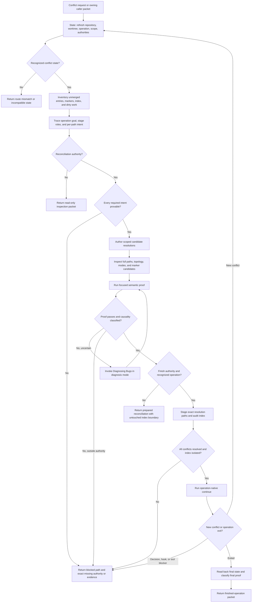

# Resolving Merge Conflicts Runtime And Relationship Design Synthesis

Status: exhaustive design reference, not an executable contract.

Runtime authority remains in:

- `skills/custom/resolving-merge-conflicts/SKILL.md`;
- `skills/custom/resolving-merge-conflicts/agents/openai.yaml`;
- Git's current operation metadata, index, working tree, refs, and object database;
- `docs/agents/engineering-contract.md` and the target repository's Spec, domain, Git, and validation contracts;
- `$diagnosing-bugs` for causal uncertainty after conflict proof;
- the owning implementation or integration caller for formal review, tracker mutation, push, and release;
- `docs/synthesis/skill-context-relationships.md`, pack tests, and behavior evaluations; and
- the installed mirror after a separately authorized validated synchronization.

This note specifies the complete design target for a future rewrite. It does not change the current skill, create a new Git operation, stage a path, continue or abort an operation, or promote the proposed behavior into the installed runtime.

## How To Read This Document

This synthesis is exhaustive for accepted behavior, important Git-state branches, material alternatives, owned relationships, extraction placement, and proof needed for a later rewrite. Retain detail here when removing it would change runtime design, implementation sequencing, validation, or a future promotion decision. The eventual runtime skill should compress hard.

The document has four layers:

1. **Orientation** states the outcome, selected design, authority vocabulary, and explanatory flow.
2. **Normative Design** is the sole authority for proposed runtime behavior and relationships. Its state-transition and completion tables are the sole operation authorities.
3. **Evidence And Rationale** records source pressure, current strengths and gaps, rejected machinery, and deliberate non-changes without creating runtime rules.
4. **Extraction And Verification** places and proves the design without redefining it.

Change proposed behavior in Layer Two; explain it in Layer Three; place and prove it in Layer Four. The Normative Home Index assigns each behavior one owner. The Runtime Ownership And Change Map owns file placement. The Staged Extraction Plan owns implementation order. The Staged Behavior-Evaluation Protocol owns proof mechanics. The Migration And Acceptance Matrix owns case coverage only. [Synthesis Ownership](../README.md#synthesis-ownership) governs cross-document placement.

Use this index for direct navigation:

| Question | Owning section |
| --- | --- |
| What outcome and boundary govern the rewrite? | [North Star](#north-star), [Design Verdict](#design-verdict), and [Delivery Boundary](#delivery-boundary) |
| Which permissions exist and what may each mutate? | [Authority Model](#authority-model) and [Authority And Mutation Boundary](#authority-and-mutation-boundary) |
| Which operation may happen now? | [Conflict State And Transition Contract](#conflict-state-and-transition-contract) |
| When is that operation complete? | [Operation And Completion Contracts](#operation-and-completion-contracts) |
| What do index stages mean for merge, rebase, cherry-pick, and revert? | [Git Operation Goal And Stage-Role Contract](#git-operation-goal-and-stage-role-contract) |
| What must be known for every conflicted path? | [Conflict Inventory And Path Packet](#conflict-inventory-and-path-packet) |
| Which source proves intent? | [Source Trace And Resolution Decision](#source-trace-and-resolution-decision) |
| How do content, path, binary, mode, submodule, and marker-only conflicts differ? | [Conflict-Class Contracts](#conflict-class-contracts) |
| What does proof establish? | [Proof And Diagnosis](#proof-and-diagnosis) |
| What does Finish authorize and how does continuation loop? | [Finish And Continuation](#finish-and-continuation) |
| How are abort, skip, quit, reset, and side discard handled? | [Recovery And Destructive Actions](#recovery-and-destructive-actions) |
| What evidence surface proves which claim? | [Conflict Artifact Authority Contract](#conflict-artifact-authority-contract) |
| What does every invocation return? | [Return Contract](#return-contract) |
| Which skill owns each relationship? | [Relationship Ownership](#relationship-ownership) |
| What should the future runtime files contain? | [Proposed Runtime Semantic Surface](#proposed-runtime-semantic-surface) and [Runtime Ownership And Change Map](#runtime-ownership-and-change-map) |
| What must pass before promotion? | [Staged Behavior-Evaluation Protocol](#staged-behavior-evaluation-protocol), [Migration And Acceptance Matrix](#migration-and-acceptance-matrix), and [Promotion Gate And Residual Gaps](#promotion-gate-and-residual-gaps) |

# Layer One: Orientation

## North Star

Resolving Merge Conflicts owns one outcome: reconcile the requested conflict scope into one semantically correct candidate while preserving all unrelated work and Git state, then finish the existing Git operation only under separate authority.

The skill resolves meaning, not markers. A valid result preserves every compatible intent from the base and both sides, follows the operation goal and authoritative commitments when intents cannot coexist, proves the result through the repository's observable seams, and reports the exact remaining Git state.

The skill never starts a merge, rebase, cherry-pick, or revert. It never treats invocation, a clean-looking file, removed marker text, `git add`, a reused `rerere` result, or a successful `--continue` as semantic proof.

## Design Verdict

This table summarizes the selected rewrite shape. It points to Layer Two owners and creates no independent rules.

| Stratum | Selected shape | Runtime status |
| --- | --- | --- |
| Core | Two admission routes: read-only inspection and authorized reconciliation; Finish is an optional separately authorized continuation inside the reconciliation route | Ready for staged extraction from Layer Two |
| Invocation | Preserve implicit invocation for explicit conflict resolution and for status, explanation, or review of a recognized conflict state; route ordinary diff review and generic Git questions elsewhere | Preserve `allow_implicit_invocation: true` |
| State | Git state is live external state. Every mutating phase refreshes the operation, index, worktree, scope, and authorities before acting | Proposed; no parallel state ledger or helper |
| Semantics | One operation-goal table maps index stages to actual roles; one per-path packet traces object presence, modes, intent, decision, candidate, and proof | Proposed for `SKILL.md` plus one disclosed `OPERATIONS.md` |
| Mutation | Reconciliation authority owns only in-scope working-tree and path edits. Finish authority separately owns resolution staging and the operation-native `--continue` loop | Clarifies the current compact contract |
| Recovery | Abort, skip, quit, reset, side discard, strategy replacement, and operation restart remain outside normal reconciliation and require action-specific explicit authority | Preserve and make exhaustive |
| Relationships | Invoke Diagnosis only for uncertain proof causality; return to the owning implementation or integration caller for formal review and closeout | Preserve current ownership |
| Validation | Expand two current behavior fixtures into operation, conflict-class, authority, recovery, and state-boundary scenarios with real disposable Git repositories | Required before promotion |
| Deferred | Optional mechanical state-capture helper or reusable path-packet renderer | Admit only after repeated command or consistency failures |
| Rejected | Automatic side selection, marker-count completion, default `rerere` trust, hidden staging, autonomous abort/skip, automatic repair commits, and a duplicate operation ledger | Exclude from first rewrite |

## Delivery Boundary

The skill begins only after an operation has already conflicted or conflict markers already exist:

```text
owning caller or direct user
    -> Resolving Merge Conflicts
        -> read-only inspection
        |  or authorized working-tree reconciliation
        |  or authorized reconciliation plus Finish loop
    -> exact return packet
    -> owning caller's review, commit, tracker, push, or release boundary
```

The skill owns conflict State, three-way Trace, scoped Reconcile, focused Prove, optional operation-native Finish, and exact Return. It does not own the originating implementation campaign, independent formal review, general bug repair, tracker closeout, push, deployment, or release.

For an in-progress merge, rebase, cherry-pick, or revert, Finish may create the commits or rewritten commits that the already-started operation normally creates. That authority does not extend to starting a new operation, changing its strategy, editing its todo list, skipping a commit, aborting, force-updating refs, or pushing rewritten history.

Marker-only work has no Git operation to finish. Reconciliation authority may repair the requested files and prove them. Staging or committing those standalone changes belongs to the direct caller's separately stated Git authority.

## Authority Model

Use three positive authority terms:

| Authority | Permits | Does not permit |
| --- | --- | --- |
| **Inspection authority** | Read repository instructions, Git state, refs, index stages, blobs, history, source artifacts, and proof configuration; report State and Trace | Any file, index, ref, operation, config, or external mutation |
| **Reconciliation authority** | Edit, create, delete, or move only requested in-scope working-tree paths to construct and prove a candidate resolution | Staging, continuation, commit, abort, skip, quit, reset, strategy change, config change, push, or unrelated repair |
| **Finish authority** | After Reconcile and Prove pass, stage only the authorized resolution paths, verify the resulting index, and invoke the current operation's native continuation until it exits or reaches a new blocker | Starting another operation, side discard, skip, abort, quit, reset, bypassing hooks, changing todo or message policy, push, or standalone marker-only commit |

Inspection authority follows from a status, explanation, or review request. A request to resolve named conflicts may grant Reconciliation authority for that scope. Finish authority must be explicit in the user request or owning caller packet. Invocation alone grants no mutation authority.

Action-specific approval may separately authorize one recovery action. It never retroactively broadens Reconciliation or Finish.

## Leading-Word Operation Model

The future skill should expose this compact model:

```text
State -> Trace -> Return

State -> Trace -> Reconcile -> Prove -> Return

State -> Trace -> Reconcile -> Prove -> Finish -> Return
                                      ^       |
                                      | new conflict
                                      +-------+
```

- **State** identifies the repository, worktree, operation, goal, scope, index, working tree, authorities, and exact conflict inventory.
- **Trace** maps base and side objects to operation-aware roles and proves each required intent.
- **Reconcile** authors only the candidate result for the selected scope.
- **Prove** establishes syntax, behavior, contract, and path-topology correctness before staging.
- **Finish** stages narrowly, audits the exact index, continues the existing operation, and returns to State for every new conflict.
- **Return** reports typed outcome, evidence, mutation, residual risk, and exact current Git state.

**Refresh** is universal. Before every mutation, after user feedback, after Diagnosis, and after every continuation, reread the live worktree and Git state. Never continue from a remembered snapshot.

## Conflict Vocabulary

| Term | Meaning |
| --- | --- |
| **Conflict session** | One invocation over one repository worktree, one observed operation or marker-only state, one requested scope, and one authority packet |
| **Operation identity** | `merge`, `rebase`, `cherry-pick`, `revert`, `unmerged-unknown`, `marker-only`, or `incompatible`, derived from Git's status plus worktree-specific metadata |
| **Operation goal** | The semantic transformation the existing operation is trying to perform: integrate histories, replay a change, apply a selected delta, or apply its inverse |
| **Conflict inventory** | Every unmerged index path plus every in-scope plausible marker-only path, with unrelated staged and dirty state classified separately |
| **Stage role** | The operation-aware meaning of an index stage object; never the bare word `ours` or `theirs` without its mapped role |
| **Candidate resolution** | The in-scope working-tree and path topology after Reconcile but before Finish staging |
| **Index resolution** | A path whose unmerged stages have collapsed to stage 0 through an authorized exact add or removal |
| **Prepared reconciliation** | Every authorized in-scope candidate is traced, authored, inspected, and proved, while index and operation state remain unfinished because Finish authority is absent |
| **Finished operation** | Git reports no active targeted operation, no unmerged entries remain, final state reads back, and required post-continuation proof is classified |
| **Trade-off** | One explicit incompatible-intent decision with its authority and consequence; not a generic summary of edits |

## End-To-End Explanatory Flow



The diagram is explanatory. Layer Two owns every authority, state, completion, and failure decision.

# Layer Two: Normative Design

## Normative Home Index

Each proposed behavior has one normative home. Other sections may point, explain, place, or test it but never create a competing rule.

| Concern | Sole normative home |
| --- | --- |
| Invocation and route admission | [Invocation And Admission](#invocation-and-admission) |
| Inspection, reconciliation, finish, and recovery authority | [Authority And Mutation Boundary](#authority-and-mutation-boundary) |
| Live-state capture and refresh | [State Snapshot And Refresh](#state-snapshot-and-refresh) |
| Legal next operation | [Conflict State And Transition Contract](#conflict-state-and-transition-contract) |
| Operation completion and legal nonterminal result | [Operation And Completion Contracts](#operation-and-completion-contracts) |
| Merge, rebase, cherry-pick, and revert stage semantics | [Git Operation Goal And Stage-Role Contract](#git-operation-goal-and-stage-role-contract) |
| Required per-path evidence | [Conflict Inventory And Path Packet](#conflict-inventory-and-path-packet) |
| Evidence-surface authority | [Conflict Artifact Authority Contract](#conflict-artifact-authority-contract) |
| Intent precedence and decision | [Source Trace And Resolution Decision](#source-trace-and-resolution-decision) |
| Conflict-class-specific behavior | [Conflict-Class Contracts](#conflict-class-contracts) |
| Candidate authoring | [Reconcile](#reconcile) |
| Proof, failure classification, and diagnosis | [Proof And Diagnosis](#proof-and-diagnosis) |
| Index admission and operation continuation | [Finish And Continuation](#finish-and-continuation) |
| Abort, skip, quit, reset, discard, and restart | [Recovery And Destructive Actions](#recovery-and-destructive-actions) |
| Unrelated work and index isolation | [Dirty Work And Index Isolation](#dirty-work-and-index-isolation) |
| Rerere, mergetool, attributes, and filters | [Git Convenience And Transformation Boundaries](#git-convenience-and-transformation-boundaries) |
| Progressive disclosure | [Runtime Context Loading Contract](#runtime-context-loading-contract) |
| External result | [Return Contract](#return-contract) |
| Cross-skill composition | [Relationship Ownership](#relationship-ownership) |

## Invocation And Admission

Preserve implicit invocation only for these observable predicates:

1. the user asks to resolve, inspect, explain, or review an in-progress merge, rebase, cherry-pick, or revert conflict;
2. Git reports unmerged index entries and the user asks to reconcile or inspect them; or
3. one or more files contain plausible conflict markers and the user asks to reconcile or inspect that marker state.

Do not invoke for an ordinary diff, a clean completed merge commit, general Git education, starting a merge or rebase, choosing a branching strategy, routine staging, or a non-conflict bug. Route causal uncertainty to Diagnosis and ordinary fixed-snapshot diff review to Review.

Admission requires one repository and worktree identity plus one observed conflict state. Nested repositories and submodules are separate identities. If the request spans multiple worktrees or repositories, partition only when the caller explicitly scoped them; otherwise return the ambiguity before mutation.

No-conflict and unsupported-operation states return a route-mismatch packet without mutation. `git am`, raw patch application, stash-pop conflicts, and provider-side web conflict editors remain outside the first rewrite unless their state and operation-goal contracts are separately designed. An unmerged index with no recognized supported operation may be inspected or reconciled in the working tree, but it cannot use Finish until the continuation goal and authority are proved.

## Authority And Mutation Boundary

The [Authority Model](#authority-model) is normative here.

Before mutation, record:

```text
Inspection authority: yes
Reconciliation authority: yes | no
Reconciliation scope: <literal paths or complete conflict inventory>
Finish authority: yes | no
Standalone Git recording authority: yes | no | not applicable
Recovery action authority: none | <one exact approved action>
Owning caller and return boundary:
```

Reconciliation authority permits the smallest path operations necessary to construct the selected candidate: edit content, create a retained file, delete an intentionally removed file, or move a path to its traced final location. Use literal paths and path-safe Git or filesystem operations. It does not permit opportunistic adjacent cleanup.

Finish authority begins only after the candidate passes Prove. It permits exact `git add -- <path>` or `git rm -- <path>` resolution staging, index audit, and the current operation's native `--continue`. It does not authorize `git add -A`, `git commit -a`, manual commit substitution for operation-native continuation, hook bypass, or any recovery action.

If a caller grants Finish but not Reconciliation, the skill may continue only when fresh State proves every resolution is already staged, semantically traced, proved, and isolated. It never treats stage 0 alone as that proof.

## State Snapshot And Refresh

State is a live evidence packet, not a persisted replica. Capture at least:

```text
Repository root, worktree path, Git directory, and common directory:
HEAD, branch or detached state, ORIG_HEAD when relevant, and operation heads:
Operation identity, operation goal, current replayed or reverted commit, and remaining sequence when observable:
git status and porcelain state:
Unmerged index entries with path, mode, object id, and stage:
Plausible marker-only paths and marker style:
Stage-0 index changes, working-tree changes, untracked paths, and submodule state:
Requested conflict scope and unrelated work classification:
Authorities and owning caller:
```

Use Git-aware paths such as `git rev-parse --git-path <name>` rather than assuming `.git` is a directory in the worktree. Treat human-readable `git status` as the primary operation summary and corroborate it with operation refs or sequencer metadata, `git ls-files -u`, and worktree state. A sentinel file alone is not an operation classifier.

Refresh State:

- before the first mutation;
- after any user answer or caller update;
- after Diagnosis returns;
- after any external tool or mergetool writes;
- immediately before staging;
- immediately after staging; and
- after every native continuation, whether it succeeds, conflicts again, or fails.

If operation identity, scope, stage objects, path content, authorities, or unrelated work changed, invalidate affected Trace, candidate, and proof evidence. Reconcile the new state before continuing.

## Conflict State And Transition Contract

This table is the sole authority for the next operation.

| Observed current state | Legal operation or return | Illegal shortcut |
| --- | --- | --- |
| Supported operation plus unmerged entries | State, Trace, then read-only Return or authorized Reconcile | Editing from marker labels alone; Finish before proof |
| Supported operation, no unmerged entries, operation still active, all required resolutions already staged | Trace the staged result, prove it, then Finish only with Finish authority | Assuming another actor's staging is correct or isolated |
| Supported operation plus an in-scope plausible marker but no corresponding unmerged entry | Classify the marker as operation-created, legitimate literal text, stale artifact, or unrelated; include it in scope only with evidence | Treating any marker-shaped line as an unmerged index entry |
| Unmerged index plus no supported operation identity | Inspect or authorized working-tree Reconcile; Return `unmerged-unknown` | Guessing a continuation command or staging under Finish |
| Marker-only state plus no unmerged index | Inspect or authorized marker-only Reconcile and Prove; Return to caller | Using operation Finish, staging, or committing without standalone authority |
| Requested subset is reconciled while other unmerged entries remain | Return prepared subset plus complete remaining inventory | Continuing the operation or claiming it finished |
| Required intent, object, path identity, or operation goal is unavailable | Return blocked with the exact evidence or decision owner | Choosing a side from labels, recency, or convenience |
| Proof fails with uncertain cause | Invoke `$diagnosing-bugs` in diagnosis mode, then resume Prove from refreshed State | Patching from a guess or continuing |
| Proof proves a resolution-caused defect inside Reconciliation authority | Repair the candidate, repeat full inspection and Prove | Expanding into unrelated implementation |
| Proof proves a defect outside authority or a pre-existing failure that blocks safe continuation | Return blocked with required owner or authority | Reclassifying a blocking failure as residual risk |
| Reconcile and Prove pass, but Finish authority is absent | Return prepared reconciliation with index and operation untouched by the resolver | Staging “just to mark resolved” |
| Finish staging reveals unrelated index admission, remaining conflict, or transformation drift | Restore only resolver-authored staging when safe, otherwise preserve and Return blocked | Continuing with an unverified index |
| Native continuation creates another conflict | Refresh and return to State for the new operation step | Reusing prior stage roles, Trace, or proof |
| Native continuation stops for an empty-commit, todo, message, hook, signing, or strategy decision | Return decision-required or blocked with exact current state | Auto-skip, allow-empty, bypass, edit, or retry with new policy |
| Native continuation exits the supported operation | Read back final State, run or classify required final proof, then Return finished or blocked | Declaring success from exit code alone |
| Conflicting or nested operation evidence is incompatible | Return exact incompatible-state packet | Mutating until one interpretation appears to work |

## Operation And Completion Contracts

This table alone decides when the selected operation may end.

| Operation | Enter when | Complete when | Legal nonterminal return |
| --- | --- | --- | --- |
| **State** | Every invocation and every refresh trigger | Repository, worktree, operation, goal, scope, inventory, unrelated state, and authorities reconcile without unknown material facts | Route mismatch, incompatible state, or exact missing evidence |
| **Trace** | State admits inspection or reconciliation | Every in-scope conflict has actual stage roles or marker provenance, authoritative intent evidence, candidate decision criteria, and a named blocker for any unproved requirement | Read-only inspection packet or blocked packet |
| **Reconcile** | Reconciliation authority exists and Trace is sufficient | Every in-scope candidate path, absence, move, mode, or gitlink reflects the selected decision; full artifacts and topology are inspected; remaining markers are classified | Prepared partial packet or blocked packet |
| **Prove** | A complete in-scope candidate exists | Focused semantic proof passes; resolution-caused failures are cleared; broader skips and nonblocking pre-existing failures are explicitly classified | Diagnosis round trip or blocked packet |
| **Finish** | Prove passes, Finish authority exists, and a supported operation is active | Exact resolution paths collapse to intended stage-0 entries; index isolation passes; native continuation loops through every new conflict; Git exits; final State and required final proof are classified | New-conflict loop, decision-required packet, or blocked packet |
| **Return** | Any table row admits an external result | One typed packet reports authorities, evidence, mutations, exact current Git state, residual risk, and next owner without overstating completion | Not applicable |

Read-only inspection completes without Reconcile, Prove, or Finish. Prepared reconciliation completes without index resolution or operation continuation when Finish authority is absent. Scoped subset completion never implies operation completion.

## Git Operation Goal And Stage-Role Contract

The raw stage numbers are stable; their semantic roles depend on the operation. The actual index object ids and modes are evidence authority. Symbolic refs and the operation goal explain those objects but never override them.

| Operation | Operation goal | Stage 1 | Stage 2 | Stage 3 | Native continuation |
| --- | --- | --- | --- | --- | --- |
| Merge | Integrate the changes from the current target and `MERGE_HEAD` relative to their merge base | Common ancestor object when present | Current `HEAD` or merge target | `MERGE_HEAD` side | `git merge --continue` |
| Rebase | Replay the current source commit onto the so-far rebased target | Replay base selected by Git; commonly the replayed commit's parent or selected mainline | So-far rebased target, beginning at upstream | Commit currently being replayed | `git rebase --continue` |
| Cherry-pick | Apply the delta from the selected parent or mainline to the selected commit onto current `HEAD` | Selected parent or mainline object, or empty base for a root commit | Current target `HEAD` | Selected commit being applied | `git cherry-pick --continue` |
| Revert | Apply the inverse of the selected commit's delta while preserving compatible later work | Selected commit being reverted | Current target `HEAD` | Selected parent or mainline representing the inverse destination | `git revert --continue` |
| Unmerged unknown | Unknown until the caller or Git state proves the transformation | Raw stage-1 object only | Raw stage-2 object only | Raw stage-3 object only | None may be guessed |
| Marker-only | Reconcile a conflict artifact already present in files | Not available from the index | Not available from the index | Not available from the index | None |

Missing stages are evidence, not an error: add/add commonly lacks stage 1; modify/delete lacks the deleted side's object; root-commit replay may use an empty base. Record absence explicitly and reason about path existence as part of intent.

Never write `ours` or `theirs` in a resolution decision without the operation-aware role beside it. In particular, during rebase the so-far rebased upstream side is stage 2 / `ours`, and the commit being replayed is stage 3 / `theirs`. A wholesale checkout of either stage is a candidate-generation action only when Source Trace proves the other contribution obsolete.

A multi-head merge or unusual strategy that cannot be reduced to one current three-stage conflict packet is incompatible with this first rewrite. Preserve State and return the exact missing semantic model rather than pretending an N-way conflict is ordinary two-side reconciliation.

## Conflict Inventory And Path Packet

Inventory every unmerged entry before selecting scope. Use `git ls-files -u` as canonical evidence for index conflicts; marker search supplements it and never replaces it. Record stage presence, object ids, and modes without assuming all entries are regular text files.

Every in-scope conflict receives one internal packet:

```text
Path identity and prior names:
Conflict class:
Stage 1 object, mode, and role | absent:
Stage 2 object, mode, and role | absent:
Stage 3 object, mode, and role | absent:
Working-tree or marker-only state:
Attributes, filters, sparse-checkout, case-folding, submodule, or binary constraints:
Operation goal and source commits:
Authoritative commitments and each side's intent:
Compatible intents:
Incompatible decision, authority, and consequence | none:
Selected path topology, content, mode, or gitlink:
Focused proof seam:
Finish staging action | not authorized | not applicable:
Status: inspected | candidate | proved | index-resolved | blocked:
```

Keep packets in working context unless a caller requests a durable artifact. Return a concise per-path summary and evidence pointers, not full sensitive blobs or redundant transcripts.

Paths must be handled literally. Use `--` before path arguments and NUL-safe or exact-path forms when ambiguity, whitespace, newlines, leading dashes, case folding, or renames make line-oriented parsing unsafe.

## Conflict Artifact Authority Contract

| Artifact or surface | Owns or proves | Must not substitute for |
| --- | --- | --- |
| Human-readable `git status` plus worktree-specific operation metadata | Current operation summary, progress, and Git-recommended next operation | Per-path intent, semantic correctness, or complete index details |
| `git ls-files -u` | Canonical unmerged path, mode, object id, and stage inventory | Operation-aware role labels or marker-only paths |
| Stage blobs and source commits | Actual base and side content and change history | Final resolution authority by themselves |
| Repository Spec, ADRs, domain rules, tests, and public contracts | Accepted commitments and expected behavior | Current Git operation state |
| Working-tree file or path topology | Candidate resolution currently on disk | Index resolution, operation completion, or proof |
| Marker scan | Plausible textual conflict artifacts, including stale or marker-only state | Canonical unmerged inventory or automatic proof of a real conflict |
| `AUTO_MERGE` when Git provides it | Original merge-strategy worktree snapshot and edits made since that snapshot | Cross-operation availability, source intent, or correctness |
| `rerere` candidate or mergetool output | Candidate resolution produced by a convenience mechanism | Source Trace, full-file inspection, proof, or staging authority |
| Stage-0 index and staged diff | Exact tree candidate admitted to the next commit for inspected paths | Unstaged candidate content, semantic proof, or absence of unrelated staged changes |
| Focused and broader proof | Observable support for semantic correctness in the exercised seams | Mutation authority or operation completion |
| Continuation exit code | Outcome of one native continuation invocation | Final operation absence, final proof, or absence of a new decision state |
| Fresh final status, refs, index, and worktree | Current post-continuation state | Historical intent or unrun proof |

When surfaces disagree, refresh Git state and compare actual objects and paths. Never edit derived output or marker text merely to make status appear clean.

## Source Trace And Resolution Decision

Trace intent in this order:

1. operation goal and actual base/side objects;
2. authoritative Spec, acceptance, ADR, domain, public/data/security, migration, and compatibility contracts;
3. tests and caller-facing proof seams that encode those commitments;
4. source commits, parent or mainline selection, commit messages, branch or PR intent, and issue evidence;
5. surrounding implementation, history, and current call sites; and
6. user or named owner decision when incompatible material intent remains.

Content recency, branch name, side label, line count, or a clean application is never authority by itself.

For each path, classify the decision:

- **Compose:** both intents are compatible and the result preserves both.
- **Transform:** the old shape changed, but both intents survive through an updated interface, call site, path, or representation.
- **Prefer with evidence:** one intent supersedes the other under an authoritative commitment; record the discarded behavior and source.
- **Exclude:** one change is outside the operation goal or requested scope; preserve it outside the candidate or return it to its owner.
- **Decision required:** material intents conflict and no source owns the trade-off; do not mutate that path.

Every selected resolution states the semantic invariant it preserves. “Removed markers” and “kept both” are descriptions of text, not invariants.

## Conflict-Class Contracts

### Text And Structured Content

Inspect base, both present sides, the full candidate file, and relevant neighboring declarations or callers. Reconcile at the semantic unit: function, schema, document rule, configuration key, test contract, or data invariant. Do not splice both hunks mechanically when ordering, duplication, defaults, or control flow would change meaning.

Structured or generated files require their owning parser, generator, or canonical format. Do not hand-edit generated output when the repository contract requires regeneration. If regeneration would modify paths outside authority, return the required scope.

### Add, Delete, Rename, And Topology

Path absence is an intent-bearing state.

| Conflict shape | Required decision | Minimum proof |
| --- | --- | --- |
| Add/add | Whether both additions are equivalent, composable, or competing definitions; select one final identity | Duplicate-symbol, schema, routing, or consumer proof plus path read-back |
| Modify/delete | Whether the deletion remains authoritative, the modified behavior survives elsewhere, or the path must be restored | Caller/reference search, replacement-path trace, and behavior proof |
| Rename/delete | Whether renamed behavior is retained, superseded, or removed; preserve history only when it matches semantics | Final path identity, references/imports, and absence of stale path |
| Rename/rename to same path | Reconcile both content and one final identity | Path uniqueness and composed behavior |
| Rename/rename to different paths | Decide whether one concept split, one name wins, or both paths remain distinct | Ownership, call-site, import, packaging, and case-folding proof |
| File/directory or path collision | Select one valid repository topology and migrate all direct references | Filesystem, build/package, and cross-platform path proof |
| Case-only rename | Prove the exact tracked spelling and Windows/macOS case-folding behavior | Index path read-back and platform-relevant proof |

Use explicit create, remove, or move operations inside Reconciliation authority. Finish later records the selected topology with exact path staging.

### Binary, Mode, Symlink, And Filtered Content

Binary conflicts have no trustworthy line-marker workflow. Compare object identity, file type, generating source, metadata, consumers, and available domain-specific validation. A whole-object choice still requires Source Trace.

Index modes are semantic evidence. Preserve or deliberately change executable bits, symlink targets, and file type only under the selected intent. Inspect `.gitattributes`, clean/smudge filters, end-of-line conversion, encoding rules, and generated-file ownership before assuming worktree bytes equal staged blobs. After Finish staging, compare the staged representation to the intended candidate.

If the required tool, object, filter, or safe renderer is unavailable, return blocked rather than replacing the file with a plausible surrogate.

### Submodule Gitlinks

A submodule conflict is a commit-selection conflict, not an ordinary directory-content merge. Record stage gitlink object ids, inspect the submodule commit graph and superproject contract, and select a commit that contains or deliberately supersedes required changes. A dirty nested submodule working tree is separate unrelated state.

Fetching missing submodule objects, changing the nested checkout, creating a merge commit inside the submodule, or pushing a submodule ref requires its own authority. Without the necessary objects or authority, return the exact blocker. Finish stages only the proved superproject gitlink.

### Marker-Only And Marker-Like Content

When the index has no unmerged stages, marker text is a candidate signal only. Inspect the configured conflict-marker style and `conflict-marker-size`, surrounding nesting, file history, generated provenance, and any available source versions. Literal examples, tests, documentation, templates, and malformed nested markers can legitimately contain marker-shaped lines.

Classify every plausible marker as:

- active conflict artifact with sufficient base-and-side provenance;
- stale artifact whose intended clean content is traceable;
- legitimate literal content;
- generated content requiring its owner; or
- ambiguous and blocked.

Marker-only Reconcile edits files under Reconciliation authority and runs proof. It never invents index stages, an operation goal, or a continuation command.

## Reconcile

Reconcile applies the selected per-path decisions to the working tree only:

1. Refresh State and invalidate stale packets.
2. Resolve one path packet at a time while maintaining cross-path invariants.
3. Edit, create, delete, or move only authorized paths.
4. Preserve compatible base and side intent; implement each evidenced transformation completely across the in-scope path set.
5. Inspect every full resolved artifact, not only conflict hunks.
6. Inspect final path topology, modes, symlinks, gitlinks, generated ownership, and direct references.
7. Rescan plausible markers and classify every remaining match.
8. Reread Git state and record the candidate without staging.

When one resolution changes the correct result for another in-scope path, refresh that packet before editing it. When the dependency crosses outside scope, return the required scope instead of creating a partial semantic break.

Reconcile never calls `git add`, `git rm --cached`, `git commit`, or an operation continuation. A filesystem deletion or move may be part of the candidate, but its index effect waits for Finish.

## Proof And Diagnosis

Map each selected invariant to the smallest meaningful repo-owned proof seam. A proportional sequence is:

1. path and marker read-back;
2. parser, syntax, schema, generated-file, mode, or topology checks;
3. focused tests at the caller-facing behavior affected by the resolution;
4. cross-path or integration proof for composed changes; and
5. broader canonical checks required by repository convention or risk.

Proof runs against the complete working-tree candidate, including the operation's already-clean changes. A private helper test cannot substitute for an available public seam. For path deletion or rename, prove both the intended replacement behavior and absence of stale references.

Classify every failure:

| Failure class | Action |
| --- | --- |
| Candidate clearly violates a selected invariant and repair stays inside Reconciliation authority | Repair, inspect again, and rerun Prove |
| Cause is uncertain | Invoke `$diagnosing-bugs` in diagnosis mode with the exact operation, candidate, command, output, baseline evidence, and mutation boundary; refresh State on return |
| Proven pre-existing and nonblocking for continuation | Record residual risk with evidence |
| Proven pre-existing but continuation would make the state unsafe or unreviewable | Return blocked to the owning caller |
| Repair requires unrelated production paths, new design, new dependency, or changed commitment | Return the exact owner or authority; do not broaden Reconcile |

Focused resolution proof must pass before Finish. Broader skipped checks remain residual risk only when the repository contract and risk allow it.

## Finish And Continuation

Finish is an index-and-operation phase, not another content-authoring phase.

1. Refresh State and verify Finish authority, operation identity, candidate identity, and proof freshness.
2. Stage only the exact resolution paths with path-safe `git add` or `git rm` semantics. Never use repository-wide staging.
3. Read back `git ls-files -u`; every path required for continuation must have no unmerged stages. A scoped subset may be prepared but cannot continue while other unmerged entries remain.
4. Audit the complete stage-0 index delta. Distinguish operation-produced clean changes from unrelated pre-existing index state. Block when any unrelated entry could enter the operation commit or when provenance is ambiguous.
5. Compare staged modes, objects, paths, and filtered content with the proved candidate. If staging transformed meaning, stop and return to Reconcile or block.
6. Run the supported operation's native `--continue` without bypassing hooks, signatures, editors, or repository policy.
7. Refresh State. A new conflict invalidates prior role and proof packets and returns to State. A decision stop returns its exact packet. An exited operation proceeds to final read-back.
8. After exit, prove operation absence, no unmerged entries, preserved unrelated work, expected history movement, and any final semantic proof required because a sequence may have applied additional clean commits after the last conflict.

If final proof fails after Git has exited, preserve the completed Git state, invoke Diagnosis only when the caller still owns the turn, and return `blocked-after-finish` unless a separate implementation or history-edit authority permits repair. Do not amend, reset, or restart automatically.

Operation-specific decisions remain explicit:

- a rebase or cherry-pick that becomes empty may require skip, drop, keep, or allow-empty judgment;
- an editor, signing, or hook failure may require user or environment action;
- a rebase todo or `exec` failure is not automatically a merge conflict;
- a continuation that applies further clean commits may expand final proof but not Reconciliation scope.

## Recovery And Destructive Actions

Abort, skip, quit, hard reset, side discard, operation restart, strategy-option change, todo edit, and force ref update are never normal Reconcile or Finish actions.

Before performing an explicitly requested recovery action, report:

```text
Exact operation and current step:
Action requested:
Tracked, staged, unstaged, untracked, autostash, rerere, submodule, and authored-resolution state at risk:
Expected refs, index, worktree, and sequencer result:
Recoverability evidence:
Action-specific authority:
```

`--skip` discards the current replayed change and therefore needs commitment-owner authority. `--abort` attempts to reconstruct pre-operation state and can be unsafe around pre-existing or subsequently edited work. `--quit` removes sequencer state while leaving index and working tree state, changing the recovery model. Hard reset and wholesale side checkout may destroy work. Preserve and return exact state when impact cannot be proved.

Changing merge strategy or restarting the operation is a new operation decision. It belongs to the user or owning implementation/integration caller, not to conflict resolution convenience.

## Dirty Work And Index Isolation

Preserve all unrelated dirty, staged, untracked, ignored, nested-repository, and submodule work.

State classifies each changed path as:

- operation-produced clean change;
- unmerged conflict entry;
- resolver-authored candidate change;
- pre-existing related change explicitly included in scope;
- pre-existing unrelated staged change;
- pre-existing unrelated working-tree or untracked change; or
- ambiguous provenance.

Ambiguous provenance blocks Finish when continuation could record or overwrite it. Do not stash, unstage, reset, clean, move aside, or commit unrelated work automatically. A caller may provide a trusted pre-operation snapshot; otherwise use available refs, operation metadata, reflog, index stages, and current status conservatively.

Refreshing after interaction is mandatory because the user, a worker, an editor, a filter, a hook, or Git continuation may change the same paths or index between phases.

## Git Convenience And Transformation Boundaries

`rerere`, mergetools, `AUTO_MERGE`, checkout/restore stage selection, and conflict styles are candidate-generation or inspection aids.

- Inspect a reused `rerere` result exactly like a human-authored candidate. When rerere autoupdates the index, Finish authority and staged-index validation are still required; if Finish authority is absent, do not leave resolver-authored index mutation unreported.
- Do not enable or disable `rerere`, clear its cache, forget a resolution, or change repository/global config without separate authority.
- A mergetool may write files, backup artifacts, or launch an external application. Use it only inside Reconciliation authority and inspect every result and artifact.
- `AUTO_MERGE` is optional and merge-strategy-specific. Use it to inspect edits since the original automerge when present; never require it.
- Checkout or restore of stage 2 or 3 is a whole-side candidate action, not a semantic decision. Rebase role reversal still applies.
- `diff3` or `zdiff3` base sections aid Trace. Marker style and marker size do not change index authority.
- Attributes, filters, line endings, encodings, sparse checkout, and generated-file rules may transform materialization or staging. Prove both working-tree and staged meaning at their respective boundaries.

## Runtime Context Loading Contract

Keep universal behavior in `SKILL.md`; load one disclosed conflict reference only when its trigger fires.

| Observed phase | Load now | Keep out |
| --- | --- | --- |
| Invocation | `SKILL.md` outcome, invocation predicates, authorities, leading-word spine, transition and completion tables, Refresh, Return, and completion | Full Git command catalog, every conflict class, rationale, and evaluation cases |
| State or operation ambiguity | `OPERATIONS.md` State and operation-detection anchors plus current Git output | Unselected conflict-class details and recovery procedure |
| Trace | Operation role anchor and the selected path packets | Other operation role branches and unrelated history |
| Reconcile | Only affected conflict-class anchors and repository-owned editing or generation instructions | Other conflict classes, Finish, and recovery actions |
| Prove failure | Diagnosis relationship packet and proof evidence | Diagnosis implementation or unrelated repair authority |
| Finish | Finish anchor, current operation branch, exact staged candidate, and index-isolation evidence | Recovery actions not explicitly requested and other operation branches |
| Explicit recovery request | Only the requested recovery anchor and risk packet | Reconcile, alternative recovery actions, or new operation strategy |
| Marker-only | Marker-only anchor, file provenance, and proof configuration | Operation continuation and index-stage role branches |
| Return-only or read-only request | Current State, selected Trace packets, and Return contract | Reconcile, Finish, mergetool, and recovery procedure |

Every context pointer names the observed trigger, exact anchor, expected result, and return boundary. Do not preload every Git branch because all are possible in principle.

## Return Contract

Every invocation returns one typed packet:

| Return | Use when | Required content |
| --- | --- | --- |
| **Inspection** | Read-only State and Trace complete | Operation and goal; repository/worktree; both mutation authorities; full conflict inventory; stage-role summaries; intent evidence and uncertainty; unrelated state; exact current status; no-mutation statement |
| **Prepared reconciliation** | In-scope candidate and Prove complete without Finish | Everything above plus paths authored, decisions and trade-offs, proof, residual risk, unchanged index boundary, unresolved or out-of-scope inventory, and exact next operation-native action requiring authority |
| **Finished operation** | Finish completion row passes | Operation rounds; staged paths; index-isolation evidence; native continuation results; final HEAD and operation absence; final proof; preserved unrelated work; residual risk; owning caller return |
| **Decision required** | Material intent, empty commit, hook/editor/signing, scope, recovery, or policy requires authority | Immutable current State, one complete decision set, options and consequences, owner, and exact continuation |
| **Blocked** | Required evidence, object, tool, authority, safe staging, proof, or recovery is unavailable | Completed evidence, blocked paths, blocker owner, observable release condition, preserved Git state, and exact safe next operation |
| **Route mismatch** | No admitted conflict state or unsupported operation | Observed state, reason this skill does not own it, and one next owner when known; no mutation |

Every packet also reports whether Git itself is `active`, `exited`, `unknown`, or `not applicable`. `Prepared reconciliation` is successful scoped work but never a finished operation. `blocked-after-finish` is a Blocked packet whose Git state is `exited` and whose semantic completion gate failed.

Do not expose full sensitive blobs, secrets, or unnecessary source transcripts. Use object ids, paths, concise intent summaries, and durable source pointers.

## Relationship Ownership

This section is the sole authority for composition edges and return boundaries.

| Caller | Verb | Callee | Trigger and return |
| --- | --- | --- | --- |
| Direct user | Invoke | `$resolving-merge-conflicts` | Resolve or inspect one admitted conflict state; direct wording determines Reconciliation and Finish authority separately |
| `$skill-router` | Recommend and stop | `$resolving-merge-conflicts` | A merge, rebase, cherry-pick, or revert is conflicted, or files contain conflict markers; the later resolver invocation still derives its own authorities |
| `$parallel-implement` | Invoke | `$resolving-merge-conflicts` | Serial landing enters preserved conflicted or partially applied Git state; return exact verified state to the root orchestrator |
| Another implementation or integration owner | Invoke | `$resolving-merge-conflicts` | Its authorized Git operation conflicts; caller packet supplies scope, goal, authorities, proof, and return boundary |
| `$resolving-merge-conflicts` | Invoke | `$diagnosing-bugs` | Conflict proof fails for an uncertain cause; Diagnosis returns a causal packet to Prove and never inherits Finish authority |
| `$resolving-merge-conflicts` | Return | Owning caller | Inspection, prepared reconciliation, finished operation, decision, or blocker returns; caller retains review, commit outside native continuation, tracker, push, and release |

Resolving Merge Conflicts has no direct review, tracker, push, release, deployment, Wayfinder, To Spec, To Tickets, TDD, or Codebase Design relationship. If conflict resolution exposes a new design or implementation requirement, return it to the owning caller rather than starting another delivery workflow.

Diagnosis owns causal investigation. Resolving Merge Conflicts retains conflict scope, repair-admission judgment, Prove, Finish, and Return. A diagnosis packet never grants mutation or continuation authority.

# Layer Three: Evidence And Rationale

Everything in this layer derives from Layer Two. It explains pressure and choices without adding a predicate, permission, prohibition, or completion rule.

## Source Pressure And Current Evidence Baseline

The design is grounded in current repository surfaces and primary Git behavior:

- The current skill already establishes three-way reasoning, read-only State and Trace, separate Reconciliation and Finish authority, focused proof before Finish, Diagnosis on causal uncertainty, and exact Return.
- The current `agents/openai.yaml` keeps the skill implicitly invocable.
- `tests/test_skill_pack_contracts.py` structurally protects the two routes, proof-before-Return, conditional Finish, `git ls-files -u`, Guardrails, and Return.
- behavior fixtures 16 and 25 protect the Finish boundary and read-only inspection boundary.
- the current canonical skill and installed mirror matched during synthesis inspection; a future rewrite must verify parity again rather than rely on this snapshot.
- [Git merge documentation](https://git-scm.com/docs/git-merge) defines the three index stages, conflict presentation, `AUTO_MERGE`, resolution staging, and native continuation.
- [Git rebase documentation](https://git-scm.com/docs/git-rebase) defines replay behavior, continuation, skip and abort choices, and the reversed `ours` / `theirs` intuition during rebase.
- [Git cherry-pick documentation](https://git-scm.com/docs/git-cherry-pick) defines the selected-commit delta, `CHERRY_PICK_HEAD`, up-to-three-stage conflict state, sequencer continuation, and recovery commands.
- [Git revert documentation](https://git-scm.com/docs/git-revert) defines inverse-application intent and sequencer continuation; the [Git sequencer implementation](https://github.com/git/git/blob/master/sequencer.c) makes the revert base/next reversal explicit.
- [Git ls-files documentation](https://git-scm.com/docs/git-ls-files) defines stage and unmerged inventory output.
- [Git checkout documentation](https://git-scm.com/docs/git-checkout) documents stage selection and the rebase side-label reversal.
- [Git rerere documentation](https://git-scm.com/docs/git-rerere) treats reuse as a working-tree candidate unless autoupdate is selected and documents marker-normalization limits.

These sources establish Git mechanics. Repository commitments and the owning caller establish the correct semantic resolution.

## Current Strengths To Preserve

The current compact skill has valuable invariants:

1. conflict resolution is explicitly three-way rather than marker deletion;
2. status, explanation, and review stay read-only;
3. reconciliation and finish permissions are separate;
4. rebase side reversal is named;
5. full resolved files and markers are inspected;
6. focused proof blocks Finish;
7. uncertain failures route to Diagnosis and return;
8. side discard and destructive recovery require approval;
9. unrelated dirty and index state are preserved; and
10. a blocked path never counts as completion.

The rewrite should deepen these concepts, not replace their leading words with a larger generic Git tutorial.

## Current Design Gaps The Rewrite Must Close

These are extraction gaps, not claims that the current skill always behaves incorrectly:

| Gap | Behavioral risk |
| --- | --- |
| Operation detection is summarized in one phrase | A resolver may infer the wrong operation from one sentinel or marker label |
| Working-tree reconciliation and index resolution share the word “resolved” | The agent may stage without Finish authority or claim Git resolution while unmerged stages remain |
| Only rebase role reversal is explicit | Cherry-pick and revert may be treated as snapshot merges rather than delta and inverse-delta operations |
| Path conflicts are grouped with content conflicts | Delete, rename, file/directory, mode, binary, symlink, and submodule semantics may be missed |
| Marker scanning has no false-positive or custom-size model | Literal markers may be edited or configured markers missed |
| Finish says continue but does not exhaust sequencer decision states | Empty commits, hooks, editors, todo failures, and later conflicts may trigger unauthorized shortcuts |
| Proof precedes Finish without an explicit final-sequence check | A sequence may apply later clean commits after the last conflict and exit without final semantic classification |
| Rerere and filters are unnamed | Candidate or staged content may be trusted despite automatic transformation |
| Return is one prose list | Prepared, finished, decision, blocked, and route-mismatch states may blur |
| Structural and behavior coverage is narrow | A rewrite could preserve literal phrases while weakening operation and authority behavior |

## Why Roles Replace Side Labels

`ours` and `theirs` are merge-mechanism labels, not stable business meanings. Merge, rebase, cherry-pick, and revert feed different base and next trees to the machinery. Rebase visibly reverses branch intuition; revert reverses the selected commit delta itself. Naming the operation goal and stage role forces the resolver to reason about the transformation rather than a side preference.

## Why Reconcile And Finish Stay Separate

Index collapse is a mutation and an admission decision for the next commit. A user can safely ask for conflict content to be prepared without permitting a commit or history rewrite. Separating candidate authoring from staging also creates a clean proof boundary: Prove examines the complete working-tree candidate; Finish admits only that candidate and verifies transformations and unrelated index state.

The cost is that Git may still report unmerged entries after a successful prepared reconciliation. Typed Return removes the ambiguity: the content can be proved while the operation remains unfinished.

## Why Finish Loops Through Native Operations

Each supported operation owns its own sequencer, refs, commit messages, hooks, signing, and continuation semantics. Calling its native `--continue` preserves that state machine. A new conflict is a new three-way fact set, so it returns to State rather than inheriting prior labels or proof.

A native continuation can also stop for a non-conflict decision or finish after applying additional clean commits. The completion gate therefore needs fresh final State and proportionate final proof rather than trusting one exit code.

## Why Git State Remains The Ledger

Git already persists operation refs, sequencer metadata, the three-stage index, stage-0 candidate, worktree, objects, and history. A parallel event ledger would create reconciliation and drift problems without supplying semantic intent. The proposed rewrite adds an internal path packet and typed Return, not a second durable state machine.

## Why One Disclosed Reference Is Enough

The universal authority, transition, completion, refresh, and return contracts belong in `SKILL.md`. Operation-role tables, conflict-class branches, exact inspection aids, Finish details, and recovery risks are branch-specific reference. One `OPERATIONS.md` protects the main semantic surface without producing operation-per-file sprawl.

Split further only if measured context loading or observed premature completion remains after sharp anchors and completion criteria.

## Deliberate Non-Changes

| Choice retained | Why | Reconsider only when |
| --- | --- | --- |
| Implicit invocation | Conflict state is observable and high-risk enough for Codex discovery; read-only admission prevents mutation leakage | Behavior evaluation shows frequent false invocation that a sharper description cannot fix |
| No helper in the first rewrite | Git porcelain and plumbing already expose authoritative state; semantic decisions cannot be automated | Repeated real runs show command assembly or packet consistency failures that a read-only helper materially reduces |
| No automatic formal review | The owning implementation or integration campaign owns fixed point, Spec, repair budget, and release | A standalone conflict workflow gains an explicit caller contract for independent review |
| No operation start or strategy change | The skill reconciles an existing state; starting or replacing the operation is a different commitment and risk boundary | A separately designed invocation and authority contract is approved |
| No default `rerere` enablement | Repository config and cached resolutions outlive one conflict and can affect later operations | The target repository explicitly owns and validates a rerere policy |
| No automatic stash | Stashing mutates unrelated state and can itself conflict on reapply | The user explicitly requests a bounded stash operation with recovery proof |
| No support claim for `git am`, apply, stash-pop, or web editors | Their state, base, continuation, and mutation contracts differ | Each branch receives an operation-goal table, authority model, proof, and evaluations |

## Rejected Machinery

- A rule that always keeps both sides.
- A rule that selects the newest side, current branch, target branch, or larger hunk.
- Marker count as the conflict inventory or completion check.
- `git checkout --ours` or `--theirs` as a decision procedure.
- `git add -A` as conflict completion.
- Automatic `--abort`, `--skip`, `--quit`, reset, todo edit, or allow-empty.
- A custom JSON state schema duplicating Git.
- One reference file per Git operation or conflict class.
- Automatic repair commits after the operation has exited.
- Static phrase assertions presented as semantic behavior proof.

## Deferred Hypotheses

| Hypothesis | Evidence required before admission |
| --- | --- |
| Read-only state-capture helper | Repeated fixtures show materially inconsistent operation detection or path-packet assembly; the helper remains porcelain-version-aware, path-safe, read-only, and transparent |
| Structured conflict packet renderer | Callers repeatedly need a durable machine-readable return and Markdown is insufficient; one schema can preserve operation and authority semantics without becoming a second ledger |
| Broader operation family | Real `git am`, apply, stash, or provider-editor conflicts recur; each has primary-source mechanics, safe authority boundaries, and behavior fixtures |
| Controlled rerere integration | Repeated conflicts show material savings; candidate inspection, index autoupdate, cache ownership, and negative controls remain explicit |

# Layer Four: Extraction And Verification

## Proposed Runtime Semantic Surface

The future main skill should read approximately as:

```text
Outcome and delivery boundary
Invocation and admission predicates
Inspection, Reconciliation, and Finish authority
Conflict vocabulary
State -> Trace -> Reconcile -> Prove -> Finish -> Return
Normative transition table
Operation completion table
Operation-aware stage-role summary
Refresh and unrelated-work gate
Sharp pointers into OPERATIONS.md
Diagnosis relationship
Typed Return
Completion
```

This is a semantic target, not final approved wording. `SKILL.md` keeps universal behavior and the smallest operation-role summary needed to prevent side-label mistakes. It does not absorb an exhaustive Git command catalog, every conflict-class branch, primary-source rationale, or evaluation matrix.

## Runtime Ownership And Change Map

This map alone owns proposed file placement, source bundles, and anti-duplication boundaries.

| Bundle | Surface | Owns | Proposed delta | Must not absorb |
| --- | --- | --- | --- | --- |
| `C1` | `skills/custom/resolving-merge-conflicts/SKILL.md` | Human-facing description; outcome; invocation; authority; leading-word spine; transition and completion tables; compact operation-role guard; Refresh; context pointers; Diagnosis edge; typed Return; completion | Rewrite around the Proposed Runtime Semantic Surface while preserving current strengths | Full command catalog, every conflict class, source rationale, caller review/closeout, or provider procedure |
| `C1` | New `skills/custom/resolving-merge-conflicts/OPERATIONS.md` | State capture; supported-operation detection; full stage-role table; per-path packet; conflict-class contracts; inspection aids; Reconcile details; proof mapping; Finish/index isolation; recovery-risk reference; rerere, attributes, filters, and submodules | Create one disclosed branch reference with stable anchors and explicit returns to universal contracts | Invocation policy, duplicate transition/completion tables, relationship map, Git tutorial, or independent authority |
| `C1` | `skills/custom/resolving-merge-conflicts/agents/openai.yaml` | Invocation policy | Preserve `policy.allow_implicit_invocation: true`; sharpen only if behavior evidence requires description metadata | Runtime procedure or authority detail |
| `C2` | `skills/custom/skill-router/SKILL.md` and `docs/synthesis/skill-context-relationships.md` | Router recommendation, accepted runtime edges, and context-owner summary | Preserve the Router's marker/state row plus the existing Parallel Implement invocation and Diagnosis return; update the relationship map only when accepted topology changes, and add another generic implementation caller only if its abstraction stays nonduplicative | Conflict procedure, operation tables, the full Router catalog, admission authority, or return schema |
| `C2` | `skills/custom/parallel-implement/*` | Caller packet and resume boundary for conflicted serial landing | Verify the caller supplies preserved Git state, scope, operation goal, both authorities, proof expectation, and return owner; its own synthesis owns any concrete rewrite | Conflict resolution procedure or resolver completion authority |
| `C2` | `skills/custom/diagnosing-bugs/*` | Causal investigation and diagnosis return | Verify diagnosis mode accepts conflict proof evidence and returns cause without inheriting Finish authority; its synthesis owns any concrete rewrite | Conflict repair admission, staging, continuation, or caller closeout |
| `C3` | `tests/test_skill_pack_contracts.py` | Structural protection | Replace shallow literal coverage with semantic-surface, invocation, authority ordering, context-pointer, relationship, Return, and completion assertions | Claims of Git runtime behavior from prose alone |
| `C3` | `docs/validation/evals/core-workflows.md` and new transcript evidence | Behavioral claims, controls, positive cases, negative cases, and residual gaps | Expand operation, conflict-class, recovery, proof, refresh, and authority scenarios from the acceptance matrix | Template echoes or uncited simulated success |
| `C3` | Disposable real-Git fixture support inside tests | Merge, rebase, cherry-pick, revert, path conflict, staged-state, and continuation evidence | Use isolated temporary repositories and current Git; assert objects, modes, refs, status, index, worktree, and history | Mutating the repository under test or depending on user Git config without isolation |
| `C4` | Installed mirror `C:\Users\steve\.agents\skills\resolving-merge-conflicts` | Validated runtime copy | Synchronize only after canonical implementation, focused/full proof, behavior promotion, and authorization | Independent edits or partial synchronization |

No helper is in the initial extraction. If the deferred state-capture helper is later admitted, give it a new bundle and negative controls; do not hide it inside `OPERATIONS.md` placement.

## Staged Extraction Plan

Implementation stages order one coordinated candidate. They do not authorize partial installation.

| Stage | Bundles | Extraction outcome | Stage boundary |
| --- | --- | --- | --- |
| `I1` | `C1` | Extract the universal semantic surface and one operation/conflict reference without changing relationships | Every Layer Two conflict-owned concern has one runtime destination; references resolve; current invocation policy is preserved |
| `I2` | `C2` | Reconcile caller and Diagnosis packets plus the relationship map against the accepted boundaries | Each edge supplies and returns the required evidence without copying foreign procedure or authority |
| `I3` | `C3` | Add structural protection, real-Git fixtures, behavior controls, positive/negative cases, and promotion evidence | Every acceptance row has executable or fresh-context evidence proportional to its claim |
| `I4` | `C4` | Perform separately authorized installed synchronization and parity proof | Canonical validation passes and every installed file hash matches its canonical owner |

## Staged Behavior-Evaluation Protocol

Evaluation phases gate claims, not partial installation.

| Evaluation phase | Claims proved | Representative pressure |
| --- | --- | --- |
| `E0`: Control lock | Current or no-candidate guidance exhibits the claimed failure on a fixed realistic scenario | One red-capable fixture per promoted behavioral claim |
| `E1`: Invocation and authority | Correct conflict admission, read-only behavior, separate Reconciliation and Finish, typed Return, and context selection | Status-only, resolve-only, finish-authorized, marker-like literal, ordinary diff, unsupported operation |
| `E2`: Operation semantics | State, stage roles, per-path Trace, conflict classes, Reconcile, proof, and refresh are correct | Merge, rebase, cherry-pick, revert, unmerged-unknown, marker-only, rename/delete, binary, mode, submodule |
| `E3`: Finish and recovery | Exact staging, index isolation, continuation loops, non-conflict stops, final proof, and destructive-action boundaries hold | New-conflict sequence, subset scope, unrelated index, rerere autoupdate, empty commit, hook failure, abort/skip/quit request |
| `E4`: Integrated promotion | Relationships, canonical surfaces, tests, real-Git fixtures, full validation, installation, and mirror parity agree | Parallel landing return, Diagnosis return, canonical and installed read-back |

For each promoted behavioral claim, fix the repository fixture, operation state, prompt, authority packet, tools, runtime, model, reasoning tier, skill hash, and rubric across control and candidate arms. Run at least five independent fresh-context samples per arm. Use the current skill as control for existing behavior and a no-candidate-guidance control for genuinely new behavior. Stop when the control does not exhibit the claimed failure.

Judge actual behavior: operation identification, path inventory, stage-role mapping, source evidence, mutation scope, index state, proof, continuation, Return accuracy, and preserved unrelated work. String matches and emitted packet headings are not behavioral proof. Record median, variance or range, worst result, critical failures, protocol deviations, and residual gaps.

Real disposable Git fixtures prove mechanics and state transitions. Fresh-context samples prove guidance effects. Static tests protect structure. None substitutes for the others.

## Migration And Acceptance Matrix

The matrix supplies cases, not runtime rules or file placement. Linked claims point to Layer Two; bundle ids point to the Runtime Ownership And Change Map.

| Implementation / evaluation | Bundles | Claim and normative owner | Positive case | Negative control | Verification |
| --- | --- | --- | --- | --- | --- |
| `I1 / E1` | `C1` | [Invocation](#invocation-and-admission) | Explicit conflict state invokes; status/explanation remains read-only; resolve wording grants only scoped Reconciliation unless Finish is explicit | Ordinary diff, clean merge commit, generic Git question, or invocation alone mutates | Policy/description tests and fresh-context route samples |
| `I1 / E1` | `C1` | [Context loading](#runtime-context-loading-contract) | Universal surface loads first; observed operation and conflict class select only required anchors | Every Git branch, recovery action, and conflict class preloads | Reference-resolution tests and context inventories |
| `I1 / E1,E2` | `C1` | [State and Refresh](#state-snapshot-and-refresh) | Worktree-specific Git paths, status, refs, index, scope, authorities, and dirty state reconcile before every mutation | One sentinel, remembered status, or stale worker packet controls mutation | Disposable worktree fixtures and interaction-change samples |
| `I1 / E2` | `C1` | [Merge roles](#git-operation-goal-and-stage-role-contract) | Stage 1 base, stage 2 current target, and stage 3 merge head map to the integration goal | Marker labels or branch recency select a side | Real merge fixture with object-id assertions |
| `I1 / E2` | `C1` | [Rebase roles](#git-operation-goal-and-stage-role-contract) | Stage 2 is the so-far rebased target and stage 3 the replayed commit; resolution preserves replay intent on the new base | Branch-intuitive ours/theirs reverses the result | Real rebase fixture and behavior samples |
| `I1 / E2` | `C1` | [Cherry-pick roles](#git-operation-goal-and-stage-role-contract) | Resolution applies the selected parent-to-commit delta onto current HEAD | Entire picked snapshot replaces the target or mainline is guessed | Real simple and merge-commit cherry-pick fixtures |
| `I1 / E2` | `C1` | [Revert roles](#git-operation-goal-and-stage-role-contract) | Resolution applies the inverse selected-commit delta while preserving later compatible work | Revert is treated as cherry-pick of the bad commit or stage 3 is mislabeled | Real simple and merge-commit revert fixtures |
| `I1 / E2` | `C1` | [Unknown and marker-only state](#conflict-state-and-transition-contract) | Raw unmerged state can be inspected or prepared; marker-only provenance is traced; no continuation is guessed | Unknown state stages/continues or literal markers are edited | Unmerged-index and marker-literal fixtures |
| `I1 / E2` | `C1` | [Content semantics](#text-and-structured-content) | Candidate preserves compatible behavior at the semantic unit and passes public proof | Both hunks are concatenated, markers merely removed, or generated output hand-edited | Structured-file and behavioral fixture |
| `I1 / E2` | `C1` | [Path topology](#add-delete-rename-and-topology) | Add/add, modify/delete, rename/delete, divergent rename, and file/directory outcomes trace absence and final identity | Deletion is silently undone, both renames survive accidentally, or stale references remain | Real Git path-conflict fixtures and path/caller proof |
| `I1 / E2` | `C1` | [Binary, modes, symlinks, and filters](#binary-mode-symlink-and-filtered-content) | Objects, modes, attributes, filters, and staged representation match selected intent | Marker workflow, whole-side preference, or worktree bytes alone claim correctness | Binary/mode/symlink/filter fixtures |
| `I1 / E2` | `C1` | [Submodules](#submodule-gitlinks) | Superproject gitlinks and available submodule graph determine a proved commit; nested dirty work remains separate | Directory merge, implicit fetch, nested commit, or missing-object guess | Local submodule fixture with missing-object branch |
| `I1 / E2` | `C1` | [Source Trace](#source-trace-and-resolution-decision) | Commit delta and repository commitments yield Compose, Transform, Prefer, Exclude, or Decision-required with an invariant | Labels, recency, hunk size, or “keep both” substitutes for authority | Fixed source packets and rubric-based samples |
| `I1 / E2` | `C1` | [Reconcile and Proof](#proof-and-diagnosis) | Full artifacts and topology are inspected; focused public proof passes; in-scope causal defects repair and reprove | Hunk-only inspection, private-helper-only proof, or unclassified failure reaches Finish | Proof-capable fixture and controlled failing test |
| `I2 / E2` | `C2` | [Diagnosis relationship](#relationship-ownership) | Uncertain proof invokes diagnosis mode, returns cause to refreshed Prove, and retains conflict authority | Diagnosis stages, continues, fixes outside scope, or becomes the next workflow owner | Relationship test and causality samples |
| `I1 / E1,E3` | `C1` | [Prepared reconciliation](#return-contract) | Resolve-only request edits and proves exact paths while index and operation remain untouched by the resolver | `git add` marks resolution without Finish or prepared work is called finished | Index before/after fixture and behavior samples |
| `I1 / E3` | `C1` | [Finish staging](#finish-and-continuation) | Exact paths collapse to stage 0; staged objects and modes equal the proved candidate; complete index is isolated | `git add -A`, unrelated stage admission, filter drift, or remaining conflict continues | Index-object and staged-diff assertions |
| `I1 / E3` | `C1` | [Continuation loop](#finish-and-continuation) | Native continue creates a new conflict, refreshes State, and repeats with new role packets; exit gets final proof | Prior Trace is reused, exit code alone completes, or later clean commits escape proof | Multi-commit rebase/cherry-pick fixture |
| `I1 / E3` | `C1` | [Decision stops](#finish-and-continuation) | Empty commit, todo, hook, signing, editor, or strategy stop returns exact decision state | Auto-skip, allow-empty, hook bypass, todo edit, or manual commit occurs | Sequencer and hook fixtures plus behavior samples |
| `I1 / E3` | `C1` | [Recovery authority](#recovery-and-destructive-actions) | Explicit requested action gets an impact packet and only that action may run | Conflict request alone aborts, skips, quits, resets, discards a side, or restarts | Recovery-state fixtures and negative-control samples |
| `I1 / E3` | `C1` | [Dirty work isolation](#dirty-work-and-index-isolation) | Unrelated staged, unstaged, untracked, nested, and submodule work reads back unchanged; ambiguous provenance blocks | Automatic stash, unstage, clean, reset, or mixed commit | Dirty-work fixture with byte/object/status comparison |
| `I1 / E3` | `C1` | [Rerere and convenience tools](#git-convenience-and-transformation-boundaries) | Reused or tool-authored results remain candidates and autoupdated index gets explicit audit | Rerere, mergetool, AUTO_MERGE, or side checkout is trusted as proof | Rerere/autoupdate and marker-style fixtures |
| `I1-I2 / E1-E3` | `C1,C2` | [Typed Return](#return-contract) | Inspection, prepared, finished, decision, blocked, and mismatch packets report exact Git state and authority | Prepared is called finished, blocker is hidden, or sensitive blobs are dumped | Return-schema structural tests and behavior rubric |
| `I1-I3 / E4` | `C1-C3` | [Canonical runtime family](#runtime-ownership-and-change-map) | References resolve; source owners agree; focused/full pytest, skill validation, and diff checks pass | Duplicated rules, unresolved pointers, or static-only behavior claims reach promotion | Focused tests, full pytest, `scripts.validate_skills`, both diff checks, changed-file read-back |
| `I4 / E4` | `C4` | [Installed promotion](#runtime-ownership-and-change-map) | One authorized sync follows complete canonical proof and every installed hash matches | Partial or independently edited mirror is reported as current | Installation dry-run, scoped sync, hash parity, and final read-back |

## Promotion Gate And Residual Gaps

The promotion record names each claim, implementation stage, evaluation phase, source bundle, control and candidate hashes, fixed Git version and fixtures, sample counts, tools, model and reasoning tier, rubric, median, variance or range, worst result, critical failures, unavailable evidence, protocol deviations, and residual gaps.

A critical failure blocks promotion regardless of averages:

- any unauthorized file, index, ref, operation, config, submodule, tracker, remote, or external mutation;
- reversed or invented stage roles;
- false prepared or finished completion;
- lost unrelated work or ambiguous index admission;
- automatic abort, skip, quit, reset, side discard, strategy change, or hook bypass;
- continuation from stale State or unproved content;
- hidden unresolved path, marker, proof failure, or decision state;
- Diagnosis inheriting Finish or repair authority; or
- partial canonical or installed synchronization.

Promote only when E0 demonstrates the claimed failure, the candidate materially reduces it, variance narrows without a worse critical tail, real Git fixtures pass for supported mechanics, and no promotion-blocking residual gap remains. A residual gap blocks promotion when it affects invocation, authority, operation identity, stage roles, scope, mutation, proof, index isolation, recovery, completion truth, Return accuracy, caller ownership, or mirror parity.

Noncritical uncertainty may remain only when the record names its evidence limit, operational consequence, conservative runtime branch, and later validation owner. Simulation and prose remain design evidence, never runtime promotion evidence.

## Completion Criterion For The Future Rewrite

The rewrite is complete only when every normative concern has one indexed home; the main skill follows the Proposed Runtime Semantic Surface; `OPERATIONS.md` discloses every selected branch without duplicating universal authority; current State selects exactly one legal operation or return; the completion table alone closes each operation; merge, rebase, cherry-pick, revert, unmerged-unknown, and marker-only roles behave as designed; every supported conflict class preserves semantic intent and unrelated work; Reconcile, Prove, and Finish remain separately authorized and freshly evidenced; every continuation and recovery branch returns exact state; Diagnosis returns without authority leakage; every `I1` through `I4` bundle is reconciled; every acceptance row passes its positive and negative cases under the listed evaluation phases; canonical validation and real-Git fixtures pass; no critical worst-case regression remains; and the installed mirror matches the validated source exactly after separate authorization.
