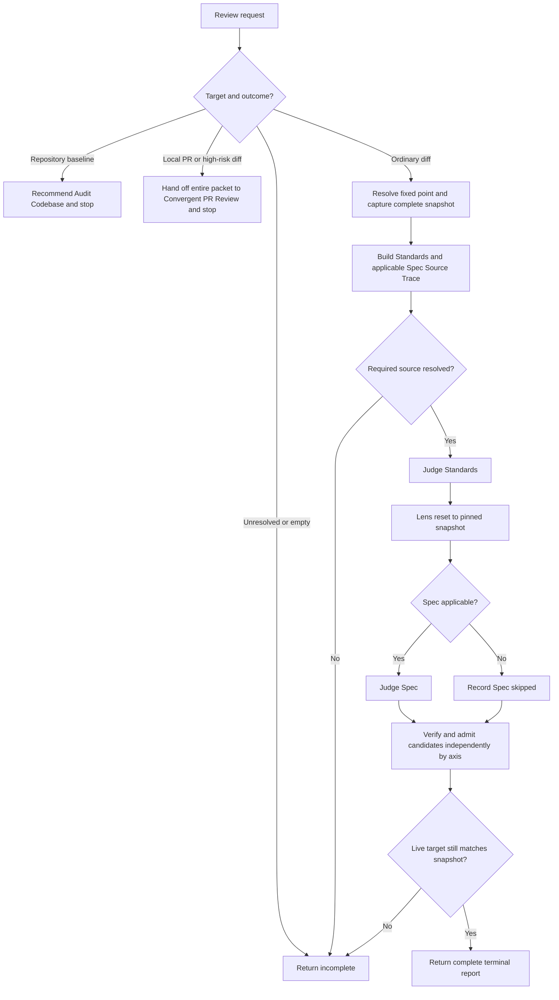

# Review Runtime And Relationship Design Synthesis

Status: exhaustive design reference and extraction map, not an executable contract.

Runtime authority remains in:

- `skills/custom/review/SKILL.md`;
- `skills/custom/review/FINDING-CONTRACT.md`, `ADVISORY-CONTRACT.md`, and `SMELL-BASELINE.md`;
- `skills/custom/review/agents/openai.yaml`;
- `$convergent-pr-review` for local PRs and high-risk local diffs;
- `$audit-codebase` for bounded repository-baseline audits;
- `docs/agents/engineering-contract.md`, the caller's Charter, and the target repository's Spec, Standards, tracker, and validation contracts;
- the invoking implementation owner, which retains Repair and Lock authority; and
- the relationship map, pack tests, behavior evaluations, and installed mirrors.

The current canonical Review and Convergent PR Review sources match their installed mirrors. Existing structural tests protect their main interfaces, and historical behavior evaluations support the high-risk handoff, root-only convergence, capacity degradation, advisory, and audit-routing decisions at their recorded skill hashes. This synthesis does not claim that the proposed ordinary-review rewrite has been extracted or behaviorally promoted. Canonical source remains executable authority until a future coordinated rewrite passes every applicable gate below and is separately synchronized.

## How To Read This Document

This synthesis is exhaustive only for accepted Review behavior, material alternatives, owned file changes, relationship requirements, and proof needed for a future rewrite. Retain a paragraph only when removing it would change runtime design, implementation sequencing, validation, or a promotion decision. Historical discussion belongs in research or validation evidence; concise executable wording belongs in the eventual runtime skill.

The document has four layers:

1. **Orientation** states the outcome, selected family shape, review vocabulary, and explanatory end-to-end flow.
2. **Normative Design** is the sole authority for proposed Review behavior and relationships.
3. **Evidence And Rationale** preserves reasons, deliberate non-changes, current evidence, residual gaps, and deferred hypotheses without creating runtime rules.
4. **Extraction And Verification** places and proves the design without redefining it.

Change proposed behavior in Layer Two; explain it in Layer Three; place and prove it in Layer Four. The Design Verdict reports selection status but creates no rules. The Normative Home Index assigns each behavior one authority. The Runtime Ownership And Change Map owns file placement and bundle identity. The Staged Extraction Plan owns implementation order. The Staged Behavior-Evaluation Protocol owns proof mechanics. The Migration And Acceptance Matrix owns case coverage only.

[Synthesis Ownership](../README.md#synthesis-ownership) governs foreign surfaces. This note owns ordinary Review and the shared finding, advisory, and smell contracts. It specifies only the observable capability required from Convergent PR Review, Audit Codebase, callers, and routers; those owners retain their concrete procedure and file changes. Correct any diagram, rationale, ownership row, or acceptance case that disagrees with its Layer Two owner.

Use this index for direct navigation:

| Question | Owning section |
| --- | --- |
| What outcome and family boundary govern the rewrite? | [North Star](#north-star), [Design Verdict](#design-verdict), and [Review Family Boundary](#review-family-boundary) |
| Which review terms have precise meanings? | [Review Vocabulary](#review-vocabulary) |
| What should the runtime leading words mean? | [Leading-Word Runtime Model](#leading-word-runtime-model) |
| Which owner handles the supplied target? | [Invocation And Route Selection](#invocation-and-route-selection) |
| What may Review inspect or mutate? | [Authority And Read-Only Boundary](#authority-and-read-only-boundary) |
| How is one immutable review snapshot established? | [Fixed Point And Snapshot Custody](#fixed-point-and-snapshot-custody) |
| Which review artifact proves what? | [Review Artifact Authority Contract](#review-artifact-authority-contract) |
| Which Spec and Standards govern judgment? | [Source Trace Contract](#source-trace-contract) |
| How do Standards and Spec remain independent? | [Axis And Lens-Reset Contract](#axis-and-lens-reset-contract) |
| Which observations become findings or advisories? | [Finding Admission And Verification](#finding-admission-and-verification), [Severity And Remediation Classification](#severity-and-remediation-classification), and [Advisory Contract](#advisory-contract) |
| How does remediation review stay bounded? | [Review Modes And Remediation Bound](#review-modes-and-remediation-bound) |
| When is each operation complete? | [Operation And Completion Contracts](#operation-and-completion-contracts) |
| Which context loads for each branch? | [Runtime Context Loading Contract](#runtime-context-loading-contract) |
| What does Review return? | [Return Contract](#return-contract) |
| Which caller or callee owns each edge? | [Relationship Ownership](#relationship-ownership) |
| How should the eventual main skill read? | [Proposed Runtime Semantic Surface](#proposed-runtime-semantic-surface) |
| What changes where? | [Runtime Ownership And Change Map](#runtime-ownership-and-change-map) and [Staged Extraction Plan](#staged-extraction-plan) |
| What must pass before promotion? | [Staged Behavior-Evaluation Protocol](#staged-behavior-evaluation-protocol), [Migration And Acceptance Matrix](#migration-and-acceptance-matrix), [Promotion Gate And Residual Gaps](#promotion-gate-and-residual-gaps), and [Completion Criterion For The Future Rewrite](#completion-criterion-for-the-future-rewrite) |

# Layer One: Orientation

## North Star

Review owns one outcome: judge one complete immutable ordinary diff against its fixed point, Standards, and applicable Spec; return every verified Charter-relevant finding in one read-only terminal report; and return control without granting mutation, Repair, Lock, or successor-snapshot authority.

Review is a judgment boundary, not an implementation loop or release decision. The caller selects or supplies the target, owns the Charter, validates finding classification, decides whether and how to Repair, captures any successor snapshot, chooses whether a result is acceptable for Lock, and performs every mutation.

The rewrite optimizes for trustworthy ordinary review with minimal context and ceremony. Snapshot identity, Source Trace, axis separation, finding admission, required proof, drift, Return, and authority are gates. Brevity never substitutes for any of them.

## Design Verdict

This table summarizes selection status and points to the normative sections that own each decision. It does not create runtime rules.

| Stratum | Selected shape | Runtime status |
| --- | --- | --- |
| Ordinary Review core | One implicitly invocable terminal reviewer over one ordinary fixed snapshot; route, pin, trace, judge, admit, drift-check, and return | Proposed for coordinated extraction from Layer Two |
| Review family | Review owns ordinary diffs; Convergent PR Review owns local PRs and high-risk local diffs; Audit Codebase owns bounded repository baselines | Preserve the three-owner boundary; reconcile only observed routing or return mismatches |
| Snapshot custody | Every invocation distinguishes the fixed point from the review snapshot, captures all in-scope target bytes, assigns one snapshot identity, and checks live-target drift before reporting | Strengthen ordinary Review; preserve the stricter convergent owner |
| Judgment | Standards and Spec remain separate axes with an explicit lens reset and no cross-axis deduplication or reranking | Preserve and make completion-visible |
| Findings | One shared verified finding interface with stable IDs, titles, admission gates, severity, remediation classification, and required proof | Strengthen the shared contract and its callers together |
| Advisories | Opt-in, verified, separate, nonblocking, and authority-free; default `Advisories: no` | Extend the existing shared advisory capability to ordinary Review |
| Remediation | A fresh successor-snapshot invocation bounded to carried IDs, the Repair delta, regressions through those surfaces, and remaining original acceptance | Preserve caller ownership and make carried dispositions explicit |
| Deferred hypotheses | A snapshot helper, machine-rendered report, or additional disclosed procedure | Excluded until repeated evidence shows context overflow, capture error, or report-shape variance that sharper wording and tests do not cure |
| Rejected machinery | One merged review/audit mega-skill, an ordinary-review ledger, review-owned repair, automatic snapshot recapture, cross-axis consensus, style-only findings, and a synthetic confidence score | Keep outside the future rewrite |

## Review Family Boundary

The family is risk-scaled but each invocation has one owner:

| Target and requested outcome | Owner | Terminal result |
| --- | --- | --- |
| Ordinary branch, WIP, explicitly staged, or `review since X` diff | `$review` | One complete or incomplete ordinary report |
| Local PR, release candidate, or bounded high-risk local diff needing independent lenses | `$convergent-pr-review` | One `pass`, `pass with residual risk`, `blocked`, or `incomplete` release-gate decision |
| Immutable repository baseline across bounded correctness, domain, methodology, data, analytics, validation, or performance lenses | `$audit-codebase` | One complete or incomplete coverage ledger without a release decision |
| Repair and successor snapshot after either diff review | The invoking implementation owner | One new review invocation under the original Charter |
| Lock, commit, tracker closeout, push, deployment, or external mutation | The caller or owning delivery skill | Verified mutation and read-back under its own contract |

Review never runs an ordinary pass and a convergent pass as duplicate gates. A high-risk handoff transfers the whole review target and stops. A repository-baseline request is recommended to Audit Codebase and stops. Review does not absorb audit defect rules, independent reviewer orchestration, finding Repair, or Lock.

## Review Vocabulary

Terms already defined in `docs/agents/engineering-contract.md` retain those meanings, especially Source Trace, commitment boundary, fixed point, review snapshot, Charter, Repair generation, Spec / Standards, residual risk, and Lock. Review adds only these precise terms:

| Term | Meaning |
| --- | --- |
| **Review target** | The caller-designated branch, tree, index, worktree, or since-X surface from which one complete snapshot is captured |
| **Snapshot manifest** | The target mode, resolved refs, Git-addressed identities, captured diff bytes, status, and in-scope non-Git-addressed path and content identities sufficient to reproduce what was judged |
| **Snapshot identity** | The immutable tree SHA when one tree fully addresses the target; otherwise a digest of the complete snapshot manifest and captured bytes |
| **Axis** | Standards or Spec; each has its own sources, candidates, findings, counts, and worst severity |
| **Lens reset** | A deliberate return to the pinned snapshot and the next axis's sources, excluding conclusions and ranking pressure from the prior axis |
| **Candidate observation** | A suspected target-caused contract failure that has not yet closed every finding-admission and verification gate |
| **Admitted finding** | A candidate observation whose Anchor, Reach, Evidence, Impact, Proportion, and required verification have closed |
| **Advisory** | A verified nonblocking opportunity with no violated governing contract and no effect on decision or mutation authority |
| **Carried finding** | A stable finding ID explicitly supplied to a remediation invocation from its prior review report |
| **Drift** | Any live-target identity or in-scope content difference from the captured review snapshot before Return |

These terms orient the design. Their indexed Layer Two contracts remain the sole authority for selection, capture, judgment, admission, completion, and Return.

## Leading-Word Runtime Model

The eventual skill should expose this compact operating spine:

```text
Route -> Pin -> Trace -> Judge -> Admit -> Return
```

- **Route** selects exactly one family owner before ordinary snapshot work.
- **Pin** resolves the fixed point and captures one complete immutable snapshot plus identity.
- **Trace** resolves the Standards and applicable Spec sources before conclusions.
- **Judge** inspects Standards, resets, then inspects Spec without cross-axis influence.
- **Admit** verifies candidate observations through every shared gate before severity or reporting.
- **Return** checks drift and emits one terminal report with no new authority.

`Read-only` is universal. It constrains every operation, verification attempt, artifact, and handoff rather than acting as an additional step.

## End-To-End Explanatory Flow



The diagram is explanatory. It omits source precedence, target-mode capture details, remediation bounds, advisory handling, and incomplete-report fields that are authoritative below.

# Layer Two: Normative Design

## Normative Home Index

Each proposed behavior has one normative home. Other sections may point, explain, place, or test it but never create a competing rule.

| Concern | Sole normative home | Other appearances |
| --- | --- | --- |
| Invocation reach and family owner selection | [Invocation And Route Selection](#invocation-and-route-selection) | Design Verdict, flowchart, relationship and routing evaluations |
| Human, mutation, and terminal authority | [Authority And Read-Only Boundary](#authority-and-read-only-boundary) | Return, relationships, and critical failures |
| Fixed point, target precedence, snapshot capture, identity, and drift | [Fixed Point And Snapshot Custody](#fixed-point-and-snapshot-custody) | Operation table and snapshot evaluations |
| Fixed-point, snapshot, source, proof, and report artifact roles | [Review Artifact Authority Contract](#review-artifact-authority-contract) | Return, ownership map, and substitution tests |
| Standards and Spec source precedence | [Source Trace Contract](#source-trace-contract) | Judgment and incomplete cases |
| Axis order, lens reset, and cross-axis independence | [Axis And Lens-Reset Contract](#axis-and-lens-reset-contract) | Return shape and evaluations |
| Finding burden of proof and verification | [Finding Admission And Verification](#finding-admission-and-verification) | Shared contract file and acceptance cases |
| Severity, blocking, and remediation classification | [Severity And Remediation Classification](#severity-and-remediation-classification) | Finding interface and caller repair boundary |
| Advisory admission and effect | [Advisory Contract](#advisory-contract) | Optional annex and advisory evaluation |
| Initial and remediation scope | [Review Modes And Remediation Bound](#review-modes-and-remediation-bound) | Handoff and Return |
| Operation entry, completion, and legal incomplete branch | [Operation And Completion Contracts](#operation-and-completion-contracts) | Leading words and acceptance cases |
| Progressive disclosure | [Runtime Context Loading Contract](#runtime-context-loading-contract) | Runtime ownership and context evaluation |
| Terminal report forms | [Return Contract](#return-contract) | Runtime semantic surface and caller evaluation |
| Cross-skill triggers and return boundaries | [Relationship Ownership](#relationship-ownership) | Relationship map and structural tests |

## Invocation And Route Selection

Review remains implicitly invocable. Its description front-loads one observable trigger per branch: an ordinary existing diff is owned here; a local PR or high-risk local diff hands off to Convergent PR Review; a bounded repository-baseline audit belongs to Audit Codebase. Explicit user invocation remains valid but does not bypass route selection.

Route before ordinary Pin, Trace, or judgment:

| Observed request and target | Required route | Return boundary | Illegal shortcut |
| --- | --- | --- | --- |
| One ordinary branch, WIP, staged-only, or since-X diff with no high-risk trigger | Continue in Review | Ordinary Review Return | Dispatching reviewers or requiring PR metadata |
| Any local PR or release candidate at the top-level root | Invoke `$convergent-pr-review` once with the complete caller packet, then stop | Convergent PR Review | Running an ordinary pass first, resuming Review afterward, or capturing a competing snapshot |
| A local diff at the top-level root crosses a high-risk commitment boundary or requires independent lens coverage | Invoke `$convergent-pr-review` once, then stop | Convergent PR Review | Treating small file count or caller urgency as evidence of ordinary risk |
| A delegated Review invocation discovers either high-risk branch | Return `incomplete` with a complete root-escalation packet | Top-level root | Invoking the root-only callee from the delegated task or downgrading to ordinary review |
| A bounded immutable repository baseline, not a pending diff, needs broad correctness, domain, methodology, data, analytics, validation, or performance coverage | Recommend `$audit-codebase` and stop | Caller | Recasting baseline defects as diff findings or starting the audit automatically |
| The target, outcome, or route cannot be resolved without a material caller choice | Return `incomplete` with the exact routing blocker | Caller | Guessing a target, reviewing multiple possible targets, or asking for facts discoverable read-only |

A high-risk trigger is present when the diff is a local PR or release candidate; crosses a security, privacy, permission, public-interface, public-data, migration, persistence, release, deployment, CI, generated-contract, or shared cross-component commitment boundary; has failure consequences that require distinct independent lenses; or the caller explicitly requires independent or assurance review. Diff size, file count, language, unfamiliarity, or available reviewer capacity alone is not a trigger.

The convergent handoff carries every caller-supplied Charter field, `Spec required`, review mode, Source Trace pointer, fixed-point input, target input, required proof, and carried finding ID. Review does not first resolve or recapture fields that Convergent PR Review owns. It does not resume when the callee returns. When Review is delegated, the same fields form the root-escalation packet; the delegated task does not invoke the root-only callee.

## Authority And Read-Only Boundary

Review owns only inspection, read-only reproduction, candidate verification, finding and advisory classification, and one terminal report. It grants no permission to edit, stage, commit, create or switch branches, recapture a successor snapshot, mutate trackers or PR state, post comments or reviews, send external messages, install dependencies, change services, or start remediation.

The caller owns the Charter, target selection, any permission needed to obtain unavailable sources, finding-classification validation before mutation, Repair admission and budget, successor snapshots, acceptance for Lock, and every mutation. A report may classify a remedy as `automatic-in-scope`; that classification is evidence for the caller, not repair authority.

Read-only verification may execute only when the command and environment preserve tracked files, Git state, dependency state, external systems, and user data. Host-owned temporary output outside the repository is permitted when already available through the execution environment and removed before Return. If meaningful verification needs repository writes, dependency installation, service mutation, credentials, protected data, or another authority Review lacks, use the strongest safe read-only evidence and apply the required-proof rule below.

## Fixed Point And Snapshot Custody

The fixed point is the review baseline. The review snapshot is the complete target judged against it. They are distinct and both appear in Return.

A caller-supplied fixed point wins. Otherwise discover the repository default branch and merge base, state the resolved commit SHA, and ask only when discovery is ambiguous. Failure to resolve the fixed point is `incomplete`.

Select one target using this precedence:

1. a caller-supplied review tree;
2. an explicitly requested staged-only target;
3. a caller-supplied committed branch, commit, or head;
4. the live working tree when the request names WIP or otherwise clearly includes unstaged and untracked work.

| Target mode | Complete capture | Snapshot identity | Drift gate |
| --- | --- | --- | --- |
| Supplied review tree | Resolve `<tree>^{tree}`; capture the fixed-point-to-tree diff and inspect files with `git show` | Resolved tree SHA | Immutable; verify only that the supplied identity was used |
| Committed branch or commit | Resolve target ref to commit and tree SHAs; capture commit range, stat, and full fixed-point-to-target diff | Resolved commit and tree SHAs | If a live branch name was supplied, compare its current resolved head with the captured head before Return |
| Explicitly staged only | Capture fixed point, index entries, cached diff bytes including binary identity, status, and relevant staged paths | Digest of the complete staged snapshot manifest and diff bytes | Recompute index entries, cached diff, and relevant status before Return |
| Live working tree | Capture `HEAD`, index entries, staged and unstaged diff bytes including binary identity, status, and every in-scope untracked path and its content identity | Digest of the complete working-tree snapshot manifest and captured bytes | Recompute `HEAD`, index entries, both diffs, status, and in-scope untracked path and content identities before Return |

Git-addressed content needs no second content hash. Hash non-Git-addressed live content or the complete captured byte stream. Ignored files are outside the snapshot unless the caller explicitly places one in scope. Read in-scope untracked files directly; a status line without content is incomplete capture.

Review judges the captured snapshot, never a later live read. If the complete target is empty, cannot fit a complete ordinary read-only capture, contains unresolved refs, or cannot be captured without missing in-scope bytes, return `incomplete`. A target too broad for one complete ordinary pass may be handed to Convergent PR Review only when it also meets the high-risk route; breadth alone does not silently change owners.

Any live-target drift before Return makes the result stale and therefore `incomplete`. Report the changed identity or surface. Do not recapture, refresh findings onto new bytes, or begin another review. Only the caller may authorize a new invocation.

## Review Artifact Authority Contract

Use each artifact only for its owned claim:

| Artifact or surface | Owns or proves | Must not substitute for |
| --- | --- | --- |
| Fixed-point commit SHA | Exact baseline used for comparison | Review snapshot identity, Spec, Standards, target completeness, or acceptance |
| Supplied review tree or complete snapshot manifest | Exact target bytes captured for this invocation | Final drift result, Source Trace, finding verification, or caller approval |
| Snapshot identity | Stable handle for the captured target and remediation lineage | Evidence that a live target remained unchanged after capture |
| Source Trace | Which Standards and Spec sources govern, their precedence, and any conflict | Proof that the target satisfies those sources |
| Safe reproduction or proof output | The named command or observation on the captured scenario under its recorded environment | Broader supported behavior, another axis, an unavailable environment, or release acceptance |
| Admitted finding | One verified target-caused contract failure and its required proof | Repair authority, successor-snapshot authority, or a release decision |
| Advisory | One verified nonblocking opportunity without a violated contract | Finding, severity, confidence, completeness, Repair, or blocking |
| Terminal Review report | Coverage, findings, gaps, drift result, and authority for one snapshot | Mutation, Lock, currentness after later drift, or another invocation |
| Convergent evidence ledger and decision | The foreign owner's independent high-risk result | Ordinary Review report, caller Repair, or caller Lock |

When artifacts disagree, the captured bytes, fresh read-only observations, and their owning contracts control. Correct the report or return `incomplete`; never edit a snapshot identity, Source Trace, projection, or finding field to make the evidence appear coherent.

## Source Trace Contract

Build one Source Trace before judgment. Record source identity and precedence separately for Standards and Spec.

Trace Spec in this order:

1. the caller-supplied item, Charter, bounded slice, acceptance, path, issue, URL, spec, or legacy PRD;
2. decision-bearing issue or PR material explicitly referenced by the caller or captured commits, following `docs/agents/issue-tracker.md` when available;
3. references in captured commit messages; and
4. one matching authoritative source under repository conventions such as `docs/`, `specs/`, or tracked `.scratch/` state.

The caller supplies `Spec required: yes | no`. Standalone Review defaults to `no`. Implementation and Parallel Implement callers supply `yes`. When Spec is required, a missing, unreadable, conflicting, or unresolved authoritative source makes Review `incomplete`; never infer, replace, or skip the axis. When Spec is optional and absent, record `Spec: skipped - no source available` and do not invent intent from tests or implementation.

Trace Standards from `AGENTS.md` and routed pointers, contributor or coding guidance, test and tooling configuration, and meaningful nearby conventions in the captured snapshot. Read `SMELL-BASELINE.md` only when documented Standards and meaningful nearby conventions are thin. Repository Standards override the fallback. Label every fallback-based finding `baseline judgement call`; leave tooling-enforced style to tooling.

When sources conflict, apply an explicit repository- or caller-supplied precedence rule if one exists. Otherwise return `incomplete` for the affected required axis with the exact conflict. A conflict in optional Spec skips no Standards work but prevents a Spec clean claim.

## Axis And Lens-Reset Contract

Judge in this order:

```text
Standards -> lens reset -> Spec
```

Standards asks whether the target is built right against its traced Standards. Spec asks whether it is the right thing against originating commitments, supported scenarios, acceptance, and required proof.

The lens reset returns attention to the pinned snapshot and the Spec Source Trace. It excludes Standards conclusions, severity rankings, finding count, and pressure to merge or deduplicate. The same evidence may support findings on both axes only when each axis independently closes its own Anchor and Impact.

Never merge, deduplicate, suppress, or rerank findings across axes. Same-axis duplicates collapse to one canonical finding. Cross-axis overlap may link IDs for reader context but preserves both findings, axis-specific anchors, severity, and counts.

Judge omissions, incorrect behavior, scope creep, required-proof gaps, and maintainability failures through reachable supported scenarios and useful caller-facing seams. A missing implementation may be a finding even without a changed line when the target claims the governing acceptance. Untouched adjacent defects remain outside scope unless the target changes their supported reach or remediation review admits them through the bounded delta.

## Finding Admission And Verification

Generate candidate observations during judgment. Report one only after all gates close:

| Gate | Required evidence |
| --- | --- |
| **Anchor** | An explicit acceptance criterion, documented repository Standard, required validation, or reachable behavior changed or promised by the target |
| **Reach** | One supported scenario inside the caller's Charter or requested slice |
| **Evidence** | Direct evidence from the immutable review snapshot and any safe read-only reproduction |
| **Impact** | One concrete correctness, security, privacy, data, required-proof, operability, maintainability, or important-path failure |
| **Proportion** | A required outcome whose likely remedy is proportionate to the anchored contract |

Admission precedes severity. Portability speculation, theoretical concurrency, unsupported environments, optional hardening, subjective preference, style already owned by tooling, and adjacent cleanup are not findings without direct evidence of a reachable Charter impact.

Every admitted finding uses this shared interface:

```text
ID:
Title:
Axis:
Severity:
Location:
Anchor:
Supported scenario:
Evidence:
Impact:
Blocking: yes | no
Remediation: automatic-in-scope | decision-required | residual-hardening
Required proof:
```

IDs are stable within the original Charter and across remediation invocations. Titles are concise failure statements. Locations name the tightest useful captured file and line or the missing seam. Evidence distinguishes direct observation from inference. Required proof names the smallest semantic proof that could close the repair.

Verification may reproduce or disprove a candidate only inside the read-only boundary. Reject disproved candidates. Never report `candidate`, `unverified`, or a speculative finding.

Two proof cases remain distinct:

- The target omits proof that the governing contract requires it to contain or supply. That omission is itself a potential finding under the normal gates.
- Review cannot obtain evidence required to decide whether a candidate or axis is correct. That is a coverage blocker: return `incomplete` for the affected axis, preserve only already verified findings, and make no clean-axis claim.

Optional verification that requires substantial new infrastructure becomes named residual risk, not an expanded review. It never converts an unverified candidate into a finding.

`not checked` is a Convergent PR Review ledger verification state, not an admitted-finding state. Missing evidence needed to cover a required axis or decide a required claim yields `incomplete`. Optional verification may remain `not checked` only when direct evidence still supports the recorded candidate and the unavailable check is named. Convergent PR Review may treat that uncertainty as `blocked` only when the Charter makes the uncertainty itself blocking; otherwise it can produce at most `pass with residual risk`. Ordinary Review has no provisional ledger state: it returns residual risk or `incomplete` under the same required-versus-optional distinction.

## Severity And Remediation Classification

Severity follows verified impact:

- `P0`: catastrophic production, security, privacy, or data failure.
- `P1`: merge-blocking supported correctness or contract failure.
- `P2`: significant supported edge-case, required-validation, CI, release, or operator-risk defect; blocking only when the governing boundary requires the affected validation or workflow.
- `P3`: lower-risk actionable correctness or maintainability defect; nonblocking unless caller authority says otherwise.

`P0` and `P1` block. `P2` and `P3` use the Charter and repository policy to determine `Blocking`; Review records the reason but makes no release or Lock decision.

Classify remediation independently from severity:

- `automatic-in-scope`: the required change preserves the Charter and has bounded proof.
- `decision-required`: the required change alters product intent, acceptance, supported behavior, a public or data contract, security or privacy posture, dependency authority, or another commitment.
- `residual-hardening`: direct evidence establishes a reachable Charter risk, but automatic implementation is outside recorded acceptance or authority.

Never demote a contract violation into an advisory, `not checked`, or residual label to obtain a clean report. The caller validates classification and admits any Repair; Review grants no mutation.

## Advisory Contract

The caller or Charter supplies `Advisories: yes | no`; default to `no`. When `yes`, load `ADVISORY-CONTRACT.md` and append a separate annex.

Admit an advisory only when one supported scenario, direct snapshot evidence, a plausible benefit, and the absence of a violated governing contract survive verification. Label an expected benefit as inference unless measured. An advisory has no severity, never enters finding counts or carried IDs, never affects confidence or completeness, never blocks, and grants no repair authority.

When advisories are disabled, omit verified opportunities that are not findings. When enabled, use the shared advisory fields exactly. A violated acceptance criterion, documented Standard, required proof, or supported behavior remains a finding even when nonblocking.

## Review Modes And Remediation Bound

Review supports two modes:

- `initial`: the first applicable review of one snapshot under the Charter; default for standalone Review.
- `remediation`: a new invocation over one successor snapshot after a caller-owned Repair generation.

Remediation requires the original Charter, prior snapshot identity, carried finding IDs, Repair delta, remaining original acceptance, fixed point, and successor target. Missing or conflicting fields make the invocation `incomplete`.

Remediation judges only:

1. each carried finding's required outcome and proof;
2. regressions introduced through the Repair delta and directly affected seams; and
3. remaining original acceptance exercised by those surfaces.

Admit a newly observed failure only through those surfaces. Do not reopen untouched code with new hardening lenses, expand the Charter, or convert remediation into assurance. Return one explicit disposition for every carried ID: `resolved`, `still admitted`, `disproved`, or `incomplete`. A carried finding keeps its original ID and axis.

Review does not own assurance mode. A caller requiring independent increased confidence over the same accepted snapshot routes to Convergent PR Review under its owner contract.

## Operation And Completion Contracts

The table below is the sole proposed authority for operation completion and legal nonterminal return.

| Operation | Enter when | Complete when | Legal nonterminal return |
| --- | --- | --- | --- |
| **Route** | A Review invocation supplies a target or review outcome | Exactly one owner and return boundary are selected from observable predicates | `incomplete` with one unresolved routing choice |
| **Pin** | Ordinary Review owns the target | Fixed point resolves; one target mode wins; every in-scope byte is captured; snapshot identity and drift surfaces are recorded; target is nonempty | `incomplete` with unresolved ref, empty target, or missing capture surface |
| **Trace** | Pin is complete | Standards sources and applicable Spec sources, identities, precedence, conflicts, and availability are recorded | `incomplete` for a required unresolved source or conflict |
| **Judge** | Applicable sources resolve | Standards runs; lens reset occurs; applicable Spec runs or is explicitly skipped; candidate observations remain axis-local | `incomplete` for an uncovered required axis or evidence blocker |
| **Admit** | Candidate observations exist or both axes are clean | Every candidate is verified and admitted or rejected; severity and remediation follow admission; optional advisories are classified separately; no unverified item survives | `incomplete` for required verification Review cannot obtain read-only |
| **Return** | Admission closes | Live targets pass drift; report matches the selected terminal form; every carried ID has a disposition; disposable host evidence is removed; authority fields are present | `incomplete` on drift, report incompleteness, or evidence-cleanup failure |

No review completes on a resolved ref, captured diff, Source Trace, test run, candidate list, absence of obvious bugs, or handoff packet alone. A convergent handoff completes Review's own participation only by transferring the entire target before ordinary work and stopping; the callee owns the report.

## Runtime Context Loading Contract

Keep universal ordinary-review behavior in `SKILL.md`. Load branch context only when its trigger fires:

| Observed state or phase | Load now | Keep out |
| --- | --- | --- |
| Every ordinary review | `SKILL.md`, repo instructions, engineering contract, caller packet, and captured target | Convergent reviewer procedure, Audit procedure, full smell list before need, advisory fields when disabled, caller Repair procedure |
| Before candidate admission | `FINDING-CONTRACT.md` | Convergent ledger states, audit defect interface, implementation repair steps |
| Standards and nearby conventions are thin | `SMELL-BASELINE.md` | Baseline smells when repository Standards already govern |
| `Advisories: yes` | `ADVISORY-CONTRACT.md` | Advisory contract when disabled |
| Local PR or high-risk route fires | Invoke `$convergent-pr-review` with the complete handoff packet | Ordinary Pin, Trace, judgment, or a copied convergent procedure |
| Repository-baseline route fires | Recommend `$audit-codebase` and stop | Audit defect contract, lens procedure, or report schema |
| Tracker, issue, or PR source must be read | Target repository's routed tracker instructions and only the named source | Provider mutation procedure or unrelated tracker history |

Do not add an operations reference, snapshot helper, or report renderer in the first rewrite. The ordinary path is short, the shared reference files already isolate conditional detail, and no current evidence demonstrates irreducible sprawl or premature completion. Reconsider only under the triggers in Layer Three.

## Return Contract

Return exactly one family result.

### Ordinary complete

```markdown
Review status: complete
Review mode: initial | remediation
Fixed point: <resolved commit SHA>
Review snapshot: <snapshot identity>
Review target: <target mode and captured input>
Sources: Standards: <sources>. Spec: <source or skipped>.
Advisories: enabled | disabled

## Standards

<admitted findings or "No findings.">

## Spec

<admitted findings or "No findings." / "Skipped: no spec available.">

## Carried Findings

<remediation only: every ID and resolved | still admitted | disproved>

## Advisories

<enabled only: advisories or "No advisories.">

Summary: Standards: <count>, worst <severity or none>. Spec: <count/skipped>, worst <severity or none>.
Skipped checks: <optional checks or none>
Residual risk: <nonblocking evidence limits or none>
Return boundary: caller
Mutation authority: none
Successor snapshot authority: none
```

Omit `## Carried Findings` outside remediation. Omit `## Advisories` when disabled. Render every finding through the shared finding interface and every advisory through the shared advisory interface. A complete report has no candidate, unverified finding, uncovered required axis, or drift.

### Ordinary incomplete

```text
Review status: incomplete
Review mode: initial | remediation
Fixed point: <resolved SHA or unresolved>
Review snapshot: <snapshot identity or unresolved>
Review target: <resolved target or unresolved>
Sources: Standards: <sources, unresolved, or not traced>. Spec: <source, unresolved, skipped, or not traced>.
Covered: <completed axes and verification or none>
Verified findings: <IDs or none; no clean-axis inference>
Carried findings: <remediation dispositions or not applicable>
Blocker: <routing | ref | capture | source | evidence | drift | report blocker>
Skipped: <work not completed because of the blocker>
Residual risk: <effect of unavailable evidence>
Return boundary: caller
Mutation authority: none
Successor snapshot authority: none
```

An incomplete result may preserve already verified admitted findings, but it never reports an uncovered axis as clean and never returns an unverified candidate as a finding. An `incomplete` review is not Repair or Lock authority.

### Handoff or recommendation

A high-risk handoff returns the Convergent PR Review result without an ordinary wrapper or duplicate report. A repository-baseline misroute returns one compact recommendation naming `$audit-codebase`, the unresolved outcome, available evidence, and `Return boundary: caller`; it starts no audit. An unresolved family route returns the ordinary incomplete form.

**Complete:** Route selects one owner; for ordinary Review, Pin and Trace close, both applicable axes run with a lens reset, every candidate closes admission and verification, advisories remain separate, every carried ID is disposed, drift passes, the terminal report is complete, and control returns without mutation or successor review.

## Relationship Ownership

| Caller | Verb | Callee | Trigger and required return |
| --- | --- | --- | --- |
| `$implement` | Invoke | `$review` | One ordinary immutable review tree needs initial or remediation review with `Spec required: yes`; Review returns a complete or incomplete report, and Implement retains Repair and Lock |
| `$parallel-implement` | Invoke | `$review` | One drained proved ordinary candidate needs initial or remediation review with `Spec required: yes`; Review returns to the root campaign owner without ledger, tracker, or Release authority |
| `$implement` | Invoke | `$convergent-pr-review` | A local PR or matching high-risk diff needs independent review; the caller selects this route once and retains Repair and Lock |
| `$parallel-implement` | Invoke | `$convergent-pr-review` | A local PR or matching high-risk candidate needs independent review after actors are idle; the root retains Repair, Lock, and Release |
| `$review` | Hand off | `$convergent-pr-review` | A direct Review invocation supplies a local PR or high-risk local diff; transfer the complete caller packet before ordinary Pin and stop |
| `$review` | Recommend and stop | `$audit-codebase` | The request targets a bounded immutable repository baseline rather than a pending diff |
| `$convergent-pr-review` | Load | Review shared contracts | Diff findings, optional advisories, and fallback smells use the Review-owned interfaces without transferring orchestration or decision ownership |
| `$audit-codebase` | Load | `ADVISORY-CONTRACT.md` | Optional nonblocking opportunities use the shared advisory interface; baseline defects remain owned by Audit Codebase's defect contract |
| `$skill-router` | Recommend and stop | `$review` | An ordinary existing diff needs judgment; the user or caller starts Review |
| `$skill-router` | Recommend and stop | `$convergent-pr-review` | A local PR or high-risk local diff needs independent review |
| `$skill-router` | Recommend and stop | `$audit-codebase` | An immutable repository baseline needs bounded audit coverage without a release decision |

Relationship surfaces index these edges without copying review procedure. There is no Convergent PR Review handoff back to Review, no Audit invocation from Review, no review-owned Repair edge, and no caller running both diff-review owners over one snapshot as duplicate gates.

# Layer Three: Evidence And Rationale

Layer Three explains the selected design. It creates no predicate, permission, prohibition, transition, field, or completion condition. When it differs from Layer Two, Layer Two wins and this layer must be corrected.

## Why Three Owners Remain

Ordinary diff review, independent release-gate convergence, and repository-baseline audit have different completion meanings:

- Ordinary Review completes when one reviewer fully judges the snapshot and returns verified findings. `complete` describes review coverage, not acceptance.
- Convergent PR Review completes when a root-owned independent protocol produces a release-usable aggregate decision over one high-risk snapshot.
- Audit Codebase completes when every bounded baseline region and lens is covered or its evidence gap is named. Severity does not turn coverage into a release decision.

Merging them would force ordinary diffs to carry reviewer-capacity, ledger, audit-region, HTML-report, and baseline-defect machinery. It would also make `complete`, `pass`, `blocked`, and audit coverage compete for one meaning. The selected family keeps each result semantically sharp and lets routing pay complexity only when the target warrants it.

## Why Route Precedes Pin

A route decision changes the owner of snapshot capture, reviewer orchestration, result shape, and completion. Capturing an ordinary snapshot before a high-risk handoff creates two identities and invites duplicate judgment. Running ordinary Trace before an audit recommendation loads sources under the wrong defect contract. Route therefore closes first from observable target and outcome predicates.

The delegated high-risk branch needs a root-escalation packet because Convergent PR Review is root-only. Invoking it from a delegated Review merely produces a predictable blocker after unnecessary work; silently downgrading loses independence. Returning the packet preserves both owners.

## Why Ordinary Snapshot Custody Tightens

The current Review language promises a fixed or immutable snapshot but fully establishes immutability only for a supplied Git tree. A live working tree can change after `git status` or a diff read, and an untracked status entry does not capture content. Convergent PR Review already protects equivalent live targets with a drift gate.

The proposed manifest closes that semantic gap without adding a persistent ledger or repository artifact. Git identities address committed content; captured bytes and digests cover staged, unstaged, and untracked content; the final comparison detects staleness. The snapshot identity makes the report usable by callers and remediation without giving Review successor authority.

## Why Standards And Spec Stay Separate

Standards and Spec answer different questions. A technically elegant change can violate requested behavior; a behaviorally correct patch can impose an actionable maintainability defect. Merging axes lets severity or confidence on one suppress the other and makes source precedence ambiguous.

The lens reset is intentionally explicit. Cross-axis overlap may be useful to the reader, but it does not erase either anchor or count. The caller receives two independently auditable judgments and can admit Repair under its own Charter.

## Why Judgment Precedes Admission In The Spine

The current main skill places an `Admit` step before `Judge`, although actual admission can occur only after a candidate observation exists. The proposed spine keeps the admission contract available before inspection but orders runtime actions as Judge then Admit. This makes the leading words describe what the agent actually does: inspect to generate candidates, then verify and admit them before reporting.

Admission still precedes severity. Moving the step does not weaken the shared burden of proof; it prevents a structural heading from suggesting that findings are known before judgment.

## Why Required-Proof Absence Has Two Outcomes

A target may violate a contract by omitting required tests, validation evidence, or another promised proof artifact. That is a reviewable target defect. Separately, Review may lack the authority or environment needed to verify whether an observed behavior is actually wrong. That is a coverage failure.

Treating both as `incomplete` hides actionable target omissions. Treating both as findings launders uncertainty into a defect. The selected distinction preserves the target-caused proof gap as a candidate finding while returning `incomplete` when Review itself cannot decide a required claim.

## Why Advisories Are Opt-In

The shared advisory contract already protects Convergent PR Review and Audit Codebase from turning verified opportunities into findings. Ordinary Review currently stores but does not expose that capability, leaving its directory ownership and `when advisories are enabled` wording ambiguous.

An explicit default-off gate resolves the ambiguity. Callers that want only contract failures pay no advisory attention. Callers that opt in receive a separate nonblocking annex. Findings cannot be demoted, and opportunities cannot influence completeness or authority.

## Why Review Returns Coverage, Not Release Acceptance

An ordinary report may be procedurally complete and still contain blocking findings. Returning `pass` or `blocked` would duplicate the caller's Charter, repair budget, repository policy, and Lock decision. Review instead returns complete or incomplete coverage plus per-finding blocking evidence. The implementation owner decides acceptance.

Convergent PR Review keeps its release-gate decision because independent capacity, disputes, and residual-risk confidence are part of that owner's promised outcome. The asymmetry is deliberate, and caller adapters must not reinterpret ordinary `complete` as `pass`.

## Deliberate Non-Changes

- Keep the `$review` handle. Historical upstream naming alternatives do not justify breaking callers, routers, evaluation fixtures, or installed handles.
- Keep implicit invocation for Review. Ordinary existing-diff judgment is a discoverable common task, and the description can route high-risk or baseline variants.
- Keep Convergent PR Review and Audit Codebase as separate owners. This synthesis names only Review's required handoff or recommendation outcome.
- Keep P0 through P3 severity and Charter-dependent blocking for P2/P3.
- Keep one shared finding contract for both diff-review owners and one shared advisory contract for review and audit consumers.
- Keep the smell baseline fallback-only, overridden by repository Standards and excluded when tooling owns the rule.
- Keep initial and remediation as ordinary modes. Assurance remains a convergent capability.
- Keep read-only reproduction bounded. Review does not install, repair, mutate, comment, stage, commit, recapture, or close out.
- Keep callers responsible for reading and validating the complete finding report before Repair.
- Keep relationship maps, README routing, tests, and installed mirrors as indexes, protection, and copies rather than behavior owners.

## Current Evidence

Current canonical source and installed mirrors were read back on 2026-07-20. The five Review files and two Convergent PR Review files were byte-identical to their corresponding paths under `C:\Users\steve\.agents\skills`. This proves current mirror parity only; it does not prove the proposed rewrite.

`tests/test_skill_pack_contracts.py` currently protects:

- the Review and Convergent step spines;
- the complete and incomplete ordinary report shapes;
- shared finding fields, remediation classes, severities, and authority footers;
- fresh-context reviewer output, root-only capacity rows, and advisory separation;
- Convergent decisions and drift surfaces;
- risk-scaled caller routing, required Spec propagation, relationship edges, invocation policy, and the prohibited reverse handoff.

Those are structural and literal contracts. They do not prove that a fresh agent captures live bytes, resets its lens, admits only verified findings, distinguishes target proof omissions from reviewer evidence gaps, or renders a semantically honest terminal result.

Historical behavior evidence is useful but hash-bound:

- `docs/validation/transcripts/2026-07-12-cohesion-followup-evals.md` recorded a 5/5 high-risk handoff result using older Review and Convergent hashes and a reduced-confidence separated-pass fallback.
- `docs/validation/transcripts/2026-07-18-root-only-orchestration-eval.md` recorded control failure 5/5 and candidate failure 0/5 for the delegated Convergent root-only guard at candidate hash `e28eec5a...`.
- `docs/validation/transcripts/2026-07-18-coordinated-v2-behavior-eval.md` recorded control failure 5/5 and candidate full-rubric failure 0/5 for capacity, advisory, routing, root-only, friction, and four-slot decisions at its recorded hashes.

The current Convergent `SKILL.md` hash differs from those July 18 candidate hashes. These transcripts support the design choices they directly tested but are not fresh proof of current or future wording. Historical narration that says a stale review automatically reruns is also superseded by the current terminal drift rule: Review returns `incomplete`; only the caller starts another snapshot.

`docs/synthesis/families/issue-pipeline.md` remains useful source-map synthesis for Review's fixed point, separate Standards and Spec axes, actionable findings, missing requirements, scope creep, and acceptance-proof pressure. It does not own the proposed runtime procedure and needs revision only if its stable family concepts change.

## Current Gaps The Rewrite Must Close

1. Ordinary live targets are called immutable without complete byte capture or a final drift gate.
2. `high-risk` has examples in evaluation prompts but no current runtime owner with a precise predicate.
3. Missing required verification can make Review incomplete, but the current incomplete report assumes judgment never ran and the complete report has no residual-risk field.
4. The shared Impact gate omits maintainability even though the smell baseline and P3 severity admit concrete maintainability defects.
5. The shared `not checked` language does not sharply distinguish required missing evidence (`incomplete`) from optional uncertainty that affects a Convergent decision.
6. Ordinary Review houses the advisory contract but has no advisory gate, default, or annex.
7. Remediation inputs are defined, but ordinary Return does not dispose every carried finding ID explicitly.
8. A delegated ordinary Review can discover a high-risk target, but the current one-way handoff points to a root-only callee without a direct root-escalation packet.
9. Convergent pre-Pin and other early incomplete paths lack an exact result form compatible with fields that do not yet exist. That foreign-owner gap must be reconciled by Convergent's own synthesis before any coordinated family claim.
10. Current ordinary Review behavior is protected mainly by static assertions and contract simulations, not fresh-context control/candidate samples over real staged, working-tree, remediation, and drift scenarios.

## Deferred Hypotheses

| Hypothesis | Why deferred | Evidence required to reconsider | Likely owner |
| --- | --- | --- | --- |
| Add a snapshot-capture helper | The selected ordinary manifest is mechanical but small; no repeated capture error has been behaviorally demonstrated | Control samples repeatedly omit or misidentify live bytes after the compact contract and fixtures exist | Review synthesis, with a helper owning mechanics only |
| Add `OPERATIONS.md` or another disclosed procedure | Review has one short linear path and three small conditional references | Measured main-file sprawl or observed premature completion persists after the rewrite | Review synthesis |
| Render a machine-readable or HTML ordinary report | Callers currently need compact Markdown and stable fields, not a second artifact | Multiple real callers require automated ingestion that cannot use the shared fields | Review plus consuming caller syntheses |
| Make ordinary Review root-only | It needs no reviewer orchestration or root-exclusive mutation and can serve bounded delegated evidence work | Repeated delegated runs create authority or snapshot-custody failures that a narrower guard cannot cure | Review synthesis |
| Add ordinary assurance mode | One reviewer repeating itself does not create independence | A caller needs same-snapshot increased confidence and Convergent cannot own it without disproportionate cost | Review and Convergent syntheses |

## Rejected Machinery And Reconsideration Rules

- **Merged mega-skill:** reconsider only if routing itself repeatedly fails after fixed predicates and the combined context demonstrably reduces, rather than increases, error.
- **Ordinary evidence ledger:** reconsider only if stable IDs and terminal report fields cannot support real caller remediation without lost or duplicated findings.
- **Review-owned repair loop:** do not reconsider without a deliberate transfer of Charter, mutation, Repair-budget, proof, successor-snapshot, and Lock authority from implementation owners.
- **Automatic snapshot recapture:** do not reconsider; a changed target is a new review invocation and caller authority boundary.
- **Cross-axis consensus or deduplication:** do not reconsider unless Standards and Spec cease to be separate engineering-contract axes.
- **Synthetic confidence or quality score:** reconsider only with a validated decision use that cannot be expressed by findings, coverage, capacity, and residual risk.
- **Style checklist expansion:** reconsider only when repository Standards and tooling leave a repeated concrete maintainability failure that the compact smell baseline cannot recruit.

# Layer Four: Extraction And Verification

## Proposed Runtime Semantic Surface

The eventual ordinary `SKILL.md` should read approximately as:

```text
Outcome and terminal read-only boundary
Implicit invocation and family route
Review vocabulary
Route -> ordinary | Convergent handoff | Audit recommendation | incomplete
Pin fixed point and complete snapshot identity
Trace Standards and applicable Spec
Judge Standards -> lens reset -> Spec
Admit verified findings; optional advisories
Remediation bound
Drift gate
Return forms
Completion
```

This is a semantic target, not approved final wording. `SKILL.md` keeps universal route, authority, snapshot, source, axis, mode, drift, Return, and completion behavior. It points sharply to shared finding, advisory, and smell contracts without copying their fields or catalogs. It does not copy Convergent orchestration, Audit procedure, caller Repair, Git mutation, provider transport, test implementation, rationale, or evaluation mechanics.

## Runtime Ownership And Change Map

This map alone owns file placement, concrete Review-owned deltas, exclusions, and source-bundle identity. The acceptance matrix points here rather than repeating file lists.

| Bundle | Surface | Owns | Proposed delta | Must not absorb |
| --- | --- | --- | --- | --- |
| `R1` | `skills/custom/review/SKILL.md` | Ordinary outcome, family route, read-only authority, fixed point and snapshot custody, Source Trace, axis order, modes, context pointers, terminal Return, and completion | Realize the Proposed Runtime Semantic Surface; define high-risk predicates, delegated root escalation, complete live capture and drift, Judge-before-Admit execution, advisory gate, carried dispositions, residual risk, and honest incomplete returns | Convergent reviewer protocol, audit lenses or report, finding fields or smell catalog, caller Repair and Lock, helper internals, provider mutation, or rationale |
| `R1` | `skills/custom/review/agents/openai.yaml` | Implicit invocation policy and concise human-facing prompt | Retain `allow_implicit_invocation: true`; name ordinary fixed-snapshot judgment and the high-risk handoff without procedural detail | Full route table, report schema, or runtime steps |
| `R2` | `skills/custom/review/FINDING-CONTRACT.md` | Shared diff-finding admission, interface, severity, remediation, and verification bound | Add `Title`; include concrete maintainability impact; distinguish target proof omissions, required evidence gaps, optional residual verification, and consumer `not checked`; preserve stable IDs and no-demotion authority | Axis procedure, snapshot capture, Convergent ledger states, Audit defects, caller Repair process, or release decisions |
| `R2` | `skills/custom/review/ADVISORY-CONTRACT.md` | Shared advisory admission, fields, and nonblocking effect | Preserve default-neutral shared fields; make ordinary, convergent, and audit consumers use the same no-demotion and no-authority semantics | Finding severity, confidence changes, Repair handoff, or owner-specific report procedure |
| `R2` | `skills/custom/review/SMELL-BASELINE.md` | Fallback maintainability prompts | Preserve fallback-only use; verify every smell can support a concrete reachable maintainability Impact and keep tooling style excluded | Repository Standards, automatic violations, refactoring procedure, or broad codebase survey |
| `R3` | Convergent PR Review-owned runtime and synthesis | Root-only immutable high-risk review, independent reviewer protocol, evidence ledger, drift, assurance, decision, and early incomplete return | Reconcile the shared `Title` and evidence-state changes; preserve exact capacity degradation and one-way handoff; supply a coherent early-incomplete form and explicit Audit recommendation outcome through its own synthesis | Ordinary Review steps, Audit procedure, caller Repair or Lock, or shared-contract duplication |
| `R3` | Audit Codebase-owned runtime and synthesis | Bounded immutable repository-baseline defect and coverage audit | Continue loading only the shared advisory contract; preserve the distinct defect contract and no-release-decision outcome | Diff finding fields, Review routing procedure, or automatic downstream execution |
| `R3` | `skills/custom/implement/SKILL.md`, `skills/custom/parallel-implement/SKILL.md`, and `references/INTEGRATOR-BRIEF.md` | One review-route selection, complete caller packet, report acceptance, Repair, successor review, and Lock | Reconcile the precise high-risk predicate, ordinary Return fields, shared `Title`, carried dispositions, and required-versus-optional evidence treatment; keep `Spec required: yes` | Review judgment, callee orchestration, finding admission, or duplicate review routes |
| `R3` | `skills/custom/skill-router/SKILL.md`, `README.md`, and `docs/synthesis/skill-context-relationships.md` | Human routing and one authoritative composition edge per relationship | Index ordinary, high-risk, baseline, delegated-escalation, and one-way return boundaries; add Review's recommendation-and-stop edge to Audit Codebase if the accepted runtime uses it | High-risk procedure, snapshot rules, report fields, Audit workflow, or automatic invocation of an explicit-only owner |
| `R4` | `tests/test_skill_pack_contracts.py`, `tests/test_validate_skills.py`, and `docs/validation/evals/core-workflows.md` | Structural protection, reference validation, relationship parity, and behavior-evaluation definitions | Replace incidental old step-order assertions with semantic-surface checks; cover every promoted matrix row, positive case, negative control, incomplete branch, context trigger, authority footer, caller adapter, and installed handle | Claims that strings prove behavior, duplicated Layer Two rules, or historical transcript rewriting |
| `R5` | Installed mirror under `C:\Users\steve\.agents\skills\review` | Validated Review runtime copy | Synchronize the complete validated canonical Review directory only after every applicable stage and evaluation passes and separate installation is authorized; foreign-owner syntheses own their mirrors | Independent edits, partial Review synchronization, foreign-owner copies, or authority over canonical source |

Foreign-owner deltas in `R3` are required observable outcomes, not permission for this synthesis to prescribe their concrete rewrite. Create or update the file owner's synthesis before changing a foreign runtime when the reconciliation is more than a literal consumer update.

## Staged Extraction Plan

Implementation stages build one coordinated canonical candidate. They are not independently installable or promotable.

| Stage | Bundles | Extraction outcome | Stage boundary |
| --- | --- | --- | --- |
| `I1` | `R1`, `R2` | Extract the ordinary Review semantic core, snapshot and drift contract, shared finding/advisory/smell contracts, Return forms, and invocation metadata | Every Review-owned Layer Two concern has one runtime destination; all local references resolve; no foreign owner is silently redefined |
| `I2` | `R3` | Reconcile Convergent, Audit, implementation callers, Router, README, and relationship edges against the accepted observable requirements through their own ownership boundaries | Each route has one owner and one return; every caller consumes the new fields; no reverse, duplicate, or automatic explicit-only edge appears |
| `I3` | `R4`, `R5` | Add structural protection, fresh behavior evaluations, promotion evidence, canonical validation, and authorized mirror parity | All matrix rows pass; residual gaps satisfy the promotion gate; canonical and installed hashes agree after one scoped synchronization |

Re-read every dirty in-scope caller, relationship, evaluation, and test file before extraction. Preserve unrelated working-tree changes and reconcile concurrent edits rather than applying this synthesis from memory.

## Staged Behavior-Evaluation Protocol

Evaluation phases prove behavior, not partial installation. Build the coordinated canonical candidate, evaluate it progressively, and synchronize no installed surface until every applicable phase passes.

| Evaluation phase | Claims proved | Minimum evidence |
| --- | --- | --- |
| `E0`: Control lock | Current or no-guidance behavior exhibits the claimed ordinary-review failure on one fixed realistic scenario | One red-capable control fixture per promoted claim, including live drift, route ambiguity, admission, proof-gap, or incomplete-return failure as applicable |
| `E1`: Attention and entry | Implicit invocation, family route, high-risk predicate, delegated escalation, vocabulary, target selection, and context loading choose the right owner with minimal context | Ordinary, high-risk root, high-risk delegated, baseline, ambiguous, supplied-tree, staged-only, committed, WIP, and wrong-reference scenarios |
| `E2`: Ordinary judgment | Snapshot capture, Source Trace, required Spec, Standards fallback, axis reset, finding admission, severity, remediation, proof-gap distinction, advisory separation, and clean reporting work on one stable snapshot | Real small diffs with positive and negative cases, semantic read-back of outputs, and direct inspection of every finding and advisory |
| `E3`: Remediation and terminal authority | Carried IDs, Repair delta bound, drift, incomplete branches, residual risk, read-only behavior, cleanup, and no successor authority remain coherent | Successor snapshots, injected drift, missing sources, unavailable required and optional proof, delegated high-risk, and unauthorized-mutation pressure |
| `E4`: Integrated promotion | Callers, Convergent, Audit, Router, relationship map, canonical validation, installation, and mirror parity agree | Focused and full tests, skill validation, diff checks, changed-file read-back, install dry-run, authorized synchronization, and installed hash parity |

For each promoted behavioral claim, fix repository snapshot, target bytes, prompt, caller packet, sources, authority, tools, runtime, model, reasoning tier, skill hash, and rubric across control and candidate arms. Run at least five independent fresh-context samples per arm. Use current Review as the control where behavior overlaps and a no-candidate-guidance control for genuinely new behavior. Stop when the control does not exhibit the claimed failure.

Judge promised behavior, not template echoes. Record route; snapshot completeness and identity; sources loaded; axis order and reset; candidate and admitted-finding counts; proof decisions; advisory separation; drift result; Return completeness; unauthorized mutation; runtime/settings; protocol deviations; and residual gaps. Report median, variance or range, and worst observed outcome.

An evaluation phase passes only when the control demonstrates the failure, the candidate materially reduces it, variance narrows or exposes no worse tail, and no new critical failure appears. Static tests protect structure only. Historical transcripts remain evidence at their recorded hashes and are not silently relabeled as candidate evaluation.

## Migration And Acceptance Matrix

Implement through `I1` to `I3` and evaluate with the assigned `E` phases. This matrix supplies cases, not runtime rules or file placement. Claim links point to Layer Two owners; bundle IDs point to the Runtime Ownership And Change Map.

| Implementation / evaluation | Bundles | Claim and normative owner | Positive case | Negative control | Verification |
| --- | --- | --- | --- | --- | --- |
| `I1,I2 / E1` | `R1,R3` | [Invocation and family route](#invocation-and-route-selection) | An ordinary diff stays in Review; a root-owned local PR or high-risk diff hands off once; a delegated high-risk invocation returns a root packet; a repository baseline recommends Audit and stops | Both diff routes run, a delegated task invokes the root-only callee, baseline work is judged as a diff, or size alone escalates | Invocation-policy and relationship tests plus five fresh samples per route branch |
| `I1 / E1` | `R1` | [High-risk predicate](#invocation-and-route-selection) | Security, permission, public/data contract, migration, persistence, CI/release, generated contract, shared cross-component, independent-lens, and assurance triggers escalate | Unfamiliar language, many files, caller urgency, or spare capacity alone escalates or suppresses escalation | Table-driven structural cases plus fixed fresh-context classification samples |
| `I1 / E1,E2` | `R1` | [Fixed point and target precedence](#fixed-point-and-snapshot-custody) | Caller fixed point and supplied tree win; explicit staged-only stays staged-only; committed and WIP modes capture exactly their promised surfaces | Default branch overrides caller input, live work leaks into staged review, or untracked bytes disappear | Git fixtures for every target mode and semantic output inspection |
| `I1 / E2,E3` | `R1` | [Snapshot identity and drift](#fixed-point-and-snapshot-custody) | Git-addressed and live bytes produce one identity; unchanged target reports current; head, index, diff, status, path, or same-status content drift returns incomplete | Status equality substitutes for content equality, a new snapshot is captured, or stale findings are called current | Fault-injected working-tree fixtures, same-status byte changes, and fresh behavior samples |
| `I1 / E2,E3` | `R1,R2` | [Review artifact authority](#review-artifact-authority-contract) | Fixed point, snapshot, sources, proof, findings, advisories, and report are each used only for their owned claim | A tree proves drift, test output proves the whole axis, a finding grants Repair, an advisory affects completeness, or a report grants Lock | Artifact-substitution fixtures and semantic behavior evaluation |
| `I1 / E1,E2` | `R1` | [Source Trace and Spec gate](#source-trace-contract) | Standards and Spec follow precedence; required sources resolve before judgment; optional absent Spec is explicitly skipped | Tests or implementation invent intent; a missing or conflicting required Spec is skipped; unavailable sources are called resolved | Source fixtures, required/optional matrix, and exact incomplete-report inspection |
| `I1 / E2` | `R1,R2` | [Standards fallback](#source-trace-contract) | Repository Standards and nearby conventions govern; fallback loads only when thin; concrete maintainability impact can pass admission | Smells override repo rules, style tooling becomes a finding, or a smell name alone proves impact | Reference-trigger tests plus paired rich/thin Standards behavior samples |
| `I1 / E2` | `R1` | [Axis and lens reset](#axis-and-lens-reset-contract) | Standards runs, reset occurs, then Spec; same-axis duplicates collapse and cross-axis overlap remains independent | Spec conclusions leak into Standards, findings merge across axes, one clean axis suppresses another, or counts combine | Instrumented prompts with seeded overlaps and independent rubric scoring |
| `I1 / E2` | `R1,R2` | [Finding admission](#finding-admission-and-verification) | Every reported finding has stable ID/title, all five gates, direct evidence, tight location, and required proof; disproved candidates disappear | Severity precedes admission, speculation or adjacent cleanup is reported, candidate/unverified survives, or a target omission lacks an anchor | Finding-interface tests plus seeded true, false, duplicate, omission, and out-of-scope candidates |
| `I1 / E2,E3` | `R1,R2,R3` | [Required versus optional evidence](#finding-admission-and-verification) | Target-required proof omission can be a finding; reviewer-missing required evidence yields incomplete; optional unavailable proof becomes residual or Charter-blocking convergent uncertainty | Every proof gap becomes a finding, every gap becomes incomplete, or `not checked` becomes an admitted finding | Required/optional/target/reviewer matrix across ordinary and convergent consumer fixtures |
| `I1,I2 / E2` | `R2,R3` | [Severity and remediation](#severity-and-remediation-classification) | Impact sets P0-P3; Charter sets conditional blocking; remediation classification is separate; caller validates before Repair | P3 cannot express maintainability, severity grants mutation, or a decision-required change is called automatic | Shared-contract tests and caller adapter scenarios |
| `I1,I2 / E2` | `R1,R2,R3` | [Advisories](#advisory-contract) | Disabled opportunities are omitted; enabled opportunities use a separate annex without severity, counts, completeness, confidence, or authority effect | A violation is demoted, an advisory blocks or authorizes repair, or Review loads the annex when disabled | Shared advisory tests plus control/candidate samples for ordinary, convergent, and audit consumers |
| `I1,I2 / E3` | `R1,R2,R3` | [Remediation bound](#review-modes-and-remediation-bound) | Every carried ID is disposed on one successor snapshot; only Repair delta, affected regressions, and remaining acceptance are judged | Untouched surfaces reopen, IDs change, assurance is mislabeled remediation, or Review starts another Repair | Initial/successor fixtures with seeded carried, resolved, disproved, new-related, and unrelated failures |
| `I1 / E3` | `R1` | [Operation completion](#operation-and-completion-contracts) | Each leading-word operation holds until its checkable criterion closes and uses the exact legal incomplete branch | Resolved refs, a clean-looking diff, test pass, empty candidate list, or handoff packet becomes ordinary completion | Step-boundary behavior samples and negative premature-completion controls |
| `I1 / E1,E2` | `R1,R2` | [Context loading](#runtime-context-loading-contract) | Main skill starts compact; finding contract loads for admission; smell and advisory references load only on trigger; foreign procedures remain out | Every reference preloads, a required conditional contract is skipped, or branch procedure is copied into the main skill | Reference-resolution tests plus control-versus-candidate context inventories |
| `I1,I2 / E2,E3` | `R1,R3` | [Return contract](#return-contract) | Complete and incomplete reports preserve snapshot, sources, axis truth, findings, carried dispositions, skipped checks, residual risk, and authority; handoff returns only the callee report | Ordinary complete means pass, incomplete hides verified findings or calls uncovered axes clean, or a wrapper duplicates the callee | Report parser tests, caller acceptance fixtures, and semantic behavior evaluation |
| `I1,I2 / E3` | `R1,R3` | [Read-only authority](#authority-and-read-only-boundary) | Review inspects and safely verifies, returns, and leaves Git, files, dependencies, trackers, PR state, external systems, and successor authority unchanged | Tests install dependencies, snapshot capture mutates Git, findings trigger edits, drift recaptures, or review posts comments | Before/after state fixtures and mutation-pressure fresh samples |
| `I2 / E4` | `R3` | [Relationship ownership](#relationship-ownership) | Each edge appears once with the right verb, explicit-only owners are recommended rather than auto-run, callers retain Repair/Lock, and no reverse edge exists | Review and Convergent both run, Audit starts automatically, integrator reviews, or callee returns authority to Review | Relationship-map parser, caller contract tests, and composition evaluation |
| `I1-I3 / E4` | `R1-R5` | [Runtime ownership and installation](#runtime-ownership-and-change-map) | Canonical references resolve, focused and full validation pass, behavior claims pass, and authorized mirrors match exact canonical directories | Old literal tests force stale behavior, a partial family installs, or mirrors receive independent edits | Focused pytest, full pytest, `scripts.validate_skills`, install dry-run, diff checks, changed-file read-back, and hash parity |

## Promotion Gate And Residual Gaps

The promotion record names each claim, implementation stage, evaluation phase, source bundle, control and candidate hashes, fixed scenarios and target bytes, sample counts, tools, runtime, model and reasoning tier, rubric, median, variance or range, worst result, critical failures, unavailable telemetry, protocol deviations, and residual gaps.

A critical failure blocks promotion regardless of averages:

- unauthorized file, Git, dependency, tracker, PR, external-message, service, or successor-snapshot mutation;
- judging a moving or incomplete target as current, missing in-scope untracked bytes, or recapturing after drift;
- routing an ordinary, high-risk, delegated high-risk, or baseline request to the wrong owner, running duplicate review owners, or automatically invoking an explicit-only audit;
- skipping or inventing required Spec, merging Standards and Spec, or reporting an uncovered axis as clean;
- admitting speculation, an unverified candidate, a disproved claim, or a finding without every shared gate;
- demoting a violated contract to an advisory or letting an advisory affect severity, completeness, confidence, blocking, or authority;
- treating ordinary `complete` as release acceptance, granting Repair or Lock, or returning an incomplete report that hides its blocker and evidence limit;
- reopening untouched scope during remediation, losing carried IDs, or starting a successor review automatically; or
- partially synchronizing canonical and installed family surfaces.

Promote a claim only when E0 demonstrates its failure, the candidate materially reduces it, variance narrows or exposes no worse tail, and no critical failure appears. A residual gap blocks promotion when it affects route selection, authority, snapshot completeness or identity, Source Trace, required Spec, axis separation, finding admission, required evidence, remediation scope, drift, Return truth, relationship ownership, or mirror parity.

A noncritical residual gap may remain only when the promotion record names its evidence limit, operational consequence, affected branch, and later validation owner. Static checks, a design document, simulation, or historical success at another hash never substitutes for the applicable fresh behavior evidence.

## Completion Criterion For The Future Rewrite

The rewrite is complete only when the selected Design Verdict is extracted without deferred or rejected machinery; every normative concern has one indexed home; ordinary Review exposes the Proposed Runtime Semantic Surface; Route alone selects one family owner; Pin establishes one complete immutable snapshot and drift gate; Trace resolves Standards and applicable Spec; Judge preserves both axes through a lens reset; Admit reports only verified findings and separately enabled advisories; every remediation invocation disposes its carried IDs without scope expansion; every operation, context pointer, terminal form, and authority boundary is discoverable and behaviorally proved; every `R1` through `R5` bundle is reconciled through its owner; every acceptance row passes its positive and negative cases under the assigned evaluation phases; no critical regression or promotion-blocking residual gap remains; focused and full canonical validation pass; and every separately authorized installed mirror matches the validated canonical source exactly.
