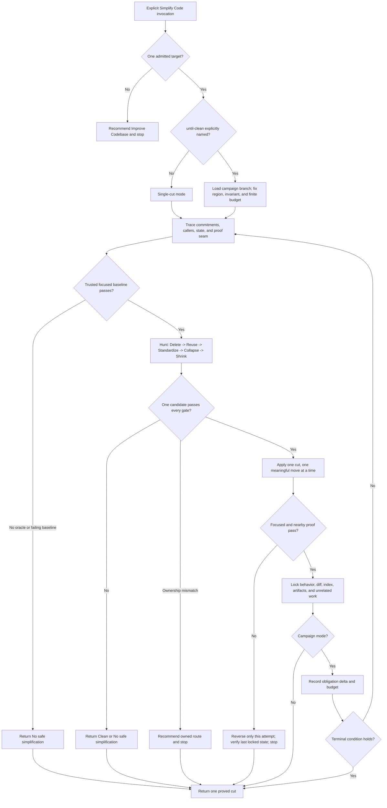

# Simplify Code Runtime Design Synthesis

Status: exhaustive design reference for a future rewrite, not an executable contract.

Runtime authority remains in:

- `skills/custom/simplify-code/SKILL.md` and `agents/openai.yaml`;
- `docs/agents/engineering-contract.md` and the target repository's domain, test, dependency, and contributor contracts;
- the selected `$improve-codebase` report candidate when that pickup form is used;
- the current worktree, index, callers, entry points, configuration, and proof lanes;
- `docs/synthesis/skill-context-relationships.md`, the caller and routing skills at their owned boundaries, pack tests, and behavior evaluations; and
- the installed mirror at `C:\Users\steve\.agents\skills\simplify-code`.

The current canonical skill and installed mirror remain unchanged and byte-identical. This document specifies a future extraction that preserves the validated behavior while making cut identity, dirty-worktree safety, failed-attempt recovery, campaign termination, and branch-specific context loading more exact. None of the proposed behavior becomes runtime authority until the coordinated canonical rewrite passes structural and behavioral validation and the installed mirror is separately synchronized.

## How To Read This Document

This synthesis is exhaustive for accepted behavior, material alternatives, file ownership, and proof needed for a future rewrite. It is not a second checklist for running the current skill. It has four layers:

1. **Orientation** states the outcome, selected shape, vocabulary, and explanatory flow.
2. **Normative Design** is the sole authority for proposed runtime behavior and relationships.
3. **Evidence And Rationale** preserves validated evidence, deliberate non-changes, rejected machinery, and deferred hypotheses without creating rules.
4. **Extraction And Verification** places and proves the design without redefining it.

Change proposed behavior in Layer Two; explain it in Layer Three; place and prove it in Layer Four. The Normative Home Index assigns one authority to every behavior. The Runtime Ownership And Change Map owns file placement. The Staged Extraction Plan owns implementation order. The Staged Behavior-Evaluation Protocol owns proof mechanics. The Migration And Acceptance Matrix owns case coverage only. Correct any diagram, rationale, ownership row, or acceptance case that disagrees with its Layer Two owner.

| Question | Owning section |
| --- | --- |
| What outcome governs the rewrite? | [North Star](#north-star) and [Design Verdict](#design-verdict) |
| What exactly is a region, cut, obligation, or locked state? | [Runtime Vocabulary](#runtime-vocabulary) |
| How may the skill be reached and what does invocation authorize? | [Invocation And Admission](#invocation-and-admission) |
| Which target wins? | [Target Identity And Precedence](#target-identity-and-precedence) |
| Which mode and operation are legal now? | [Mode And Transition Contract](#mode-and-transition-contract) |
| What behavior and proof must exist before editing? | [Trace Contract](#trace-contract) and [Baseline And Oracle Contract](#baseline-and-oracle-contract) |
| How are simplifications found and selected? | [Hunt Ladder](#hunt-ladder), [Candidate Admission And Ordering](#candidate-admission-and-ordering), and [Complexity Accounting](#complexity-accounting) |
| How does one cut mutate safely? | [Cut Contract](#cut-contract) and [Attempt Recovery And Drift](#attempt-recovery-and-drift) |
| What proves and closes a cut? | [Proof Model](#proof-model) and [Lock Contract](#lock-contract) |
| How does `until-clean` converge? | [Until-Clean Campaign Contract](#until-clean-campaign-contract) and [Campaign Terminal Selection](#campaign-terminal-selection) |
| When is no edit the correct result? | [No-Safe-Simplification Verdict](#no-safe-simplification-verdict) |
| What must every run return? | [Return Contract](#return-contract) |
| Which skills own adjacent work? | [Relationship Ownership](#relationship-ownership) |
| What should load for each mode? | [Runtime Context Loading Contract](#runtime-context-loading-contract) |
| Where will the rewrite live and how will it be proved? | [Runtime Ownership And Change Map](#runtime-ownership-and-change-map), [Staged Extraction Plan](#staged-extraction-plan), and [Migration And Acceptance Matrix](#migration-and-acceptance-matrix) |

# Layer One: Orientation

## North Star

Simplify Code owns one outcome: reduce total maintenance complexity inside one bounded existing-code region while preserving its accepted behavior and every commitment, with before-and-after semantic proof and no unauthorized state change.

The terminal result is exactly one of:

1. one proved, unstaged simplification cut;
2. one finite, serial, explicitly requested `until-clean` campaign containing zero or more proved cuts; or
3. one fully accounted **No safe simplification** verdict with no production edit.

Smaller output is not the goal. A cut is successful only when concepts, branch families, duplicated decisions, coordination, indirection, file responsibilities, or dependencies decrease without moving equal or greater burden into callers, tests, configuration, operations, or future maintainers.

Behavior preservation, commitment boundaries, proof, dirty-worktree safety, exact index preservation, unrelated-work preservation, and finite campaign termination are gates. They are never exchanged for fewer lines or a cleaner-looking diff.

## Design Verdict

This table summarizes the selected extraction. It points to Layer Two and creates no runtime rules.

| Stratum | Selected shape | Rewrite status |
| --- | --- | --- |
| Core | One explicit-only skill with `Trace -> Baseline -> Hunt -> Choose -> Cut -> Prove -> Lock` as the universal serial spine | Preserve and sharpen in the future rewrite |
| Default mode | One coherent cut in one bounded region, or a no-safe-cut verdict | Preserve |
| Campaign mode | `until-clean` only when explicitly named; finite budget, monotonic obligation ledger, full Hunt, and one terminal stop | Preserve validated behavior and disclose behind one sharp pointer |
| Proof | Current working state is the preservation baseline; one meaningful caller-facing seam must pass before and after every cut | Preserve and make artifact roles explicit |
| Dirty-worktree recovery | Record the last locked state and the invocation's own attempted delta; reverse only that delta after a failed attempt and verify the locked state | Sharpen before promotion |
| Runtime surfaces | Compact `SKILL.md`, one new `UNTIL-CLEAN.md`, existing `agents/openai.yaml`, coordinated relationships, tests, evaluations, and installed mirror | Proposed extraction |
| Deliberate non-changes | No dependency addition, no staging or commits, no tracker or external mutation, no automatic broad survey, no architectural redesign, no code-golf score | Preserve |
| Deferred machinery | Automated complexity scoring, a snapshot helper, language-specific native catalogs, and multi-region campaigns | Excluded until evidence justifies them |

## Delivery Boundary

Simplify Code performs bounded delivery. It is neither an improvement survey nor a design, bug-fix, feature, or review owner.

```text
Skill Router or human ---------------------------> Simplify Code
TDD GREEN residual ------------------------------> Simplify Code
Improve Codebase selected Eliminate candidate ---> Simplify Code

Simplify Code -- wide discovery or sequencing ---> Improve Codebase and stop
Simplify Code -- new interface or ownership -----> Codebase Design and stop
Simplify Code -- feature, bug, contract, review --> return mismatch unchanged
```

An `$improve-codebase` pickup carries a verified candidate into delivery; Simplify Code does not resurvey or re-rank the repository. A current-diff pickup preserves the worktree state that existed at invocation; it does not reinterpret pre-existing edits as disposable. A successful result remains unstaged and returns to its caller or human owner. It does not automatically invoke review, commit, tracker closeout, or another delivery skill.

## Leading-Word Runtime Model

The future runtime should expose this compact spine:

| Leading word | Runtime meaning |
| --- | --- |
| **Trace** | Establish target identity, commitments, callers, entry paths, work state, proof seam, and authority before mutation |
| **Baseline** | Observe the smallest trusted proof against the exact current state and establish the last locked state |
| **Hunt** | Search the whole bounded region through Delete, Reuse, Standardize, Collapse, and Shrink in order |
| **Choose** | Admit one coherent candidate only when behavior, proof, net reduction, scope, and sequence all hold |
| **Cut** | Apply one reviewable simplification and only its change-created fallout |
| **Prove** | Re-run the focused seam after each meaningful move, then widen proportionately |
| **Lock** | Reconcile behavior, diff, artifacts, index, unrelated work, and residual risk at the authorized boundary |

**Reconcile** is universal: refresh relevant work state before mutation, after any user interaction or external wait, after proof, before recovery, and before Return. Stop on unexplained drift rather than overwriting current state.

## Runtime Vocabulary

Engineering-contract terms such as Source Trace, bounded slice, commitment boundary, proof seam, semantic proof, change-created fallout, residual risk, and Lock retain their shared meanings. Simplify Code adds only these local terms:

| Term | Meaning |
| --- | --- |
| **Target** | The one admitted pickup identity: verified report candidate, user-named region, or one coherent current diff |
| **Region** | The smallest explicit file, symbol, module, coherent diff, or coherent subsystem boundary that contains the target behavior and the directly necessary proof support |
| **Current-state baseline** | The exact worktree and index state at invocation, including pre-existing dirty and untracked work; behavior is preserved from this state, not reconstructed from `HEAD` |
| **Cut** | One coherent, reviewable transformation that removes at least one named maintenance obligation, preserves the commitment boundary, and reaches Lock as a unit |
| **Meaningful move** | One reversible edit step inside a cut after which the focused proof can be rerun; multiple mechanical moves may compose one cut but never hide independent simplifications |
| **Maintenance obligation** | A concept, branch family, duplicated decision, coordination step, indirection layer, file responsibility, or dependency a maintainer must understand or keep synchronized |
| **Attempt** | The edits after the last locked state and before the next Lock; a failed attempt never becomes a cut |
| **Last locked state** | The exact in-scope bytes, proof result, work-state evidence, and index snapshot after Baseline or the most recent successful Lock |
| **Residual candidate** | A still-eligible simplification identified but not attempted because mode, budget, sequence, authority, proof, or boundary ended the run |
| **Clean** | One complete current-state Hunt finds no candidate that passes every Choose gate and removes a maintenance obligation |

## End-To-End Explanatory Flow



The diagram is explanatory. Layer Two owns target precedence, mode legality, proof, recovery, terminal selection, and Return.

# Layer Two: Normative Design

## Normative Home Index

This index assigns every proposed concern one authority. The named section owns the rule; this index and every other layer may point to or test it but never redefine it.

| Concern | Sole normative home |
| --- | --- |
| Explicit reach, mutation permission, and admissible outcomes | [Invocation And Admission](#invocation-and-admission) |
| Target identity and precedence | [Target Identity And Precedence](#target-identity-and-precedence) |
| Preserved commitments and forbidden mutation | [Authority And Commitment Boundary](#authority-and-commitment-boundary) |
| Artifact roles and baseline identity | [Work-State And Artifact Authority](#work-state-and-artifact-authority) |
| Legal mode, operation, and terminal movement | [Mode And Transition Contract](#mode-and-transition-contract) |
| Required inspection before proof | [Trace Contract](#trace-contract) |
| Baseline adequacy and characterization authority | [Baseline And Oracle Contract](#baseline-and-oracle-contract) |
| Simplification search order | [Hunt Ladder](#hunt-ladder) |
| Candidate gates and tie-breaking | [Candidate Admission And Ordering](#candidate-admission-and-ordering) |
| Net-reduction judgment | [Complexity Accounting](#complexity-accounting) |
| Edit shape and fallout | [Cut Contract](#cut-contract) |
| Focused and widened evidence | [Proof Model](#proof-model) |
| Per-cut completion | [Lock Contract](#lock-contract) |
| Campaign fields, iteration, and monotonic progress | [Until-Clean Campaign Contract](#until-clean-campaign-contract) |
| Campaign terminal classification | [Campaign Terminal Selection](#campaign-terminal-selection) |
| Safe reversal and concurrent drift | [Attempt Recovery And Drift](#attempt-recovery-and-drift) |
| No-edit success | [No-Safe-Simplification Verdict](#no-safe-simplification-verdict) |
| External result packet | [Return Contract](#return-contract) |
| Cross-skill triggers and stop boundaries | [Relationship Ownership](#relationship-ownership) |
| Branch-specific references and attention exclusions | [Runtime Context Loading Contract](#runtime-context-loading-contract) |
| Whole-run completion | [Completion Contract](#completion-contract) |

## Invocation And Admission

Simplify Code remains explicit-only. `agents/openai.yaml` records `policy.allow_implicit_invocation: false`. A human may name `$simplify-code` directly; Skill Router, TDD, and Improve Codebase may recommend an exact later pickup and stop. No caller automatically invokes it.

Explicit invocation authorizes local unstaged edits for one simplification region and narrowly necessary caller-facing proof support. It does not authorize staging, commits, branches, tracker mutation, network or external-system mutation, dependency addition, public-contract change, feature work, bug fixing, or architectural redesign.

Admission requires one bounded target and one of two modes:

- **single-cut** by default; or
- **until-clean** only when the invocation literally requests it and names one bounded region.

An unbounded cleanup request is not silently narrowed into a whole-tree campaign. Recommend `$improve-codebase` for discovery and sequencing, or return the exact missing target when the caller already owns selection.

## Target Identity And Precedence

Resolve exactly one target in this order:

1. `$simplify-code Candidate N from <absolute-report-path>`: load that stable candidate from a verified `$improve-codebase` report.
2. A user-named file, symbol, module, coherent diff, or coherent subsystem region.
3. The current diff, but only when it is one coherent region with one preservation boundary.

For a report pickup, verify the report path, stable candidate identity, surveyed region, Source Trace, `Eliminate` disposition, elimination target, behavior and commitment boundary, proof seam, risk, and sequence relationship against current state. Return to `$improve-codebase` unchanged when the packet is incomplete, stale, no longer `Eliminate`, blocked by sequence, or `Absorbed` by another candidate. Do not resurvey or re-rank.

For a user target, tighten only to the smallest coherent region that preserves the named intent; do not substitute a different improvement. For a current-diff target, treat the invocation-time diff as accepted starting state, not as edits owned by this invocation. An empty, broad, or incoherent current diff is no target.

Target identity is fixed before production mutation. Widening to another region, behavior, or independent simplification requires a new invocation or the owning survey/design route.

## Authority And Commitment Boundary

Preserve:

- product intent, acceptance criteria, public and data contracts, and user-visible behavior;
- domain language and ADR decisions;
- trust-boundary validation, data-loss prevention, security and privacy controls;
- accessibility, concurrency, durability, ordering, timing, and required compatibility;
- correct behavior tests and the target repository's supported entry paths; and
- pre-existing worktree, index, tracker, external, branch, and unrelated state.

Technique may change only inside the admitted region. A simplification may remove a compatibility path only when authoritative support policy says it is expired and operational reference plus entry-point evidence proves no required use remains.

Never add a dependency. Remove one only when repository-wide source, generated-code, reflection, registration, configuration, plugin, script, packaging, and runtime-entry evidence proves no use remains; then reconcile the manifest, lockfile, license or notice surface, and repository-owned install proof inside the same cut.

Line count, file count, novelty, style preference, or a plausible cleanup story never overrides a commitment.

## Work-State And Artifact Authority

| Artifact or source | Owns | Cannot prove or authorize |
| --- | --- | --- |
| User request and admitted pickup | Target, mode, mutation boundary, explicit budget, and user-owned commitments | Current code behavior or proof success |
| Repository instructions, domain source, ADRs, and public contracts | Accepted language, support, invariants, commands, and commitment boundary | That the current implementation satisfies them |
| Current worktree at Trace | Preservation baseline, including pre-existing dirty and untracked state | Which dirty edits this invocation owns |
| `git ls-files --stage` plus `git diff --cached --binary` snapshot | Exact index identity | Unstaged or untracked preservation |
| Worktree inventory, relevant diff, file fingerprints, and starting ref | Current target bytes, unrelated-state evidence, and drift comparison | Semantic correctness by themselves |
| Verified Improve Codebase candidate | Survey identity, evidence, disposition, sequence, and intended elimination | Current admissibility after drift or delivery proof |
| Focused proof lane | Behavior at one named proof seam | Broader repository correctness |
| Nearby and canonical checks | Their configured scopes | Unrun behavior or semantic meaning absent an adequate seam |
| Attempt record | Edits owned since the last locked state and the exact inverse needed for safe recovery | Permission to overwrite concurrent or pre-existing edits |
| Return packet | Result, evidence, residual risk, and stop reason | Staging, commit, tracker closeout, review acceptance, or downstream execution |

The current-state baseline is authoritative for preservation. `HEAD` supplies history and comparison context but never licenses discarding pre-existing work. Status text alone is not index proof, and line deletion alone is not semantic proof.

## Mode And Transition Contract

This table is the sole authority for legal movement. Completion evidence comes from the sections named in the Normative Home Index.

| Observed condition | Legal operation or terminal branch | Illegal shortcut |
| --- | --- | --- |
| No target admitted | Recommend the owning selection route and stop | Whole-tree scan or guessed target |
| Target admitted, mode unresolved | Select single-cut unless explicit `until-clean` plus named region is present | Entering campaign mode from words such as clean up, simplify more, or keep going |
| Trace incomplete or state drifted | Trace or Reconcile | Baseline, Hunt, or mutation from stale state |
| No trusted focused proof has passed on current state | Baseline | Production edit or assumption that broad green history is enough |
| Baseline passes and no attempt is active | Hunt, then Choose | Selecting from intuition before all earlier Hunt rungs are accounted |
| One candidate passes every Choose gate | Cut one meaningful move at a time | Batching independent cuts or starting another candidate |
| Attempt is active | Prove after each meaningful move | Continuing behind a failed focused proof |
| All required proof passes | Lock | Counting a cut before reconciliation |
| Attempt proof fails | Recover the attempt to the last locked state and stop | Retrying, weakening proof, or restoring from `HEAD` |
| Single-cut Lock completes | Return single-cut complete | Starting another cut |
| Campaign Lock completes | Record progress and budget, then adjudicate terminal state | Resetting budget or skipping ledger reconciliation |
| Campaign remains nonterminal | Re-run the full serial cycle from Trace | Continuing from stale Hunt results |
| No candidate passes Choose before any production edit | Return No safe simplification or campaign Clean, as applicable | Clarity-only edits to avoid a no-change result |
| Ownership or commitment mismatch appears | Recommend the one owning route or return exact unresolved need; stop unchanged | Expanding Simplify Code into design, diagnosis, feature, or review work |

## Trace Contract

Before Baseline:

1. Read repository instructions and routed engineering and domain sources.
2. Capture starting ref, `git status --short`, relevant unstaged and untracked state, and the target diff without disturbing it.
3. Snapshot `git ls-files --stage` and `git diff --cached --binary` for exact Lock comparison.
4. Resolve the target under Target Identity And Precedence.
5. Trace observable behavior through direct callers and callees, public entry points, tests, configuration, generated or reflected registration, persistence or state branches, and nearby equivalents.
6. Derive preserved behavior from caller-visible contracts and independent evidence, not from the implementation alone.
7. Name the proof seam, focused command, compatibility bounds, high-risk branches, and expected changed paths.

Trace is complete only when the whole bounded region and every operational path capable of invalidating the proposed cut are accounted. Search is repository-wide when proving that a reference, entry path, configuration key, or dependency is unused, even though mutation stays local.

If Trace reveals one new interface or ownership decision, recommend `$codebase-design` and stop. If it reveals wide discovery, ranking, or multi-region sequencing, recommend `$improve-codebase` and stop. Return other ownership mismatches unchanged with the exact unresolved need.

## Baseline And Oracle Contract

Run the smallest trusted focused proof against the exact current-state baseline before production edits. It must distinguish the behavior being preserved through a caller-facing or otherwise observable seam; import, parse, compile, snapshot existence, or successful exit is inadequate when it cannot detect semantic drift.

The baseline must pass. A known or newly observed failing focused proof is not a simplification baseline and Simplify Code does not fix it. Return the exact failure and the owning diagnosis or implementation need without production mutation.

When no focused proof exists, add the smallest characterization only when all conditions hold:

- an independent oracle follows from an authoritative contract, accepted fixture, public behavior, or invariant;
- the assertion can fail for a behavior-changing candidate;
- the test observes the starting implementation pass;
- it introduces no production test hook or new public commitment; and
- the test itself remains inside the authorized proof-support boundary.

When behavior is ambiguous, the oracle is implementation-derived, or no meaningful seam can distinguish preservation, return **No safe simplification** with the exact proof gap.

## Hunt Ladder

Hunt the complete bounded region in this order. An earlier rung outranks every later rung that could address the same obligation.

1. **Delete.** Remove unreachable code, expired compatibility, speculative branches, dead flags, unused configuration, or unused dependencies only after reference and operational entry evidence proves the cut.
2. **Reuse.** Replace a local reimplementation with an existing project-owned helper, type, policy, decision, or pattern whose full semantics and compatibility match.
3. **Standardize. Native-first.** Search in order: standard library, language, or runtime; browser, database, framework, or platform; already-installed dependency. Use the first semantic match whose compatibility and edge behavior hold.
4. **Collapse.** Inline pass-through wrappers, single-product factories, one-implementation abstractions, and layers without an earning boundary. Consolidate duplicated decisions at their narrowest existing owner.
5. **Shrink.** Reduce branching, temporary state, and data movement with ordinary readable constructs while preserving edge cases.

Account every rung until the first rung with at least one admissible candidate. Do not continue to later rungs to find a smaller diff or more novel technique. Within the winning rung, compare credible candidates under Candidate Admission And Ordering. Record credible rejections; exhaustive does not mean inventing implausible alternatives.

## Candidate Admission And Ordering

Admit one candidate only when:

- preserved behavior, commitment boundary, target obligation, and proof seam are explicit;
- the change is one coherent reviewable cut inside the fixed region;
- total caller and maintainer burden strictly decreases under Complexity Accounting;
- no speculative abstraction, dependency addition, new interface, new ownership decision, or new commitment is required;
- report sequencing and overlap allow work now;
- the expected benefit is stated as an obligation removed, not a fabricated productivity or savings baseline; and
- the attempt can be reversed without touching pre-existing or concurrent work.

Within the first Hunt rung that holds, prefer the candidate that removes the greatest consequential obligation with the smallest proof and coordination surface. When two candidates remove the same obligation, prefer locality, ordinary constructs, existing ownership, and stronger proof over fewer lines.

When every candidate fails, use the No-Safe-Simplification Verdict. Do not create a weak candidate merely to produce a patch.

## Complexity Accounting

Judge net reduction across these dimensions:

```text
concepts
branch families and state transitions
duplicated decisions and synchronization points
coordination between modules, files, actors, or systems
indirection and ownership hops
data transformations and movement
file responsibilities and configuration surfaces
dependencies and operational requirements
caller burden, test burden, and compatibility burden
```

A cut removes a maintenance obligation only when future understanding or coordinated change no longer requires it. Moving a branch into a caller, hiding state behind a generic helper, replacing explicit behavior with reflection, or deleting a test while leaving its behavior unproved transfers the obligation rather than removing it.

Line, file, branch, or dependency counts are descriptive receipts after semantic judgment. Renaming, formatting, expression shortening, subjective polish, and code golf are not progress units by themselves. A slightly larger local implementation may still be simpler when it eliminates a wider coordination or compatibility obligation; the Return must name that trade-off explicitly.

## Cut Contract

Apply one admitted cut as a sequence of meaningful moves:

1. Refresh the files and work state to be mutated; stop on unexplained drift.
2. Record the last locked in-scope bytes or reversible delta and the exact expected changed paths.
3. Make one meaningful move.
4. Remove only fallout created by that move: unused imports, helpers, files, configuration, manifest entries, and implementation-detail tests superseded by stronger behavioral proof.
5. Run the focused proof before the next meaningful move.
6. Continue only while every move belongs to the same cut and proof stays green.

Preserve correct behavior tests and pre-existing dead work outside the slice. Do not stage. Do not use broad formatters or generators unless they are the repository-owned proof lane and their output is both expected and in scope.

Keep the result ordinary and readable. Retain one concise constraint comment only when a non-obvious external or compatibility ceiling prevents a locally tempting simplification; name that ceiling and a concrete revisit trigger. Commentary that narrates the code is fallout, not clarification.

## Proof Model

Proof widens in three levels:

| Level | Required evidence | Claim limit |
| --- | --- | --- |
| Focused | The same trusted caller-facing proof passes before the first production edit and after every meaningful move | Preserved behavior at the named seam |
| Nearby | The nearest relevant test group covers callers, edge branches, integration, and configuration affected by the cut | The configured nearby scope |
| Repository | Canonical checks required by repository instructions and proportionate to risk; dependency cuts include install or lockfile integrity | Only the commands actually run |

Stateful behavior uses the engineering contract's state-boundary matrix. Dependency, validation, enforcement, or registration cuts include a negative control when the new shape would otherwise pass trivially. Trust-boundary, security, accessibility, concurrency, durability, compatibility, and data-loss claims require their own representative branches.

Compare final behavior and state with the current-state baseline. Exact reductions are receipts, never correctness proof. Name every skipped broader check and its residual risk; never extrapolate a focused pass into whole-repository correctness.

## Lock Contract

One cut reaches Lock only when:

- focused proof passed before mutation and after every meaningful move;
- nearby and proportionate repository checks passed or each skip is named;
- the final diff is one admitted cut plus narrowly necessary proof support;
- commitments and caller-visible behavior remain intact;
- no correct assertion was weakened and no complexity was transferred at equal or greater scope;
- change-created fallout and invocation-created artifacts are reconciled;
- expected changed paths match actual changed paths;
- unrelated and pre-existing work remains intact;
- current staged entries and cached binary diff exactly match the Trace snapshots; and
- separate Spec and Standards self-review finds no unresolved in-scope issue.

After the last proof command, refresh worktree status. A campaign cut is counted and entered in the progress ledger only after Lock. A single-cut run returns after this Lock.

## Until-Clean Campaign Contract

Enter this branch only for explicit `until-clean` plus one named region. Before the first edit, persist in the run record:

| Field | Contract |
| --- | --- |
| **Region** | One file, symbol, module, or coherent subsystem boundary; target behavior and proof seam remain invariant across the campaign |
| **Budget** | User's explicit finite positive successful-cut limit, otherwise exactly `3`; never infer, extend, reset, or renew it |
| **Progress unit** | One named maintenance obligation removed without introducing an obligation of equal or greater scope |
| **Clean criterion** | A complete fresh Hunt accounts for all five rungs and finds no candidate passing every Choose gate and removing a progress unit |
| **Progress ledger** | For each locked cut: identity, Hunt rung, removed obligation, introduced obligation, proof, paths, budget used and remaining |

The campaign is serial. After each Lock:

1. append the cut and obligation delta;
2. prove strict net reduction against all prior ledger entries;
3. decrement remaining budget exactly once;
4. treat that Lock as the new current-state baseline;
5. rerun the full Trace, Baseline, Hunt, Choose, Cut, Prove, Lock cycle if no terminal condition holds.

A later cut may revisit a file or path only for a different recorded obligation. It must not recreate, undo, hide, or trade an earlier removal for an equivalent obligation. Failed attempts do not consume a successful-cut unit because they never reach Lock, but they terminate the campaign.

When the budget reaches zero, perform only the read-only Hunt needed to distinguish Clean from Budget exhausted and to name residual eligible candidates. No further Cut is authorized. Continuation requires a new explicit invocation and new finite budget; the old ledger remains evidence and the budget never resets implicitly.

## Campaign Terminal Selection

After Baseline, after every Lock, and after any failed attempt or boundary event, select the first condition whose evidence holds:

| Terminal | Passing evidence | Required result |
| --- | --- | --- |
| **Clean** | One complete current-state Hunt finds no candidate passing every Choose gate and removing a progress unit | Return all locked cuts and no eligible residual |
| **Budget exhausted** | Remaining successful-cut budget is zero and a read-only Hunt finds at least one eligible residual | Return residuals; require new invocation and budget |
| **Diminishing return** | Strongest remaining move removes no maintenance obligation or changes presentation only | Return the rejected move and accounting |
| **Oscillation** | Proposed move recreates, undoes, hides, or equivalently trades an obligation in the ledger | Return the conflicting ledger entries |
| **Failed cut** | Focused or required nearby proof fails during one attempt | Recover exactly that attempt to the last locked state; return failure; no retry |
| **Boundary stop** | Next move changes behavior or commitment, needs design or multi-region sequencing, lacks proof, leaves region, is absorbed, loses authority, or meets unexplained drift | Return exact boundary and owning next route or evidence need |

Clean outranks Budget exhausted because a zero-budget campaign with no eligible work is semantically clean. Failed cut and drift stop immediately once observed; later hypothetical candidates do not override them. Every terminal includes budget used and remaining, ledger, residuals, and exact stop reason.

## Attempt Recovery And Drift

Before each attempt, record enough evidence to reverse only edits made after the last Lock. The implementation may use an in-memory inverse patch, a narrowly scoped disposable snapshot, or an eventual validated helper; the contract is invariant:

- identify exact in-scope paths and byte identities at the last Lock;
- identify the attempt's own delta separately from pre-existing work;
- refresh before reversal;
- reverse only when current bytes still match the known attempted state;
- never use broad `git restore`, checkout, reset, or whole-file overwrite against a pre-dirty path;
- verify restored in-scope bytes, proof result, worktree inventory, and exact index snapshot against the last Lock; and
- remove any recovery artifact created by the invocation.

If state changed concurrently or the attempt cannot be isolated safely, stop without destructive recovery, report the exact paths and evidence, and ask the work owner to reconcile. Do not trade unrelated-work safety for an apparently clean rollback.

After user feedback, an external wait, or any observed filesystem change, reread every in-scope file before further mutation. Candidate invalidation, sequence drift, report drift, new callers, or changed contracts returns to Trace. Drift outside the region is a boundary stop when it affects proof, ownership, or safe recovery; unrelated stable dirty work is preserved and does not itself block the run.

## No-Safe-Simplification Verdict

**No safe simplification** is a successful no-edit terminal when the bounded region has been accounted and one of these holds:

- no candidate passes every Choose gate;
- no independent meaningful proof seam exists;
- the current focused baseline fails;
- every apparent reduction transfers equal or greater burden;
- every candidate would change behavior or a commitment;
- only naming, formatting, line count, code golf, or subjective polish remains; or
- safe attempt recovery cannot be established before mutation.

Return the accounted region, Source Trace, proof or proof gap, credible candidates and rejection reasons, changed paths `none`, exact index-preservation evidence, and residual or owning next action. A no-safe verdict is not Clean unless an `until-clean` campaign also satisfies the complete Hunt criterion.

## Return Contract

Every invocation returns one packet:

```text
Mode: <single-cut | until-clean>
Target: <pickup identity and bounded region>
Campaign: <invariant seam; budget total, used, remaining | n/a>
Result: <cut(s) | No safe simplification>
Why simpler: <removed obligation(s) and any introduced burden>
Progress ledger: <cut -> rung -> removed -> introduced -> proof | n/a>
Preserved behavior: <commitment boundary and observable seam>
Proof: <before and after commands and results for every cut>
Changed paths: <paths | none>
Index preservation: <exact comparison result>
Rejected or deferred: <candidate, rung, and reason | none>
Residual eligible candidates: <ordered residuals | none>
Stop reason: <single cut complete | campaign terminal | no safe cut | ownership mismatch>
Residual risk: <skipped proof, drift, or uncertainty | none>
Next owner: <recommendation and stop | none>
```

The packet reports exact evidence from current state. It does not claim review acceptance, commit identity, tracker state, universal productivity gain, or downstream execution.

## Relationship Ownership

| Other owner | Relationship | Trigger or packet | Return boundary |
| --- | --- | --- | --- |
| Human | Invoke | Names Simplify Code and one admissible target; explicitly names `until-clean` for campaign mode | Receives one unstaged cut, campaign result, or no-safe verdict |
| `$skill-router` | Recommend and stop | One bounded existing-code region has a high-value behavior-preserving reduction | Later human invocation; Router never starts delivery |
| `$tdd` | Recommend and stop | GREEN work exposes settled bounded cleanup outside the tracer bullet | Simplify Code owns independent cleanup proof; TDD does not widen its slice |
| `$improve-codebase` | Recommend and stop | Verified selected candidate is `Eliminate` and returns exact pickup | Simplify Code verifies delivery identity; stale, absorbed, or reclassified pickup returns unchanged |
| `$improve-codebase` | Receive recommendation and stop | Simplify Code discovers wide ranking, multi-region sequencing, or no bounded target | New survey is a separate explicit invocation |
| `$codebase-design` | Receive recommendation and stop | Best move needs one new interface, seam, dependency direction, or ownership decision | Design does not occur inside simplification |
| Domain and engineering docs | Load | Trace requires accepted language, commitments, proof, and work-state policy | Remain authoritative; Simplify Code writes no domain truth |
| Review skills | No automatic relationship | A human or delivery caller may later review the returned diff | Simplify Code does not invoke review or consume findings |
| Git, tracker, external, deployment owners | Excluded mutation | Any requested stage, commit, branch, tracker, push, send, or deploy action | Return exact authority mismatch unchanged |

Simplify Code does not invoke Wayfinder, TDD, Implement, Parallel Implement, Diagnosing Bugs, Review, or Convergent PR Review. When an unexpected bug or contract mismatch is discovered, it returns the symptom and unresolved ownership need; the caller or Skill Router selects the next explicit route.

## Runtime Context Loading Contract

The future root skill loads universal behavior only: outcome, boundary, target precedence, mode selection, Trace through Lock, no-safe verdict, Return, and completion.

| Observed invocation or state | Required context | Excluded context |
| --- | --- | --- |
| Any invocation | `SKILL.md`, repository instructions, routed engineering and domain context | Campaign branch, broad improvement-survey procedure, design procedure, review procedure |
| Explicit `until-clean` with named region | Read `UNTIL-CLEAN.md` completely before the first edit | No other campaign or orchestration reference |
| Improve Codebase pickup | Named report candidate and its referenced Source Trace/evidence | Whole report resurvey or unrelated candidates |
| Dependency-removal candidate | Repository-owned manifest, lock, packaging, runtime-entry, and install contracts needed to prove no use | Generic language ecosystem catalog |
| Stateful or trust-boundary candidate | Only the relevant state-boundary or security/privacy contracts and proof lanes | Unrelated repository subsystems |
| Failed attempt | Last locked state and attempt record | `HEAD` as restoration authority |

`UNTIL-CLEAN.md` owns only campaign fields, serial loop, progress ledger, budget, terminal selection, and campaign completion. It points to universal Trace through Lock rather than repeating them. If behavioral evaluation shows the pointer is missed, sharpen the trigger before pulling campaign procedure back into `SKILL.md`.

## Completion Contract

The run is complete only when target, region, callers, contracts, and proof seam are traced; the current-state baseline is known; trusted focused proof passed before and after every successful meaningful move; each changed path belongs to one authorized cut and proof support; complexity accounting demonstrates net reduction; nearby checks passed or skips are named; change-created fallout and invocation artifacts are reconciled; index and unrelated state match their snapshots; and the Return packet is complete.

An `until-clean` run additionally requires a fixed finite Campaign contract, one ledger entry per Lock, strict monotonic obligation reduction, exact budget accounting, one Campaign Terminal Selection row, and explicit residuals. A failed attempt completes only after safe restoration is verified or unsafe recovery is reported without destructive overwrite. A No-Safe-Simplification Verdict completes only after the whole bounded region and credible candidates are accounted with no production edit.

# Layer Three: Evidence And Rationale

## Why Obligations, Not Lines

Line count is attractive because it is mechanical, but it cannot distinguish deletion from burden transfer. The skill's validated direction already prioritizes concepts, branches, coordination, indirection, files, and dependencies. Naming maintenance obligations turns that preference into a reviewable unit without pretending complexity is a universal scalar.

The obligation ledger is especially important for `until-clean`: it makes progress monotonic, exposes oscillation, and stops formatting or equivalent trades from keeping the campaign alive. The model may still exercise judgment, but the judgment must name what no longer needs maintenance and what new burden appeared.

## Why The Current Worktree Is The Baseline

Simplify Code is intentionally useful in a pre-dirty repository and may select one coherent current diff. Therefore `HEAD` cannot be the preservation baseline or rollback authority. The current working state may include accepted user edits, untracked proof fixtures, or staged work unrelated to simplification.

Exact index snapshots protect the staged boundary. Relevant diff, file identity, and attempt records protect unstaged and untracked work. Semantic proof protects behavior. None substitutes for the others.

## Why The Ladder Is Ordered

Delete, Reuse, Standardize, Collapse, and Shrink are not five equal style suggestions. They order increasingly local reductions:

- deletion removes an obligation entirely;
- reuse removes a duplicate by joining an existing owner;
- standardization replaces custom behavior with a supported native owner;
- collapse removes an unearned local boundary; and
- shrink improves the remaining implementation only after stronger eliminations fail.

Continuing to later rungs after an earlier one holds encourages novelty and diff minimization over total simplification. Native-first ordering is similarly semantic: platform or already-present capability is valuable only when compatibility and edge behavior match.

## Why Explicit-Only And Serial

Simplification mutates accepted behavior without intending to change it. Human selection of the target and mode is valuable, so the cognitive cost of explicit-only reach is justified. Implicit invocation could turn ordinary maintenance, review, or bug work into unauthorized cleanup.

One cut at a time keeps proof causal and recovery bounded. Parallel or batched cuts obscure which move changed behavior and make obligation accounting non-monotonic. `until-clean` expands iteration count, not width or scope.

## Validated Evidence

The existing finite-convergence repair supplies the strongest direct evidence:

- five fresh-context controls using the pre-repair skill continued automatically into a fourth eligible cut;
- five candidate samples using the repaired contract stopped at the default three-cut budget;
- all five candidate samples returned the fourth cut as residual and required a new invocation and budget;
- focused, full, canonical-validation, installed-validation, and mirror-parity checks passed in that repair; and
- the transcript explicitly records that no multi-cut production campaign was executed, so production recovery behavior remains an evidence gap.

The current contract tests protect explicit-only invocation, one proved reduction or no-safe verdict, trusted before-and-after proof, exact index preservation, target precedence, report pickup, Hunt order, Native-first ordering, narrowest existing ownership, ceiling/revisit comments, finite campaign fields, default budget, strict net reduction, five-rung clean check, failed-cut stop, residual return, and relationship edges.

The core workflow evaluation covers dirty current-diff pickup, required validation preservation, report pickup, empty and incoherent targets, missing proof seams, interface decisions, readability-only candidates, default and user budgets, a tempting fourth cut, formatting residuals, oscillation, and failed proof. This is a behavior specification, not evidence that every case has fresh samples.

The Ponytail comparison supports only three adopted directions: Native-first ordering, consolidating decisions at the narrowest existing owner, and constraint comments with a ceiling and concrete revisit trigger. Generic laziness, YAGNI, one-line pressure, shortest-diff preference, persistent cleanup, and debt ledgers were rejected as weaker or unsafe.

At synthesis time, canonical and installed Simplify Code files are byte-identical. This proves mirror parity for the current runtime only; it does not prove the proposed rewrite.

## Deliberate Non-Changes

- Keep explicit-only invocation; do not make Simplify Code a background refactoring impulse.
- Keep one coherent target and the current precedence order.
- Keep before-and-after trusted focused proof as a hard gate.
- Keep the five Hunt rungs and Native-first order; add no style catalog.
- Keep one cut by default and a default campaign budget of three successful cuts.
- Keep exact index preservation and unstaged delivery.
- Keep characterization tests limited to independent caller-facing oracles.
- Keep no-safe simplification as a first-class successful result.
- Keep dependency addition forbidden and dependency removal repository-wide in evidence.
- Keep wide survey, interface design, bug resolution, feature work, review, commit, tracker, push, and external mutation with their owners.
- Keep prose receipts descriptive; do not claim universal time, quality, or productivity savings.

## Rejected Machinery

| Machinery | Reason rejected |
| --- | --- |
| Numeric complexity score | Hides burden transfer and invites gaming; obligations plus semantic proof are more inspectable |
| Line-removal target | Rewards code golf and can delete validation or push complexity outward |
| Automatic whole-repository cleanup | Violates target, proof, review, and finite-budget boundaries |
| Parallel cuts | Weakens causal proof, recovery, and monotonic accounting |
| Automatic continuation after budget | Recreates the non-convergent behavior already observed in controls |
| One file per Hunt rung | Adds context and maintenance surfaces without distinct invocation or branch behavior |
| Language/platform native catalog | Drifts rapidly and duplicates repository/toolchain authority |
| Persistent debt ledger | Expands a bounded delivery skill into survey and tracker ownership |
| Automatic downstream invocation | Violates explicit-only routing and mutation boundaries |

## Deferred Hypotheses

These are research questions, not runtime requirements:

- A tiny helper might capture and verify dirty-worktree attempt deltas more safely than prose, but it must prove untracked-file, concurrent-drift, binary-file, symlink, and cleanup behavior before adoption.
- Repeated production evidence might justify a different default successful-cut budget; current evidence supports three as a hard backstop, not as an optimal universal value.
- Some ecosystems may expose repository-owned unused-dependency or dead-code tools that can strengthen Delete evidence; load them only from repository authority.
- Behavior samples may show that `UNTIL-CLEAN.md` disclosure improves normal-path focus or that the pointer is missed. Test both before promotion.
- A compact structured Return renderer may reduce variance, but a helper is unwarranted until packet omissions are observed.

# Layer Four: Extraction And Verification

## Proposed Runtime Semantic Surface

The eventual `SKILL.md` should read approximately as:

```text
Outcome and explicit mutation boundary
Target precedence and two-mode selection
Trace -> Baseline -> Hunt -> Choose -> Cut -> Prove -> Lock
Current-state and exact-index authority
Five-rung Hunt and candidate gates
One-cut proof and recovery contract
Sharp until-clean pointer
No-safe verdict
Return packet
Completion
```

This is a semantic target, not approved final wording. Universal behavior and hard gates stay in `SKILL.md`. `UNTIL-CLEAN.md` carries only campaign-specific fields, iteration, budget, progress, terminal selection, and campaign completion. Rationale, exhaustive acceptance cases, historical evidence, and alternative machinery stay out of runtime files.

## Runtime Ownership And Change Map

This map alone owns file placement and the concrete migration delta. Layer Two owns behavior; the acceptance matrix tests it.

| Bundle | Surface | Owns | Proposed delta | Must not absorb |
| --- | --- | --- | --- | --- |
| `S1` | `skills/custom/simplify-code/SKILL.md` | Description; outcome; explicit mutation boundary; target precedence; mode selection; universal Trace through Lock; work-state authority; Hunt; candidate gates; no-safe verdict; Return; completion | Rewrite to the Proposed Runtime Semantic Surface; define cut identity, current-state baseline, proof levels, attempt recovery trigger, and one sharp campaign pointer | Full campaign branch, rationale, acceptance matrix, survey procedure, design procedure, review or Git delivery |
| `S1` | New `skills/custom/simplify-code/UNTIL-CLEAN.md` | Campaign fields, finite budget, progress ledger, serial repetition, terminal selection, residuals, and campaign completion | Extract accepted campaign behavior; point to universal steps without copying them; include failed-attempt and zero-budget adjudication | Universal Hunt wording, universal proof/Lock, worktree commands, broad cleanup, tracker ledger, or a second Return authority |
| `S1` | `skills/custom/simplify-code/agents/openai.yaml` | Human-facing metadata and invocation policy | Preserve explicit-only policy; sharpen default prompt only if needed to distinguish one cut from explicit `until-clean` | Runtime procedure or target-selection detail |
| `S2` | `docs/synthesis/skill-context-relationships.md` | Cross-skill relationships, ownership summary, shared context, and supporting-file inventory | Add `UNTIL-CLEAN.md`; preserve Router, TDD, Improve Codebase, and Codebase Design edges; clarify no automatic review/delivery edge if needed | Simplification procedure or duplicated campaign rules |
| `S2` | `skills/custom/skill-router`, `tdd/refactoring.md`, `improve-codebase/SELECTED-CANDIDATE.md`, their syntheses, and README | Their owned trigger, recommendation, exact pickup, and stop boundary | Change only if the accepted rewrite changes a trigger or packet; preserve current route semantics and exact Improve Codebase pickup | Simplify Code procedure, proof, recovery, or completion |
| `S2` | `docs/agents/engineering-contract.md` and domain routing | Shared Source Trace, commitment, proof, work-state, change-created fallout, and Lock vocabulary | No planned edit; verify the rewrite consumes rather than duplicates shared contracts | Skill-specific Hunt, budget, or Return procedure |
| `S3` | `tests/test_skill_pack_contracts.py` | Structural and relationship protection | Replace brittle prose snapshots where necessary; protect explicit policy, pointer, target order, Hunt order, proof gates, recovery safety, campaign contract, Return, and relationship edges | Claims that static checks prove runtime behavior |
| `S3` | `docs/validation/evals/core-workflows.md` and versioned transcripts | Positive and negative behavior specification plus fresh-context evidence | Split single-cut, dirty-state recovery, and campaign convergence cases into scored claims; add control/candidate hashes and production-simulation limits | Runtime rules or unsupported success claims |
| `S4` | Installed mirror `C:\Users\steve\.agents\skills\simplify-code` | Validated runtime copy | Synchronize only after canonical validation and behavioral promotion are authorized; verify file inventory and SHA-256 parity | Independent edits, partial installation, or authority over canonical source |

## Staged Extraction Plan

Implementation stages order the future rewrite; they are not independently installable.

| Stage | Bundles | Extraction outcome | Stage boundary |
| --- | --- | --- | --- |
| `I1` | `S1` | Build the complete canonical Simplify Code candidate with universal core, disclosed campaign branch, explicit policy, current-state safety, and Return | Every Layer Two concern has one runtime destination; references resolve; no behavior is intentionally deferred |
| `I2` | `S2` | Reconcile callers, Router, relationships, README, and shared-contract consumption | Every trigger and return boundary agrees; no foreign owner absorbs simplification procedure |
| `I3` | `S3` | Add structural protection, fixed behavior scenarios, controls, candidate samples, and promotion evidence | All positive and negative cases pass or a named residual blocks promotion |
| `I4` | `S4` | Run scoped installation and prove canonical/installed parity | Only after `I1` through `I3`, explicit synchronization authority, and clean read-back |

## Staged Behavior-Evaluation Protocol

Evaluation phases gate promotion, not partial installation.

| Phase | Claims proved | Representative coverage |
| --- | --- | --- |
| `E0`: Control lock | Current runtime or no-guidance arm exhibits the claimed failure under fixed state | Attempt recovery ambiguity, branch-loading attention, Return omissions, or any newly promoted behavior |
| `E1`: Entry and target | Explicit reach, target precedence, mode selection, report verification, and ownership stops are correct | Direct target, coherent diff, empty/broad diff, stale or absorbed report, implicit request, unbounded campaign |
| `E2`: Single cut | Trace, baseline, Hunt, Choose, Cut, proof, Lock, no-safe, and exact state preservation work together | Reuse/native/collapse candidates, trust-boundary neighbor, failing baseline, no oracle, dependency cut, pre-dirty index |
| `E3`: Campaign and recovery | Finite budget, monotonic ledger, full Hunt, terminal selection, residuals, failed attempt, and safe recovery converge | Default/user budgets, fourth cut, zero-budget clean, formatting residual, oscillation, proof failure, concurrent drift |
| `E4`: Integrated promotion | Relationships, canonical validation, repository tests, installation, and mirror parity agree | Exact Improve Codebase pickup, TDD/Router stops, supporting-file resolution, installed invocation |

For each promoted behavior claim, fix repository and worktree snapshot, prompt, target, pre-dirty state, staged state, proof commands, expected changed paths, model, reasoning tier, skill hash, tool access, and rubric across arms. Use at least five independent fresh-context samples per arm. Use the current installed skill as control for changed existing behavior and a no-candidate-guidance control for genuinely new behavior. Stop when the control does not exhibit the claimed failure.

Judge behavior, not phrase echo. Record target chosen, context loaded, callers traced, baseline proof, Hunt accounting, candidate and rejection reasons, attempted edits, proof sequence, rollback scope, final bytes, index identity, campaign budget, ledger, terminal, Return completeness, unauthorized mutation, protocol deviations, and residual gaps. Report median, range or variance, and worst observed result. Static tests protect structure only.

An evaluation phase passes only when the control demonstrates the failure, the candidate materially reduces it, variance narrows or remains acceptably bounded, and no new critical failure appears. Any behavior change, commitment loss, weakened correct assertion, unauthorized mutation, unrelated-work loss, index drift, destructive rollback, false Clean, budget extension, or false successful proof fails the phase regardless of averages.

## Migration And Acceptance Matrix

This matrix supplies cases and proof destinations. It creates no runtime rules or file-placement authority.

| Implementation / evaluation | Bundles | Claim and normative owner | Positive case | Negative control | Verification |
| --- | --- | --- | --- | --- | --- |
| `I1,I2 / E1` | `S1,S2` | [Invocation And Admission](#invocation-and-admission) | Explicit `$simplify-code` with one target enters single-cut; literal `until-clean` plus region enters campaign | Implicit cleanup, generic keep going, or unbounded whole-tree request mutates | Policy test and fresh-context route samples |
| `I1,I2 / E1` | `S1-S2` | [Target Identity And Precedence](#target-identity-and-precedence) | Verified report pickup wins, then user target, then one coherent current diff | Empty, broad, incoherent, stale, non-Eliminate, blocked, or Absorbed pickup is guessed or rescanned | Contract tests and target-selection samples |
| `I1 / E1,E2` | `S1` | [Authority And Commitment Boundary](#authority-and-commitment-boundary) | Validation, compatibility, accessibility, durability, security, and domain contracts survive | Shorter code drops a guard, changes behavior, adds a dependency, stages, commits, or mutates tracker/external state | Diff inspection, representative branch proof, and behavior samples |
| `I1 / E2` | `S1` | [Work-State And Artifact Authority](#work-state-and-artifact-authority) | Current dirty bytes and exact index snapshots remain authoritative | `HEAD`, status shape, report prose, or deleted lines substitute for current state or proof | Pre-dirty fixtures, binary cached diff comparison, and read-back |
| `I1 / E2` | `S1` | [Trace Contract](#trace-contract) | Direct and operational callers, entry points, config, tests, and nearby equivalents are traced | Implementation alone defines behavior or unused claims skip reflection/config/runtime entries | Fixed repository scenarios and evidence inventory |
| `I1 / E2` | `S1` | [Baseline And Oracle Contract](#baseline-and-oracle-contract) | Trusted caller-facing proof passes before edit; independent characterization may be added | Failing baseline is fixed, implementation-derived assertion is accepted, or compile/import success is called semantic proof | Before/after command log and negative oracle cases |
| `I1 / E2` | `S1` | [Hunt Ladder](#hunt-ladder) and [Candidate Admission And Ordering](#candidate-admission-and-ordering) | First admissible rung wins and best local candidate removes the greatest obligation under proof | Shrink outranks available Delete/Reuse/Native work or novelty/line count selects the cut | Ordered structural assertion plus fresh candidate-selection samples |
| `I1 / E2` | `S1` | [Complexity Accounting](#complexity-accounting) | Duplicated decision disappears at its narrowest owner without caller burden | Wrapper removal moves branches into callers, tests are deleted without proof, or formatting counts as progress | Obligation rubric and caller-diff inspection |
| `I1 / E2` | `S1` | [Cut Contract](#cut-contract) | One coherent cut proceeds by green meaningful moves and removes only change-created fallout | Independent cuts batch, broad formatter runs, correct assertion weakens, or pre-existing dead work is cleaned | Per-move proof log and changed-path read-back |
| `I1 / E2` | `S1` | [Proof Model](#proof-model) and [Lock Contract](#lock-contract) | Focused, nearby, and proportionate proof plus Spec/Standards review close one cut | Focused pass is extrapolated, state/security branch is skipped, artifacts remain, or index differs | Focused and canonical commands, diff checks, exact snapshots, and review rubric |
| `I1 / E2` | `S1` | [No-Safe-Simplification Verdict](#no-safe-simplification-verdict) | Missing oracle or equal-burden candidates return fully accounted no-edit result | Agent creates a cosmetic patch to avoid no-change or calls an unaccounted region clean | No-edit samples and changed-path/index read-back |
| `I1 / E3` | `S1` | [Until-Clean Campaign Contract](#until-clean-campaign-contract) | Explicit region uses user finite budget or default three, one Lock per ledger entry, strict net reduction | Budget is inferred, reset, renewed, decremented on failed attempt, or cuts run in parallel | Campaign structural tests and multi-cycle simulations |
| `I1 / E3` | `S1` | [Campaign Terminal Selection](#campaign-terminal-selection) | Clean, budget, diminishing, oscillation, failed cut, or boundary stop returns exact evidence and residuals | Fourth cut runs after default budget, formatting keeps campaign open, or failed proof retries | Existing five-sample convergence control plus new terminal fixtures |
| `I1 / E3` | `S1` | [Attempt Recovery And Drift](#attempt-recovery-and-drift) | Own attempted hunks reverse to last Lock while pre-existing dirty and staged work remains exact | `git restore`, reset, whole-file overwrite, or stale snapshot destroys user/concurrent edits | Dirty tracked/untracked/binary fixtures, injected drift, byte/hash and index comparison |
| `I1,I2 / E4` | `S1-S2` | [Relationship Ownership](#relationship-ownership) | Router/TDD/Improve recommend and stop; Simplify returns wide work to Improve and design to Codebase Design | Caller auto-invokes explicit skill; Simplify surveys, designs, reviews, commits, or starts downstream work | Relationship-map tests and fresh routing samples |
| `I1,I3 / E1-E4` | `S1,S3` | [Runtime Context Loading Contract](#runtime-context-loading-contract) | Single-cut loads universal core only; campaign loads one complete branch; report pickup loads one candidate | Every run preloads campaign/survey/design docs or campaign misses required branch | Reference-resolution tests and context inventories |
| `I1-I4 / E4` | `S1-S4` | [Runtime Ownership And Change Map](#runtime-ownership-and-change-map) | Canonical sources, callers, tests, evals, install preview, scoped sync, and hashes agree | Partial candidate, unresolved reference, unproved behavior, or source/mirror drift is promoted | Focused tests, full pytest, `scripts.validate_skills`, install dry-run, both diff checks, and SHA-256 parity |

## Promotion Gate And Residual Gaps

The promotion record names each claim, implementation stage, evaluation phase, control and candidate hashes, fixed scenarios, sample counts, tool and model conditions, rubric, median, variance or range, worst result, critical failures, unavailable telemetry, protocol deviations, and residual gaps.

Promote only the coordinated canonical family. A residual gap blocks promotion when it affects invocation, target identity, mutation authority, commitment preservation, current-state identity, proof adequacy, Hunt ordering, net reduction, attempt recovery, exact index preservation, campaign boundedness, terminal truth, Return completeness, relationship boundaries, or installed parity.

Critical failures block regardless of averages: behavior or commitment change; trust/security/accessibility/durability loss; dependency addition; correct-test weakening; staging, commit, tracker, push, or external mutation; unrelated or pre-existing work loss; broad destructive recovery; false proof; false Clean; silent budget extension; missing residual; automatic downstream execution; or installed partial promotion.

Noncritical uncertainty may remain only when named with its evidence limit, operational consequence, and future validation owner. Structural proxy and simulation remain labeled as such. The existing five-sample budget evidence supports finite convergence, but it does not close dirty-worktree production recovery; that claim needs its own red-capable control and fresh behavior evidence before promotion.

## Completion Criterion For The Future Rewrite

The rewrite is complete only when every Layer Two concern has one indexed runtime home; `SKILL.md` follows the Proposed Runtime Semantic Surface; `UNTIL-CLEAN.md` owns only the triggered campaign branch; target precedence, current-state authority, cut identity, Hunt order, proof, Lock, recovery, campaign monotonicity, terminal selection, and Return are discoverable and behaviorally proved; every ownership row is reconciled without duplicated procedure; every acceptance row passes its positive and negative cases under the listed evaluation phases; no critical worst-case regression or promotion-blocking residual remains; focused and full repository validation pass; installation is separately authorized; and the installed mirror matches the validated canonical source exactly.
