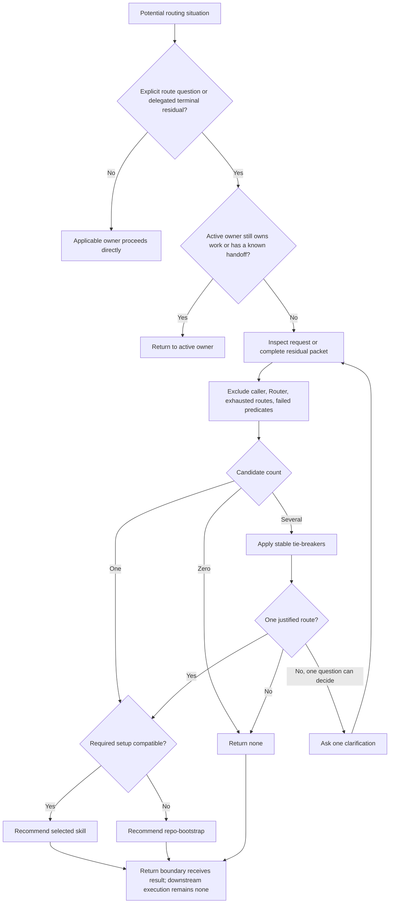

# Skill Router Residual Routing Synthesis

Status: design reference and extraction map. The implicit residual-router candidate is preserved under `skills/experimental/skill-router/`; custom and installed copies remain the explicit-only active control. Fresh-context behavior promotion and coordinated caller validation remain outstanding.

Runtime authority remains in:

- `skills/custom/skill-router/SKILL.md`;
- `skills/custom/skill-router/agents/openai.yaml`;
- each caller's owned workflow, handoffs, and terminal return contract;
- each destination skill's description, admission, authority, mutation, and completion contract;
- `GLOBAL_AGENTS_TEMPLATE_SKILL_PACK.md`, `CONTEXT.md`, and the installed global bootstrap at their owned boundaries;
- `docs/synthesis/skill-context-relationships.md` for the accepted relationship index;
- pack tests and behavior evaluations for structural and behavioral proof; and
- the installed mirror at `C:\Users\steve\.agents\skills\skill-router` only after promotion.

This synthesis specifies the complete design for a later Skill Router rewrite. It does not make the current candidate authoritative, authorize installed-mirror synchronization, or turn diagrams, route tables, rationale, and acceptance cases into competing runtime contracts.

## How To Read This Document

The synthesis has four layers:

1. **Orientation** states the outcome, selected design, vocabulary, and explanatory flow.
2. **Normative Design** is the sole authority for proposed runtime behavior and relationships.
3. **Evidence And Rationale** records the observed state, reasons, deliberate non-changes, and deferred questions without creating additional rules.
4. **Extraction And Verification** maps the design into owned surfaces and defines staged behavioral promotion.

| Question | Owning section |
| --- | --- |
| What outcome governs the rewrite? | [North Star](#north-star) |
| What design was selected? | [Design Verdict](#design-verdict) |
| Which terms and leading words have precise meanings? | [Routing Vocabulary](#routing-vocabulary) and [Leading-Word Runtime Model](#leading-word-runtime-model) |
| What may invoke the Router? | [Invocation And Admission](#invocation-and-admission) |
| What authority and mutation does it have? | [Authority And Mutation Boundary](#authority-and-mutation-boundary) |
| What must a caller return as residual work? | [Caller And Residual Packet Contract](#caller-and-residual-packet-contract) |
| How is one route chosen? | [Routing Spine](#routing-spine), [Preference And Tie-Breaker Contract](#preference-and-tie-breaker-contract), and [Exhaustive Route Taxonomy](#exhaustive-route-taxonomy) |
| When may Wayfinder be selected? | [Wayfinder Pre-Screen](#wayfinder-pre-screen) |
| How are cycles and automatic chains prevented? | [Loop And Idempotence Guards](#loop-and-idempotence-guards) |
| What context may the Router inspect? | [Runtime Context Loading Contract](#runtime-context-loading-contract) |
| What exactly does it return? | [Clarification, Return, And Completion](#clarification-return-and-completion) |
| Which current facts support the design? | [Observed Source And Runtime State](#observed-source-and-runtime-state) |
| Where does each future change belong? | [Runtime Ownership And Change Map](#runtime-ownership-and-change-map) |
| How is the rewrite promoted safely? | [Staged Behavior-Evaluation Protocol](#staged-behavior-evaluation-protocol), [Migration And Acceptance Matrix](#migration-and-acceptance-matrix), and [Promotion Gate And Residual Gaps](#promotion-gate-and-residual-gaps) |

When another layer disagrees with Normative Design, correct that layer. The route taxonomy owns Router-side selection predicates, destination skills own their admission and procedure, the ownership map places changes, the evaluation protocol owns proof quality, and the acceptance matrix owns case coverage. None may silently redefine another.

# Layer One: Orientation

## North Star

Skill Router owns one outcome: for an admitted route-selection request, return exactly one justified next skill or `none`, with its reason, precondition, and return boundary, while leaving downstream execution unstarted.

It reduces two kinds of route duplication without becoming a dispatcher:

- a human may ask one explicit next-skill question instead of remembering the complete pack; and
- an active skill may return genuinely terminal, unowned residual work without carrying a catalog of every other skill.

The Router succeeds by making the ownership decision small. It does not do the selected work, replace a direct contractual handoff, continue an active workflow, mutate repository or external state, or force a route where the pack has no owner.

## Design Verdict

Use a narrowly implicitly invocable **residual router**, not the previous explicit-only human index and not an automatic dispatcher.

| Design choice | Verdict | Reason |
| --- | --- | --- |
| Invocation policy | Implicitly invocable under a two-trigger description | An active skill must be able to invoke the Router for terminal unowned residuals; the description must remain too narrow to compete with ordinary skills |
| Human route requests | Admit only explicit next-skill selection requests | Asking what to do is routing; asking to do the work belongs directly to the applicable owner |
| Caller delegation | Admit only complete terminal residual packets | Difficulty, a temporary blocker, or unfinished in-scope work does not transfer ownership |
| Downstream action | Recommend one skill or `none`, then stop | Selection never grants execution or mutation authority |
| Known handoffs | Keep with the caller | Algorithmic handoffs carry owner-specific gates, packets, and return semantics |
| Route preference | Narrowest capable owner | A direct leaf closes one gap with less context and coordination than an orchestrator |
| Setup | `$repo-bootstrap` may preempt a provisional engineering route | A missing or outdated required setup surface makes the downstream route unsafe or inoperable |
| Ambiguity | At most one decisive clarification | The Router resolves ownership; it does not become an interview or planning workflow |
| No fit | Preserve `none` | A complete route system must represent work the pack does not own |
| Runtime form | One compact `SKILL.md` plus policy; no helper or persistent state | The decision is semantic, one-shot, read-only, and small enough to keep local unless evaluation proves otherwise |

The implicit policy changes the pack's current Router Skill vocabulary. That vocabulary must be reconciled during migration; leaving `CONTEXT.md`, the authoring glossary, bootstrap guidance, and invocation tests split between explicit-only and implicit meanings is not a valid promotion state.

## Routing Vocabulary

| Term | Meaning |
| --- | --- |
| **Route-selection request** | A user explicitly asks which skill should own the current situation, rather than asking the agent to perform the underlying work |
| **Active owner** | The skill currently responsible for the in-scope outcome, gates, mutation, and completion |
| **Owned handoff** | A caller-defined Load, Invoke, Compose, Hand off, or Recommend-and-stop relationship that is part of its algorithm |
| **Terminal residual** | Material work remaining only after the caller is complete, genuinely blocked at its authorized boundary, or has rejected the work as out of scope, and no owned handoff applies |
| **Residual packet** | The caller's compact account of owner result, remaining work, evidence, exclusions, prerequisites, authority, and return boundary |
| **Candidate route** | A pack skill whose observable ingress may own the admitted request |
| **Admission predicate** | A destination-owned condition that must remain plausible before the Router may recommend that destination |
| **Excluded route** | The Router, current owner, exhausted owner, rejected destination, or destination whose predicate fails on current evidence |
| **Material new evidence** | New facts that change an admission predicate, ownership boundary, precondition, or prior exclusion; repetition and elapsed time do not qualify |
| **Precondition** | A concrete setup, authority, state, or input gate that must be satisfied before the user or caller starts the selected skill |
| **Return boundary** | The human or caller that receives the recommendation and retains authority to start later work |
| **`none`** | The terminal result when admission fails, no pack skill is justified, or unresolved ambiguity cannot be reduced safely |

## Leading-Word Runtime Model

The eventual skill should use six leading words as one compact decision spine:

| Leading word | Runtime meaning |
| --- | --- |
| **Admit** | Prove one of the two invocation triggers and reject active in-scope work or an existing owned handoff |
| **Inspect** | Read only facts that could change ownership, exclusion, or a required precondition |
| **Exclude** | Remove illegal, exhausted, rejected, cyclic, and predicate-failing destinations |
| **Prefer** | Apply setup priority and the stable narrowest-owner tie-breakers |
| **Clarify** | Ask one question only when its answer will decide between the final materially plausible routes |
| **Return** | Emit one complete recommendation or `none` and stop before downstream execution |

These words are operational. Each maps to one completion condition in Layer Two; they are not ornamental headings.

## End-To-End Explanatory Flow



# Layer Two: Normative Design

## Normative Home Index

| Concern | Sole normative home |
| --- | --- |
| Valid invocation and admission failure | [Invocation And Admission](#invocation-and-admission) |
| Read, write, execution, and decision authority | [Authority And Mutation Boundary](#authority-and-mutation-boundary) |
| Caller eligibility and packet sufficiency | [Caller And Residual Packet Contract](#caller-and-residual-packet-contract) |
| One-shot state and legal next decision | [Routing State And Decision Contract](#routing-state-and-decision-contract) |
| Spine entry and completion | [Routing Spine](#routing-spine) |
| General precedence and ambiguity resolution | [Preference And Tie-Breaker Contract](#preference-and-tie-breaker-contract) |
| Router-side predicate for every pack destination | [Exhaustive Route Taxonomy](#exhaustive-route-taxonomy) |
| Wayfinder's provisional selection gate | [Wayfinder Pre-Screen](#wayfinder-pre-screen) |
| Cycle prevention and repeat behavior | [Loop And Idempotence Guards](#loop-and-idempotence-guards) |
| Context and repository inspection | [Runtime Context Loading Contract](#runtime-context-loading-contract) |
| Clarification, output schema, and terminal completion | [Clarification, Return, And Completion](#clarification-return-and-completion) |
| Cross-skill trigger and return edge | [Relationship Contract](#relationship-contract) |

## Invocation And Admission

Skill Router admits exactly two triggers:

1. **Explicit route request.** The user asks which skill should own the present situation or explicitly names `$skill-router` for route selection.
2. **Delegated terminal residual.** An active skill invokes `$skill-router` with a complete residual packet after its own terminal result and after determining that no owned handoff applies.

The following do not admit:

- an ordinary request to implement, diagnose, review, research, design, interview, plan, document, simplify, or otherwise perform work already owned by a directly applicable skill;
- a possible future task mentioned without a request for route selection;
- unfinished, difficult, slow, or temporarily waiting work inside the current owner's contract;
- a caller that has not reached its own terminal or explicit out-of-scope boundary;
- a known contractual handoff, return, or composer edge;
- a request to compare tools or approaches without choosing a pack owner; or
- an attempt to use the Router as a general fallback for uncertainty.

Admission failure causes no repository inspection beyond what is needed to recognize the owner and no downstream work. For a delegated residual, return `none` to the caller with the failed admission reason and required packet correction. For an ordinary direct request, leave selection to normal skill invocation rather than manufacturing a Router result.

## Authority And Mutation Boundary

Skill Router owns only coarse ownership selection and the Router-side pre-screen for that selection.

It may:

- read the request, residual packet, visible repository state, setup marker, current Git operation state, and candidate descriptions when those facts can change the route;
- exclude destinations using current evidence and destination-owned admission predicates;
- ask one decisive clarification under the contract below; and
- return one recommendation or `none`.

It may not:

- edit files, mutate Git, trackers, messages, external systems, or installed skills;
- claim work, run the destination procedure, or begin its setup;
- make a destination's user-reserved decision or bypass its admission gate;
- reinterpret an active owner's in-scope state, proof, completion, or known handoff;
- promise that the destination will accept the recommendation;
- create a plan, map, spec, ticket, patch, review, diagnosis, research note, questionnaire, or handoff artifact; or
- keep persistent routing state.

Destination skills remain authoritative for their own invocation, admission, authority, mutation, output, and completion. A recommendation is provisional until the user or receiving caller later starts that skill and it admits independently.

## Caller And Residual Packet Contract

A caller is eligible to delegate only when all are true:

1. it names itself as the current owner;
2. its result is `complete`, genuinely `blocked` at its authorized terminal boundary, or `rejected as out of scope`;
3. material residual work remains;
4. the residual is outside its remaining owned work;
5. no owned handoff applies; and
6. the caller will receive and surface the recommendation without starting it.

The minimum admissible packet is:

```text
Current owner:
Owner result: complete | blocked | rejected as out of scope
Original outcome:
Completed outcome and proof:
Residual work:
Available evidence and source pointers:
Attempted or exhausted owners:
Rejected or excluded routes:
Known decisions and prerequisites:
Constraints and authority:
Caller return boundary:
```

Unknown optional facts may be marked `unknown`; fields that establish terminality, residual identity, exclusions, authority, and return boundary may not be omitted. A blocked caller must name the exact external condition that makes the block terminal at its boundary. A rejected route must preserve its rejection reason and any evidence-dependent re-entry condition.

The packet is a route handoff, not a substitute for the caller's normal Return. The caller first completes or terminates its own contract, then delegates the residual. The Router never accepts a packet whose purpose is to escape the caller's completion criterion.

## Routing State And Decision Contract

The Router is a one-shot decision with no durable state.

| Observed condition | Legal next decision | Illegal shortcut |
| --- | --- | --- |
| Neither invocation trigger holds | Decline Router admission | Inspect the repo broadly or choose a route anyway |
| Delegated packet is incomplete or nonterminal | Return `none` to the caller with the missing contract | Interview the user on the caller's behalf |
| An active owner or owned handoff applies | Return control to that owner | Centralize or reinterpret the edge |
| Admitted request has no plausible destination | Return `none` | Force the nearest skill |
| Exactly one destination remains | Check destination preconditions and setup | Start it or skip its later admission |
| Several destinations remain and stable tie-breakers decide | Select the winner | Ask a redundant question |
| Exactly two materially plausible destinations remain and one answer can decide | Ask one clarification, then rerun from Inspect | Begin a multi-question interview |
| Ambiguity remains after one clarification or no decisive question exists | Return `none` with the unresolved distinction | Guess, ask a second question, or recommend a broad orchestrator by default |
| A provisional engineering route requires missing or outdated setup | Select `$repo-bootstrap` | Recommend work that depends on an incompatible setup surface |
| One route or `none` is justified | Return the complete terminal packet | Execute, mutate, or chain |

Repeated invocation with unchanged evidence is a new one-shot decision over the same facts and must produce the same result.

## Routing Spine

1. **Admit.** Establish one valid trigger, caller terminality when applicable, and the absence of an active owned path. Complete when the request is admitted or a precise admission failure is known.
2. **Inspect.** Read the packet and only route-changing visible facts. Complete when every unresolved fact is either known, irrelevant to ownership, or isolated as the one possible clarification.
3. **Exclude.** Remove Skill Router, the current owner, exhausted and rejected routes, routes blocked by unchanged exclusions, and routes whose ingress predicates fail. Complete when every remaining destination is plausible on current evidence.
4. **Prefer.** Apply the stable precedence rules, destination tie-breakers, and setup override. Complete when one winner remains, no winner exists, or exactly one decisive clarification is identified.
5. **Clarify.** Ask at most one highest-leverage question only when each answer maps to a different final route. Complete when the answer is incorporated or no safe answer is available.
6. **Return.** Emit exactly one skill or `none`, the reason, precondition, return boundary, and `Downstream execution: none`. Complete when the receiver can act later without inferring missing route authority.

## Preference And Tie-Breaker Contract

Apply these rules in order:

1. **Owned path before routing.** An active owner's in-scope process or named handoff defeats every Router candidate.
2. **Current state before topic.** A conflict state, existing diff, raw intake item, uncertain bug, settled red-testable behavior, ready item, or parent graph routes by its current operational state rather than by broad subject words.
3. **Required setup before engineering execution.** After choosing a provisional route, select `$repo-bootstrap` when that route requires a missing or outdated setup surface. Setup does not preempt conversation-only work or work whose destination explicitly operates without that surface.
4. **Direct leaf before orchestrator.** One source, runnable, causal, stakeholder, domain, or bounded interface gap goes to its leaf owner. Wayfinder and Improve Codebase require their broader predicates.
5. **Settled delivery before renewed discovery.** Settled source goes to To Spec or To Tickets; a selected ready item goes to Implement; a ready parent graph goes to Parallel Implement only under its explicit parent-delivery boundary.
6. **Smallest judgment surface.** Conversation-only uncertainty goes to Grilling; repo-backed interview plus durable domain capture goes to Grill With Docs; settled domain persistence goes to Domain Modeling.
7. **Artifact state before scale.** An existing diff routes to Review or Convergent PR Review; an immutable repository baseline routes to Audit Codebase. Size alone never turns one into another.
8. **One bounded change before broad improvement discovery.** A proved behavior-preserving reduction goes to Simplify Code; a framed module seam goes to Codebase Design; broad classification and ranking goes to Improve Codebase.
9. **`none` before speculation.** If no destination's predicate remains justified, return `none`.

An explicit user preference among otherwise valid routes may select the preferred route. It may not bypass setup, authority, mutation, root-only, immutable-snapshot, tracker, or destination-admission gates.

## Exhaustive Route Taxonomy

This taxonomy owns only the Router-side observable ingress for every supported destination. The destination skill owns the full contract and may reject a recommendation.

### Setup And Pack Maintenance

| Destination | Recommend when | Exclude or prefer another route when |
| --- | --- | --- |
| `$repo-bootstrap` | The provisional engineering route needs a missing or outdated Programming Agent Skills setup surface | Setup is already compatible, the work does not require that surface, or the user merely asks about installing skills rather than reconciling a target repo |
| `$writing-great-skills` | Creating, reviewing, editing, evaluating, or pruning Codex skill behavior is the work | Installing an existing skill belongs to the platform installer; designing ordinary application code belongs elsewhere |

### Shape, Evidence, And Context Transfer

| Destination | Recommend when | Exclude or prefer another route when |
| --- | --- | --- |
| `$grilling` | A plan, design, decision, or idea needs a conversation-only one-decision-at-a-time pressure test | Repo-backed durable domain capture is required, the decisions need non-conversational evidence, or only persistence remains |
| `$grill-with-docs` | A repo-backed plan or design needs both the interview loop and durable domain-model upkeep | The exchange is conversation-only, domain truth is already settled, one leaf evidence gap remains, or a tracker campaign is independently justified |
| `$wayfinder` | The complete [Wayfinder Pre-Screen](#wayfinder-pre-screen) passes and the user will later start the explicit-only campaign | Question-only, domain-only, one-leaf, settled-delivery, unbounded, tracker-unavailable, or unchanged rejected work |
| `$to-questionnaire` | One identifiable external stakeholder holds one knowledge gap and needs one recipient-ready async questionnaire with a downstream decision and needed-back ledger | Public sources can answer it, the current user owns the answer, there are several stakeholders or unresolved decisions, or sending/answer collection is the requested work |
| `$research` | One source question needs primary-source legwork and an authorized cited repo-local Markdown note | No durable note is authorized, runnable or causal evidence is needed, or the question is broad multi-decision discovery |
| `$prototype` | One bounded design question needs a throwaway runnable probe and terminal verdict surface | Production implementation is already settled, the symptom or cause is uncertain, or source evidence alone can decide |
| `$handoff` | The user explicitly needs a resumable context artifact for a fresh session or agent thread | `/compact` continues the same conversation; an active workflow can return its own complete packet without a new handoff artifact |
| `$domain-modeling` | Canonical domain terms, context boundaries, or ADR-worthy decisions are changing, or settled truth needs durable persistence | The decision still needs grilling, evidence, or a tracker campaign; interface design rather than ubiquitous language is the work |

### Settled Delivery And Incoming Work

| Destination | Recommend when | Exclude or prefer another route when |
| --- | --- | --- |
| `$to-spec` | Settled source needs one source-traced durable parent specification | The source is still foggy, already has an accepted spec, or only ticket slicing remains |
| `$to-tickets` | Settled source or a parent spec needs approved dependency-ordered ready-for-agent tickets | One ready item is already selected, an existing ready graph is being delivered, or source commitments remain unsettled |
| `$implement` | Exactly one bounded ready-for-agent work item is selected for owner delivery | The item is unsliced, part of an explicitly requested parent-graph campaign, only new behavior proof is requested, or the request is review-only |
| `$parallel-implement` | The top-level user explicitly requests delivery of one parent spec or PRD through its associated ready ticket graph | A single item is selected, the graph is incomplete, invocation is delegated, or concurrency alone is the request |
| `$triage` | Raw tracker issues, requests, or configured external PR/MR intake need maintainer-state classification and ready handoffs | Source is already settled for ticket slicing, a ready item is selected, or an existing diff needs review |

### Diagnosis, Proof, Review, And Existing Code

| Destination | Recommend when | Exclude or prefer another route when |
| --- | --- | --- |
| `$diagnosing-bugs` | Broken, failing, flaky, slow, environment-only, or production-only behavior has uncertainty in expected behavior, exact symptom, cause, or a trusted red-capable reproduction | All four facts are known and implementation is authorized, or only an existing diff needs review |
| `$tdd` | Settled new behavior has a red-capable proof seam, or a bug's expected behavior, exact symptom, cause, and trusted red-capable reproduction are all known | Any bug fact is uncertain, the question is throwaway design evidence, or the requested work is broad implementation ownership |
| `$resolving-merge-conflicts` | An in-progress merge, rebase, cherry-pick, or revert is conflicted, or files contain conflict markers; status or explanation remains read-only | Similar-looking content has no conflict state or markers, the underlying failure is causal uncertainty, or the user asks for ordinary diff review |
| `$review` | One ordinary branch, WIP, staged, or since-X diff needs fixed-snapshot Spec and Standards review | The target is a local PR or high-risk bounded diff, an immutable repository baseline rather than a diff is in scope, or edits are requested without review |
| `$convergent-pr-review` | One immutable local PR, release candidate, or bounded high-risk diff needs independent fresh-context review and one release decision | The request is an open-ended repository audit, ordinary low-risk diff, or implementation campaign rather than review |
| `$audit-codebase` | One immutable repository baseline needs a caller-bounded correctness, domain robustness, methodology, model-risk, leakage, validation, analytics, or performance audit without a release decision | A pending diff is the target, edits are requested, or broad improvement discovery rather than defect/evidence accounting is desired |
| `$simplify-code` | One bounded region has a high-value behavior-preserving reduction, or the user explicitly requests a finite bounded `until-clean` campaign | New behavior, bug fixing, architectural redesign, broad ranking, or an unbounded cleanup campaign is required |
| `$improve-codebase` | A bounded codebase needs evidence-backed discovery, classification, and ranking of what to eliminate, concentrate, retain, or investigate before one candidate is selected | One reduction, interface question, defect audit, ready item, or review target is already framed |
| `$codebase-design` | One bounded module, interface, seam, adapter, replacement, or caller-facing proof surface needs design | Broad codebase opportunity discovery, domain language, production implementation, or a multi-decision tracker campaign is the work |

Every custom destination appears exactly once in this taxonomy except Skill Router itself. `$repo-bootstrap` is represented as the setup override rather than an ordinary peer after route selection.

## Wayfinder Pre-Screen

Provisionally select `$wayfinder` only when all are supported by current evidence:

1. one bounded destination remains foggy;
2. at least two interdependent material decisions remain unresolved;
3. at least one decision needs non-conversational work such as source evidence, a runnable probe, diagnosis, repository proof, an external response, an executable prerequisite, or a durable artifact; and
4. resolving the set requires durable tracker-backed sequencing across sessions.

Question count, project size, severity, session count, generic uncertainty, or the word “roadmap” never independently qualifies.

When the pre-screen fails, prefer:

- `$grilling` for a conversation-only pressure test without durable repo capture;
- `$grill-with-docs` for question- or domain-heavy repo-backed shaping;
- `$domain-modeling` when domain truth is settled and persistence remains;
- the direct evidence leaf for one source, runnable, causal, stakeholder, or interface gap;
- `$to-spec` when direction is settled but no durable parent source exists;
- `$to-tickets` when settled source needs several dependency-ordered slices;
- `$implement` when exactly one bounded ready item exists; or
- `none` when no pack skill owns the residual.

The recommendation authorizes no tracker mutation. Wayfinder later runs its own Qualification and authoritative Admission. A Wayfinder rejection packet must preserve the attempted route, rejection reason, settled state, residual work, evidence, exclusions, and `Excluded route: $wayfinder unless material new evidence appears`.

## Loop And Idempotence Guards

- Skill Router never selects itself.
- It does not return unchanged residual work to the caller that rejected the same work unless material new evidence disproves that rejection.
- Exhausted or rejected routes stay excluded until material new evidence changes the relevant predicate.
- An unchanged Wayfinder rejection cannot return to Wayfinder.
- A leaf invoked by an orchestrator returns to that orchestrator; it does not route the orchestrator's next step.
- An open Wayfinder campaign absorbs in-scope consequences into its map and never creates a nested campaign through Skill Router.
- Grill With Docs invoked inside Wayfinder returns to the map rather than invoking Skill Router.
- A known recommend-and-stop edge remains with its owner and is not sent through Skill Router for confirmation.
- Repeated routing with unchanged facts returns the same route or `none`.
- A recommendation never starts the selected skill, even when that destination is implicitly invocable.

## Runtime Context Loading Contract

On invocation, load only the compact Router contract: outcome, admission, authority boundary, residual packet, spine, route taxonomy, tie-breakers, loop guards, Return, and completion.

Inspection follows a shallow ladder:

1. request or residual packet;
2. already-visible active-owner and repository state;
3. repo setup compatibility only when the provisional engineering route depends on it;
4. current Git operation or diff state only when it distinguishes conflict, review, diagnosis, triage, or implementation; and
5. one destination's description or admission surface only when a final tie cannot be resolved from the Router contract.

Do not preload destination procedures, disclosed references, relationship catalogs, tests, syntheses, tracker details, or broad repository history. Do not inspect content merely to make the recommendation look researched. A fact earns inspection only when different values produce different routes or preconditions.

The proposed runtime remains a single compact `SKILL.md`. Do not extract a `ROUTES.md`, helper script, generated catalog, or persisted router ledger unless fresh-context evaluation demonstrates a concrete attention, drift, or maintenance failure that the added surface fixes.

## Clarification, Return, And Completion

Clarify only when exactly two materially plausible destinations remain and one question has answer branches that each select a different final route. Ask the narrowest ownership question, not a discovery interview. Do not ask about a destination precondition that can be stated in Return.

After the answer, rerun Inspect, Exclude, and Prefer once. If the answer is unavailable, introduces new ambiguity, or leaves more than one candidate, return `none`.

Return exactly:

```text
Skill: <skill-name> | none
Reason: <observable ownership reason>
Precondition: <required setup, authority, state, or input | none>
Return boundary: <user | caller skill>
Downstream execution: none
```

For admission failure, `Reason` names the failed predicate and `Precondition` names the packet correction or owner action. For `none`, `Reason` names the unowned or unresolved distinction rather than offering a vague fallback. For a selected destination, `Reason` explains why it wins the nearest tie-breaker, not its full procedure.

The invocation is complete only when Admission is resolved; every plausible destination is accounted for by exclusion, selection, or unresolved ambiguity; one justified route or `none` is returned in the complete schema; the receiver and precondition are explicit; and no downstream execution or mutation occurred.

## Relationship Contract

| Caller | Verb | Callee | Trigger and return |
| --- | --- | --- | --- |
| Direct user | Invoke | `$skill-router` | The user explicitly requests one next-skill selection; return one route or `none` to the user |
| Eligible active skill | Invoke | `$skill-router` | A complete terminal residual remains after owned work and handoffs; return one route or `none` to the caller |
| `$wayfinder` | Invoke | `$skill-router` | Qualification or Admission rejects terminal unowned residual work; preserve the Wayfinder exclusion and return one narrower route or `none` |
| `$skill-router` | Recommend and stop | One destination | One destination wins and any precondition is named; the user or caller may start it later |
| `$skill-router` | Return and stop | `none` | Admission fails, no skill owns the work, or ambiguity remains after the one-question budget |

Callers keep deterministic edges that are part of their own algorithm. The Router owns only explicit selection and terminal unowned residuals. The relationship index records accepted edges but does not create invocation authority.

# Layer Three: Evidence And Rationale

## Observed Source And Runtime State

The current repository snapshot contains three distinct states that must not be conflated:

| Surface | Observed state | Design consequence |
| --- | --- | --- |
| Canonical `skills/custom/skill-router/SKILL.md` | Contains the six-step residual-router candidate, exhaustive current route map, Wayfinder pre-screen, loop guards, and complete Return | Useful extraction candidate, not promoted behavior proof |
| Canonical `agents/openai.yaml` | Sets implicit invocation to `true` | Requires the strict trigger evaluation and vocabulary migration |
| Installed Skill Router mirror | Retains the earlier explicit-only four-step human index | Valid control arm; not canonical edit source |
| `GLOBAL_AGENTS_TEMPLATE_SKILL_PACK.md` | Carries the narrow explicit-request or terminal-residual bootstrap wording | Must remain a pointer, never a copied route map |
| `CONTEXT.md` | Still defines Router skill as explicit-only | Known vocabulary conflict that blocks promotion |
| Writing Great Skills glossary | Canonical source defines both the explicit-only human index and narrowly implicit residual-router subtype; the installed mirror still has the older explicit-only definition | Preserve the canonical distinction, verify it with the rewrite, and synchronize only after promotion |
| `docs/synthesis/skill-context-relationships.md` | Marks Skill Router implicitly invocable and records Wayfinder-to-Router plus Router-to-Wayfinder | Relationship candidate exists; caller audit remains incomplete |
| Runtime callers | Wayfinder has the concrete terminal rejection packet; other skills retain their owned handoffs and suggestions | Do not claim generic caller adoption without an exhaustive caller audit |
| Structural tests | Protect route-map coverage, implicit policy, six leading words, Return fields, loop guard, setup presence, and relationship-policy compatibility | Static proof only; wording behavior remains unproved |
| Core workflow evaluation | Defines explicit request, missing setup, ready item, ambiguous interview, marker-only conflict, terminal residual, and ordinary non-trigger cases | Good integrated seed; insufficient alone for full route and cycle coverage |

The runtime bundle has no helper, disclosed reference, template, schema, or generated artifact. The future rewrite should preserve that small physical surface unless evidence justifies a split.

## Evidence Inventory

The later rewrite should re-read and reconcile at least:

- canonical and installed Skill Router `SKILL.md` and `agents/openai.yaml`;
- every `skills/custom/*/SKILL.md` description and invocation policy;
- every active runtime mention of `$skill-router`;
- `GLOBAL_AGENTS_TEMPLATE_SKILL_PACK.md`, repository `AGENTS.md`, `CONTEXT.md`, and human-facing README guidance;
- the Router Skill, invocation, leading-word, semantic-surface, pruning, completion, and legwork definitions in Writing Great Skills;
- `docs/synthesis/README.md` and `docs/synthesis/skill-context-relationships.md`;
- `docs/synthesis/skills/parallel-implement.md` and `wayfinder.md` for the four-layer authority and extraction pattern;
- `docs/synthesis/methods/source-to-skill-flow.md` for the later runtime-draft, reality-validation, and prune sequence;
- each consumer synthesis whose relationship row or admission predicate changes;
- `tests/test_skill_pack_contracts.py`, `tests/test_validate_skills.py`, and installer tests that protect bootstrap discovery or invocation policy;
- `docs/validation/evals/core-workflows.md` and any new Router behavior transcript; and
- install preview, canonical validation, installed manifest, and source-to-mirror hashes.

Historical transcripts remain evidence snapshots and are not rewritten as current contracts.

## Why Implicit Residual Routing

The older explicit-only index makes the human the sole caller. That lowers global context competition but leaves an active skill with two bad choices when it reaches terminal unowned residual work: duplicate a pack-wide route catalog or stop without a precise owner. A narrowly implicit Router provides one shared fallback while keeping normal direct invocation intact.

The change is justified only if negative controls prove that ordinary work continues to select its direct owner. If the implicit description competes with ordinary implementation, diagnosis, review, research, design, or planning prompts, the migration fails regardless of route accuracy after invocation.

## Why Recommendation Never Becomes Dispatch

Routing and execution have different authority. The Router sees enough to select a likely owner but does not load the destination's complete admission, mutation, proof, or completion contract. Starting the destination would hide that boundary, create accidental chains, and let an implicit inference trigger explicit-only or root-only work.

Recommend-and-stop keeps human and caller control visible, permits the destination to reject, and makes `Downstream execution: none` directly testable.

## Why Known Handoffs Stay Local

An owned handoff is part of the caller's algorithm. It often carries specialized evidence, lifecycle state, a return owner, and mutation constraints that a generic Router should not reinterpret. Centralizing such edges would replace deterministic composition with a probabilistic extra decision and duplicate destination gates.

The Router is therefore residual, not universal. A caller uses it only after proving that no local relationship owns the remainder.

## Why Narrowest Owner And `none`

Direct leaves minimize context and preserve the smallest completion boundary. An orchestrator is warranted only when the residual itself needs coordination across several interdependent decisions or opportunities. Choosing a broad workflow because a request is large, important, or uncertain creates ceremony without ownership evidence.

`none` prevents the opposite failure: forcing unmatched operational, product, communication, deployment, or personal work into the closest engineering skill. A complete router needs a truthful empty result.

## Why Setup Is A Precondition Override

Repo Bootstrap does not compete topically with Implement, To Tickets, Triage, or Wayfinder. It repairs the prerequisite surface those workflows rely on. The Router first identifies the provisional engineering owner, then checks whether its required setup is compatible. This preserves clear ownership while preventing execution against missing contracts.

## Why One Clarification

One decisive question is enough for route selection when the residual sits at a sharp boundary such as Grilling versus Grill With Docs, Review versus Convergent PR Review, or Implement versus To Tickets. More questions would turn the Router into the interview, diagnosis, audit, or planning owner it is supposed to select.

When no single answer decides, `none` is safer and more truthful than an unbounded clarification loop.

## Deliberate Non-Changes

- Do not make the Router a workflow dispatcher or automatic skill chain.
- Do not move destination admission, procedure, mutation, output, or completion into the route map.
- Do not replace caller-owned handoffs or composer relationships.
- Do not copy the route map into global or repository `AGENTS.md` files.
- Do not persist routing history, confidence, scores, or telemetry.
- Do not generate the route table mechanically from descriptions; semantic tie-breakers remain human-designed.
- Do not infer Wayfinder from size, importance, multi-session duration, or generic fog.
- Do not infer Parallel Implement from available agents or parallel filenames.
- Do not use `repo-bootstrap` as a universal first step when the selected work does not require its setup surface.
- Do not rewrite historical evaluation transcripts as current instructions.
- Do not synchronize the installed mirror before the coordinated canonical candidate passes behavior promotion.

## Deferred Questions

These remain hypotheses until observed failures justify them:

1. Whether a single compact `SKILL.md` becomes too sprawling as the pack adds destinations.
2. Whether route taxonomy drift warrants a validator that compares route destinations with installed custom skill names beyond the current structural coverage test.
3. Whether more callers need an explicit residual packet edge after an exhaustive terminal-output audit.
4. Whether invocation competition differs materially by model or reasoning tier.
5. Whether route accuracy or abstention would improve from a small fixed set of state probes.

None belongs in the first promoted rewrite unless control evidence demonstrates the failure and the proposed mechanism improves it without weakening admission or authority.

# Layer Four: Extraction And Verification

## Proposed Runtime Semantic Surface

The future main skill should read approximately as:

```text
Outcome and hard boundary
Narrow implicit invocation and Admission
Read-only authority
Residual packet
Admit -> Inspect -> Exclude -> Prefer -> Clarify -> Return
Compact exhaustive route map and stable tie-breakers
Wayfinder pre-screen
Loop guards
Return schema
Completion criterion
```

This is a semantic target, not approved final wording. Keep the route map compact enough for one file, co-locate each tie-breaker with its nearest destination family, and prune rationale, migration state, evidence, and evaluations out of runtime.

## Runtime Ownership And Change Map

This map alone owns file placement, concrete migration delta, anti-duplication boundaries, and source-bundle identity.

| Bundle | Surface | Owns | Proposed delta | Must not absorb |
| --- | --- | --- | --- | --- |
| `R1` | `skills/custom/skill-router/SKILL.md` | Description, outcome, admission, authority, residual packet, leading-word spine, route taxonomy, tie-breakers, Wayfinder pre-screen, loop guards, Return, completion | Rewrite to the selected compact semantic surface; preserve every custom destination exactly once; remove synthesis rationale and unproved mechanics | Destination procedures, caller algorithms, global bootstrap prose, setup mechanics, evaluation protocol, helpers, persistent state |
| `R1` | `skills/custom/skill-router/agents/openai.yaml` | Invocation policy | Set implicit invocation to `true` only with the accepted narrow description and passing negative controls | Route content or runtime procedure |
| `R2` | `skills/custom/writing-great-skills/GLOSSARY.md` and its installed mirror after promotion | General invocation and Router Skill vocabulary | Preserve and verify the canonical distinction between the implicit residual-router subtype and explicit-only human index; synchronize it after promotion | Skill Router's route taxonomy, pack-specific callers, or migration procedure |
| `R2` | `CONTEXT.md` | Stable pack vocabulary and source ownership | Reconcile Router vocabulary with the promoted subtype and preserve the distinction from dispatcher | Runtime steps or route catalog |
| `R3` | `GLOBAL_AGENTS_TEMPLATE_SKILL_PACK.md` and the managed global bootstrap | Minimal discovery pointer | Keep only the two triggers, one-route-or-none result, and no-downstream-execution boundary | Route map, procedures, tracker policy, domain rules, or personal environment guidance |
| `R3` | Repository `AGENTS.md` primer and Repo Bootstrap templates/validator if affected | Repo-local route pointer and compatible setup installation | Reconcile `Invoke` versus `Suggest` semantics with the promoted policy; preserve short-primer ownership | Complete route taxonomy or destination procedures |
| `R4` | Caller skills with a proved terminal unowned residual | Caller terminality, packet assembly, exclusions, and receiving Return | Add or update only observed valid residual edges; preserve owned handoffs and prevent unfinished-work delegation | Pack-wide route catalogs or Router selection logic |
| `R4` | Destination skills and their syntheses | Destination admission, authority, procedure, output, and completion | Change only an observed ingress mismatch; keep rejection possible | Router algorithm or automatic execution |
| `R4` | `docs/synthesis/skill-context-relationships.md` | Accepted invocation policy, context owner, and cross-skill edge index | Record the final Router policy and only verified caller/destination relationships | Runtime procedure or a second admission authority |
| `R4` | `README.md` | Human-facing overview and examples | Describe explicit selection and terminal residual routing accurately; keep examples non-normative | Complete route map or installation internals |
| `R5` | `tests/test_skill_pack_contracts.py` | Structural coverage and relationship-policy integrity | Protect destination uniqueness, policy, spine, Return, setup override, loop guards, and caller relationships without freezing incidental prose | Claims that static matching proves behavior |
| `R5` | Validator and installer tests | Bootstrap discovery, policy schema, managed installation, and rollback integrity | Update only contracts affected by the policy and global pointer; keep negative controls | Route correctness or semantic evaluation |
| `R5` | `docs/validation/evals/core-workflows.md` and new transcript | Behavioral invocation, abstention, route accuracy, tie-breakers, loops, and no-execution proof | Expand through the staged protocol and acceptance matrix | Runtime rules, hand-edited passing claims, or single-sample promotion |
| `R6` | Installed `C:\Users\steve\.agents\skills\skill-router` and managed global bootstrap | Validated runtime copy | Synchronize only after the complete coordinated candidate passes promotion and install read-back | Independent edits, partial synchronization, or authority over canonical source |

No helper, reference, template, schema, or persistent artifact is proposed for Skill Router itself.

## Staged Extraction Plan

| Stage | Bundles | Outcome | Stage boundary |
| --- | --- | --- | --- |
| `I0` | Control surfaces | Pin canonical and installed hashes, current policies, route inventory, caller edges, fixed scenarios, and known vocabulary conflicts | Control and candidate are reproducible and unrelated dirty work is inventoried |
| `I1` | `R1` | Build the complete canonical Router candidate | Every Layer Two concern has one compact runtime expression; every destination appears exactly once; no downstream procedure moved in |
| `I2` | `R2-R4` | Reconcile vocabulary, bootstrap pointers, valid callers, destinations, relationships, README, and repo primer/setup surfaces | Invocation and relationship semantics agree across owners; direct handoffs remain local |
| `I3` | `R5` | Add structural protection and run behavior evaluation against the pinned control | Every applicable matrix row passes positive and negative cases with no critical regression |
| `I4` | `R6` | Preview, synchronize, and read back the managed install | Canonical validation passes; global bootstrap is exact; installed and canonical managed hashes match |

Stages order work; they are not separately promotable. Do not synchronize a partial family after `I1` or treat static success at `I3` as behavior proof.

## Staged Behavior-Evaluation Protocol

| Evaluation phase | Claims proved | Representative coverage |
| --- | --- | --- |
| `E0`: Control lock | The installed explicit-only control or no-candidate-guidance arm exhibits each claimed invocation, routing, duplication, or abstention failure | One fixed control scenario per promoted claim |
| `E1`: Invocation and authority | Explicit questions and complete residuals admit; ordinary owned work, known handoffs, incomplete packets, and future-task mentions do not; no mutation or downstream execution occurs | Admission, active-owner, packet, and Return rows |
| `E2`: Route accuracy | Every destination family, setup override, current-state precedence, direct-leaf preference, and `none` result selects correctly | Taxonomy and tie-breaker rows |
| `E3`: Residual and cycle safety | Caller return, Wayfinder rejection, exhausted routes, repeated packets, and one-question ambiguity remain deterministic and cycle-free | Residual, loop, Wayfinder, and clarification rows |
| `E4`: Integrated promotion | Vocabulary, relationships, bootstrap discovery, canonical validation, installation, and mirror parity hold together without implicit-invocation competition | Ownership, validation, and installation rows |

For each promoted behavioral claim, fix the request, repository state, setup state, active-owner packet, destination inventory, tools, runtime, model, reasoning tier, control and candidate hashes, and rubric across arms. Run at least five independent fresh-context samples per arm. Use the installed explicit-only skill as the control for overlapping route behavior and a no-candidate-guidance control for genuinely new delegated-residual behavior.

Record invocation decision, inspection performed, selected route or `none`, decisive reason, precondition, return boundary, clarification count, mutation attempts, downstream execution, protocol deviations, variance, and worst observed result. Judge semantic behavior, not template echoes.

A phase passes only when the control demonstrates the claimed failure, the candidate materially improves it, variance narrows, and no new critical failure appears. Any ordinary-request over-invocation, active-owner interruption, known-handoff interception, unauthorized mutation, automatic downstream start, caller cycle, unchanged Wayfinder retry, forced route instead of justified `none`, or missing setup override fails the phase regardless of average score.

## Migration And Acceptance Matrix

This matrix supplies cases, not runtime rules. Normative claims point to their Layer Two owners; bundle identifiers point to the Runtime Ownership And Change Map.

| Implementation / evaluation | Bundles | Claim and normative owner | Positive case | Negative control | Verification |
| --- | --- | --- | --- | --- | --- |
| `I1-I3 / E1` | `R1,R5` | [Invocation And Admission](#invocation-and-admission) | An explicit “which skill?” request admits and returns one route | An ordinary request to perform owned work, a future-task mention, or generic uncertainty activates the Router | Fresh-context invocation samples and policy test |
| `I1-I3 / E1,E3` | `R1,R4,R5` | [Caller And Residual Packet Contract](#caller-and-residual-packet-contract) | A terminal owner supplies every required field and receives one recommendation | Difficult, waiting, unfinished, nonterminal, or incomplete work is accepted as residual | Caller packet evaluation and relationship test |
| `I1-I3 / E1` | `R1,R5` | [Authority And Mutation Boundary](#authority-and-mutation-boundary) | Router performs only route-changing reads and returns without execution | Router edits, claims, plans, invokes the destination, or promises destination admission | Tool trace and output audit |
| `I1-I3 / E2` | `R1,R3,R5` | [Preference And Tie-Breaker Contract](#preference-and-tie-breaker-contract) | A ready item in a repo with missing required setup selects `$repo-bootstrap`; the same item with compatible setup selects `$implement` | Setup always wins even for work that does not require the setup surface, or incompatible setup is ignored | Fixed repo-state pair and structural bootstrap tests |
| `I1-I3 / E2` | `R1,R5` | [Current-state precedence](#preference-and-tie-breaker-contract) | Marker-only conflict selects `$resolving-merge-conflicts`; an ordinary existing diff selects `$review`; raw intake selects `$triage` | Broad topic wording overrides the current operational state | State-boundary route fixtures |
| `I1-I3 / E2` | `R1,R5` | [Shape taxonomy](#shape-evidence-and-context-transfer) | Conversation-only, repo-backed durable interview, settled domain persistence, and tracker campaign select Grilling, Grill With Docs, Domain Modeling, and Wayfinder respectively | Size, question count, or generic fog selects Wayfinder; settled persistence reopens grilling | Four-way fresh-context route set |
| `I1-I3 / E2` | `R1,R5` | [Evidence leaves](#shape-evidence-and-context-transfer) | One source, runnable, causal, external-stakeholder, or interface gap selects Research, Prototype, Diagnosis, Questionnaire, or Codebase Design | One leaf gap selects Wayfinder or Improve Codebase | Leaf-versus-orchestrator samples |
| `I1-I3 / E2` | `R1,R5` | [Settled delivery taxonomy](#settled-delivery-and-incoming-work) | Settled parent source, several slices, one selected item, and one explicitly requested ready graph select To Spec, To Tickets, Implement, and Parallel Implement | Available concurrency selects Parallel Implement; unsliced work selects Implement | Delivery-state fixtures and route coverage test |
| `I1-I3 / E2` | `R1,R5` | [Review taxonomy](#diagnosis-proof-review-and-existing-code) | Ordinary diff, high-risk local PR, and immutable repository baseline select Review, Convergent PR Review, and Audit Codebase | Severity or repository size alone changes the artifact-state route | Fixed-snapshot route fixtures |
| `I1-I3 / E2` | `R1,R5` | [Existing-code taxonomy](#diagnosis-proof-review-and-existing-code) | One proved reduction, one framed seam, broad ranked discovery, and uncertain bug select Simplify Code, Codebase Design, Improve Codebase, and Diagnosis | Broad improvement or architecture wording absorbs a bounded ready owner | Four-way existing-code samples |
| `I1-I3 / E2,E3` | `R1,R5` | [Wayfinder Pre-Screen](#wayfinder-pre-screen) | All four pre-screen predicates select Wayfinder provisionally and leave Admission to Wayfinder | Question-only, domain-only, one-leaf, settled, unbounded, or tracker-unavailable work selects Wayfinder | Positive case plus each negative branch |
| `I1-I3 / E3` | `R1,R4,R5` | [Loop And Idempotence Guards](#loop-and-idempotence-guards) | An unchanged Wayfinder rejection selects a narrower owner or `none`; repeated packets return the same result | Router selects itself, returns unchanged work to its rejecting caller, retries Wayfinder, or changes route without evidence | Multi-turn fixed-packet evaluation |
| `I1-I3 / E1,E3` | `R1,R5` | [Clarification, Return, And Completion](#clarification-return-and-completion) | One decisive ambiguity asks one question, then returns all five fields | Router asks a second question, omits a field, gives procedure, or starts the skill | Output-schema test and behavior samples |
| `I1-I3 / E2` | `R1,R5` | [`none`](#clarification-return-and-completion) | Unowned operational work or irreducible ambiguity returns `none` with a concrete reason | Router forces the nearest engineering skill or uses a vague fallback | Abstention fixtures |
| `I1-I3 / E2` | `R1,R5` | [Exhaustive Route Taxonomy](#exhaustive-route-taxonomy) | Every supported custom destination except Router appears exactly once and `$repo-bootstrap` remains the setup override | A destination is missing, duplicated, or represented by procedure instead of ingress | Structural route-inventory test and owner read-back |
| `I2-I3 / E1,E4` | `R2-R5` | [Invocation policy coherence](#invocation-and-admission) | Glossary, Context, bootstrap, relationships, policy, README, and tests describe one accepted residual-router subtype | Any active surface still says all routers are explicit-only or suggests automatic dispatch | Literal inventory plus semantic review |
| `I2-I3 / E1,E3` | `R4,R5` | [Relationship Contract](#relationship-contract) | Known handoffs stay local; only proved terminal residual callers invoke Router | Callers send owned edges through Router or duplicate the complete route catalog | Exhaustive active-surface relationship audit |
| `I0-I4 / E4` | `R1-R6` | [Runtime ownership and installation](#runtime-ownership-and-change-map) | Focused/full tests, validator, diff checks, install preview, install, read-back, and source/mirror hashes pass | Partial sync, independent mirror edits, stale bootstrap, or unvalidated candidate is promoted | Canonical commands, manifest inspection, and hash parity |

## Promotion Gate And Residual Gaps

The promotion record names each claimed behavior, implementation stage, evaluation phase, source bundle, fixed scenario, repository and setup state, active-owner packet, control and candidate hashes, runtime, model, reasoning tier, sample count, rubric, median, variance or range, worst result, critical failures, protocol deviations, unavailable telemetry, and residual gaps.

Promote only the coordinated candidate. A residual gap blocks promotion when it affects invocation precision, active-owner authority, owned handoffs, packet terminality, route accuracy, destination coverage, setup priority, Wayfinder admission, loop safety, clarification budget, `none`, Return completeness, downstream non-execution, vocabulary coherence, relationship integrity, or installed parity.

Noncritical uncertainty may remain only when its evidence limit, operational consequence, and later validation owner are explicit. Static validation, diagrams, and this synthesis never substitute for fresh-context behavior proof.

## Completion Criterion For The Future Rewrite

The rewrite is complete only when the Design Verdict is extracted without deferred machinery; every normative concern has one indexed home; the runtime stays read-only and one-shot; the description admits only explicit route selection and complete terminal residuals; every custom destination appears exactly once under a precise Router-side predicate; destination admission and caller handoffs remain with their owners; setup priority, narrowest-owner selection, Wayfinder pre-screen, loop guards, one-question budget, `none`, Return, and completion are behaviorally proved; pack vocabulary and invocation policy agree; every valid caller edge and only those edges are indexed; each positive and negative acceptance case passes with no critical worst-case regression; canonical validation and diff checks pass; install preview and synchronization succeed; and the installed Router and managed bootstrap match the validated canonical source exactly.
