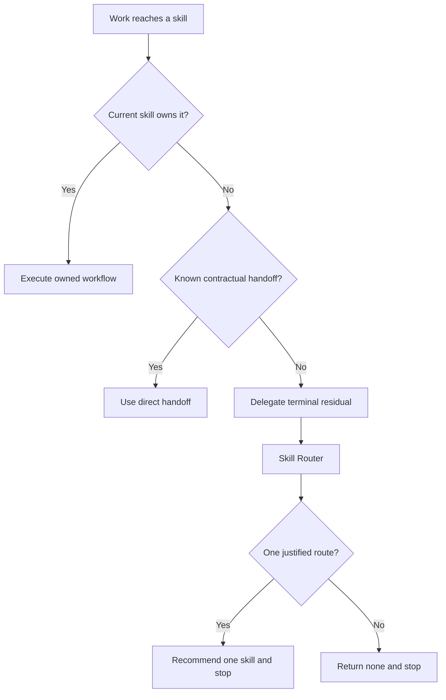

# Skill Router Relationship Synthesis

Status: design reference, not an executable contract.

Runtime authority remains in:

- `skills/custom/skill-router/SKILL.md`
- `skills/custom/skill-router/agents/openai.yaml`
- `docs/synthesis/skill-context-relationships.md`
- each caller's owned workflow and return contract

This note preserves the intended shift from an explicit human-only index to an implicitly invocable residual router. The runtime skill and invocation policy remain unchanged until an authorized implementation updates and validates every affected surface.

## North Star

Skill Router owns one decision: select one next skill or `none` for an explicit route-selection request or a terminal residual packet that another skill has declared outside its scope. It never performs downstream work, replaces an active owner's in-scope judgment, or intermediates a known contractual handoff.

The model is hybrid:



Direct handoffs preserve deterministic workflows. Residual routing centralizes the route taxonomy that would otherwise be copied across callers.

## Invocation Decision

Skill Router should become implicitly invocable with this narrow description:

> Route only an explicit next-skill selection request or a terminal out-of-scope residual packet delegated by another skill. Return one next skill or none without executing it. Do not replace an active skill's in-scope work or owned handoffs.

The two valid triggers are:

1. the user explicitly asks which skill should own the current situation; or
2. another skill explicitly delegates terminal residual work after exhausting its own scope and owned handoffs.

Ordinary implementation, diagnosis, review, research, design, interview, planning, or documentation requests do not trigger Skill Router when an applicable skill can act directly.

Implicit invocation removes the need for every caller to reproduce the complete route map. It does not authorize an automatic downstream chain: Skill Router returns one recommendation or `none` and stops.

## Ownership Boundary

### Keep Local

A caller retains a relationship when that edge is part of its algorithm, carries a specialized packet, or returns control to the caller. Examples include:

- Wayfinder invoking Research, Prototype, Diagnosis, Grill With Docs, Questionnaire, or Codebase Design for one ticket;
- Wayfinder recommending To Spec after mapped closure;
- To Spec recommending To Tickets after publishing the parent spec;
- To Tickets selecting Implement or Parallel Implement from the verified graph;
- Implement invoking TDD, Diagnosis, or Review at an owned gate; and
- any composer keeping its component skills active under named mutation and completion contracts.

Skill Router must not intercept these edges or reinterpret their gates.

### Centralize

Invoke Skill Router when a skill finishes, blocks, or rejects work and material residual work remains without an owned handoff. Typical callers include:

- Grill With Docs after exhausting its dependency-ready conversational frontier;
- Audit Codebase when a finding or cohesive cluster needs one suggested next owner;
- Improve Codebase when a selected candidate remains unresolved after its owned resolver and reclassification;
- Wayfinder when bounded Grill With Docs qualification fails campaign admission;
- a skill explicitly invoked on an out-of-scope request; and
- any completed workflow that exposes unclassified residual work.

The generic caller rule is:

> **Residual routing.** When the request or remaining work is outside this skill and no owned handoff applies, invoke `$skill-router` with the current owner, completed outcome, residual work, available evidence, attempted routes, and constraints. Return its recommendation without starting the downstream skill.

This single fallback replaces caller-specific catalogs of every possible next skill. It does not replace local scope, completion, or known-handoff rules.

## Residual Packet

Pass as much of this packet as the caller knows:

```text
Current owner:
Owner result: complete | blocked | rejected as out of scope
Original outcome:
Residual work:
Available evidence and source pointers:
Attempted or exhausted owners:
Rejected or excluded routes:
Known decisions and prerequisites:
Constraints and authority:
Caller return boundary:
```

The packet must distinguish unfinished in-scope work from genuine residual work. A caller may not declare work residual merely because its owned path is difficult, blocked on an expected input, or approaching a later step.

## Routing Spine

1. **Admit.** Accept only an explicit route-selection request or a caller-delegated terminal residual packet. Return to the current owner when the work remains inside its scope or an owned handoff already applies.
2. **Inspect.** Use the packet and visible repository state. Inspect only facts that could change ownership.
3. **Exclude.** Remove the current owner, Skill Router itself, already exhausted owners, and routes whose admission predicates fail.
4. **Prefer.** Choose the narrowest owner that can close the residual. Prefer one leaf resolver over an orchestrator, an owned deterministic handoff over routing, and settled delivery over renewed discovery.
5. **Clarify.** Ask one highest-leverage question only when two routes remain materially plausible and the packet cannot decide between them.
6. **Return.** Recommend exactly one next skill or `none`, state why it wins, name any precondition, and stop without downstream execution.

Return:

```text
Skill: <skill-name> | none
Reason:
Precondition:
Return boundary:
Downstream execution: none
```

`none` is required. A generic fallback router must preserve a terminal no-route result rather than force unrelated work into the pack.

## Wayfinder Pre-Screen

Prefer a direct leaf or conversation before a tracker-backed campaign. Provisionally select `$wayfinder` only when the available packet supports all conditions:

1. one bounded destination remains foggy;
2. at least two interdependent material decisions remain unresolved;
3. at least one remaining decision depends on non-conversational work such as source evidence, a runnable probe, diagnosis, repository proof, external response, executable prerequisite, or durable artifact; and
4. resolving the set requires durable tracker-backed sequencing across sessions.

Route residuals as follows when that gate fails:

- only user questions, preferences, terminology, context boundaries, or ADR choices remain: `$grill-with-docs`;
- domain truth is settled and only persistence remains: `$domain-modeling`;
- one source, runnable, causal, repository, or stakeholder evidence gap remains: its direct leaf owner;
- the direction is settled but broad understanding is not durable: `$to-spec`;
- settled source already has several clear implementation slices: `$to-tickets`;
- exactly one bounded ready item exists: `$implement`; and
- no skill owns the residual: `none`.

Question count, project size, severity, session count, or generic fog never independently selects Wayfinder. The recommendation authorizes no tracker mutation: Wayfinder first invokes Grill With Docs under a bounded qualification, then applies its own authoritative admission gate.

When qualification fails Wayfinder admission, Wayfinder returns the attempted route, rejection reason, settled state, residual work, and `Excluded route: $wayfinder unless material new evidence appears`. Skill Router then selects a narrower owner or `none`; it cannot repeat the excluded route from an unchanged packet.

## Loop Guards

- Skill Router never selects itself.
- Skill Router does not immediately return work to the caller that declared the same residual out of scope unless material new evidence proves that declaration wrong.
- A Wayfinder rejection excludes Wayfinder until material new evidence changes its admission state.
- A leaf invoked by an orchestrator returns its result to that orchestrator; it does not route the orchestrator's next step.
- An open Wayfinder campaign absorbs in-scope consequences into its existing map and never routes through Skill Router to create a nested campaign.
- Grill With Docs invoked by Wayfinder returns residuals to that map rather than invoking Skill Router.
- A recommendation never starts the selected skill automatically.
- Repeated routing with an unchanged packet returns the same route or `none`; it does not create a route cycle.

## Relationship Pattern

| Caller | Verb | Callee | Trigger And Return |
| --- | --- | --- | --- |
| Direct user | Invoke | `$skill-router` | The user explicitly asks which skill should own the current situation; return one route or `none`. |
| Any active skill | Invoke | `$skill-router` | Terminal material residual work remains outside the caller and no owned handoff applies; return one route or `none` to the caller. |
| `$wayfinder` | Invoke | `$skill-router` | Bounded qualification fails admission; honor the rejected-route exclusion and choose a narrower owner or `none`. |
| `$skill-router` | Recommend and stop | One downstream skill | Exactly one route satisfies the residual and its admission gate; the user starts it. |
| `$skill-router` | Return and stop | `none` | No route is justified or the packet is not admissible. |

Callers need only the generic residual relationship. Skill Router owns the detailed route map; downstream skills own their own admission and may reject an invalid recommendation.

## Migration Surface

An implementation of this design must update together:

- `skills/custom/skill-router/SKILL.md` and `agents/openai.yaml`;
- the Router Skill definition in `$writing-great-skills`, which currently assumes every router is explicit-only;
- global and repository `AGENTS.md` routing guidance;
- caller contracts that duplicate terminal route catalogs;
- `docs/synthesis/skill-context-relationships.md` and the Wayfinder synthesis;
- human-facing README routes;
- structural contract tests; and
- behavior evaluations and installed mirrors after canonical validation.

Historical validation transcripts remain historical evidence and are not rewritten as current contracts.

## Behavior Evaluation

Positive cases must show that Skill Router:

- answers an explicit next-skill question;
- accepts a terminal residual from Grill With Docs, Audit Codebase, Improve Codebase, or an out-of-scope skill;
- accepts a qualification-rejection packet from Wayfinder and chooses a narrower route or `none`;
- provisionally selects Wayfinder only when the complete pre-screen holds and leaves authoritative admission to Wayfinder qualification;
- chooses a direct leaf for one evidence gap;
- returns `none` when no pack skill owns the residual; and
- leaves downstream execution unstarted.

Negative controls must show that Skill Router does not:

- trigger for an ordinary request already owned by an applicable skill;
- interrupt an active skill's in-scope work;
- replace a known contractual handoff;
- select Wayfinder for question-only or domain-only work, one evidence gap, a large settled fix, or generic multi-session work;
- route back to itself or create an unchanged caller-router cycle; or
- route an unchanged Wayfinder rejection back to Wayfinder; or
- start the selected skill automatically.

## Future Analysis Questions

1. Is every Router invocation either an explicit route-selection request or a terminal residual delegation?
2. Did the caller exhaust its own work and known handoffs before delegating?
3. Does the residual packet preserve enough evidence and authority to choose one owner without redoing the caller's work?
4. Did the Router prefer the narrowest capable owner and preserve `none`?
5. Did any direct deterministic handoff get centralized unnecessarily?
6. Did any caller retain a duplicate catalog of terminal routes after adopting residual routing?
7. Can an invalid recommendation still be rejected by the selected skill's own admission gate?
8. Do negative evaluations prove that implicit invocation stays dormant during ordinary in-scope work?
9. Does every failed Wayfinder qualification return through Skill Router with an exclusion that prevents an unchanged retry?
