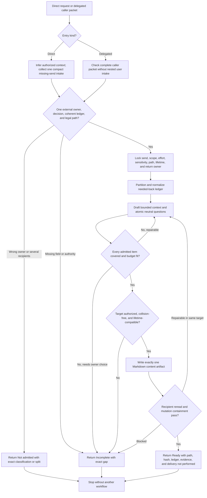

# To Questionnaire Recipient-Artifact Synthesis

Status: exhaustive design reference and future extraction map. No proposed behavior in this document is current runtime authority until the coordinated rewrite, evaluation, validation, and installed-mirror synchronization complete.

Runtime authority remains in:

- `skills/custom/to-questionnaire/SKILL.md`;
- `skills/custom/to-questionnaire/agents/openai.yaml`;
- each caller for its downstream decision, item identity, waiting state, answer verification, retention requirement, and continuation authority;
- `$research` and `$grilling` for source-answerable and current-user-owned gaps;
- `$skill-router` for explicit route selection;
- `skills/custom/wayfinder/SKILL.md`, `OPERATIONS.md`, and `MAP-FORMAT.md` for the Questionnaire-ticket caller packet and external-wait lifecycle;
- `docs/synthesis/skill-context-relationships.md` for pack-wide invocation and recommendation edges;
- `tests/test_skill_pack_contracts.py` and `docs/validation/evals/core-workflows.md` for current structural and behavioral protection;
- `README.md` for human-facing orientation; and
- `C:\Users\steve\.agents\skills\to-questionnaire` as the installed mirror of the last synchronized canonical source.

The canonical working tree currently contains an in-progress implicitly invocable delegated-leaf candidate, while the installed mirror still contains the older explicit-only direct-use skill. That divergence is evidence, not promotion. This synthesis changes neither runtime surface.

## How To Read This Document

This synthesis follows the four-layer authority model used by the Parallel Implement and Wayfinder syntheses:

1. **Orientation** states the outcome, selected design, vocabulary, and explanatory flow.
2. **Normative Design** is the sole authority for proposed future To Questionnaire behavior and relationships.
3. **Evidence And Rationale** preserves baseline facts, design pressure, deliberate non-changes, and deferred hypotheses without creating rules.
4. **Extraction And Verification** maps every accepted behavior into one owned runtime surface and one staged proof path.

| Question | Owning section |
| --- | --- |
| What outcome and boundary govern the rewrite? | [North Star](#north-star), [Design Verdict](#design-verdict), and [Delivery Boundary](#delivery-boundary) |
| Which terms have precise meanings? | [Questionnaire Vocabulary](#questionnaire-vocabulary) |
| How should the eventual runtime read? | [Leading-Word Runtime Model](#leading-word-runtime-model) |
| Where does each proposed rule live? | [Normative Home Index](#normative-home-index) |
| When should this skill run? | [Invocation And Routing](#invocation-and-routing) and [Admission And Ledger Partition](#admission-and-ledger-partition) |
| What must direct and delegated entries provide? | [Entry Contracts](#entry-contracts) |
| How is the knowledge gap represented? | [Needed-Back Ledger](#needed-back-ledger) |
| What makes a question recipient-ready? | [Question Design Contract](#question-design-contract) |
| What exactly is written? | [Questionnaire Artifact Contract](#questionnaire-artifact-contract) |
| How are privacy, paths, overwrite, and retention controlled? | [Sensitive-Context Contract](#sensitive-context-contract) and [Path Authority And Artifact Lifetime](#path-authority-and-artifact-lifetime) |
| How is one-file containment proved? | [Save And Containment](#save-and-containment) and [Verification Contract](#verification-contract) |
| What exactly returns? | [Terminal Status And Return](#terminal-status-and-return) |
| Which callers and routes participate? | [Relationship Ownership](#relationship-ownership) |
| What must pass before promotion? | [Staged Behavior-Evaluation Protocol](#staged-behavior-evaluation-protocol), [Migration And Acceptance Matrix](#migration-and-acceptance-matrix), and [Promotion Gate And Residual Gaps](#promotion-gate-and-residual-gaps) |

When another layer disagrees with Normative Design, correct that layer. The ownership map places rules, the evaluation protocol owns proof quality, the acceptance matrix owns case coverage, and the promotion gate owns admission; none may redefine runtime behavior.

# Layer One: Orientation

## North Star

To Questionnaire owns one outcome: create one recipient-ready, unsent Markdown questionnaire for one identifiable external stakeholder whose material knowledge is unavailable to the caller and authorized inspectable sources, then return its verified identity and a complete needed-back ledger without deciding what the answers mean for the downstream decision or prerequisite.

The skill is a bounded elicitation leaf. It turns one owned external knowledge gap into one safe collection artifact. It does not contact the recipient, collect or interpret answers, resolve the downstream decision, change caller state, or continue another workflow.

## Design Verdict

Keep To Questionnaire narrowly implicitly invocable and implement it as one linear artifact transaction with two entry adapters:

```text
Direct | Delegated -> Admit -> Lock -> Gap -> Draft -> Cover -> Save -> Verify -> Return
```

| Stratum | Selected design | Runtime implication |
| --- | --- | --- |
| Invocation | Direct user request or complete authorized caller packet for one external-stakeholder gap | Preserve narrow implicit reach and strong negative routing controls |
| Intake | One compact direct-user intake; zero nested intake for delegated caller-owned fields | Keep branch difference at entry only |
| Elicitation core | One recipient, one downstream decision or prerequisite, one admitted needed-back ledger, atomic neutral questions | Keep one universal linear procedure |
| Artifact transaction | One Markdown content artifact, path and overwrite preflight, lifetime match, reread, identity proof, and mutation containment | Add explicit path, retention, and verification contracts |
| Return | Typed `Ready`, `Not admitted`, or `Incomplete` result with exact ownership and artifact state | Never imply delivery or decision resolution |
| Rejected machinery | Multi-recipient surveys, form builders, delivery integrations, response stores, answer synthesis, tracker mutation, and provider automation | Keep outside the skill |

No supporting runtime file is selected. The artifact schema and branch distinction are universal and compact enough for `SKILL.md`. Consider progressive disclosure only if behavioral evaluation later proves that a sharp inline contract still loses an essential branch.

## Delivery Boundary

`Recipient-ready` means the Markdown content can be handed to the named recipient without reconstructing the originating conversation. It does not mean:

- converted into an email, form, survey platform, office document, or provider-specific message;
- approved for a delivery channel the user or caller did not authorize;
- sent, shared, uploaded, or attached;
- received or answered;
- factually verified after the recipient responds; or
- sufficient to resolve the caller's downstream decision.

Artifact creation ends at verified local content and identity. Delivery, retention after Return, answer collection, answer verification, answer interpretation, and downstream action retain their pre-existing owners.

## Questionnaire Vocabulary

| Term | Meaning |
| --- | --- |
| **External stakeholder** | A person or uniquely identifiable role outside the current user's decision authority who owns material facts, judgment, constraints, examples, or risks; it need not mean outside the organization |
| **Recipient authority** | The knowledge or judgment the named stakeholder can legitimately supply; it never expands because a question asks for it |
| **Downstream decision** | The caller-owned decision or prerequisite whose progress depends on the answers; the shorter term includes either form throughout this document |
| **Needed-back item** | One atomic missing information need, its decision impact, expected response shape, authority owner, source check, priority, and mapped question identifiers |
| **Admitted ledger** | The complete set of needed-back items that belong to one recipient and this artifact |
| **Excluded item** | A supplied gap assigned to inspectable sources, the current user, another recipient, or another owner and therefore omitted from the artifact |
| **Send intake** | Metadata needed to address, contextualize, constrain, and save the questionnaire; it never asks the current user to answer for the recipient |
| **Effort budget** | The explicit maximum expected recipient time or equivalent question burden |
| **Artifact identity** | The verified absolute path and content hash of the exact Markdown file reread by the skill |
| **Artifact lifetime** | How long and under whose retention responsibility the local file must remain available after Return |
| **One-file containment** | Only the authorized Markdown target receives content mutation during the artifact transaction; pre-existing unrelated work remains untouched |
| **Ready** | The artifact and Return satisfy every owned completion gate; it still remains unsent and unanswered |
| **Not admitted** | The request belongs elsewhere or cannot form one coherent one-recipient artifact; no artifact is written |
| **Incomplete** | The route fits but required intake, authority, path, write, reread, or verification evidence is missing; no artifact is represented as Ready |

## Leading-Word Runtime Model

| Leading word | Runtime meaning |
| --- | --- |
| **Direct / Delegated** | Select one entry adapter without changing the universal artifact transaction |
| **Admit** | Establish one external knowledge owner, one downstream decision, one coherent recipient ledger, and one legal local artifact boundary |
| **Lock** | Freeze recipient, sender, answer use, scope, deadline, effort, sensitivity, path, lifetime, return owner, and delivery boundary |
| **Gap** | Partition supplied needs by true knowledge owner and trace every admitted item to its decision impact and expected response |
| **Draft** | Give the recipient only the context and atomic neutral questions needed to answer within authority |
| **Cover** | Prove bidirectional ledger-to-question coverage, fit the effort budget, and remove compounds, leading language, duplication, leakage, and scope drift |
| **Save** | Preflight and write one authorized Markdown target without overwriting or escaping its root |
| **Verify** | Reread content and filesystem state as the recipient and as the mutation owner |
| **Return** | Report typed status, exact artifact state, ledger disposition, caller ownership, and delivery `not performed`, then stop |

**Gap** is the steering word: ask only what must come back from this recipient to unlock the named decision. “Grill the send, not the subject” remains the direct-intake guard: ask the current user for send metadata, never for stakeholder-owned answers.

## End-To-End Explanatory Flow



The diagram is explanatory. Layer Two alone owns admission, intake, ledger semantics, artifact content, mutation, verification, statuses, and Return.

# Layer Two: Normative Design

## Normative Home Index

This index gives every proposed To Questionnaire concern one normative home. Other sections may explain, place, or test the rule but may not restate a different version.

| Concern | Sole normative home |
| --- | --- |
| Direct, delegated, and wrong-route triggers | [Invocation And Routing](#invocation-and-routing) |
| Ownership and allowed mutation | [Authority And Mutation Boundary](#authority-and-mutation-boundary) |
| Direct intake and delegated packet fields | [Entry Contracts](#entry-contracts) |
| Admission, mixed-owner partition, and multi-recipient split | [Admission And Ledger Partition](#admission-and-ledger-partition) |
| Locked questionnaire charter | [Lock Contract](#lock-contract) |
| Needed-back item semantics and coverage identity | [Needed-Back Ledger](#needed-back-ledger) |
| Question construction and effort fit | [Question Design Contract](#question-design-contract) |
| Recipient-facing Markdown structure | [Questionnaire Artifact Contract](#questionnaire-artifact-contract) |
| Sensitive-context minimization | [Sensitive-Context Contract](#sensitive-context-contract) |
| Target selection, overwrite, and retention | [Path Authority And Artifact Lifetime](#path-authority-and-artifact-lifetime) |
| Write transaction and mutation containment | [Save And Containment](#save-and-containment) |
| Semantic and mechanical proof | [Verification Contract](#verification-contract) |
| Legal next operation | [State And Transition Contract](#state-and-transition-contract) |
| Terminal status and returned fields | [Terminal Status And Return](#terminal-status-and-return) |
| Complete invocation | [Completion Criterion](#completion-criterion) |
| Callers, route edges, and exclusions | [Relationship Ownership](#relationship-ownership) |

## Decision Contracts

Each predicate has one owner. A gate reports a failure; it never performs another owner's work merely to make itself pass.

| Decision | Owner | Passing evidence | Other branch |
| --- | --- | --- | --- |
| Invocation fits? | To Questionnaire | Direct request or authorized caller packet asks for one unsent Markdown artifact to collect externally owned knowledge | Return `Not admitted` with the narrower owner or route classification |
| Recipient is singular and authoritative? | To Questionnaire from supplied evidence | One person or uniquely identified role owns every admitted item | Return the proposed recipient split without writing |
| Gap is externally owned? | To Questionnaire | The caller, current user, and authorized inspectable sources cannot supply it | Partition the item to its true owner; if nothing remains, return `Not admitted` |
| Entry is complete? | To Questionnaire | Direct send intake or delegated packet supplies every applicable locked field | Ask one compact direct intake or return the exact delegated gap as `Incomplete` |
| Artifact may be written? | User or caller supplies authority; To Questionnaire verifies it | Resolved target is inside the authorized root, collision policy is satisfied, lifetime fits, and Markdown mutation is allowed | Return `Incomplete` without uncontrolled mutation |
| Ledger is covered? | To Questionnaire | Every admitted item maps to atomic questions and every substantive question maps back to an item | Repair Draft or return the exact scope or budget conflict |
| Artifact is Ready? | To Questionnaire | Content, path, reread, identity, and containment gates all pass | Return `Incomplete`; never promote a partial artifact |
| Answers resolve the decision? | Caller | Caller later verifies supplied answers against its own decision contract | Return and stop; To Questionnaire never decides |

## Invocation And Routing

Keep `policy.allow_implicit_invocation: true` and admit two entry forms:

- **Direct:** the user asks to create or prepare one asynchronous questionnaire for one external stakeholder and one downstream decision.
- **Delegated:** an active authorized caller invokes To Questionnaire with a complete packet and exact return boundary.

Do not invoke for:

- facts available from authorized inspectable sources;
- a preference, trade-off, approval, or decision owned by the current user;
- a synchronous interview or Grilling session;
- a survey, poll, form, census, or repeated instrument for multiple respondents;
- stakeholder outreach, email drafting whose primary outcome is a message rather than the questionnaire artifact, delivery, follow-up, scheduling, or relationship management;
- answer ingestion, analysis, truth assessment, or decision synthesis;
- a questionnaire spanning materially different knowledge owners;
- generic documentation or a template family; or
- ordinary clarification already owned inside an active caller that has not delegated this leaf.

On a direct source-only mismatch, recommend `$research` and stop. On a direct current-user decision, recommend `$grilling` and stop. On missing repository output setup with no authorized safe target, recommend `$repo-bootstrap` and stop. On a delegated mismatch, return the classification to the caller without invoking or selecting its next action.

Implicit eligibility does not convert every recommendation edge into invocation. A caller invokes only when its own contract names To Questionnaire, supplies the complete packet, and retains the return.

## Authority And Mutation Boundary

To Questionnaire owns:

- direct send intake and delegated packet validation;
- external-owner admission and ledger partition;
- the admitted needed-back ledger;
- question selection, wording, order, response framing, and effort fit;
- one recipient-facing Markdown artifact;
- target preflight, content write, reread, identity proof, and one-file containment;
- its typed Return; and
- its own completion criterion.

The user or caller owns recipient identity, sender identity, authorized source context, sensitive-context permission, output authority, artifact lifetime requirement, delivery, and downstream use. The caller owns its item, decision, tracker or workflow state, waiting transition, answer verification, and next action. The recipient owns their answers.

The skill may read the governing request, supplied caller packet, authorized source pointers, target path state, ignore rules needed for the fallback, and current worktree state needed for mutation containment. It writes only the authorized Markdown content artifact. Leave tracker, domain, specification, implementation, Git index or history, caller records, external systems, and other files unchanged.

## Entry Contracts

### Direct Entry

Infer fields already supported by the request and authorized local context. If necessary, ask one compact intake containing every remaining send fact the current user can reasonably know. Do not ask the user to speculate about or answer the stakeholder-owned gap.

The direct entry resolves:

```text
Return owner: current user
Caller item or decision identifier: optional or none
Sender identity or role:
Recipient name or uniquely identifying role:
Recipient expertise and relationship to sender:
Downstream decision or prerequisite:
Initial needed-back items:
Authorized context and source pointers:
Answer use and verification owner:
Deadline or explicit none:
Effort budget:
Authorized output root or exact path:
Artifact lifetime and retention owner:
Sensitive-context constraints:
Known delivery and response-format assumptions:
Overwrite authority: yes | no
Delivery authority: retained by user
```

One intake may include several missing fields. If the user declines or cannot supply a field required for safe drafting, return `Incomplete` with that exact field rather than weakening the contract.

### Delegated Entry

An authorized caller supplies every field above, with a required caller and return owner plus caller item identifier. `none` is acceptable only where the field explicitly permits it; omission is not an answer.

The packet must be sufficient to draft without nested user questioning. When a delegated field is absent, contradictory, stale, or weaker than the caller's own contract, return `Incomplete` to the caller with the exact field and create no artifact. Do not ask the user for caller-owned map, tracker, scope, path, or authority state.

Preserve caller vocabulary and identifiers. Adapt only field shape; never upgrade decision, write, overwrite, delivery, retention, or continuation authority.

## Admission And Ledger Partition

Admit only when all are true:

1. one person or uniquely identifiable role owns material information;
2. the information is unavailable to the caller and current user in their present authority;
3. authorized inspectable sources do not already answer it;
4. one named downstream decision or prerequisite depends on the answers;
5. admitted items form one coherent questionnaire for that recipient;
6. the effort budget can contain every admitted item or the owner approves a narrower ledger;
7. one legal path and artifact lifetime are available; and
8. delivery, answers, decision resolution, and continuation remain outside the skill.

Partition supplied gaps before drafting:

| Gap owner | Disposition |
| --- | --- |
| Named recipient | Normalize into the admitted ledger |
| Authorized inspectable source | Exclude as source-answerable and name `$research` on direct terminal mismatch; delegated runs return the classification to the caller |
| Current user | Exclude as current-user-owned and name `$grilling` on direct terminal mismatch; delegated runs return the classification to the caller |
| Different external stakeholder | Record the separate recipient group; return a proposed split without writing |
| Unknown or nonidentifiable owner | Return `Not admitted` with the missing ownership evidence |
| Caller workflow or downstream authority | Return to the caller; do not turn workflow state into a recipient question |

A mixed ledger may proceed only when exactly one external-recipient group remains and every excluded item and owner is returned explicitly. No artifact may imply that an excluded item was covered. When two external-recipient groups remain material, return the complete proposed split without arbitrarily choosing one.

## Lock Contract

Before drafting, lock:

- entry kind, caller item, return owner, and continuation owner;
- sender and one recipient identity, role, expertise, and relationship;
- one downstream decision or prerequisite and how answers will be used;
- admitted and excluded ledger identities;
- authorized sources and the boundary of source inspection;
- response deadline or explicit `none`;
- effort budget and expected response format;
- sensitive-context constraints and redaction requirements;
- exact target or authorized root, overwrite state, artifact lifetime, and retention owner; and
- delivery `not performed`.

Changed recipient, decision, ledger scope, sensitivity authority, output root, or lifetime invalidates the Lock and returns to the applicable entry or admission gate. Wording repairs inside the locked ledger do not require new authority.

## Needed-Back Ledger

Give each admitted item a stable identifier and record:

```text
Needed-back ID:
Missing fact | judgment | constraint | example | risk:
Downstream decision impact:
Why this recipient owns it:
Authorized-source check and result:
Priority and dependency:
Expected response shape:
Mapped question IDs:
```

The ledger is a traceability structure, not a second artifact and not a transcript. It proves why each question exists and what must return; it does not prescribe how the caller later judges truth or makes the decision.

Coverage is bidirectional:

- every admitted item maps to at least one atomic question;
- every substantive question maps to at least one admitted item;
- one item may require several atomic questions;
- one question may cover several items only when one indivisible answer satisfies them without becoming compound; and
- the final catch-all maps to no known item and proves no coverage.

Remove curiosity, duplicated needs, already answered facts, nonmaterial background, and workflow instructions. Return excluded items and their owners; do not silently drop them.

## Question Design Contract

Draft questions only from the admitted ledger. Each question must be:

- **atomic:** one answer dimension, without hidden alternatives or several decisions joined by conjunction;
- **neutral:** it does not imply the preferred answer, presume disputed facts, or pressure agreement;
- **recipient-answerable:** the recipient is positioned to know or judge it;
- **authority-bounded:** it requests no approval, disclosure, or commitment beyond the recipient's supplied authority;
- **decision-bearing:** its answer changes, constrains, or validates the named downstream decision;
- **context-sufficient:** the recipient can answer without reconstructing the originating conversation;
- **response-shaped:** it asks for the specificity, example, range, ranking, evidence, or caveat the ledger actually needs; and
- **effort-fit:** it contributes enough value to justify its share of the locked burden.

Order by decision value, then prerequisite dependency, while keeping related questions in coherent themes. Mark genuinely required versus optional elaboration when that reduces effort ambiguity. Use balanced choices only when the known option set is legitimate, and retain an escape such as `Other`, `Unknown`, or `Not applicable` when the set is not exhaustive.

Use a short “why this matters” only when it prevents a likely misreading. Do not expose internal deliberation merely to justify a question. Do not ask the recipient to research facts the sender can inspect, choose for the current user, speculate beyond their knowledge, reveal unnecessary sensitive material, or perform the caller's workflow.

Estimate response effort from the actual questions and expected answer shape. When the complete admitted ledger cannot fit, return the conflict and a proposed priority or questionnaire split. Do not silently remove a material needed-back item to meet the budget.

## Questionnaire Artifact Contract

Write one Markdown file with this semantic structure:

```text
Title
Purpose and downstream decision
Sender and recipient
How answers will be used
Response deadline, effort estimate, and response instructions
Bounded context and any approved confidentiality note
Themed, stably identified questions with answer space
Final optional catch-all
```

The artifact is recipient-facing. Keep internal source paths, caller state, tracker identifiers, routing classifications, coverage bookkeeping, and private decision analysis out unless the recipient needs them and their inclusion is explicitly authorized.

Question identifiers must be stable within the artifact and match the returned ledger mapping. Answer space may be a clear Markdown placeholder, table cell, or blank section appropriate to the expected response. Formatting must remain readable in plain Markdown; provider-specific rendering is not required.

The catch-all invites relevant information not anticipated by the sender. It is optional to answer and never substitutes for a known needed-back item.

## Sensitive-Context Contract

Use the minimum authorized context that makes the questions answerable. Classify each candidate detail as:

- required and authorized for this recipient;
- useful but unnecessary, therefore omitted;
- sensitive but authorized and minimized or redacted;
- unauthorized, therefore omitted; or
- required but unauthorized, therefore an `Incomplete` blocker.

Do not copy credentials, secrets, access tokens, private keys, unapproved personal data, privileged material, unrelated customer or employee details, or broad internal source content into the artifact. A source pointer authorizes inspection only to the extent stated; it does not automatically authorize disclosure to the recipient.

When safe wording can preserve the question without the sensitive detail, redact or abstract it and record the assumption in Return. When the missing detail is necessary to ask responsibly, stop before writing and name the exact authorization or sanitized substitute required.

## Path Authority And Artifact Lifetime

Select the target in this order:

1. an exact path explicitly authorized for this artifact;
2. a new collision-free `.md` name inside an explicitly authorized output root; or
3. for a direct disposable artifact only, `<work-root>/.tmp/to-questionnaire/<slug>.md` after proving `.tmp` contents are ignored.

Preflight requires:

- an absolute resolved target;
- `.md` extension;
- containment inside the authorized root after resolving traversal and link behavior;
- parent-directory creation, if needed, confined to that root;
- a target that does not already exist, unless overwrite of that exact file is explicitly authorized;
- an artifact lifetime compatible with the requested use; and
- a named retention owner after Return.

An authorized root does not authorize overwriting an existing file. Generate a collision-free name within that root or return the collision. An exact existing path requires separate overwrite authority. Capture its pre-write identity before any authorized replacement.

The `.tmp` fallback is disposable. Do not use it when a delegated caller must preserve the artifact through a multi-session or external wait unless that caller explicitly accepts the disposable lifetime and owns replacement risk. A Wayfinder Questionnaire ticket should supply a retention-suitable authorized path and owner because Wayfinder persists an artifact pointer across the external wait.

Do not create a tracked artifact by default. An explicitly authorized tracked path is allowed only when the caller or user owns that mutation and the artifact's sensitivity permits version control. Missing setup does not justify editing `.gitignore` or provisioning repository state; direct use recommends `$repo-bootstrap`, while delegated use returns the missing path capability to its caller.

## Save And Containment

Immediately before Save:

1. refresh the target, authorized root, relevant ignore state, and current worktree mutation inventory;
2. preserve pre-existing unrelated dirty work as baseline evidence;
3. verify the Lock still names the same target, overwrite policy, lifetime, and sensitivity boundary; and
4. render the complete candidate in memory before the first content write.

Write exactly one Markdown content artifact. Necessary empty parent directories may be created only inside the authorized root; they do not authorize other content. Do not create a second coverage file, template, response database, manifest, delivery draft, tracker record, or helper output.

If verification finds a repairable content defect, repair the same target under the same Lock and verify again. If writing or repair fails, return `Incomplete` with the exact target state. A partial or unverified path is never reported as Ready. Do not overwrite, delete, or restore any pre-existing file without the exact authority captured at Lock.

After Save, compare current mutation state with the captured baseline. One-file containment concerns changes attributable to this invocation; unrelated pre-existing changes do not fail it and remain untouched.

## Verification Contract

Verify through two independent lenses.

### Recipient Reread

Confirm that the artifact:

- addresses the locked recipient and sender correctly;
- explains purpose, answer use, deadline, effort, and response instructions;
- contains enough authorized context and no unnecessary sensitive context;
- uses clear themes, stable question identifiers, and usable answer space;
- keeps every question atomic, neutral, authority-bounded, and answerable;
- orders questions by decision value and dependency;
- matches the locked effort budget; and
- makes no claim of delivery, answer, or decision resolution.

### Transaction Proof

Confirm that:

- the resolved absolute path exists and is the authorized Markdown target;
- the file rereads as the exact verified content;
- its SHA-256 identifies that content in Return;
- every admitted ledger item maps to question identifiers and every substantive question maps back;
- every excluded item is returned with its actual owner;
- no known item relies on the catch-all;
- the target lifetime matches the Lock;
- only the authorized content file changed relative to the fresh baseline; and
- no delivery or caller mutation occurred.

Verification repairs only the current artifact under the current Lock. A changed recipient, decision, ledger, path root, overwrite authority, lifetime, or sensitivity boundary reopens the owning gate.

## State And Transition Contract

The current state selects exactly one legal next operation:

| Current condition | Legal operation | Completion | Next condition |
| --- | --- | --- | --- |
| Entry kind unknown | Direct / Delegated | One adapter owns intake | Entry validation |
| Direct send fields missing | Intake | One compact question contains all user-answerable missing fields | Admit or Incomplete |
| Delegated field missing, stale, or contradictory | Return | Exact caller-owned gap is named; no artifact exists | Terminal Incomplete |
| Route and knowledge owner unknown | Admit | One recipient group and decision pass, or exact classification returns | Lock, Not admitted, or Incomplete |
| Scope or authority unlocked | Lock | All charter fields are current and compatible | Gap |
| Supplied needs unpartitioned | Gap | Admitted and excluded ledgers are complete and owned | Draft or Not admitted |
| Admitted ledger uncovered | Draft | Candidate questions exist for every item | Cover |
| Candidate has coverage, wording, sensitivity, or effort defects | Cover | All semantic checks pass or exact conflict returns | Save, Draft, or Incomplete |
| Target state unknown or stale | Save preflight | Path, collision, overwrite, lifetime, and baseline are proved | Save or Incomplete |
| Candidate not persisted | Save | One target contains the complete candidate | Verify |
| Content or transaction evidence missing | Verify | Both reread lenses pass or exact failure returns | Return Ready, repair, or Incomplete |
| Terminal packet assembled | Return | Named owner receives exact status and artifact state; delivery remains not performed | Terminal |

Do not draft before Admission, write before Cover and preflight, claim Ready before both verification lenses, or start another workflow after Return.

## Terminal Status And Return

Return one typed packet:

```text
Status: Ready | Not admitted | Incomplete
Reason or exact blocking predicate:
Caller and return owner:
Caller item or decision identifier:
Recipient:
Sender:
Downstream decision or prerequisite:
Artifact identity: <absolute path + SHA-256> | none
Artifact lifetime and retention owner:
Admitted needed-back ledger and question mapping:
Excluded items and actual owners:
Question count and estimated recipient effort:
Authorized source pointers used:
Sensitive-context omissions or redactions:
Unresolved send assumptions:
Verification and one-file-containment evidence:
Delivery: not performed
Caller retains: waiting, delivery, answer verification, downstream decision, and next-transition authority
Suggested owner: <direct Not admitted only> | none
```

`Ready` requires a verified artifact identity and complete admitted ledger. It does not mean sent, received, answered, true, or decision-complete.

`Not admitted` requires no artifact mutation and returns the exact wrong-owner, multi-recipient, incoherent-ledger, or route predicate. A direct mismatch may recommend one narrower owner. A delegated mismatch returns its classification to the caller and leaves next-route selection there.

`Incomplete` reports an otherwise relevant invocation whose intake, authority, path, write, reread, or containment proof failed. Report any file state honestly; never label a partial or stale artifact Ready.

Return to the delegating caller or direct user and stop. Do not recommend another route after a delegated run. Do not send, await, ingest, summarize, interpret, or act on answers.

## Completion Criterion

A `Ready` invocation completes only when:

- Direct or Delegated entry is complete and current;
- Admission establishes one identifiable external knowledge owner, one decision, and one coherent recipient group;
- Lock preserves all authority, sensitivity, path, lifetime, and return fields;
- every supplied need has an admitted or explicit excluded disposition;
- every admitted ledger item has atomic recipient-answerable coverage;
- question order, response shape, and total effort fit the locked budget;
- the artifact satisfies its recipient-facing schema and sensitive-context boundary;
- path, collision, overwrite, lifetime, and retention checks pass;
- exactly one authorized Markdown content artifact is written and reread;
- artifact identity, coverage, and one-file containment are proved;
- Return is complete; and
- delivery and downstream execution remain unstarted.

A `Not admitted` invocation completes only when it returns the exact failed predicate, true owner or recipient split, and proof of no artifact mutation. An `Incomplete` invocation completes only when it returns the exact missing field or failed gate, current artifact state, return owner, and proof that no unauthorized mutation or delivery occurred.

No terminal status substitutes for caller waiting, answer verification, downstream decision, or workflow completion.

## Relationship Ownership

| Source | Relationship | Target | Trigger and return |
| --- | --- | --- | --- |
| Direct user | Invoke | `$to-questionnaire` | One external stakeholder owns unavailable material knowledge for one decision; return the typed artifact packet and stop |
| `$skill-router` | Recommend and stop | `$to-questionnaire` | One external-stakeholder gap needs one async questionnaire; the user starts it later |
| `$grilling` | Recommend and stop | `$to-questionnaire` | Grilling reaches a legitimate external-owner Evidence gap; preserve its question and decision impact, then stop |
| `$wayfinder` | Invoke | `$to-questionnaire` | One Questionnaire ticket supplies the complete delegated packet; receive a Ready, Not admitted, or Incomplete result without transferring map authority |
| Another authorized caller | Invoke | `$to-questionnaire` | Its owned contract supplies every delegated field and return boundary; receive the typed packet and retain continuation |
| `$to-questionnaire` | Recommend and stop | `$research` | A direct request's entire material gap is answerable from inspectable sources |
| `$to-questionnaire` | Recommend and stop | `$grilling` | A direct request's entire material decision belongs to the current user |
| `$to-questionnaire` | Recommend and stop | `$repo-bootstrap` | A direct request lacks any authorized or verified-safe output location |

Wayfinder alone selects the Questionnaire ticket, owns its claim and reservation, supplies caller fields, records `awaiting-external-response`, releases the claim, exposes another frontier or wait, verifies later answers, and chooses the next transition. A Ready artifact is evidence for Wayfinder's external wait, not a substantive ticket outcome.

Human delivery and answer collection are post-Return actors, not executable skill edges. The installed or future availability of email, chat, form, storage, or calendar connectors does not authorize their use.

### Relationship Exclusions

To Questionnaire does not invoke Research, Grilling, Repo Bootstrap, Skill Router, Wayfinder, Domain Modeling, To Spec, To Tickets, implementation, or another route. Recommendation edges apply only to direct terminal mismatches and stop.

It does not mutate Wayfinder maps, tracker state, domain truth, specs, tickets, implementation, Git state, `.gitignore`, external providers, or recipient state. It does not own recipient follow-up, reminders, response reconciliation, or the caller's next action.

# Layer Three: Evidence And Rationale

## Current Runtime Baseline

The canonical working-tree candidate currently provides:

- narrowly implicit invocation;
- direct and delegated entry;
- a complete delegated packet;
- external-owner, one-recipient, source-versus-user, and safe-path admission;
- `Lock -> Gap -> Draft -> Cover -> Save -> Verify`;
- one Markdown file and `.tmp` fallback;
- recipient reread, sensitive-context minimization, and one-file containment;
- an unsent Return with caller ownership; and
- a sharp no-delivery, no-answer, no-continuation boundary.

The installed mirror retains the earlier explicit-only direct-use contract and lacks the delegated packet. The relationship map, Wayfinder caller, tests, and behavior evaluation already describe the canonical candidate. A future rewrite must reconcile this drift deliberately rather than treat either copy as implicit promotion evidence.

## Expansion From The Prior Synthesis

The previous compact synthesis captured the leaf boundary and Wayfinder delegation, but several behavior-changing concerns were compressed into lists. The exhaustive design gives them single normative homes:

| Prior compression | Exhaustive owner |
| --- | --- |
| Broad invocation description | Invocation And Routing plus direct negative controls |
| Direct versus delegated prose | Entry Contracts with distinct missing-field behavior |
| “One stakeholder” | Admission And Ledger Partition with mixed-owner and multi-recipient semantics |
| Needed-back list | Stable ledger identity, source check, decision impact, response shape, and bidirectional coverage |
| Draft quality adjectives | Question Design Contract with atomicity, neutrality, authority, dependency, and budget behavior |
| Artifact outline | Recipient-facing schema separated from private return metadata |
| Sensitive-context minimization | Explicit disclosure classification and blocker behavior |
| Authorized path or `.tmp` | Root containment, collision, overwrite, tracked-file, lifetime, and retention rules |
| “Only one file changed” | Fresh baseline, same-target repair, reread, hash identity, and attributable containment proof |
| Untyped Return | Ready, Not admitted, and Incomplete semantics |
| Wayfinder waiting paragraph | Caller-owned relationship and lifetime compatibility boundary |

## Why Narrow Implicit Invocation Is Appropriate

Users naturally ask to “make a questionnaire” without naming the skill, and authorized callers need a discoverable leaf. The mutation is bounded to one local Markdown artifact, while delivery and downstream decisions remain closed. Narrow trigger language and negative route cases control accidental capture of surveys, current-user interviews, research, generic documents, and outreach.

## Why Direct And Delegated Entry Diverge Only At Intake

A direct user can legitimately supply missing send metadata through one compact interaction. A delegated caller already owns that state and must provide it in the invocation packet. Asking the user for missing caller fields would leak orchestration context, create nested authority transfer, and make caller completion unpredictable. After entry, both forms benefit from one identical artifact transaction.

## Why The Ledger Is First-Class

Question fluency is not coverage. A polished questionnaire can omit the fact that unlocks the decision, ask attractive but irrelevant questions, or hide a compound gap behind a catch-all. Stable needed-back identities make omission, duplication, scope drift, and later answer reconciliation observable without turning the skill into the caller's answer judge.

## Why One Recipient Is A Hard Gate

Different stakeholders have different authority, context, sensitivity, language, incentives, and effort. Combining them creates questions one recipient cannot answer and obscures who must respond. Returning a split preserves the original gap without fabricating a lowest-common-denominator survey.

## Why Path And Lifetime Are Semantic

The artifact path is part of the returned capability, not incidental file plumbing. An ignored `.tmp` file is appropriate for a disposable direct handoff but can vanish during a multi-session external wait. Exact overwrite authority, retention owner, and lifetime compatibility prevent a technically valid write from becoming an unusable or destructive artifact.

## Why Verification Has Two Lenses

Recipient reread proves semantic readiness. Transaction proof establishes the exact file, content identity, ledger coverage, and mutation boundary. Either alone is insufficient: good prose at the wrong path is not the returned artifact, while a hashed file with compound or unauthorized questions is not recipient-ready.

## Failure-Pressure Inventory

| Pressure | Likely failure | Owning contract |
| --- | --- | --- |
| The user wants speed | Draft before identifying the real knowledge owner | Admission And Ledger Partition |
| Caller packet is almost complete | Ask the user for caller-owned state or invent authority | Entry Contracts |
| Repository context is available | Copy broad internal detail into the artifact | Sensitive-Context Contract |
| One item can be looked up | Ask the stakeholder anyway | Admission And Ledger Partition |
| Two stakeholders each know part | Blend them into one artifact | Admission And Ledger Partition |
| Many items compete for a tight budget | Silently omit material coverage or create compound questions | Question Design Contract |
| Existing path is convenient | Overwrite without separate authority | Path Authority And Artifact Lifetime |
| `.tmp` is easy | Return a disposable path for a durable wait | Path Authority And Artifact Lifetime |
| The questionnaire reads well | Skip bidirectional ledger proof | Verification Contract |
| Save partially succeeds | Report the path as Ready | Terminal Status And Return |
| Wayfinder is waiting | Mutate its state or retain its claim from the leaf | Relationship Ownership |
| A delivery connector exists | Send or upload automatically | Relationship Exclusions |
| Answers arrive in the same conversation | Interpret them and continue the decision | Relationship Exclusions |

## Deliberate Non-Changes

- Keep one Markdown artifact rather than a template family or provider form.
- Keep one recipient and one coherent downstream decision or prerequisite per invocation.
- Keep the common artifact transaction in one runtime file.
- Keep direct user intake compact and delegated intake packet-complete.
- Keep Research responsible for source questions and Grilling responsible for current-user decisions.
- Keep caller identifiers, state, waiting, answer verification, and continuation caller-owned.
- Keep delivery, recipient contact, and response collection outside the skill.
- Keep no tracker provider, mailbox, form, calendar, storage, or message integration.
- Keep `.tmp` available only as a proved disposable direct fallback.
- Keep installed synchronization after coordinated canonical proof only.

## Deferred Hypotheses

These ideas are not selected runtime behavior:

- a disclosed questionnaire template or schema reference;
- a helper script for rendering, hashing, coverage, or path generation;
- a JSON or database form of the needed-back ledger;
- automatic email, chat, document, form, or storage conversion;
- automatic delivery, reminders, follow-up, or scheduling;
- response ingestion, truth scoring, conflict resolution, or answer synthesis;
- one invocation generating a recipient packet family;
- multi-language translation or accessibility transformation;
- automatic redaction or secret-scanning machinery;
- automatic source research before admission;
- a questionnaire registry or durable response store; and
- caller-specific branches inside the core runtime.

Promote one only after a fixed realistic control demonstrates a failure that the added mechanism materially improves without weakening invocation precision, recipient authority, sensitive-context safety, one-file containment, or the no-delivery boundary.

## Prior Upstream Baseline

The cached upstream snapshot under `.tmp/mattpocock-skills` contains a smaller user-invoked, explicit-only, three-step questionnaire skill that writes `to-questionnaire-<slug>.md` in the current directory. It is useful origin evidence but is not current pack authority. The pack's one-recipient gate, safe path, needed-back ledger, delegated caller, no-delivery Return, and caller boundaries are deliberate local evolution and must not be lost by re-importing the upstream shape.

# Layer Four: Extraction And Verification

## Proposed Runtime Semantic Surface

The future `skills/custom/to-questionnaire/SKILL.md` should read approximately as:

```text
Outcome and recipient-ready delivery boundary
Authority and one-file mutation boundary
Direct | Delegated entry
Admit -> Lock -> Gap -> Draft -> Cover -> Save -> Verify -> Return
Typed Ready | Not admitted | Incomplete result
Completion
```

This is a semantic target, not final approved wording. Keep universal entry distinctions, admission, the linear artifact transaction, sharp path and sensitivity gates, Return, and completion in the main skill. Keep caller state in callers, pack-wide edges in the relationship map, proof protocol and migrations here, and historical rationale out of runtime.

No supporting file is selected. If the candidate becomes long, first remove repeated examples, caller catalogs, rationale, and duplicated component rules. Add a disclosed artifact reference only after behavioral evaluation shows that an essential conditional schema repeatedly disappears from a concise main file.

## Runtime Ownership And Change Map

The `Must not absorb` column is part of the design. It prevents the leaf from becoming a survey platform, orchestration state machine, research process, or answer-analysis workflow.

| Bundle | Surface | Owns | Proposed delta | Must not absorb |
| --- | --- | --- | --- | --- |
| `Q1` | `skills/custom/to-questionnaire/SKILL.md` | Outcome; authority; Direct and Delegated entry; admission; Lock; ledger partition and coverage; question and artifact semantics; sensitivity; path, overwrite, lifetime, Save, Verify; typed Return; completion | Extract Layer Two into one concise linear runtime; add distinct direct Return, stable ledger ownership, typed statuses, absolute artifact identity, path and lifetime gates, and exact delegated mismatch behavior | Research procedure, Grilling interview behavior, caller state, delivery, answer interpretation, provider mechanics, rationale, or evaluation protocol |
| `Q1` | `skills/custom/to-questionnaire/agents/openai.yaml` | Invocation policy and short display metadata | Preserve explicit `allow_implicit_invocation: true`; keep a narrow external-stakeholder, one-artifact, no-send description | Procedure, caller catalogs, surveys, forms, outreach, or answer handling |
| `Q2` | `skills/custom/wayfinder/MAP-FORMAT.md` | Persisted Questionnaire caller fields, ticket identity, wait owner, trigger, artifact pointer, reservation, and later answer evidence | Add sender, answer-use/verification owner, artifact lifetime/retention, overwrite authority, and any other accepted entry field; maintain exact schema equivalence with the leaf | Question design, artifact content, file verification, or To Questionnaire completion |
| `Q2` | `skills/custom/wayfinder/OPERATIONS.md` and `SKILL.md` | Invocation timing, packet assembly, result consumption, external-wait mutation, claim release, budget treatment, later answer verification, and next transition | Consume the complete typed Return; use Ready only for waiting; treat Not admitted and Incomplete as exact non-substantive returns; preserve all assumptions, ledger exclusions, identity, and lifetime evidence needed later | Leaf drafting, path selection, answer interpretation before answers exist, or artifact creation as a substantive outcome |
| `Q2` | `skills/custom/grilling/SKILL.md` and `docs/synthesis/skills/grilling.md` | External-owner Evidence-gap recommendation and Grilling stop boundary | Preserve Recommend and stop with question and decision impact; align packet wording only if required | Questionnaire invocation, artifact procedure, or caller continuation |
| `Q2` | `skills/custom/skill-router/SKILL.md` and its synthesis | Explicit selection of the direct external-stakeholder leaf | Preserve one-route-and-stop behavior and sharpen only if invocation boundaries change | Questionnaire procedure or automatic invocation |
| `Q2` | `skills/custom/repo-bootstrap/SKILL.md` | Repository setup reconciliation when a safe output surface is absent | Preserve setup ownership; accept only direct recommendation and never become part of artifact generation | Path selection for an otherwise authorized root or questionnaire procedure |
| `Q2` | `docs/synthesis/skill-context-relationships.md` | Invocation table, executable edges, pressure map, ownership summary, and boundary notes | Make Router orientation, Grilling recommendation, Wayfinder invocation, direct wrong-owner Research/Grilling/Repo Bootstrap recommendations, `.tmp` artifact, and return boundaries agree | Caller-local fields, artifact schema, or conditional procedure |
| `Q2` | `README.md` | Human-facing route overview | Preserve external stakeholder gap -> questionnaire -> human delivery and answer collection; update only materially changed vocabulary | Normative procedure, status schema, or caller mechanics |
| `Q3` | `tests/test_skill_pack_contracts.py` | Structural invocation, entry schema, spine, terminal fields, path invariants, relationship edges, caller equivalence, and ownership exclusions | Compare every delegated leaf field with Wayfinder's persisted packet; protect all typed Return fields, absolute-path language, direct/delegated distinctions, Repo Bootstrap edge, and one-file boundary without snapshotting incidental prose | Claims that strings prove question quality, privacy, mutation containment, or no-continuation behavior |
| `Q3` | `docs/validation/evals/core-workflows.md` | Behavior scenarios, required outcomes, and critical failures | Expand direct, delegated, wrong-owner, multi-recipient, ledger, question, sensitivity, path, overwrite, lifetime, file-failure, typed Return, and Wayfinder cases | Runtime authority or a claim that eval definitions are executed evidence |
| `Q3` | `docs/validation/transcripts/` or the pack's accepted evaluation evidence surface | Fixed control and candidate samples, artifact inspection, rubric, outcomes, variance, and residual gaps | Record fresh evidence for each promoted behavioral claim | Normative procedure or hand-selected anecdote |
| `Q4` | Installed To Questionnaire and affected caller mirrors under `C:\Users\steve\.agents\skills` | Validated copies of coordinated canonical source | Synchronize only after the complete canonical candidate, callers, relationships, tests, and evaluations pass; verify file-set and hash parity | Independent edits, leaf-only partial sync, or authority over canonical source |

Tracker provider templates and labels keep only resolver-type representation. They require no questionnaire-procedure change unless the accepted caller schema truly needs a provider field; do not edit them merely because Wayfinder consumes the leaf.

## Staged Extraction Plan

Implementation stages order one coordinated future rewrite; no stage is a separately promoted installed variant.

| Stage | Bundles | Extraction outcome | Stage boundary |
| --- | --- | --- | --- |
| `I1` | `Q1` | Extract the complete thin leaf, typed Return, and implicit invocation into canonical runtime without a supporting file | Every Layer Two concern has one runtime destination; current direct and delegated behavior remains representable |
| `I2` | `Q2` | Reconcile Wayfinder packet and result consumption, direct recommendation edges, relationship maps, tests' source surfaces, and human routing | Every caller supplies or consumes one compatible packet without absorbing leaf behavior; every executable or recommendation edge appears once |
| `I3` | `Q3` | Add structural protection and executed behavioral evidence for every accepted claim and negative control | Focused tests, full validation, fixed control/candidate evaluations, artifact inspection, and residual-gap record pass |
| `I4` | `Q4` | Synchronize the coordinated validated runtime family and verify parity | Installed leaf and affected callers match canonical source; the delegated Wayfinder path is actually executable |

## Staged Behavior-Evaluation Protocol

Evaluation phases gate promotion, not partial installation:

| Evaluation phase | Claims proved | Representative coverage |
| --- | --- | --- |
| `E0`: Control lock | Current canonical, installed control, or no-candidate guidance exhibits the claimed omission or failure | One fixed realistic control per promoted behavior |
| `E1`: Invocation and entry | Direct discovery, delegated invocation, false-positive rejection, compact direct intake, complete caller packet, and wrong-owner handling select correctly | Direct / Delegated through Admit |
| `E2`: Ledger and questionnaire semantics | Owner partition, traceable coverage, atomic neutral questions, bounded context, sensitivity, ordering, and effort fit behave correctly | Lock through Cover |
| `E3`: Artifact transaction and terminal result | Path, collision, overwrite, lifetime, Save, reread, hash identity, containment, statuses, and no delivery hold | Save through Return |
| `E4`: Integrated promotion | Wayfinder waiting and later answer ownership, Grilling and Router recommendations, Repo Bootstrap edge, relationship map, static tests, full validation, installation, and hash parity agree | Runtime ownership and coordinated migration |

For every promoted behavioral claim, fix the prompt, caller packet, source fixtures, worktree baseline, output authorization, target collision state, lifetime, sensitivity boundary, effort budget, runtime, model, reasoning tier, tools, and rubric across arms. Run at least five independent fresh-context samples per arm. Use the current canonical or installed skill as control for changed behavior and a no-candidate-guidance arm for genuinely new behavior. Stop when the control does not exhibit the claimed failure.

Inspect the produced artifact and filesystem, not only the final narrative. Record invocation; entry branch; intake turns; admitted and excluded ledger; question-to-ledger mapping; compounds, leading language, answerability, source leakage, sensitive disclosure, effort estimate; resolved path; before and after target identity; changed-file inventory; Return status and fields; delivery or caller mutation; runtime settings; sample outcomes; variance; worst case; protocol deviations; and residual gaps.

An evaluation phase passes only when the control demonstrates the failure, the candidate materially reduces it, variance narrows, and no new critical failure appears. Wrong implicit invocation, nested delegated intake, invented authority, multi-recipient blending, source-answerable questioning, omitted material ledger item, compound or leading questions, sensitive leakage, unauthorized or escaping path, unapproved overwrite, disposable artifact for a durable wait, partial Ready result, extra content mutation, delivery, answer interpretation, caller continuation, or false downstream resolution fails the phase regardless of average quality.

## Migration And Acceptance Matrix

Implement through `I1` to `I4` and evaluate through the listed `E` phases. This matrix supplies cases, not runtime rules or file placement. Claims point to their Layer Two owners; bundle IDs point to the Runtime Ownership And Change Map.

| Implementation / evaluation | Bundles | Claim and normative owner | Positive case | Negative control | Verification |
| --- | --- | --- | --- | --- | --- |
| `I1,I2 / E1` | `Q1,Q2` | [Invocation And Routing](#invocation-and-routing) | Direct “prepare a questionnaire” and complete Wayfinder delegation invoke; Router and Grilling recommend and stop | Generic survey, form, email, research, live interview, ordinary document, answer analysis, or active-caller clarification invokes the leaf | Invocation policy, relationship assertions, and fresh implicit-routing samples |
| `I1 / E1` | `Q1` | [Entry Contracts](#entry-contracts) | Partial direct metadata produces one compact intake containing only user-answerable send fields | The skill asks several rounds, asks for stakeholder-owned answers, or invents sender, path, sensitivity, or delivery state | Turn-count and intake-content rubric |
| `I1,I2 / E1` | `Q1,Q2` | [Entry Contracts](#entry-contracts) | Complete Wayfinder packet needs no user intake; one missing or stale field returns exact Incomplete state | The leaf asks the user for map state, writes a partial artifact, or selects Wayfinder's next action | Exact schema-equivalence test and delegated transcript |
| `I1 / E1` | `Q1` | [Admission And Ledger Partition](#admission-and-ledger-partition) | One recipient group remains after source and user-owned items are excluded, with all dispositions returned | No identifiable owner, two material recipients, incoherent decisions, or only source/user items still writes | Owner-partition fixtures and no-change inspection |
| `I1,I2 / E1` | `Q1,Q2` | [Invocation And Routing](#invocation-and-routing) | Direct all-source, all-user, or no-path mismatches recommend Research, Grilling, or Repo Bootstrap and stop; delegated mismatch returns classification only | A delegated run recommends or invokes another skill, or the relationship map omits an executable edge | Direct/delegated paired cases and relationship-map test |
| `I1 / E2` | `Q1` | [Lock Contract](#lock-contract) | Sender, recipient, decision, use, scope, sources, deadline, effort, sensitivity, target, overwrite, lifetime, retention, return, and no-delivery state lock before drafting | Drafting begins with an unresolved recipient, output, retention, or disclosure authority | Ordered transcript and locked-field inspection |
| `I1 / E2` | `Q1` | [Needed-Back Ledger](#needed-back-ledger) | Stable items record type, impact, recipient authority, source check, priority, response shape, and question IDs with bidirectional coverage | Polished questions omit an item, add curiosity, duplicate a gap, or use catch-all as coverage | Ledger-to-question matrix and inverse mapping |
| `I1 / E2` | `Q1` | [Question Design Contract](#question-design-contract) | Questions are atomic, neutral, authority-bounded, response-shaped, dependency-ordered, and inside the effort budget | Compound, leading, speculative, source-answerable, out-of-authority, or silently dropped material questions remain | Artifact rubric with controlled temptations |
| `I1 / E2` | `Q1` | [Questionnaire Artifact Contract](#questionnaire-artifact-contract) | One plain Markdown artifact has purpose, sender/recipient, answer use, deadline/effort/instructions, bounded context, themed IDs, answer space, and optional catch-all | Internal tracker state, private source paths, missing response instructions, or provider-only formatting makes it recipient-unready | Recipient reread across Markdown renderers or plain text |
| `I1 / E2` | `Q1` | [Sensitive-Context Contract](#sensitive-context-contract) | Required authorized context is minimized and redacted; necessary unauthorized context returns Incomplete | Secrets, personal data, privileged content, or broad internal detail is copied because the source was readable | Fixed sensitive-context fixture and artifact inspection |
| `I1 / E3` | `Q1` | [Path Authority And Artifact Lifetime](#path-authority-and-artifact-lifetime) | Exact new path, collision-free authorized root, and verified ignored direct `.tmp` fallback select correctly; durable caller wait uses retention-suitable path | Traversal or link escape, wrong extension, unapproved tracked path, implicit overwrite, or disposable Wayfinder artifact passes | Path matrix with existing-file and lifetime variants |
| `I1 / E3` | `Q1` | [Save And Containment](#save-and-containment) | Dirty baseline is preserved, one target changes, same-target repair succeeds, and no auxiliary artifact appears | Unrelated dirty work is overwritten, a manifest or second file appears, or a partial write is reported Ready | Before/after mutation inventory and failure injection |
| `I1 / E3` | `Q1` | [Verification Contract](#verification-contract) | Recipient reread and transaction proof agree on content, absolute path, SHA-256, mapping, lifetime, and containment | Fluent prose bypasses mapping, hash points to different content, or path exists without semantic readiness | Artifact hash/read-back plus semantic rubric |
| `I1,I2 / E3` | `Q1,Q2` | [Terminal Status And Return](#terminal-status-and-return) | Ready, Not admitted, and Incomplete include every applicable field and preserve direct versus delegated ownership | Direct result speaks only to a delegating caller, delegated result drops assumptions or exclusions, or Ready implies sent/answered | Return-schema and status-state matrix |
| `I1,I2 / E4` | `Q1,Q2` | [Relationship Ownership](#relationship-ownership) | Wayfinder consumes the complete Ready result, records an external wait, preserves reservation and used counter, releases claim, and later owns answers | Artifact creation resolves the ticket, loses return fields, retains claim, consumes budget, or leaf mutates the map | Integrated Wayfinder wait, incomplete attempt, Resume, and later-Advance scenarios |
| `I1-I4 / E4` | `Q1-Q4` | [Runtime Ownership And Change Map](#runtime-ownership-and-change-map) | Canonical runtime, caller schemas, relationships, README, tests, executed evaluations, installed file sets, and hashes agree | Leaf-only sync, stale caller mirror, absent Wayfinder operation, evaluation-definition-only evidence, or partial edge migration is promoted | Focused pytest, full pytest, `scripts.validate_skills`, evaluation record, diff checks, changed-file read-back, and mirror parity |

## Promotion Gate And Residual Gaps

The promotion record names every promoted claim, normative owner, implementation stage, evaluation phase, control and candidate hashes, fixed prompt and packet, source and filesystem fixtures, model and runtime settings, sample count, rubric, result distribution, worst outcome, critical failures, protocol deviations, unavailable telemetry, and residual gaps.

Promote only the coordinated canonical family. Static test success and cataloged eval definitions do not constitute executed behavioral evidence. A stage passing does not authorize leaf-only installation, caller drift, partial relationship updates, or a runtime status whose consumers cannot interpret it.

A residual gap blocks promotion when it affects invocation precision, entry completeness, recipient or decision identity, knowledge ownership, ledger coverage, question neutrality or answerability, sensitive disclosure, effort fit, path containment, overwrite authority, artifact lifetime, content identity, one-file containment, Return truth, caller state, no-delivery behavior, or installed parity.

Noncritical uncertainty may remain only when recorded with its evidence limit, behavioral consequence, and later validation owner.

## Completion Criterion For The Future Rewrite

The future rewrite is complete only when the selected Design Verdict is extracted without deferred machinery; every Layer Two concern has one indexed normative home; `SKILL.md` follows the Proposed Runtime Semantic Surface and remains legible; direct and delegated entry are both predictable; admission partitions every supplied gap by true owner; the stable needed-back ledger proves complete atomic coverage; artifact content, sensitivity, effort, path, overwrite, lifetime, Save, reread, hash, and one-file containment pass their positive and negative cases; Ready, Not admitted, and Incomplete report exact state without delivery or continuation; Wayfinder consumes the complete packet and alone owns waiting and later answers; Router, Grilling, Research, Repo Bootstrap, relationship maps, README, tests, and evaluation surfaces preserve their boundaries; every `I1` through `I4` stage and applicable `E0` through `E4` phase passes; canonical validation and both diff checks pass; changed files are reread; residual gaps satisfy the promotion gate; and every affected installed mirror matches validated canonical source exactly.
