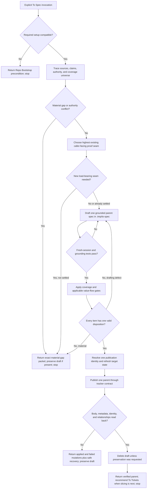

# To Spec Relationship And Runtime Design Synthesis

Status: future-rewrite design reference. The current canonical runtime and its
installed mirror remain unchanged. This document records the complete selected
design, evidence, extraction boundaries, and verification burden for a later
`$to-spec` rewrite; it is not an additional runtime contract.

Runtime authority remains in:

- `skills/custom/to-spec/SKILL.md` and `agents/openai.yaml`;
- the target repository's `AGENTS.md`, tracker, domain, and engineering
  contracts;
- `$codebase-design` for shared architecture vocabulary;
- `$wayfinder` for a bounded decision campaign and its successful or correction
  return;
- `$to-tickets` for implementation slicing, dependency order, approval, and
  ready state;
- `docs/synthesis/skill-context-relationships.md` for composition edges;
- pack tests and behavior evaluations; and
- the installed mirror under `C:\Users\steve\.agents\skills\to-spec`.

At synthesis time, the canonical and installed `SKILL.md` files match. A future
rewrite changes canonical source first and reaches the mirror only after the
complete candidate passes its promotion gate and synchronization is separately
authorized.

## How To Read This Document

This synthesis has four layers:

1. **Orientation** states the outcome, selected design, vocabulary, and
   explanatory flow.
2. **Normative Design** is the sole authority for proposed runtime behavior,
   artifacts, relationships, and completion.
3. **Evidence And Rationale** preserves source pressure, deliberate
   non-changes, risks, and deferred alternatives without creating more rules.
4. **Extraction And Verification** maps the design into owned runtime surfaces,
   evaluation phases, acceptance cases, and promotion gates.

| Question | Owning section |
| --- | --- |
| What outcome governs the rewrite? | [North Star](#north-star) |
| What design is selected? | [Design Verdict](#design-verdict) |
| What do the runtime leading words mean? | [Leading-Word Runtime Model](#leading-word-runtime-model) |
| When may To Spec run or publish? | [Invocation And Admission](#invocation-and-admission) and [Authority And Gap Contract](#authority-and-gap-contract) |
| What does Source Trace prove? | [Source Trace Contract](#source-trace-contract) |
| What exactly belongs in the parent spec? | [Parent Spec Artifact Contract](#parent-spec-artifact-contract) |
| How are stories and acceptance made exhaustive? | [User-Story And Acceptance Contract](#user-story-and-acceptance-contract) |
| How is a proof seam chosen? | [Proof-Seam Contract](#proof-seam-contract) |
| How are completeness and integration values checked? | [Coverage Contract](#coverage-contract) and [Value-Flow Contract](#value-flow-contract) |
| What may be mutated and how is publication verified? | [Draft And Publication Contract](#draft-and-publication-contract) |
| What may the skill return? | [Return Contract](#return-contract) |
| Which other skill owns each adjacent concern? | [Relationship Ownership](#relationship-ownership) |
| Where does each future change live? | [Runtime Ownership And Change Map](#runtime-ownership-and-change-map) |
| What must pass before promotion? | [Staged Behavior-Evaluation Protocol](#staged-behavior-evaluation-protocol), [Migration And Acceptance Matrix](#migration-and-acceptance-matrix), and [Promotion Gate And Residual Gaps](#promotion-gate-and-residual-gaps) |

When another layer disagrees with Normative Design, correct that layer. The
ownership map places rules, the evaluation protocol owns proof quality, the
acceptance matrix owns case coverage, and the promotion gate owns admission;
none may redefine runtime behavior.

# Layer One: Orientation

## North Star

To Spec owns one outcome: one source-traced parent spec that lets a fresh Codex
session recover settled product and engineering intent, distinguish commitments
from context, and identify how user-visible behavior can be proved without
reopening settled decisions or inventing missing ones.

The parent spec is the durable intent authority for later slicing and Spec-axis
review. It is neither a transcript summary nor an implementation plan. It must
be:

- **faithful**: every commitment has an authoritative source and no material
  decision is invented;
- **grounded**: terms, premises, decisions, repo constraints, and conflicts are
  introduced before use or point sharply to their owner;
- **exhaustive**: every source-visible actor, capability, benefit, flow,
  acceptance branch, constraint, failure, prototype finding, and scope boundary
  has one disposition;
- **testable**: the highest meaningful caller-facing proof seam and observable
  proof points are settled;
- **fresh-session complete**: the artifact alone recovers the shared
  understanding while authoritative domain truth remains linked rather than
  duplicated; and
- **durable**: one tracker parent is published and its body and metadata are
  read back before success.

Compression, publication speed, and template uniformity remain subordinate to
those gates.

## Design Verdict

Keep the current five-verb spine and strengthen its contracts rather than add a
larger workflow:

```text
Trace -> Choose -> Draft -> Cover -> Publish
```

The selected design is:

1. Retain explicit-only invocation. A human or explicit caller decides when
   source is settled enough to attempt specification.
2. Keep one parent-spec output, one disposable draft, and one publication
   mutation boundary.
3. Turn `Source Trace` from a bibliography into a claim-to-source and
   disposition ledger.
4. Make the material-gap boundary precise. To Spec may discover and report a
   gap; it may not resolve user-owned product, scope, architecture, or proof
   decisions by implication.
5. Preserve comprehensive, numbered, exhaustive user stories while separating
   source-visible user value from implementation-only constraints and mapping
   both through the coverage ledger.
6. Settle the highest existing caller-facing proof seam before prose hardens
   around an untestable design. A new load-bearing seam is itself a commitment
   requiring settled authority.
7. Keep the full parent-spec section contract in the main skill. The current
   schema is universal and compact enough that a disclosed format helper would
   add a context hop without hiding a real branch.
8. Load `$codebase-design` only as vocabulary. To Spec keeps source, artifact,
   proof-seam, mutation, and completion authority.
9. Keep tracker transport and provider behavior in the target repository's
   tracker contract. To Spec owns the semantic publication intent and verifies
   the observed result.
10. Recommend `$to-tickets` only after verified publication, then stop. Ticket
    slicing, dependency order, approval, and `ready-for-agent` remain outside
    this skill.

The rewrite should sharpen definitions, tables, and terminal packets in
synthesis and evaluations, then extract only behavior-changing language into a
lean runtime file.

## Delivery Boundary

To Spec begins with settled source and ends with one verified parent spec.

- Wayfinder may deliver distributed settled decisions and evidence. To Spec
  synthesizes them into the fresh-session artifact.
- Direct conversation, accepted design evidence, an approved improvement
  candidate, or another durable artifact may also supply settled source.
- To Spec may inspect relevant code and owners to ground the spec. It does not
  turn that inspection into implementation scope or patch design.
- To Spec records decisions. It does not make reserved product, domain,
  architecture, privacy, security, or proof commitments without authority.
- To Spec publishes the parent. To Tickets later derives approved implementation
  slices and the ready frontier.

A parent spec remains selection context, not executable work. An implementation
skill needs one selected ready ticket or an accepted parent-backed graph.

## Specification Vocabulary

| Term | Meaning |
| --- | --- |
| **Parent spec** | The single durable tracker artifact that preserves settled intent and becomes the authoritative Spec input for slicing and review |
| **Settled source** | Source whose material product, scope, architecture, and proof commitments have an identifiable authority and no unresolved conflict that changes the intended outcome |
| **Source Trace** | The claim-to-source and disposition ledger for every relied-on commitment, decision, premise, term, exclusion, and evidence item |
| **Material gap** | Missing or conflicting authority whose resolution can change product intent, scope, architecture, security or privacy posture, externally visible behavior, or proof adequacy |
| **Non-material open question** | A named uncertainty that cannot change the accepted outcome or acceptance boundary and has an owner and consequence recorded in the spec |
| **Commitment** | Accepted product intent, user-visible behavior, acceptance, public or data contract, security or privacy posture, migration obligation, or agreed scope boundary |
| **Proof seam** | The highest meaningful caller-facing interface or observable boundary through which a commitment can be semantically proved |
| **Proof point** | One observable outcome, invariant, state transition, or failure result that evidence at the proof seam must establish |
| **Coverage universe** | Every source-visible commitment, actor, capability, benefit, flow, constraint, branch, edge, failure, prototype finding, value flow, and scope boundary that requires one disposition |
| **Disposition** | The one recorded treatment of a coverage item: specified, linked to an owner, deferred, rejected, out of scope, irrelevant with reason, or blocked by a material gap |
| **Value flow** | The lifecycle of an externally supplied value from authoritative source and sensitivity through destination, transformation, consumer, and verification |
| **Publication identity** | The intended tracker repository and exactly one parent target, whether a new item or an explicitly authorized existing item |

These terms orient the design. Layer Two owns their operational consequences.

## Leading-Word Runtime Model

| Leading word | Runtime meaning |
| --- | --- |
| **Trace** | Build the complete coverage universe, source authority, conflicts, gap classification, and claim-to-source ledger before drafting |
| **Choose** | Select and settle the highest existing proof seam, its proof points, prior art, and regression risks |
| **Draft** | Create one grounded, fresh-session-complete parent-spec candidate under `.tmp/to-spec/` using the normative artifact contract |
| **Cover** | Reconcile every coverage item and every applicable external value flow to exactly one disposition; reject hidden omissions |
| **Publish** | Resolve one publication identity, mutate one parent, read back body and metadata, clean or preserve the draft, and return one terminal result |

**Reconcile** is universal: after user interaction, external waiting, or any
observed concurrent mutation, refresh Git, source, draft, tracker target, and
authority state before further mutation.

## End-To-End Explanatory Flow



# Layer Two: Normative Design

## Normative Home Index

| Concern | Sole normative home |
| --- | --- |
| Explicit invocation, setup, and source admission | [Invocation And Admission](#invocation-and-admission) |
| Decision authority and gap classification | [Authority And Gap Contract](#authority-and-gap-contract) |
| Source discovery, authority, grounding, and disposition | [Source Trace Contract](#source-trace-contract) |
| Legal next step and step completion | [State And Operation Contract](#state-and-operation-contract) |
| Parent artifact sections and meanings | [Parent Spec Artifact Contract](#parent-spec-artifact-contract) |
| Story and acceptance exhaustiveness | [User-Story And Acceptance Contract](#user-story-and-acceptance-contract) |
| Proof-seam selection and proof notes | [Proof-Seam Contract](#proof-seam-contract) |
| Whole-source completeness | [Coverage Contract](#coverage-contract) |
| External-value completeness | [Value-Flow Contract](#value-flow-contract) |
| Draft path, mutation scope, identity, and read-back | [Draft And Publication Contract](#draft-and-publication-contract) |
| Context loading | [Runtime Context Loading Contract](#runtime-context-loading-contract) |
| Terminal result | [Return Contract](#return-contract) |
| Cross-skill trigger and ownership | [Relationship Ownership](#relationship-ownership) |

## Invocation And Admission

`$to-spec` remains explicit-only. A user names it directly, or an upstream
owner recommends it and stops before a later explicit invocation. Invocation
authorizes read-only source and repository inspection, one draft under
`.tmp/to-spec/`, and one parent publication after every gate passes. It does not
authorize source-artifact edits, domain writes, implementation tickets, code
changes, tracker cleanup outside the parent, or downstream execution.

Admission proceeds in this order:

1. Read the target repository's `AGENTS.md` and follow its tracker, domain,
   label, and engineering pointers.
2. Confirm the named tracker can create or explicitly update one parent and can
   read back the required body and metadata. Missing or incompatible required
   setup returns the exact `$repo-bootstrap` precondition before mutation.
3. Identify the bounded outcome, supplied source, publication repository, and
   any explicitly supplied existing parent target.
4. Start Trace. Source need not already be perfectly packaged, but it must be
   capable of reaching a settled Source Trace without To Spec choosing a
   reserved commitment.

Do not reject merely because some non-material uncertainty remains. Do not
admit publication while the outcome is foggy, several interdependent decisions
remain unresolved, an authority conflict changes the result, or the publication
identity is ambiguous.

## Authority And Gap Contract

To Spec classifies every uncertainty before it changes the artifact:

| Classification | Test | Runtime consequence |
| --- | --- | --- |
| Settled commitment | One authority accepted the decision and no current owner source contradicts it | Record and specify |
| Material gap | Resolution may change a commitment, architecture, public/data contract, security/privacy posture, proof seam, or scope | Stop before publication and return the exact missing decision and owner |
| Authority conflict | Two current authoritative sources disagree or current intent contradicts an ADR without reopening authority | Surface both sources and stop as a material gap |
| Non-material open question | Either answer preserves outcome and acceptance | Record owner, consequence, and why publication remains safe |
| Deferred option | Authority intentionally postponed it outside this spec's accepted outcome | Record trigger or boundary without designing it |
| Rejected option | Authority declined it | Record rationale and source; do not keep evaluating it |
| Evidence-only uncertainty | Implementation detail is unknown but does not change the commitment or proof boundary | Keep out of product decisions; record only when useful to downstream proof |

Conversation recency does not silently erase durable domain or ADR authority.
When a current user decision intentionally reopens one, record the conflict and
the authority that accepted the new decision. To Spec may translate settled
meaning into a coherent artifact; it may not promote inference, code shape,
prototype output, historical precedent, or likely user preference into a
commitment.

One isolated gap returns to the caller with the responsible owner named when
known. Several coupled in-scope gaps from a delivered Wayfinder map return one
cohesive correction packet to that campaign's Reopen boundary. To Spec does not
choose or execute a generic resolver.

## Source Trace Contract

Trace reads:

- the current request and explicit approvals;
- every supplied artifact in full, including decision-bearing comments;
- directly required linked context named by those artifacts;
- the relevant target-repo instructions, domain terms, ADRs, and owner docs;
- code, tests, interfaces, and prior art only far enough to ground current
  behavior, available seams, and durable constraints; and
- accepted outputs from research, prototype, diagnosis, design, grilling, or
  Wayfinder only within the authority each output actually carries.

For each relied-on item, `Source Trace` records enough to recover:

| Field | Requirement |
| --- | --- |
| ID | Stable local identifier used by stories, decisions, proof notes, and coverage |
| Claim or item | The commitment, premise, term, decision, exclusion, evidence item, or conflict being relied on |
| Source pointer | Durable issue, comment, artifact section, ADR, domain entry, code/test path, or explicit conversation decision |
| Authority | Who or what owns acceptance of this kind of claim |
| Status | Accepted, deferred, rejected, out of scope, irrelevant with reason, open non-material, or material gap |
| Spec destination | The section and story, decision, proof note, edge case, or exclusion that carries the item |

Equivalent fields may be rendered as a compact table or grouped bullets. The
semantic fields, not the visual format, are required.

The grounding test passes only when every term, premise, and decision is
introduced before use or has a sharp pointer to its authoritative owner. Link
to durable domain truth rather than copying an entire glossary or ADR into the
spec. Historical and rejected sources remain visibly classified so a fresh
session cannot mistake them for current authority.

Trace completes only when the coverage universe is enumerated, every relied-on
claim has authority and status, conflicts are classified, and the remaining
source set is sufficient to attempt proof-seam selection.

## State And Operation Contract

| Current fact | Legal next operation | Operation completion |
| --- | --- | --- |
| Setup missing or incompatible | Return setup blocker | Exact missing capability and `$repo-bootstrap` precondition are returned without mutation |
| Source not yet traced | Trace | Coverage universe, authority, Source Trace, and gap classification are complete |
| Material gap or conflict exists | Return gap | One exact packet names affected commitments, authority needed, source evidence, and preserved draft |
| Trace complete; proof seam unsettled | Choose | Existing seam is selected, or a new seam is source-approved, with proof points and risks |
| Seam settled; no complete candidate draft | Draft | Artifact contract, fresh-session test, and grounding test pass |
| Draft complete; coverage unreconciled | Cover | Every coverage item and applicable value flow has one valid disposition |
| Cover exposes a drafting omission | Draft | Missing source-settled content is added and Cover reruns |
| Cover exposes a material gap | Return gap | Publication remains blocked |
| Candidate is publishable | Publish | Identity resolves; one mutation succeeds; body and metadata read back; draft is deleted or intentionally preserved |
| Publication partially applies or cannot be verified | Return publication blocker | Applied and failed operations, observed state, draft path, and safest recovery are returned |
| Publication is verified | Return complete | Parent reference and next boundary are returned; no downstream skill starts |

A later visible step never licenses early completion of the current one. The
five leading words compress the table; they do not replace its gates.

## Parent Spec Artifact Contract

The candidate and published parent use these sections in this order unless a
target-owned machine schema requires an equivalent mapping:

| Section | Normative content |
| --- | --- |
| `Source Trace` | Claim-to-source, authority, status, and spec-destination ledger; includes explicit irrelevance reasons |
| `Problem Statement` | Current state, affected actors, evidence, cost or failure, and why the bounded problem matters |
| `Desired Outcome` | Observable future state, success boundary, and the value preserved when the spec succeeds |
| `User Stories` | Comprehensive numbered stories and their exhaustive applicable acceptance branches under the story contract |
| `Accepted Decisions` | Settled decision, authority/source ID, consequences, and any invariants it creates |
| `Deferred Or Rejected Options` | Deliberate non-choices, rationale, and any explicit reconsideration trigger |
| `Edge Cases And Failure Modes` | Boundary, invalid, permission, dependency, lifecycle, and recovery behavior not clearest inside one story |
| `Proof Seams And Testing Notes` | Selected seam, proof points, state branches, prior art, likely tracer bullets, fixtures, regression risks, and approved new-seam decision when applicable |
| `Out Of Scope` | Explicit exclusions and neighboring work the spec does not authorize |
| `Open Questions` | Non-material questions only, each with owner, consequence, and why either answer preserves acceptance |
| `Further Notes` | Optional context that changes downstream understanding but fits no owned section; omit when empty |

The spec describes product and engineering intent at the commitment boundary.
It includes a path or snippet only when a durable contract or prototype finding
preserves a decision more precisely than prose. Patch design, exact file lists,
ticket dependency graphs, estimates, worker briefs, and `ready-for-agent` state
belong downstream.

The fresh-session test passes only when a new session can identify the problem,
outcome, actors, accepted and rejected decisions, complete acceptance boundary,
proof seam, edge and failure behavior, exclusions, open non-material questions,
and authoritative source owners without the original conversation.

## User-Story And Acceptance Contract

User stories are comprehensive, numbered, and source-traced. Together they
exhaust every source-visible actor, capability, benefit, flow, edge case, and
acceptance branch. Each story carries:

- an actor with a real source-visible role;
- the capability or outcome the actor needs;
- the benefit, protected value, or failure avoided;
- Source Trace IDs for the commitment and decisions it preserves; and
- all applicable observable acceptance branches.

Use ordinary story wording when useful, but semantics outrank one sentence
template. Do not invent personas or turn pure implementation technique into a
counterfeit user need. A source-visible operator, administrator, integrator,
auditor, support role, external system, or automated consumer is a valid actor
when its behavior or value is part of acceptance. Implementation-only
constraints still receive a disposition in Accepted Decisions, proof notes, or
Out Of Scope.

For each story, derive applicable branches from meaning:

- normal success and minimum useful outcome;
- absent or initial state, current reusable state, and legacy or incompatible
  state when state persists;
- valid boundary values and invalid input;
- identity, permission, privacy, and security boundaries;
- dependency unavailable, partial failure, timeout, retry, idempotence, and
  recovery when external effects exist;
- supported configuration, provider, profile, or access-path variants;
- migration, compatibility, rollback, restart, expiry, or lifecycle
  transitions when promised; and
- observable performance, accessibility, audit, or data-handling behavior when
  source-visible.

Cover every distinct semantic branch and high-risk interaction, not a blind
Cartesian product. A branch may live under its story or in Edge Cases And
Failure Modes with a stable story reference. The story set is complete only
when adding another source-derived actor, capability, benefit, or branch would
duplicate an existing disposition rather than expose omitted behavior.

## Proof-Seam Contract

Choose the highest existing seam that lets a caller or user observe the promised
meaning with the least internal coupling. Apply `$codebase-design` vocabulary
for interface, seam, adapter, depth, leverage, and locality while retaining To
Spec authority.

Record:

- the selected existing interface or observable boundary;
- which stories and proof points it proves;
- the oracle or observable result at that seam;
- applicable state-boundary branches and public access paths;
- useful existing fixtures, commands, prior patterns, or likely tracer bullets;
- regression and integration risks; and
- lower seams deliberately rejected when they would prove only implementation
  detail.

If no existing seam can prove the accepted behavior, record the proposed
load-bearing seam, why it is necessary, caller impact, compatibility and
migration consequences, prior art, and regression risk. The new seam proceeds
only when settled source already approves that commitment or the accountable
owner resolves the resulting material gap.

Proof notes guide later slicing and implementation; they do not prescribe test
count, exact patch structure, or private-helper assertions. A seam name without
observable proof points does not pass Choose.

## Coverage Contract

Cover reconciles the complete Source Trace against the draft. Every item in the
coverage universe has exactly one disposition and one visible destination.

The gate includes:

- commitments, actors, capabilities, benefits, and flows;
- accepted, deferred, and rejected decisions;
- constraints, invariants, public and data contracts;
- every applicable state, permission, configuration, migration, and lifecycle
  branch;
- edge cases, failure modes, recovery, and partial effects;
- prototype findings and limits on what they prove;
- domain terms, ADR consequences, and surfaced conflicts;
- proof seams, proof points, regression risks, and unproved behavior;
- value flows when the trigger applies; and
- exclusions, neighboring work, and explicit irrelevance reasons.

Coverage does not pass because every template section contains text. It passes
when a source-to-destination reconciliation finds no hidden item, contradictory
disposition, ungrounded claim, or unsupported acceptance branch.

An omitted but settled item returns to Draft. A missing authority, source link,
proof decision, or value-flow link that can change acceptance is a material gap.
An irrelevant item needs a reason; silence is not a disposition.

## Value-Flow Contract

Apply the value-flow gate to setup, credentials, secrets, generated identifiers,
configuration, CI, migration, deployment, webhooks, external integrations, and
other work whose correctness depends on a value crossing an ownership or system
boundary.

For each external value, trace:

| Field | Requirement |
| --- | --- |
| Value | Stable name or class; never the secret or sensitive value itself |
| Source | Authoritative issuer, producer, generation step, or user input |
| Sensitivity | Classification and handling constraint, including redaction and persistence limits |
| Destination | Exact configuration, storage, request, artifact, or runtime boundary that receives it |
| Transformation | Validation, encoding, mapping, derivation, rotation, or migration that changes it |
| Consumer | Component, workflow, external service, or actor that uses it |
| Lifecycle | Creation, update, expiry, rotation, revocation, cleanup, rollback, or restart behavior when applicable |
| Verification | Observable proof that the intended consumer received and used the correct value without disclosure |

Every hop needs source authority and observable acceptance. A missing source,
sensitivity, destination, consumer, lifecycle obligation, or verification path
is a material gap when it can change safe behavior. Record the gap; never invent
configuration or expose a secret to make the table look complete.

## Draft And Publication Contract

### Draft

Create one candidate at `.tmp/to-spec/<slug>.md`. The slug is stable for the
invocation. Supplied artifacts remain read-only sources unless the user
explicitly authorizes a separate update. The draft is disposable but becomes
the recovery artifact whenever publication is blocked.

Refresh and reread the complete draft plus every in-scope source changed during
an interaction or external wait before continuing mutation. Reconcile the
Source Trace and rerun affected gates after any semantic change.

### Publication Identity

Before mutation, resolve:

- target tracker and repository;
- whether the operation creates one new parent or updates one explicitly named
  existing parent;
- intended title, body, labels or state, parent metadata, and relationships
  supported by the target contract; and
- current target revision or absence evidence needed for safe read-back.

Do not silently overwrite or merge into a plausible existing spec. Ambiguous
identity or update authority is a material gap. Provider-specific commands,
labels, and identity mechanics remain in the target tracker contract.

### Mutation And Read-Back

Mutate only the draft and the resolved parent. Apply the target tracker
contract's mutation operation, then refetch the parent and verify:

- provider identity and repository;
- title and full body against the candidate;
- intended labels, state, parent or relationship metadata, and open/closed
  status;
- the absence of unintended implementation tickets or ready-state mutation;
  and
- any target-returned revision needed for recovery.

Success requires observed state, not a successful API response alone. Partial
or unverifiable publication is blocked. Return applied operations, failed or
unknown operations, observed state, the preserved draft, and the safest
recovery action. Do not retry a non-idempotent create until identity is
reconciled.

After complete read-back, delete the disposable draft unless the user explicitly
asked to preserve it. Report cleanup or the intentionally preserved path.

## Runtime Context Loading Contract

Load context by operation:

| Trigger | Required context | Exclude |
| --- | --- | --- |
| Invocation and setup | Main skill, target `AGENTS.md`, named setup pointers, minimum tracker capability contract | Provider implementation details not needed to establish compatibility |
| Trace | Supplied sources in full, directly required links, relevant domain/ADR owners, bounded code/tests/prior art, `$codebase-design` vocabulary | Entire repository, unrelated ADRs, downstream ticket procedure, full direct-design procedure |
| Choose | Existing public seams, caller behavior, proof owners, relevant tests and prior art | Patch design, speculative abstractions, implementation estimates |
| Draft | Normative artifact contract, completed Source Trace, settled seam record | Tracker mutation commands, ticket schema, implementation file plan |
| Cover | Complete draft, Source Trace ledger, applicable state and value-flow branches | New speculative requirements or unrelated source expansion |
| Publish | Resolved candidate, current publication identity, target tracker operation and read-back fields | To Tickets procedure, implementation or review workflows |
| Blocked recovery | Preserved draft, observed provider state, exact failed operation, target recovery contract | Blind retry or unrelated tracker cleanup |

The main `SKILL.md` keeps the universal outcome, authority, five-step spine,
artifact sections, sharp gates, mutation boundary, Return, and completion. No
new disclosed To Spec helper is selected by this design.

## Return Contract

Return exactly one terminal form:

### Complete

- verified parent reference and provider identity;
- publication operation and observed revision or equivalent read-back evidence;
- coverage, grounding, fresh-session, proof-seam, and applicable value-flow
  gate status;
- draft cleanup or intentionally preserved path; and
- recommendation for `$to-tickets` when implementation slicing is next, then
  stop.

### Material gap

- affected Source Trace IDs and commitments;
- exact missing or conflicting decision;
- evidence already established;
- accountable owner or source owner when known;
- consequence for outcome, scope, architecture, security/privacy, or proof;
- one cohesive Wayfinder correction packet when the source is a delivered map;
  and
- preserved draft path when drafting began.

### Setup blocker

- missing or incompatible setup surface or tracker capability;
- the target repository and inspected pointer;
- exact `$repo-bootstrap` precondition; and
- confirmation that no draft or tracker mutation occurred unless a preexisting
  draft was merely inspected.

### Publication blocker

- intended publication identity;
- applied, failed, and unknown operations;
- observed body and metadata;
- preserved draft path;
- duplicate or partial-mutation risk; and
- safest exact recovery action.

Do not return a parent reference as complete before read-back. Do not begin
ticket slicing, implementation, review, domain persistence, or generic gap
resolution in the same invocation.

## Relationship Ownership

| Relationship | Form | Trigger | To Spec retains | Other owner retains |
| --- | --- | --- | --- | --- |
| User or Skill Router -> `$to-spec` | Recommend then later explicit invocation | Settled source needs one durable parent spec | Admission, synthesis, publication, Return | Caller retains route choice before invocation |
| `$wayfinder` -> `$to-spec` | Recommend and stop | Delivered map has coherent settled source and no material gap | Fresh-session synthesis, grounding, stories, coverage, proof seam, parent publication | Wayfinder retains map history, decisions, evidence, budgets, claims, and successful closure |
| `$to-spec` -> `$wayfinder` correction | Typed return to source owner; later explicit resume | A delivered map contains coupled in-scope material gaps and valid correction authority | Gap detection and exact affected parent-spec commitments | Wayfinder retains Reopen, correction budget, map mutation, resolver choice, and reseal |
| `$improve-codebase` -> `$to-spec` | Recommend and stop | Selected Concentrate candidate has settled direction needing a parent spec | Source reconciliation and parent publication | Improve Codebase retains survey evidence, classification, rank, and report |
| `$to-spec` -> `$codebase-design` | Load vocabulary | The spec needs interface, seam, adapter, depth, leverage, or locality language | Source, decision, artifact, proof-seam, mutation, and completion authority | Codebase Design owns vocabulary definitions; direct design is not invoked implicitly |
| `$to-spec` -> domain and ADR docs | Read authoritative reference | Product language or durable decisions bear on the spec | Reconciliation and conflict reporting | Domain Modeling and destination owners retain durable truth and write authority |
| `$to-spec` -> `$repo-bootstrap` | Recommend and stop | Required setup or tracker operation is absent or incompatible | Exact precondition and no-mutation return | Repo Bootstrap owns reconciliation, proposal, approval, provisioning, and verification |
| `$to-spec` -> `$to-tickets` | Recommend and stop | Parent publication and every completion gate are verified | Parent intent, Source Trace, and publication evidence | To Tickets owns slicing, dependency order, approval, publication, ready state, and frontier |

### Relationship exclusions

- To Spec does not invoke Wayfinder, Grilling, Research, Prototype, Domain
  Modeling, or Codebase Design Direct Design to repair unsettled source inside
  the same run.
- Wayfinder does not publish the parent spec or route directly to To Tickets.
- Codebase Design vocabulary does not create a second design artifact or choose
  a reserved architecture commitment.
- Repo Bootstrap supplies transport capability; it does not own Source Trace,
  parent identity, gap classification, content, or completion.
- To Tickets may preserve and cite the parent; it does not rewrite its accepted
  intent while slicing.

# Layer Three: Evidence And Rationale

## Source Pressure And Existing Evidence

The current design grew through several useful pressures:

- The upstream PRD-to-spec rename clarified the artifact and introduced early
  proof-seam pressure.
- The local five-verb rewrite preserved setup gating, Source Trace, proof-seam
  choice, `.tmp/` drafting, tracker publication, mutation read-back, and the To
  Tickets boundary while removing a longer mixed-process block.
- User direction strengthened user stories from merely numbered to explicitly
  comprehensive and exhaustive across actors, capabilities, benefits, edge
  cases, and acceptance branches.
- Later hardening added the grounding test so undefined terms, premises, and
  decisions cannot hide behind a complete-looking template.
- Integration evaluation added the value-flow gate because ordinary coverage
  can miss a secret, generated identifier, configuration destination, consumer,
  or verification hop.
- Relationship evaluations established that To Spec loads Codebase Design
  vocabulary while keeping one output and completion owner.
- Whole-pack traces established the parent spec as durable Spec-axis input and
  selection context, never as an implementation work item.

Current automated protection proves the explicit-only policy, five leading
words, broad section surface, and declared composition edges structurally.
Evaluation fixtures specify grounding, value-flow, and tracker read-back
behavior, while whole-pack traces preserve contract-simulation evidence. None
of that yet proves live parent creation, partial provider failure, duplicate
identity recovery, or repeated fresh-context story exhaustiveness.

## Why Source Trace Is A Ledger

A bibliography proves that a source was seen, not that its commitments survived.
The claim-to-source ledger makes omission, authority, contradiction, and
destination inspectable. It also lets To Tickets preserve source pointers
without reverse-engineering which paragraph came from which decision.

The ledger remains inside `Source Trace`; adding a separate coverage artifact
would create another authority and another thing to synchronize.

## Why Stories And Coverage Stay Separate

Stories organize source-visible value around actors. Coverage proves nothing
else disappeared. Forcing every migration invariant, privacy rule, or internal
compatibility constraint into `As a user` wording invents actors and hides the
real authority. Keeping the two gates separate preserves exhaustive stories and
exhaustive commitments without distorting either.

## Why Proof Precedes Draft

Prose can make an untestable shape feel settled. Selecting the highest existing
caller-facing seam before drafting exposes when accepted behavior lacks an
observable boundary or when a proposed abstraction is actually a new
commitment. It also gives To Tickets a durable proof direction without deciding
the implementation patch.

## Why No New Helper Is Selected

Every invocation needs the artifact sections, grounding rule, story demand,
coverage gate, publication boundary, and completion criterion. The current
runtime is already compact. Moving universal material to `SPEC-FORMAT.md` would
spend a context hop and risk Draft starting before the full contract loads.

Split only if behavior evaluation later shows irreducible premature completion
or the artifact schema becomes independently reusable. Length alone is not
evidence for a split.

## Deliberate Non-Changes

- Keep `allow_implicit_invocation: false`; To Spec is a deliberate transition
  from settled source to durable authority.
- Keep `Trace -> Choose -> Draft -> Cover -> Publish` as the runtime spine.
- Keep `.tmp/to-spec/<slug>.md` as the bounded disposable draft location.
- Keep one parent spec and one publication mutation boundary.
- Keep the current section vocabulary unless behavior evidence supports a
  semantic change.
- Keep comprehensive, numbered, exhaustive user stories as a hard demand.
- Keep the fresh-session, grounding, coverage, value-flow, and Mutation
  read-back gates.
- Keep Codebase Design as loaded vocabulary, not a second artifact owner.
- Keep provider mechanics in target-repo tracker contracts.
- Keep To Tickets as the sole normal successful downstream recommendation.
- Keep supplied artifacts read-only unless separately authorized.

## Rejected Designs

| Design | Rejection reason |
| --- | --- |
| Implicit To Spec invocation whenever a request resembles planning | Settledness and publication are user-significant boundaries; automatic reach risks publishing inferred intent |
| To Spec resolves its own material gaps | Collapses decision authority into artifact writing and hides invention |
| One story per source sentence | Produces fragments, duplicates value, and mistakes source granularity for semantic behavior |
| Every implementation constraint becomes a user story | Invents personas and obscures the actual contract owner |
| A second standalone coverage artifact | Creates synchronization and authority drift beside Source Trace and the parent |
| Full Codebase Design invocation on every spec | Transfers output authority and adds design procedure even when vocabulary is sufficient |
| Publishing implementation tickets with the parent | Absorbs To Tickets approval, dependency, and ready-state authority |
| Embedding GitHub, GitLab, or local tracker commands in To Spec | Duplicates target setup contracts and breaks provider neutrality |
| Treating a successful create response as publication proof | Misses partial metadata, wrong repository, truncation, and duplicate identity |
| Copying full domain truth into the parent | Creates a stale second source of truth instead of a sharp owner pointer |

## Deferred Hypotheses

These are not selected runtime behavior:

- whether a machine-readable Source Trace or coverage table materially improves
  To Tickets reliability enough to justify a schema;
- whether an optional `SPEC-FORMAT.md` becomes useful after live samples expose
  attention or maintenance pressure;
- whether publication should support idempotency keys or target-specific
  compare-and-set primitives when tracker contracts expose them;
- whether separate acceptance-scenario syntax improves exhaustive branch
  recovery versus nested story bullets;
- whether automatic source-to-section linting can detect omissions without
  rewarding template echoes; and
- whether live provider fixtures can safely exercise duplicate creation and
  partial read-back recovery in CI.

Promote none without a red-capable control, a bounded owner, and evidence that
the added mechanism improves behavior rather than document ceremony.

## Known Evidence Limits

- No live tracker parent publication and read-back run is recorded for the
  current design.
- Existing workflow traces are contract simulations, not independent repeated
  fresh-context samples.
- The exhaustive-story requirement has structural wording protection but no
  fixed corpus measuring omitted actors or branches across repeated runs.
- The value-flow fixture covers one integration shape; credential rotation,
  rollback, and partial external failure need broader cases.
- Current tests do not inject duplicate parent identity, mid-publication target
  drift, or partial metadata application.
- Source/mirror parity at synthesis time does not prove parity after a future
  rewrite.

# Layer Four: Extraction And Verification

## Proposed Runtime Semantic Surface

The eventual main skill should read approximately as:

```text
Outcome and explicit-only mutation boundary
Setup and settled-source admission
Compact material-gap and Source Trace vocabulary
Trace
Choose
Draft with parent-spec sections, fresh-session, grounding, and exhaustive stories
Cover with coverage and triggered value-flow gates
Publish with identity, Mutation read-back, draft cleanup, and partial-failure return
Relationship boundaries
Return
Completion
```

This is a semantic target, not approved final wording. The final `SKILL.md`
keeps only universal behavior, sharp gates, the section surface, mutation and
Return boundaries, and completion. Tables, rationale, history, acceptance
matrices, provider detail, and rejected alternatives remain outside runtime.

## Runtime Ownership And Change Map

The `Must not absorb` column is part of the design.

| Surface | Owns | Proposed delta | Must not absorb |
| --- | --- | --- | --- |
| `skills/custom/to-spec/SKILL.md` | Outcome, authority, five-step spine, gap rule, Source Trace, artifact sections, stories, proof seam, coverage, value flow, publication, Return, completion | Sharpen admission, ledger semantics, branch completeness, publication identity, typed blockers, and interaction reconciliation while pruning duplicate explanation | Research, interviewing, Wayfinder resolution, direct module design, ticket slicing, provider commands, implementation planning, or rationale |
| `skills/custom/to-spec/agents/openai.yaml` | Explicit-only policy and concise human-facing prompt | Retain explicit-only reach; mention settled source, exhaustive source trace, one verified parent | Runtime procedure, section list, or tracker detail |
| Target `AGENTS.md` and `docs/agents/issue-tracker.md` | Tracker route, provider operations, supported metadata, read-back, and recovery primitives | Supply the capabilities To Spec calls; change only if an actual missing generic capability is found | Spec content, gap semantics, proof-seam choice, or completion |
| Target `docs/agents/domain.md`, `CONTEXT.md`, and ADRs | Domain vocabulary, durable decisions, and ownership | Remain pointed-to authority | Parent artifact procedure or silent precedence rules |
| `skills/custom/codebase-design` | Deep-module vocabulary and its own direct design procedure | Preserve vocabulary-only load contract | Parent output, source disposition, proof decision acceptance, publication, or completion |
| `skills/custom/wayfinder` and its references | Decision campaign, map, evidence, corrections, budgets, and closure | Ensure successful and correction returns supply the fields To Spec needs | Parent drafting, story synthesis, publication, or To Tickets routing |
| `skills/custom/to-tickets/SKILL.md` | Implementation coverage map, slices, dependencies, approval, publication, ready state, frontier | Consume the verified parent and preserve its source pointers | Parent intent rewrite or To Spec publication |
| `docs/synthesis/skill-context-relationships.md` | One authoritative composition edge per relationship | Add or sharpen only accepted triggers and return boundaries, including the Wayfinder correction return if promoted | Skill-local procedure |
| `tests/test_skill_pack_contracts.py` | Structural contracts | Protect invocation, five-step discovery, required semantic roles, relationships, reference resolution, and source/mirror rules | Incidental prose snapshots or claims of runtime behavior |
| `docs/validation/evals/core-workflows.md` | Behavior evaluation fixtures | Add control/candidate cases for source authority, gaps, story branches, proof seams, value flows, publication identity, partial failure, and Return | Runtime rules or provider implementation |
| Installed mirror `C:\Users\steve\.agents\skills\to-spec` | Validated runtime copy | Synchronize only after the complete canonical candidate passes and authorization is given | Independent edits or partial promotion |

No new To Spec helper, schema, script, or template is part of the selected
rewrite.

## Extraction Bundles

| Bundle | Surfaces | Coherent outcome |
| --- | --- | --- |
| `T1` | `SKILL.md`, `agents/openai.yaml` | Lean runtime semantic surface with explicit invocation, authority, operations, Return, and completion |
| `T2` | relationship map, Wayfinder and To Tickets boundary checks, target owner-doc assumptions | Every adjacent capability has one owner and a complete return boundary |
| `T3` | structural tests | Stable invocation, semantic roles, composition edges, and source/mirror integrity |
| `T4` | behavior evaluations and transcripts | Positive and negative evidence for every promoted behavior claim |
| `T5` | validation, installation dry-run, authorized sync, hash parity | One promoted canonical candidate and matching installed mirror |

## Staged Extraction Plan

Build the complete canonical candidate before installed promotion.

| Stage | Bundles | Extraction outcome | Stage boundary |
| --- | --- | --- | --- |
| `I1` | `T1` | Extract the accepted semantic core into one lean skill and invocation surface | Every Layer Two concern has a runtime expression or deliberate external owner; no rationale leaks into runtime |
| `I2` | `T2`, `T3` | Reconcile relationships and add structural protection | Every composition edge and mutation boundary has one owner and all references resolve |
| `I3` | `T4` | Prove behavior against fixed control and candidate scenarios | Every promoted claim passes its evaluation phase with no critical failure |
| `I4` | `T5` | Validate and promote one coordinated candidate | Canonical checks pass, residual gaps satisfy the gate, synchronization is authorized, and mirror hashes agree |

Stages order implementation and evidence; they are not independently
installable runtime variants.

## Staged Behavior-Evaluation Protocol

| Evaluation phase | Claims proved | Representative cases |
| --- | --- | --- |
| `E0`: Control lock | Current skill or no-guidance arm exhibits the claimed omission, invention, authority leak, or premature completion | One fixed red-capable scenario per promoted claim |
| `E1`: Attention and admission | Explicit invocation, setup, settled-source admission, Source Trace semantics, context loading, legal operation, Return, and completion are discoverable | Missing setup, clean settled source, conflicting ADR, non-material question, wrong reference |
| `E2`: Artifact semantics | Grounding, exhaustive stories, decisions, edge cases, proof seams, coverage, and value flows preserve meaning | Multi-actor feature, stateful behavior, migration, credential integration, prototype-limited evidence |
| `E3`: Mutation and recovery | One identity, bounded mutation, interaction refresh, read-back, cleanup, duplicate risk, partial publication, and correction returns preserve authority | New parent, explicit update, ambiguous identity, concurrent change, partial metadata, lost response, Wayfinder correction |
| `E4`: Integrated promotion | Relationships, target contracts, canonical validation, installation, and mirror parity hold together | Wayfinder-to-spec-to-tickets chain, local/GitHub/GitLab mappings, source/mirror comparison |

For each promoted behavior claim, fix the repository and tracker snapshot,
prompt, sources, authority packet, tools, runtime, model, reasoning tier, skill
hash, and rubric across arms. Run at least five independent fresh-context samples
per arm. Use the current skill as control for changed behavior and a no-candidate-
guidance control for genuinely new behavior. Stop when the control does not
exhibit the claimed failure.

Judge semantic preservation, omissions, unauthorized decisions, false
completion, context loaded, Return completeness, mutation scope, and recovery.
Record median, range or variance, worst result, protocol deviations, unavailable
telemetry, and residual gaps. Static tests protect structure only.

An evaluation phase passes only when the control demonstrates the failure, the
candidate materially reduces it, variance narrows or remains safe, and no new
critical failure appears.

## Migration And Acceptance Matrix

| Implementation / evaluation | Bundles | Behavior | Positive case | Negative control | Verification |
| --- | --- | --- | --- | --- | --- |
| `I1 / E1` | `T1` | Invocation and setup | Explicit invocation in a compatible repo begins Trace; missing required create or read-back capability returns one Bootstrap precondition before mutation | Ordinary planning text auto-invokes To Spec, or a missing tracker operation is guessed | Policy test, setup fixtures, fresh-context samples |
| `I1 / E1` | `T1` | Source admission | Bounded settled direct source and a delivered Wayfinder map are admitted | Foggy outcome, several coupled unresolved decisions, or ambiguous publication repository proceeds to drafting | Admission samples and authority rubric |
| `I1 / E1,E2` | `T1` | Source Trace ledger | Every relied-on claim has source, authority, status, and destination; domain truth is linked | A bibliography, copied glossary, historical note, or unsupported inference appears authoritative | Artifact inspection and claim-to-source reconciliation |
| `I1 / E1` | `T1` | Gap classification | Material conflict blocks; a truly non-material question publishes with owner and consequence | A material architecture or proof decision is hidden in Open Questions, or any open question blocks reflexively | Paired gap fixtures and critical-failure scoring |
| `I1 / E2` | `T1` | Grounding and fresh-session recovery | A new session recovers terms, premises, decisions, outcome, proof, and scope from the parent plus sharp owner pointers | The draft relies on conversation memory, undefined terms, or copied stale authority | Blind fresh-session reconstruction rubric |
| `I1 / E2` | `T1` | Exhaustive user stories | Two or more real actors, benefits, flows, and every applicable acceptance branch are mapped without invented personas | Happy path only, one generic user, edge cases detached from stories, or implementation constraints disguised as users | Fixed source corpus, omission scoring, five-sample variance |
| `I1 / E2` | `T1` | Stateful acceptance | Applicable absent, reusable, legacy, configuration, access, and lifecycle branches are explicit | A broad green-test note substitutes for missing semantic state branches | State-boundary fixture and source-to-branch map |
| `I1 / E2` | `T1` | Proof-seam choice | Highest existing caller-facing seam names observable proof points and rejected lower seams | A private helper, seam name without oracle, or unapproved new interface passes Choose | Seam comparison fixture and Codebase Design vocabulary check |
| `I1 / E2` | `T1` | New load-bearing seam | Settled source explicitly approves the new public boundary and its migration and risks are recorded | To Spec invents an abstraction because existing tests are inconvenient | Authority packet and material-gap negative control |
| `I1 / E2` | `T1` | Coverage | Every source item maps to one section, owner pointer, deferral, rejection, exclusion, irrelevance reason, or gap | Filled template sections hide one omitted commitment or contradictory disposition | Bidirectional source/draft reconciliation |
| `I1 / E2` | `T1` | Value flow | Secret class, generated ID, destination, consumer, lifecycle, and verification are traced without exposure | Missing source-to-sink link, invented configuration, or literal secret still publishes | Expanded integration fixtures and sensitive-output inspection |
| `I1 / E3` | `T1` | Draft and interaction refresh | One stable `.tmp` draft is reread and reconciled after user or external change | Mutation resumes from remembered content or overwrites an intervening edit | Before/after fixture and Source Trace diff |
| `I1,I2 / E3` | `T1,T2` | Publication identity | One new parent or explicitly named update target is resolved before mutation | A plausible existing issue is silently overwritten, or a lost create response causes an unreconciled duplicate retry | Provider identity and retry fixtures |
| `I1,I2 / E3` | `T1,T2` | Mutation read-back | Full body, metadata, identity, relationship, state, and revision are observed; draft deletes after success | API success, truncated body, wrong repo, partial labels, or unknown state is reported complete | Local and connector-backed read-back fixtures |
| `I1,I2 / E3` | `T1,T2` | Partial publication recovery | Applied, failed, and unknown operations plus preserved draft and safest recovery return | Blind retry, cleanup of unknown state, draft deletion, or false parent reference | Failure injection and duplicate-risk checks |
| `I1,I2 / E3` | `T1,T2` | Wayfinder correction return | Coupled gaps from one delivered map return one cohesive packet to Reopen without map mutation | To Spec starts resolvers, fragments corrections, resets budget, or publishes around the gap | Wayfinder correction fixture and relationship test |
| `I1,I2 / E4` | `T1-T3` | Composition ownership | Codebase Design stays vocabulary-only; Bootstrap owns setup; To Tickets starts only after later explicit invocation | Second output owner, automatic downstream invocation, or ticket creation inside To Spec | Relationship test and composition evaluation |
| `I3 / E4` | `T4` | Critical behavior evidence | Every changed claim has a red-capable control, five fresh samples per arm, rubric, variance, and worst outcome | Static prose assertions or one favorable sample are called behavioral proof | Evaluation record audit |
| `I4 / E4` | `T5` | Canonical promotion | Focused/full checks pass, changed files read back, dry-run is clean, authorized sync completes, hashes match | Partial candidate, unproved relationship, or stale mirror is promoted | Canonical commands, diff checks, install dry-run, parity |

## Promotion Gate And Residual Gaps

The promotion record names each claim, implementation stage, evaluation phase,
control and candidate hashes, fixed scenarios, source and authority packet,
sample counts, tools, model and reasoning tier, rubric, median, variance or
range, worst result, critical failures, protocol deviations, unavailable
telemetry, and residual gaps.

A critical failure blocks promotion regardless of averages:

- implicit activation or publication without explicit authority;
- invented, silently overridden, or misclassified material commitment;
- lost source, actor, acceptance branch, scope boundary, value-flow hop, or
  authoritative conflict;
- undefined context that a fresh session cannot recover;
- a private implementation seam substituted for an available caller-facing
  proof seam, or an unapproved new load-bearing seam;
- source artifact, domain, ticket, code, or unrelated tracker mutation;
- ambiguous or duplicate publication identity, false successful publication,
  missing required read-back, or deleted recovery draft after partial failure;
- Codebase Design, Wayfinder, Repo Bootstrap, or To Tickets authority absorbed
  by To Spec;
- incomplete Return or automatic downstream execution; or
- canonical/installed mismatch after claimed promotion.

Promote only the coordinated canonical family. A noncritical residual gap may
remain only when its evidence limit, operational consequence, safe fallback,
and later validation owner are explicit. No residual gap may affect source
faithfulness, authority, exhaustive acceptance, proof adequacy, mutation scope,
publication identity, read-back, recovery, relationship ownership, or
completion truth.

## Completion Criterion For The Future Rewrite

The rewrite is complete only when the selected Design Verdict is extracted
without rejected or deferred machinery; the main skill follows the Proposed
Runtime Semantic Surface; every Layer Two concern has one runtime expression or
external owner; explicit invocation and setup admission hold; Source Trace is a
claim-to-source and disposition ledger; material and non-material gaps are
classified correctly; the proof seam and proof points are settled; the parent
artifact passes fresh-session and grounding tests; user stories and acceptance
branches are exhaustive; every coverage item and applicable value flow has one
valid disposition; exactly one publication identity is mutated and read back;
partial failure preserves recovery; Return stops at the correct owner boundary;
all extraction bundles and acceptance rows pass their evaluation phases with no
critical worst-case regression; canonical validation and changed-file read-back
pass; synchronization is separately authorized; and the installed mirror
matches the validated canonical source exactly.
