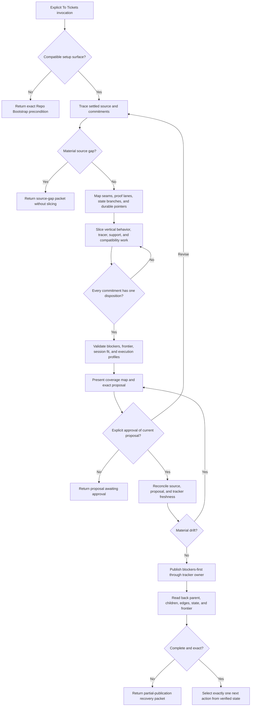

# To Tickets Runtime Design Synthesis

Status: exhaustive design reference, not an executable contract. The canonical
and installed To Tickets runtime is promoted at
`skills/custom/to-tickets/SKILL.md` hash
`E4D07BC78CD55E0DC5572105732800D2A6C1F2DCC6CF8D7DB1AB56C206653F1F`.
The promotion record owns the bounded behavioral results, control-clean no-op
dispositions, residual gaps, and installation evidence. The canonical and
installed runtimes match.
Support-work comparative economics and live-provider behavior remain residual
gaps and are not part of the promotion claim.

Runtime authority remains in:

- `skills/custom/to-tickets/SKILL.md` and `agents/openai.yaml`;
- the target repository's `AGENTS.md`, `docs/agents/issue-tracker.md`,
  `docs/agents/triage-labels.md`, domain routing, and engineering contract;
- the settled source and any parent spec, decision-bearing comments, ADRs,
  domain context, and prototype evidence it points to;
- `$to-spec`, `$triage`, `$implement`, and `$parallel-implement` at their owned
  boundaries;
- `docs/synthesis/skill-context-relationships.md`;
- pack contract tests and behavior evaluations as proof surfaces; and
- the installed mirror only as the validated runtime copy after authorized
  synchronization.

This synthesis preserves the selected design, runtime ownership, and evidence
boundary for `to-tickets`. It does not replace runtime authority, publish
tickets, or mutate tracker state.

## How To Read This Document

This document is exhaustive for accepted behavior, ownership boundaries,
material alternatives, promoted runtime placement, evidence pointers, and
residual gaps. It has four layers:

1. **Orientation** states the outcome, boundary, vocabulary, and explanatory
   end-to-end flow.
2. **Normative Design** is the sole synthesis authority for selected runtime
   behavior and relationships.
3. **Evidence And Rationale** preserves source pressure, deliberate
   non-changes, and deferred hypotheses without creating additional rules.
4. **Promoted Runtime And Ownership** records the compact runtime shape and
   durable placement across owning surfaces.

When a diagram, rationale, ownership row, or acceptance case disagrees with
Normative Design, correct the non-normative surface. The Normative Home Index
assigns each rule one owner. The Runtime Ownership Map assigns durable file and
skill placement.

| Question | Owning section |
| --- | --- |
| What outcome governs the runtime? | [North Star](#north-star) |
| What is selected, preserved, deferred, or rejected? | [Design Verdict](#design-verdict) |
| What may `to-tickets` accept as source? | [Invocation And Admission](#invocation-and-admission) |
| Which gates prevent premature publication? | [Authority Gates](#authority-gates) |
| What must be traced before slicing? | [Source Trace Contract](#source-trace-contract) |
| How is every commitment accounted for? | [Coverage Map Contract](#coverage-map-contract) |
| What makes a good vertical, tracer, or support slice? | [Slicing Model](#slicing-model) |
| What belongs in one ready ticket? | [Ticket Artifact Contract](#ticket-artifact-contract) |
| What is a real blocker rather than a scheduling constraint? | [Dependency Graph And Ready Frontier](#dependency-graph-and-ready-frontier) |
| What must be shaped for stateful work? | [State-Boundary Acceptance](#state-boundary-acceptance) |
| What must be known before a graph may route to Parallel Implement? | [Execution Economics And Parallel Profile](#execution-economics-and-parallel-profile) |
| How are compatibility migrations shaped and blast radius controlled? | [Compatibility Migration And Blast-Radius Control](#compatibility-migration-and-blast-radius-control) |
| What must the user approve? | [Approval Packet](#approval-packet) |
| What may happen next from the current observed state? | [Normative State And Transition Model](#normative-state-and-transition-model) |
| When is each process step complete? | [Operation And Completion Contracts](#operation-and-completion-contracts) |
| What does each artifact prove? | [Artifact Authority Contract](#artifact-authority-contract) |
| How does partial publication recover? | [Publication And Recovery](#publication-and-recovery) |
| Which implementation route is returned? | [Next-Action Selection](#next-action-selection) |
| What does every invocation return? | [Return Contract](#return-contract) |
| Which skill owns each handoff? | [Relationship Ownership](#relationship-ownership) |
| How is the promoted runtime arranged? | [Promoted Runtime Semantic Surface](#promoted-runtime-semantic-surface) |
| What evidence supports promotion, and what remains? | [Promoted Evidence And Remaining Limits](#promoted-evidence-and-remaining-limits) |

# Layer One: Orientation

## North Star

To Tickets owns one outcome: transform one bounded body of settled source into
an approved, dependency-ordered graph of independently grabbable,
ready-for-agent implementation tickets whose combined coverage preserves the
source and whose verified ready frontier has one unambiguous next action.

The graph is good when:

- every implementation commitment and scope boundary has one visible
  disposition;
- each ticket is one fresh-session-sized, semantically coherent slice;
- acceptance is observable through the highest meaningful proof seam;
- dependency edges represent real prerequisites rather than convenient
  scheduling;
- predicted scope and parallel-safety information are honest enough for the
  selected implementation owner;
- the user approves the exact graph before any tracker mutation; and
- publication, relationships, readiness, and the derived frontier are read
  back from the tracker.

Ticket count, maximum concurrency, short descriptions, and tracker artifact
creation are not the outcome. A graph of many plausible tickets is a failure
when it loses a commitment, invents a decision, obscures a true blocker,
creates uneconomic lanes, or cannot prove what each slice means.

## Design Verdict

| Stratum | Selected shape | Disposition |
| --- | --- | --- |
| Core | Preserve the five-verb `Trace -> Map -> Slice -> Approve -> Publish` spine, but make each verb's authority and completion criterion explicit | Selected |
| Invocation | Explicit-only; a user deliberately selects ticket shaping, while upstream skills recommend it and stop | Preserve `allow_implicit_invocation: false` |
| Source | Accept one bounded body of settled implementation source; return material source gaps without slicing or mutation | Selected |
| Coverage | Use one exhaustive coverage map with exactly one disposition for every source-visible implementation commitment and scope boundary | Selected |
| Slice shape | Vertical behavior slices are the default delivery shape; use tracer bullets for thin real feedback or load-bearing risk paths, proof-bearing support slices only when they unblock or de-risk a named delivery slice, and expand-migrate-contract stages for incompatible changes | Selected |
| Graph semantics | Separate true blocking edges from serial tripwires, predicted overlap, and implementation order | Selected |
| Readiness | Reuse the tracker-owned Ready-for-agent contract and add only To Tickets-owned source, slicing, coverage, and execution-profile fields | Selected |
| Publication | Require approval of the exact proposal, publish blockers first, preserve parent intent and lifecycle, and apply Mutation read-back to the graph and frontier | Selected |
| Downstream route | Return exactly one of blocker resolution, Implement, or Parallel Implement according to the verified frontier and caller intent | Selected |
| Runtime surfaces | Keep one compact `SKILL.md` plus `agents/openai.yaml`; use existing owning docs instead of adding a ticket template or operation file initially | Selected |
| Coordinated surfaces | Relationship text, receiving-skill assumptions, structural tests, behavior evidence, and mirror parity | Aligned across their owning surfaces |
| Deferred hypotheses | A mandatory draft file, graph visualizer, coverage validator, numeric sizing score, and auto-generated ticket schema | Deferred pending observed need |
| Rejected machinery | Tracker-provider procedure in the skill, implementation plans, file-by-file task choreography, automatic publication, automatic implementation, and parallelism based only on open slots or disjoint filenames | Reject |

## Delivery Boundary

The ordinary product-to-delivery chain is:

```text
settled source -> To Spec when a parent artifact is needed -> To Tickets
              -> Implement for one selected ready item
              -> Parallel Implement for one explicitly requested parent graph
```

To Tickets sits at the boundary between product/design intent and delivery
decomposition:

- an upstream source owner settles intent, public contracts, material design
  decisions, proof expectations, and scope;
- To Tickets preserves that meaning while choosing implementation slices,
  dependency order, acceptance, proof lanes, and execution-shaping metadata;
- Implement selects and delivers exactly one ready item; and
- Parallel Implement delivers one complete parent-backed graph, keeping work
  serial unless substantial semantic independence and proof isolation justify
  width.

To Tickets does not resolve product uncertainty, design the patch, assign
workers, choose TDD, execute the graph, review code, close implemented work, or
change a parent spec's lifecycle. It may inspect code to identify stable seams,
existing contracts, and proof lanes, but implementation technique remains with
the delivery owner.

## Leading-Word Runtime Model

The promoted skill keeps the compact vocabulary operational:

| Leading word | Runtime meaning |
| --- | --- |
| **Trace** | Establish one authoritative settled-source boundary, its Source Trace, commitments, accepted decisions, exclusions, and material gaps |
| **Map** | Inspect only enough repository reality to connect commitments to stable seams, state branches, proof lanes, durable pointers, and slicing constraints |
| **Slice** | Build one coverage-complete dependency graph of vertical behavior slices, tracer bullets where the feedback or risk purpose applies, justified support slices, and compatibility-migration stages |
| **Approve** | Present the exact coverage map and graph; obtain explicit approval for every judgment that will become tracker state |
| **Publish** | Reconcile freshness, create only the approved graph blockers-first, read back every mutation, derive the frontier, and return one next action |

**Reconcile** is universal before mutation: after user feedback, an external
wait, a tool failure, or any intervening tracker or repository change, refresh
the source, proposal, tracker state, and affected relationships before relying
on prior approval.

## Shaping Vocabulary

| Term | Meaning |
| --- | --- |
| **Settled source** | One bounded source set whose product intent, implementation-relevant commitments, material decisions, scope, and proof expectations are authoritative enough to slice without invention |
| **Commitment** | One source-visible behavior, contract, constraint, state branch, failure or permission outcome, migration obligation, proof expectation, or scope boundary that affects implementation |
| **Coverage map** | The exhaustive reconciliation from every commitment to exactly one ticket, explicit deferral, explicit exclusion, or no-ticket reason |
| **Vertical behavior slice** | One request or behavior organized across the real components or concerns needed for its selected value |
| **Tracer bullet** | One skeletally thin real path selected to obtain early feedback or retire a load-bearing risk; it may also be a vertical behavior slice |
| **Support slice** | One enabling change with its own local proof that unblocks or materially de-risks a named delivery slice without becoming generic cleanup |
| **Blocking edge** | A semantic or execution prerequisite that makes the dependent ticket not executable until the blocker is satisfied |
| **Serial tripwire** | Evidence that work should not execute concurrently even when no semantic dependency exists; it is scheduling metadata, not automatically a blocker |
| **Ready-for-agent** | The tracker-owned handoff contract proving a ticket is fully shaped for unattended implementation; it does not imply the ticket is currently unblocked |
| **Ready frontier** | Open, ready-for-agent, unclaimed tickets whose true blockers are satisfied under the tracker contract, in tracker order |
| **Execution profile** | The compact economic and proof metadata a parent-delivery orchestrator needs to judge serial versus parallel execution without rediscovering ticket shape |

## End-To-End Explanatory Flow



The diagram is explanatory. The contracts below own admission, artifacts,
transitions, completion, recovery, and downstream routing.

# Layer Two: Normative Design

## Normative Home Index

| Concern | Sole normative home |
| --- | --- |
| Invocation and admissible source | [Invocation And Admission](#invocation-and-admission) |
| Human, setup, coverage, and mutation authority | [Authority Gates](#authority-gates) |
| Source completeness and source-gap classification | [Source Trace Contract](#source-trace-contract) |
| Repository inspection boundary | [Repository Mapping Boundary](#repository-mapping-boundary) |
| Exhaustive commitment accounting | [Coverage Map Contract](#coverage-map-contract) |
| Vertical, tracer, support, split, and sizing decisions | [Slicing Model](#slicing-model) |
| Per-ticket meaning and required fields | [Ticket Artifact Contract](#ticket-artifact-contract) |
| Blockers, serial constraints, order, and frontier | [Dependency Graph And Ready Frontier](#dependency-graph-and-ready-frontier) |
| Stateful acceptance coverage | [State-Boundary Acceptance](#state-boundary-acceptance) |
| Parallel economics and execution profile | [Execution Economics And Parallel Profile](#execution-economics-and-parallel-profile) |
| Compatibility migration and blast-radius control | [Compatibility Migration And Blast-Radius Control](#compatibility-migration-and-blast-radius-control) |
| User-visible proposed mutation | [Approval Packet](#approval-packet) |
| Legal next step from current evidence | [Normative State And Transition Model](#normative-state-and-transition-model) |
| Step completion and nonterminal return | [Operation And Completion Contracts](#operation-and-completion-contracts) |
| Context-loading triggers | [Runtime Context Loading Contract](#runtime-context-loading-contract) |
| Artifact meaning and evidentiary limits | [Artifact Authority Contract](#artifact-authority-contract) |
| Tracker mutation, reconciliation, and partial failure | [Publication And Recovery](#publication-and-recovery) |
| Downstream route | [Next-Action Selection](#next-action-selection) |
| Invocation output | [Return Contract](#return-contract) |
| Cross-skill boundaries | [Relationship Ownership](#relationship-ownership) |
| Overall completion | [Completion Criterion](#completion-criterion) |

## Invocation And Admission

To Tickets is explicit-only. The user starts it by naming `$to-tickets` or by
explicitly accepting an upstream recommendation. An upstream skill may
recommend it and stop; recommendation never authorizes ticket publication.

Admit one invocation only when all predicates hold:

1. one bounded source set and source owner are identifiable;
2. product intent and every material implementation decision needed to shape
   acceptance and proof are settled;
3. the source requests implementation decomposition rather than only research,
   diagnosis, design exploration, or domain persistence; if exhaustive
   coverage later proves that no implementation ticket is required, return the
   no-ticket result;
4. scope and explicit exclusions are stable enough to prevent ticket growth by
   invention;
5. the target repository exposes a compatible setup and tracker contract; and
6. the user has authority to approve publication or can identify the required
   approver.

A conversation may be settled source when it passes these predicates. A parent
spec is preferred for substantial work because it gives later sessions a
durable source pointer, but To Tickets never creates or reconstructs a missing
parent spec implicitly.

When a material decision is absent, conflicting, or outside the Source Trace,
return a source-gap packet to the caller and stop before proposing a graph. Do
not silently choose the decision, bury it in acceptance criteria, or create a
ticket whose job is to decide what the source owner should already have
settled. This design adds no automatic handoff to `$to-spec`; the caller or
Skill Router owns the next route.

## Authority Gates

| Gate | Owner | Passing evidence | Failure branch | Mutation authority |
| --- | --- | --- | --- | --- |
| Setup | Target repository setup contract | `AGENTS.md` routes to compatible tracker, label, domain, and engineering owners and names required operations | Return exact `$repo-bootstrap` precondition | None |
| Source | Source owner and To Tickets trace | One bounded source set has settled commitments, decisions, scope, and proof expectations; no material source gap remains | Return complete source-gap packet | None |
| Coverage | To Tickets | Every commitment and scope boundary has exactly one visible disposition and the graph preserves all ticketed commitments | Continue Slice; do not request approval | None |
| Proposal | To Tickets | Ticket fields, blockers, order, state matrices, write scopes, parallel profiles, and derived initial frontier are internally coherent | Continue Map or Slice | None |
| Approval | User or named publication authority | The exact coverage map and proposal revision are explicitly approved | Return awaiting approval or revise and reapprove | Approval only |
| Publication freshness | To Tickets | Source, proposal, tracker target, and parent relationships still match the approved revision immediately before mutation | Reconcile and obtain fresh approval for any material change | None until fresh |
| Publication | To Tickets through tracker owner | Only approved parent, ticket, edge, state, and packet mutations are attempted in blockers-first order | Enter partial-publication recovery | Approved packet only |
| Read-back | Tracker contract | Intended bodies, relationships, blockers, roles or state, parent preservation, and ready frontier equal observed state | Return blocked recovery packet | No additional mutation beyond approved recovery |

An approval gate never performs the work needed to make itself pass. Approval
of ticket granularity does not imply approval of later changed acceptance,
scope, dependencies, or tracker metadata.

## Source Trace Contract

Trace the complete bounded source, not merely its headline. Include:

- the direct request and explicit approvals;
- every supplied plan, spec, issue, PRD, audit packet, or conversation artifact
  in full;
- decision-bearing comments and directly required linked context;
- the target repository's instructions and routed owning contracts;
- relevant domain terms, ADRs, public or data contracts, and accepted
  prototype verdicts; and
- repository evidence needed to confirm an existing seam, state branch, proof
  lane, or integration constraint.

The Source Trace records:

```text
Source owner and approval authority:
Parent artifact or bounded conversation identity:
User-visible outcome:
Accepted implementation-relevant decisions:
Deferred and rejected decisions:
Scope boundary and explicit exclusions:
Prototype, diagnosis, research, or design evidence:
Required proof expectations:
Material source gaps: none | <complete list>
```

Use sharp pointers to durable owners rather than copying domain truth, ADRs,
spec prose, or prototype artifacts into every ticket. A pointer is sharp only
when it identifies the owning artifact and the exact decision or contract the
ticket relies on.

A material source gap is an unsettled fact or decision that changes product
intent, public or data contracts, security or privacy posture, architecture,
supported state or environment, migration or rollback obligations, acceptance,
proof, or scope. A merely implementation-owned technique is not a source gap.

Trace completes only when every relied-on term, premise, decision, and scope
boundary is either introduced in the bounded source or points sharply to its
durable owner.

## Repository Mapping Boundary

Map repository reality only far enough to shape stable tickets:

- identify the highest existing caller-facing or operator-facing proof seam;
- identify load-bearing internals only when their semantics affect acceptance;
- find existing commands, fixtures, workflows, public interfaces, state stores,
  and integration boundaries that make proof concrete;
- confirm durable domain, ADR, glossary, and prototype pointers;
- detect shared seams, scarce proof resources, migrations, permission
  boundaries, or blast-radius changes that alter slicing or execution safety;
  and
- inspect prior art only far enough to avoid tickets that contradict current
  architecture or supported behavior.

Do not turn Map into patch design. Exact file lists, code choreography, class
names, helper choices, test implementation, worker assignment, and refactoring
technique stay with implementation unless a path, type, schema, state machine,
or snippet is itself a durable source decision.

When repository evidence contradicts settled source, return the conflict as a
source gap. Do not silently let current implementation override accepted
intent or let aspirational source erase a compatibility constraint.

## Coverage Map Contract

Build one exhaustive coverage map before approval. Its atomic unit is a
source-visible commitment or scope boundary, not a source section or proposed
ticket.

Inspect the applicable commitment classes:

- actor, workflow, capability, and user-visible outcome;
- public, data, interface, and compatibility contract;
- state, persistence, resume, cache, grouping, projection, configuration, and
  lifecycle behavior;
- edge case, failure, permission, access, security, privacy, and trust boundary;
- setup, credential, CI, migration, cutover, rollback, deployment, and external
  integration obligation;
- accepted prototype, research, diagnosis, or design verdict;
- proof expectation, fixture, environment, and regression risk; and
- explicit deferral, rejection, exclusion, and unchanged-behavior boundary.

Give each commitment exactly one disposition:

| Disposition | Use when | Required evidence |
| --- | --- | --- |
| **Ticket** | Implementation work is required in this graph | Owning ticket and acceptance mapping |
| **Deferral** | The source deliberately postpones in-scope work | Named deferred outcome, reason or authority, and future boundary |
| **Exclusion** | The source deliberately places work outside this graph | Exact scope boundary and governing source pointer |
| **No-ticket reason** | The commitment is already satisfied, descriptive only, implementation-owned technique, or fully covered by another commitment without extra work | Specific reason and evidence or owning ticket pointer |

Deferral is not a euphemism for forgotten work. Exclusion is not a reason to
drop acceptance that protects the included slice. A no-ticket reason never
hides uncertainty or an implementation obligation.

The coverage map may group several commitments only when each remains
individually visible and shares one disposition. Every ticket must map back to
at least one commitment; otherwise it is speculative graph growth.

Coverage completes when every commitment has exactly one disposition, every
ticket has source justification, all explicit deferrals and exclusions are
visible to the approver, and no ticket invents behavior beyond the source.

## Slicing Model

### Vertical Slices And Tracer Bullets

Default to one independently grabbable vertical behavior slice: one request or
behavior organized across the real components or concerns needed for its
selected value, with observable proof through its claimed boundary. Use a
tracer bullet when the purpose is to establish a skeletally thin real path for
early feedback or retire a load-bearing risk. One ticket may serve both
purposes, but the terms are not synonyms.

**Local proof policy:** every ticket carries observable proof through its
claimed boundary. Independent completion means it can be judged without
unrelated sibling completion; it does not establish concurrency.

A delivery slice passes all of these tests:

- **Outcome:** a vertical slice delivers one useful observable behavior; a
  tracer bullet obtains the selected feedback or retires the named risk.
- **Fresh-session:** a new implementation session can retrieve its bounded
  source and act without the parent conversation.
- **Semantic cohesion:** acceptance, scope, proof, and ownership describe one
  coherent reason to change.
- **Local proof:** completion can be judged without waiting for unrelated
  sibling tickets.
- **Session fit:** one medium-effort implementation owner can normally reach
  proof, review, and handoff in one fresh session.
- **Scope fence:** adjacent behavior and cleanup are explicitly outside it.

Start with a happy-path tracer when the end-to-end route is unproved; otherwise
default to vertical behavior slices. Add edge, failure, permission, migration,
or alternate-state slices separately only when they have distinct proof,
authority, risk, or ordering value.

### Support Slices

A support slice is permitted only when it:

1. names the delivery slice it unblocks or materially de-risks;
2. has its own observable, behavior-preserving proof;
3. is the smallest enabling change with durable value; and
4. cannot be more economically included in the dependent delivery slice.

Repository cleanup, abstraction work, harness work, schema preparation, and
prefactoring do not qualify merely because they may make later work pleasant.
Use the principle “make the change easy, then make the easy change” only when
the enabling proof and dependent delivery slice are explicit.

### Split And Merge Rules

Split when independent proof, authority, rollback, dependency unlock,
permission, supported state, migration boundary, or semantic ownership makes
separate completion valuable. Merge when adjacent work shares one semantic
owner, proof seam, dependency state, and scope and would otherwise create tiny
handoffs or repeated setup.

Do not split by schema/API/UI/test layer, filename, team, or available agent
slot. Do not merge merely to reduce ticket count when distinct acceptance or
failure boundaries would become ambiguous.

## Ticket Artifact Contract

The target's tracker contract owns transport, mapped roles, the common
Ready-for-agent contract, parent/child and blocking representation, ready query,
and Mutation read-back. To Tickets owns how settled source becomes the
following ticket meaning.

Every ticket carries the tracker-owned fields:

```text
One bounded slice
Source Trace
Observable acceptance criteria
Dependency state
Proof lane
Expected write scope
Parallel-safety note
Scope fence
```

To Tickets adds:

```text
Parent or bounded source reference
Work-unit form: vertical behavior slice | support slice | technical migration stage
Learning role: tracer bullet | none
Migration phase: expand | migrate | contract | not applicable
Why this slice
What to build
Covered commitment IDs or descriptions
Relevant durable context pointers
```

The fields obey these contracts:

| Field | Contract |
| --- | --- |
| Title | Names the delivered behavior or enabling outcome, not an implementation activity list |
| What to build | Describes observable behavior, contract, or support outcome without prescribing patch choreography |
| Why this slice | Explains the source commitment, risk, or dependency unlock that earns a separate ticket |
| Source Trace | Links the exact source decisions and durable owners needed by a fresh session |
| Acceptance criteria | Observable pass/fail commitments covering included behavior, supported branches, and failure outcomes |
| Dependency state | Names true blockers or `none`; it does not encode mere scheduling preference |
| Proof lane | Names the highest meaningful supported seam and concrete command, fixture, workflow, or artifact when known |
| Expected write scope | Predicts stable production modules, interfaces, commands, or docs at useful granularity while leaving exact discovery to implementation |
| Parallel safety | States semantic ownership, likely overlap, shared resources, and serial tripwires honestly; uncertainty defaults to serial |
| Scope fence | Names adjacent behavior, cleanup, migration, and follow-up work that remains unchanged or belongs elsewhere |

Acceptance should be specific enough to prove meaning while leaving technique
agent-owned. Examples and invariants are required when output existence could
pass while semantics are wrong. A ticket that says only “tests pass,” “feature
works,” or “update all callers” is not ready.

Each ticket passes the fresh-session test when its body plus retrievable Source
Trace is sufficient to recover the intended slice. Passing the test does not
require duplicating the parent spec into every child.

## Dependency Graph And Ready Frontier

Use a blocking edge only when the dependent ticket cannot safely or
meaningfully begin until the blocker supplies a required contract, capability,
state transition, migration phase, proof result, or authority.

Keep four concepts distinct:

| Concept | Meaning | Graph effect |
| --- | --- | --- |
| True blocker | Required predecessor outcome | Directed blocking edge |
| Tracker order | Deterministic selection among otherwise ready siblings | Ordering only |
| Serial tripwire | Concurrent execution would create overlap, contention, or integration risk | Parallel-safety metadata; no edge unless a real predecessor outcome is needed |
| Expected write overlap | Predicted shared production scope | Usually serialize; create an edge only when one ticket semantically depends on the other's result |

The approved graph must be acyclic. Every edge names the exact predecessor
outcome the dependent consumes. “Do this first,” shared files, reviewer
preference, or agent availability are not sufficient explanations.

Publish blockers before dependents so provider identifiers can be linked.
Ready-for-agent describes ticket completeness; a shaped ticket may retain that
role while blocked. The ready frontier is derived only after publication and
read-back using the tracker owner's ready query.

Before approval, show the predicted initial frontier and explain how each edge
changes it. After publication, observed tracker state wins over the prediction.

## State-Boundary Acceptance

When correctness depends on cached, persisted, resumed, grouped, projected, or
session-scoped state, derive acceptance from the engineering contract's
state-boundary matrix before publication.

For each applicable ticket:

- name initial or absent state;
- name current reusable state;
- name legacy or incompatible state;
- name each public access path;
- name supported configuration or profile variants; and
- name relevant lifecycle transitions such as reuse, invalidation, expiry,
  restart, or exit.

Cover every distinct semantic branch and high-risk interaction without
requiring a blind Cartesian product. Mark an axis non-applicable only with the
contract evidence that makes it irrelevant. Put applicable branches in both
acceptance and the proof lane.

A broad green suite, high test count, or implementation-time discovery does not
repair a missing state branch in a published ticket. Missing supported branches
keep the coverage and proposal gates closed.

## Execution Economics And Parallel Profile

All ready tickets contain the tracker-owned expected write scope and
parallel-safety note. Add the complete execution profile below when the caller
requests a parent-delivery run or the proposed graph contains at least two
plausibly independent substantial slices:

```text
Blocking dependencies:
Semantic owner:
Expected production scope:
Exclusions:
Highest meaningful public proof seam:
Focused proof fixture or command:
Size: small | substantial
Known shared seam or scarce proof resource:
Serial tripwire:
```

`small` and `substantial` are economic classes, not story points or time
promises:

- **small:** likely implementation savings cannot repay dispatch, context
  loading, root inspection, serial landing, and recombined proof; coalesce with
  a semantically adjacent serial ticket when safe; and
- **substantial:** enough owned work and proof exists that independent execution
  may repay those costs.

A ticket is parallel-eligible only when it is substantial, has independent
semantic ownership, has a production scope that can remain isolated, and has a
proof lane that does not contend with a sibling's scarce resource. Disjoint
filenames alone do not prove independence. Shared caller-facing seams, public
entrypoints, mutable fixtures, generated artifacts, performance environments,
integration points, migrations, cutovers, trust boundaries, and terminal
verification are serial tripwires unless a stronger contract proves isolation.

To Tickets shapes the evidence; Parallel Implement owns runtime width,
dispatch, landing, backpressure, Downshift, and proof recombination. Do not
inflate tiny work into separate tickets to manufacture lanes and do not encode
runtime width in the graph.

## Compatibility Migration And Blast-Radius Control

### Expand-Migrate-Contract Compatibility Change

Use **expand-migrate-contract** when incompatible interfaces, schemas, clients,
or data cannot switch atomically:

1. **Expand:** introduce the compatible new form beside the old and prove both
   may coexist.
2. **Migrate:** move callers or data through releasable, backward-compatible
   stages, with each real predecessor dependency explicit.
3. **Contract:** remove the old form only after old usage ends and compatibility
   proof passes.

Every intermediate stage remains operable and releasable. Migration ordering
does not waive compatibility or create an exception for temporary non-operable
composition. Expand, migrate, and contract are technical migration phases; they
are not automatically vertical product slices.

### Blast-Radius Control

Track blast radius separately as progressive-exposure and rollback control.
When risk warrants it, expose or batch by a stable boundary such as package,
service, consumer, schema generation unit, or deployable rather than arbitrary
ticket count. Each boundary names its health, compatibility, and rollback
proof. Broadness or failed vertical slicing is not an entry condition for
expand-migrate-contract, and blast-radius boundaries do not define product
slice shape. The gates constrain the risk-bearing operation itself: when a
migration or backfill creates the risk, run it in batches through the stable
boundaries and require health, compatibility, and rollback evidence before
expanding from one boundary to the next.

## Approval Packet

Before publication, present one proposal revision containing:

```text
Source identity and Source Trace summary
Coverage map with every ticket, deferral, exclusion, and no-ticket reason
Ordered ticket graph and predicted initial frontier
For each ticket:
  title
  work-unit form, learning role, and migration phase
  blockers and consumed predecessor outcome
  covered commitments
  acceptance criteria
  proof lane
  why this slice
  expected write scope
  parallel safety and execution profile when applicable
  state-boundary matrix when applicable
  scope fence
Intended parent, child, role, state, and relationship mutations
```

The user or named authority explicitly approves:

- source and coverage completeness;
- granularity and session fit;
- order and blocking edges;
- acceptance criteria and proof lanes;
- applicable state-boundary matrices;
- expected write scopes and scope fences;
- parallel-safety classifications and execution profiles; and
- exact publication scope and tracker target.

Approval applies to one proposal revision. Any material change to a ticket,
coverage disposition, edge, acceptance criterion, proof lane, state matrix,
scope, readiness role, or parent relationship requires fresh approval. Pure
provider-assigned identifiers and formatting required by the tracker do not.

## Normative State And Transition Model

To Tickets has no separate persisted campaign state. Derive the legal next step
from current source, proposal, approval, and tracker evidence:

| Current observed condition | Legal step or return | Illegal shortcut |
| --- | --- | --- |
| Setup is missing or incompatible | Return exact Repo Bootstrap precondition | Drafting or publishing against assumed tracker mechanics |
| Source is unread, unbounded, conflicting, or materially unsettled | Trace; then return one complete source-gap packet when unresolved | Slicing around the gap or inventing a decision |
| Source passes but repository proof and constraints are insufficient to shape stable tickets | Map | Treating guessed files or generic test commands as proof lanes |
| Coverage is incomplete, a ticket lacks source justification, or the graph is incoherent | Slice | Asking for approval on partial coverage |
| Coverage is complete and every commitment has a non-ticket disposition | Return the no-ticket result without approval or mutation | Publishing an empty graph or inventing work to produce a ticket |
| Exact complete proposal exists without approval | Approve or return awaiting approval | Publishing because prior discussion sounded favorable |
| User requests a change | Reconcile, update the complete proposal, and Approve again | Patching only the named ticket while leaving coverage and frontier stale |
| Approved proposal is stale against source or tracker | Reconcile and obtain fresh approval for material changes | Publishing the stale revision |
| Approved proposal is fresh and no publication operation has begun | Publish blockers-first | Starting implementation or review |
| Publication is partially applied, unreadable, or mismatched | Stop normal publication and return recovery-complete blocked state | Claiming success, duplicating unknown items, or continuing to implementation |
| Complete graph and frontier read back exactly | Select one next action and Return | Returning several possible routes or starting the selected skill |

This table is the sole synthesis transition authority. The flowchart and
acceptance cases explain or test it but do not add legal movement.

## Operation And Completion Contracts

| Operation | Enter when | Complete when | Legal nonterminal return |
| --- | --- | --- | --- |
| **Trace** | One explicit invocation has a candidate source set | Source identity, owner, commitments, decisions, boundaries, evidence, and material gaps are complete | Setup precondition or complete source-gap packet |
| **Map** | Trace passes but stable slicing evidence is not yet complete | Required seams, proof lanes, state branches, durable pointers, overlap, migration, and blast-radius constraints are known or exact source conflicts are returned | Source-gap packet naming contradictory repository evidence |
| **Slice** | Trace and Map pass | Coverage is exhaustive; every ticket passes artifact, vertical/tracer/support/migration, session-fit, dependency, state, economic, and scope-fence contracts; one exact proposal revision exists | Source-gap packet or no-ticket result |
| **Approve** | One complete proposal revision exists | The exact revision is explicitly approved, or a complete revision request and unchanged tracker state are returned | Proposal awaiting approval or revised proposal requiring fresh approval |
| **Publish** | The approved revision is fresh and publication authority exists | Every intended mutation reads back; parent preservation, roles, bodies, edges, state, and frontier match; exactly one next action is selected | Partial-publication recovery packet with applied and failed operations and safest continuation |

A coverage map, plausible ticket list, approval message, issue-creation receipt,
or non-empty frontier alone is never completion.

## Runtime Context Loading Contract

Load the smallest complete context for the selected step:

| Trigger | Load now | Keep out |
| --- | --- | --- |
| Every invocation | `SKILL.md`, target `AGENTS.md`, and the bounded source identity | Tracker provider details, full repository, downstream implementation skills |
| Setup access or publication | `docs/agents/issue-tracker.md` and only its required label, packet, and provider pointers | Provider mechanics copied into the skill or proposal |
| Trace | Complete bounded source, decision-bearing comments, and directly required durable owners | Unrelated linked artifacts and historical discussion that changes no commitment |
| Map | Relevant code, proof configuration, domain/ADR pointers, state contracts, and prior art | Patch choreography, speculative implementation plan, unrelated modules |
| Stateful ticket | Engineering contract state-boundary matrix and the supported contract evidence for that slice | Blind global state checklist |
| Parent may route to Parallel Implement | The execution-profile contract and relevant public seams, shared resources, and production boundaries | Parallel runtime procedure, ledger, worker, or width mechanics |
| Approve | Complete coverage map and exact proposal revision | Tracker mutation procedure beyond intended effects |
| Publish or recover | Approved revision, fresh source fingerprint or identity, target tracker contract, parent and affected graph state | Implementation, review, and closeout procedures |

`SKILL.md` should retain the universal five-verb process, core slicing and
authority rules, sharp owner pointers, Return, and completion. Existing owner
docs remain external reference. Do not add a `TICKET-FORMAT.md` or
`OPERATIONS.md` until behavior evidence shows the compact linear runtime still
sprawls or prematurely completes despite sharp completion criteria.

## Artifact Authority Contract

| Artifact or observation | Owns or proves | Must not substitute for |
| --- | --- | --- |
| Settled source and durable owners | Product, design, domain, and scope authority | To Tickets' coverage judgment or tracker state |
| Source Trace | Which sources and decisions the graph relies on | Proof that every commitment was accounted for |
| Repository inspection | Current seams, supported state, likely scope, and available proof | Product authority or exact future patch design |
| Coverage map | Exhaustive disposition of source-visible commitments | User approval, ticket readiness, or publication |
| Proposed ticket graph | To Tickets' current slicing, acceptance, dependency, and execution-shaping judgment | Approval or observed tracker relationships |
| Explicit approval | Authority for one exact proposal revision and publication scope | Freshness, provider success, or semantic correctness of unreviewed changes |
| Tracker mutation receipts | Provider accepted one operation | Complete body, relationship, role, or frontier truth |
| Mutation read-back | Observed post-mutation ticket graph and derived frontier | Implementation proof or closeout |
| Predicted frontier | Expected executable graph before mutation | Tracker-derived ready frontier after publication |
| Execution profile | Evidence available to the delivery orchestrator | Runtime independence decision, dispatch authority, or proof success |

When artifacts disagree, settled source wins for intent and fresh tracker
read-back wins for external state. Reconcile the proposal and reapprove any
material delta rather than editing one artifact to conceal the mismatch.

## Publication And Recovery

Publish only the approved tickets and required parent, child, dependency, role,
state, and packet metadata through the tracker owner. Create blockers before
dependents. Apply the mapped `ready-for-agent` role and exactly one category role
when settled source determines it; return an exact approval or setup gap when it
does not.

Preserve the parent's intent, body authority, and lifecycle. Change its body
only when the tracker convention requires child links or ordered graph metadata
and the approved packet names that mutation. To Tickets never closes, reopens,
implements, claims, or marks the parent delivered.

After each mutation, follow the tracker's required read-back scope. At the end,
refetch:

- the parent and ordered child set;
- each ticket body and role or state;
- parent/child and blocking relationships;
- affected dependents;
- open/closed and claim state relevant to readiness; and
- the resulting ready frontier in tracker order.

A partial publication is blocked. Return:

```text
Approved proposal revision:
Applied operations and observed identifiers:
Failed or unread operations:
Unknown or mismatched state:
Affected relationships and frontier risk:
Safe recovery action for each item:
Operations that must not be retried until reconciled:
```

Retry only after refetching identity and state so duplicate creation is
impossible. A recovery mutation remains inside the approved packet. Any
semantic change required to repair the graph returns to Approval.

## Next-Action Selection

Select exactly one next action from the verified graph in this priority order:

| Verified condition | Next action |
| --- | --- |
| Frontier is empty | Name the exact unresolved blocker or missing condition; do not recommend implementation |
| The user explicitly requested delivery of the complete parent graph and executable scope is non-empty | Recommend `$parallel-implement` with the parent, even when the initial frontier is singular; Parallel Implement owns serial versus parallel execution over time |
| Exactly one ready ticket exists | Name it and recommend `$implement` |
| Two or more ready tickets overlap in semantic ownership, production scope, public seam, fixture, proof resource, or a serial tripwire | Name the first ticket under tracker ready order and recommend `$implement` |
| At least two ready tickets are substantial, semantically independent, production-scope isolated, and proof-isolated | Recommend `$parallel-implement` with the parent graph |
| Independence or economics remain uncertain | Name the first ticket under tracker ready order and recommend `$implement` |

The explicit parent-delivery request is a campaign-selection decision, not a
claim that the current frontier should execute in parallel. Parallel Implement
may keep the whole campaign at width one.

Return the recommendation and stop. To Tickets never invokes or begins either
implementation skill.

## Return Contract

Every invocation returns exactly one of these forms:

| Return | Use when | Required content |
| --- | --- | --- |
| Setup precondition | A required setup or tracker capability is missing or incompatible | Observed mismatch, required contract, and `$repo-bootstrap` recommendation |
| Source-gap packet | Material intent, decision, evidence, authority, or scope is unsettled | Complete gap set, affected commitments, available source, owner, and no-mutation statement |
| No-ticket result | Exhaustive coverage proves that no implementation ticket is required | Complete coverage map, each no-ticket, deferral, or exclusion reason, source owner, unchanged tracker state, and return to the caller |
| Proposal awaiting approval | Complete proposal exists but is not approved | Source identity, coverage map, graph, approval questions, revision identity, and unchanged tracker state |
| Partial-publication recovery | Any intended mutation failed, is unknown, or read back incorrectly | Approved revision, applied and failed operations, observed graph, frontier risk, and safest exact continuation |
| Published graph | Every publication and read-back gate passes | Parent and ticket references, packet path when applicable, coverage summary, verified ready frontier, and exactly one next action |

Do not return an ambiguous menu, begin downstream execution, or report
publication complete from creation receipts alone.

## Relationship Ownership

No skill automatically invokes To Tickets. Upstream recommendation is followed
by a later explicit user choice.

| Caller | Verb | Callee | Trigger and return |
| --- | --- | --- | --- |
| Direct user | Invoke | `$to-tickets` | Shape one bounded settled source set; admission and publication gates still apply |
| `$to-spec` | Recommend and stop | `$to-tickets` | A verified parent spec is published and implementation slicing is next |
| `$improve-codebase` | Recommend and stop | `$to-tickets` | A settled selected improvement requires several delivery slices rather than one bounded implementation |
| `$implement` | Recommend and stop | `$to-tickets` | The supplied work is unsliced or shaping-unready; ordinary target or order ambiguity remains local to Implement |
| `$parallel-implement` | Recommend and stop | `$to-tickets` | One exhaustive parent graph is incomplete, ambiguous, uneconomically sliced, missing supported state branches, or not Ready-for-agent; return the complete repair set |
| `$to-tickets` | Recommend and stop | `$repo-bootstrap` | A required setup or tracker surface is missing or incompatible |
| `$to-tickets` | Recommend and stop | `$implement` | The verified routing table selects one ready item |
| `$to-tickets` | Recommend and stop | `$parallel-implement` | The user explicitly requests delivery of a non-empty parent graph, or at least two ready tickets pass substantial-work, semantic-ownership, production-scope, and proof-isolation gates |

To Tickets has no direct runtime relationship to Wayfinder. Successful
Wayfinder closure goes through To Spec before implementation decomposition.
To Tickets also does not invoke TDD, Diagnosis, Codebase Design, Review,
Domain Modeling, or tracker setup. Unsettled source returns to the caller or
Skill Router rather than using ticket creation as a discovery workflow.

Skill Router may select To Tickets for an explicit route request. Triage treats
valid To Tickets output as already ready and re-enters only for an explicit
state or brief correction. Audit Codebase may suggest To Tickets as a terminal
finding owner, but that suggestion does not create an invocation edge or start
ticket shaping.

## Completion Criterion

A successful publication is complete only when the setup, source, coverage,
proposal, approval, freshness, publication, and read-back gates all pass; every
ticket satisfies the tracker-owned Ready-for-agent contract and To
Tickets-owned artifact contract; every commitment and scope boundary has
exactly one coverage disposition; dependency edges and serial constraints are
distinct; applicable state matrices and execution profiles are complete; the
approved graph is observed in tracker state without partial failure; the
verified ready frontier is returned; and exactly one next action is named
without starting it.

An invocation may end earlier only through one typed setup precondition,
source-gap packet, no-ticket result, proposal-awaiting-approval packet, or
partial-publication recovery packet from the Return Contract. Those are valid
bounded returns, not successful publication.

# Layer Three: Evidence And Rationale

## Source And Evolution Summary

The current design is the convergence of four evidence streams:

1. Distilled outside sources distinguish tracer bullets as thin real feedback
   paths, vertical slices as delivery organized around a request, and
   expand-migrate-contract as compatible, releasable migration sequencing;
   they also supply story mapping, specification by example, seam-oriented
   proof, support work, blast-radius control, and explicit work-state ideas.
2. The upstream `to-tickets` skill contributes memorable slicing,
   blocking-edge, independently-grabbable, prefactoring, and migration
   language; validation narrows those terms where upstream compounded them.
3. The local 2026-07-14 rewrite established the five-verb spine and delegated
   tracker transport, labels, packet mechanics, and Mutation read-back to the
   tracker owner.
4. Later parent-graph, state-boundary, and efficient-frontier work added the
   explicit parent-delivery route, supported-state acceptance, and compact
   execution economics required by Parallel Implement.

The design target is not a return to upstream. It keeps upstream's high-signal
slicing vocabulary and the local pack's stronger coverage, authority, proof,
read-back, and composition contracts.

## Evidence Index

| Evidence surface | Classification | Design use |
| --- | --- | --- |
| `skills/custom/to-tickets/SKILL.md` and `agents/openai.yaml` | Promoted canonical runtime | Five-verb behavior, explicit-only reach, corrected slicing vocabulary, local proof policy, execution profile, approval, publication, and typed Return |
| `docs/agents/issue-tracker.md` and `docs/agents/triage-labels.md` | Current owner contracts | Ready fields, roles, graph representation, ready query, mutation, and read-back |
| `docs/agents/engineering-contract.md` and `docs/agents/domain.md` | Current shared contracts | Source Trace, semantic proof, state-boundary coverage, domain pointers, and ADR conflict handling |
| `skills/custom/to-spec/SKILL.md` | Current source producer | Parent-spec completeness, grounding, proof expectations, and recommendation boundary |
| `skills/custom/triage/SKILL.md` and `AGENT-BRIEF.md` | Current peer producer | Shared Ready-contract parity and triage-only verification evidence |
| `skills/custom/implement/SKILL.md` | Current single-item consumer | Selection gate, parent-as-context rule, proof input, and unsliced-work return |
| `skills/custom/parallel-implement/SKILL.md` and its synthesis | Current parent-graph consumer plus inactive candidate design | Exhaustive repair return, state-branch admission, execution economics, and serial/parallel ownership boundary |
| `docs/synthesis/skill-context-relationships.md` | Current relationship index | Inbound and outbound recommendation-and-stop edges and prohibited direct routes |
| Git commits `4d1b816`, `66095cd`, `f72d5e8`, `c646d99`, and `c613df9` | Historical runtime lineage | Detailed baseline, support-slice naming, lean spine, parent-graph routing, and state-boundary strengthening |
| Git commit `98c628c` | Promoted delivery snapshot | The reviewed and delivered canonical cohort, structural proof, promotion record, and synchronized installed mirror |
| `tests/test_skill_pack_contracts.py` | Current structural evidence | Invocation, spine, read-back, state-boundary consumption, execution-profile terms, relationship edges, and migration/backfill gate ordering |
| `docs/validation/evals/core-workflows.md` | Current behavior-evaluation definitions | Coverage, shared readiness, state branches, and critical-failure expectations |
| `docs/validation/transcripts/2026-07-13-whole-pack-workflow-traces.md` | Historical contract simulation | One-run workflow evidence and explicit live-execution gaps |
| [To Tickets I3 promotion record](../../validation/transcripts/2026-07-22-to-tickets-i3-promotion-eval.md) | Bounded promotion authority | Control/candidate dispositions, aggregate results, exact hashes, residual gaps, and authorized installation evidence |
| Installed `C:\Users\steve\.agents\skills\to-tickets` | Validated installed runtime | Exact parity with the promoted canonical runtime after separately authorized synchronization; never edit this mirror as the canonical source |

## Upstream Comparison

| Upstream behavior | Disposition | Reason |
| --- | --- | --- |
| Tracer bullets | Adapt | Preserve the skeletally thin real feedback or risk path without treating it as a synonym for delivery shape |
| Vertical slices | Adopt | Default delivery shape around one request or behavior across only the real concerns needed for its selected value |
| Independently grabbable and one fresh context | Retain current local rule | Preserve dispatch-size and fresh-session steering without making independence part of tracer or vertical-slice meaning |
| Explicit proof and independent completion | Adapt | Sources support observable proof; To Tickets retains the stronger independent-completion gate as local policy, not term meaning or concurrency evidence |
| Dependency-ready set and locally defined ready frontier | Retain current local rule | Keep tracker-defined readiness distinct from write, resource, ownership, and concurrency safety |
| Explicit blocking edges and blockers-first publication | Import | Core graph semantics and provider-safe publication order |
| Quiz the user before publication | Import as Approval Packet | Local design needs exact approval scope, matrices, proof, write scope, and parallel safety |
| Prefactoring and “make the change easy” | Import conditionally | Keep only as a proof-bearing support slice tied to a named delivery slice |
| Expand-migrate-contract compatibility sequencing | Adopt | Preserve old/new coexistence, releasable backward-compatible migration stages, and Contract only after old usage ends |
| Blast-radius control as a compatibility-migration phase | Reject | Progressive exposure, health, and rollback are separate controls |
| Automatic equivalence between migration phases and product slices | Defer | No direct comparative source establishes equivalence; classify each work unit separately and preserve the bounded inference that phases are not automatically product slices |
| Temporary non-operable integration exception | Reject | Real dependencies may order stages but do not waive compatibility, operability, or releasability |
| Optional codebase exploration | Strengthen | Mapping is required only to the extent needed for stable seams, supported state, and proof |
| Local and hosted tracker templates in the skill | Reject | Tracker transport and packet representation belong to repository setup docs |
| Apply ready label by construction | Strengthen | Readiness requires the full shared contract and post-mutation read-back |
| Modify no parent under any condition | Refine | Preserve parent intent and lifecycle; permit only tracker-required child-link metadata in the approved packet |
| Recommend working the frontier one ticket at a time | Refine | Return one route based on caller intent and verified graph; Parallel Implement may own a complete parent campaign while remaining serial |
| Non-overlapping files imply parallel work | Reject | Semantic ownership, production scope, public proof seams, shared resources, and economics govern eligibility |

These are semantic corrections to source meaning. The promotion record owns
the bounded behavioral results and distinguishes accepted improvements from
control-clean structural or no-op findings. Those results do not establish
universal transfer or every future wording variant.

## Why Coverage Precedes Approval

A polished ticket list can look complete while omitting a failure mode, actor,
state branch, prototype decision, or exclusion. Starting from proposed tickets
therefore biases the process toward what was easy to name. The coverage map
starts from source commitments and forces every one to receive a visible
disposition before the user judges granularity.

The map also prevents the opposite failure: speculative tickets with no source
commitment. Bidirectional trace—commitment to disposition and ticket to
commitment—is the shaping equivalent of semantic proof.

## Why Dependencies And Scheduling Stay Separate

False blocker edges serialize the durable graph for reasons that may disappear
at runtime. Missing blockers expose dependents before their prerequisites
exist. Shared files and proof resources are real execution concerns but do not
always create a semantic predecessor.

Keeping blockers, tracker order, serial tripwires, and expected overlap
separate lets the graph express meaning while Implement and Parallel Implement
adapt execution to current repository, actor, and proof state.

## Why Proof Precedes Exact Patch Scope

The proof seam defines what completion means; predicted write scope only helps
isolation and review. Choosing files first encourages horizontal slicing and
stale implementation plans. Choosing the highest meaningful observable seam
first lets implementation discover the smallest local design while the ticket
retains semantic acceptance.

Expected scope remains useful as an execution-safety prediction. It is a fence
and overlap signal, not a promise that implementation may touch only a frozen
file list.

## Why Approval Is Exact

Ticket creation externalizes product and engineering judgments: boundaries,
acceptance, order, readiness, and downstream eligibility become durable shared
state. An exact proposal makes that mutation legible. Revision-scoped approval
prevents a well-intentioned post-feedback edit from silently changing another
ticket's coverage, frontier, or implementation authority.

Provider-assigned IDs and required formatting are mechanical. They do not need
fresh approval because they do not change the approved meaning.

## Deliberate Non-Changes

| Choice retained | Why | Reconsider only when |
| --- | --- | --- |
| One linear five-verb `SKILL.md` | The workflow is compact and has no branch family requiring another context boundary | Behavior evaluation shows persistent sprawl or premature completion after sharper criteria |
| Explicit-only invocation | Humans should deliberately choose when settled source becomes tracker state | A future router model can preserve equivalent publication agency without context competition |
| Tracker-owned Ready contract and mutation mechanics | One shared producer/consumer contract prevents To Tickets and Triage from drifting | The common contract no longer represents a required ticket-shaping field |
| No mandatory `.tmp` proposal artifact | Conversation can carry the approval packet without creating another lifecycle | Large real graphs repeatedly lose revision identity or auditability during approval |
| No ticket schema helper or generator | Semantic judgment dominates; premature mechanization would reward field presence over good slicing | Repeated structural omissions remain after behavior wording is proved |
| No numeric estimate, story points, or ticket quota | Session fit and substantial-work economics are judgmental and repository-dependent | Measured evidence supports a portable decision threshold |
| No direct source-gap handoff to To Spec | The caller owns whether the gap needs a spec, grilling, design, research, or no work | A single route becomes correct across representative failures |
| No implementation dispatch | Publication and delivery have different authority, state, and completion boundaries | Never; this is an ownership boundary |
| No direct Wayfinder relationship | Wayfinder settles source, To Spec publishes the parent, and To Tickets decomposes delivery | The accepted delivery chain changes in the owning syntheses |

## Deferred Hypotheses

The following ideas remain outside the promoted runtime:

| Hypothesis | Evidence required before admission |
| --- | --- |
| Mandatory proposal file under `.tmp/to-tickets/` | Repeated large graphs show materially better approval fidelity or recovery than a complete conversational packet, with cleanup and revision rules proved |
| Graph renderer | Users repeatedly misjudge edges or frontier from the compact ordered proposal and a renderer improves decisions without becoming a second source of truth |
| Automated coverage-map validator | A mechanical rule can detect real omissions from structured source without producing false assurance from field presence |
| Numeric session-size or parallel-value score | Real implementation telemetry yields a stable cross-repository threshold that outperforms small/substantial judgment without added collection cost |
| Mandatory execution profile on every ticket | Control comparisons show conditional profiles are skipped incorrectly often enough to justify permanent ticket load |
| Dedicated `TICKET-FORMAT.md` | The main skill cannot remain legible after accepted behavior is compressed and sharp owner pointers are tested |
| Automatic category classification | Settled source and tracker mappings expose one deterministic role across representative providers without hiding ambiguity |

## Promoted Evidence And Remaining Limits

The [promotion record](../../validation/transcripts/2026-07-22-to-tickets-i3-promotion-eval.md)
owns the bounded result for the exact canonical hash named in this document.

| Evidence disposition | What the campaign established |
| --- | --- |
| Accepted improvement | Candidate samples passed the registered vertical/tracer/support, blocker/frontier, execution-economics ownership, admission/coverage, and repaired state/migration clusters after their controls exposed the targeted failures |
| Structural or no-op | Next-action routing, approval/publication/recovery, and integrated handoffs were already correct in their controls; they received no behavioral-improvement credit |
| Structural and installation proof | Contract tests, pack validation, diff checks, canonical hash identity, and installed-mirror parity passed for the promoted cohort |

Two residual gaps remain explicit:

- support-work comparative economics when the source does not supply the
  comparative facts; and
- live-provider publication and recovery behavior, because the campaign used
  fixtures and performed no live tracker mutation.

The record preserves aggregate scores and root judgments, but most raw sample
outputs were ephemeral and unavailable for later inspection. The sampled
models, fixtures, and tasks also do not establish universal transfer, external
professional validity, or the effect of later semantic edits. Any material
runtime change creates a new candidate and proof obligation.

# Layer Four: Promoted Runtime And Ownership

## Promoted Runtime Semantic Surface

The promoted main skill follows this semantic arrangement:

```text
Outcome and explicit-only boundary
Tracker and shared-contract owner pointer
Admission and material source-gap return
Trace
Map
Slice
  coverage
  vertical/tracer/support/migration
  ticket and dependency contracts
  state matrix and conditional execution profile
Approve exact proposal revision
Publish with freshness, read-back, and partial-recovery boundary
Next-action decision table
Return
Completion
```

This is a semantic map, not a sentence-level runtime authority. The runtime
uses strong leading words and sharp completion criteria rather than copying
this synthesis.
Tracker procedure, rationale, exhaustive examples, evaluation procedures, and
downstream implementation mechanics stay out of `SKILL.md`.

## Runtime Ownership Map

The `Must not absorb` column is part of the design. It preserves one owner per
behavior.

| Surface | Owns | Must not absorb |
| --- | --- | --- |
| `skills/custom/to-tickets/SKILL.md` | Outcome, admission, five-verb process, local slicing and coverage contracts, sharp owner pointers, approval, publication boundary, Return, and completion | Tracker-provider procedure, label tables, downstream runtime mechanics, rationale, file-by-file patch design, or evaluation procedure |
| `skills/custom/to-tickets/agents/openai.yaml` | Invocation policy and human-facing capability summary | Runtime process, branch rules, or tracker details |
| `docs/agents/issue-tracker.md`, label mapping, and Repo Bootstrap-owned provider templates | Common Ready contract, category/state roles, packet and relationship representation, ready query, provider transport, and Mutation read-back | Coverage judgment, slice semantics, approval, execution economics, or next-route selection |
| `docs/agents/engineering-contract.md` and installed setup seed | Shared Source Trace, commitment boundary, proof seam/lane, state-boundary matrix, evidence, and Lock vocabulary | Ticket procedure or tracker behavior |
| `$to-spec` and its synthesis | Parent-spec completeness, settled source, proof expectations, and handoff | Ticket graph design or readiness mutation |
| `$triage` and `AGENT-BRIEF.md` | Equivalent Ready-contract production from raw incoming work plus verification evidence | To Tickets coverage, parent order, or source slicing |
| `$implement` | Selection and delivery of exactly one ready item; local target or order ambiguity; return of unsliced or shaping-unready work | Ticket repair, graph mutation, or parent campaign execution |
| `$parallel-implement`, its worker contract, and synthesis | Exhaustive parent-graph admission, runtime serial/parallel decisions, dispatch, landing, loop-close proof, Review, Lock, and Release | To Tickets approval, tracker publication, or source decisions |
| `docs/synthesis/skill-context-relationships.md`, Skill Router, and human-facing route docs | One authoritative edge per caller/callee and accurate public routing | Skill-local procedure or duplicated admission predicates |
| `tests/test_skill_pack_contracts.py` | Structural ownership, invocation, required terms, relationship edges, and reference resolution | Claims that static strings prove slicing quality |
| `docs/validation/evals/core-workflows.md` and the promotion record | Behavior-evaluation definitions and bounded historical evidence | Runtime rules or claims beyond the recorded samples |
| Installed mirror `C:\Users\steve\.agents\skills\to-tickets` | Validated runtime copy at exact canonical parity | Independent edits or partial family synchronization |

## Change Evidence Boundary

The [promotion record](../../validation/transcripts/2026-07-22-to-tickets-i3-promotion-eval.md)
is the sole durable campaign record for the promoted hash. This synthesis does
not restage that extraction, evaluation, or installation procedure and does
not assign retrospective phase labels to earlier work.

A material semantic runtime change creates a new candidate identity and needs
proportionate structural and behavioral evidence for the affected claim.
Unchanged behavior retains the normative design here, not an automatic claim
that prior samples prove later wording. Support-work comparative economics and
live-provider behavior remain outside the established evidence boundary.
