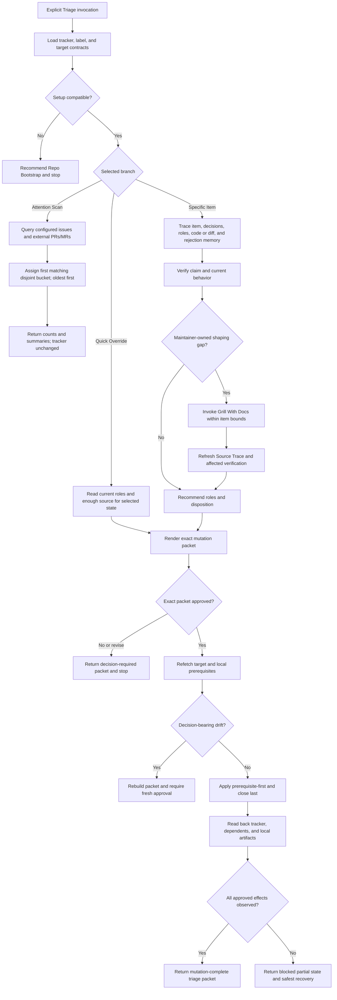

# Triage Relationship And Runtime Design Synthesis

Status: exhaustive design reference for a future coordinated rewrite, not an executable contract.

Runtime authority remains in:

- `skills/custom/triage/SKILL.md` and its disclosed branch and artifact references;
- `skills/custom/triage/agents/openai.yaml`;
- the target repository's `docs/agents/issue-tracker.md`, `docs/agents/triage-labels.md`, domain routing, and engineering contract;
- the configured tracker or local Markdown packet;
- `$grill-with-docs` and its owned domain-mutation boundary;
- `$to-tickets`, `$implement`, and `$parallel-implement` at their handoff boundaries;
- `docs/synthesis/skill-context-relationships.md`, pack tests, behavior evaluations, and the installed mirror.

This note consolidates the current triage behavior, accepted clarifications, material alternatives, runtime placement, and proof needed for a later rewrite. It does not authorize tracker mutation, skill extraction, installation, or mirror synchronization. The current canonical and installed triage trees are byte-identical at the time of this synthesis; future work must verify that fact again rather than relying on this note.

## How To Read This Document

This document follows the four-layer pattern used by the Parallel Implement and Wayfinder syntheses:

1. **Orientation** states the outcome, boundary, selected design, vocabulary, and explanatory flow.
2. **Normative Design** is the sole authority for proposed runtime behavior and relationships.
3. **Evidence And Rationale** preserves source pressure, current gaps, deliberate non-changes, and deferred hypotheses without creating additional rules.
4. **Extraction And Verification** maps the design into owned runtime surfaces and specifies staged proof, promotion, and residual-gap handling.

Change proposed behavior in Layer Two. Explain it in Layer Three. Place and prove it in Layer Four. If a diagram, rationale, ownership row, or acceptance case disagrees with Layer Two, correct that secondary surface.

[Synthesis Ownership](../README.md#synthesis-ownership) governs cross-document placement. This note owns Triage's admission, classification, verification, shaping, state recommendation, approval envelope, local rejected-enhancement memory, readiness rendering, Return, and completion. Foreign file-owner syntheses own concrete changes to tracker setup, composed skills, delivery skills, and shared routing surfaces.

| Question | Owning section |
| --- | --- |
| What outcome and hard boundary govern Triage? | [North Star](#north-star) and [Delivery Boundary](#delivery-boundary) |
| What is selected, clarified, deferred, or rejected? | [Design Verdict](#design-verdict) |
| What do the runtime leading words mean? | [Leading-Word Operation Model](#leading-word-operation-model) |
| Which terms have exact meanings? | [Triage Vocabulary](#triage-vocabulary) |
| When may Triage run? | [Invocation And Setup Admission](#invocation-and-setup-admission) |
| Which branch applies? | [Branch Selection And Lifecycle](#branch-selection-and-lifecycle) |
| Which role or disposition is legal? | [Classification And State Contract](#classification-and-state-contract) |
| When is an operation complete? | [Operation And Completion Contracts](#operation-and-completion-contracts) |
| What does an Attention Scan inspect? | [Attention Scan](#attention-scan) |
| How is one item verified and shaped? | [Specific Item](#specific-item) |
| What does Quick Override skip and retain? | [Quick Override](#quick-override) |
| What evidence can support readiness? | [Verification And Evidence Contract](#verification-and-evidence-contract) |
| When may Triage compose another skill? | [Shaping And Domain Authority](#shaping-and-domain-authority) |
| What makes a readiness brief complete? | [Readiness Brief Contract](#readiness-brief-contract) |
| How are rejected enhancements remembered? | [Rejected-Enhancement Memory](#rejected-enhancement-memory) |
| What exactly receives approval? | [Mutation Packet And Approval](#mutation-packet-and-approval) |
| How are mutations applied and recovered? | [Apply, Read-Back, And Recovery](#apply-read-back-and-recovery) |
| What does every invocation return? | [Return Contract](#return-contract) |
| Which owner supplies each surrounding capability? | [Relationship Ownership](#relationship-ownership) |
| Which context should load for each branch? | [Runtime Context Loading Contract](#runtime-context-loading-contract) |
| What should the eventual runtime files contain? | [Proposed Runtime Semantic Surface](#proposed-runtime-semantic-surface) and [Runtime Ownership And Change Map](#runtime-ownership-and-change-map) |
| What proves the rewrite? | [Staged Behavior-Evaluation Protocol](#staged-behavior-evaluation-protocol), [Migration And Acceptance Matrix](#migration-and-acceptance-matrix), and [Promotion Gate And Residual Gaps](#promotion-gate-and-residual-gaps) |

# Layer One: Orientation

## North Star

Triage owns one outcome: convert one raw configured tracker request into an evidence-backed, maintainer-approved state and durable handoff, or expose the incoming work that still needs maintainer attention, without crossing into product delivery.

Triage is a decision boundary, not backlog administration. It preserves request identity and discussion, verifies the relevant claim, resolves enough maintainer-owned ambiguity to recommend a state, renders the shared Ready-for-agent contract when applicable, and applies only the exact approved mutation packet.

The governing invariants are:

1. the target repository's tracker and label contracts remain authoritative for transport and literal mappings;
2. every mutated work item ends with exactly one configured category role and one configured state role;
3. no state-changing operation occurs before the exact packet receives explicit maintainer approval;
4. any decision-bearing drift or packet change invalidates that approval;
5. readiness never hides unverified behavior, unresolved authority, blockers, or adjacent scope;
6. partial mutation is blocked and recovery-complete rather than reported as success; and
7. Triage never implements code or performs implementation closeout.

## Design Verdict

| Stratum | Selected shape | Runtime status |
| --- | --- | --- |
| Triage core | One explicit-only root with three disclosed branches: read-only Attention Scan, full Specific Item, and reduced-discovery Quick Override | Preserve and sharpen in the future rewrite |
| State model | Two configured category roles, six configured state roles, and separate closure dispositions; exactly one role from each role set after mutation | Preserve the role vocabulary; make disposition and legal transition meaning explicit |
| Verification | Separate observation status from readiness authority; replace ambiguous `failed` wording with `not-confirmed` or `insufficient-evidence`; allow readiness with uncertainty only through explicit maintainer override | Clarify during coordinated extraction |
| Approval | One immutable mutation packet tied to target identity and a captured decision snapshot; refresh after approval and reapprove on material drift | Add explicitly during extraction |
| Readiness rendering | One shared semantic schema for `ready-for-agent` and `ready-for-human`, with branch-specific emphasis and headings | Consolidate ownership without changing the tracker-owned Ready-for-agent fields |
| Rejected work | `.out-of-scope/` records concepts for rejected enhancements only; Triage screens and mutates them inside the approved packet | Preserve and add lifecycle/read-back clarity |
| Relationships | Triage may recommend explicit `$grill-with-docs` and stop for maintainer-owned shaping, recommend `$repo-bootstrap` when setup is absent or incompatible, and stop at delivery boundaries | Preserve direct-user composer authority; do not add automatic continuation |
| Proof | Structural contracts plus fixed-scenario, fresh-context behavior evaluation across scan, full triage, override, drift, partial failure, PR, and provider variants | Expand before promotion |
| Deferred machinery | Conditional tracker claims, a machine packet schema/helper, automated bulk mutation, and new category or state roles | Exclude until observed failures justify separate design |
| Rejected machinery | Provider commands in Triage, automatic state transitions, re-triaging valid `$to-tickets` output, code changes, implementation closeout, and an event ledger | Keep outside the rewrite |

## Delivery Boundary

The ordinary issue path is:

```text
raw issue or configured external PR/MR
    -> Triage
    -> needs-info | needs-triage | ready-for-human | wontfix | ready-for-agent
    -> Implement or parent-backed Parallel Implement only after a later delivery invocation
```

The shaped-spec path remains separate:

```text
settled source -> To Tickets -> ready-for-agent items
```

Triage does not reprocess valid `$to-tickets` output. Both producers satisfy the tracker-owned Ready-for-agent contract, but they add different source value:

- Triage adds incoming classification, verification evidence, and approved state transition.
- To Tickets adds parent context, slicing, dependency order, and graph completeness.

Implementation skills consume readiness, recheck pickup safety, and own code changes, review, commit, implementation evidence, `implemented` closeout, claim release, and push at their authorized boundary. Triage may correct an already-supported `implemented` label only through Quick Override with explicit correction authority and existing closeout evidence; it never manufactures that evidence.

## Leading-Word Operation Model

The eventual runtime should expose this compact vocabulary:

```text
Load
Scan | Trace -> Verify -> Shape -> Recommend -> Approve -> Apply -> Prove
Override -> Approve -> Apply -> Prove
Return
```

- **Load** reads the tracker, label, domain, and—before executable validation—engineering contracts, then establishes target identity and branch eligibility.
- **Scan** inventories the three disjoint attention buckets without verification, shaping, packets, approval, or mutation.
- **Trace** assembles the item, decision, domain, code, diff, rejection-memory, and prior-triage source needed for one recommendation.
- **Verify** establishes what is actually true without changing product code.
- **Shape** resolves only maintainer-owned ambiguity through the owned composer and refreshes affected evidence.
- **Recommend** selects roles and disposition, explains them, and renders one exact packet.
- **Approve** binds maintainer consent to the target identity, decision snapshot, and exact packet.
- **Override** accepts an exact maintainer-selected state and deliberately skips claim verification and grilling while retaining all mutation safety.
- **Apply** performs only approved operations in prerequisite-first, close-last order.
- **Prove** rereads every mutated surface and returns observed state, partial failures, and recovery.
- **Return** supplies the branch-appropriate packet and stops without downstream delivery.

The leading words are execution anchors, not substitutes for the completion table.

## Triage Vocabulary

| Term | Meaning |
| --- | --- |
| **Work item** | One configured issue or, only when the tracker enables it, one external PR/MR treated as a request with attached code |
| **Target identity** | Provider, repository/project, item kind, immutable item id or path, and current open/closed identity needed to prevent issue/PR ambiguity |
| **Decision snapshot** | The decision-bearing body, comments or notes, roles, author activity, diff identity when applicable, relevant relationships, and local rejection-memory state captured for a recommendation |
| **Category role** | Exactly one configured request-kind role, currently `bug` or `enhancement` |
| **State role** | Exactly one configured workflow role: `needs-triage`, `needs-info`, `ready-for-agent`, `ready-for-human`, `implemented`, or `wontfix` |
| **Disposition** | The semantic reason for the recommended state, especially `ready`, `waiting-on-reporter`, `waiting-on-maintainer`, `rejected-bug`, `rejected-enhancement`, `already-implemented`, or `label-correction`; it is not an additional tracker role |
| **Verification record** | Observation status, evidence, seams inspected, uncertainty, skipped checks, and any maintainer override |
| **Readiness brief** | Triage's rendering of the tracker-owned ready contract for an agent or human recipient |
| **Mutation packet** | The complete proposed before/after roles, literal mappings, full posts, local knowledge-base delta, close state, prerequisites, and recovery-relevant operation order tied to one decision snapshot |
| **Triage note** | A posted note carrying the required AI disclaimer and enough branch identity to distinguish it from reporter activity |
| **Rejected-enhancement record** | One durable `.out-of-scope/<concept>.md` decision record grouping materially equivalent rejected enhancement requests |
| **Triage packet** | The final or nonterminal Return containing source, evidence, recommendation, approval, applied operations, read-back, residuals, and next route |

## End-To-End Explanatory Flow



The diagram explains the ordinary path. Layer Two owns all legal branches, evidence, authority, and completion.

# Layer Two: Normative Design

## Normative Home Index

Each proposed concern has one normative home. Other sections may point to, place, explain, or test it, but never create a competing rule.

| Concern | Sole normative home |
| --- | --- |
| Invocation reach and required setup | [Invocation And Setup Admission](#invocation-and-setup-admission) |
| Branch choice, resume behavior, and legal next operation | [Branch Selection And Lifecycle](#branch-selection-and-lifecycle) |
| Category, state, disposition, and transition meaning | [Classification And State Contract](#classification-and-state-contract) |
| Operation entry, completion, and legal nonterminal Return | [Operation And Completion Contracts](#operation-and-completion-contracts) |
| Read-only attention inventory | [Attention Scan](#attention-scan) |
| Full item discovery and decision path | [Specific Item](#specific-item) |
| Reduced-discovery exact-state path | [Quick Override](#quick-override) |
| Observation status, proof adequacy, and override evidence | [Verification And Evidence Contract](#verification-and-evidence-contract) |
| Maintainer decision shaping and domain mutation | [Shaping And Domain Authority](#shaping-and-domain-authority) |
| Ready-for-agent and ready-for-human rendering | [Readiness Brief Contract](#readiness-brief-contract) |
| Rejected-enhancement screening and record lifecycle | [Rejected-Enhancement Memory](#rejected-enhancement-memory) |
| Approval identity and packet contents | [Mutation Packet And Approval](#mutation-packet-and-approval) |
| Mutation sequence, read-back, partial failure, and recovery | [Apply, Read-Back, And Recovery](#apply-read-back-and-recovery) |
| Invocation output | [Return Contract](#return-contract) |
| Cross-skill and owner boundaries | [Relationship Ownership](#relationship-ownership) |
| Progressive disclosure and attention exclusions | [Runtime Context Loading Contract](#runtime-context-loading-contract) |

## Invocation And Setup Admission

Triage is explicit-only. Preserve `policy.allow_implicit_invocation: false`. A user names `$triage`; Skill Router or human-facing documentation may recommend it, but no upstream skill automatically invokes it.

Admission requires:

1. `docs/agents/issue-tracker.md` exists, identifies a supported configured tracker or local packet, defines work-item operations, the Ready-for-agent contract, and Mutation read-back;
2. `docs/agents/triage-labels.md` exists and maps every required category and state role to literal tracker values;
3. the requested work is a configured issue or a PR/MR explicitly enabled as a triage request surface; and
4. the current tool and authority boundary can perform the selected branch's required reads.

If either setup file is missing or incompatible, recommend `$repo-bootstrap` and stop before tracker access or mutation. Triage does not repair setup itself.

Read `docs/agents/domain.md` and routed context when the item uses domain language or shaping may change it. Read `docs/agents/engineering-contract.md` before reproduction, checkout, executable validation, or any work-state-sensitive action. Provider commands and literal label mappings remain in setup docs, not Triage.

A named PR/MR bypasses only external-author discovery. It does not bypass the tracker's request-surface policy, branch selection, verification, approval, mutation, or read-back. A PR/MR is a request with attached code: inspect its diff and current feedback, but leave general code review and implementation to their owners.

## Branch Selection And Lifecycle

The user-selected intent and durable prior packet determine one branch:

| Observed request or prior state | Legal operation | Illegal shortcut |
| --- | --- | --- |
| User asks what incoming work needs attention | **Attention Scan** | Verifying, shaping, recommending, drafting mutation packets, or mutating |
| User names one item for evaluation, triage, or a recommended outcome | **Specific Item: Trace** | Jumping to roles from title or current labels |
| User names one exact target state and requests the reduced-discovery path | **Quick Override** | Treating the requested state as approval of an unseen packet |
| A Specific Item recommendation packet awaits approval | Return `decision-required`; on later approval, refresh and enter **Apply** only if the exact packet and decision snapshot remain valid | Applying from memory or silently revising the packet |
| A Quick Override packet awaits approval | Return `decision-required`; on later approval, refresh and enter **Apply** under the same gate | Running full verification or grilling unless the override is withdrawn |
| A prior Apply returned partial or blocked | Refetch all affected surfaces, preserve successful effects, and execute only an approved recovery packet or return the safe manual recovery | Replaying all mutations, claiming rollback, or reporting completion from intent |
| The item is valid settled `$to-tickets` output | Stop; it is already ready under the shared contract | Re-triaging, rewriting, or republishing it |
| The item requires product delivery | Return the ready or residual route and stop | Invoking implementation automatically |

Branch identity remains stable until completion or explicit user revision. A Specific Item may not silently downshift to Quick Override to avoid verification. A Quick Override may become Specific Item only when the user withdraws the override and authorizes ordinary discovery.

## Classification And State Contract

### Role Invariant

After any Triage mutation, the work item has exactly one mapped category role and one mapped state role. Before mutation, missing or conflicting roles are evidence, not permission to guess silently. The packet shows every role and literal mapping before and after.

Category expresses the request's asserted kind:

| Category | Meaning | Boundary |
| --- | --- | --- |
| `bug` | Existing promised or reasonably expected behavior is asserted to be broken | Verification may fail to confirm the assertion without changing the category |
| `enhancement` | The request asks for new or changed behavior beyond the verified current contract | Existing equivalent behavior may produce an already-implemented disposition |

If the source cannot support either category, Specific Item returns a classification blocker or proposes one explicitly for maintainer decision; it does not apply a state while violating the invariant.

### State And Disposition

| State role | Admission meaning | Typical disposition | Required durable result |
| --- | --- | --- | --- |
| `needs-triage` | Evaluation remains open for agent or maintainer work, but neither reporter facts nor a ready recipient is the sole next dependency | `waiting-on-triage` | Preserve meaningful verified progress and the next unresolved decision in a triage note |
| `needs-info` | One or more result-defining facts can be supplied only by the reporter or request owner | `waiting-on-reporter` | Post established facts and specific actionable questions addressed to the reporter |
| `ready-for-agent` | One bounded AFK-safe slice satisfies the tracker-owned ready contract; verification is adequate or an explicit maintainer override names residual uncertainty | `ready` | Post the complete agent readiness brief unless the approved packet is label-only |
| `ready-for-human` | The bounded next slice requires human judgment, access, design, testing, merge action, or another non-delegable act | `waiting-on-human` | Post the complete human readiness brief and name why human participation is required |
| `wontfix` | The request will not be actioned as proposed | `rejected-bug`, `rejected-enhancement`, or `already-implemented` | Post the reason; update rejected-enhancement memory only for that disposition; close only as configured and approved |
| `implemented` | Existing implementation closeout evidence already satisfies the tracker contract and only tracker state correction is requested | `label-correction` | Quick Override only; cite existing closeout evidence and apply no implementation mutation |

`implemented` is not a normal Triage recommendation. Delivery skills own its evidence and closeout. `already-implemented` normally uses `wontfix` plus a pointer to existing behavior because Triage did not perform delivery; the provider's close reason remains a separate packet field.

### Recommendation Rules

- Reporter-owned missing facts select `needs-info`; do not grill the maintainer for them.
- Maintainer-owned scope, acceptance, language, or design gaps select Shape before a final recommendation.
- Agent-owned verification still in progress selects `needs-triage`, not `needs-info`.
- A request is `ready-for-agent` only when one bounded slice, source, dependencies, proof, write scope, parallel safety, and scope fence are explicit.
- A task is `ready-for-human` only when the human-required act and its completion evidence are explicit; it is not a generic escape from incomplete shaping.
- Rejection for temporary priority or capacity does not create durable rejected-enhancement memory.
- Duplicate or equivalent behavior is an evidence result. The final disposition distinguishes already implemented, materially different, or still requested behavior.

## Operation And Completion Contracts

This table is the sole proposed authority for when an operation may end.

| Operation | Entry evidence | Complete only when | Legal nonterminal Return |
| --- | --- | --- | --- |
| **Load** | Explicit invocation and target repo | Setup compatibility, PR/MR policy, target identity, and selected branch are known | `blocked` with missing or incompatible setup and Repo Bootstrap recommendation |
| **Attention Scan** | Read-capable configured tracker | All three disjoint buckets were evaluated, PR/MR policy was respected, counts and oldest-first summaries were returned, and observed tracker state remained unchanged | `blocked` with exact inaccessible query or policy field |
| **Specific Trace** | One unambiguous work item | Request, decision-bearing discussion, prior triage, roles, domain source, code/diff surface, redundancy, rejection memory, and evidence gaps are accounted for | `blocked` on ambiguous identity or inaccessible decision source |
| **Verify** | Trace complete | Observation status, inspected seam, evidence, uncertainty, and skipped checks are explicit; no product code changed | `partial` or `blocked` with the strongest safe evidence and next fact needed |
| **Shape** | Maintainer-owned decision gap and bounded caller packet | The composer's intact lean `Confirmed` packet returns, affected source is refreshed, and stale verification is rerun or marked stale | Triage `partial` carrying the intact `Evidence gap` packet, or Triage `blocked` carrying the intact `Blocked` packet; no recommendation is fabricated |
| **Recommend** | Applicable Trace, Verify, and Shape complete | One category, one state, one disposition, reasoning, evidence, remaining unknowns, and one complete mutation packet are displayed | `decision-required` awaiting exact-packet approval |
| **Override** | Exact user-selected state | Current roles and enough source exist to render every required post, readiness brief, memory delta, close state, and existing `implemented` evidence | `blocked` when the selected state cannot be rendered safely; no fallback to guessed content |
| **Approve** | Complete visible mutation packet | The maintainer explicitly approves that exact packet and its target | `decision-required` on silence, revision, rejection, or conditional approval that changes the packet |
| **Apply** | Exact approval plus refreshed no-drift snapshot | Every approved operation is attempted in safe order and every unattempted operation has an exact reason | `blocked-partial` with applied, failed, and withheld operations plus safest recovery |
| **Prove** | Apply attempted | Tracker item, affected dependents, local memory, roles, posts, close state, and disclaimer are read back; all observed effects match the approved packet | `blocked-partial` when any effect is missing, conflicting, or unreadable |

A recommendation, visible packet, approval, successful API response, local file write, or correct label set alone is not branch completion.

## Attention Scan

Attention Scan is read-only and deliberately shallow. Query configured incoming work and assign each item to the first matching bucket:

1. **Role drift:** no category or state role, or more than one role in either set.
2. **`needs-triage`:** evaluation remains in progress.
3. **`needs-info` with reporter activity:** the reporter or request owner added decision-bearing activity after the latest identifiable triage note.

The buckets are disjoint because first match wins. Sort each bucket oldest first by creation time; when the provider cannot expose creation time, use its stable oldest-first ordering and say so. Show the count and one-line summary for every item. When configured external PR/MR triage is enabled, use the tracker's external-author policy and tag every line `[issue]`, `[PR]`, or `[MR]`. If external status is uncertain under the provider contract, surface the candidate rather than silently discarding it.

The latest triage note is the latest Triage-authored post identifiable by the required AI disclaimer and triage content. If a `needs-info` item has no identifiable triage note, classify that as role drift or an explicit scan uncertainty rather than inventing an activity boundary.

Do not fetch code, reproduce claims, screen rejection memory, shape, recommend roles, generate packets, or mutate. The maintainer chooses any later Specific Item or Quick Override invocation.

## Specific Item

### Trace

Build one Source Trace from:

- target identity; item body, author, dates, current roles, open/closed state, decision-bearing comments or notes, and prior triage notes;
- tracker and label contracts, including PR/MR request-surface policy and dependency or close rules;
- PR/MR base, head, diff identity, diff, unresolved decision-bearing feedback, and current status when applicable;
- routed domain terms, relevant ADRs, and engineering-contract requirements;
- relevant current behavior, code paths, public interfaces, tests, and supported configuration;
- prior `$to-tickets` or parent source when linked;
- concept-level redundancy search and likely existing behavior;
- `.out-of-scope/` concept screening and likely records read in full; and
- known evidence, gaps, contradictions, and skipped sources.

Parse prior triage notes so resolved questions stay resolved and earlier evidence is classified as current, stale, or superseded. Trace completes only when the asserted claim, prior decisions, current roles, implementation surface, rejection-memory relationship, and evidence gaps are known.

### Verify

- **Bug:** attempt a trusted reproduction or strongest safe structural proxy; inspect the likely caller-facing seam and code path; record `confirmed`, `not-confirmed`, `partial`, or `insufficient-evidence`.
- **Enhancement:** verify current behavior, relevant seams, plausibility, redundancy, compatibility pressure, and prior rejection; do not prototype or implement unless another separately authorized owner does so.
- **PR/MR:** inspect the tracker-provided diff first. Use an isolated worktree or approved clean checkout only when execution is necessary. Verify the current diff and remaining request, not an imagined rewrite.

Verification may read and execute within the engineering contract, but Triage never changes product code. A failed reproduction is `not-confirmed`, not proof that the report is false. Route code changes to a later delivery invocation.

### Shape

Reporter-owned missing facts bypass maintainer grilling and recommend `needs-info`.

When maintainer-owned scope, acceptance, domain language, or design decisions remain unresolved, return the target identity, bounded item, current Source Trace, and exact open decisions; recommend explicit `$grill-with-docs` and stop before tracker mutation. Resume the same item in a later Triage invocation. Add any returned domain paths and ADR outcomes to the Source Trace, then refresh every verification result affected by the decision; preserve an `Evidence gap` or `Blocked` result without entering Recommend.

### Recommend

Return one proposed category, state, and disposition with:

- reasoning and current behavior;
- inspected interfaces or seams;
- redundancy and prior-rejection outcomes;
- verification record and any override requirement;
- resolved and remaining unknowns; and
- the complete mutation packet.

Recommendation never implies approval.

### Approve, Apply, And Prove

Use the shared contracts below. No Specific Item mutation occurs during Trace, Verify, Shape, or Recommend. Domain writes from a separately invoked `$grill-with-docs` remain governed by Domain Modeling and appear as consumed source after Triage resumes, not hidden Triage mutation.

## Quick Override

Quick Override applies only when the maintainer names the exact target state and accepts reduced discovery.

Read current roles, decision-bearing item content, tracker policy, and enough source to render the selected state's required post or brief. Deliberately skip request verification, redundancy research beyond what the required post needs, rejected-memory screening unless `wontfix` for a rejected enhancement is selected, and `$grill-with-docs`.

Reduced discovery never reduces:

- target identity and PR/MR policy checks;
- the one-category/one-state invariant;
- complete readiness brief, needs-info note, rejection reason, or partial-progress note;
- rejected-enhancement memory for that selected disposition;
- the required AI disclaimer;
- exact packet display and approval;
- decision-snapshot refresh and reapproval on drift;
- safe application order and close-last discipline; or
- Mutation read-back and partial-failure recovery.

For `implemented`, require an explicit label-correction request and existing implementation closeout evidence. If either is absent, return `blocked`; do not convert the override into delivery work.

## Verification And Evidence Contract

Separate what was observed from who accepts remaining uncertainty.

### Observation Status

| Status | Meaning | Readiness consequence |
| --- | --- | --- |
| `confirmed` | Current evidence directly supports the material claim through an appropriate seam | May support readiness if all other fields pass |
| `not-confirmed` | A valid attempt did not reproduce or establish the claim | Does not prove the claim false; normally needs more evidence, reframing, or override |
| `partial` | Some material assertions are supported and others remain open | Readiness requires an explicit override naming the residual uncertainty |
| `insufficient-evidence` | Access, detail, environment, safety, or source gaps prevent a meaningful determination | Route to the owner of the missing fact or require explicit override |

### Readiness Authority

| Authority | Required record |
| --- | --- |
| `normal` | Observation and source are adequate for every material acceptance commitment |
| `maintainer-override` | The maintainer explicitly accepts named residual uncertainty, its consequence, and the proof still required during delivery |

Quick Override may omit ordinary verification but cannot pretend to have `confirmed` evidence. Its readiness brief records `maintainer-override` or cites already-established evidence.

Evidence should reach the highest useful caller-facing seam. Structural proxy evidence must name unrun behavior and residual risk. For PR/MR work, distinguish diff inspection from executed proof. Preserve exact commands and results when they matter, but do not flood the readiness brief with raw logs that belong in linked evidence.

## Shaping And Domain Authority

Triage owns the decision that maintainer shaping is needed, the bounded recommendation packet, and later resumption. Direct `$grill-with-docs` owns interview composition, mutation disclosure, confirmation, and combined Return. Domain Modeling owns domain resolution, rendering or mutation, ADR assessment, and approved ADR recording. The named user or recorded ADR authority alone owns ADR approval.

The composition edge is legal only when:

1. the missing decision is maintainer-owned rather than reporter-owned;
2. it materially affects category, state, desired behavior, acceptance, scope, domain language, or design;
3. the caller packet identifies one work item, exact open decisions, and the Grilling bound and authority;
4. context and ADR actions are explicit, Triage remains the return owner, and no tracker-mutation authority transfers; and
5. Triage waits for the complete composer Return before refreshing evidence.

Triage must not copy the interview procedure, write domain docs itself, infer an ADR approval, or automatically continue after a blocked or evidence-gap composer Return. The user may need to participate in shaping; that interaction does not approve the later tracker mutation packet.

## Readiness Brief Contract

Tracker docs own the shared Ready-for-agent field set. Triage owns the rendering, verification extension, AI disclaimer, and agent/human variant. The future runtime should keep one semantic brief owner; filename choice must not split the schema.

### Shared Fields

Every readiness brief contains:

| Field | Required meaning |
| --- | --- |
| Heading and disclaimer | AI triage disclaimer first; `Codex-Ready Brief` for agent or `Human-Ready Brief` for human |
| Category and state | One configured category and the selected ready state |
| Slice type and summary | One tracer bullet or independently valuable support slice and one-line outcome |
| Current behavior | Verified status quo; for PR/MR, current diff state and remaining gap |
| Verification | Observation status, evidence pointer, readiness authority, and residual uncertainty |
| Desired behavior | Observable outcome, relevant edges, error conditions, and operator/user effect |
| Why this slice | Behavior, risk, dependency, or enabling value proved by this bounded work |
| Interfaces or seams | Highest useful caller-facing interface, workflow, command, adapter, config, or compatibility boundary |
| Domain context | Canonical terms, context owner, and ADR pointers or explicit `none` |
| Source Trace | Request, decision-bearing discussion, prior triage, code/diff, domain source, and rejection record |
| Dependencies | Parent, blockers, claim or assignment constraint, and ordering |
| Expected write scope | Durable modules, interfaces, commands, configuration, docs, or tracker files likely in scope; not a prescriptive file choreography |
| Parallel safety | Semantic independence, shared seam or state, integration order, and likely overlap; filenames alone are insufficient |
| Acceptance criteria | Concrete observable behavior and state-boundary cases, including errors or compatibility when material |
| Proof lane | Highest useful seam plus semantic fixtures, invariants, lifecycle branches, or support-slice proof |
| Scope fence | Adjacent behavior, cleanup, follow-up, and product decisions that remain out of scope |

### Agent Variant

`ready-for-agent` means an unattended implementation session or delegated implementation worker can execute without inventing product intent. The brief names one bounded slice and complete proof target. A support slice is allowed only when it independently proves, unblocks, or de-risks later behavior.

### Human Variant

`ready-for-human` uses the same semantic fields, changes the heading and state, and adds **Human reason** and **Human completion evidence**. It names the access, judgment, design, test, merge, or other non-delegable action. It does not use human readiness to hide missing reporter facts or unfinished agent verification.

### Branch Emphasis

| Branch | Emphasize |
| --- | --- |
| Bug tracer | Trusted reproduction or proxy, suspected boundary, regression proof, and unresolved environment variance |
| Enhancement tracer | Desired outcome, smallest vertical slice, compatibility pressure, and acceptance proof |
| Support slice | Smallest safe enabling change, blocked boundary, independent value, and validation |
| PR/MR finish | Current base/head and diff, remaining work, unresolved decision-bearing feedback, and merge-ready proof |

The shared schema is complete only when one bounded slice, verification authority, Source Trace, dependencies, write scope, parallel safety, observable acceptance, proof lane, and scope fence are explicit.

## Rejected-Enhancement Memory

`.out-of-scope/` is durable local product memory for rejected enhancement concepts. It is not a graveyard for every closed item.

### Record Contract

Use one short kebab-case file per concept:

```markdown
# <Rejected concept>

Decision: Out of scope because <durable product, technical, or strategic reason>.

Not sufficient: temporary capacity or priority.

## Prior requests

- <tracker reference> - "<request title>"
```

The durable reason must remain meaningful when the original issue is unavailable. Group materially equivalent requests under `Prior requests`; do not create one file per issue.

### Screen And Classify

Inspect filenames and headings, search by domain concept, and read likely records in full. Read the whole directory only when small enough for reliable coverage. Match concepts, not keywords.

| Result | Consequence |
| --- | --- |
| `confirm` | Add the new request reference under the existing decision and use rejected-enhancement disposition |
| `reconsider` | Propose the exact update or deletion, then return the request to normal Specific Item triage; old tracker history remains history |
| `distinguish` | Continue ordinary triage because the concepts differ materially |
| `already-implemented` | Point to existing behavior; no rejection record |
| `rejected-bug` | Explain the rejection; no rejection record |

If `.out-of-scope/` is absent, treat it as an empty knowledge base. Create it only as part of the first approved rejected-enhancement packet. Every create, update, or delete is local tracked-state mutation, appears in the packet, follows workspace authority, and receives file read-back. Triage does not commit or push it unless the user separately authorizes that Git boundary.

## Mutation Packet And Approval

One packet is the complete unit of maintainer consent. It contains:

- branch and target identity;
- captured decision snapshot or provider revision facts;
- category and state roles before and after;
- literal labels or local fields before and after;
- selected disposition and close/open state;
- full comment, note, readiness brief, or partial-progress post with disclaimer;
- exact `.out-of-scope/` create, update, delete, or no-change delta;
- affected dependents that the tracker contract requires rereading;
- prerequisite-first operation order and operations withheld on failure;
- verification record, readiness authority, skipped checks, and residual uncertainty; and
- expected Return and recovery obligations.

Display the packet in full before asking for approval. Summary approval is valid only when the full packet is visible in the same decision context.

Approval binds to the exact target identity, decision snapshot, and packet. Any change to roles, literal mappings, content, local delta, close state, target, dependencies, or operation order requires fresh approval. Conditional approval that changes the packet is a revision request, not permission to apply.

Immediately before Apply, refetch the work item, decision-bearing discussion, roles, close state, relevant dependency state, and local rejection-memory prerequisites. If any fact could change the recommendation or packet, rebuild it and obtain fresh approval. Unrelated provider metadata may be recorded without invalidating approval only when it cannot affect any approved field or precondition.

## Apply, Read-Back, And Recovery

### Mutation Order

Use provider-neutral prerequisite-first, close-last ordering:

1. validate target identity, no material drift, current role replaceability, and local write authority;
2. create or update required local rejected-enhancement memory and read it back before any post links to it;
3. post the approved comment, note, or brief before advertising the resulting ready/waiting/rejected state;
4. replace category and state roles with exactly the approved mapped values;
5. apply the approved open/closed transition last, after required reason and dependency-safe closure checks;
6. refetch the work item, affected dependents, and local files; and
7. compare observed effects with every packet field.

Provider setup owns exact transport and may offer a safer atomic operation. Use it when configured without moving semantic decisions into the provider layer. For Local Markdown, one file edit may combine post and role changes, but read-back still verifies every semantic field.

### Closure

Close only when the packet requests it, the provider permits it, the required explanation already exists, and the tracker contract's non-completed closure rule has protected dependents. `wontfix` does not inherently mean close on every provider. `ready-for-agent`, `ready-for-human`, `needs-info`, and `needs-triage` remain open.

### Read-Back

Read-back verifies:

- target identity and current body or file;
- exactly one category and one state role with the intended literal mappings;
- full post presence, heading, disclaimer, and content identity;
- open/closed state and close reason when exposed;
- affected dependency frontier and relationships;
- local rejected-enhancement file contents and intended path; and
- no unapproved packet effect.

An API success response or successful file write is not read-back.

### Partial Failure

On any failure:

1. stop before later dependent operations;
2. preserve observed successful effects;
3. do not replay non-idempotent posts or pretend rollback;
4. refetch every affected surface;
5. return applied, failed, withheld, and contradictory operations;
6. state whether the role invariant currently holds; and
7. propose the smallest safe recovery packet requiring approval when it would mutate.

Never report `mutation-complete` while approved effects are missing, unapproved effects exist, the role invariant fails, a required post or memory record is absent, or dependency-safe closure is unproved.

## Return Contract

Every invocation returns exactly one branch-appropriate triage packet and stops without downstream implementation.

### Attention Scan Return

- branch and tracker identity;
- PR/MR request-surface policy;
- counts for all three buckets;
- oldest-first tagged item summaries;
- query gaps or ambiguous candidates; and
- explicit confirmation that no mutation was attempted.

Terminal status: `scan-complete` or `blocked`.

### Item Or Override Return

- branch, target identity, and decision snapshot;
- Source Trace and changed domain paths when applicable;
- verification record and readiness authority;
- roles before and proposed or observed roles after;
- disposition and reasoning;
- exact mutation packet or applied-packet identity;
- approval status;
- comment, note, brief, and local-file references;
- open/closed state and affected dependency state;
- applied, failed, withheld, and read-back observations;
- skipped checks, blockers, residual uncertainty, and safest recovery; and
- next route, if any, with downstream execution explicitly not started.

Legal statuses are:

| Status | Meaning |
| --- | --- |
| `scan-complete` | Attention Scan evaluated every required bucket and made no mutation |
| `decision-required` | A complete packet awaits exact maintainer approval or revision |
| `mutation-complete` | Every approved effect is observed and every invariant passes |
| `partial` | Discovery, verification, or shaping produced useful evidence but cannot yet support a packet |
| `blocked` | No safe next Triage action exists without missing setup, access, evidence, or authority |
| `blocked-partial` | Some mutation effects occurred, completion failed, and recovery is explicit |

Only `scan-complete` and `mutation-complete` satisfy their branch completion criteria.

## Relationship Ownership

| Consumer | Relationship | Provider or artifact | Trigger | Returned boundary |
| --- | --- | --- | --- | --- |
| Human or Skill Router | Explicitly invoke or recommend and stop | Triage | Raw configured issue/request or configured external PR/MR needs classification or state work | Triage owns the selected branch; recommender does not continue it |
| Triage | Load | Tracker docs | Every invocation before tracker access | Provider, literal mappings, ready fields, close policy, external PR/MR policy, and read-back capability; no provider procedure copied into Triage |
| Triage | Load | Domain routing and engineering contract | Domain-sensitive work; reproduction or executable validation | Current vocabulary, decisions, work-state discipline, and proof expectations |
| Triage | Recommend and stop | `$grill-with-docs` | Maintainer-owned scope, acceptance, language, or design requires direct-user resolution with durable capture | Resume the same target later with the direct result; no tracker mutation authority transfers |
| Triage | Recommend and stop | `$repo-bootstrap` | Required tracker or label setup is missing or incompatible | Setup recommendation only; Triage does not continue automatically |
| Triage | Produce | Tracker-owned Ready-for-agent contract | Approved `ready-for-agent` or `ready-for-human` state | Complete readiness brief with Triage verification extension |
| `$to-tickets` | Produce peer contract | Tracker-owned Ready-for-agent contract | Settled parent source is sliced | Valid output bypasses Triage; Triage does not add verification retroactively |
| `$implement` or `$parallel-implement` | Consume | Ready work item | Later explicit delivery invocation | Delivery owns pickup, claim, code, proof, review, closeout, `implemented`, and push |
| Triage | Stop before | `$review` and PR review workflows | PR/MR has attached code but request triage is complete or a general review is needed | Triage may report diff evidence; it does not conduct formal review |
| Triage | Maintain | `.out-of-scope/` | Rejected-enhancement screen or approved record delta | Concept record only; no bug or already-implemented records |

### Relationship Exclusions

- Triage does not automatically invoke Wayfinder, To Tickets, Implement, Parallel Implement, Review, or Skill Router.
- Triage does not absorb tracker commands, literal mappings, setup reconciliation, domain persistence, implementation, review, or closeout.
- Delivery skills may detect an unready item and stop or return it to the user, but they do not silently perform Triage.
- A composed skill's successful Return never constitutes approval of the Triage mutation packet.
- Ready-for-human is a recipient handoff, not automatic human contact or execution.

## Runtime Context Loading Contract

Keep universal outcome, admission, role invariant, branch choice, approval envelope, Return, and completion in `SKILL.md`. Load only the selected branch and triggered artifact references.

| Observed need | Required context | Excluded context |
| --- | --- | --- |
| Every invocation | `SKILL.md`, tracker docs, triage-label mappings | All branch procedures, brief schema, rejection memory |
| Attention Scan | `ATTENTION-SCAN.md` | Specific Item, Quick Override, brief schema, `.out-of-scope/` procedure, engineering contract unless tracker access itself requires it |
| Full item | `SPECIFIC-ITEM.md`; domain and engineering contracts as triggered | Attention Scan and Quick Override procedure |
| Exact-state override | `QUICK-OVERRIDE.md` | Full verification and shaping procedure |
| Agent or human readiness | One shared readiness-brief reference; branch emphasis only for the matching case | Rejected-memory procedure unless disposition requires it; unrelated examples |
| Rejected or reconsidered enhancement | `OUT-OF-SCOPE.md` and likely local concept records | Full directory when concept search is sufficient |
| Maintainer shaping | Direct user through a `$grill-with-docs` recommendation boundary | Copied Grilling or Domain Modeling procedure |
| Apply after approval | Approved packet, refreshed target, tracker mutation/read-back contract, changed local files | Parent conversation material not referenced by the packet |

Context pointers must state both trigger and purpose. A future rewrite may rename a disclosed file, but it must preserve branch-only loading and one owner per semantic contract.

# Layer Three: Evidence And Rationale

## Existing Source Pressure

The issue-pipeline synthesis supplies the established design lineage:

| Source pressure | Triage consequence |
| --- | --- |
| Kanban explicit policies | State roles are admission policies, not decorative labels |
| User Stories Applied | Raw requests become shared, bounded understanding rather than copied prose |
| Specification by Example | Acceptance is observable and fresh implementers can identify done behavior |
| The Pragmatic Programmer | Prefer one real tracer bullet over a horizontal or speculative plan |
| Growing Object-Oriented Software and Legacy Code seams | Name the caller-facing proof seam and relevant responsibility boundary |
| Continuous Delivery | Readiness includes repeatable validation expectations and explicit skipped proof |
| Software by Numbers | A support slice must independently justify its incremental value |
| Refactoring | Enabling cleanup remains bounded and behavior-preserving |
| The Crux | Recommendation and dependency information expose the next real constraint |

The current skill already embodies much of this source pressure: explicit states, bounded briefs, Source Trace, seam-aware proof, reporter versus maintainer ownership, concept-level rejected-work memory, and mutation read-back.

## Current Strengths To Preserve

- Explicit-only invocation protects maintainer judgment.
- The main skill discloses three distinct branch procedures instead of carrying every branch inline.
- Attention Scan is genuinely read-only and has a finite disjoint inventory.
- Specific Item separates Trace, Verify, Shape, Recommend, Approve, Apply, and Prove.
- Quick Override skips discovery without skipping approval or read-back.
- Tracker docs own transport, mappings, readiness fields, and Mutation read-back.
- The brief preserves one bounded slice, public seam, dependencies, parallel safety, and scope fence.
- `.out-of-scope/` stores durable concept decisions rather than issue-by-issue rejection noise.
- Direct `$grill-with-docs` owns the composed maintainer interview and combined Return; Triage recommends and stops, then owns later resumption. Domain Modeling owns domain persistence and approved ADR recording within that composition.
- Installed triage files currently match canonical files exactly.

## Current Gaps Addressed By The Proposed Design

| Current pressure | Proposed clarification | Why it matters |
| --- | --- | --- |
| Bug verification uses `failed`, while the brief uses `confirmed / partial / maintainer override` | Separate observation status from readiness authority and use `not-confirmed` | Avoid treating failed reproduction as disproof or conflating evidence with human risk acceptance |
| Approval is exact, but the captured target facts and pre-Apply refresh are implicit | Bind approval to target identity, decision snapshot, and full packet; refetch before Apply | Prevent stale-label, new-comment, changed-diff, or changed-memory mutations |
| Mutation read-back is strong, but safe cross-surface order is not explicit | Prerequisite-first, post-before-state, close-last sequence | Reduce externally visible half-states and make partial recovery deterministic |
| Agent brief owns a shared schema while human-ready instructions live in a branch file | One readiness-brief semantic owner with agent and human variants | Prevent field drift between two ready recipients |
| `AGENT-BRIEF-EXAMPLES.md` contains emphasis, not examples | Rename or fold it during extraction | Make its context pointer honest and reduce mistaken loading |
| Attention Scan says reporter activity after the latest triage note without defining note identity | Use disclaimer plus triage content and expose missing-note ambiguity | Prevent arbitrary activity cutoffs |
| Category uncertainty and semantic closure reason are implicit | Separate category, state, and disposition | Preserve two-role invariant without overloading `wontfix` |
| Return content exists but nonterminal and partial outcomes are not typed | Define branch-specific fields and five legal statuses | Resist premature completion at approval and partial mutation boundaries |
| Current behavior evaluation covers mutation approval broadly | Add fixed provider, drift, PR/MR, readiness, rejection-memory, and recovery scenarios | Structural literals cannot prove runtime judgment |

## Deliberate Non-Changes

- Keep Triage explicit-only.
- Keep exactly three top-level branches.
- Keep one category role and one state role after mutation.
- Keep the current role vocabulary; do not add `duplicate`, `deferred`, `parked`, `security`, or `support` roles in this rewrite.
- Keep tracker commands and literal labels with Repo Bootstrap-owned setup docs.
- Keep the shared Ready-for-agent field set with tracker docs.
- Keep implementation closeout and ordinary `implemented` transitions with delivery skills.
- Keep code mutation outside Triage.
- Keep formal review outside Triage, including for PR/MR requests.
- Keep `.out-of-scope/` restricted to durable rejected enhancement concepts.
- Keep reporter facts out of maintainer grilling.
- Keep valid `$to-tickets` output out of Triage.
- Keep downstream execution stopped after Return.
- Keep one-item mutation packets; do not turn Attention Scan into bulk mutation.

## Rejected Machinery

- A JSONL or reducer-backed triage ledger: one-item approval and tracker history do not justify a second state plane.
- Automatic role inference and mutation: classification judgment and explicit consent are the point of Triage.
- One monolithic `SKILL.md`: it would preload mutually exclusive scan, full-item, override, brief, and rejection procedures.
- One file per state: it would duplicate packet, approval, application, and read-back behavior.
- A separate skill for Quick Override: it shares the mutation boundary and would increase human cognitive load.
- Automatic Wayfinder escalation: Triage's item boundary should expose a larger campaign need rather than silently start an explicit-only multi-session system.
- Provider-specific mutation branches inside Triage: setup docs already own transport and mappings.
- A full Definition-of-Ready checklist copied into every brief: tracker docs own the shared contract; Triage renders it with evidence.

## Deferred Hypotheses

| Hypothesis | Why deferred | Admission evidence needed |
| --- | --- | --- |
| Conditional tracker claim or compare-and-swap guard | Snapshot refresh may be sufficient for low-concurrency one-item triage | Observed concurrent mutations surviving refresh and causing repeated unsafe packets |
| Machine-readable mutation-packet helper | Prose packets remain small and semantically judged | Repeated structural omissions or provider parity failures not fixed by tests and templates |
| Bulk approval and mutation from Attention Scan | Conflicts with one-item evidence and recovery locality | Stable homogeneous maintenance case with independent item packets and explicit bulk authority |
| Additional category or state roles | Current roles cover flow when disposition remains separate | Repeated real cases that cannot be represented without losing routing behavior |
| Automated concept index for `.out-of-scope/` | Repository-scale directories are currently expected to remain inspectable | Measured search failure or unacceptable scan cost in a large real knowledge base |
| Dedicated security or vulnerability intake | Requires disclosure, privacy, and access contracts beyond ordinary triage | Separate approved security workflow and tracker capability design |
| Automatic ticket creation after a broad request | To Tickets owns shaping and graph publication | Explicit composition design preserving approval and source ownership |

# Layer Four: Extraction And Verification

## Proposed Runtime Semantic Surface

The eventual `SKILL.md` should read approximately as:

```text
Outcome and hard boundary
Explicit invocation and setup admission
Compact vocabulary and role invariant
Load
Choose: Attention Scan | Specific Item | Quick Override
Universal mutation packet and approval
Universal Apply and Prove gate
Triggered brief and rejected-memory pointers
Return states
Completion
```

This is a semantic target, not final wording. `SKILL.md` should not copy branch sequences, the full brief schema, rejected-memory format, provider commands, label tables, rationale, test cases, or the acceptance matrix.

## Runtime Ownership And Change Map

This map owns proposed file placement and coordinated source bundles. Acceptance rows point here rather than redefining file deltas.

| Bundle | Surface | Owns | Proposed delta | Must not absorb |
| --- | --- | --- | --- | --- |
| `T1` | `skills/custom/triage/SKILL.md` | Outcome, hard boundary, invocation/setup gate, vocabulary, role invariant, branch selection, universal packet/approval, Apply/Prove envelope, Return, completion, and sharp pointers | Extract the semantic surface; add decision-snapshot refresh, typed Return, and one readiness-schema pointer; keep it compact | Full branch steps, provider commands, label tables, brief fields, `.out-of-scope/` format, rationale, or tests |
| `T1` | `skills/custom/triage/ATTENTION-SCAN.md` | Three buckets, first-match rule, ordering, PR/MR tags, latest-note identity, read-only Return, and completion | Clarify oldest source, missing-note behavior, external uncertainty, and `scan-complete` packet | Verification, shaping, mutation packet, approval, or mutation |
| `T1` | `skills/custom/triage/SPECIFIC-ITEM.md` | Trace, Verify, Shape, Recommend, and branch-specific use of universal approval/application | Adopt the observation vocabulary, full Source Trace, PR/MR identity, category/state/disposition recommendation, and composer refresh | Universal packet schema, provider mutation steps, complete brief schema, or copied composer procedure |
| `T1` | `skills/custom/triage/QUICK-OVERRIDE.md` | Exact-state admission, deliberately skipped discovery, retained safety, and `implemented` correction gate | State skipped and retained work positively; use shared packet, refresh, Apply, Prove, and Return | Ordinary verification, grilling, implementation, or a second approval contract |
| `T2` | `skills/custom/triage/AGENT-BRIEF.md` or a compatibility-preserving renamed readiness file | One readiness schema, agent/human variants, branch emphasis, observation and authority fields, and readiness completion | Make the semantic owner honest; include Human reason and completion evidence; preserve tracker-owned fields | Tracker transport, label mutation, branch selection, implementation procedure, or provider examples |
| `T2` | `skills/custom/triage/AGENT-BRIEF-EXAMPLES.md` | Currently branch emphasis only | Prefer rename to `BRIEF-EMPHASIS.md` if kept separate, or fold the small table into the readiness owner; update all pointers and tests atomically | A second brief schema or concrete example corpus without evaluation need |
| `T3` | `skills/custom/triage/OUT-OF-SCOPE.md` | Record format, concept screen, classification, directory-absence behavior, approved lifecycle, and read-back | Add tracked-state and no-commit/no-push boundary; preserve concept-level memory | Bug rejection records, provider commands, Triage state model, or general product roadmap |
| `T1` | `skills/custom/triage/agents/openai.yaml` | Explicit-only invocation policy | Preserve `allow_implicit_invocation: false`; keep description human-facing | Runtime procedure or state catalog |
| `T4` | Repo Bootstrap-owned tracker templates, label template, validator, and setup fingerprints | Provider transport, work-item fields, external PR/MR policy, literal mappings, close rules, affected-dependent read-back, and provider capabilities | Supply the outcomes required by this synthesis; concrete changes belong to [Repo Bootstrap synthesis](repo-bootstrap.md) | Triage classification, evidence, packet approval, readiness rendering, or rejected-memory semantics |
| `T4` | `$grill-with-docs` and Domain Modeling-owned surfaces | Direct-user interview, explicit context and ADR actions, authoritative Domain Delta, and lean three-status Return | Verify Triage recommends and stops, then later consumes the intact result without tracker-authority transfer | Triage packet approval, tracker mutation, or readiness rendering |
| `T4` | `$to-tickets`, `$implement`, `$parallel-implement`, Skill Router, README, and `docs/synthesis/skill-context-relationships.md` | Their own routing and consumption boundaries | Preserve peer ready producer, later delivery, explicit recommendation, and one authoritative relationship edge | Triage branch procedure or duplicated ready schema |
| `T5` | `tests/test_skill_pack_contracts.py` and `docs/validation/evals/core-workflows.md` | Structural protection and behavior evaluation | Cover every promoted acceptance row, context pointer, role invariant, approval refresh, Return state, and negative control | Incidental prose snapshots or claims that literal tests prove judgment |
| `T5` | Installed mirror `C:\Users\steve\.agents\skills\triage` | Validated runtime copy | Synchronize only after the coordinated canonical candidate and evaluations pass | Independent edits, partial synchronization, or authority over canonical source |

Compatibility choice for the brief filename belongs to extraction. Behavior matters more than the rename: one semantic owner, one pointer, and no field drift. If the file is renamed, update canonical references, tests, relationship maps, publication metadata, installer manifests if applicable, and the installed mirror in one promoted change.

## Staged Extraction Plan

| Stage | Bundles | Extraction outcome | Stage boundary |
| --- | --- | --- | --- |
| `I1` | `T1` | Extract the universal Triage core and all three branch contracts with typed Return and snapshot-bound approval | Every Layer Two operation, branch, state, and completion rule has one runtime destination; all current behavior remains reachable |
| `I2` | `T2,T3` | Consolidate readiness rendering and rejected-enhancement memory | Agent and human readiness share one schema; concept memory has complete authority and read-back boundaries |
| `I3` | `T4` | Reconcile setup providers, composer return, delivery handoffs, routing, README, and relationship maps | Every foreign owner supplies the required outcome without absorbing Triage procedure |
| `I4` | `T5` | Add structural and behavior proof, validate canonical source, synchronize after authorization, and prove mirror parity | Every acceptance row passes; residual gaps satisfy the promotion gate; canonical and installed hashes match |

Stages order a coordinated candidate. They do not authorize partial installation or promotion.

## Staged Behavior-Evaluation Protocol

| Evaluation phase | Claims proved | Representative scenarios |
| --- | --- | --- |
| `E0`: Control lock | The current skill or a no-guidance arm exhibits each claimed failure before candidate evaluation | Ambiguous failed reproduction, stale approval, human-brief drift, missing-note scan, partial mutation |
| `E1`: Attention and entry | Explicit invocation, setup admission, PR/MR policy, branch selection, context loading, target identity, and finite completion are discovered reliably | Issue, disabled PR, enabled external PR/MR, Attention Scan, Specific Item, Quick Override, missing setup |
| `E2`: Evidence and recommendation | Trace, verification vocabulary, redundancy, rejection memory, reporter/maintainer split, shaping, classification, readiness, and exact packets remain coherent | Bug, enhancement, duplicate, already implemented, rejected enhancement, needs info, human ready, agent ready, PR finish |
| `E3`: Authority and recovery | Approval binding, pre-Apply refresh, mutation order, role invariant, closure safety, read-back, partial failure, and recovery preserve authority | New comment after approval, label drift, changed diff, local-write failure, post failure, label failure, close failure, dependency change, retry |
| `E4`: Integrated promotion | Provider parity, relationships, structural validation, installed sync, and mirror parity hold together | GitHub, GitLab, Local Markdown, router recommendation, Grill With Docs Return, delivery boundary, scoped install |

For each promoted behavioral claim:

1. fix repository, tracker, work-item, comment, diff, rejection-memory, tool, model, reasoning tier, skill hash, and rubric across arms;
2. use the current skill as control for changed existing behavior and a no-candidate-guidance control for genuinely new behavior;
3. run at least five independent fresh-context samples per arm;
4. record invocation, branch, references loaded, recommendation, evidence accuracy, approval behavior, mutations, Return completeness, time and token evidence when available, protocol deviations, and residual gaps; and
5. report median, range or variance, and worst observed outcome.

Stop the claim when E0 does not demonstrate the stated failure. Static tests protect structure and literal compatibility only. Simulation remains design evidence, not runtime proof.

Any unauthorized mutation, false `mutation-complete`, missing approval, application after material drift, role-invariant violation, unreported partial effect, fabricated verification, automatic delivery, or missing required read-back fails the phase regardless of averages.

## Migration And Acceptance Matrix

This matrix supplies cases, not runtime rules or file placement. Linked claims point to Layer Two owners; bundle ids point to the Runtime Ownership And Change Map.

| Implementation / evaluation | Bundles | Claim and normative owner | Positive case | Negative control | Verification |
| --- | --- | --- | --- | --- | --- |
| `I1,I3 / E1` | `T1,T4` | [Invocation and setup](#invocation-and-setup-admission) | Explicit invocation with compatible tracker and labels loads the selected item; missing setup recommends Repo Bootstrap and stops before tracker mutation | Triage runs implicitly, repairs setup, accepts an unsupported item surface, or treats a named PR as policy bypass | Invocation policy, setup fixtures, relationship test, fresh-context samples |
| `I1 / E1` | `T1` | [Branch selection](#branch-selection-and-lifecycle) | Scan, full item, and exact-state prompts select exactly one branch and preserve it through Return | Specific Item silently becomes Override, Override performs full shaping, or Scan drafts a packet | Branch structural tests and prompt matrix |
| `I1,I3 / E1` | `T1,T4` | [Target identity and PR/MR policy](#invocation-and-setup-admission) | Issue versus PR/MR identity, provider, repo/project, id, external policy, base/head, and diff are unambiguous | Bare shared number mutates the wrong object; internal PR or disabled PR surface enters triage; changed diff is ignored | Provider identity fixtures and enabled/disabled PR/MR evaluations |
| `I1 / E1` | `T1` | [Context loading](#runtime-context-loading-contract) | Main skill loads only the selected branch and triggered brief, memory, domain, or engineering reference | Every branch and artifact reference loads at start, or required branch context is skipped | Reference-resolution tests and context inventories |
| `I1 / E1` | `T1` | [Attention Scan](#attention-scan) | Three first-match buckets are disjoint, oldest first, tagged by item kind, counted, summarized, and read-only | Duplicates appear across buckets; reporter activity cutoff is invented; scan verifies or mutates | Fixed tracker snapshot, state diff, and behavior evaluation |
| `I1 / E2` | `T1` | [Trace](#trace) | Full decision-bearing history, prior triage, roles, domain, code/diff, redundancy, memory, and evidence gaps are classified | Title and current labels substitute for source; resolved questions reopen; PR diff is skipped | Source inventory fixtures and seeded history scenarios |
| `I1 / E2` | `T1` | [Verification](#verification-and-evidence-contract) | Confirmed, not-confirmed, partial, and insufficient evidence remain distinct from maintainer override; public-seam evidence is named | Failed reproduction becomes false report; structural proxy becomes runtime proof; override is recorded as confirmation | Bug/enhancement/PR scenarios and evidence rubric |
| `I1,I3 / E2` | `T1,T4` | [Shaping](#shaping-and-domain-authority) | Reporter facts route to needs-info; maintainer decisions invoke Grill With Docs with bounded source and explicit modes; the intact `Confirmed` packet refreshes evidence while `Evidence gap` and `Blocked` stop | Reporter is grilled; Triage writes domain truth; a non-Confirmed composer return becomes a recommendation; component payloads are flattened; composer return approves tracker mutation | Relationship tests and fresh-context composition samples |
| `I1 / E2` | `T1` | [Classification and state](#classification-and-state-contract) | Exactly one category, state, and semantic disposition are explicit; each ready/wait/reject state meets its admission meaning | Category is missing; state is a generic escape; `wontfix` hides disposition; normal Triage manufactures `implemented` | Table-driven category/state/disposition cases |
| `I2 / E2` | `T2` | [Readiness brief](#readiness-brief-contract) | Agent and human variants share every semantic field; human variant names reason and completion evidence; PR finish names current diff | Human brief omits dependencies/proof; agent brief invents files; PR brief treats attached code as done | Schema tests plus fresh implementation-recipient scoring |
| `I2 / E2` | `T2` | [Bounded slice and proof](#readiness-brief-contract) | Tracer or independently valuable support slice names caller-facing proof, expected write scope, semantic parallel safety, and scope fence | Horizontal layers, filename-only independence, broad cleanup, or private-helper proof passes readiness | Seeded brief candidates and negative controls |
| `I2 / E2` | `T3` | [Rejected memory](#rejected-enhancement-memory) | Concept screen confirms, reconsiders, distinguishes, or bypasses records correctly; first approved rejection creates the directory and one concept record | Keyword match alone decides; temporary priority becomes durable reason; bugs or already-implemented work create records | Local filesystem fixtures and concept-pair behavior evaluation |
| `I1 / E2` | `T1` | [Quick Override](#quick-override) | Exact target state skips verification and grilling but retains full brief/post, packet, approval, snapshot refresh, invariant, and read-back | Requested state is treated as approval; override claims confirmation; `implemented` lacks prior closeout evidence | Full-versus-override paired scenarios |
| `I1 / E3` | `T1` | [Mutation packet and approval](#mutation-packet-and-approval) | Full packet binds target, snapshot, roles, literals, post, memory, close state, order, evidence, and recovery before explicit approval | Summary-only packet, conditional revision, or changed content applies under old approval | Packet fixtures and approval transcript evaluation |
| `I1 / E3` | `T1` | [Pre-Apply refresh](#mutation-packet-and-approval) | New decision comment, role drift, diff change, dependency change, or memory change rebuilds the packet and requires approval | Apply uses remembered state; harmless metadata always invalidates; material drift is ignored | Drift injection and snapshot comparison scenarios |
| `I1,I3 / E3` | `T1,T4` | [Apply order and closure](#apply-read-back-and-recovery) | Required local memory and post exist before state advertisement; close occurs last and protects dependents under provider policy | Item closes before reason, role labels advertise missing brief, or non-completed closure creates false-ready dependents | Provider operation traces and dependency fixtures |
| `I1,I2,I3 / E3` | `T1-T4` | [Mutation read-back](#apply-read-back-and-recovery) | Tracker, dependents, roles, post, disclaimer, close state, and local file are reread and match every packet field | API response, cached object, or local write success substitutes for read-back | GitHub, GitLab, and Local Markdown read-back fixtures |
| `I1,I2,I3 / E3` | `T1-T4` | [Partial recovery](#apply-read-back-and-recovery) | Local write, post, label, close, and read-back failures stop later operations, preserve effects, report invariant state, and propose smallest recovery | Full packet replays, duplicate posts appear, rollback is claimed without evidence, or partial reports complete | Failure injection and idempotent recovery cases |
| `I1 / E2,E3` | `T1` | [Return and completion](#return-contract) | Each branch returns only a legal typed status with all required evidence; only scan-complete and mutation-complete satisfy completion | Recommendation, approval, API success, clean labels, or partial file write is treated as complete | Return-shape assertions and premature-completion evaluations |
| `I3 / E4` | `T4` | [Relationship ownership](#relationship-ownership) | Router recommends and stops; Grill With Docs returns; To Tickets remains peer producer; delivery starts only later; provider mechanics stay in setup | Triage auto-invokes explicit-only downstream work, re-triages tickets, copies provider commands, or performs closeout | Relationship map test and cross-skill behavior samples |
| `I1-I4 / E4` | `T1-T5` | [Runtime ownership and installation](#runtime-ownership-and-change-map) | All references resolve, focused and full validation pass, changed files read back, authorized install completes, and mirror hashes match | Misnamed emphasis file remains stale, partial canonical family installs, or mirror is edited independently | Focused pytest, full pytest, skill validation, diff checks, install dry-run, scoped sync, hash parity |

## Promotion Gate And Residual Gaps

The promotion record names each behavioral claim, implementation stage, evaluation phase, source bundle, control and candidate hashes, fixed scenarios, providers, sample counts, tools, model and reasoning tier, rubric, median, variance or range, worst result, unavailable telemetry, protocol deviations, critical failures, and residual gaps.

Promote only the coordinated canonical family. A stage or evaluation phase does not authorize partial installation. A critical failure blocks promotion regardless of average improvement:

- unauthorized tracker, local-file, domain, Git, code, close, or downstream mutation;
- mutation without exact approval or after material snapshot drift;
- false confirmation, false readiness, false `scan-complete`, or false `mutation-complete`;
- missing or conflicting role invariant;
- wrong issue/PR/MR identity or violated external-author policy;
- unreported partial mutation, duplicate post, unsafe closure, or lost dependency consequence;
- missing Source Trace, required brief field, disclaimer, rejected-memory effect, or Mutation read-back; or
- provider-specific behavior presented as provider-neutral success.

A residual gap blocks promotion when it affects invocation, setup admission, branch choice, target identity, classification, state meaning, evidence truth, shaping authority, readiness completeness, approval identity, mutation scope, application order, role invariants, closure safety, read-back, Return completeness, recovery, or delivery boundary. Noncritical uncertainty may remain only when the record names its evidence limit, operational consequence, and later validation owner.

## Completion Criterion For The Future Rewrite

The rewrite is complete only when every normative concern has one indexed home; the main skill follows the Proposed Runtime Semantic Surface; each branch owns only its unique procedure; category, state, and disposition remain distinct; observation status and readiness authority remain distinct; every context pointer loads only its triggered reference; every recommendation renders one snapshot-bound exact packet; every material drift invalidates approval; every mutation preserves the role invariant, safe ordering, dependency-safe closure, and complete read-back; every branch returns one legal typed packet without downstream execution; every ownership bundle is reconciled; every positive and negative acceptance case passes its required evaluation phase; no critical worst-case regression or promotion-blocking residual gap remains; canonical focused and full validation pass; the authorized installed mirror matches canonical source exactly; and the final runtime is materially smaller and more predictable than this synthesis without losing any accepted behavior.
