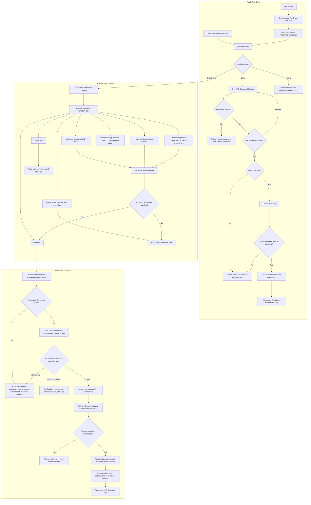

# Wayfinder Relationship And Runtime Design Synthesis

Status: exhaustive design reference, not an executable contract.

Runtime authority remains in:

- `skills/custom/wayfinder/SKILL.md`;
- `skills/custom/wayfinder/MAP-FORMAT.md`;
- the target repository's `docs/agents/issue-tracker.md`;
- the invoked resolver skills and their mutation boundaries;
- `docs/synthesis/skill-context-relationships.md`; and
- the target repository's domain and engineering contracts.

`skills/custom/wayfinder/` matches the installed active baseline. The coordinated candidate and its `OPERATIONS.md` extraction are preserved under `skills/experimental/wayfinder/`; this synthesis does not claim staged behavior promotion or authorize routing or installation of that candidate.

## How To Read This Document

This synthesis is exhaustive only for accepted behavior, material alternatives, and proof needed for extraction. Retain a paragraph only when removing it would change runtime design, implementation sequencing, validation, or a future promotion decision. Historical discussion belongs in research or validation evidence; concision belongs to the eventual runtime skill.

The document has four layers:

1. **Orientation** gives the destination, boundaries, operation vocabulary, and explanatory end-to-end flow.
2. **Normative Design** is the sole authority for proposed runtime behavior and relationships. The state-transition table is the sole state-machine authority.
3. **Evidence And Rationale** preserves rationale, deliberate non-changes, and deferred hypotheses without creating authoritative runtime rules.
4. **Extraction And Verification** places and proves the exhaustive design without redefining it.

Change proposed runtime behavior in Layer Two; explain it in Layer Three; place and prove it in Layer Four. The Design Verdict summarizes selected extraction status without creating rules. The Normative Home Index assigns each behavior one authority; the Runtime Ownership And Change Map owns file placement and source bundles; the Staged Extraction Plan owns implementation order; the Staged Behavior-Evaluation Protocol owns proof mechanics; and the Migration And Acceptance Matrix owns case coverage only. [Synthesis Ownership](../README.md#synthesis-ownership) governs cross-document placement: this note owns Wayfinder's process and required capability outcomes, while each foreign file owner's synthesis owns its concrete rewrite. Correct any diagram, rationale, ownership row, or acceptance case that disagrees with its Layer Two owner.

Use this index for direct navigation:

| Question | Owning section |
| --- | --- |
| What is selected now, required from other owners, deferred, or rejected? | [Design Verdict](#design-verdict) |
| How may Wayfinder be reached? | [Invocation](#invocation) |
| Where does each rule live? | [Normative Home Index](#normative-home-index) |
| Should a campaign exist? | [Qualification](#qualification) and [Admission](#admission) |
| What may the current map do next? | [Normative State Model](#normative-state-model) |
| When is the selected operation complete? | [Operation And Completion Contracts](#operation-and-completion-contracts) |
| How does a waiting or blocked map regain a frontier? | [Resume](#resume) |
| Which claim is required and when? | [Campaign Claim](#campaign-claim) |
| Which resolver owns a ticket? | [Ticket Contract And Resolver Taxonomy](#ticket-contract-and-resolver-taxonomy) |
| May uncertainty remain as fog? | [Tethered Fog](#tethered-fog) |
| Is the campaign still bounded? | [Campaign Budgets And Progress](#campaign-budgets-and-progress) |
| What must the map persist? | [Map Artifact Contract](#map-artifact-contract) |
| How does successful closure work? | [Closeout](#closeout) and [Revision-Backed Closure Evidence](#revision-backed-closure-evidence) |
| How does unsuccessful closure work? | [Terminate](#terminate) |
| May a closed map reopen or spawn a successor? | [Reopen And To Spec Re-entry](#reopen-and-to-spec-re-entry) and [Successor Import Contract](#successor-import-contract) |
| What does every invocation return? | [Return Contract](#return-contract) |
| Which skill owns each composition edge? | [Relationship Ownership](#relationship-ownership) |
| Which context loads for the selected state? | [Runtime Context Loading Contract](#runtime-context-loading-contract) |
| How should the eventual main skill read? | [Proposed Runtime Semantic Surface](#proposed-runtime-semantic-surface) |
| What belongs in each runtime surface and implementation stage? | [Runtime Ownership And Change Map](#runtime-ownership-and-change-map) and [Staged Extraction Plan](#staged-extraction-plan) |
| How will the extracted runtime be verified and promoted? | [Staged Behavior-Evaluation Protocol](#staged-behavior-evaluation-protocol), [Migration And Acceptance Matrix](#migration-and-acceptance-matrix), and [Promotion Gate And Residual Gaps](#promotion-gate-and-residual-gaps) |

# Layer One: Orientation

## North Star

Wayfinder owns one outcome: a finite tracker-backed route from a bounded foggy destination to coherent settled source for `$to-spec`.

Wayfinder owns the map, decision and prerequisite graph, tethered fog, evidence reconciliation, campaign-claim purpose, campaign budgets, and closure classification. Its tickets resolve decisions and prerequisites; they do not deliver the destination or create the implementation graph.

Wayfinder is warranted only when all conditions hold:

1. one destination remains foggy but can be bounded;
2. at least two interdependent material decisions remain unresolved;
3. at least one decision depends on non-conversational work such as source evidence, runnable proof, diagnosis, repository evidence, external response, executable prerequisite, or durable artifact; and
4. the route needs finite tracker-backed sequencing across sessions.

Question count, project size, severity, generic uncertainty, or multi-session work alone never justifies Wayfinder. One bounded resolver stays with its current owner. Conversation-and-domain-only work belongs to `$grill-with-docs`. Settled domain truth needing only persistence belongs to `$domain-modeling`.

## Design Verdict

This table summarizes extraction status and points to the sections that own the behavior. It does not create runtime rules.

| Stratum | Selected shape | Runtime status |
| --- | --- | --- |
| Wayfinder core | One bounded tracker-backed map; one normative state model; serial single-ticket Advance; one Mutation Envelope; bounded outcome, expansion, and correction growth; snapshot-gated Closeout; To Spec as the successful exit; and `SKILL.md`, `OPERATIONS.md`, and `MAP-FORMAT.md` as the runtime surfaces | Ready for coordinated staged extraction from Layer Two |
| Invocation | Explicit-only; the user deliberately starts or resumes Wayfinder by naming `$wayfinder`; upstream skills and Skill Router may recommend it and stop | Preserve `allow_implicit_invocation: false` through extraction and promotion |
| Required capability deltas | Design Coherence reference, provider tracker capabilities, bounded resolver returns, coordinated To Questionnaire `Q1` and Wayfinder `W1/W4` extraction, Router boundaries, tests, evaluations, and mirror parity | Required before promotion; To Questionnaire and Wayfinder may not promote or install this integration separately, while concrete foreign rewrites remain with their owners |
| Deferred hypotheses | Parallel Advance and a separate authority-transfer operation | Excluded from the first runtime; require observed need and independent evidence before design admission |
| Rejected machinery | Operation-per-file sprawl, a closure schema or helper, a parallel event ledger, provider procedure inside Wayfinder, full Codebase Design invocation at gates, and direct delivery-skill exits | Preserve the simpler selected owners and boundaries |

## Delivery Boundary

The successful delivery chain is linear:

```text
Wayfinder -> To Spec -> To Tickets -> Implement or Parallel Implement
```

- Wayfinder settles mutually compatible decisions, prerequisites, evidence, exclusions, domain consequences, design constraints, proof expectations, and route-closing source.
- To Spec synthesizes that distributed source into one grounded parent spec that passes the fresh-session test. It never silently invents a missing material decision.
- To Tickets owns actor and workflow decomposition, tracer-bullet slices, dependency order, acceptance, proof lanes, expected write scopes, parallel-safety analysis, and implementation readiness.
- Implement or Parallel Implement owns delivery. Wayfinder never chooses between them.

Waiting and blocked maps remain open. Delivered maps use successful Closeout and recommend To Spec. Cancelled, superseded, and out-of-scope maps use Terminate and stop without a delivery handoff.

## Leading-Word Operation Model

The eventual runtime skill should expose this compact operation vocabulary:

```text
Chart
Orient
Advance | Maintain | Resume | Closeout | Terminate | Reopen
Reconcile
Return
```

- **Chart** qualifies, admits, approves, creates, and reads back one new map, then stops.
- **Orient** reads persisted lifecycle and disposition, derives integrity, and consults the normative state-transition table.
- **Advance** resolves exactly one frontier ticket.
- **Maintain** applies one deterministic consequence-only representation repair.
- **Resume** reconciles one satisfied waiting trigger or cleared blocker into a visible state.
- **Closeout** runs Gather, Coherence, Durability, and Seal.
- **Terminate** records and closes one destination-owner-confirmed unsuccessful disposition.
- **Reopen** performs one bounded correction of a delivered map from a direct in-scope To Spec gap.
- **Reconcile** accounts for direct consequences without resolving another ticket implicitly.
- **Return** exposes the durable state, evidence, budget, and next permitted operation, then stops.

Closeout is a first-class operation. Only a completed Advance may hand directly into Closeout after fresh orientation; every other operation returns first. Closeout retains its own branch and completion-table row.

Advance is serial per map. Exactly one operation-qualified campaign claim may be active for a map, so every substantive outcome reconciles before another resolver starts. External waits release the claim and leave other ready tickets eligible for a later Advance.

## Navigation Vocabulary

- **Destination:** the settled-source readiness state that closes wayfinding and fixes the campaign scope.
- **Map:** the durable orientation index. It owns the charter, state, budgets, fog, decision pointers, exclusions, and closure records; tickets own detailed questions, resolutions, and assets.
- **Ticket:** one sharp question or prerequisite with one resolution authority and one expected return.
- **Frontier:** open, unblocked, unclaimed tickets whose dependencies are satisfied, in map order.
- **Fog:** one tethered in-scope uncertainty whose sharp question is not yet known.
- **Campaign claim:** the map-scoped concurrency guard for one mutating operation. It records actor, token, timestamp, operation, and the selected ticket for Advance.
- **Closure snapshot packet:** the closure-relevant map, ticket, evidence, budget, authority, domain, and provider-revision state gathered before Seal and refreshed under the campaign claim.
- **Successor:** a newly qualified campaign that explicitly imports selected predecessor source without inheriting predecessor state.
- **Name:** use linked human-readable map and ticket titles in reports; reserve provider ids for tracker operations, claims, and dependency wiring.

**Fog or ticket?** Create a ticket when the question is sharp, even when blocked. Retain fog only while the question itself remains unclear and its tether proves how it may sharpen.

## End-To-End Explanatory Flow



The diagram is explanatory. It omits provider transport, failure recovery, budgets, and several state branches that are authoritative in the contracts below.

# Layer Two: Normative Design

## Normative Home Index

Each behavior has one normative home. Other sections may point, explain, execute, or test it, but never create a competing rule.

| Concern | Sole normative home | Other appearances |
| --- | --- | --- |
| Invocation reach | [Invocation](#invocation) | Design Verdict, Relationship Ownership, runtime ownership, and invocation evaluation |
| Human and durable authority | [Authority Gates](#authority-gates) and [Destination And Campaign Charter](#destination-and-campaign-charter) | Operation prerequisites and acceptance cases |
| Campaign qualification and admission | [Qualification](#qualification) and [Admission](#admission) | Flowchart and invocation evaluation |
| First map creation | [Chart](#chart) | State-table entry and provider tests |
| State derivation and next-operation selection | [Normative State Model](#normative-state-model) | Flowchart, operation entry, and state scenarios |
| Operation completion and legal nonterminal return | [Operation And Completion Contracts](#operation-and-completion-contracts) | Named operation sections perform unique work; Return supplies packet fields |
| Mutation concurrency, persistence, and recovery | [Campaign Claim](#campaign-claim) | Operations name only their unique mutation and failure handling |
| Provider objects and primitives required by Wayfinder | [Tracker Mapping Boundary](#tracker-mapping-boundary) | Repo Bootstrap templates map and validate them without owning process |
| Ticket meaning and resolver authority | [Ticket Contract And Resolver Taxonomy](#ticket-contract-and-resolver-taxonomy) | Chart packets and resolver evaluations |
| Persisted map shape | [Map Artifact Contract](#map-artifact-contract) | Provider representation and read-back tests |
| Fog liveness | [Tethered Fog](#tethered-fog) | Admission and Reconcile outcomes |
| Counters and graph growth | [Campaign Budgets And Progress](#campaign-budgets-and-progress) | Operations invoke the shared authority without restating it |
| Operation-specific work and failure handling | The named operation section | Completion table decides when the operation may end |
| Closure evidence and comparison | [Revision-Backed Closure Evidence](#revision-backed-closure-evidence) | Closeout executes; provider templates transport |
| Successful closure | [Closeout](#closeout) | Transition table and delivery evaluation |
| Unsuccessful closure | [Terminate](#terminate) | Authority gate and terminal scenarios |
| Correction and successor campaigns | [Reopen And To Spec Re-entry](#reopen-and-to-spec-re-entry) and [Successor Import Contract](#successor-import-contract) | State table and correction evaluation |
| Composition edges, exclusions, and handoff boundaries | [Relationship Ownership](#relationship-ownership) | Resolver sections and relationship evaluation |
| Context selection and progressive disclosure | [Runtime Context Loading Contract](#runtime-context-loading-contract) | Runtime ownership map and context-loading evaluation |
| Invocation output | [Return Contract](#return-contract) | Every operation supplies its applicable fields |

## Invocation

Wayfinder is explicit-only. A user starts or resumes it by naming `$wayfinder`; its own Qualification and Admission still decide whether a campaign may proceed. Skill Router and other skills may recommend Wayfinder and stop, but they never invoke, compose, or continue it automatically. Preserve `policy.allow_implicit_invocation: false`; use the description only to explain the human-selected capability.

## Authority Gates

An authority gate never performs the work needed to make its own predicate true. Operation-local predicates live only in their owning operation and the normative transition table.

| Gate | Owner | Passing evidence | Other branch | Mutation authority |
| --- | --- | --- | --- | --- |
| Chart packet approved | Destination owner | Destination, stable destination identity, scope, closing condition, graph, fog, design framing, budgets, decision authority, and domain context action are accepted | Resume Qualification or revise the packet | Approval only; Chart owns later mutation |
| Resolver participation and acceptance locked | Destination owner or named ticket authority | The ticket records AFK, HITL, or external participation; objective criteria or the named human acceptance owner; and the mutation boundary | Revise the packet or remain blocked | The resolver receives only the locked ticket authority |
| Durable domain truth accepted | Domain Modeling for domain truth; destination owner for reserved language or boundary judgments | The complete Domain Delta is compatible, every intended persistence entry is verified or rendered, and no material nondeferred blocker remains | Return the exact authority blocker, failed entry, or typed material gap | Domain Modeling alone owns domain files |
| ADR creation approved | User or recorded ADR authority | Explicit approval names the proposed ADR decision | Preserve the candidate without writing | Domain Modeling owns the approved ADR write |
| Unsuccessful termination confirmed | Destination owner | Wayfinder's cancelled, superseded, or out-of-scope classification is explicitly confirmed | Keep the map open | Confirmation only; Terminate owns later mutation |
| Correction packet or amendment approved | Destination owner | The first packet traces one finite cohesive in-scope graph to a concrete To Spec return and calculates one cumulative correction budget; a later amendment remains connected to that failed closure condition and fits uncommitted capacity | Leave the delivered map immutable | Approval only; Reopen or the owning Closeout-gap mutation performs the later change |

## Destination And Campaign Charter

The destination is a readiness state, not merely an isolated answer:

```text
Destination: coherent settled source sufficient for $to-spec to publish one source-traced parent spec.
```

Every map locks this charter before Chart:

```text
Destination:
Stable destination identity:
Destination owner:
Observable authority evidence:
Decisions reserved for the destination owner:
Bounded delegate, only when one exists:
Scope boundary:
Route-closing condition:
Initial decisions and prerequisites:
Allowed resolver types:
Explicit exclusions:
Expansion rule: direct in-scope consequence only
Destination-change authority: approved successor campaign
Design-coherence reference:
Domain context action: persist authorized | render only
ADR creation: explicit approval required
Outcome budget and calculation:
Expansion budget and calculation:
Initial dependency-ready frontier | named waiting trigger:
```

The destination and scope are the hard campaign boundary. A material destination or scope change never expands the current map. Keep the map open as blocked until the destination owner approves a successor, then Terminate it as superseded with a pointer to that successor.

The invoking user is the destination owner only when they affirm that authority. A role or team is acceptable only when the tracker exposes an observable approval identity. The decision authority packet records the accountable owner, observable evidence, reserved decisions, and an optional bounded delegate only when delegation exists. Provider history preserves authority changes; the map does not duplicate an authority-history ledger or generic approval catalog. Tracker assignment is claim transport and never implies destination authority. When the required owner or delegate is unavailable, record waiting or blocked; Wayfinder never substitutes itself. A requested authority transfer is not Maintain and remains blocked on explicit outgoing, incoming, or tracker-governed higher authority; this design adds no separate Transfer operation without observed need.

Wayfinder may settle engineering constraints required for route coherence:

- responsibility and ownership boundaries;
- caller-facing interfaces and data contracts;
- state, lifecycle, compatibility, migration, rollback, security, environment, and operational requirements;
- required proof seams and observable outcomes; and
- a technical choice proved materially necessary by a typed Design decision.

Wayfinder does not own implementation-ticket boundaries, expected write scopes, worker assignment, parallelism, commit or landing order, implementation skill selection, or technique deliberately left open by the settled design.

## Qualification

Run Qualification only when a tracker read proves zero matching maps. Multiple plausible matches return an incompatible identity packet listing each candidate's name, lifecycle, disposition, destination owner, predecessor, and unresolved obligations. The destination owner must classify them as canonical, duplicate, successor, or distinct destination before Wayfinder may mutate or Chart another map. Wayfinder never auto-selects, merges, or creates through ambiguous identity.

After a zero-match result, return the bounded decisions needed to populate the Campaign Charter and proposed graph, recommend explicit `$grill-with-docs`, and stop. Resume Chart in a later Wayfinder invocation with the direct-user result before recording known decisions and prerequisites; typed tickets, edges, frontier or waiting trigger; tethered fog; design framing; graph-derived budgets; and exact Admission gaps. Stable destination identity is the provider lookup and later Chart-refetch key.

Qualification reads [Design Coherence Frame](codebase-design.md#frame). Every applicable criterion returns an accepted Constraint, bounded Question, Evidence gap, or evidenced non-applicability. Wayfinder alone maps a material Evidence gap to tethered fog under its Fog contract. It does not invoke `$codebase-design`, choose an architecture, or resolve the destination's substantive decisions.

Lock one domain context action:

- **Persist authorized:** the caller contract or explicit approval permits Domain Modeling to persist confirmed terms and boundaries during Qualification and later tickets.
- **Render only:** Domain Modeling challenges and reconciles language, then returns directly applicable per-target changes without writing domain files during the current invocation.

ADR creation remains separately approval-gated in both modes. Every early domain write appears in the qualification packet and later map Source Trace. A domain contradiction that prevents coherent Chart remains an exact admission gap rather than being persisted implicitly.

Qualification completes when Admission is decidable or one exact evidence gap prevents that decision.

## Admission

Admit Wayfinder only when the qualification packet proves all of these predicates:

1. one bounded destination, route-closing condition, and affirmed destination authority exist;
2. at least two interdependent material decisions remain unresolved;
3. at least one decision depends on non-conversational work;
4. durable tracker-backed sequencing is necessary;
5. every proposed obligation is inside the destination and scope;
6. every fog item has a finite in-scope sharpening path;
7. the proposed graph has a dependency-ready frontier or one named external waiting trigger;
8. design-relevant concerns are represented as accepted constraints, proposed Design tickets, or tethered fog rather than silent architectural assumptions;
9. finite outcome and expansion budgets, their calculations, and any named contingency are approved; and
10. the target's `Wayfinder tracker mapping` supplies every required object and primitive, including a configured exclusive-claim capability, provider revision token, release mapping, and mutation read-back.

Admission performs no tracker mutation. A destination requiring only conversation or domain persistence fails Admission. A missing, placeholder, `unavailable`, or incompatible tracker mapping returns `$repo-bootstrap` as the exact precondition rather than creating a partially executable map.

On failure, return this packet to Skill Router and stop:

```text
Attempted route: $wayfinder
Admission: rejected
Reason:
Settled state:
Residual work:
Available evidence:
Excluded route: $wayfinder unless material new evidence appears
Return boundary: $skill-router
Downstream execution: none
```

Skill Router later selects one narrower owner or `none`. An unchanged rejection packet cannot route immediately back to Wayfinder.

## Chart

After Admission passes, present one exact Map Artifact mutation packet for destination-owner approval. It contains the approved charter and graph; every child under the Ticket Contract; resolver-specific evidence paths and judgment criteria; fog, design, and domain state; calculated budgets; and initial `open` lifecycle with `active` or `waiting` disposition and its frontier or trigger.

Any changed packet requires fresh approval. Immediately before mutation, Chart repeats the stable destination-identity lookup. A new match returns for Orient or destination-owner classification without mutation. On zero matches, Chart creates only the map, then refetches the same identity. It creates children, fog, exclusions, and edges only when exactly the newly created map is canonical. Zero, multiple, different, or unreadable post-create identity stops before child creation with the created-map evidence and tracker recovery or destination-owner classification. Chart then reads back the complete representation and initial derived state, returns the verified frontier or wait, and stops. It resolves no child, selects no route, and retains no claim.

## Normative State Model

Persist two orthogonal fields:

| Field | Values | Meaning |
| --- | --- | --- |
| Lifecycle | `open`, `closed` | Whether ordinary campaign mutation remains permitted |
| Disposition | `active`, `waiting`, `blocked`, `delivered`, `superseded`, `cancelled`, `out-of-scope` | Why the map may advance, wait, require intervention, or remain closed |

Only these lifecycle and disposition pairs are legal:

| Lifecycle | Legal dispositions |
| --- | --- |
| `open` | `active`, `waiting`, `blocked` |
| `closed` | `delivered`, `superseded`, `cancelled`, `out-of-scope` |

Any other pair is `incompatible` unless current accepted evidence dictates one unique consequence-only metadata repair, in which case it is `repairable-drift`.

Derive integrity during every Orient; never persist it:

| Integrity result | Predicate | Consequence |
| --- | --- | --- |
| `verified` | Representation, legal state pairing, claims, counters, edges, and tracker state satisfy current contracts | Use the matching transition row |
| `repairable-drift` | Every required correction is consequence-only and supported by accepted resolutions or current contracts | Maintain may propose one exact repair packet |
| `incompatible` | Repair needs a new decision, changes approved meaning or scope, or requires an unavailable tracker operation | Stop with the exact conflict and owner |

An incompatible setup operation recommends Repo Bootstrap. Unresolved product or design meaning becomes or exposes the correctly typed ticket when mutation authority exists. Destination or scope conflict requires destination-owner judgment or a successor. Integrity never grants mutation authority by itself.

The following table is the sole state-machine authority:

| Current evidence | Integrity | Additional predicate | Permitted operation or return | Claim purpose |
| --- | --- | --- | --- | --- |
| Zero matching maps | Not applicable | Qualification and Admission pass; packet approved; final pre-mutation identity lookup remains zero | Chart | None after Chart read-back |
| Multiple plausible maps | Not applicable | Identity remains ambiguous | Return incompatible identity packet for destination-owner resolution | None |
| `open` + `active` | `verified` | Dependency-ready frontier exists and budgets remain | Advance | Campaign claim: Advance + selected ticket |
| `open` + `active` | `verified` | No unresolved obligation, external wait, contradiction, or blocker remains | Closeout | None during read-only work; campaign claim for one gap mutation or Seal |
| `open` + `active`, `waiting`, or `blocked` | `repairable-drift` | Every proposed change is consequence-only | Maintain | Campaign claim: Maintain |
| `open` + `waiting` | `verified` | One recorded observable trigger is satisfied | Resume: Wake | Campaign claim: Resume |
| `open` + `waiting` | `verified` | Named external owner and observable trigger remain pending | Return waiting state | None |
| `open` + `blocked` | `verified` | One recorded intervention is satisfied inside the current destination, scope, and budgets | Resume: Recover | Campaign claim: Resume |
| `open` + `blocked` | `verified` | Recorded intervention remains unsatisfied or campaign budget exhaustion requires a successor | Return exact intervention | None |
| `open` + `active`, `waiting`, or `blocked` | `incompatible` | Exact owner or setup precondition identified | Return incompatibility packet | None |
| `open` + `active`, `waiting`, or `blocked` | `verified` | Wayfinder classifies terminal evidence and destination owner confirms | Terminate | Campaign claim: Terminate |
| `closed` + `delivered` | `verified` | No qualifying To Spec gap | Return immutable closure packet | None |
| `closed` + `delivered` | `verified` | One concrete To Spec return supports the approved first correction packet and cumulative budget, or an approved later amendment fits uncommitted correction capacity | Reopen | Campaign claim: Reopen |
| `closed` + `superseded` | Any | Successor pointer resolves | Return immutable record and successor | None |
| `closed` + `cancelled` or `out-of-scope` | Any | None | Return immutable terminal record | None |
| Any `closed` disposition | `repairable-drift` or `incompatible` | Current provider representation differs from the historical contract | Return immutable record plus owning migration or Repo Bootstrap precondition | None through Wayfinder |

Closed semantic history is immutable except for bounded delivered-map Reopen. A pack or tracker migration may add consequence-only representation metadata to a closed record only through the owning migration contract; it never changes the historical decisions, disposition, or closure evidence through Wayfinder Maintain.

## Operation And Completion Contracts

The Normative State Model alone selects the next operation. This table alone decides when that selected operation is complete and which nonterminal result may end the invocation. The Return Contract alone defines the shared packet fields.

| Operation | State-table selector | Complete when | Legal nonterminal return |
| --- | --- | --- | --- |
| **Chart** | Chart row | Pre-create identity remained zero; exactly the new map became canonical; the approved map and exact graph read back; initial state and frontier or wait are visible; no child resolution or claim remains | Existing, ambiguous, different, or unreadable identity packet; created-map recovery packet when post-create identity is not canonical |
| **Orient** | Universal invocation entry, then one matching state-table row | Fresh identity, representation, lifecycle, disposition, claims, counters, edges, and provider state derive one integrity result and exactly one permitted operation or return | Ambiguous identity, incompatible state, immutable terminal state, waiting trigger, blocker, setup precondition, or exact missing authority |
| **Advance** | Advance row | Exactly one selected ticket has one substantive outcome, or one Questionnaire ticket has a verified `Questionnaire ready` packet and `awaiting-external-response` state with its reservation preserved; every other mutation is a direct consequence; fog, counters, claim absence, and the next frontier or waiting state read back | One Questionnaire waiting packet with durable artifact identity, ledger, owner, trigger, preserved reservation, and unchanged used counter; or one transient incomplete-attempt packet with recovery evidence and unchanged outcome and counters |
| **Maintain** | Maintain row | Every evidence-determined repair reads back; no material meaning or ticket outcome changed; claim absence and the resulting state read back | Incompatible packet naming the decision, scope change, unavailable provider operation, or nondeterministic repair that withholds authority |
| **Resume** | Resume Wake or Recover row | One satisfied trigger or intervention and every direct consequence read back; net growth reconciles; no ticket outcome changed; claim absence and the resulting state read back | Unsatisfied or incomplete condition, destination or scope change, exhausted-budget successor blocker, or incompatible packet |
| **Closeout** | Closeout row | Gather is complete; every Coherence lens passes; Durability returns no delta or verified persistence without contradiction; Seal proves unchanged declared fields; sealed packet, delivered close, post-close revision, claim absence, and post-release revision read back; To Spec is the successful route | Typed gap or blocker, approval wait without a claim, amendment or successor requirement, provider recovery packet, or semantic-change reorientation |
| **Terminate** | Terminate row | Destination-owner confirmation, terminal disposition, reason, evidence, budgets, unresolved obligations, recovery or successor boundary, closed state, and claim absence read back | Open state unchanged plus the exact missing confirmation or incompatible terminal evidence |
| **Reopen** | Reopen row | Prior generations remain immutable; approved correction evidence, budget, and frontier read back; lifecycle is open and active; claim absence and next operation are visible | Destination-owner judgment, amendment or capacity blocker, successor requirement, or provider recovery packet |

## Waiting And Blocked

`waiting` means progress depends on one named external response or event with an identified owner, needed-back ledger, and observable resumption trigger.

`blocked` means no authorized executable frontier exists until an exact intervention supplies missing evidence, authority, access, prerequisite, budget, compatible setup, or destination judgment. Budget exhaustion with unresolved obligations is blocked on a destination-owner successor decision; it is never an `active` state with an unusable frontier.

Wayfinder derives both from the reconciled graph. Reconcile records the resulting disposition under the current operation's claim before release. New external evidence uses Resume rather than pretending the prior representation drifted. If Orient instead finds a stale disposition whose correction is uniquely dictated by evidence already accepted before the state was recorded, derive `repairable-drift` and use Maintain. Neither waiting nor blocked closes the map or requires ceremonial approval. When evidence supports neither an expected external trigger nor executable work, use blocked rather than inventing a wait.

## Campaign Claim

### Mutation Envelope

Every mutating operation uses one envelope:

1. Verify the selected transition, operation-specific authority, applicable capacity, and absence of another campaign claim.
2. Acquire and read back one map-scoped claim containing actor, token, timestamp, operation, and the selected ticket only for Advance.
3. Perform only the selected operation's authorized mutation and apply Graph-Growth Authority when obligations change.
4. Reconcile and read back every affected artifact, relationship, state field, counter, evidence pointer, and provider revision required by that operation.
5. Release the claim, read back its absence, and Orient from fresh state. Return after every operation. The sole same-invocation continuation is from a completed Advance into Closeout when fresh Orient selects Closeout; never start a second resolver or Advance.

### Semantics And Lifetimes

Wayfinder owns claim-token generation, timestamps, fields, operation purpose, lifetime, semantic comparison, staleness, takeover authority, failure recovery, release semantics, and the exact permitted delta. Generate one fresh `codex/<lowercase UUIDv4>` token and UTC timestamp per invocation. Elapsed time alone never makes a claim stale. Replacing a foreign claim requires recorded prior evidence, reason, and destination-owner or provider-administrator authority.

The target tracker mapping owns only provider representation and primitives: claim storage, a conditional mutation or exclusive lock against a captured revision, release, revision token, and refetch. The configured acquisition must fail when another actor wins or the captured revision changes; ordinary last-write-wins mutation plus read-back is evidence, not acquisition. When no exact primitive and losing-race result are configured, capability is `unavailable` and Wayfinder returns the Repo Bootstrap precondition before mutation. Assignment may mirror the actor but grants no destination or decision authority; a ticket may point to the map claim but never carries independent concurrency authority.

| Operation purpose | Unique claim lifetime |
| --- | --- |
| Advance | One selected resolver through its outcome and direct-consequence reconciliation |
| Maintain | One deterministic repair |
| Resume | One satisfied Wake or Recover condition |
| Closeout gap mutation | One already-detected typed gap, blocker, or approved amendment; no claim during analysis or approval waits |
| Closeout Seal | Pre-Seal refetch through delivered close read-back |
| Terminate | Confirmed terminal mutation through terminal read-back |
| Reopen | Delivered-to-open transition through authorized frontier read-back |

External waits retain no claim. A failed acquisition, mutation, read-back, or release returns applied operations, failed operations, current claim evidence, and the safest mapped recovery action. Wayfinder never removes a foreign claim without recorded takeover authority. Release removes the configured guard and claim representation, then proves their absence. A final Advance may enter Closeout in the same invocation only after its envelope completes and fresh Orient proves the Closeout row applies.

## Tracker Mapping Boundary

Before mutation, read the target's `Wayfinder tracker mapping`. It must map exactly these provider-neutral surfaces:

1. map object and open-plus-closed lookup input;
2. ticket object;
3. resolver-type labels or fields;
4. parent and blocking relationships;
5. campaign-claim storage;
6. exclusive-claim capability, recorded as configured with its exact invocation and losing-race result or as `unavailable`;
7. claim-release primitive;
8. revision token; and
9. read-back primitive returning provider errors and observed fields.

The mapping answers only where data lives and which primitive exposes it. Wayfinder owns identity cardinality and comparison, every persisted field's meaning, state and frontier derivation, claim semantics, operation order, authority, recovery, budgets, and completion. Repo Bootstrap selects, provisions, reconciles, and structurally validates the mapping; it never interprets Wayfinder state.

## Ticket Contract And Resolver Taxonomy

Every ticket owns exactly one sharp question or prerequisite, one resolver type, one resolution authority, and one expected return:

```text
Resolver type:
Participation: AFK | HITL | external
Question or prerequisite:
Destination impact:
Resolution authority:
Dependencies:
Expected return:
Proof or confirmation:
Mutation boundary:
Budget source:
```

| Resolver type | Use when | Resolution authority | Required return |
| --- | --- | --- | --- |
| Research | One authoritative source fact is missing | Primary-source evidence | Answer, citations, limits, and approved note pointer |
| Prototype | One runnable design or behavior verdict is needed | Locked objective criteria or named human judge | Verdict, evidence, limits, and cleanup or preservation state |
| Diagnosis | Expected behavior, symptom, cause, or trusted reproduction is uncertain | Causal evidence | Reproduction, cause status, evidence, regression seam, and blocker |
| Questionnaire | One identifiable external stakeholder owns unavailable information | Named person or one accountable role endpoint | `Questionnaire ready`, durable artifact identity and retention, needed-back ledger, external owner, trigger, and later reconciled answers |
| Grilling | The user owns one preference, term, boundary, commitment, public contract, or tradeoff | User, through Grill With Docs with Domain Modeling active under the locked context action | Lean combined packet with joint `Confirmed`, `Evidence gap`, or `Blocked` status, available component payloads intact, and exact blocker details only when blocked |
| Design | One evidenced module, interface, seam, adapter, ownership, migration, compatibility, or caller-facing proof question remains | The ticket's locked objective criteria or named human acceptance owner | Accepted shape, alternatives, interface contract, migration, proof seam, risks, and residual gap |
| Task | One bounded read-only repository or operational evidence question has no specialized resolver | Accepted repository contracts and observable proof | Supported answer, affected boundary, proof, disposable evidence, and blocker |

Classify by resolution authority, not grammar. Reconciliation is a purpose, not a resolver type. A product tradeoff uses Grilling; an interface conflict uses Design; factual conflict uses Research or Prototype; uncertain existing behavior uses Diagnosis; unavailable stakeholder knowledge uses Questionnaire; and an objective repository-contract mismatch uses Task.

`awaiting-external-response` is a Questionnaire ticket state, not a resolver type or permission to retain a claim. A later Advance reconciles supplied answers against provenance, needed-back coverage, sufficiency, and the ticket's acceptance contract, then resolves, splits, or reblocks the ticket. It does not certify subjective answers as objectively true; a factual claim needing verification becomes its own evidence obligation.

The Questionnaire ticket packet is closed to Wayfinder and must match To Questionnaire's Wayfinder Entry exactly. It supplies sender, accountable recipient endpoint, decision or prerequisite, needed-back ledger, authorized sources, answer use and reconciliation owner, deadline, effort, sensitive-context boundary, overwrite authority, durable path or root, lifetime, retention owner, and delivery assumptions. An exact authorized path wins; otherwise a sensitivity-compatible `.scratch/to-questionnaire/` path is the durable local default under a verified Repo Bootstrap state policy. `.tmp` is never valid for this external wait.

Participation defaults are explicit:

- Research is AFK.
- Prototype follows its locked claim level and judgment mode below.
- Diagnosis is AFK unless reproducing the symptom requires live human action; either mode remains diagnosis-only.
- Questionnaire is external.
- Grilling is HITL.
- Design is AFK when Chart locks objective constraints and acceptance criteria and no user-owned commitment remains. It is HITL when the choice changes a public contract, irreversible migration, product tradeoff, or a named owner reserves judgment.
- Task is AFK when objective repository proof closes it and HITL only when gathering that evidence requires live human action. Either mode remains evidence-only.

Prototype participation follows the locked `claim level` and `judgment mode`:

- `shape/feel` plus `human` is HITL with a named human judge;
- `design evidence` plus `rule-based` is AFK when objective verdict criteria are caller-locked; and
- `design evidence` plus `human` is HITL only when the caller explicitly reserves judgment for a human.

Resolver-specific boundaries remain:

- Research uses one caller-approved repo-local note path and returns citations, limits, conflicts, and that durable pointer.
- Prototype returns one verdict and its cleanup or preservation state; prototype code never becomes destination delivery implicitly.
- Diagnosis remains diagnosis-only inside Wayfinder; it returns causal status and a trusted proof seam without fixing the behavior.
- Questionnaire creates the collection artifact but does not resolve the ticket; Wayfinder later reconciles supplied answers and alone applies the ticket's acceptance contract.
- Grilling through Grill With Docs may ask several conversational questions only to settle the one ticket-owned decision. The composer returns its intact lean `Confirmed`, `Evidence gap`, or `Blocked` packet under the locked context action; Wayfinder does not flatten either component payload.
- Design invokes Codebase Design only for the one ticket-owned design question and returns its bounded packet without choosing another ticket. Wayfinder records a resolution only under the ticket's locked objective criteria or named human acceptance.
- Task may inspect the repository, run bounded commands, and create disposable evidence inside existing authority. It never changes production code, durable configuration, tracker setup, or external systems. A prerequisite requiring durable mutation becomes Blocked with its owning skill or authority. Task is not a catch-all for source research, runnable design evidence, causal diagnosis, design, or stakeholder authority.

## Map Artifact Contract

The map remains an index rather than a transcript. Its normative information groups are:

```text
Stable destination identity, provider identity and Chart refetch evidence, predecessor, lifecycle, disposition, and operation-qualified campaign claim
Decision authority packet: accountable owner, observable evidence, reserved decisions, and optional bounded delegate
Destination, scope boundary, route-closing condition, campaign-budget calculations, and counters
Source Trace, domain context action, ADR boundary, and design-coherence reference
Ordered child-ticket index and blocking relationships
Decisions So Far with one-line gists and owning ticket pointers
Not Yet Specified as the sole tethered-fog container
Out Of Scope with governing resolution, ticket, or successor pointers
Waiting owner and trigger | blocked intervention | Resume history | active frontier
Closeout attempts, closure snapshot packets, Gather and pre-Seal source revision vectors, post-close and post-release operation evidence, closure generation, durability result, and sealed or terminal record
Approved To Spec correction packets and amendments, source returns, cohesive ticket graphs, total, reserved, used, and uncommitted correction capacity, acceptance authorities, proofs, and Reopen generations
```

Resolution detail stays in the owning ticket or durable resolver artifact. `Not Yet Specified` is the only fog container. Do not create a ticket solely to provide an Out Of Scope link when an existing resolution or map pointer governs the exclusion.

## Tethered Fog

Fog is in-scope uncertainty whose sharp question is not yet known. It is never a free-floating backlog.

Every fog item records:

```text
Unresolved uncertainty:
Destination impact:
In-scope reason:
Expected sharpening source:
Unlock condition or observable trigger:
Affecting tickets or external events:
Fallback disposition if the trigger never arrives:
```

Chart may retain fog only when an already mapped ticket or named external trigger can plausibly sharpen it. Orphan fog with no finite sharpening path is an Admission evidence gap. A map with no frontier may remain valid only when it has one named waiting trigger.

After an outcome or trigger, Reconcile gives every affected fog item exactly one disposition:

- **Retain:** the tether remains valid and the remaining uncertainty is stated.
- **Graduate:** create and wire one or more finite sharp tickets, then remove the fog item.
- **Resolve:** remove it after a linked resolution represents its answer.
- **Exclude:** remove it and add the governing scope pointer to Out Of Scope.

Graduation may create only a direct in-scope consequence under the graph-growth authority. If approval or capacity is absent, keep the fog item and return the exact amendment or successor blocker. If evidence changes destination or scope, exclude it, return blocked for destination-owner judgment, or require a successor; never use fog as expansion authority.

## Campaign Budgets And Progress

Chart proposes and locks two finite original-campaign counters:

- **Outcome budget:** maximum substantive ticket outcomes in this map.
- **Expansion budget:** maximum newly created tickets or fog items beyond the approved Chart packet.

The proposal is graph-derived rather than an unexplained number. Outcome budget includes one unit for every initial ticket and one explicitly named finite contingency when uncertainty warrants it. Each unresolved ticket reserves one outcome unit; its substantive outcome converts that unit to used. Uncommitted outcome capacity is the total minus used and reserved units. Resume never consumes outcome budget. Expansion budget is the maximum accepted net-new direct-consequence obligations. The approval packet shows both calculations. No silent reserve exists.

Every outcome-producing original-campaign Advance converts the selected ticket's reserved outcome unit to used, including Resolved, Blocked, or Out of Scope. A correction-generation Advance converts its reserved correction unit to used instead. A Questionnaire ready waiting return preserves its reservation and leaves used unchanged until reconciled answers later produce a substantive outcome. `Blocked` is substantive only when it records one durable exact intervention or external prerequisite. A transient tool, access, or resolver failure is an incomplete attempt: record recovery evidence, release and read back the claim, leave counters and ticket outcome unchanged, and Return. A repeated or confirmed non-transient failure must become Blocked rather than cycle as incomplete.

During the original campaign, every net-new obligation consumes expansion and must fit within uncommitted outcome capacity. A bounded replacement removes or invalidates its named source obligation and consumes expansion only for net growth; reopening an existing obligation consumes none. Correction generations use the approved correction packet and budget below instead of expansion. Consequence-only Maintain, Resume, read-only Closeout work, tracker recovery, incomplete attempts, and Return consume no budget.

Each outcome-producing Advance must resolve, narrow, replace, exclude, or exactly block an existing obligation. A Questionnaire waiting return instead preserves the obligation and records one external owner, needed-back ledger, observable trigger, and artifact pointer. A new ticket or fog item names its source outcome, destination impact, in-scope reason, budget effect, and blocking relationship. It may not restart the same question under another label.

When an operation exhausts a required budget while obligations remain, Reconcile records `open` + `blocked` under the current claim with total, reserved, used, and uncommitted capacity; resolved and unresolved obligations; why the approved graph underestimated the route; and the exact destination-owner successor decision. The existing map's budget is never silently extended. Continued wayfinding requires confirmed supersession and a newly qualified successor campaign.

A delivered map has at most one finite correction budget established by its first approved correction packet and shared cumulatively across every later Reopen generation of that originally delivered map. The total equals one unit for every ticket in the first correction graph plus one explicitly justified finite contingency only when evidence warrants it. Each open correction ticket reserves one unit; its substantive outcome converts that reserved unit to used. A later net-new correction ticket requires a destination-owner-approved amendment, remains connected to the same failed closure condition, and reserves one uncommitted contingency unit. No hidden reserve, replenishment, replacement budget, or correction-expansion counter exists. Exhaustion without restored coherence, independent gaps, materially wider work, or a destination change requires a successor.

### Graph-Growth Authority

| Campaign state | Net-new obligation | Existing or zero-growth obligation | Missing authority |
| --- | --- | --- | --- |
| Original campaign | Requires remaining expansion budget and one uncommitted outcome unit | Reopen without charge; a bounded one-for-one replacement transfers its reservation | Return the exact capacity or successor blocker |
| Correction generation | Requires a destination-owner-approved cohesive amendment and one uncommitted correction unit | Reopen without charge | Return the exact amendment requirement, or successor blocker when capacity or cohesion is absent |
| Consequence-only change | Not applicable | Repair artifacts, relationships, or disposition without increasing obligations | Return incompatible when judgment or material meaning would change |

An operation may expose a proposed obligation but cannot create it without the applicable authority. Missing approval returns the exact packet amendment; missing capacity or cohesion returns the successor blocker. No operation owns a separate expansion exception.

## Advance

Advance processes exactly one selected frontier ticket toward one substantive outcome or one authorized external wait:

1. Orient and select the named frontier ticket or the first frontier ticket in map order.
2. Verify that the selected ticket owns one reserved outcome or correction unit and that total, reserved, used, and uncommitted counters reconcile.
3. Under the Mutation Envelope, invoke the ticket's resolver using its locked participation and authority.
4. On a transient incomplete attempt, record recovery evidence and complete the envelope without changing outcome or counters. A repeated or confirmed persistent failure becomes Blocked.
5. When To Questionnaire returns `Questionnaire ready`, record `awaiting-external-response`, its durable absolute path and SHA-256, lifetime and retention owner, needed-back ledger, external owner, observable trigger, exclusions, redactions, and assumptions; preserve its reservation and used counter; Reconcile to `active` when another frontier ticket remains or `waiting` when none remains; complete the envelope and Return. `Not admitted` or `Incomplete` never creates waiting by itself: preserve the exact leaf packet, then let Wayfinder alone classify the evidence as one substantive outcome, exact blocker, or incomplete attempt under the ordinary Advance contract.
6. Otherwise record exactly one substantive outcome—Resolved, Blocked, or Out Of Scope—and convert the ticket's reservation to used.
7. Apply Graph-Growth Authority and reconcile only direct tickets, dependencies, fog, domain candidates, design consequences, counters, and resulting disposition without answering another ticket.

Advance touches only the selected ticket and direct consequences. It never starts another resolver before the envelope completes.

## Maintain

Maintain applies only to `repairable-drift`:

1. Build one exact consequence-only repair packet with an evidence pointer for every change. The approved open-map charter pre-authorizes it only when accepted evidence and current contracts permit exactly one result.
2. Under the Mutation Envelope, apply only contract-determined canonical-section, stale-fog, broken-pointer, scope-index, dependency, claim-metadata, or equivalent representation repairs.
3. Record no substantive child outcome and make no material decision.

If repair permits discretion, requires a decision, changes approved meaning, crosses scope, or needs an unavailable tracker operation, integrity is incompatible and Maintain is not authorized. Closed records remain outside Wayfinder Maintain.

## Resume

Resume reconciles exactly one newly satisfied liveness condition without resolving a ticket:

1. Orient and select one recorded waiting trigger or blocker intervention whose evidence is now observable.
2. Reject Resume when the evidence changes destination or scope, attempts to extend exhausted campaign budgets, or remains incomplete.
3. Under the Mutation Envelope, run exactly one branch:
   - **Wake:** verify waiting and needed-back evidence, then make its existing ticket dependency-ready or give each directly affected fog item one disposition.
   - **Recover:** verify the recorded intervention, then restore only the tickets, edges, fog, or frontier it unlocks.
4. Apply Graph-Growth Authority and persist the resulting `active`, `waiting`, or `blocked` state.

Resume consumes no outcome budget and performs no resolver work. One invocation handles one trigger or intervention; other satisfied conditions remain visible for later Resume operations. Wake and Recover are branches inside Resume, not additional first-class operations.

## Revision-Backed Closure Evidence

Closure uses one tracker-native snapshot packet rather than a parallel machine ledger. Wayfinder owns the packet's declared field inventory, completeness, materiality, comparison, closure judgment, and recovery semantics. The tracker mapping supplies only representation, observable revision tokens, persistence primitives, and refetch.

Gather records the exact closure-relevant fields and their current values or evidence pointers plus the initial source revision vector. Provider revision evidence uses an observable native version, timestamp, content hash, tracked-file hash, or equivalent provider-specific token. The evidence detects intervening activity; it does not replace field-level semantic comparison.

Seal refetches the same declared fields under the campaign claim and records the pre-Seal source revision vector. The expected Seal-claim transport fields are not closure semantics. A changed closure field releases the claim and returns for reorientation. A revision change confined to the expected claim transition, unrelated transport, or formatting metadata updates the recorded revision evidence without inventing a semantic change. An unchanged closure packet stores the Gather and pre-Seal vectors and becomes the sealed closure record on the map. Closing the map and releasing the claim each produce a final mutation read-back revision recorded in provider history and the Wayfinder return evidence, not inside the packet they would mutate. Wayfinder persists no duplicate full tracker snapshot, JSON manifest, helper version, schema version, or digest.

Every sealed closure generation remains immutable. Reopen preserves prior sealed packets and adds the next generation. Repo Bootstrap may migrate surrounding tracker representation but never historical closure semantics. Wayfinder needs no JSONL event ledger or closure helper because provider history, immutable ticket outcomes, map state, sealed packets, and correction generations already preserve the required audit trail.

## Closeout

Closeout is a first-class operation with four phases: **Gather -> Coherence -> Durability -> Seal**.

Closeout entry requires a current tracker read proving no unresolved child, tethered fog, external wait, material contradiction, exact in-scope blocker, or exhausted-budget decision remains. Gather, Coherence, and Durability run without a campaign claim. Closeout acquires a short campaign claim only to materialize one detected gap or blocker, or to run Seal.

### Gather

Gather builds one closure snapshot packet from fresh provider reads:

```text
Identity, lifecycle, disposition, closure generation, and Gather revision vector:
Decision authority, destination, scope, closing condition, budgets, and claim absence:
Complete in-scope ticket index with resolver, state, dependencies, dispositions, and revisions:
Accepted, rejected, deferred, and excluded decisions with evidence pointers:
Research, prototype, diagnosis, questionnaire, grilling, and task returns:
Design packets, Domain Deltas, ADR outcomes, and accepted engineering constraints:
Actor, workflow, edge-case, failure, proof, and observable-outcome constraints:
Residual nonmaterial uncertainty and revision evidence for every declared source:
```

Provider templates own revision evidence through timestamps, native versions, content hashes, tracked-file hashes, or an equivalent observable mechanism. The declared field inventory excludes formatting, transport metadata, and unrelated tracker activity while including every closure-relevant semantic field.

Gather is read-only. It completes when every mapped obligation has one disposition and evidence pointer, every declared field and provider revision reads successfully, and the packet is sufficient for Coherence.

### Resolution Coherence

Wayfinder owns one read-only coherence gate. It reads [Design Coherence Check](codebase-design.md#check) but does not invoke `$codebase-design`.

Test five lenses:

- **Destination:** every accepted resolution supports the destination, scope, closing condition, and settled-engineering boundary.
- **Decision:** dependent decisions agree across public and data contracts, state and lifecycle behavior, permissions, environments, migration, cutover, rollback, security, and compatibility.
- **Domain:** accepted language, context ownership, and boundaries agree with canonical truth or one complete rendered delta; every collision is accounted for under the locked context action.
- **Design:** responsibility ownership, caller-facing interfaces, dependency direction, seam value, migration, compatibility, and caller-facing proof satisfy the shared design-coherence reference.
- **Evidence:** every material conclusion has the source, runnable evidence, causal proof, human authority, external response, or repository proof required by its ticket.

Coherence validates; it never decides, redesigns, persists domain truth, or blesses the map ceremonially. On a gap, apply Graph-Growth Authority. Under a Closeout-gap Mutation Envelope, reopen one authorized obligation or create one authorized typed ticket after refreshing the relevant closure fields. Missing correction amendment, capacity, cohesion, or scope returns its exact amendment or successor blocker without mutation. A Design gap becomes a Design ticket; a later Advance invokes `$codebase-design`.

Record lens results and typed gap pointers in the closure snapshot packet. Coherence passes only when every lens passes and no material incompatibility is deferred.

### Durability

After Coherence passes, invoke `$domain-modeling` under the locked context action to reconcile canonical terms, context ownership, boundaries, durable invariants, and already-settled ADR-worthy decisions.

`persist authorized` permits required domain writes and read-back. `render only` requires directly applicable target entries and performs no domain writes in the current invocation. ADR creation always requires explicit approval from the recorded authority.

Durability returns:

```text
Domain subject and source:
Decision and mutation authority:
Resolution: no-change | resolved | partial | unresolved
Persistence: complete | partial | failed | not-applicable
Persistence entries: <target>: rendered | verified | failed
Open blockers: <zero or more authority | evidence | contradiction | routing/setup | persistence/verification entries>
Resolved or open consequences:
Changed paths and read-back, when present:
Rendered changes, when present:
ADR candidates and outcomes, when present:
Return owner: Wayfinder
Caller continuation authority: preserved
```

A missing authority returns an `authority` blocker with the exact approval requirement. If accepted topology requires a single-to-multi-context routing transition, retain Domain Modeling's topology result, recommend `$repo-bootstrap` with the exact setup requirement, and stop before domain persistence; a later invocation resumes only after setup read-back verifies the new routing. When persisted disposition must change, record the blocker under one Closeout-gap Mutation Envelope. A material contradiction or new participant-owned decision applies Graph-Growth Authority before that envelope creates one typed Grilling ticket; correction growth still requires prior amendment approval. Consequence-only persistence or rendering of a Domain Delta already represented in Gather does not rerun Coherence; changed or newly exposed material meaning does.

### Seal

After Coherence and Durability pass, run one Closeout-Seal Mutation Envelope:

1. Refetch every declared closure field and provider revision; record the pre-Seal source revision vector.
2. Compare each closure field with Gather, excluding expected claim transport. Treat verified persistence or rendering of an already-accounted Domain Delta as equal and retain its per-target evidence.
3. On semantic change, complete the envelope without closing and Return for reorientation. Unrelated transport, formatting, or expected-claim revision changes may refresh evidence and continue.
4. On equality, merge Durability plus the Gather and pre-Seal vectors into the sealed packet, persist it, close as `delivered`, and read back the packet, closed state, and post-close revision.
5. Complete the envelope with claim absence and the post-release revision, recommend `$to-spec`, and stop.

Seal proves source completeness: every mapped obligation, decision, prerequisite, exclusion, evidence pointer, budget, design constraint, domain outcome, and provider revision is accounted for. To Spec retains fresh-session synthesis, grounding, actor and workflow coverage, edge-case coverage, parent publication, and its own read-back.

## Terminate

Waiting and blocked maps remain open. A whole map closes unsuccessfully only as:

| Disposition | Classification predicate | Confirmation authority |
| --- | --- | --- |
| `cancelled` | The destination remains valid and potentially achievable, but its owner chooses to stop and no replacement is implied | User or named destination owner |
| `superseded` | An approved successor destination or campaign takes ownership of the remaining purpose | User or named destination owner approving the replacement |
| `out-of-scope` | The approved caller or campaign boundary excludes the destination | User or named destination owner for the whole map |

Wayfinder classifies evidence; it never authorizes whole-map termination. Individual obligations may be excluded under the approved boundary without new approval, but whole-map out-of-scope closure requires confirmation.

After confirmation, run the Terminate Mutation Envelope: record disposition, authority, reason, evidence, budgets, unresolved obligations, and recovery or successor boundary; close the map; then Return the immutable terminal packet without Coherence, Durability, Seal, or To Spec.

## Reopen And To Spec Re-entry

Every delivered map recommends To Spec with this packet:

```text
Route: $to-spec
Settled source: <sealed closure packet>
Domain Delta: <complete attached Domain Delta>
Material gaps: none
Map: <closed delivered map>
```

To Spec never mutates the map. If it returns one or more material source or design gaps, a later user-started Wayfinder invocation classifies that evidence:

- **Direct in-scope consequence:** present one destination-owner-approved correction packet or amendment containing the concrete To Spec evidence, in-scope classification, finite cohesive graph, acceptance authority, proof, and capacity calculated by Campaign Budgets. Under a Reopen Mutation Envelope, preserve prior sealed generations, attach the evidence, change lifecycle to `open` and disposition to `active`, and create or reopen only the authorized frontier. Qualification and full Chart approval do not repeat because the campaign bound is unchanged.
- **Destination or scope change:** leave the original map immutable and qualify a successor campaign.
- **Unclear:** stop for destination-owner judgment without mutation.

Every correction ticket traces through the same originating To Spec return, remains inside the original destination and scope, belongs to one connected dependency component, and is necessary to restore the same failed closure condition under one combined proof. Independent gaps, wider work, missing cohesion or capacity, and destination change require a successor. After correction resolves, Closeout restarts from Gather and seals a new immutable generation while retaining earlier packets and amendments. Cancelled, superseded, and out-of-scope maps never reopen.

## Successor Import Contract

A successor is a new campaign with fresh Qualification, Admission, approval, budgets, lifecycle, disposition, graph, frontier, and claims. It records:

```text
Predecessor map and terminal disposition:
Reason destination or scope changed:
Decisions and evidence imported unchanged:
Decisions invalidated or reopened, with reasons:
Unresolved obligations deliberately transferred:
Exclusions retained or reconsidered:
Domain and design constraints still governing:
Fresh destination, scope, closing condition, graph, budgets, and approval:
```

Nothing imports implicitly. Claims, state, frontier order, budgets, and closure status never transfer. Qualification may reuse accepted evidence, but Admission evaluates the successor as a new bounded campaign. Once approved, the predecessor Terminate packet records the successor pointer.

## Relationship Ownership

This section is the sole authority for composition edges, exclusions, and handoff boundaries. Operation sections may invoke these edges but never redefine them.

No skill invokes Wayfinder. Every upstream edge is recommendation-and-stop followed by a later explicit user invocation.

| Caller | Verb | Callee | Trigger and return |
| --- | --- | --- | --- |
| Direct user | Invoke | `$wayfinder` | Start Qualification or Orient; Wayfinder's own gates still apply |
| `$skill-router` | Recommend and stop | `$wayfinder` | A terminal residual provisionally passes the Router pre-screen; the user starts Wayfinder later |
| `$wayfinder` | Recommend and stop | `$grill-with-docs` | Return one Chart or ticket bound for direct-user resolution; resume the same map item in a later Wayfinder invocation |
| `$wayfinder` | Invoke | `$research` | Resolve one authoritative source ticket; return evidence to Wayfinder |
| `$wayfinder` | Invoke | `$prototype` | Resolve one runnable verdict ticket; return evidence to Wayfinder |
| `$wayfinder` | Invoke | `$diagnosing-bugs` | Resolve one causal uncertainty ticket; return evidence to Wayfinder |
| `$wayfinder` | Invoke | `$to-questionnaire` | Supply the complete durable packet, consume `Questionnaire ready` only as an external-wait transition, and retain the ticket until answers are reconciled |
| `$wayfinder` | Invoke | `$codebase-design` | Resolve one sufficiently evidenced Design ticket; return the bounded packet to Wayfinder |
| `$wayfinder` | Read reference | Codebase Design design-coherence reference | Frame Admission and validate Closeout without invoking the design procedure |
| `$wayfinder` | Invoke | `$domain-modeling` | Reconcile, persist, or render settled domain truth under the locked context action; return the complete Domain Delta |
| `$wayfinder` | Recommend and stop | `$repo-bootstrap` | A required tracker or setup capability is missing or incompatible; return the exact precondition so the user can reconcile the repository later |
| `$wayfinder` | Recommend and stop | `$to-spec` | A delivered map passed successful Closeout |
| `$wayfinder` | Invoke and stop | `$skill-router` | Admission failed and no owned handoff applies; return one rejection packet for later routing |

Skill Router owns upstream selection details. Wayfinder owns the qualification packet, authoritative Admission, rejection packet, and rule that routing never starts downstream execution. Audit Codebase, Improve Codebase, Grill With Docs, or another caller delegates terminal unowned residual work to Skill Router rather than reproducing Wayfinder admission logic.

Task is not a callee relationship. Wayfinder performs its bounded evidence-only repository or operational check directly under the ticket contract and returns durable mutation needs as Blocked to their owning skill or authority.

Wayfinder owns closure-field completeness, materiality, comparison, mutation timing, and recovery. Tracker mappings own provider representation, revision tokens, and primitive execution; Repo Bootstrap only provisions, reconciles, and structurally validates those mappings in a target repository.

### Relationship Exclusions

Wayfinder has no direct relationship to `$to-tickets`, `$implement`, or `$parallel-implement`. To Spec must first publish the parent artifact, then To Tickets owns delivery decomposition.

Wayfinder does not invoke `$simplify-code`. Simplify Code performs delivery, while Wayfinder resolves the route. Structural simplification discovery belongs primarily to Improve Codebase.

Codebase Design, Research, Prototype, Diagnosis, Questionnaire, Grilling, and Domain Modeling are bounded leaves in this topology. They return packets or artifacts and never own Wayfinder's next transition. Task remains a direct evidence-only ticket mode rather than a general-purpose execution edge.

## Runtime Context Loading Contract

Load the smallest complete context for the selected state. `SKILL.md` is universal; disclosed reference loads are conditional:

| Observed state or phase | Load now | Keep out |
| --- | --- | --- |
| Invocation start | `SKILL.md` outcome, tracker precondition, vocabulary, Chart-or-Orient entry, transition table, Mutation Envelope, Reconcile, Return, and completion | Full operation branches, artifact schema, every resolver, provider mechanics, rationale |
| Zero matching maps | Qualification and Chart anchors in `OPERATIONS.md`; load Design Coherence Frame while preparing design framing; load `MAP-FORMAT.md` only while drafting, approving, creating, or reading back the map | Existing-map operations, Design Coherence Check, and leaf resolvers |
| Exactly one map | Relevant `MAP-FORMAT.md` groups for Orient; after the transition table selects, load only that operation anchor | Unselected operations and unrelated map history |
| Return-only state | Relevant map fields, evidence pointer, and Return contract | `OPERATIONS.md`, resolver skills, and mutation references |
| Advance | Selected ticket, its evidence pointers, and exactly one resolver skill after authority locks | Other resolver skills and unrelated tickets beyond dependency context |
| Maintain or Resume | Selected operation anchor plus only affected artifact groups and evidence | Resolver skills and closure references |
| Closeout | Closeout anchor and closure artifact groups; load Design Coherence Check for Coherence and Domain Modeling only for Durability | Other operation branches, Design Coherence Frame, and full Codebase Design procedure |
| Terminate | Terminate anchor, authority evidence, terminal artifact group, and successor pointer when applicable | Coherence, Durability, Seal, and resolver context |
| Reopen | Reopen anchor, sealed generation, To Spec return, correction packet or amendment, and affected artifact groups | Full predecessor transcript and unrelated closed generations |
| Missing tracker mapping or capability | Return the Repo Bootstrap precondition and observed mapping evidence | Repo Bootstrap procedure or provider-specific setup details |

A context pointer is complete only when its predicate, target anchor, expected return, and completion boundary are explicit. Never preload every branch merely because the campaign may eventually use it.

## Return Contract

Every invocation returns:

```text
Map:
Operation:
Observed state and derived integrity:
Destination authority and identity status, including Chart pre-create and post-create reads when applicable:
Operation result:
Linked evidence and direct map changes:
Claim acquisition, transition, and release result:
Outcome budget total, reserved, used, and uncommitted; expansion budget used and remaining:
Correction budget total, reserved, used, and uncommitted; closure generation, when applicable:
Closure revisions: Gather | pre-Seal | post-close | post-release, when applicable:
Next frontier | waiting trigger | blocker | terminal record | To Spec route:
Next permitted operation:
```

When the Operation And Completion Contracts admit an incomplete attempt, Return additionally supplies its recovery evidence and unchanged ticket outcome and counters. When a frontier remains, name its first ticket and stop. A recommendation never starts another explicit-only skill automatically. Every resolver invoked by Wayfinder returns to the owning ticket and never selects the next graph action.

# Layer Three: Evidence And Rationale

Everything in this layer derives from Layer Two. Behavioral language names the consequence or rationale of an owning contract and never adds a predicate, permission, prohibition, or completion rule.

## Why Guidance Precedes Resolution

Design context guides three judgments without forcing premature architecture: Admission represents constraints and questions, a Design ticket invokes Codebase Design only after one bounded question has evidence, and Coherence validates compatibility against the same reference without redesigning. Omitting early guidance permits incompatible local decisions; invoking the full design procedure during Admission anchors the campaign too soon.

## Why State And Mutation Are Explicit

Lifecycle records whether the map is open, disposition explains its operating condition, and Orient derives integrity so a stale `verified` flag never persists. The transition table alone selects the next operation.

Map identity treats zero, one, and many as different authority states. Chart repeats lookup and creates no children before post-create identity refetch, preventing concurrent qualification from producing populated duplicate graphs.

One map-scoped claim serializes shared mutation because every substantive result can alter counters, fog, edges, state, and summaries. Maintain is pre-authorized only for the unique representation implied by accepted evidence. Resume is distinct because newly arrived liveness evidence changes readiness rather than repairing drift. Closeout is first-class so an already-drained map can enter its own snapshot and completion boundary directly.

The state-transition table is normative because repeating state rules in the flowchart, completion table, prose, and acceptance cases creates multiple plausible answers to “what may happen next?” Other surfaces point to or test the table.

## Why Campaigns Converge

Scope alone cannot stop repeated replacement questions. Graph-derived outcome, expansion, and correction capacity make convergence observable without treating exhaustion as permission for false closure. Tethered fog preserves liveness by naming how uncertainty sharpens; Graph-Growth Authority prevents its trigger from widening scope. Exhaustion, missing cohesion, or wider purpose requires a successor.

To Spec is the sole successful exit because it owns fresh-session synthesis of distributed decisions and evidence into one durable parent artifact. A smaller destination should fail Admission and route elsewhere. If To Spec exposes coupled in-scope gaps, one approved correction packet plus finite contingency restores a cohesive frontier; later amendments consume only uncommitted capacity rather than inventing another expansion system.

## Why Closeout Is Snapshot-Gated

Gather, Coherence, Domain Modeling, and approval can take meaningful time, so Closeout holds no claim during read-only analysis or human waits. It acquires exclusivity only for one gap mutation or Seal. Gather and pre-Seal revision vectors plus field comparison expose intervening semantic change; post-close and post-release revisions prove mutation without making the sealed packet self-referential.

Declared-field completeness, materiality judgment, equality at Seal, and durable generations are the safety boundary. Provider-native revision evidence supplies auditability without a parallel closure system. Optimistic concurrency may force a fresh Gather, but it avoids stale long-held claims.

## Deliberate Non-Changes

These choices explain the extraction boundary; Layer Two and the Runtime Ownership And Change Map remain authoritative.

| Choice retained | Why | Reconsider only when |
| --- | --- | --- |
| One `OPERATIONS.md`, not one file per operation | One branch reference protects `SKILL.md` while preserving a single operation vocabulary and completion authority | Measured context loading or premature completion remains poor after sharp operation pointers |
| Provider-native closure evidence, not a JSON schema, helper, digest authority, or event ledger | The tracker already supplies history, revisions, immutable outcomes, map state, and closure generations | A proved safety requirement cannot be expressed or read back through supported providers |
| Provider mapping remains with Repo Bootstrap and tracker contracts | Wayfinder owns semantic purpose, mutation timing, and recovery; provider owners already map representation and primitives | A provider-neutral object or primitive is missing from the mapping rather than a semantic rule from Wayfinder |
| Admission and Coherence read Design Coherence without invoking full Codebase Design | Guidance and validation need shared vocabulary, while architecture decisions remain ticket-owned | Evidence shows the reference cannot frame or validate a bounded design question reliably |

## Deferred Hypotheses

Deferred ideas are not prerequisites for the first runtime and do not acquire normative authority from appearing here.

| Hypothesis | Evidence required before admission |
| --- | --- |
| Parallel Advance | Repeated campaigns show material time loss from independent ready decisions; a merge, counter, fog, claim, and recovery contract preserves the serial invariants; control-versus-candidate behavior improves without a worse tail |
| Separate authority-transfer operation | Repeated legitimate transfers cannot be represented safely by explicit outgoing and incoming authority plus the current waiting or blocked state; the proposed operation has one owner, tracker transport, recovery path, and behavior proof |

# Layer Four: Extraction And Verification

## Proposed Runtime Semantic Surface

The eventual main skill should read approximately as:

```text
Outcome and hard boundary
Explicit invocation boundary
Tracker precondition
Navigation vocabulary
Chart | Orient
Normative transition table with operation anchors
Operation completion contract
Mutation Envelope and Graph-Growth Authority
Read the selected branch in OPERATIONS.md
Universal Reconcile
Universal Return
Campaign completion
```

This is a semantic target, not approved final wording. `SKILL.md` keeps only universal behavior, operation selection and completion, sharp context pointers, Return, and campaign completion. It does not copy branch procedures, artifact schemas, provider transport, resolver catalogs, or rationale.

## Runtime Ownership And Change Map

The exhaustive synthesis should produce three concise Wayfinder Markdown runtime surfaces through progressive disclosure. This map alone owns file placement, concrete migration delta, anti-duplication boundaries, and source-bundle identity; the acceptance matrix points here rather than copying file lists.

| Bundle | Surface | Owns | Proposed delta | Must not absorb |
| --- | --- | --- | --- | --- |
| `W1` | `skills/custom/wayfinder/SKILL.md` | Human-facing description; outcome and hard boundary; explicit invocation boundary; tracker-mapping precondition; compact navigation vocabulary; Chart and Orient entry; normative transition and completion tables; claim semantics and Mutation Envelope; universal graph-growth, serial-Advance, incomplete-attempt, Reconcile, Return, and campaign completion | Realize the Proposed Runtime Semantic Surface and Runtime Context Loading Contract; add direct operation anchors into `OPERATIONS.md`; keep universal contracts compact | Provider primitives, full branch steps, artifact schemas, exhaustive rationale, route catalogs, or edge catalogs |
| `W1` | New `skills/custom/wayfinder/OPERATIONS.md` | Qualification and Chart, Advance, Maintain, Resume, Closeout, Terminate, and Reopen; each branch's unique work, authority delta, and failure handling | Create one disclosed branch reference with stable operation anchors; invoke universal state, completion, Mutation Envelope, and Graph-Growth contracts rather than repeating them; move branch procedure out of `SKILL.md` and `MAP-FORMAT.md` | Provider mechanics, persisted schemas, universal transition, completion, or mutation rules, repeated read-back boilerplate, or a second relationship map |
| `W1` | `skills/custom/wayfinder/MAP-FORMAT.md` | Campaign charter; decision authority packet; lifecycle and disposition; campaign claim; ticket and resolver fields; tethered fog; budgets; waiting and blocked evidence; closure snapshot packets and generations; terminal, correction, Reopen, and successor packets | Replace the current smaller map schema with the accepted artifact contracts; remove procedural steps and point each operation field back to its owner | Procedural instructions, provider mutation steps, operation selection, or resolver procedure |
| `W1` | `skills/custom/wayfinder/agents/openai.yaml` | Wayfinder invocation policy | Preserve `policy.allow_implicit_invocation: false` | Description, runtime procedure, resolver catalog, or state-machine detail |
| `W2` | Codebase Design-owned coherence capability | Responsibility ownership, interface clarity, dependency direction, seam value, migration, compatibility, and caller-facing proof criteria | Provide Frame and Check as one disclosed reference; [Codebase Design Coherence Reference Synthesis](codebase-design.md#runtime-ownership-and-change-map) owns the exact file changes and proof | Wayfinder operations, map state, ticket routing, campaign closure authority, or a second copy of the criteria |
| `W3` | Repo Bootstrap tracker templates, setup validator, and schema fingerprint | Map and ticket objects, resolver-type and relationship mappings, claim storage, configured-or-unavailable exclusive primitive, release mapping, revision token, read-back primitive, and labels | Record only these provider mappings and capability status; [Repo Bootstrap Reconciliation Synthesis](repo-bootstrap.md#tracker-provider-templates) owns the concrete GitHub, GitLab, Local Markdown, label, validator, fingerprint, and reconciliation changes | Identity cardinality, map fields, state/frontier logic, claim semantics or recovery, operation procedure, setup details here, or duplicated Repo Bootstrap acceptance criteria |
| `W4` | To Questionnaire-owned Wayfinder artifact capability | One recipient-ready artifact, needed-back ledger, no-send boundary, durable identity, and return to the owning Questionnaire ticket | Invoke one complete Wayfinder packet, consume the matched Return, and preserve the ticket's reservation through external waiting; [To Questionnaire Recipient-Artifact Synthesis](to-questionnaire.md#runtime-ownership-and-change-map) owns invocation, drafting, Return, and exact file changes | Tracker state, answer reconciliation, counters, Wayfinder transitions, or downstream decision authority |
| `W4` | Other resolver and composer skills | Their own evidence, judgment, participation, mutation, and return contracts | Verify Grill With Docs, Domain Modeling, Research, Prototype, Diagnosis, and Codebase Design permit the recorded bounded call and return; change only an observed contract mismatch | Wayfinder frontier selection, map mutation, campaign budgets, or next-route authority |
| `W4` | Skill Router, its synthesis, and `docs/synthesis/skill-context-relationships.md` | Upstream recommendation-and-stop policy and one authoritative composition edge per relationship | Preserve recommendation-and-stop followed by later explicit user invocation; update only triggers and return boundaries changed by the accepted Wayfinder contract; preserve To Spec as the sole successful exit | Automatic Wayfinder invocation, Wayfinder Admission predicates, operation procedure, or downstream execution |
| `W5` | `tests/test_skill_pack_contracts.py` and `docs/validation/evals/core-workflows.md` | Structural protection and behavior evaluation | Cover operation routing and completion, authority, claims, budgets, closure, correction, relationships, progressive disclosure, and negative controls from the acceptance matrix | Incidental prose snapshots or claims that static checks prove runtime behavior |
| `W5` | Installed mirror `C:\Users\steve\.agents\skills\wayfinder` | Validated runtime copy | Synchronize only after canonical source, affected tracker contracts, tests, and evaluations pass | Independent edits, partial synchronization, or authority over canonical source |

## Staged Extraction Plan

Implementation stages order the coordinated rewrite; they are not independently installable or promotable. Build the complete canonical candidate before behavior promotion, then synchronize only after `I3` and every applicable evaluation phase pass.

| Stage | Bundles | Extraction outcome | Stage boundary |
| --- | --- | --- | --- |
| `I1` | `W1` | Extract the selected Wayfinder semantic core, disclosed operations, artifact contract, invocation surface, state authority, completion authority, context pointers, and Return | Every Layer Two concern has one runtime destination and all Wayfinder-owned references resolve in canonical source |
| `I2` | `W2`, `W3`, `W4` | Reconcile Design Coherence, tracker capabilities, resolver returns, Router boundaries, and relationship surfaces against the accepted Wayfinder contract | Each foreign owner supplies the required capability without absorbing Wayfinder procedure or authority |
| `I3` | `W5` | Add structural protection, behavior evaluations, target reconciliation, promotion evidence, and installed-mirror parity | All positive and negative cases pass; residual gaps satisfy the promotion gate; source and mirror hashes agree |

## Staged Behavior-Evaluation Protocol

Evaluation phases gate proof, not partial installation. Build the coordinated candidate in canonical source, evaluate it progressively, and synchronize no installed or target-repo surface until every applicable phase passes.

| Evaluation phase | Claims proved | Representative matrix rows |
| --- | --- | --- |
| `E0`: Control lock | The current skill or no-guidance arm exhibits the claimed failure on a fixed realistic scenario | One control fixture per promoted behavioral claim |
| `E1`: Attention and entry | Invocation, admission, identity, Chart safety, operation and completion discovery, and reference loading select the right capability with minimal context | Invocation, context loading, map identity, Qualification and Chart, decision authority |
| `E2`: State and ordinary operation | Orient selects exactly one transition; completion, Mutation Envelope, claims, budgets, graph growth, resolvers, Advance, Maintain, Resume, and recovery remain coherent | State through Design coherence, excluding Closeout-only rows |
| `E3`: Closure and correction | Gather, Coherence, Durability, Seal, Terminate, Reopen, successor, revision evidence, and immutable generations converge without authority leakage | Gather through Successor |
| `E4`: Integrated promotion | Routing, provider equivalence, canonical validation, target reconciliation, installation, and mirror parity hold together | Delivery and routing; runtime ownership and installation |

For each promoted behavioral claim, fix the repository and tracker snapshots, prompt, evidence, authority packet, tools, runtime, model, reasoning tier, skill hash, and rubric across arms. Run at least five independent fresh-context samples per arm. Use the current skill as control where behavior overlaps; use a no-candidate-guidance control for genuinely new behavior. Stop when the control does not exhibit the claimed failure.

Judge promised behavior, not template echoes. Record correct invocation and operation; references loaded; unauthorized mutation or false completion; transition, claim, budget, and recovery accuracy; Return completeness; provider operations; available time and token evidence; protocol deviations; and residual gaps. Report median, range or variance, and worst observed outcome. Static tests protect structure only.

An evaluation phase passes only when the control demonstrates the failure, the candidate materially reduces it, variance narrows, and no new critical failure appears. Any unauthorized mutation, false successful closure, foreign-claim removal, silent budget extension, or missing required read-back fails the phase regardless of averages.

## Migration And Acceptance Matrix

Implement through `I1` to `I3` and evaluate with the listed `E` phases. Never migrate tracker state before its owning runtime contract, overwrite unreconciled setup markers, or promote a partially validated family.

This matrix supplies cases, not runtime rules or file placement. Linked claims point to their Layer Two owners; bundle IDs point to the Runtime Ownership And Change Map.

| Implementation / evaluation | Bundles | Claim and normative owner | Positive case | Negative control | Verification |
| --- | --- | --- | --- | --- | --- |
| `I1,I2 / E1` | `W1,W4` | [Invocation](#invocation), [Qualification](#qualification), and [Admission](#admission) | A user explicitly names `$wayfinder`; one bounded foggy destination with interdependent decisions, non-conversational work, and tracker-backed sequencing reaches Qualification | A caller or Skill Router automatically invokes Wayfinder; question-only, domain-only, one-leaf, generic uncertainty, unbounded work, or unavailable tracker is rejected without mutation | Invocation-policy test, relationship test, and fresh-context behavior evaluation |
| `I1 / E1` | `W1` | [Context loading](#runtime-context-loading-contract) | Invocation starts with universal context; observed state selects one operation anchor; phase-specific references and exactly one resolver load only when needed | Every operation, resolver, provider procedure, full map history, or Codebase Design procedure preloads speculatively | Reference-resolution tests plus control-versus-candidate context inventories |
| `I1,I2 / E1,E2` | `W1,W3` | [Identity, Qualification, and Chart](#chart) | Zero qualifies; one orients; approved Chart repeats zero, creates only the map, proves it canonical, creates the exact graph, reads back, and stops | New, ambiguous, different, unreadable, unapproved, partial, or Chart-to-Advance state creates children or starts resolution | Provider race fixtures, packet checks, and behavior evaluation |
| `I1,I2 / E1,E2` | `W1,W3,W4` | [Decision and resolver authority](#ticket-contract-and-resolver-taxonomy) | Accountable owner, reserved decisions, participation, one resolver, acceptance, proof, and mutation boundary read back | Invocation, assignment, generic role, leaf routing, or Task evidence implies authority or hides durable mutation | Provider fixtures, packet checks, and relationship evaluation |
| `I1,I2 / E2` | `W1,W3` | [State, completion, Mutation Envelope, and tracker mapping](#operation-and-completion-contracts) | Integrity derives; one transition applies; completion holds; the canonical envelope uses the mapped exclusive primitive, completes, and reorients | Integrity persists; completion advances early; a branch invents an envelope; unavailable capability mutates; or a concurrent, foreign, retained-wait, or unread mutation proceeds | State-table, completion, provider-mapping, concurrency, failure-injection, and cross-operation scenarios |
| `I1,I2 / E2` | `W1,W4` | [Advance](#advance) | One ticket produces one substantive outcome, or one Questionnaire ticket consumes `Questionnaire ready`, persists durable identity, and enters verified external waiting with its reservation preserved; direct consequences reconcile, counters read back, and claim releases | A Questionnaire artifact resolves the ticket, certifies answer truth, accepts `.tmp`, consumes its unit, suppresses another ready frontier, or retains a claim; a transient incomplete attempt counts as completed Advance; or a second resolver starts | Behavior evaluation with questionnaire-waiting, answer-reconciliation, and failure injection |
| `I1,I2 / E2` | `W1,W3` | [Maintain and Resume](#maintain) | Maintain applies one evidence-determined repair; Resume reconciles one satisfied Wake or Recover condition without a ticket outcome | Discretionary repair, new meaning, unsatisfied or multiple conditions, scope change, or exhausted-budget extension mutates | Drift, waiting, blocker, and liveness fixtures |
| `I1 / E2,E3` | `W1` | [Bounded progress](#campaign-budgets-and-progress) | Reservations and outcome, expansion, correction, fog, and Graph-Growth rules bound every resolver cycle and net-new obligation | A branch invents an exception, overcommits, silently extends, graduates orphan fog, restarts a question, or bypasses successor | Counter, fog, cross-operation growth, and exhaustion scenarios |
| `I1,I2 / E1,E3` | `W1,W2,W4` | [Design coherence](#resolution-coherence) | The same reference frames Admission and validates Closeout; actual Design tickets invoke full Codebase Design | Admission and Coherence invoke full Codebase Design, or a Design ticket substitutes the lightweight frame for the owned design procedure | Reference-resolution test and behavior evaluation |
| `I1,I2 / E3` | `W1,W2,W3,W4` | [Gather, Coherence, and Durability](#closeout) | Fresh declared fields and revisions form one packet; five lenses pass; the complete Domain Delta reports resolution, aggregate persistence, per-target verified or rendered results, and typed blockers | Transport metadata becomes semantic; a gate resolves its gap; missing authority mutates; Wayfinder writes domain truth; rendered work is reported as verified; or an ADR or claim crosses an approval wait | Field inventory, lens, Domain Delta, mutation-boundary, and claim-lifetime scenarios |
| `I1,I2 / E3` | `W1,W3` | [Seal](#seal) | Gather and pre-Seal vectors enter the sealed packet; delivered close and claim release each read back with their resulting revisions; To Spec is recommended | A changed closure field, self-referential packet, or missing close or release read-back still seals | Stable, semantic-change, unrelated-metadata, self-reference, and persistence-failure scenarios |
| `I1,I2 / E3` | `W1,W3` | [Terminate](#terminate) | Destination-owner-confirmed cancelled, superseded, or out-of-scope state closes with a terminal packet | Unconfirmed termination and successful Closeout through Terminate succeed | Authority and terminal-state scenarios |
| `I1,I2 / E3` | `W1,W3` | [Reopen and correction budget](#reopen-and-to-spec-re-entry) | The first approved cohesive graph establishes finite correction capacity; later amendments reserve only uncommitted contingency; reseal adds an immutable generation | Reopen depends on nonexistent capacity, hides reserve, resets budget, grows without approval, fragments a cohesive return, or reopens unsuccessful history | First and later Reopen, reservation, exhaustion, amendment, and multi-generation scenarios |
| `I1 / E3` | `W1` | [Successor](#successor-import-contract) | A fresh campaign explicitly imports or invalidates predecessor decisions and evidence | Claims, lifecycle, budgets, frontier order, or closure status transfer implicitly | Successor lineage fixture |
| `I1,I2 / E4` | `W1,W3,W4` | [Delivery and routing](#relationship-ownership) | Delivered Wayfinder recommends To Spec; missing or incompatible setup recommends Repo Bootstrap; unowned rejected residual invokes Skill Router; every branch stops before downstream execution | Direct To Tickets, Implement, Parallel Implement, automatic execution of an explicit-only skill, Router-started downstream execution, or resolver-owned map mutation succeeds | Relationship tests and behavior evaluation |
| `I1-I3 / E4` | `W1-W5` | [Runtime ownership and installation](#runtime-ownership-and-change-map) | References resolve, canonical runtime and provider contracts agree, focused and full validation pass, and installed hashes match | Operation-per-file sprawl, closure helper/schema, JSONL ledger, provider mechanics in `SKILL.md`, or partial synchronization is promoted | Focused tests, full pytest, `scripts.validate_skills`, target setup validation, diff checks, changed-file read-back, and mirror parity |

## Promotion Gate And Residual Gaps

The promotion record names each claim, implementation stage, evaluation phase, source bundle, control and candidate hashes, fixed scenarios, sample counts, rubric, median, variance or range, worst result, critical failures, unavailable telemetry, protocol deviations, and residual gaps. Simulation remains labeled design evidence and never substitutes for fresh-context behavior.

Promote only the coordinated canonical family. Implementation-stage completion or evaluation-phase success does not authorize partial tracker migration or mirror synchronization. A residual gap blocks promotion when it affects admission, authority, mutation scope, state selection, operation completion, claim safety, budget boundedness, closure truth, Return completeness, provider equivalence, or recovery. Noncritical uncertainty may remain only when named with its evidence limit, operational consequence, and later validation owner.

## Completion Criterion For The Future Rewrite

The rewrite is complete only when the selected Design Verdict is extracted without deferred or rejected machinery; every normative concern has one indexed home; the main skill follows the Proposed Runtime Semantic Surface; the state table alone selects operations; the completion table alone closes them; each branch preserves its unique work and failure handling; each observed state loads only its required references; provider mechanics remain with Repo Bootstrap; every `I1` through `I3` bundle is reconciled; every acceptance row passes its positive and negative cases under the listed evaluation phases; no critical worst-case regression remains; canonical validation and target reconciliation pass; and the installed mirror matches the validated source exactly.
