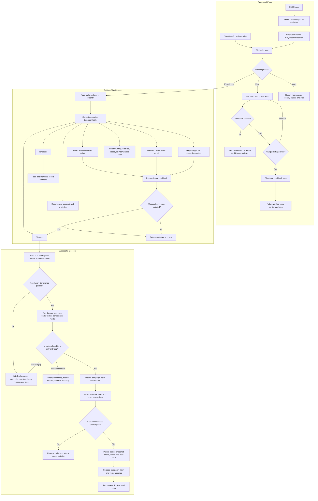

# Wayfinder Relationship And Runtime Design Synthesis

Status: exhaustive design reference, not an executable contract.

Runtime authority remains in:

- `skills/custom/wayfinder/SKILL.md`;
- `skills/custom/wayfinder/MAP-FORMAT.md`;
- the target repository's `docs/agents/issue-tracker.md`;
- the invoked resolver skills and their mutation boundaries;
- `docs/synthesis/skill-context-relationships.md`; and
- the target repository's domain and engineering contracts.

The proposed runtime extraction in this note does not become authoritative until the canonical Wayfinder skill, supporting files, tracker templates, tests, behavior evaluations, and installed mirrors are updated and validated together.

## How To Read This Document

This synthesis is intentionally exhaustive. Its job is to preserve the complete design, authority model, rationale, alternatives, edge cases, migration surface, and future runtime extraction. Concision belongs to the eventual runtime skill, not to this source of design understanding.

The document has four layers:

1. **Orientation** gives the destination, boundaries, operation vocabulary, and explanatory end-to-end flow.
2. **Normative Contracts** contains the single authoritative statement of each proposed runtime rule. The state-transition table is the sole state-machine authority.
3. **Explanatory Design** preserves rationale, relationships, alternatives, and edge cases without creating parallel normative rules.
4. **Extraction And Verification Appendices** maps the exhaustive design into concise runtime files, tracker contracts, tests, and evaluations.

When a diagram or explanatory paragraph appears to disagree with a Normative Contract, the Normative Contract wins and the explanatory surface must be corrected.

Use this index for direct navigation:

| Question | Owning section |
| --- | --- |
| Should a campaign exist? | [Qualification](#qualification) and [Admission](#admission) |
| What may the current map do next? | [Normative State Model](#normative-state-model) |
| How does a waiting or blocked map regain a frontier? | [Resume](#resume) |
| Which claim is required and when? | [Campaign Claim](#campaign-claim) |
| Which resolver owns a ticket? | [Ticket Contract And Resolver Taxonomy](#ticket-contract-and-resolver-taxonomy) |
| May uncertainty remain as fog? | [Tethered Fog](#tethered-fog) |
| Is the campaign still bounded? | [Campaign Budgets And Progress](#campaign-budgets-and-progress) |
| What must the map persist? | [Map Artifact Contract](#map-artifact-contract) |
| How does successful closure work? | [Closeout](#closeout) and [Revision-Backed Closure Evidence](#revision-backed-closure-evidence) |
| How does unsuccessful closure work? | [Terminate](#terminate) |
| May a closed map reopen or spawn a successor? | [Reopen And To Spec Re-entry](#reopen-and-to-spec-re-entry) and [Successor Import Contract](#successor-import-contract) |
| What does every invocation return? | [Return Contract](#return-contract) |
| Which skill owns each composition edge? | [Relationship Ownership](#relationship-ownership) |
| What belongs in the eventual runtime files? | [Runtime Ownership Map](#runtime-ownership-map) |
| How will the extracted runtime be verified? | [Migration And Acceptance Matrix](#migration-and-acceptance-matrix) |

# Layer One: Orientation

## North Star

Wayfinder owns one outcome: a finite tracker-backed route from a bounded foggy destination to coherent settled source for `$to-spec`.

Wayfinder owns the map, decision and prerequisite graph, tethered fog, evidence reconciliation, campaign-claim purpose, campaign budgets, and closure classification. Its tickets resolve decisions and prerequisites; they do not deliver the destination or create the implementation graph.

Wayfinder is warranted only when all conditions hold:

1. one destination remains foggy but can be bounded;
2. at least two interdependent material decisions remain unresolved;
3. at least one decision depends on non-conversational work such as source evidence, runnable proof, diagnosis, repository evidence, external response, executable prerequisite, or durable artifact; and
4. the route needs finite tracker-backed sequencing across sessions.

Question count, project size, severity, generic uncertainty, or multi-session work alone never justifies Wayfinder. One bounded resolver stays with its current owner. Conversation-and-domain-only work belongs to `$grill-with-docs`. Settled domain truth needing only persistence belongs to `$domain-modeling`.

## Delivery Boundary

The successful delivery chain is linear:

```text
Wayfinder -> To Spec -> To Tickets -> Implement or Parallel Implement
```

- Wayfinder settles mutually compatible decisions, prerequisites, evidence, exclusions, domain consequences, design constraints, proof expectations, and route-closing source.
- To Spec synthesizes that distributed source into one grounded parent spec that passes the fresh-session test. It never silently invents a missing material decision.
- To Tickets owns actor and workflow decomposition, tracer-bullet slices, dependency order, acceptance, proof lanes, expected write scopes, parallel-safety analysis, and implementation readiness.
- Implement or Parallel Implement owns delivery. Wayfinder never chooses between them.

Waiting and blocked maps remain open. Delivered maps use successful Closeout and recommend To Spec. Cancelled, superseded, and out-of-scope maps use Terminate and stop without a delivery handoff.

## Leading-Word Operation Model

The eventual runtime skill should expose this compact operation vocabulary:

```text
Chart
Orient
Advance | Maintain | Resume | Closeout | Terminate | Reopen
Reconcile
Return
```

- **Chart** qualifies, admits, approves, creates, and reads back one new map, then stops.
- **Orient** reads persisted lifecycle and disposition, derives integrity, and consults the normative state-transition table.
- **Advance** resolves exactly one frontier ticket.
- **Maintain** applies one deterministic consequence-only representation repair.
- **Resume** reconciles one satisfied waiting trigger or cleared blocker into a visible state.
- **Closeout** runs Gather, Coherence, Durability, and Seal.
- **Terminate** records and closes one destination-owner-confirmed unsuccessful disposition.
- **Reopen** performs one bounded correction of a delivered map from a direct in-scope To Spec gap.
- **Reconcile** accounts for direct consequences without resolving another ticket implicitly.
- **Return** exposes the durable state, evidence, budget, and next permitted operation, then stops.

Closeout is a first-class operation. Advance or Maintain may hand directly into Closeout after their own completion and fresh orientation, but Closeout retains a separate contract and completion criterion.

Advance is serial per map. Exactly one operation-qualified campaign claim may be active for a map, so every substantive outcome reconciles before another resolver starts. External waits release the claim and leave other ready tickets eligible for a later Advance.

## Navigation Vocabulary

- **Destination:** the settled-source readiness state that closes wayfinding and fixes the campaign scope.
- **Map:** the durable orientation index. It owns the charter, state, budgets, fog, decision pointers, exclusions, and closure records; tickets own detailed questions, resolutions, and assets.
- **Ticket:** one sharp question or prerequisite with one resolution authority and one expected return.
- **Frontier:** open, unblocked, unclaimed tickets whose dependencies are satisfied, in map order.
- **Fog:** one tethered in-scope uncertainty whose sharp question is not yet known.
- **Campaign claim:** the map-scoped concurrency guard for one mutating operation. It records actor, token, timestamp, operation, and the selected ticket for Advance.
- **Closure snapshot packet:** the closure-relevant map, ticket, evidence, budget, authority, domain, and provider-revision state gathered before Seal and refreshed under the campaign claim.
- **Successor:** a newly qualified campaign that explicitly imports selected predecessor source without inheriting predecessor state.
- **Name:** use linked human-readable map and ticket titles in reports; reserve provider ids for tracker operations, claims, and dependency wiring.

**Fog or ticket?** Create a ticket when the question is sharp, even when blocked. Retain fog only while the question itself remains unclear and its tether proves how it may sharpen.

## End-To-End Explanatory Flow



The diagram is explanatory. It omits provider transport, failure recovery, budgets, and several state branches that are authoritative in the contracts below.

# Layer Two: Normative Contracts

## Authority Gates

An authority gate never performs the work needed to make its own predicate true. Operation-local predicates live only in their owning operation and the normative transition table.

| Gate | Owner | Passing evidence | Other branch | Mutation authority |
| --- | --- | --- | --- | --- |
| Chart packet approved | Destination owner | Destination, scope, closing condition, graph, fog, design framing, budgets, decision authority, and persistence mode are accepted | Resume Qualification or revise the packet | Approval only; Chart owns later mutation |
| Resolver participation and acceptance locked | Destination owner or named ticket authority | The ticket records AFK, HITL, or external participation; objective criteria or the named human acceptance owner; and the mutation boundary | Revise the packet or remain blocked | The resolver receives only the locked ticket authority |
| Durable domain truth accepted | Domain Modeling for domain truth; destination owner for reserved language or boundary judgments | The complete domain delta is compatible and every authorized write reads back | Return the exact authority blocker or typed material gap | Domain Modeling alone owns domain files |
| ADR creation approved | User or recorded ADR authority | Explicit approval names the proposed ADR decision | Preserve the candidate without writing | Domain Modeling owns the approved ADR write |
| Unsuccessful termination confirmed | Destination owner | Wayfinder's cancelled, superseded, or out-of-scope classification is explicitly confirmed | Keep the map open | Confirmation only; Terminate owns later mutation |
| Correction packet approved | Destination owner | One concrete To Spec return supports a finite cohesive in-scope graph, remaining correction budget, acceptance authority, and proof | Leave the delivered map immutable | Approval only; Reopen owns later mutation |

## Destination And Campaign Charter

The destination is a readiness state, not merely an isolated answer:

```text
Destination: coherent settled source sufficient for $to-spec to publish one source-traced parent spec.
```

Every map locks this charter before Chart:

```text
Destination:
Destination owner:
Observable authority evidence:
Decisions reserved for the destination owner:
Bounded delegate, only when one exists:
Scope boundary:
Route-closing condition:
Initial decisions and prerequisites:
Allowed resolver types:
Explicit exclusions:
Expansion rule: direct in-scope consequence only
Destination-change authority: approved successor campaign
Design-coherence reference:
Domain persistence: authorized now | deferred to Closeout
ADR creation: explicit approval required
Outcome budget and calculation:
Expansion budget and calculation:
Initial dependency-ready frontier | named waiting trigger:
```

The destination and scope are the hard campaign boundary. A material destination or scope change never expands the current map. Keep the map open as blocked until the destination owner approves a successor, then Terminate it as superseded with a pointer to that successor.

The invoking user is the destination owner only when they affirm that authority. A role or team is acceptable only when the tracker exposes an observable approval identity. The decision authority packet records the accountable owner, observable evidence, reserved decisions, and an optional bounded delegate only when delegation exists. Provider history preserves authority changes; the map does not duplicate an authority-history ledger or generic approval catalog. Tracker assignment is claim transport and never implies destination authority. When the required owner or delegate is unavailable, record waiting or blocked; Wayfinder never substitutes itself. A requested authority transfer is not Maintain and remains blocked on explicit outgoing, incoming, or tracker-governed higher authority; this design adds no separate Transfer operation without observed need.

Wayfinder may settle engineering constraints required for route coherence:

- responsibility and ownership boundaries;
- caller-facing interfaces and data contracts;
- state, lifecycle, compatibility, migration, rollback, security, environment, and operational requirements;
- required proof seams and observable outcomes; and
- a technical choice proved materially necessary by a typed Design decision.

Wayfinder does not own implementation-ticket boundaries, expected write scopes, worker assignment, parallelism, commit or landing order, implementation skill selection, or technique deliberately left open by the settled design.

## Qualification

Run Qualification only when a tracker read proves zero matching maps. Multiple plausible matches return an incompatible identity packet listing each candidate's name, lifecycle, disposition, destination owner, predecessor, and unresolved obligations. The destination owner must classify them as canonical, duplicate, successor, or distinct destination before Wayfinder may mutate or Chart another map. Wayfinder never auto-selects, merges, or creates through ambiguous identity.

After a zero-match result, invoke `$grill-with-docs` under a qualification bound that gathers only enough information to make Admission and the proposed Chart decidable:

- destination, decision authority packet, scope boundary, exclusions, and route-closing condition;
- known decisions, prerequisites, and sequencing constraints;
- blocking relationships and proposed initial frontier;
- proposed tethered fog and its sharpening paths;
- design-relevant ownership, interface, dependency, migration, compatibility, and proof concerns;
- proposed campaign budgets and their graph-derived calculations;
- domain-persistence mode and ADR authority; and
- exact evidence still missing for Admission.

Qualification uses the Codebase Design-owned design-coherence reference as framing. It does not invoke `$codebase-design`, choose an architecture, or resolve the destination's substantive decisions. Known design questions become proposed Design tickets; unclear design concerns remain tethered fog.

Lock one domain-persistence mode:

- **Authorized now:** the caller contract or explicit approval permits Domain Modeling to persist confirmed terms and boundaries during Qualification and later tickets.
- **Deferred to Closeout:** Domain Modeling challenges and reconciles language but returns a pending domain delta without writing domain files.

ADR creation remains separately approval-gated in both modes. Every early domain write appears in the qualification packet and later map Source Trace. A domain contradiction that prevents coherent Chart remains an exact admission gap rather than being persisted implicitly.

Qualification returns:

```text
Destination:
Decision authority packet:
Scope boundary and exclusions:
Route-closing condition:
Known decisions and prerequisites:
Sequencing constraints and blocking relationships:
Proposed tickets:
Proposed tethered fog:
Proposed initial frontier | waiting trigger:
Design framing and proposed Design tickets:
Domain persistence mode:
Pending or persisted domain delta:
ADR authority:
Outcome budget and calculation:
Expansion budget and calculation:
Admission evidence and exact gaps:
```

Qualification completes when Admission is decidable or one exact evidence gap prevents that decision.

## Admission

Admit Wayfinder only when the qualification packet proves all of these predicates:

1. one bounded destination, route-closing condition, and affirmed destination authority exist;
2. at least two interdependent material decisions remain unresolved;
3. at least one decision depends on non-conversational work;
4. durable tracker-backed sequencing is necessary;
5. every proposed obligation is inside the destination and scope;
6. every fog item has a finite in-scope sharpening path;
7. the proposed graph has a dependency-ready frontier or one named external waiting trigger;
8. design-relevant concerns are represented as accepted constraints, proposed Design tickets, or tethered fog rather than silent architectural assumptions;
9. finite outcome and expansion budgets, their calculations, and any named contingency are approved; and
10. tracker operations required by the proposed map are available, including one-active-campaign-claim enforcement, provider revision evidence, and mutation read-back.

Admission performs no tracker mutation. A destination requiring only conversation or domain persistence fails Admission. A missing or outdated tracker setup operation returns `$repo-bootstrap` as the exact precondition rather than creating a partially executable map.

On failure, return this packet to Skill Router and stop:

```text
Attempted route: $wayfinder
Admission: rejected
Reason:
Settled state:
Residual work:
Available evidence:
Excluded route: $wayfinder unless material new evidence appears
Return boundary: $skill-router
Downstream execution: none
```

Skill Router later selects one narrower owner or `none`. An unchanged rejection packet cannot route immediately back to Wayfinder.

## Chart

After Admission passes, present one exact mutation packet for destination-owner approval:

- destination, decision authority packet, scope, closing condition, exclusions, and calculated campaign budgets;
- map title and initial lifecycle `open` plus disposition `active` or `waiting`;
- every child title, sharp question or prerequisite, resolver type, participation mode, resolution authority, mutation boundary, expected return, proof, and dependency;
- approved Research note paths;
- Prototype claim level and locked judge or objective criteria;
- tethered fog with destination impact, sharpening source, trigger, dependencies, and fallback disposition;
- design framing and every proposed Design ticket;
- domain-persistence mode, domain delta, and ADR boundary; and
- initial frontier or named waiting trigger.

Any changed packet requires fresh approval. Chart then creates the map, every sharp child ticket, fog, exclusions, and known edges; reads back the complete representation and initial derived state; returns the verified frontier or wait; and stops. Chart resolves no child, selects no route, and retains no claim.

## Normative State Model

Persist two orthogonal fields:

| Field | Values | Meaning |
| --- | --- | --- |
| Lifecycle | `open`, `closed` | Whether ordinary campaign mutation remains permitted |
| Disposition | `active`, `waiting`, `blocked`, `delivered`, `superseded`, `cancelled`, `out-of-scope` | Why the map may advance, wait, require intervention, or remain closed |

Only these lifecycle and disposition pairs are legal:

| Lifecycle | Legal dispositions |
| --- | --- |
| `open` | `active`, `waiting`, `blocked` |
| `closed` | `delivered`, `superseded`, `cancelled`, `out-of-scope` |

Any other pair is `incompatible` unless current accepted evidence dictates one unique consequence-only metadata repair, in which case it is `repairable-drift`.

Derive integrity during every Orient; never persist it:

| Integrity result | Predicate | Consequence |
| --- | --- | --- |
| `verified` | Representation, legal state pairing, claims, counters, edges, and tracker state satisfy current contracts | Use the matching transition row |
| `repairable-drift` | Every required correction is consequence-only and supported by accepted resolutions or current contracts | Maintain may propose one exact repair packet |
| `incompatible` | Repair needs a new decision, changes approved meaning or scope, or requires an unavailable tracker operation | Stop with the exact conflict and owner |

An incompatible setup operation recommends Repo Bootstrap. Unresolved product or design meaning becomes or exposes the correctly typed ticket when mutation authority exists. Destination or scope conflict requires destination-owner judgment or a successor. Integrity never grants mutation authority by itself.

The following table is the sole state-machine authority:

| Current evidence | Integrity | Additional predicate | Permitted operation or return | Claim purpose |
| --- | --- | --- | --- | --- |
| Zero matching maps | Not applicable | Qualification and Admission pass; packet approved | Chart | None after Chart read-back |
| Multiple plausible maps | Not applicable | Identity remains ambiguous | Return incompatible identity packet for destination-owner resolution | None |
| `open` + `active` | `verified` | Dependency-ready frontier exists and budgets remain | Advance | Campaign claim: Advance + selected ticket |
| `open` + `active` | `verified` | No unresolved obligation, external wait, contradiction, or blocker remains | Closeout | None during read-only work; campaign claim for one gap mutation or Seal |
| `open` + `active`, `waiting`, or `blocked` | `repairable-drift` | Every proposed change is consequence-only | Maintain | Campaign claim: Maintain |
| `open` + `waiting` | `verified` | One recorded observable trigger is satisfied | Resume: Wake | Campaign claim: Resume |
| `open` + `waiting` | `verified` | Named external owner and observable trigger remain pending | Return waiting state | None |
| `open` + `blocked` | `verified` | One recorded intervention is satisfied inside the current destination, scope, and budgets | Resume: Recover | Campaign claim: Resume |
| `open` + `blocked` | `verified` | Recorded intervention remains unsatisfied or campaign budget exhaustion requires a successor | Return exact intervention | None |
| `open` + `active`, `waiting`, or `blocked` | `incompatible` | Exact owner or setup precondition identified | Return incompatibility packet | None |
| `open` + `active`, `waiting`, or `blocked` | `verified` | Wayfinder classifies terminal evidence and destination owner confirms | Terminate | Campaign claim: Terminate |
| `closed` + `delivered` | `verified` | No qualifying To Spec gap | Return immutable closure packet | None |
| `closed` + `delivered` | `verified` | One concrete To Spec return supports an approved finite cohesive correction packet inside the remaining correction budget | Reopen | Campaign claim: Reopen |
| `closed` + `superseded` | Any | Successor pointer resolves | Return immutable record and successor | None |
| `closed` + `cancelled` or `out-of-scope` | Any | None | Return immutable terminal record | None |
| Any `closed` disposition | `repairable-drift` or `incompatible` | Current provider representation differs from the historical contract | Return immutable record plus owning migration or Repo Bootstrap precondition | None through Wayfinder |

Closed semantic history is immutable except for bounded delivered-map Reopen. A pack or tracker migration may add consequence-only representation metadata to a closed record only through the owning migration contract; it never changes the historical decisions, disposition, or closure evidence through Wayfinder Maintain.

## Waiting And Blocked

`waiting` means progress depends on one named external response or event with an identified owner, needed-back ledger, and observable resumption trigger.

`blocked` means no authorized executable frontier exists until an exact intervention supplies missing evidence, authority, access, prerequisite, budget, compatible setup, or destination judgment. Budget exhaustion with unresolved obligations is blocked on a destination-owner successor decision; it is never an `active` state with an unusable frontier.

Wayfinder derives both from the reconciled graph. Reconcile records the resulting disposition under the current operation's claim before release. New external evidence uses Resume rather than pretending the prior representation drifted. If Orient instead finds a stale disposition whose correction is uniquely dictated by evidence already accepted before the state was recorded, derive `repairable-drift` and use Maintain. Neither waiting nor blocked closes the map or requires ceremonial approval. When evidence supports neither an expected external trigger nor executable work, use blocked rather than inventing a wait.

## Campaign Claim

The tracker contract exclusively owns claim transport, token generation, leases, timestamps, staleness, takeover authority, and recovery. Wayfinder owns the operation purpose and acquire, read-back, transition, and release boundaries.

One map permits one active campaign claim. The claim records actor, token, timestamp, operation, and the selected ticket when the operation is Advance. The ticket may show `In Progress` and point to the campaign claim, but it never carries independent concurrency authority.

| Operation purpose | Lifetime |
| --- | --- |
| Advance | Acquire with the selected ticket; hold through one resolver, outcome reconciliation, and mutation read-back |
| Maintain | Acquire before the deterministic repair; hold through repair read-back |
| Resume | Acquire after one trigger or intervention is observably satisfied; hold through one Wake or Recover reconciliation and read-back |
| Closeout gap mutation | Acquire only after a read-only phase detects one typed gap or blocker; refresh the relevant snapshot fields, materialize that one consequence, and read back |
| Closeout Seal | Acquire only after Gather, Coherence, and Durability pass; refetch the closure snapshot and hold through delivered close read-back |
| Terminate | Acquire after terminal confirmation; hold through terminal close read-back |
| Reopen | Acquire before changing a delivered map back to open; hold through correction-ticket creation and map read-back |

Every acquisition verifies that the map has no active campaign claim. Every mutation reads back before release; every release reads absent before Return or a fresh operation. External waits retain no claim. A failed acquisition, transition, read-back, or release stops with the tracker-owned recovery action. Wayfinder never removes a foreign claim without tracker-owned authority.

A final Advance may enter Closeout in the same invocation only after the ticket outcome and direct consequences read back, the campaign claim releases and reads absent, and fresh Orient proves the Closeout row applies. Closeout remains a separate operation even when the invocation continues.

## Ticket Contract And Resolver Taxonomy

Every ticket owns exactly one sharp question or prerequisite, one resolver type, one resolution authority, and one expected return:

```text
Resolver type:
Participation: AFK | HITL | external
Question or prerequisite:
Destination impact:
Resolution authority:
Dependencies:
Expected return:
Proof or confirmation:
Mutation boundary:
Budget source:
```

| Resolver type | Use when | Resolution authority | Required return |
| --- | --- | --- | --- |
| Research | One authoritative source fact is missing | Primary-source evidence | Answer, citations, limits, and approved note pointer |
| Prototype | One runnable design or behavior verdict is needed | Locked objective criteria or named human judge | Verdict, evidence, limits, and cleanup or preservation state |
| Diagnosis | Expected behavior, symptom, cause, or trusted reproduction is uncertain | Causal evidence | Reproduction, cause status, evidence, regression seam, and blocker |
| Questionnaire | One identifiable external stakeholder owns unavailable information | Named recipient | Questionnaire, needed-back ledger, external owner, trigger, and later verified answers |
| Grilling | The user owns one preference, term, boundary, commitment, public contract, or tradeoff | User, with Domain Modeling active under the locked persistence mode | Confirmed decision, deferrals, domain delta, ADR outcome, and evidence gap |
| Design | One evidenced module, interface, seam, adapter, ownership, migration, compatibility, or caller-facing proof question remains | The ticket's locked objective criteria or named human acceptance owner | Accepted shape, alternatives, interface contract, migration, proof seam, risks, and residual gap |
| Task | One bounded read-only repository or operational evidence question has no specialized resolver | Accepted repository contracts and observable proof | Supported answer, affected boundary, proof, disposable evidence, and blocker |

Classify by resolution authority, not grammar. Reconciliation is a purpose, not a resolver type. A product tradeoff uses Grilling; an interface conflict uses Design; factual conflict uses Research or Prototype; uncertain existing behavior uses Diagnosis; unavailable stakeholder knowledge uses Questionnaire; and an objective repository-contract mismatch uses Task.

`awaiting-external-response` is a Questionnaire ticket state, not a resolver type or permission to retain a claim. A later Advance traces supplied answers, verifies the needed-back ledger, and resolves, splits, or reblocks the ticket.

Participation defaults are explicit:

- Research is AFK.
- Prototype follows its locked claim-level rule below.
- Diagnosis is AFK unless reproducing the symptom requires live human action; either mode remains diagnosis-only.
- Questionnaire is external.
- Grilling is HITL.
- Design is AFK when Chart locks objective constraints and acceptance criteria and no user-owned commitment remains. It is HITL when the choice changes a public contract, irreversible migration, product tradeoff, or a named owner reserves judgment.
- Task is AFK when objective repository proof closes it and HITL only when gathering that evidence requires live human action. Either mode remains evidence-only.

Prototype participation follows the locked judgment:

- `shape/feel` is HITL with a named human judge;
- `design evidence` is AFK when objective verdict criteria are caller-locked; and
- `design evidence` is HITL only when the caller explicitly reserves judgment for a human.

Resolver-specific boundaries remain:

- Research uses one caller-approved repo-local note path and returns citations, limits, conflicts, and that durable pointer.
- Prototype returns one verdict and its cleanup or preservation state; prototype code never becomes destination delivery implicitly.
- Diagnosis remains diagnosis-only inside Wayfinder; it returns causal status and a trusted proof seam without fixing the behavior.
- Questionnaire creates the collection artifact but does not resolve the ticket; verified supplied answers do.
- Grilling may ask several conversational questions only to settle the one ticket-owned decision and returns a complete domain delta under the locked persistence mode.
- Design invokes Codebase Design only for the one ticket-owned design question and returns its bounded packet without choosing another ticket. Wayfinder records a resolution only under the ticket's locked objective criteria or named human acceptance.
- Task may inspect the repository, run bounded commands, and create disposable evidence inside existing authority. It never changes production code, durable configuration, tracker setup, or external systems. A prerequisite requiring durable mutation becomes Blocked with its owning skill or authority. Task is not a catch-all for source research, runnable design evidence, causal diagnosis, design, or stakeholder authority.

## Map Artifact Contract

The map remains an index rather than a transcript. Its normative information groups are:

```text
Identity, predecessor, lifecycle, disposition, and operation-qualified campaign claim
Decision authority packet: accountable owner, observable evidence, reserved decisions, and optional bounded delegate
Destination, scope boundary, route-closing condition, campaign-budget calculations, and counters
Source Trace, domain-persistence mode, ADR boundary, and design-coherence reference
Ordered child-ticket index and blocking relationships
Decisions So Far with one-line gists and owning ticket pointers
Not Yet Specified as the sole tethered-fog container
Out Of Scope with governing resolution, ticket, or successor pointers
Waiting owner and trigger | blocked intervention | Resume history | active frontier
Closeout attempts, closure snapshot packets, provider revisions, closure generation, durability result, and sealed or terminal record
Approved To Spec correction packets, source returns, cohesive ticket graphs, cumulative correction budget, acceptance authorities, proofs, and Reopen generations
```

Resolution detail stays in the owning ticket or durable resolver artifact. `Not Yet Specified` is the only fog container. Do not create a ticket solely to provide an Out Of Scope link when an existing resolution or map pointer governs the exclusion.

## Tethered Fog

Fog is in-scope uncertainty whose sharp question is not yet known. It is never a free-floating backlog.

Every fog item records:

```text
Unresolved uncertainty:
Destination impact:
In-scope reason:
Expected sharpening source:
Unlock condition or observable trigger:
Affecting tickets or external events:
Fallback disposition if the trigger never arrives:
```

Chart may retain fog only when an already mapped ticket or named external trigger can plausibly sharpen it. Orphan fog with no finite sharpening path is an Admission evidence gap. A map with no frontier may remain valid only when it has one named waiting trigger.

After an outcome or trigger, Reconcile gives every affected fog item exactly one disposition:

- **Retain:** the tether remains valid and the remaining uncertainty is stated.
- **Graduate:** create and wire one or more finite sharp tickets, then remove the fog item.
- **Resolve:** remove it after a linked resolution represents its answer.
- **Exclude:** remove it and add the governing scope pointer to Out Of Scope.

Graduation may create only a direct in-scope consequence under the approved expansion rule and remaining budget. If evidence changes destination or scope, exclude it, return blocked for destination-owner judgment, or require a successor; never use fog as expansion authority.

## Campaign Budgets And Progress

Chart proposes and locks two finite original-campaign counters:

- **Outcome budget:** maximum substantive ticket outcomes in this map.
- **Expansion budget:** maximum newly created tickets or fog items beyond the approved Chart packet.

The proposal is graph-derived rather than an unexplained number. Outcome budget includes at least one outcome for every initial ticket and one explicitly named contingency when uncertainty warrants it. Resume never consumes outcome budget. Expansion budget is the maximum accepted net-new direct-consequence obligations. The approval packet shows both calculations. No silent reserve exists.

Every original-campaign completed Advance consumes one outcome, including Resolved, Blocked, or Out of Scope. A correction-generation Advance consumes one unit of correction budget instead. `Blocked` is substantive only when it records one durable exact intervention or external prerequisite. A transient tool, access, or resolver failure is an incomplete attempt: record recovery evidence, release and read back the claim, leave counters and ticket outcome unchanged, and Return. A repeated or confirmed non-transient failure must become Blocked rather than cycle as incomplete.

During the original campaign, every net-new obligation consumes expansion and must fit within remaining outcome capacity. A bounded replacement removes or invalidates its named source obligation and consumes expansion only for net growth; reopening an existing obligation consumes none. Correction generations use the approved correction packet and budget below instead of expansion. Consequence-only Maintain, Resume, read-only Closeout work, tracker recovery, incomplete attempts, and Return consume no budget.

Each Advance must resolve, narrow, replace, exclude, or exactly block an existing obligation. A new ticket or fog item names its source outcome, destination impact, in-scope reason, budget effect, and blocking relationship. It may not restart the same question under another label.

When an operation exhausts a required budget while obligations remain, Reconcile records `open` + `blocked` under the current claim with used and remaining budget, resolved and unresolved obligations, why Chart underestimated the route, and the exact destination-owner successor decision. The existing map's budget is never silently extended. Continued wayfinding requires confirmed supersession and a newly qualified successor campaign.

A delivered map has at most one finite correction budget established by its first approved Reopen packet and shared cumulatively across every later Reopen generation of that originally delivered map. Each correction-ticket outcome consumes one unit. Every net-new correction ticket requires destination-owner approval in a packet traced to a concrete direct in-scope To Spec return and must fit within the remaining budget; no implicit graph expansion exists. Resealing never resets, replenishes, or replaces the budget. Exhaustion without restored coherence, independent gaps, materially wider work, or a destination change requires a successor.

## Advance

Advance resolves exactly one selected frontier ticket:

1. Orient and select the named frontier ticket or the first frontier ticket in map order.
2. Verify the applicable remaining outcome budget or correction budget.
3. Verify that no campaign claim is active, then acquire and read back an Advance claim naming the selected ticket before resolver work.
4. Invoke the ticket's resolver under its participation and authority contract.
5. On a transient incomplete attempt, record recovery evidence, release and verify the claim, Return without changing the outcome or budget, and require a repeated or confirmed persistent failure to become Blocked.
6. Otherwise record exactly one substantive outcome: Resolved, Blocked, or Out of Scope.
7. Reconcile direct tickets, dependencies, fog, domain candidates, design consequences, budget counters, and any resulting waiting or blocked disposition without answering another ticket.
8. Read back the ticket, outcome, direct map consequences, edges, claims, counters, lifecycle, disposition, and resulting frontier.
9. Release the campaign claim and verify absence.
10. Orient again; Return or enter Closeout when its row applies.

Advance serializes substantive map progress while touching only the selected ticket, directly affected edges, counters, and map sections changed by its outcome. It never starts another resolver before this claim releases and its consequences reconcile.

Advance completes when exactly one ticket has a substantive outcome; every other mutation is consequence-only; every affected fog item has one disposition; claim release reads back; counters reconcile; and the next state or Closeout entry is visible. An incomplete attempt is a terminal invocation result, not a completed Advance.

## Maintain

Maintain applies only to `repairable-drift`:

1. Orient from current map, tracker, map format, and evidence.
2. Build one exact consequence-only repair packet with an evidence pointer for every change. The approved open-map charter pre-authorizes it only when accepted evidence and current contracts permit exactly one result.
3. Acquire and read back a Maintain campaign claim.
4. Apply only contract-determined canonical section, stale fog, broken pointer, scope index, dependency, claim metadata, or equivalent representation repairs.
5. Record no substantive child outcome and make no material decision.
6. Read back the repaired representation and derived state.
7. Release the campaign claim and verify absence.
8. Orient again; Return or enter Closeout when its row applies.

If repair permits discretion, requires a decision, changes approved meaning, crosses scope, or needs an unavailable tracker operation, integrity is incompatible and Maintain is not authorized. Closed records remain outside Wayfinder Maintain.

Maintain completes when every deterministic repair reads back, zero ticket outcomes changed, the campaign claim is absent, and the resulting state is visible.

## Resume

Resume reconciles exactly one newly satisfied liveness condition without resolving a ticket:

1. Orient and select one recorded waiting trigger or blocker intervention whose evidence is now observable.
2. Reject Resume when the evidence changes destination or scope, attempts to extend exhausted campaign budgets, or remains incomplete.
3. Acquire and read back a Resume campaign claim.
4. **Wake:** verify a waiting trigger and needed-back evidence, then make its existing waiting ticket dependency-ready or give every directly affected fog item one normal disposition.
5. **Recover:** verify the exact recorded blocker intervention, then restore only the tickets, edges, fog, or frontier that intervention unlocks.
6. Charge expansion only for net-new obligations. When required net growth exceeds the remaining budget, preserve or record the budget-exhaustion blocker.
7. Persist and read back `active`, `waiting`, or `blocked`, the affected evidence and graph, counters, and resulting frontier.
8. Release the campaign claim, verify absence, and stop with the frontier or exact remaining wait or blocker.

Resume consumes no outcome budget and performs no resolver work. One invocation handles one trigger or intervention; other satisfied conditions remain visible for later Resume operations. Wake and Recover are branches inside Resume, not additional first-class operations.

Resume completes when the selected evidence and every direct consequence read back, net growth reconciles, no ticket outcome changed, the campaign claim is absent, and the resulting state is visible.

## Revision-Backed Closure Evidence

Closure uses one tracker-native snapshot packet rather than a parallel machine ledger. Wayfinder owns the packet's declared field inventory, completeness, materiality, comparison, and closure judgment. Tracker contracts own provider transport, observable revision evidence, persistence, and read-back.

Gather records the exact closure-relevant fields and their current values or evidence pointers. Provider revision evidence uses an observable native version, timestamp, content hash, tracked-file hash, or equivalent provider-specific token. The evidence detects intervening activity; it does not replace field-level semantic comparison.

Seal refetches the same declared fields under the campaign claim. The expected Seal-claim transport fields are not closure semantics. A changed closure field releases the claim and returns for reorientation. A revision change confined to the expected claim transition, unrelated transport, or formatting metadata updates the recorded revision evidence without inventing a semantic change. An unchanged closure packet becomes the sealed closure record on the map; Wayfinder does not persist a duplicate full tracker snapshot, JSON manifest, helper version, schema version, or digest.

Every sealed closure generation remains immutable. Reopen preserves prior sealed packets and adds the next generation. Repo Bootstrap may migrate surrounding tracker representation but never historical closure semantics. Wayfinder needs no JSONL event ledger or closure helper because provider history, immutable ticket outcomes, map state, sealed packets, and correction generations already preserve the required audit trail.

## Closeout

Closeout is a first-class operation with four phases: **Gather -> Coherence -> Durability -> Seal**.

Closeout entry requires a current tracker read proving no unresolved child, tethered fog, external wait, material contradiction, exact in-scope blocker, or exhausted-budget decision remains. Gather, Coherence, and Durability run without a campaign claim. Closeout acquires a short campaign claim only to materialize one detected gap or blocker, or to run Seal.

### Gather

Gather builds one closure snapshot packet from fresh provider reads:

```text
Map identity and provider revision evidence:
Closure generation:
Lifecycle and disposition:
Decision authority packet:
Destination, scope, closing condition, budget calculations, and counters:
Map sections, fog, exclusions, and absence of a conflicting campaign claim:
Every in-scope ticket identity, resolver type, state, claim, dependencies, and revision evidence:
Decisions and dispositions:
Rejected or deferred options:
Research notes and citations:
Prototype verdicts:
Diagnostic conclusions:
External stakeholder answers:
Grilling decisions and domain deltas:
Design packets and accepted design constraints:
Settled actor and workflow constraints:
Settled edge-case and failure constraints:
Settled engineering constraints:
Proof expectations and observable outcomes:
Residual nonmaterial uncertainty:
Provider revision evidence for every closure source:
```

Provider templates own revision evidence through timestamps, native versions, content hashes, tracked-file hashes, or an equivalent observable mechanism. The declared field inventory excludes formatting, transport metadata, and unrelated tracker activity while including every closure-relevant semantic field.

Gather is read-only. It completes when every mapped obligation has one disposition and evidence pointer, every declared field and provider revision reads successfully, and the packet is sufficient for Coherence.

### Resolution Coherence

Wayfinder owns one read-only coherence gate. It reads the Codebase Design-owned design-coherence reference but does not invoke `$codebase-design`.

Test five lenses:

- **Destination:** every accepted resolution supports the destination, scope, closing condition, and settled-engineering boundary.
- **Decision:** dependent decisions agree across public and data contracts, state and lifecycle behavior, permissions, environments, migration, cutover, rollback, security, and compatibility.
- **Domain:** accepted language, context ownership, and boundaries agree with canonical truth or one explicit pending delta; every collision is accounted for under the locked persistence mode.
- **Design:** responsibility ownership, caller-facing interfaces, dependency direction, seam value, migration, compatibility, and caller-facing proof satisfy the shared design-coherence reference.
- **Evidence:** every material conclusion has the source, runnable evidence, causal proof, human authority, external response, or repository proof required by its ticket.

Coherence validates; it never decides, redesigns, persists domain truth, or blesses the map ceremonially. On a gap, acquire and read back a short Closeout-gap campaign claim, refresh the relevant closure fields, create or reopen one correctly typed ticket, reconcile expansion only for net growth, read back the resulting frontier, release the claim, verify absence, and stop. Reopening an existing obligation consumes no expansion. If a net-new obligation is required and no expansion or outcome capacity remains, record the budget-exhaustion blocker and successor decision instead. A Design gap becomes a Design ticket; a later Advance invokes `$codebase-design` to resolve it.

Record lens results and typed gap pointers in the closure snapshot packet. Coherence passes only when every lens passes and no material incompatibility is deferred.

### Durability

After Coherence passes, invoke `$domain-modeling` under the locked persistence mode to reconcile canonical terms, context ownership, boundaries, durable invariants, and ADR-worthy decisions.

`authorized now` permits required domain writes and read-back. `deferred to Closeout` requires approval before persistence; while approval is pending, no campaign claim is held. ADR creation always requires explicit approval.

Durability returns:

```text
Domain delta: none | persisted | pending authority
Changed domain paths:
ADR candidates and outcomes:
Domain contradictions: none | <typed gap>
Read-back: verified | not applicable
```

A missing authority returns an open blocked state with the exact approval requirement. When that result changes persisted map disposition, use one short Closeout-gap campaign claim, refresh the relevant closure fields, record and read back the blocker, release the claim, and stop. A material contradiction or new decision uses the same short mutation boundary to create one typed ticket, charging expansion only for net growth, and returns to the frontier. If required net growth exceeds expansion or outcome capacity, record the budget-exhaustion blocker instead. Consequence-only persistence of a domain delta already represented in Gather remains the same closure-relevant semantic state and does not rerun Coherence; a changed or newly exposed material decision does.

### Seal

After Coherence and Durability pass:

1. Acquire and read back a Closeout-Seal campaign claim.
2. Refetch every declared closure field and provider revision from current tracker and domain state.
3. Compare each closure field with Gather, excluding the expected Seal-claim transport fields. Treat verified persistence of an already-accounted domain delta as equal while still recording changed paths and read-back evidence.
4. On a changed closure field, release the campaign claim, verify absence, and Return for reorientation. A revision change confined to the expected claim transition, unrelated transport, or formatting metadata updates the packet and may continue.
5. On equality, merge the verified durability result and fresh provider revisions into the sealed closure packet.
6. Persist that packet as the map's closure record, close the map as `delivered`, and read back the packet and exact closed state.
7. Release the campaign claim and verify its absence.
8. Recommend `$to-spec` and stop.

Seal proves source completeness: every mapped obligation, decision, prerequisite, exclusion, evidence pointer, budget, design constraint, domain outcome, and provider revision is accounted for. To Spec retains fresh-session synthesis, grounding, actor and workflow coverage, edge-case coverage, parent publication, and its own read-back.

Closeout completes only when Gather is complete, every Coherence lens passes, Durability returns no delta or verified persistence without contradiction, Seal confirms unchanged declared closure fields under fresh provider revisions, the sealed snapshot packet and delivered close read back, campaign-claim release reads absent, and To Spec is the sole successful route.

## Terminate

Waiting and blocked maps remain open. A whole map closes unsuccessfully only as:

| Disposition | Classification predicate | Confirmation authority |
| --- | --- | --- |
| `cancelled` | The destination remains valid and potentially achievable, but its owner chooses to stop and no replacement is implied | User or named destination owner |
| `superseded` | An approved successor destination or campaign takes ownership of the remaining purpose | User or named destination owner approving the replacement |
| `out-of-scope` | The approved caller or campaign boundary excludes the destination | User or named destination owner for the whole map |

Wayfinder classifies evidence; it never authorizes whole-map termination. Individual obligations may be excluded under the approved boundary without new approval, but whole-map out-of-scope closure requires confirmation.

After confirmation:

1. Acquire a Terminate campaign claim after any conflicting campaign claim is absent or tracker recovery completes.
2. Record disposition, confirming authority, reason, evidence, budgets, unresolved obligations, and recovery or successor boundary.
3. Close and read back the exact terminal record.
4. Release the campaign claim and verify that none remains.
5. Return the immutable terminal packet and stop without Coherence, Durability, Seal, or To Spec.

Failure to close or release stops with the tracker-reported recovery action.

## Reopen And To Spec Re-entry

Every delivered map recommends To Spec with this packet:

```text
Route: $to-spec
Settled source: <sealed closure packet>
Domain delta: reconciled
Material gaps: none
Map: <closed delivered map>
```

To Spec never mutates the map. If it returns one or more material source or design gaps, a later user-started Wayfinder invocation classifies that evidence:

- **Direct in-scope consequence:** present one correction packet containing the concrete To Spec evidence; the in-scope classification; one finite cohesive graph of coupled typed tickets; correction budget used and remaining; acceptance authority; and expected proof. The first approved packet establishes one nonrenewable cumulative correction budget; later packets may draw only from its remainder. Every net-new correction ticket requires explicit approval and no implicit graph expansion exists. After destination-owner approval, acquire a Reopen campaign claim, preserve prior sealed generations, attach the evidence and packet, change lifecycle to open and disposition to active, create or reopen the approved frontier, read back, release the claim, and stop. Qualification and full Chart approval do not repeat because the campaign bound is unchanged.
- **Destination or scope change:** leave the original map immutable and qualify a successor campaign.
- **Unclear:** stop for destination-owner judgment without mutation.

Every ticket in a correction packet traces to the same To Spec return, remains inside the original destination and scope, belongs to one connected dependency component, and is necessary to restore the same failed closure condition under one combined proof. Independent gaps, materially wider work, or a destination change require a successor. After the correction frontier resolves, Closeout restarts from Gather and seals a new immutable generation while retaining all earlier packets. Resealing never replenishes the correction budget. Cancelled, superseded, and out-of-scope maps never reopen. An exhausted correction budget requires a successor.

## Successor Import Contract

A successor is a new campaign with fresh Qualification, Admission, approval, budgets, lifecycle, disposition, graph, frontier, and claims. It records:

```text
Predecessor map and terminal disposition:
Reason destination or scope changed:
Decisions and evidence imported unchanged:
Decisions invalidated or reopened, with reasons:
Unresolved obligations deliberately transferred:
Exclusions retained or reconsidered:
Domain and design constraints still governing:
Fresh destination, scope, closing condition, graph, budgets, and approval:
```

Nothing imports implicitly. Claims, state, frontier order, budgets, and closure status never transfer. Qualification may reuse accepted evidence, but Admission evaluates the successor as a new bounded campaign. Once approved, the predecessor Terminate packet records the successor pointer.

## Return Contract

Every invocation returns:

```text
Map:
Operation:
Observed state and derived integrity:
Destination authority and identity status:
Operation result:
Linked evidence and direct map changes:
Claim acquisition, transition, and release result:
Outcome and expansion budget used and remaining:
Correction budget and closure generation, when applicable:
Next frontier | waiting trigger | blocker | terminal record | To Spec route:
Next permitted operation:
```

An incomplete attempt additionally returns its recovery evidence and leaves the ticket outcome and counters unchanged. When a frontier remains, name its first ticket and stop. A recommendation never starts another explicit-only skill automatically. Every resolver invoked by Wayfinder returns to the owning ticket and never selects the next graph action.

# Layer Three: Explanatory Design

## Why Design Context Appears Three Times

Design context should guide the map from the beginning without forcing premature architecture:

1. **Design-aware Admission** uses the shared reference to represent relevant constraints, typed questions, and fog.
2. **Design-resolving tickets** invoke Codebase Design only when one bounded question has enough evidence.
3. **Design-validating Closeout** checks cross-ticket compatibility against the same reference without redesigning the map.

Making the map design-free until Closeout would allow locally plausible decisions to accumulate incompatible ownership, interface, dependency, migration, or proof assumptions. Invoking the full Codebase Design procedure during Admission would anchor the campaign before its evidence and sharp questions exist. The three-layer relationship preserves guidance without premature resolution.

## Why Closeout Uses A Short Campaign Claim

Gather, Coherence, Domain Modeling, and ADR approval can take meaningful time. Holding a campaign claim throughout would serialize the campaign across read-only analysis and human waits, creating stale ownership pressure. Running those phases on an identified closure snapshot packet and acquiring exclusivity only for one resulting mutation or immediately before Seal keeps the claim short.

The tradeoff is optimistic concurrency: a relevant change may force Closeout to rebuild its packet. Fresh provider revisions and field-level comparison make that retry explicit. Exclusivity is reserved for the resulting mutation or irreversible close.

When Coherence or Durability detects a consequence that must be recorded before Return, Closeout uses a short operation-qualified campaign claim only for that mutation and read-back. It never holds the claim while performing analysis or waiting for human authority.

## Why State Is Factored

Lifecycle answers whether the campaign is open. Disposition explains why it can advance, wait, block, deliver, or terminate. Integrity answers whether the representation still satisfies current contracts. Persisting integrity would create a stale `verified` flag, so Orient derives it every time.

The state-transition table is normative because repeating state rules in the flowchart, decision table, prose, and audit checklist creates multiple plausible answers to “what may happen next?” Other surfaces explain or test the table rather than restating it as separate authority.

## Why Ambiguous Map Identity Stops

Selecting the newest or most active match would silently choose among competing authority, predecessor, and obligation histories. Zero, one, and many matches are therefore different entry states: only zero permits Qualification and only one permits Orient. Many requires destination-owner classification before any map mutation.

## Why Closeout Is A First-Class Operation

An existing map may have no unresolved work before the current invocation starts. Hiding closure inside Advance or Maintain makes direct resumption undefined and obscures its snapshot, domain, design, and claim boundaries. Closeout therefore has its own entry predicate and completion criterion even when the same invocation arrives from a completed Advance or Maintain.

## Why Advance Is Serial

Different frontier tickets may look independent, but every substantive result can change shared counters, fog, dependencies, state, and map summaries. Per-ticket claims would not safely merge those shared mutations. One active Advance per map keeps reconciliation deterministic while still allowing the campaign to move to another ticket after an external wait releases its claim. Parallel resolver dispatch would require a separate acceptance and serial-reconciliation contract and is deferred until observed throughput justifies that complexity.

## Why Maintain Is Pre-Authorized

An open map's approved charter already authorizes its contract-determined representation. Requiring another human approval to restore one evidence-determined pointer, counter, state, or canonical section adds ceremony without making a decision. Maintain therefore applies the only permissible consequence under a campaign claim and read-back. Any discretion changes integrity to incompatible and returns authority to the proper owner.

## Why Resume Is Separate From Maintain

Maintain restores representation from evidence the map already accepted. Resume consumes newly arrived trigger or intervention evidence and may make tickets ready or graduate fog, so treating it as drift would blur both budgets and authority. One Resume operation with Wake and Recover branches closes waiting and blocked liveness without multiplying first-class operations.

## Why Closure Evidence Is Revision-Backed And Durable

The former schema-and-helper design mechanized canonical equality but still left completeness and materiality to Wayfinder while adding temporary JSON, duplicate durable manifests, versioning, and historical-validator machinery. A declared closure-field inventory, provider revision evidence, field-level refresh under the campaign claim, and durable sealed packet preserve the actual safety boundary without claiming that a digest proves semantic completeness.

## Why Campaigns Have Budgets

Destination bounds and direct-consequence rules limit scope, but they do not make one campaign finite when resolved questions repeatedly expose replacements. Outcome and expansion counters turn intended convergence into observable bounded execution. A successor preserves destination pursuit without pretending the original Chart remained accurate.

Budgets limit a campaign, not the importance of the destination. Exhaustion is evidence that the route needs a newly approved map, not permission to truncate required decisions or declare false closure.

Chart proposes the numbers from the approved graph because an unexplained user-supplied integer is neither predictable nor reviewable. Naming initial outcomes, known resumptions, contingency, and permitted net growth makes approval meaningful without pretending one global numeric default fits every destination.

## Why Fog Is Tethered

Free-floating fog can leave an empty frontier with no operation capable of producing evidence. Tethering every fog item to an existing ticket or named external trigger gives the map a credible liveness path. The destination and expansion rule still prevent the trigger from widening scope.

## Why To Spec Is The Sole Successful Exit

A charted map exists because understanding is distributed across decisions, evidence, tickets, and sessions. Sending that distributed source directly to To Tickets or Implement would make downstream work reconstruct the campaign or silently reinterpret it. To Spec owns the fresh-session synthesis that turns the map into one durable parent artifact.

A destination too small or clear to justify that artifact should fail Admission rather than use a second successful Wayfinder exit. Domain-only work routes through Skill Router to Domain Modeling; one ready slice routes to Implement; several settled slices route to To Tickets.

## Why Reopen Uses One Correction Packet

To Spec may expose several coupled gaps in one fresh-session pass. Reopening once per ticket would repeat Closeout unnecessarily, while arbitrary graph growth would weaken the delivered map's original boundary. One destination-owner-approved packet may therefore restore a finite cohesive frontier traced to that To Spec return. One cumulative nonrenewable correction budget permits bounded iterative convergence without a second expansion counter. Independent gaps, wider purpose, or exhausted budget use a successor.

## Relationship Ownership

The relationship table is authoritative for composition edges. Narrative sections explain only exceptional boundaries.

| Caller | Verb | Callee | Trigger and return |
| --- | --- | --- | --- |
| Direct user | Invoke | `$wayfinder` | Start Qualification or Orient; Wayfinder's own gates still apply |
| `$skill-router` | Recommend and stop | `$wayfinder` | A terminal residual provisionally passes the Router pre-screen; the user starts Wayfinder later |
| `$wayfinder` | Invoke | `$grill-with-docs` | Qualify a proposed campaign or resolve one Grilling ticket; return to Wayfinder |
| `$wayfinder` | Invoke | `$research` | Resolve one authoritative source ticket; return evidence to Wayfinder |
| `$wayfinder` | Invoke | `$prototype` | Resolve one runnable verdict ticket; return evidence to Wayfinder |
| `$wayfinder` | Invoke | `$diagnosing-bugs` | Resolve one causal uncertainty ticket; return evidence to Wayfinder |
| `$wayfinder` | Invoke | `$to-questionnaire` | Create one stakeholder artifact; retain the ticket as waiting until verified answers return |
| `$wayfinder` | Invoke | `$codebase-design` | Resolve one sufficiently evidenced Design ticket; return the bounded packet to Wayfinder |
| `$wayfinder` | Read reference | Codebase Design design-coherence reference | Frame Admission and validate Closeout without invoking the design procedure |
| `$wayfinder` | Invoke | `$domain-modeling` | Reconcile or persist domain truth under the locked mode; return the complete domain delta |
| `$wayfinder` | Recommend and stop | `$to-spec` | A delivered map passed successful Closeout |
| `$wayfinder` | Invoke and stop | `$skill-router` | Admission failed and no owned handoff applies; return one rejection packet for later routing |

Skill Router owns upstream selection details. Wayfinder owns the qualification packet, authoritative Admission, rejection packet, and rule that routing never starts downstream execution. Audit Codebase, Improve Codebase, Grill With Docs, or another caller delegates terminal unowned residual work to Skill Router rather than reproducing Wayfinder admission logic.

Task is not a callee relationship. Wayfinder performs its bounded evidence-only repository or operational check directly under the ticket contract and returns durable mutation needs as Blocked to their owning skill or authority.

Wayfinder owns closure-field completeness, materiality, and comparison. Tracker contracts own provider transport, revision evidence, persistence, and read-back; Repo Bootstrap only reconciles those tracker capabilities into a target repository.

## Loop Guards

- A leaf resolver returns to Wayfinder; it never chooses the next ticket or delivery exit.
- One map never holds more than one active campaign claim or runs concurrent Advances.
- Multiple plausible maps never auto-select, auto-merge, or permit another Chart.
- Resume reconciles one satisfied trigger or intervention and never resolves a ticket.
- An in-scope consequence joins the existing map under budget; Wayfinder never invokes itself or starts a nested campaign.
- A materially different destination requires a successor.
- An unchanged rejection packet cannot return immediately to Wayfinder.
- An Advance cannot restart the same question under a new label.
- A map cannot retain orphan fog.
- A delivered map cannot reopen without one approved finite cohesive correction packet and remaining correction budget from a concrete direct in-scope To Spec return.
- Reseal and later Reopen packets never reset or replenish the cumulative correction budget.
- Budget exhaustion cannot be bypassed by silent extension, relabeling, Maintain, or repeated Closeout.
- A transient incomplete attempt cannot repeat indefinitely; confirmed persistence becomes a budget-consuming Blocked outcome.
- Task cannot hide durable delivery or setup mutation inside an evidence ticket.
- Seal cannot succeed without a read-back-verified sealed snapshot packet and fresh provider revision evidence.

## Deliberate Non-Relationships

Wayfinder has no direct relationship to `$to-tickets`, `$implement`, or `$parallel-implement`. To Spec must first publish the parent artifact, then To Tickets owns delivery decomposition.

Wayfinder does not invoke `$simplify-code`. Simplify Code performs delivery, while Wayfinder resolves the route. Structural simplification discovery belongs primarily to Improve Codebase.

Codebase Design, Research, Prototype, Diagnosis, Questionnaire, Grilling, and Domain Modeling are bounded leaves in this topology. They return packets or artifacts and never own Wayfinder's next transition. Task remains a direct evidence-only ticket mode rather than a general-purpose execution edge.

# Layer Four: Extraction And Verification Appendices

## Runtime Ownership Map

The exhaustive synthesis should produce three concise Wayfinder Markdown surfaces through progressive disclosure. Do not add one file per operation or any closure JSON schema, helper, event ledger, or duplicate durable snapshot.

| Surface | Owns | Must not duplicate |
| --- | --- | --- |
| `skills/custom/wayfinder/SKILL.md` | Outcome and hard boundary; tracker precondition; compact navigation vocabulary; Chart and Orient entry; normative transition table with direct anchors into `OPERATIONS.md`; universal budget, serial-Advance, campaign-claim, incomplete-attempt, Reconcile, Return, and completion invariants | Provider transport, full branch steps, artifact schemas, exhaustive rationale, route catalogs, or edge catalogs |
| `skills/custom/wayfinder/OPERATIONS.md` | Qualification and Chart, Advance, Maintain, Resume, Closeout, Terminate, and Reopen; each branch's predicate, authority, campaign-claim boundary, ordered steps, failure return, and completion criterion | Provider-specific mechanics, persisted field schemas, or universal transition rules |
| `skills/custom/wayfinder/MAP-FORMAT.md` | Campaign charter; decision authority packet; lifecycle and disposition; campaign claim; ticket and resolver fields; tethered fog; budgets; waiting and blocked evidence; closure snapshot packets and generations; terminal, correction, Reopen, and successor packets | Procedural instructions or provider mutation steps |
| Codebase Design disclosed reference | Responsibility ownership, interface clarity, dependency direction, seam value, migration, compatibility, and caller-facing proof criteria | Wayfinder operations or ticket routing |
| Repo Bootstrap tracker templates | Provider transport, unique map identity, revision evidence, campaign-claim storage and recovery, mutation read-back, and representation of Wayfinder map and ticket fields | Wayfinder's operation selection, coherence judgment, or destination decisions |
| Skill Router and relationship surfaces | Upstream recommendation-and-stop policy and later-invocation boundary | Wayfinder Admission predicates or downstream execution |
| `agents/openai.yaml` | Wayfinder invocation policy and concise trigger description | Runtime procedure |

The eventual main skill should read approximately as:

```text
Outcome and hard boundary
Tracker precondition
Navigation vocabulary
Chart | Orient
Normative transition table with operation anchors
Read the selected branch in OPERATIONS.md
Universal Reconcile
Universal Return
Completion
```

This is a semantic target, not approved final wording. Use strong leading words and behavior-complete criteria rather than compressing by omission. Historical research, synthesis, validation transcripts, issue notes, and run logs remain evidence and are not rewritten as current instructions.

## Migration And Acceptance Matrix

Implement in ownership order: finalize the shared design-coherence reference; change canonical Wayfinder runtime and artifact contracts; reconcile provider tracker templates and setup validation; update Router and relationship surfaces only where the accepted boundary changes; add structural and behavioral proof; validate canonical source; reconcile target fixtures through Repo Bootstrap; then synchronize installed mirrors and verify parity. Never migrate tracker state before its owning runtime contract, overwrite unreconciled setup markers, or synchronize a partially validated family.

| Behavior | Required source changes | Positive case | Negative control | Verification |
| --- | --- | --- | --- | --- |
| Invocation and admission bound | `agents/openai.yaml`, `SKILL.md`, Router relationship surfaces | One bounded foggy destination with interdependent decisions, non-conversational work, and tracker-backed sequencing reaches Qualification | Question-only, domain-only, one-leaf, generic uncertainty, unbounded work, or unavailable tracker is rejected without mutation | Behavior evaluation plus invocation-policy validation |
| Map identity | `SKILL.md`, `OPERATIONS.md`, tracker templates | Zero maps qualifies; exactly one orients | Multiple plausible maps never auto-select, merge, or create | Provider fixtures and behavior evaluation |
| Qualification and Chart | `OPERATIONS.md`, `MAP-FORMAT.md`, Grill With Docs boundary | Approved packet creates the exact graph, reads it back, records zero outcomes, retains no claim, and stops | Revision without approval or automatic Chart-to-Advance continuation does not mutate | Structural packet checks and behavior evaluation |
| Decision authority | `MAP-FORMAT.md`, tracker templates | Accountable owner, observable evidence, reserved decisions, and an optional bounded delegate read back | Invocation, assignment, generic role, or duplicated authority history never implies approval | Provider fixtures and negative control |
| State and orientation | `SKILL.md`, `MAP-FORMAT.md`, `OPERATIONS.md` | Legal lifecycle and disposition read; integrity derives; exactly one transition row applies | Integrity is never persisted and incompatible meaning is never repaired through Maintain | Structural tests and state-table scenarios |
| Campaign claim | `SKILL.md`, `OPERATIONS.md`, `MAP-FORMAT.md`, tracker templates | One map-scoped claim records actor, token, timestamp, operation, and selected Advance ticket; release reads absent | Concurrent Advances, independent ticket claims, multiple claims, foreign-claim removal, or claim retention during waits fail | Provider concurrency fixtures and negative controls |
| Advance | `OPERATIONS.md`, `MAP-FORMAT.md` | One ticket produces one substantive outcome, direct consequences reconcile, counters read back, and claim releases | A transient incomplete attempt consumes no outcome; no second resolver starts | Behavior evaluation with failure injection |
| Maintain | `OPERATIONS.md` | One uniquely evidence-determined consequence-only repair reads back under a Maintain claim | New judgment, destination change, scope change, or incompatible meaning does not mutate | Positive drift fixture and incompatible negative control |
| Resume | `OPERATIONS.md`, `MAP-FORMAT.md`, tracker templates | One satisfied Wake or Recover condition reconciles without a ticket outcome or budget charge | Unsatisfied, out-of-scope, exhausted-budget, or multi-condition Resume stops | Waiting and blocker fixtures |
| Initial campaign budgets | `SKILL.md`, `OPERATIONS.md`, `MAP-FORMAT.md` | Graph-derived outcome and expansion counters bound resolver cycles and net growth; every new obligation also fits outcome capacity | Resume, incomplete attempts, zero-growth replacements, and consequence-only work consume neither counter; silent extension fails | Counter scenarios and budget-exhaustion successor case |
| Tethered fog | `MAP-FORMAT.md`, `OPERATIONS.md` | Every fog item has destination impact, sharpening source, trigger, dependencies, and fallback; Reconcile gives one disposition | Orphan fog, budget-free graduation, or an empty map without a trigger fails Admission or blocks | Artifact checks and liveness scenarios |
| Resolver authority | `OPERATIONS.md`, `MAP-FORMAT.md`, leaf-skill relationships | Each ticket locks one resolver, participation mode, authority, expected return, proof, and mutation boundary | A leaf never chooses the next transition; Task never hides durable delivery or setup mutation | Packet fixtures and relationship evaluations |
| Design coherence | Codebase Design reference, `OPERATIONS.md`, relationship surfaces | The same reference frames Admission, Design tickets, and Closeout | Admission and Coherence never invoke full Codebase Design or decide architecture inside the gate | Reference-resolution test and behavior evaluation |
| Gather | `OPERATIONS.md`, `MAP-FORMAT.md`, tracker templates | Fresh closure fields, evidence pointers, and provider revisions form one complete snapshot packet | Formatting and unrelated transport metadata do not become closure fields; missing revision evidence blocks | Provider fixtures and field-inventory check |
| Coherence and gap materialization | `OPERATIONS.md`, Codebase Design reference | Destination, decision, domain, design, and evidence lenses pass on one packet | A detected gap is materialized under a short campaign claim rather than resolved inside the gate; unavailable budget requires a successor | Lens scenarios and claim-lifetime assertion |
| Durability | `OPERATIONS.md`, Domain Modeling boundary | No domain delta or authorized persistence reads back and is recorded | Wayfinder never writes domain files; ADRs never appear without explicit approval; no claim is held during approval waits | Domain-delta fixtures and mutation-boundary check |
| Seal | `OPERATIONS.md`, `MAP-FORMAT.md`, tracker templates | Under a Seal claim, declared fields refetch unchanged, fresh revisions record, sealed packet and delivered state read back, claim releases, and To Spec is recommended | A changed closure field reorients; a revision-only unrelated change may proceed; missing read-back never closes | Stable, semantic-change, unrelated-metadata, and persistence-failure scenarios |
| Terminate | `OPERATIONS.md`, `MAP-FORMAT.md` | Destination-owner-confirmed cancelled, superseded, or out-of-scope state closes with a terminal packet | Unconfirmed termination and successful Closeout through Terminate fail | Authority and terminal-state scenarios |
| Reopen and correction budget | `OPERATIONS.md`, `MAP-FORMAT.md` | Concrete direct in-scope To Spec evidence supports one approved cohesive graph drawing from one cumulative correction budget; reseal adds an immutable generation | No speculative allowance, implicit graph expansion, budget reset, one-ticket churn for a cohesive return, or reopening terminal unsuccessful history | Multi-generation correction scenarios and negative controls |
| Successor | `OPERATIONS.md`, `MAP-FORMAT.md` | Fresh campaign explicitly imports or invalidates predecessor decisions and evidence | Claims, lifecycle, budgets, frontier order, or closure status never transfer implicitly | Successor lineage fixture |
| Delivery and routing | `SKILL.md`, Router and relationship surfaces | Delivered Wayfinder recommends To Spec and stops; To Spec is the sole successful exit | No direct To Tickets, Implement, Parallel Implement, automatic Router execution, or map mutation by a resolver | Relationship tests and behavior evaluation |
| Runtime ownership and installation | all rows in the Runtime Ownership Map, setup validator, target fixtures, installed mirrors | References resolve, canonical runtime and provider contracts agree, focused and full validation pass, and installed hashes match | No operation-per-file sprawl, closure helper/schema, JSONL ledger, provider mechanics in `SKILL.md`, or partial synchronization | Focused tests, full pytest, `scripts.validate_skills`, target setup validation, diff checks, changed-file read-back, and mirror parity |
