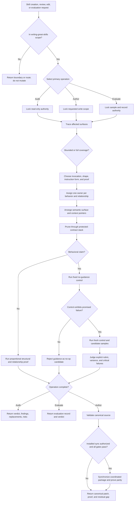

# Writing Great Skills Runtime And Evaluation Design Synthesis

Status: generous design reference and extraction map for a future
`writing-great-skills` rewrite. No runtime skill change is implemented by this
document.

Runtime authority remains in:

- `skills/custom/writing-great-skills/SKILL.md`;
- `skills/custom/writing-great-skills/GLOSSARY.md`;
- `skills/custom/writing-great-skills/BEHAVIOR-EVALS.md`;
- `skills/custom/writing-great-skills/agents/openai.yaml`;
- `CONTEXT.md`, `docs/adr/0004-validator-enforces-publishing-hygiene-not-language.md`,
  and the target repository's instruction and validation surfaces;
- `docs/synthesis/skill-context-relationships.md`, pack tests, behavioral
  evaluations, and their evidence transcripts; and
- the installed mirror under
  `C:\Users\steve\.agents\skills\writing-great-skills`.

This note selects a complete future design. It preserves **Predictability** as
the north star, retains the compact three-file runtime package, and makes the
currently implicit operation, authority, evaluation, Return, and promotion
contracts explicit. The future rewrite should become smaller than this
synthesis. This document explains and proves the design; runtime files should
carry only behavior-changing instructions.

The evidence snapshot is the working tree on 2026-07-20. That tree already
contains an uncommitted `GLOSSARY.md` Router Skill refinement and many unrelated
changes. The installed mirror matches the other three package files but retains
the pre-refinement glossary. That drift is evidence to reconcile during a
future promoted rewrite, not authority to synchronize during this synthesis.

## How To Read This Document

This synthesis is a proposed runtime extraction, not an additional operating
contract. It has four layers:

1. **Orientation** states the outcome, selected design, vocabulary, and
   explanatory flow.
2. **Normative Design** is the sole authority for proposed runtime behavior and
   relationships.
3. **Evidence And Rationale** preserves source observations, current gaps,
   deliberate non-changes, and deferred hypotheses without creating rules.
4. **Extraction And Verification** maps the design into owned runtime surfaces
   and governs staged implementation, evaluation, promotion, and mirror parity.

| Question | Owning section |
| --- | --- |
| What outcome governs the rewrite? | [North Star](#north-star) |
| What design is selected? | [Design Verdict](#design-verdict) |
| Which operations does the skill own? | [Operation Model](#operation-model) |
| What do its leading words mean? | [Leading-Word Runtime Model](#leading-word-runtime-model) |
| What is the proposed end-to-end flow? | [End-To-End Flow](#end-to-end-flow) |
| Where does every proposed rule live? | [Normative Home Index](#normative-home-index) |
| When should the skill be invoked? | [Invocation And Admission](#invocation-and-admission) |
| What may each operation mutate? | [Authority And Mutation Boundary](#authority-and-mutation-boundary) |
| What makes an audit bounded or exhaustive? | [Trace And Coverage Contract](#trace-and-coverage-contract) |
| How are upstream and mirror differences handled? | [Source, Upstream, And Mirror Classification](#source-upstream-and-mirror-classification) |
| How should a skill be shaped? | [Semantic Surface And Information Hierarchy](#semantic-surface-and-information-hierarchy) |
| How are ownership and composition checked? | [Ownership And Composition](#ownership-and-composition) |
| What is the pruning order? | [Pruning Decision Stack](#pruning-decision-stack) |
| When is behavioral evaluation required? | [Behavioral Claim Gate](#behavioral-claim-gate) |
| How is behavior evaluated? | [Counterfactual Evaluation Contract](#counterfactual-evaluation-contract) |
| What may subagents do? | [Delegation And Independence](#delegation-and-independence) |
| What must each operation return? | [Return Contract](#return-contract) |
| What evidence supports the design? | [Current Evidence Inventory](#current-evidence-inventory) |
| What changes in each owned file? | [Runtime Ownership And Change Map](#runtime-ownership-and-change-map) |
| What must pass before promotion? | [Migration And Acceptance Matrix](#migration-and-acceptance-matrix) and [Promotion Gate And Residual Gaps](#promotion-gate-and-residual-gaps) |

When another layer disagrees with Normative Design, correct that layer.
Evidence explains choices, the ownership map places them, and the acceptance
matrix proves them; none may redefine the proposed behavior.

# Layer One: Orientation

## North Star

Writing Great Skills owns one outcome:

> Make a skill take a predictable process through the smallest
> behavior-changing semantic surface, while preserving authority, composition,
> proof, and safe mutation boundaries.

Predictability means the same process, not identical output. A brainstorming
skill may predictably diverge. A review may predictably reach different
findings. The invariant is that invocation, evidence gathering, decisions,
gates, mutations, Return, and completion remain legible and repeatable.

Conciseness, token savings, discoverability, and maintainability are design
pressures, not independent objectives. A shorter skill is worse when it hides a
mutation boundary or weakens completion. A longer skill is worse when it dilutes
attention, duplicates meaning, or keeps branch-only material in the common
path.

## Design Verdict

Retain the current package shape and make its behavior typed.

| Decision | Selected design |
| --- | --- |
| Invocation | Keep the local Codex skill implicitly invocable because Codex must discover skill creation, review, and editing requests; record `allow_implicit_invocation: true` explicitly. |
| Runtime shape | Keep one short `SKILL.md` with a universal operation selector and the `Trace -> Choose -> Own -> Arrange -> Prune -> Verify` spine. |
| Vocabulary | Keep `GLOSSARY.md` as the single owner of authoring vocabulary and failure-mode definitions. |
| Behavioral proof | Keep `BEHAVIOR-EVALS.md` as the triggered owner of counterfactual evaluation mechanics. |
| Operations | Distinguish `Audit`, `Author`, and `Evaluate`; each has its own entry, mutation, output, and completion contract. |
| Exhaustiveness | Derive affected surfaces from the request. A full audit inventories every owned, disclosed, relationship, evaluation, test, upstream, and mirror surface before judgment. |
| Mutation | Review and evaluation stay read-only unless the user separately authorizes a persisted artifact; Author changes canonical source first and never edits the installed mirror independently. |
| Proof | Match proof to the claim: structural checks protect shape, relationship checks protect composition, counterfactual samples protect behavior, and hash parity protects installation. |
| Promotion | Promote one coordinated canonical package only after behavior and structural gates pass; synchronize the installed mirror last and verify exact parity. |
| Growth | Add no helper, schema, ledger, template, or operation-specific reference until observed variance proves that sharper local contracts are insufficient. |

The local design intentionally differs from current upstream. Upstream presents
`writing-great-skills` as a user-invoked body of reference. This pack needs an
implicitly discoverable auditing and authoring discipline, Codex-specific
invocation policy, relationship ownership, source-first installation, and
counterfactual behavior evaluation. Preserve upstream as source pressure, not
as runtime authority.

## Operation Model

The skill selects one primary operation from the user's requested outcome.
Evaluation may follow Audit or Author when a behavioral claim crosses its gate,
but it remains a separately completed operation.

| Operation | Use when | Primary result | Mutation class |
| --- | --- | --- | --- |
| **Audit** | The user asks to inspect, review, compare, explain, or design a skill without authorizing runtime edits | One bounded or full audit packet, or an explicitly requested synthesis/design artifact | Read-only for runtime, installation, Git, and external state |
| **Author** | The user asks to create, rewrite, edit, prune, or repair a skill | One validated canonical patch plus proof and deliberate non-changes | Only requested canonical and validation surfaces; installed synchronization is a final coordinated step |
| **Evaluate** | The user asks whether wording changes behavior, or Audit/Author makes a promotion-bearing behavioral claim | One counterfactual evaluation record and verdict | Read-only samples; persist a record only when its path is authorized |

An invocation may compress tiny work, but it does not merge authority. For
example, an authorized one-line description edit still performs bounded Trace,
Choose, ownership, and Verify. A read-only audit that drafts exact replacement
wording does not thereby become Author.

## Leading-Word Runtime Model

The existing six words remain the execution spine. Three supporting words make
their decisions harder to evade.

| Leading word | Runtime meaning |
| --- | --- |
| **Predictability** | Optimize for stable process under variable tasks, not uniform prose or output. |
| **Trace** | Resolve the request, operation, canonical package, every affected surface, current upstream, relationships, evidence, and mirror state before judgment or mutation. |
| **Choose** | Select invocation, operation, branch, instruction form, and proof strength from observed need rather than habit. |
| **Own** | Give each behavior one authority for rules, gates, mutations, outputs, and completion; name every composition edge. |
| **Arrange** | Expose the applicable semantic roles in runtime order, protect the information hierarchy, co-locate concepts, and disclose branch-only detail through sharp pointers. |
| **Prune** | Protect contracts, then remove irrelevance, no-ops, duplicated meaning, sediment, and unnecessary common-path load. |
| **Verify** | Prove exactly the claimed structural, relationship, behavioral, and installation outcomes from current state. |
| **Counterfactual** | Compare fixed no-guidance and candidate arms; guidance earns promotion only by changing the promised behavior. |
| **Single owner** | A rule appears once; other surfaces point to the owner and state only their own trigger and return boundary. |

`Comprehensive`, `thorough`, and `relentless` may recruit legwork in a specific
criterion, but they are not substitutes for a checkable bound. A leading word
that does not beat the model's default is a no-op candidate.

## End-To-End Flow



# Layer Two: Normative Design

## Normative Home Index

Each proposed concern has one home in this layer.

| Concern | Normative home |
| --- | --- |
| Invocation and out-of-scope admission | [Invocation And Admission](#invocation-and-admission) |
| Operation selection and write authority | [Authority And Mutation Boundary](#authority-and-mutation-boundary) |
| Bounded versus exhaustive inventory | [Trace And Coverage Contract](#trace-and-coverage-contract) |
| Canonical, upstream, and installed difference handling | [Source, Upstream, And Mirror Classification](#source-upstream-and-mirror-classification) |
| Per-operation entry, work, completion, and returns | [Operation And Completion Contracts](#operation-and-completion-contracts) |
| Invocation policy and description wording | [Invocation Design](#invocation-design) |
| Semantic roles, branches, pointers, and split rules | [Semantic Surface And Information Hierarchy](#semantic-surface-and-information-hierarchy) |
| Rules, callers, routers, composers, and handoffs | [Ownership And Composition](#ownership-and-composition) |
| Leading-word use | [Leading-Word Selection](#leading-word-selection) |
| Sentence-level cuts and preservation order | [Pruning Decision Stack](#pruning-decision-stack) |
| Behavioral-claim admission | [Behavioral Claim Gate](#behavioral-claim-gate) |
| Counterfactual experiment mechanics | [Counterfactual Evaluation Contract](#counterfactual-evaluation-contract) |
| Static, relationship, behavior, and mirror proof | [Proof Ladder](#proof-ladder) |
| Subagent authority and independence | [Delegation And Independence](#delegation-and-independence) |
| Terminal packet forms | [Return Contract](#return-contract) |
| Whole-invocation completion | [Completion](#completion) |

## Invocation And Admission

Invoke implicitly when the request asks Codex to create, review, edit, prune, or
behaviorally evaluate a Codex skill, or to design the skill-authoring contract
itself. Explicit invocation remains valid.

Admit only work whose primary object is a skill's invocation, runtime behavior,
ownership, composition, context loading, instruction language, validation, or
installation surface. A repository implementation, ordinary code review,
general prompt rewrite, product spec, or plugin scaffold remains with its own
owner unless the request specifically targets an embedded skill contract.

When the request mixes skill work with another owned task:

1. apply Writing Great Skills only to the skill-authoring surface;
2. preserve the other owner's outcome and mutation authority;
3. load or invoke another skill only through a relationship that owner permits;
4. return at the original request boundary rather than claiming the foreign
   work complete.

Out-of-scope admission returns a concise boundary statement and the available
owner when one is known. It neither rewrites the request into skill work nor
uses a router to interrupt active in-scope work.

## Authority And Mutation Boundary

Resolve authority before Trace because the same evidence can support either a
read-only finding or an authorized patch, but it cannot silently authorize the
latter.

| Operation | May read | May write | Must not mutate |
| --- | --- | --- | --- |
| Audit | Every affected source, history, upstream, relationship, test, evaluation, and mirror surface | Only an explicitly requested audit or synthesis artifact at its authorized path | Runtime skill files, tests, installed mirrors, Git state, trackers, or external systems |
| Author | Every surface needed to preserve behavior and prove the requested change | Requested canonical skill files and the smallest owned tests, evaluations, relationship maps, and docs required by the change | Unrelated dirty work; foreign-owner rules; installed files before canonical validation; external state outside explicit scope |
| Evaluate | Fixed scenario evidence, candidate and control skill text, sampled outputs, rubrics, and runtime metadata | An evaluation record only when the user or caller authorizes its path | Runtime skill text, installed mirrors, scenario authority, or task evidence during sampling |

Exact replacement wording in an Audit packet is analysis, not mutation
authority. A synthesis document may select a future design without implementing
it. Author begins only when the user requests creation or edits.

During Author, refresh Git and every in-scope file after user feedback, worker
return, or an external wait before resuming mutation. Reconcile intervening
edits and preserve unrelated work. Change canonical source first. Installation
is a coordinated promotion step, never a shortcut around source.

## Trace And Coverage Contract

Trace derives coverage from the requested behavior, then accounts for every
surface that can alter, invoke, consume, prove, publish, or mirror it.

### Bounded trace

A bounded trace follows only affected surfaces. It still includes the canonical
line, its policy file when invocation can change, its disclosed target when a
pointer can change, each affected caller or relationship, the smallest relevant
test or evaluation, and the installed counterpart when one exists.

### Full trace

A full audit inventories before judgment:

- every canonical file in the skill package, including `SKILL.md`,
  `agents/openai.yaml`, disclosed references, scripts, templates, assets, and
  schemas;
- current upstream and the repository's recorded upstream decisions;
- callers, routers, composers, handoffs, return consumers, and relationship
  maps;
- every owned gate, output, mutation boundary, failure branch, and completion
  criterion;
- structural tests, behavior-evaluation fixtures, recorded transcripts, and
  known residual evidence gaps;
- documentation or setup surfaces that publish or route the skill; and
- every installed mirror and manifest/parity surface in scope.

An inventory is not completion. Trace finishes only when every item is marked
`affected`, `preserve`, `owned elsewhere`, `historical evidence`, `drift`, or
`not applicable`, with the reason discoverable from the request and source.

The phrase “all files,” “complete rewrite,” “full audit,” or equivalent selects
full trace. File names alone never prove complete coverage; hidden consumers and
relationship edges remain part of the inventory.

## Source, Upstream, And Mirror Classification

Canonical runtime source is the local `skills/custom/<skill>/` package. Upstream
is source pressure. The installed tree is a derived runtime copy. Historical
research and transcripts are evidence. Synthesis is proposed design until
extracted.

Classify each relevant difference once:

| Classification | Meaning | Required action |
| --- | --- | --- |
| **Keep local** | Local behavior is intentional and better fits current pack authority | Preserve it and record why upstream does not replace it |
| **Adapt upstream** | Upstream supplies useful language or behavior that needs local policy translation | Map it to one local owner and validate the adapted result |
| **Adopt upstream** | Upstream behavior fits local authority without collision | Integrate it through normal Author and proof gates |
| **Reject upstream** | It conflicts with local invocation, ownership, safety, or product decisions | Record the conflict; do not copy it |
| **Defer** | Evidence or a user decision is insufficient | Name the missing evidence and revisit trigger |
| **Local drift** | Canonical working source differs intentionally or accidentally from its baseline | Preserve while in scope is unresolved; classify before overwrite |
| **Mirror drift** | Installed bytes differ from validated canonical bytes | Never edit piecemeal; synchronize only after coordinated promotion |

Refresh current upstream for a full audit or when upstream adoption is part of
the request. Pin the repository and revision or record a dated file snapshot.
Do not treat a disposable checkout path, old audit, or package version label as
proof of current contents.

## Operation And Completion Contracts

| Operation | Entry | Required work | Complete when | Legal nonterminal return |
| --- | --- | --- | --- | --- |
| Audit | In-scope review or design request; authority is read-only | Trace coverage; Choose; Own; Arrange; Prune; select proof; inspect current state | Verdict, impact-ordered findings, exact candidates, deliberate non-changes, behavior at risk, and evidence limits cover every affected surface | `partial` with remaining inventory, or `blocked` with the exact unavailable source/decision |
| Author | Requested skill creation or edit; canonical write scope is known | Trace current state; preserve contracts; edit canonical owners; update affected proof; validate; optionally synchronize as one final stage | Requested behavior exists in canonical source, proportional proof passes, unrelated work is preserved, residual gaps are named, and any authorized mirror sync has exact parity | `partial` with valid current patch and remaining gates, or `blocked` before unauthorized mutation |
| Evaluate | Behavioral claim and fixed scenario are available | Diagnose; Control; Sample; Stress only when applicable; Judge; record | Failure, arms, runtime, hashes, samples, rubric, behavior, variance, critical failures, and residual gaps are recorded | `no-demonstrated-failure`, `insufficient-samples`, or `blocked` with the missing fixed input |

`complete`, `partial`, and `blocked` describe the requested operation, not the
number of files touched. An Audit may be complete with no findings. An Author
may be partial with a clean patch if behavior proof is still missing. An
Evaluate that finds no control failure is complete as an experiment and rejects
the candidate guidance; it is not a failed run.

## Invocation Design

`agents/openai.yaml` explicitly records `allow_implicit_invocation: true`.
The description performs one job: point Codex at the skill for each distinct
owned branch.

For an implicitly invocable description:

- front-load the strongest shared concept or action;
- name one trigger per genuine branch: create/edit, audit/review, and
  behavioral evaluation;
- collapse synonyms that merely rename one branch;
- include a caller reach clause only when a real caller relationship exists;
- omit procedure, output details, and identity already available in the body;
- test both positive triggers and adjacent negative controls.

Do not convert this local skill to explicit-only merely because current
upstream is user-invoked. Conversion requires evidence that false-positive
invocation or description context load costs more than automatic discovery,
plus an accepted human routing surface for every lost branch.

## Semantic Surface And Information Hierarchy

Apply this semantic grammar in order when its role exists:

```text
Outcome
Boundary and authority
Operation or branch selection
Steps or peer reference
Return
Completion
```

These are roles, not mandatory headings. Linear procedures, routers,
composers, state machines, templates, and flat reference keep the form their
behavior needs. Similar capitalization, numbering, or punctuation is cosmetic
unless a parser consumes it.

Use the information hierarchy:

1. common-path steps in `SKILL.md`;
2. compact universal reference in `SKILL.md`;
3. branch-only reference behind a sharp context pointer.

Inline material every operation needs to select and act safely. Disclose detail
only some branches need. A pointer names both the target and the observable
condition for loading it. When a must-have pointer fires unreliably, sharpen the
condition first; inline the material only when evidence shows sharpening is
insufficient.

Co-locate one concept's definition, rule, caveat, and failure consequence.
Split a skill only for independent invocation, irreducible branch load, or
observed premature completion after sharpening the local completion criterion.
An inline invocation does not hide visible post-completion steps; only a real
context boundary can do that.

## Ownership And Composition

Each behavior has one owner for:

- its rule and admissibility predicate;
- its authority and mutation boundary;
- its inputs, outputs, and evidence;
- its failure or nonterminal returns; and
- its completion criterion.

Another surface may point to that owner and state only its own trigger, expected
outcome, and return boundary. It does not copy the owned procedure.

Audit each relationship with four facts:

| Fact | Question |
| --- | --- |
| **Callee** | Which skill or reference owns the behavior? |
| **Trigger** | What observable condition selects it? |
| **Authority** | Which owner keeps output, mutation, and completion authority while it runs? |
| **Return** | What packet or state comes back, and where does the caller resume or stop? |

Use the pack's accepted relationship verbs: `Load`, `Invoke`, `Compose`, `Hand
off`, and `Recommend and stop`. Routers select one next skill or `none` and stop;
they do not execute the route. Explicit-only skills preserve human selection.
A residual router accepts only terminal unowned work after the current owner
exhausts its scope and deterministic handoffs.

The future rewrite must not copy the relationship catalog into `SKILL.md`.
Trace it during full audits, update affected edges once in the relationship
map, and keep concrete caller rules with each caller.

## Leading-Word Selection

A leading word earns runtime space when it recruits a useful pretrained prior,
changes behavior versus the current default, and remains precise at every use.

Selection order:

1. name the behavior that needs steering;
2. prefer an existing domain or pretrained word;
3. state one compact local meaning when ambiguity remains;
4. repeat the word where it anchors invocation or execution;
5. remove repeated explanations;
6. test the word as part of the candidate, not in isolation from realistic
   context.

A coined word pays definition cost and should survive only when existing
language cannot carry the behavior. Decorative metaphors, generic quality
adjectives, and synonyms that lack distinct gates are no-op or duplication
candidates.

## Pruning Decision Stack

Prune meaning, not merely words. Apply this stack in order:

1. **Protect contracts.** Mark non-intuitive mechanics; semantic and safety
   rules; scope, approval, ownership, and mutation boundaries; required outputs
   and proof; irreversible sequencing; failure branches that change the safe
   next action; and completion criteria.
2. **Restore single ownership.** Move or point duplicated foreign behavior to
   its owner before deleting local wording.
3. **Test relevance.** Remove stale exposition and branch material from the
   common path; disclose live branch-only reference.
4. **Run the sentence counterfactual.** Ask, “If I cut this, what behavior
   changes?” Delete the sentence when the answer is none. Relevance alone does
   not save a no-op.
5. **Collapse repeated meaning.** Keep one rule and replace intentional repeated
   emphasis with one leading word, not repeated explanations.
6. **Reduce sprawl.** Co-locate, disclose, or split only after the earlier
   decisions preserve behavior and evidence justifies the boundary.
7. **Rewrite negation.** State the positive target first. Retain a prohibition
   only as a necessary hard guardrail and pair it with the safe action.

No line-count, word-count, heading count, or validator token is a pruning
verdict. Static language lint must not replace judgment; ADR 0004 keeps the
validator focused on mechanical publishing hygiene.

## Behavioral Claim Gate

Behavior evaluation is required when promotion claims that wording changes:

- invocation or branch selection;
- discipline under realistic pressure;
- output shape or a required field;
- an observable conditional action;
- authority, mutation, stop, Return, or completion behavior;
- context-pointer loading or premature-completion resistance; or
- a leading word's execution effect.

Structural proof is sufficient for a purely mechanical claim such as valid
frontmatter, a resolving relative link, an exact policy value, a parser-consumed
field, or mirror byte parity. A behavior-preserving relocation still needs
representative relationship and critical-workflow checks; static equivalence
cannot prove that a pointer will load reliably.

When no realistic no-guidance control exhibits the claimed failure, stop and
classify the proposed guidance as a no-op candidate. Do not invent a pressure
scenario, lower the rubric, or promote prose because it sounds better.

## Counterfactual Evaluation Contract

Load `BEHAVIOR-EVALS.md` only when the Behavioral Claim Gate fires or the user
requests an evaluation. Its operation is:

### Diagnose

| Observed failure | Candidate instruction form |
| --- | --- |
| Known discipline abandoned under pressure | Positive gate plus only observed necessary guardrails |
| Output has the wrong shape | Ordered positive contract |
| Required element is omitted | Required field, slot, or schema |
| Behavior fires under the wrong condition | Observable predicate |
| Invocation misses or false-fires | One distinct trigger per branch plus positive and adjacent negative cases |
| Step ends early | Sharper checkable criterion first; context split only after observed persistence |

### Control

Fix the task, full context, model, reasoning settings, tools, authority, evidence,
runtime version, and rubric. Run without the candidate guidance. Stop if the
claimed failure does not appear.

### Sample

Run control and candidate arms in fresh contexts with at least five independent
samples per arm for a behavioral claim. Record runtime, settings, source and
candidate hashes, scenario, result, critical failures, and variance. Randomize
or alternate arm order when practical. Do not leak candidate language,
conclusions, or prior outputs into control contexts.

### Stress

Stress only a discipline failure and use realistic competing pressures. Keep
authority and mutation boundaries fixed. Shape, omission, invocation,
conditional, and completion failures use representative positive and negative
tasks rather than invented adversity.

### Judge

Use an explicit behavior rubric. Inspect every flagged output; string matches,
heading presence, and template echoes are structural evidence only. Accept a
candidate only when the control demonstrates the failure, the candidate
materially improves compliance, variance narrows or remains acceptably bounded,
and no new critical failure appears.

### Record

Record the failure, fixed inputs, control, candidate, sample count, runtime,
hashes, rubric, per-sample result, aggregate, variance, worst result, critical
failures, protocol deviations, unavailable telemetry, decision, and residual
gap. A result without these fields is exploratory evidence, not promotion
proof.

## Proof Ladder

Use the lowest rung that proves the claim and every higher rung required by its
promotion risk.

| Rung | Proves | Does not prove |
| --- | --- | --- |
| **P0: Read-back** | Exact changed bytes, resolved links, policy value, and preserved unrelated state | Behavioral effect |
| **P1: Structural** | Schema, frontmatter, file layout, literal machine contract, validator, and focused test behavior | Semantic instruction quality |
| **P2: Relationship** | Caller/callee trigger, authority, Return, context load, and representative workflow coherence | Counterfactual behavior across fresh runs |
| **P3: Behavioral** | Candidate wording changes promised behavior under a fixed rubric and fresh contexts | Installation parity or untested models/tasks |
| **P4: Promotion** | Coordinated canonical checks, full relevant suite, diff checks, changed-file read-back, and residual-gap accounting | Installed runtime state |
| **P5: Installation** | Managed synchronization, manifest integrity, and exact canonical/mirror parity | Future upstream or model drift |

Name every skipped rung and residual risk. A focused check proves only its
slice. A transcript is historical evidence unless its hash, runtime, scenario,
and candidate match the promoted state.

## Delegation And Independence

Pack-wide audits and behavioral evaluation samples authorize direct subagents
without a second user confirmation. Delegation is optional and economical, not
a ritual.

For a pack-wide audit, give each direct child one bounded, non-overlapping,
self-contained, read-only evidence lane. For evaluation, give each child one
fixed fresh-context sample or a non-overlapping sample batch. Use
`fork_turns="none"` when independent judgment matters. Children do not spawn.

Exclude parent conclusions, candidate-favoring commentary, peer outputs, and
unstated context from independence-bearing briefs. The root reads every
required instruction and owning source, verifies returned evidence, selects the
design, edits, judges behavior, validates, and declares completion.

Do not delegate a narrow edit merely to satisfy a worker count. Do not let a
child mutate source, decide the verdict, synchronize mirrors, or claim the
audit complete.

## Return Contract

### Audit

Return:

- `complete`, `partial`, or `blocked`;
- bounded or full coverage and the resolved authority;
- verdict;
- impact-ordered findings with evidence;
- exact replacement wording or test/evaluation changes when useful;
- deliberate non-changes;
- behavior at risk and residual evidence gaps; and
- no mutation claim beyond any explicitly requested artifact.

### Author

Return:

- `complete`, `partial`, or `blocked`;
- canonical files changed and preserved unrelated state;
- behavior added, changed, or removed;
- validation by Proof Ladder rung;
- behavioral evaluation decision when the claim gate fired;
- mirror synchronization/parity state;
- deliberate non-changes and residual risk.

### Evaluate

Return:

- `accept`, `reject-no-control-failure`, `reject-regression`,
  `needs-more-evidence`, or `blocked`;
- the recorded experiment contract;
- per-arm compliance, variance, worst result, and critical failures;
- the exact behavior the result supports; and
- residual task, runtime, model, or sampling limits.

## Completion

Complete only when the selected operation's coverage is accounted for; every
affected invocation surface, owner, composition edge, context pointer, gate,
output, mutation boundary, handoff, Return, and completion criterion has one
classified home; source, current upstream, baseline, and mirror differences are
classified; every claimed relationship has current evidence; every promoted
behavioral claim passes the counterfactual gate; canonical checks pass or skips
are named; unrelated work remains preserved; and the Return packet states the
actual terminal condition without extrapolation.

# Layer Three: Evidence And Rationale

This layer explains the selected design. It does not create runtime rules.

## Current Evidence Inventory

| Bundle | Evidence | Design use | Limit |
| --- | --- | --- | --- |
| **I1: Canonical package** | `SKILL.md`, `GLOSSARY.md`, `BEHAVIOR-EVALS.md`, and `agents/openai.yaml` | Current invocation, six-step audit, vocabulary, evaluation, and policy contracts | Current Author and Evaluate operation returns are only partly explicit |
| **I2: Pack ownership** | `CONTEXT.md`, `docs/synthesis/README.md`, `docs/synthesis/skill-context-relationships.md`, and ADR 0004 | Source-of-truth layers, relationship verbs, supporting-file ownership, and no language lint | Relationship map lists no current caller that invokes this skill |
| **I3: Structural tests** | `tests/test_skill_pack_contracts.py` | Protects implicit policy, disclosed references, delegation wording, and format-neutral Semantic Skill Surface | Literal assertions do not prove audit or author behavior |
| **I4: Behavior fixtures** | Core workflow fixtures 28, 46, and 51 | Delegation, pruning counterfactual, and counterfactual instruction-form contracts | Only fixture 28 has a recorded live direct-child trace in the inspected evidence |
| **I5: Historical transcript** | `docs/validation/transcripts/2026-07-13-cohesion-boundary-evals.md` | Shows bounded direct delegation and then-current installed validation | Hash and runtime predate the current glossary refinement and future rewrite |
| **I6: Upstream** | Matt Pocock `writing-great-skills` `SKILL.md` and `GLOSSARY.md`, inspected on 2026-07-20; relevant file history head `af6d692` | Original vocabulary, information hierarchy, split rules, leading-word and failure-mode pressure | Upstream policy and terminology target a different invocation mechanism |
| **I7: Synthesis method** | `docs/synthesis/methods/source-to-skill-flow.md` | Full-behavior synthesis, candidate, reality-validation, and final-prune separation | It owns production cadence, not this skill's runtime behavior |
| **I8: Precedents** | `docs/synthesis/skills/parallel-implement.md` and `wayfinder.md` | Four-layer authority, home index, ownership map, staged evaluation, acceptance matrix | Their state machines and helper mechanics are not transferable behavior |
| **I9: Mirror** | Canonical and installed package hashes inspected on 2026-07-20 | Confirms three files in parity and one glossary drift | Parity is a point-in-time observation, not promotion |

Current upstream references:

- <https://github.com/mattpocock/skills/blob/main/skills/productivity/writing-great-skills/SKILL.md>
- <https://github.com/mattpocock/skills/blob/main/skills/productivity/writing-great-skills/GLOSSARY.md>
- <https://github.com/mattpocock/skills/commits/main/skills/productivity/writing-great-skills/SKILL.md>

## Current Runtime Strengths

The current local skill already has a strong compact center:

- **Predictability** is a clear north star.
- The six leading words form a memorable audit spine.
- Full Trace explicitly covers canonical source, policy, disclosed files,
  upstream, relationships, tests, evaluations, and mirrors.
- The Semantic Skill Surface avoids a brittle universal heading template.
- Ownership covers gates, outputs, mutation, and completion, not merely prose
  location.
- Prune distinguishes no-op, duplication, relevance, sediment, sprawl, and
  safety contracts.
- Behavioral evaluation begins with a failing control and separates discipline,
  shape, omission, and conditional failures.
- Delegation preserves fresh-context independence while keeping judgment and
  mutation with the root.
- Source-first validation and installed synchronization are already explicit.

The future rewrite should deepen these contracts rather than replace the six
verbs or expand the main file with rationale.

## Current Runtime Gaps

These observations motivate the selected design:

| Gap | Evidence | Consequence |
| --- | --- | --- |
| Description promises create, review, and edit, but Output describes only audit | Current `SKILL.md` | Author lacks a distinct Return and completion contract |
| Operation selection is implicit | Current `SKILL.md` | Read-only, mutation, and evaluation authority must be inferred from prose |
| Full Trace is exhaustive but has no explicit classification ledger | Current `Trace` and `Completion` | An inventory can be announced without showing how every item was resolved |
| Upstream is required but adoption classifications are implicit | Current `Trace` and historical audits | A future author may copy or reject upstream without an explicit decision form |
| Behavioral evaluation is strong but only one generic branch | Current `BEHAVIOR-EVALS.md` | Invocation and premature-completion claims need clear mapping into the protocol |
| Static tests protect only selected literal contracts | Two focused tests | Core Audit and Author behavior lacks direct current candidate evaluation |
| Return has no typed nonterminal forms | Current Output and Completion | Partial evidence can be narrated as complete or blocked imprecisely |
| Current canonical glossary and installed glossary differ | SHA-256 read-back | Installed execution does not yet contain the Router Skill refinement |

These are design gaps, not claims that current behavior is unusable. A future
control must demonstrate the relevant failure before candidate wording earns
promotion.

## Current Upstream Classification

The 2026-07-20 upstream snapshot adds useful source pressure but does not
replace local policy.

| Upstream element | Classification for this design | Rationale |
| --- | --- | --- |
| Predictability as root virtue | Keep/adopt | Shared foundation and already local |
| Model-invoked versus user-invoked trade-off | Adapt | Map to Codex `allow_implicit_invocation`; preserve local terms unless a coordinated vocabulary migration is selected |
| Upstream `disable-model-invocation: true` for this skill | Reject | Local description must discover create/review/edit/evaluate requests |
| Description pruning and one trigger per branch | Adopt | Directly sharpens implicit invocation without importing upstream mechanics |
| Step/reference hierarchy and branch disclosure | Keep/adapt | Already local; preserve the format-neutral Semantic Skill Surface extension |
| Split by invocation or observed sequence pressure | Keep | Already represented locally with stronger context-boundary detail |
| Sentence-level no-op hunt | Keep | Already local and behavior-evaluated as a critical pruning contract |
| Leading-word collapse examples | Evidence only | Examples explain the idea but need not enter local runtime |
| Negation failure mode | Keep | Already locally adapted to positive target plus hard guardrail |
| Upstream all-reference runtime shape | Reject | Local skill owns an executable audit/author/evaluate spine |
| Upstream Router Skill restricted to user-invoked skills | Reject/adapt | Local pack accepts a narrow implicit residual router after terminal unowned work |

## Evidence Gaps For The Future Rewrite

- No current fixed five-sample control/candidate study proves the proposed
  operation selector.
- No current study proves that the three-branch description improves invocation
  without false positives on adjacent prompt, plugin, docs, or code-review work.
- No current study proves that the expanded Return contract reduces premature
  completion or overclaiming.
- No current candidate proves that loading `BEHAVIOR-EVALS.md` only at the claim
  gate is reliable.
- No current Author scenario covers a full package change through canonical
  validation, relationship update, coordinated installation, and hash parity.
- Existing live delegation evidence is historical and covers one pack-wide
  audit shape, not the future runtime wording.
- Model and runtime telemetry may remain unavailable; the evaluation record
  must state that limitation rather than invent it.

## Deliberate Non-Changes

| Non-change | Why | Revisit only when |
| --- | --- | --- |
| Keep one `SKILL.md`, one glossary, and one behavior-eval reference | The package is already small and has clean semantic owners | Fresh-context evidence shows branch loading, sprawl, or premature completion survives sharper pointers and criteria |
| Keep the six-verb audit spine | It is compact, established, and behaviorally meaningful | A control shows operation selection or ordering repeatedly fails despite typed entry and completion |
| Keep the glossary outside `SKILL.md` | Full definitions are reference and would bury the runtime spine | Must-have definitions repeatedly fail to load after pointer repair |
| Keep behavioral mechanics in one reference | They form one coherent experiment contract | Distinct evaluation branches become independently invocable or irreducibly load-heavy |
| Do not add helper scripts, schemas, or a ledger | Judgment, not mechanical state reduction, dominates this skill | Repeated evaluations show omitted fields or unrecoverable multi-session state that a small helper can actually prevent |
| Do not impose a universal skill template | Semantic roles matter; file shape follows behavior | A machine consumer introduces an explicit schema requirement |
| Do not impose line or token ceilings | Behavior change and attention are the criteria | Empirical evidence identifies a stable model/runtime threshold with no semantic regressions |
| Do not lint ordinary language | ADR 0004 reserves vocabulary quality for judgment and behavior evaluation | A mechanical publishing hazard can be detected without policing meaning |
| Do not require subagents for bounded work | Delegation has coordination cost and is not proof by itself | Independent evidence is materially cheaper or required for the claim |
| Do not copy the relationship catalog into runtime | The relationship map and callers own concrete edges | The skill gains a real stable caller relationship that needs one compact reach clause |
| Do not synchronize the current glossary drift | This task creates synthesis only and the worktree has unrelated active changes | A future authorized coordinated promotion passes canonical proof |

## Deferred Hypotheses

The following ideas remain experiments, not requirements:

- converting the skill to explicit-only to reduce permanent context load;
- separating Audit and Author into independently invocable skills;
- a machine-readable evaluation manifest or score renderer;
- per-model no-op baselines or leading-word profiles;
- automatic description trigger generation;
- static detection of duplicated semantic meaning;
- automatic context-pointer reach scoring;
- a pack-wide skill surface inventory helper; and
- a dedicated synthesis operation beyond the requested artifact boundary.

Promote one only after a fixed control demonstrates a recurring failure, the
candidate improves it, and the added runtime or maintenance surface costs less
than the variance it removes.

# Layer Four: Extraction And Verification

Extract each normative behavior once. Keep operation selection, authority, the
six-verb spine, sharp pointers, Return, and completion in `SKILL.md`; keep full
definitions in the glossary; keep experiment mechanics in the evaluation
reference; and place proof or installation details with their existing owners.

## Proposed Runtime Semantic Surface

The eventual `SKILL.md` should read approximately as:

```text
Frontmatter with one trigger per branch
Predictability outcome
Operation: Audit | Author | Evaluate
Authority and mutation boundary
Reference pointers:
  full or bounded authoring vocabulary -> GLOSSARY.md
  behavioral claim -> BEHAVIOR-EVALS.md
Trace -> Choose -> Own -> Arrange -> Prune -> Verify
Per-operation Return
Completion
```

This is a semantic target, not approved final wording. The main file should not
contain glossary definitions, full source-classification tables, experiment
schemas, caller catalogs, installer commands, rationale, migration stages, or
the acceptance matrix.

## Runtime Ownership And Change Map

The `Must not absorb` column is part of the design. It prevents runtime prose
from becoming a synthesis, prevents references from acquiring mutation
authority, and prevents tests from becoming language policy.

| Surface | Owns | Proposed delta | Must not absorb |
| --- | --- | --- | --- |
| `skills/custom/writing-great-skills/SKILL.md` | Outcome, operation selection, authority, universal six-verb spine, sharp pointers, per-operation Return, and completion | Add typed `Audit`, `Author`, and `Evaluate`; distinguish bounded/full Trace; add behavioral-claim gate; make nonterminal Return and source-first promotion explicit | Full glossary, experiment schema, upstream history, relationship catalog, installer procedure, or synthesis rationale |
| `GLOSSARY.md` | Stable skill-authoring domain model and failure-mode definitions | Reconcile current Router Skill change; ensure local Codex invocation terms, Semantic Skill Surface, ownership, Return, evaluation, and pruning vocabulary have one coherent definition only where a durable term is needed | Runtime steps, current caller catalog, evaluation procedure, file-specific migration plan, or temporary candidate language |
| `BEHAVIOR-EVALS.md` | Counterfactual experiment operation and record requirements | Add invocation and premature-completion diagnoses, contamination controls, explicit record fields, arm decision forms, and critical-failure handling while preserving the current five-sample minimum | Audit procedure, canonical edits, installation, language ontology, or automated scoring claims |
| `agents/openai.yaml` | Codex invocation policy | Keep explicit `allow_implicit_invocation: true`; test a concise three-branch description in frontmatter, not procedure in policy | Runtime workflow or human documentation |
| `CONTEXT.md` | Pack artifact and vocabulary ownership | Update only if the future rewrite changes the durable owner or accepted vocabulary boundary | Skill-local procedure or candidate wording |
| `docs/synthesis/skill-context-relationships.md` | Invocation index, supporting-file ownership, and accepted cross-skill edges | Preserve implicit invocation; update supporting-file roles or real caller edges exactly once if the rewrite changes them | Duplicated Audit, Author, or Evaluate procedure |
| `docs/adr/0004-validator-enforces-publishing-hygiene-not-language.md` | Durable no-language-lint decision | No change unless the architectural decision itself changes | Skill-specific pruning advice or tests |
| `tests/test_skill_pack_contracts.py` | Stable structural and literal contracts | Replace brittle prose assertions only where needed; cover operation discovery, pointer presence, policy, semantic role order, and no partial package ownership | Claims that strings prove behavior or a mandated cosmetic layout |
| `docs/validation/evals/core-workflows.md` | Repeatable behavioral fixtures and critical failures | Add fixed Audit, Author, invocation, Return, context-pointer, and promotion scenarios; preserve delegation, pruning, and counterfactual fixtures | Runtime rules or retrospective success claims |
| `docs/validation/transcripts/` | Dated executed evidence | Record future fixed control/candidate runs with hashes, runtime, samples, rubric, variance, and gaps | Current instructions or reusable procedure |
| `docs/research/language/` | Reproducible upstream source history | Add a dated upstream audit only when current comparison changes the selected design or preserves a meaningful rejection | Runtime authority or mirror state |
| `scripts.validate_skills`, installer, and manifest tests | Mechanical package, reference, publication, installation, and parity integrity | No semantic language enforcement; exercise coordinated source-to-mirror promotion through existing commands | Leading-word quality, no-op judgment, or automatic semantic ownership decisions |
| Installed mirror `C:\Users\steve\.agents\skills\writing-great-skills` | Validated runtime copy | Synchronize the complete promoted package only after canonical and behavioral gates pass; verify exact file parity | Independent edits, partial synchronization, or design authority |

## Staged Extraction Plan

| Stage | Scope | Entry gate | Exit gate |
| --- | --- | --- | --- |
| **Stage 0: Control lock** | Snapshot current canonical package, current upstream, relationships, tests, evals, worktree state, mirror hashes, and fixed scenarios | Future rewrite authorized | Reproducible controls and preserve inventory recorded before runtime edits |
| **Stage 1: Operation and authority** | `SKILL.md`, policy/frontmatter, focused structural tests | Stage 0 complete | Audit/Author/Evaluate selection, mutation boundaries, pointers, Return, and completion are candidate-ready |
| **Stage 2: Reference coherence** | `GLOSSARY.md`, `BEHAVIOR-EVALS.md`, relationship/support ownership | Stage 1 candidate stable enough to expose reference needs | Every durable term and experiment mechanic has one owner; no runtime duplication |
| **Stage 3: Behavior proof** | Fixed core workflow fixtures and fresh-context control/candidate records | Plain-language candidate assembled | Required behavior rows pass; no critical negative-control regression; residual gaps classified |
| **Stage 4: Canonical promotion** | Focused tests, full pytest, skill validation, source read-back, diff checks | Stage 3 accepted | Coordinated canonical package and proof surfaces are validated from current state |
| **Stage 5: Installation** | Managed install, installed validation, manifest and hash parity | Stage 4 complete and synchronization authorized | Complete installed package matches validated canonical source exactly |

Do not partially promote a later stage to repair an earlier one. Loop back to
the smallest owning stage, rerun its affected behavior rows, and then advance.

## Staged Behavior-Evaluation Protocol

Use these evaluation phases across the migration stages:

| Phase | Gate | Minimum evidence |
| --- | --- | --- |
| **E0: Control lock** | Current/no-guidance state exhibits the claimed failure | Fixed task, authority, evidence, runtime, hashes, rubric, and red-capable behavior |
| **E1: Attention** | Candidate discovers the right operation, loads the right reference, and exposes Return/completion without cosmetic dependence | Positive and adjacent negative prompts; context-pointer positive/negative cases; inspected outputs |
| **E2: Decision** | Candidate chooses invocation, ownership, instruction form, pruning verdict, and proof rung correctly | Bounded/full, create/review/edit/evaluate, owner collision, no-op, safety boundary, and static-versus-behavior scenarios |
| **E3: Execution** | Candidate performs the selected operation within authority and returns the complete packet | At least five fresh samples per behavioral arm; mutation preservation; critical failure and variance accounting |
| **E4: Integration** | Candidate preserves relationships, canonical promotion, installation, and representative pack workflows | Relationship checks, focused/full tests, validator, diff checks, changed-file read-back, managed sync, and mirror parity |

E0 is claim-specific. One failure does not authorize guidance for another.
Stages and phases are orthogonal: a Stage 2 glossary change may require E1-E3,
while a Stage 4 mechanical reference repair may need only P0-P2 and E4.

## Migration And Acceptance Matrix

Source bundles refer to [Current Evidence Inventory](#current-evidence-inventory).
Normative anchors define behavior; this matrix only defines acceptance cases.

| Stage / phase | Behavior | Required sources and change | Positive case | Negative control | Verification |
| --- | --- | --- | --- | --- | --- |
| S1 / E1 | [Invocation And Admission](#invocation-and-admission) | I1-I3; frontmatter and policy candidate | Skill creation, audit, edit, and behavior-evaluation prompts select this skill | General prompt rewrite, ordinary code review, plugin scaffold, and repository implementation do not false-fire | Fresh positive/adjacent-negative samples plus policy test |
| S1 / E2 | [Operation Model](#operation-model) | I1; `SKILL.md` operation selector | Review selects Audit, rewrite selects Author, wording experiment selects Evaluate | Review does not mutate; Author is not reduced to findings; no-control evaluation is not reported as failure | Fixed classification rubric and fresh samples |
| S1 / E2-E3 | [Authority And Mutation Boundary](#authority-and-mutation-boundary) | I1, I2; runtime candidate | Audit writes only requested synthesis; Author touches requested canonical/proof surfaces; Evaluate samples read-only | Exact replacement wording does not authorize edits; mirror is not edited first; unrelated dirty files remain untouched | Worktree before/after and mutation ledger in fixture |
| S1 / E2 | [Trace And Coverage Contract](#trace-and-coverage-contract) | I1-I5; runtime and tests | Full request inventories every canonical/disclosed/upstream/relationship/test/eval/mirror surface and classifies it | Announced inventory, filename-only scan, or missing installed/upstream surface does not pass | Fixed complete and bounded fixture sets |
| S1 / E2 | [Source, Upstream, And Mirror Classification](#source-upstream-and-mirror-classification) | I5, I6, I9; runtime candidate | Current upstream is pinned/dated and every difference gets one allowed classification | Old `.tmp` path, package label, mirror bytes, or synthesis is treated as canonical authority | Source trace read-back and classification audit |
| S1-S2 / E1-E2 | [Semantic Surface And Information Hierarchy](#semantic-surface-and-information-hierarchy) | I1-I3; runtime/glossary candidate | Applicable roles are discoverable in order; branch-only evaluation detail loads only at its predicate | Mandatory cosmetic headings, hidden mutation/Return, weak pointer, or branch detail in common path does not pass | Structural role test plus pointer behavior samples |
| S2 / E2 | [Ownership And Composition](#ownership-and-composition) | I2; glossary/relationship candidate | Each affected edge names callee, trigger, authority, and Return once | Caller copies callee procedure, router executes a route, or two surfaces own completion | Relationship-map audit and representative traces |
| S2 / E2-E3 | [Leading-Word Selection](#leading-word-selection) | I1, I6; glossary/runtime candidate | A selected word changes the targeted invocation/execution behavior and removes repeated explanation | Decorative synonym, coined term without value, or generic adjective survives on taste alone | No-guidance/candidate samples and sentence trace |
| S1-S2 / E2-E3 | [Pruning Decision Stack](#pruning-decision-stack) | I1, I4; runtime/glossary candidate | No-op is cut, duplicate meaning collapses, branch reference discloses, and compact safety boundary remains | Relevance, word count, or validator success alone keeps/cuts prose; positive target loses its hard safety guardrail | Fixture 46 plus fresh critical cases |
| S2-S3 / E0-E3 | [Behavioral Claim Gate](#behavioral-claim-gate) | I1, I4; runtime/eval candidate | Behavioral claim loads evaluation; mechanical claim uses structural proof; no failing control rejects guidance | Static string tests are called behavior proof, or every edit pays a five-sample study regardless of claim | Claim classification fixtures and audit |
| S2-S3 / E3 | [Counterfactual Evaluation Contract](#counterfactual-evaluation-contract) | I1, I4-I5; `BEHAVIOR-EVALS.md` candidate | Fixed control/candidate arms run at least five fresh samples, flagged outputs are inspected, and variance/gaps recorded | Candidate leaks into control, one sample decides, string match scores meaning, or pressure fabricates authority | Fixture 51 plus executed dated transcript |
| S1-S3 / E3 | [Delegation And Independence](#delegation-and-independence) | I1, I4-I5; runtime/eval candidate | Pack-wide lanes are bounded/read-only/fresh and root verifies evidence; sample briefs are fixed across arms | Narrow work spawns ritual workers; child edits, sees conclusions, fans out, or owns verdict | Fixture 28 plus collaboration-tree read-back |
| S1-S3 / E1-E3 | [Return Contract](#return-contract) | I1; runtime candidate | Each operation returns its typed terminal or nonterminal packet with evidence limits | Audit claims edits, Author omits mirror state, Evaluate omits variance, or partial work is labeled complete | Positive/negative packet rubrics |
| S4 / E4 | [Proof Ladder](#proof-ladder) | I2-I4, I7; tests/evals/validator | Each claim maps to the lowest sufficient rung and every required higher promotion rung | Focused check extrapolates to full behavior; old transcript proves current hash | Evidence-to-claim audit, focused/full checks |
| S5 / E4 | [Completion](#completion) | I1-I3, I9; installer and parity surfaces | Coordinated canonical package validates, managed sync succeeds, manifest is sound, and all four installed hashes match | Partial mirror update, direct installed edit, unresolved drift, missing residual gap, or unrelated overwrite reports complete | Installed validator, manifest checks, file hashes, and worktree read-back |

## Promotion Gate And Residual Gaps

The promotion record names each changed behavior, normative anchor, source
bundle, migration stage, evaluation phase, control and candidate hashes, fixed
scenario, sample count, runtime and settings, rubric, per-arm result, aggregate,
variance, worst result, critical failures, unavailable telemetry, protocol
deviations, proof commands, skipped checks, and residual gaps.

Promote only the coordinated canonical package. A structural green result does
not authorize a behavioral claim. A successful candidate sample does not
authorize installation. Mirror synchronization does not repair an unvalidated
canonical design.

A residual gap blocks promotion when it affects invocation, operation
selection, authority, mutation scope, ownership, required context loading,
instruction-form choice, safety preservation, Return, completion, behavioral
critical failures, source classification, or mirror integrity. Noncritical
uncertainty may remain only when its evidence limit, operational consequence,
and revisit owner are explicit.

## Completion Criterion For The Future Rewrite

The rewrite is complete only when the selected Design Verdict is extracted
without deferred or rejected machinery; every normative concern has one indexed
home; the main skill exposes the three operations, mutation boundaries,
six-verb spine, sharp reference predicates, typed Return, and completion; the
glossary owns one coherent local authoring language; the evaluation reference
owns one complete uncontaminated counterfactual protocol; every affected
surface in a full Trace is classified; current upstream differences are pinned
and decided; each relationship carries callee, trigger, authority, and Return;
each acceptance row passes its positive and negative cases at the required
phase; no critical behavioral regression or promotion-blocking residual gap
remains; canonical validation and diff checks pass; unrelated work is
preserved; and the installed mirror matches the validated canonical package
exactly.
